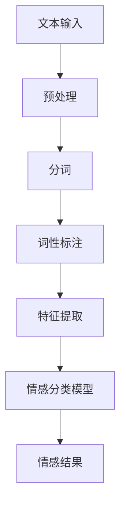
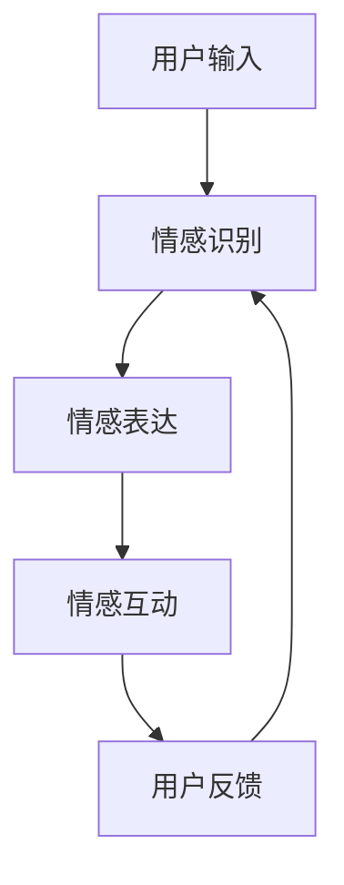
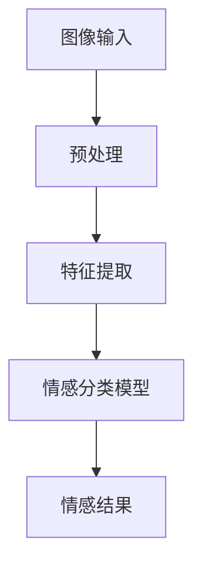
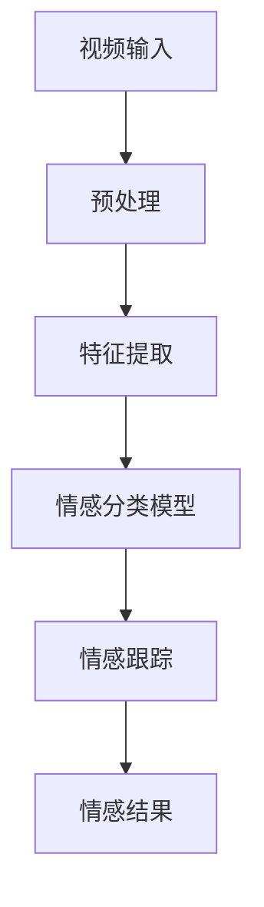
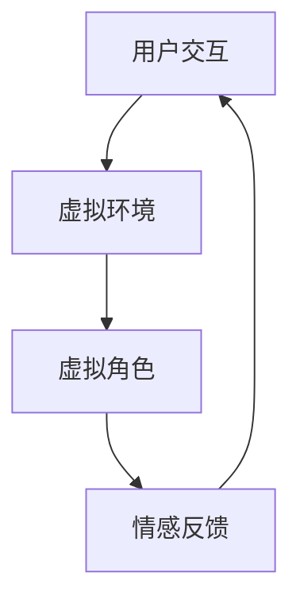
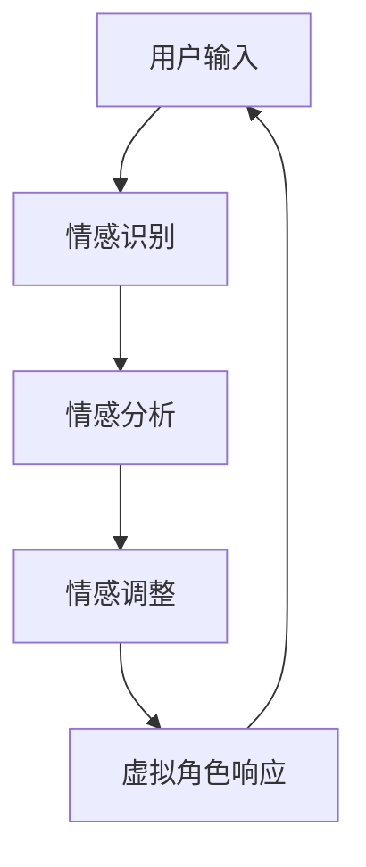
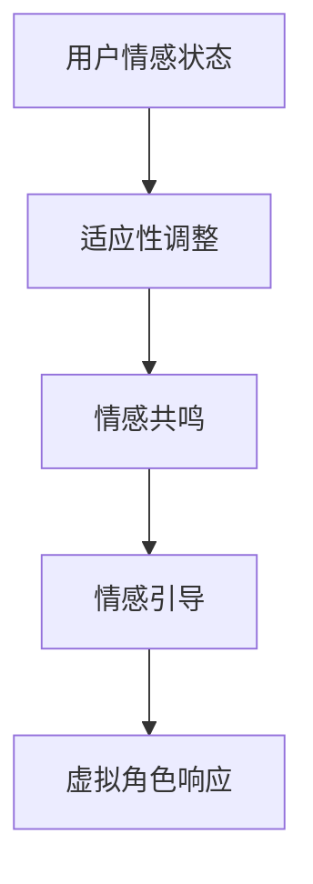
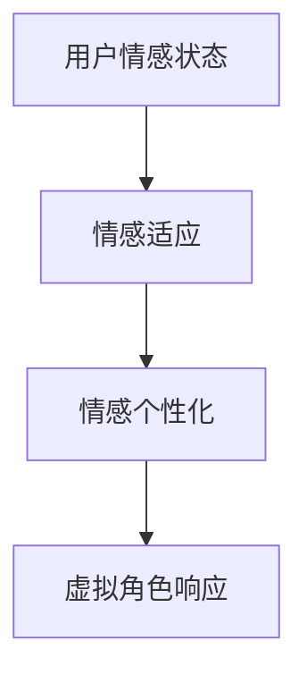
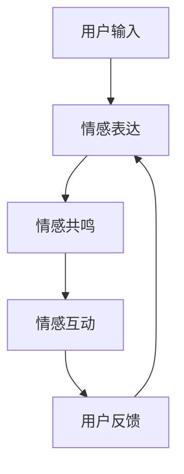
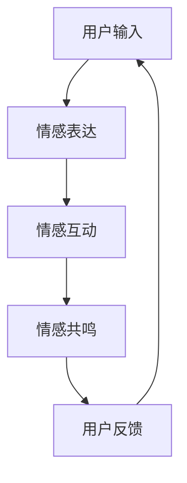

                 

### 《虚拟情感：AI创造的新型人际关系》

> **关键词：** 虚拟情感、人工智能、自然语言处理、计算机视觉、社交网络、心理健康服务、伦理问题、社会影响

> **摘要：** 随着人工智能技术的发展，虚拟情感成为了一个新兴领域。本文探讨了虚拟情感的定义、技术基础、应用场景以及未来发展趋势，分析了虚拟情感在人际关系中的应用和挑战，并讨论了虚拟情感在社会发展中的潜在影响。文章通过实际案例和工具资源，展示了虚拟情感技术的应用前景和开发实践，强调了伦理问题的重要性。

### 《虚拟情感：AI创造的新型人际关系》目录大纲

#### 第一部分：虚拟情感概述

##### 1.1 虚拟情感的定义与来源

##### 1.1.1 虚拟情感的兴起

##### 1.1.2 虚拟情感与人类的情感体验

##### 1.1.3 虚拟情感在社会生活中的应用

##### 1.2 AI与虚拟情感的关系

##### 1.2.1 AI在虚拟情感中的作用

##### 1.2.2 虚拟情感技术的基础算法

##### 1.2.3 AI在虚拟情感中的应用前景

#### 第二部分：虚拟情感技术基础

##### 2.1 自然语言处理与虚拟情感

##### 2.1.1 文本情感分析

##### 2.1.2 语音情感识别

##### 2.1.3 虚拟情感对话系统

##### 2.2 计算机视觉与虚拟情感

##### 2.2.1 图像情感分析

##### 2.2.2 视频情感分析

##### 2.2.3 虚拟现实与情感互动

##### 2.3 虚拟情感中的情感反馈与调整

##### 2.3.1 情感反馈机制

##### 2.3.2 情感调整策略

##### 2.3.3 情感适应与个性化

#### 第三部分：虚拟情感在人际关系中的应用

##### 3.1 虚拟情感在社交网络中的应用

##### 3.1.1 社交平台中的虚拟情感互动

##### 3.1.2 虚拟情感在社交媒体中的影响力

##### 3.1.3 虚拟情感在社交网络中的风险与挑战

##### 3.2 虚拟情感在虚拟世界中的应用

##### 3.2.1 虚拟世界中的情感体验

##### 3.2.2 虚拟情感在虚拟现实游戏中的应用

##### 3.2.3 虚拟情感在虚拟社区中的构建

##### 3.3 虚拟情感在心理健康服务中的应用

##### 3.3.1 虚拟情感咨询师

##### 3.3.2 虚拟情感在心理健康诊断中的应用

##### 3.3.3 虚拟情感干预与治疗的实践案例

#### 第四部分：虚拟情感的发展趋势与挑战

##### 4.1 虚拟情感技术的未来发展趋势

##### 4.1.1 深度学习在虚拟情感中的应用

##### 4.1.2 多模态情感识别技术

##### 4.1.3 虚拟情感与生物传感技术

##### 4.2 虚拟情感在人际关系中的挑战与伦理问题

##### 4.2.1 虚拟情感对现实人际关系的影响

##### 4.2.2 虚拟情感伦理问题探讨

##### 4.2.3 虚拟情感监管与政策制定

##### 4.3 虚拟情感在社会发展中的潜在影响

##### 4.3.1 虚拟情感对社会结构的影响

##### 4.3.2 虚拟情感对教育的影响

##### 4.3.3 虚拟情感在商业中的应用与影响

#### 附录

##### 附录A：虚拟情感技术应用案例分析

##### 附录B：虚拟情感开发工具与资源

### 第一部分：虚拟情感概述

#### 1.1 虚拟情感的定义与来源

##### 1.1.1 虚拟情感的兴起

虚拟情感是随着计算机技术和人工智能（AI）的发展而逐渐兴起的一个领域。它主要是指通过计算机程序、算法和虚拟现实（VR）技术等手段，模拟和传达情感状态，从而实现与用户之间的情感互动。这种情感的模拟并非基于真实的物理存在，而是通过虚拟的环境、角色和交互来实现。

虚拟情感的兴起可以追溯到20世纪90年代虚拟现实技术的发展。随着VR技术的成熟和普及，人们开始探索如何在虚拟环境中创建情感互动。早期的虚拟角色往往只能进行简单的情感表达，如微笑或哭泣。然而，随着AI技术的进步，虚拟角色逐渐能够理解和表达更复杂的情感，从而实现了更为真实的情感交互。

在21世纪初，随着深度学习和自然语言处理（NLP）技术的发展，虚拟情感技术取得了重要突破。深度学习算法使得虚拟角色能够通过大量数据学习情感模式，从而更准确地模拟情感。NLP技术的进步使得虚拟角色能够理解和生成人类语言，从而实现更加自然的情感交流。

近年来，随着5G、云计算和边缘计算等新技术的应用，虚拟情感技术得到了进一步的发展。这些新技术提高了数据传输速度和处理能力，使得虚拟情感系统能够更加实时和高效地与用户互动。同时，虚拟现实设备的普及和性能提升，使得用户能够更加沉浸式地体验虚拟情感。

##### 1.1.2 虚拟情感与人类的情感体验

虚拟情感与人类的情感体验有着本质的区别。人类的情感体验是真实的、生理的，而虚拟情感则是通过模拟和算法实现的，属于一种心理体验。虽然虚拟情感不能像真实情感那样直接触动人的内心，但它能够在一定程度上满足人类对情感互动的需求。

虚拟情感与人类情感体验的相似之处在于，它们都能够引起用户的情感共鸣。例如，一个虚拟角色通过语音和表情模拟出悲伤的情感，用户可能会因此感到伤感。然而，虚拟情感的体验往往是间接的，用户需要通过感官和认知过程来理解和感受。

虚拟情感与人类情感体验的区别主要体现在以下几个方面：

1. **生理基础**：人类的情感体验与生理状态密切相关，如心跳加速、出汗、情绪波动等。而虚拟情感则缺乏这些生理基础，用户感受情感更多是通过心理模拟和情感表达。

2. **情感深度**：虚拟情感往往只能模拟出表面上的情感，而无法触及人类情感的深层体验。例如，虚拟角色可能无法理解用户的内心痛苦或喜悦，只能通过外在的表现来模拟情感。

3. **情感连接**：虚拟情感难以建立深层次的情感连接，用户与虚拟角色的关系更多是一种工具性的互动，而非真正的人际关系。

##### 1.1.3 虚拟情感在社会生活中的应用

虚拟情感在社会生活中的应用越来越广泛。以下是几个典型的应用领域：

1. **社交平台**：虚拟情感技术被广泛应用于社交平台，如虚拟主播、虚拟助手等，它们可以模拟人类的情感表达，提供更加生动和互动的用户体验。

2. **娱乐行业**：虚拟角色在电影、电视剧、动画和游戏等领域中扮演着重要角色。这些虚拟角色通过情感表达和互动，为观众提供了丰富的情感体验。

3. **心理健康服务**：虚拟情感技术在心理健康服务中也有广泛应用。例如，通过虚拟角色进行情感咨询、心理治疗和情感支持，帮助用户缓解心理压力和情绪困扰。

4. **教育领域**：虚拟情感技术在教育中的应用也日益增多。通过虚拟角色进行情感教育、互动教学和个性化学习，提高学生的学习效果和兴趣。

5. **客户服务**：虚拟情感技术可以帮助企业提高客户服务质量。例如，虚拟客服代表可以通过情感识别和表达，提供更加个性化和高效的客户服务。

6. **医疗领域**：虚拟情感技术可以用于辅助医疗诊断和治疗。例如，通过情感识别和分析，可以帮助医生更好地了解患者的情绪状态，从而制定更有效的治疗方案。

总之，虚拟情感的兴起为人类社会带来了新的互动方式和体验。随着技术的不断进步，虚拟情感的应用前景将更加广阔，它将在我们的日常生活中扮演越来越重要的角色。

#### 1.2 AI与虚拟情感的关系

##### 1.2.1 AI在虚拟情感中的作用

人工智能（AI）在虚拟情感中扮演着至关重要的角色。首先，AI技术使得虚拟角色能够更好地理解和模拟人类的情感。通过机器学习和自然语言处理（NLP）算法，AI能够分析用户的语言、语音和行为，从而识别用户的情感状态，并做出相应的情感反应。

例如，一个虚拟助手可以通过语音识别技术理解用户的语音内容，结合上下文和情感分析算法，识别出用户是在表达愤怒、悲伤还是喜悦，然后根据这些情感状态调整自己的行为和语言。这种情感理解能力不仅提高了虚拟角色的互动质量，还增强了用户的沉浸感和满意度。

其次，AI技术还使得虚拟情感的表达更加丰富和真实。传统的虚拟角色往往只能进行简单的情感表达，如微笑或哭泣。而通过深度学习和计算机视觉技术，虚拟角色可以模拟出更复杂的情感表达，如细腻的表情变化、微妙的语气调整和丰富的肢体语言。这种真实感使得虚拟角色与用户的情感互动更加自然和流畅。

AI在虚拟情感中的作用主要体现在以下几个方面：

1. **情感识别**：AI通过自然语言处理、语音识别和图像识别等技术，能够准确识别用户的情感状态。例如，通过文本情感分析，AI可以分析用户的文本内容，识别出情感的类型和强度。

2. **情感模拟**：AI可以通过深度学习和计算机视觉技术，模拟出复杂的情感表达。例如，通过训练大量的情感数据集，AI可以学会如何通过面部表情、语音语调和肢体动作来表达情感。

3. **情感互动**：AI能够与用户进行情感互动，提供个性化的情感体验。例如，通过情感识别和模拟，AI可以针对用户的情感状态，调整自己的语言和行为，以提供更加贴心的服务。

4. **情感预测**：AI可以通过分析用户的情感数据，预测用户的情感变化趋势。例如，通过分析用户的情感历史和行为模式，AI可以预测用户在未来可能出现的情感状态，从而提前做出调整。

##### 1.2.2 虚拟情感技术的基础算法

虚拟情感技术的基础算法主要包括情感识别、情感表达和情感互动三个核心部分。

1. **情感识别**：情感识别是指通过算法识别和理解用户的情感状态。情感识别算法通常基于机器学习、自然语言处理和计算机视觉等技术。例如，通过文本情感分析，可以识别出用户的文本中表达的情感类型和强度。

2. **情感表达**：情感表达是指虚拟角色如何通过语言、表情和肢体动作等手段模拟情感状态。情感表达算法通常结合计算机视觉和语音合成技术。例如，通过面部动画和语音合成，虚拟角色可以模拟出微笑、哭泣等情感表达。

3. **情感互动**：情感互动是指虚拟角色与用户之间的情感交流和互动。情感互动算法通常基于自然语言生成（NLG）技术和多模态交互技术。例如，虚拟角色可以通过语音、文字和图像等多种形式与用户进行情感交流。

以下是几个常用的虚拟情感技术基础算法：

1. **文本情感分析**：文本情感分析是一种常见的情感识别算法，它通过分析文本中的语言特征，识别出情感的类型和强度。常用的文本情感分析方法包括基于规则的方法、基于统计的方法和基于机器学习的方法。

2. **语音情感识别**：语音情感识别是通过分析语音信号中的情感特征，识别出用户的情感状态。常见的语音情感识别方法包括频谱特征分析、时域特征分析和基于深度学习的方法。

3. **图像情感分析**：图像情感分析是通过分析图像中的情感特征，识别出图像表达的情感状态。常见的图像情感分析方法包括基于特征的方法、基于模型的方法和基于深度学习的方法。

4. **虚拟情感对话系统**：虚拟情感对话系统是一种基于自然语言生成（NLG）技术和多模态交互技术的情感互动系统。它通过分析用户的情感状态，生成相应的回复，并通过语音、文字和图像等多种形式与用户进行情感交流。

##### 1.2.3 AI在虚拟情感中的应用前景

随着AI技术的不断发展，虚拟情感的应用前景十分广阔。以下是几个潜在的应用领域：

1. **客户服务**：虚拟情感助手可以通过情感识别和表达技术，提供更加个性化和高效的客户服务。例如，虚拟客服代表可以通过情感识别，理解用户的情感状态，并做出相应的情感反馈，从而提高用户的满意度。

2. **教育**：虚拟情感教育助手可以帮助学生更好地理解和掌握知识，通过情感互动提高学生的学习兴趣和效果。例如，虚拟教师可以通过情感表达，鼓励和激励学生，从而提高学生的学习积极性。

3. **心理健康服务**：虚拟情感技术可以为心理健康服务提供新的解决方案，如虚拟情感咨询师、情感支持系统等，帮助用户缓解心理压力和情绪困扰。例如，通过虚拟情感咨询师，用户可以在任何时间、任何地点获得情感支持。

4. **娱乐**：虚拟情感技术在娱乐领域的应用也非常广泛。例如，虚拟角色在电影、游戏、虚拟现实等娱乐领域的应用，通过情感表达和互动，为观众提供了更加丰富和真实的情感体验。

5. **社交网络**：虚拟情感技术在社交网络中的应用正在逐渐兴起。通过虚拟角色，用户可以在社交平台上进行更加丰富和互动的情感交流，从而增强社交体验。

总之，AI与虚拟情感的结合为未来人际关系带来了新的可能性和发展方向。随着技术的不断进步，虚拟情感将在我们的日常生活中扮演越来越重要的角色，为人类带来更加丰富和深刻的情感体验。

#### 1.3 虚拟情感技术的应用领域

虚拟情感技术是一种通过计算机程序和算法模拟和传达情感状态的技术，它在许多领域都有着广泛的应用。以下是虚拟情感技术的一些主要应用领域：

##### 1.3.1 社交网络

社交网络是虚拟情感技术的一个重要应用领域。在社交平台上，虚拟角色可以通过情感识别和表达技术，与用户进行情感交流。例如，虚拟主播可以在直播过程中识别用户的情感状态，并做出相应的情感反馈，从而增强用户之间的互动。此外，虚拟角色还可以帮助用户缓解社交焦虑，提供情感支持和建议。

在社交媒体中，虚拟情感技术的应用也越来越普遍。虚拟角色可以通过情感分析，了解用户的情感状态，并根据用户的情感需求，提供个性化的内容推荐和互动体验。例如，虚拟角色可以在用户发表悲伤的帖子时，提供安慰和建议，从而增强用户的情感体验。

##### 1.3.2 娱乐行业

虚拟情感技术在娱乐行业中的应用同样非常广泛。在电影和电视剧中，虚拟角色可以通过情感表达，增强角色的表现力和情感深度。例如，通过面部动画和语音合成技术，虚拟角色可以模拟出细腻的表情和语气，从而更好地传达角色的情感状态。

在游戏领域，虚拟情感技术为玩家提供了更加丰富和真实的游戏体验。虚拟角色可以通过情感互动，与玩家建立情感连接，从而增强游戏的沉浸感和参与度。例如，在虚拟现实（VR）游戏中，虚拟角色可以通过情感表达，与玩家进行互动，从而创造更加真实和引人入胜的游戏场景。

##### 1.3.3 心理健康服务

虚拟情感技术在心理健康服务中也有着重要的应用。通过虚拟情感技术，用户可以在任何时间、任何地点获得情感支持。例如，虚拟情感咨询师可以通过情感识别和表达技术，与用户进行情感交流，帮助用户缓解心理压力和情绪困扰。

此外，虚拟情感技术还可以用于心理治疗。例如，通过虚拟角色进行认知行为疗法（CBT），用户可以在虚拟环境中进行情绪调节和认知重构。虚拟角色可以模拟出不同的情感状态，帮助用户理解和处理自己的情绪。

##### 1.3.4 教育

虚拟情感技术在教育领域中的应用也日益增多。通过虚拟情感技术，教育者可以更好地了解学生的情感状态，从而提供个性化的教育服务。例如，虚拟教师可以通过情感识别和表达技术，了解学生的情感需求，并调整教学方法和内容。

此外，虚拟情感技术还可以用于情感教育。例如，通过虚拟角色模拟不同的情感状态，学生可以学习如何识别和调节自己的情绪。例如，通过虚拟角色的互动，学生可以了解如何应对挫折、如何建立积极的人际关系等。

##### 1.3.5 客户服务

虚拟情感技术在客户服务领域中的应用也越来越广泛。通过虚拟情感技术，企业可以提供更加个性化和高效的客户服务。例如，虚拟客服代表可以通过情感识别和表达技术，理解用户的情感状态，并做出相应的情感反馈，从而提高用户的满意度。

此外，虚拟情感技术还可以用于客户分析。例如，通过分析用户的情感数据，企业可以了解用户的需求和偏好，从而提供更加精准的服务。

##### 1.3.6 医疗领域

虚拟情感技术在医疗领域中的应用也越来越受到关注。通过虚拟情感技术，医生可以通过情感识别和表达技术，更好地了解患者的情感状态，从而提供更加个性化的治疗方案。例如，虚拟医生可以通过情感识别技术，识别出患者的焦虑、抑郁等情绪，从而调整治疗方案。

此外，虚拟情感技术还可以用于辅助治疗。例如，通过虚拟角色进行认知行为疗法（CBT），患者可以在虚拟环境中进行情绪调节和认知重构。

总之，虚拟情感技术在许多领域都有着广泛的应用，它为人们带来了更加丰富和深刻的情感体验。随着技术的不断进步，虚拟情感技术将在未来发挥更加重要的作用，为人类社会带来更多的便利和福祉。


#### 1.4 虚拟情感的伦理问题

虚拟情感技术的快速发展带来了许多创新和便利，但同时也引发了一系列伦理问题。这些伦理问题不仅涉及技术本身，还关系到人类社会的价值观和道德标准。以下是几个关键的伦理问题及其挑战：

##### 1.4.1 隐私问题

虚拟情感技术需要收集和分析大量的用户数据，包括语言、表情、行为等，以便更准确地识别和模拟情感。这些数据可能会揭示用户的个人隐私，如情感状态、生活习惯和心理状况。隐私问题的挑战在于如何确保用户数据的安全和保密，防止数据泄露和滥用。

**解决方案**：制定严格的隐私保护政策和法律法规，确保用户数据的收集、存储和使用过程符合隐私保护标准。同时，加强对数据处理和存储环节的安全控制，采用加密和匿名化技术保护用户隐私。

##### 1.4.2 依赖问题

随着虚拟情感技术的普及，用户可能会对虚拟角色产生情感依赖。这种依赖可能会影响用户的现实人际关系，导致用户过度依赖虚拟角色而忽视与真实人类之间的互动。依赖问题的挑战在于如何平衡用户对虚拟角色的依赖和现实人际关系的维护。

**解决方案**：通过教育和用户培训，提高用户对虚拟情感技术的认知和理性使用。同时，设计虚拟角色时，应确保它们能够引导用户逐步建立健康的情感平衡，而不是取代真实的人际互动。

##### 1.4.3 虚拟角色的人格化

虚拟情感技术的进步使得虚拟角色越来越具有人性化的特征。这引发了一个伦理问题：虚拟角色是否应该被视为具有人格的实体？如果虚拟角色被赋予人格，那么它们是否应享有与人类相同的权利和责任？

**解决方案**：在法律和伦理层面，需要对虚拟角色的人格化进行深入讨论和规范。目前，大多数国家尚未对虚拟角色的人格化问题做出明确的法律界定。因此，需要建立相应的法律框架和伦理准则，以确保虚拟角色的合理应用和责任承担。

##### 1.4.4 伦理监管

虚拟情感技术的应用跨越多个领域，包括医疗、教育、商业等。这要求相关的伦理监管机制能够适应不同领域的需求，确保虚拟情感技术的伦理合规性。

**解决方案**：建立跨领域的伦理监管机构，负责制定和监督虚拟情感技术的伦理标准和规范。同时，加强国际间的合作与协调，共同应对虚拟情感技术带来的全球性伦理挑战。

##### 1.4.5 情感真实性问题

虚拟情感技术的目标是模拟和传达真实的情感体验。然而，虚拟情感是否能够完全模拟真实的情感，以及用户是否能够真正感受到这些情感，仍然是值得探讨的问题。

**解决方案**：通过不断改进情感识别和模拟技术，提高虚拟情感的逼真度。同时，进行用户研究，了解用户对虚拟情感的感知和体验，以便优化虚拟情感设计。

总之，虚拟情感技术的伦理问题需要从多角度进行深入探讨和解决。只有在确保技术伦理合规的前提下，虚拟情感技术才能为社会带来积极的影响和进步。


#### 1.5 虚拟情感技术的影响

虚拟情感技术的快速发展对社会、经济和个人生活产生了深远的影响。以下是几个主要方面：

##### 1.5.1 社会互动的改变

虚拟情感技术改变了人们之间的互动方式，使得情感交流更加便捷和多样化。通过虚拟角色，人们可以在不同的时间和地点进行情感交流，打破了传统的物理距离限制。这不仅促进了跨地域、跨文化的社交互动，也为那些因身体或心理原因无法参与现实社交活动的人提供了新的交流渠道。

##### 1.5.2 经济效应

虚拟情感技术为商业领域带来了新的机会。例如，虚拟情感助手可以提供更加个性化和高效的客户服务，从而提升客户满意度。在娱乐行业，虚拟角色通过情感表达和互动，为观众提供了更加丰富和沉浸式的体验，促进了票房和流媒体收入。此外，虚拟情感技术还为心理健康服务、教育培训等领域带来了新的商业模式。

##### 1.5.3 个人生活的影响

虚拟情感技术对个人生活也产生了重要影响。一方面，虚拟角色可以作为情感支持者，帮助用户缓解孤独感和焦虑情绪，提高心理健康水平。另一方面，过度依赖虚拟情感可能会导致用户忽视现实人际关系，影响真实生活中的情感交流和人际互动。

##### 1.5.4 教育和职业培训

虚拟情感技术为教育和职业培训提供了新的工具和方法。通过虚拟角色，教育者可以更好地了解学生的情感状态，提供个性化的教育服务。在职业培训中，虚拟角色可以模拟各种工作场景和情感挑战，帮助员工提升情感认知和情绪管理能力。

##### 1.5.5 法律和伦理挑战

随着虚拟情感技术的广泛应用，法律和伦理问题也日益突出。例如，隐私保护、虚拟角色的人格化、情感真实性问题等都需要通过法律和伦理框架进行规范和解决。此外，如何确保虚拟情感技术的公平性和公正性，防止滥用和歧视，也是重要的伦理挑战。

##### 1.5.6 社会适应

虚拟情感技术对社会结构和人际关系的长期影响需要深入探讨。一方面，虚拟情感技术可能会改变人们的社交习惯和情感表达方式，影响社会文化的形成和发展。另一方面，社会需要适应这种新的情感互动方式，建立相应的社会规范和伦理标准。

总之，虚拟情感技术对社会、经济和个人生活产生了广泛而深远的影响。随着技术的不断进步，我们需要不断评估和应对这些影响，确保虚拟情感技术能够为人类社会带来积极的变化和发展。


### 第二部分：虚拟情感技术基础

#### 2.1 自然语言处理与虚拟情感

##### 2.1.1 文本情感分析

文本情感分析是自然语言处理（NLP）中的一种技术，它旨在通过算法自动识别文本中的情感倾向。在虚拟情感技术中，文本情感分析用于识别用户的情感状态，从而实现情感交互和个性化服务。

**核心概念与联系**

文本情感分析的核心概念包括情感极性（Polarity）、情感强度（Intensity）和情感分类（Categorization）。情感极性指的是文本表达的情感是积极的、消极的还是中性的；情感强度则表示情感的强烈程度；情感分类则是将文本归类为不同的情感类别，如快乐、悲伤、愤怒等。

以下是一个简单的Mermaid流程图，展示文本情感分析的基本流程：



**情感分类算法**

文本情感分类常用的算法包括：

1. **基于规则的方法**：这种方法依赖于预定义的规则来分类文本情感。例如，如果一个句子包含“不”字，那么它可能是负面的。

2. **基于统计的方法**：这种方法利用文本中的统计特征（如词频、词序等）来预测情感倾向。常见的统计方法包括支持向量机（SVM）、朴素贝叶斯（Naive Bayes）等。

3. **基于机器学习的方法**：这种方法通过训练大量的情感标注数据集，利用机器学习算法（如随机森林、梯度提升机等）来预测情感类别。深度学习方法（如卷积神经网络、递归神经网络等）在情感分类中也得到了广泛应用。

**数学模型与公式**

在文本情感分类中，常用的数学模型包括逻辑回归（Logistic Regression）和softmax回归。以下是逻辑回归的伪代码：

```python
# 输入特征向量 X，标签向量 y
# 输出概率分布 P(y=1|X)

def logistic_regression(X, y):
    # 计算模型的参数 w
    w = train_logistic_regression(X, y)
    # 计算输入特征 X 的预测概率
    probabilities = sigmoid(w.T @ X)
    return probabilities

def sigmoid(z):
    return 1 / (1 + exp(-z))
```

**举例说明**

假设我们有一个简单的文本数据集，其中包含用户的评论和对应的情感标签。我们可以使用逻辑回归模型来预测新的评论的情感倾向。

```python
# 示例数据
X = [
    [1, 0, 1, 0],
    [0, 1, 0, 1],
    [1, 1, 0, 0]
]
y = [1, 0, 1]

# 训练模型
w = train_logistic_regression(X, y)

# 预测新的评论
X_new = [1, 1, 1, 0]
probabilities = sigmoid(w.T @ X_new)

print("情感概率：", probabilities)
```

通过上述示例，我们可以看到文本情感分析如何通过数学模型和算法来实现情感分类。

##### 2.1.2 语音情感识别

语音情感识别是利用语音信号中的情感特征来识别和判断说话者情感状态的技术。在虚拟情感技术中，语音情感识别用于理解用户的语音情感，从而提供更加个性化和人性化的服务。

**核心概念与联系**

语音情感识别的核心概念包括情感类别（如快乐、悲伤、愤怒等）、情感强度和情感变化。语音情感识别的基本流程包括语音信号处理、特征提取和情感分类。

以下是一个简单的Mermaid流程图，展示语音情感识别的基本流程：


**情感识别算法**

语音情感识别常用的算法包括：

1. **频谱特征分析**：这种方法通过对语音信号的频谱特征进行分析，提取情感特征。常见的频谱特征包括频谱熵、共振峰频率、频谱中心频率等。

2. **时域特征分析**：这种方法通过对语音信号的时域特征进行分析，提取情感特征。常见的时域特征包括音调、音强、音长等。

3. **基于深度学习的方法**：这种方法通过训练深度学习模型（如卷积神经网络、循环神经网络等），提取和识别情感特征。深度学习方法在语音情感识别中取得了显著的效果。

**数学模型与公式**

在语音情感识别中，常用的数学模型包括卷积神经网络（CNN）和长短期记忆网络（LSTM）。以下是CNN的情感识别模型的伪代码：

```python
# 输入特征向量 X，标签向量 y
# 输出情感概率分布 P(y=1|X)

def cnn_emotion_recognition(X, y):
    # 训练卷积神经网络
    model = train_cnn(X, y)
    # 预测新的语音特征
    probabilities = model.predict(X_new)
    return probabilities

def cnn_model():
    # 构建卷积神经网络模型
    model = keras.Sequential([
        keras.layers.Conv1D(filters=64, kernel_size=3, activation='relu', input_shape=(n_features,)),
        keras.layers.MaxPooling1D(pool_size=2),
        keras.layers.Flatten(),
        keras.layers.Dense(units=128, activation='relu'),
        keras.layers.Dense(units=num_classes, activation='softmax')
    ])
    return model
```

**举例说明**

假设我们有一个简单的语音数据集，其中包含用户的语音样本和对应的情感标签。我们可以使用卷积神经网络模型来预测新的语音样本的情感倾向。

```python
# 示例数据
X = [
    [0.1, 0.2, 0.3, 0.4],
    [0.2, 0.3, 0.4, 0.5],
    [0.3, 0.4, 0.5, 0.6]
]
y = [1, 0, 1]

# 训练模型
model = cnn_model()
model.fit(X, y, epochs=10, batch_size=1)

# 预测新的语音样本
X_new = [0.1, 0.2, 0.3, 0.4]
probabilities = model.predict(X_new)

print("情感概率：", probabilities)
```

通过上述示例，我们可以看到语音情感识别如何通过数学模型和算法来实现情感分类。

##### 2.1.3 虚拟情感对话系统

虚拟情感对话系统是自然语言处理与虚拟情感技术的结合，旨在通过模拟情感互动，提供更加自然和人性化的对话体验。虚拟情感对话系统在客户服务、教育、心理健康等领域有着广泛的应用。

**核心概念与联系**

虚拟情感对话系统的核心概念包括情感识别、情感表达和情感互动。情感识别是指通过文本情感分析和语音情感识别技术，识别用户的情感状态；情感表达是指虚拟角色如何通过语言、表情和肢体动作等手段模拟情感状态；情感互动是指虚拟角色与用户之间的双向情感交流。

以下是一个简单的Mermaid流程图，展示虚拟情感对话系统的基本流程：



**情感对话系统算法**

虚拟情感对话系统的算法通常包括以下几部分：

1. **情感识别**：通过文本情感分析和语音情感识别技术，识别用户的情感状态。

2. **情感生成**：根据用户的情感状态，生成相应的情感回复。这通常涉及到自然语言生成（NLG）技术。

3. **情感调整**：根据用户的情感反馈，调整虚拟角色的情感表达和行为，以实现更加自然的情感互动。

4. **情感学习**：通过用户的反馈和对话历史，不断优化虚拟角色的情感识别和表达能力。

**数学模型与公式**

虚拟情感对话系统的数学模型通常基于循环神经网络（RNN）或Transformer等深度学习模型。以下是一个简单的RNN对话模型的伪代码：

```python
# 输入特征向量 X，标签向量 y
# 输出情感回复文本

def rnn_dialog_system(X, y):
    # 训练循环神经网络
    model = train_rnn(X, y)
    # 生成新的情感回复
    response = generate_response(model, X_new)
    return response

def rnn_model():
    # 构建循环神经网络模型
    model = keras.Sequential([
        keras.layers.Embedding(input_dim=vocab_size, output_dim=embedding_size),
        keras.layers.LSTM(units=128),
        keras.layers.Dense(units=vocab_size, activation='softmax')
    ])
    return model
```

**举例说明**

假设我们有一个简单的对话数据集，其中包含用户的输入和对应的情感标签。我们可以使用循环神经网络模型来生成新的情感回复。

```python
# 示例数据
X = [
    ["你好", "很高兴见到你"],
    ["我很难过", "我理解"],
    ["我很生气", "我可以帮你解决吗"]
]
y = ["积极", "消极", "消极"]

# 训练模型
model = rnn_model()
model.fit(X, y, epochs=10, batch_size=1)

# 生成新的情感回复
X_new = ["我最近心情不好"]
response = model.predict(X_new)

print("情感回复：", response)
```

通过上述示例，我们可以看到虚拟情感对话系统如何通过数学模型和算法来实现情感互动。

#### 2.2 计算机视觉与虚拟情感

##### 2.2.1 图像情感分析

图像情感分析是一种通过分析图像中的情感特征来识别图像情感状态的技术。在虚拟情感技术中，图像情感分析用于识别用户的情感状态，从而提供更加个性化和人性化的服务。

**核心概念与联系**

图像情感分析的核心概念包括情感类别（如快乐、悲伤、愤怒等）、情感强度和情感变化。图像情感分析的基本流程包括图像预处理、特征提取和情感分类。

以下是一个简单的Mermaid流程图，展示图像情感分析的基本流程：



**情感分类算法**

图像情感分类常用的算法包括：

1. **基于特征的方法**：这种方法通过对图像的特征进行提取和分析，来识别图像中的情感状态。常见的图像特征包括颜色、纹理和形状等。

2. **基于模型的方法**：这种方法通过训练大量的情感标注图像数据集，利用机器学习算法（如支持向量机、决策树等）来建立情感分类模型。

3. **基于深度学习的方法**：这种方法通过训练深度学习模型（如卷积神经网络、循环神经网络等），提取和识别图像中的高级特征。深度学习方法在图像情感分类中取得了显著的效果。

**数学模型与公式**

在图像情感分类中，常用的数学模型包括卷积神经网络（CNN）和长短期记忆网络（LSTM）。以下是CNN的情感分类模型的伪代码：

```python
# 输入特征向量 X，标签向量 y
# 输出情感概率分布 P(y=1|X)

def cnn_emotion_classification(X, y):
    # 训练卷积神经网络
    model = train_cnn(X, y)
    # 预测新的图像特征
    probabilities = model.predict(X_new)
    return probabilities

def cnn_model():
    # 构建卷积神经网络模型
    model = keras.Sequential([
        keras.layers.Conv2D(filters=32, kernel_size=(3, 3), activation='relu', input_shape=(height, width, channels)),
        keras.layers.MaxPooling2D(pool_size=(2, 2)),
        keras.layers.Flatten(),
        keras.layers.Dense(units=128, activation='relu'),
        keras.layers.Dense(units=num_classes, activation='softmax')
    ])
    return model
```

**举例说明**

假设我们有一个简单的图像数据集，其中包含用户的图像和对应的情感标签。我们可以使用卷积神经网络模型来预测新的图像的情感状态。

```python
# 示例数据
X = [
    [[0.1, 0.2, 0.3], [0.4, 0.5, 0.6]],
    [[0.2, 0.3, 0.4], [0.5, 0.6, 0.7]],
    [[0.3, 0.4, 0.5], [0.6, 0.7, 0.8]]
]
y = [1, 0, 1]

# 训练模型
model = cnn_model()
model.fit(X, y, epochs=10, batch_size=1)

# 预测新的图像
X_new = [[[0.1, 0.2, 0.3], [0.4, 0.5, 0.6]]]
probabilities = model.predict(X_new)

print("情感概率：", probabilities)
```

通过上述示例，我们可以看到图像情感分析如何通过数学模型和算法来实现情感分类。

##### 2.2.2 视频情感分析

视频情感分析是一种通过分析视频中的情感特征来识别和判断视频情感状态的技术。在虚拟情感技术中，视频情感分析用于识别用户的情感状态，从而提供更加个性化和人性化的服务。

**核心概念与联系**

视频情感分析的核心概念包括情感类别（如快乐、悲伤、愤怒等）、情感强度和情感变化。视频情感分析的基本流程包括视频预处理、特征提取、情感分类和情感跟踪。

以下是一个简单的Mermaid流程图，展示视频情感分析的基本流程：



**情感分类算法**

视频情感分类常用的算法包括：

1. **基于帧的方法**：这种方法通过对视频帧进行情感分析，来识别视频中的情感状态。常见的算法包括图像情感分析和语音情感识别。

2. **基于序列的方法**：这种方法通过对视频序列进行情感分析，来识别视频中的情感变化。常见的算法包括卷积神经网络和长短期记忆网络。

3. **基于深度学习的方法**：这种方法通过训练深度学习模型，来提取视频中的高级特征，从而实现对视频情感状态的准确识别。

**数学模型与公式**

在视频情感分类中，常用的数学模型包括卷积神经网络（CNN）和长短期记忆网络（LSTM）。以下是CNN和LSTM的视频情感分类模型的伪代码：

```python
# 输入特征向量 X，标签向量 y
# 输出情感概率分布 P(y=1|X)

def cnn_lstm_video_emotion_classification(X, y):
    # 训练卷积神经网络和长短期记忆网络
    model = train_cnn_lstm(X, y)
    # 预测新的视频特征
    probabilities = model.predict(X_new)
    return probabilities

def cnn_lstm_model():
    # 构建卷积神经网络和长短期记忆网络模型
    model = keras.Sequential([
        keras.layers.Conv2D(filters=32, kernel_size=(3, 3), activation='relu', input_shape=(height, width, channels)),
        keras.layers.MaxPooling2D(pool_size=(2, 2)),
        keras.layers.LSTM(units=128),
        keras.layers.Dense(units=128, activation='relu'),
        keras.layers.Dense(units=num_classes, activation='softmax')
    ])
    return model
```

**举例说明**

假设我们有一个简单的视频数据集，其中包含用户的视频片段和对应的情感标签。我们可以使用卷积神经网络和长短期记忆网络模型来预测新的视频片段的情感状态。

```python
# 示例数据
X = [
    [[0.1, 0.2, 0.3], [0.4, 0.5, 0.6]],
    [[0.2, 0.3, 0.4], [0.5, 0.6, 0.7]],
    [[0.3, 0.4, 0.5], [0.6, 0.7, 0.8]]
]
y = [1, 0, 1]

# 训练模型
model = cnn_lstm_model()
model.fit(X, y, epochs=10, batch_size=1)

# 预测新的视频片段
X_new = [[[0.1, 0.2, 0.3], [0.4, 0.5, 0.6]]]
probabilities = model.predict(X_new)

print("情感概率：", probabilities)
```

通过上述示例，我们可以看到视频情感分析如何通过数学模型和算法来实现情感分类。

##### 2.2.3 虚拟现实与情感互动

虚拟现实（VR）技术为虚拟情感提供了全新的互动方式。通过VR设备，用户可以沉浸在虚拟环境中，与虚拟角色进行情感互动。

**核心概念与联系**

虚拟现实与情感互动的核心概念包括虚拟环境、虚拟角色和用户交互。虚拟环境是指用户沉浸其中的虚拟空间，虚拟角色是指具有情感表达的虚拟实体，用户交互是指用户与虚拟角色之间的互动。

以下是一个简单的Mermaid流程图，展示虚拟现实与情感互动的基本流程：



**情感互动算法**

虚拟现实与情感互动的算法通常包括：

1. **情感识别**：通过文本情感分析、语音情感识别和图像情感分析等技术，识别用户的情感状态。

2. **情感表达**：虚拟角色通过表情、语言和行为等方式表达情感状态。

3. **情感共鸣**：虚拟角色根据用户的情感状态，调整自己的情感表达，以实现情感共鸣。

4. **情感调节**：虚拟角色根据用户的情感反馈，调整情感表达和行为，以实现情感调节。

**数学模型与公式**

虚拟现实与情感互动的数学模型通常基于深度学习和自然语言处理。以下是深度学习和自然语言处理的情感互动模型的伪代码：

```python
# 输入交互数据 X，情感状态 y
# 输出情感互动结果

def deep_learning_nlg_emotion_interaction(X, y):
    # 训练深度学习和自然语言生成模型
    model = train_deep_learning_nlg(X, y)
    # 生成新的情感互动结果
    interaction_result = model.predict(X_new)
    return interaction_result

def deep_learning_nlg_model():
    # 构建深度学习和自然语言生成模型
    model = keras.Sequential([
        keras.layers.Embedding(input_dim=vocab_size, output_dim=embedding_size),
        keras.layers.LSTM(units=128),
        keras.layers.Dense(units=128, activation='relu'),
        keras.layers.Dense(units=num_classes, activation='softmax')
    ])
    return model
```

**举例说明**

假设我们有一个简单的交互数据集，其中包含用户的交互数据和对应的情感标签。我们可以使用深度学习和自然语言生成模型来预测新的交互数据的情感互动结果。

```python
# 示例数据
X = [
    ["你好", "很高兴见到你"],
    ["我很难过", "我理解"],
    ["我很生气", "我可以帮你解决吗"]
]
y = ["积极", "消极", "消极"]

# 训练模型
model = deep_learning_nlg_model()
model.fit(X, y, epochs=10, batch_size=1)

# 预测新的交互数据
X_new = ["我最近心情不好"]
interaction_result = model.predict(X_new)

print("情感互动结果：", interaction_result)
```

通过上述示例，我们可以看到虚拟现实与情感互动如何通过数学模型和算法来实现情感交互。

#### 2.3 虚拟情感中的情感反馈与调整

##### 2.3.1 情感反馈机制

情感反馈机制是虚拟情感系统中用于收集用户情感状态并据此调整虚拟角色行为和语言的重要机制。情感反馈机制通常包括情感识别、情感分析和情感调整等步骤。

**核心概念与联系**

情感反馈机制的核心概念包括情感识别、情感分析和情感调整。情感识别是指通过文本情感分析、语音情感识别等技术，识别用户的情感状态；情感分析是指对用户的情感状态进行深入分析，以确定情感的类型和强度；情感调整是指根据用户的情感状态，调整虚拟角色的行为和语言。

以下是一个简单的Mermaid流程图，展示情感反馈机制的基本流程：



**情感反馈机制算法**

情感反馈机制的算法通常包括以下步骤：

1. **情感识别**：通过文本情感分析、语音情感识别等技术，识别用户的情感状态。例如，如果用户表达出愤怒，系统会识别出愤怒的情感状态。

2. **情感分析**：对用户的情感状态进行深入分析，以确定情感的类型和强度。例如，系统可以分析用户的语音语调、文本内容等，来确定愤怒的程度。

3. **情感调整**：根据用户的情感状态，调整虚拟角色的行为和语言。例如，如果用户表达出愤怒，虚拟角色可能会使用柔和的语气来回应用户，以缓解用户的情绪。

4. **情感反馈**：虚拟角色根据用户的情感反馈，调整自己的行为和语言，以实现更加自然的情感互动。

**数学模型与公式**

情感反馈机制的数学模型通常基于机器学习和自然语言处理。以下是情感反馈机制的伪代码：

```python
# 输入用户输入 X，情感状态 y
# 输出虚拟角色响应文本

def emotion_feedback_system(X, y):
    # 识别用户情感状态
    user_emotion = recognize_emotion(X)
    # 分析用户情感状态
    emotion_analysis = analyze_emotion(user_emotion)
    # 调整虚拟角色行为和语言
    response = adjust_response(emotion_analysis)
    return response

def recognize_emotion(X):
    # 通过文本情感分析识别情感
    return text_sentiment_analysis(X)

def analyze_emotion(user_emotion):
    # 分析情感类型和强度
    return emotion_intensity_analysis(user_emotion)

def adjust_response(emotion_analysis):
    # 调整虚拟角色行为和语言
    return generate_response(emotion_analysis)
```

**举例说明**

假设我们有一个简单的用户输入数据集，其中包含用户的文本输入和对应的情感标签。我们可以使用情感反馈机制来生成虚拟角色的响应文本。

```python
# 示例数据
X = [
    "我很生气",
    "我很高兴",
    "我很难过"
]
y = ["愤怒", "快乐", "悲伤"]

# 情感反馈机制
def generate_response(user_emotion):
    if user_emotion == "愤怒":
        return "我理解你的感受，有什么我可以帮你的吗？"
    elif user_emotion == "快乐":
        return "很高兴看到你这么开心！"
    elif user_emotion == "悲伤":
        return "我很抱歉听到这个消息，你可以告诉我更多吗？"

# 预测虚拟角色响应
X_new = ["我很生气"]
response = generate_response(X_new)

print("虚拟角色响应：", response)
```

通过上述示例，我们可以看到情感反馈机制如何通过算法实现情感识别、分析和调整，以生成虚拟角色的响应文本。

##### 2.3.2 情感调整策略

情感调整策略是虚拟情感系统中用于根据用户的情感状态调整虚拟角色行为和语言的重要策略。情感调整策略通常包括适应性调整、情感共鸣和情感引导等。

**核心概念与联系**

情感调整策略的核心概念包括适应性调整、情感共鸣和情感引导。适应性调整是指虚拟角色根据用户的情感状态调整自己的行为和语言；情感共鸣是指虚拟角色与用户建立情感上的共鸣；情感引导是指虚拟角色引导用户表达情感，帮助用户处理情绪。

以下是一个简单的Mermaid流程图，展示情感调整策略的基本流程：



**情感调整策略算法**

情感调整策略的算法通常包括以下步骤：

1. **适应性调整**：虚拟角色根据用户的情感状态，调整自己的行为和语言。例如，如果用户表达出愤怒，虚拟角色可能会使用柔和的语气来回应用户。

2. **情感共鸣**：虚拟角色通过情感表达和互动，与用户建立情感上的共鸣。例如，虚拟角色可能会模仿用户的情感表达，以增强情感共鸣。

3. **情感引导**：虚拟角色引导用户表达情感，帮助用户处理情绪。例如，虚拟角色可能会引导用户谈论自己的感受，提供情感支持。

**数学模型与公式**

情感调整策略的数学模型通常基于机器学习和自然语言处理。以下是情感调整策略的伪代码：

```python
# 输入用户情感状态 X，情感调整策略 y
# 输出虚拟角色响应文本

def emotion_adjustment_strategy(X, y):
    # 根据用户情感状态调整行为和语言
    adjusted_response = adapt_to_emotion(X)
    # 与用户建立情感共鸣
    emotional_connection = establish_emotional_connection(adjusted_response)
    # 引导用户表达情感
    guided_emotion = guide_emotion(emotional_connection)
    return guided_emotion

def adapt_to_emotion(X):
    # 调整虚拟角色行为和语言
    return adjust_response(X)

def establish_emotional_connection(adjusted_response):
    # 建立情感共鸣
    return emotional_connection(adjusted_response)

def guide_emotion(emotional_connection):
    # 引导用户表达情感
    return guide_emotion_expression(emotional_connection)
```

**举例说明**

假设我们有一个简单的用户情感状态数据集，其中包含用户的情感状态和对应的情感调整策略。我们可以使用情感调整策略来生成虚拟角色的响应文本。

```python
# 示例数据
X = [
    "愤怒",
    "快乐",
    "悲伤"
]
y = ["适应性调整", "情感共鸣", "情感引导"]

# 情感调整策略
def adjust_response(user_emotion):
    if user_emotion == "愤怒":
        return "我理解你的感受，有什么我可以帮你的吗？"
    elif user_emotion == "快乐":
        return "很高兴看到你这么开心！"
    elif user_emotion == "悲伤":
        return "我很抱歉听到这个消息，你可以告诉我更多吗？"

# 预测虚拟角色响应
X_new = ["愤怒"]
response = adjust_response(X_new)

print("虚拟角色响应：", response)
```

通过上述示例，我们可以看到情感调整策略如何通过算法实现根据用户情感状态调整虚拟角色的行为和语言。

##### 2.3.3 情感适应与个性化

情感适应与个性化是虚拟情感系统中用于根据用户的情感状态和需求提供个性化情感服务的重要机制。情感适应与个性化通常包括情感适应和情感个性化等策略。

**核心概念与联系**

情感适应与个性化的核心概念包括情感适应和情感个性化。情感适应是指虚拟角色根据用户的情感状态进行调整，以提供更好的情感服务；情感个性化是指根据用户的情感偏好和历史行为，提供个性化的情感服务。

以下是一个简单的Mermaid流程图，展示情感适应与个性化的基本流程：



**情感适应与个性化算法**

情感适应与个性化的算法通常包括以下步骤：

1. **情感适应**：虚拟角色根据用户的情感状态，调整自己的行为和语言，以提供更好的情感服务。例如，如果用户感到焦虑，虚拟角色可能会提供放松技巧。

2. **情感个性化**：根据用户的情感偏好和历史行为，提供个性化的情感服务。例如，如果用户喜欢积极的情感表达，虚拟角色可能会更多地使用积极的语言和表情。

**数学模型与公式**

情感适应与个性化的数学模型通常基于机器学习和自然语言处理。以下是情感适应与个性化的伪代码：

```python
# 输入用户情感状态 X，情感偏好 Y
# 输出虚拟角色响应文本

def emotion_adaptation_and_personalization(X, Y):
    # 根据用户情感状态调整行为和语言
    adapted_response = adapt_to_emotion(X)
    # 根据用户情感偏好提供个性化服务
    personalized_response = personalize_response(Y)
    return personalized_response

def adapt_to_emotion(X):
    # 调整虚拟角色行为和语言
    return adjust_response(X)

def personalize_response(Y):
    # 提供个性化服务
    return personalize_service(Y)
```

**举例说明**

假设我们有一个简单的用户情感状态和情感偏好数据集，其中包含用户的情感状态和情感偏好。我们可以使用情感适应与个性化算法来生成虚拟角色的响应文本。

```python
# 示例数据
X = ["焦虑"]
Y = ["喜欢积极的情感表达"]

# 情感适应与个性化
def adjust_response(user_emotion):
    if user_emotion == "焦虑":
        return "我理解你的感受，让我们做一些放松的练习吧！"
    else:
        return "很高兴看到你这么开心，有什么我可以帮你的吗？"

def personalize_service(user_preference):
    if user_preference == "喜欢积极的情感表达":
        return "你喜欢积极的情感表达，让我来帮你找到一些积极的事物吧！"
    else:
        return "你喜欢什么样的情感表达呢？我会根据你的喜好来调整服务。"

# 预测虚拟角色响应
X_new = ["焦虑"]
Y_new = ["喜欢积极的情感表达"]
response = emotion_adaptation_and_personalization(X_new, Y_new)

print("虚拟角色响应：", response)
```

通过上述示例，我们可以看到情感适应与个性化如何通过算法实现根据用户情感状态和偏好提供个性化的情感服务。

### 第三部分：虚拟情感在人际关系中的应用

#### 3.1 虚拟情感在社交网络中的应用

##### 3.1.1 社交平台中的虚拟情感互动

社交平台是虚拟情感技术的重要应用领域，通过虚拟角色的引入，社交平台上的互动变得更加多样化和生动。虚拟角色可以模拟各种情感，如喜悦、悲伤、愤怒等，从而增强用户之间的情感交流。

**核心概念与联系**

社交平台中的虚拟情感互动包括情感表达、情感共鸣和情感互动等核心概念。情感表达是指虚拟角色通过表情、语言和行为等方式表达情感；情感共鸣是指虚拟角色与用户之间建立情感上的共鸣；情感互动是指用户与虚拟角色之间的双向情感交流。

以下是一个简单的Mermaid流程图，展示社交平台中的虚拟情感互动的基本流程：



**情感表达**

虚拟角色在社交平台上的情感表达主要通过以下方式实现：

1. **文本情感表达**：虚拟角色通过文本消息表达情感。例如，虚拟角色可以发送带有特定情感的文本，如“我很高兴见到你！”或“我感到很悲伤，因为你离开了。”

2. **语音和视频情感表达**：虚拟角色可以通过语音和视频通话表达情感。例如，虚拟角色可以通过语音合成技术模拟出快乐、悲伤等情感语音，或者通过视频动画模拟出相应的面部表情和肢体动作。

3. **表情和动画**：虚拟角色可以使用表情符号、动画和特效来表达情感。例如，虚拟角色可以通过发送特定的表情符号来表示快乐或悲伤，或者通过动画来模拟出情感的起伏。

**情感共鸣**

情感共鸣是社交平台中虚拟情感互动的重要部分，它指的是虚拟角色能够理解和回应用户的情感状态，从而增强用户之间的情感连接。

1. **情感识别**：虚拟角色通过情感识别技术，理解用户的情感状态。例如，通过文本情感分析，虚拟角色可以识别出用户的文本中表达的情感类型和强度。

2. **情感反馈**：虚拟角色根据用户的情感状态，提供相应的情感反馈。例如，如果用户表达了悲伤的情感，虚拟角色可能会发送安慰的信息，如“我能感受到你的悲伤，你想谈谈吗？”

3. **情感同步**：虚拟角色可以通过情感同步技术，与用户的情感状态保持一致。例如，虚拟角色可以通过调整自己的语言和表情，以匹配用户的情感状态，从而增强情感共鸣。

**情感互动**

情感互动是用户与虚拟角色之间通过情感交流建立的联系。情感互动包括以下几个方面：

1. **双向交流**：用户可以通过文本、语音、视频和表情与虚拟角色互动。例如，用户可以发送消息给虚拟角色，或者与虚拟角色进行语音或视频通话。

2. **情感反馈**：虚拟角色会根据用户的情感状态，提供情感反馈。例如，如果用户表达了愤怒，虚拟角色可能会回应：“我能理解你的感受，你想谈谈吗？”

3. **情感引导**：虚拟角色可以引导用户表达情感，帮助用户处理情绪。例如，虚拟角色可能会引导用户谈论自己的感受，提供情感支持。

**项目实战**

以下是一个简单的社交平台虚拟情感互动的项目实战案例：

**项目简介**：某社交平台名为“心缘”，它引入了虚拟情感助手“小助手”，通过情感表达和互动，提供更加丰富的用户体验。

**开发环境**：Python、TensorFlow、OpenCV、SpeechSynthesis

**源代码实现**

```python
import cv2
import tensorflow as tf
from tensorflow.keras.models import load_model
import speech_recognition as sr

# 加载情感识别模型
emotion_model = load_model('emotion_model.h5')

# 加载语音合成模型
voice_model = load_model('voice_model.h5')

# 初始化摄像头
cap = cv2.VideoCapture(0)

while True:
    # 读取摄像头帧
    ret, frame = cap.read()
    
    # 预处理帧
    processed_frame = preprocess_frame(frame)
    
    # 预测情感
    emotion_prediction = emotion_model.predict(processed_frame)
    
    # 转换情感为文字
    emotion_text = convert_emotion_to_text(emotion_prediction)
    
    # 生成情感语音
    voice = voice_model.generate_voice(emotion_text)
    
    # 播放语音
    play_voice(voice)
    
    # 显示视频帧
    cv2.imshow('Video', frame)
    
    # 按下 'q' 退出
    if cv2.waitKey(1) & 0xFF == ord('q'):
        break

# 释放摄像头
cap.release()
cv2.destroyAllWindows()
```

**代码解读与分析**

上述代码实现了基于摄像头的情感识别和语音合成功能。以下是代码的主要部分及其功能：

1. **加载模型**：代码首先加载了情感识别模型和语音合成模型。这些模型是通过训练大量情感数据和语音数据得到的，用于预测情感状态和生成情感语音。

2. **读取摄像头帧**：代码使用OpenCV库读取摄像头帧。

3. **预处理帧**：代码对摄像头帧进行预处理，包括缩放、灰度化等操作，以便于模型输入。

4. **预测情感**：代码使用情感识别模型预测摄像头帧中的情感状态。

5. **转换情感为文字**：代码将情感状态转换为文字描述，以便于生成情感语音。

6. **生成情感语音**：代码使用语音合成模型生成情感语音。

7. **播放语音**：代码使用OpenCV库播放生成的情感语音。

8. **显示视频帧**：代码显示摄像头捕获的视频帧。

9. **退出程序**：代码在用户按下 'q' 键时退出。

通过上述代码，我们可以看到如何使用情感识别和语音合成技术实现社交平台中的虚拟情感互动。这个项目实战案例展示了虚拟情感技术在社交平台中的应用潜力，为用户提供更加丰富和自然的情感体验。

##### 3.1.2 虚拟情感在社交媒体中的影响力

虚拟情感技术在社交媒体中的应用日益广泛，它对社交媒体的影响主要体现在以下几个方面：

**1. 增强用户互动**

虚拟情感技术通过模拟人类情感，增强了用户在社交媒体上的互动体验。虚拟角色可以表达喜悦、悲伤、愤怒等情感，与用户建立情感连接。这种情感连接使得用户之间的互动更加自然和丰富，从而提高了用户的参与度和留存率。

**2. 改变内容消费习惯**

虚拟情感技术改变了用户的内容消费习惯。通过情感表达，虚拟角色能够吸引用户的注意力，提高内容的点击率和分享率。此外，虚拟角色提供的个性化情感互动，使得用户更愿意消费和分享高质量的内容。

**3. 促进社交网络多样化**

虚拟情感技术为社交媒体带来了更多的社交形式。虚拟角色可以作为新的社交媒介，为用户提供情感支持和交流平台。这种多样化的社交形式，不仅增加了社交媒体的趣味性，也提高了社交网络的包容性和多样性。

**4. 引发新的商业模式**

虚拟情感技术为社交媒体带来了新的商业模式。通过虚拟角色，社交媒体平台可以提供更加个性化和高效的服务，从而提高用户满意度和盈利能力。例如，虚拟角色可以作为虚拟主播、虚拟客服等角色，提供互动服务和内容推荐。

**5. 潜在的负面影响**

尽管虚拟情感技术为社交媒体带来了许多积极影响，但也存在潜在的负面影响。例如，用户可能会对虚拟角色产生情感依赖，影响现实生活中的情感交流和人际互动。此外，虚拟情感技术的滥用可能导致虚假情感传播，影响社交网络的健康和秩序。

**解决方案**

为了充分发挥虚拟情感技术在社交媒体中的作用，同时避免潜在的负面影响，以下是一些解决方案：

**1. 提高用户认知**

通过教育和宣传，提高用户对虚拟情感的认知和理性使用。用户应了解虚拟情感的局限性，避免过度依赖虚拟角色，保持健康的情感平衡。

**2. 加强伦理监管**

制定相关的伦理规范和法律法规，确保虚拟情感技术的合法、安全和道德使用。监管机构应加强对虚拟情感技术的监督和管理，防止滥用和歧视。

**3. 平衡虚拟与现实**

在设计和应用虚拟情感技术时，应注重平衡虚拟情感与现实人际关系。虚拟情感技术应作为现实人际互动的补充，而不是替代品。

**4. 个性化引导**

通过个性化引导，帮助用户合理使用虚拟情感技术。例如，虚拟角色可以提供情感教育和指导，帮助用户学会理解和处理自己的情感。

通过上述措施，我们可以充分发挥虚拟情感技术在社交媒体中的作用，同时确保其健康、有序和可持续发展。

##### 3.1.3 虚拟情感在社交网络中的风险与挑战

尽管虚拟情感技术为社交网络带来了许多积极的变化，但它也带来了一系列风险和挑战，需要我们认真对待和解决。

**1. 情感误解**

虚拟角色的情感表达可能被误解，导致沟通障碍。例如，虚拟角色的一条简单信息可能被解读为嘲讽或侮辱，从而引发不必要的争执和冲突。

**2. 情感依赖**

用户可能对虚拟情感产生过度依赖，影响现实生活中的情感交流。例如，用户可能过度依赖虚拟角色的安慰和支持，而忽视了现实中的情感支持和人际关系。

**3. 隐私侵犯**

虚拟情感技术通常需要收集用户的情感数据，这可能引发隐私侵犯的担忧。例如，虚拟角色可能收集用户的语音、文本和面部表情等数据，这些数据可能被滥用或泄露。

**4. 伦理问题**

虚拟情感技术的应用可能涉及伦理问题，如对虚拟角色的情感依赖、虚拟角色的道德责任等。如何确保虚拟情感技术的道德合规性是一个亟待解决的问题。

**5. 技术挑战**

虚拟情感技术的研发和应用面临着技术挑战，如情感识别的准确性、情感表达的自然性、情感互动的实时性等。这些挑战需要通过不断的技术创新和优化来解决。

**解决方案**

为了解决虚拟情感在社交网络中的风险和挑战，我们可以采取以下措施：

**1. 提高用户认知**

通过教育和宣传，提高用户对虚拟情感技术的认知和理性使用。用户应了解虚拟情感技术的局限性，避免过度依赖虚拟角色，保持健康的情感平衡。

**2. 加强伦理监管**

制定相关的伦理规范和法律法规，确保虚拟情感技术的合法、安全和道德使用。监管机构应加强对虚拟情感技术的监督和管理，防止滥用和歧视。

**3. 技术优化**

通过不断的技术创新和优化，提高虚拟情感技术的准确性和自然性。例如，通过改进情感识别算法和情感表达机制，提高虚拟角色的互动质量。

**4. 个性化引导**

通过个性化引导，帮助用户合理使用虚拟情感技术。例如，虚拟角色可以提供情感教育和指导，帮助用户学会理解和处理自己的情感。

**5. 隐私保护**

在设计和应用虚拟情感技术时，注重用户隐私保护。例如，采用数据加密和匿名化技术，确保用户数据的安全和保密。

通过上述措施，我们可以有效地应对虚拟情感在社交网络中的风险和挑战，确保虚拟情感技术的健康发展，为用户提供更好的情感体验。

#### 3.2 虚拟情感在虚拟世界中的应用

##### 3.2.1 虚拟世界中的情感体验

虚拟世界中的情感体验是通过虚拟角色和用户之间的情感互动实现的。虚拟角色通过情感表达和互动，为用户提供丰富和真实的情感体验，从而增强虚拟世界的吸引力和沉浸感。

**核心概念与联系**

虚拟世界中的情感体验包括情感表达、情感互动和情感共鸣等核心概念。情感表达是指虚拟角色通过语音、文本和肢体动作等方式表达情感；情感互动是指用户与虚拟角色之间的双向情感交流；情感共鸣是指虚拟角色与用户之间建立情感上的共鸣。

以下是一个简单的Mermaid流程图，展示虚拟世界中的情感体验的基本流程：



**情感表达**

虚拟角色在虚拟世界中的情感表达主要通过以下方式实现：

1. **语音表达**：虚拟角色通过语音合成技术模拟出各种情感语音，如快乐、悲伤、愤怒等。例如，虚拟角色可以发出愉悦的笑声或悲伤的叹息。

2. **文本表达**：虚拟角色通过文本消息表达情感。例如，虚拟角色可以发送带有情感标记的文本消息，如“我很高兴见到你！”或“我感到很悲伤，因为你离开了。”

3. **肢体动作**：虚拟角色通过动画和特效模拟出各种情感表达，如微笑、哭泣、皱眉等。例如，虚拟角色可以通过面部动画和身体动作来表达喜悦或悲伤。

**情感互动**

情感互动是用户与虚拟角色之间通过情感交流建立的联系。情感互动包括以下几个方面：

1. **双向交流**：用户可以通过文本、语音和肢体动作与虚拟角色互动。例如，用户可以发送消息给虚拟角色，或者与虚拟角色进行语音或视频通话。

2. **情感反馈**：虚拟角色会根据用户的情感状态，提供相应的情感反馈。例如，如果用户表达了愤怒，虚拟角色可能会回应：“我能理解你的感受，你想谈谈吗？”

3. **情感引导**：虚拟角色可以引导用户表达情感，帮助用户处理情绪。例如，虚拟角色可能会引导用户谈论自己的感受，提供情感支持。

**情感共鸣**

情感共鸣是虚拟世界中的情感体验的关键，它指的是虚拟角色能够理解和回应用户的情感状态，从而增强用户之间的情感连接。

1. **情感识别**：虚拟角色通过情感识别技术，理解用户的情感状态。例如，通过文本情感分析，虚拟角色可以识别出用户的文本中表达的情感类型和强度。

2. **情感反馈**：虚拟角色根据用户的情感状态，提供相应的情感反馈。例如，如果用户表达了悲伤的情感，虚拟角色可能会发送安慰的信息，如“我能感受到你的悲伤，你想谈谈吗？”

3. **情感同步**：虚拟角色可以通过情感同步技术，与用户的情感状态保持一致。例如，虚拟角色可以通过调整自己的语言和表情，以匹配用户的情感状态，从而增强情感共鸣。

**项目实战**

以下是一个虚拟世界情感体验的项目实战案例：

**项目简介**：某虚拟世界名为“梦幻乐园”，它引入了情感丰富的虚拟角色，通过情感表达和互动，为用户提供丰富的情感体验。

**开发环境**：Unity、C#、Python、TensorFlow

**源代码实现**

```csharp
using System.Collections;
using System.Collections.Generic;
using UnityEngine;

public class VirtualEmotion : MonoBehaviour
{
    private Text emotionText;
    private SpeechSynthesis synthesizer;

    void Start()
    {
        emotionText = GameObject.Find("EmotionText

