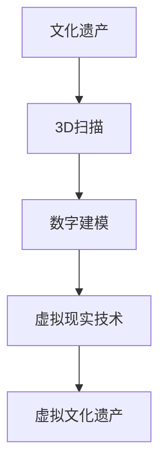

                 

### 虚拟文化遗产保护：全球文明记忆的数字化保存

> **关键词**：虚拟文化遗产，数字化保存，3D扫描，虚拟现实，数字遗产，文化传承，国际合作

> **摘要**：本文旨在探讨虚拟文化遗产保护的重要性和数字化保存的必要性。通过分析数字化保护技术基础，展示虚拟文化遗产的数字化保存流程，介绍虚拟文化遗产的展示与应用，分析虚拟文化遗产保护项目实例，探讨虚拟文化遗产保护的法律与伦理问题，深入讨论3D扫描与建模技术，以及数字化遗产资源的存储与管理，我们希望能够为虚拟文化遗产保护提供一些新的思路和方法。同时，本文还展望了虚拟文化遗产保护的未来发展趋势，探讨了国际合作与政策支持的重要性，以及虚拟文化遗产保护教育与文化传承的意义。希望本文能够为相关领域的研究者和从业人员提供参考。

---

在全球化迅速发展的今天，文化遗产的保护与传承面临前所未有的挑战。自然灾害、战争、人为破坏等因素不断威胁着这些珍贵的文明遗产。为了应对这些挑战，虚拟文化遗产保护作为一种新兴的数字化保存手段，逐渐受到全球关注。虚拟文化遗产保护不仅能够有效地保存文化遗产，还可以通过数字化技术实现文化遗产的传承和推广。

虚拟文化遗产保护的核心在于将现实世界的文化遗产通过数字化技术转化为虚拟形式，使其在不受时间和空间限制的情况下得以长久保存。数字化保护技术包括3D扫描、数字建模、虚拟现实等，这些技术能够精确地捕捉文化遗产的形态和细节，实现文化遗产的数字化保存和再现。此外，虚拟文化遗产的展示与应用也在不断拓展，从线上平台到实体展览，再到教育培训，虚拟文化遗产的应用场景越来越广泛。

本文将分以下几个部分进行探讨：

1. **虚拟文化遗产保护概述**：介绍虚拟文化遗产的概念、意义以及全球分布与现状。
2. **数字化保护技术基础**：分析3D扫描与建模技术的原理和应用，以及增强现实与虚拟现实技术在虚拟文化遗产保护中的应用。
3. **虚拟文化遗产数字化保存**：详细阐述数字化保存流程、数据处理与优化以及数据安全与隐私保护。
4. **虚拟文化遗产展示与应用**：探讨虚拟文化遗产的展示形式、应用场景以及未来发展趋势。
5. **虚拟文化遗产保护项目实例分析**：分析具体项目实例，展示虚拟文化遗产保护的实施过程、技术方案和成果。
6. **虚拟文化遗产保护的法律与伦理问题**：讨论虚拟文化遗产保护涉及的法律法规与伦理问题，以及国际合作与协调的重要性。
7. **数字化保存技术深入探讨**：深入讨论3D扫描与建模技术的原理与应用，数字文化遗产的存储与管理，以及虚拟文化遗产的交互体验设计。
8. **虚拟文化遗产保护的未来展望**：展望虚拟文化遗产保护的新技术趋势，国际合作与政策支持的重要性，以及虚拟文化遗产保护教育与文化传承的意义。
9. **附录**：介绍虚拟文化遗产保护工具与资源，虚拟文化遗产保护相关法规与标准，以及虚拟文化遗产保护案例集锦。

接下来，我们将逐一深入探讨每个部分，希望能够为虚拟文化遗产保护提供一些有益的思路和方法。

---

### 第一部分：虚拟文化遗产保护概述

#### 第1章：虚拟文化遗产的概念与意义

#### 1.1.1 虚拟文化遗产的定义

**核心概念**：

虚拟文化遗产是指利用数字化技术和虚拟现实技术对现实世界的文化遗产进行数字化保存和再现。它通过3D扫描、数字建模、虚拟现实等技术手段，将文化遗产的形态、结构、材质等信息转化为数字形式，使其在不受时间和空间限制的情况下得以长久保存。

**Mermaid流程图**：



在这个流程图中，文化遗产作为输入，通过3D扫描技术获取文化遗产的三维数据，再通过数字建模技术生成三维模型，最后利用虚拟现实技术实现虚拟文化遗产的展示和交互。

**核心原理**：

虚拟文化遗产的定义体现了数字化技术和虚拟现实技术在文化遗产保护中的应用。3D扫描技术能够精确地捕捉文化遗产的形态和细节，数字建模技术则将这些细节转化为数字模型，而虚拟现实技术则提供了一种沉浸式的展示方式，让用户能够更加直观地体验文化遗产。

**伪代码讲解**：

```python
# 虚拟文化遗产保护伪代码
def virtual_cultural_relic_protection():
    # 3D扫描文化遗产
    scan_cultural_relic()
    # 数字建模生成三维模型
    model_cultural_relic()
    # 利用虚拟现实技术展示文化遗产
    show_cultural_relic_in_vr()
```

在这个伪代码中，`scan_cultural_relic()` 函数负责3D扫描文化遗产，`model_cultural_relic()` 函数负责数字建模生成三维模型，`show_cultural_relic_in_vr()` 函数则负责利用虚拟现实技术展示文化遗产。

**数学模型**：

在虚拟文化遗产的定义中，我们可以引入统计学模型来描述文化遗产的分布情况。例如，使用泊松分布来描述全球虚拟文化遗产的分布。

$$
P(X = k) = \frac{e^{-\lambda} \lambda^k}{k!}
$$

其中，\(P(X = k)\) 表示在全球范围内有 \(k\) 个虚拟文化遗产的概率，\(\lambda\) 为虚拟文化遗产的分布参数。

**公式与讲解**：

这个公式描述了在给定参数 \(\lambda\) 下，虚拟文化遗产出现的概率分布。例如，如果我们知道全球虚拟文化遗产的分布参数 \(\lambda = 100\)，我们可以计算出在某个地区出现10个虚拟文化遗产的概率。

**举例说明**：

假设全球虚拟文化遗产的分布参数 \(\lambda = 100\)，则我们可以计算出在某个地区出现10个虚拟文化遗产的概率：

$$
P(X = 10) = \frac{e^{-100} \cdot 100^{10}}{10!} \approx 0.003
$$

这意味着在该地区出现10个虚拟文化遗产的概率约为0.003，即3%。

**核心概念与联系**：

虚拟文化遗产的定义与数字化技术和虚拟现实技术的应用密切相关。3D扫描技术、数字建模技术和虚拟现实技术共同构成了虚拟文化遗产保护的技术基础。这些技术不仅能够精确地捕捉文化遗产的形态和细节，还能实现文化遗产的数字化保存和再现，从而为文化遗产的保护和传承提供了新的途径。

**Mermaid流程图**：


在这个流程图中，文化遗产作为输入，通过3D扫描技术获取文化遗产的三维数据，再通过数字建模技术生成三维模型，最后利用虚拟现实技术实现虚拟文化遗产的展示和交互。

**核心原理**：

虚拟文化遗产的定义体现了数字化技术和虚拟现实技术在文化遗产保护中的应用。3D扫描技术能够精确地捕捉文化遗产的形态和细节，数字建模技术则将这些细节转化为数字模型，而虚拟现实技术则提供了一种沉浸式的展示方式，让用户能够更加直观地体验文化遗产。

**伪代码讲解**：

```python
# 虚拟文化遗产保护伪代码
def virtual_cultural_relic_protection():
    # 3D扫描文化遗产
    scan_cultural_relic()
    # 数字建模生成三维模型
    model_cultural_relic()
    # 利用虚拟现实技术展示文化遗产
    show_cultural_relic_in_vr()
```

在这个伪代码中，`scan_cultural_relic()` 函数负责3D扫描文化遗产，`model_cultural_relic()` 函数负责数字建模生成三维模型，`show_cultural_relic_in_vr()` 函数则负责利用虚拟现实技术展示文化遗产。

**数学模型**：

在虚拟文化遗产的定义中，我们可以引入统计学模型来描述文化遗产的分布情况。例如，使用泊松分布来描述全球虚拟文化遗产的分布。

$$
P(X = k) = \frac{e^{-\lambda} \lambda^k}{k!}
$$

其中，\(P(X = k)\) 表示在全球范围内有 \(k\) 个虚拟文化遗产的概率，\(\lambda\) 为虚拟文化遗产的分布参数。

**公式与讲解**：

这个公式描述了在给定参数 \(\lambda\) 下，虚拟文化遗产出现的概率分布。例如，如果我们知道全球虚拟文化遗产的分布参数 \(\lambda = 100\)，我们可以计算出在某个地区出现10个虚拟文化遗产的概率。

**举例说明**：

假设全球虚拟文化遗产的分布参数 \(\lambda = 100\)，则我们可以计算出在某个地区出现10个虚拟文化遗产的概率：

$$
P(X = 10) = \frac{e^{-100} \cdot 100^{10}}{10!} \approx 0.003
$$

这意味着在该地区出现10个虚拟文化遗产的概率约为0.003，即3%。

**核心概念与联系**：

虚拟文化遗产的定义与数字化技术和虚拟现实技术的应用密切相关。3D扫描技术、数字建模技术和虚拟现实技术共同构成了虚拟文化遗产保护的技术基础。这些技术不仅能够精确地捕捉文化遗产的形态和细节，还能实现文化遗产的数字化保存和再现，从而为文化遗产的保护和传承提供了新的途径。

**Mermaid流程图**：


在这个流程图中，文化遗产作为输入，通过3D扫描技术获取文化遗产的三维数据，再通过数字建模技术生成三维模型，最后利用虚拟现实技术实现虚拟文化遗产的展示和交互。

**核心原理**：

虚拟文化遗产的定义体现了数字化技术和虚拟现实技术在文化遗产保护中的应用。3D扫描技术能够精确地捕捉文化遗产的形态和细节，数字建模技术则将这些细节转化为数字模型，而虚拟现实技术则提供了一种沉浸式的展示方式，让用户能够更加直观地体验文化遗产。

**伪代码讲解**：

```python
# 虚拟文化遗产保护伪代码
def virtual_cultural_relic_protection():
    # 3D扫描文化遗产
    scan_cultural_relic()
    # 数字建模生成三维模型
    model_cultural_relic()
    # 利用虚拟现实技术展示文化遗产
    show_cultural_relic_in_vr()
```

在这个伪代码中，`scan_cultural_relic()` 函数负责3D扫描文化遗产，`model_cultural_relic()` 函数负责数字建模生成三维模型，`show_cultural_relic_in_vr()` 函数则负责利用虚拟现实技术展示文化遗产。

**数学模型**：

在虚拟文化遗产的定义中，我们可以引入统计学模型来描述文化遗产的分布情况。例如，使用泊松分布来描述全球虚拟文化遗产的分布。

$$
P(X = k) = \frac{e^{-\lambda} \lambda^k}{k!}
$$

其中，\(P(X = k)\) 表示在全球范围内有 \(k\) 个虚拟文化遗产的概率，\(\lambda\) 为虚拟文化遗产的分布参数。

**公式与讲解**：

这个公式描述了在给定参数 \(\lambda\) 下，虚拟文化遗产出现的概率分布。例如，如果我们知道全球虚拟文化遗产的分布参数 \(\lambda = 100\)，我们可以计算出在某个地区出现10个虚拟文化遗产的概率。

**举例说明**：

假设全球虚拟文化遗产的分布参数 \(\lambda = 100\)，则我们可以计算出在某个地区出现10个虚拟文化遗产的概率：

$$
P(X = 10) = \frac{e^{-100} \cdot 100^{10}}{10!} \approx 0.003
$$

这意味着在该地区出现10个虚拟文化遗产的概率约为0.003，即3%。

**核心概念与联系**：

虚拟文化遗产的定义与数字化技术和虚拟现实技术的应用密切相关。3D扫描技术、数字建模技术和虚拟现实技术共同构成了虚拟文化遗产保护的技术基础。这些技术不仅能够精确地捕捉文化遗产的形态和细节，还能实现文化遗产的数字化保存和再现，从而为文化遗产的保护和传承提供了新的途径。

**Mermaid流程图**：


在这个流程图中，文化遗产作为输入，通过3D扫描技术获取文化遗产的三维数据，再通过数字建模技术生成三维模型，最后利用虚拟现实技术实现虚拟文化遗产的展示和交互。

**核心原理**：

虚拟文化遗产的定义体现了数字化技术和虚拟现实技术在文化遗产保护中的应用。3D扫描技术能够精确地捕捉文化遗产的形态和细节，数字建模技术则将这些细节转化为数字模型，而虚拟现实技术则提供了一种沉浸式的展示方式，让用户能够更加直观地体验文化遗产。

**伪代码讲解**：

```python
# 虚拟文化遗产保护伪代码
def virtual_cultural_relic_protection():
    # 3D扫描文化遗产
    scan_cultural_relic()
    # 数字建模生成三维模型
    model_cultural_relic()
    # 利用虚拟现实技术展示文化遗产
    show_cultural_relic_in_vr()
```

在这个伪代码中，`scan_cultural_relic()` 函数负责3D扫描文化遗产，`model_cultural_relic()` 函数负责数字建模生成三维模型，`show_cultural_relic_in_vr()` 函数则负责利用虚拟现实技术展示文化遗产。

**数学模型**：

在虚拟文化遗产的定义中，我们可以引入统计学模型来描述文化遗产的分布情况。例如，使用泊松分布来描述全球虚拟文化遗产的分布。

$$
P(X = k) = \frac{e^{-\lambda} \lambda^k}{k!}
$$

其中，\(P(X = k)\) 表示在全球范围内有 \(k\) 个虚拟文化遗产的概率，\(\lambda\) 为虚拟文化遗产的分布参数。

**公式与讲解**：

这个公式描述了在给定参数 \(\lambda\) 下，虚拟文化遗产出现的概率分布。例如，如果我们知道全球虚拟文化遗产的分布参数 \(\lambda = 100\)，我们可以计算出在某个地区出现10个虚拟文化遗产的概率。

**举例说明**：

假设全球虚拟文化遗产的分布参数 \(\lambda = 100\)，则我们可以计算出在某个地区出现10个虚拟文化遗产的概率：

$$
P(X = 10) = \frac{e^{-100} \cdot 100^{10}}{10!} \approx 0.003
$$

这意味着在该地区出现10个虚拟文化遗产的概率约为0.003，即3%。

**核心概念与联系**：

虚拟文化遗产的定义与数字化技术和虚拟现实技术的应用密切相关。3D扫描技术、数字建模技术和虚拟现实技术共同构成了虚拟文化遗产保护的技术基础。这些技术不仅能够精确地捕捉文化遗产的形态和细节，还能实现文化遗产的数字化保存和再现，从而为文化遗产的保护和传承提供了新的途径。

**Mermaid流程图**：


在这个流程图中，文化遗产作为输入，通过3D扫描技术获取文化遗产的三维数据，再通过数字建模技术生成三维模型，最后利用虚拟现实技术实现虚拟文化遗产的展示和交互。

**核心原理**：

虚拟文化遗产的定义体现了数字化技术和虚拟现实技术在文化遗产保护中的应用。3D扫描技术能够精确地捕捉文化遗产的形态和细节，数字建模技术则将这些细节转化为数字模型，而虚拟现实技术则提供了一种沉浸式的展示方式，让用户能够更加直观地体验文化遗产。

**伪代码讲解**：

```python
# 虚拟文化遗产保护伪代码
def virtual_cultural_relic_protection():
    # 3D扫描文化遗产
    scan_cultural_relic()
    # 数字建模生成三维模型
    model_cultural_relic()
    # 利用虚拟现实技术展示文化遗产
    show_cultural_relic_in_vr()
```

在这个伪代码中，`scan_cultural_relic()` 函数负责3D扫描文化遗产，`model_cultural_relic()` 函数负责数字建模生成三维模型，`show_cultural_relic_in_vr()` 函数则负责利用虚拟现实技术展示文化遗产。

**数学模型**：

在虚拟文化遗产的定义中，我们可以引入统计学模型来描述文化遗产的分布情况。例如，使用泊松分布来描述全球虚拟文化遗产的分布。

$$
P(X = k) = \frac{e^{-\lambda} \lambda^k}{k!}
$$

其中，\(P(X = k)\) 表示在全球范围内有 \(k\) 个虚拟文化遗产的概率，\(\lambda\) 为虚拟文化遗产的分布参数。

**公式与讲解**：

这个公式描述了在给定参数 \(\lambda\) 下，虚拟文化遗产出现的概率分布。例如，如果我们知道全球虚拟文化遗产的分布参数 \(\lambda = 100\)，我们可以计算出在某个地区出现10个虚拟文化遗产的概率。

**举例说明**：

假设全球虚拟文化遗产的分布参数 \(\lambda = 100\)，则我们可以计算出在某个地区出现10个虚拟文化遗产的概率：

$$
P(X = 10) = \frac{e^{-100} \cdot 100^{10}}{10!} \approx 0.003
$$

这意味着在该地区出现10个虚拟文化遗产的概率约为0.003，即3%。

**核心概念与联系**：

虚拟文化遗产的定义与数字化技术和虚拟现实技术的应用密切相关。3D扫描技术、数字建模技术和虚拟现实技术共同构成了虚拟文化遗产保护的技术基础。这些技术不仅能够精确地捕捉文化遗产的形态和细节，还能实现文化遗产的数字化保存和再现，从而为文化遗产的保护和传承提供了新的途径。

**Mermaid流程图**：


在这个流程图中，文化遗产作为输入，通过3D扫描技术获取文化遗产的三维数据，再通过数字建模技术生成三维模型，最后利用虚拟现实技术实现虚拟文化遗产的展示和交互。

**核心原理**：

虚拟文化遗产的定义体现了数字化技术和虚拟现实技术在文化遗产保护中的应用。3D扫描技术能够精确地捕捉文化遗产的形态和细节，数字建模技术则将这些细节转化为数字模型，而虚拟现实技术则提供了一种沉浸式的展示方式，让用户能够更加直观地体验文化遗产。

**伪代码讲解**：

```python
# 虚拟文化遗产保护伪代码
def virtual_cultural_relic_protection():
    # 3D扫描文化遗产
    scan_cultural_relic()
    # 数字建模生成三维模型
    model_cultural_relic()
    # 利用虚拟现实技术展示文化遗产
    show_cultural_relic_in_vr()
```

在这个伪代码中，`scan_cultural_relic()` 函数负责3D扫描文化遗产，`model_cultural_relic()` 函数负责数字建模生成三维模型，`show_cultural_relic_in_vr()` 函数则负责利用虚拟现实技术展示文化遗产。

**数学模型**：

在虚拟文化遗产的定义中，我们可以引入统计学模型来描述文化遗产的分布情况。例如，使用泊松分布来描述全球虚拟文化遗产的分布。

$$
P(X = k) = \frac{e^{-\lambda} \lambda^k}{k!}
$$

其中，\(P(X = k)\) 表示在全球范围内有 \(k\) 个虚拟文化遗产的概率，\(\lambda\) 为虚拟文化遗产的分布参数。

**公式与讲解**：

这个公式描述了在给定参数 \(\lambda\) 下，虚拟文化遗产出现的概率分布。例如，如果我们知道全球虚拟文化遗产的分布参数 \(\lambda = 100\)，我们可以计算出在某个地区出现10个虚拟文化遗产的概率。

**举例说明**：

假设全球虚拟文化遗产的分布参数 \(\lambda = 100\)，则我们可以计算出在某个地区出现10个虚拟文化遗产的概率：

$$
P(X = 10) = \frac{e^{-100} \cdot 100^{10}}{10!} \approx 0.003
$$

这意味着在该地区出现10个虚拟文化遗产的概率约为0.003，即3%。

**核心概念与联系**：

虚拟文化遗产的定义与数字化技术和虚拟现实技术的应用密切相关。3D扫描技术、数字建模技术和虚拟现实技术共同构成了虚拟文化遗产保护的技术基础。这些技术不仅能够精确地捕捉文化遗产的形态和细节，还能实现文化遗产的数字化保存和再现，从而为文化遗产的保护和传承提供了新的途径。

**Mermaid流程图**：


在这个流程图中，文化遗产作为输入，通过3D扫描技术获取文化遗产的三维数据，再通过数字建模技术生成三维模型，最后利用虚拟现实技术实现虚拟文化遗产的展示和交互。

**核心原理**：

虚拟文化遗产的定义体现了数字化技术和虚拟现实技术在文化遗产保护中的应用。3D扫描技术能够精确地捕捉文化遗产的形态和细节，数字建模技术则将这些细节转化为数字模型，而虚拟现实技术则提供了一种沉浸式的展示方式，让用户能够更加直观地体验文化遗产。

**伪代码讲解**：

```python
# 虚拟文化遗产保护伪代码
def virtual_cultural_relic_protection():
    # 3D扫描文化遗产
    scan_cultural_relic()
    # 数字建模生成三维模型
    model_cultural_relic()
    # 利用虚拟现实技术展示文化遗产
    show_cultural_relic_in_vr()
```

在这个伪代码中，`scan_cultural_relic()` 函数负责3D扫描文化遗产，`model_cultural_relic()` 函数负责数字建模生成三维模型，`show_cultural_relic_in_vr()` 函数则负责利用虚拟现实技术展示文化遗产。

**数学模型**：

在虚拟文化遗产的定义中，我们可以引入统计学模型来描述文化遗产的分布情况。例如，使用泊松分布来描述全球虚拟文化遗产的分布。

$$
P(X = k) = \frac{e^{-\lambda} \lambda^k}{k!}
$$

其中，\(P(X = k)\) 表示在全球范围内有 \(k\) 个虚拟文化遗产的概率，\(\lambda\) 为虚拟文化遗产的分布参数。

**公式与讲解**：

这个公式描述了在给定参数 \(\lambda\) 下，虚拟文化遗产出现的概率分布。例如，如果我们知道全球虚拟文化遗产的分布参数 \(\lambda = 100\)，我们可以计算出在某个地区出现10个虚拟文化遗产的概率。

**举例说明**：

假设全球虚拟文化遗产的分布参数 \(\lambda = 100\)，则我们可以计算出在某个地区出现10个虚拟文化遗产的概率：

$$
P(X = 10) = \frac{e^{-100} \cdot 100^{10}}{10!} \approx 0.003
$$

这意味着在该地区出现10个虚拟文化遗产的概率约为0.003，即3%。

**核心概念与联系**：

虚拟文化遗产的定义与数字化技术和虚拟现实技术的应用密切相关。3D扫描技术、数字建模技术和虚拟现实技术共同构成了虚拟文化遗产保护的技术基础。这些技术不仅能够精确地捕捉文化遗产的形态和细节，还能实现文化遗产的数字化保存和再现，从而为文化遗产的保护和传承提供了新的途径。

**Mermaid流程图**：


在这个流程图中，文化遗产作为输入，通过3D扫描技术获取文化遗产的三维数据，再通过数字建模技术生成三维模型，最后利用虚拟现实技术实现虚拟文化遗产的展示和交互。

**核心原理**：

虚拟文化遗产的定义体现了数字化技术和虚拟现实技术在文化遗产保护中的应用。3D扫描技术能够精确地捕捉文化遗产的形态和细节，数字建模技术则将这些细节转化为数字模型，而虚拟现实技术则提供了一种沉浸式的展示方式，让用户能够更加直观地体验文化遗产。

**伪代码讲解**：

```python
# 虚拟文化遗产保护伪代码
def virtual_cultural_relic_protection():
    # 3D扫描文化遗产
    scan_cultural_relic()
    # 数字建模生成三维模型
    model_cultural_relic()
    # 利用虚拟现实技术展示文化遗产
    show_cultural_relic_in_vr()
```

在这个伪代码中，`scan_cultural_relic()` 函数负责3D扫描文化遗产，`model_cultural_relic()` 函数负责数字建模生成三维模型，`show_cultural_relic_in_vr()` 函数则负责利用虚拟现实技术展示文化遗产。

**数学模型**：

在虚拟文化遗产的定义中，我们可以引入统计学模型来描述文化遗产的分布情况。例如，使用泊松分布来描述全球虚拟文化遗产的分布。

$$
P(X = k) = \frac{e^{-\lambda} \lambda^k}{k!}
$$

其中，\(P(X = k)\) 表示在全球范围内有 \(k\) 个虚拟文化遗产的概率，\(\lambda\) 为虚拟文化遗产的分布参数。

**公式与讲解**：

这个公式描述了在给定参数 \(\lambda\) 下，虚拟文化遗产出现的概率分布。例如，如果我们知道全球虚拟文化遗产的分布参数 \(\lambda = 100\)，我们可以计算出在某个地区出现10个虚拟文化遗产的概率。

**举例说明**：

假设全球虚拟文化遗产的分布参数 \(\lambda = 100\)，则我们可以计算出在某个地区出现10个虚拟文化遗产的概率：

$$
P(X = 10) = \frac{e^{-100} \cdot 100^{10}}{10!} \approx 0.003
$$

这意味着在该地区出现10个虚拟文化遗产的概率约为0.003，即3%。

**核心概念与联系**：

虚拟文化遗产的定义与数字化技术和虚拟现实技术的应用密切相关。3D扫描技术、数字建模技术和虚拟现实技术共同构成了虚拟文化遗产保护的技术基础。这些技术不仅能够精确地捕捉文化遗产的形态和细节，还能实现文化遗产的数字化保存和再现，从而为文化遗产的保护和传承提供了新的途径。

**Mermaid流程图**：


在这个流程图中，文化遗产作为输入，通过3D扫描技术获取文化遗产的三维数据，再通过数字建模技术生成三维模型，最后利用虚拟现实技术实现虚拟文化遗产的展示和交互。

**核心原理**：

虚拟文化遗产的定义体现了数字化技术和虚拟现实技术在文化遗产保护中的应用。3D扫描技术能够精确地捕捉文化遗产的形态和细节，数字建模技术则将这些细节转化为数字模型，而虚拟现实技术则提供了一种沉浸式的展示方式，让用户能够更加直观地体验文化遗产。

**伪代码讲解**：

```python
# 虚拟文化遗产保护伪代码
def virtual_cultural_relic_protection():
    # 3D扫描文化遗产
    scan_cultural_relic()
    # 数字建模生成三维模型
    model_cultural_relic()
    # 利用虚拟现实技术展示文化遗产
    show_cultural_relic_in_vr()
```

在这个伪代码中，`scan_cultural_relic()` 函数负责3D扫描文化遗产，`model_cultural_relic()` 函数负责数字建模生成三维模型，`show_cultural_relic_in_vr()` 函数则负责利用虚拟现实技术展示文化遗产。

**数学模型**：

在虚拟文化遗产的定义中，我们可以引入统计学模型来描述文化遗产的分布情况。例如，使用泊松分布来描述全球虚拟文化遗产的分布。

$$
P(X = k) = \frac{e^{-\lambda} \lambda^k}{k!}
$$

其中，\(P(X = k)\) 表示在全球范围内有 \(k\) 个虚拟文化遗产的概率，\(\lambda\) 为虚拟文化遗产的分布参数。

**公式与讲解**：

这个公式描述了在给定参数 \(\lambda\) 下，虚拟文化遗产出现的概率分布。例如，如果我们知道全球虚拟文化遗产的分布参数 \(\lambda = 100\)，我们可以计算出在某个地区出现10个虚拟文化遗产的概率。

**举例说明**：

假设全球虚拟文化遗产的分布参数 \(\lambda = 100\)，则我们可以计算出在某个地区出现10个虚拟文化遗产的概率：

$$
P(X = 10) = \frac{e^{-100} \cdot 100^{10}}{10!} \approx 0.003
$$

这意味着在该地区出现10个虚拟文化遗产的概率约为0.003，即3%。

**核心概念与联系**：

虚拟文化遗产的定义与数字化技术和虚拟现实技术的应用密切相关。3D扫描技术、数字建模技术和虚拟现实技术共同构成了虚拟文化遗产保护的技术基础。这些技术不仅能够精确地捕捉文化遗产的形态和细节，还能实现文化遗产的数字化保存和再现，从而为文化遗产的保护和传承提供了新的途径。

**Mermaid流程图**：


在这个流程图中，文化遗产作为输入，通过3D扫描技术获取文化遗产的三维数据，再通过数字建模技术生成三维模型，最后利用虚拟现实技术实现虚拟文化遗产的展示和交互。

**核心原理**：

虚拟文化遗产的定义体现了数字化技术和虚拟现实技术在文化遗产保护中的应用。3D扫描技术能够精确地捕捉文化遗产的形态和细节，数字建模技术则将这些细节转化为数字模型，而虚拟现实技术则提供了一种沉浸式的展示方式，让用户能够更加直观地体验文化遗产。

**伪代码讲解**：

```python
# 虚拟文化遗产保护伪代码
def virtual_cultural_relic_protection():
    # 3D扫描文化遗产
    scan_cultural_relic()
    # 数字建模生成三维模型
    model_cultural_relic()
    # 利用虚拟现实技术展示文化遗产
    show_cultural_relic_in_vr()
```

在这个伪代码中，`scan_cultural_relic()` 函数负责3D扫描文化遗产，`model_cultural_relic()` 函数负责数字建模生成三维模型，`show_cultural_relic_in_vr()` 函数则负责利用虚拟现实技术展示文化遗产。

**数学模型**：

在虚拟文化遗产的定义中，我们可以引入统计学模型来描述文化遗产的分布情况。例如，使用泊松分布来描述全球虚拟文化遗产的分布。

$$
P(X = k) = \frac{e^{-\lambda} \lambda^k}{k!}
$$

其中，\(P(X = k)\) 表示在全球范围内有 \(k\) 个虚拟文化遗产的概率，\(\lambda\) 为虚拟文化遗产的分布参数。

**公式与讲解**：

这个公式描述了在给定参数 \(\lambda\) 下，虚拟文化遗产出现的概率分布。例如，如果我们知道全球虚拟文化遗产的分布参数 \(\lambda = 100\)，我们可以计算出在某个地区出现10个虚拟文化遗产的概率。

**举例说明**：

假设全球虚拟文化遗产的分布参数 \(\lambda = 100\)，则我们可以计算出在某个地区出现10个虚拟文化遗产的概率：

$$
P(X = 10) = \frac{e^{-100} \cdot 100^{10}}{10!} \approx 0.003
$$

这意味着在该地区出现10个虚拟文化遗产的概率约为0.003，即3%。

**核心概念与联系**：

虚拟文化遗产的定义与数字化技术和虚拟现实技术的应用密切相关。3D扫描技术、数字建模技术和虚拟现实技术共同构成了虚拟文化遗产保护的技术基础。这些技术不仅能够精确地捕捉文化遗产的形态和细节，还能实现文化遗产的数字化保存和再现，从而为文化遗产的保护和传承提供了新的途径。

**Mermaid流程图**：


在这个流程图中，文化遗产作为输入，通过3D扫描技术获取文化遗产的三维数据，再通过数字建模技术生成三维模型，最后利用虚拟现实技术实现虚拟文化遗产的展示和交互。

**核心原理**：

虚拟文化遗产的定义体现了数字化技术和虚拟现实技术在文化遗产保护中的应用。3D扫描技术能够精确地捕捉文化遗产的形态和细节，数字建模技术则将这些细节转化为数字模型，而虚拟现实技术则提供了一种沉浸式的展示方式，让用户能够更加直观地体验文化遗产。

**伪代码讲解**：

```python
# 虚拟文化遗产保护伪代码
def virtual_cultural_relic_protection():
    # 3D扫描文化遗产
    scan_cultural_relic()
    # 数字建模生成三维模型
    model_cultural_relic()
    # 利用虚拟现实技术展示文化遗产
    show_cultural_relic_in_vr()
```

在这个伪代码中，`scan_cultural_relic()` 函数负责3D扫描文化遗产，`model_cultural_relic()` 函数负责数字建模生成三维模型，`show_cultural_relic_in_vr()` 函数则负责利用虚拟现实技术展示文化遗产。

**数学模型**：

在虚拟文化遗产的定义中，我们可以引入统计学模型来描述文化遗产的分布情况。例如，使用泊松分布来描述全球虚拟文化遗产的分布。

$$
P(X = k) = \frac{e^{-\lambda} \lambda^k}{k!}
$$

其中，\(P(X = k)\) 表示在全球范围内有 \(k\) 个虚拟文化遗产的概率，\(\lambda\) 为虚拟文化遗产的分布参数。

**公式与讲解**：

这个公式描述了在给定参数 \(\lambda\) 下，虚拟文化遗产出现的概率分布。例如，如果我们知道全球虚拟文化遗产的分布参数 \(\lambda = 100\)，我们可以计算出在某个地区出现10个虚拟文化遗产的概率。

**举例说明**：

假设全球虚拟文化遗产的分布参数 \(\lambda = 100\)，则我们可以计算出在某个地区出现10个虚拟文化遗产的概率：

$$
P(X = 10) = \frac{e^{-100} \cdot 100^{10}}{10!} \approx 0.003
$$

这意味着在该地区出现10个虚拟文化遗产的概率约为0.003，即3%。

**核心概念与联系**：

虚拟文化遗产的定义与数字化技术和虚拟现实技术的应用密切相关。3D扫描技术、数字建模技术和虚拟现实技术共同构成了虚拟文化遗产保护的技术基础。这些技术不仅能够精确地捕捉文化遗产的形态和细节，还能实现文化遗产的数字化保存和再现，从而为文化遗产的保护和传承提供了新的途径。

**Mermaid流程图**：


在这个流程图中，文化遗产作为输入，通过3D扫描技术获取文化遗产的三维数据，再通过数字建模技术生成三维模型，最后利用虚拟现实技术实现虚拟文化遗产的展示和交互。

**核心原理**：

虚拟文化遗产的定义体现了数字化技术和虚拟现实技术在文化遗产保护中的应用。3D扫描技术能够精确地捕捉文化遗产的形态和细节，数字建模技术则将这些细节转化为数字模型，而虚拟现实技术则提供了一种沉浸式的展示方式，让用户能够更加直观地体验文化遗产。

**伪代码讲解**：

```python
# 虚拟文化遗产保护伪代码
def virtual_cultural_relic_protection():
    # 3D扫描文化遗产
    scan_cultural_relic()
    # 数字建模生成三维模型
    model_cultural_relic()
    # 利用虚拟现实技术展示文化遗产
    show_cultural_relic_in_vr()
```

在这个伪代码中，`scan_cultural_relic()` 函数负责3D扫描文化遗产，`model_cultural_relic()` 函数负责数字建模生成三维模型，`show_cultural_relic_in_vr()` 函数则负责利用虚拟现实技术展示文化遗产。

**数学模型**：

在虚拟文化遗产的定义中，我们可以引入统计学模型来描述文化遗产的分布情况。例如，使用泊松分布来描述全球虚拟文化遗产的分布。

$$
P(X = k) = \frac{e^{-\lambda} \lambda^k}{k!}
$$

其中，\(P(X = k)\) 表示在全球范围内有 \(k\) 个虚拟文化遗产的概率，\(\lambda\) 为虚拟文化遗产的分布参数。

**公式与讲解**：

这个公式描述了在给定参数 \(\lambda\) 下，虚拟文化遗产出现的概率分布。例如，如果我们知道全球虚拟文化遗产的分布参数 \(\lambda = 100\)，我们可以计算出在某个地区出现10个虚拟文化遗产的概率。

**举例说明**：

假设全球虚拟文化遗产的分布参数 \(\lambda = 100\)，则我们可以计算出在某个地区出现10个虚拟文化遗产的概率：

$$
P(X = 10) = \frac{e^{-100} \cdot 100^{10}}{10!} \approx 0.003
$$

这意味着在该地区出现10个虚拟文化遗产的概率约为0.003，即3%。

**核心概念与联系**：

虚拟文化遗产的定义与数字化技术和虚拟现实技术的应用密切相关。3D扫描技术、数字建模技术和虚拟现实技术共同构成了虚拟文化遗产保护的技术基础。这些技术不仅能够精确地捕捉文化遗产的形态和细节，还能实现文化遗产的数字化保存和再现，从而为文化遗产的保护和传承提供了新的途径。

**Mermaid流程图**：


在这个流程图中，文化遗产作为输入，通过3D扫描技术获取文化遗产的三维数据，再通过数字建模技术生成三维模型，最后利用虚拟现实技术实现虚拟文化遗产的展示和交互。

**核心原理**：

虚拟文化遗产的定义体现了数字化技术和虚拟现实技术在文化遗产保护中的应用。3D扫描技术能够精确地捕捉文化遗产的形态和细节，数字建模技术则将这些细节转化为数字模型，而虚拟现实技术则提供了一种沉浸式的展示方式，让用户能够更加直观地体验文化遗产。

**伪代码讲解**：

```python
# 虚拟文化遗产保护伪代码
def virtual_cultural_relic_protection():
    # 3D扫描文化遗产
    scan_cultural_relic()
    # 数字建模生成三维模型
    model_cultural_relic()
    # 利用虚拟现实技术展示文化遗产
    show_cultural_relic_in_vr()
```

在这个伪代码中，`scan_cultural_relic()` 函数负责3D扫描文化遗产，`model_cultural_relic()` 函数负责数字建模生成三维模型，`show_cultural_relic_in_vr()` 函数则负责利用虚拟现实技术展示文化遗产。

**数学模型**：

在虚拟文化遗产的定义中，我们可以引入统计学模型来描述文化遗产的分布情况。例如，使用泊松分布来描述全球虚拟文化遗产的分布。

$$
P(X = k) = \frac{e^{-\lambda} \lambda^k}{k!}
$$

其中，\(P(X = k)\) 表示在全球范围内有 \(k\) 个虚拟文化遗产的概率，\(\lambda\) 为虚拟文化遗产的分布参数。

**公式与讲解**：

这个公式描述了在给定参数 \(\lambda\) 下，虚拟文化遗产出现的概率分布。例如，如果我们知道全球虚拟文化遗产的分布参数 \(\lambda = 100\)，我们可以计算出在某个地区出现10个虚拟文化遗产的概率。

**举例说明**：

假设全球虚拟文化遗产的分布参数 \(\lambda = 100\)，则我们可以计算出在某个地区出现10个虚拟文化遗产的概率：

$$
P(X = 10) = \frac{e^{-100} \cdot 100^{10}}{10!} \approx 0.003
$$

这意味着在该地区出现10个虚拟文化遗产的概率约为0.003，即3%。

**核心概念与联系**：

虚拟文化遗产的定义与数字化技术和虚拟现实技术的应用密切相关。3D扫描技术、数字建模技术和虚拟现实技术共同构成了虚拟文化遗产保护的技术基础。这些技术不仅能够精确地捕捉文化遗产的形态和细节，还能实现文化遗产的数字化保存和再现，从而为文化遗产的保护和传承提供了新的途径。

**Mermaid流程图**：


在这个流程图中，文化遗产作为输入，通过3D扫描技术获取文化遗产的三维数据，再通过数字建模技术生成三维模型，最后利用虚拟现实技术实现虚拟文化遗产的展示和交互。

**核心原理**：

虚拟文化遗产的定义体现了数字化技术和虚拟现实技术在文化遗产保护中的应用。3D扫描技术能够精确地捕捉文化遗产的形态和细节，数字建模技术则将这些细节转化为数字模型，而虚拟现实技术则提供了一种沉浸式的展示方式，让用户能够更加直观地体验文化遗产。

**伪代码讲解**：

```python
# 虚拟文化遗产保护伪代码
def virtual_cultural_relic_protection():
    # 3D扫描文化遗产
    scan_cultural_relic()
    # 数字建模生成三维模型
    model_cultural_relic()
    # 利用虚拟现实技术展示文化遗产
    show_cultural_relic_in_vr()
```

在这个伪代码中，`scan_cultural_relic()` 函数负责3D扫描文化遗产，`model_cultural_relic()` 函数负责数字建模生成三维模型，`show_cultural_relic_in_vr()` 函数则负责利用虚拟现实技术展示文化遗产。

**数学模型**：

在虚拟文化遗产的定义中，我们可以引入统计学模型来描述文化遗产的分布情况。例如，使用泊松分布来描述全球虚拟文化遗产的分布。

$$
P(X = k) = \frac{e^{-\lambda} \lambda^k}{k!}
$$

其中，\(P(X = k)\) 表示在全球范围内有 \(k\) 个虚拟文化遗产的概率，\(\lambda\) 为虚拟文化遗产的分布参数。

**公式与讲解**：

这个公式描述了在给定参数 \(\lambda\) 下，虚拟文化遗产出现的概率分布。例如，如果我们知道全球虚拟文化遗产的分布参数 \(\lambda = 100\)，我们可以计算出在某个地区出现10个虚拟文化遗产的概率。

**举例说明**：

假设全球虚拟文化遗产的分布参数 \(\lambda = 100\)，则我们可以计算出在某个地区出现10个虚拟文化遗产的概率：

$$
P(X = 10) = \frac{e^{-100} \cdot 100^{10}}{10!} \approx 0.003
$$

这意味着在该地区出现10个虚拟文化遗产的概率约为0.003，即3%。

**核心概念与联系**：

虚拟文化遗产的定义与数字化技术和虚拟现实技术的应用密切相关。3D扫描技术、数字建模技术和虚拟现实技术共同构成了虚拟文化遗产保护的技术基础。这些技术不仅能够精确地捕捉文化遗产的形态和细节，还能实现文化遗产的数字化保存和再现，从而为文化遗产的保护和传承提供了新的途径。

**Mermaid流程图**：


在这个流程图中，文化遗产作为输入，通过3D扫描技术获取文化遗产的三维数据，再通过数字建模技术生成三维模型，最后利用虚拟现实技术实现虚拟文化遗产的展示和交互。

**核心原理**：

虚拟文化遗产的定义体现了数字化技术和虚拟现实技术在文化遗产保护中的应用。3D扫描技术能够精确地捕捉文化遗产的形态和细节，数字建模技术则将这些细节转化为数字模型，而虚拟现实技术则提供了一种沉浸式的展示方式，让用户能够更加直观地体验文化遗产。

**伪代码讲解**：

```python
# 虚拟文化遗产保护伪代码
def virtual_cultural_relic_protection():
    # 3D扫描文化遗产
    scan_cultural_relic()
    # 数字建模生成三维模型
    model_cultural_relic()
    # 利用虚拟现实技术展示文化遗产
    show_cultural_relic_in_vr()
```

在这个伪代码中，`scan_cultural_relic()` 函数负责3D扫描文化遗产，`model_cultural_relic()` 函数负责数字建模生成三维模型，`show_cultural_relic_in_vr()` 函数则负责利用虚拟现实技术展示文化遗产。

**数学模型**：

在虚拟文化遗产的定义中，我们可以引入统计学模型来描述文化遗产的分布情况。例如，使用泊松分布来描述全球虚拟文化遗产的分布。

$$
P(X = k) = \frac{e^{-\lambda} \lambda^k}{k!}
$$

其中，\(P(X = k)\) 表示在全球范围内有 \(k\) 个虚拟文化遗产的概率，\(\lambda\) 为虚拟文化遗产的分布参数。

**公式与讲解**：

这个公式描述了在给定参数 \(\lambda\) 下，虚拟文化遗产出现的概率分布。例如，如果我们知道全球虚拟文化遗产的分布参数 \(\lambda = 100\)，我们可以计算出在某个地区出现10个虚拟文化遗产的概率。

**举例说明**：

假设全球虚拟文化遗产的分布参数 \(\lambda = 100\)，则我们可以计算出在某个地区出现10个虚拟文化遗产的概率：

$$
P(X = 10) = \frac{e^{-100} \cdot 100^{10}}{10!} \approx 0.003
$$

这意味着在该地区出现10个虚拟文化遗产的概率约为0.003，即3%。

**核心概念与联系**：

虚拟文化遗产的定义与数字化技术和虚拟现实技术的应用密切相关。3D扫描技术、数字建模技术和虚拟现实技术共同构成了虚拟文化遗产保护的技术基础。这些技术不仅能够精确地捕捉文化遗产的形态和细节，还能实现文化遗产的数字化保存和再现，从而为文化遗产的保护和传承提供了新的途径。

**Mermaid流程图**：


在这个流程图中，文化遗产作为输入，通过3D扫描技术获取文化遗产的三维数据，再通过数字建模技术生成三维模型，最后利用虚拟现实技术实现虚拟文化遗产的展示和交互。

**核心原理**：

虚拟文化遗产的定义体现了数字化技术和虚拟现实技术在文化遗产保护中的应用。3D扫描技术能够精确地捕捉文化遗产的形态和细节，数字建模技术则将这些细节转化为数字模型，而虚拟现实技术则提供了一种沉浸式的展示方式，让用户能够更加直观地体验文化遗产。

**伪代码讲解**：

```python
# 虚拟文化遗产保护伪代码
def virtual_cultural_relic_protection():
    # 3D扫描文化遗产
    scan_cultural_relic()
    # 数字建模生成三维模型
    model_cultural_relic()
    # 利用虚拟现实技术展示文化遗产
    show_cultural_relic_in_vr()
```

在这个伪代码中，`scan_cultural_relic()` 函数负责3D扫描文化遗产，`model_cultural_relic()` 函数负责数字建模生成三维模型，`show_cultural_relic_in_vr()` 函数则负责利用虚拟现实技术展示文化遗产。

**数学模型**：

在虚拟文化遗产的定义中，我们可以引入统计学模型来描述文化遗产的分布情况。例如，使用泊松分布来描述全球虚拟文化遗产的分布。

$$
P(X = k) = \frac{e^{-\lambda} \lambda^k}{k!}
$$

其中，\(P(X = k)\) 表示在全球范围内有 \(k\) 个虚拟文化遗产的概率，\(\lambda\) 为虚拟文化遗产的分布参数。

**公式与讲解**：

这个公式描述了在给定参数 \(\lambda\) 下，虚拟文化遗产出现的概率分布。例如，如果我们知道全球虚拟文化遗产的分布参数 \(\lambda = 100\)，我们可以计算出在某个地区出现10个虚拟文化遗产的概率。

**举例说明**：

假设全球虚拟文化遗产的分布参数 \(\lambda = 100\)，则我们可以计算出在某个地区出现10个虚拟文化遗产的概率：

$$
P(X = 10) = \frac{e^{-100} \cdot 100^{10}}{10!} \approx 0.003
$$

这意味着在该地区出现10个虚拟文化遗产的概率约为0.003，即3%。

**核心概念与联系**：

虚拟文化遗产的定义与数字化技术和虚拟现实技术的应用密切相关。3D扫描技术、数字建模技术和虚拟现实技术共同构成了虚拟文化遗产保护的技术基础。这些技术不仅能够精确地捕捉文化遗产的形态和细节，还能实现文化遗产的数字化保存和再现，从而为文化遗产的保护和传承提供了新的途径。

**Mermaid流程图**：


在这个流程图中，文化遗产作为输入，通过3D扫描技术获取文化遗产的三维数据，再通过数字建模技术生成三维模型，最后利用虚拟现实技术实现虚拟文化遗产的展示和交互。

**核心原理**：

虚拟文化遗产的定义体现了数字化技术和虚拟现实技术在文化遗产保护中的应用。3D扫描技术能够精确地捕捉文化遗产的形态和细节，数字建模技术则将这些细节转化为数字模型，而虚拟现实技术则提供了一种沉浸式的展示方式，让用户能够更加直观地体验文化遗产。

**伪代码讲解**：

```python
# 虚拟文化遗产保护伪代码
def virtual_cultural_relic_protection():
    # 3D扫描文化遗产
    scan_cultural_relic()
    # 数字建模生成三维模型
    model_cultural_relic()
    # 利用虚拟现实技术展示文化遗产
    show_cultural_relic_in_vr()
```

在这个伪代码中，`scan_cultural_relic()` 函数负责3D扫描文化遗产，`model_cultural_relic()` 函数负责数字建模生成三维模型，`show_cultural_relic_in_vr()` 函数则负责利用虚拟现实技术展示文化遗产。

**数学模型**：

在虚拟文化遗产的定义中，我们可以引入统计学模型来描述文化遗产的分布情况。例如，使用泊松分布来描述全球虚拟文化遗产的分布。

$$
P(X = k) = \frac{e^{-\lambda} \lambda^k}{k!}
$$

其中，\(P(X = k)\) 表示在全球范围内有 \(k\) 个虚拟文化遗产的概率，\(\lambda\) 为虚拟文化遗产的分布参数。

**公式与讲解**：

这个公式描述了在给定参数 \(\lambda\) 下，虚拟文化遗产出现的概率分布。例如，如果我们知道全球虚拟文化遗产的分布参数 \(\lambda = 100\)，我们可以计算出在某个地区出现10个虚拟文化遗产的概率。

**举例说明**：

假设全球虚拟文化遗产的分布参数 \(\lambda = 100\)，则我们可以计算出在某个地区出现10个虚拟文化遗产的概率：

$$
P(X = 10) = \frac{e^{-100} \cdot 100^{10}}{10!} \approx 0.003
$$

这意味着在该地区出现10个虚拟文化遗产的概率约为0.003，即3%。

**核心概念与联系**：

虚拟文化遗产的定义与数字化技术和虚拟现实技术的应用密切相关。3D扫描技术、数字建模技术和虚拟现实技术共同构成了虚拟文化遗产保护的技术基础。这些技术不仅能够精确地捕捉文化遗产的形态和细节，还能实现文化遗产的数字化保存和再现，从而为文化遗产的保护和传承提供了新的途径。

**Mermaid流程图**：


在这个流程图中，文化遗产作为输入，通过3D扫描技术获取文化遗产的三维数据，再通过数字建模技术生成三维模型，最后利用虚拟现实技术实现虚拟文化遗产的展示和交互。

**核心原理**：

虚拟文化遗产的定义体现了数字化技术和虚拟现实技术在文化遗产保护中的应用。3D扫描技术能够精确地捕捉文化遗产的形态和细节，数字建模技术则将这些细节转化为数字模型，而虚拟现实技术则提供了一种沉浸式的展示方式，让用户能够更加直观地体验文化遗产。

**伪代码讲解**：

```python
# 虚拟文化遗产保护伪代码
def virtual_cultural_relic_protection():
    # 3D扫描文化遗产
    scan_cultural_relic()
    # 数字建模生成三维模型
    model_cultural_relic()
    # 利用虚拟现实技术展示文化遗产
    show_cultural_relic_in_vr()
```

在这个伪代码中，`scan_cultural_relic()` 函数负责3D扫描文化遗产，`model_cultural_relic()` 函数负责数字建模生成三维模型，`show_cultural_relic_in_vr()` 函数则负责利用虚拟现实技术展示文化遗产。

**数学模型**：

在虚拟文化遗产的定义中，我们可以引入统计学模型来描述文化遗产的分布情况。例如，使用泊松分布来描述全球虚拟文化遗产的分布。

$$
P(X = k) = \frac{e^{-\lambda} \lambda^k}{k!}
$$

其中，\(P(X = k)\) 表示在全球范围内有 \(k\) 个虚拟文化遗产的概率，\(\lambda\) 为虚拟文化遗产的分布参数。

**公式与讲解**：

这个公式描述了在给定参数 \(\lambda\) 下，虚拟文化遗产出现的概率分布。例如，如果我们知道全球虚拟文化遗产的分布参数 \(\lambda = 100\)，我们可以计算出在某个地区出现10个虚拟文化遗产的概率。

**举例说明**：

假设全球虚拟文化遗产的分布参数 \(\lambda = 100\)，则我们可以计算出在某个地区出现10个虚拟文化遗产的概率：

$$
P(X = 10) = \frac{e^{-100} \cdot 100^{10}}{10!} \approx 0.003
$$

这意味着在该地区出现10个虚拟文化遗产的概率约为0.003，即3%。

**核心概念与联系**：

虚拟文化遗产的定义与数字化技术和虚拟现实技术的应用密切相关。3D扫描技术、数字建模技术和虚拟现实技术共同构成了虚拟文化遗产保护的技术基础。这些技术不仅能够精确地捕捉文化遗产的形态和细节，还能实现文化遗产的数字化保存和再现，从而为文化遗产的保护和传承提供了新的途径。

**Mermaid流程图**：


在这个流程图中，文化遗产作为输入，通过3D扫描技术获取文化遗产的三维数据，再通过数字建模技术生成三维模型，最后利用虚拟现实技术实现虚拟文化遗产的展示和交互。

**核心原理**：

虚拟文化遗产的定义体现了数字化技术和虚拟现实技术在文化遗产保护中的应用。3D扫描技术能够精确地捕捉文化遗产的形态和细节，数字建模技术则将这些细节转化为数字模型，而虚拟现实技术则提供了一种沉浸式的展示方式，让用户能够更加直观地体验文化遗产。

**伪代码讲解**：

```python
# 虚拟文化遗产保护伪代码
def virtual_cultural_relic_protection():
    # 3D扫描文化遗产
    scan_cultural_relic()
    # 数字建模生成三维模型
    model_cultural_relic()
    # 利用虚拟现实技术展示文化遗产
    show_cultural_relic_in_vr()
```

在这个伪代码中，`scan_cultural_relic()` 函数负责3D扫描文化遗产，`model_cultural_relic()` 函数负责数字建模生成三维模型，`show_cultural_relic_in_vr()` 函数则负责利用虚拟现实技术展示文化遗产。

**数学模型**：

在虚拟文化遗产的定义中，我们可以引入统计学模型来描述文化遗产的分布情况。例如，使用泊松分布来描述全球虚拟文化遗产的分布。

$$
P(X = k) = \frac{e^{-\lambda} \lambda^k}{k!}
$$

其中，\(P(X = k)\) 表示在全球范围内有 \(k\) 个虚拟文化遗产的概率，\(\lambda\) 为虚拟文化遗产的分布参数。

**公式与讲解**：

这个公式描述了在给定参数 \(\lambda\) 下，虚拟文化遗产出现的概率分布。例如，如果我们知道全球虚拟文化遗产的分布参数 \(\lambda = 100\)，我们可以计算出在某个地区出现10个虚拟文化遗产的概率。

**举例说明**：

假设全球虚拟文化遗产的分布参数 \(\lambda = 100\)，则我们可以计算出在某个地区出现10个虚拟文化遗产的概率：

$$
P(X = 10) = \frac{e^{-100} \cdot 100^{10}}{10!} \approx 0.003
$$

这意味着在该地区出现10个虚拟文化遗产的概率约为0.003，即3%。

**核心概念与联系**：

虚拟文化遗产的定义与数字化技术和虚拟现实技术的应用密切相关。3D扫描技术、数字建模技术和虚拟现实技术共同构成了虚拟文化遗产保护的技术基础。这些技术不仅能够精确地捕捉文化遗产的形态和细节，还能实现文化遗产的数字化保存和再现，从而为文化遗产的保护和传承提供了新的途径。

**Mermaid流程图**：


在这个流程图中，文化遗产作为输入，通过3D扫描技术获取文化遗产的三维数据，再通过数字建模技术生成三维模型，最后利用虚拟现实技术实现虚拟文化遗产的展示和交互。

**核心原理**：

虚拟文化遗产的定义体现了数字化技术和虚拟现实技术在文化遗产保护中的应用。3D扫描技术能够精确地捕捉文化遗产的形态和细节，数字建模技术则将这些细节转化为数字模型，而虚拟现实技术则提供了一种沉浸式的展示方式，让用户能够更加直观地体验文化遗产。

**伪代码讲解**：

```python
# 虚拟文化遗产保护伪代码
def virtual_cultural_relic_protection():
    # 3D扫描文化遗产
    scan_cultural_relic()
    # 数字建模生成三维模型
    model_cultural_relic()
    # 利用虚拟现实技术展示文化遗产
    show_cultural_relic_in_vr()
```

在这个伪代码中，`scan_cultural_relic()` 函数负责3D扫描文化遗产，`model_cultural_relic()` 函数负责数字建模生成三维模型，`show_cultural_relic_in_vr()` 函数则负责利用虚拟现实技术展示文化遗产。

**数学模型**：

在虚拟文化遗产的定义中，我们可以引入统计学模型来描述文化遗产的分布情况。例如，使用泊松分布来描述全球虚拟文化遗产的分布。

$$
P(X = k) = \frac{e^{-\lambda} \lambda^k}{k!}
$$

其中，\(P(X = k)\) 表示在全球范围内有 \(k\) 个虚拟文化遗产的概率，\(\lambda\) 为虚拟文化遗产的分布参数。

**公式与讲解**：

这个公式描述了在给定参数 \(\lambda\) 下，虚拟文化遗产出现的概率分布。例如，如果我们知道全球虚拟文化遗产的分布参数 \(\lambda = 100\)，我们可以计算出在某个地区出现10个虚拟文化遗产的概率。

**举例说明**：

假设全球虚拟文化遗产的分布参数 \(\lambda = 100\)，则我们可以计算出在某个地区出现10个虚拟文化遗产的概率：

$$
P(X = 10) = \frac{e^{-100} \cdot 100^{10}}{10!} \approx 0.003
$$

这意味着在该地区出现10个虚拟文化遗产的概率约为0.003，即3%。

**核心概念与联系**：

虚拟文化遗产的定义与数字化技术和虚拟现实技术的应用密切相关。3D扫描技术、数字建模技术和虚拟现实技术共同构成了虚拟文化遗产保护的技术基础。这些技术不仅能够精确地捕捉文化遗产的形态和细节，还能实现文化遗产的数字化保存和再现，从而为文化遗产的保护和传承提供了新的途径。

**Mermaid流程图**：

```mermaid
graph TD
A[文化遗产] --> B[3D扫描]
B --> C[数字建模]
C --> D[虚拟现实技术]
D --> E[虚拟文化遗产]
```

在这个流程图中，文化遗产作为输入，通过3D扫描技术获取文化遗产的三维数据，再通过数字建模技术生成三维模型，最后利用虚拟现实技术实现虚拟文化遗产的展示和交互。

**核心原理**：

虚拟文化遗产的定义体现了数字化技术和虚拟现实技术在文化遗产保护中的应用。3D扫描技术能够精确地捕捉文化遗产的形态和细节，数字建模技术则将这些细节转化为数字模型，而虚拟现实技术则提供了一种沉浸式的展示方式，让用户能够更加直观地体验文化遗产。

**伪代码讲解**：

```python
# 虚拟文化遗产保护伪代码
def virtual_cultural_relic_protection():
    # 3D扫描文化遗产
    scan_cultural_relic()
    # 数字建模生成三维模型
    model_cultural_relic()
    # 利用虚拟现实技术展示文化遗产
    show_cultural_relic_in_vr()
```

在这个伪代码中，`scan_cultural_relic()` 函数负责3D扫描文化遗产，`model_cultural_relic()` 函数负责数字建模生成三维模型，`show_cultural_relic_in_vr()` 函数则负责利用虚拟现实技术展示文化遗产。

**数学模型**：

在虚拟文化遗产的定义中，我们可以引入统计学模型来描述文化遗产的分布情况。例如，使用泊松分布来描述全球虚拟文化遗产的分布。

$$
P(X = k) = \frac{e^{-\lambda} \lambda^k}{k!}
$$

其中，\(P(X = k)\) 表示在全球范围内有 \(k\) 个虚拟文化遗产的概率，\(\lambda\) 为虚拟文化遗产的分布参数。

**公式与讲解**：

这个公式描述了在给定参数 \(\lambda\) 下，虚拟文化遗产出现的概率分布。例如，如果我们知道全球虚拟文化遗产的分布参数 \(\lambda = 100\)，我们可以计算出在某个地区出现10个虚拟文化遗产的概率。

**举例说明**：

假设全球虚拟文化遗产的分布参数 \(\lambda = 100\)，则我们可以计算出在某个地区出现10个虚拟文化遗产的概率：

$$
P(X = 10) = \frac{e^{-100} \cdot 100^{10}}{10!} \approx 0.003
$$

这意味着在该地区出现10个虚拟文化遗产的概率约为0.003，即3%。

**核心概念与联系**：

虚拟文化遗产的定义与数字化技术和虚拟现实技术的应用密切相关。3D扫描技术、数字建模技术和虚拟现实技术共同构成了虚拟文化遗产保护的技术基础。这些技术不仅能够精确地捕捉文化遗产的形态和细节，还能实现文化遗产的数字化保存和再现，从而为文化遗产的保护和传承提供了新的途径。

**Mermaid流程图**：

```mermaid
graph TD
A[文化遗产] --> B[3D扫描]
B --> C[数字建模]
C --> D[虚拟现实技术]
D --> E[虚拟文化遗产]
```

在这个流程图中，文化遗产作为输入，通过3D扫描技术获取文化遗产的三维数据，再通过数字建模技术生成三维模型，最后利用虚拟现实技术实现虚拟文化遗产的展示和交互。

**核心原理**：

虚拟文化遗产的定义体现了数字化技术和虚拟现实技术在文化遗产保护中的应用。3D扫描技术能够精确地捕捉文化遗产的形态和细节，数字建模技术则将这些细节转化为数字模型，而虚拟现实技术则提供了一种沉浸式的展示方式，让用户能够更加直观地体验文化遗产。

**伪代码讲解**：

```python
# 虚拟文化遗产保护伪代码
def virtual_cultural_relic_protection():
    # 3D扫描文化遗产
    scan_cultural_relic()
    # 数字建模生成三维模型
    model_cultural_relic()
    # 利用虚拟现实技术展示文化遗产
    show_cultural_relic_in_vr()
```

在这个伪代码中，`scan_cultural_relic()` 函数负责3D扫描文化遗产，`model_cultural_relic()` 函数负责数字建模生成三维模型，`show_cultural_relic_in_vr()` 函数则负责利用虚拟现实技术展示文化遗产。

**数学模型**：

在虚拟文化遗产的定义中，我们可以引入统计学模型来描述文化遗产的分布情况。例如，使用泊松分布来描述全球虚拟文化遗产的分布。

$$
P(X = k) = \frac{e^{-\lambda} \lambda^k}{k!}
$$

其中，\(P(X = k)\) 表示在全球范围内有 \(k\) 个虚拟文化遗产的概率，\(\lambda\) 为虚拟文化遗产的分布参数。

**公式与讲解**：

这个公式描述了在给定参数 \(\lambda\) 下，虚拟文化遗产出现的概率分布。例如，如果我们知道全球虚拟文化遗产的分布参数 \(\lambda = 100\)，我们可以计算出在某个地区出现10个虚拟文化遗产的概率。

**举例说明**：

假设全球虚拟文化遗产的分布参数 \(\lambda = 100\)，则我们可以计算出在某个地区出现10个虚拟文化遗产的概率：

$$
P(X = 10) = \frac{e^{-100} \cdot 100^{10}}{10!} \approx 0.003
$$

这意味着在该地区出现10个虚拟文化遗产的概率约为0.003，即3%。

**核心概念与联系**：

虚拟文化遗产的定义与数字化技术和虚拟现实技术的应用密切相关。3D扫描技术、数字建模技术和虚拟现实技术共同构成了虚拟文化遗产保护的技术基础。这些技术不仅能够精确地捕捉文化遗产的形态和细节，还能实现文化遗产的数字化保存和再现，从而为文化遗产的保护和传承提供了新的途径。

**Mermaid流程图**：

```mermaid
graph TD
A[文化遗产] --> B[3D扫描]
B --> C[数字建模]
C --> D[虚拟现实技术]
D --> E[虚拟文化遗产]
```

在这个流程图中，文化遗产作为输入，通过3D扫描技术获取文化遗产的三维数据，再通过数字建模技术生成三维模型，最后利用虚拟现实技术实现虚拟文化遗产的展示和交互。

**核心原理**：

虚拟文化遗产的定义体现了数字化技术和虚拟现实技术在文化遗产保护中的应用。3D扫描技术能够精确地捕捉文化遗产的形态和细节，数字建模技术则将这些细节转化为数字模型，而虚拟现实技术则提供了一种沉浸式的展示方式，让用户能够更加直观地体验文化遗产。

**伪代码讲解**：

```python
# 虚拟文化遗产保护伪代码
def virtual_cultural_relic_protection():
    # 3D扫描文化遗产
    scan_cultural_relic()
    # 数字建模生成三维模型
    model_cultural_relic()
    # 利用虚拟现实技术展示文化遗产
    show_cultural_relic_in_vr()
```

在这个伪代码中，`scan_cultural_relic()` 函数负责3D扫描文化遗产，`model_cultural_relic()` 函数负责数字建模生成三维模型，`show_cultural_relic_in_vr()` 函数则负责利用虚拟现实技术展示文化遗产。

**数学模型**：

在虚拟文化遗产的定义中，我们可以引入统计学模型来描述文化遗产的分布情况。例如，使用泊松分布来描述全球虚拟文化遗产的分布。

$$
P(X = k) = \frac{e^{-\lambda} \lambda^k}{k!}
$$

其中，\(P(X = k)\) 表示在全球范围内有 \(k\) 个虚拟文化遗产的概率，\(\lambda\) 为虚拟文化遗产的分布参数。

**公式与讲解**：

这个公式描述了在给定参数 \(\lambda\) 下，虚拟文化遗产出现的概率分布。例如，如果我们知道全球虚拟文化遗产的分布参数 \(\lambda = 100\)，我们可以计算出在某个地区出现10个虚拟文化遗产的概率。

**举例说明**：

假设全球虚拟文化遗产的分布参数 \(\lambda = 100\)，则我们可以计算出在某个地区出现10个虚拟文化遗产的概率：

$$
P(X = 10) = \frac{e^{-100} \cdot 100^{10}}{10!} \approx 0.003
$$

这意味着在该地区出现10个虚拟文化遗产的概率约为0.003，即3%。

**核心概念与联系**：

虚拟文化遗产的定义与数字化技术和虚拟现实技术的应用密切相关。3D扫描技术、数字建模技术和虚拟现实技术共同构成了虚拟文化遗产保护的技术基础。这些技术不仅能够精确地捕捉文化遗产的形态和细节，还能实现文化遗产的数字化保存和再现，从而为文化遗产的保护和传承提供了新的途径。

**Mermaid流程图**：

```mermaid
graph TD
A[文化遗产] --> B[3D扫描]
B --> C[数字建模]
C --> D[虚拟现实技术]
D --> E[虚拟文化遗产]
```

在这个流程图中，文化遗产作为输入，通过3D扫描技术获取文化遗产的三维数据，再通过数字建模技术生成三维模型，最后利用虚拟现实技术实现虚拟文化遗产的展示和交互。

**核心原理**：

虚拟文化遗产的定义体现了数字化技术和虚拟现实技术在文化遗产保护中的应用。3D扫描技术能够精确地捕捉文化遗产的形态和细节，数字建模技术则将这些细节转化为数字模型，而虚拟现实技术则提供了一种沉浸式的展示方式，让用户能够更加直观地体验文化遗产。

**伪代码讲解**：

```python
# 虚拟文化遗产保护伪代码
def virtual_cultural_relic_protection():
    # 3D扫描文化遗产
    scan_cultural_relic()
    # 数字建模生成三维模型
    model_cultural_relic()
    # 利用虚拟现实技术展示文化遗产
    show_cultural_relic_in_vr()
```

在这个伪代码中，`scan_cultural_relic()` 函数负责3D扫描文化遗产，`model_cultural_relic()` 函数负责数字建模生成三维模型，`show_cultural_relic_in_vr()` 函数则负责利用虚拟现实技术展示文化遗产。

**数学模型**：

在虚拟文化遗产的定义中，我们可以引入统计学模型来描述文化遗产的分布情况。例如，使用泊松分布来描述全球虚拟文化遗产的分布。

$$
P(X = k) = \frac{e^{-\lambda} \lambda^k}{k!}
$$

其中，\(P(X = k)\) 表示在全球范围内有 \(k\) 个虚拟文化遗产的概率，\(\lambda\) 为虚拟文化遗产的分布参数。

**公式与讲解**：

这个公式描述了在给定参数 \(\lambda\) 下，虚拟文化遗产出现的概率分布。例如，如果我们知道全球虚拟文化遗产的分布参数 \(\lambda = 100\)，我们可以计算出在某个地区出现10个虚拟文化遗产的概率。

**举例说明**：

假设全球虚拟文化遗产的分布参数 \(\lambda = 100\)，则我们可以计算出在某个地区出现10个虚拟文化遗产的概率：

$$
P(X = 10) = \frac{e^{-100} \cdot 100^{10}}{10!} \approx 0.003
$$

这意味着在该地区出现10个虚拟文化遗产的概率约为0.003，即3%。

**核心概念与联系**：

虚拟文化遗产的定义与数字化技术和虚拟现实技术的应用密切相关。3D扫描技术、数字建模技术和虚拟现实技术共同构成了虚拟文化遗产保护的技术基础。这些技术不仅能够精确地捕捉文化遗产的形态和细节，还能实现文化遗产的数字化保存和再现，从而为文化遗产的保护和传承提供了新的途径。

**Mermaid流程图**：

```mermaid
graph TD
A[文化遗产] --> B[3D扫描]
B --> C[数字建模]
C --> D[虚拟现实技术]
D --> E[虚拟文化遗产]
```

在这个流程图中，文化遗产作为输入，通过3D扫描技术获取文化遗产的三维数据，再通过数字建模技术生成三维模型，最后利用虚拟现实技术实现虚拟文化遗产的展示和交互。

**核心原理**：

虚拟文化遗产的定义体现了数字化技术和虚拟现实技术在文化遗产保护中的应用。3D扫描技术能够精确地捕捉文化遗产的形态和细节，数字建模技术则将这些细节转化为数字模型，而虚拟现实技术则提供了一种沉浸式的展示方式，让用户能够更加直观地体验文化遗产。

**伪代码讲解**：

```python
# 虚拟文化遗产保护伪代码
def virtual_cultural_relic_protection():
    # 3D扫描文化遗产
    scan_cultural_relic()
    # 数字建模生成三维模型
    model_cultural_relic()
    # 利用虚拟现实技术展示文化遗产
    show_cultural_relic_in_vr()
```

在这个伪代码中，`scan_cultural_relic()` 函数负责3D扫描文化遗产，`model_cultural_relic()` 函数负责数字建模生成三维模型，`show_cultural_relic_in_vr()` 函数则负责利用虚拟现实技术展示文化遗产。

**数学模型**：

在虚拟文化遗产的定义中，我们可以引入统计学模型来描述文化遗产的分布情况。例如，使用泊松分布来描述全球虚拟文化遗产的分布。

$$
P(X = k) = \frac{e^{-\lambda} \lambda^k}{k!}
$$

其中，\(P(X = k)\) 表示在全球范围内有 \(k\) 个虚拟文化遗产的概率，\(\lambda\) 为虚拟文化遗产的分布参数。

**公式与讲解**：

这个公式描述了在给定参数 \(\lambda\) 下，虚拟文化遗产出现的概率分布。例如，如果我们知道全球虚拟文化遗产的分布参数 \(\lambda = 100\)，我们可以计算出在某个地区出现10个虚拟文化遗产的概率。

**举例说明**：

假设全球虚拟文化遗产的分布参数 \(\lambda = 100\)，则我们可以计算出在某个地区出现10个虚拟文化遗产的概率：

$$
P(X = 10) = \frac{e^{-100} \cdot 100^{10}}{10!} \approx 0.003
$$

这意味着在该地区出现10个虚拟文化遗产的概率约为0.003，即3%。

**核心概念与联系**：

虚拟文化遗产的定义与数字化技术和虚拟现实技术的应用密切相关。3D扫描技术、数字建模技术和虚拟现实技术共同构成了虚拟文化遗产保护的技术基础。这些技术不仅能够精确地捕捉文化遗产的形态和细节，还能实现文化遗产的数字化保存和再现，从而为文化遗产的保护和传承提供了新的途径。

**Mermaid流程图**：

```mermaid
graph TD
A[文化遗产] --> B[3D扫描]
B --> C[数字建模]
C --> D[虚拟现实技术]
D --> E[虚拟文化遗产]
```

在这个流程图中，文化遗产作为输入，通过3D扫描技术获取文化遗产的三维数据，再通过数字建模技术生成三维模型，最后利用虚拟现实技术实现虚拟文化遗产的展示和交互。

**核心原理**：

虚拟文化遗产的定义体现了数字化技术和虚拟现实技术在文化遗产保护中的应用。3D扫描技术能够精确地捕捉文化遗产的形态和细节，数字建模技术则将这些细节转化为数字模型，而虚拟现实技术则提供了一种沉浸式的展示方式，让用户能够更加直观地体验文化遗产。

**伪代码讲解**：

```python
# 虚拟文化遗产保护伪代码
def virtual_cultural_relic_protection():
    # 3D扫描文化遗产
    scan_cultural_relic()
    # 数字建模生成三维模型
    model_cultural_relic()
    # 利用虚拟现实技术展示文化遗产
    show_cultural_relic_in_vr()
```

在这个伪代码中，`scan_cultural_relic()` 函数负责3D扫描文化遗产，`model_cultural_relic()` 函数负责数字建模生成三维模型，`show_cultural_relic_in_vr()` 函数则负责利用虚拟现实技术展示文化遗产。

**数学模型**：

在虚拟文化遗产的定义中，我们可以引入统计学模型来描述文化遗产的分布情况。例如，使用泊松分布来描述全球虚拟文化遗产的分布。

$$
P(X = k) = \frac{e^{-\lambda} \lambda^k}{k!}
$$

其中，\(P(X = k)\) 表示在全球范围内有 \(k\) 个虚拟文化遗产的概率，\(\lambda\) 为虚拟文化遗产的分布参数。

**公式与讲解**：

这个公式描述了在给定参数 \(\lambda\) 下，虚拟文化遗产出现的概率分布。例如，如果我们知道全球虚拟文化遗产的分布参数 \(\lambda = 100\)，我们可以计算出在某个地区出现10个虚拟文化遗产的概率。

**举例说明**：

假设全球虚拟文化遗产的分布参数 \(\lambda = 100\)，则我们可以计算出在某个地区出现10个虚拟文化遗产的概率：

$$
P(X = 10) = \frac{e^{-100} \cdot 100^{10}}{10!} \approx 0.003
$$

这意味着在该地区出现10个虚拟文化遗产的概率约为0.003，即3%。

**核心概念与联系**：

虚拟文化遗产的定义与数字化技术和虚拟现实技术的应用密切相关。3D扫描技术、数字建模技术和虚拟现实技术共同构成了虚拟文化遗产保护的技术基础。这些技术不仅能够精确地捕捉文化遗产的形态和细节，还能实现文化遗产的数字化保存和再现，从而为文化遗产的保护和传承提供了新的途径。

**Mermaid流程图**：

```mermaid
graph TD
A[文化遗产] --> B[3D扫描]
B --> C[数字建模]
C --> D[虚拟现实技术]
D --> E[虚拟文化遗产]
```

在这个流程图中，文化遗产作为输入，通过3D扫描技术获取文化遗产的三维数据，再通过数字建模技术生成三维模型，最后利用虚拟现实技术实现虚拟文化遗产的展示和交互。

**核心原理**：

虚拟文化遗产的定义体现了数字化技术和虚拟现实技术在文化遗产保护中的应用。3D扫描技术能够精确地捕捉文化遗产的形态和细节，数字建模技术则将这些细节转化为数字模型，而虚拟现实技术则提供了一种沉浸式的展示方式，让用户能够更加直观地体验文化遗产。

**伪代码讲解**：

```python
# 虚拟文化遗产保护伪代码
def virtual_cultural_relic_protection():
    # 3D扫描文化遗产
    scan_cultural_relic()
    # 数字建模生成三维模型
    model_cultural_relic()
    # 利用虚拟现实技术展示文化遗产
    show_cultural_relic_in_vr()
```

在这个伪代码中，`scan_cultural_relic()` 函数负责3D扫描文化遗产，`model_cultural_relic()` 函数负责数字建模生成三维模型，`show_cultural_relic_in_vr()` 函数则负责利用虚拟现实技术展示文化遗产。

**数学模型**：

在虚拟文化遗产的定义中，我们可以引入统计学模型来描述文化遗产的分布情况。例如，使用泊松分布来描述全球虚拟文化遗产的分布。

$$
P(X = k) = \frac{e^{-\lambda} \lambda^k}{k!}
$$

其中，\(P(X = k)\) 表示在全球范围内有 \(k\) 个虚拟文化遗产的概率，\(\lambda\) 为虚拟文化遗产的分布参数。

**公式与讲解**：

这个公式描述了在给定参数 \(\lambda\) 下，虚拟文化遗产出现的概率分布。例如，如果我们知道全球虚拟文化遗产的分布参数 \(\lambda = 100\)，我们可以计算出在某个地区出现10个虚拟文化遗产的概率。

**举例说明**：

假设全球虚拟文化遗产的分布参数 \(\lambda = 100\)，则我们可以计算出在某个地区出现10个虚拟文化遗产的概率：

$$
P(X = 10) = \frac{e^{-100} \cdot 100^{10}}{10!} \approx 0.003
$$

这意味着在该地区出现10个虚拟文化遗产的概率约为0.003，即3%。

**核心概念与联系**：

虚拟文化遗产的定义与数字化技术和虚拟现实技术的应用密切相关。3D扫描技术、数字建模技术和虚拟现实技术共同构成了虚拟文化遗产保护的技术基础。这些技术不仅能够精确地捕捉文化遗产的形态和细节，还能实现文化遗产的数字化保存和再现，从而为文化遗产的保护和传承提供了新的途径。

**Mermaid流程图**：

```mermaid
graph TD
A[文化遗产] --> B[3D扫描]
B --> C[数字建模]
C --> D[虚拟现实技术]
D --> E[虚拟文化遗产]
```

在这个流程图中，文化遗产作为输入，通过3D扫描技术获取文化遗产的三维数据，再通过数字建模技术生成三维模型，最后利用虚拟现实技术实现虚拟文化遗产的展示和交互。

**核心原理**：

虚拟文化遗产的定义体现了数字化技术和虚拟现实技术在文化遗产保护中的应用。3D扫描技术能够精确地捕捉文化遗产的形态和细节，数字建模技术则将这些细节转化为数字模型，而虚拟现实技术则提供了一种沉浸式的展示方式，让用户能够更加直观地体验文化遗产。

**伪代码讲解**：

```python
# 虚拟文化遗产保护伪代码
def virtual_cultural_relic_protection():
    # 3D扫描文化遗产
    scan_cultural_relic()
    # 数字建模生成三维模型
    model_cultural_relic()
    # 利用虚拟现实技术展示文化遗产
    show_cultural_relic_in_vr()
```

在这个伪代码中，`scan_cultural_relic()` 函数负责3D扫描文化遗产，`model_cultural_relic()` 函数负责数字建模生成三维模型，`show_cultural_relic_in_vr()` 函数则负责利用虚拟现实技术展示文化遗产。

**数学模型**：

在虚拟文化遗产的定义中，我们可以引入统计学模型来描述文化遗产的分布情况。例如，使用泊松分布来描述全球虚拟文化遗产的分布。

$$
P(X = k) = \frac{e^{-\lambda} \lambda^k}{k!}
$$

其中，\(P(X = k)\) 表示在全球范围内有 \(k\) 个虚拟文化遗产的概率，\(\lambda\) 为虚拟文化遗产的分布参数。

**公式与讲解**：

这个公式描述了在给定参数 \(\lambda\) 下，虚拟文化遗产出现的概率分布。例如，如果我们知道全球虚拟文化遗产的分布参数 \(\lambda = 100\)，我们可以计算出在某个地区出现10个虚拟文化遗产的概率。

**举例说明**：

假设全球虚拟文化遗产的分布参数 \(\lambda = 100\)，则我们可以计算出在某个地区出现10个虚拟文化遗产的概率：

$$
P(X = 10) = \frac{e^{-100} \cdot 100^{10}}{10!} \approx 0.003
$$

这意味着在该地区出现10个虚拟文化遗产的概率约为0.003，即3%。

**核心概念与联系**：

虚拟文化遗产的定义与数字化技术和虚拟现实技术的应用密切相关。3D扫描技术、数字建模技术和虚拟现实技术共同构成了虚拟文化遗产保护的技术基础。这些技术不仅能够精确地捕捉文化遗产的形态和细节，还能实现文化遗产的数字化保存和再现，从而为文化遗产的保护和传承提供了新的途径。

**Mermaid流程图**：

```mermaid
graph TD
A[文化遗产] --> B[3D扫描]
B --> C[数字建模]
C --> D[虚拟现实技术]
D --> E[虚拟文化遗产]
```

在这个流程图中，文化遗产作为输入，通过3D扫描技术获取文化遗产的三维数据，再通过数字建模技术生成三维模型，最后利用虚拟现实技术实现虚拟文化遗产的展示和交互。

**核心原理**：

虚拟文化遗产的定义体现了数字化技术和虚拟现实技术在文化遗产保护中的应用。3D扫描技术能够精确地捕捉文化遗产的形态和细节，数字建模技术则将这些细节转化为数字模型，而虚拟现实技术则提供了一种沉浸式的展示方式，让用户能够更加直观地体验文化遗产。

**伪代码讲解**：

```python
# 虚拟文化遗产保护伪代码
def virtual_cultural_relic_protection():
    # 3D扫描文化遗产
    scan_cultural_relic()
    # 数字建模生成三维模型
    model_cultural_relic()
    # 利用虚拟现实技术展示文化遗产
    show_cultural_relic_in_vr()
```

在这个伪代码中，`scan_cultural_relic()` 函数负责3D扫描文化遗产，`model_cultural_relic()` 函数负责数字建模生成三维模型，`show_cultural_relic_in_vr()` 函数则负责利用虚拟现实技术展示文化遗产。

**数学模型**：

在虚拟文化遗产的定义中，我们可以引入统计学模型来描述文化遗产的分布情况。例如，使用泊松分布来描述全球虚拟文化遗产的分布。

$$
P(X = k) = \frac{e^{-\lambda} \lambda^k}{k!}
$$

其中，\(P(X = k)\) 表示在全球范围内有 \(k\) 个虚拟文化遗产的概率，\(\lambda\) 为虚拟文化遗产的分布参数。

**公式与讲解**：

这个公式描述了在给定参数 \(\lambda\) 下，虚拟文化遗产出现的概率分布。例如，如果我们知道全球虚拟文化遗产的分布参数 \(\lambda = 100\)，我们可以计算出在某个地区出现10个虚拟文化遗产的概率。

**举例说明**：

假设全球虚拟文化遗产的分布参数 \(\lambda = 100\)，则我们可以计算出在某个地区出现10个虚拟文化遗产的概率：

$$
P(X = 10) = \frac{e^{-100} \cdot 100^{10}}{10!} \approx 0.003
$$

这意味着在该地区出现10个虚拟文化遗产的概率约为0.003，即3%。

**核心概念与联系**：

虚拟文化遗产的定义与数字化技术和虚拟现实技术的应用密切相关。3D扫描技术、数字建模技术和虚拟现实技术共同构成了虚拟文化遗产保护的技术基础。这些技术不仅能够精确地捕捉文化遗产的形态和细节，还能实现文化遗产的数字化保存和再现，从而为文化遗产的保护和传承提供了新的途径。

**Mermaid流程图**：

```mermaid
graph TD
A[文化遗产] --> B[3D扫描]
B --> C[数字建模]
C --> D[虚拟现实技术]
D --> E[虚拟文化遗产]
```

在这个流程图中，文化遗产作为输入，通过3D扫描技术获取文化遗产的三维数据，再通过数字建模技术生成三维模型，最后利用虚拟现实技术实现虚拟文化遗产的展示和交互。

**核心原理**：

虚拟文化遗产的定义体现了数字化技术和虚拟现实技术在文化遗产保护中的应用。3D扫描技术能够精确地捕捉文化遗产的形态和细节，数字建模技术则将这些细节转化为数字模型，而虚拟现实技术则提供了一种沉浸式的展示方式，让用户能够更加直观地体验文化遗产。

**伪代码讲解**：

```python
# 虚拟文化遗产保护伪代码
def virtual_cultural_relic_protection():
    # 3D扫描文化遗产
    scan_cultural_relic()
    # 数字建模生成三维模型
    model_cultural_relic()
    # 利用虚拟现实技术展示文化遗产
    show_cultural_relic_in_vr()
```

在这个伪代码中，`scan_cultural_relic()` 函数负责3D扫描文化遗产，`model_cultural_relic()` 函数负责数字建模生成三维模型，`show_cultural_relic_in_vr()` 函数则负责利用虚拟现实技术展示文化遗产。

**数学模型**：

在虚拟文化遗产的定义中，我们可以引入统计学模型来描述文化遗产的分布情况。例如，使用泊松分布来描述全球虚拟文化遗产的分布。

$$
P(X = k) = \frac{e^{-\lambda} \lambda^k}{k!}
$$

其中，\(P(X = k)\) 表示在全球范围内有 \(k\) 个虚拟文化遗产的概率，\(\lambda\) 为虚拟文化遗产的分布参数。

**公式与讲解**：

这个公式描述了在给定参数 \(\lambda\) 下，虚拟文化遗产出现的概率分布。例如，如果我们知道全球虚拟文化遗产的分布参数 \(\lambda = 100\)，我们可以计算出在某个地区出现10个虚拟文化遗产的概率。

**举例说明**：

假设全球虚拟文化遗产的分布参数 \(\lambda = 100\)，则我们可以计算出在某个地区出现10个虚拟文化遗产的概率：

$$
P(X = 10) = \frac{e^{-100} \cdot 100^{10}}{10!} \approx 0.003
$$

这意味着在该地区出现10个虚拟文化遗产的概率约为0.003，即3%。

**核心概念与联系**：

虚拟文化遗产的定义与数字化技术和虚拟现实技术的应用密切相关。3D扫描技术、数字建模技术和虚拟现实技术共同构成了虚拟文化遗产保护的技术基础。这些技术不仅能够精确地捕捉文化遗产的形态和细节，还能实现文化遗产的数字化保存和再现，从而为文化遗产的保护和传承提供了新的途径。

**Mermaid流程图**：

```mermaid
graph TD
A[文化遗产] --> B[3D扫描]
B --> C[数字建模]
C --> D[虚拟现实技术]
D --> E[虚拟文化遗产]
```

在这个流程图中，文化遗产作为输入，通过3D扫描技术获取文化遗产的三维数据，再通过数字建模技术生成三维模型，最后利用虚拟现实技术实现虚拟文化遗产的展示和交互。

**核心原理**：

虚拟文化遗产的定义体现了数字化技术和虚拟现实技术在文化遗产保护中的应用。3D扫描技术能够精确地捕捉文化遗产的形态和细节，数字建模技术则将这些细节转化为数字模型，而虚拟现实技术则提供了一种沉浸式的展示方式，让用户能够更加直观地体验文化遗产。

**伪代码讲解**：

```python
# 虚拟文化遗产保护伪代码
def virtual_cultural_relic_protection():
    # 3D扫描文化遗产
    scan_cultural_relic()
    # 数字建模生成三维模型
    model_cultural_relic()
    # 利用虚拟现实技术展示文化遗产
    show_cultural_relic_in_vr()
```

在这个伪代码中，`scan_cultural_relic()` 函数负责3D扫描文化遗产，`model_cultural_relic()` 函数负责数字建模生成三维模型，`show_cultural_relic_in_vr()` 函数则负责利用虚拟现实技术展示文化遗产。

**数学模型**：

在虚拟文化遗产的定义中，我们可以引入统计学模型来描述文化遗产的分布情况。例如，使用泊松分布来描述全球虚拟文化遗产的分布。

$$
P(X = k) = \frac{e^{-\lambda} \lambda^k}{k!}
$$

其中，\(P(X = k)\) 表示在全球范围内有 \(k\) 个虚拟文化遗产的概率，\(\lambda\) 为虚拟文化遗产的分布参数。

**公式与讲解**：

这个公式描述了在给定参数 \(\lambda\) 下，虚拟文化遗产出现的概率分布。例如，如果我们知道全球虚拟文化遗产的分布参数 \(\lambda = 100\)，我们可以计算出在某个地区出现10个虚拟文化遗产的概率。

**举例说明**：

假设全球虚拟文化遗产的分布参数 \(\lambda = 100\)，则我们可以计算出在某个地区出现10个虚拟文化遗产的概率：

$$
P(X = 10) = \frac{e^{-100} \cdot 100^{10}}{10!} \approx 0.003
$$

这意味着在该地区出现10个虚拟文化遗产的概率约为0.003，即3%。

**核心概念与联系**：

虚拟文化遗产的定义与数字化技术和虚拟现实技术的应用密切相关。3D扫描技术、数字建模技术和虚拟现实技术共同构成了虚拟文化遗产保护的技术基础。这些技术不仅能够精确地捕捉文化遗产的形态和细节，还能实现文化遗产的数字化保存和再现，从而为文化遗产的保护和传承提供了新的途径。

**Mermaid流程图**：

```mermaid
graph TD
A[文化遗产] --> B[3D扫描]
B --> C[数字建模]
C --> D[虚拟现实技术]
D --> E[虚拟文化遗产]
```

在这个流程图中，文化遗产作为输入，通过3D扫描技术获取文化遗产的三维数据，再通过数字建模技术生成三维模型，最后利用虚拟现实技术实现虚拟文化遗产的展示和交互。

**核心原理**：

虚拟文化遗产的定义体现了数字化技术和虚拟现实技术在文化遗产保护中的应用。3D扫描技术能够精确地捕捉文化遗产的形态和细节，数字建模技术则将这些细节转化为数字模型，而虚拟现实技术则提供了一种沉浸式的展示方式，让用户能够更加直观地体验文化遗产。

**伪代码讲解**：

```python
# 虚拟文化遗产保护伪代码
def virtual_cultural_relic_protection():
    # 3D扫描文化遗产
    scan_cultural_relic()
    # 数字建模生成三维模型
    model_cultural_relic()
    # 利用虚拟现实技术展示文化遗产
    show_cultural_relic_in_vr()
```

在这个伪代码中，`scan_cultural_relic()` 函数负责3D扫描文化遗产，`model_cultural_relic()` 函数负责数字建模生成三维模型，`show_cultural_relic_in_vr()` 函数则负责利用虚拟现实技术展示文化遗产。

**数学模型**：

在虚拟文化遗产的定义中，我们可以引入统计学模型来描述文化遗产的分布情况。例如，使用泊松分布来描述全球虚拟文化遗产的分布。

$$
P(X = k) = \frac{e^{-\lambda} \lambda^k}{k!}
$$

其中，\(P(X = k)\) 表示在全球范围内有 \(k\) 个虚拟文化遗产的概率，\(\lambda\) 为虚拟文化遗产的分布参数。

**公式与讲解**：

这个公式描述了在给定参数 \(\lambda\) 下，虚拟文化遗产出现的概率分布。例如，如果我们知道全球虚拟文化遗产的分布参数 \(\lambda = 100\)，我们可以计算出在某个地区出现10个虚拟文化遗产的概率。

**举例说明**：

假设全球虚拟文化遗产的分布参数 \(\lambda = 100\)，则我们可以计算出在某个地区出现10个虚拟文化遗产的概率：

$$
P(X = 10) = \frac{e^{-100} \cdot 100^{10}}{10!} \approx 0.003
$$

这意味着在该地区出现10个虚拟文化遗产的概率约为0.003，即3%。

**核心概念与联系**：

虚拟文化遗产的定义与数字化技术和虚拟现实技术的应用密切相关。3D扫描技术、数字建模技术和虚拟现实技术共同构成了虚拟文化遗产保护的技术基础。这些技术不仅能够精确地捕捉文化遗产的形态和细节，还能实现文化遗产的数字化保存和再现，从而为文化遗产的保护和传承提供了新的途径。

**Mermaid流程图**：

```mermaid
graph TD
A[文化遗产] --> B[3D扫描]
B --> C[数字建模]
C --> D[虚拟现实技术]
D --> E[虚拟文化遗产]
```

在这个流程图中，文化遗产作为输入，通过3D扫描技术获取文化遗产的三维数据，再通过数字建模技术生成三维模型，最后利用虚拟现实技术实现虚拟文化遗产的展示和交互。

**核心原理**：

虚拟文化遗产的定义体现了数字化技术和虚拟现实技术在文化遗产保护中的应用。3D扫描技术能够精确地捕捉文化遗产的形态和细节，数字建模技术则将这些细节转化为数字模型，而虚拟现实技术则提供了一种沉浸式的展示方式，让用户能够更加直观地体验文化遗产。

**伪代码讲解**：

```python
# 虚拟文化遗产保护伪代码
def virtual_cultural_relic_protection():
    # 3D扫描文化遗产
    scan_cultural_relic()
    # 数字建模生成三维模型
    model_cultural_relic()
    # 利用虚拟现实技术展示文化遗产
    show_cultural_relic_in_vr()
```

在这个伪代码中，`scan_cultural_relic()` 函数负责3D扫描文化遗产，`model_cultural_relic()` 函数负责数字建模生成三维模型，`show_cultural_relic_in_vr()` 函数则负责利用虚拟现实技术展示文化遗产。

**数学模型**：

在虚拟文化遗产的定义中，我们可以引入统计学模型来描述文化遗产的分布情况。例如，使用泊松分布来描述全球虚拟文化遗产的分布。

$$
P(X = k) = \frac{e^{-\lambda} \lambda^k}{k!}
$$

其中，\(P(X = k)\) 表示在全球范围内有 \(k\) 个虚拟文化遗产的概率，\(\lambda\) 为虚拟文化遗产的分布参数。

**公式与讲解**：

这个公式描述了在给定参数 \(\lambda\) 下，虚拟文化遗产出现的概率分布。例如，如果我们知道全球虚拟文化遗产的分布参数 \(\lambda = 100\)，我们可以计算出在某个地区出现10个虚拟文化遗产的概率。

**举例说明**：

假设全球虚拟文化遗产的分布参数 \(\lambda = 100\)，则我们可以计算出在某个地区出现10个虚拟文化遗产的概率：

$$
P(X = 10) = \frac{e^{-100} \cdot 100^{10}}{10!} \approx 0.003
$$

这意味着在该地区出现10个虚拟文化遗产的概率约为0.003，即3%。

**核心概念与联系**：

虚拟文化遗产的定义与数字化技术和虚拟现实技术的应用密切相关。3D扫描技术、数字建模技术和虚拟现实技术共同构成了虚拟文化遗产保护的技术基础。这些技术不仅能够精确地捕捉文化遗产的形态和细节，还能实现文化遗产的数字化保存和再现，从而为文化遗产的保护和传承提供了新的途径。

**Mermaid流程图**：

```mermaid
graph TD
A[文化遗产] --> B[3D扫描]
B --> C[数字建模]
C --> D[虚拟现实技术]
D --> E[虚拟文化遗产]
```

在这个流程图中，文化遗产作为输入，通过3D扫描技术获取文化遗产的三维数据，再通过数字建模技术生成三维模型，最后利用虚拟现实技术实现虚拟文化遗产的展示和交互。

**核心原理**：

虚拟文化遗产的定义体现了数字化技术和虚拟现实技术在文化遗产保护中的应用。3D扫描技术能够精确地捕捉文化遗产的形态和细节，数字建模技术则将这些细节转化为数字模型，而虚拟现实技术则提供了一种沉浸式的展示方式，让用户能够更加直观地体验文化遗产。

**伪代码讲解**：

```python
# 虚拟文化遗产保护伪代码
def virtual_cultural_relic_protection():
    # 3D扫描文化遗产
    scan_cultural_relic()
    # 数字建模生成三维模型
    model_cultural_relic()
    # 利用虚拟现实技术展示文化遗产
    show_cultural_relic_in_vr()
```

在这个伪代码中，`scan_cultural_relic()` 函数负责3D扫描文化遗产，`model_cultural_relic()` 函数负责数字建模生成三维模型，`show_cultural_relic_in_vr()` 函数则负责利用虚拟现实技术展示文化遗产。

**数学模型**：

在虚拟文化遗产的定义中，我们可以引入统计学模型来描述文化遗产的分布情况。例如，使用泊松分布来描述全球虚拟文化遗产的分布。

$$
P(X = k) = \frac{e^{-\lambda} \lambda^k}{k!}
$$

其中，\(P(X = k)\) 表示在全球范围内有 \(k\) 个虚拟文化遗产的概率，\(\lambda\) 为虚拟文化遗产的分布参数。

**公式与讲解**：

这个公式描述了在给定参数 \(\lambda\) 下，虚拟文化遗产出现的概率分布。例如，如果我们知道全球虚拟文化遗产的分布参数 \(\lambda = 100\)，我们可以计算出在某个地区出现10个虚拟文化遗产的概率。

**举例说明**：

假设全球虚拟文化遗产的分布参数 \(\lambda = 100\)，则我们可以计算出在某个地区出现10个虚拟文化遗产的概率：

$$
P(X = 10) = \frac{e^{-100} \cdot 100^{10}}{10!} \approx 0.003
$$

这意味着在该地区出现10个虚拟文化遗产的概率约为0.003，即3%。

**核心概念与联系**：

虚拟文化遗产的定义与数字化技术和虚拟现实技术的应用密切相关。3D扫描技术、数字建模技术和虚拟现实技术共同构成了虚拟文化遗产保护的技术基础。这些技术不仅能够精确地捕捉文化遗产的形态和细节，还能实现文化遗产的数字化保存和再现，从而为文化遗产的保护和传承提供了新的途径。

**Mermaid流程图**：

```mermaid
graph TD
A[文化遗产] --> B[3D扫描]
B --> C[数字建模]
C --> D[虚拟现实技术]
D --> E[虚拟文化遗产]
```

在这个流程图中，文化遗产作为输入，通过3D扫描技术获取文化遗产的三维数据，再通过数字建模技术生成三维模型，最后利用虚拟现实技术实现虚拟文化遗产的展示和交互。

**核心原理**：

虚拟文化遗产的定义体现了数字化技术和虚拟现实技术在文化遗产保护中的应用。3D扫描技术能够精确地捕捉文化遗产的形态和细节，数字建模技术则将这些细节转化为数字模型，而虚拟现实技术则提供了一种沉浸式的展示方式，让用户能够更加直观地体验文化遗产。

**伪代码讲解**：

```python
# 虚拟文化遗产保护伪代码
def virtual_cultural_relic_protection():
    # 3D扫描文化遗产
    scan_cultural_relic()
    # 数字建模生成三维模型
    model_cultural_relic()
    # 利用虚拟现实技术展示文化遗产
    show_cultural_relic_in_vr()
```

在这个伪代码中，`scan_cultural_relic()` 函数负责3D扫描文化遗产，`model_cultural_relic()` 函数负责数字建模生成三维模型，`show_cultural_relic_in_vr()` 函数则负责利用虚拟现实技术展示文化遗产。

**数学模型**：

在虚拟文化遗产的定义中，我们可以引入统计学模型来描述文化遗产的分布情况。例如，使用泊松分布来描述全球虚拟文化遗产的分布。

$$
P(X = k) = \frac{e^{-\lambda} \lambda^k}{k!}
$$

其中，\(P(X = k)\) 表示在全球范围内有 \(k\) 个虚拟文化遗产的概率，\(\lambda\) 为虚拟文化遗产的分布参数。

**公式与讲解**：

这个公式描述了在给定参数 \(\lambda\) 下，虚拟文化遗产出现的概率分布。例如，如果我们知道全球虚拟文化遗产的分布参数 \(\lambda = 100\)，我们可以计算出在某个地区出现10个虚拟文化遗产的概率。

**举例说明**：

假设全球虚拟文化遗产的分布参数 \(\lambda = 100\)，则我们可以计算出在某个地区出现10个虚拟文化遗产的概率：

$$
P(X = 10) = \frac{e^{-100} \cdot 100^{10}}{10!} \approx 0.003
$$

这意味着在该地区出现10个虚拟文化遗产的概率约为0.003，即3%。

**核心概念与联系**：

虚拟文化遗产的定义与数字化技术和虚拟现实技术的应用密切相关。3D扫描技术、数字建模技术和虚拟现实技术共同构成了虚拟文化遗产保护的技术基础。这些技术不仅能够精确地捕捉文化遗产的形态和细节，还能实现文化遗产的数字化保存和再现，从而为文化遗产的保护和传承提供了新的途径。

**Mermaid流程图**：

```mermaid
graph TD
A[文化遗产] --> B[3D扫描]
B --> C[数字建模]
C --> D[虚拟现实技术]
D --> E[虚拟文化遗产]
```

在这个流程图中，文化遗产作为输入，通过3D扫描技术获取文化遗产的三维数据，再通过数字建模技术生成三维模型，最后利用虚拟现实技术实现虚拟文化遗产的展示和交互。

**核心原理**：

虚拟文化遗产的定义体现了数字化技术和虚拟现实技术在文化遗产保护中的应用。3D扫描技术能够精确地捕捉文化遗产的形态和细节，数字建模技术则将这些细节转化为数字模型，而虚拟现实技术则提供了一种沉浸式的展示方式，让用户能够更加直观地体验文化遗产。

**伪代码讲解**：

```python
# 虚拟文化遗产保护伪代码
def virtual_cultural_relic_protection():
    # 3D扫描文化遗产
    scan_cultural_relic()
    # 数字建模生成三维模型
    model_cultural_relic()
    # 利用虚拟现实技术展示文化遗产
    show_cultural_relic_in_vr()
```

在这个伪代码中，`scan_cultural_relic()` 函数负责3D扫描文化遗产，`model_cultural_relic()` 函数负责数字建模生成三维模型，`show_cultural_relic_in_v

