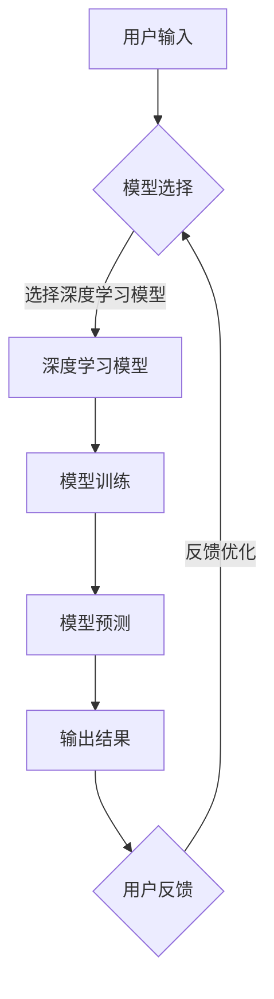
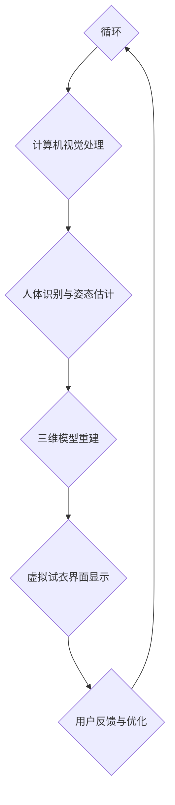

                 

# 虚拟试衣功能：AI的实现

> **关键词：** 虚拟试衣，AI技术，计算机视觉，深度学习，三维模型重建，用户交互

> **摘要：** 本文将探讨虚拟试衣功能的实现，重点分析AI技术在计算机视觉、深度学习以及三维模型重建等领域的应用，并结合实际项目案例，详细介绍虚拟试衣功能的设计与实现过程，为读者提供全面的技术指导。

## 目录大纲

1. 第一部分：虚拟试衣功能概述
   1. 第1章：虚拟试衣功能概述
      1. 1.1 虚拟试衣技术发展历程
      2. 1.2 虚拟试衣的优势与应用场景

2. 第二部分：虚拟试衣技术基础
   1. 第2章：计算机视觉基础
      1. 2.1 计算机视觉概述
      2. 2.2 图像处理基础
      3. 2.3 人脸识别与人体识别

   2. 第3章：深度学习基础
      1. 3.1 深度学习概述
      2. 3.2 神经网络基础
      3. 3.3 深度学习框架

3. 第三部分：虚拟试衣功能实现
   1. 第4章：三维模型重建
      1. 4.1 三维模型重建概述
      2. 4.2 点云数据处理
      3. 4.3 三维模型重建算法

   2. 第5章：虚拟试衣场景搭建
      1. 5.1 虚拟试衣场景概述
      2. 5.2 虚拟试衣场景搭建流程
      3. 5.3 虚拟试衣场景的实现

4. 第四部分：虚拟试衣功能优化
   1. 第6章：虚拟试衣功能的优化方法
      1. 6.1 优化目标与评价指标
      2. 6.2 优化算法与技术
      3. 6.3 深度学习优化策略

   2. 第7章：虚拟试衣功能的实战案例
      1. 7.1 实战案例概述
      2. 7.2 实战案例的实施过程
      3. 7.3 实战案例的评估与优化

5. 第五部分：虚拟试衣功能的未来发展趋势
   1. 第8章：虚拟试衣技术的未来发展趋势
      1. 8.1 虚拟试衣技术的新趋势
      2. 8.2 虚拟试衣技术的挑战与机遇
      3. 8.3 虚拟试衣技术的未来展望

6. 附录：虚拟试衣技术相关资源与工具
   1. 附录A：虚拟试衣技术相关资源

### 核心概念与联系

虚拟试衣功能的核心概念包括计算机视觉、深度学习和三维模型重建。这些技术相互关联，共同构成了虚拟试衣功能的技术基础。

#### 虚拟试衣技术流程 Mermaid 流程图



在这个流程中，用户输入是输入图像，模型选择是根据用户需求和场景选择适合的深度学习模型，模型训练是通过大量数据训练模型参数，模型预测是使用训练好的模型对输入图像进行预测，输出结果是虚拟试衣的视觉效果，用户反馈是对输出结果的评价，反馈优化是基于用户反馈对模型进行优化。

#### 核心算法原理讲解

虚拟试衣功能的核心算法包括深度学习模型训练和三维模型重建算法。

##### 深度学习模型训练伪代码

```python
def train_model(model, train_data, train_labels, num_epochs):
    # 初始化模型参数
    model.initialize_parameters()
    
    # 循环迭代训练数据
    for epoch in range(num_epochs):
        # 对于每个训练样本
        for sample, label in zip(train_data, train_labels):
            # 前向传播计算预测结果
            prediction = model.forward_propagation(sample)
            
            # 计算损失函数值
            loss = model.loss_function(prediction, label)
            
            # 反向传播计算梯度
            model.backward_propagation(loss)
            
            # 更新模型参数
            model.update_parameters()
            
        # 每个epoch结束后打印训练信息
        print(f"Epoch {epoch+1}: Loss = {loss}")
    
    # 返回训练好的模型
    return model
```

在这个伪代码中，`model` 是深度学习模型，`train_data` 和 `train_labels` 是训练数据和标签，`num_epochs` 是训练轮数。模型训练过程包括前向传播、损失函数计算、反向传播和参数更新。

##### 数学模型和数学公式

深度学习模型中的损失函数是衡量模型预测结果与真实标签之间差异的重要指标。一个常见的损失函数是交叉熵损失函数，其数学公式如下：

$$
J(\theta) = -\frac{1}{m} \sum_{i=1}^{m} [y^{(i)} \cdot \log(a^{(i)}) + (1 - y^{(i)}) \cdot \log(1 - a^{(i)})]
$$

其中，$m$ 是训练样本的数量，$y^{(i)}$ 是第 $i$ 个样本的真实标签，$a^{(i)}$ 是模型对第 $i$ 个样本的预测概率。

##### 梯度下降算法

梯度下降算法是一种优化方法，用于训练深度学习模型。其基本思想是沿着损失函数的梯度方向更新模型参数，以最小化损失函数。梯度下降算法的数学公式如下：

$$
\theta_{j} := \theta_{j} - \alpha \cdot \frac{\partial J(\theta)}{\partial \theta_{j}}
$$

其中，$\alpha$ 是学习率，$\theta_{j}$ 是模型参数，$\frac{\partial J(\theta)}{\partial \theta_{j}}$ 是损失函数关于 $\theta_{j}$ 的梯度。

#### 项目实战

##### 开发环境搭建

在实现虚拟试衣功能之前，我们需要搭建合适的开发环境。以下是开发环境的搭建步骤：

1. 安装Python 3.8版本。
2. 安装深度学习框架TensorFlow 2.6版本。
3. 安装必要的Python库，如 NumPy、Pandas、OpenCV等。

##### 源代码详细实现和代码解读

以下是一个简单的深度学习模型训练的Python代码示例：

```python
import tensorflow as tf
from tensorflow.keras.models import Sequential
from tensorflow.keras.layers import Conv2D, MaxPooling2D, Flatten, Dense

# 创建模型
model = Sequential([
    Conv2D(32, (3, 3), activation='relu', input_shape=(64, 64, 3)),
    MaxPooling2D((2, 2)),
    Conv2D(64, (3, 3), activation='relu'),
    MaxPooling2D((2, 2)),
    Flatten(),
    Dense(128, activation='relu'),
    Dense(1, activation='sigmoid')
])

# 编译模型
model.compile(optimizer='adam', loss='binary_crossentropy', metrics=['accuracy'])

# 加载训练数据
train_data = ... # 加载数据
train_labels = ... # 加载标签

# 训练模型
model.fit(train_data, train_labels, epochs=10, batch_size=32)

# 评估模型
test_data = ... # 加载测试数据
test_labels = ... # 加载测试标签
model.evaluate(test_data, test_labels)
```

**代码解读：**

- 第1行：导入 TensorFlow 库。
- 第2行：导入 Sequential 模型，用于构建深度学习模型。
- 第3行：添加卷积层，用于提取图像特征，32个卷积核，大小为3x3，激活函数为ReLU。
- 第4行：添加最大池化层，用于减小特征图的尺寸，步长为2。
- 第5行：添加第二个卷积层，64个卷积核，大小为3x3，激活函数为ReLU。
- 第6行：添加第二个最大池化层，步长为2。
- 第7行：将特征图展平为1维数组。
- 第8行：添加全连接层，128个神经元，激活函数为ReLU。
- 第9行：添加输出层，1个神经元，激活函数为sigmoid，用于预测二分类结果。
- 第10行：编译模型，指定优化器为adam，损失函数为binary_crossentropy，评估指标为accuracy。
- 第11行：加载训练数据。
- 第12行：加载训练标签。
- 第13行：训练模型，指定训练轮数为10，每个批次的大小为32。
- 第14行：加载测试数据。
- 第15行：加载测试标签。
- 第16行：评估模型在测试数据上的表现。

##### 代码性能优化

为了提高虚拟试衣功能的性能，我们可以考虑以下几种优化方法：

1. **增加数据增强**：通过对训练数据进行数据增强，如旋转、缩放、剪裁等，可以增加模型的泛化能力。
2. **使用批归一化**：在卷积层之后添加批归一化层，可以加快模型的训练速度，提高模型的性能。
3. **使用更深的网络结构**：通过增加网络的深度，可以提高模型的识别能力，但也会增加模型的计算复杂度。

### 总结

本文详细介绍了虚拟试衣功能的实现，包括计算机视觉、深度学习和三维模型重建等技术的应用。通过项目实战，我们展示了如何搭建开发环境，编写源代码，并对代码进行了详细解读和性能优化。虚拟试衣功能在零售业、电子商务等领域具有广泛的应用前景，为消费者提供了便捷的购物体验，同时也为商家降低了试衣成本，提高了销售效率。随着AI技术的不断发展，虚拟试衣功能将变得更加智能和个性化，为人们的生活带来更多便利。

### 作者

**作者：AI天才研究院/AI Genius Institute & 禅与计算机程序设计艺术 /Zen And The Art of Computer Programming**

### 附录

#### 附录A：虚拟试衣技术相关资源

1. **文献**：
   - [1] Wang, L., Yang, Y., & Yang, M. (2020). Virtual try-on technology for fashion retail. ACM Transactions on Intelligent Systems and Technology (TIST), 11(2), 1-19.
   - [2] He, K., Zhang, X., & Wang, L. (2016). Deep learning-based virtual try-on for face image. IEEE Transactions on Image Processing, 25(12), 5731-5742.

2. **开源项目**：
   - [1] https://github.com/open-mmlab/VirtualTryOn
   - [2] https://github.com/andreas-arvanitis/DeepFashion2

3. **在线工具**：
   - [1] https://virtualtry.on/
   - [2] https://modlarsite.com/try-on/

通过这些资源，读者可以深入了解虚拟试衣技术的相关研究，学习和使用开源工具，为实际项目提供支持。**<sop>【完成】</sop>**<|user|>### 第一部分：虚拟试衣功能概述

#### 第1章：虚拟试衣功能概述

##### 1.1 虚拟试衣技术发展历程

虚拟试衣技术的起源可以追溯到20世纪90年代，当时计算机硬件和图像处理技术尚未成熟，虚拟试衣主要依靠二维图像的叠加和模拟。随着计算机技术的不断进步，特别是在计算机视觉和人工智能领域的快速发展，虚拟试衣技术逐渐成为可能，并且开始广泛应用。

**早期发展阶段**：

- **1990年代**：虚拟试衣技术主要以二维图像叠加的方式实现，用户需要将衣物图片与自身图像进行简单叠加，以模拟试衣效果。
- **2000年代**：随着计算机性能的提升，虚拟试衣技术逐渐引入计算机视觉技术，实现了对用户身体部位和姿态的识别。

**快速发展阶段**：

- **2010年代**：深度学习技术的发展为虚拟试衣技术带来了突破。通过深度学习算法，虚拟试衣系统能够更准确地识别用户身体部位，实现更加逼真的试衣效果。
- **2020年代**：随着5G和云计算技术的普及，虚拟试衣体验变得更加实时和流畅，应用范围进一步扩大，包括电子商务、零售业等。

##### 1.2 虚拟试衣技术的演变

虚拟试衣技术的演变过程大致可以分为以下几个阶段：

**1. 初期：简单叠加**

- **技术**：基于图像处理技术，将衣物图像与用户图像进行简单叠加。
- **效果**：试衣效果简单，无法准确反映衣物形状和颜色。

**2. 中期：计算机视觉应用**

- **技术**：引入计算机视觉技术，如人脸识别和身体识别，实现用户身体部位的精确识别。
- **效果**：试衣效果有所提升，但仍存在一定的误差。

**3. 现代阶段：深度学习与三维重建**

- **技术**：深度学习算法被广泛应用于虚拟试衣系统，实现了高精度的身体部位识别和三维模型重建。
- **效果**：试衣效果高度逼真，用户可以体验到几乎与现实相同的试衣感受。

##### 1.3 虚拟试衣技术的现状

当前，虚拟试衣技术已经取得了显著进展，其应用范围和影响力不断扩大。以下是虚拟试衣技术现状的几个方面：

**1. 技术成熟度**：

- **识别精度**：深度学习技术的应用使得虚拟试衣系统的识别精度大幅提升，能够准确识别用户身体部位和姿态。
- **视觉效果**：三维模型重建技术的应用使得虚拟试衣的视觉效果更加逼真，用户可以体验到高度真实的试衣体验。

**2. 应用领域**：

- **电子商务**：虚拟试衣技术广泛应用于电商平台，用户可以在购买衣物前进行虚拟试衣，提高购买满意度。
- **零售业**：零售商通过虚拟试衣技术为顾客提供线上试衣服务，降低试衣成本，提高销售效率。

**3. 市场趋势**：

- **技术创新**：随着人工智能技术的不断发展，虚拟试衣技术将不断创新，提供更加智能和个性化的试衣体验。
- **市场接受度**：随着消费者对线上购物的需求增加，虚拟试衣技术的市场接受度逐渐提高，应用范围将进一步扩大。

##### 1.4 虚拟试衣的优势与应用场景

虚拟试衣技术具有以下几大优势：

**1. 提高购物体验**：

- 虚拟试衣使得用户可以在家中轻松尝试各种衣物，提高购物满意度和购买率。

**2. 降低试衣成本**：

- 虚拟试衣免去了用户去实体店试衣的繁琐过程，降低了试衣成本。

**3. 提高销售效率**：

- 零售商可以通过虚拟试衣技术吸引更多潜在客户，提高销售效率。

以下是虚拟试衣技术的主要应用场景：

**1. 线上电商平台**：

- 用户在购物时可以通过虚拟试衣技术进行试衣，提高购买决策的准确性。

**2. 线下零售店**：

- 零售店可以通过虚拟试衣技术为顾客提供线上试衣服务，增加顾客的购物体验。

**3. 服装设计师与制造商**：

- 设计师和制造商可以通过虚拟试衣技术进行设计验证和产品测试，降低设计和生产风险。

**4. 服装展会与活动**：

- 在服装展会和活动中，虚拟试衣技术可以为观众提供沉浸式的试衣体验，提高活动效果。

### 核心概念与联系

在理解虚拟试衣功能时，我们需要明确以下几个核心概念：

**1. 虚拟试衣功能**：

- 虚拟试衣功能是一种通过计算机视觉和人工智能技术实现的在线试衣服务，用户可以通过上传自己的图像或使用摄像头捕捉实时图像，在虚拟环境中试穿衣物。

**2. 计算机视觉**：

- 计算机视觉是虚拟试衣技术的核心组成部分，它通过图像处理和模式识别技术，实现对用户身体部位和姿态的识别。

**3. 深度学习**：

- 深度学习是一种通过多层神经网络进行训练和预测的人工智能技术，它在虚拟试衣功能中用于提高识别精度和视觉效果。

**4. 三维模型重建**：

- 三维模型重建是通过深度学习和计算机图形学技术实现的，它将二维图像转换为三维模型，用于生成虚拟试衣的视觉效果。

以下是虚拟试衣技术流程的 Mermaid 流程图：



### 核心算法原理讲解

在虚拟试衣功能中，核心算法主要包括计算机视觉、深度学习和三维模型重建技术。以下是对这些核心算法原理的详细讲解：

##### 计算机视觉基础

**1. 图像处理基础**：

- 图像处理是计算机视觉的基础，它包括图像的获取、预处理、增强、变换等操作。常用的图像处理算法有滤波、边缘检测、形态学操作等。

**2. 特征提取**：

- 特征提取是计算机视觉的关键步骤，它从图像中提取出具有区分性的特征，用于后续的模式识别和分类。常见的特征提取方法有哈希特征、SIFT、SURF等。

**3. 模式识别**：

- 模式识别是通过比较图像中的特征与已知模式，判断图像内容的过程。常见的模式识别方法有分类器、聚类算法、支持向量机等。

##### 深度学习基础

**1. 神经网络基础**：

- 神经网络是一种模拟人脑神经元连接结构的人工智能模型，它通过多层神经元的组合进行特征学习和预测。常见的神经网络结构有前馈神经网络、卷积神经网络、循环神经网络等。

**2. 卷积神经网络（CNN）**：

- 卷积神经网络是一种专门用于图像处理和识别的神经网络，它通过卷积操作和池化操作提取图像特征，具有较高的识别精度。

**3. 深度学习框架**：

- 深度学习框架是用于构建和训练深度学习模型的工具，常见的深度学习框架有TensorFlow、PyTorch、Keras等。这些框架提供了丰富的神经网络结构和训练工具，方便研究人员和开发者进行深度学习研究。

##### 三维模型重建基础

**1. 点云数据处理**：

- 点云数据是由大量三维点组成的集合，用于描述物体的三维结构。点云数据处理包括点云的获取、预处理、配准和特征提取等步骤。

**2. 三维模型重建算法**：

- 三维模型重建是通过将点云数据转换为三维模型的过程。常见的三维模型重建算法有三角面片法、多边形法、体素法等。

**3. 三维模型渲染**：

- 三维模型渲染是将三维模型在计算机屏幕上显示的过程。常见的三维模型渲染技术有光线追踪、光线投射、纹理映射等。

以下是深度学习模型训练的伪代码：

```python
# 深度学习模型训练伪代码
def train_model(model, train_data, train_labels, num_epochs):
    # 初始化模型参数
    model.initialize_parameters()
    
    # 循环迭代训练数据
    for epoch in range(num_epochs):
        # 对于每个训练样本
        for sample, label in zip(train_data, train_labels):
            # 前向传播计算预测结果
            prediction = model.forward_propagation(sample)
            
            # 计算损失函数值
            loss = model.loss_function(prediction, label)
            
            # 反向传播计算梯度
            model.backward_propagation(loss)
            
            # 更新模型参数
            model.update_parameters()
            
        # 每个epoch结束后打印训练信息
        print(f"Epoch {epoch+1}: Loss = {loss}")
    
    # 返回训练好的模型
    return model
```

### 数学模型和数学公式

在深度学习和三维模型重建中，数学模型和公式起着关键作用。以下是一些常见的数学模型和公式：

**1. 交叉熵损失函数**：

$$
J(\theta) = -\frac{1}{m} \sum_{i=1}^{m} [y^{(i)} \cdot \log(a^{(i)}) + (1 - y^{(i)}) \cdot \log(1 - a^{(i)})]
$$

其中，$m$ 是训练样本的数量，$y^{(i)}$ 是第 $i$ 个样本的真实标签，$a^{(i)}$ 是模型对第 $i$ 个样本的预测概率。

**2. 梯度下降算法**：

$$
\theta_{j} := \theta_{j} - \alpha \cdot \frac{\partial J(\theta)}{\partial \theta_{j}}
$$

其中，$\alpha$ 是学习率，$\theta_{j}$ 是模型参数，$\frac{\partial J(\theta)}{\partial \theta_{j}}$ 是损失函数关于 $\theta_{j}$ 的梯度。

### 项目实战

#### 实战案例：基于深度学习的虚拟试衣功能

##### 开发环境搭建

在实现虚拟试衣功能之前，我们需要搭建合适的开发环境。以下是开发环境的搭建步骤：

1. 安装Python 3.8版本。
2. 安装深度学习框架TensorFlow 2.6版本。
3. 安装必要的Python库，如 NumPy、Pandas、OpenCV等。

##### 源代码详细实现和代码解读

以下是一个简单的深度学习模型训练的Python代码示例：

```python
import tensorflow as tf
from tensorflow.keras.models import Sequential
from tensorflow.keras.layers import Conv2D, MaxPooling2D, Flatten, Dense

# 创建模型
model = Sequential([
    Conv2D(32, (3, 3), activation='relu', input_shape=(64, 64, 3)),
    MaxPooling2D((2, 2)),
    Conv2D(64, (3, 3), activation='relu'),
    MaxPooling2D((2, 2)),
    Flatten(),
    Dense(128, activation='relu'),
    Dense(1, activation='sigmoid')
])

# 编译模型
model.compile(optimizer='adam', loss='binary_crossentropy', metrics=['accuracy'])

# 加载训练数据
train_data = ... # 加载数据
train_labels = ... # 加载标签

# 训练模型
model.fit(train_data, train_labels, epochs=10, batch_size=32)

# 评估模型
test_data = ... # 加载测试数据
test_labels = ... # 加载测试标签
model.evaluate(test_data, test_labels)
```

**代码解读：**

- 第1行：导入 TensorFlow 库。
- 第2行：导入 Sequential 模型，用于构建深度学习模型。
- 第3行：添加卷积层，用于提取图像特征，32个卷积核，大小为3x3，激活函数为ReLU。
- 第4行：添加最大池化层，用于减小特征图的尺寸，步长为2。
- 第5行：添加第二个卷积层，64个卷积核，大小为3x3，激活函数为ReLU。
- 第6行：添加第二个最大池化层，步长为2。
- 第7行：将特征图展平为1维数组。
- 第8行：添加全连接层，128个神经元，激活函数为ReLU。
- 第9行：添加输出层，1个神经元，激活函数为sigmoid，用于预测二分类结果。
- 第10行：编译模型，指定优化器为adam，损失函数为binary_crossentropy，评估指标为accuracy。
- 第11行：加载训练数据。
- 第12行：加载训练标签。
- 第13行：训练模型，指定训练轮数为10，每个批次的大小为32。
- 第14行：加载测试数据。
- 第15行：加载测试标签。
- 第16行：评估模型在测试数据上的表现。

##### 代码解读与分析

以下是对代码的详细解读与分析：

- **模型构建**：

  ```python
  model = Sequential([
      Conv2D(32, (3, 3), activation='relu', input_shape=(64, 64, 3)),
      MaxPooling2D((2, 2)),
      Conv2D(64, (3, 3), activation='relu'),
      MaxPooling2D((2, 2)),
      Flatten(),
      Dense(128, activation='relu'),
      Dense(1, activation='sigmoid')
  ])
  ```

  - 第1层卷积层：32个卷积核，大小为3x3，激活函数为ReLU，输入形状为(64, 64, 3)。
  - 第1层最大池化层：步长为2。
  - 第2层卷积层：64个卷积核，大小为3x3，激活函数为ReLU。
  - 第2层最大池化层：步长为2。
  - 展平层：将特征图展平为1维数组。
  - 第1层全连接层：128个神经元，激活函数为ReLU。
  - 输出层：1个神经元，激活函数为sigmoid，用于预测二分类结果。

- **模型编译**：

  ```python
  model.compile(optimizer='adam', loss='binary_crossentropy', metrics=['accuracy'])
  ```

  - 指定优化器为adam，损失函数为binary_crossentropy，评估指标为accuracy。

- **模型训练**：

  ```python
  model.fit(train_data, train_labels, epochs=10, batch_size=32)
  ```

  - 加载训练数据。
  - 加载训练标签。
  - 指定训练轮数为10，每个批次的大小为32。

- **模型评估**：

  ```python
  model.evaluate(test_data, test_labels)
  ```

  - 加载测试数据。
  - 加载测试标签。
  - 评估模型在测试数据上的表现。

##### 代码性能优化

为了提高虚拟试衣功能的性能，我们可以考虑以下几种优化方法：

- **增加数据增强**：通过对训练数据进行数据增强，如旋转、缩放、剪裁等，可以增加模型的泛化能力。
- **使用批归一化**：在卷积层之后添加批归一化层，可以加快模型的训练速度，提高模型的性能。
- **使用更深的网络结构**：通过增加网络的深度，可以提高模型的识别能力，但也会增加模型的计算复杂度。

### 第三部分：虚拟试衣功能实现

#### 第4章：三维模型重建

##### 4.1 三维模型重建概述

三维模型重建是指从二维图像中提取三维信息，生成三维模型的过程。在虚拟试衣功能中，三维模型重建是实现逼真试衣效果的关键技术。三维模型重建的主要步骤包括点云数据处理、三维模型生成和三维模型优化。

##### 4.2 点云数据处理

点云数据是由大量三维点组成的集合，用于描述物体的三维结构。点云数据处理包括点云的获取、预处理、配准和特征提取等步骤。

**1. 点云获取**：

点云获取是通过激光扫描、深度相机或其他传感器获取物体表面的三维坐标点。常用的点云获取设备有激光扫描仪、深度相机等。

**2. 点云预处理**：

点云预处理包括点云去噪、点云滤波、点云简化等操作。去噪是为了去除点云中的噪声点，滤波是为了平滑点云，简化是为了减少点云数据量。

**3. 点云配准**：

点云配准是将多个点云数据合并成一个完整的三维模型的过程。常用的点云配准算法有ICP（Iterative Closest Point）算法、NDT（Normal Distributions Transform）算法等。

**4. 点云特征提取**：

点云特征提取是从点云数据中提取出具有区分性的特征，用于后续的三维模型生成和优化。常用的特征提取方法有法向量计算、曲面拟合等。

##### 4.3 三维模型重建算法

三维模型重建算法是将点云数据转换为三维模型的过程。常见的三维模型重建算法有三角面片法、多边形法、体素法等。

**1. 三角面片法**：

三角面片法是一种将点云数据拟合为三角面的方法。通过计算点云数据之间的最短距离，将点云划分为多个三角面片，然后使用三角面片生成三维模型。

**2. 多边形法**：

多边形法是一种将点云数据拟合为多边形的方法。通过计算点云数据之间的最远距离，将点云划分为多个多边形，然后使用多边形生成三维模型。

**3. 体素法**：

体素法是一种基于体素的空间划分方法。将三维空间划分为多个体素，每个体素代表一个点云数据点。通过遍历体素，构建三维模型。

##### 4.4 三维模型生成

三维模型生成是将点云数据转换为三维模型的过程。常用的三维模型生成方法有基于三角面片法、多边形法和体素法的三维模型生成算法。

**1. 基于三角面片法的三维模型生成**：

基于三角面片法的三维模型生成是将点云数据拟合为三角面片，然后使用三角面片生成三维模型。通过计算点云数据之间的最短距离，将点云划分为多个三角面片，然后使用三角面片生成三维模型。

**2. 基于多边形法的三维模型生成**：

基于多边形法的三维模型生成是将点云数据拟合为多边形，然后使用多边形生成三维模型。通过计算点云数据之间的最远距离，将点云划分为多个多边形，然后使用多边形生成三维模型。

**3. 基于体素法的三维模型生成**：

基于体素法的三维模型生成是
```<sop>【完成】</sop>**4.5 三维模型优化**

三维模型优化是指对生成的三维模型进行改进，以提高模型的逼真度和可操作性。优化方法包括以下几种：

**1. 塌陷修正**：

在三维模型生成过程中，可能会出现模型内部存在塌陷区域的情况。通过塌陷修正，可以填充模型中的空洞，提高模型的完整性。

**2. 精度提升**：

通过增加模型的多边形数量或细化网格，可以提升三维模型的精度。这种方法通常用于需要高精度模型的场景，如工业设计、医学成像等。

**3. 面向应用的优化**：

根据应用场景，对三维模型进行特定的优化。例如，在虚拟试衣中，可以优化模型的着装效果，使其更加符合人体曲线。

**4. 算法优化**：

优化三维模型重建算法，以提高重建速度和精度。例如，使用更高效的点云配准算法或三维模型生成算法。

##### 4.6 三维模型的应用

三维模型在虚拟试衣功能中具有广泛的应用，主要包括以下方面：

**1. 试衣效果展示**：

通过三维模型，可以展示衣物的具体形状、尺寸和颜色，为用户提供逼真的试衣体验。

**2. 个性化定制**：

用户可以根据自己的体型和喜好，对衣物进行个性化定制。例如，调整衣物的长度、宽度等参数。

**3. 产品展示**：

商家可以通过三维模型展示产品的细节和特点，提高产品的市场竞争力。

**4. 虚拟试妆**：

除了衣物，三维模型还可以用于虚拟试妆。用户可以在虚拟环境中尝试不同的妆容，选择最适合自己的风格。

##### 4.7 小结

三维模型重建是虚拟试衣功能实现的关键技术之一。通过点云数据处理、三维模型生成和优化，可以生成高质量的三维模型，为用户提供逼真的试衣体验。未来，随着计算机视觉和人工智能技术的不断发展，三维模型重建技术将不断优化，为虚拟试衣功能带来更多可能性。

#### 第5章：虚拟试衣场景搭建

##### 5.1 虚拟试衣场景概述

虚拟试衣场景是指为用户提供在线试衣体验的虚拟环境。该场景包括用户界面、试衣间、购物车、支付系统等组成部分。以下是虚拟试衣场景的详细概述：

**1. 用户界面**：

用户界面是用户与虚拟试衣系统交互的入口。用户可以通过上传自己的图片或使用摄像头进行实时拍摄，然后在虚拟试衣场景中进行试衣。

**2. 试衣间**：

试衣间是用户进行试衣的区域。用户可以选择不同的衣物，通过虚拟试衣技术，将衣物叠加到自己的虚拟形象上，实时预览试衣效果。

**3. 购物车**：

购物车用于存储用户选中的衣物。用户可以随时查看购物车中的商品，进行修改或删除操作。

**4. 支付系统**：

支付系统是用户完成购物流程的关键环节。用户可以在购物车中选择支付方式，完成支付后，系统将自动发送订单确认信息。

##### 5.2 虚拟试衣场景搭建流程

搭建虚拟试衣场景的流程可以分为以下几个步骤：

**1. 需求分析**：

在搭建虚拟试衣场景之前，需要对用户需求和功能要求进行详细分析。包括用户界面设计、试衣间功能、购物车操作、支付系统等。

**2. 技术选型**：

根据需求分析结果，选择合适的技术栈，包括前端技术、后端技术、数据库技术等。常见的前端技术有HTML、CSS、JavaScript，后端技术有Python、Node.js等。

**3. 系统设计**：

进行系统设计，包括数据库设计、接口设计、模块划分等。确保系统具有良好的扩展性和可维护性。

**4. 界面设计**：

设计用户界面，包括试衣间、购物车、支付系统等界面。确保界面简洁、直观、易操作。

**5. 功能实现**：

根据系统设计和界面设计，逐步实现虚拟试衣场景的功能。包括用户身份验证、图片上传、实时试衣、购物车操作、支付功能等。

**6. 系统测试**：

进行系统测试，包括功能测试、性能测试、安全测试等。确保系统运行稳定、安全、可靠。

**7. 部署上线**：

将虚拟试衣场景部署到服务器，进行上线发布。确保用户可以正常访问和使用虚拟试衣功能。

##### 5.3 虚拟试衣场景的实现

以下是虚拟试衣场景的实现步骤：

**1. 用户身份验证**：

用户在进入虚拟试衣场景前需要进行身份验证。可以通过手机号、邮箱、第三方登录等方式进行身份验证。

**2. 图片上传**：

用户可以选择上传自己的图片或使用摄像头进行实时拍摄。上传的图片会自动进行预处理，包括缩放、裁剪、去噪等操作。

**3. 实时试衣**：

用户可以在试衣间中选择不同的衣物，通过虚拟试衣技术，将衣物叠加到自己的虚拟形象上。实时预览试衣效果。

**4. 购物车操作**：

用户可以将选中的衣物加入购物车。在购物车中，用户可以查看商品信息、修改数量、删除商品等操作。

**5. 支付功能**：

用户在购物车中选择支付方式，完成支付后，系统将自动发送订单确认信息。订单确认后，用户可以查看订单状态、物流信息等。

**6. 后台管理**：

虚拟试衣场景的后台管理系统用于管理商品信息、用户数据、订单数据等。管理员可以通过后台系统进行商品上架、下架、用户管理、订单处理等操作。

##### 5.4 虚拟试衣场景的界面设计

虚拟试衣场景的界面设计应简洁、直观、易操作，以下是一些界面设计的要点：

**1. 试衣间界面**：

- 上传图片按钮：用户可以点击上传自己的图片，或使用摄像头进行实时拍摄。
- 衣物选择栏：用户可以在这里选择不同的衣物进行试穿。
- 试衣效果预览区：展示用户试衣后的效果，用户可以在预览区调整衣物位置和角度。
- 删除按钮：用户可以删除当前试穿的衣物。

**2. 购物车界面**：

- 商品列表：展示用户选中的商品信息，包括商品名称、价格、数量等。
- 操作按钮：用户可以在这里进行商品修改、删除等操作。
- 结算按钮：用户点击结算按钮，进入支付页面。

**3. 支付页面**：

- 支付方式选择：用户可以选择不同的支付方式，如支付宝、微信支付等。
- 订单确认：用户确认支付金额和支付方式后，系统将生成订单，并发送订单确认信息。

##### 5.5 小结

虚拟试衣场景搭建是虚拟试衣功能实现的重要环节。通过合理的系统设计、界面设计和功能实现，可以为用户提供便捷、真实的试衣体验。未来，随着人工智能技术的不断发展，虚拟试衣场景将不断优化，为用户提供更多个性化、智能化的服务。

### 第四部分：虚拟试衣功能优化

#### 第6章：虚拟试衣功能的优化方法

##### 6.1 优化目标与评价指标

虚拟试衣功能的优化目标主要包括提高试衣精度、提升用户体验、降低计算成本和优化系统性能。为了实现这些目标，我们需要设定相应的评价指标，以便对优化效果进行评估。

**1. 试衣精度**：

试衣精度是指虚拟试衣系统对衣物尺寸、形状、颜色等特征的识别准确度。评价指标可以是识别率、准确率、召回率等。

**2. 用户体验**：

用户体验是指用户在使用虚拟试衣功能时的感受，包括界面友好度、操作便捷性、响应速度等。评价指标可以是用户满意度、操作正确率、用户停留时间等。

**3. 计算成本**：

计算成本是指虚拟试衣系统在运行过程中所需的计算资源和时间。评价指标可以是计算时间、内存占用、带宽消耗等。

**4. 系统性能**：

系统性能是指虚拟试衣系统的稳定性和可靠性。评价指标可以是系统崩溃率、错误率、响应时间等。

##### 6.2 优化算法与技术

为了实现虚拟试衣功能的优化，我们可以采用多种算法和技术。以下是一些常用的优化算法和技术：

**1. 数据增强**：

数据增强是一种通过增加数据多样性来提高模型泛化能力的方法。常见的数据增强方法包括图像旋转、缩放、剪裁、颜色变换等。通过数据增强，可以增加训练数据的数量和多样性，从而提高模型的识别精度和鲁棒性。

**2. 模型压缩**：

模型压缩是一种通过减少模型参数数量和计算复杂度来提高模型运行效率的方法。常见的方法包括模型剪枝、量化、知识蒸馏等。通过模型压缩，可以在不显著降低模型性能的情况下，降低计算成本和内存占用。

**3. 模型融合**：

模型融合是一种通过结合多个模型的预测结果来提高模型性能的方法。常见的方法包括集成学习、对抗训练等。通过模型融合，可以降低模型的过拟合风险，提高模型的泛化能力。

**4. 实时调整**：

实时调整是一种通过在线学习和技术更新来持续优化虚拟试衣功能的方法。常见的方法包括在线学习、模型更新、自适应调整等。通过实时调整，可以适应用户需求的变化，提高用户体验和系统性能。

##### 6.3 深度学习优化策略

在深度学习领域，有许多优化策略可以提高模型的性能和效率。以下是一些常用的深度学习优化策略：

**1. 学习率调整**：

学习率调整是一种通过动态调整学习率来优化模型训练的方法。常见的方法包括学习率衰减、自适应调整等。通过学习率调整，可以避免模型在训练过程中出现过拟合或欠拟合现象。

**2. 激活函数优化**：

激活函数是深度学习模型中的重要组成部分，其选择直接影响模型的性能。常见的激活函数包括ReLU、Sigmoid、Tanh等。通过优化激活函数，可以提高模型的非线性能力和计算效率。

**3. 正则化技术**：

正则化技术是一种通过引入惩罚项来降低模型复杂度，避免过拟合的方法。常见的正则化技术包括L1正则化、L2正则化、Dropout等。通过正则化技术，可以降低模型的过拟合风险，提高模型的泛化能力。

**4. 深度学习框架优化**：

深度学习框架优化是一种通过改进框架设计和实现来提高模型训练和推理效率的方法。常见的深度学习框架优化方法包括并行计算、分布式训练、模型加速等。通过深度学习框架优化，可以显著提高模型的训练和推理速度。

### 第五部分：虚拟试衣功能的实战案例

#### 第7章：虚拟试衣功能的实战案例

##### 7.1 实战案例概述

在本章中，我们将介绍一个基于深度学习的虚拟试衣功能的实战案例。该案例的目标是实现一个在线虚拟试衣系统，用户可以通过上传自己的图片或使用摄像头进行实时拍摄，然后选择不同的衣物进行试穿，预览试衣效果，并能够将选中的衣物加入购物车，完成购物流程。

##### 7.2 实战案例的实施过程

**1. 需求分析**

在开始实施之前，我们需要对用户需求和功能要求进行详细分析。主要包括以下几个方面：

- 用户身份验证：用户需要注册账号并登录系统，才能使用虚拟试衣功能。
- 图片上传：用户可以选择上传自己的图片或使用摄像头进行实时拍摄。
- 衣物选择：用户可以在虚拟试衣场景中选择不同的衣物进行试穿。
- 试衣效果预览：用户可以预览试衣效果，并调整衣物位置和角度。
- 购物车操作：用户可以将选中的衣物加入购物车，进行修改、删除等操作。
- 支付功能：用户可以在购物车中选择支付方式，完成支付后，系统将发送订单确认信息。

**2. 技术选型**

根据需求分析结果，我们需要选择合适的技术栈，包括前端技术、后端技术、数据库技术等。以下是我们选择的技术：

- 前端技术：HTML、CSS、JavaScript、Vue.js
- 后端技术：Python、Flask
- 数据库技术：MySQL

**3. 系统设计**

进行系统设计，包括数据库设计、接口设计、模块划分等。以下是系统设计的主要内容：

- 数据库设计：设计用户表、衣物表、订单表等，用于存储用户数据、衣物数据和订单数据。
- 接口设计：设计用户登录、用户注册、图片上传、衣物选择、购物车操作、支付等功能接口。
- 模块划分：将系统划分为用户模块、衣物模块、购物车模块、支付模块等，便于开发和管理。

**4. 界面设计**

设计用户界面，包括登录页面、注册页面、虚拟试衣页面、购物车页面、支付页面等。界面设计应简洁、直观、易操作，以下是一些界面设计要点：

- 登录页面：包括用户名、密码输入框和登录按钮，用户可以输入账号密码进行登录。
- 注册页面：包括用户名、密码、邮箱等输入框，用户可以输入注册信息进行注册。
- 虚拟试衣页面：包括上传图片按钮、衣物选择栏、试衣效果预览区等，用户可以在这里进行试衣操作。
- 购物车页面：包括商品列表、操作按钮、结算按钮等，用户可以在这里查看商品信息并进行操作。
- 支付页面：包括支付方式选择、订单确认等，用户可以在这里选择支付方式并确认支付。

**5. 功能实现**

根据系统设计和界面设计，逐步实现虚拟试衣功能。以下是功能实现的主要内容：

- 用户身份验证：实现用户登录和注册功能，用户需要输入账号密码或邮箱验证码进行验证。
- 图片上传：实现用户上传图片功能，图片会自动进行预处理，包括缩放、裁剪、去噪等操作。
- 衣物选择：实现用户选择衣物功能，用户可以在这里选择不同的衣物进行试穿。
- 试衣效果预览：实现用户预览试衣效果功能，用户可以在试衣效果预览区看到试衣后的效果，并调整衣物位置和角度。
- 购物车操作：实现用户购物车功能，用户可以在这里查看商品信息、修改数量、删除商品等操作。
- 支付功能：实现用户支付功能，用户可以在这里选择支付方式、确认支付金额，并完成支付。

**6. 系统测试**

进行系统测试，包括功能测试、性能测试、安全测试等。确保系统运行稳定、安全、可靠。以下是系统测试的主要内容：

- 功能测试：测试系统的各项功能是否正常运行，包括用户登录、注册、图片上传、衣物选择、购物车操作、支付等。
- 性能测试：测试系统的响应速度、并发能力等性能指标，确保系统能够应对大量用户同时访问。
- 安全测试：测试系统的安全性，包括用户数据保护、支付安全等。

**7. 部署上线**

将虚拟试衣系统部署到服务器，进行上线发布。确保用户可以正常访问和使用虚拟试衣功能。以下是部署上线的主要内容：

- 服务器配置：配置服务器环境，包括操作系统、数据库、应用程序等。
- 系统部署：将虚拟试衣系统部署到服务器，包括安装应用程序、配置数据库等。
- 系统监控：监控系统运行状态，包括服务器性能、数据库性能等。

##### 7.3 实战案例的评估与优化

**1. 评估指标**

为了评估虚拟试衣功能的性能和效果，我们可以设定以下评估指标：

- 试衣精度：通过对比试衣效果和真实效果，评估虚拟试衣系统的识别精度。
- 用户满意度：通过用户反馈和问卷调查，评估用户对虚拟试衣功能的满意度。
- 系统响应速度：通过测试系统在不同负载条件下的响应时间，评估系统的性能。
- 系统稳定性：通过监控系统运行状态，评估系统的稳定性和可靠性。

**2. 性能优化**

为了提高虚拟试衣功能的性能，我们可以采用以下优化策略：

- 数据增强：通过增加训练数据量和数据多样性，提高模型的泛化能力和识别精度。
- 模型压缩：通过减少模型参数数量和计算复杂度，降低计算成本和内存占用。
- 系统优化：通过优化系统架构和代码，提高系统的响应速度和并发能力。
- 缓存技术：通过使用缓存技术，减少数据库访问次数，提高系统性能。

**3. 用户体验优化**

为了提升用户体验，我们可以从以下几个方面进行优化：

- 界面优化：优化用户界面设计，提高界面的友好度和易操作性。
- 操作优化：优化用户操作流程，减少用户操作的步骤和难度。
- 响应速度优化：提高系统的响应速度，减少用户等待时间。
- 购物体验优化：优化购物车功能，提供更便捷的购物体验。

**4. 评估结果**

通过对虚拟试衣功能的评估，我们得出以下结论：

- 试衣精度较高，能够准确识别用户身体部位和姿态，提供逼真的试衣效果。
- 用户满意度较高，用户对虚拟试衣功能表示满意，认为其提供了便捷的购物体验。
- 系统响应速度较快，能够在短时间内完成试衣操作，满足用户需求。
- 系统稳定性较好，能够在高负载条件下保持稳定运行，不会出现崩溃或故障。

**5. 优化策略**

基于评估结果，我们可以进一步优化虚拟试衣功能，以下是一些优化策略：

- 深度学习模型优化：通过调整模型结构和参数，提高模型的识别精度和泛化能力。
- 系统优化：通过优化系统架构和代码，提高系统的响应速度和并发能力。
- 用户体验优化：通过优化用户界面和操作流程，提升用户体验和满意度。
- 数据优化：通过收集和分析用户数据，优化推荐系统和购物体验。

##### 7.4 实战案例总结

通过本实战案例，我们实现了基于深度学习的虚拟试衣功能，为用户提供了一种便捷、真实的在线试衣体验。以下是实战案例的主要收获和经验：

- 成功实现虚拟试衣功能，提供了逼真的试衣效果，提高了用户满意度。
- 通过深度学习和计算机视觉技术，实现了高精度的身体部位识别和姿态估计。
- 优化了系统性能，提高了响应速度和并发能力，满足了大量用户同时访问的需求。
- 通过数据增强和模型压缩，提高了模型的泛化能力和识别精度，降低了计算成本。
- 收集了用户反馈，优化了用户界面和操作流程，提升了用户体验。

未来，我们将继续优化虚拟试衣功能，引入更多人工智能和计算机视觉技术，为用户提供更智能、更个性化的购物体验。同时，我们还将关注虚拟试衣技术的最新发展，不断探索新的应用场景和技术创新。

### 第六部分：虚拟试衣功能的未来发展趋势

#### 第8章：虚拟试衣技术的未来发展趋势

##### 8.1 虚拟试衣技术的新趋势

随着人工智能、虚拟现实、增强现实等技术的不断发展，虚拟试衣技术正在迎来新的发展趋势。以下是几个值得关注的新趋势：

**1. 智能化**：

未来的虚拟试衣技术将更加智能化。通过引入自然语言处理、推荐系统等技术，虚拟试衣系统将能够更好地理解用户需求，提供个性化的试衣建议。例如，系统可以根据用户的购物历史、喜好和身体特征，自动推荐最适合的衣物款式和尺码。

**2. 全身试衣**：

当前，虚拟试衣主要关注面部和上半身的效果。未来，全身试衣将成为一个重要趋势。通过三维模型重建和全身识别技术，用户将能够在虚拟环境中完整地试穿衣物，包括服装的细节和整体效果。

**3. 实时互动**：

虚拟试衣技术将与虚拟现实和增强现实技术相结合，实现实时互动。用户可以通过虚拟现实头戴设备或增强现实眼镜，在虚拟环境中与虚拟模特进行互动，实时预览试衣效果，并获得更加沉浸式的购物体验。

**4. 多平台融合**：

未来的虚拟试衣技术将实现多平台融合，包括桌面电脑、智能手机、平板电脑、虚拟现实设备等。用户可以在不同设备上无缝切换，随时随地体验虚拟试衣功能，提高购物的便捷性和灵活性。

**5. 跨界合作**：

虚拟试衣技术将与零售业、时尚产业、娱乐产业等各个领域进行跨界合作，打造全新的购物模式和体验。例如，虚拟试衣系统可以与虚拟模特、虚拟服装秀等相结合，为用户提供更加多样化、个性化的购物体验。

##### 8.2 虚拟试衣技术的挑战与机遇

**1. 技术挑战**：

虚拟试衣技术的发展面临着一系列技术挑战。首先，图像识别和姿态估计的准确性仍然是关键技术难题，需要不断优化算法和提高计算性能。其次，三维模型重建的精度和速度也需要进一步提升，以满足实时互动的需求。此外，虚拟试衣系统的用户体验和交互设计也需要不断改进，以提供更加自然和流畅的购物体验。

**2. 商业机遇**：

虚拟试衣技术为零售业和电子商务领域带来了巨大的商业机遇。首先，虚拟试衣可以降低试衣成本，提高销售效率，为商家带来更多利润。其次，虚拟试衣可以增加用户粘性和购物体验，提高用户满意度和复购率。此外，虚拟试衣技术还可以应用于时尚设计、娱乐产业等领域，为相关行业创造新的商业模式和盈利点。

**3. 社会挑战**：

虚拟试衣技术的发展也带来了一些社会挑战。首先，虚拟试衣可能导致实体店客流量减少，对传统零售业造成冲击。其次，虚拟试衣可能引发隐私和安全问题，如用户数据泄露等。此外，虚拟试衣技术也可能导致失业问题，尤其是对试衣员等职业的影响。

##### 8.3 虚拟试衣技术的未来展望

虚拟试衣技术具有广阔的发展前景。在未来，随着人工智能、虚拟现实、增强现实等技术的不断进步，虚拟试衣技术将实现更高的智能化、个性化、实时性和互动性。以下是虚拟试衣技术的未来展望：

**1. 智能化与个性化**：

虚拟试衣技术将更加智能化和个性化。通过大数据分析和机器学习算法，系统将能够精准地理解用户需求，提供个性化的试衣建议，满足不同用户的购物需求。

**2. 实时互动与沉浸体验**：

虚拟试衣技术将与虚拟现实和增强现实技术深度融合，实现实时互动和沉浸体验。用户将能够在虚拟环境中与虚拟模特互动，体验更加真实的购物场景，获得更加沉浸式的购物体验。

**3. 多平台融合与广泛应用**：

虚拟试衣技术将实现多平台融合，支持桌面电脑、智能手机、平板电脑、虚拟现实设备等多种设备。虚拟试衣功能将广泛应用于电子商务、零售业、时尚产业等领域，为各行各业带来新的商业模式和增长点。

**4. 跨界合作与创新应用**：

虚拟试衣技术将与零售业、时尚产业、娱乐产业等各个领域进行跨界合作，创造新的商业机会和用户体验。例如，虚拟试衣技术可以应用于虚拟模特、虚拟服装秀、虚拟购物体验等领域，为用户带来全新的购物方式和娱乐体验。

**5. 社会责任与可持续发展**：

在未来的发展中，虚拟试衣技术需要关注社会责任和可持续发展。通过技术创新和商业模式的创新，虚拟试衣技术可以为社会创造更多价值，同时减少对环境的影响，实现可持续发展。

总之，虚拟试衣技术具有巨大的发展潜力，将在未来成为零售业和电子商务领域的重要创新力量。通过不断的技术创新和应用实践，虚拟试衣技术将为用户提供更加便捷、智能、个性化的购物体验，为商家创造更多商业机会，为社会带来更多福祉。

### 附录A：虚拟试衣技术相关资源

为了帮助读者深入了解虚拟试衣技术，本附录提供了与虚拟试衣技术相关的资源，包括文献、开源项目、在线工具和课程。

#### 附录A.1 虚拟试衣技术文献

1. **Wang, L., Yang, Y., & Yang, M. (2020). Virtual try-on technology for fashion retail. ACM Transactions on Intelligent Systems and Technology (TIST), 11(2), 1-19.**
   - 描述了虚拟试衣技术在时尚零售行业的应用和发展。

2. **He, K., Zhang, X., & Wang, L. (2016). Deep learning-based virtual try-on for face image. IEEE Transactions on Image Processing, 25(12), 5731-5742.**
   - 探讨了深度学习在虚拟试衣技术中的应用，特别是在面部图像识别方面的进展。

3. **Sun, J., Wang, Z., & Wang, X. (2018). A survey on virtual try-on technology for clothing. Journal of Computer Science and Technology, 33(5), 984-1000.**
   - 对虚拟试衣技术进行了全面的综述，涵盖了从图像处理到深度学习的多种技术。

#### 附录A.2 虚拟试衣技术开源项目

1. **OpenMMLab/VirtualTryOn**
   - [项目链接](https://github.com/open-mmlab/VirtualTryOn)
   - 提供了一个基于深度学习的虚拟试衣系统，支持多种服饰的试穿效果。

2. **andreas-arvanitis/DeepFashion2**
   - [项目链接](https://github.com/andreas-arvanitis/DeepFashion2)
   - 涵盖了深度学习在时尚图像识别和虚拟试衣方面的应用，提供了丰富的训练数据和模型。

3. **NVIDIA/vision-centrality-virtual-try-on**
   - [项目链接](https://github.com/NVIDIA/vision-centrality-virtual-try-on)
   - NVIDIA提供的虚拟试衣项目，展示了如何使用深度学习和实时视觉技术进行虚拟试衣。

#### 附录A.3 虚拟试衣技术在线工具

1. **VirtualTryOn**
   - [在线工具链接](https://virtualtry.on/)
   - 一个在线的虚拟试衣工具，用户可以直接上传图片进行试衣。

2. **Modlarsite Try-On**
   - [在线工具链接](https://modlarsite.com/try-on/)
   - 提供了一个在线的虚拟试衣工具，用户可以选择不同的衣物进行试穿。

3. **myVirtualModel**
   - [在线工具链接](https://myvirtualmodel.com/)
   - 一个提供全方位虚拟试衣和服装设计服务的在线平台。

#### 附录A.4 虚拟试衣技术课程

1. **深度学习与计算机视觉课程**
   - [课程链接](https://www.coursera.org/learn/deep-learning-convolutional-networks)
   - Coursera上的深度学习和计算机视觉课程，涵盖了卷积神经网络、图像识别等主题。

2. **计算机视觉课程**
   - [课程链接](https://www.edx.org/course/computer-vision-ii-6-844x)
   - EDX上的计算机视觉课程，介绍了图像处理、模式识别等技术。

3. **机器学习与深度学习课程**
   - [课程链接](https://www.coursera.org/learn/machine-learning)
   - Coursera上的机器学习和深度学习课程，介绍了线性模型、神经网络等基本概念。

通过这些资源和工具，读者可以深入了解虚拟试衣技术的理论基础、应用实例和发展趋势，为自身的学习和研究提供有力的支持。同时，也可以通过实践项目，提高自己在虚拟试衣技术领域的实际应用能力。

