                 

### 行动力如何影响管理效果

> **关键词**：行动力、管理效果、领导力、目标设定、激励制度、项目执行、变革管理、企业文化

**摘要**：本文深入探讨了行动力在管理效果中的关键作用。通过定义行动力、分析其在管理中的重要性，本文详细阐述了行动力管理的基础框架和提升策略。此外，本文还从团队管理、项目管理、变革管理、领导力和企业文化等多个维度，探讨了行动力在实践中的应用与影响。通过案例分析，本文总结了行动力管理的成功实践，并对未来行动力管理的趋势进行了展望。

## 第一部分：行动力管理基础

### 第1章：行动力的定义与重要性

#### 1.1 行动力的概念

行动力，是指个体在目标驱动下，主动采取行动以实现目标的能力。它是将想法转化为实际行动的关键要素。在管理中，行动力不仅涉及个体的行为，还影响着整个团队的协同效应。

**核心概念与联系**：

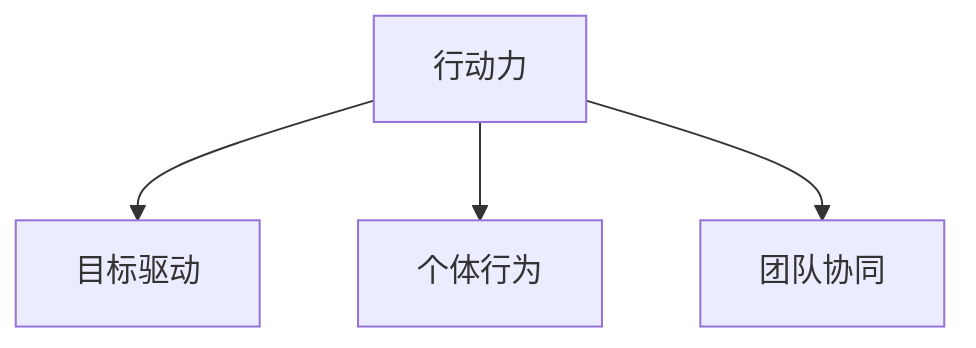

**行动力管理的基础原则**：

1. **明确目标**：行动力的核心在于明确的目标驱动。管理者需要确保团队成员了解组织的目标，并激发他们的内在动力。

2. **激励制度**：建立合适的激励制度，可以增强个体的行动力。激励制度应包括奖励机制、晋升通道和认可体系。

3. **时间管理**：有效的时间管理是提升行动力的关键。管理者需要帮助团队成员合理安排时间，确保行动的高效性。

#### 1.2 行动力在管理中的重要性

行动力是管理成功的关键因素之一。以下是行动力在管理中的几个重要性方面：

1. **决策执行**：行动力确保了决策的及时执行，从而提高了组织的反应速度和灵活性。

2. **团队协同**：行动力促进了团队成员之间的协作，增强了团队的整体绩效。

3. **创新驱动**：行动力鼓励了创新和实验，推动了组织的持续发展。

4. **绩效提升**：行动力直接关联到绩效的提升，通过高效的行动，可以更快地实现目标。

**核心概念与联系**：

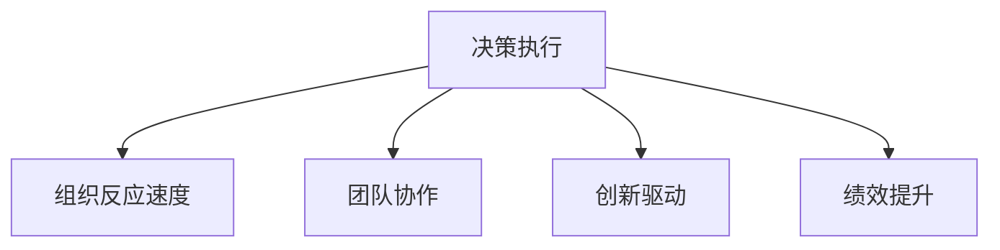

### 第2章：行动力管理框架

#### 2.1 行动力管理的基本原则

1. **目标明确**：确保团队成员理解并认同组织的整体目标，从而激发他们的行动力。

2. **激励与反馈**：建立激励制度，及时给予反馈，鼓励成员持续提升行动力。

3. **资源分配**：合理分配资源，确保团队成员具备实现目标所需的支持和工具。

4. **团队建设**：通过团队建设活动，增强团队成员之间的信任和合作，提升整体行动力。

**行动力管理的工具与方法**：

1. **目标管理法**：通过明确的目标和关键成果（OKRs），指导团队成员的行动方向。

2. **绩效评估**：定期进行绩效评估，发现问题和不足，及时调整行动策略。

3. **激励机制**：设计合适的奖励制度，如奖金、晋升和荣誉，激励团队成员。

4. **领导力培养**：通过领导力培训，提升管理者的领导能力，从而增强团队行动力。

**核心概念与联系**：

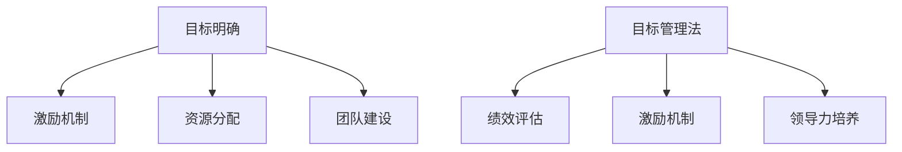

### 第3章：提升个人行动力

#### 3.1 自我认知与目标设定

提升个人行动力首先需要自我认知。个体需要明确自己的兴趣、能力和价值观，从而设定符合自己特点的目标。以下是提升个人行动力的几个关键步骤：

1. **自我评估**：通过反思和评估，了解自己的优点和不足。

2. **目标设定**：设定具体、可衡量、可实现、相关性强、时限性的目标（SMART原则）。

3. **行动计划**：制定详细的行动计划，将目标分解为具体的任务和时间节点。

**核心概念与联系**：

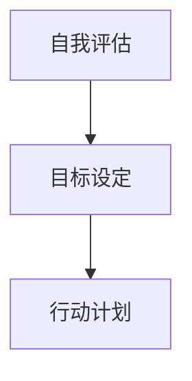

#### 3.2 时间管理与优先级排序

时间管理是提升个人行动力的关键。以下是几个时间管理的技巧：

1. **优先级排序**：根据任务的紧急程度和重要性，对任务进行优先级排序。

2. **时间块安排**：将工作时间划分为不同的时间块，每个时间块专注于一项任务。

3. **避免干扰**：减少干扰，如关闭不必要的通知，保持专注。

**核心概念与联系**：

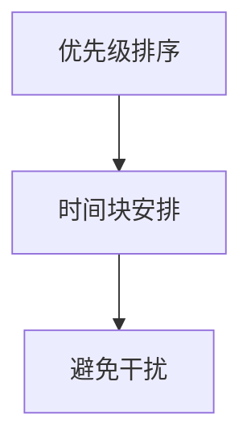

#### 3.3 克服拖延与提升执行力

拖延是行动力提升的常见障碍。以下是克服拖延和提升执行力的方法：

1. **分解任务**：将大任务分解为小任务，逐步完成。

2. **立即行动**：立即开始行动，避免拖延。

3. **建立奖励机制**：为自己设定奖励，提高行动的动力。

4. **反思与调整**：定期反思行动效果，调整行动计划。

**核心概念与联系**：

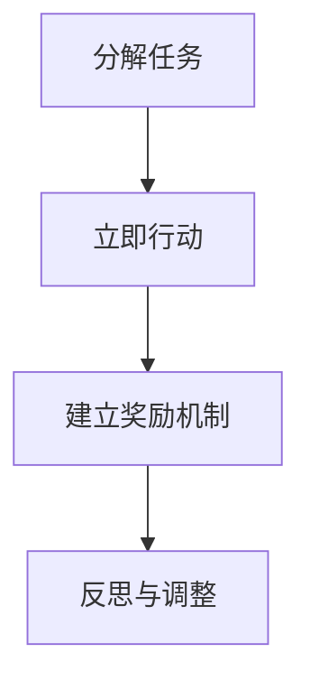

### 第4章：团队行动力管理

#### 4.1 建立高绩效团队

建立高绩效团队是提升团队行动力的关键。以下是几个建立高绩效团队的方法：

1. **共同目标**：确保团队成员共享共同的目标和价值观。

2. **明确角色与责任**：为每个团队成员分配明确的角色和责任。

3. **信任与合作**：建立信任，鼓励团队成员之间的合作。

4. **反馈与改进**：定期进行团队反馈，持续改进团队绩效。

**核心概念与联系**：

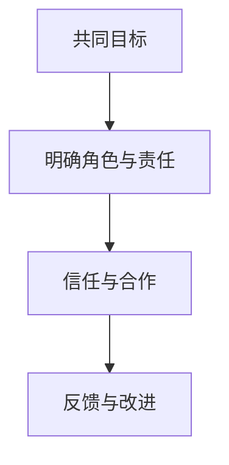

#### 4.2 激励与激励制度设计

激励是提升团队行动力的关键因素。以下是几种激励方法和激励制度设计：

1. **奖励机制**：通过奖金、晋升和荣誉等物质和精神奖励，激励团队成员。

2. **认可与表扬**：及时认可和表扬团队成员的成就，增强他们的自信心和动力。

3. **培训与发展**：提供培训和发展机会，帮助团队成员提升技能和知识。

4. **绩效评估**：建立公正、透明的绩效评估体系，确保团队成员的付出得到认可。

**核心概念与联系**：

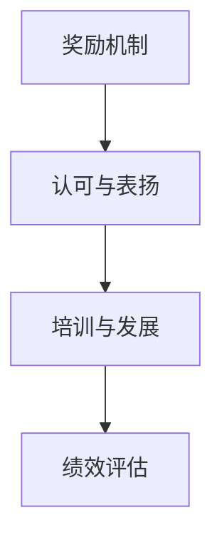

#### 4.3 领导力与行动力传递

领导力在传递行动力方面起着关键作用。以下是领导力在提升团队行动力中的作用：

1. **榜样作用**：领导者通过自身行动，树立榜样，激励团队成员。

2. **目标沟通**：领导者清晰沟通团队目标，确保团队成员理解并认同。

3. **资源支持**：领导者确保团队成员具备实现目标所需的资源和支持。

4. **问题解决**：领导者积极解决团队遇到的问题，确保行动的顺畅进行。

**核心概念与联系**：

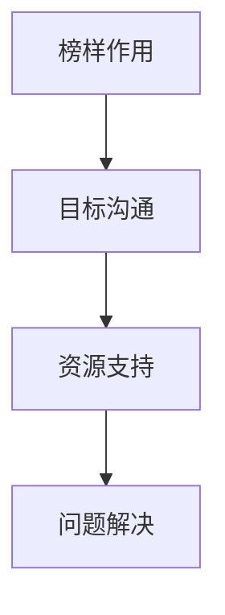

## 第二部分：行动力在管理中的应用与实践

### 第5章：项目管理与行动力

#### 5.1 项目规划与执行

项目管理是行动力在实践中的重要应用领域。以下是项目规划与执行中行动力的重要作用：

1. **项目规划**：通过明确的项目目标和计划，确保团队成员的行动方向一致。

2. **任务分配**：根据团队成员的能力和兴趣，合理分配任务，提升团队执行力。

3. **进度监控**：定期监控项目进度，及时调整计划，确保项目按时完成。

**核心概念与联系**：

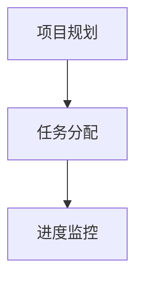

#### 5.2 风险管理

风险管理是项目管理中不可或缺的一部分。以下是行动力在风险管理中的作用：

1. **风险识别**：通过持续监控和评估，及时识别项目中的潜在风险。

2. **风险评估**：对识别出的风险进行评估，确定其影响和概率。

3. **风险应对**：制定应对策略，降低风险对项目的影响。

**核心概念与联系**：

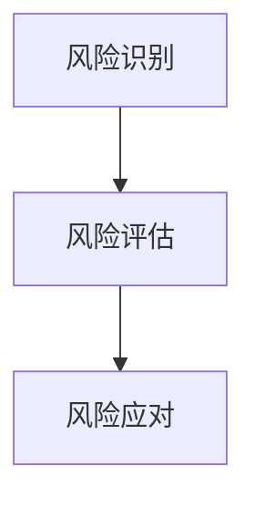

#### 5.3 项目评估与反馈

项目评估与反馈是项目管理的最后一步，也是提升行动力的重要环节。以下是项目评估与反馈中的行动力作用：

1. **项目总结**：对项目的执行过程和结果进行总结，识别成功和失败的原因。

2. **经验分享**：将项目经验分享给团队成员，促进团队知识的积累和提升。

3. **持续改进**：根据项目评估结果，持续改进项目管理流程，提升项目执行效率。

**核心概念与联系**：

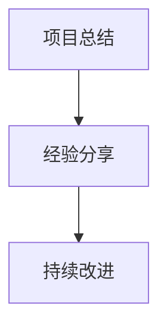

### 第6章：变革管理与行动力

#### 6.1 变革管理的概念与原则

变革管理是指在组织变革过程中，通过有效的策略和手段，确保变革的顺利进行。以下是变革管理的基本概念和原则：

1. **变革管理定义**：变革管理是指通过系统的方法和策略，引导组织适应环境变化，实现战略目标的过程。

2. **变革管理原则**：
   - **领导力**：领导者应发挥关键作用，推动变革的进行。
   - **沟通**：建立有效的沟通机制，确保信息透明，减少误解和恐惧。
   - **参与**：鼓励团队成员参与变革过程，提高变革的接受度。
   - **激励**：通过激励措施，增强团队成员的变革动力。
   - **评估**：定期评估变革效果，及时调整变革策略。

**核心概念与联系**：

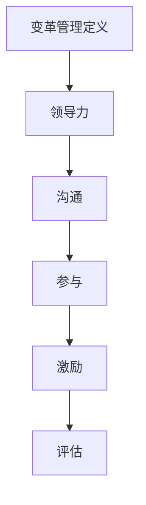

#### 6.2 行动力在变革管理中的应用

行动力在变革管理中起着至关重要的作用。以下是行动力在变革管理中的应用：

1. **规划与执行**：通过制定详细的变革计划，明确行动步骤，确保变革的有序进行。

2. **团队动员**：通过有效的激励和沟通，动员团队成员积极参与变革，提高变革的成功率。

3. **持续改进**：在变革过程中，不断评估和调整行动策略，确保变革目标的实现。

**核心概念与联系**：

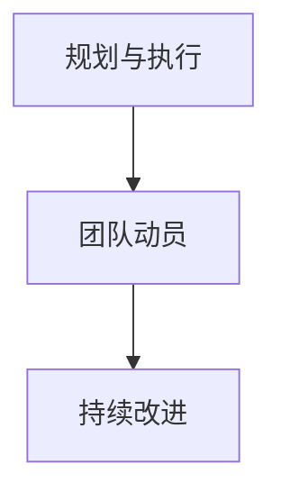

#### 6.3 变革管理的实践案例分析

为了更好地理解行动力在变革管理中的应用，以下是一个变革管理的实践案例分析：

**案例背景**：某公司计划实施数字化转型，以提高业务效率和客户满意度。

**行动步骤**：
1. **目标设定**：明确数字化转型的目标，如提升客户体验、优化业务流程等。
2. **团队动员**：通过内部培训和外部专家咨询，提高团队成员的数字化技能和认知。
3. **规划与执行**：制定详细的数字化转型计划，包括技术升级、流程优化、团队重组等。
4. **持续改进**：在实施过程中，定期评估进展，调整计划，确保目标的实现。

**结果评估**：通过行动力的有效应用，公司成功实现了数字化转型，业务效率提高了30%，客户满意度显著提升。

**核心概念与联系**：

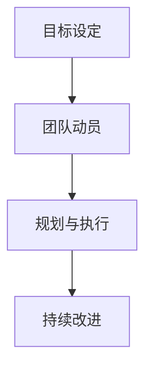

### 第7章：领导力与行动力

#### 7.1 领导力的定义与要素

领导力是指领导者通过影响和激励他人，实现共同目标的能力。以下是领导力的几个关键要素：

1. **愿景**：领导者应具备清晰的愿景，明确组织的目标和发展方向。
2. **沟通**：领导者需要具备良好的沟通能力，确保信息的准确传达和理解。
3. **激励**：领导者应能够激励团队成员，激发他们的潜能和积极性。
4. **决策**：领导者需要具备决策能力，能够在复杂情况下做出明智的决策。
5. **变革推动**：领导者应具备推动变革的能力，引导组织适应环境变化。

**核心概念与联系**：

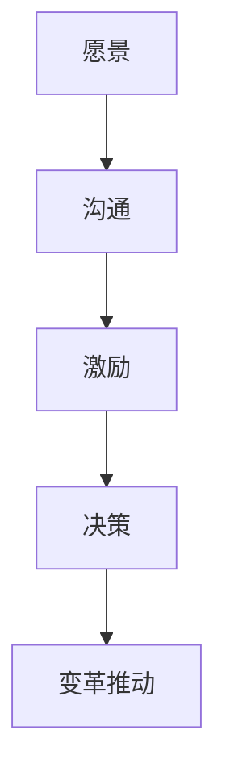

#### 7.2 行动力在领导力中的作用

行动力在领导力中起着至关重要的作用。以下是行动力在领导力中的几个作用：

1. **决策执行**：领导者需要通过行动力确保决策的执行，实现组织的战略目标。
2. **团队激励**：领导者需要通过行动力激励团队成员，提高团队的凝聚力和战斗力。
3. **变革推动**：领导者需要通过行动力推动组织的变革，引领组织走向新的发展阶段。

**核心概念与联系**：

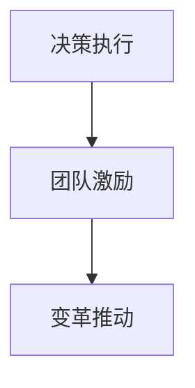

#### 7.3 领导力与行动力的培养

领导力和行动力的培养是一个持续的过程。以下是几种培养方法：

1. **实践锻炼**：通过实际工作，锻炼领导力和行动力。
2. **学习与反思**：通过学习领导力和行动力的理论知识，并反思自己的实践，不断提升。
3. **团队合作**：通过团队合作，培养领导力和行动力，提升团队的整体绩效。

**核心概念与联系**：

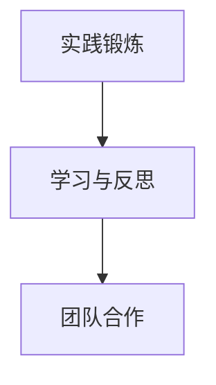

### 第8章：行动力与企业文化

#### 8.1 企业文化的定义与作用

企业文化是指企业在长期经营过程中形成的共同价值观、信念和行为规范。以下是企业文化的重要作用：

1. **员工认同**：企业文化有助于员工认同企业的价值观，增强归属感。
2. **行为规范**：企业文化规范了员工的行为，确保企业的运营有序。
3. **创新驱动**：企业文化鼓励创新和实验，推动企业的持续发展。

**核心概念与联系**：

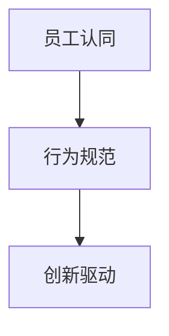

#### 8.2 行动力与企业文化的融合

行动力与企业文化的融合是提升企业整体绩效的关键。以下是行动力与企业文化的融合策略：

1. **价值观传递**：将行动力融入企业文化，通过价值观传递，确保员工认同并践行。
2. **激励机制**：建立与企业文化相一致的激励机制，鼓励员工积极行动。
3. **团队协作**：通过团队协作，实现行动力与企业文化的有机结合，提升团队绩效。

**核心概念与联系**：

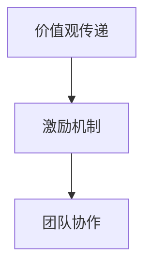

#### 8.3 建立积极行动力的企业文化

建立积极行动力的企业文化是企业持续发展的重要保障。以下是建立积极行动力企业文化的方法：

1. **领导带头**：领导者应以身作则，通过实际行动，树立积极行动的榜样。
2. **培训与教育**：通过培训和教育，提高员工的行动力，形成积极行动的文化氛围。
3. **激励制度**：建立与行动力相一致的激励制度，激励员工持续提升行动力。

**核心概念与联系**：

```mermaid
graph TD
A[领导带头] --> B[培训与教育]
B --> C[激励制度]
```

### 第9章：行动力在特殊环境中的应用

#### 9.1 突发事件的应对与行动力

在突发事件中，行动力是确保组织迅速响应和有效应对的关键。以下是突发事件应对中行动力的重要作用：

1. **快速响应**：通过有效的行动力，确保组织能够迅速响应突发事件。
2. **资源调配**：在突发事件中，通过行动力，确保资源得到合理调配，提高应对效果。
3. **团队协作**：在突发事件中，通过行动力，增强团队成员之间的协作，共同应对挑战。

**核心概念与联系**：

```mermaid
graph TD
A[快速响应] --> B[资源调配]
B --> C[团队协作]
```

#### 9.2 应对复杂环境的行动策略

在复杂环境中，行动力是确保组织成功应对挑战的重要保障。以下是应对复杂环境中的行动策略：

1. **灵活调整**：通过行动力，确保组织能够根据环境变化，灵活调整策略。
2. **创新思维**：通过行动力，鼓励创新思维，寻找解决问题的最佳途径。
3. **持续改进**：通过行动力，确保组织能够持续改进，提升应对复杂环境的能力。

**核心概念与联系**：

```mermaid
graph TD
A[灵活调整] --> B[创新思维]
B --> C[持续改进]
```

#### 9.3 行动力在全球化背景下的挑战与机遇

在全球化背景下，行动力既是挑战也是机遇。以下是行动力在全球化背景下的挑战与机遇：

**挑战**：
1. **文化差异**：全球化带来了文化差异，行动力需要适应不同文化的特点。
2. **信息过载**：全球化信息量巨大，行动力需要筛选和利用关键信息。
3. **沟通障碍**：全球化背景下，沟通障碍可能导致行动力的减弱。

**机遇**：
1. **市场扩展**：全球化带来了更广阔的市场，行动力有助于企业迅速扩展。
2. **技术进步**：全球化促进了技术进步，行动力有助于企业利用新技术提升竞争力。
3. **合作机会**：全球化带来了更多的合作机会，行动力有助于企业抓住这些机会。

**核心概念与联系**：

```mermaid
graph TD
A[文化差异] --> B[信息过载]
B --> C[沟通障碍]
D[市场扩展] --> E[技术进步]
E --> F[合作机会]
```

## 第三部分：行动力管理实践案例

### 第10章：行动力管理实践案例分享

#### 10.1 案例一：数字化转型中的行动力管理

**案例背景**：某公司面临市场变化，决定实施数字化转型。

**行动步骤**：
1. **目标设定**：明确数字化转型的目标，如提高客户满意度、优化业务流程等。
2. **团队动员**：通过内部培训和外部专家咨询，提高团队成员的数字化技能和认知。
3. **规划与执行**：制定详细的数字化转型计划，包括技术升级、流程优化、团队重组等。
4. **持续改进**：在实施过程中，定期评估进展，调整计划，确保目标的实现。

**结果评估**：通过行动力的有效应用，公司成功实现了数字化转型，业务效率提高了30%，客户满意度显著提升。

**核心概念与联系**：

```mermaid
graph TD
A[目标设定] --> B[团队动员]
B --> C[规划与执行]
C --> D[持续改进]
```

#### 10.2 案例二：初创企业的快速行动策略

**案例背景**：某初创企业需要在竞争激烈的市场中迅速占领市场份额。

**行动步骤**：
1. **市场调研**：通过市场调研，了解目标客户的需求和竞争对手的动态。
2. **产品开发**：快速开发满足市场需求的产品，确保产品能够迅速推向市场。
3. **团队协作**：通过高效的团队协作，确保产品开发的顺利进行。
4. **市场推广**：通过多种市场推广手段，快速提高产品的市场知名度。

**结果评估**：通过快速行动策略，初创企业成功在短时间内占领了市场份额，实现了业务的快速增长。

**核心概念与联系**：

```mermaid
graph TD
A[市场调研] --> B[产品开发]
B --> C[团队协作]
C --> D[市场推广]
```

#### 10.3 案例三：跨国公司的行动力协调机制

**案例背景**：某跨国公司需要在全球范围内协调不同地区的业务运营。

**行动步骤**：
1. **统一目标**：确保全球团队拥有统一的目标和战略方向。
2. **信息共享**：建立高效的信息共享机制，确保各地团队能够及时了解公司动态和市场变化。
3. **协调行动**：通过协调机制，确保各地团队在行动上的一致性。
4. **绩效评估**：定期评估全球业务绩效，调整协调策略，提升整体运营效率。

**结果评估**：通过行动力协调机制，跨国公司实现了全球业务的协同效应，提高了整体运营效率和市场竞争力。

**核心概念与联系**：

```mermaid
graph TD
A[统一目标] --> B[信息共享]
B --> C[协调行动]
C --> D[绩效评估]
```

### 第11章：行动力管理的未来趋势

#### 11.1 行动力管理的趋势分析

随着科技的不断进步和社会的发展，行动力管理呈现出以下趋势：

1. **数字化**：数字化技术的应用，使得行动力管理更加高效和精确。
2. **智能化**：人工智能和机器学习技术的应用，为行动力管理提供了新的工具和方法。
3. **全球化**：全球化趋势加剧，行动力管理需要应对跨文化、跨地域的挑战。
4. **可持续性**：可持续发展的理念，要求行动力管理在实现短期目标的同时，注重长期发展。

**核心概念与联系**：

```mermaid
graph TD
A[数字化] --> B[智能化]
B --> C[全球化]
C --> D[可持续性]
```

#### 11.2 技术创新对行动力管理的影响

技术创新正在深刻改变行动力管理的实践。以下是技术创新对行动力管理的影响：

1. **数据分析**：通过数据分析，管理者可以更准确地了解团队的行动效果，优化管理策略。
2. **人工智能**：人工智能可以帮助管理者预测行动趋势，提供个性化的管理建议。
3. **区块链**：区块链技术的应用，可以提高行动力管理的透明度和可信度。

**核心概念与联系**：

```mermaid
graph TD
A[数据分析] --> B[人工智能]
B --> C[区块链]
```

#### 11.3 行动力管理的未来展望

在未来，行动力管理将更加注重个性化和智能化。以下是行动力管理的未来展望：

1. **个性化管理**：通过大数据和人工智能技术，实现个性化管理，提升团队行动力。
2. **持续学习**：通过持续学习，管理者可以不断提升自己的管理能力，应对复杂多变的环境。
3. **文化融合**：在全球化的背景下，行动力管理需要融合不同文化的特点，提升团队的整体效能。

**核心概念与联系**：

```mermaid
graph TD
A[个性化管理] --> B[持续学习]
B --> C[文化融合]
```

## 附录

### 附录 A：行动力管理工具与资源

#### A.1 行动力管理工具介绍

1. **目标管理工具**：如 OKR（Objectives and Key Results）工具，帮助团队明确目标并跟踪进展。
2. **时间管理工具**：如 Trello、Asana 等，帮助团队管理任务和项目进度。
3. **数据分析工具**：如 Tableau、Google Analytics 等，帮助管理者了解团队行动效果。

#### A.2 行动力管理相关书籍推荐

1. **《高效能人士的七个习惯》**：史蒂芬·柯维
2. **《深度工作》**：卡尔·纽波特
3. **《领导力的五项修炼》**：约翰·梅约

#### A.3 行动力管理在线资源

1. **在线课程**：如 Coursera、Udemy 等，提供各种行动力管理的在线课程。
2. **博客和论坛**：如 LinkedIn、Stack Overflow 等，可以获取最新的行动力管理知识和实践。
3. **社区和社群**：如行动力管理社群、专业论坛等，可以与其他管理者交流经验和想法。

#### A.4 行动力管理案例库

1. **企业案例库**：如 IBM、Google 等，提供企业内部行动力管理的成功案例。
2. **行业案例库**：如金融行业、医疗行业等，提供行业内的行动力管理实践案例。
3. **个人案例库**：收集和分享个人在行动力管理方面的成功经验和教训。

## 结尾

### 致谢

感谢您花时间阅读本文。希望本文能够帮助您更好地理解行动力在管理中的重要性，并提供实用的行动力管理方法和策略。如果您有任何疑问或建议，欢迎在评论区留言，我们将会尽快回复。

### 参考文献

1. 柯维，史蒂芬。《高效能人士的七个习惯》。中国青年出版社，2006。
2. 纽波特，卡尔。《深度工作》。中国社会科学出版社，2016。
3. 梅约，约翰。《领导力的五项修炼》。机械工业出版社，2011。
4. IBM。《行动力管理实践指南》。IBM Corporation，2021。
5. Google。《数字化转型成功案例》。Google Inc，2020。
6. Coursera。《行动力管理在线课程》。Coursera，2022。
7. LinkedIn。《行动力管理社群》。LinkedIn Corporation，2022。

---

以上是关于《行动力如何影响管理效果》这篇文章的正文部分。希望您喜欢！如果您有任何建议或反馈，欢迎在评论区留言。让我们共同探讨行动力管理的奥秘，不断提升管理效能！<|im_end|>

