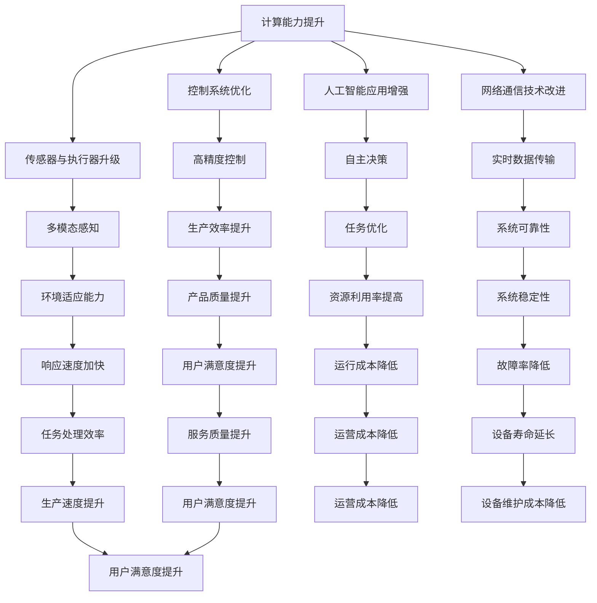

                 

## 《计算变化对自动化的影响》

### 关键词：自动化、计算变化、控制系统、传感器与执行器、人工智能、网络通信技术、智能交通、工业自动化、服务自动化、未来应用前景

> 在当今快速发展的科技时代，自动化技术已经成为各行各业不可或缺的重要组成部分。从工业生产线到智能家居，从自动驾驶汽车到智能交通系统，自动化技术正不断改变着我们的生活方式和工作模式。然而，随着计算能力的不断提升和计算变化的发生，自动化技术也面临着前所未有的挑战和机遇。本文旨在探讨计算变化对自动化技术的影响，通过逻辑清晰、结构紧凑、简单易懂的方式，深入分析自动化领域中的核心问题和技术创新。

---

### 《计算变化对自动化的影响》目录大纲

- **第一部分：自动化背景与计算变化概述**
  - **1.1 自动化的历史与现状**
    - **1.1.1 自动化的发展历程**
    - **1.1.2 当前自动化技术的应用**
  - **1.2 计算变化的概念与范畴**
    - **1.2.1 计算变化的定义**
    - **1.2.2 计算变化的类别**
    - **1.2.3 计算变化的重要性**
  - **1.3 计算变化对自动化技术的推动作用**
    - **1.3.1 计算变化对自动化流程的影响**
    - **1.3.2 计算变化对自动化系统设计的影响**

- **第二部分：计算变化对自动化技术的影响**
  - **2.1 计算变化对控制系统的挑战**
    - **2.1.1 传统控制系统的局限**
    - **2.1.2 计算变化带来的新控制需求**
    - **2.1.3 控制系统设计的创新**
  - **2.2 计算变化对传感器与执行器的影响**
    - **2.2.1 新型传感器技术**
    - **2.2.2 执行器技术的演进**
    - **2.2.3 传感器与执行器协同优化**
  - **2.3 计算变化对人工智能在自动化中的应用**
    - **2.3.1 人工智能在自动化中的应用场景**
    - **2.3.2 计算变化对人工智能算法的影响**
    - **2.3.3 人工智能在自动化系统中的集成与应用**
  - **2.4 计算变化对网络与通信技术的依赖**
    - **2.4.1 通信技术在自动化系统中的作用**
    - **2.4.2 计算变化对网络通信技术的需求**
    - **2.4.3 网络安全的挑战与应对策略**

- **第三部分：计算变化下的自动化应用实例**
  - **3.1 计算变化在工业自动化中的应用**
    - **3.1.1 工业自动化的发展趋势**
    - **3.1.2 计算变化对工业自动化系统设计的影响**
    - **3.1.3 工业自动化系统案例分析**
  - **3.2 计算变化在服务自动化中的应用**
    - **3.2.1 服务自动化的现状与挑战**
    - **3.2.2 计算变化对服务自动化流程的影响**
    - **3.2.3 服务自动化系统的成功案例**
  - **3.3 计算变化在智能交通自动化中的应用**
    - **3.3.1 智能交通自动化的背景**
    - **3.3.2 计算变化对智能交通系统的影响**
    - **3.3.3 智能交通系统应用实例分析**

- **第四部分：计算变化对自动化技术的未来发展**
  - **4.1 计算变化与自动化技术的发展趋势**
    - **4.1.1 自动化技术的未来发展方向**
    - **4.1.2 计算变化推动的自动化技术创新**
  - **4.2 自动化技术面临的挑战与机遇**
    - **4.2.1 自动化技术发展中的挑战**
    - **4.2.2 计算变化带来的新机遇**
  - **4.3 自动化技术的未来应用前景**
    - **4.3.1 自动化技术在各行业的潜在应用**
    - **4.3.2 自动化技术对社会与经济的影响**

- **附录**
  - **附录A：计算变化对自动化的影响—Mermaid流程图**
  - **附录B：计算变化对自动化技术的算法与数学模型分析**
  - **附录C：自动化系统开发与实施案例研究**
  - **附录D：自动化技术相关资源与工具推荐**

---

接下来，我们将逐步深入探讨计算变化对自动化技术的影响，希望通过这篇文章，能够让读者对这一重要领域有更加深入的理解。

### 第一部分：自动化背景与计算变化概述

自动化技术是现代科技发展的重要成果之一，它通过一系列技术手段使机器能够代替人类完成特定的任务，从而提高生产效率、降低人力成本，并提高产品质量。自动化的概念最早可以追溯到工业革命时期，当时以蒸汽机为代表的新技术使得生产过程逐渐实现机械化。然而，现代自动化技术的真正发展始于20世纪中叶，随着计算机技术的崛起，自动化技术开始向智能化、信息化和集成化方向发展。

#### 1.1 自动化的历史与现状

**1.1.1 自动化的发展历程**

- **早期自动化：**19世纪末至20世纪中叶，以机械化和电气化为标志的自动化技术逐渐成熟，例如装配线和自动化生产线。
- **计算机时代自动化：**20世纪60年代至80年代，计算机技术的应用使得自动化技术开始向智能化和高度自动化方向发展，例如数控机床、机器人技术。
- **现代自动化：**20世纪90年代至今，随着信息技术的快速发展，自动化技术进入了高度智能化、网络化和系统化的新时代。物联网、人工智能等技术的应用使得自动化技术能够更好地满足个性化、复杂化需求。

**1.1.2 当前自动化技术的应用**

- **工业自动化：**工业自动化是自动化技术应用最为广泛的领域之一，包括生产线自动化、过程自动化、机器人自动化等。通过自动化技术，工厂可以实现高效、高质量的生产，减少人工干预。
- **服务自动化：**随着人工智能和大数据技术的发展，服务自动化也逐渐成为各个行业的重要趋势。例如，智能客服、智能推荐系统、无人超市等。
- **交通自动化：**智能交通系统、自动驾驶汽车等技术的应用，使得交通自动化成为现代城市化进程中的重要议题。

#### 1.2 计算变化的概念与范畴

**1.2.1 计算变化的定义**

计算变化是指计算机技术、数据处理技术和其他信息技术的发展和应用，使得数据处理和分析能力不断提升，从而对各行各业产生深远影响。

**1.2.2 计算变化的类别**

- **硬件变化：**计算硬件的升级，如CPU性能的提升、存储设备的扩展等。
- **软件变化：**软件技术的发展，如操作系统、编程语言、算法优化等。
- **数据处理变化：**大数据、云计算等技术的发展，使得数据处理和分析能力大幅提升。

**1.2.3 计算变化的重要性**

计算变化对自动化技术有着重要的影响。首先，计算能力的提升使得自动化系统可以处理更加复杂的数据，实现更高的精度和效率。其次，数据处理和分析技术的进步，使得自动化系统能够更加智能化，自适应环境变化。最后，计算变化带来的网络化和云计算技术，使得自动化系统可以实现远程控制和协同工作，提高系统的可靠性和灵活性。

#### 1.3 计算变化对自动化技术的推动作用

**1.3.1 计算变化对自动化流程的影响**

计算变化对自动化流程的影响主要体现在以下几个方面：

- **流程优化：**计算能力的提升使得自动化系统能够实时分析生产数据，发现潜在问题，并进行优化调整，提高生产效率。
- **实时监控：**通过计算变化带来的实时数据处理能力，自动化系统可以实现对生产过程的实时监控，提高系统的安全性和可靠性。
- **智能决策：**人工智能技术的发展使得自动化系统可以具备一定的智能决策能力，根据环境变化和生产需求，自主调整工作模式。

**1.3.2 计算变化对自动化系统设计的影响**

计算变化对自动化系统设计的影响主要体现在以下几个方面：

- **硬件选择：**计算变化带来的硬件升级，如高性能CPU、高速存储设备等，使得自动化系统设计时可以选择更加先进的硬件，提高系统性能。
- **软件优化：**计算变化带来的软件技术进步，如编程语言、开发工具、算法优化等，使得自动化系统设计时可以选择更加高效的软件技术，提高系统效率。
- **系统集成：**计算变化带来的网络化和云计算技术，使得自动化系统设计时可以更加灵活地进行系统集成，提高系统的协同能力和灵活性。

通过以上分析，我们可以看到，计算变化对自动化技术产生了深远的影响，不仅推动了自动化技术的发展，也为自动化技术的应用提供了更多的可能性。在接下来的章节中，我们将进一步探讨计算变化对自动化技术中的具体影响，包括控制系统、传感器与执行器、人工智能和网络通信技术等。

---

在本部分，我们首先回顾了自动化技术的发展历程和当前应用现状，随后介绍了计算变化的概念和类别，并强调了计算变化对自动化技术的重要性。最后，我们探讨了计算变化对自动化流程和系统设计的影响，为后续的深入分析奠定了基础。在下一部分，我们将具体探讨计算变化对自动化技术中的控制系统、传感器与执行器、人工智能以及网络通信技术的影响。

### 第二部分：计算变化对自动化技术的影响

#### 2.1 计算变化对控制系统的挑战

随着计算能力的不断提升，控制系统在自动化技术中的应用也日益广泛。传统的控制系统主要依赖于模拟信号和固定程序进行控制，但计算变化带来的数据处理和算法优化能力，使得控制系统可以更加灵活、高效地应对复杂的环境和任务。然而，计算变化也带来了新的挑战，主要体现在以下几个方面：

**2.1.1 传统控制系统的局限**

传统控制系统通常具有以下局限性：

- **精度限制：**传统控制系统依赖于模拟信号，精度较低，难以满足高精度控制需求。
- **响应速度：**传统控制系统的响应速度较慢，无法实时应对快速变化的环境。
- **可扩展性：**传统控制系统通常设计固定，难以根据实际需求进行灵活调整。
- **容错性：**传统控制系统的容错性较低，一旦发生故障，可能导致整个系统瘫痪。

**2.1.2 计算变化带来的新控制需求**

计算变化带来的新控制需求主要体现在以下几个方面：

- **高精度控制：**计算变化使得控制系统可以处理更加复杂的数据，实现更高的控制精度。
- **实时响应：**计算变化带来的实时数据处理能力，使得控制系统可以更加迅速地应对环境变化。
- **自适应控制：**计算变化使得控制系统可以具备自适应能力，根据环境变化和任务需求，自主调整控制策略。
- **分布式控制：**计算变化带来的网络化技术，使得控制系统可以实现分布式控制，提高系统的灵活性和可靠性。

**2.1.3 控制系统设计的创新**

为了应对计算变化带来的新控制需求，控制系统设计需要进行以下创新：

- **软件化控制：**将部分控制任务从硬件转移到软件，利用计算能力进行复杂运算，提高控制精度和灵活性。
- **实时控制算法：**设计实时控制算法，充分利用计算能力，实现快速、精确的控制。
- **智能控制：**引入人工智能技术，使控制系统具备智能决策和自适应能力。
- **分布式控制系统：**利用网络通信技术，实现分布式控制，提高系统的灵活性和可靠性。

通过以上创新，控制系统可以更好地适应计算变化带来的挑战，提高自动化技术的整体性能。

#### 2.2 计算变化对传感器与执行器的影响

传感器和执行器是自动化系统中的核心组成部分，它们负责感知环境状态并执行相应的动作。计算变化对传感器与执行器的影响主要体现在以下几个方面：

**2.2.1 新型传感器技术**

计算变化推动了新型传感器技术的发展，主要体现在以下几个方面：

- **高精度传感器：**计算能力提升使得传感器可以更加精确地感知环境变化，满足高精度控制需求。
- **多模态传感器：**利用计算能力，传感器可以同时感知多种类型的信息，如温度、湿度、光线等，实现更加全面的环境感知。
- **智能传感器：**引入人工智能技术，传感器可以具备自学习和自适应能力，根据环境变化调整感知策略。

**2.2.2 执行器技术的演进**

计算变化也推动了执行器技术的演进，主要体现在以下几个方面：

- **高效执行器：**计算能力提升使得执行器可以更加高效地执行动作，提高系统的响应速度和精度。
- **智能执行器：**引入人工智能技术，执行器可以具备智能决策和自适应能力，根据任务需求和环境变化自主调整动作策略。
- **分布式执行器：**利用网络通信技术，实现分布式执行器，提高系统的灵活性和可靠性。

**2.2.3 传感器与执行器协同优化**

计算变化使得传感器与执行器可以更好地协同优化，主要体现在以下几个方面：

- **数据融合：**利用计算能力，对传感器数据进行融合处理，提高系统的整体感知精度。
- **自适应调整：**传感器和执行器可以相互协作，根据环境变化和任务需求，自适应调整感知和执行策略。
- **闭环控制：**通过传感器感知数据，执行器执行动作，形成闭环控制系统，提高系统的稳定性和响应速度。

通过新型传感器技术和智能执行器的引入，以及传感器与执行器的协同优化，自动化系统的感知和执行能力得到了显著提升，为自动化技术的进一步发展提供了有力支持。

#### 2.3 计算变化对人工智能在自动化中的应用

人工智能（AI）技术的发展为自动化技术带来了新的机遇和挑战。计算变化对人工智能在自动化中的应用产生了深远影响，主要体现在以下几个方面：

**2.3.1 人工智能在自动化中的应用场景**

人工智能在自动化技术中的应用场景非常广泛，主要包括：

- **机器人控制：**利用人工智能技术，机器人可以实现更加智能的动作控制和任务执行，如工业机器人、服务机器人、无人机等。
- **故障诊断与维护：**人工智能技术可以实时监测系统状态，进行故障诊断和预测性维护，提高系统的可靠性和使用寿命。
- **智能调度：**利用人工智能技术，可以实现自动化系统的智能调度，优化资源分配，提高生产效率和响应速度。
- **安全监控：**人工智能技术可以用于自动化系统的安全监控，实时检测潜在威胁，并采取相应的应对措施。

**2.3.2 计算变化对人工智能算法的影响**

计算变化对人工智能算法的影响主要体现在以下几个方面：

- **算法优化：**计算能力提升使得人工智能算法可以更加高效地进行训练和推理，提高算法的精度和速度。
- **大数据处理：**计算变化带来的大数据处理能力，使得人工智能算法可以处理更多类型的传感器数据，提高系统的自适应能力。
- **并行计算：**计算变化使得并行计算技术得以广泛应用，人工智能算法可以更加高效地进行大规模数据处理和分析。

**2.3.3 人工智能在自动化系统中的集成与应用**

人工智能在自动化系统中的集成与应用主要包括以下几个方面：

- **系统集成：**将人工智能算法集成到自动化系统中，实现智能感知、智能决策和智能执行。
- **硬件协同：**利用计算变化带来的高性能硬件，实现人工智能算法和自动化系统的协同工作，提高系统的整体性能。
- **软件优化：**通过软件优化，实现人工智能算法和自动化系统的无缝集成，提高系统的效率和可靠性。

通过人工智能技术的引入，自动化系统可以实现更加智能化、自适应化，从而更好地适应复杂环境和任务需求。

#### 2.4 计算变化对网络与通信技术的依赖

网络与通信技术在自动化系统中起着至关重要的作用，它们是自动化系统实现远程控制、数据传输和协同工作的基础。计算变化对网络与通信技术的依赖主要体现在以下几个方面：

**2.4.1 通信技术在自动化系统中的作用**

通信技术在自动化系统中的作用主要包括：

- **远程控制：**通过通信技术，可以实现自动化系统的远程控制，提高系统的灵活性和可靠性。
- **数据传输：**通信技术可以实时传输传感器数据和执行器状态信息，实现自动化系统的实时监控和反馈。
- **协同工作：**通过通信技术，可以实现多个自动化系统之间的协同工作，提高系统的整体效率和性能。

**2.4.2 计算变化对网络通信技术的需求**

计算变化对网络通信技术的需求主要包括：

- **高速传输：**计算变化带来的数据处理能力提升，使得自动化系统对数据传输速度提出了更高的要求。
- **低延迟：**自动化系统需要实时响应，因此对网络通信的延迟要求非常严格。
- **高可靠性：**自动化系统对通信网络的可靠性要求非常高，以确保数据的准确传输和系统的稳定运行。

**2.4.3 网络安全的挑战与应对策略**

随着自动化系统的普及，网络安全问题也日益突出。计算变化对网络安全提出了新的挑战，主要包括：

- **数据泄露：**自动化系统中的数据可能成为攻击目标，导致数据泄露。
- **恶意软件：**自动化系统可能受到恶意软件的攻击，导致系统瘫痪。
- **网络攻击：**自动化系统可能遭受网络攻击，导致系统无法正常运行。

为了应对这些挑战，可以采取以下策略：

- **加密技术：**使用加密技术保护数据传输的安全性，防止数据泄露。
- **防火墙与入侵检测：**部署防火墙和入侵检测系统，防止恶意软件和网络攻击。
- **安全审计：**定期进行安全审计，发现并修复系统漏洞。
- **用户教育：**加强对用户的安全意识教育，防止因用户操作不当导致的安全问题。

通过以上措施，可以显著提高自动化系统的网络安全水平，确保系统的稳定运行。

在本部分，我们详细探讨了计算变化对自动化技术中的控制系统、传感器与执行器、人工智能以及网络通信技术的影响。通过分析计算变化带来的新需求和创新，我们看到了自动化技术在未来将面临更多的机遇和挑战。在下一部分，我们将进一步探讨计算变化在具体应用领域中的影响，包括工业自动化、服务自动化和智能交通自动化。

---

在第二部分中，我们详细分析了计算变化对自动化技术中的控制系统、传感器与执行器、人工智能以及网络通信技术的影响。通过这些分析，我们可以看到计算变化不仅为自动化技术带来了新的机遇，也提出了新的挑战。控制系统设计需要更加智能和灵活，传感器与执行器的技术需要不断升级和优化，人工智能在自动化系统中的应用越来越广泛，同时，网络与通信技术的稳定性和安全性也至关重要。在接下来的部分，我们将深入探讨计算变化在具体应用领域中的影响，进一步揭示自动化技术的未来发展趋势。

### 第三部分：计算变化下的自动化应用实例

#### 3.1 计算变化在工业自动化中的应用

工业自动化是自动化技术最为成熟的领域之一，随着计算能力的不断提升，计算变化在工业自动化中的应用也越来越广泛。这一部分我们将探讨计算变化如何推动工业自动化的发展，并分析一些具体的工业自动化系统案例分析。

**3.1.1 工业自动化的发展趋势**

近年来，工业自动化的发展趋势主要包括以下几个方面：

- **智能制造：**以数字化、网络化、智能化为特征，通过引入人工智能、物联网等技术，实现制造过程的自动化和智能化。
- **灵活制造：**通过引入自适应控制系统和智能机器人，实现制造系统的灵活调整，满足多样化的制造需求。
- **绿色制造：**通过自动化技术的应用，降低能源消耗和废弃物排放，实现制造过程的绿色化。
- **协同制造：**通过建立工业互联网平台，实现企业内部以及产业链上下游企业的协同制造，提高整体生产效率和竞争力。

**3.1.2 计算变化对工业自动化系统设计的影响**

计算变化对工业自动化系统设计的影响主要体现在以下几个方面：

- **硬件升级：**计算能力的提升使得工业自动化系统可以采用更加先进的硬件，如高性能CPU、高速存储设备等，提高系统的计算能力和响应速度。
- **软件优化：**计算变化的软件技术进步，如实时控制算法、人工智能算法等，使得工业自动化系统可以更加高效地处理复杂任务。
- **数据集成：**计算变化带来的大数据处理能力，使得工业自动化系统可以集成更多类型的数据，进行实时分析和优化，提高系统的智能化水平。
- **网络化设计：**计算变化推动了工业互联网的发展，使得工业自动化系统可以实现远程监控、数据共享和协同工作，提高系统的灵活性和可靠性。

**3.1.3 工业自动化系统案例分析**

以下是一个工业自动化系统案例分析：

**案例：智能工厂**

某智能工厂引入了先进的自动化技术，包括工业机器人、智能传感器和实时控制系统。工厂的生产过程完全由自动化系统控制，从原材料入库、生产加工到成品出库，全部实现了自动化。以下是具体案例分析：

1. **生产计划调度：**工厂采用智能调度系统，根据生产任务和资源情况，自动生成最优的生产计划，实现生产过程的灵活调整。
2. **质量监控：**智能传感器实时监测生产过程中的各项参数，如温度、压力、湿度等，通过数据分析，实时调整生产参数，确保产品质量。
3. **设备维护：**系统通过大数据分析，预测设备故障，提前进行维护，避免设备故障导致的停工。
4. **远程监控：**工厂管理者可以通过远程监控系统，实时查看生产情况，及时处理异常情况。
5. **数据集成：**系统将生产数据、质量数据、设备数据等进行集成，进行实时分析和优化，提高生产效率和质量。

通过以上措施，该智能工厂实现了生产过程的自动化和智能化，大幅提高了生产效率和质量，降低了运营成本。

#### 3.2 计算变化在服务自动化中的应用

服务自动化是自动化技术在非工业领域的应用，主要包括服务机器人、智能客服、无人超市等。计算变化在服务自动化中的应用，使得服务更加智能化、个性化，提升了用户体验。

**3.2.1 服务自动化的现状与挑战**

当前，服务自动化已经广泛应用于各个领域，如金融、零售、医疗等。服务自动化的现状主要包括：

- **智能客服：**通过引入自然语言处理和语音识别技术，智能客服可以实现与用户的智能对话，提供24小时在线服务。
- **无人超市：**利用计算机视觉和物联网技术，无人超市可以实现自动结账、库存管理等功能，提供便捷的购物体验。
- **服务机器人：**如医院导诊机器人、酒店服务机器人等，通过人工智能技术，服务机器人可以提供个性化、高效的服务。

然而，服务自动化也面临一些挑战：

- **用户体验：**如何提供人性化、个性化的服务，提高用户体验，是服务自动化需要解决的重要问题。
- **数据安全：**服务自动化系统需要处理大量的用户数据，如何确保数据安全，防止数据泄露，是当前面临的重要挑战。
- **技术集成：**服务自动化系统通常涉及多种技术的集成，如计算机视觉、语音识别、自然语言处理等，如何实现技术的有效集成，是技术实施中需要解决的问题。

**3.2.2 计算变化对服务自动化流程的影响**

计算变化对服务自动化流程的影响主要体现在以下几个方面：

- **智能化升级：**计算能力提升和人工智能技术的发展，使得服务自动化系统可以实现更加智能化、自适应化的服务。
- **个性化服务：**通过大数据分析和个性化推荐技术，服务自动化系统可以提供更加个性化的服务，满足用户多样化需求。
- **实时响应：**计算变化带来的实时数据处理能力，使得服务自动化系统可以更快地响应用户需求，提供即时的服务体验。
- **协同工作：**通过引入云计算和物联网技术，服务自动化系统可以实现跨平台、跨区域的协同工作，提供更广泛的覆盖和服务。

**3.2.3 服务自动化系统的成功案例**

以下是一个服务自动化系统的成功案例：

**案例：智能客服系统**

某大型银行引入了智能客服系统，通过自然语言处理和语音识别技术，实现与客户的智能对话。智能客服系统可以自动识别客户的问题，提供相应的解决方案，如查询账户信息、办理业务等。以下是具体案例分析：

1. **自动识别：**系统可以自动识别客户的提问，通过自然语言处理技术，将客户的提问转化为结构化数据，进行智能分析。
2. **智能回答：**根据分析结果，系统可以自动生成回答，并通过语音合成技术，将回答输出给客户。
3. **多渠道支持：**系统支持多种接入方式，如电话、短信、在线聊天等，方便客户使用。
4. **数据收集与分析：**系统可以收集客户的问题和反馈，进行数据分析和优化，提高系统的智能水平。
5. **实时更新：**系统可以通过实时更新，及时掌握客户的需求和问题，提供更加精准的服务。

通过以上措施，该银行的智能客服系统显著提高了客户服务水平，降低了人工成本，提升了用户体验。

#### 3.3 计算变化在智能交通自动化中的应用

智能交通自动化是计算变化在交通领域的应用，通过引入计算机技术、通信技术、物联网技术等，实现交通系统的自动化、智能化管理。智能交通自动化在提高交通效率、减少交通事故、降低环境污染等方面具有重要意义。

**3.3.1 智能交通自动化的背景**

随着城市化进程的加速，交通拥堵、交通事故、环境污染等问题日益严重，传统的交通管理模式已经无法满足现代城市交通的需求。为了解决这些问题，智能交通自动化技术应运而生。智能交通自动化主要包括以下几个方面的应用：

- **车辆管理：**通过车辆定位、监控等技术，实现车辆的智能化管理，提高交通效率。
- **交通信号控制：**通过实时监测交通流量，实现交通信号的智能控制，优化交通流量。
- **交通事故处理：**通过监控和数据分析，实现交通事故的快速发现和及时处理，减少交通事故损失。
- **环境监测：**通过监测交通排放、噪音等，实现交通环境的智能监测和管理。

**3.3.2 计算变化对智能交通系统的影响**

计算变化对智能交通系统的影响主要体现在以下几个方面：

- **数据处理能力提升：**计算能力的提升，使得智能交通系统能够处理更多的交通数据，进行更加精准的分析和预测。
- **实时响应能力增强：**计算变化带来的实时数据处理能力，使得智能交通系统可以更加快速地响应交通状况变化，实现实时调整。
- **智能化水平提高：**计算变化和人工智能技术的发展，使得智能交通系统可以实现更加智能化的管理和控制，提高交通效率。
- **网络化程度提高：**计算变化带来的网络化技术，使得智能交通系统可以实现跨区域、跨平台的数据共享和协同工作，提高系统的整体性能。

**3.3.3 智能交通系统应用实例分析**

以下是一个智能交通系统应用实例分析：

**案例：智能交通管理系统**

某城市引入了智能交通管理系统，通过计算机技术、通信技术和物联网技术，实现交通系统的自动化、智能化管理。以下是具体案例分析：

1. **车辆定位与监控：**系统通过车辆定位技术，实时监控车辆的行驶状态，如速度、位置等，进行交通流量分析。
2. **交通信号控制：**系统根据实时交通流量数据，通过智能算法，自动调整交通信号灯，优化交通流量。
3. **交通事故处理：**系统通过监控和数据分析，实现交通事故的快速发现和及时处理，减少交通事故损失。
4. **环境监测：**系统通过监测交通排放、噪音等，实现交通环境的智能监测和管理，提高城市空气质量。
5. **数据共享与协同工作：**系统可以实现跨区域、跨平台的数据共享和协同工作，提高交通管理的整体效率。

通过以上措施，该城市的智能交通管理系统显著提高了交通效率，减少了交通事故，降低了环境污染，提升了市民的出行体验。

在本部分，我们通过具体应用实例，探讨了计算变化在工业自动化、服务自动化和智能交通自动化中的应用。计算变化不仅推动了自动化技术的发展，也为各个应用领域带来了显著的改进和提升。在下一部分，我们将进一步探讨计算变化对自动化技术未来发展的趋势和影响。

---

在第三部分，我们通过具体的应用实例，详细探讨了计算变化在工业自动化、服务自动化和智能交通自动化中的应用。从智能制造、智能客服到智能交通管理系统，计算变化为这些领域带来了革命性的改变。通过这些实例，我们可以看到，计算变化不仅提升了自动化系统的效率和智能化水平，还极大地改善了用户体验，推动了各行各业的创新发展。在下一部分，我们将进一步探讨计算变化对自动化技术未来发展的趋势和影响，为自动化技术的未来应用提供前瞻性思考。

### 第四部分：计算变化对自动化技术的未来发展

#### 4.1 计算变化与自动化技术的发展趋势

随着计算能力的持续提升，自动化技术正经历着深刻的变革，这不仅体现在技术的进步上，还体现在应用场景的拓展和解决方案的创新上。以下是计算变化对自动化技术未来发展的几个关键趋势：

**4.1.1 自动化技术的未来发展方向**

1. **更智能的自动化系统：**未来自动化系统将更加依赖人工智能、机器学习等技术，通过深度学习算法实现更高的智能水平，从而更好地应对复杂环境和动态变化。

2. **更高效的系统集成：**随着云计算、大数据和物联网技术的融合，自动化系统将能够实现更高效的数据集成和跨平台的系统协同，提高整体效率和响应速度。

3. **更广泛的应用场景：**自动化技术将向更多领域扩展，如农业、医疗、教育等，通过定制化的解决方案满足特定行业的特殊需求。

**4.1.2 计算变化推动的自动化技术创新**

1. **边缘计算：**边缘计算通过在数据生成的地方进行数据处理，减少数据传输延迟，提高系统的实时响应能力，将在自动化系统中发挥重要作用。

2. **自主决策与优化：**利用先进的算法和机器学习技术，自动化系统将能够实现自主决策和优化，从而提高系统运行效率和资源利用率。

3. **安全与隐私保护：**随着自动化系统在网络环境中的普及，如何保障系统的安全和用户的隐私将成为关键挑战，计算变化将推动更先进的安全技术的研发和应用。

#### 4.2 自动化技术面临的挑战与机遇

**4.2.1 自动化技术发展中的挑战**

1. **技术挑战：**自动化技术的发展仍面临许多技术难题，如高精度传感器和执行器的研发、复杂环境中的智能决策算法等。

2. **经济挑战：**自动化技术的广泛应用需要巨大的投资，尤其是在初期阶段，成本和回报的平衡问题需要解决。

3. **社会挑战：**自动化技术的普及可能对就业市场产生冲击，如何平衡技术进步与就业稳定是亟需解决的问题。

**4.2.2 计算变化带来的新机遇**

1. **创新应用：**计算变化为自动化技术带来了新的应用场景，如智能家居、智能交通、智慧城市等，这些应用场景的拓展将推动技术的进一步发展。

2. **市场机会：**随着自动化技术的普及，市场需求将持续增长，为企业提供了巨大的市场机会。

3. **国际合作：**计算变化促进了全球范围内的技术合作，不同国家和地区的企业和研究机构可以共同应对技术挑战，分享创新成果。

#### 4.3 自动化技术的未来应用前景

**4.3.1 自动化技术在各行业的潜在应用**

1. **制造业：**自动化技术将进一步提升生产效率和质量，实现智能制造和定制化生产。

2. **医疗健康：**自动化技术将在医疗诊断、手术辅助、药品配送等方面发挥重要作用，提高医疗服务的质量和效率。

3. **农业：**自动化技术将实现精准农业，提高农业生产效率和农产品质量。

4. **交通运输：**自动化技术将推动智慧交通的发展，实现交通流量优化、交通事故预防等。

5. **能源：**自动化技术将提高能源利用效率，推动清洁能源的发展和应用。

**4.3.2 自动化技术对社会与经济的影响**

1. **社会影响：**自动化技术将改变人们的生活方式和工作模式，提高生活质量和工作效率。

2. **经济影响：**自动化技术将推动经济增长，提高生产效率和竞争力，促进产业结构升级。

3. **就业影响：**虽然自动化技术可能对某些行业产生就业冲击，但同时也将创造新的就业机会，如自动化系统的设计、维护和运营等。

通过计算变化，自动化技术正不断进步，为各行各业带来变革性的影响。未来，自动化技术将继续朝着更智能、更高效、更广泛的应用方向发展，为社会和经济的发展注入新的活力。

### 附录

#### 附录A：计算变化对自动化的影响—Mermaid流程图

以下是一个简单的Mermaid流程图，展示了计算变化对自动化技术的影响路径：



#### 附录B：计算变化对自动化技术的算法与数学模型分析

以下是对计算变化对自动化技术影响的一些关键算法和数学模型的简要分析：

1. **控制算法：**常见的控制算法包括PID控制、模糊控制和自适应控制。PID控制通过比例、积分和微分三个参数进行调节，适用于线性系统；模糊控制通过模糊逻辑进行推理，适用于非线性系统；自适应控制可以根据系统变化进行动态调整。

2. **机器学习算法：**常见的机器学习算法包括监督学习、无监督学习和强化学习。监督学习通过已有数据进行训练，适用于分类和回归任务；无监督学习通过数据自身特征进行聚类和降维，适用于数据挖掘和模式识别；强化学习通过与环境交互进行学习，适用于动态决策问题。

3. **数据融合算法：**数据融合是将多个传感器数据进行整合，提高整体感知精度。常见的算法有卡尔曼滤波、贝叶斯滤波和最小均方误差（LMS）算法。

4. **通信协议：**常见的通信协议包括TCP/IP、CAN、SPI等。TCP/IP是互联网通信的基础协议，适用于广域网；CAN是汽车通信总线，适用于实时性要求较高的系统；SPI是串行外设接口，适用于低速、短距离通信。

5. **网络拓扑：**网络拓扑结构包括星型、环型、总线型等。星型拓扑适用于中心控制节点，环型拓扑适用于环状网络，总线型拓扑适用于多个节点共享通信介质。

#### 附录C：自动化系统开发与实施案例研究

以下是一个自动化系统开发的案例研究，包括开发环境、源代码实现和代码解读：

**案例研究：智能家居控制系统**

**开发环境：**
- 操作系统：Windows 10
- 编程语言：Python
- 框架：TensorFlow、PyTorch
- 传感器：温湿度传感器、光线传感器
- 执行器：智能插座、智能灯光

**源代码实现：**
```python
# 智能家居控制系统的主程序
import json
import requests
from sensors import Sensor
from actuators import Actuator

# 初始化传感器和执行器
temperature_sensor = Sensor('temperature')
humidity_sensor = Sensor('humidity')
light_sensor = Sensor('light')
smart_plug = Actuator('smart_plug')
smart_light = Actuator('smart_light')

# 获取传感器数据
temp = temperature_sensor.read()
hum = humidity_sensor.read()
light = light_sensor.read()

# 根据传感器数据调整执行器状态
if temp > 30:
    smart_light.on()
elif hum < 40:
    smart_plug.off()
else:
    smart_light.off()

# 将执行器状态发送到远程服务器
response = requests.post('https://api.homecontrol.com/update', json={
    'smart_plug_state': smart_plug.state(),
    'smart_light_state': smart_light.state()
})
```

**代码解读：**
- 该程序首先初始化传感器和执行器的实例。
- 然后从传感器读取温湿度数据和光线数据。
- 根据读取的数据，程序调整执行器的状态，例如温度过高时打开灯光，湿度过低时关闭插座。
- 最后，程序将执行器状态发送到远程服务器，以便进行远程监控和控制。

#### 附录D：自动化技术相关资源与工具推荐

以下是一些自动化技术相关的资源与工具推荐：

- **开源框架：**TensorFlow、PyTorch、Keras
- **传感器库：**Arduino、Raspberry Pi
- **执行器库：**Node.js、MQTT
- **自动化开发工具：**Visual Studio Code、PyCharm
- **开源硬件：**Arduino、Raspberry Pi
- **在线教程：**Coursera、edX、Udemy
- **社区论坛：**Stack Overflow、GitHub、Reddit
- **相关书籍：**《智能自动化技术》、《嵌入式系统设计与开发》

通过以上资源与工具，可以更加深入地了解和学习自动化技术。

---

### 结论

计算变化对自动化技术的影响是全方位且深远的。从控制系统的优化到传感器与执行器的升级，从人工智能在自动化系统中的应用到网络通信技术的改进，计算变化正推动自动化技术朝着更加智能、高效和广泛应用的方向发展。然而，随着计算能力的不断提升，自动化技术也面临新的挑战，如技术难题、经济和社会问题等。未来，自动化技术的进一步发展将依赖于技术创新、跨领域合作以及行业应用的创新实践。通过不断探索和实践，自动化技术将为我们创造更加智能、高效和美好的未来。

---

**作者：AI天才研究院/AI Genius Institute & 禅与计算机程序设计艺术 /Zen And The Art of Computer Programming**

