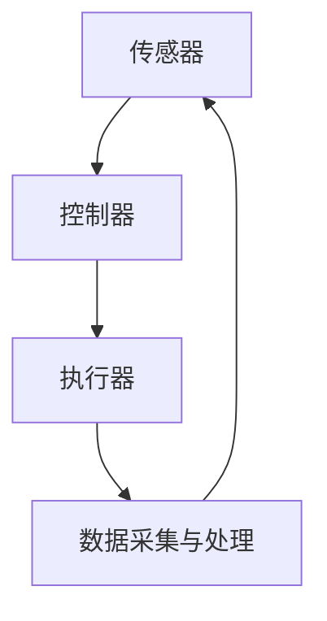

                 

# 《计算领域的自动化发展趋势》

## 关键词
- 自动化技术
- 计算领域
- 软件开发
- 质量保证
- 部署与运维
- 人工智能

## 摘要
随着计算机技术的迅猛发展，计算领域的复杂性不断增加。为了应对这一挑战，自动化技术逐渐成为计算领域的重要趋势。本文将深入探讨自动化技术的发展背景、应用场景及未来趋势，分析其在编程、测试、部署与运维以及人工智能等领域的实际案例。通过本文，读者将全面了解自动化技术对计算领域带来的变革，以及应对相关挑战的策略。

---

## 第一部分：自动化技术的发展背景

### 第1章：自动化技术的起源与发展

#### 1.1 自动化技术的概念与历史

自动化技术是指利用计算机、网络、传感器等现代信息技术，使生产、管理、服务等过程中的操作能够自动进行，从而提高效率、减少人力成本的技术体系。自动化技术的起源可以追溯到20世纪初期，当时人们开始研究如何通过机械和电气装置来替代人工操作。

**核心概念与联系**：自动化技术的基本概念包括传感器、控制器、执行器等组成部分，它们通过数据采集、决策与控制来实现系统的自动化运行。



#### 1.2 自动化技术的重要里程碑

自动化技术的发展历程中，有许多重要的里程碑。例如，20世纪50年代的数控机床（NC）的出现，标志着自动化技术从手工控制向数字控制的转变。此后，计算机技术的飞速发展为自动化技术注入了新的活力。

**核心算法原理讲解**：数控机床的核心算法是数控系统，它通过接收外部输入信号，计算出控制指令，进而驱动机械装置进行精确的加工。

```latex
\text{数控系统算法}:
\begin{align*}
\text{控制指令} &= \text{输入信号} \mod (\text{机械参数}) \\
\text{执行动作} &= \text{控制指令} \times \text{机械参数}
\end{align*}
```

#### 1.3 自动化技术对计算领域的影响

自动化技术对计算领域的影响主要体现在以下几个方面：

1. **软件开发效率提升**：自动化编程工具能够快速生成代码，提高软件开发效率。
2. **测试质量保障**：自动化测试能够持续执行测试用例，提高测试覆盖率和测试质量。
3. **部署与运维简化**：自动化部署与运维工具能够实现快速部署和高效运维，降低运维成本。

**项目实战**：以持续集成与持续部署（CI/CD）为例，自动化技术能够通过脚本自动化完成代码的构建、测试和部署。

```shell
# 构建与测试
mvn clean install
mvn test

# 部署
docker build -t myapp .
docker run -d -p 8080:8080 myapp
```

**代码解读与分析**：上述脚本通过Maven命令进行构建和测试，然后通过Docker命令进行部署，实现了自动化构建、测试和部署的流程。

### 第2章：计算领域的自动化需求分析

#### 2.1 计算领域的现状与挑战

当前，计算领域正面临着以下几方面的挑战：

1. **软件规模扩大**：软件系统越来越复杂，规模不断扩大，传统的手工开发和测试方式已难以满足需求。
2. **需求变化快速**：市场需求的快速变化要求软件开发和部署必须具备高效性和灵活性。
3. **人力资源紧张**：随着软件行业的快速发展，人才短缺已成为一个普遍问题。

#### 2.2 自动化技术在计算领域的应用场景

自动化技术在计算领域的应用场景主要包括：

1. **软件开发**：自动化编程、代码生成、代码质量分析等。
2. **测试**：自动化测试、性能测试、安全测试等。
3. **部署与运维**：自动化部署、自动化运维、容器化部署等。
4. **人工智能**：自动化数据预处理、自动化算法调优等。

#### 2.3 自动化技术的发展趋势预测

未来，自动化技术将在计算领域继续深化发展，主要体现在以下几个方面：

1. **智能化**：自动化技术将更加智能化，能够自适应调整和优化流程。
2. **多样化**：自动化技术将应用于更多的领域和场景，满足多样化的需求。
3. **生态化**：自动化技术将形成完善的生态系统，包括工具、平台、社区等。

## 第二部分：自动化技术在计算领域中的应用

### 第3章：自动化编程

#### 3.1 自动化编程的基本原理

自动化编程是指利用程序或工具自动生成代码的过程。其基本原理包括：

1. **模板驱动**：通过模板生成代码，模板中包含通用的代码结构和逻辑。
2. **代码生成器**：使用代码生成器工具，根据输入参数自动生成代码。
3. **脚本化**：通过脚本语言编写自动化脚本，实现代码的自动化生成和修改。

#### 3.2 自动化编程工具与框架

常见的自动化编程工具和框架包括：

1. **Apache Maven**：用于构建和管理项目，支持自动化构建和部署。
2. **Apache Velocity**：用于生成动态内容，支持模板驱动编程。
3. **Apache Ant**：用于构建项目，支持自动化构建流程。
4. **Jenkins**：用于持续集成和自动化部署，支持多种插件和工具。

#### 3.3 自动化编程在软件开发中的应用

自动化编程在软件开发中的应用主要包括：

1. **代码生成**：根据需求自动生成基础代码，减少人工编写工作量。
2. **代码质量分析**：通过自动化工具分析代码质量，发现潜在问题。
3. **持续集成**：结合持续集成工具，实现自动化构建、测试和部署。

### 第4章：自动化测试

#### 4.1 自动化测试的基本概念

自动化测试是指利用自动化工具进行测试的过程。其基本概念包括：

1. **测试用例**：用于验证软件功能的测试脚本。
2. **测试框架**：用于组织和管理测试用例的框架。
3. **测试环境**：用于执行测试的硬件和软件环境。

#### 4.2 自动化测试的工具与流程

常见的自动化测试工具有：

1. **Selenium**：用于Web应用的自动化测试。
2. **JUnit**：用于Java应用的单元测试。
3. **TestNG**：用于Java应用的测试框架。
4. **Appium**：用于移动应用的自动化测试。

自动化测试的流程主要包括：

1. **测试计划**：制定测试目标和测试策略。
2. **测试用例设计**：编写测试用例，设计测试场景。
3. **测试执行**：执行测试用例，生成测试报告。
4. **测试维护**：根据测试结果更新测试用例和测试环境。

#### 4.3 自动化测试在软件质量保证中的应用

自动化测试在软件质量保证中的应用主要包括：

1. **提高测试覆盖率**：通过自动化测试覆盖更多的测试场景，提高测试覆盖率。
2. **持续测试**：通过持续集成和自动化测试，实现持续测试和反馈。
3. **降低人力成本**：减少人工测试的工作量，降低人力成本。

### 第5章：自动化部署与运维

#### 5.1 自动化部署的概念与流程

自动化部署是指通过工具和脚本实现软件的自动化部署过程。其流程主要包括：

1. **构建**：使用构建工具（如Maven、Gradle）构建项目。
2. **测试**：使用自动化测试工具执行测试用例。
3. **打包**：将构建好的项目打包成可部署的格式（如JAR、WAR）。
4. **部署**：通过脚本或部署工具（如Ansible、Puppet）将项目部署到目标环境。
5. **监控**：使用监控工具（如Prometheus、Grafana）对部署后的系统进行监控。

#### 5.2 自动化运维的技术与实践

自动化运维是指通过工具和脚本实现系统的自动化运维过程。其技术主要包括：

1. **配置管理**：使用配置管理工具（如Ansible、Chef、Puppet）管理系统的配置。
2. **日志管理**：使用日志管理工具（如ELK、Splunk）收集、存储和分析日志。
3. **监控告警**：使用监控工具（如Nagios、Zabbix）对系统进行监控并设置告警。
4. **自动化恢复**：在系统出现故障时，通过自动化脚本实现故障恢复。

#### 5.3 自动化部署与运维的未来趋势

未来，自动化部署与运维将继续向智能化和生态化方向发展，主要体现在以下几个方面：

1. **智能化运维**：通过人工智能和机器学习技术实现智能运维，提高运维效率。
2. **云原生运维**：随着云计算技术的发展，云原生运维将成为主流，实现自动化部署和运维的无缝衔接。
3. **微服务架构**：微服务架构的兴起将推动自动化部署与运维的进一步发展，实现更灵活、高效的系统架构。

### 第6章：自动化人工智能

#### 6.1 自动化人工智能的概念

自动化人工智能是指利用计算机技术和算法实现人工智能任务的自动化过程。其核心包括：

1. **数据预处理**：通过自动化工具对原始数据进行清洗、转换和归一化等处理。
2. **模型训练**：通过自动化算法对数据进行训练，生成预测模型。
3. **模型评估**：通过自动化工具对训练好的模型进行评估和优化。
4. **模型部署**：将训练好的模型部署到生产环境中，实现自动化预测和决策。

#### 6.2 自动化人工智能的算法与应用

常见的自动化人工智能算法和应用包括：

1. **机器学习**：通过自动化机器学习工具（如AutoML）实现模型的自动选择和优化。
2. **深度学习**：通过自动化深度学习框架（如TensorFlow、PyTorch）实现模型的自动训练和推理。
3. **自然语言处理**：通过自动化NLP工具（如NLTK、spaCy）实现文本的自动处理和分析。
4. **计算机视觉**：通过自动化视觉工具（如OpenCV、TensorFlow Object Detection）实现图像的自动识别和分类。

#### 6.3 自动化人工智能的发展前景

未来，自动化人工智能将在以下几个方面取得突破：

1. **智能化**：通过深度学习和强化学习技术实现更智能的决策和优化。
2. **生态化**：自动化人工智能将与其他领域（如自动化编程、自动化测试等）深度融合，形成智能化、生态化的计算领域。
3. **跨界应用**：自动化人工智能将在更多领域得到应用，实现跨界创新。

### 第7章：计算领域的自动化生态系统

#### 7.1 自动化生态系统的构建

计算领域的自动化生态系统包括以下关键组成部分：

1. **工具与框架**：自动化编程、自动化测试、自动化部署与运维等工具和框架。
2. **平台与基础设施**：用于构建和管理自动化生态系统的平台和基础设施。
3. **社区与论坛**：自动化技术爱好者和专业人士的交流平台。
4. **法规与标准**：自动化技术在计算领域的法律法规和标准规范。

#### 7.2 自动化生态系统中的关键角色

自动化生态系统中的关键角色包括：

1. **开发人员**：负责开发自动化工具、框架和平台。
2. **测试工程师**：负责编写和执行自动化测试用例。
3. **运维人员**：负责自动化部署与运维工作。
4. **数据科学家**：负责自动化人工智能算法的研究和应用。
5. **安全专家**：负责自动化安全防护和风险管理。

#### 7.3 自动化生态系统的未来发展方向

未来，自动化生态系统将在以下几个方面发展：

1. **智能化**：通过人工智能技术实现自动化生态系统的智能化管理。
2. **生态化**：自动化生态系统将与其他生态系统（如物联网、大数据等）深度融合，形成更广泛的应用场景。
3. **开放性**：自动化生态系统将更加开放，支持多种编程语言、平台和工具的集成。

## 第三部分：自动化技术在计算领域的挑战与对策

### 第8章：自动化技术的挑战

#### 8.1 技术挑战

自动化技术在计算领域面临以下技术挑战：

1. **兼容性**：自动化工具和框架需要支持多种操作系统、编程语言和平台。
2. **可维护性**：自动化脚本和代码需要具有良好的可维护性，以适应不断变化的需求。
3. **安全性**：自动化技术需要确保系统的安全性，防止恶意攻击和数据泄露。

#### 8.2 安全与隐私挑战

自动化技术在计算领域还面临安全与隐私挑战：

1. **数据安全**：自动化工具需要确保数据在传输、存储和处理过程中的安全。
2. **隐私保护**：自动化系统需要遵守相关法律法规，保护用户隐私。
3. **安全漏洞**：自动化工具和框架需要及时修复漏洞，防止安全威胁。

#### 8.3 跨学科合作挑战

自动化技术在计算领域的发展需要跨学科合作：

1. **技术融合**：自动化技术需要与人工智能、大数据、云计算等技术融合，形成更强大的应用能力。
2. **人才培养**：需要培养具备跨学科知识和技能的人才，推动自动化技术的发展。
3. **合作机制**：建立有效的合作机制，促进各领域的协同创新。

### 第9章：自动化技术的对策

#### 9.1 技术创新与突破

为应对自动化技术的挑战，需要：

1. **技术创新**：不断研究新技术，提高自动化工具和框架的性能和安全性。
2. **算法优化**：通过算法优化，提高自动化系统的效率和准确性。
3. **平台整合**：构建统一的自动化平台，支持多种工具和框架的集成。

#### 9.2 法规与标准制定

为促进自动化技术的发展，需要：

1. **法规制定**：制定相关法律法规，规范自动化技术在计算领域的应用。
2. **标准制定**：制定自动化技术的标准规范，提高行业的标准化水平。
3. **认证体系**：建立自动化技术的认证体系，确保产品的质量和安全性。

#### 9.3 跨学科人才培养

为推动自动化技术的发展，需要：

1. **跨学科教育**：加强跨学科教育，培养具备多领域知识和技能的人才。
2. **产学研合作**：促进产学研合作，推动技术创新和应用。
3. **继续教育**：鼓励从业者参加继续教育，提升自身能力和素质。

## 附录

### 附录A：自动化技术资源汇总

#### A.1 学术资源

1. **论文和期刊**：自动化技术在计算机科学、人工智能、软件工程等领域的相关论文和期刊。
2. **学术会议**：自动化技术在计算机科学、人工智能、软件工程等领域的国际会议。

#### A.2 开源框架与工具

1. **编程框架**：如Apache Maven、Apache Velocity等。
2. **自动化测试工具**：如Selenium、JUnit、Appium等。
3. **部署与运维工具**：如Ansible、Puppet、Docker等。
4. **人工智能框架**：如TensorFlow、PyTorch、NLTK、spaCy等。

#### A.3 专业社区与论坛

1. **技术社区**：如Stack Overflow、GitHub等。
2. **论坛和博客**：如CSDN、博客园等。

### 附录B：自动化技术在计算领域的实际案例

#### B.1 案例一：自动化编程在金融行业的应用

1. **项目背景**：某金融公司使用自动化编程工具进行交易系统的开发。
2. **技术实现**：使用Apache Maven进行项目构建，使用Apache Velocity生成交易系统的业务代码。
3. **效果分析**：自动化编程提高了开发效率，降低了人力成本。

#### B.2 案例二：自动化测试在电子商务平台中的应用

1. **项目背景**：某电子商务平台使用自动化测试工具进行质量保障。
2. **技术实现**：使用Selenium进行Web应用的自动化测试，使用JUnit进行单元测试。
3. **效果分析**：自动化测试提高了测试覆盖率，降低了测试成本。

#### B.3 案例三：自动化部署与运维在云计算环境中的应用

1. **项目背景**：某云计算服务提供商使用自动化部署与运维工具进行服务部署与运维。
2. **技术实现**：使用Ansible进行配置管理，使用Docker进行容器化部署。
3. **效果分析**：自动化部署与运维提高了部署效率，降低了运维成本。

#### B.4 案例四：自动化人工智能在医疗诊断中的应用

1. **项目背景**：某医疗机构使用自动化人工智能工具进行医疗诊断。
2. **技术实现**：使用TensorFlow进行图像识别，使用PyTorch进行模型训练。
3. **效果分析**：自动化人工智能提高了诊断准确率，降低了诊断时间。

---

## 作者

作者：AI天才研究院/AI Genius Institute & 禅与计算机程序设计艺术 /Zen And The Art of Computer Programming

本文对计算领域的自动化发展趋势进行了全面的分析和探讨，从背景、应用场景、挑战与对策等多个方面进行了深入阐述。通过本文，读者可以了解自动化技术在计算领域的重要性和未来发展趋势，为计算领域的发展提供有益的参考。在未来，自动化技术将在计算领域发挥更加重要的作用，为人类带来更多的便利和效益。让我们共同努力，推动自动化技术的发展，为计算领域的繁荣贡献力量。|>

