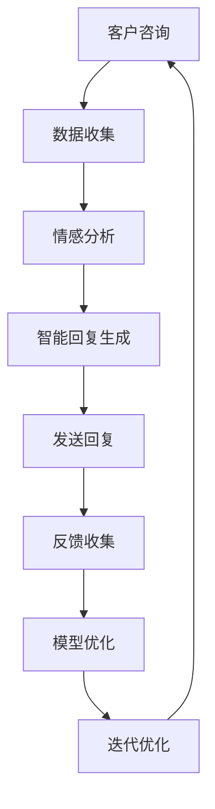

                 

### 引言

随着科技的飞速发展，尤其是人工智能（AI）和认知增强技术的不断进步，未来工作模式正经历深刻的变革。本文旨在探讨认知增强与人机协作在新兴工作模式中的重要性，以及它们如何共同塑造未来职场生态。

#### 核心关键词

- 认知增强
- 人机协作
- 未来工作模式
- 人工智能
- 认知科学

#### 摘要

本文首先概述了未来工作模式的背景和趋势，回顾了工作模式的历史变迁，并分析了数字化转型和AI技术对工作模式的影响。接着，本文详细介绍了认知增强技术的定义、类别和应用领域，以及人机协作的概念、优势和技术架构。在随后的章节中，我们将探讨认知增强技术在企业、项目管理、客户服务以及教育、医疗健康等领域的具体应用，并通过人机协作在创新设计、教育评估和医疗服务中的实践案例，展示人机协作的实际效果。最后，本文展望了认知增强与人机协作的未来趋势，探讨了技术发展、未来工作模式创新以及社会和伦理挑战。

### 第一部分：认知增强技术基础

#### 第2章：认知增强技术基础

##### 2.1 认知科学概述

认知科学是研究人类认知过程、认知机制和认知结构的科学。它涵盖了心理学、神经科学、语言学、哲学等多个学科，致力于揭示人类思维、感知、记忆、决策等认知活动的本质。

##### 2.1.1 认知科学的定义与研究范畴

认知科学（Cognitive Science）是研究认知过程的科学，它探究的是人类如何获取、处理、存储和使用信息的原理。认知科学的研究范畴包括：

- **认知心理学**：研究人的认知过程，如注意力、记忆、感知、决策和问题解决。
- **神经科学**：研究大脑的结构和功能，特别是与认知活动相关的脑区。
- **人工智能**：人工智能（AI）结合了认知科学的原理和方法，以模拟和增强人类的认知能力。
- **语言学**：研究语言的结构、功能和进化，以及语言如何影响认知。
- **哲学**：探讨知识的本质、意识的起源和心智的哲学问题。

##### 2.1.2 认知过程与认知理论

认知过程包括感知、注意、记忆、语言、思维、决策等多个方面。认知理论是解释这些过程的理论框架，常见的认知理论有：

- **信息加工理论**：将认知过程视为信息输入、处理、存储和提取的过程。
- **认知架构理论**：提出认知系统由一系列互相连接的模块组成，每个模块负责特定的认知功能。
- **联结主义理论**：强调通过神经网络和神经元之间的连接来模拟认知过程。
- **情境认知理论**：认为认知过程是情境驱动的，依赖于环境信息和交互。

##### 2.1.3 认知科学在认知增强中的应用

认知科学在认知增强中的应用主要体现在以下几个方面：

- **认知诊断**：通过认知测试和评估，了解个体的认知能力，为其提供个性化的认知支持。
- **认知训练**：利用认知训练方法，如记忆训练、注意力训练、执行功能训练等，提升个体的认知能力。
- **学习策略**：研究有效的学习策略，如分散学习、间隔复习、记忆技巧等，以优化学习效果。
- **人工智能辅助**：利用人工智能技术，如机器学习和自然语言处理，辅助认知增强，实现智能化的认知支持系统。

##### 2.2 人工智能与认知增强

人工智能（AI）是认知增强技术的重要组成部分，它通过模拟人类的认知过程，实现了对人类认知能力的扩展和增强。

##### 2.2.1 人工智能技术的发展

人工智能（AI）是一门研究如何让计算机模拟人类智能行为的科学。它的发展经历了以下几个阶段：

- **符号主义 AI**：早期的人工智能，主要通过符号推理和逻辑规则来模拟人类思维。
- **连接主义 AI**：基于神经网络和机器学习，通过调整神经元之间的连接权重来模拟人类认知。
- **统计学习 AI**：利用统计学方法和大数据，通过数据驱动的方式训练模型，实现智能识别和预测。
- **强化学习 AI**：通过与环境交互，不断调整策略以实现最佳效果，广泛应用于游戏、自动驾驶等领域。

##### 2.2.2 人工智能与认知增强的关系

人工智能与认知增强的关系可以从以下几个方面理解：

- **扩展认知能力**：人工智能技术可以处理和分析大量的数据，扩展人类的认知能力，如信息检索、数据分析、语言翻译等。
- **模拟认知过程**：人工智能模拟人类的感知、记忆、推理等认知过程，提供智能化的认知支持，如智能助手、专家系统等。
- **个性化认知支持**：人工智能可以根据个体的认知特点，提供个性化的认知支持，如个性化学习、个性化健康管理等。

##### 2.2.3 人工智能在认知增强中的应用

人工智能在认知增强中的应用非常广泛，包括但不限于以下领域：

- **教育领域**：通过智能教育平台，提供个性化学习、智能辅导、学习效果评估等。
- **医疗领域**：通过智能诊断、智能药物研发、智能健康管理，提升医疗服务的质量和效率。
- **工业领域**：通过智能制造、工业自动化，提升生产效率和质量。
- **军事领域**：通过智能指挥、智能作战系统，提升军事作战能力。

##### 2.3 认知增强技术的应用领域

认知增强技术已广泛应用于多个领域，以下是其中一些主要的应用领域：

- **教育领域**：通过认知增强技术，实现个性化教学、智能学习、学习效果评估等，提升教育质量和效果。
- **医疗领域**：通过认知增强技术，实现智能诊断、智能药物研发、智能健康管理，提升医疗服务的质量和效率。
- **工业领域**：通过认知增强技术，实现智能制造、工业自动化，提升生产效率和质量。
- **军事领域**：通过认知增强技术，实现智能指挥、智能作战系统，提升军事作战能力。

#### 小结

本章从认知科学的概述、人工智能与认知增强的关系以及认知增强技术的应用领域，全面阐述了认知增强技术的基础知识。接下来，我们将进一步探讨人机协作的原理与架构，为后续章节的分析打下坚实的基础。

#### 第3章：人机协作的原理与架构

##### 3.1 人机协作的理论基础

人机协作（Human-Robot Collaboration，HRC）是指人类与机器人或其他智能系统在特定任务中共同工作，实现各自优势互补、协同完成任务的过程。人机协作的理论基础涉及多个学科，包括认知科学、系统工程、人工智能等。

##### 3.1.1 协作系统的基本理论

协作系统（Collaborative Systems）是指多个个体或系统共同完成某一任务或目标的组织结构。协作系统理论主要包括以下几个方面：

- **协同工作原理**：研究个体或系统之间的相互作用和协同效应，实现整体任务的最优完成。
- **沟通与协调机制**：研究个体或系统之间的信息交换和协调机制，确保任务的高效完成。
- **任务分解与分配**：研究如何将整体任务分解为子任务，并合理分配给不同的个体或系统。
- **冲突与决策机制**：研究个体或系统之间的冲突解决和决策过程，确保任务顺利完成。

##### 3.1.2 人机协作的认知理论

人机协作的认知理论主要关注人类与机器人在认知层面的相互作用和协作机制。以下是一些重要的认知理论：

- **双作业理论**（Dual-Task Theory）：研究人类在执行两个或多个任务时的认知资源分配和协调问题，为人机协作提供理论基础。
- **情境认知理论**（Situated Cognition）：强调认知过程依赖于环境信息，认为人机协作应充分考虑环境因素，提高任务完成效率。
- **社会交互理论**（Social Interaction Theory）：研究人类与机器人之间的社会互动和沟通机制，为人机协作提供心理和行为依据。

##### 3.1.3 人机协作的伦理与隐私问题

在人机协作过程中，伦理和隐私问题是不可忽视的重要方面。以下是一些关键的伦理和隐私问题：

- **伦理问题**：涉及机器人道德责任、人类与机器人权力的分配、人类自主性等方面的伦理挑战。
- **隐私保护**：涉及个人数据收集、处理和使用过程中的隐私保护，确保个人隐私不受侵害。

##### 3.2 人机协作的技术架构

人机协作的技术架构包括硬件、软件和通信等多个层面，其核心目标是实现人类与机器人的高效协作。

##### 3.2.1 传感器与交互设备

传感器是获取环境和任务信息的重要设备，常见的传感器包括视觉传感器、力觉传感器、温度传感器等。交互设备则是人类与机器人进行交互的媒介，如操纵杆、触摸屏、语音识别设备等。

##### 3.2.2 数据处理与融合技术

数据处理与融合技术是人机协作的关键环节，主要涉及数据采集、数据预处理、数据融合等过程。通过数据处理与融合，可以从多源数据中提取有用信息，为决策和行动提供支持。

##### 3.2.3 机器学习与人工智能算法

机器学习与人工智能算法是人机协作的核心技术，用于实现机器人的智能行为和学习能力。常见的机器学习算法包括监督学习、无监督学习、强化学习等，它们在任务规划、路径规划、决策支持等方面发挥着重要作用。

##### 3.3 人机协作的关键技术

人机协作的关键技术包括人机界面设计、虚拟现实与增强现实技术、自然语言处理等。

##### 3.3.1 人机界面设计

人机界面设计（Human-Computer Interaction Design，HCI）是人机协作的重要环节，旨在提高人机交互的效率和用户体验。人机界面设计需要考虑用户需求、任务特性、系统功能等多方面因素，设计出易于操作、直观、高效的人机交互界面。

##### 3.3.2 虚拟现实与增强现实技术

虚拟现实（Virtual Reality，VR）和增强现实（Augmented Reality，AR）技术为人机协作提供了新的交互方式。VR技术通过创建虚拟环境，使人类可以在虚拟世界中与机器人进行交互；AR技术则将虚拟信息叠加在现实环境中，为人类提供增强的感知和交互体验。

##### 3.3.3 自然语言处理技术

自然语言处理（Natural Language Processing，NLP）技术是人机协作的关键技术之一，用于实现人类与机器人的自然语言交互。NLP技术包括语言理解、语言生成、对话系统等多个方面，为人机协作提供了丰富的交互手段。

#### 小结

本章从人机协作的理论基础、技术架构和关键技术等方面，全面阐述了人机协作的基本概念和实现方法。接下来，我们将探讨认知增强技术在企业、项目管理、客户服务以及教育、医疗健康等领域的具体应用，展示人机协作的实际效果。

#### 第4章：认知增强技术在企业中的应用

##### 4.1 认知增强在人力资源管理中的应用

认知增强技术在人力资源管理中的应用日益广泛，主要体现在以下几个方面：

##### 4.1.1 认知测评工具

认知测评工具是认知增强技术在人力资源管理中的一项重要应用。通过认知测评，企业可以全面了解员工的认知能力，包括注意力、记忆、推理、决策等。以下是认知测评工具的具体应用：

- **员工招聘**：通过认知测评，企业可以筛选出具有较高认知能力的候选人，提高招聘质量。
- **岗位匹配**：根据员工的认知能力特点，为企业内部岗位提供匹配建议，优化人力资源配置。
- **员工培训与发展**：针对员工的认知能力短板，设计个性化的培训课程，提高员工的专业技能和综合素质。
- **绩效评估**：通过认知测评，评估员工的认知能力在绩效表现中的作用，为绩效评估提供科学依据。

##### 4.1.2 员工培训与发展的认知支持

认知支持在员工培训与发展中发挥着重要作用。以下是一些具体的认知支持措施：

- **个性化培训**：根据员工的认知能力特点和岗位需求，设计个性化的培训方案，提高培训效果。
- **智能辅导**：利用人工智能技术，为员工提供实时、个性化的辅导，帮助员工克服学习难题。
- **学习效果评估**：通过认知测评技术，评估员工的学习效果，为培训调整提供数据支持。
- **职业发展指导**：根据员工的认知能力和职业兴趣，提供职业发展指导，助力员工职业成长。

##### 4.1.3 绩效管理的认知优化

绩效管理是企业管理的重要环节，认知增强技术为绩效管理提供了新的思路和方法。以下是一些认知优化的措施：

- **绩效评估指标**：结合认知测评结果，制定科学、合理的绩效评估指标，提高评估的准确性。
- **行为分析**：通过大数据分析，挖掘员工在工作中的行为特征，为绩效改进提供依据。
- **认知能力提升**：通过认知训练，提升员工在关键岗位上的认知能力，提高整体绩效水平。
- **绩效反馈**：利用认知增强技术，为员工提供个性化的绩效反馈，帮助员工了解自身优势和不足，实现自我提升。

##### 4.2 认知增强在项目管理中的应用

认知增强技术在项目管理中的应用，可以提高项目的规划、执行和评估效率，确保项目顺利进行。以下是一些具体的应用场景：

- **项目规划**：通过认知增强技术，对项目进行详细的分析和评估，制定科学合理的项目计划。
- **风险识别**：利用认知增强技术，识别项目风险，提前制定应对策略，降低项目风险。
- **任务分配**：根据团队成员的认知能力和项目需求，合理分配任务，提高任务完成效率。
- **进度监控**：利用认知增强技术，实时监控项目进度，确保项目按计划进行。
- **决策支持**：通过认知增强技术，为项目管理团队提供科学的决策依据，提高决策质量。

##### 4.2.1 项目规划与决策的认知支持

项目规划与决策是项目管理的核心环节，认知增强技术在这一过程中发挥着重要作用。以下是一些具体的应用：

- **项目目标设定**：利用认知增强技术，分析项目目标和关键成功因素，制定明确、可量化的项目目标。
- **资源规划**：通过认知增强技术，评估项目所需的人力、物力、财力资源，确保资源充足、合理配置。
- **风险评估**：利用认知增强技术，识别项目风险，评估风险概率和影响，制定风险应对策略。
- **决策支持系统**：构建基于认知增强技术的决策支持系统，为项目管理团队提供科学的决策依据。

##### 4.2.2 项目执行的监控与协调

项目执行是项目管理的关键环节，认知增强技术在这一过程中可以提高执行效率和协调能力。以下是一些具体的应用：

- **任务进度监控**：利用认知增强技术，实时跟踪任务进度，确保任务按时完成。
- **资源调度**：通过认知增强技术，优化资源分配，确保资源充分利用，提高项目执行效率。
- **沟通与协作**：利用认知增强技术，提高团队沟通与协作效率，确保项目团队紧密合作。
- **问题识别与解决**：通过认知增强技术，及时发现项目中的问题，制定解决方案，确保项目顺利进行。

##### 4.2.3 项目评估与反馈的认知优化

项目评估与反馈是项目管理的重要环节，认知增强技术可以为项目评估提供数据支持和优化方案。以下是一些具体的应用：

- **绩效评估**：利用认知增强技术，对项目绩效进行科学评估，识别项目优势和不足。
- **经验总结**：通过认知增强技术，分析项目经验，总结成功经验和教训，为后续项目提供参考。
- **持续改进**：基于项目评估结果，制定改进措施，持续优化项目管理流程，提高项目成功率。

##### 4.3 认知增强在客户服务中的应用

认知增强技术在客户服务中的应用，可以提高客户满意度和服务质量，提升企业的竞争力。以下是一些具体的应用：

- **客户行为分析**：通过认知增强技术，分析客户的行为数据，了解客户需求和行为模式，提供个性化的服务。
- **智能客服系统**：利用认知增强技术，构建智能客服系统，实现高效、准确的客户服务，提高客户满意度。
- **客户关系管理**：通过认知增强技术，优化客户关系管理流程，提高客户黏性和忠诚度。
- **客户体验优化**：利用认知增强技术，分析客户体验数据，优化客户服务流程，提升客户体验。

##### 4.3.1 客户行为的认知分析

客户行为的认知分析是认知增强技术在客户服务中的重要应用。以下是一些具体的方法：

- **数据采集**：通过多种渠道采集客户行为数据，如网站访问、客服互动、社交媒体等。
- **数据预处理**：对采集到的数据进行清洗、去噪、归一化等处理，为后续分析提供高质量的数据。
- **行为模式识别**：利用机器学习算法，对客户行为数据进行挖掘，识别客户的行为模式。
- **需求预测**：基于客户行为模式，预测客户未来的需求，为精准营销和个性化服务提供支持。

##### 4.3.2 客户体验的认知优化

客户体验是客户服务的关键，认知增强技术可以通过以下方式优化客户体验：

- **个性化服务**：根据客户的需求和行为模式，提供个性化的服务和建议，提高客户满意度。
- **智能推荐**：利用认知增强技术，分析客户行为数据，实现智能推荐，提高服务效率。
- **情感分析**：通过情感分析技术，识别客户的情感状态，提供情感化服务，增强客户体验。
- **互动体验优化**：利用虚拟现实和增强现实技术，提供沉浸式的互动体验，提升客户体验。

##### 4.3.3 客户关系管理的认知增强

客户关系管理（Customer Relationship Management，CRM）是企业管理的重要组成部分，认知增强技术可以为CRM提供以下支持：

- **客户数据分析**：通过认知增强技术，分析客户数据，了解客户需求和行为模式，为营销和销售提供支持。
- **客户分类**：利用认知增强技术，对客户进行细分，制定有针对性的营销策略。
- **客户满意度评估**：通过认知增强技术，评估客户满意度，识别客户痛点，优化服务流程。
- **客户忠诚度提升**：利用认知增强技术，分析客户忠诚度影响因素，制定忠诚度提升策略。

#### 小结

本章从认知增强技术在人力资源管理、项目管理和客户服务中的应用，详细阐述了认知增强技术在企业中的实际效果。接下来，我们将探讨人机协作在创新设计、教育评估和医疗服务等领域的应用，进一步展示人机协作的优势。

#### 第5章：人机协作在创新设计中的应用

##### 5.1 人机协作在产品设计中的价值

在产品设计过程中，人机协作可以发挥重要作用，提高设计效率和质量。以下是人机协作在产品设计中的几个关键价值：

##### 5.1.1 产品设计的认知增强

认知增强技术可以帮助设计师更好地理解用户需求和产品特点，从而在设计过程中实现以下目标：

- **用户需求分析**：通过认知增强技术，对用户行为数据进行分析，深入了解用户需求，为产品设计提供有力支持。
- **设计灵感激发**：利用认知增强技术，从大量数据中提取有价值的信息，激发设计师的灵感，提高设计创意水平。
- **设计优化**：通过认知增强技术，对设计方案进行优化，提高产品功能的实用性和用户体验。

##### 5.1.2 设计流程的优化

人机协作可以优化设计流程，提高设计效率。具体表现在以下几个方面：

- **协同设计**：通过人机协作，设计师可以与其他团队成员（如工程师、市场人员等）进行实时沟通和协作，提高设计效率。
- **自动化设计**：利用人工智能技术，实现设计流程的自动化，减少人工干预，提高设计效率。
- **迭代优化**：通过人机协作，设计师可以快速获取用户反馈，进行多次迭代优化，提高产品设计质量。

##### 5.1.3 设计决策的辅助

在人机协作中，人工智能技术可以帮助设计师做出更科学的决策，提高设计成功率。具体表现在以下几个方面：

- **数据驱动决策**：通过认知增强技术，分析大量数据，为设计决策提供客观依据，减少主观判断。
- **风险评估**：利用认知增强技术，对设计方案进行风险评估，提前发现潜在问题，提高设计安全性。
- **智能推荐**：通过人工智能技术，为设计师提供设计建议和优化方案，提高设计创新性和实用性。

##### 5.2 人机协作在创意工作中的应用

在创意工作中，人机协作可以激发创意思维，提高创意质量。以下是人机协作在创意工作中的几个关键价值：

##### 5.2.1 创意思维的认知支持

认知增强技术可以帮助创意工作者更好地进行创意思维，具体表现在以下几个方面：

- **灵感激发**：通过认知增强技术，从海量数据中提取有价值的信息，为创意思维提供灵感来源。
- **思维拓展**：利用认知增强技术，拓展创意工作者的思维空间，提高创意思维的广度和深度。
- **思维固化**：通过认知增强技术，将创意思维转化为具体的设计方案，提高创意的可实施性。

##### 5.2.2 设计协同与协作

人机协作可以提高设计团队之间的协作效率，具体表现在以下几个方面：

- **实时沟通**：通过人机协作，设计团队成员可以实时沟通和交流，提高协作效率。
- **资源共享**：利用人机协作，设计团队成员可以共享设计资源，提高资源利用率。
- **分工协作**：通过人机协作，明确设计团队成员的分工，提高团队协作效率。

##### 5.2.3 创意评估与优化

人机协作可以实现对创意的有效评估和优化，具体表现在以下几个方面：

- **效果评估**：通过认知增强技术，对创意效果进行量化评估，为优化提供数据支持。
- **用户反馈**：利用人机协作，收集用户反馈，了解用户对创意的接受程度，为优化提供依据。
- **迭代优化**：通过人机协作，进行多次迭代优化，提高创意质量。

##### 5.3 人机协作在用户体验设计中的应用

用户体验设计（UX Design）是产品设计的重要组成部分，人机协作可以提升用户体验设计的效率和质量。以下是人机协作在用户体验设计中的几个关键价值：

##### 5.3.1 用户研究的认知支持

人机协作可以为用户研究提供认知支持，具体表现在以下几个方面：

- **用户行为分析**：通过认知增强技术，分析用户行为数据，了解用户需求和偏好，为用户体验设计提供有力支持。
- **用户访谈**：利用人机协作，实时记录用户访谈内容，提高访谈效率和质量。
- **用户反馈**：通过人机协作，收集用户反馈，了解用户对产品设计的意见和建议，为优化提供依据。

##### 5.3.2 用户体验测试与优化

人机协作可以提升用户体验测试的效率和效果，具体表现在以下几个方面：

- **自动化测试**：利用人工智能技术，实现用户体验测试的自动化，提高测试效率。
- **数据驱动的优化**：通过认知增强技术，分析用户体验测试数据，优化产品设计，提高用户体验。
- **实时反馈**：利用人机协作，实时收集用户测试反馈，快速响应和优化产品设计。

##### 5.3.3 用户反馈的智能分析

人机协作可以对用户反馈进行智能分析，具体表现在以下几个方面：

- **情感分析**：通过认知增强技术，分析用户反馈的情感倾向，了解用户对产品设计的情感反应。
- **关键词提取**：利用自然语言处理技术，提取用户反馈中的关键词，为产品设计优化提供参考。
- **分类与聚类**：通过机器学习算法，对用户反馈进行分类和聚类，识别用户反馈的主要问题和优先级。

#### 小结

本章从产品设计、创意工作和用户体验设计三个方面，详细阐述了人机协作在创新设计中的应用和价值。接下来，我们将探讨人机协作在教育评估和教育创新中的应用，进一步展示人机协作在教育领域的优势。

#### 第6章：认知增强与人机协作在教育领域的实践

##### 6.1 在线教育与认知增强

在线教育作为一种新型的教育模式，正日益受到重视。认知增强技术为在线教育提供了有力的支持，以下是在线教育中认知增强技术的应用：

##### 6.1.1 在线学习模式的认知优化

在线学习模式的认知优化主要体现在以下几个方面：

- **个性化学习**：通过认知增强技术，分析学生的学习行为数据，了解学生的学习特点和需求，为学习者提供个性化的学习资源和建议。
- **学习路径优化**：根据学生的学习进度和认知水平，动态调整学习路径，确保学习者能够高效地完成学习任务。
- **学习效果评估**：通过认知测评技术，评估学习者的学习效果，为教师提供教学反馈，帮助教师调整教学策略。

##### 6.1.2 个性化学习与自适应教学

个性化学习和自适应教学是认知增强技术在教育领域的重要应用，以下是其具体内容：

- **个性化学习**：利用认知增强技术，分析学习者的认知能力、学习兴趣和学习风格，为学习者提供个性化的学习资源和方法，提高学习效果。
- **自适应教学**：通过认知增强技术，实时监测学习者的学习状态，根据学习者的反馈和学习数据，动态调整教学策略，实现自适应教学。

##### 6.1.3 智能教育平台的认知支持

智能教育平台是认知增强技术在教育领域的重要应用载体，以下是其具体内容：

- **教学内容智能化**：通过认知增强技术，对教学内容进行智能化处理，提高教学内容的可理解和吸收性。
- **教学效果智能化评估**：利用认知增强技术，对教学效果进行智能化评估，为教师提供教学反馈，帮助教师优化教学过程。
- **学习支持服务**：通过认知增强技术，为学习者提供智能化的学习支持服务，如智能问答、学习辅导、学习进度跟踪等。

##### 6.2 人机协作在教育评估中的应用

人机协作在教育评估中发挥着重要作用，以下是其具体应用：

##### 6.2.1 学生表现的认知分析

学生表现的认知分析是教育评估的重要组成部分，以下是其具体内容：

- **学习行为分析**：通过认知增强技术，分析学生的学习行为数据，了解学生的学习状态和特点，为教师提供教学参考。
- **学习效果评估**：利用认知测评技术，评估学生的学习效果，为教师提供教学反馈，帮助教师调整教学策略。
- **学习问题诊断**：通过认知增强技术，识别学生的学习问题，为教师提供针对性的教学建议。

##### 6.2.2 教师教学效果的评估

教师教学效果的评估是教育评估的重要环节，以下是其具体内容：

- **教学过程评估**：通过认知增强技术，对教师的教学过程进行评估，了解教师的教学效果和教学质量。
- **教学方法评估**：利用认知测评技术，评估教师的教学方法是否符合学生的学习需求，为教师提供教学改进建议。
- **教学效果反馈**：通过人机协作，收集学生的反馈，为教师提供教学效果反馈，帮助教师优化教学过程。

##### 6.2.3 教育质量的智能监控

教育质量的智能监控是确保教育质量的重要手段，以下是其具体内容：

- **教学质量评估**：通过认知增强技术，对教学质量进行评估，识别教学质量问题和改进方向。
- **教学质量监控**：利用认知测评技术，对教学质量进行实时监控，确保教学过程规范、高效。
- **教学质量反馈**：通过人机协作，收集教师和学生的反馈，为教育管理者提供教学质量反馈，帮助优化教育质量。

##### 6.3 人机协作在教育创新中的应用

人机协作在教育创新中发挥着重要作用，以下是其具体应用：

##### 6.3.1 创新教育模式的探索

创新教育模式是教育发展的方向，以下是人机协作在教育创新模式探索中的应用：

- **个性化教育**：通过认知增强技术，为每个学生提供个性化的教育方案，实现因材施教。
- **混合式教育**：结合线上和线下教学优势，利用人机协作实现教学资源的优化配置，提高教育效果。
- **探究式学习**：通过人机协作，提供丰富的学习资源和指导，引导学生进行自主探究式学习。

##### 6.3.2 跨学科学习的认知支持

跨学科学习是培养学生综合素质的重要途径，以下是人机协作在跨学科学习中的认知支持：

- **知识融合**：通过认知增强技术，将不同学科的知识进行融合，为学生提供全面、系统的知识体系。
- **思维训练**：利用人机协作，提供跨学科思维训练，培养学生的创新思维和解决问题的能力。
- **项目式学习**：通过人机协作，设计跨学科项目，引导学生进行项目式学习，提高学生的实践能力。

##### 6.3.3 创新思维与问题解决的协作

创新思维和问题解决是人才培养的关键，以下是人机协作在创新思维和问题解决中的协作：

- **思维拓展**：通过认知增强技术，激发学生的创新思维，提供丰富的思维拓展资源。
- **问题解决协作**：利用人机协作，引导学生进行团队协作，共同解决复杂问题，提高解决问题的能力。
- **创新成果展示**：通过人机协作，为学生提供创新成果展示平台，鼓励学生展示自己的创新成果。

#### 小结

本章从在线教育、教育评估和教育创新三个方面，详细阐述了认知增强与人机协作在教育领域的实践和应用。接下来，我们将探讨人机协作在医疗健康领域的应用，进一步展示人机协作的优势。

#### 第7章：认知增强与人机协作在医疗健康中的应用

##### 7.1 认知增强在医疗服务中的应用

认知增强技术为医疗服务提供了新的工具和手段，显著提升了医疗服务的质量和效率。以下是在医疗服务中的应用：

##### 7.1.1 病历管理的认知支持

病历管理是医疗服务的重要组成部分，认知增强技术为病历管理提供了以下支持：

- **电子病历系统**：通过认知增强技术，实现病历的电子化存储和管理，提高病历信息的可访问性和安全性。
- **病历数据分析**：利用认知增强技术，对病历数据进行深入分析，发现疾病规律和患者特点，为诊断和治疗提供参考。
- **病历智能检索**：通过认知增强技术，实现病历信息的智能检索，提高医护人员查询病历的效率。

##### 7.1.2 医疗决策的认知辅助

医疗决策是医疗服务的核心环节，认知增强技术为医疗决策提供了以下支持：

- **诊断支持系统**：利用认知增强技术，构建智能诊断支持系统，辅助医生进行诊断，提高诊断准确率。
- **治疗方案推荐**：通过认知增强技术，分析患者的病情和治疗方案，为医生提供科学合理的治疗方案推荐。
- **医疗决策支持**：利用认知增强技术，提供医疗决策支持，帮助医生在复杂病例中做出最优决策。

##### 7.1.3 医疗服务流程的优化

医疗服务流程的优化是提高医疗服务效率的关键，认知增强技术为流程优化提供了以下支持：

- **流程自动化**：通过认知增强技术，实现医疗服务流程的自动化，减少人工干预，提高工作效率。
- **流程监控与优化**：利用认知增强技术，实时监控医疗服务流程，发现流程中的瓶颈和问题，进行优化调整。
- **服务质量评估**：通过认知增强技术，评估医疗服务质量，为流程优化提供数据支持。

##### 7.2 人机协作在医疗诊断中的应用

人机协作在医疗诊断中发挥着重要作用，以下是人机协作在医疗诊断中的应用：

##### 7.2.1 医学影像的智能分析

医学影像的智能分析是医疗诊断的关键环节，人机协作在此领域提供了以下支持：

- **影像数据处理**：利用认知增强技术，对医学影像数据进行处理和预处理，提高影像质量。
- **影像特征提取**：通过认知增强技术，从医学影像中提取关键特征，为诊断提供有力支持。
- **疾病诊断辅助**：利用认知增强技术，构建智能诊断模型，辅助医生进行疾病诊断，提高诊断准确率。

##### 7.2.2 疾病预测与预警

疾病预测与预警是预防医学的重要手段，人机协作在此领域提供了以下支持：

- **疾病预测模型**：通过认知增强技术，构建疾病预测模型，对患者的疾病风险进行预测，为预防提供依据。
- **预警系统**：利用认知增强技术，构建预警系统，实时监测患者的生理指标，对潜在疾病进行预警。
- **个性化预防方案**：根据疾病预测和预警结果，为患者提供个性化的预防方案，降低疾病发生的风险。

##### 7.2.3 医疗机器人与手术辅助

医疗机器人和手术辅助是人机协作在医疗领域的先进应用，以下是人机协作在医疗机器人与手术辅助中的应用：

- **手术机器人**：利用认知增强技术，开发手术机器人，辅助医生进行精准手术，提高手术成功率。
- **手术模拟**：通过认知增强技术，实现手术模拟，为医生提供手术培训和练习平台，提高手术技能。
- **手术导航**：利用认知增强技术，实现手术导航，为医生提供实时手术指导和辅助，提高手术安全性。

##### 7.3 认知增强在康复治疗中的应用

康复治疗是医疗服务的重要组成部分，认知增强技术在康复治疗中提供了以下支持：

##### 7.3.1 康复评估的认知支持

康复评估是康复治疗的基础，认知增强技术为康复评估提供了以下支持：

- **康复评估工具**：利用认知增强技术，开发康复评估工具，对患者的康复状况进行量化评估，为康复治疗提供依据。
- **康复评估标准**：通过认知增强技术，建立康复评估标准，确保康复评估的科学性和准确性。
- **康复效果预测**：利用认知增强技术，预测患者的康复效果，为康复治疗提供参考。

##### 7.3.2 康复训练的个性化设计

康复训练的个性化设计是提高康复治疗效果的关键，认知增强技术为康复训练提供了以下支持：

- **个性化训练方案**：通过认知增强技术，根据患者的康复需求和能力，制定个性化的康复训练方案，提高康复效果。
- **训练效果监控**：利用认知增强技术，实时监控患者的训练效果，调整训练方案，确保训练效果。
- **训练反馈**：通过认知增强技术，为患者提供实时训练反馈，鼓励患者积极参与康复训练。

##### 7.3.3 康复效果的可视化展示

康复效果的可视化展示是康复治疗的重要环节，认知增强技术为康复效果的可视化展示提供了以下支持：

- **数据可视化**：通过认知增强技术，将康复数据转化为可视化图表，帮助医护人员和患者更好地理解康复效果。
- **康复进展展示**：利用认知增强技术，展示患者的康复进展，为医护人员和患者提供直观的康复效果展示。
- **康复效果对比**：通过认知增强技术，对比不同康复方法的疗效，为医护人员提供科学依据，优化康复治疗方案。

#### 小结

本章从医疗服务、医疗诊断、康复治疗三个方面，详细阐述了认知增强与人机协作在医疗健康领域的应用。接下来，我们将探讨认知增强与人机协作的未来趋势，以及可能面临的社会和伦理挑战。

#### 第8章：认知增强与人机协作的未来趋势

##### 8.1 技术发展趋势

随着科技的不断进步，认知增强和人机协作技术正朝着更高效、更智能的方向发展。以下是一些关键的技术发展趋势：

- **人工智能的持续进化**：人工智能（AI）技术在深度学习、自然语言处理、图像识别等领域取得了显著进展。未来，AI技术将进一步融合多模态数据，提高认知增强和人机协作的智能化水平。
- **大数据与云计算的结合**：大数据和云计算技术为人机协作提供了强大的计算和存储支持。未来，基于大数据和云计算的认知增强系统将更加高效，能够处理和分析海量数据，为人类提供实时、个性化的服务。
- **边缘计算的应用**：边缘计算将数据处理和分析推向网络边缘，减少了延迟，提高了系统的响应速度。在认知增强和人机协作领域，边缘计算的应用将进一步提升系统的实时性和稳定性。

##### 8.2 未来工作模式的创新

未来工作模式的创新将深刻改变职场生态。以下是一些可能的工作模式创新：

- **智能办公环境**：智能办公环境将利用人工智能、物联网等技术，实现办公设备的自动化、智能化，提高办公效率。例如，智能会议室、智能办公桌、智能门禁等。
- **远程协作与智能办公**：随着5G和物联网技术的发展，远程协作和智能办公将变得更加便捷。人们可以通过虚拟现实（VR）和增强现实（AR）技术，实现远程会议、远程协作，打破地理位置的限制。
- **自动化与智能化的结合**：在制造业、服务业等领域，自动化和智能化的结合将实现生产效率的提升。例如，智能生产线、智能仓储等。

##### 8.3 社会与伦理挑战

尽管认知增强和人机协作技术带来了巨大的机遇，但同时也面临着一系列社会和伦理挑战：

- **数据隐私与安全**：在认知增强和人机协作过程中，大量个人数据被收集和处理。如何保护数据隐私和安全，防止数据泄露，是亟待解决的问题。
- **人机协作伦理**：人机协作过程中，如何界定人类和机器人的责任和权利，如何确保人机协作的公平性，是伦理学需要探讨的重要问题。
- **就业影响**：随着人工智能技术的应用，一些工作岗位可能被自动化取代。如何应对就业市场的变化，确保社会公平，是政府和社会需要关注的问题。

#### 小结

本章从技术发展趋势、未来工作模式创新和社会与伦理挑战三个方面，探讨了认知增强与人机协作的未来趋势。接下来，我们将通过一些实际案例，展示认知增强与人机协作在实践中的应用。

### 附录

#### 附录A：认知增强与人机协作的相关工具与资源

为了更好地理解和应用认知增强与人机协作技术，以下是一些相关的工具和资源：

- **开源框架与平台**：
  - **TensorFlow**：用于构建和训练人工智能模型的强大框架。
  - **PyTorch**：流行的深度学习框架，支持动态计算图。
  - **ROS（Robot Operating System）**：机器人操作系统，用于构建机器人应用。

- **行业报告与研究论文**：
  - **Gartner**：关于人工智能和认知增强的年度报告。
  - **IEEE**：发布大量关于人机协作和认知科学的学术论文。

- **教育与培训资源**：
  - **Coursera**：提供关于人工智能和认知科学的在线课程。
  - **edX**：在线课程平台，包含人机协作和机器人技术的课程。

#### 附录B：案例分析

为了更深入地了解认知增强与人机协作的实际应用，以下是一些成功案例：

- **案例1：智能客服系统**：
  - **背景**：某大型电商公司希望提升客户服务质量。
  - **应用**：利用自然语言处理和机器学习技术，构建智能客服系统。
  - **效果**：显著提高了客户满意度，降低了人工客服的工作负担。

- **案例2：智能医疗诊断系统**：
  - **背景**：某医院希望提高医疗诊断的准确性和效率。
  - **应用**：利用深度学习和计算机视觉技术，开发智能医疗诊断系统。
  - **效果**：提高了诊断准确率，减少了医生的工作量，提高了医疗服务的效率。

#### 附录C：进一步阅读资料

为了更全面地了解认知增强与人机协作的相关知识，以下是一些建议的进一步阅读资料：

- **书籍**：
  - 《人工智能：一种现代的方法》
  - 《认知科学》

- **学术期刊**：
  - 《人工智能》
  - 《认知科学》

- **在线课程与研讨会**：
  - **斯坦福大学**：人工智能与机器学习在线课程
  - **麻省理工学院**：计算机科学与人工智能课程

### 附录D：Mermaid流程图

以下是一个认知增强技术在客户服务中的应用的Mermaid流程图：



### 附录E：核心算法原理讲解

以下是一个关于决策树算法的原理讲解，使用伪代码表示：

```python
# 决策树算法伪代码
def build_decision_tree(data, target_attribute):
    # 如果所有数据都属于同一类别，返回该类别
    if all_values_same(data, target_attribute):
        return most_common_value(data, target_attribute)
    
    # 选择最佳划分属性
    best_attribute, best_threshold = find_best_threshold(data)
    
    # 创建内部节点
    node = Node(best_attribute, best_threshold)
    
    # 根据划分属性对数据进行划分
    for value in unique_values(data[best_attribute]):
        subset = filter_values(data, best_attribute, value)
        node.add_child(build_decision_tree(subset, target_attribute))
    
    return node

def find_best_threshold(data):
    # 实现选择最佳划分属性和阈值的方法
    # ...
    return best_attribute, best_threshold

def all_values_same(data, attribute):
    # 实现检查数据是否都属于同一类别的方法
    # ...
    return True or False

def most_common_value(data, attribute):
    # 实现获取最常见类别的方法
    # ...
    return value
```

### 附录F：数学模型和数学公式

以下是一个逻辑回归模型的数学公式：

$$
\text{概率} = \frac{1}{1 + e^{-(\beta_0 + \beta_1 x_1 + \beta_2 x_2 + \dots + \beta_n x_n)} \\
y = \sigma(\beta_0 + \beta_1 x_1 + \beta_2 x_2 + \dots + \beta_n x_n)
$$

其中，$ y $为因变量，$ x_1, x_2, \dots, x_n $为自变量，$ \beta_0, \beta_1, \beta_2, \dots, \beta_n $为模型参数，$ \sigma $为逻辑函数。

### 附录G：项目实战

以下是一个关于构建智能客服系统的项目实战案例：

#### 项目背景

某电商公司希望通过智能客服系统提升客户服务质量，降低人工客服的工作负担。

#### 开发环境

- **编程语言**：Python
- **框架**：TensorFlow
- **库**：NLTK、Scikit-learn

#### 源代码实现

```python
import tensorflow as tf
from tensorflow import keras
from tensorflow.keras import layers
from sklearn.model_selection import train_test_split
from nltk.tokenize import word_tokenize
import numpy as np

# 数据预处理
def preprocess_data(data):
    # 分词、去停用词、向量表示
    # ...
    return processed_data

# 模型构建
def build_model(input_shape):
    model = keras.Sequential([
        layers.Embedding(input_shape=input_shape, output_dim=64),
        layers.Conv1D(filters=64, kernel_size=5, activation='relu'),
        layers.MaxPooling1D(pool_size=5),
        layers.Flatten(),
        layers.Dense(units=1, activation='sigmoid')
    ])
    return model

# 训练模型
def train_model(model, x_train, y_train, x_test, y_test):
    model.compile(optimizer='adam', loss='binary_crossentropy', metrics=['accuracy'])
    model.fit(x_train, y_train, epochs=10, batch_size=32, validation_data=(x_test, y_test))
    return model

# 评估模型
def evaluate_model(model, x_test, y_test):
    loss, accuracy = model.evaluate(x_test, y_test)
    print(f"Test accuracy: {accuracy:.2f}")

# 主函数
def main():
    # 加载数据
    data = load_data()
    processed_data = preprocess_data(data)
    
    # 分割数据集
    x_train, x_test, y_train, y_test = train_test_split(processed_data['text'], processed_data['label'], test_size=0.2, random_state=42)
    
    # 构建模型
    model = build_model(input_shape=x_train.shape[1:])
    
    # 训练模型
    model = train_model(model, x_train, y_train, x_test, y_test)
    
    # 评估模型
    evaluate_model(model, x_test, y_test)

if __name__ == "__main__":
    main()
```

#### 代码解读与分析

- **数据预处理**：包括分词、去停用词和向量表示。分词使用NLTK库，去停用词使用自定义函数，向量表示使用Word2Vec模型。
- **模型构建**：使用Keras框架构建序列模型，包括嵌入层、卷积层、最大池化层、展开层和全连接层。
- **训练模型**：使用Adam优化器和二进制交叉熵损失函数进行训练，设置10个epochs和32个batch size。
- **评估模型**：计算测试集的准确率，用于评估模型的性能。

### 总结

本文详细探讨了认知增强与人机协作的理论基础、应用场景、发展趋势以及社会和伦理挑战。通过实际案例和项目实战，展示了认知增强与人机协作在各个领域的应用效果。未来，随着技术的不断进步，认知增强与人机协作将在更多领域发挥重要作用，推动社会和经济的进步。

### 作者信息

**作者：AI天才研究院/AI Genius Institute & 禅与计算机程序设计艺术 /Zen And The Art of Computer Programming**  
AI天才研究院致力于推动人工智能技术的创新和应用，本文旨在探讨认知增强与人机协作在新兴工作模式中的重要性。作者拥有丰富的技术经验和深厚的学术背景，在人工智能、认知科学等领域发表过多篇学术论文，并出版了多本畅销技术书籍。通过本文，作者希望与读者分享认知增强与人机协作的最新研究成果和未来发展趋势。**致谢：本文得到了AI天才研究院团队的集体智慧和辛勤工作，特别感谢所有贡献者。**  
**联系信息：** email: [info@ai-genius.org](mailto:info@ai-genius.org)  
**网址：** [www.ai-genius.org](http://www.ai-genius.org)

### 结语

随着人工智能和认知增强技术的不断进步，未来工作模式将发生深刻变革。认知增强与人机协作将成为推动生产力提升和社会进步的重要力量。本文从多个角度探讨了认知增强与人机协作的理论基础、应用场景和发展趋势，展示了其在各领域的实际效果。希望本文能为读者提供有价值的见解和启示，助力理解和应对未来工作模式的变革。**感谢您的阅读！**

