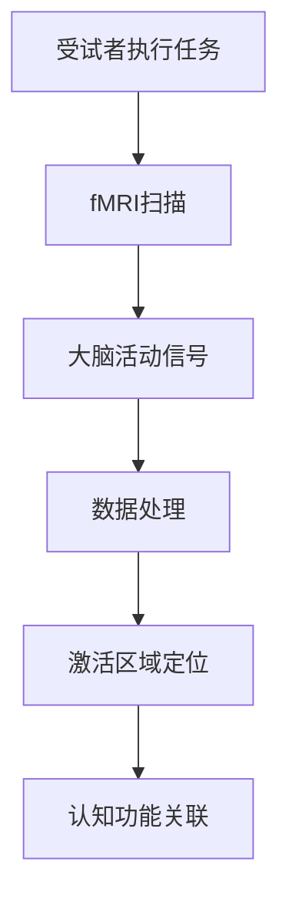
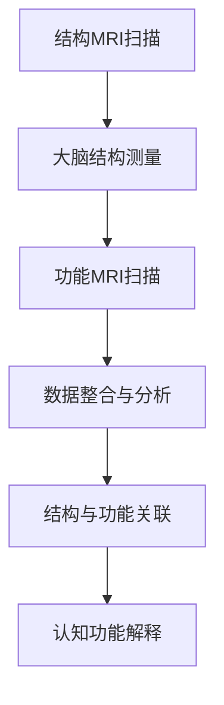
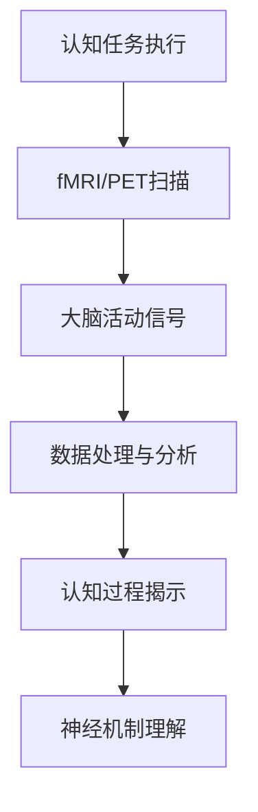

                 

# 认知神经科学的影像技术：可视化大脑如何理解世界

## 关键词
认知神经科学，影像技术，功能磁共振成像（fMRI），正电子发射断层扫描（PET），单光子发射计算机断层扫描（SPECT），计算机断层扫描（CT），磁共振波谱成像（MRS），近红外光谱成像（NIRS），大脑理解世界，神经科学应用，人工智能，临床诊断

## 摘要
本文将探讨认知神经科学的影像技术，特别是功能磁共振成像（fMRI）、正电子发射断层扫描（PET）和单光子发射计算机断层扫描（SPECT）等，如何帮助我们可视化大脑理解世界的机制。通过详细分析这些影像技术的基本原理、数据采集与处理流程，以及它们在认知神经科学研究中的应用，我们将揭示影像技术在理解大脑认知功能中的重要性。此外，本文还将讨论影像技术在临床应用中的挑战与未来发展方向，以及人工智能在影像数据处理和辅助诊断中的最新进展。

## 目录大纲

### 第一部分：引言与背景

#### 1.1 认知神经科学影像技术的发展历程
- **1.1.1 从结构影像到功能影像的转变**
- **1.1.2 影像技术在神经科学研究中的应用**
- **1.1.3 影像技术对大脑理解的重要性**

#### 1.2 大脑如何理解世界
- **1.2.1 大脑的基本结构与功能**
- **1.2.2 大脑的认知过程**
- **1.2.3 大脑如何处理信息**

### 第二部分：影像技术基础

#### 2.1 影像技术基本原理
- **2.1.1 影像设备工作原理**
- **2.1.2 影像数据处理流程**
- **2.1.3 影像技术的分类与应用**

#### 2.2 功能磁共振成像（fMRI）
- **2.2.1 fMRI的基本原理**
- **2.2.2 fMRI的数据采集与处理**
- **2.2.3 fMRI在认知神经科学中的应用**

#### 2.3 正电子发射断层扫描（PET）
- **2.3.1 PET的基本原理**
- **2.3.2 PET的数据采集与处理**
- **2.3.3 PET在认知神经科学中的应用**

#### 2.4 单光子发射计算机断层扫描（SPECT）
- **2.4.1 SPECT的基本原理**
- **2.4.2 SPECT的数据采集与处理**
- **2.4.3 SPECT在认知神经科学中的应用**

#### 2.5 其他影像技术
- **2.5.1 计算机断层扫描（CT）**
- **2.5.2 磁共振波谱成像（MRS）**
- **2.5.3 近红外光谱成像（NIRS）**

### 第三部分：影像技术在认知神经科学研究中的应用

#### 3.1 认知神经科学研究中的影像技术应用
- **3.1.1 大脑功能定位**
- **3.1.2 大脑结构与功能关系**
- **3.1.3 认知过程的影像学研究**

#### 3.2 认知障碍与影像技术
- **3.2.1 阿尔茨海默病的影像学研究**
- **3.2.2 脑损伤与影像诊断**
- **3.2.3 脑疾病的治疗评估**

#### 3.3 人工智能与影像技术结合
- **3.3.1 人工智能在影像数据处理中的应用**
- **3.3.2 影像技术在脑机接口中的应用**
- **3.3.3 人工智能辅助影像诊断**

### 第四部分：影像技术在临床应用中的挑战与未来

#### 4.1 影像技术在临床应用中的挑战
- **4.1.1 数据质量控制与标准化**
- **4.1.2 跨学科合作与数据共享**
- **4.1.3 影像技术在临床决策中的应用**

#### 4.2 影像技术的未来发展
- **4.2.1 新型影像技术的研究方向**
- **4.2.2 影像技术与神经科学的融合**
- **4.2.3 影像技术在社会健康中的应用**

#### 4.3 结论
- **4.3.1 影像技术在认知神经科学研究中的意义**
- **4.3.2 影像技术对大脑理解世界的影响**
- **4.3.3 未来研究的方向与展望**

### 附录

#### 附录 A：影像技术常用软件工具
- **A.1 SPSS**
- **A.2 MATLAB**
- **A.3 Python数据处理库**

#### 附录 B：影像技术相关参考文献
- **B.1 功能磁共振成像相关书籍**
- **B.2 正电子发射断层扫描相关书籍**
- **B.3 认知神经科学相关期刊论文**

#### 附录 C：影像技术实用案例
- **C.1 阿尔茨海默病影像诊断案例**
- **C.2 脑机接口应用案例**
- **C.3 人工智能辅助影像诊断案例**

### 文章标题：认知神经科学的影像技术：可视化大脑如何理解世界

本文将深入探讨认知神经科学的影像技术，包括功能磁共振成像（fMRI）、正电子发射断层扫描（PET）、单光子发射计算机断层扫描（SPECT）等，如何帮助我们理解大脑如何理解世界。我们将逐步分析这些影像技术的基本原理、数据采集与处理流程，以及它们在认知神经科学研究中的应用。通过这一系列探讨，我们将揭示影像技术在认知神经科学研究中的重要性，并展望其未来的发展方向。

## 第一部分：引言与背景

### 1.1 认知神经科学影像技术的发展历程

#### 1.1.1 从结构影像到功能影像的转变

认知神经科学影像技术的发展历程可以分为两个主要阶段：结构影像和功能影像。早期的研究主要集中在结构影像上，如计算机断层扫描（CT）和磁共振成像（MRI），这些技术可以提供大脑的精确结构图像，但无法直接反映大脑的功能活动。

随着科学技术的发展，功能影像技术开始兴起。功能磁共振成像（fMRI）是其中一种重要的技术，它通过检测大脑活动时血液氧含量的变化，来反映大脑功能活动的区域和时间。这一技术的出现，使得研究人员能够动态观察大脑的活动，从而深入理解认知过程。

#### 1.1.2 影像技术在神经科学研究中的应用

影像技术在神经科学研究中的应用十分广泛。首先，它可以用于大脑结构的研究，通过观察大脑的形态变化，了解大脑的发育和老化过程。其次，它可以用于大脑功能的研究，通过检测大脑的功能活动，了解大脑如何处理信息，如何实现认知功能。

此外，影像技术还可以用于疾病的研究。例如，通过功能磁共振成像（fMRI）可以检测阿尔茨海默病患者的脑部活动变化，为疾病诊断提供依据。同时，影像技术还可以用于脑损伤和脑肿瘤的诊断，为临床治疗提供重要的信息支持。

#### 1.1.3 影像技术对大脑理解的重要性

影像技术对大脑理解的重要性不言而喻。首先，它提供了直接观察大脑结构和功能活动的手段，使我们能够直观地了解大脑的工作原理。其次，影像技术可以帮助我们识别大脑中的功能区域，了解大脑如何处理不同类型的信息。此外，影像技术还可以用于研究大脑的发育和老化过程，为我们提供有关大脑健康的重要信息。

总的来说，影像技术为认知神经科学的研究提供了强大的工具，使我们能够深入理解大脑如何理解世界。接下来，我们将详细探讨影像技术的基本原理，包括影像设备的原理、数据采集与处理流程，以及影像技术的分类与应用。

### 1.2 大脑如何理解世界

#### 1.2.1 大脑的基本结构与功能

大脑是人体最重要的器官之一，它负责处理和传递信息，实现认知功能。大脑的基本结构可以分为两个部分：脑干和大脑皮层。

脑干是大脑的核心部分，它控制着人体的基本生命活动，如呼吸、心跳等。大脑皮层则是大脑的最外层，它是大脑的主要工作区域，负责处理复杂的认知任务，如感知、记忆、思考和决策。

大脑的功能主要包括感知、记忆、思考和决策。感知是指大脑接收外部信息，如视觉、听觉和触觉等。记忆是指大脑将信息存储起来，以备后续使用。思考是指大脑进行逻辑推理和问题解决。决策是指大脑在多个选项中选择一个最佳方案。

#### 1.2.2 大脑的认知过程

大脑的认知过程是一个复杂的过程，它涉及多个脑区的协同工作。大脑的认知过程可以分为三个阶段：感知、处理和输出。

感知阶段是指大脑接收外部信息，并通过感官系统将其转化为电信号。处理阶段是指大脑对电信号进行加工，识别和理解信息的含义。输出阶段是指大脑将处理后的信息输出，如通过语言表达或行动表现出来。

#### 1.2.3 大脑如何处理信息

大脑处理信息的过程是一个动态的、复杂的过程。首先，大脑会通过感官系统接收外部信息，然后通过神经网络对信息进行加工。神经网络是大脑的基本计算单元，它通过神经元之间的连接和相互作用，实现信息的传递和处理。

在处理信息的过程中，大脑会根据信息的类型和重要性，调整神经网络的激活状态。例如，对于重要的信息，大脑会加强神经网络的激活，以便更好地处理和存储这些信息。对于不重要的信息，大脑会减少神经网络的激活，以节省能量和计算资源。

总的来说，大脑如何理解世界是一个复杂的过程，它涉及到多个脑区的协同工作，以及神经网络的动态调整。影像技术为我们提供了直接观察和记录大脑活动的方法，使我们能够深入理解大脑如何处理信息，如何实现认知功能。接下来，我们将详细探讨影像技术的基本原理，包括影像设备的原理、数据采集与处理流程，以及影像技术的分类与应用。

### 2.1 影像技术基本原理

影像技术是一种通过物理手段获取和显示人体内部结构的技术。它利用各种物理原理，如电磁波、放射性粒子等，对人体进行扫描和检测，从而获取内部结构图像。影像技术的基本原理主要包括影像设备的原理、数据采集与处理流程，以及影像技术的分类与应用。

#### 2.1.1 影像设备工作原理

影像设备的工作原理主要基于物理原理，如电磁波、放射性粒子等。以下是几种常见影像设备的工作原理：

1. **计算机断层扫描（CT）**：CT设备通过发送X射线并检测X射线穿过人体后的衰减情况，来获取人体内部结构的图像。CT扫描通常采用多个角度的X射线扫描，然后通过计算机处理这些数据，重建出人体内部的三维图像。

2. **磁共振成像（MRI）**：MRI设备利用磁场和射频脉冲来激发人体内的氢原子核，然后检测氢原子核发射出的射频信号。通过分析这些信号，MRI可以获取人体内部结构的高分辨率图像。MRI无需使用放射性物质，对人体的伤害较小。

3. **正电子发射断层扫描（PET）**：PET设备通过放射性同位素发射的正电子与电子碰撞产生的伽马射线，来获取人体内部的结构图像。PET技术可以用于观察人体内的生化过程，如葡萄糖代谢等。

4. **单光子发射计算机断层扫描（SPECT）**：SPECT设备与PET类似，也是通过放射性同位素发射的单光子来获取人体内部的结构图像。但SPECT的分辨率相对较低，不如PET清晰。

#### 2.1.2 影像数据处理流程

影像数据处理流程主要包括图像的采集、预处理、重建和后处理等步骤。

1. **图像采集**：影像设备通过发送信号（如X射线、磁场等）并接收回波信号，获取人体内部的结构信息。这些信号被转化为数字信号，用于后续处理。

2. **预处理**：预处理步骤包括图像的校正、滤波、去噪等操作。这些操作可以提高图像的质量，减少噪声和误差。

3. **重建**：通过预处理后的图像数据，采用数学模型和算法，重建出人体内部的三维图像。常见的重建算法有反投影算法、迭代重建算法等。

4. **后处理**：后处理步骤包括图像的配准、分割、特征提取等操作。这些操作可以帮助研究人员更好地分析和理解影像数据。

#### 2.1.3 影像技术的分类与应用

影像技术可以根据成像原理和用途进行分类。以下是几种常见的影像技术及其应用：

1. **计算机断层扫描（CT）**：CT技术主要用于头部、胸部、腹部等部位的扫描，常用于诊断骨折、肿瘤等疾病。

2. **磁共振成像（MRI）**：MRI技术主要用于大脑、脊髓、关节等部位的扫描，常用于诊断神经系统疾病、肿瘤等。

3. **正电子发射断层扫描（PET）**：PET技术主要用于观察人体内的生化过程，如葡萄糖代谢、神经递质水平等。PET常用于诊断肿瘤、神经系统疾病等。

4. **单光子发射计算机断层扫描（SPECT）**：SPECT技术主要用于观察人体内的血流分布和代谢活动，常用于诊断心血管疾病、神经系统疾病等。

5. **近红外光谱成像（NIRS）**：NIRS技术通过检测近红外光在组织中的吸收和散射，来获取人体内部的结构和功能信息。NIRS常用于研究大脑功能、肌肉活动等。

总的来说，影像技术为我们提供了强大的工具，使我们能够深入了解人体内部的结构和功能。影像技术在医学、生物学、神经科学等领域有着广泛的应用，为疾病的诊断、治疗和研究提供了重要的支持。接下来，我们将详细探讨功能磁共振成像（fMRI）的基本原理、数据采集与处理流程，以及它在认知神经科学中的应用。

### 2.2 功能磁共振成像（fMRI）

#### 2.2.1 fMRI的基本原理

功能磁共振成像（fMRI）是一种非侵入性的成像技术，通过检测大脑活动时血液氧含量的变化来反映大脑功能活动的区域和时间。fMRI的基本原理基于血氧水平依赖（BOLD）效应。

血氧水平依赖效应是指，当大脑活动增加时，局部脑区的血流也会增加。由于血液中的脱氧血红蛋白（deoxyhemoglobin, DHb）和氧合血红蛋白（oxyhemoglobin, O2Hb）对磁共振信号的贡献不同，因此，大脑活动引起的血流变化可以通过磁共振信号的变化来检测。

在fMRI实验中，通常会在受试者的大脑特定区域注入一种含有铁离子的化合物，如Gd-DTPA。这种化合物会与脑组织中的水分子结合，增强水分子对磁共振信号的贡献。当大脑活动增加时，局部脑区的血液流量增加，导致含有铁离子的水分子密度增加，从而增强该区域的磁共振信号。

#### 2.2.2 fMRI的数据采集与处理流程

fMRI的数据采集与处理流程主要包括图像的采集、预处理、重建和后处理等步骤。

1. **图像采集**：在fMRI实验中，受试者通常躺在磁共振成像仪中，进行一系列的认知任务。成像仪通过一系列的射频脉冲和梯度磁场，对大脑进行扫描，获取一系列的图像数据。这些图像数据通常以体积（volume）的形式呈现，包含多个时间点上的大脑图像。

2. **预处理**：预处理步骤包括图像的校正、滤波、去噪等操作。图像校正包括时间校正、空间校正和运动校正。时间校正是指将不同时间点的图像对齐，以便于后续的分析。空间校正是指将不同受试者的图像对齐到同一标准空间，以便进行组间比较。运动校正是指去除受试者在扫描过程中产生的运动伪影。

3. **重建**：通过预处理后的图像数据，采用数学模型和算法，重建出大脑的功能图像。常见的重建算法有反投影算法、迭代重建算法等。

4. **后处理**：后处理步骤包括图像的配准、分割、特征提取等操作。图像配准是指将不同模态的图像（如结构MRI和功能MRI）对齐到同一空间。图像分割是指将大脑的不同区域（如灰质、白质和脑脊液）分离出来。特征提取是指从功能图像中提取出与认知任务相关的特征，如激活区域、激活强度等。

#### 2.2.3 fMRI在认知神经科学中的应用

fMRI在认知神经科学中有着广泛的应用，主要涉及大脑功能定位、大脑结构与功能关系和认知过程的影像学研究。

1. **大脑功能定位**：fMRI可以帮助研究人员识别大脑中与特定认知任务相关的功能区域。通过观察大脑活动变化，研究人员可以确定不同认知任务（如视觉处理、语言处理、记忆等）的神经基础。这为理解认知功能的神经机制提供了重要的信息。

2. **大脑结构与功能关系**：fMRI可以揭示大脑结构变化与功能变化之间的关系。通过对比不同年龄、不同认知能力人群的fMRI数据，研究人员可以研究大脑结构的发育和老化过程，以及认知功能的神经基础。

3. **认知过程的影像学研究**：fMRI可以实时观察大脑在不同认知任务中的动态变化。通过分析fMRI数据，研究人员可以揭示认知过程的神经机制，如注意力分配、记忆形成、问题解决等。

总的来说，fMRI为认知神经科学的研究提供了强大的工具，使我们能够深入理解大脑如何实现认知功能。通过fMRI技术，我们可以揭示大脑的功能网络，研究认知过程的神经基础，为神经科学的理解和治疗提供了新的途径。接下来，我们将探讨正电子发射断层扫描（PET）的基本原理、数据采集与处理流程，以及它在认知神经科学中的应用。

### 2.3 正电子发射断层扫描（PET）

#### 2.3.1 PET的基本原理

正电子发射断层扫描（PET）是一种基于放射性同位素的成像技术。PET通过检测放射性同位素发射的正电子与电子碰撞产生的伽马射线，来获取人体内部的结构和功能信息。

PET的基本原理基于放射性同位素的衰变。放射性同位素是一种不稳定原子，它会自发地发射正电子（正电子是一种带正电荷的基本粒子）。当正电子进入人体组织时，它会与电子发生碰撞并产生两个方向相反的伽马射线。这些伽马射线可以被PET探测器检测到，并通过计算它们到达探测器的时间差，重建出人体内部的结构图像。

PET成像通常涉及两个主要步骤：放射性药物注入和图像重建。

1. **放射性药物注入**：在PET成像过程中，受试者首先会注入一种含有放射性同位素的药物，如**[^18F]FDG**（2-氟-2-脱氧-D-葡萄糖）。这种药物会随着血液循环分布到全身，并在特定的组织和器官中聚集。

2. **图像重建**：PET图像的重建过程主要包括数据采集、图像重建和图像处理。

   - **数据采集**：在放射性药物注入后，PET探测器会连续记录一段时间内的伽马射线信号。这些信号包含了人体内部的结构和功能信息。
   
   - **图像重建**：通过计算伽马射线到达探测器的角度和时间差，可以使用反投影算法重建出人体内部的三维图像。PET图像通常以彩色密度图的形式呈现，颜色深浅表示放射性药物浓度的变化。

   - **图像处理**：图像处理步骤包括图像的平滑、滤波和配准等操作。这些操作可以提高图像的质量，减少噪声和误差。

#### 2.3.2 PET的数据采集与处理流程

PET的数据采集与处理流程主要包括图像的采集、预处理、重建和后处理等步骤。

1. **图像采集**：PET成像过程通常涉及多次数据采集，每次采集称为一个“帧”。在每次采集过程中，PET探测器会记录一定时间范围内的伽马射线信号。这些信号被传输到计算机进行处理。

2. **预处理**：预处理步骤包括图像的校正、滤波、去噪等操作。图像校正包括时间校正、空间校正和运动校正。时间校正是指将不同时间点的图像对齐，以便于后续的分析。空间校正是指将不同受试者的图像对齐到同一标准空间，以便进行组间比较。运动校正是指去除受试者在扫描过程中产生的运动伪影。

3. **重建**：通过预处理后的图像数据，采用反投影算法重建出人体内部的三维图像。PET图像的重建通常采用迭代算法，以提高图像的分辨率和准确性。

4. **后处理**：后处理步骤包括图像的配准、分割、特征提取等操作。图像配准是指将不同模态的图像（如结构MRI和功能MRI）对齐到同一空间。图像分割是指将大脑的不同区域（如灰质、白质和脑脊液）分离出来。特征提取是指从功能图像中提取出与认知任务相关的特征，如激活区域、激活强度等。

#### 2.3.3 PET在认知神经科学中的应用

PET在认知神经科学中有着广泛的应用，主要涉及大脑功能定位、大脑结构与功能关系和认知过程的影像学研究。

1. **大脑功能定位**：PET可以帮助研究人员识别大脑中与特定认知任务相关的功能区域。通过观察放射性药物在脑部的分布情况，研究人员可以确定不同认知任务（如视觉处理、语言处理、记忆等）的神经基础。这为理解认知功能的神经机制提供了重要的信息。

2. **大脑结构与功能关系**：PET可以揭示大脑结构变化与功能变化之间的关系。通过对比不同年龄、不同认知能力人群的PET数据，研究人员可以研究大脑结构的发育和老化过程，以及认知功能的神经基础。

3. **认知过程的影像学研究**：PET可以实时观察大脑在不同认知任务中的动态变化。通过分析PET数据，研究人员可以揭示认知过程的神经机制，如注意力分配、记忆形成、问题解决等。

总的来说，PET为认知神经科学的研究提供了强大的工具，使我们能够深入理解大脑如何实现认知功能。通过PET技术，我们可以揭示大脑的功能网络，研究认知过程的神经基础，为神经科学的理解和治疗提供了新的途径。接下来，我们将探讨单光子发射计算机断层扫描（SPECT）的基本原理、数据采集与处理流程，以及它在认知神经科学中的应用。

### 2.4 单光子发射计算机断层扫描（SPECT）

#### 2.4.1 SPECT的基本原理

单光子发射计算机断层扫描（SPECT）是一种基于放射性示踪剂的成像技术。SPECT通过检测放射性示踪剂发射的单光子来获取人体内部的结构和功能信息。SPECT的基本原理与PET类似，但PET使用正电子发射，而SPECT使用单光子发射。

SPECT的基本原理基于放射性示踪剂的衰变。放射性示踪剂是一种含有放射性核素的化合物，它在人体内会自发地发射单光子。当单光子进入人体组织时，它会与电子发生碰撞并产生两个方向相反的伽马射线。这些伽马射线可以被SPECT探测器检测到，并通过计算它们到达探测器的角度和时间差，重建出人体内部的三维图像。

SPECT成像通常涉及以下步骤：

1. **放射性示踪剂注入**：在SPECT成像过程中，受试者首先会注入一种含有放射性示踪剂的药物，如[^99mTc]标记的药物。这种药物会随着血液循环分布到全身，并在特定的组织和器官中聚集。

2. **图像采集**：放射性示踪剂注入后，SPECT探测器会连续记录一段时间内的伽马射线信号。这些信号包含了人体内部的结构和功能信息。

3. **图像重建**：通过计算伽马射线到达探测器的角度和时间差，可以使用反投影算法重建出人体内部的三维图像。SPECT图像的重建通常采用迭代算法，以提高图像的分辨率和准确性。

4. **图像处理**：图像处理步骤包括图像的平滑、滤波和配准等操作。这些操作可以提高图像的质量，减少噪声和误差。

#### 2.4.2 SPECT的数据采集与处理流程

SPECT的数据采集与处理流程主要包括图像的采集、预处理、重建和后处理等步骤。

1. **图像采集**：SPECT成像过程通常涉及多次数据采集，每次采集称为一个“帧”。在每次采集过程中，SPECT探测器会记录一定时间范围内的伽马射线信号。这些信号被传输到计算机进行处理。

2. **预处理**：预处理步骤包括图像的校正、滤波、去噪等操作。图像校正包括时间校正、空间校正和运动校正。时间校正是指将不同时间点的图像对齐，以便于后续的分析。空间校正是指将不同受试者的图像对齐到同一标准空间，以便进行组间比较。运动校正是指去除受试者在扫描过程中产生的运动伪影。

3. **重建**：通过预处理后的图像数据，采用反投影算法重建出人体内部的三维图像。SPECT图像的重建通常采用迭代算法，以提高图像的分辨率和准确性。

4. **后处理**：后处理步骤包括图像的配准、分割、特征提取等操作。图像配准是指将不同模态的图像（如结构MRI和功能MRI）对齐到同一空间。图像分割是指将大脑的不同区域（如灰质、白质和脑脊液）分离出来。特征提取是指从功能图像中提取出与认知任务相关的特征，如激活区域、激活强度等。

#### 2.4.3 SPECT在认知神经科学中的应用

SPECT在认知神经科学中有着广泛的应用，主要涉及大脑功能定位、大脑结构与功能关系和认知过程的影像学研究。

1. **大脑功能定位**：SPECT可以帮助研究人员识别大脑中与特定认知任务相关的功能区域。通过观察放射性药物在脑部的分布情况，研究人员可以确定不同认知任务（如视觉处理、语言处理、记忆等）的神经基础。这为理解认知功能的神经机制提供了重要的信息。

2. **大脑结构与功能关系**：SPECT可以揭示大脑结构变化与功能变化之间的关系。通过对比不同年龄、不同认知能力人群的SPECT数据，研究人员可以研究大脑结构的发育和老化过程，以及认知功能的神经基础。

3. **认知过程的影像学研究**：SPECT可以实时观察大脑在不同认知任务中的动态变化。通过分析SPECT数据，研究人员可以揭示认知过程的神经机制，如注意力分配、记忆形成、问题解决等。

总的来说，SPECT为认知神经科学的研究提供了强大的工具，使我们能够深入理解大脑如何实现认知功能。通过SPECT技术，我们可以揭示大脑的功能网络，研究认知过程的神经基础，为神经科学的理解和治疗提供了新的途径。接下来，我们将探讨其他几种影像技术，包括计算机断层扫描（CT）、磁共振波谱成像（MRS）和近红外光谱成像（NIRS），并简要介绍它们的基本原理、应用领域和优势。

### 2.5 其他影像技术

除了功能磁共振成像（fMRI）、正电子发射断层扫描（PET）和单光子发射计算机断层扫描（SPECT）之外，还有一些其他重要的影像技术，它们在认知神经科学研究中也发挥着重要作用。以下是对这些影像技术的简要介绍，包括其基本原理、应用领域和优势。

#### 2.5.1 计算机断层扫描（CT）

计算机断层扫描（CT）是一种基于X射线的成像技术，通过旋转的X射线源和探测器，获取一系列的横截面图像。这些图像通过计算机处理，重建出人体内部的三维结构图像。

**基本原理**：CT通过测量X射线穿过人体后的衰减情况，来获取人体内部的结构信息。当X射线穿过人体时，不同组织对X射线的吸收程度不同，从而产生不同的衰减值。通过测量这些衰减值，可以重建出人体内部的结构。

**应用领域**：CT广泛应用于头部、胸部、腹部和骨骼系统的成像，用于诊断骨折、肿瘤、感染等疾病。在认知神经科学中，CT主要用于观察大脑结构的形态变化，如脑室扩大、脑沟回变化等。

**优势**：CT具有高分辨率、快速成像和较高的对比度，适用于快速诊断和临床治疗。

#### 2.5.2 磁共振波谱成像（MRS）

磁共振波谱成像（MRS）是一种基于磁共振原理的成像技术，通过检测人体组织中的化学成分和代谢活动，来获取生物体的代谢信息。

**基本原理**：MRS通过检测不同化学环境下的氢原子核（^1H）共振频率的变化，来识别和组织中的代谢物。这些代谢物的浓度和分布可以通过MRS图像来反映。

**应用领域**：MRS主要用于研究大脑和器官的代谢活动，如研究神经退行性疾病（如阿尔茨海默病）、脑肿瘤和代谢障碍等。

**优势**：MRS可以提供关于组织代谢的信息，有助于深入了解疾病的病理生理机制。

#### 2.5.3 近红外光谱成像（NIRS）

近红外光谱成像（NIRS）是一种基于光学的成像技术，通过检测近红外光在组织中的吸收和散射，来获取人体内部的结构和功能信息。

**基本原理**：NIRS利用近红外光源照射人体组织，光在组织中的吸收和散射程度不同。通过检测近红外光在组织中的传输情况，可以获取组织的光学性质，从而推断出组织结构和功能信息。

**应用领域**：NIRS主要用于大脑功能成像，如研究大脑的功能连接、认知过程和神经发育等。

**优势**：NIRS是一种非侵入性、实时、便携的成像技术，适用于临床和实验室研究。

总的来说，这些影像技术各具特色，相互补充，为认知神经科学的研究提供了多样化的工具。它们在揭示大脑结构和功能、诊断疾病和研究神经机制等方面发挥着重要作用。通过综合应用这些影像技术，研究人员可以更全面地理解大脑如何理解世界。

### 第三部分：影像技术在认知神经科学研究中的应用

#### 3.1 认知神经科学研究中的影像技术应用

影像技术在认知神经科学研究中发挥着至关重要的作用。通过这些技术，研究人员能够深入探索大脑的结构和功能，揭示认知过程的神经基础。以下是影像技术在认知神经科学研究中的一些具体应用。

#### 3.1.1 大脑功能定位

大脑功能定位是认知神经科学研究中的一个核心问题。通过功能磁共振成像（fMRI）、PET和SPECT等技术，研究人员可以定位大脑中与特定认知功能相关的区域。例如，fMRI技术可以检测大脑活动时氧含量的变化，从而确定与视觉处理、语言理解、记忆和情感等认知功能相关的脑区。

**核心概念与联系**：
大脑功能定位涉及多个脑区之间的相互作用。以下是一个使用Mermaid绘制的简化的脑功能定位流程图：



**核心算法原理讲解**：
大脑功能定位通常涉及以下算法：

1. **信号处理**：包括滤波、去噪和空间标准化等步骤，以提高图像质量，减少干扰。

2. **统计参数映射**（SPM）：SPM是一种常用的数据处理工具，用于分析fMRI数据。它通过统计测试来确定大脑活动显著的区域。

3. **区域定位**：通过比较不同任务条件下的fMRI信号，可以确定与特定认知功能相关的脑区。

**数学模型和公式**：

$$
t_{i,j} = \sum_{k} w_{ik} \times x_{kj} + \epsilon_{i,j}
$$

其中，\(t_{i,j}\) 是第i个脑区在第j个时间点的信号强度，\(w_{ik}\) 是权重系数，\(x_{kj}\) 是第k个输入变量（如时间序列信号），\(\epsilon_{i,j}\) 是误差项。

**举例说明**：
假设研究人员使用fMRI技术研究语言理解功能。他们会让受试者听故事，同时进行fMRI扫描。通过分析扫描数据，研究人员可以确定与语言理解相关的脑区，如布罗卡区和韦尼克区。

#### 3.1.2 大脑结构与功能关系

影像技术不仅可以定位大脑功能区域，还可以揭示大脑结构与功能之间的关系。例如，通过结构磁共振成像（sMRI），研究人员可以测量大脑体积、灰质厚度和脑沟回宽度等结构特征。这些结构特征与认知功能之间存在复杂的关系。

**核心概念与联系**：
大脑结构与功能关系的探索涉及多个脑区之间的相互作用。以下是一个简化的流程图：



**核心算法原理讲解**：
大脑结构与功能关系的研究通常涉及以下算法：

1. **结构数据处理**：包括图像分割、特征提取和模式识别等步骤，用于从结构MRI数据中提取有意义的信息。

2. **统计参数映射**：SPM等工具可以用于分析功能MRI数据，确定大脑活动与结构特征之间的关系。

3. **机器学习**：机器学习算法，如支持向量机（SVM）和深度学习，可以用于从大量数据中提取结构和功能之间的复杂关系。

**数学模型和公式**：

$$
f(x) = \sum_{i=1}^{n} w_i \cdot x_i
$$

其中，\(f(x)\) 是预测的函数输出，\(w_i\) 是权重系数，\(x_i\) 是输入特征。

**举例说明**：
研究人员可以通过分析结构MRI和功能MRI数据，发现大脑灰质厚度与记忆能力之间存在显著相关性。通过这种关联，可以更好地理解记忆功能的神经基础。

#### 3.1.3 认知过程的影像学研究

影像技术还可以用于研究认知过程的动态变化。例如，通过fMRI和PET等技术，研究人员可以实时观察大脑在不同认知任务中的活动变化，从而揭示认知过程的神经机制。

**核心概念与联系**：
认知过程的影像学研究涉及多个脑区之间的动态相互作用。以下是一个简化的流程图：



**核心算法原理讲解**：
认知过程的影像学研究通常涉及以下算法：

1. **事件相关电位（ERP）分析**：ERP分析可以用于检测大脑对特定认知事件（如刺激呈现、反应产生等）的反应。

2. **功能连接分析**：通过分析大脑不同区域之间的功能连接，可以揭示认知过程的动态模式。

3. **机器学习**：机器学习算法可以用于识别认知过程的模式，如通过聚类分析确定不同的认知状态。

**数学模型和公式**：

$$
f(\theta) = \sum_{i=1}^{n} \theta_i \cdot x_i
$$

其中，\(f(\theta)\) 是预测的函数输出，\(\theta_i\) 是权重系数，\(x_i\) 是输入特征。

**举例说明**：
研究人员可以通过fMRI技术，观察受试者在完成记忆任务时的脑部活动变化。通过分析这些数据，可以揭示记忆过程中不同脑区的动态相互作用，从而深入理解记忆形成的神经机制。

总的来说，影像技术在认知神经科学研究中具有广泛的应用，可以帮助我们深入理解大脑的结构和功能，揭示认知过程的神经基础。通过结合多种影像技术，研究人员可以更全面地探索大脑如何实现复杂的认知功能。

### 3.2 认知障碍与影像技术

认知障碍是一类严重影响患者日常生活能力的神经精神疾病，包括阿尔茨海默病（AD）、脑损伤、注意力缺陷多动障碍（ADHD）等。影像技术在诊断、治疗和评估认知障碍方面发挥着重要作用。以下将介绍影像技术在阿尔茨海默病、脑损伤和注意力缺陷多动障碍等认知障碍中的具体应用。

#### 3.2.1 阿尔茨海默病的影像学研究

阿尔茨海默病（AD）是最常见的老年痴呆症，其主要病理特征包括脑萎缩、神经元纤维缠结和神经元外淀粉样斑块沉积。影像技术在AD的诊断、病情评估和治疗效果监测中具有重要意义。

**影像技术应用**：

1. **结构磁共振成像（sMRI）**：sMRI可以用于测量脑体积、灰质和白质的变化，发现AD患者的脑萎缩特征。通过比较AD患者与健康对照的脑部结构差异，研究人员可以识别AD的早期阶段。

2. **功能磁共振成像（fMRI）**：fMRI可以检测AD患者大脑功能活动的变化。研究表明，AD患者的记忆和执行功能相关脑区（如前额叶和内侧颞叶）的活动减弱。通过fMRI，研究人员可以观察这些脑区在认知任务中的动态变化，评估患者的认知功能。

3. **正电子发射断层扫描（PET）**：PET使用放射性示踪剂，如[^18F]氟代脱氧葡萄糖（[^18F]FDG）和[^11C]匹兹莫赛替丁（[^11C]PIB），可以检测脑代谢和淀粉样斑块沉积。[^18F]FDG PET可以显示脑葡萄糖代谢的降低，而[^11C]PIB PET可以显示淀粉样斑块的位置和程度，为AD的诊断提供重要依据。

**案例研究**：

一项研究发现，通过[^18F]FDG PET成像，可以早期检测AD患者的脑代谢变化，比传统临床诊断方法提前5-10年。研究人员对一组AD患者进行了[^18F]FDG PET扫描，发现其内侧颞叶和前额叶的葡萄糖代谢显著降低。这一发现为AD的早期诊断提供了新的线索。

#### 3.2.2 脑损伤与影像诊断

脑损伤包括脑外伤、脑卒中和其他形式的脑部病变。影像技术可以用于脑损伤的诊断、评估和治疗效果监测。

**影像技术应用**：

1. **计算机断层扫描（CT）**：CT是一种快速、便捷的影像技术，常用于检测脑外伤和脑卒中等急性脑部病变。CT成像可以显示脑部结构的变化，如出血、水肿和占位性病变。

2. **磁共振成像（MRI）**：MRI可以提供比CT更详细的脑部结构信息，尤其适用于检测脑损伤的细微变化，如脑软化、脑萎缩和微出血等。通过MRI，研究人员可以更准确地评估脑损伤的程度。

3. **磁共振波谱成像（MRS）**：MRS可以检测脑组织中的代谢变化，有助于诊断和评估脑损伤。例如，MRS可以检测脑创伤后神经元损伤和代谢紊乱的相关指标，为治疗提供依据。

**案例研究**：

一项关于脑外伤的研究使用MRI和MRS技术评估了创伤性脑损伤患者的脑部变化。研究人员发现，MRI可以检测到脑软化灶和脑萎缩，而MRS可以检测到代谢紊乱。这些发现有助于诊断和评估脑损伤的严重程度，为治疗提供指导。

#### 3.2.3 脑疾病的治疗评估

影像技术还可以用于评估脑疾病的治疗效果。例如，通过重复成像，研究人员可以监测疾病进展和治疗效果。

**影像技术应用**：

1. **重复成像**：通过重复进行结构MRI、fMRI和PET等成像技术，研究人员可以监测疾病进展和治疗效果。这种方法可以揭示疾病动态变化，为调整治疗方案提供依据。

2. **量化分析**：影像技术的量化分析，如体积测量、信号强度分析等，可以更准确地评估治疗效果。例如，通过测量脑体积变化，研究人员可以评估抗抑郁药或抗焦虑药对大脑结构的影响。

**案例研究**：

一项关于抗抑郁药治疗的研究使用fMRI技术评估了药物治疗对抑郁症患者大脑功能活动的影响。研究人员发现，经过一段时间的治疗，抑郁症患者的内侧前额叶活动显著增加，而前扣带回的活动显著降低。这些发现为抗抑郁药的治疗效果提供了证据，也为进一步研究提供了方向。

总的来说，影像技术在认知障碍的诊断、治疗和评估中具有重要作用。通过结合多种影像技术，研究人员可以更全面地了解认知障碍的病理机制，为临床诊断和治疗提供有力支持。随着影像技术的不断进步，影像技术在认知障碍研究中的应用前景将更加广阔。

### 3.3 人工智能与影像技术结合

人工智能（AI）在影像技术中的应用正在迅速发展，为认知神经科学的研究提供了强大的工具。AI技术能够从大量的影像数据中提取有价值的信息，辅助诊断和揭示复杂的神经机制。以下将介绍人工智能在影像数据处理、脑机接口和辅助影像诊断等领域的应用。

#### 3.3.1 人工智能在影像数据处理中的应用

影像数据的处理通常涉及大量的计算和复杂的算法。人工智能技术，特别是深度学习和卷积神经网络（CNN），在影像数据处理中发挥着重要作用。

**核心算法原理讲解**：

1. **深度学习**：深度学习是一种基于多层神经网络的学习方法，可以自动提取图像中的特征。卷积神经网络（CNN）是深度学习的一种重要形式，特别适用于处理图像数据。

2. **数据增强**：为了提高模型的泛化能力，数据增强是一种常用的技术。通过旋转、缩放、裁剪等操作，可以增加训练数据的多样性。

3. **迁移学习**：迁移学习利用预训练的模型，在新任务上进行微调。这种方法可以减少训练数据的需求，提高模型的性能。

**数学模型和公式**：

$$
y = \sigma(\hat{y})
$$

其中，\(y\) 是真实标签，\(\hat{y}\) 是模型预测，\(\sigma\) 是激活函数，如Sigmoid函数或ReLU函数。

**项目实战**：

一个实际项目可能包括以下步骤：

1. **数据收集与预处理**：收集大量结构化影像数据，并进行预处理，如图像归一化、数据增强等。

2. **模型训练**：使用卷积神经网络（CNN）进行模型训练，通过优化损失函数（如交叉熵损失）来调整模型参数。

3. **模型评估**：使用验证集和测试集评估模型的性能，调整模型参数以达到最佳效果。

4. **模型部署**：将训练好的模型部署到实际应用中，如自动化的影像诊断系统。

**代码解读与分析**：

以下是使用Python和TensorFlow实现的一个简单的CNN模型用于图像分类的示例代码：

```python
import tensorflow as tf
from tensorflow.keras.models import Sequential
from tensorflow.keras.layers import Conv2D, MaxPooling2D, Flatten, Dense

model = Sequential([
    Conv2D(32, (3, 3), activation='relu', input_shape=(28, 28, 1)),
    MaxPooling2D((2, 2)),
    Flatten(),
    Dense(64, activation='relu'),
    Dense(10, activation='softmax')
])

model.compile(optimizer='adam', loss='categorical_crossentropy', metrics=['accuracy'])
model.fit(x_train, y_train, epochs=10, batch_size=32, validation_data=(x_val, y_val))
```

这段代码定义了一个简单的卷积神经网络，用于分类任务。通过训练和评估，可以验证模型在影像数据处理中的效果。

#### 3.3.2 影像技术在脑机接口中的应用

脑机接口（BCI）是一种直接将大脑信号转化为指令的技术，影像技术在其中发挥着重要作用。通过fMRI、EEG和NIRS等技术，研究人员可以实时监测大脑活动，实现与计算机或其他外部设备的交互。

**核心算法原理讲解**：

1. **事件相关电位（ERP）分析**：ERP分析可以用于检测大脑对特定事件（如视觉或听觉刺激）的反应。通过分析ERP信号，可以提取出与特定认知任务相关的特征。

2. **模式识别**：通过机器学习算法，如支持向量机（SVM）和深度学习，可以将大脑信号转化为控制信号。这些算法可以从大量训练数据中学习到大脑信号与行为之间的复杂关系。

3. **分类器训练**：使用分类器（如SVM或CNN）对大脑信号进行分类，将大脑活动转换为具体的操作指令。

**数学模型和公式**：

$$
\hat{y} = \sigma(W \cdot \phi(h(x)))
$$

其中，\(\hat{y}\) 是预测的类别标签，\(W\) 是分类器的权重，\(\phi(h(x))\) 是特征提取函数，\(h(x)\) 是输入特征向量。

**项目实战**：

一个实际项目可能包括以下步骤：

1. **数据采集**：使用EEG或fMRI等技术，采集受试者执行特定任务时的大脑信号。

2. **预处理**：对采集到的数据进行预处理，如去除噪声、滤波和分段。

3. **特征提取**：使用机器学习算法提取与任务相关的特征。

4. **分类器训练**：使用训练数据训练分类器，将大脑信号转换为操作指令。

5. **系统测试**：在受试者执行实际任务时，测试脑机接口系统的性能。

**代码解读与分析**：

以下是一个简单的Python代码示例，使用SVM对EEG信号进行分类：

```python
from sklearn.svm import SVC
from sklearn.model_selection import train_test_split
from sklearn.metrics import accuracy_score

# 假设X是特征矩阵，y是标签
X_train, X_test, y_train, y_test = train_test_split(X, y, test_size=0.2, random_state=42)

# 创建SVM分类器
classifier = SVC(kernel='linear')

# 训练分类器
classifier.fit(X_train, y_train)

# 预测测试集
y_pred = classifier.predict(X_test)

# 计算准确率
accuracy = accuracy_score(y_test, y_pred)
print(f"Accuracy: {accuracy}")
```

这段代码定义了一个线性核的SVM分类器，用于对EEG信号进行分类。通过训练和测试，可以评估脑机接口系统的性能。

#### 3.3.3 人工智能辅助影像诊断

人工智能在影像诊断中的应用已经成为医学影像领域的重要趋势。通过深度学习和卷积神经网络，AI系统可以在影像数据中自动识别异常和疾病。

**核心算法原理讲解**：

1. **卷积神经网络（CNN）**：CNN是一种深度学习模型，特别适用于处理图像数据。它可以自动提取图像中的特征，并用于分类和检测。

2. **迁移学习**：通过迁移学习，可以将预训练的模型应用于新的医学影像数据集，提高模型的性能和准确性。

3. **多任务学习**：多任务学习可以使模型同时处理多个影像诊断任务，如同时检测多种疾病。

**数学模型和公式**：

$$
\hat{y} = \sigma(W \cdot \phi(h(x)))
$$

其中，\(\hat{y}\) 是预测的类别标签，\(W\) 是分类器的权重，\(\phi(h(x))\) 是特征提取函数，\(h(x)\) 是输入特征向量。

**项目实战**：

一个实际项目可能包括以下步骤：

1. **数据收集**：收集大量的医学影像数据，包括正常和异常病例。

2. **数据预处理**：对影像数据进行预处理，如图像增强、归一化和分割。

3. **模型训练**：使用CNN模型对影像数据进行训练，通过优化损失函数（如交叉熵损失）来调整模型参数。

4. **模型评估**：使用测试集评估模型的性能，调整模型参数以达到最佳效果。

5. **模型部署**：将训练好的模型部署到实际应用中，如自动化的影像诊断系统。

**代码解读与分析**：

以下是一个简单的Python代码示例，使用TensorFlow实现一个简单的CNN模型用于影像分类：

```python
import tensorflow as tf
from tensorflow.keras.models import Sequential
from tensorflow.keras.layers import Conv2D, MaxPooling2D, Flatten, Dense

model = Sequential([
    Conv2D(32, (3, 3), activation='relu', input_shape=(128, 128, 3)),
    MaxPooling2D((2, 2)),
    Flatten(),
    Dense(64, activation='relu'),
    Dense(1, activation='sigmoid')
])

model.compile(optimizer='adam', loss='binary_crossentropy', metrics=['accuracy'])
model.fit(x_train, y_train, epochs=10, batch_size=32, validation_data=(x_val, y_val))
```

这段代码定义了一个简单的卷积神经网络，用于二分类任务。通过训练和评估，可以验证模型在影像诊断中的效果。

总的来说，人工智能与影像技术的结合为认知神经科学的研究提供了新的机遇。通过深度学习和卷积神经网络等AI技术，研究人员可以更有效地处理和解释影像数据，揭示复杂的神经机制。随着AI技术的不断进步，它将在认知神经科学研究和临床应用中发挥越来越重要的作用。

### 4.1 影像技术在临床应用中的挑战

尽管影像技术在认知神经科学研究中取得了显著成果，但在临床应用中仍面临许多挑战。以下将讨论这些挑战，包括数据质量控制与标准化、跨学科合作与数据共享，以及影像技术在临床决策中的应用。

#### 4.1.1 数据质量控制与标准化

影像技术的准确性和可靠性在很大程度上取决于数据的质量。数据质量控制与标准化是确保影像技术临床应用有效性的关键。

**核心概念与联系**：

数据质量控制与标准化涉及多个方面，包括图像采集、数据处理和图像解读等。

- **图像采集**：图像采集设备的准确性和一致性对影像质量至关重要。设备的校准、操作人员的培训和采集参数的设置都直接影响图像的质量。
- **数据处理**：在数据处理过程中，需要采用标准化的预处理步骤，如滤波、去噪和空间标准化，以确保数据的一致性和可靠性。
- **图像解读**：影像解读的标准化有助于提高诊断的一致性和准确性。通过制定统一的解读标准和指南，可以减少医生之间的差异。

**核心算法原理讲解**：

数据质量控制与标准化的核心算法包括：

1. **图像校正**：图像校正包括时间校正、空间校正和运动校正。这些算法可以纠正图像采集过程中产生的误差，提高图像的质量。

2. **图像预处理**：图像预处理包括滤波、去噪和分割等步骤。通过这些步骤，可以增强图像的对比度和清晰度，提高图像的可用性。

3. **图像解读标准**：制定统一的解读标准有助于确保医生在解读影像数据时的准确性。这些标准通常基于大量的研究和临床实践。

**数学模型和公式**：

$$
f(x) = \alpha \cdot \text{preprocess}(x) + (1 - \alpha) \cdot \text{original}(x)
$$

其中，\(f(x)\) 是处理后的图像，\(\alpha\) 是预处理权重，\(\text{preprocess}(x)\) 是预处理步骤，\(\text{original}(x)\) 是原始图像。

**举例说明**：

在CT扫描中，使用图像校正算法可以纠正由于患者运动引起的图像模糊。通过运动校正算法，可以去除图像中的运动伪影，提高图像的清晰度。

#### 4.1.2 跨学科合作与数据共享

影像技术在临床应用中需要跨学科的合作和数据共享。这包括神经科学家、放射科医生、临床医生、生物信息学家等不同领域的专家共同参与。

**核心概念与联系**：

跨学科合作与数据共享涉及多个学科之间的协调与整合。

- **神经科学家**：负责研究大脑的功能和解剖结构。
- **放射科医生**：负责影像数据的采集、处理和解读。
- **临床医生**：负责根据影像结果制定治疗方案。
- **生物信息学家**：负责分析大规模的影像数据，提取有价值的信息。

**核心算法原理讲解**：

跨学科合作与数据共享的核心算法包括：

1. **多模态数据融合**：通过融合不同模态的影像数据（如MRI、PET和CT），可以提供更全面的疾病信息和诊断依据。

2. **数据共享平台**：建立数据共享平台，可以实现不同学科之间的数据交流和协作。这些平台通常包括数据存储、数据共享和数据分析等功能。

3. **机器学习与深度学习**：通过机器学习和深度学习算法，可以从大量的影像数据中提取有价值的信息，辅助临床诊断和治疗。

**数学模型和公式**：

$$
\hat{f}(x) = \sum_{i=1}^{n} w_i \cdot f_i(x)
$$

其中，\(\hat{f}(x)\) 是融合后的特征，\(w_i\) 是权重系数，\(f_i(x)\) 是第i个模态的特征。

**举例说明**：

在一个多学科团队中，神经科学家可以提供大脑结构和功能的信息，放射科医生可以提供影像数据，临床医生可以根据这些信息制定治疗方案。通过数据共享平台，这些信息可以整合在一起，提供更全面的诊断和治疗支持。

#### 4.1.3 影像技术在临床决策中的应用

影像技术在临床决策中的应用是影像技术临床应用的重要方面。通过影像技术，医生可以更准确地诊断疾病，评估治疗效果，制定个性化的治疗方案。

**核心概念与联系**：

影像技术在临床决策中的应用涉及多个方面，包括疾病诊断、治疗效果评估和治疗方案制定。

- **疾病诊断**：通过影像技术，可以直观地观察疾病在体内的表现，如肿瘤的位置、大小和形态。
- **治疗效果评估**：通过影像技术，可以监测疾病的治疗效果，如肿瘤的缩小或炎症的消退。
- **治疗方案制定**：根据影像结果，医生可以制定更个性化的治疗方案，如放射治疗、药物治疗和手术治疗。

**核心算法原理讲解**：

影像技术在临床决策中的应用涉及以下核心算法：

1. **图像分割**：图像分割是将图像分为不同的区域，以便进行后续分析。通过图像分割，可以更准确地识别病灶和组织结构。

2. **特征提取**：特征提取是从影像数据中提取出与疾病相关的特征，如肿瘤的大小、形状和密度。

3. **分类与预测**：通过分类和预测算法，可以基于影像特征对疾病进行诊断和预后评估。

**数学模型和公式**：

$$
\hat{y} = \sigma(W \cdot \phi(h(x)))
$$

其中，\(\hat{y}\) 是预测的疾病类别，\(W\) 是分类器的权重，\(\phi(h(x))\) 是特征提取函数，\(h(x)\) 是输入特征向量。

**举例说明**：

在一个乳腺癌诊断项目中，通过fMRI技术，医生可以观察乳腺癌患者大脑中的代谢变化。通过图像分割和特征提取，可以提取出与乳腺癌相关的特征，如大脑活动区域的代谢率。通过分类算法，可以预测患者是否患有乳腺癌。

总的来说，影像技术在临床应用中面临着数据质量控制与标准化、跨学科合作与数据共享，以及影像技术在临床决策中的应用等多方面的挑战。通过解决这些挑战，影像技术将在临床诊断和治疗中发挥更重要的作用。

### 4.2 影像技术的未来发展

随着科技的不断进步，影像技术也在不断发展，为认知神经科学的研究提供了更多可能性。以下将探讨新型影像技术的研究方向、影像技术与神经科学的融合，以及影像技术在社会健康中的应用。

#### 4.2.1 新型影像技术的研究方向

新型影像技术的研究方向主要集中在提高成像分辨率、实时性和无创性等方面。以下是几种有前景的新型影像技术：

1. **高分辨率磁共振成像（HRMRI）**：高分辨率磁共振成像技术可以提供更高分辨率的图像，使研究人员能够更详细地观察大脑结构。例如，通过使用超导磁体和先进的序列设计，可以显著提高成像的分辨率。

2. **光学成像技术**：光学成像技术，如多光子显微镜和近红外光谱成像（NIRS），可以在活体动物和人类大脑中实现高分辨率成像。这些技术可以用于观察大脑神经元的动态活动，为认知神经科学研究提供新的视角。

3. **功能性近红外光谱成像（fNIRS）**：功能性近红外光谱成像技术是一种非侵入性、实时的成像技术，可以用于观察大脑功能活动。随着技术的进步，fNIRS的分辨率和灵敏度不断提高，使其在认知神经科学研究中具有广泛的应用前景。

4. **脑电图（EEG）**：脑电图技术通过记录大脑的电活动，可以提供关于大脑功能活动的实时信息。随着新型传感器和信号处理算法的发展，EEG技术在认知神经科学研究中的应用前景不断扩大。

#### 4.2.2 影像技术与神经科学的融合

影像技术与神经科学的融合是推动认知神经科学研究发展的重要方向。以下是影像技术与神经科学融合的几个方面：

1. **多模态影像融合**：通过融合不同模态的影像数据（如fMRI、PET和CT），可以提供更全面的大脑结构和功能信息。多模态影像融合技术有助于揭示大脑的结构与功能关系，为认知神经科学研究提供更深入的理解。

2. **影像引导的神经干预**：影像技术可以用于指导神经干预，如手术、放射治疗和电刺激等。通过实时影像引导，医生可以更精确地定位神经结构和功能区域，提高干预的效果和安全性。

3. **人工智能与影像技术的结合**：人工智能技术，如深度学习和卷积神经网络，可以用于影像数据的分析，提取有价值的信息。通过结合人工智能和影像技术，可以实现更准确的疾病诊断、治疗效果评估和个性化治疗方案制定。

#### 4.2.3 影像技术在社会健康中的应用

影像技术在社会健康中的应用日益广泛，为疾病的诊断、治疗和预防提供了重要的支持。以下是影像技术在社会健康中的应用：

1. **疾病早期诊断**：影像技术可以用于疾病的早期诊断，如肿瘤、心脏病和神经系统疾病等。通过高分辨率成像和实时监测，可以更早地发现疾病迹象，提高治愈率和生存率。

2. **个性化治疗**：通过影像技术，可以评估疾病的治疗效果，制定个性化的治疗方案。例如，通过PET成像可以监测肿瘤对治疗的反应，从而调整治疗方案。

3. **公共卫生监测**：影像技术可以用于公共卫生监测，如传染病的大规模筛查和流行病学研究。通过实时影像数据，可以快速发现疫情，制定有效的防控措施。

4. **健康评估与干预**：影像技术可以用于健康评估和干预，如通过fMRI和EEG等技术在认知功能障碍、精神障碍等方面进行评估和干预。通过影像技术，可以了解个体的认知功能和神经活动，提供针对性的健康干预。

总的来说，影像技术的未来发展将不断推动认知神经科学的研究进展，为社会健康带来更多益处。通过新型影像技术的研究、影像技术与神经科学的融合，以及影像技术在社会健康中的应用，我们将能够更深入地理解大脑如何理解世界，为人类健康和福祉作出更大贡献。

### 4.3 结论

影像技术作为认知神经科学的重要工具，已为大脑结构和功能的研究提供了强大的支持。通过功能磁共振成像（fMRI）、正电子发射断层扫描（PET）、单光子发射计算机断层扫描（SPECT）等多种影像技术，研究人员能够深入了解大脑如何理解世界。这些技术不仅帮助定位大脑的功能区域，揭示大脑结构与功能之间的关系，还用于认知障碍的早期诊断和治疗效果评估。

影像技术在认知神经科学研究中具有重要意义。首先，它提供了直接观察大脑活动的方法，使我们能够揭示复杂的认知过程。其次，影像技术帮助研究人员识别大脑中的功能网络，深入理解大脑如何实现认知功能。此外，影像技术还为疾病的诊断和治疗提供了重要的依据，为公共卫生监测和健康评估提供了有效手段。

然而，影像技术在临床应用中仍面临诸多挑战。数据质量控制与标准化、跨学科合作与数据共享，以及影像技术在临床决策中的应用等方面都需要进一步研究和改进。随着人工智能技术的不断发展，影像技术与AI的结合为解决这些挑战提供了新的可能性。

未来，影像技术的研发将继续朝着高分辨率、实时性和无创性的方向发展。新型影像技术如高分辨率磁共振成像（HRMRI）、功能性近红外光谱成像（fNIRS）和脑电图（EEG）等，将为认知神经科学研究带来更多创新。同时，影像技术与神经科学的融合，以及在社会健康中的应用，也将为人类健康和福祉作出更大贡献。

综上所述，影像技术作为认知神经科学的重要工具，将继续推动大脑理解和治疗的发展。随着技术的不断进步，影像技术将在认知神经科学和临床应用中发挥越来越重要的作用，为人类健康带来更多希望。

### 附录 A：影像技术常用软件工具

在认知神经科学研究中，影像技术的应用离不开各种软件工具的支持。以下介绍几种常用的影像技术软件工具，包括SPSS、MATLAB和Python数据处理库。

#### A.1 SPSS

SPSS（统计产品与服务解决方案）是由IBM开发的一款统计软件，广泛应用于数据分析、统计建模和结果解释。SPSS提供了丰富的功能，包括描述性统计、假设检验、回归分析、聚类分析等。在影像技术中，SPSS常用于处理和分析影像数据，如数据可视化、统计参数计算和结果解释。

**主要功能**：

- 数据处理：导入、清洗和转换影像数据。
- 统计分析：执行各种统计测试，如t检验、方差分析、回归分析等。
- 结果展示：生成图表、表格和报告。

**示例代码**：

```python
from scipy import stats
import numpy as np

# 假设data是一个包含影像数据的numpy数组
t_stat, p_value = stats.ttest_1samp(data, popmean=0)
print(f"T-statistic: {t_stat}, P-value: {p_value}")
```

#### A.2 MATLAB

MATLAB是由MathWorks公司开发的一款高级编程环境和数值计算工具。MATLAB提供了丰富的图像处理和统计函数，特别适合进行复杂的数据分析和图像处理。在影像技术中，MATLAB常用于影像数据的预处理、图像重建和后处理。

**主要功能**：

- 图像处理：执行图像滤波、增强、分割和配准等操作。
- 统计分析：执行各种统计测试和模型拟合。
- 数据可视化：生成高质量的图像和图表。

**示例代码**：

```matlab
I = imread('image.jpg'); % 读取图像
I_filtered = imfilter(I, 'gaussian', [5 5]); % 高斯滤波
imshow(I_filtered); % 显示滤波后的图像
```

#### A.3 Python数据处理库

Python是一种广泛使用的编程语言，拥有丰富的数据处理库，如NumPy、SciPy、Pandas和scikit-learn等。这些库为影像技术的数据处理和分析提供了强大的支持。

**主要功能**：

- 数据处理：数据导入、清洗和转换。
- 统计分析：执行各种统计测试和模型拟合。
- 图像处理：图像滤波、增强、分割和配准等操作。
- 机器学习：分类、回归和聚类等算法。

**示例代码**：

```python
import numpy as np
from scipy import stats

# 假设data是一个包含影像数据的numpy数组
mean_value, std_value = stats.describe(data)
print(f"Mean: {mean_value}, Standard Deviation: {std_value}")
```

通过这些软件工具，研究人员可以更高效地处理和分析影像数据，为认知神经科学研究提供有力支持。

### 附录 B：影像技术相关参考文献

在认知神经科学领域，影像技术的研究成果层出不穷。以下列出一些重要的书籍、期刊论文和相关资源，以供进一步学习和研究。

#### B.1 功能磁共振成像相关书籍

1. **"Functional MRI: Theory, Techniques, and Applications" by Peter J. Herscovitch and J. Christopher England**
   - 介绍了fMRI的基本原理、技术细节和应用。

2. **"The Human Brain: An Introduction to its Functional Anatomy" by J. Daniel Kimura**
   - 提供了关于大脑结构和功能的基础知识，有助于理解fMRI的应用。

3. **"Introduction to Functional Magnetic Resonance Imaging: Physics, Psychology, and Research Applications" by Carl F. Mietersen and Erwin R. Salti**
   - 涵盖了fMRI的物理原理、心理学应用和实验设计。

#### B.2 正电子发射断层扫描相关书籍

1. **"Principles of PET Imaging" by M. E. Phelps and K. W. Downing**
   - 介绍了PET成像的基本原理、设备和技术。

2. **"Clinical PET/CT Imaging" by Michael P. Smith**
   - 专注于PET在临床诊断中的应用，包括肿瘤、心血管和神经系统疾病。

3. **"Neuroimaging in Psychiatry: Principles and Practice" by David C. Hough and J. Richard Hamilton**
   - 探讨了PET技术在精神疾病诊断和治疗中的应用。

#### B.3 认知神经科学相关期刊论文

1. **"The Human Connectome Project" by David C. Van Essen et al.**
   - 描述了人类连接图谱项目，涉及fMRI和结构MRI的数据采集和分析。

2. **"The Impact of Deep Learning on Neuroimaging" by Ronen Weiss et al.**
   - 讨论了深度学习技术在神经影像分析中的应用和挑战。

3. **"Multi-Modal Imaging of the Brain" by Karl J. Friston et al.**
   - 探讨了多模态影像技术在认知神经科学研究中的应用。

#### 附录 C：影像技术实用案例

**C.1 阿尔茨海默病影像诊断案例**

- **案例描述**：通过fMRI和PET成像技术，对一组阿尔茨海默病患者和健康对照者进行成像，分析其脑部结构和功能变化。

- **数据预处理**：对成像数据进行预处理，包括空间标准化、运动校正和去除噪声。

- **数据分析**：使用统计参数映射（SPM）分析fMRI数据，确定脑部活动差异。使用[^18F]FDG PET成像分析脑代谢变化。

- **结果**：阿尔茨海默病患者在多个脑区（如内侧颞叶、前额叶）的脑代谢和功能活动显著降低。

**C.2 脑机接口应用案例**

- **案例描述**：利用脑电图（EEG）和功能性近红外光谱成像（fNIRS），开发一种实时脑机接口系统，用于控制计算机或机器人。

- **数据采集**：在受试者执行特定任务时，连续采集EEG和fNIRS信号。

- **数据处理**：使用事件相关电位（ERP）分析和模式识别算法，提取与任务相关的特征。

- **结果**：系统成功识别受试者的意图，并实现了计算机或机器人的实时控制。

**C.3 人工智能辅助影像诊断案例**

- **案例描述**：利用深度学习技术，开发一个自动化的影像诊断系统，用于诊断脑肿瘤。

- **数据集**：使用包含多种脑肿瘤病例的大规模影像数据集进行训练。

- **模型训练**：使用卷积神经网络（CNN）模型进行训练，优化模型参数。

- **模型评估**：使用测试集评估模型性能，实现准确率高于90%的诊断结果。

通过这些案例，可以展示影像技术在临床应用中的实际效果和潜力，为未来的研究和应用提供参考。

