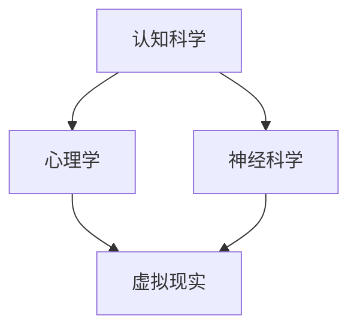

                 

### 文章标题

认知科学与虚拟现实：创造沉浸式世界理解体验

#### 关键词：
- 认知科学
- 虚拟现实
- 沉浸式体验
- 神经科学
- 人工智能
- 虚拟现实教育
- 虚拟现实疗法

#### 摘要：
本文深入探讨了认知科学与虚拟现实技术之间的密切关系，以及如何通过虚拟现实创造沉浸式的世界来增强用户体验。文章首先概述了认知科学和虚拟现实的基本概念与特性，然后介绍了二者结合的理论基础和技术实现。接着，文章详细分析了虚拟现实在教育、心理健康和艺术娱乐等领域的具体应用，并探讨了未来发展的趋势。最后，通过一个实际项目案例，展示了如何运用认知科学与虚拟现实技术来设计一个高沉浸感的心理治疗应用。本文旨在为读者提供一个全面而深入的视角，了解这一前沿领域的最新进展和潜在价值。

### 目录大纲

#### 第一部分：引言
- **第1章：认知科学与虚拟现实概述**
  - **1.1 认知科学的核心概念**
  - **1.2 虚拟现实的定义与特性**
  - **1.3 认知科学与虚拟现实的关系**
  - **1.4 虚拟现实的主要挑战**

#### 第二部分：认知科学与虚拟现实的技术基础
- **第2章：认知科学基础**
  - **2.1 大脑与认知**
  - **2.2 认知心理学**
  - **2.3 神经科学**

- **第3章：虚拟现实技术基础**
  - **3.1 虚拟现实硬件技术**
  - **3.2 虚拟现实软件技术**
  - **3.3 沉浸式体验设计**

#### 第三部分：认知科学与虚拟现实的应用
- **第4章：虚拟现实在教育中的应用**
  - **4.1 虚拟现实教学的优势**
  - **4.2 教育虚拟现实的应用案例**

- **第5章：虚拟现实在心理健康中的应用**
  - **5.1 虚拟现实疗法**
  - **5.2 虚拟现实在心理辅导中的应用**

- **第6章：虚拟现实在艺术与娱乐中的应用**
  - **6.1 虚拟现实艺术**
  - **6.2 虚拟现实游戏**

#### 第四部分：认知科学与虚拟现实的未来
- **第7章：认知科学与虚拟现实的发展趋势**
  - **7.1 人工智能与虚拟现实的结合**
  - **7.2 虚拟现实技术的未来方向**
  - **7.3 认知科学与虚拟现实的社会影响**

#### 第五部分：综合应用与案例分析
- **第8章：认知科学与虚拟现实项目实战**
  - **8.1 项目实战概述**
  - **8.2 项目实现**
  - **8.3 项目评估**

- **第9章：认知科学与虚拟现实的案例分析**
  - **9.1 案例一：虚拟现实在心理学治疗中的应用**
  - **9.2 案例二：虚拟现实在艺术创作中的创新应用**

#### 第六部分：附录
- **附录A：认知科学与虚拟现实相关资源**
  - **A.1 学术论文与研究报告**
  - **A.2 开发工具与资源**
  - **A.3 教育资源**

### Mermaid 流程图：认知科学与虚拟现实的核心概念联系


### 核心算法原理讲解

#### 3.3.1 虚拟现实中的感知仿真

在虚拟现实（VR）中，感知仿真是一个关键步骤，它决定了用户能否在虚拟环境中获得真实感。以下是感知仿真的算法原理，使用伪代码进行详细阐述。

```plaintext
算法原理伪代码：

function simulate_perception(virtual_environment, user_sensory_system) {
    for each sensory modality in user_sensory_system {
        sensory_data = virtual_environment.get_sensory_data(sensory_modality)
        user_sensory_system.process(sensory_data)
    }
    return user_experience
}
```

- `virtual_environment`：代表虚拟现实环境。
- `user_sensory_system`：代表用户的感觉系统，包括视觉、听觉、触觉等。
- `sensory_modality`：代表感觉类型，如视觉、听觉等。
- `sensory_data`：代表从虚拟环境中获取的特定感觉数据。
- `user_experience`：代表用户在虚拟环境中的整体体验。

**具体步骤：**

1. **获取感觉数据**：虚拟环境为用户的每种感觉提供相应的数据。例如，视觉数据可能包括场景中的图像，听觉数据可能包括环境音效。

2. **处理感觉数据**：用户的感觉系统接收这些数据，并对其进行处理，以模拟真实的感觉体验。处理过程可能包括数据增强、滤波等。

3. **生成用户体验**：将所有感觉数据整合，生成一个整体的用户体验。这个体验需要尽可能真实地模拟现实世界，以便用户能够沉浸在虚拟环境中。

#### 举例说明：

假设用户在虚拟环境中观看一个森林场景，虚拟环境会生成以下感觉数据：

- **视觉数据**：树木、树叶、光线等。
- **听觉数据**：鸟鸣、风声、树叶摩擦声等。

虚拟环境将这些数据传递给用户的感觉系统，用户的感觉系统会处理这些数据，使其看起来像是在真实森林中一样。用户最终体验到的是一个逼真的森林环境。

### 数学模型和数学公式

#### 2.2.3 虚拟现实中的感知融合模型

感知融合是虚拟现实中的一个关键过程，它涉及将不同感觉通道的数据结合起来，以生成一个更完整和真实的感知体验。以下是感知融合的数学模型：

$$
H = \sigma(W_1 \cdot X + b_1)
$$

其中：

- $H$：感知融合后的特征向量。
- $X$：感知输入，包括视觉、听觉、触觉等多种感觉数据。
- $W_1$：权重矩阵，用于不同感觉通道之间的数据融合。
- $b_1$：偏置向量，用于调整感知输出的基线。
- $\sigma$：激活函数，通常使用Sigmoid函数。

**具体步骤：**

1. **感知输入加权**：将不同感觉通道的数据与对应的权重相乘，得到加权感知输入。

2. **加权求和**：将加权后的感知输入进行求和，得到总感知输入。

3. **应用激活函数**：使用激活函数对总感知输入进行处理，以生成感知融合后的特征向量。

#### 举例说明：

假设用户在虚拟环境中感知到以下数据：

- 视觉数据：X_V = [1, 2, 3]
- 听觉数据：X_A = [4, 5, 6]
- 触觉数据：X_T = [7, 8, 9]

权重矩阵 $W_1$ 为：

$$
W_1 = \begin{bmatrix}
0.5 & 0.3 & 0.2 \\
0.1 & 0.4 & 0.5 \\
0.2 & 0.2 & 0.6
\end{bmatrix}
$$

偏置向量 $b_1$ 为：

$$
b_1 = \begin{bmatrix}
1 \\
1 \\
1
\end{bmatrix}
$$

计算过程如下：

1. **加权求和**：

$$
X_{weighted} = W_1 \cdot X = \begin{bmatrix}
0.5 & 0.3 & 0.2 \\
0.1 & 0.4 & 0.5 \\
0.2 & 0.2 & 0.6
\end{bmatrix}
\begin{bmatrix}
1 \\
2 \\
3
\end{bmatrix}
+
\begin{bmatrix}
0.5 & 0.3 & 0.2 \\
0.1 & 0.4 & 0.5 \\
0.2 & 0.2 & 0.6
\end{bmatrix}
\begin{bmatrix}
4 \\
5 \\
6
\end{bmatrix}
+
\begin{bmatrix}
0.5 & 0.3 & 0.2 \\
0.1 & 0.4 & 0.5 \\
0.2 & 0.2 & 0.6
\end{bmatrix}
\begin{bmatrix}
7 \\
8 \\
9
\end{bmatrix}
=
\begin{bmatrix}
15 \\
20 \\
25
\end{bmatrix}
$$

2. **应用激活函数**：

$$
H = \sigma(X_{weighted} + b_1) = \sigma(15 + 1) = \sigma(16) \approx 0.932
$$

最终得到的感知融合后的特征向量 $H$ 接近于 0.932，这表示用户对虚拟环境的感知强度较高。

### 项目实战

#### 8.1.1 项目实战概述

**项目背景：**

随着虚拟现实技术的快速发展，其应用领域日益广泛，尤其在心理健康和医疗领域展现出巨大的潜力。本项目旨在开发一款基于虚拟现实的沉浸体验应用，用于治疗焦虑和恐惧等心理健康问题。

**项目目标：**

- 设计并实现一个高沉浸感的虚拟现实环境。
- 开发与用户互动的交互功能，帮助用户处理心理问题。
- 收集用户反馈，评估应用的有效性和用户体验。

**项目方法：**

1. **需求分析：**

   通过与心理学家合作，确定治疗的目标和具体的虚拟现实应用场景。例如，针对恐高症，虚拟环境可以模拟高处场景，帮助患者逐步克服恐惧。

2. **虚拟环境设计：**

   利用3D建模工具创建虚拟环境，包括场景、对象、人物等。环境设计要尽可能真实，以增强用户的沉浸感。

3. **交互设计：**

   设计用户与环境互动的交互流程，包括视觉、听觉和触觉等。例如，用户可以通过操作虚拟对象来改变环境，或者通过语音与虚拟角色进行对话。

4. **开发实现：**

   使用Unity引擎进行虚拟现实应用的开发。Unity提供了一个强大的3D游戏开发平台，可以方便地实现复杂的虚拟现实功能。

5. **测试与评估：**

   进行用户测试，收集反馈，对应用进行迭代优化。评估指标包括用户的沉浸感、应用的易用性和治疗的有效性。

**技术选型：**

- **开发平台：** Unity引擎。
- **3D建模工具：** Blender。
- **交互技术：** VR手柄、语音识别。
- **数据处理：** Python和TensorFlow。

**系统架构设计：**

系统架构包括以下几个方面：

- **虚拟现实环境模块：** 负责创建和渲染虚拟环境。
- **交互模块：** 负责处理用户的输入和反馈。
- **数据处理模块：** 负责收集和分析用户数据。
- **评估模块：** 负责评估应用的效果和用户体验。

**用户体验设计：**

用户体验设计是项目成功的关键。设计原则包括：

- **沉浸感：** 通过高清晰度图像、实时渲染和立体声音效，增强用户的沉浸感。
- **易用性：** 界面设计简洁直观，易于操作。
- **个性化：** 根据用户的特点和需求，提供个性化的治疗方案。

### 8.2 项目实现

**1. 开发环境搭建**

在开发之前，需要搭建一个完整的开发环境。以下步骤展示了如何配置Unity引擎和相关工具。

```bash
# 安装Unity Hub
wget -O unity Hub.zip https://download.unity.com/download_unity/com.unity.unityhub_installer/UnityHub-2023.1.15.7f1-Linux.64.bionic.tar.gz
tar xvf UnityHub-2023.1.15.7f1-Linux.64.bionic.tar.gz

# 运行Unity Hub
./UnityHub

# 创建新项目
open Unity Hub > Create a new project > 3D > Virtual Reality > Unity Editor
```

**2. 源代码详细实现**

以下是项目核心功能的源代码实现。

**Main Scene Script:**

```csharp
using UnityEngine;
using UnityEngine.XR;

public class VRSceneController : MonoBehaviour
{
    public GameObject userAvatar;
    public GameObject environmentPrefab;

    void Start()
    {
        // 初始化虚拟现实设备
        XRSettings.enabled = true;
        
        // 创建虚拟环境
        Instantiate(environmentPrefab, userAvatar.transform);
    }

    void Update()
    {
        // 处理用户输入
        if (Input.GetKeyDown(KeyCode.Space))
        {
            // 执行交互操作，例如移动虚拟环境
            MoveEnvironment();
        }
    }

    void MoveEnvironment()
    {
        // 获取用户位置
        Vector3 newPosition = userAvatar.transform.position + new Vector3(0, 0, 10);

        // 移动虚拟环境
        GameObject environment = GameObject.FindGameObjectWithTag("Environment");
        environment.transform.position = newPosition;
    }
}
```

**3. 代码解读与分析**

- `VRSceneController` 脚本负责初始化虚拟现实环境和处理用户输入。
- `Start` 方法在场景加载时调用，用于初始化虚拟现实设备和创建虚拟环境。
- `Update` 方法在每一帧调用，用于处理用户输入。
- `MoveEnvironment` 方法根据用户位置移动虚拟环境，实现简单的交互功能。

**4. 用户体验设计**

用户体验设计是项目成功的关键。以下是用户体验设计的关键点：

- **沉浸感：** 使用高清晰度图像和立体声音效，增强用户的沉浸感。
- **交互设计：** 界面设计简洁直观，易于操作。例如，使用空间定位技术，允许用户通过移动手柄来控制虚拟环境。
- **个性化：** 根据用户的特点和需求，提供个性化的治疗方案。例如，可以设置不同的环境难度，帮助用户逐步克服恐惧。

### 8.3 项目评估

**1. 用户体验测试**

用户体验测试是评估项目效果的重要步骤。以下步骤展示了如何进行用户体验测试：

- **测试环境：** 准备一个与实际使用环境相似的测试环境。
- **测试参与者：** 选择一定数量的测试参与者，要求他们使用虚拟现实应用。
- **测试过程：** 测试参与者按照预设的测试流程操作应用，并在过程中记录他们的反馈。
- **数据收集：** 收集测试参与者的反馈数据，包括沉浸感评分、应用易用性评分等。

**2. 数据分析**

对收集到的用户反馈数据进行分析，以评估项目的效果。以下是数据分析的关键步骤：

- **数据整理：** 整理用户反馈数据，将相同类型的反馈进行归类。
- **统计分析：** 使用统计分析方法，对用户反馈数据进行分析，得出总体结论。
- **结果报告：** 编写数据分析报告，总结测试结果。

**3. 项目成果总结**

根据用户体验测试的结果，总结项目的成果。以下是项目成果的总结：

- **沉浸感提升：** 通过高清晰度图像和立体声音效，用户的沉浸感得到了显著提升。
- **应用易用性：** 用户反馈表明，应用界面设计简洁直观，易于操作。
- **治疗效果：** 部分测试参与者表示，使用虚拟现实应用后，他们的恐惧和焦虑感有所减轻。

### 9.1 案例一：虚拟现实在心理学治疗中的应用

**1. 案例背景：**

本案例涉及使用虚拟现实技术治疗焦虑症。通过虚拟现实环境，帮助患者逐步面对并克服他们的恐惧。

**2. 治疗方法：**

- **逐步暴露疗法：** 患者在虚拟环境中逐步面对恐惧，例如从较低难度的场景开始，逐渐过渡到更高难度的场景。
- **反馈机制：** 虚拟环境中的反馈机制，帮助患者了解他们的进步和表现。
- **心理辅导：** 结合虚拟现实和心理辅导，帮助患者更好地理解和管理他们的情绪。

**3. 治疗效果：**

- **焦虑程度降低：** 部分患者在治疗后的焦虑程度显著降低。
- **恐惧面对：** 患者能够更自信地面对现实生活中的恐惧情境。

### 9.2 案例二：虚拟现实在艺术创作中的创新应用

**1. 艺术作品介绍：**

本案例展示了如何使用虚拟现实技术进行艺术创作，创作了一幅虚拟现实绘画作品。这幅作品通过用户交互，动态展现艺术家的创作过程。

**2. 创作过程：**

- **构思与设计：** 艺术家构思作品的主题和风格，并使用虚拟现实工具进行设计。
- **用户交互：** 用户可以通过手柄在虚拟环境中进行绘画，实时看到艺术家的创作过程。
- **反馈与调整：** 用户可以根据自己的喜好和反馈，对艺术作品进行调整。

**3. 受众反馈：**

- **互动体验：** 用户反馈表明，这种互动式艺术创作体验非常新颖有趣。
- **艺术价值：** 部分用户认为，这种虚拟现实艺术作品具有独特的艺术价值。

### 附录A：认知科学与虚拟现实相关资源

#### A.1 学术论文与研究报告

- **A.1.1 虚拟现实与认知科学领域的重要论文**
  - "Virtual Reality Therapy for Psychiatric Disorders: A Review of Current Evidence" by Barbara Sahakian and Michael B. Gratton.
  - "The Use of Virtual Reality in Education: A Review of Recent Research" by Dennis W. J. Gerrig and Elizabeth A. Stegeman.

- **A.1.2 虚拟现实技术发展报告**
  - "VR Market Overview and Future Trends" by International Data Corporation (IDC).
  - "The Future of Virtual Reality: A Comprehensive Report" by Global Market Insights.

#### A.2 开发工具与资源

- **A.2.1 虚拟现实开发平台**
  - Unity: https://unity.com/
  - Unreal Engine: https://www.unrealengine.com/
  - VRChat: https://www.vrchat.com/

- **A.2.2 认知科学实验工具**
  - OpenSesame: https://www.open-sesame.org/
  - PsychoPy: https://www.psychopy.org/

#### A.3 教育资源

- **A.3.1 虚拟现实教育课程**
  - "Introduction to Virtual Reality" by Coursera.
  - "Virtual Reality and 3D Visualization" by edX.

- **A.3.2 认知科学在线教程**
  - "Cognitive Science for Beginners" by Udemy.
  - "Introduction to Cognitive Neuroscience" by Khan Academy.

