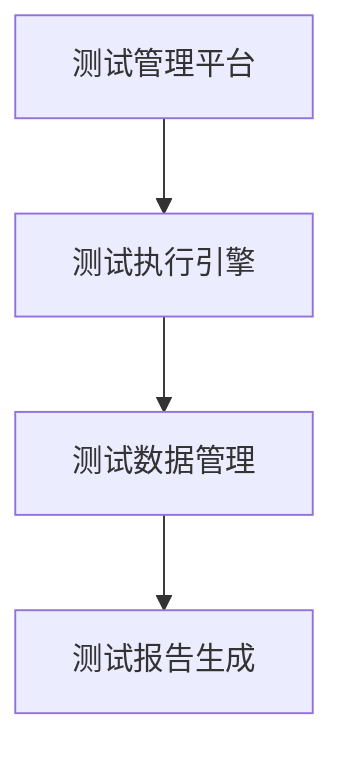
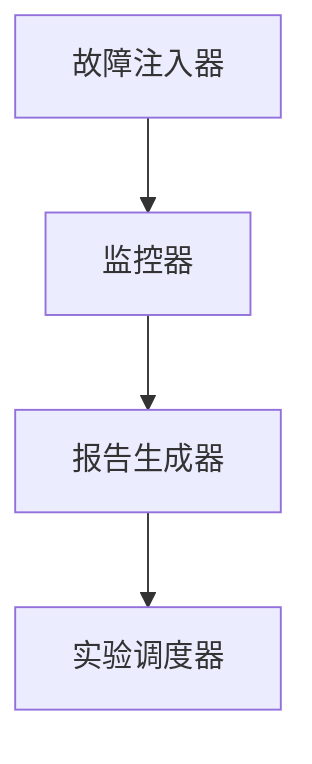

                 

# 《评测系统的故障注入与混沌工程实践》

## 摘要

在当今快速发展的数字化时代，评测系统作为软件开发生命周期中的重要一环，对于确保软件质量和稳定性具有重要意义。本文旨在探讨故障注入与混沌工程在评测系统中的应用，通过深入分析故障注入与混沌工程的基本概念、技术方法以及实际案例，揭示其在提升软件可靠性、容错性和可维护性方面的巨大潜力。文章将分为八个部分，首先介绍评测系统与故障注入的基础知识，然后详细讲解故障注入技术、混沌工程实践及其在评测系统中的应用，最后提出实施指南与未来展望，为从事软件评测的技术人员提供有价值的参考。

## 关键词

- 评测系统
- 故障注入
- 混沌工程
- 软件质量
- 容错性
- 可维护性

### 第一部分：引言与基础知识

#### 第1章：评测系统与故障注入基础

**1.1 评测系统的定义与重要性**

**1.1.1 评测系统概述**

评测系统是一种用于评估软件质量和性能的工具，它通过对软件进行测试、验证和评估，确保软件产品满足既定的需求和标准。评测系统在企业中的作用至关重要，它不仅可以帮助企业快速发现软件中的缺陷，还能提高软件的质量和可靠性，降低软件发布后的故障率和维护成本。

**1.1.2 评测系统在企业中的角色**

在软件开发过程中，评测系统扮演了多个关键角色：
- **需求验证**：确保软件功能满足用户需求。
- **质量监控**：通过持续集成和持续部署，监控软件质量的变化。
- **缺陷管理**：记录和管理软件中的缺陷，跟踪缺陷的修复过程。
- **性能评估**：评估软件的性能，如响应时间、吞吐量等。

**1.1.3 故障注入与评测系统的关系**

故障注入是一种主动测试技术，它通过引入预期的故障，评估软件的容错性和稳定性。在评测系统中，故障注入技术可以模拟各种故障场景，帮助开发团队识别软件的潜在问题，从而提高软件的可靠性和健壮性。

**1.2 故障注入的概念与目的**

**1.2.1 故障注入的定义**

故障注入是指在软件测试过程中，有意引入特定的故障或异常，以测试软件的响应和处理能力。这种方法不同于传统的随机测试，它更注重对特定故障场景的模拟和分析。

**1.2.2 故障注入的目的**

故障注入的主要目的是：
- **评估软件的容错性**：通过引入故障，观察软件系统在故障情况下的行为和恢复能力。
- **识别潜在缺陷**：帮助开发团队发现软件中可能存在的漏洞和缺陷。
- **改进软件设计**：通过故障注入的结果，改进软件的架构和设计，提高其稳定性和可靠性。

**1.2.3 故障注入的常见应用场景**

故障注入在以下场景中具有显著应用价值：
- **系统升级**：在系统升级过程中，通过故障注入测试新版本软件的兼容性和稳定性。
- **性能优化**：通过故障注入测试系统在高负载或极端条件下的性能表现。
- **安全测试**：在安全测试中，通过故障注入模拟各种攻击场景，评估软件的安全性。

**1.3 混沌工程的基本理念与实践**

**1.3.1 混沌工程的概念**

混沌工程是一种新兴的软件工程实践，它通过故意引入系统中不可预测的故障和扰动，以测试和提升系统的弹性和可靠性。混沌工程不同于传统的故障注入，它更加关注系统在复杂环境中的表现。

**1.3.2 混沌工程的目标与关键指标**

混沌工程的目标是：
- **提高系统的弹性**：通过引入故障和扰动，测试系统在不可预见情况下的反应能力和恢复速度。
- **提升系统的健壮性**：通过混沌实验，发现系统的潜在缺陷和瓶颈，从而改进系统的设计和架构。

关键指标包括：
- **系统恢复时间**：故障发生到系统恢复正常所需的时间。
- **错误率**：系统在故障情况下的错误率。
- **资源利用率**：系统在故障情况下的资源利用效率。

**1.3.3 混沌工程的关键概念与实践**

混沌工程的关键概念包括：
- **故障注入**：故意引入故障以测试系统的反应能力。
- **混沌实验**：设计并执行一系列故障注入实验，以评估系统的弹性。
- **自动化**：利用自动化工具进行故障注入和混沌实验，提高测试效率和准确性。

在实践混沌工程时，需要遵循以下步骤：
1. **定义目标**：明确混沌工程的目标和关键指标。
2. **设计实验**：设计故障注入实验的场景和策略。
3. **执行实验**：自动化执行故障注入和混沌实验。
4. **分析结果**：分析实验结果，发现系统的缺陷和瓶颈。
5. **改进设计**：根据实验结果，改进系统的设计和架构。

#### 第2章：故障注入技术

**2.1 故障注入策略与方法**

**2.1.1 故障注入的分类**

故障注入可以分为以下几类：

1. **静态故障注入**：在软件编译或构建过程中引入故障，如错误代码、无效数据等。
2. **动态故障注入**：在软件运行过程中引入故障，如模拟网络中断、数据库故障等。
3. **环境故障注入**：通过修改环境变量、网络配置等，模拟外部环境故障。

**2.1.2 故障注入的方法与策略**

故障注入的方法和策略包括：

1. **随机故障注入**：随机选择故障点和故障类型，以发现软件中的潜在缺陷。
2. **基于模型的故障注入**：根据软件的模型和预期行为，设计故障注入策略，以测试软件在不同故障条件下的表现。
3. **混合故障注入**：结合随机故障注入和基于模型的故障注入，以提高故障注入的覆盖率和准确性。

**2.2 故障注入工具与平台**

**2.2.1 常见的故障注入工具**

常见的故障注入工具包括：

1. **Chaos Monkey**：由Netflix开发的故障注入工具，可以随机终止AWS上的实例，模拟系统故障。
2. **Thorn**：由Netflix开发的故障注入框架，可以注入各种类型的故障，如网络故障、数据库故障等。
3. **Chaosblade**：由阿里巴巴开源的故障注入工具，支持多种故障类型的注入。

**2.2.2 故障注入平台的架构与功能**

故障注入平台通常包括以下几个关键组件：

1. **故障注入器**：负责生成故障，并注入到系统中。
2. **监控器**：实时监控系统的状态，记录故障注入的结果。
3. **报告生成器**：生成故障注入的详细报告，包括故障注入的类型、注入时间、注入结果等。

**2.3 故障注入在软件评测中的应用**

**2.3.1 故障注入在软件评测中的流程**

故障注入在软件评测中的应用通常包括以下步骤：

1. **需求分析**：确定需要注入的故障类型和数量。
2. **故障注入器选择**：选择合适的故障注入工具或平台。
3. **故障注入**：按照预定的策略和流程，注入故障到系统中。
4. **测试执行**：在故障注入后，执行一系列测试，评估软件的反应和处理能力。
5. **结果分析**：分析故障注入的结果，识别软件中的缺陷和瓶颈。
6. **反馈与改进**：根据分析结果，反馈给开发团队，进行软件设计和代码的改进。

**2.3.2 故障注入在软件评测中的价值**

故障注入在软件评测中的价值体现在以下几个方面：

1. **提高软件的容错性**：通过故障注入，可以测试软件在故障情况下的行为和恢复能力，从而提高软件的容错性。
2. **识别潜在缺陷**：故障注入可以帮助发现软件中可能存在的漏洞和缺陷，从而提前修复，降低发布后的故障率。
3. **改进软件设计**：通过故障注入的结果，可以识别软件的潜在问题和瓶颈，从而改进软件的架构和设计，提高其稳定性和可靠性。

**2.3.3 故障注入在软件评测中的挑战**

故障注入在软件评测中面临的挑战包括：

1. **故障注入的准确性**：如何选择合适的故障类型和注入策略，以确保故障注入的准确性和有效性。
2. **故障注入的效率**：如何高效地执行故障注入，并获取有效的测试结果。
3. **故障注入的成本**：故障注入需要投入一定的人力、时间和资源，如何平衡故障注入的成本和收益。

#### 第3章：混沌工程实践

**3.1 混沌工程的目标与关键指标**

**3.1.1 混沌工程的目标**

混沌工程的目标是：
- **提高系统的弹性**：通过引入故障和扰动，测试系统在不可预见情况下的反应能力和恢复速度。
- **提升系统的健壮性**：通过混沌实验，发现系统的潜在缺陷和瓶颈，从而改进系统的设计和架构。

**3.1.2 关键指标的定义与测量**

混沌工程的关键指标包括：

1. **系统恢复时间**：故障发生到系统恢复正常所需的时间。
2. **错误率**：系统在故障情况下的错误率。
3. **资源利用率**：系统在故障情况下的资源利用效率。

这些指标可以通过自动化工具进行实时监控和测量，以便对混沌工程的效果进行评估。

**3.2 混沌实验的设计与执行**

**3.2.1 混沌实验的设计原则**

设计混沌实验时，应遵循以下原则：

1. **目标明确**：明确混沌实验的目标和预期效果，确保实验的设计和执行具有针对性。
2. **覆盖全面**：设计实验时，应涵盖各种故障类型和场景，以提高测试的全面性和准确性。
3. **自动化**：尽量使用自动化工具进行故障注入和实验执行，以提高实验的效率和可重复性。

**3.2.2 混沌实验的执行步骤**

混沌实验的执行通常包括以下步骤：

1. **准备阶段**：确定实验的目标、故障类型和注入策略，选择合适的工具和平台。
2. **执行阶段**：按照预定的策略和流程，执行故障注入和混沌实验。
3. **监控阶段**：实时监控系统的状态，记录故障注入的结果，包括系统恢复时间、错误率和资源利用率等指标。
4. **分析阶段**：分析实验结果，识别系统的缺陷和瓶颈，提出改进建议。
5. **报告阶段**：生成详细的实验报告，包括实验设计、执行结果和分析建议等。

**3.2.3 混沌实验的案例分析**

**3.2.3.1 案例一：分布式系统的可用性测试**

场景：对一个分布式系统进行可用性测试，模拟网络分区故障。

步骤：
1. 准备阶段：确定分布式系统的拓扑结构，选择合适的故障注入工具。
2. 执行阶段：使用Chaos Monkey工具，随机终止系统中的节点，模拟网络分区故障。
3. 监控阶段：使用Prometheus和Grafana监控系统状态，记录系统恢复时间、错误率和资源利用率等指标。
4. 分析阶段：分析实验结果，发现系统在故障情况下的恢复速度较慢，错误率较高，需要改进系统的设计和架构。
5. 报告阶段：生成实验报告，提出改进建议，如优化负载均衡策略、增加冗余节点等。

**3.2.3.2 案例二：数据库系统的稳定性测试**

场景：对一个关系型数据库系统进行稳定性测试，模拟数据库宕机故障。

步骤：
1. 准备阶段：确定数据库系统的架构和配置，选择合适的故障注入工具。
2. 执行阶段：使用Thorn工具，模拟数据库宕机故障，停止数据库服务。
3. 监控阶段：使用Zabbix和MySQL Enterprise Monitor监控系统状态，记录系统恢复时间、错误率和资源利用率等指标。
4. 分析阶段：分析实验结果，发现系统在数据库宕机情况下，部分应用无法访问数据库，需要优化数据库的高可用性和故障恢复机制。
5. 报告阶段：生成实验报告，提出改进建议，如增加数据库主从复制、配置数据库故障转移等。

**3.3 混沌工程的收益与挑战**

**3.3.1 混沌工程的收益**

混沌工程的收益主要体现在以下几个方面：

1. **提高系统的弹性**：通过混沌实验，可以测试系统在故障情况下的反应能力和恢复速度，从而提高系统的弹性。
2. **提升系统的健壮性**：通过混沌实验，可以识别系统的潜在缺陷和瓶颈，从而改进系统的设计和架构，提高其健壮性。
3. **降低故障风险**：通过混沌工程，可以提前发现和修复系统的潜在故障，降低系统在生产环境中的故障风险。

**3.3.2 混沌工程的挑战**

混沌工程面临的挑战包括：

1. **实验设计**：如何设计有效的混沌实验，涵盖各种故障类型和场景，确保实验的全面性和准确性。
2. **自动化工具选择**：选择合适的自动化工具，确保故障注入和混沌实验的高效执行。
3. **实验结果分析**：如何分析实验结果，识别系统的缺陷和瓶颈，并提出有效的改进建议。
4. **成本控制**：如何平衡混沌工程的成本和收益，确保混沌工程在资源有限的情况下取得最大化的效果。

### 第二部分：故障注入与混沌工程在评测系统中的应用

#### 第4章：评测系统中的故障注入实践

**4.1 评测系统架构与故障注入点**

**4.1.1 评测系统架构概述**

评测系统通常由多个组件组成，包括测试管理平台、测试执行引擎、测试数据管理、测试报告生成等。其基本架构如图1所示。



**4.1.2 故障注入点的选择与定位**

在评测系统中，故障注入点的选择至关重要。以下是一些常见的故障注入点：

1. **网络层**：模拟网络延迟、网络中断等故障。
2. **数据库层**：模拟数据库连接失败、数据不一致等故障。
3. **应用层**：模拟业务逻辑错误、异常处理失败等故障。
4. **存储层**：模拟文件系统故障、存储容量不足等故障。

**4.2 故障注入案例分析**

**4.2.1 案例一：网络故障注入**

场景：模拟评测系统中的网络故障，以测试系统的容错性和恢复能力。

步骤：
1. **需求分析**：确定需要模拟的网络故障类型和场景，如网络延迟、网络中断等。
2. **故障注入器选择**：选择合适的故障注入工具，如Chaos Monkey。
3. **故障注入**：使用Chaos Monkey工具，在测试环境中随机中断网络连接。
4. **测试执行**：执行一系列测试，观察系统在故障情况下的行为和恢复能力。
5. **结果分析**：分析测试结果，识别系统的缺陷和瓶颈，并提出改进建议。

**4.2.2 案例二：数据库故障注入**

场景：模拟评测系统中的数据库故障，以测试系统的容错性和数据完整性。

步骤：
1. **需求分析**：确定需要模拟的数据库故障类型和场景，如数据库连接失败、数据不一致等。
2. **故障注入器选择**：选择合适的故障注入工具，如Thorn。
3. **故障注入**：使用Thorn工具，模拟数据库连接失败和数据不一致等故障。
4. **测试执行**：执行一系列测试，观察系统在故障情况下的行为和恢复能力。
5. **结果分析**：分析测试结果，识别系统的缺陷和瓶颈，并提出改进建议。

**4.3 故障注入效果评估**

**4.3.1 故障注入效果的评估方法**

故障注入效果评估通常包括以下几个方面：

1. **系统恢复时间**：评估故障发生后，系统恢复正常所需的时间。
2. **错误率**：评估故障发生期间，系统的错误率。
3. **资源利用率**：评估故障发生期间，系统的资源利用率。

**4.3.2 故障注入效果的数据分析**

通过收集和分析故障注入过程中的数据，可以评估故障注入的效果。以下是一个示例数据表格：

| 指标         | 数值     | 单位   |
| ------------ | -------- | ------ |
| 系统恢复时间 | 10分钟   | 分钟   |
| 错误率       | 2%       | 百分比 |
| 资源利用率   | 80%      | 百分比 |

根据数据表格，可以得出以下结论：

- 系统恢复时间较短，说明系统在故障情况下的恢复能力较强。
- 错误率较低，说明系统在故障情况下的稳定性较好。
- 资源利用率较高，说明系统在故障情况下的资源利用效率较高。

**4.4 故障注入在评测系统中的价值**

**4.4.1 提高系统容错性**

故障注入可以帮助测试团队评估系统在故障情况下的容错性。通过引入各种故障，测试团队可以观察系统在故障发生时的行为，并评估系统的恢复能力和故障恢复时间。这有助于发现系统的潜在问题和瓶颈，从而提高系统的容错性。

**4.4.2 识别潜在缺陷**

故障注入可以帮助测试团队发现软件中的潜在缺陷。在故障注入过程中，测试团队可以观察到系统在故障条件下的异常行为，这有助于发现软件中的漏洞和缺陷。通过及时修复这些缺陷，可以降低系统在发布后的故障率和维护成本。

**4.4.3 改进软件设计**

故障注入的结果可以为开发团队提供宝贵的反馈，帮助他们改进软件的设计。通过分析故障注入的结果，开发团队可以识别系统的潜在问题和瓶颈，并提出改进措施。这有助于提高软件的稳定性、可靠性和可维护性。

#### 第5章：混沌工程在评测系统中的应用

**5.1 评测系统的混沌工程框架**

**5.1.1 混沌工程框架概述**

混沌工程框架旨在系统地实施混沌实验，以评估系统的弹性和健壮性。一个典型的混沌工程框架包括以下几个关键组件：

1. **故障注入器**：负责生成和注入故障，如网络延迟、数据库连接失败等。
2. **监控器**：实时监控系统的状态，记录故障注入的结果。
3. **报告生成器**：生成详细的实验报告，包括故障注入的类型、注入时间、注入结果等。
4. **实验调度器**：负责调度和执行混沌实验，确保实验的自动化和高效性。

**5.1.2 混沌工程框架的架构**

混沌工程框架的架构如图2所示。



**5.2 混沌实验案例分析**

**5.2.1 案例一：网络混沌实验**

场景：对一个分布式评测系统进行网络混沌实验，以测试系统的弹性。

步骤：
1. **准备阶段**：确定实验的目标和场景，如网络延迟、网络中断等。
2. **故障注入**：使用Chaos Monkey工具，随机中断网络连接，模拟网络故障。
3. **监控阶段**：使用Prometheus和Grafana监控系统状态，记录网络延迟、错误率等指标。
4. **分析阶段**：分析实验结果，识别系统的缺陷和瓶颈，如网络连接失败、数据传输延迟等。
5. **改进阶段**：根据分析结果，优化网络配置、增加冗余网络等，以提高系统的弹性。

**5.2.2 案例二：数据库混沌实验**

场景：对一个关系型评测系统进行数据库混沌实验，以测试系统的健壮性。

步骤：
1. **准备阶段**：确定实验的目标和场景，如数据库连接失败、数据不一致等。
2. **故障注入**：使用Thorn工具，模拟数据库连接失败和数据不一致等故障。
3. **监控阶段**：使用Zabbix和MySQL Enterprise Monitor监控系统状态，记录数据库连接失败率、数据一致性等指标。
4. **分析阶段**：分析实验结果，识别系统的缺陷和瓶颈，如数据库连接失败、数据不一致等。
5. **改进阶段**：根据分析结果，优化数据库配置、增加冗余数据库等，以提高系统的健壮性。

**5.3 混沌工程在评测系统中的效果评估**

**5.3.1 混沌工程效果评估的方法**

混沌工程效果评估通常包括以下几个方面：

1. **系统恢复时间**：评估故障发生后，系统恢复正常所需的时间。
2. **错误率**：评估故障发生期间，系统的错误率。
3. **资源利用率**：评估故障发生期间，系统的资源利用率。

**5.3.2 混沌工程效果的数据分析**

通过收集和分析混沌实验的数据，可以评估混沌工程的效果。以下是一个示例数据表格：

| 指标         | 数值     | 单位   |
| ------------ | -------- | ------ |
| 系统恢复时间 | 10分钟   | 分钟   |
| 错误率       | 2%       | 百分比 |
| 资源利用率   | 80%      | 百分比 |

根据数据表格，可以得出以下结论：

- 系统恢复时间较短，说明系统在故障情况下的恢复能力较强。
- 错误率较低，说明系统在故障情况下的稳定性较好。
- 资源利用率较高，说明系统在故障情况下的资源利用效率较高。

**5.4 混沌工程在评测系统中的应用价值**

**5.4.1 提高系统弹性**

混沌工程通过模拟各种故障和扰动，可以测试系统的弹性。通过混沌实验，开发团队可以了解系统在故障情况下的反应能力和恢复速度，从而发现系统的潜在问题和瓶颈，并采取相应的改进措施。

**5.4.2 提升系统健壮性**

混沌工程通过混沌实验，可以评估系统的健壮性。开发团队可以通过分析混沌实验的结果，识别系统的缺陷和瓶颈，并优化系统的设计和架构，从而提高系统的稳定性、可靠性和可维护性。

**5.4.3 降低故障风险**

混沌工程可以帮助开发团队提前发现和修复系统的潜在故障，降低系统在生产环境中的故障风险。通过混沌实验，开发团队可以模拟各种故障场景，测试系统的反应和处理能力，从而提高系统的鲁棒性。

### 第三部分：故障注入与混沌工程的协同应用

#### 第6章：故障注入与混沌工程的协同应用

**6.1 故障注入与混沌工程的结合点**

**6.1.1 结合的意义**

故障注入与混沌工程的结合具有重要意义，它们各自的优势互补，能够为软件评测带来更全面的测试效果。故障注入通过引入预期的故障，重点测试软件的容错性和稳定性；而混沌工程通过模拟不可预见的环境变化，重点测试系统的弹性和健壮性。将两者结合，可以更全面地评估软件在各种环境下的表现。

**6.1.2 结合的优势**

1. **全面覆盖测试场景**：故障注入与混沌工程的结合，能够覆盖从预期故障到不可预见环境变化的各类测试场景，提高测试的全面性。
2. **提升软件质量**：通过结合故障注入和混沌工程，可以更全面地识别和修复软件中的潜在缺陷，提高软件的质量和稳定性。
3. **降低风险**：结合两者，可以更有效地预测和应对系统在实际运行中可能遇到的各种异常情况，降低故障风险。

**6.1.3 结合的实施路径**

要实现故障注入与混沌工程的结合，通常需要以下步骤：

1. **明确目标**：确定故障注入和混沌工程的目标，明确要测试的系统功能和性能指标。
2. **设计测试场景**：结合故障注入和混沌工程的特点，设计覆盖各种故障和环境变化的测试场景。
3. **工具集成**：选择和集成合适的故障注入工具和混沌工程平台，确保测试的自动化和高效性。
4. **执行测试**：按照设计好的测试场景，执行故障注入和混沌工程实验。
5. **结果分析**：分析测试结果，识别系统中的缺陷和瓶颈，并根据分析结果进行改进。

**6.2 协同应用的优势与挑战**

**6.2.1 协同应用的优势**

1. **增强测试覆盖率**：结合故障注入和混沌工程，可以更全面地覆盖测试场景，提高测试的准确性和全面性。
2. **提高软件可靠性**：通过同时测试预期故障和不可预见的环境变化，可以更有效地识别和修复软件中的潜在问题，提高软件的可靠性和稳定性。
3. **优化系统设计**：通过协同应用，可以更准确地评估系统在多种环境下的性能表现，为系统设计提供有力支持。

**6.2.2 协同应用的挑战**

1. **复杂性增加**：故障注入和混沌工程的结合，增加了测试的复杂性，需要更细致的规划和更复杂的工具集成。
2. **资源消耗**：同时进行故障注入和混沌工程实验，可能会对系统资源和时间造成较大消耗，需要合理分配资源。
3. **结果分析难度**：分析结合应用的结果，需要综合考虑故障注入和混沌工程的不同结果，难度较大。

**6.3 协同应用的实际案例**

**6.3.1 案例一：电商平台系统**

场景：一个电商平台系统，需要同时应对预期故障（如网络中断、数据库连接失败）和不可预见的环境变化（如突发流量、服务器故障）。

步骤：
1. **明确目标**：确定系统在故障和环境变化情况下的性能指标，如响应时间、吞吐量、错误率等。
2. **设计测试场景**：结合故障注入和混沌工程，设计多种测试场景，包括网络故障、数据库故障、流量高峰等。
3. **工具集成**：使用Chaos Monkey进行故障注入，使用Prometheus和Grafana进行混沌工程监控。
4. **执行测试**：按照设计好的测试场景，执行故障注入和混沌工程实验，实时监控系统的状态。
5. **结果分析**：分析测试结果，识别系统中的缺陷和瓶颈，如网络连接失败导致的高延迟、数据库连接失败导致的数据丢失等。
6. **优化设计**：根据分析结果，优化系统设计，如增加网络冗余、优化数据库连接处理等。

**6.3.2 案例二：金融交易系统**

场景：一个金融交易系统，需要应对预期故障（如服务器故障、网络延迟）和不可预见的环境变化（如交易高峰、突发错误）。

步骤：
1. **明确目标**：确定系统在故障和环境变化情况下的性能指标，如交易成功率、交易延迟、错误率等。
2. **设计测试场景**：结合故障注入和混沌工程，设计多种测试场景，包括服务器故障、网络延迟、交易高峰等。
3. **工具集成**：使用Thorn进行故障注入，使用Zabbix和MySQL Enterprise Monitor进行混沌工程监控。
4. **执行测试**：按照设计好的测试场景，执行故障注入和混沌工程实验，实时监控系统的状态。
5. **结果分析**：分析测试结果，识别系统中的缺陷和瓶颈，如服务器故障导致交易中断、网络延迟导致交易延迟等。
6. **优化设计**：根据分析结果，优化系统设计，如增加服务器冗余、优化网络配置、增加错误处理机制等。

**6.4 案例总结与启示**

通过上述案例，可以看出故障注入与混沌工程的协同应用在提升系统可靠性和稳定性方面具有显著效果。同时，也暴露出了一些挑战，如复杂性增加、资源消耗大等。因此，在实际应用中，需要根据具体场景和资源情况，合理规划测试策略，充分利用故障注入和混沌工程的优势，以提高测试效果。

### 第四部分：故障注入与混沌工程的实施指南

#### 第7章：评测系统故障注入与混沌工程的实施指南

**7.1 故障注入与混沌工程实施前的准备工作**

**7.1.1 确定目标和范围**

在实施故障注入与混沌工程之前，首先要明确测试目标和范围。这包括确定需要测试的系统功能、性能指标以及预期故障类型和场景。例如，可以确定测试目标是评估系统的容错性和稳定性，需要测试的场景包括网络故障、数据库故障等。

**7.1.2 环境准备**

为了确保测试的准确性和可重复性，需要准备相应的测试环境。这包括搭建测试服务器、配置测试数据库、安装测试工具等。例如，可以使用虚拟机或容器技术搭建测试环境，确保测试环境的独立性和一致性。

**7.1.3 工具选择**

选择合适的故障注入工具和混沌工程平台对于实施效果至关重要。常见的故障注入工具有Chaos Monkey、Thorn、Chaosblade等，混沌工程平台有Chaos Mesh、Fledge等。根据测试目标和环境，选择合适的工具，并进行必要的配置和集成。

**7.1.4 规划测试流程**

制定详细的测试流程，包括测试场景设计、故障注入策略、测试执行、结果分析和报告生成等步骤。确保测试流程的规范性和可操作性，为测试实施提供清晰的指导。

**7.2 实施过程中的关键步骤**

**7.2.1 故障注入实验设计**

设计故障注入实验时，应考虑以下几个方面：

1. **故障类型和场景**：根据测试目标和范围，选择合适的故障类型和场景。例如，可以模拟网络延迟、数据库连接失败、文件系统故障等。
2. **故障注入策略**：制定故障注入的策略，包括故障注入的时间、频率、强度等。例如，可以随机选择故障点，定期执行故障注入。
3. **故障注入工具**：根据选择好的故障注入工具，设计故障注入的具体步骤和操作。

**7.2.2 混沌工程实验设计**

设计混沌工程实验时，应考虑以下几个方面：

1. **混沌实验目标**：明确混沌实验的目标，如评估系统的弹性、健壮性等。
2. **混沌实验场景**：根据测试目标和环境，设计多种混沌实验场景，如网络分区、服务器故障、流量高峰等。
3. **混沌实验策略**：制定混沌实验的策略，包括混沌实验的时间、频率、强度等。例如，可以定期执行混沌实验，逐步增加故障强度。

**7.2.3 实验执行与监控**

按照设计好的故障注入和混沌工程实验，执行测试并实时监控系统的状态。使用监控工具记录系统在故障注入和混沌实验中的各项指标，如响应时间、吞吐量、错误率等。确保测试过程中数据采集的准确性和完整性。

**7.2.4 结果分析与反馈**

分析实验结果，识别系统中的缺陷和瓶颈。根据分析结果，提出改进建议和措施，如优化系统设计、增加冗余机制等。同时，将分析结果和改进建议反馈给开发团队，促进系统的改进。

**7.3 实施后的效果评估与改进**

**7.3.1 效果评估**

通过对比故障注入和混沌工程实验前后的系统性能和稳定性指标，评估故障注入和混沌工程的效果。可以重点关注以下指标：

1. **系统恢复时间**：故障注入和混沌实验后，系统恢复正常所需的时间。
2. **错误率**：故障注入和混沌实验期间，系统的错误率。
3. **资源利用率**：故障注入和混沌实验期间，系统的资源利用率。

**7.3.2 改进措施**

根据效果评估的结果，制定改进措施，如优化系统设计、增加冗余机制、改进错误处理机制等。对改进措施进行验证，确保其有效性和可行性。

**7.3.3 持续优化**

故障注入和混沌工程是一个持续优化的过程。随着系统的发展和变化，需要不断调整故障注入和混沌工程的策略，以适应新的测试需求和场景。通过持续优化，不断提升系统的可靠性和稳定性。

### 第五部分：未来展望与趋势

#### 第8章：故障注入与混沌工程在评测系统中的发展趋势

**8.1 故障注入与混沌工程在评测系统中的发展趋势**

随着云计算、大数据、人工智能等技术的快速发展，评测系统在软件开发生命周期中的重要性日益凸显。故障注入与混沌工程作为提升软件质量和可靠性的重要手段，也在评测系统中得到了广泛应用。未来，故障注入与混沌工程在评测系统中的发展趋势包括：

1. **智能化**：故障注入与混沌工程的自动化和智能化水平将不断提高。通过引入机器学习和人工智能技术，可以实现故障注入和混沌实验的智能化设计、执行和分析。
2. **多样化**：故障注入与混沌工程的应用场景将越来越多样化。除了传统的网络故障、数据库故障等，还将涵盖更多类型的故障，如硬件故障、应用程序故障等。
3. **集成化**：故障注入与混沌工程将与其他软件工程实践，如持续集成、持续部署等，实现更紧密的集成，形成完整的软件质量保障体系。
4. **标准化**：故障注入与混沌工程的方法和工具将逐步标准化，以降低实施难度，提高测试效果。

**8.2 新技术的引入与挑战**

未来，新技术的发展将为故障注入与混沌工程带来新的机遇和挑战：

1. **区块链**：区块链技术的引入，可以为故障注入和混沌工程提供更安全、可靠的测试环境，确保测试数据的真实性和完整性。
2. **物联网**：随着物联网的普及，故障注入与混沌工程将在更广泛的设备和服务中应用，带来更多的测试需求和挑战。
3. **人工智能**：人工智能技术的应用，将使故障注入和混沌实验更加智能化，提高测试的准确性和效率。

**8.3 未来发展的方向与机遇**

未来，故障注入与混沌工程在评测系统中的发展方向和机遇包括：

1. **跨领域应用**：故障注入与混沌工程将在更多领域得到应用，如金融、医疗、智能制造等，为各行业提供高质量、高可靠性的软件服务。
2. **产学研合作**：学术界、工业界和研究机构将加强合作，共同推动故障注入与混沌工程的研究和应用，提高整体技术水平。
3. **商业模式的创新**：故障注入与混沌工程将形成新的商业模式，为企业和创业者提供丰富的商机。

### 附录A：故障注入与混沌工程常用工具

**A.1 故障注入工具使用指南**

**A.1.1 Chaos Monkey**

**概述**：Chaos Monkey是由Netflix开发的一款故障注入工具，用于随机终止AWS上的实例，模拟系统故障。

**安装**：在AWS环境中，可以通过AWS CLI安装Chaos Monkey。

```bash
sudo apt-get install python3-pip
pip3 install chaos-monkey
```

**配置**：配置Chaos Monkey时，需要指定要注入故障的AWS区域和实例ID。

```bash
# 示例配置文件
[DEFAULT]
environment=staging
service=service1
aws_access_key_id=YOUR_ACCESS_KEY
aws_secret_access_key=YOUR_SECRET_KEY
aws_region=us-west-2
```

**使用**：运行Chaos Monkey命令，执行故障注入。

```bash
chaos-monkey --environment staging --service service1
```

**A.1.2 Thorn**

**概述**：Thorn是由Netflix开发的一款故障注入框架，可以注入各种类型的故障，如网络故障、数据库故障等。

**安装**：在Linux环境中，可以通过Git克隆Thorn的代码库进行安装。

```bash
git clone https://github.com/netflix/thorn.git
cd thorn
pip install -r requirements.txt
```

**配置**：配置Thorn时，需要指定故障类型、注入策略和注入时间等。

```python
# 示例配置文件
import yaml
from thorn import fault

with open('config.yaml', 'r') as f:
    config = yaml.safe_load(f)

faults = [fault.Delay(60), fault.HttpError(500)]
thorn_runner = ThornRunner(faults, config)
thorn_runner.run()
```

**使用**：运行Thorn Runner，执行故障注入。

```bash
python thorn_runner.py
```

**A.1.3 Chaosblade**

**概述**：Chaosblade是由阿里巴巴开源的一款故障注入工具，支持多种故障类型的注入。

**安装**：在Linux环境中，可以通过包管理器安装Chaosblade。

```bash
sudo apt-get install chaosblade
```

**配置**：配置Chaosblade时，需要指定故障类型和注入目标。

```bash
# 示例配置文件
blades:
  - name: network-delay
    type: network.delay
    resource: docker
    spec:
      container_name: my-container
      delay: 500ms
```

**使用**：运行Chaosblade命令，执行故障注入。

```bash
chaosblade network.delay --resource docker --container-name my-container --delay 500ms
```

**A.2 混沌工程平台介绍**

**A.2.1 Chaos Mesh**

**概述**：Chaos Mesh是一款开源的混沌工程平台，支持跨集群、跨云的混沌实验。

**特性**：
- 跨集群、跨云部署
- 支持多种故障类型
- 自动化实验调度
- 实时监控与报警

**安装**：通过Git克隆Chaos Mesh的代码库，按照文档进行安装。

```bash
git clone https://github.com/chaos-mesh/chaos-mesh.git
cd chaos-mesh
make install
```

**配置**：配置Chaos Mesh时，需要指定集群配置、故障注入策略等。

```yaml
# 示例配置文件
apiVersion: chaos-mesh.org/v1alpha1
kind: PodChaos
metadata:
  name: pod-chaos-example
spec:
  action: network-delay
  mode: one
  selector:
    names:
      - my-pod
  duration: "10s"
  durationInterval: "10s"
  fault:
    delay:
      delay: 200ms
```

**使用**：创建Chaos Mesh资源，执行混沌实验。

```bash
kubectl apply -f chaos.yaml
```

**A.2.2 Fledge**

**概述**：Fledge是一款混沌工程平台，支持混沌实验的设计、执行和监控。

**特性**：
- 支持多种故障类型
- 实时监控与报警
- 集成Kubernetes生态

**安装**：通过包管理器安装Fledge。

```bash
sudo apt-get install fledge
```

**配置**：配置Fledge时，需要指定故障注入策略和监控配置。

```yaml
# 示例配置文件
fledge:
  chaos:
    enabled: true
    faultTypes:
      - type: network-delay
        delay: 200ms
  monitor:
    enabled: true
    prometheus:
      enabled: true
      scrapeInterval: 10s
```

**使用**：启动Fledge服务，执行混沌实验。

```bash
fledge start
```

**A.3 故障注入与混沌工程的资源推荐**

**A.3.1 书籍推荐**

1. 《Chaos Engineering: Building Fail-Proof Resilient Systems》
   - 作者：Jay Kreps
   - 简介：本书详细介绍了混沌工程的原理、方法与应用，是混沌工程领域的经典之作。

2. 《 resilient: Building Application Infrastructure in the Face of Constant Change》
   - 作者：John Allspaw、Joshua Bolka
   - 简介：本书从实际经验出发，介绍了如何构建具有弹性和可靠性的应用程序基础设施。

**A.3.2 在线资源推荐**

1. https://www.chaosengineering.org/
   - 简介：混沌工程联盟的官方网站，提供了丰富的混沌工程资源和案例。

2. https://github.com/chaos-mesh/chaos-mesh
   - 简介：Chaos Mesh的GitHub仓库，包含了丰富的混沌工程资源和文档。

3. https://www.netflix.com/watch/download/chaos-mesh
   - 简介：Netflix公开的混沌工程平台，可以在线体验混沌工程实验。

### 附录B：常见问题与解答

**B.1 故障注入与混沌工程基础知识问答**

**Q1：什么是故障注入？**

故障注入是一种软件测试技术，通过在软件系统中故意引入故障或异常，以评估系统的容错性、稳定性和可靠性。

**Q2：故障注入的目的是什么？**

故障注入的主要目的是测试系统在故障情况下的行为和恢复能力，识别系统中的潜在缺陷，并改进系统的设计和架构。

**Q3：什么是混沌工程？**

混沌工程是一种新兴的软件工程实践，通过故意引入系统中不可预测的故障和扰动，以测试和提升系统的弹性和可靠性。

**Q4：混沌工程的目标是什么？**

混沌工程的目标是提高系统的弹性、健壮性和可靠性，通过混沌实验发现系统的潜在缺陷和瓶颈，从而改进系统的设计和架构。

**Q5：故障注入和混沌工程有什么区别？**

故障注入主要关注系统在特定故障情况下的行为和恢复能力，而混沌工程更注重系统在复杂环境中的表现，通过模拟各种不可预见的环境变化，测试系统的弹性。

**Q6：故障注入和混沌工程的应用场景有哪些？**

故障注入适用于软件评测、系统升级、性能优化等场景，而混沌工程适用于分布式系统、容器化环境、微服务架构等复杂系统，以评估系统的弹性和健壮性。

**B.2 实践中常见问题的解决方法**

**Q1：故障注入实验失败，如何排查问题？**

1. 检查故障注入工具的配置，确保配置文件正确。
2. 检查测试环境的稳定性，排除网络、硬件等问题。
3. 检查测试流程和脚本，确保脚本执行无误。
4. 分析日志和监控数据，查找实验失败的原因。

**Q2：混沌实验结果不理想，如何改进？**

1. 分析实验结果，识别系统的瓶颈和缺陷。
2. 根据分析结果，优化系统设计和架构。
3. 调整故障注入策略，增加故障注入的强度和多样性。
4. 引入更多监控指标，全面评估系统性能。

**Q3：如何确保故障注入和混沌工程的测试结果真实有效？**

1. 使用自动化工具进行故障注入和混沌实验，确保测试过程的可重复性和一致性。
2. 引入第三方监控工具，实时监控系统的状态和数据。
3. 建立健全的测试报告和反馈机制，确保测试结果的可追溯性和可理解性。
4. 定期审查和更新故障注入和混沌工程策略，适应系统的发展和变化。

**B.3 故障注入与混沌工程的最佳实践建议**

**最佳实践1：明确目标和范围**

在实施故障注入和混沌工程之前，明确测试目标和范围，确保测试的针对性和有效性。

**最佳实践2：环境准备和工具选择**

确保测试环境的稳定性和一致性，选择合适的故障注入工具和混沌工程平台，确保测试的自动化和高效性。

**最佳实践3：设计全面、多样化的测试场景**

设计覆盖各种故障和环境变化的测试场景，提高测试的全面性和准确性。

**最佳实践4：实时监控和数据分析**

实时监控系统的状态和数据，分析故障注入和混沌工程的结果，识别系统的缺陷和瓶颈，提出改进建议。

**最佳实践5：持续优化和改进**

根据测试结果，持续优化系统设计和架构，改进故障注入和混沌工程策略，提高系统的可靠性和稳定性。

### 附录C：故障注入与混沌工程案例集

**C.1 故障注入案例分析**

**案例一：网络故障注入**

场景：对一个电商网站进行网络故障注入测试，以评估系统的容错性和稳定性。

步骤：
1. **需求分析**：确定需要模拟的网络故障类型，如网络延迟、网络中断等。
2. **故障注入器选择**：选择Chaos Monkey作为故障注入工具。
3. **故障注入**：使用Chaos Monkey工具，在测试环境中随机中断网络连接。
4. **测试执行**：执行一系列测试，观察系统在故障情况下的行为和恢复能力。
5. **结果分析**：分析测试结果，识别系统的缺陷和瓶颈，如网络连接失败导致的高延迟、数据传输中断等。
6. **改进建议**：优化网络配置、增加网络冗余，提高系统的容错性和稳定性。

**案例二：数据库故障注入**

场景：对一个金融交易系统进行数据库故障注入测试，以评估系统的容错性和数据完整性。

步骤：
1. **需求分析**：确定需要模拟的数据库故障类型，如数据库连接失败、数据不一致等。
2. **故障注入器选择**：选择Thorn作为故障注入工具。
3. **故障注入**：使用Thorn工具，模拟数据库连接失败和数据不一致等故障。
4. **测试执行**：执行一系列测试，观察系统在故障情况下的行为和恢复能力。
5. **结果分析**：分析测试结果，识别系统的缺陷和瓶颈，如数据库连接失败导致交易中断、数据不一致导致数据丢失等。
6. **改进建议**：优化数据库配置、增加数据库冗余、优化数据一致性处理，提高系统的容错性和数据完整性。

**C.2 混沌工程实践案例**

**案例一：分布式系统混沌实验**

场景：对一个分布式系统进行混沌实验，以评估系统的弹性和健壮性。

步骤：
1. **需求分析**：确定需要模拟的故障类型和场景，如网络分区、服务器故障等。
2. **混沌工程平台选择**：选择Chaos Mesh作为混沌工程平台。
3. **混沌实验设计**：设计网络分区故障实验、服务器故障实验等。
4. **混沌实验执行**：按照设计好的实验场景，执行混沌实验，实时监控系统的状态。
5. **结果分析**：分析实验结果，识别系统的缺陷和瓶颈，如网络分区导致的服务不可用、服务器故障导致的业务中断等。
6. **改进建议**：优化网络配置、增加服务器冗余、改进故障恢复机制，提高系统的弹性和健壮性。

**案例二：容器化环境混沌实验**

场景：对一个容器化环境进行混沌实验，以评估系统的弹性、稳定性和可靠性。

步骤：
1. **需求分析**：确定需要模拟的故障类型和场景，如容器崩溃、网络延迟等。
2. **混沌工程平台选择**：选择Fledge作为混沌工程平台。
3. **混沌实验设计**：设计容器崩溃故障实验、网络延迟故障实验等。
4. **混沌实验执行**：按照设计好的实验场景，执行混沌实验，实时监控系统的状态。
5. **结果分析**：分析实验结果，识别系统的缺陷和瓶颈，如容器崩溃导致的服务不可用、网络延迟导致的服务响应时间变长等。
6. **改进建议**：优化容器配置、增加容器冗余、优化网络配置，提高系统的弹性和稳定性。

**C.3 案例总结与启示**

通过上述案例，可以看出故障注入与混沌工程在提升系统可靠性和稳定性方面具有显著效果。在实际应用中，应根据具体场景和需求，合理设计故障注入和混沌工程实验，充分利用这些测试方法的优势，以提高系统的质量和可靠性。同时，要注意故障注入和混沌工程的实施过程，确保测试结果的真实性和有效性。随着技术的不断发展，故障注入与混沌工程将在软件评测中发挥越来越重要的作用。

