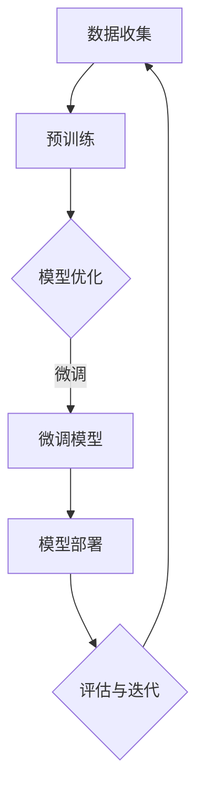
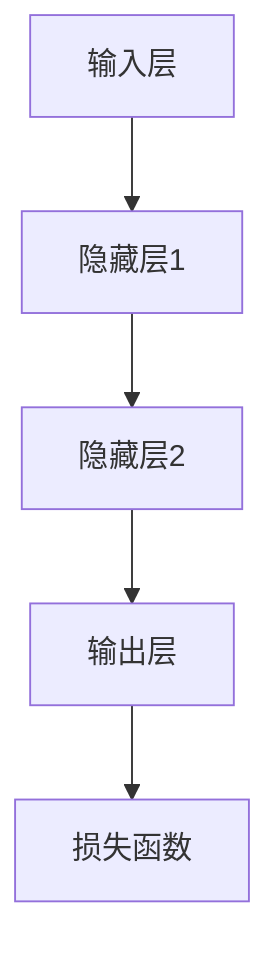

                 

# 评测结果的差异化展示：针对不同角色定制报告

## 关键词
- AI大模型
- 差异化评测
- 定制报告
- 技术专家
- 数据科学家
- 企业管理者
- 开发者
- 用户

## 摘要
本文旨在探讨如何根据不同角色的需求，定制化展示AI大模型的评测结果。通过分析AI大模型的核心概念、算法原理，并结合实际项目实战，我们将展示如何为技术专家、数据科学家、企业管理者、开发者以及用户提供各有侧重的评测报告。本文将详细讲解每个角色的关注点，并提供实际案例来阐述定制报告的方法。

## 第一部分：核心概念与联系

### 1. AI大模型概述

在软件2.0时代，AI大模型已经成为技术发展的核心。AI大模型通过模拟和扩展人类智能，能够在各种复杂任务中展现卓越的能力。为了更好地理解AI大模型，我们首先需要掌握其核心组成部分和基本工作原理。

下面是AI大模型的Mermaid流程图，展示了其核心组成部分和基本工作原理：



**数据收集**：AI大模型首先需要大量的数据，这些数据可以来自互联网、数据库或传感器等。

**预训练**：模型在大量数据上进行预训练，以学习通用特征和模式。

**模型优化**：在预训练的基础上，对模型进行优化，使其能够更好地适应特定任务。

**微调模型**：通过在特定任务的数据上进行微调，进一步提升模型的性能。

**模型部署**：将优化后的模型部署到实际应用环境中。

**评估与迭代**：对模型进行评估，并根据评估结果进行迭代优化。

### 2. 核心算法原理

AI大模型的核心算法包括预训练算法和微调模型原理。下面我们分别使用伪代码详细阐述这两个算法的原理。

**预训练算法原理：**

```plaintext
初始化模型参数
预训练数据集 D
for epoch in 1 to EPOCHS do:
    随机采样数据集 D 的一个子集
    计算损失函数 L = loss(model, sampled_data)
    进行反向传播和梯度下降更新模型参数
end for
```

**微调模型原理：**

```plaintext
初始化预训练模型
微调数据集 D'
for epoch in 1 to FINETUNE_EPOCHS do:
    随机采样数据集 D' 的一个子集
    计算损失函数 L = loss(model, sampled_data)
    进行反向传播和梯度下降更新模型参数
end for
```

### 3. 深度学习与神经网络基础

深度学习是AI大模型的核心技术，它利用神经网络进行多层抽象和特征提取。以下是神经网络的基本结构：



**常见的深度学习架构：**

- **卷积神经网络（CNN）**：适用于图像和视频处理。
- **循环神经网络（RNN）**：适用于序列数据处理。
- **长短期记忆网络（LSTM）**：是RNN的一种，能够更好地处理长序列数据。
- **生成对抗网络（GAN）**：用于生成复杂的数据，如图像和文本。

**深度学习优化算法：**

- **梯度下降法**：最常用的优化算法，用于更新模型参数。
- **Adam优化器**：结合了梯度下降法和动量法的优点，具有更好的收敛速度和稳定性。

## 第二部分：核心算法原理讲解

### 3. 深度学习与神经网络基础

深度学习是机器学习的一个分支，它使用神经网络进行多层抽象和特征提取。以下是神经网络的基本结构：


**常见的深度学习架构：**

- **卷积神经网络（CNN）**：适用于图像和视频处理。
- **循环神经网络（RNN）**：适用于序列数据处理。
- **长短期记忆网络（LSTM）**：是RNN的一种，能够更好地处理长序列数据。
- **生成对抗网络（GAN）**：用于生成复杂的数据，如图像和文本。

**深度学习优化算法：**

- **梯度下降法**：最常用的优化算法，用于更新模型参数。
- **Adam优化器**：结合了梯度下降法和动量法的优点，具有更好的收敛速度和稳定性。

### 4. 数学模型与公式讲解

深度学习中的数学模型主要包括损失函数、激活函数和优化算法。

**损失函数：**

损失函数用于度量模型预测值与真实值之间的差距。常见的损失函数包括均方误差（MSE）和交叉熵损失（Cross-Entropy Loss）。

$$
MSE = \frac{1}{n}\sum_{i=1}^{n}(y_i - \hat{y}_i)^2
$$

$$
Cross-Entropy Loss = -\sum_{i=1}^{n}y_i \log(\hat{y}_i)
$$

**激活函数：**

激活函数用于引入非线性因素，常见的激活函数包括ReLU、Sigmoid和Tanh。

$$
ReLU(x) = \max(0, x)
$$

$$
Sigmoid(x) = \frac{1}{1 + e^{-x}}
$$

$$
Tanh(x) = \frac{e^x - e^{-x}}{e^x + e^{-x}}
$$

**优化算法：**

优化算法用于更新模型参数以最小化损失函数。常见的优化算法包括SGD和Adam。

$$
\text{SGD}: \theta = \theta - \alpha \cdot \nabla_{\theta}L
$$

$$
\text{Adam}: \theta = \theta - \alpha \cdot \frac{m}{1 - \beta_1^t} \nabla_{\theta}L
$$

其中，$m$ 是一阶矩估计，$v$ 是二阶矩估计，$\alpha$ 是学习率，$\beta_1$ 和 $\beta_2$ 分别是动量系数。

## 第三部分：项目实战

### 5. AI大模型开发与实战

**5.1 开发环境搭建**

在开始AI大模型开发之前，需要搭建相应的开发环境。以下是一个基于Python的常见开发环境搭建步骤：

1. 安装Python（3.8及以上版本）
2. 安装pip和virtualenv
3. 创建虚拟环境并安装深度学习框架（如TensorFlow或PyTorch）
4. 安装必要的依赖库（如NumPy、Pandas等）

**5.2 代码实现与解读**

以下是一个简单的AI大模型训练和评估的代码示例，使用PyTorch框架：

```python
import torch
import torch.nn as nn
import torch.optim as optim

# 定义模型
class SimpleModel(nn.Module):
    def __init__(self):
        super(SimpleModel, self).__init__()
        self.fc1 = nn.Linear(in_features=10, out_features=10)
        self.fc2 = nn.Linear(in_features=10, out_features=1)
        self.relu = nn.ReLU()

    def forward(self, x):
        x = self.relu(self.fc1(x))
        x = self.fc2(x)
        return x

# 初始化模型、损失函数和优化器
model = SimpleModel()
criterion = nn.BCELoss()
optimizer = optim.Adam(model.parameters(), lr=0.001)

# 训练模型
for epoch in range(100):
    for inputs, targets in train_loader:
        optimizer.zero_grad()
        outputs = model(inputs)
        loss = criterion(outputs, targets)
        loss.backward()
        optimizer.step()

    print(f'Epoch [{epoch+1}/100], Loss: {loss.item()}')

# 评估模型
with torch.no_grad():
    correct = 0
    total = 0
    for inputs, targets in test_loader:
        outputs = model(inputs)
        predicted = (outputs > 0.5).float()
        total += targets.size(0)
        correct += (predicted == targets).sum().item()

print(f'Accuracy: {100 * correct / total}%')
```

**5.3 代码解读与分析**

1. **模型定义**：定义了一个简单的线性模型，包含两个全连接层和一个ReLU激活函数。
2. **前向传播**：实现模型的前向传播过程。
3. **损失函数**：使用BCELoss损失函数，适用于二分类问题。
4. **优化器**：使用Adam优化器进行参数更新。
5. **训练过程**：迭代训练模型，并在每个epoch后输出损失值。
6. **评估过程**：在测试集上评估模型的准确率。

### 6. 评测结果的差异化展示

在AI大模型开发过程中，评测结果的展示至关重要。不同角色的关注点和需求不同，因此需要差异化展示评测结果。以下是针对不同角色定制报告的方法：

#### 6.1 技术专家视角

**关注点：** 模型性能、训练效率、参数调整等。

**报告内容：**

- **性能指标**：展示模型的准确率、召回率、F1值等。
- **训练效率**：展示训练过程中的损失函数值、学习率调整等。
- **参数调整**：分析不同参数设置对模型性能的影响。

#### 6.2 数据科学家视角

**关注点：** 特征工程、模型选择、模型调优等。

**报告内容：**

- **特征工程**：展示数据预处理、特征提取和特征选择的方法。
- **模型选择**：分析不同模型（如线性模型、决策树、神经网络等）的性能。
- **模型调优**：展示如何通过调整超参数来优化模型性能。

#### 6.3 企业管理者视角

**关注点：** 投资回报率、项目进度、风险评估等。

**报告内容：**

- **投资回报率**：评估AI项目对企业价值的影响，包括ROI分析。
- **项目进度**：展示项目计划、资源分配和时间表。
- **风险评估**：识别和评估项目中的潜在风险，并提出相应的风险缓解措施。

#### 6.4 开发者视角

**关注点：** 模型部署、API设计、系统优化等。

**报告内容：**

- **模型部署**：展示如何将训练好的模型部署到生产环境中。
- **API设计**：介绍如何设计高效的API接口，以满足业务需求。
- **系统优化**：分析如何优化系统的性能和可扩展性。

#### 6.5 用户视角

**关注点：** 应用体验、使用技巧、数据隐私等。

**报告内容：**

- **应用体验**：展示AI大模型在不同应用场景中的特点和优势。
- **使用技巧**：提供使用AI大模型应用的技巧和建议。
- **数据隐私**：讨论如何保护用户数据的隐私，包括数据加密和匿名化等技术。

### 7. AI大模型开发工具与资源

**7.1 主流深度学习框架对比**

- **TensorFlow**：介绍TensorFlow的架构、特性和使用方法。
- **PyTorch**：介绍PyTorch的架构、特性和使用方法。
- **其他框架简介**：简要介绍其他深度学习框架，如Keras、MXNet和Caffe等。

**7.2 开发资源**

- **在线教程与课程**：推荐一些优质的在线教程和课程，帮助读者深入学习AI大模型。
- **开源项目与库**：介绍一些常用的开源项目与库，如TensorFlow Addons、PyTorch Lightning和Transformers等。

**7.3 社区与论坛**

- **深度学习社区**：介绍一些活跃的深度学习社区和论坛，如Kaggle、Reddit和Stack Overflow等。
- **技术会议与研讨会**：介绍一些重要的深度学习和AI会议与研讨会，如NeurIPS、ICML和CVPR等。

### 附录

**8. 作者信息**

- **作者**：AI天才研究院/AI Genius Institute & 禅与计算机程序设计艺术 /Zen And The Art of Computer Programming

通过以上详细的定制报告展示方法，我们可以更好地满足不同角色的需求，推动AI大模型在各个领域的应用和发展。让我们一起努力，探索AI大模型的无限可能！

