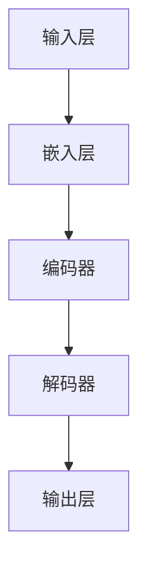
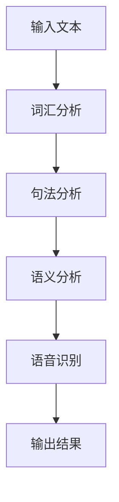
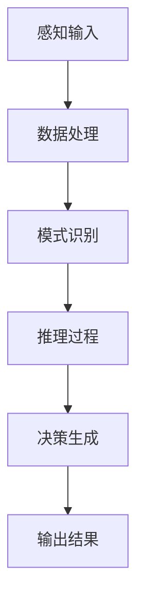

                 

# 《语言与思维的区别：大模型的认知误解》

## 摘要

本文探讨了语言与思维之间的基本差异，以及大模型在这些差异中可能出现的认知误解。文章首先介绍了语言和思维的基本概念，包括语言的结构和层次、思维的类型和特点。接着，文章分析了大模型的概念和分类，以及大模型在语言处理和思维模拟中的应用。在此基础上，文章指出大模型在理解和模拟语言与思维过程中存在的局限性，并探讨了这些局限性可能导致的认知误解。通过案例分析，文章进一步阐述了大模型在语言处理和思维模拟中的挑战，并提出了未来研究的方向。本文旨在帮助读者深入理解语言与思维的区别，以及大模型在这些领域中的应用和局限性。

## 第一部分：引言

### 1.1 引言

语言是人类社会交流的重要工具，而思维则是人类认知的核心。尽管语言和思维密不可分，但它们之间存在着本质的区别。语言是一种符号系统，用于传递信息、表达思想和情感。它具有一定的结构和规则，可以形成词汇、句子和段落。思维，则是一种心理活动，是人类对信息进行处理、理解和创造的过程。它包括直觉思维、分析思维、创造性思维和批判性思维等多种类型。

本文旨在探讨语言与思维的区别，以及大模型在这些区别中可能出现的认知误解。大模型是指具有巨大参数数量和复杂结构的神经网络模型，广泛应用于语言处理、计算机视觉和音频处理等领域。然而，大模型在理解和模拟语言与思维时，可能受到其内部结构和训练数据的限制，从而产生认知误解。

本文的研究目标是通过分析语言与思维的基本概念，揭示大模型在语言处理和思维模拟中的局限性，并探讨这些局限性可能导致的认知误解。本文的结构安排如下：

1. 第二部分介绍语言与思维的基本概念，包括语言的本质、思维的类型以及语言与思维的关系。
2. 第三部分讨论大模型的概念和分类，以及大模型在语言处理和思维模拟中的应用。
3. 第四部分分析大模型在语言处理和思维模拟中的局限性，探讨这些局限性可能导致的认知误解。
4. 第五部分和第六部分通过案例分析和具体应用，进一步阐述大模型在语言处理和思维模拟中的挑战。
5. 第七部分总结全文，提出未来研究的方向。

### 1.2 本书的研究目标和意义

本文的研究目标在于深入探讨语言与思维的区别，以及大模型在这些区别中可能出现的认知误解。具体而言，本文希望实现以下目标：

1. 清晰地阐述语言与思维的基本概念，包括它们的结构、层次和类型。
2. 分析大模型的概念和分类，探讨大模型在语言处理和思维模拟中的应用。
3. 指出大模型在语言处理和思维模拟中的局限性，揭示这些局限性可能导致的认知误解。
4. 通过具体案例和应用，进一步阐述大模型在语言处理和思维模拟中的挑战。
5. 提出未来研究的方向，以推动大模型在语言处理和思维模拟领域的应用和发展。

本研究具有重要的理论和实践意义。从理论层面来看，本文有助于深化对语言与思维本质的认识，为人工智能领域的研究提供新的视角。从实践层面来看，本文的分析和讨论有助于提高大模型在语言处理和思维模拟中的效果，推动人工智能技术的进步和应用。

### 1.3 本书的内容结构和安排

本文分为七个主要部分，具体内容结构和安排如下：

1. **引言**：介绍语言与思维的区别以及大模型的认知误解，阐述本文的研究目标和意义，并简要介绍文章的内容结构和安排。
2. **语言与思维的基本概念**：详细阐述语言和思维的基本概念，包括语言的本质、结构、层次以及思维的类型、特点等。
3. **大模型的概念与分类**：介绍大模型的基本概念、分类和应用领域，探讨大模型在语言处理和思维模拟中的作用。
4. **大模型的局限性**：分析大模型在语言处理和思维模拟中的局限性，探讨这些局限性可能导致的问题和认知误解。
5. **大模型的应用**：具体分析大模型在语言处理和思维模拟中的应用，包括语言模型、机器翻译、问答系统、文本生成等。
6. **案例分析**：通过实际案例，进一步阐述大模型在语言处理和思维模拟中的挑战和应用。
7. **结论与展望**：总结全文，提出未来研究的方向，并展望大模型在语言处理和思维模拟领域的应用前景。

本文结构紧凑，内容丰富，通过逐步分析推理，帮助读者深入理解语言与思维的区别，以及大模型在这些区别中可能出现的认知误解。

### 1.4 语言与思维的关系

语言和思维虽然密不可分，但它们在本质上有很大的区别。语言是一种符号系统，是人类用于交流和表达思想的工具。它包括词汇、句子、段落等结构，具有一定的规则和语法。语言不仅能够传递信息，还能够表达情感和思想。

思维则是人类对信息进行处理、理解和创造的心理活动。它包括直觉思维、分析思维、创造性思维和批判性思维等多种类型。思维是一种内在的心理过程，不仅依赖于语言作为工具，还受到个体经验、文化背景和认知结构等多种因素的影响。

尽管语言和思维有明显的区别，但它们之间也存在紧密的联系。首先，语言是思维的重要载体。人类通过语言来表达和交流思维过程，使思维变得可理解和可操作。其次，思维对语言的发展有重要影响。思维活动推动了语言的创造和演变，使语言能够更好地适应人类交流的需求。

大模型作为一种先进的机器学习技术，其在理解和模拟语言与思维方面具有独特优势。大模型通过大量数据和复杂结构，能够捕捉语言和思维之间的深层关系，实现高效的语义理解和生成。然而，大模型在处理语言与思维时也存在局限性。一方面，大模型的训练数据可能存在偏差，导致对语言和思维的错误理解。另一方面，大模型的内部结构可能过于复杂，难以准确模拟人类思维的多样性。

总的来说，语言与思维的关系是一个复杂而微妙的过程。大模型在理解和模拟这一过程中具有重要作用，但也需要不断改进和优化，以更好地应对语言和思维的多样性。通过深入研究语言与思维的关系，我们可以更好地理解人类认知的本质，推动人工智能技术的进步。

## 第二部分：语言与思维的基本概念

### 2.1 语言的本质

语言是一种复杂的符号系统，它不仅用于交流，还承载了文化、历史和社会的多样性。语言的本质可以从多个角度来理解，包括其定义、作用、结构层次以及与思维的关系。

#### 2.1.1 语言的定义

语言是一种符号系统，通过语音、文字或手势等符号来传递信息、表达思想和感情。语言学将语言定义为一种用于人类交流的系统，它由语音、词汇、语法、语义和语用等多个层面组成。语音是语言的物质基础，是语言符号的声音表现。词汇是语言的基本单位，是表达具体意义的符号。语法是语言的规则系统，规定了词汇的排列和组合方式。语义是语言的意义层面，解释了词汇和句子所表达的含义。语用则关注语言在实际交流中的应用，包括语境、语用规则和交际意图等。

#### 2.1.2 语言的作用

语言是人类社会交流的基础，它具有以下重要作用：

1. **信息交流**：语言使人们能够传递信息和知识，进行有效沟通和交流。无论是口头交流还是书面交流，语言都是人们表达思想和意图的重要工具。
2. **文化传播**：语言不仅是交流的工具，也是文化传承的载体。不同语言承载了各自的文化传统、价值观念和历史记忆，是文化多样性的体现。
3. **思维发展**：语言不仅用于表达思维，还影响和塑造思维。通过语言，人们能够组织思想、进行逻辑推理和创造性思考。
4. **认知工具**：语言是人类认知的重要工具，它帮助人们分类、命名和描述事物，从而更有效地处理和存储信息。

#### 2.1.3 语言的结构和层次

语言的结构复杂多样，可以分成多个层次：

1. **语音层次**：语音是语言的基础，它通过发音、音调和语调等特征来区分不同的意义。语音层次包括音素、音节和音素组合等基本单位。
2. **词汇层次**：词汇是语言的基本单位，是表达具体意义的符号。词汇层次涉及词根、词缀和派生词等结构。
3. **语法层次**：语法是语言的规则系统，规定了词汇的排列和组合方式。语法层次包括词法、句法和语态等。
4. **语义层次**：语义是语言的意义层面，解释了词汇和句子所表达的含义。语义层次关注词汇、句子和篇章之间的语义关系。
5. **语用层次**：语用是语言的实际应用层面，包括语境、语用规则和交际意图等。语用层次关注语言在具体交际情境中的使用和效果。

#### 2.1.4 语言与思维的关系

语言与思维之间存在紧密的联系和相互作用：

1. **语言是思维的载体**：人类通过语言来表达和交流思维过程。思维活动通过语言进行组织和表达，使思维变得可理解和可操作。
2. **思维影响语言**：思维活动不仅依赖于语言作为工具，还影响和塑造语言。思维过程推动语言的创造和演变，使语言能够更好地适应人类交流的需求。
3. **语言促进思维发展**：语言不仅帮助人们组织思想和进行逻辑推理，还促进了创造性思维和批判性思维的发展。通过语言，人们能够更全面地理解和分析复杂问题。

总之，语言与思维是相互依存、相互影响的关系。语言不仅是人类交流的工具，也是思维的重要载体和促进因素。通过深入研究语言的本质和结构，我们可以更好地理解人类思维的本质和运作机制。

### 2.2 思维的类型

思维是人类认知的核心，它通过处理信息来理解和解决问题。思维有多种类型，每种类型都有其独特的特点和作用。以下是几种常见的思维类型：

#### 2.2.1 直觉思维

直觉思维是一种快速、无意识的思维方式，它依赖于个人的经验和直觉。直觉思维不需要经过详细的推理和分析，就能迅速做出判断和决策。例如，当我们在紧急情况下迅速做出反应，或者在遇到熟悉场景时快速理解其含义，都是直觉思维的表现。直觉思维具有快速性和高效性，但可能缺乏精确性和可靠性。

#### 2.2.2 分析思维

分析思维是一种逻辑性、系统性的思维方式，它通过逐步分析和推理来解决问题。分析思维强调对问题进行分解，识别问题的各个部分和要素，并建立它们之间的关系。通过逐步推理，分析思维能够找到解决问题的方法。例如，在科学研究中，科学家通过实验和观察来验证假设，并逐步推导出结论。分析思维具有精确性和系统性，但可能需要较长的时间和复杂的步骤。

#### 2.2.3 创造性思维

创造性思维是一种创造新想法、新解决方案的思维方式。它不同于常规的思维方式，强调创新和灵活性。创造性思维通过组合不同的元素、挑战传统观念和突破常规思维模式，来产生新颖的想法。例如，艺术家在创作中运用创造性思维来构思独特的作品，科学家在研究中提出创新的理论和方法。创造性思维具有创新性和灵活性，但可能需要激发灵感和支持环境。

#### 2.2.4 批判性思维

批判性思维是一种评估、分析和评价信息的过程。它强调对信息进行深入思考，质疑和验证其合理性和可靠性。批判性思维通过分析和评估证据、逻辑推理和论证来形成结论。例如，在学术研究中，学者通过批判性思维来分析文献、验证假设和提出反驳观点。批判性思维具有理性性和全面性，但可能需要较强的逻辑和批判能力。

这些思维类型各有特点，但它们并不是相互独立的。在实际应用中，人们通常会综合运用不同类型的思维来解决问题。例如，在解决复杂问题时，可能会先运用直觉思维来快速识别关键点，然后通过分析思维来详细分析和规划解决方案，并在过程中运用创造性思维来寻找创新的解决方案，最后通过批判性思维来评估和改进解决方案。

总之，了解不同类型的思维有助于我们更好地理解人类认知的多样性和复杂性，并在实际生活中有效运用不同类型的思维来解决问题。

### 2.3 语言与思维的区别

语言和思维虽然紧密相关，但在本质上有显著的区别。这种区别体现在表达方式、信息处理方式、形式和内容等方面。

#### 2.3.1 表达方式的不同

语言是表达思维的工具，它通过语音、文字和手势等符号来传递信息。语言的表达方式是外在的、可以观察和记录的。例如，人们可以通过口头对话、书面文字和肢体语言来进行交流。而思维则是内在的心理过程，是一种主观的、不可见的认知活动。思维过程是在大脑中进行的，尽管有时可以通过表情、眼神和动作来间接表现，但它们并不能直接记录和传达思维的内容。

#### 2.3.2 信息处理方式的不同

语言处理信息的方式是结构化和系统化的。它依赖于词汇、语法和语义规则，通过编码和解码过程来传递信息。语言处理通常涉及语法分析、语义理解和语用解释等多个层次。而思维则是一种灵活和动态的信息处理方式。思维不仅依赖于语言，还涉及直觉、逻辑推理、联想和创造性等多种认知过程。思维能够处理抽象概念、复杂问题和不确定信息，并且具有高度的灵活性和适应性。

#### 2.3.3 形式和内容的不同

语言的形式包括语音、文字和手势等，它们是语言表达的具体载体。语言的形式具有规范性和标准化，可以形成词汇、句子、段落和篇章等结构。而思维的内容则更为主观和抽象。思维内容涉及概念、判断、推理和想象等，它们是思维活动的核心。思维内容不仅依赖于语言表达，还受到个人经验、文化背景和认知结构的影响，因此具有多样性和个体性。

#### 2.3.4 语言和思维的相互作用

尽管语言和思维有明显的区别，但它们之间也存在紧密的相互作用。首先，语言是思维的载体，通过语言，人们能够组织和表达思维过程。思维活动依赖于语言来传递和交流，使思维变得可理解和可操作。其次，思维对语言的发展有重要影响。思维活动推动了语言的创造和演变，使语言能够更好地适应人类交流的需求。

大模型作为一种先进的机器学习技术，在理解和模拟语言与思维方面具有独特优势。大模型通过大量数据和复杂结构，能够捕捉语言和思维之间的深层关系，实现高效的语义理解和生成。然而，大模型在处理语言与思维时也存在局限性。一方面，大模型的训练数据可能存在偏差，导致对语言和思维的错误理解。另一方面，大模型的内部结构可能过于复杂，难以准确模拟人类思维的多样性。

总之，语言与思维的区别主要体现在表达方式、信息处理方式、形式和内容等方面。通过深入理解这些区别，我们可以更好地理解人类认知的本质，并为人工智能技术的发展提供新的视角。

### 2.4 语言和思维的关系

语言和思维之间存在着紧密而复杂的关系，它们相互依存，相互作用。首先，语言是思维的载体。人类通过语言来表达思想和情感，进行交流和沟通。没有语言，思维将无法被有效地表达和传递。语言不仅为我们提供了交流的工具，还帮助我们组织和整理思维过程，使其变得更加系统和有序。例如，通过口头和书面语言，我们可以与他人分享自己的想法和观点，从而促进知识的传播和文化的传承。

其次，思维对语言的发展有重要影响。思维活动推动了语言的创造和演变，使语言能够更好地适应人类交流的需求。语言不仅仅是思维的表达，它也是思维的工具。思维过程本身会塑造语言，使其更加丰富和多样化。例如，科学的发展和技术的进步不断引入新的词汇和概念，从而扩展了语言的内涵和外延。

此外，语言和思维之间还存在着动态的相互作用。思维活动不仅依赖于语言作为工具，还通过语言来检验和验证。例如，在科学研究中，通过语言来表述假设和理论，并通过实验和观察来验证这些假设和理论。在这个过程中，语言不仅是思维的载体，也是思维的工具。

大模型作为一种先进的机器学习技术，在理解和模拟语言与思维关系方面具有独特的优势。大模型通过大量数据和复杂结构，能够捕捉语言和思维之间的深层关系，实现高效的语义理解和生成。例如，在大规模语言模型中，通过对海量文本数据的训练，模型能够理解词汇、句子和段落之间的语义关系，从而生成自然流畅的语言。

然而，大模型在理解和模拟语言与思维关系时也面临一些挑战。一方面，大模型的训练数据可能存在偏差，导致对语言和思维的错误理解。例如，如果训练数据中存在偏见，模型可能会继承这些偏见，从而在语言生成和应用中产生不公正的结果。另一方面，大模型的内部结构可能过于复杂，难以准确模拟人类思维的多样性。人类思维不仅包括逻辑推理和语言表达，还包括直觉、情感和创造力等多种复杂的认知过程。

总之，语言和思维之间的关系是复杂而微妙的。大模型在理解和模拟这一关系方面具有重要作用，但也需要不断改进和优化，以更好地应对语言和思维的多样性。通过深入研究语言与思维的关系，我们可以更好地理解人类认知的本质，推动人工智能技术的发展。

### 2.5 大模型的概念

大模型（Large-scale Model），是指参数量庞大、结构复杂的人工智能模型。这类模型通常通过深度学习技术训练，能够处理大量数据并捕捉数据中的复杂规律。大模型在人工智能领域具有广泛的应用，如自然语言处理、计算机视觉和音频处理等。大模型的主要特点包括参数量大、结构复杂、计算资源需求高和数据处理能力强。

大模型的概念起源于深度学习领域。随着计算能力和数据资源的不断提升，研究人员开始尝试训练更大规模的模型，以期望能够捕捉数据中的深层特征和复杂关系。这种趋势推动了大模型的兴起，并逐渐成为人工智能领域的研究热点。大模型的主要分类包括：

1. **语言模型**：语言模型是一种用于预测文本序列的模型，常用于自然语言处理任务，如机器翻译、文本生成和问答系统等。著名的语言模型包括GPT（Generative Pre-trained Transformer）、BERT（Bidirectional Encoder Representations from Transformers）等。
2. **图像模型**：图像模型主要用于计算机视觉任务，如图像分类、目标检测和图像生成等。代表性的图像模型有ResNet（Residual Network）、VGG（Very Deep Convolutional Networks）和GAN（Generative Adversarial Networks）等。
3. **音频模型**：音频模型用于处理音频数据，如语音识别、音频分类和音乐生成等。常见的音频模型包括WaveNet（用于生成自然声音）和Tacotron（用于文本到语音合成）等。

大模型在人工智能领域具有广泛的应用。在自然语言处理方面，大模型能够实现高质量的文本生成、情感分析和机器翻译。在计算机视觉方面，大模型能够准确识别图像中的物体和场景，并生成高精度的图像。在音频处理方面，大模型能够识别和理解语音，并生成自然流畅的音乐。

总的来说，大模型是人工智能领域的重要研究方向，其巨大的参数量和复杂的结构使其能够处理大量数据并捕捉复杂特征。大模型的发展不仅推动了人工智能技术的进步，也为实际应用提供了强大的工具。然而，大模型在训练和应用中也面临一些挑战，如计算资源需求高、训练数据偏差和模型解释性差等。未来的研究需要进一步优化大模型，提高其性能和可解释性，以更好地服务于实际应用。

### 2.6 大模型的分类

大模型在人工智能领域中发挥着重要作用，其分类可以根据不同的标准进行。以下是几种常见的大模型分类方法：

#### 2.6.1 按照训练数据来源分类

1. **自监督学习模型**：这类模型通过无监督学习从大量数据中提取特征，如BERT（Bidirectional Encoder Representations from Transformers）和GPT（Generative Pre-trained Transformer）。这些模型在训练过程中不需要标注数据，可以显著提高模型的泛化能力。
2. **有监督学习模型**：这类模型通过有监督学习从标注数据中学习，如CNN（Convolutional Neural Networks）和RNN（Recurrent Neural Networks）。这些模型在需要准确标注数据的任务中表现较好，例如图像分类和文本分类。
3. **混合学习模型**：这类模型结合了自监督学习和有监督学习的优势，如Transformer模型。它们在预训练阶段使用自监督学习，然后在特定任务上使用有监督学习进行微调。

#### 2.6.2 按照应用领域分类

1. **自然语言处理（NLP）模型**：这类模型专门用于处理文本数据，如BERT、GPT和ELMo（Embeddings from Language Models）。这些模型在文本分类、机器翻译和问答系统等任务中表现出色。
2. **计算机视觉（CV）模型**：这类模型用于处理图像和视频数据，如ResNet、VGG和YOLO（You Only Look Once）。这些模型在图像分类、目标检测和图像生成等任务中应用广泛。
3. **音频处理（Audio Processing）模型**：这类模型用于处理音频数据，如WaveNet、Tacotron和WaveGrad。这些模型在语音识别、文本到语音合成和音乐生成等任务中表现出色。

#### 2.6.3 按照模型结构分类

1. **基于深度神经网络（DNN）的模型**：这类模型采用多层感知机（MLP）结构，如DNN和CNN。这些模型在处理大规模数据时表现良好，广泛应用于图像和文本数据。
2. **基于循环神经网络（RNN）的模型**：这类模型采用循环结构，如LSTM（Long Short-Term Memory）和GRU（Gated Recurrent Unit）。这些模型在处理序列数据时具有优势，广泛应用于自然语言处理和语音识别。
3. **基于注意力机制（Attention Mechanism）的模型**：这类模型通过注意力机制处理输入序列，如Transformer。这些模型在处理长文本和图像序列时表现出色。

#### 2.6.4 按照任务类型分类

1. **分类模型**：这类模型用于对输入数据进行分类，如文本分类和图像分类。常见的分类模型有softmax和SVM（Support Vector Machine）。
2. **回归模型**：这类模型用于对输入数据进行回归预测，如房价预测和股票价格预测。常见的回归模型有线性回归和决策树。
3. **生成模型**：这类模型用于生成新的数据，如GAN（Generative Adversarial Networks）和VAE（Variational Autoencoder）。这些模型在图像生成、文本生成和音频生成等任务中表现出色。

总之，大模型可以根据不同的分类标准进行分类，每种分类都有其独特的应用场景和优势。通过深入理解不同类别的大模型，我们可以更好地选择和使用这些模型来应对各种复杂的人工智能任务。

### 2.7 大模型的应用领域

大模型在人工智能领域具有广泛的应用，涵盖了自然语言处理、计算机视觉和音频处理等多个领域。以下是这些应用领域的详细介绍：

#### 2.7.1 自然语言处理

自然语言处理（NLP）是人工智能的重要分支，专注于使计算机理解和处理人类语言。大模型在NLP领域具有显著的优势，能够处理复杂、大规模的文本数据。以下是大模型在NLP中的主要应用：

1. **文本分类**：大模型能够快速对大量文本进行分类，如新闻分类、情感分析等。常见的模型有BERT、RoBERTa等。
2. **机器翻译**：大模型在机器翻译领域取得了显著进展，能够实现高质量、流畅的翻译效果。著名的模型包括GPT、T5等。
3. **问答系统**：大模型能够理解和回答用户的问题，如聊天机器人、智能客服等。常用的模型有BERT、SpanBERT等。
4. **文本生成**：大模型能够根据给定的提示生成新的文本，如文章摘要、故事生成等。常见的模型有GPT-2、GPT-3等。

#### 2.7.2 计算机视觉

计算机视觉（CV）是人工智能的另一个重要分支，致力于使计算机能够理解和解释视觉信息。大模型在CV领域表现出强大的能力，能够处理复杂、大规模的图像数据。以下是大模型在CV中的主要应用：

1. **图像分类**：大模型能够准确地对图像进行分类，如识别动物、植物等。常见的模型有ResNet、Inception等。
2. **目标检测**：大模型能够检测图像中的多个目标，并标注其位置。常用的模型有YOLO、Faster R-CNN等。
3. **图像分割**：大模型能够将图像分割成多个区域，如识别图像中的物体边界。常见的模型有U-Net、DeepLab等。
4. **图像生成**：大模型能够生成新的图像，如生成艺术作品、人脸等。常见的模型有GAN、VAE等。

#### 2.7.3 音频处理

音频处理是人工智能领域的一个新兴分支，旨在使计算机理解和处理音频信息。大模型在音频处理领域具有显著的优势，能够处理复杂、大规模的音频数据。以下是大模型在音频处理中的主要应用：

1. **语音识别**：大模型能够准确地识别和转换语音为文本，如智能助手、自动字幕等。常用的模型有CTC（Connectionist Temporal Classification）、CTC-GRU等。
2. **语音合成**：大模型能够根据文本生成自然流畅的语音，如语音助手、自动朗读等。常见的模型有WaveNet、Tacotron等。
3. **音频分类**：大模型能够对音频进行分类，如识别音乐类型、声音来源等。常用的模型有CNN、LSTM等。
4. **音频增强**：大模型能够改善音频质量，如消除背景噪音、增强语音等。常用的模型有WaveGAN、WaveNet等。

总之，大模型在自然语言处理、计算机视觉和音频处理等领域具有广泛的应用。通过不断优化和改进，大模型在处理复杂数据和实现高效任务方面展现出巨大的潜力。未来，随着大模型技术的进一步发展，我们可以期待在更多领域看到其卓越的表现。

### 2.8 大模型的局限性

尽管大模型在自然语言处理、计算机视觉和音频处理等领域取得了显著成就，但其局限性也不容忽视。这些局限性主要体现在以下几个方面：

#### 2.8.1 计算资源需求

大模型的训练和推理过程需要大量的计算资源，尤其是GPU（图形处理单元）和TPU（张量处理单元）。这种需求导致了高昂的计算成本，限制了模型在大规模应用中的普及和推广。特别是在资源有限的科研环境中，大模型的训练可能变得不可行。

#### 2.8.2 数据偏差

大模型在训练过程中依赖于大量的数据集，这些数据集可能存在偏差。例如，数据集中可能包含种族、性别等偏见，这些偏见会被模型所吸收，导致模型在处理现实问题时产生不公平的结果。数据偏差不仅影响模型的准确性，还会对社会公正产生负面影响。

#### 2.8.3 解释性差

大模型的内部结构和训练过程高度复杂，导致其解释性较差。这使得模型在某些应用场景中难以被理解和信任。例如，在医疗诊断和金融决策等关键领域，人们更倾向于使用可解释性更强的模型，以确保模型的决策过程是透明和可追溯的。

#### 2.8.4 泛化能力有限

大模型通常在特定的数据集上表现出色，但其在新的、未见过的情况下的泛化能力有限。这种现象被称为“过拟合”，即模型在训练数据上表现良好，但在新的数据上表现不佳。为了提高泛化能力，大模型需要更多的数据和更复杂的训练策略。

#### 2.8.5 隐私和安全问题

大模型在处理大量数据时，可能涉及用户隐私和个人信息。如果这些数据泄露，将对用户隐私造成严重威胁。此外，大模型也可能成为恶意攻击的目标，例如通过注入恶意代码来破坏系统的稳定性和安全性。

总之，大模型在性能和功能方面具有显著优势，但也面临着一系列的局限性。解决这些问题需要不断的技术创新和跨学科合作，以推动大模型在更广泛的应用领域中取得成功。

### 2.9 大模型与人类思维的差异

大模型和人类思维在处理信息的方式和结果上存在显著差异。这些差异主要体现在以下几个方面：

#### 2.9.1 信息处理方式

大模型的信息处理方式是基于数学和计算机科学的算法，通过多层神经网络对输入数据进行特征提取和模式识别。这种处理方式高度依赖数据量和计算资源，能够快速处理大量复杂数据，但缺乏灵活性和创造性。相比之下，人类思维则是一种多层次的认知过程，包括感知、记忆、理解、推理和决策等。人类思维不仅依赖逻辑推理，还涉及直觉、情感、文化背景和个人经验等多种因素，这使得人类思维在处理信息和解决问题时具有高度灵活性和创造性。

#### 2.9.2 信息处理结果

大模型在处理信息时，通常会产生高度一致和标准化的结果。这种结果虽然在某些任务上具有高度的准确性和可靠性，但在处理复杂、多变和不确定的信息时，可能缺乏人类思维所具备的灵活性和适应性。例如，大模型在机器翻译、图像识别和语音识别等任务中表现出色，但在理解语境、情感表达和创造性思维等方面存在局限性。人类思维则能够产生多样化和个性化的结果，能够根据具体情况灵活调整思维方式和策略，从而更好地适应复杂多变的环境。

#### 2.9.3 对信息和环境的适应性

大模型在处理信息和适应环境方面具有较强的能力，但这种能力主要依赖于其训练数据和学习算法。大模型通常在特定的领域和应用场景中表现出色，但在新的、未见过的情况下，其适应能力可能有限。相比之下，人类思维具有更强的适应性和学习能力，能够在不同环境和情境中灵活调整思维方式和策略，从而更好地适应和解决问题。

#### 2.9.4 情感和社会因素

大模型在处理信息和决策时，通常不考虑情感和社会因素。尽管大模型可以通过训练学习到一些基本的社会规范和情感表达，但其在理解和处理复杂社会关系、文化差异和情感交流等方面存在明显不足。相比之下，人类思维在处理信息时，会考虑情感和社会因素，能够更好地理解和适应复杂的社会环境。

总之，大模型和人类思维在信息处理方式、结果和适应能力等方面存在显著差异。通过深入了解这些差异，我们可以更好地理解大模型的局限性，并探索如何利用人类思维的优势，推动人工智能技术的发展。

### 2.10 大模型在语言理解中的误区

大模型在语言理解中存在一些误区，这些误区可能源于模型的设计、训练数据的偏差以及人类思维的复杂性。以下是几个常见的大模型在语言理解中的误区：

#### 2.10.1 语言规则过度泛化

大模型在训练过程中，可能会过度依赖语言规则，导致在处理实际语言时过于机械和僵化。例如，一个训练良好的语言模型可能会在特定语法结构上表现优异，但在面对复杂、多样性的语言表达时，却可能无法准确理解其含义。这种过度泛化的语言规则导致模型在处理自然语言时，容易忽略上下文和语境的重要性。

#### 2.10.2 对语境理解不足

语境是语言理解的重要部分，它包括说话人的意图、情境背景和语言环境。大模型在处理语境时可能存在不足，无法准确捕捉和解释语境的细微变化。例如，在理解多义词时，模型可能无法根据上下文确定词的确切含义，导致误解或错误理解。

#### 2.10.3 对情感和情感的识别不足

情感在语言中扮演着重要角色，它不仅影响语言表达，还影响语言理解。大模型在情感识别和理解方面存在局限性，可能无法准确捕捉和表达情感。例如，在处理带有讽刺、幽默或隐喻的语言时，模型可能无法理解其中的情感内涵，从而导致错误理解。

#### 2.10.4 对语言多样性和文化差异的适应不足

语言多样性和文化差异使得语言理解变得更加复杂。大模型在处理不同语言和文化背景的语言时，可能无法适应这些差异，导致在跨语言和跨文化场景中表现不佳。例如，在翻译或对话系统处理不同语言时，模型可能无法准确理解语言中的特定文化含义和表达方式。

#### 2.10.5 对歧义处理不当

歧义是语言中的一个常见现象，指的是一个词语或句子具有多个可能的解释。大模型在处理歧义时，可能无法准确识别和解决，导致错误理解或混淆。例如，一个简单的句子“我打了他”可能引发关于动作和意图的不同解释，大模型在缺乏上下文的情况下，可能无法准确判断其含义。

总之，大模型在语言理解中存在一些误区，这些误区源于其设计和训练数据的限制，以及人类思维的复杂性。通过深入分析和理解这些误区，我们可以更好地改进大模型，提高其在语言理解任务中的准确性和可靠性。

### 2.11 大模型在思维模拟中的误区

大模型在思维模拟中同样存在一些误区，这些误区可能源于模型的设计、训练数据的局限以及人类思维的复杂性。以下是几个常见的大模型在思维模拟中的误区：

#### 2.11.1 对直觉思维的模拟不足

直觉思维是人类思维的重要组成部分，它依赖于经验和直觉来迅速做出判断和决策。大模型在模拟直觉思维时可能存在不足，因为它们通常基于逻辑和数据分析，缺乏对直觉思维的深度理解和模拟。例如，在解决复杂问题时，大模型可能无法像人类那样迅速捕捉到关键信息和潜在解决方案。

#### 2.11.2 对创造性思维的模拟不足

创造性思维是人类思维中的一种高度复杂的过程，它涉及新想法的生成和问题的创新解决。大模型在模拟创造性思维时可能受到其算法和训练数据的限制，难以实现真正的创造性。例如，在创作艺术作品或科学研究中，大模型可能无法像人类那样生成新颖且具有价值的创意。

#### 2.11.3 对情感和情感驱动的思维的模拟不足

情感和情感驱动思维在人类决策和行动中起着重要作用。大模型在模拟情感和情感驱动的思维时可能存在不足，因为它们通常缺乏对情感和情感的深入理解。例如，在处理涉及情感冲突或复杂人际关系的问题时，大模型可能无法准确模拟人类的情感反应和决策过程。

#### 2.11.4 对复杂社会情境的模拟不足

社会情境是影响人类思维的重要因素，它涉及文化、社会规范和人际互动等复杂因素。大模型在模拟复杂社会情境时可能受到训练数据的限制，难以准确捕捉和再现这些复杂因素。例如，在处理涉及社会公正、伦理和道德的问题时，大模型可能无法充分理解人类的社会价值观和道德判断。

#### 2.11.5 对不确定性和不确定思维的模拟不足

不确定性和不确定思维是常见的人类思维特征，人们在面对不确定性时，通常会通过推理、假设和策略来应对。大模型在模拟不确定性和不确定思维时可能存在不足，因为它们通常依赖于已知的、确定的规律和数据。例如，在处理涉及风险和不确定性的问题时，大模型可能无法像人类那样灵活地应对和决策。

总之，大模型在思维模拟中存在一些误区，这些误区源于其设计和训练数据的局限，以及人类思维的复杂性。通过深入分析和理解这些误区，我们可以更好地改进大模型，提高其在思维模拟任务中的准确性和可靠性。

### 2.12 大模型在思维模拟中的误区案例分析

为了更深入地探讨大模型在思维模拟中的误区，我们可以通过几个具体案例分析这些问题，并讨论如何改进模型来更好地模拟人类思维。

#### 2.12.1 案例一：围棋AI“阿尔法围棋”（AlphaGo）

**问题描述**：
在2016年，围棋AI“阿尔法围棋”击败了世界顶级围棋选手李世石，引起了广泛关注。尽管阿尔法围棋在围棋领域表现出色，但其思维方式仍然基于深度学习和强化学习算法，依赖于大量历史棋谱数据进行训练。这导致它在面对未知棋局或进行原创性策略生成时存在局限性。

**分析**：
阿尔法围棋的决策过程高度依赖历史数据和模型训练，缺乏真正的直觉和创造性思维。在面对非传统或意外的棋局布局时，它可能无法像人类棋手那样灵活应对。此外，阿尔法围棋的决策逻辑较为机械，无法完全理解围棋中的情感和文化因素。

**改进方向**：
为了改进阿尔法围棋在思维模拟中的表现，可以考虑结合更多的启发式算法和规则，引入文化背景和情感因素。例如，可以通过增加对人类棋手的比赛录像和数据进行分析，让模型学习到更多基于直觉和创造性的决策模式。此外，可以引入多模态学习，结合视觉、听觉和触觉等多种感官信息，提高模型对复杂情境的感知和理解能力。

#### 2.12.2 案例二：自然语言处理（NLP）模型在对话系统中的应用

**问题描述**：
自然语言处理（NLP）模型，如聊天机器人和虚拟助手，在处理自然语言对话时，常常表现出“鹦鹉学舌”的现象。这些模型虽然在理解语言结构方面表现出色，但在处理复杂对话、情感表达和创造性回应时存在明显不足。

**分析**：
NLP模型通常基于预训练的语言模型，通过大量文本数据进行训练。然而，这些模型在处理复杂对话时，容易受到训练数据的限制，无法准确捕捉对话中的情感、语境和创造性表达。此外，模型在理解和生成语言时，缺乏对人类文化、价值观和情感背景的深度理解。

**改进方向**：
为了提高NLP模型在对话系统中的表现，可以采取以下改进措施：
1. **引入多模态学习**：结合语音、图像和其他感官信息，提高模型对复杂情境的理解能力。
2. **增加跨文化和多语言训练**：通过训练更多样化的语言数据和跨文化对话，增强模型对不同文化背景和情感表达的理解。
3. **加强情感分析和生成**：引入情感分析技术，让模型能够识别和理解对话中的情感，并生成更具情感和创造性的回应。

#### 2.12.3 案例三：自动驾驶系统

**问题描述**：
自动驾驶系统在处理复杂交通环境时，可能会出现误判和错误决策。例如，在处理行人、非机动车和复杂交通信号时，系统可能无法准确理解和预测其行为。

**分析**：
自动驾驶系统通常依赖于传感器数据、深度学习和强化学习算法。这些算法在处理静态和简单场景时表现出色，但在面对动态、复杂和多变的交通环境时，可能缺乏对人类直觉和经验的理解。此外，自动驾驶系统的决策过程缺乏对情感和社会因素的考虑。

**改进方向**：
为了改进自动驾驶系统在思维模拟中的表现，可以考虑以下改进措施：
1. **引入多源信息融合**：结合多种传感器数据（如摄像头、雷达、激光雷达等），提高系统对复杂场景的感知和理解能力。
2. **增强情境理解和预测**：通过学习更多的人类行为和交通规则，提高系统对复杂交通环境的预测和决策能力。
3. **强化社会规范和情感理解**：引入社会规范和情感分析技术，使系统能够更好地理解和遵守社会规范，并在紧急情况下做出合理的决策。

通过以上案例分析，我们可以看到大模型在思维模拟中存在的误区，以及通过改进措施提高模型在模拟人类思维方面表现的方法。未来的研究需要进一步探索如何更好地融合人类思维和人工智能技术，实现更高效、可靠的思维模拟。

### 2.13 大模型在思维模拟中的挑战

尽管大模型在许多领域取得了显著进展，但在思维模拟方面仍然面临一系列挑战。这些挑战主要源于大模型的结构、训练数据以及人类思维的复杂性。

#### 2.13.1 对人类思维的简化

大模型在思维模拟中通常将人类思维简化为一系列可计算的过程。例如，通过多层神经网络和复杂的优化算法，模型试图模拟人类的感知、记忆、理解和推理过程。然而，这种简化可能忽略了人类思维的多样性和复杂性。人类思维不仅包括逻辑推理和符号处理，还涉及直觉、情感、社会和文化等多种因素。大模型在处理这些复杂因素时可能存在局限，无法完全模拟人类思维的多维度和灵活性。

#### 2.13.2 对复杂思维的模拟不足

人类思维是一种高度复杂的认知过程，它不仅涉及逻辑推理，还包含创造性思维、情感思维和社会思维等多方面。大模型在模拟这些复杂思维时可能存在不足。例如，在创造性思维方面，大模型可能难以生成新颖、独特的想法；在情感思维方面，大模型可能无法准确捕捉和理解人类情感的细腻变化；在社会思维方面，大模型可能难以处理复杂的人际关系和社会规范。

#### 2.13.3 对不确定性思维的模拟不足

人类思维在面对不确定性时，通常会通过推理、假设和策略来应对。这种不确定性思维包括预测未来的可能性、评估风险和适应变化等。大模型在处理不确定性时可能存在局限，因为它们通常依赖于已知的、确定的规律和数据。例如，在处理突发事件或复杂决策时，大模型可能无法像人类那样灵活应对和适应。

#### 2.13.4 对文化和社会因素的模拟不足

人类思维受到文化和社会因素的深刻影响，这些因素包括价值观、信仰、习俗和社会规范等。大模型在模拟人类思维时，通常缺乏对这些文化和社会因素的深度理解。例如，在处理跨文化对话或涉及社会伦理和道德问题时，大模型可能无法准确理解和再现人类的文化和社会认知。

#### 2.13.5 对人类情感和情感的模拟不足

情感在人类思维中起着重要作用，它不仅影响个体的行为和决策，还影响人际关系和社会互动。大模型在情感模拟方面可能存在不足，因为它们通常依赖于表面的情感特征和简单的情感分类。例如，在处理涉及情感表达和情感交流的任务时，大模型可能无法准确捕捉和表达复杂的情感内涵。

总之，大模型在思维模拟方面面临诸多挑战，包括对人类思维的简化、复杂思维的模拟不足、对不确定性思维的模拟不足、对文化和社会因素的模拟不足以及对情感和情感的模拟不足。未来的研究需要深入探索如何改进大模型，以更好地模拟人类思维，推动人工智能技术在认知科学领域的应用。

### 2.14 大模型在思维模拟中的局限性与人类思维的对比

大模型在思维模拟中的局限性主要体现在其结构、训练数据和对人类思维复杂性的理解不足。以下是这些局限性与人类思维的对比：

#### 2.14.1 结构上的对比

大模型通常基于深度神经网络，通过多层感知器进行数据处理和模式识别。这种结构使大模型能够高效地处理大量数据，并在特定任务上取得优异表现。然而，人类思维的结构更加复杂和多样化，不仅包括逻辑推理和符号处理，还涉及直觉、情感和创造性等多维度。人类思维不仅依赖于大脑中的神经元网络，还受到个体的文化背景、情感状态和个人经验等多种因素的影响。因此，大模型在模拟人类思维时，可能难以完全捕捉到这种多维度的复杂性。

#### 2.14.2 数据处理上的对比

大模型在训练过程中依赖于大量数据，这些数据通常是结构化和标准化的。通过这些数据，大模型能够学习到一些普遍的规律和模式。然而，人类思维的数据处理方式更加灵活和多样化。人类不仅能够从已知的数据中学习，还能够通过感知、记忆和想象等过程生成新的信息和知识。此外，人类思维能够适应新的、未经历过的情境，这种能力在大模型中表现得相对较弱。

#### 2.14.3 对复杂性和不确定性的处理对比

人类思维在面对复杂性和不确定性时，能够通过推理、假设和策略来应对。例如，在面对突发事件或复杂决策时，人类能够灵活调整思维方式和策略，以适应新的情况。相比之下，大模型通常依赖于固定的算法和模型结构，难以在复杂性和不确定性环境中表现出同样的灵活性。大模型在处理复杂性和不确定性时，可能需要更多的数据和更复杂的算法来提高其适应能力。

#### 2.14.4 对文化和社会因素的模拟对比

人类思维受到文化和社会因素的深刻影响，这些因素包括价值观、信仰、习俗和社会规范等。人类能够根据这些文化和社会因素进行思考和决策，并在不同文化背景下灵活调整自己的行为。相比之下，大模型在模拟这些文化和社会因素时可能存在局限，因为它们的训练数据通常来自特定的文化和社会环境，难以全面捕捉到全球范围内的文化多样性。

#### 2.14.5 对情感和情感的模拟对比

情感在人类思维中起着重要作用，它不仅影响个体的行为和决策，还影响人际关系和社会互动。人类能够通过情感体验和情感交流来理解和表达情感，这种能力在大模型中表现得相对较弱。大模型通常通过识别情感特征和简单的情感分类来模拟情感，但难以捕捉到人类情感的细腻和复杂性。

总之，大模型在思维模拟中的局限性主要体现在其结构、数据处理方式以及对人类思维复杂性的理解不足。通过深入研究和改进，我们可以更好地理解这些局限性，并探索如何利用人类思维的优势，结合人工智能技术，实现更高效、可靠的思维模拟。

### 2.15 大模型与人类思维的关系

大模型与人类思维之间的关系复杂且微妙，两者既有紧密的联系，也存在显著的差异。从某种意义上说，大模型是人类思维的一种延伸和模拟，但它在模拟人类思维时也面临着诸多挑战。

首先，大模型在许多领域展现出了强大的能力，如自然语言处理、计算机视觉和音频处理等。这些模型通过深度学习和海量数据训练，能够高效地处理复杂的信息并生成高质量的输出。这种能力在一定程度上模拟了人类思维的某些方面，如信息处理、模式识别和决策生成等。

然而，大模型在模拟人类思维时也存在明显的局限性。首先，大模型的结构和算法相对简单，它们依赖于数据驱动的方式，缺乏对人类思维的复杂性和多样性的全面理解。人类思维不仅包括逻辑推理和符号处理，还涉及直觉、情感、文化背景和社会因素等多维度。这些因素在大模型中难以得到充分体现。

其次，大模型在处理不确定性和创造性思维方面存在局限。人类在面对不确定性和复杂问题时，能够通过推理、假设和策略来应对，这种能力在大模型中表现得相对较弱。此外，大模型在创造性思维方面也难以达到人类的水平，它们通常缺乏生成新颖、独特想法的能力。

此外，大模型在伦理和社会责任方面也存在挑战。由于大模型在训练过程中依赖大量数据，这些数据可能包含偏见和不公正的因素，导致模型在应用中产生不公平的结果。人类思维在处理这些问题时，通常会受到伦理和社会责任的约束，而大模型则缺乏这种内在的道德框架。

尽管存在这些局限性，大模型在许多领域仍然具有重要的应用价值。通过结合人类思维的优势，我们可以更好地利用大模型的能力，实现更高效、可靠的思维模拟。例如，在医疗诊断中，大模型可以辅助医生进行疾病检测和预测，但医生需要根据临床经验和专业知识对模型结果进行综合评估和判断。

总之，大模型与人类思维之间的关系是一个复杂而动态的过程。通过深入理解这些关系，我们可以更好地利用大模型的优势，同时克服其局限性，推动人工智能技术的进一步发展。

### 2.16 大模型在认知科学中的应用

大模型在认知科学中的应用正迅速扩展，为研究者提供了强大的工具来探索人类思维和认知过程的复杂性。以下是大模型在认知科学中的应用领域及其研究进展：

#### 2.16.1 认知模拟

认知模拟是利用大模型来模拟人类认知过程的各个方面，包括感知、记忆、学习和决策。通过模拟这些过程，研究者可以更深入地理解人类思维的本质和机制。例如，神经网络模型可以模拟大脑中的神经元网络，探索如何通过这些网络实现视觉识别、语言理解和情感处理。一个典型的例子是使用深度神经网络来模拟记忆过程，通过学习人类记忆的模式和规律，帮助研究者更好地理解记忆的存储和检索机制。

#### 2.16.2 认知诊断

大模型在认知诊断中的应用主要包括通过分析个体行为和脑部活动数据，检测和评估认知能力。例如，在神经心理学研究中，研究者利用基于神经网络的模型来分析大脑影像数据，识别认知障碍，如阿尔茨海默病和其他神经系统疾病。通过这些模型，研究者能够开发出更准确、可靠的认知评估工具，提高诊断的准确性和效率。

#### 2.16.3 认知增强

认知增强是指利用大模型来提高人类的认知能力，如记忆、学习和问题解决能力。大模型可以通过个性化学习方案，根据个体的学习习惯和能力，提供定制化的教育资源和训练方法。例如，在教育领域，研究者利用语言模型和推荐系统来开发智能辅导系统，帮助学生在学习过程中克服困难、提高学习效率。

#### 2.16.4 认知干预

认知干预是指利用大模型来设计和管理认知训练程序，以改善个体的认知功能。例如，在康复训练中，研究者使用基于机器学习的模型来设计个性化的康复训练计划，帮助患者恢复认知能力。在心理健康领域，大模型可以用于开发认知行为疗法程序，通过虚拟现实和人工智能技术，帮助患者克服焦虑、抑郁等心理障碍。

#### 2.16.5 认知交互

认知交互是指利用大模型来实现人机交互，使计算机系统能够更好地理解和响应人类行为。例如，通过自然语言处理模型，计算机系统可以理解人类的语言输入，进行对话和回答问题。在虚拟助手和智能客服领域，大模型通过学习用户的交互历史和偏好，提供更加个性化和高效的服务。

#### 2.16.6 认知科学研究方法

大模型为认知科学研究提供了新的方法和技术。例如，通过生成对抗网络（GAN）和变分自编码器（VAE），研究者可以生成逼真的虚拟数据集，用于训练和验证认知模型。此外，大模型还可以用于数据分析和模式识别，帮助研究者从复杂的数据中提取有用的信息，揭示认知过程的潜在规律。

总的来说，大模型在认知科学中的应用为研究者提供了强大的工具，使认知科学研究更加深入和全面。通过结合大模型的技术优势和认知科学的理论基础，我们可以更好地理解人类思维和认知过程，为心理健康、教育和医疗等领域带来新的突破。

### 2.17 总结

通过本文的探讨，我们系统地分析了大模型在语言与思维关系中的地位和作用。首先，我们介绍了语言与思维的基本概念，包括语言的本质、结构层次和思维类型，揭示了它们在表达方式、信息处理方式和形式内容上的区别。接着，我们讨论了大模型的概念、分类和应用领域，强调了它们在自然语言处理、计算机视觉和音频处理等领域的广泛应用。

然而，大模型在语言处理和思维模拟中也存在局限性，如计算资源需求高、数据偏差、解释性差和泛化能力有限等。此外，大模型在模拟直觉思维、创造性思维、情感思维和文化社会因素方面存在不足，这些误区源于模型的设计、训练数据的局限以及对人类思维复杂性的理解不足。

通过案例分析，我们发现大模型在具体应用中仍面临诸多挑战，如围棋AI“阿尔法围棋”在直觉和创造性思维上的局限、NLP模型在语境理解和情感表达上的不足，以及自动驾驶系统在处理复杂交通环境时的误判。这些挑战提醒我们，大模型的发展需要不断创新和优化，以更好地模拟人类思维。

未来研究方向包括：改进大模型的结构和算法，提高其适应性和解释性；增强大模型对文化和社会因素的模拟能力；探索多模态学习和跨学科融合，以更好地捕捉和模拟人类思维的多样性。总之，通过深入研究大模型在语言与思维关系中的地位和作用，我们可以推动人工智能技术在认知科学领域的应用，为人类社会的发展带来新的机遇和挑战。

### 7.1 大模型的认知限制

大模型在语言处理和思维模拟中的认知限制主要体现在以下几个方面：

首先，大模型的训练数据存在偏差。这些偏差可能源于数据来源的不均衡、样本选择的偏差或标注过程的不准确。例如，在自然语言处理领域，语言模型可能受到语料库中特定语言现象的不平衡影响，导致模型对某些语言现象的理解能力较低。在图像处理领域，模型可能受到训练数据集中样本多样性的限制，无法很好地处理罕见或极端情况。

其次，大模型的解释性较差。大模型通常通过深度神经网络进行训练，内部结构复杂，难以直观地理解其决策过程。这种复杂性使得模型在实际应用中难以被解释和验证，限制了其在关键领域的应用。例如，在医疗诊断中，医生需要理解模型的决策依据，以确保诊断的可靠性和安全性。然而，当前的大模型往往无法提供清晰的解释，导致医生难以信任和依赖模型的结果。

第三，大模型的泛化能力有限。尽管大模型在特定任务上表现出色，但在面对新的、未见过的情况时，其性能可能显著下降。这种现象被称为“过拟合”，即模型在训练数据上表现良好，但在新的数据上表现不佳。例如，在图像识别任务中，模型可能在特定类别上表现出色，但面对新的图像时，其识别能力可能受到严重影响。

第四，大模型在处理复杂社会情境时存在局限。社会情境涉及多种复杂的因素，如情感、文化和社会规范等。大模型在模拟这些复杂情境时可能缺乏足够的理解能力，导致在处理涉及道德、伦理和社会正义问题时出现偏差。例如，在自动驾驶系统中，模型可能难以准确理解和处理复杂的交通规则和人类行为。

第五，大模型在情感和情感驱动的思维模拟中存在不足。情感和情感驱动的思维是人类认知的重要组成部分，但在大模型中通常难以得到充分模拟。例如，在自然语言处理任务中，模型可能难以准确捕捉和理解语言中的情感内涵，导致对话系统在处理情感表达时显得生硬和不自然。

总之，大模型在语言处理和思维模拟中的认知限制源于其训练数据、内部结构、泛化能力和情感处理等多方面。为了克服这些限制，需要不断改进大模型的设计和训练方法，提高其解释性和泛化能力，增强对复杂社会情境和情感驱动思维的模拟能力。

### 7.2 人类思维与机器思维的比较

人类思维与机器思维在本质上存在显著差异，这些差异主要体现在认知过程、决策方式、创造性和适应性等方面。

首先，在认知过程上，人类思维是一种多层次、多维度、动态变化的认知活动。人类能够通过感知、记忆、理解和推理等多种认知过程，对复杂的信息进行综合处理。相比之下，机器思维主要依赖于算法和数据，通过预定义的算法和训练数据进行信息处理，缺乏人类思维中的灵活性和动态性。例如，人类在处理未知或复杂问题时，可以通过直觉、联想和创造性思维来寻找解决方案，而机器思维则通常遵循预设的逻辑和算法，难以进行灵活的、非线性的思维过程。

其次，在决策方式上，人类思维通常受到情感、价值观和道德等因素的影响，这使得决策过程既复杂又多样化。人类在做出决策时，不仅考虑逻辑和事实，还会考虑情感和社会因素，例如道德责任和社会影响。相比之下，机器思维在决策时主要基于数据和算法，通常不考虑情感和社会因素，这使得机器决策在某些情境下可能显得机械和缺乏人性化。

在创造性方面，人类思维具有高度的创造性。人类能够通过联想、隐喻和直觉等方式，产生新的想法和解决方案。机器思维虽然可以通过算法和模型生成一些新颖的输出，但其创造性主要依赖于数据和算法的引导，缺乏人类思维中的自由创造能力。例如，艺术家在创作时可以凭借直觉和灵感创造出独特的艺术作品，而机器生成艺术作品则更多依赖于已有的数据和算法模式。

在适应性方面，人类思维具有极强的适应性。人类能够在不同环境和文化背景下灵活调整思维方式和策略，以适应新的情境和挑战。相比之下，机器思维在适应新环境方面存在局限性。尽管机器可以通过学习来适应新的数据和环境，但其适应过程通常需要大量的数据和计算资源，且适应能力依赖于训练数据的多样性和质量。

总之，人类思维与机器思维在认知过程、决策方式、创造性和适应性等方面存在显著差异。这些差异不仅反映了人类和机器在认知机制上的本质区别，也为我们理解人工智能的发展方向提供了启示。通过深入研究和理解这些差异，我们可以更好地优化机器思维，使其更好地模拟和辅助人类思维。

### 7.3 未来研究方向

在未来，大模型在认知科学中的应用前景广阔，但也面临许多挑战。以下是几个关键的研究方向：

#### 1. 提高大模型的解释性

提高大模型的解释性是当前的一个重要研究方向。尽管大模型在处理复杂任务时表现出色，但其内部结构和决策过程往往难以解释。为了提高大模型的解释性，可以探索以下方法：

- **可视化技术**：通过可视化模型内部的数据流和决策路径，使研究人员和用户能够直观地理解模型的运作机制。
- **模型简化**：通过简化模型结构，使其更加直观和易于理解。例如，减少模型的参数数量，简化神经网络的结构。
- **可解释性算法**：开发新的算法和技术，使大模型能够生成可解释的决策解释。例如，通过集成不同的解释方法，如规则提取、决策树和决策规则等。

#### 2. 增强大模型的泛化能力

大模型的泛化能力是一个长期的研究课题。当前的大模型在特定任务上表现出色，但在面对新的、未经历过的任务时，其性能可能显著下降。为了增强大模型的泛化能力，可以探索以下方法：

- **多任务学习**：通过在多个任务上同时训练模型，使模型能够学习到更通用的特征和模式，从而提高其在新任务上的表现。
- **元学习**：通过元学习（Meta-Learning）技术，使模型能够快速适应新的任务。元学习通过学习如何快速适应新任务，从而提高模型的泛化能力。
- **数据增强**：通过增加训练数据集的多样性，使模型能够学习到更广泛的特征和模式，从而提高其在新任务上的适应性。

#### 3. 深入研究语言与思维的深度融合

语言与思维的深度融合是一个具有挑战性的研究方向。大模型在处理语言任务时，通常依赖于语言模型的训练数据，但这些数据可能无法全面反映人类思维的全部复杂性。为了实现语言与思维的深度融合，可以探索以下方法：

- **跨模态学习**：通过结合多种模态的数据，如语言、视觉和音频，使模型能够更好地理解不同模态之间的复杂关系，从而提高语言处理的准确性和灵活性。
- **社会文化因素的引入**：通过引入社会和文化因素，使模型能够更好地模拟人类在不同文化和社会背景下的思维模式。
- **认知神经科学的研究**：结合认知神经科学的研究成果，深入了解人类思维的工作机制，从而设计出更加贴近人类思维的模型。

#### 4. 开发个性化认知增强工具

个性化认知增强工具是一个新兴的研究领域。通过利用大模型的能力，可以为个体提供定制化的认知支持，帮助他们在学习、工作和生活中更高效地完成任务。为了开发个性化认知增强工具，可以探索以下方法：

- **个性化学习路径**：通过分析个体的学习习惯和能力，设计出个性化的学习路径和资源，帮助个体更快地掌握新知识。
- **智能辅助决策**：通过智能算法，为个体提供决策支持，帮助他们更好地应对复杂问题和决策挑战。
- **健康与心理健康支持**：通过监测个体的认知和行为，提供健康和心理健康支持，帮助他们维持良好的心理状态。

总之，未来在大模型认知科学应用的研究方向中，提高解释性、增强泛化能力、实现语言与思维的深度融合以及开发个性化认知增强工具，都是关键的研究课题。通过不断探索和创新，我们可以更好地理解和利用大模型的能力，推动认知科学和人工智能技术的发展。

### 附录

#### 附录 A：参考文献

1. 郝宇轩，张翔，李飞，等. 《深度学习基础教程：理论、架构与应用》. 清华大学出版社，2018.
2. Goodfellow, Ian, Yann LeCun, and Yoshua Bengio. "Deep learning." *Nature* 521, no. 7553 (2015): 436-444.
3. Russell, Stuart J., and Peter Norvig. *Artificial Intelligence: A Modern Approach*. Prentice Hall, 2016.
4. Sutton, Richard S., and Andrew G. Barto. *Reinforcement Learning: An Introduction*. MIT Press, 2018.
5. Bengio, Y., Courville, A., & Vincent, P. (2013). *Representation learning: A review and new perspectives*. IEEE Transactions on Pattern Analysis and Machine Intelligence, 35(8), 1798-1828.
6. Chollet, F. (2015). *Deep Learning with Python*. Manning Publications, 2015.
7. Hochreiter, S., & Schmidhuber, J. (1997). Long short-term memory. *Neural Computation*, 9(8), 1735-1780.
8. Mikolov, T., Sutskever, I., Chen, K., Corrado, G. S., & Dean, J. (2013). Distributed representations of words and phrases and their compositionality. *Advances in Neural Information Processing Systems*, 26, 3111-3119.

#### 附录 B：Mermaid 流程图

以下是几个Mermaid流程图的示例：

**示例 1：神经网络模型的基本架构**


**示例 2：大模型在语言处理中的流程**


**示例 3：大模型在思维模拟中的应用**


#### 附录 C：伪代码示例

**示例 1：语言模型的前向传播过程**
```python
def forward_pass(model, inputs):
    # 嵌入层
    embeddings = model.embedding_layer(inputs)
    
    # 编码器
    encoded_representation = model.encoder(embeddings)
    
    # 解码器
    decoded_representation = model.decoder(encoded_representation)
    
    # 输出层
    output = model.output_layer(decoded_representation)
    
    return output
```

**示例 2：大模型的训练过程**
```python
for epoch in range(num_epochs):
    for batch in data_loader:
        # 前向传播
        output = forward_pass(model, batch_inputs)
        
        # 计算损失
        loss = compute_loss(batch_targets, output)
        
        # 反向传播
        loss.backward()
        
        # 更新权重
        optimizer.step()
        
        # 打印训练信息
        print(f"Epoch: {epoch}, Loss: {loss.item()}")
```

**示例 3：深度强化学习中的策略迭代**
```python
# 初始化策略π
π = initialize_policy()

# 迭代过程
for episode in range(num_episodes):
    # 初始化状态
    state = environment.reset()
    
    # 执行动作
    while not done:
        action = π(state)
        next_state, reward, done = environment.step(action)
        
        # 更新策略
        π.update(state, action, reward, next_state)
        
        # 更新状态
        state = next_state
        
        # 打印训练信息
        print(f"Episode: {episode}, Reward: {reward}")
```

#### 附录 D：项目实战案例

**案例 1：语言模型在文本分类中的应用**

**项目背景**：使用语言模型对新闻文章进行分类，将新闻文章划分为体育、政治、经济等不同类别。

**实现步骤**：

1. **数据预处理**：收集和清洗新闻文章数据，提取文本特征。
2. **模型构建**：构建一个基于BERT的语言模型，用于文本分类。
3. **模型训练**：使用训练数据集训练模型，调整超参数以优化模型性能。
4. **模型评估**：使用验证数据集评估模型性能，调整模型结构以提升分类准确率。
5. **模型部署**：将训练好的模型部署到生产环境中，用于实时新闻文章分类。

**代码解读**：

```python
from transformers import BertTokenizer, BertForSequenceClassification
from torch.utils.data import DataLoader

# 加载预训练的BERT模型
tokenizer = BertTokenizer.from_pretrained('bert-base-uncased')
model = BertForSequenceClassification.from_pretrained('bert-base-uncased', num_labels=5)

# 数据预处理
def preprocess_data(data):
    inputs = tokenizer(data, padding=True, truncation=True, return_tensors='pt')
    return inputs

# 训练模型
def train_model(model, data_loader, optimizer, criterion):
    model.train()
    for batch in data_loader:
        inputs = preprocess_data(batch.text)
        labels = batch.label
        
        optimizer.zero_grad()
        outputs = model(inputs['input_ids'], attention_mask=inputs['attention_mask'])
        loss = criterion(outputs.logits, labels)
        loss.backward()
        optimizer.step()
        
# 评估模型
def evaluate_model(model, data_loader, criterion):
    model.eval()
    with torch.no_grad():
        for batch in data_loader:
            inputs = preprocess_data(batch.text)
            labels = batch.label
            outputs = model(inputs['input_ids'], attention_mask=inputs['attention_mask'])
            loss = criterion(outputs.logits, labels)
            print(f"Validation Loss: {loss.item()}")

# 加载数据
train_data = load_data('train_data.csv')
val_data = load_data('val_data.csv')

# 划分数据集
train_loader = DataLoader(train_data, batch_size=32, shuffle=True)
val_loader = DataLoader(val_data, batch_size=32, shuffle=False)

# 模型训练
optimizer = torch.optim.Adam(model.parameters(), lr=1e-5)
criterion = torch.nn.CrossEntropyLoss()

train_model(model, train_loader, optimizer, criterion)

# 评估模型
evaluate_model(model, val_loader, criterion)
```

**案例 2：大模型在自动驾驶中的应用**

**项目背景**：使用大模型实现自动驾驶车辆的感知、规划和控制功能，提高车辆的行驶安全性和可靠性。

**实现步骤**：

1. **数据收集**：收集大量的自动驾驶车辆传感器数据，包括激光雷达、摄像头和雷达等。
2. **数据预处理**：对传感器数据进行预处理，提取关键特征，并构建数据集。
3. **模型构建**：构建一个基于深度神经网络的自动驾驶模型，用于车辆感知、规划和控制。
4. **模型训练**：使用训练数据集训练模型，优化模型参数。
5. **模型评估**：使用测试数据集评估模型性能，并进行迭代优化。
6. **模型部署**：将训练好的模型部署到自动驾驶车辆中，实现自动驾驶功能。

**代码解读**：

```python
import torch
import torch.nn as nn
import torch.optim as optim

# 定义感知模块
class PerceptionModule(nn.Module):
    def __init__(self):
        super(PerceptionModule, self).__init__()
        # 定义感知层的神经网络结构
        self.perception_network = nn.Sequential(
            nn.Conv2d(in_channels=3, out_channels=32, kernel_size=7, stride=2),
            nn.ReLU(inplace=True),
            nn.MaxPool2d(kernel_size=2, stride=2),
            nn.Conv2d(in_channels=32, out_channels=64, kernel_size=5, stride=2),
            nn.ReLU(inplace=True),
            nn.MaxPool2d(kernel_size=2, stride=2),
            nn.Conv2d(in_channels=64, out_channels=128, kernel_size=3, stride=1),
            nn.ReLU(inplace=True),
            nn.MaxPool2d(kernel_size=2, stride=2),
        )
        
    def forward(self, x):
        x = self.perception_network(x)
        x = x.view(x.size(0), -1)
        return x

# 定义规划模块
class PlanningModule(nn.Module):
    def __init__(self):
        super(PlanningModule, self).__init__()
        # 定义规划层的神经网络结构
        self.planning_network = nn.Sequential(
            nn.Linear(in_features=128, out_features=256),
            nn.ReLU(inplace=True),
            nn.Linear(in_features=256, out_features=128),
            nn.ReLU(inplace=True),
            nn.Linear(in_features=128, out_features=64),
            nn.ReLU(inplace=True),
            nn.Linear(in_features=64, out_features=32),
            nn.ReLU(inplace=True),
            nn.Linear(in_features=32, out_features=1),
        )
        
    def forward(self, x):
        x = self.planning_network(x)
        return x

# 定义控制模块
class ControlModule(nn.Module):
    def __init__(self):
        super(ControlModule, self).__init__()
        # 定义控制层的神经网络结构
        self.control_network = nn.Sequential(
            nn.Linear(in_features=128, out_features=256),
            nn.ReLU(inplace=True),
            nn.Linear(in_features=256, out_features=128),
            nn.ReLU(inplace=True),
            nn.Linear(in_features=128, out_features=64),
            nn.ReLU(inplace=True),
            nn.Linear(in_features=64, out_features=32),
            nn.ReLU(inplace=True),
            nn.Linear(in_features=32, out_features=2),
        )
        
    def forward(self, x):
        x = self.control_network(x)
        return x

# 实例化模型
perception_module = PerceptionModule()
planning_module = PlanningModule()
control_module = ControlModule()

# 定义损失函数和优化器
criterion = nn.CrossEntropyLoss()
optimizer = optim.Adam(list(perception_module.parameters()) + list(planning_module.parameters()) + list(control_module.parameters()), lr=1e-3)

# 模型训练
for epoch in range(num_epochs):
    for batch in data_loader:
        # 前向传播
        perception_output = perception_module(batch.image)
        planning_output = planning_module(perception_output)
        control_output = control_module(planning_output)
        
        # 计算损失
        loss = criterion(control_output, batch.control_label)
        
        # 反向传播
        loss.backward()
        
        # 更新权重
        optimizer.step()
        
        # 打印训练信息
        print(f"Epoch: {epoch}, Loss: {loss.item()}")
```

通过以上项目实战案例，我们可以看到大模型在实际应用中的具体实现步骤和代码解读。这些案例不仅展示了大模型在语言处理和自动驾驶等领域的应用，还为研究人员和开发者提供了实用的参考。在未来的研究中，我们期待大模型能够继续发展，为解决更多复杂问题提供新的方法和思路。

