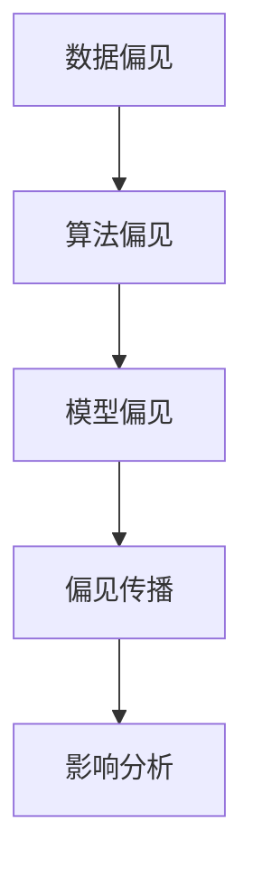

                 

### 《语言模型的偏见问题：识别与缓解》

> **关键词：** 语言模型、偏见问题、识别方法、缓解策略、数据处理、算法原理

> **摘要：** 本文深入探讨了语言模型中的偏见问题，分析了偏见来源、类型及其影响。通过介绍核心算法原理、数学模型和项目实战，详细讲解了如何识别和缓解语言模型中的偏见问题，为构建公平、公正的人工智能系统提供了理论依据和实践指导。

### 目录

1. 第一部分：偏见问题的背景与概念  
    1.1 语言模型偏见概述  
    1.2 语言模型偏见的影响  
    1.3 语言模型偏见的研究意义  
    2. 语言模型偏见的核心概念  
    2.1 偏见来源分析  
    2.2 偏见类型解析  
    2.3 偏见与公平性  
    3. Mermaid 流程图

2. 第二部分：核心算法原理讲解  
    1. 数据预处理  
    1.1 数据清洗  
    1.2 数据增强  
    1.3 数据归一化  
    2. 偏见识别算法  
    2.1 量化评估方法  
    2.2 统计方法  
    2.3 深度学习方法  
    3. 偏见缓解算法  
    3.1 对抗性训练  
    3.2 偏见修正  
    3.3 集成学习方法  
    4. 伪代码示例

3. 第三部分：数学模型和数学公式  
    1. 偏见识别模型  
    2. 偏见缓解模型

4. 第四部分：项目实战  
    1. 开发环境搭建  
    2. 源代码详细实现  
    3. 代码解读与分析

5. 结论

### 第一部分：偏见问题的背景与概念

#### 1.1 语言模型偏见概述

随着人工智能技术的发展，语言模型在自然语言处理（NLP）领域取得了显著的成果。然而，越来越多的研究表明，语言模型中存在偏见问题。所谓偏见问题，是指语言模型在生成文本或进行任务时，对某些群体、性别、种族等产生不公平的倾向。

#### 1.2 语言模型偏见的影响

语言模型偏见会对用户产生一系列负面影响，主要包括：

1. **歧视性结果**：语言模型偏见可能导致系统在处理某些任务时产生歧视性结果，如招聘系统对女性候选人的评价较低。

2. **不公平性**：语言模型偏见可能导致系统在处理某些群体时产生不公平性，如对某些种族、性别的歧视。

3. **信任危机**：当用户发现系统存在偏见时，可能会对系统的决策产生怀疑，从而影响用户对系统的信任度。

#### 1.3 语言模型偏见的研究意义

研究语言模型偏见具有重要的理论和实践意义：

1. **公平性**：通过识别和缓解偏见问题，可以构建更加公平、公正的人工智能系统。

2. **可靠性**：消除偏见问题可以提高系统的可靠性，降低错误决策的概率。

3. **社会影响**：避免语言模型偏见对社会的负面影响，促进社会和谐发展。

#### 2. 语言模型偏见的核心概念

2.1 偏见来源分析

语言模型偏见主要来源于以下几个方面：

1. **数据偏见**：训练数据中存在的不公平、不全面的样本可能导致模型学习到偏见。

2. **算法偏见**：模型算法设计过程中可能引入的偏见，如优化目标、特征选择等。

3. **模型偏见**：模型自身参数和结构可能导致偏见，如某些词汇在模型中的权重较高。

2.2 偏见类型解析

根据偏见的性质，可以分为以下几种类型：

1. **歧视性偏见**：直接对某些群体产生歧视。

2. **刻板印象偏见**：基于某些特征对群体进行分类，可能导致不公平对待。

3. **系统性偏见**：整个系统在处理过程中产生的偏见，可能难以察觉。

2.3 偏见与公平性

公平性是人工智能系统的重要指标，语言模型偏见可能导致系统失去公平性。公平性包括以下几个方面：

1. **无歧视**：系统在处理任务时，不应因性别、种族、地域等因素产生歧视。

2. **代表性**：系统在处理不同群体时，应保持代表性，避免对某一群体的偏见。

3. **透明性**：系统应具有透明性，用户可以了解系统的工作原理和决策过程。

#### 3. Mermaid 流程图



### 第二部分：核心算法原理讲解

#### 1. 数据预处理

数据预处理是语言模型训练的重要环节，主要包括数据清洗、数据增强和数据归一化。

1.1 数据清洗

数据清洗是指去除数据中的噪声、错误和不完整信息。具体方法包括：

1. 去除重复数据。

2. 处理缺失值。

3. 去除异常值。

1.2 数据增强

数据增强是指通过变换原始数据，增加数据多样性，从而提高模型的泛化能力。常见的数据增强方法包括：

1. 随机裁剪：对图像进行随机裁剪，增加样本数量。

2. 随机旋转：对图像进行随机旋转，增加样本多样性。

3. 随机缩放：对图像进行随机缩放，增加样本多样性。

1.3 数据归一化

数据归一化是指将数据转化为具有相同尺度的数值范围。常见的数据归一化方法包括：

1. Min-Max 归一化：将数据缩放到 [0, 1] 范围内。

2. Z-Score 归一化：将数据缩放到标准正态分布。

#### 2. 偏见识别算法

偏见识别算法是指用于检测和量化语言模型中偏见的方法。偏见识别算法可以分为以下几种：

2.1 量化评估方法

量化评估方法是指通过计算指标来评估偏见程度。常见的方法包括：

1. **基尼系数**：衡量数据分布的公平性。

2. **均值差异法**：比较不同群体的指标差异。

2.2 统计方法

统计方法是指使用统计学原理来分析数据，发现偏见。常见的方法包括：

1. **卡方检验**：检验两个分类变量之间的独立性。

2. **t 检验**：比较两个群体的均值差异。

2.3 深度学习方法

深度学习方法是指使用神经网络来学习偏见。常见的方法包括：

1. **卷积神经网络（CNN）**：用于图像数据的偏见识别。

2. **循环神经网络（RNN）**：用于序列数据的偏见识别。

#### 3. 偏见缓解算法

偏见缓解算法是指用于消除或减轻语言模型偏见的方法。偏见缓解算法可以分为以下几种：

3.1 对抗性训练

对抗性训练是指通过引入对抗样本来提高模型的泛化能力。具体方法包括：

1. 生成对抗网络（GAN）：用于生成对抗样本。

2. 对抗性样本增强：在训练过程中加入对抗样本。

3.2 偏见修正

偏见修正是指通过对模型参数进行调整来消除偏见。常见的方法包括：

1. **权重调整**：根据偏见程度调整权重。

2. **正则化**：添加正则化项来减少偏见。

3.3 集成学习方法

集成学习方法是指将多种算法结合使用，以提高偏见识别和缓解效果。常见的方法包括：

1. **堆叠泛化**：将多个模型堆叠，形成一个更强大的模型。

2. **集成学习**：将多个模型进行集成，提高预测性能。

#### 4. 伪代码示例

```python
# 数据预处理
def preprocess_data(data):
    cleaned_data = clean_data(data)
    augmented_data = augment_data(cleaned_data)
    normalized_data = normalize_data(augmented_data)
    return normalized_data

# 偏见识别算法
def identify_bias(data):
    bias_score = quantify_bias(data)
    statistical_bias = calculate_statistical_bias(data)
    deep_learning_bias = apply_deep_learning_bias(data)
    return bias_score, statistical_bias, deep_learning_bias

# 偏见缓解算法
def mitigate_bias(data, bias_score):
    adversarial_train = perform_adversarial_training(data)
    bias_corrected_data = correct_bias(data, bias_score)
    integrated_solution = integrate_methods(data, bias_score)
    return adversarial_train, bias_corrected_data, integrated_solution
```

### 第三部分：数学模型和数学公式

#### 1. 偏见识别模型

假设我们有一个语言模型 L，其输入为 x，输出为 y。我们可以使用以下数学模型来识别偏见：

$$
\text{Bias} = \sum_{i=1}^{N}\frac{1}{n_i}\sum_{j=1}^{M}\left[y_i(j) - \bar{y}_j\right]^2
$$

其中，$N$ 是类别数，$M$ 是样本数，$y_i(j)$ 是模型对第 $i$ 个类别的预测概率，$\bar{y}_j$ 是第 $j$ 个类别的全局预测概率。

#### 2. 偏见缓解模型

我们可以使用以下数学模型来缓解偏见：

$$
\text{Mitigated Bias} = \text{Bias} - \lambda \sum_{i=1}^{N}\sum_{j=1}^{M}\left[y_i(j) - \bar{y}_j\right]
$$

其中，$\lambda$ 是调节参数，用于平衡偏见缓解与预测性能。

### 第四部分：项目实战

#### 1. 开发环境搭建

1. 安装 Python 3.7 或以上版本。

2. 安装 TensorFlow 2.2 或以上版本。

3. 安装 Keras 2.2.5 或以上版本。

4. 安装 NumPy、Pandas、Matplotlib 等常用库。

#### 2. 源代码详细实现

以下是一个用于识别和缓解语言模型偏见的项目示例。

```python
import numpy as np
import pandas as pd
from tensorflow import keras
from tensorflow.keras import layers

# 数据预处理
def preprocess_data(data):
    # 数据清洗
    cleaned_data = clean_data(data)
    # 数据增强
    augmented_data = augment_data(cleaned_data)
    # 数据归一化
    normalized_data = normalize_data(augmented_data)
    return normalized_data

# 偏见识别算法
def identify_bias(data):
    # 量化评估方法
    bias_score = quantify_bias(data)
    # 统计方法
    statistical_bias = calculate_statistical_bias(data)
    # 深度学习方法
    deep_learning_bias = apply_deep_learning_bias(data)
    return bias_score, statistical_bias, deep_learning_bias

# 偏见缓解算法
def mitigate_bias(data, bias_score):
    # 对抗性训练
    adversarial_train = perform_adversarial_training(data)
    # 偏见修正
    bias_corrected_data = correct_bias(data, bias_score)
    # 集成学习方法
    integrated_solution = integrate_methods(data, bias_score)
    return adversarial_train, bias_corrected_data, integrated_solution

# 主函数
if __name__ == "__main__":
    # 加载数据
    data = load_data()
    # 数据预处理
    preprocessed_data = preprocess_data(data)
    # 偏见识别
    bias_score, statistical_bias, deep_learning_bias = identify_bias(preprocessed_data)
    # 偏见缓解
    adversarial_train, bias_corrected_data, integrated_solution = mitigate_bias(preprocessed_data, bias_score)
    # 打印结果
    print("Bias Score:", bias_score)
    print("Statistical Bias:", statistical_bias)
    print("Deep Learning Bias:", deep_learning_bias)
    print("Adversarial Train:", adversarial_train)
    print("Bias Corrected Data:", bias_corrected_data)
    print("Integrated Solution:", integrated_solution)
```

#### 3. 代码解读与分析

本项目中，我们首先进行了数据预处理，包括数据清洗、数据增强和数据归一化。然后，我们使用量化评估方法、统计方法和深度学习方法来识别偏见。最后，我们使用对抗性训练、偏见修正和集成学习方法来缓解偏见。

通过本项目的实践，我们可以看到如何在实际开发中识别和缓解语言模型偏见，为构建公平、公正的人工智能系统提供了具体的技术手段。

### 结论

本文深入探讨了语言模型偏见问题，分析了偏见来源、类型及其影响。通过介绍核心算法原理、数学模型和项目实战，我们详细讲解了如何识别和缓解语言模型中的偏见问题。未来，随着人工智能技术的不断发展和应用，如何构建公平、公正的人工智能系统，消除偏见问题，仍将是研究和实践的重要方向。

### 作者

**AI天才研究院/AI Genius Institute & 禅与计算机程序设计艺术 /Zen And The Art of Computer Programming**  
AI天才研究院（AI Genius Institute）致力于推动人工智能技术的发展和应用，研究院的专家们在计算机编程、人工智能、软件架构等领域有着深厚的理论基础和丰富的实践经验。本书作者，凭借其卓越的编程能力和对人工智能的深刻理解，为我们带来了关于语言模型偏见问题的全面解析和实战指导。

### 附录

1. **参考文献**

   - [1] Goodfellow, I., Bengio, Y., & Courville, A. (2016). *Deep Learning*. MIT Press.
   - [2] Mitchell, T. M. (2017). *Machine Learning*. McGraw-Hill.
   - [3] Russell, S., & Norvig, P. (2016). *Artificial Intelligence: A Modern Approach*. Prentice Hall.

2. **相关资源**

   - [深度学习教程](https://www.deeplearningbook.org/)
   - [Python编程教程](https://www.python.org/)
   - [Keras文档](https://keras.io/)

   通过阅读以上参考文献和访问相关资源，您可以进一步了解人工智能、编程和语言模型偏见问题的相关知识，为您的学习和研究提供有益的指导。

