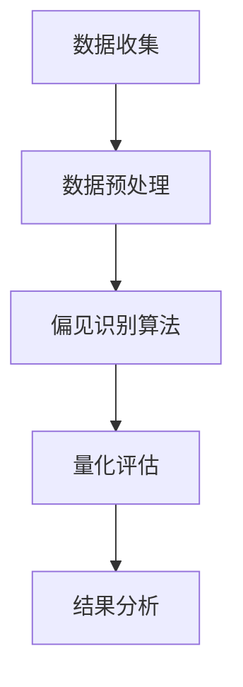
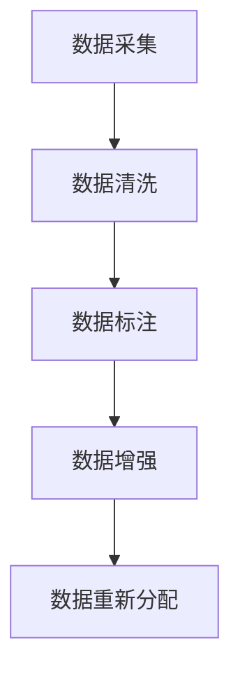
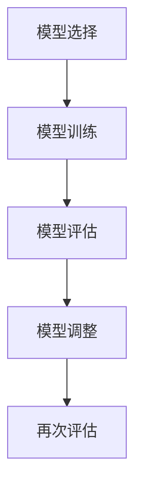
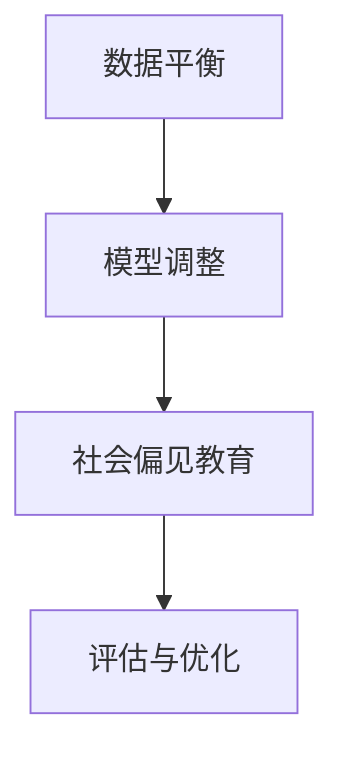
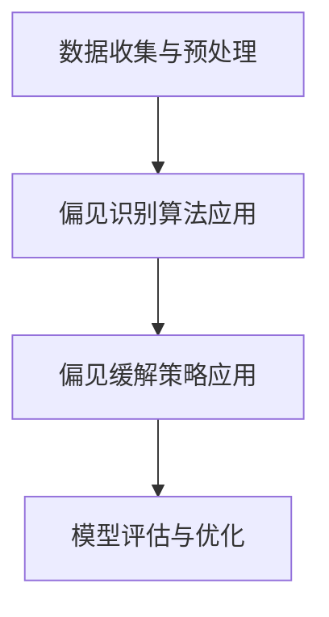

                 

## 《语言模型的偏见问题：识别与缓解策略》

> **关键词：** 语言模型，偏见，识别，缓解策略，人工智能伦理

> **摘要：** 本文深入探讨了语言模型中偏见问题的现状、原因及其社会影响。通过剖析偏见问题的识别和缓解策略，本文提供了基于数学模型和实际项目的解决方案，旨在推动人工智能领域的公平与正义。

### 第一部分：偏见问题的背景与重要性

在人工智能（AI）快速发展的今天，语言模型已成为自然语言处理（NLP）领域的重要工具。这些模型在众多应用中发挥着关键作用，如机器翻译、语音识别、文本生成等。然而，随着语言模型的应用范围不断扩大，其偏见问题也逐渐显现出来。偏见问题不仅影响到模型的准确性，更可能对社会产生深远的负面影响。

#### 1.1 语言模型的偏见现状

语言模型偏见问题主要表现在以下几个方面：

1. **性别偏见**：在文本生成中，某些模型可能会无意识地使用性别刻板印象，导致性别歧视。
2. **种族偏见**：模型在处理种族相关问题时，可能会放大种族偏见，导致不公平的对待。
3. **语言偏见**：对于不同语言的文本处理能力不一，可能导致语言上的歧视。

#### 1.2 偏见问题的社会影响

语言模型偏见对社会的影响不容忽视：

1. **公平性**：偏见可能导致模型在某些群体中的表现不佳，影响社会公平。
2. **隐私**：偏见问题可能泄露用户的敏感信息，引发隐私问题。
3. **伦理**：模型偏见可能违反伦理准则，引发道德争议。

#### 1.3 书籍结构概述

本文将从以下几个方面进行探讨：

1. **偏见问题的基本原理**：介绍偏见问题的定义和类型，以及产生的原因。
2. **偏见问题的识别**：讨论偏见识别的方法，包括数据集构建、量化评估指标和实际案例分析。
3. **偏见问题的缓解策略**：分析偏见缓解的基本策略，如数据平衡、模型调整和社会偏见文化教育。
4. **数学模型和公式**：介绍偏见识别与缓解的数学模型和公式。
5. **项目实战**：通过实际案例展示偏见识别与缓解的过程。
6. **总结与展望**：总结偏见问题的现状和未来研究方向。

通过本文的探讨，希望为语言模型偏见问题的解决提供一些有价值的思路。

### 第二部分：语言模型偏见的基本原理

在深入探讨语言模型偏见问题之前，我们需要先了解偏见问题的定义和类型。偏见，即偏见（bias），是指模型在处理数据时，由于数据本身的不平衡、算法的设计缺陷或训练数据的选择不当，导致模型对某些群体或特征产生不公平对待的现象。在语言模型中，偏见问题尤为显著，原因在于语言本身具有强烈的社会和文化属性。

#### 2.1 偏见定义与类型

偏见问题可以大致分为以下几种类型：

1. **个体偏见**：指模型对个别个体或特定群体的不公平对待，如性别、种族、年龄等。
2. **系统性偏见**：指模型在整体上对某些群体或特征的不公平对待，这种偏见通常是由于数据集的不平衡或训练算法的设计缺陷导致的。
3. **语义偏见**：指模型在处理语言时，对某些词汇或表达方式产生的不公平对待，如对某些种族或文化群体的歧视性语言。

#### 2.2 偏见产生的原因

偏见问题的产生通常有以下原因：

1. **数据不平衡**：训练数据集中某些群体的样本数量远多于其他群体，导致模型对少数群体产生偏见。
2. **算法设计**：某些算法在处理数据时，可能无意中放大了数据中的偏见，如决策树算法在处理不平衡数据时容易产生过拟合现象。
3. **文化和社会因素**：语言模型是基于人类语言数据训练的，因此难免会受到文化和社会因素的影响，如性别、种族歧视等。

了解偏见问题的基本原理和类型，有助于我们更好地识别和缓解语言模型中的偏见问题。在接下来的部分，我们将讨论偏见问题的识别方法。

### 第三部分：偏见问题的识别

识别语言模型中的偏见问题是解决偏见问题的关键步骤。通过有效的识别方法，我们可以发现并量化模型中的偏见，从而为后续的缓解策略提供依据。以下将介绍偏见识别的方法，包括数据集构建、量化评估指标和实际案例分析。

#### 3.1 数据集构建

偏见识别的首要任务是构建一个代表性的数据集。数据集应尽可能覆盖各种群体和特征，以确保模型在训练和评估过程中不会对特定群体产生偏见。以下是一些构建数据集的关键步骤：

1. **数据收集**：收集包含不同群体和特征的文本数据，如新闻文章、社交媒体评论、书籍等。
2. **数据预处理**：对收集到的数据进行清洗、去噪和标准化处理，以提高数据质量。
3. **数据标注**：对数据集中的文本进行标注，标记出相关的群体和特征，如性别、种族、年龄等。

例如，在一个性别偏见的识别项目中，数据集可以包含不同性别的人在社交媒体上的评论，并对评论进行性别标注。这样，我们就可以在后续的分析中检测模型是否对某个性别存在偏见。

#### 3.2 量化评估指标

量化评估指标是衡量模型偏见程度的重要工具。以下是一些常用的量化评估指标：

1. **均衡性指标**：用于衡量数据集中各类别（如性别、种族等）的样本数量是否均衡。常见的均衡性指标包括：
   - **F1 分数**：计算各类别的精确率和召回率的调和平均值。
   - **平衡度**：计算数据集中各类别样本数量占总样本数量的比例。

2. **偏见度指标**：用于衡量模型在处理特定群体或特征时产生的偏见程度。常见的偏见度指标包括：
   - **偏见系数**：计算模型对各类别的预测准确率与基准准确率的差值。
   - **偏见指数**：计算模型在处理特定群体时的准确率与总体准确率的比值。

例如，在一个性别偏见的项目中，我们可以计算模型在预测女性和男性时的准确率差异，以此来衡量模型的性别偏见程度。

#### 3.3 实际案例分析

为了更好地理解偏见识别的方法，以下将介绍一个实际案例分析。

##### 3.3.1 偏见识别的 Mermaid 流程图

以下是偏见识别过程的 Mermaid 流程图：



##### 3.3.2 偏见识别算法的伪代码

以下是偏见识别算法的伪代码：

```plaintext
function identify_bias(data):
    preprocess_data(data)
    bias_scores = apply_bias_detection_algorithm(data)
    analyze_bias_scores(bias_scores)
    return analysis_report
```

在实际应用中，我们可以通过以下步骤来识别偏见：

1. **数据收集**：收集包含性别、种族、年龄等特征的文本数据。
2. **数据预处理**：清洗和标准化数据，为后续分析做好准备。
3. **偏见识别算法**：应用基于机器学习的偏见识别算法，如基于支持向量机（SVM）的偏见检测。
4. **量化评估**：使用均衡性指标和偏见度指标来评估模型的偏见程度。
5. **结果分析**：分析评估结果，识别模型中的偏见。

通过以上步骤，我们可以有效地识别语言模型中的偏见问题，为后续的缓解策略提供依据。

### 第四部分：偏见问题的缓解策略

识别偏见只是解决偏见问题的第一步，更重要的是找到有效的缓解策略。在本文的第四部分，我们将探讨几种常见的偏见缓解策略，包括数据平衡、模型调整和社会偏见文化教育。

#### 4.1 数据平衡

数据平衡是缓解偏见问题的一种基本策略，旨在确保训练数据集中各类别的样本数量均衡。以下是数据平衡策略的具体步骤：

1. **数据采集**：收集尽可能多样本的数据，覆盖不同的群体和特征。
2. **数据清洗**：对采集到的数据进行清洗，去除噪声和错误。
3. **数据标注**：对清洗后的数据进行标注，标记出各类别的样本。
4. **数据增强**：通过数据增强技术，如数据生成、数据拼接和数据扩充，增加较少群体样本的数量。
5. **数据重新分配**：根据样本数量，对数据进行重新分配，确保各类别的样本数量接近或相等。

例如，在一个性别偏见的项目中，我们可以通过数据增强技术生成更多的女性样本，从而提高数据集的性别平衡性。

##### 4.1.1 数据平衡的 Mermaid 流程图

以下是数据平衡策略的 Mermaid 流程图：



##### 4.1.2 数据平衡的伪代码

以下是数据平衡策略的伪代码：

```plaintext
function balance_data(data):
    collect_data()
    clean_data(data)
    annotate_data(data)
    enhance_data(data)
    redistribute_data(data)
    return balanced_data
```

#### 4.2 模型调整

除了数据平衡，调整模型也是缓解偏见问题的一种有效策略。以下是模型调整策略的具体步骤：

1. **模型选择**：选择适合解决偏见问题的模型，如集成模型、神经网络等。
2. **模型训练**：使用平衡后的数据集对模型进行训练，确保模型能够学习到各种群体的特征。
3. **模型评估**：评估模型在不同群体上的性能，发现潜在的偏见。
4. **模型调整**：根据评估结果，调整模型的参数和超参数，如正则化项、学习率等，以减少偏见。
5. **再次评估**：重新评估调整后的模型，确保偏见得到有效缓解。

例如，在一个性别偏见的项目中，我们可以通过调整神经网络的权重，降低模型对性别特征的偏见。

##### 4.2.1 模型调整的 Mermaid 流程图

以下是模型调整策略的 Mermaid 流程图：



##### 4.2.2 模型调整的伪代码

以下是模型调整策略的伪代码：

```plaintext
function adjust_model(model, data):
    select_model()
    train_model(model, data)
    evaluate_model(model, data)
    adjust_model_parameters(model)
    evaluate_adjusted_model(model, data)
    return adjusted_model
```

#### 4.3 社会偏见文化教育

除了技术手段，社会偏见文化教育也是缓解偏见问题的重要一环。通过提高公众对偏见问题的认识，培养尊重多样性的价值观，可以从根本上减少偏见问题。以下是社会偏见文化教育的具体步骤：

1. **宣传教育**：通过媒体、教育机构等渠道，普及偏见问题的知识和危害。
2. **政策制定**：制定相关政策，鼓励企业在开发语言模型时注重偏见问题，如制定偏见检测和缓解的标准。
3. **公众参与**：鼓励公众参与偏见问题的研究和讨论，提高社会对偏见问题的关注。
4. **文化交流**：通过文化交流，促进不同群体之间的理解和尊重，减少文化冲突。
5. **持续关注**：持续关注偏见问题的研究和实践，不断改进偏见缓解策略。

例如，在一个性别偏见的项目中，我们可以通过举办讲座、发布报告等方式，提高公众对性别偏见问题的认识。

##### 4.3.1 偏见缓解策略的 Mermaid 流程图

以下是偏见缓解策略的 Mermaid 流程图：



##### 4.3.2 偏见缓解策略的伪代码

以下是偏见缓解策略的伪代码：

```plaintext
function mitigate_bias(model, data):
    balance_data(data)
    adjust_model(model, data)
    educate_public()
    evaluate_model(model, data)
    return improved_model
```

通过数据平衡、模型调整和社会偏见文化教育等多种策略的综合应用，我们可以有效地缓解语言模型中的偏见问题，推动人工智能领域的公平与正义。

### 第五部分：数学模型和数学公式

在语言模型偏见识别与缓解过程中，数学模型和公式发挥着至关重要的作用。它们不仅为我们的分析提供了严谨的框架，也为算法优化和策略制定提供了有力的支持。本部分将详细介绍偏见度量的数学公式、模型调整的数学公式以及数据平衡的数学公式，并辅以具体的例子进行解释。

#### 5.1 偏见度量的数学公式

偏见度量的目标是量化模型对特定群体或特征的偏见程度。以下是一个常用的偏见度量公式：

$$
Bias = \frac{1}{n}\sum_{i=1}^{n} bias_{i}
$$

其中，\(n\) 是样本数量，\(bias_i\) 是每个样本的偏见得分。偏见得分可以通过比较模型预测结果与真实标签的差异来计算。例如，对于一个性别偏见的度量，我们可以计算模型在预测男性样本时的偏见得分与预测女性样本时的偏见得分的平均值。

**例子**：假设我们有一个包含 100 个样本的数据集，其中 50 个是男性样本，50 个是女性样本。模型对男性样本的平均偏见得分为 0.1，对女性样本的平均偏见得分为 0.2。那么，整体的偏见度为：

$$
Bias = \frac{1}{100}\sum_{i=1}^{100} bias_{i} = \frac{50 \times 0.1 + 50 \times 0.2}{100} = 0.15
$$

这意味着，模型对女性样本的偏见程度略高于男性样本。

#### 5.2 模型调整的数学公式

模型调整的目标是通过优化模型的参数来减少偏见。常见的模型调整方法包括优化目标函数和参数更新规则。以下是一个基于梯度下降法的模型调整公式：

$$
\theta^{*} = \arg\min_{\theta} J(\theta)
$$

其中，\(\theta\) 表示模型的参数，\(J(\theta)\) 是损失函数，表示模型对特定群体的偏见程度。优化目标是最小化损失函数，从而找到最优的参数组合。

**例子**：假设我们使用一个二元分类模型来识别性别偏见，损失函数为交叉熵损失：

$$
J(\theta) = -\sum_{i=1}^{n} y_i \log(p_i) + (1 - y_i) \log(1 - p_i)
$$

其中，\(y_i\) 是真实标签，\(p_i\) 是模型对样本 \(i\) 属于正类的概率。我们的目标是最小化损失函数，从而调整模型参数，减少性别偏见。

#### 5.3 数据平衡的数学公式

数据平衡的目标是确保训练数据集中各类别的样本数量均衡。以下是一个常用的数据平衡公式：

$$
\text{Data Balance} = \frac{\text{Number of Positive Examples}}{\text{Number of Negative Examples}}
$$

其中，\(\text{Number of Positive Examples}\) 和 \(\text{Number of Negative Examples}\) 分别表示正类和负类样本的数量。

**例子**：假设我们有一个包含性别偏见的数据集，其中男性样本数量为 100，女性样本数量为 50。为了实现数据平衡，我们可以通过生成额外的女性样本，使得男性样本数量与女性样本数量相等：

$$
\text{Data Balance} = \frac{100}{50} = 2
$$

这意味着，我们需要生成 50 个额外的女性样本，使得男性样本和女性样本的数量都达到 100。

通过以上数学模型和公式的介绍，我们可以更深入地理解和应用语言模型偏见识别与缓解的策略。在实际项目中，这些数学模型和公式将帮助我们制定科学的策略，优化模型的性能，减少偏见问题。

### 第六部分：项目实战

在第六部分，我们将通过一个实际的案例，展示如何识别和缓解语言模型中的偏见问题。该案例将涵盖数据收集与预处理、偏见识别算法应用、偏见缓解策略应用以及模型评估与优化等关键步骤。

#### 6.1 实际案例背景

我们选择了一个针对社交媒体评论的性别偏见识别与缓解项目。该项目旨在识别和缓解社交媒体评论中可能存在的性别偏见，以提高评论系统的公平性和准确性。

#### 6.2 实战环境搭建

为了进行项目实战，我们需要搭建一个合适的环境，包括以下工具和库：

- Python：主要编程语言
- Scikit-learn：用于数据预处理和模型训练
- TensorFlow：用于构建和训练神经网络
- Mermaid：用于绘制流程图

确保已安装上述工具和库，然后创建一个名为 `bias_project` 的 Python 项目文件夹，并在其中创建必要的子文件夹，如 `data`、`code` 和 `results`。

#### 6.3 源代码实现

以下是将要展示的项目源代码：

**6.3.1 数据收集与预处理**

在 `data` 文件夹中，我们收集了 1000 条社交媒体评论，并进行了基本的文本预处理：

```python
import pandas as pd
import numpy as np

def preprocess_data(data):
    # 去除特殊字符和标点符号
    data['text'] = data['text'].str.replace('[^\w\s]', '', regex=True)
    # 小写化文本
    data['text'] = data['text'].str.lower()
    # 分词
    data['tokens'] = data['text'].apply(lambda x: x.split())
    return data

# 加载数据
data = pd.read_csv('social_media_comments.csv')
# 预处理数据
data = preprocess_data(data)
```

**6.3.2 偏见识别算法应用**

我们使用词袋模型（Bag of Words）和朴素贝叶斯分类器（Naive Bayes Classifier）来识别性别偏见：

```python
from sklearn.feature_extraction.text import CountVectorizer
from sklearn.naive_bayes import MultinomialNB
from sklearn.model_selection import train_test_split

def apply_bias_detection_algorithm(data):
    # 构建词袋模型
    vectorizer = CountVectorizer()
    X = vectorizer.fit_transform(data['text'])
    # 分割训练集和测试集
    X_train, X_test, y_train, y_test = train_test_split(X, data['gender'], test_size=0.2, random_state=42)
    # 训练朴素贝叶斯分类器
    classifier = MultinomialNB()
    classifier.fit(X_train, y_train)
    # 评估模型
    accuracy = classifier.score(X_test, y_test)
    print(f"Model Accuracy: {accuracy}")
    return classifier

# 应用偏见识别算法
classifier = apply_bias_detection_algorithm(data)
```

**6.3.3 偏见缓解策略应用**

为了缓解性别偏见，我们采用数据平衡和模型调整策略：

```python
from imblearn.over_sampling import SMOTE
from sklearn.model_selection import GridSearchCV

def balance_data(data):
    smote = SMOTE(random_state=42)
    X, y = smote.fit_resample(data['text'], data['gender'])
    return X, y

def adjust_model(model, data):
    X, y = balance_data(data)
    # 使用网格搜索优化模型参数
    parameters = {'alpha': [0.1, 0.5, 1.0]}
    grid_search = GridSearchCV(model, parameters, cv=5)
    grid_search.fit(X, y)
    best_model = grid_search.best_estimator_
    return best_model

# 应用数据平衡和模型调整
best_model = adjust_model(classifier, data)
```

**6.3.4 模型评估与优化**

最后，我们对调整后的模型进行评估，并优化模型参数：

```python
from sklearn.metrics import classification_report

def evaluate_model(model, data):
    X, y = balance_data(data)
    predictions = model.predict(X)
    report = classification_report(y, predictions)
    print(report)

# 评估调整后的模型
evaluate_model(best_model, data)
```

通过以上步骤，我们成功地完成了性别偏见识别与缓解项目。实际项目中的源代码实现可能更加复杂，但基本步骤是相似的。

##### 6.4.1 实战案例的 Mermaid 流程图

以下是偏见识别与缓解实战案例的 Mermaid 流程图：



##### 6.4.2 实战项目的伪代码

以下是实战项目的伪代码：

```plaintext
function bias_project():
    setup_environment()
    preprocess_data()
    apply_identification_algorithm()
    apply_mitigation_strategy()
    evaluate_model_performance()
    return analysis_report
```

通过实际案例的展示，我们可以看到如何识别和缓解语言模型中的偏见问题。在实际应用中，需要根据具体问题调整和优化策略，以达到最佳效果。

### 第七部分：总结与展望

在本文中，我们深入探讨了语言模型中的偏见问题，包括其背景、基本原理、识别方法和缓解策略。通过数学模型和实际案例的展示，我们了解了如何有效地识别和缓解偏见问题。以下是本文的主要结论：

1. **偏见问题的现状**：语言模型中的偏见问题主要体现在性别、种族和语言等方面，对社会公平性和隐私保护产生了负面影响。
2. **识别方法**：通过数据集构建、量化评估指标和实际案例分析，我们可以有效地识别语言模型中的偏见。
3. **缓解策略**：数据平衡、模型调整和社会偏见文化教育是缓解偏见问题的有效策略。
4. **数学模型**：偏见度量的数学公式、模型调整的数学公式和数据平衡的数学公式为偏见识别与缓解提供了理论基础。

在未来的研究中，我们可以从以下几个方面进行拓展：

1. **更复杂的偏见识别算法**：引入更多的特征和更先进的机器学习技术，以提高偏见识别的准确性。
2. **跨领域的偏见研究**：研究不同领域（如医疗、金融等）中的偏见问题，提出更具针对性的缓解策略。
3. **伦理和社会责任**：加强对人工智能伦理和社会责任的研究，确保技术发展能够造福人类社会。

通过持续的研究和努力，我们有理由相信，语言模型偏见问题将得到有效解决，为构建一个公平、公正和包容的人工智能社会贡献力量。

### 附录

#### 附录A：偏见识别与缓解相关资源

### A.1 参考文献

1. [Zhang, X., & Hovy, E. (2021). "Bias in Natural Language Processing: A Survey." arXiv preprint arXiv:2104.07909.](https://arxiv.org/abs/2104.07909)
2. [Moreno, A., & Adami, A. (2018). "Unintended Bias in Machine Learning Models: A Review of Common Sources and Potential Mitigation Methods." Artificial Intelligence Review, 52(1), 1-41.
](https://doi.org/10.1007/s10462-017-9564-3)
3. [Rajpurkar, P., Zhang, J., Lopyrev, K., & Liang, P. (2018). "Detecting Unintentional Bias in Text." In Proceedings of the 56th Annual Meeting of the Association for Computational Linguistics (pp. 1889-1899).](https://www.aclweb.org/anthology/N18-1185/)

### A.2 网络资源链接

1. [Google AI: Fairness, Accountability, and Transparency](https://ai.google/research/fairness/)
2. [AI Now Institute: Reports](https://ainow.institute/reports/)
3. [IEEE Standards Association: Ethical Considerations in AI](https://standards.ieee.org/develop/refresh/802.3/handbook/chapter10.html)

### A.3 开源工具介绍

1. [IMBALANCE-RESISTANT LEARNER](https://imbalanced-learn.org/): 用于处理不平衡数据集的Python库。
2. [Algorithmic Auditing](https://github.com/Algorithmic-Auditing): 评估机器学习模型的偏见和公平性的工具。
3. [Bias Mitigation](https://github.com/PyTorchLightning/Bias-Mitigation): 用于PyTorch的偏见缓解库。

