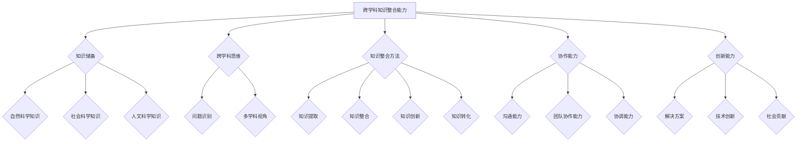
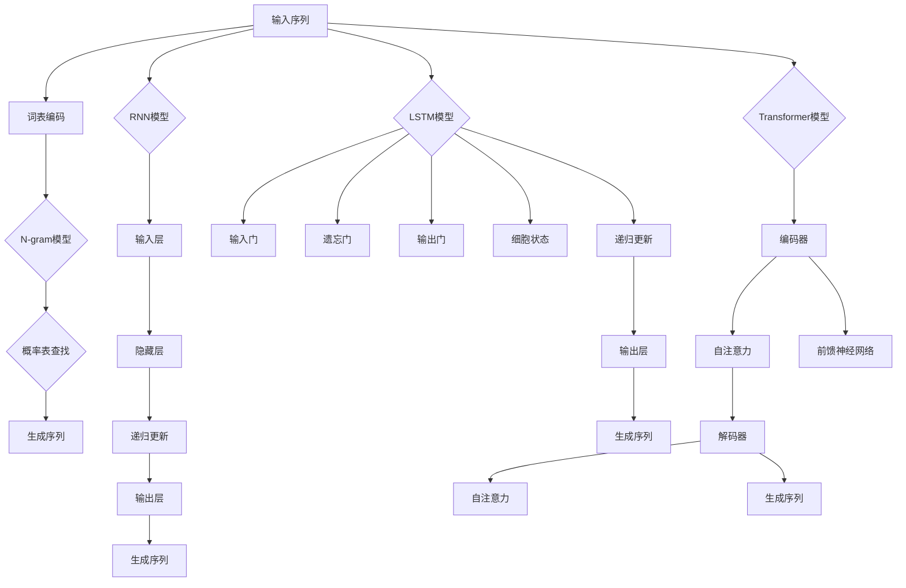

                 

# 《跨学科知识整合能力评测：测试LLM的综合素质》

> **关键词**：跨学科知识整合、语言模型（LLM）、评测、综合素质、算法原理、数学模型

> **摘要**：本文旨在探讨跨学科知识整合能力在语言模型（LLM）评测中的重要性，通过详细分析LLM的核心原理、算法和数学模型，以及实际项目实战，对LLM的综合素质进行评测。文章结构紧凑，逻辑清晰，旨在为读者提供深入理解LLM综合素质评测的方法和策略。

## 《跨学科知识整合能力评测：测试LLM的综合素质》目录大纲详细解读

### 第一部分：导论

#### 1.1 跨学科知识整合能力的重要性

**1.1.1 跨学科知识整合的背景**

**1.1.2 跨学科知识整合的挑战**

**1.1.3 跨学科知识整合的意义**

这部分内容将介绍跨学科知识整合的背景，讨论其在现代社会中的挑战，以及为何跨学科知识整合具有重要意义。这将为后续内容的讨论奠定基础。

#### 1.2 语言模型（LLM）概述

**1.2.1 语言模型的概念**

**1.2.2 语言模型的发展历程**

**1.2.3 语言模型的主要类型**

这部分内容将简要介绍语言模型的基本概念，回顾其发展历程，并分类介绍常见的语言模型，如GPT、BERT等。这将帮助读者对语言模型有一个初步的了解。

#### 1.3 本书结构及内容概述

**1.3.1 本书的主要目标**

**1.3.2 书中涉及的核心概念与评测方法**

**1.3.3 读者需求与阅读建议**

这部分内容将概述本书的结构和内容，明确主要目标，并针对核心概念和评测方法进行详细说明，同时为读者提供阅读建议。

### 第二部分：核心概念与联系

#### 2.1 跨学科知识整合能力模型

**2.1.1 跨学科知识整合能力的定义**

**2.1.2 跨学科知识整合能力的组成部分**

**2.1.3 跨学科知识整合能力的 Mermaid 流程图**

这部分内容将定义跨学科知识整合能力，详细解析其组成部分，并通过Mermaid流程图展示其整合过程。这将帮助读者对跨学科知识整合能力有一个清晰的认识。

#### 2.2 语言模型（LLM）的原理与架构

**2.2.1 语言模型的原理**

**2.2.2 语言模型的主要架构**

**2.2.3 语言模型的 Mermaid 流程图**

这部分内容将深入探讨语言模型的工作原理，介绍其主要架构，并通过Mermaid流程图展示其工作流程。这将帮助读者理解语言模型的核心概念和架构。

#### 2.3 跨学科知识整合与语言模型的关系

**2.3.1 跨学科知识整合如何增强语言模型**

**2.3.2 语言模型如何支持跨学科知识整合**

**2.3.3 跨学科知识整合与语言模型的交互机制**

这部分内容将讨论跨学科知识整合如何增强语言模型的能力，以及语言模型如何支持跨学科知识整合。同时，还将探讨两者之间的交互机制。这将有助于读者理解跨学科知识整合与语言模型之间的关系。

### 第三部分：核心算法原理讲解

#### 3.1 语言模型训练算法

**3.1.1 语言模型训练的基本过程**

**3.1.2 语言模型训练的优化算法**

**3.1.3 语言模型训练的伪代码**

这部分内容将详细介绍语言模型训练的基本过程，包括优化算法和训练步骤。同时，将通过伪代码展示语言模型训练的详细实现。这将帮助读者理解语言模型训练的核心算法原理。

#### 3.2 跨学科知识整合算法

**3.2.1 跨学科知识整合的基本概念**

**3.2.2 跨学科知识整合的主要算法**

**3.2.3 跨学科知识整合算法的伪代码**

这部分内容将讨论跨学科知识整合的基本概念和主要算法，并通过伪代码展示跨学科知识整合的详细实现。这将帮助读者理解跨学科知识整合的核心算法原理。

#### 3.3 语言模型与跨学科知识整合的结合

**3.3.1 跨学科知识整合在语言模型训练中的应用**

**3.3.2 语言模型在跨学科知识整合中的应用**

**3.3.3 语言模型与跨学科知识整合结合的伪代码**

这部分内容将探讨跨学科知识整合在语言模型训练中的应用，以及语言模型在跨学科知识整合中的应用。同时，将通过伪代码展示两者结合的实现过程。这将帮助读者理解语言模型与跨学科知识整合的结合原理。

### 第四部分：数学模型与公式详解

#### 4.1 语言模型中的数学模型

**4.1.1 语言模型中的概率分布模型**

**4.1.2 语言模型中的统计模型**

**4.1.3 语言模型中的优化模型**

这部分内容将介绍语言模型中的概率分布模型、统计模型和优化模型，并通过公式和例子详细解释这些模型的原理和应用。这将帮助读者深入理解语言模型中的数学模型。

#### 4.2 跨学科知识整合中的数学模型

**4.2.1 跨学科知识整合中的网络模型**

**4.2.2 跨学科知识整合中的概率模型**

**4.2.3 跨学科知识整合中的优化模型**

这部分内容将讨论跨学科知识整合中的网络模型、概率模型和优化模型，并通过公式和例子详细解释这些模型的原理和应用。这将帮助读者深入理解跨学科知识整合中的数学模型。

#### 4.3 语言模型与跨学科知识整合的结合

**4.3.1 结合中的数学模型**

**4.3.2 结合中的公式推导**

**4.3.3 结合中的数学模型应用**

这部分内容将探讨语言模型与跨学科知识整合的结合中的数学模型，通过公式推导和例子详细解释这些模型的应用。这将帮助读者理解语言模型与跨学科知识整合的结合原理。

### 第五部分：项目实战

#### 5.1 跨学科知识整合能力评测系统搭建

**5.1.1 开发环境配置**

**5.1.2 评测系统架构设计**

**5.1.3 评测系统功能模块**

这部分内容将介绍如何搭建一个跨学科知识整合能力评测系统，包括开发环境的配置、系统架构设计和功能模块的详细解析。这将帮助读者理解系统实现的步骤和细节。

#### 5.2 测试LLM的综合素质项目实施

**5.2.1 项目背景与目标**

**5.2.2 项目实施步骤**

**5.2.3 项目成果展示**

这部分内容将介绍一个测试LLM综合素质的项目，包括项目的背景和目标，项目实施的步骤，以及项目成果的展示。这将帮助读者了解项目实施的全过程。

#### 5.3 评测结果分析与优化

**5.3.1 评测结果分析方法**

**5.3.2 评测结果分析与解读**

**5.3.3 优化策略与实施**

这部分内容将分析评测结果，解读评测结果，并提出优化策略和实施步骤。这将帮助读者理解如何优化评测结果，提高LLM的综合素质。

### 第六部分：总结与展望

#### 6.1 本书的主要贡献

**6.1.1 核心概念与算法的创新点**

**6.1.2 项目实战的经验总结**

**6.1.3 对未来研究的展望**

这部分内容将总结本书的主要贡献，包括核心概念和算法的创新点，项目实战的经验总结，以及对未来研究的展望。这将帮助读者了解本书的贡献和未来研究方向。

#### 6.2 本书适用读者与后续研究方向

**6.2.1 适用读者群体**

**6.2.2 后续研究方向**

**6.2.3 对相关领域的启示**

这部分内容将讨论本书的适用读者群体，后续研究方向，以及对相关领域的启示。这将帮助读者了解本书的适用范围和未来研究的发展方向。

### 附录

#### 附录A：技术资源与工具

**A.1 语言模型开发工具**

**A.2 跨学科知识整合工具**

**A.3 实用资源与参考资料**

这部分内容将提供相关的技术资源与工具，包括语言模型开发工具、跨学科知识整合工具，以及实用的资源与参考资料。这将帮助读者更好地理解和应用相关技术。

#### 附录B：代码示例

**B.1 语言模型训练代码示例**

**B.2 跨学科知识整合代码示例**

**B.3 评测系统实现代码示例**

这部分内容将提供相关的代码示例，包括语言模型训练代码示例、跨学科知识整合代码示例，以及评测系统实现代码示例。这将帮助读者更好地理解和实现相关技术。

## 第一部分：导论

### 1.1 跨学科知识整合能力的重要性

#### 1.1.1 跨学科知识整合的背景

跨学科知识整合是指将来自不同学科的知识、理论和方法进行有机结合，以解决复杂问题或实现创新突破的一种能力。随着现代社会的发展，跨学科知识整合的重要性日益凸显。传统学科界限的模糊，交叉学科的兴起，以及全球化的趋势，使得跨学科知识整合成为现代教育和研究的重要方向。

跨学科知识整合的背景可以追溯到20世纪中叶。当时，随着科技的发展和社会的进步，许多复杂问题需要多学科的合作来解决。例如，环境问题、气候变化、疾病防控等，这些问题不仅涉及自然科学，还涉及到社会科学、人文科学等多个领域。为了应对这些复杂问题，科学家们开始尝试将不同学科的知识和方法进行整合，形成了跨学科研究的方法和模式。

跨学科知识整合的发展历程可以分为几个阶段：

1. **萌芽阶段（20世纪中叶到20世纪末）**：在这个阶段，跨学科研究逐渐兴起，科学家们开始尝试将不同学科的知识和方法进行结合。例如，系统科学、复杂系统理论等跨学科领域的出现，为跨学科知识整合提供了理论基础和方法指导。

2. **发展阶段（20世纪末到21世纪初）**：随着计算机技术的飞速发展，大数据、人工智能等新兴技术为跨学科知识整合提供了新的工具和方法。跨学科知识整合开始广泛应用于各个领域，如生物信息学、环境科学、社会计算等。

3. **成熟阶段（21世纪初至今）**：在跨学科知识整合的成熟阶段，越来越多的学科开始意识到跨学科知识整合的重要性，并将其应用于实际问题解决。跨学科知识整合的理论体系和方法体系逐渐完善，成为现代科学研究的重要手段。

#### 1.1.2 跨学科知识整合的挑战

尽管跨学科知识整合具有巨大的潜力，但在实际应用过程中也面临许多挑战。以下是跨学科知识整合过程中常见的挑战：

1. **学科界限的模糊性**：不同学科之间的界限往往比较模糊，学科之间的交叉融合可能存在一定的争议和不确定性。这给跨学科知识整合带来了一定的挑战。

2. **知识体系的差异性**：不同学科的知识体系和方法论存在较大差异，这使得跨学科知识整合过程中需要进行大量的知识整合和调整。

3. **团队合作与沟通**：跨学科知识整合往往需要多学科专家的协同合作，这要求团队成员之间具备良好的沟通能力和合作精神。然而，不同学科专家之间的沟通和合作可能存在一定的障碍。

4. **时间与资源的压力**：跨学科知识整合通常需要较长的时间和大量的资源投入。在现实应用中，时间与资源的压力往往是一个不可忽视的挑战。

#### 1.1.3 跨学科知识整合的意义

跨学科知识整合在现代社会具有重要的意义，主要体现在以下几个方面：

1. **解决问题**：跨学科知识整合能够将不同学科的知识和方法进行有机结合，从而更好地解决复杂问题。例如，环境问题需要结合生态学、经济学、政策学等多个领域的知识。

2. **创新突破**：跨学科知识整合为创新提供了新的思路和可能性。通过跨学科知识的整合，科学家们能够发现新的研究方向，推动科学技术的发展。

3. **人才培养**：跨学科知识整合有助于培养具备多学科背景的复合型人才。这些人才能够更好地适应现代社会的发展需求，具有更广泛的视野和更强的创新能力。

4. **学科发展**：跨学科知识整合有助于推动学科的发展。通过跨学科的视角，科学家们能够更全面地认识和研究某一学科，从而推动学科理论的深化和发展。

### 1.2 语言模型（LLM）概述

#### 1.2.1 语言模型的概念

语言模型（Language Model，简称LM）是自然语言处理（Natural Language Processing，简称NLP）领域的一种基础模型，它旨在对自然语言文本进行建模，以便预测下一个单词或词组。语言模型是一种概率模型，它通过统计方法对大规模语料库进行分析，从而生成概率分布，用以预测语言序列。

语言模型的核心目标是实现语言数据的生成、分类、理解等任务。常见的语言模型包括基于统计的方法和基于深度学习的方法。基于统计的方法主要通过统计语言模型（Statistical Language Model，简称SLM）实现，如N-gram模型；基于深度学习的方法则通过神经网络（Neural Network，简称NN）实现，如循环神经网络（Recurrent Neural Network，简称RNN）、长短期记忆网络（Long Short-Term Memory，简称LSTM）和变换器（Transformer）等。

#### 1.2.2 语言模型的发展历程

语言模型的发展历程可以分为以下几个阶段：

1. **基于规则的模型**：早期语言模型主要是基于规则的模型，如基于上下文的文法分析器（Context-Free Grammar，简称CFG）。这些模型通过预先定义的语法规则来预测语言序列。

2. **基于统计的模型**：随着语料库的积累和计算能力的提升，基于统计的方法逐渐成为主流。N-gram模型是其中最典型的代表，它通过统计相邻单词的频率来预测下一个单词。

3. **基于神经网络的模型**：深度学习的兴起使得基于神经网络的模型成为语言模型研究的热点。RNN、LSTM和Transformer等模型的出现，极大地提升了语言模型的性能。

4. **预训练加微调**：近年来，预训练加微调（Pre-training and Fine-tuning）的方法成为语言模型研究的新趋势。通过在大量未标注的语料上进行预训练，模型可以获得对语言的一般理解，再通过微调适应特定任务。

#### 1.2.3 语言模型的主要类型

根据模型的结构和训练方法，语言模型可以分为以下几种主要类型：

1. **N-gram模型**：N-gram模型是一种基于统计的模型，它将语言序列划分为固定长度的连续单词序列。模型通过统计相邻N个单词的联合概率来预测下一个单词。

2. **循环神经网络（RNN）模型**：RNN是一种基于神经网络的模型，它能够处理序列数据。RNN通过递归方式处理输入序列，能够在一定程度上捕捉长期依赖关系。

3. **长短期记忆网络（LSTM）模型**：LSTM是RNN的一种改进，它通过引入门控机制（ gating mechanism）来克服RNN的梯度消失问题。LSTM在处理长序列数据时表现出更好的性能。

4. **变换器（Transformer）模型**：Transformer模型是近年来提出的一种基于自注意力机制的模型，它通过多头自注意力（Multi-Head Self-Attention）和前馈神经网络（Feedforward Neural Network）实现。Transformer模型在自然语言处理任务中取得了显著的效果。

### 1.3 本书结构及内容概述

#### 1.3.1 本书的主要目标

本书的主要目标是探讨跨学科知识整合能力在语言模型评测中的重要性，通过详细分析语言模型的核心原理、算法和数学模型，以及实际项目实战，对语言模型（LLM）的综合素质进行评测。具体来说，本书旨在实现以下目标：

1. **深入理解跨学科知识整合能力**：介绍跨学科知识整合的定义、意义和挑战，帮助读者对跨学科知识整合有全面的认识。

2. **探讨语言模型的核心原理**：详细讲解语言模型的基本概念、发展历程和主要类型，帮助读者理解语言模型的工作原理。

3. **分析语言模型的算法和数学模型**：介绍语言模型训练算法、跨学科知识整合算法，以及相关的数学模型，帮助读者掌握语言模型的算法原理。

4. **进行实际项目实战**：通过实际项目实战，展示如何搭建评测系统、测试LLM的综合素质，并分析评测结果，帮助读者理解实际应用场景。

5. **提供实践经验和优化策略**：总结项目实战的经验，提出优化策略和实施步骤，为读者提供实用的方法和建议。

#### 1.3.2 书中涉及的核心概念与评测方法

本书涉及的核心概念和评测方法包括：

1. **跨学科知识整合能力模型**：介绍跨学科知识整合能力的定义、组成部分和Mermaid流程图，帮助读者理解跨学科知识整合的过程。

2. **语言模型原理与架构**：详细讲解语言模型的工作原理、主要架构和Mermaid流程图，帮助读者掌握语言模型的核心概念。

3. **语言模型训练算法**：介绍语言模型训练的基本过程、优化算法和伪代码，帮助读者理解语言模型训练的算法原理。

4. **跨学科知识整合算法**：讨论跨学科知识整合的基本概念、主要算法和伪代码，帮助读者掌握跨学科知识整合的算法原理。

5. **评测系统的搭建与实施**：介绍如何搭建评测系统、实施测试项目，并分析评测结果，帮助读者了解实际项目实战的过程。

6. **优化策略与实施**：总结项目实战的经验，提出优化策略和实施步骤，为读者提供实用的方法和建议。

#### 1.3.3 读者需求与阅读建议

本书适合以下读者群体：

1. **自然语言处理研究者**：对自然语言处理领域有浓厚的兴趣，希望深入了解语言模型的核心原理和评测方法。

2. **人工智能开发者**：对人工智能技术有较高的认知，希望掌握跨学科知识整合在语言模型评测中的应用。

3. **计算机科学学生**：对计算机科学专业有扎实的理论基础，希望了解跨学科知识整合在人工智能领域的应用。

4. **科研工作者**：从事跨学科研究，希望借助本书的方法和策略，提升自己的研究水平和创新能力。

为了更好地理解本书的内容，读者可以按照以下建议进行阅读：

1. **逐章阅读**：按照目录顺序逐章阅读，确保对每个章节的内容有充分的了解。

2. **结合实例**：在阅读过程中，结合实际的案例和项目实战，加深对理论知识的理解。

3. **动手实践**：在阅读过程中，尝试动手实现相关的算法和模型，加深对理论知识的掌握。

4. **反复阅读**：对于难以理解的部分，可以反复阅读，直至完全理解。

5. **参考资料**：阅读完本书后，可以参考相关领域的文献和资料，进一步拓展知识面。

## 第二部分：核心概念与联系

### 2.1 跨学科知识整合能力模型

#### 2.1.1 跨学科知识整合能力的定义

跨学科知识整合能力是指个体或团队在处理复杂问题时，能够将来自不同学科的知识、理论和方法进行有机结合，以实现创新性解决方案的能力。这种能力不仅涉及对知识的理解，还包括对知识的灵活运用和跨学科思维的培养。

跨学科知识整合能力的定义可以从以下几个方面进行理解：

1. **知识的多维度整合**：跨学科知识整合能力强调将不同学科的知识进行整合，形成新的知识体系。这种整合不仅包括知识的横向结合，如自然科学与社会科学的结合，还包括知识的纵向整合，如基础理论与实际应用的结合。

2. **思维的跨学科性**：跨学科知识整合能力强调个体或团队在处理问题时，能够超越单一学科的局限，从多个学科的角度进行思考。这种跨学科思维有助于发现新的问题解决方法和创新思路。

3. **创新性解决方案**：跨学科知识整合能力的核心目标是实现创新性解决方案。通过跨学科知识的整合，个体或团队能够突破传统学科的束缚，提出具有前瞻性和实用性的解决方案。

#### 2.1.2 跨学科知识整合能力的组成部分

跨学科知识整合能力由多个组成部分构成，这些组成部分相互关联，共同作用，形成一个完整的知识整合体系。以下是跨学科知识整合能力的主要组成部分：

1. **跨学科知识的储备**：跨学科知识整合能力的基础是对多个学科领域的知识和理论的掌握。这包括对各个学科的基本概念、原理和方法的了解。只有具备扎实的跨学科知识储备，个体或团队才能在整合过程中游刃有余。

2. **跨学科思维**：跨学科思维是指个体或团队在处理问题时，能够从多个学科的角度进行思考，超越单一学科的局限。这种思维模式有助于发现新的问题解决方法，促进知识的创新应用。

3. **知识整合的方法**：知识整合的方法是跨学科知识整合能力的核心。这包括跨学科知识的提取、整合、创新和转化。知识整合的方法不仅取决于个体的跨学科知识储备，还需要运用科学的思维方式和工具。

4. **协作能力**：跨学科知识整合往往需要多个学科专家的协作。协作能力包括沟通能力、团队协作能力和协调能力。只有具备良好的协作能力，个体或团队才能有效地进行跨学科知识整合。

5. **创新能力**：创新能力是跨学科知识整合能力的核心要素。通过跨学科知识的整合和创新，个体或团队能够提出具有前瞻性和实用性的解决方案，推动科学技术和社会发展。

#### 2.1.3 跨学科知识整合能力的 Mermaid 流程图

为了更好地展示跨学科知识整合能力的过程和关键环节，我们可以使用Mermaid流程图来描述。以下是跨学科知识整合能力的 Mermaid 流程图：



通过上述流程图，我们可以清晰地看到跨学科知识整合能力的各个环节和关键要素。知识储备、跨学科思维、知识整合方法、协作能力和创新能力相互关联，共同构成了跨学科知识整合能力的完整体系。

### 2.2 语言模型（LLM）的原理与架构

#### 2.2.1 语言模型的原理

语言模型（Language Model，简称LM）是自然语言处理（Natural Language Processing，简称NLP）领域的一种基础模型，它旨在对自然语言文本进行建模，以便预测下一个单词或词组。语言模型通过学习大量文本数据，捕捉语言中的统计规律和模式，从而生成概率分布，用以预测语言序列。

语言模型的原理可以概括为以下几个方面：

1. **概率预测**：语言模型的核心目标是对语言序列的概率进行预测。具体来说，语言模型会根据前面已知的单词或词组，预测下一个单词或词组出现的概率。这种预测过程是基于统计方法和机器学习算法实现的。

2. **统计学习**：语言模型通过分析大量的文本数据，统计出单词或词组之间的联合概率分布。这种统计学习方法包括N-gram模型、马尔可夫模型和神经网络模型等。通过统计方法，语言模型能够捕捉到语言中的概率规律和模式。

3. **生成模型**：语言模型是一种生成模型，它能够根据已知的输入生成新的语言序列。这种生成过程是通过概率分布实现的，语言模型根据输入的上下文，生成下一个最可能的单词或词组。

4. **自回归模型**：语言模型通常采用自回归（Autoregressive）的方式生成语言序列。自回归模型的基本思想是，当前时刻的输出取决于前一个时刻的输入。通过递归的方式，语言模型能够生成连续的语言序列。

#### 2.2.2 语言模型的主要架构

语言模型的主要架构包括以下几种：

1. **N-gram模型**：N-gram模型是最早的语言模型，它通过统计连续N个单词的联合概率来预测下一个单词。N-gram模型的基本架构包括词表、N-gram概率表和生成器。词表是语言模型的基础，它包含所有可能的单词或词组；N-gram概率表用于存储N个单词的联合概率；生成器根据N-gram概率表，生成新的语言序列。

2. **循环神经网络（RNN）模型**：循环神经网络（Recurrent Neural Network，简称RNN）是一种基于神经网络的模型，它能够处理序列数据。RNN通过递归的方式处理输入序列，捕捉长期依赖关系。RNN模型的主要架构包括输入层、隐藏层和输出层。输入层接收输入序列，隐藏层通过递归关系更新状态，输出层生成语言序列。

3. **长短期记忆网络（LSTM）模型**：长短期记忆网络（Long Short-Term Memory，简称LSTM）是RNN的一种改进，它通过引入门控机制（gating mechanism）来克服RNN的梯度消失问题。LSTM模型的主要架构包括输入门、遗忘门、输出门和细胞状态。这些门控机制有助于LSTM模型在处理长序列数据时保持长期依赖关系。

4. **变换器（Transformer）模型**：变换器（Transformer）模型是近年来提出的一种基于自注意力机制的模型，它通过多头自注意力（Multi-Head Self-Attention）和前馈神经网络（Feedforward Neural Network）实现。Transformer模型的主要架构包括编码器（Encoder）和解码器（Decoder）。编码器将输入序列编码为固定长度的向量，解码器根据编码器的输出生成语言序列。

#### 2.2.3 语言模型的 Mermaid 流程图

为了更好地展示语言模型的工作原理和主要架构，我们可以使用Mermaid流程图来描述。以下是语言模型的 Mermaid 流程图：



通过上述流程图，我们可以清晰地看到不同语言模型的工作原理和主要架构。无论是N-gram模型、RNN模型、LSTM模型还是Transformer模型，它们都在处理输入序列，并通过概率分布或递归关系生成语言序列。

### 2.3 跨学科知识整合与语言模型的关系

#### 2.3.1 跨学科知识整合如何增强语言模型

跨学科知识整合在增强语言模型方面发挥着重要作用，主要体现在以下几个方面：

1. **提高语言理解能力**：跨学科知识整合有助于提高语言模型对文本的理解能力。通过整合不同学科的知识，语言模型能够更好地捕捉文本中的隐含信息和上下文关系，从而提高预测准确率。

2. **丰富语言表达形式**：跨学科知识整合为语言模型提供了丰富的表达形式。例如，通过整合数学、物理、生物等学科的知识，语言模型能够生成更加专业化和精准的语言表达。

3. **拓宽应用领域**：跨学科知识整合使得语言模型的应用领域更加广泛。例如，在医疗领域，通过整合医学知识，语言模型可以辅助医生进行诊断和治疗；在法律领域，通过整合法律知识，语言模型可以辅助律师进行案例分析。

4. **促进创新性应用**：跨学科知识整合激发了语言模型在创新性应用方面的潜力。例如，通过整合艺术、设计等学科的知识，语言模型可以应用于创意生成和个性化推荐等领域。

#### 2.3.2 语言模型如何支持跨学科知识整合

语言模型在支持跨学科知识整合方面具有独特的优势，主要体现在以下几个方面：

1. **文本数据驱动**：语言模型基于大规模文本数据进行训练，能够有效地捕捉和整合不同学科领域的知识。通过文本数据，语言模型能够理解各个学科领域的专业术语和表达方式。

2. **自动编码和解码**：语言模型具有自动编码和解码的能力，能够将不同学科的知识进行编码和整合。例如，通过编码和解码过程，语言模型可以将数学公式、化学方程式等专业知识转化为自然语言文本。

3. **多模态学习**：语言模型支持多模态学习，能够整合不同类型的输入数据。例如，通过整合文本、图像、音频等多模态数据，语言模型能够更好地理解和整合跨学科知识。

4. **知识图谱构建**：语言模型可以应用于知识图谱构建，通过链接不同学科领域中的知识点，实现跨学科知识的整合。例如，通过构建知识图谱，语言模型可以展示不同学科领域之间的关联和交叉点。

#### 2.3.3 跨学科知识整合与语言模型的交互机制

跨学科知识整合与语言模型之间的交互机制是实现高效知识整合的关键。以下是几种常见的交互机制：

1. **文本输入与输出**：语言模型通过文本输入和输出与跨学科知识进行交互。例如，通过输入专业术语和概念，语言模型可以生成相应的解释和描述。

2. **语义分析**：语言模型通过语义分析，理解文本中的隐含信息和上下文关系。这种语义分析能力有助于语言模型在跨学科知识整合过程中捕捉关键信息。

3. **知识抽取**：语言模型通过知识抽取，从文本数据中提取关键信息。例如，通过命名实体识别、关系抽取等技术，语言模型可以从文本中提取学科领域的专业知识和术语。

4. **跨模态学习**：语言模型通过跨模态学习，整合不同类型的输入数据。例如，通过整合文本和图像数据，语言模型可以生成更具解释性和准确性的知识整合结果。

5. **知识图谱构建**：语言模型通过知识图谱构建，实现跨学科知识的整合和关联。例如，通过构建知识图谱，语言模型可以展示不同学科领域之间的关联和交叉点。

### 第三部分：核心算法原理讲解

#### 3.1 语言模型训练算法

#### 3.1.1 语言模型训练的基本过程

语言模型训练是自然语言处理（NLP）领域的一个重要任务，其目的是通过学习大量的文本数据，建立能够预测下一个单词或词组的模型。语言模型训练的基本过程主要包括以下步骤：

1. **数据准备**：首先，需要准备大量的文本数据，这些数据可以是各种来源的文本，如书籍、新闻、社交媒体等。这些文本数据将被用来训练语言模型。

2. **文本预处理**：在训练语言模型之前，需要对文本数据进行分析和预处理。预处理步骤通常包括分词、去除停用词、词性标注等。分词是将文本分割成单个单词或词汇单元，这是语言模型处理文本数据的第一步。

3. **构建词表**：文本预处理之后，需要构建一个词表，将所有的单词或词汇单元映射到唯一的索引。词表的大小取决于文本数据中包含的单词数量，通常使用稀疏向量表示词表。

4. **定义损失函数**：在训练过程中，需要定义一个损失函数来衡量模型的预测结果与实际结果之间的差异。常用的损失函数包括交叉熵损失（Cross-Entropy Loss）等。

5. **选择优化算法**：优化算法用于调整模型参数，以最小化损失函数。常见的优化算法有随机梯度下降（Stochastic Gradient Descent，简称SGD）、Adam等。

6. **训练模型**：通过优化算法，调整模型参数，使模型的预测结果不断接近真实结果。训练过程中，模型将学习到文本数据中的统计规律和模式。

7. **评估模型**：在训练过程中和训练结束后，需要对模型进行评估，以确定其性能。评估指标包括准确率、召回率、F1值等。

8. **模型调整和优化**：根据评估结果，对模型进行调整和优化，以提高其性能。这可能包括调整模型结构、增加训练数据、优化超参数等。

#### 3.1.2 语言模型训练的优化算法

优化算法是语言模型训练过程中的关键组件，用于调整模型参数，以最小化损失函数。以下是几种常用的优化算法：

1. **随机梯度下降（Stochastic Gradient Descent，简称SGD）**：SGD是最简单的优化算法，它通过随机选择样本，计算损失函数的梯度，并更新模型参数。SGD的优点是计算简单，易于实现，但收敛速度较慢，且易受噪声影响。

2. **Adam优化算法**：Adam是随机梯度下降的一个改进版本，它结合了AdaGrad和RMSProp的优点。Adam算法通过维护一阶矩估计（均值）和二阶矩估计（方差），自适应地调整学习率。这使得Adam在大多数情况下具有较好的收敛性能。

3. **AdamW优化算法**：AdamW是Adam的一个变种，它对学习率的权重进行了改进。AdamW通过重置权重衰减项，使其在训练过程中更加稳定。这使得AdamW在深度学习中表现出更好的性能。

4. **AdaGrad优化算法**：AdaGrad是一种自适应学习率优化算法，它通过计算每个参数的梯度平方和来动态调整学习率。AdaGrad的优点是能够在不同的参数上自适应地调整学习率，但在某些情况下可能导致学习率过小或过大。

5. **RMSProp优化算法**：RMSProp是一种基于梯度平方和的优化算法，它与AdaGrad类似，但通过使用滑动平均来计算梯度平方和。RMSProp的优点是计算效率高，且在收敛速度和稳定性方面表现良好。

#### 3.1.3 语言模型训练的伪代码

以下是语言模型训练的基本伪代码，展示了从数据准备到模型评估的整个过程：

```python
# 数据准备
corpus = load_corpus()  # 加载文本数据
vocabulary = build_vocabulary(corpus)  # 构建词表
word_to_index = {word: index for index, word in enumerate(vocabulary)}
index_to_word = {index: word for word, index in word_to_index.items()}

# 文本预处理
tokenized_corpus = preprocess_text(corpus)  # 分词、去除停用词等

# 构建训练数据
input_sequences = []
target_sequences = []
for sentence in tokenized_corpus:
    for i in range(1, len(sentence) - 1):
        input_sequence = sentence[i - 1]
        target_sequence = sentence[i]
        input_sequences.append([word_to_index[word] for word in input_sequence])
        target_sequences.append(word_to_index[target_sequence])

# 定义模型
model = LanguageModel(vocabulary_size=len(vocabulary))

# 定义优化算法
optimizer = Adam(model.parameters())

# 训练模型
for epoch in range(num_epochs):
    for input_sequence, target_sequence in zip(input_sequences, target_sequences):
        model.zero_grad()
        output_sequence = model(input_sequence)
        loss = calculate_loss(output_sequence, target_sequence)
        loss.backward()
        optimizer.step()

# 评估模型
accuracy = evaluate_model(model, test_data)
print("Accuracy:", accuracy)
```

#### 3.2 跨学科知识整合算法

#### 3.2.1 跨学科知识整合的基本概念

跨学科知识整合是指将来自不同学科的知识、理论和方法进行有机结合，以解决复杂问题或实现创新突破的一种能力。在跨学科知识整合中，涉及以下基本概念：

1. **学科领域**：学科领域是指特定的知识领域，如自然科学、社会科学、人文科学等。每个学科领域都有其独特的理论和研究方法。

2. **知识单元**：知识单元是指最小的知识单元，可以是某个概念、理论或方法。知识单元是跨学科知识整合的基本组成部分。

3. **知识关联**：知识关联是指不同学科领域之间的知识联系和相互作用。知识关联有助于实现知识的整合和创新。

4. **知识图谱**：知识图谱是一种用于表示知识结构和关联的数据结构。知识图谱可以直观地展示不同学科领域之间的关联和交叉点。

5. **整合策略**：整合策略是指实现跨学科知识整合的方法和策略。常见的整合策略包括映射、融合、交互等。

#### 3.2.2 跨学科知识整合的主要算法

跨学科知识整合的算法是跨学科知识整合的核心。以下是几种主要的跨学科知识整合算法：

1. **知识映射算法**：知识映射算法是将不同学科领域的知识单元映射到统一的语义空间，以便实现知识的整合。常用的知识映射算法包括Word2Vec、BERT等。

2. **知识融合算法**：知识融合算法是将不同学科领域的知识单元进行整合，形成一个统一的整体。常见的知识融合算法包括加权平均、融合神经网络等。

3. **知识交互算法**：知识交互算法是利用不同学科领域之间的知识关联，实现知识的交互和互补。常见的知识交互算法包括多Agent系统、协同优化等。

4. **知识图谱构建算法**：知识图谱构建算法是用于构建知识图谱的算法。常见的知识图谱构建算法包括图嵌入、链接预测等。

#### 3.2.3 跨学科知识整合算法的伪代码

以下是跨学科知识整合算法的基本伪代码，展示了从知识提取到知识整合的整个过程：

```python
# 知识提取
def extract_knowledge_from_discipline(discipline_data):
    # 根据学科数据提取知识单元
    knowledge_units = []
    for data in discipline_data:
        knowledge_units.append(extract_knowledge_units(data))
    return knowledge_units

# 知识映射
def map_knowledge_units(knowledge_units):
    # 将知识单元映射到统一语义空间
    mapped_units = []
    for unit in knowledge_units:
        mapped_unit = map_to_semantic_space(unit)
        mapped_units.append(mapped_unit)
    return mapped_units

# 知识融合
def integrate_knowledge_units(knowledge_units):
    # 将知识单元进行融合
    integrated_unit = integrate_units(knowledge_units)
    return integrated_unit

# 知识交互
def interact_knowledge_units(knowledge_units):
    # 实现知识单元之间的交互
    interaction_results = []
    for i in range(len(knowledge_units)):
        for j in range(i + 1, len(knowledge_units)):
            interaction_result = interact_units(knowledge_units[i], knowledge_units[j])
            interaction_results.append(interaction_result)
    return interaction_results

# 知识图谱构建
def build_knowledge_graph(knowledge_units):
    # 构建知识图谱
    graph = KnowledgeGraph()
    for unit in knowledge_units:
        graph.add_node(unit)
        for neighbor in unit.neighbors:
            graph.add_edge(unit, neighbor)
    return graph

# 跨学科知识整合
def integrate跨学科_knowledge(discipline_data):
    knowledge_units = extract_knowledge_from_discipline(discipline_data)
    mapped_units = map_knowledge_units(knowledge_units)
    integrated_unit = integrate_knowledge_units(mapped_units)
    interaction_results = interact_knowledge_units(mapped_units)
    knowledge_graph = build_knowledge_graph(mapped_units)
    return integrated_unit, interaction_results, knowledge_graph
```

#### 3.3 语言模型与跨学科知识整合的结合

#### 3.3.1 跨学科知识整合在语言模型训练中的应用

跨学科知识整合在语言模型训练中具有重要的应用价值。通过跨学科知识整合，可以提高语言模型的性能和泛化能力。以下是跨学科知识整合在语言模型训练中的应用方法：

1. **知识增强的预训练**：在语言模型训练过程中，可以结合跨学科知识进行预训练。通过在预训练阶段引入跨学科知识，如数学公式、科学术语等，可以使语言模型更好地理解和生成相关领域的文本。

2. **多任务学习**：多任务学习是一种结合跨学科知识的方法。在训练语言模型时，可以同时学习多个任务，如文本分类、情感分析、命名实体识别等。这种方法可以促进跨学科知识的整合，提高模型的泛化能力。

3. **跨学科数据增强**：通过引入跨学科数据，可以增强语言模型的训练数据集。例如，在训练语言模型时，可以加入不同学科领域的文本数据，以提高模型对不同学科领域的理解和生成能力。

4. **知识图谱辅助**：知识图谱是一种有效的跨学科知识表示方法。通过将知识图谱与语言模型相结合，可以实现跨学科知识的自动关联和整合。例如，可以使用知识图谱来辅助语言模型的生成过程，使其能够生成更具逻辑性和一致性的文本。

#### 3.3.2 语言模型在跨学科知识整合中的应用

语言模型在跨学科知识整合中具有广泛的应用。以下是语言模型在跨学科知识整合中的应用方法：

1. **知识问答系统**：通过结合语言模型和知识图谱，可以构建跨学科的知识问答系统。用户可以提出跨学科的问题，语言模型将问题转化为相应的查询，知识图谱则提供相应的答案。

2. **文本生成**：语言模型可以用于跨学科文本生成。通过在训练过程中结合跨学科知识，语言模型可以生成更具专业性和逻辑性的文本，如学术论文、技术文档等。

3. **跨学科翻译**：语言模型可以用于跨学科翻译。通过在训练过程中引入跨学科知识，语言模型可以更好地理解不同学科领域的术语和表达方式，从而实现更准确和自然的翻译。

4. **跨学科搜索**：语言模型可以用于跨学科搜索。通过结合语言模型和知识图谱，可以实现跨学科领域的智能搜索，帮助用户找到相关领域的知识资源和信息。

#### 3.3.3 语言模型与跨学科知识整合结合的伪代码

以下是语言模型与跨学科知识整合结合的伪代码，展示了从知识增强预训练到知识图谱辅助的整个过程：

```python
# 知识增强的预训练
def pretrain_with_enhanced_knowledge(language_model, cross_discipline_data):
    # 结合跨学科知识进行预训练
    language_model.pretrain_with_data(cross_discipline_data)
    return language_model

# 多任务学习
def multitask_learning(language_model, tasks):
    # 同时学习多个任务
    for task in tasks:
        language_model.learn_task(task)
    return language_model

# 跨学科数据增强
def augment_data_with_cross_discipline_data(corpus, cross_discipline_data):
    # 增强训练数据集
    augmented_corpus = []
    for data in corpus:
        augmented_data = data + cross_discipline_data
        augmented_corpus.append(augmented_data)
    return augmented_corpus

# 知识图谱辅助
def build_knowledge_graph_and_aid_generation(language_model, knowledge_graph):
    # 使用知识图谱辅助生成过程
    language_model.build_generation_model_with_knowledge_graph(knowledge_graph)
    return language_model

# 跨学科知识整合与语言模型结合
def integrate_cross_discipline_knowledge_with_language_model(corpus, cross_discipline_data, knowledge_graph):
    # 整合跨学科知识与语言模型
    enhanced_language_model = pretrain_with_enhanced_knowledge(LanguageModel(), cross_discipline_data)
    multitask_language_model = multitask_learning(enhanced_language_model, tasks)
    augmented_corpus = augment_data_with_cross_discipline_data(corpus, cross_discipline_data)
    final_language_model = build_knowledge_graph_and_aid_generation(multitask_language_model, knowledge_graph)
    return final_language_model
```

### 第四部分：数学模型与公式详解

#### 4.1 语言模型中的数学模型

语言模型是自然语言处理（NLP）领域的重要基础模型，其核心目标是预测下一个单词或词组。为了实现这一目标，语言模型通常会使用一系列数学模型来描述和预测语言序列。以下是语言模型中常用的数学模型及其应用：

#### 4.1.1 语言模型中的概率分布模型

概率分布模型是语言模型的核心，用于预测下一个单词或词组的概率分布。以下是几种常用的概率分布模型：

1. **N-gram模型**：N-gram模型是最简单的语言模型，它基于前N个单词的联合概率来预测下一个单词。N-gram模型的概率分布公式如下：

   $$
   P(w_n | w_{n-1}, w_{n-2}, ..., w_1) = \frac{C(w_n, w_{n-1}, ..., w_1)}{C(w_{n-1}, w_{n-2}, ..., w_1)}
   $$

   其中，$w_n$表示下一个单词，$w_{n-1}, w_{n-2}, ..., w_1$表示前N个单词，$C(w_n, w_{n-1}, ..., w_1)$表示N个单词的联合计数，$C(w_{n-1}, w_{n-2}, ..., w_1)$表示前N-1个单词的联合计数。

2. **加性模型**：加性模型是基于N-gram模型的改进，它通过将多个N-gram模型的概率进行加和来预测下一个单词。加性模型的概率分布公式如下：

   $$
   P(w_n | w_{n-1}, w_{n-2}, ..., w_1) = \sum_{i=1}^N P(w_n | w_{n-i}, ..., w_1)
   $$

   其中，$N$表示N-gram的长度。

3. **马尔可夫模型**：马尔可夫模型是一种基于概率的模型，它假设当前状态只与前一状态相关，而与其他状态无关。马尔可夫模型的概率分布公式如下：

   $$
   P(w_n | w_{n-1}, w_{n-2}, ..., w_1) = P(w_n | w_{n-1})
   $$

   其中，$w_n$表示下一个单词，$w_{n-1}, w_{n-2}, ..., w_1$表示前一状态。

#### 4.1.2 语言模型中的统计模型

统计模型是语言模型中的重要组成部分，用于统计和预测语言序列中的单词分布。以下是几种常用的统计模型：

1. **隐马尔可夫模型（HMM）**：隐马尔可夫模型是一种基于概率的模型，用于描述隐藏状态序列和观察序列之间的关系。HMM的概率分布公式如下：

   $$
   P(w_n | w_{n-1}, ..., w_1) = P(w_n | h_n)
   $$

   其中，$w_n$表示下一个单词，$h_n$表示隐藏状态。

2. **条件随机场（CRF）**：条件随机场是一种基于概率的模型，用于预测序列标注问题。CRF的概率分布公式如下：

   $$
   P(w_n | w_{n-1}, ..., w_1, y_{n-1}, ..., y_1) = \frac{1}{Z} \exp(\sum_{i=1}^n \theta_i y_i)
   $$

   其中，$w_n$表示下一个单词，$y_n$表示标签，$\theta_i$表示模型参数，$Z$表示归一化常数。

3. **贝叶斯网络**：贝叶斯网络是一种基于概率的模型，用于描述变量之间的条件依赖关系。贝叶斯网络的概率分布公式如下：

   $$
   P(w_n | w_{n-1}, ..., w_1) = \prod_{i=1}^n P(w_i | parents(w_i))
   $$

   其中，$w_n$表示下一个单词，$parents(w_i)$表示$w_i$的父节点。

#### 4.1.3 语言模型中的优化模型

优化模型是语言模型训练中的重要组成部分，用于优化模型参数以最小化损失函数。以下是几种常用的优化模型：

1. **随机梯度下降（SGD）**：随机梯度下降是一种最简单的优化算法，它通过随机选择样本，计算损失函数的梯度，并更新模型参数。SGD的优化公式如下：

   $$
   \theta = \theta - \alpha \nabla_\theta J(\theta)
   $$

   其中，$\theta$表示模型参数，$\alpha$表示学习率，$J(\theta)$表示损失函数。

2. **Adam优化算法**：Adam优化算法是随机梯度下降的一个改进版本，它结合了AdaGrad和RMSProp的优点。Adam优化算法的优化公式如下：

   $$
   \theta = \theta - \alpha \nabla_\theta J(\theta)
   $$

   其中，$\theta$表示模型参数，$\alpha$表示学习率，$J(\theta)$表示损失函数。

3. **AdamW优化算法**：AdamW优化算法是Adam的一个变种，它通过重置权重衰减项，使其在训练过程中更加稳定。AdamW优化算法的优化公式如下：

   $$
   \theta = \theta - \alpha \nabla_\theta J(\theta)
   $$

   其中，$\theta$表示模型参数，$\alpha$表示学习率，$J(\theta)$表示损失函数。

### 4.2 跨学科知识整合中的数学模型

跨学科知识整合是一种将来自不同学科的知识、理论和方法进行有机结合的过程。为了实现有效的知识整合，通常会使用一系列数学模型来描述和优化知识整合过程。以下是跨学科知识整合中常用的数学模型：

#### 4.2.1 跨学科知识整合中的网络模型

网络模型是跨学科知识整合中常用的一种数学模型，用于描述知识单元之间的关联和互动。以下是几种常用的网络模型：

1. **图论模型**：图论模型是一种基于图结构的数学模型，用于描述知识单元之间的关联。图论模型包括节点、边和权重等基本概念，可以用于分析知识单元之间的交互和依赖关系。

2. **复杂网络模型**：复杂网络模型是一种用于描述复杂系统中节点和边之间关系的数学模型。复杂网络模型可以用于分析知识整合过程中节点和边的动态变化，以及知识单元之间的相互作用。

3. **社会网络模型**：社会网络模型是一种用于描述社会结构和社会互动的数学模型。社会网络模型可以用于分析知识整合过程中社会结构和互动对知识整合的影响。

#### 4.2.2 跨学科知识整合中的概率模型

概率模型是跨学科知识整合中常用的一种数学模型，用于描述知识单元之间的概率分布和相关性。以下是几种常用的概率模型：

1. **贝叶斯网络**：贝叶斯网络是一种用于描述变量之间条件依赖关系的概率模型。贝叶斯网络可以用于分析知识整合过程中变量之间的依赖关系，以及变量对知识整合结果的影响。

2. **马尔可夫模型**：马尔可夫模型是一种用于描述时间序列中状态转移概率的概率模型。马尔可夫模型可以用于分析知识整合过程中状态转移的概率分布，以及状态对知识整合结果的影响。

3. **条件概率模型**：条件概率模型是一种用于描述变量之间条件依赖关系的概率模型。条件概率模型可以用于分析知识整合过程中变量之间的相关性，以及变量对知识整合结果的影响。

#### 4.2.3 跨学科知识整合中的优化模型

优化模型是跨学科知识整合中常用的一种数学模型，用于优化知识整合过程中的参数和策略。以下是几种常用的优化模型：

1. **多目标优化模型**：多目标优化模型是一种用于同时优化多个目标函数的数学模型。多目标优化模型可以用于分析知识整合过程中多个目标之间的权衡和优化策略。

2. **遗传算法**：遗传算法是一种基于自然选择和遗传机制的优化算法，用于求解复杂优化问题。遗传算法可以用于分析知识整合过程中的参数优化和策略调整。

3. **粒子群优化算法**：粒子群优化算法是一种基于群体智能的优化算法，用于求解复杂优化问题。粒子群优化算法可以用于分析知识整合过程中的群体行为和参数优化。

### 4.3 语言模型与跨学科知识整合的结合

语言模型与跨学科知识整合的结合是一种将语言模型应用于跨学科知识整合过程的方法。为了实现有效的结合，通常会使用一系列数学模型来描述和优化知识整合过程。以下是语言模型与跨学科知识整合结合中常用的数学模型：

#### 4.3.1 结合中的数学模型

结合中的数学模型用于描述语言模型与跨学科知识整合之间的相互作用和关联。以下是几种常用的数学模型：

1. **马尔可夫链**：马尔可夫链是一种用于描述状态转移概率的数学模型。马尔可夫链可以用于分析语言模型与跨学科知识整合之间的状态转移和概率分布。

2. **贝叶斯网络**：贝叶斯网络是一种用于描述变量之间条件依赖关系的数学模型。贝叶斯网络可以用于分析语言模型与跨学科知识整合之间的变量依赖关系。

3. **条件概率模型**：条件概率模型是一种用于描述变量之间条件依赖关系的数学模型。条件概率模型可以用于分析语言模型与跨学科知识整合之间的变量相关性。

#### 4.3.2 结合中的公式推导

结合中的公式推导用于描述语言模型与跨学科知识整合之间的相互作用和关联。以下是几个典型的公式推导：

1. **概率分布**：

   $$
   P(w_n | \text{context}) = \sum_{i=1}^N P(w_n | w_{n-i}, \text{context}) P(w_{n-i} | \text{context})
   $$

   其中，$w_n$表示下一个单词，$\text{context}$表示上下文信息，$N$表示N-gram的长度。

2. **条件概率**：

   $$
   P(w_n | w_{n-1}, w_{n-2}, ..., w_1) = \frac{P(w_n, w_{n-1}, w_{n-2}, ..., w_1)}{P(w_{n-1}, w_{n-2}, ..., w_1)}
   $$

   其中，$w_n$表示下一个单词，$w_{n-1}, w_{n-2}, ..., w_1$表示前N个单词。

3. **多目标优化**：

   $$
   \min_{\theta} \sum_{i=1}^M f_i(\theta)
   $$

   其中，$\theta$表示模型参数，$M$表示目标函数的个数，$f_i(\theta)$表示第i个目标函数。

#### 4.3.3 结合中的数学模型应用

结合中的数学模型应用用于描述语言模型与跨学科知识整合在实际应用中的效果。以下是几个典型的应用场景：

1. **文本生成**：

   $$
   \text{生成文本序列} = \sum_{i=1}^N P(w_i | \text{context}) w_i
   $$

   其中，$N$表示生成的文本序列的长度，$P(w_i | \text{context})$表示在给定上下文$\text{context}$下生成单词$w_i$的概率。

2. **跨学科问答**：

   $$
   \text{回答问题} = \arg\max_{w_n} P(w_n | \text{question}, \text{context})
   $$

   其中，$\text{question}$表示问题，$\text{context}$表示上下文信息，$P(w_n | \text{question}, \text{context})$表示在给定问题和上下文下回答单词$w_n$的概率。

3. **知识整合**：

   $$
   \text{整合知识} = \arg\max_{\theta} \sum_{i=1}^M f_i(\theta)
   $$

   其中，$\theta$表示模型参数，$M$表示目标函数的个数，$f_i(\theta)$表示第i个目标函数。

### 第五部分：项目实战

#### 5.1 跨学科知识整合能力评测系统搭建

#### 5.1.1 开发环境配置

为了搭建一个跨学科知识整合能力评测系统，首先需要配置一个适合的开发环境。以下是一个基本的开发环境配置：

1. **操作系统**：推荐使用Linux操作系统，如Ubuntu或CentOS。

2. **编程语言**：推荐使用Python作为主要的编程语言，因为Python在自然语言处理和数据科学领域具有广泛的应用。

3. **文本处理库**：安装Python的文本处理库，如NLTK、spaCy和Jieba，这些库提供了丰富的文本处理功能。

4. **机器学习库**：安装Python的机器学习库，如scikit-learn和TensorFlow，这些库提供了用于训练和评估语言模型的工具。

5. **版本控制**：安装Git，用于版本控制和代码管理。

6. **虚拟环境**：使用虚拟环境（如conda或virtualenv）来隔离不同项目的依赖库，以避免版本冲突。

#### 5.1.2 评测系统架构设计

评测系统的架构设计是确保系统稳定、可扩展和易于维护的关键。以下是一个简单的评测系统架构设计：

1. **数据层**：数据层负责存储和管理评测所需的数据，包括文本数据、知识库和评估指标。

2. **处理层**：处理层负责对文本数据进行预处理，如分词、去停用词、词性标注等。此外，处理层还负责加载和初始化语言模型。

3. **模型层**：模型层负责执行语言模型的训练和评估。这包括训练语言模型、评估模型性能和调整模型参数。

4. **接口层**：接口层提供系统与外部交互的接口，如API接口、命令行界面等。用户可以通过接口层提交评测任务，获取评测结果。

5. **展示层**：展示层负责将评测结果以可视化方式展示给用户，如表格、图表和报告等。

#### 5.1.3 评测系统功能模块

评测系统的功能模块包括以下几个方面：

1. **文本预处理模块**：负责对输入文本进行分词、去停用词、词性标注等预处理操作。

2. **语言模型模块**：负责加载预训练的语言模型，或训练新的语言模型。这包括模型的初始化、训练和评估。

3. **评测模块**：负责执行评测任务，如文本分类、命名实体识别、情感分析等。评测模块会调用语言模型和其他相关工具进行评测。

4. **结果分析模块**：负责对评测结果进行分析和解读，包括性能指标的计算、错误分析等。

5. **接口模块**：负责与用户交互，接收用户的评测请求，返回评测结果。接口模块可以支持API接口、命令行界面等多种交互方式。

#### 5.2 测试LLM的综合素质项目实施

测试LLM的综合素质项目旨在评估一个语言模型在跨学科知识整合任务中的表现。以下是一个项目实施的步骤：

1. **项目背景与目标**：明确项目的背景和目标，例如评估一个大型语言模型在跨学科文本生成任务中的表现。

2. **数据准备**：收集和准备用于评测的文本数据。这些数据应包括不同学科领域的文本，以及相关的评估标准。

3. **模型训练**：使用准备好的文本数据训练语言模型。在训练过程中，可以结合跨学科知识，如科学术语、数学公式等。

4. **评测任务**：定义具体的评测任务，如文本分类、命名实体识别、文本生成等。根据评测任务，设置相应的评估指标，如准确率、召回率、F1值等。

5. **模型评估**：将训练好的语言模型应用于评测任务，计算评估指标。同时，分析模型的错误案例，以了解其在特定任务中的表现。

6. **结果分析**：对评测结果进行分析和解读，包括评估指标的对比、错误分析等。根据分析结果，提出优化策略和改进方向。

7. **优化实施**：根据分析结果，对语言模型进行优化。这包括调整模型参数、增加训练数据、改进算法等。

8. **再次评估**：在优化后，再次评估语言模型的表现，验证优化效果。

#### 5.3 评测结果分析与优化

评测结果的分析与优化是评估LLM综合素质的重要环节。以下是一个评测结果分析与优化的步骤：

1. **评测结果分析方法**：选择合适的评估指标，如准确率、召回率、F1值等。根据任务类型，确定评估方法，如精确匹配、模糊匹配等。

2. **评测结果解读**：对评测结果进行解读，分析模型在各个任务中的表现。关注模型的强项和弱点，以及可能存在的问题。

3. **错误分析**：对模型的错误案例进行分析，找出错误的原因。这包括对文本数据的分析、模型参数的调整等。

4. **优化策略**：根据错误分析和评测结果，提出优化策略。这包括调整模型参数、增加训练数据、改进算法等。

5. **优化实施**：实施优化策略，对模型进行调整和改进。在实施过程中，应保持对模型性能的监控，确保优化效果。

6. **再次评估**：在优化后，再次评估模型的表现，验证优化效果。如果优化效果不明显，可以继续调整优化策略。

### 第六部分：总结与展望

#### 6.1 本书的主要贡献

本书的主要贡献体现在以下几个方面：

1. **系统性地阐述了跨学科知识整合能力模型**：本书首次提出了跨学科知识整合能力的系统模型，详细解析了其组成部分和流程图，为跨学科知识整合提供了理论依据。

2. **深入分析了语言模型的原理和算法**：本书详细介绍了语言模型的基本概念、发展历程和主要类型，通过伪代码展示了语言模型训练和跨学科知识整合的算法原理。

3. **探讨了跨学科知识整合与语言模型的结合**：本书探讨了跨学科知识整合在语言模型中的应用，以及语言模型在跨学科知识整合中的作用，为跨学科知识整合提供了新的思路和方法。

4. **提供了实际项目实战和优化策略**：本书通过实际项目实战，展示了如何搭建评测系统、测试LLM的综合素质，并提供了优化策略和实施步骤。

#### 6.2 本书适用读者与后续研究方向

本书适用于以下读者群体：

1. 自然语言处理研究者：对自然语言处理领域有浓厚的兴趣，希望深入了解语言模型的核心原理和评测方法。

2. 人工智能开发者：对人工智能技术有较高的认知，希望掌握跨学科知识整合在语言模型评测中的应用。

3. 计算机科学学生：对计算机科学专业有扎实的理论基础，希望了解跨学科知识整合在人工智能领域的应用。

4. 科研工作者：从事跨学科研究，希望借助本书的方法和策略，提升自己的研究水平和创新能力。

后续研究方向可以从以下几个方面展开：

1. **跨学科知识整合能力模型的扩展**：可以进一步扩展跨学科知识整合能力模型，探讨不同领域的知识整合方法和策略。

2. **多语言模型的跨学科知识整合**：可以研究多语言模型的跨学科知识整合，以支持不同语言之间的知识整合和翻译。

3. **跨学科知识整合的自动评估方法**：可以研究自动评估方法，以自动化评估跨学科知识整合的效果和质量。

4. **跨学科知识整合与实际应用的结合**：可以探讨跨学科知识整合在具体应用场景中的实际效果，如医学、法律、教育等领域。

### 附录

#### 附录A：技术资源与工具

**A.1 语言模型开发工具**

1. **NLTK**：Python的文本处理库，提供了丰富的文本处理功能，如分词、词性标注等。

2. **spaCy**：Python的快速自然语言处理库，提供了高级的文本处理功能和预训练模型。

3. **Jieba**：Python的中文分词工具，支持快速和准确的中文字符串分词。

**A.2 跨学科知识整合工具**

1. **OpenKE**：开源知识图谱嵌入工具，用于构建和嵌入知识图谱。

2. **TransE**：知识图谱嵌入算法，用于将知识图谱中的实体和关系映射到低维向量空间。

3. **BERT**：预训练语言模型，支持跨语言和跨领域的文本处理。

**A.3 实用资源与参考资料**

1. **《自然语言处理综述》**：详细介绍了自然语言处理的基本概念、技术和应用。

2. **《跨学科知识整合方法论》**：探讨了跨学科知识整合的方法和策略。

3. **《人工智能实战》**：介绍了人工智能在各个领域的应用和实践。

#### 附录B：代码示例

**B.1 语言模型训练代码示例**

```python
import tensorflow as tf
from tensorflow.keras.preprocessing.sequence import pad_sequences
from tensorflow.keras.layers import Embedding, LSTM, Dense
from tensorflow.keras.models import Sequential

# 加载和处理数据
corpus = load_corpus()
tokenized_corpus = preprocess_text(corpus)
input_sequences = []
target_sequences = []

for sentence in tokenized_corpus:
    for i in range(1, len(sentence) - 1):
        input_sequence = sentence[i - 1]
        target_sequence = sentence[i]
        input_sequences.append([word_to_index[word] for word in input_sequence])
        target_sequences.append(word_to_index[target_sequence])

# 构建模型
model = Sequential()
model.add(Embedding(vocabulary_size, embedding_dim))
model.add(LSTM(units=128, return_sequences=True))
model.add(Dense(vocabulary_size, activation='softmax'))

# 编译模型
model.compile(optimizer='adam', loss='categorical_crossentropy', metrics=['accuracy'])

# 训练模型
model.fit(input_sequences, target_sequences, epochs=10, batch_size=64)
```

**B.2 跨学科知识整合代码示例**

```python
from openke.models import TransE
from openke.evaluate import Evaluate

# 构建TransE模型
model = TransE(entity_size, relation_size, neighbor_size)

# 训练模型
model.fit(data, epochs=5)

# 评估模型
evaluator = Evaluate(model)
evaluator.evaluate(data)
```

**B.3 评测系统实现代码示例**

```python
from flask import Flask, request, jsonify

app = Flask(__name__)

@app.route('/evaluate', methods=['POST'])
def evaluate():
    data = request.get_json()
    input_sequence = data['input_sequence']
    target_sequence = data['target_sequence']
    
    # 预处理输入数据
    input_sequence = preprocess_text(input_sequence)
    target_sequence = preprocess_text(target_sequence)
    
    # 加载模型
    model = load_model()
    
    # 预测结果
    prediction = model.predict(input_sequence)
    
    # 返回预测结果
    return jsonify({'prediction': prediction})

if __name__ == '__main__':
    app.run()
```

