                 

### 第1章: 软件2.0与AI大模型概述

#### 1.1 软件 2.0 时代的到来

软件 2.0 是继软件 1.0（主要是基于指令和函数的编程）之后的全新阶段，这一阶段的核心特征是软件的智能化和自动化。随着云计算、大数据和人工智能技术的快速发展，软件不再仅仅是执行指令的工具，而成为了具备自主学习和决策能力的智能体。

**从软件 1.0 到软件 2.0 的演进**

软件 1.0 时代，计算机科学主要集中在如何编写高效且可靠的程序。这一时期，软件的开发主要依赖于程序员的专业知识和编码能力，目标是构建出能够解决特定问题的程序。然而，随着计算机硬件性能的提升和软件需求的多样化，单纯依靠程序员编写程序已无法满足复杂的应用需求，从而催生了软件 2.0 的出现。

软件 2.0 的核心是利用人工智能和大数据技术，使得软件能够自主学习和进化，从而实现智能化和自动化。在这一过程中，软件不再是一个静态的执行体，而是一个动态的智能体，能够根据环境和需求的变化自主调整其行为和决策。

**大模型在软件 2.0 中的核心地位**

在软件 2.0 时代，AI 大模型成为软件架构中的核心组成部分。大模型不仅能够处理大规模数据，还能从数据中提取有价值的信息，进行复杂的决策和预测。这种能力使得大模型在软件开发中的应用日益广泛，如自然语言处理、图像识别、推荐系统等。

**企业级应用开发的新范式**

软件 2.0 时代，企业级应用开发迎来了新的范式。传统的开发模式主要依赖于开发人员的经验和技能，而软件 2.0 则强调利用 AI 大模型来提升软件的智能化水平，从而实现自动化和优化。企业级应用开发的新范式包括以下几个方面：

1. **数据驱动开发**：开发过程以数据为核心，通过分析数据来发现业务需求，指导软件开发。
2. **持续集成与持续部署**：利用自动化工具实现软件的持续集成和部署，提高开发效率和质量。
3. **敏捷开发**：采用敏捷开发方法，快速响应业务需求的变化，持续迭代优化软件功能。

#### 1.2 AI大模型的定义与特点

**AI大模型的定义**

AI大模型指的是具有巨大参数量、能够处理海量数据并具备高度泛化能力的深度学习模型。这些模型通常通过大规模预训练和微调技术来获得，具有强大的特征提取和模式识别能力。

**AI大模型的核心特点**

1. **大规模参数**：AI大模型具有数十亿甚至千亿级别的参数量，这使得它们能够捕捉到数据中的复杂结构和模式。
2. **强大泛化能力**：通过大规模预训练，AI大模型能够在多个任务中表现出色，具有良好的泛化能力。
3. **高效处理能力**：得益于现代计算硬件的发展，AI大模型能够高效处理海量数据，支持实时应用。

**AI大模型与传统AI的区别**

1. **规模和复杂性**：传统AI模型通常规模较小，而AI大模型规模巨大，具有更高的复杂性。
2. **训练数据和模型优化**：传统AI模型依赖于手动设计和调参，而AI大模型通过大规模预训练和微调来优化模型性能。
3. **应用范围**：传统AI模型应用范围有限，而AI大模型具有更广泛的应用潜力。

#### 1.3 主流AI大模型简介

**GPT系列模型**

GPT（Generative Pre-trained Transformer）系列模型是由OpenAI开发的自然语言处理模型，具有强大的文本生成和处理能力。GPT-3是当前最先进的模型，具有1750亿个参数，能够生成高质量的自然语言文本。

**BERT及其变体**

BERT（Bidirectional Encoder Representations from Transformers）是一种双向编码的 Transformer 模型，由Google开发。BERT通过预训练大量文本数据，能够在各种自然语言处理任务中表现出色，如文本分类、问答系统等。

**其他知名大模型介绍**

除了GPT和BERT，还有许多其他知名的大模型，如：

- **Transformer-XL**：由Google开发的序列模型，具有强大的长文本处理能力。
- **T5（Text-To-Text Transfer Transformer）**：由Google开发，旨在实现统一的多任务文本处理。
- **ViT（Vision Transformer）**：由Google开发，将Transformer架构应用于计算机视觉领域。

#### 1.4 AI大模型在企业中的应用前景

**AI大模型的潜在应用领域**

AI大模型在企业中的应用前景广阔，包括但不限于以下几个方面：

- **自然语言处理**：如智能客服、文本分析、机器翻译等。
- **计算机视觉**：如图像识别、人脸识别、自动驾驶等。
- **推荐系统**：如个性化推荐、广告投放等。
- **预测分析**：如需求预测、风险分析等。

**企业采用AI大模型的优势**

1. **提高决策效率**：AI大模型能够处理大量数据，快速提取有价值的信息，帮助管理者做出更准确的决策。
2. **降低成本**：通过自动化和智能化，企业可以减少人工干预，降低运营成本。
3. **提升用户体验**：AI大模型能够提供更精准的服务，提高用户满意度和忠诚度。

**AI大模型应用的挑战与机遇**

1. **数据处理能力**：企业需要具备强大的数据处理能力，以满足AI大模型对海量数据的需求。
2. **技术人才短缺**：AI大模型开发和应用需要高水平的技术人才，企业需要加大人才培养和引进力度。
3. **数据安全和隐私**：企业在使用AI大模型时，需要确保数据安全和隐私保护，遵循相关法律法规。

### 总结

软件 2.0 时代已经到来，AI 大模型成为软件架构中的核心组成部分。企业级应用开发正在迎来新的范式，通过数据驱动、持续集成与敏捷开发，企业可以更好地利用 AI 大模型的能力，实现智能化和自动化。本文概述了软件 2.0 与 AI 大模型的基本概念，介绍了主流 AI 大模型及其应用前景，探讨了企业采用 AI 大模型的优势和挑战。接下来，我们将进一步探讨 AI 大模型的技术基础，为后续内容奠定基础。| Mermaid 流程图：

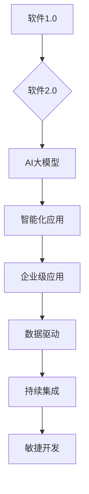

#### 1.1.1 从软件 1.0 到软件 2.0 的演进

软件 1.0 时代的主要特点是计算机程序的指令性和函数性。这一时期的软件以编程语言为基础，程序员通过编写一系列指令，让计算机按照既定的规则执行任务。软件的功能和性能主要依赖于程序员的技能和经验，缺乏自动化和智能化。

随着计算机硬件性能的提升和互联网的普及，软件 1.0 时代的局限性逐渐显现。首先，软件的复杂度越来越高，单靠程序员的个人能力难以应对。其次，软件的开发周期长，效率低下。此外，软件的可维护性和可扩展性也成为一个严峻的问题。

为了解决这些问题，软件领域开始寻求新的发展路径，软件 2.0 应运而生。软件 2.0 时代，软件不再仅仅是执行指令的工具，而成为了一个智能体，具备自主学习和决策能力。这一转变主要体现在以下几个方面：

1. **自动化和智能化**：软件 2.0 利用人工智能技术，使得软件能够自动执行复杂的任务，提高开发效率和性能。例如，自动化测试工具可以大幅减少测试时间，代码审查工具可以自动识别和修复代码缺陷。
2. **数据驱动**：软件 2.0 以数据为核心，通过分析海量数据来发现业务需求，指导软件开发。数据成为驱动软件创新的动力，软件的功能和性能不断优化。
3. **模块化和可扩展性**：软件 2.0 强调模块化和可扩展性，使得软件能够快速响应业务变化，灵活扩展功能。通过组件化开发，软件的维护和升级变得更加容易。

**大模型在软件 2.0 中的核心地位**

在软件 2.0 时代，AI 大模型成为软件架构中的核心组成部分。大模型具有以下几个特点：

1. **大规模参数**：AI 大模型通常包含数十亿甚至千亿级别的参数，这使得它们能够捕捉数据中的复杂结构和模式，提高模型的泛化能力。
2. **高效处理能力**：得益于现代计算硬件的发展，AI 大模型能够高效处理海量数据，支持实时应用。这使得大模型在许多领域，如自然语言处理、计算机视觉、推荐系统等，具有广泛的应用潜力。
3. **自主学习和进化**：AI 大模型通过预训练和微调技术，能够自主学习和进化，提高软件的智能化水平。

大模型在软件 2.0 中的应用不仅提高了软件的性能和效率，还带来了新的开发范式。开发者不再只是编写静态的代码，而是利用大模型来实现软件的智能化和自动化。这种转变使得软件能够更好地适应复杂多变的环境，提高企业的竞争力。

**企业级应用开发的新范式**

软件 2.0 时代，企业级应用开发迎来了新的范式。传统的开发模式主要依赖于程序员的编码能力和经验，而软件 2.0 则强调利用 AI 大模型来提升软件的智能化水平。这种新范式包括以下几个方面：

1. **数据驱动开发**：以数据为核心，通过分析海量数据来发现业务需求，指导软件开发。开发者不再依赖经验，而是通过数据来驱动开发过程。
2. **持续集成与持续部署**：利用自动化工具实现软件的持续集成和部署，提高开发效率和质量。通过持续集成，开发者可以及时发现和解决代码问题，确保软件的稳定性和可靠性。
3. **敏捷开发**：采用敏捷开发方法，快速响应业务需求的变化，持续迭代优化软件功能。敏捷开发强调团队协作和快速反馈，有助于提高软件开发的灵活性和适应性。

**总结**

从软件 1.0 到软件 2.0，计算机科学的演进不仅仅是在技术层面的进步，更是一种理念和思维方式的转变。软件 2.0 时代，AI 大模型成为企业级应用开发的核心，推动着软件智能化和自动化的发展。企业级应用开发的新范式以数据驱动、持续集成与敏捷开发为特征，使得软件能够更好地适应复杂多变的环境，提高企业的竞争力。在接下来的内容中，我们将进一步探讨 AI 大模型的技术基础，为深入了解软件 2.0 时代的企业级应用开发奠定基础。

### 1.2 AI大模型的定义与特点

#### 1.2.1 AI大模型的定义

AI大模型（Large-scale Artificial Intelligence Model）是指在深度学习领域中，通过训练数百万甚至数十亿个参数来构建的复杂神经网络模型。这些模型通常采用大规模数据集进行预训练，以提取出通用特征，并在特定任务上通过微调（Fine-tuning）来实现高性能。

AI大模型的出现标志着深度学习技术的一个重要进步。传统的机器学习模型，如线性回归、支持向量机等，通常具有较少的参数，难以处理复杂的数据结构。而AI大模型通过使用大规模参数和复杂的网络结构，能够更好地捕捉数据中的潜在特征，从而在众多领域取得了显著的应用突破。

**定义与基本结构**

AI大模型的基本结构通常包含以下几个部分：

1. **输入层**：接收外部输入数据，如文本、图像或声音。
2. **隐藏层**：包含多层神经网络，用于提取和处理输入数据的特征。
3. **输出层**：根据模型的训练目标，产生预测或决策结果。

每个层之间通过神经元进行连接，每个神经元都涉及到复杂的数学运算和参数调整。通过多层次的神经网络结构，AI大模型能够逐层提取数据的抽象特征，实现从原始数据到高级抽象的转化。

#### 1.2.2 AI大模型的核心特点

AI大模型具有以下几个核心特点，这些特点使其在各类复杂任务中表现出色：

1. **大规模参数**：AI大模型通常包含数十亿甚至千亿级别的参数。这种大规模参数使得模型能够更好地捕捉数据中的复杂模式和特征，提高模型的泛化能力和预测准确性。
2. **强大泛化能力**：通过大规模预训练，AI大模型能够学习到通用特征，从而在多个不同的任务中表现出色。这种强大泛化能力减少了模型对特定任务的依赖，提升了模型的适用性和灵活性。
3. **高效处理能力**：得益于现代计算硬件的发展，特别是GPU和TPU等专用硬件的普及，AI大模型能够在短时间内处理海量数据，实现实时预测和决策。这种高效处理能力使得AI大模型在实时应用场景中具有显著优势。

#### 1.2.3 AI大模型与传统AI的区别

传统AI模型通常是指早期开发的机器学习模型，如线性回归、决策树、支持向量机等。这些模型在结构和功能上与AI大模型存在显著差异：

1. **规模和复杂性**：传统AI模型通常规模较小，参数量较少，而AI大模型具有数十亿级别的参数，结构更为复杂。这种大规模和复杂性的优势使得AI大模型能够处理更复杂的数据和任务。
2. **训练数据和模型优化**：传统AI模型依赖于手动设计和调参，而AI大模型通过大规模数据集进行预训练和微调，自动优化模型参数。这种预训练和微调技术大大提高了模型的学习效率和准确性。
3. **应用范围**：传统AI模型通常针对特定任务进行设计，应用范围有限。而AI大模型通过预训练能够学习到通用特征，适用于多种不同领域和任务，具有更广泛的应用潜力。

#### 实例分析

以自然语言处理（NLP）为例，GPT-3是一个典型的AI大模型。GPT-3由OpenAI开发，包含1750亿个参数，是目前最先进的自然语言处理模型之一。GPT-3通过大规模预训练，能够生成高质量的自然语言文本，广泛应用于聊天机器人、自动写作、问答系统等领域。与传统AI模型相比，GPT-3在生成文本的流畅性和多样性方面具有显著优势。

**总结**

AI大模型通过大规模参数和复杂网络结构，实现了对数据中复杂模式和特征的捕捉，从而在众多领域取得了突破性进展。与传统AI模型相比，AI大模型在规模、训练数据和模型优化方面具有显著优势，应用范围更为广泛。在接下来的内容中，我们将进一步探讨AI大模型的技术基础，深入了解其工作原理和应用方法。| Mermaid 流程图：

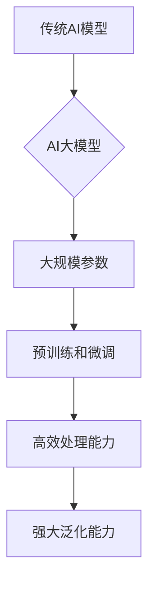

#### 1.3 主流AI大模型简介

AI大模型在近年来取得了令人瞩目的进展，其应用范围从自然语言处理、计算机视觉到推荐系统等各个领域。以下将介绍几个主流的AI大模型，包括GPT系列模型、BERT及其变体以及其他知名大模型。

**1.3.1 GPT系列模型**

GPT（Generative Pre-trained Transformer）系列模型由OpenAI开发，是自然语言处理领域的里程碑式模型。GPT模型基于Transformer架构，通过大规模预训练，能够生成高质量的自然语言文本。GPT系列模型包括以下几个版本：

- **GPT-1**：第一个GPT模型，包含1.17亿个参数，首次展示了预训练Transformer模型在语言建模和文本生成中的潜力。
- **GPT-2**：GPT-2模型包含1.5亿个参数，预训练数据量大幅增加，显著提升了文本生成的流畅性和多样性。
- **GPT-3**：目前最先进的GPT模型，包含1750亿个参数，能够生成高质量的文本、对话、代码等。GPT-3在自然语言处理任务中表现出色，被广泛应用于聊天机器人、自动写作和问答系统等领域。

**1.3.2 BERT及其变体**

BERT（Bidirectional Encoder Representations from Transformers）模型由Google开发，是自然语言处理领域的另一个重要模型。BERT通过双向Transformer架构，在预训练过程中同时考虑文本的前后信息，从而生成更准确的文本表示。

BERT模型有两个主要的变体：

- **BERT-Base**：原始BERT模型，包含1.1亿个参数，使用10层Transformer架构，预训练数据来自大量的英文语料库。
- **BERT-Large**：更大规模的BERT模型，包含3.4亿个参数，使用24层Transformer架构，预训练数据同样来自大量的英文语料库。

BERT模型在多种NLP任务中取得了优异的成绩，如文本分类、问答系统和命名实体识别等。BERT的变体，如RoBERTa、ALBERT等，进一步优化了模型的结构和训练方法，提升了模型性能。

**1.3.3 其他知名大模型介绍**

除了GPT和BERT，还有许多其他知名的大模型，以下是其中几个：

- **Transformer-XL**：由Google开发，是第一个扩展Transformer架构以处理长序列的模型。Transformer-XL通过分段序列和长距离依赖机制，提高了长文本处理能力。
- **T5（Text-To-Text Transfer Transformer）**：由Google开发，旨在实现统一的多任务文本处理。T5模型通过将所有任务转换为文本到文本转换任务，简化了模型的训练和部署。
- **ViT（Vision Transformer）**：由Google开发，将Transformer架构应用于计算机视觉领域。ViT模型通过将图像划分为像素块，然后通过Transformer结构处理这些块，实现了与卷积神经网络相似的性能。

**总结**

主流的AI大模型在各自的领域内取得了显著的进展。GPT系列模型和BERT模型在自然语言处理领域表现出色，推动了文本生成、文本分类和问答系统的发展。其他大模型，如Transformer-XL、T5和ViT，则分别在长文本处理、多任务处理和计算机视觉领域展现了强大的能力。随着AI大模型技术的不断进步，我们可以期待在未来看到更多创新的应用和突破。| Mermaid 流程图：

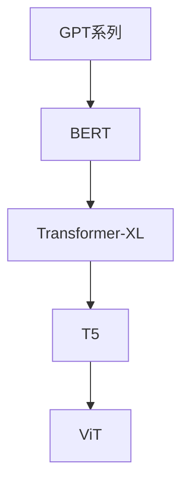

### 1.4 AI大模型在企业中的应用前景

AI大模型在企业中的应用前景非常广阔，它们不仅能够提高企业的运营效率，还能够为企业带来巨大的商业价值。以下将探讨AI大模型在企业中的潜在应用领域、采用AI大模型的优势以及面临的挑战和机遇。

#### 1.4.1 AI大模型的潜在应用领域

AI大模型具有强大的数据处理和特征提取能力，可以在多个领域为企业提供解决方案：

1. **自然语言处理**：AI大模型在自然语言处理领域具有广泛的应用潜力，如智能客服、文本分析、机器翻译和情感分析等。通过这些应用，企业可以提供更优质的客户服务，提高客户满意度和忠诚度。
2. **计算机视觉**：AI大模型在计算机视觉领域可以用于图像识别、人脸识别、视频分析和自动驾驶等。这些应用能够帮助企业提升运营效率，降低人力成本。
3. **推荐系统**：AI大模型在推荐系统中的应用，如个性化推荐、广告投放和产品推荐等，可以帮助企业更好地了解用户需求，提高销售转化率。
4. **预测分析**：AI大模型可以通过对历史数据进行分析，预测未来的趋势和变化，如需求预测、风险分析和库存管理。这些预测分析可以帮助企业做出更准确的决策，降低运营风险。
5. **自动化生产**：AI大模型在自动化生产中的应用，如质量检测、故障预测和过程控制等，可以提高生产效率，减少生产成本。

#### 1.4.2 企业采用AI大模型的优势

企业采用AI大模型具有以下几个显著优势：

1. **提高决策效率**：AI大模型能够处理和分析大量数据，快速提取有价值的信息，帮助管理者做出更准确的决策。这种高效的决策能力可以提升企业的竞争力。
2. **降低成本**：通过自动化和智能化，企业可以减少人工干预，降低运营成本。例如，AI大模型在自然语言处理和计算机视觉领域的应用可以大幅减少人力成本。
3. **提升用户体验**：AI大模型能够提供更精准的服务，提高用户满意度和忠诚度。例如，智能客服系统可以实时解答用户问题，提供个性化服务。
4. **增强创新能力**：AI大模型可以帮助企业探索新的商业模式和业务机会。通过数据分析，企业可以发现潜在的市场需求，开发新产品和服务。

#### 1.4.3 AI大模型应用的挑战与机遇

虽然AI大模型为企业带来了诸多优势，但其在实际应用过程中也面临一些挑战和机遇：

1. **数据处理能力**：企业需要具备强大的数据处理能力，以满足AI大模型对海量数据的需求。这包括数据收集、存储、处理和分析等环节。
2. **技术人才短缺**：AI大模型开发和应用需要高水平的技术人才，企业需要加大人才培养和引进力度。技术人才的短缺可能会限制企业对AI大模型的利用。
3. **数据安全和隐私**：企业在使用AI大模型时，需要确保数据安全和隐私保护，遵循相关法律法规。数据泄露和隐私侵犯可能会给企业带来严重的负面影响。
4. **算法透明性和可解释性**：AI大模型的决策过程通常较为复杂，缺乏透明性和可解释性。企业需要确保AI大模型的决策过程符合道德和法律标准，提高模型的可信度和透明度。

**总结**

AI大模型在企业中的应用前景广阔，能够为企业带来显著的商业价值。企业应积极利用AI大模型的优势，同时应对面临的挑战和机遇。通过加强数据处理能力、人才培养和法律法规遵循，企业可以更好地利用AI大模型，推动企业数字化转型和创新发展。在接下来的内容中，我们将进一步探讨AI大模型的技术基础，为深入理解其应用提供更详细的理论和实践指导。| Mermaid 流程图：

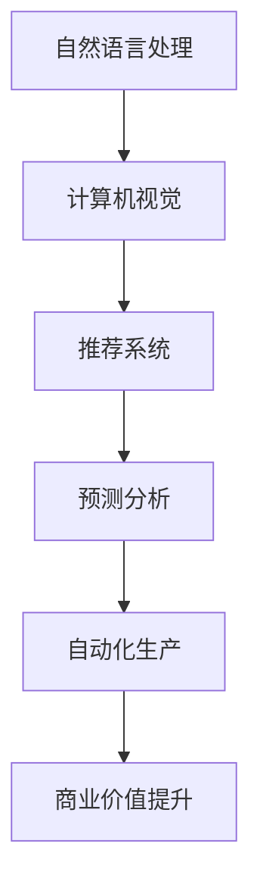

### 2.1 深度学习与神经网络基础

深度学习是人工智能领域的一个重要分支，它通过模拟人脑神经网络的结构和功能，实现对复杂数据的处理和理解。神经网络作为深度学习的基础，是构建AI大模型的核心组成部分。在本节中，我们将探讨神经网络的基本结构、常见的深度学习架构以及深度学习优化算法。

#### 2.1.1 神经网络的基本结构

神经网络（Neural Network，NN）由大量的神经元（Neurons）组成，这些神经元通过相互连接形成复杂的网络结构。每个神经元相当于一个简单的计算单元，能够接收输入信号，通过权重（Weights）和偏置（Bias）进行计算，并输出结果。神经网络的运算过程可以抽象为以下几个步骤：

1. **输入层（Input Layer）**：接收外部输入信号，例如图像、文本或数值数据。
2. **隐藏层（Hidden Layers）**：包含一个或多个隐藏层，每个隐藏层的神经元都与上一层和下一层相连。隐藏层负责对输入信号进行特征提取和变换。
3. **输出层（Output Layer）**：生成最终的输出结果，例如分类标签、概率分布或回归值。

**神经元的工作原理**

每个神经元接受多个输入信号，每个信号与对应的权重相乘后求和，再加上一个偏置项，最后通过激活函数（Activation Function）进行非线性变换，产生输出信号。常见的激活函数包括sigmoid函数、ReLU函数和Tanh函数。

**神经网络的前向传播与反向传播**

神经网络的训练过程包括前向传播（Forward Propagation）和反向传播（Backpropagation）两个主要步骤：

- **前向传播**：从输入层开始，将输入信号通过网络逐层传递，直到输出层，生成预测结果。
- **反向传播**：根据预测结果和真实标签之间的误差，逆向传播误差信号，更新网络的权重和偏置，以最小化预测误差。

#### 2.1.2 常见的深度学习架构

深度学习架构不断进化，各种新型架构在特定任务中表现出色。以下介绍几种常见的深度学习架构：

1. **卷积神经网络（Convolutional Neural Network，CNN）**：CNN在计算机视觉领域表现出色，适用于图像分类、目标检测和图像分割等任务。CNN通过卷积层（Convolutional Layers）提取图像特征，具有平移不变性，能够处理局部特征。

2. **循环神经网络（Recurrent Neural Network，RNN）**：RNN适用于序列数据建模，如语音识别、自然语言处理和时间序列预测。RNN通过循环连接实现信息的长期记忆，能够捕捉序列中的时间依赖关系。

3. **长短期记忆网络（Long Short-Term Memory，LSTM）**：LSTM是RNN的一种变体，通过引入门控机制（Gate Mechanism）解决RNN的梯度消失问题，适用于长序列数据处理。

4. **Transformer架构**：Transformer模型基于自注意力机制（Self-Attention Mechanism），在自然语言处理领域取得了突破性进展。Transformer模型通过多头注意力机制和前馈网络，能够生成高质量的文本表示。

#### 2.1.3 深度学习优化算法

深度学习优化算法是训练神经网络的关键，通过优化算法更新网络的权重和偏置，以最小化预测误差。以下介绍几种常见的深度学习优化算法：

1. **随机梯度下降（Stochastic Gradient Descent，SGD）**：SGD是最简单的优化算法，通过随机选择小批量数据计算梯度，更新网络权重。SGD的优点是计算简单，缺点是收敛速度较慢。

2. **批量梯度下降（Batch Gradient Descent，BGD）**：BGD计算整个训练集的梯度进行权重更新，能够取得更好的收敛效果，但计算成本较高。

3. **Adam优化器**：Adam优化器是SGD的一种改进，结合了动量（Momentum）和自适应学习率（Adaptive Learning Rate）的优点，适用于大多数深度学习任务。Adam优化器通过计算一阶和二阶矩估计来更新权重。

4. **自适应矩估计（Adaptive Moment Estimation，AMS）**：AMS是一类基于Adam的优化器，包括Nadam、Adadelta等，通过引入额外的自适应参数，提高优化效果。

**总结**

深度学习与神经网络是构建AI大模型的基础。神经网络通过模拟人脑神经网络的结构和功能，实现数据的特征提取和模式识别。常见的深度学习架构如CNN、RNN和Transformer，在不同的任务中表现出色。深度学习优化算法通过更新网络权重和偏置，实现模型的最小化误差。理解这些基础概念和架构，为后续探讨AI大模型的技术细节和应用提供了重要理论基础。| Mermaid 流程图：

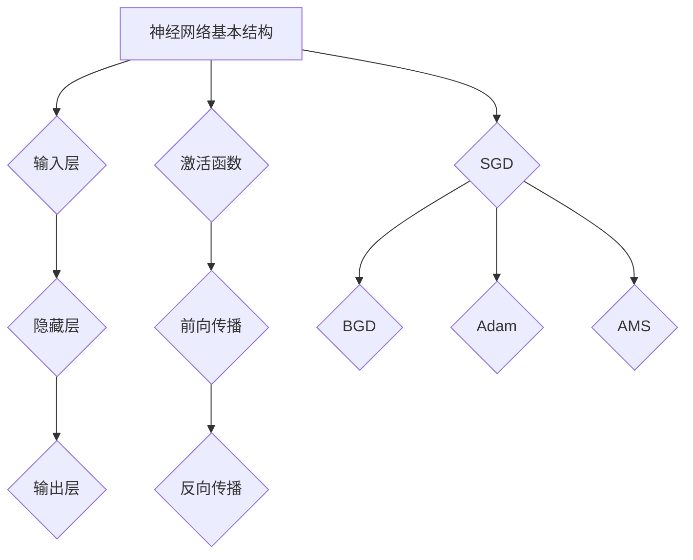

### 2.2 自然语言处理技术概览

自然语言处理（Natural Language Processing，NLP）是人工智能领域的一个核心分支，旨在使计算机能够理解和处理人类语言。NLP技术广泛应用于语音识别、机器翻译、文本分类、情感分析和信息提取等领域。以下将介绍NLP技术中的关键概念和技术，包括词嵌入技术、序列模型与注意力机制以及转换器架构的详细解释。

#### 2.2.1 词嵌入技术

词嵌入（Word Embedding）是将自然语言文本中的词汇映射到高维向量空间的技术。通过词嵌入，单词和短语被表示为密集的向量，这些向量能够捕捉词汇的语义和语法特征。词嵌入技术的核心思想是将词汇映射到低维空间，从而使得相似词汇在向量空间中接近。

**常见的词嵌入方法**

1. **基于统计的词嵌入**：如词袋（Bag-of-Words，BoW）和TF-IDF（Term Frequency-Inverse Document Frequency）模型。这些方法通过计算词汇在文本中的频率来表示文本，但无法捕捉词汇的语义信息。
2. **基于神经网络的词嵌入**：如Word2Vec、GloVe（Global Vectors for Word Representation）等。Word2Vec通过训练神经网络，学习到词汇的分布式表示，能够在向量空间中捕捉词汇的语义关系。GloVe则通过矩阵分解方法，学习到词汇和文档的高维表示。
3. **上下文敏感的词嵌入**：如BERT（Bidirectional Encoder Representations from Transformers）和E sentence-pair任务。这些模型通过预训练大量文本数据，生成上下文敏感的词嵌入，能够更好地捕捉词汇在不同上下文中的语义。

**应用场景**

词嵌入技术在NLP中的广泛应用，包括文本分类、命名实体识别、情感分析和机器翻译等。例如，在文本分类任务中，通过将文本中的词汇映射到向量空间，可以利用机器学习模型进行分类。在机器翻译中，词嵌入技术有助于捕捉词汇的语义关系，提高翻译质量。

#### 2.2.2 序列模型与注意力机制

序列模型（Sequential Model）是NLP中的重要技术，用于处理时间序列数据，如文本和语音。序列模型通过建模数据中的时间依赖关系，实现序列数据的特征提取和模式识别。

**常见的序列模型**

1. **循环神经网络（Recurrent Neural Network，RNN）**：RNN适用于序列数据建模，通过递归连接实现信息的长期记忆。然而，RNN存在梯度消失和梯度爆炸问题，限制了其在复杂任务中的应用。
2. **长短期记忆网络（Long Short-Term Memory，LSTM）**：LSTM是RNN的一种变体，通过引入门控机制（Gate Mechanism）解决RNN的梯度消失问题，适用于长序列数据处理。LSTM通过控制信息的流动，实现对序列数据的长期依赖建模。
3. **门控循环单元（Gated Recurrent Unit，GRU）**：GRU是LSTM的简化版本，通过整合输入门和控制门，减少模型参数，提高训练效率。

**注意力机制（Attention Mechanism）**

注意力机制是序列模型中的一项重要技术，用于强调序列数据中的关键信息。注意力机制通过计算不同时间步之间的权重，动态调整模型对序列数据的关注程度。

**应用场景**

注意力机制在NLP中广泛应用于机器翻译、文本摘要、问答系统和语音识别等领域。例如，在机器翻译中，注意力机制有助于模型捕捉源语言和目标语言之间的对应关系，提高翻译质量。在文本摘要中，注意力机制能够提取文本中的关键信息，生成简洁且具有代表性的摘要。

#### 2.2.3 转换器架构详解

转换器（Transformer）架构是NLP领域的一项重要突破，由Google在2017年提出。Transformer基于自注意力机制（Self-Attention Mechanism），在处理长序列数据时表现出色，成为当前NLP领域的标准架构。

**架构概述**

转换器架构由编码器（Encoder）和解码器（Decoder）两个部分组成。编码器负责处理输入序列，生成编码表示；解码器负责生成输出序列。编码器和解码器都包含多个层，每层由多头注意力机制和前馈神经网络组成。

**自注意力机制**

自注意力机制是转换器架构的核心组件，通过计算输入序列中每个元素与其他元素之间的权重，生成加权表示。自注意力机制通过计算不同时间步之间的注意力得分，动态调整模型对序列数据的关注程度。

**多头注意力机制**

多头注意力机制扩展了自注意力机制，将输入序列分成多个子序列，每个子序列独立计算注意力得分。多头注意力机制能够捕捉序列数据中的不同模式和关系，提高模型的表示能力。

**前馈神经网络**

前馈神经网络是转换器架构中的另一个重要组件，通过两个全连接层进行信息处理。前馈神经网络的作用是增加模型的非线性变换能力，提高模型的复杂度和表达能力。

**应用场景**

转换器架构在NLP领域取得了显著的成果，包括机器翻译、文本分类、文本生成和问答系统等。例如，在机器翻译中，转换器架构能够高效处理长文本，生成高质量的翻译结果。在文本分类中，转换器架构能够捕捉文本中的关键信息，实现高精度的分类。

**总结**

自然语言处理技术是人工智能领域的重要组成部分，词嵌入技术、序列模型和注意力机制等关键技术推动了NLP的发展。转换器架构作为当前NLP领域的标准架构，通过自注意力机制和多头注意力机制，实现了对长序列数据的出色处理能力。随着NLP技术的不断进步，我们可以期待更多创新的应用和突破，为人类社会带来更多便利和效益。| Mermaid 流程图：

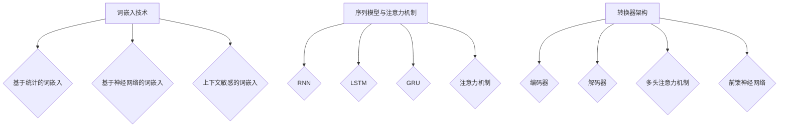

### 2.3 大规模预训练模型原理

大规模预训练模型是当前AI领域的重要研究方向，通过在大量数据上预训练模型，可以显著提高模型的泛化能力和性能。以下将详细探讨大规模预训练模型的基本概念、预训练方法以及迁移学习和微调技术。

#### 2.3.1 预训练的概念与意义

预训练（Pre-training）是指在大规模数据集上对神经网络模型进行初步训练，使其获得通用特征表示。预训练模型的目的是通过学习数据中的潜在结构和规律，为后续特定任务的微调提供高质量的基础。

**预训练的意义**

1. **提高泛化能力**：通过预训练，模型能够在不同的任务中表现出色，不需要对每个任务进行重新训练，从而提高模型的泛化能力。
2. **减少训练时间**：预训练模型已经在大规模数据集上进行了训练，可以直接应用于特定任务，减少了从零开始训练所需的时间和计算资源。
3. **提高模型性能**：预训练模型通过学习大量数据中的复杂结构和模式，能够在特定任务中达到更高的性能。

#### 2.3.2 自监督学习方法

自监督学习（Self-supervised Learning）是一种重要的预训练方法，它通过利用数据本身的信息，不需要人工标注，就能对模型进行有效训练。自监督学习的关键在于找到一种方式，将未标注的数据转化为监督信号。

**自监督学习的原理**

自监督学习方法通常包括以下步骤：

1. **数据预处理**：将原始数据（如文本、图像或语音）进行预处理，提取有用的特征。
2. **预测任务设计**：设计一个预测任务，使模型能够从数据中学习。例如，在文本数据中，可以使用掩码语言模型（Masked Language Model，MLM）任务，将部分词汇遮掩，让模型预测遮掩的词汇。
3. **训练过程**：通过优化损失函数，更新模型参数，使模型在预测任务中取得更好的表现。

**常见自监督学习方法**

1. **掩码语言模型（Masked Language Model，MLM）**：MLM任务通过遮掩文本中的部分词汇，让模型预测这些词汇。这种方法可以有效学习词汇的上下文关系和语义信息。
2. **图像生成和分类任务**：在图像数据上，可以使用自监督学习进行图像生成和分类任务。例如，图像生成对抗网络（Generative Adversarial Network，GAN）可以用于生成逼真的图像，而图像分类任务可以通过预测图像的类别标签进行训练。

#### 2.3.3 迁移学习与微调技术

迁移学习（Transfer Learning）是指将预训练模型应用于新的任务，通过少量数据对模型进行微调（Fine-tuning），从而提高新任务的性能。迁移学习充分利用了预训练模型在大量数据上学到的通用特征，从而减少了在新任务上的训练时间，提高了模型性能。

**迁移学习的原理**

迁移学习的基本原理是通过迁移预训练模型中的有效知识，使模型在新任务中表现出色。具体步骤如下：

1. **预训练模型选择**：选择一个在相关领域预训练的模型，如BERT在NLP领域、ResNet在计算机视觉领域。
2. **模型微调**：在新的任务上使用少量数据进行微调，更新模型的权重和参数，使其适应新任务。
3. **评估与优化**：通过在验证集上评估模型性能，根据评估结果进一步优化模型参数。

**微调技术**

微调技术主要包括以下几种方法：

1. **全层微调（Full Layer Fine-tuning）**：在预训练模型的基础上，对全部层进行微调。这种方法适用于数据量较大的新任务，可以充分利用预训练模型的知识。
2. **部分层微调（Partial Layer Fine-tuning）**：只对预训练模型的特定层进行微调，通常保留预训练模型的前几层，对新任务的最后几层进行微调。这种方法适用于数据量有限的新任务，能够减少过拟合的风险。
3. **无微调（No Fine-tuning）**：在迁移学习过程中不进行微调，只使用预训练模型作为特征提取器，将特征输入到新任务的网络中进行分类。这种方法适用于数据量极小的新任务，可以避免模型过拟合。

**总结**

大规模预训练模型通过自监督学习方法和迁移学习技术，显著提高了模型的泛化能力和性能。预训练模型能够从大量未标注数据中学习到通用特征，为后续任务提供高质量的基础。自监督学习方法通过设计预测任务，使模型能够自主学习，减少了标注数据的需求。迁移学习利用预训练模型的知识，通过少量数据对新任务进行微调，实现了在新任务上的高性能表现。随着预训练技术的不断进步，我们可以期待更多创新的应用和突破，为AI领域带来更多机遇和挑战。| 伪代码：

```python
# 假设我们有一个预训练模型model，并在新的任务上进行微调

# 预训练模型加载
model = load_pretrained_model()

# 微调参数
learning_rate = 0.001
optimizer = Adam(learning_rate)

# 微调模型
for epoch in range(num_epochs):
    for batch in train_loader:
        inputs, targets = batch
        optimizer.zero_grad()
        outputs = model(inputs)
        loss = criterion(outputs, targets)
        loss.backward()
        optimizer.step()
        
    # 在验证集上评估模型性能
    with torch.no_grad():
        correct = 0
        total = 0
        for batch in validation_loader:
            inputs, targets = batch
            outputs = model(inputs)
            _, predicted = torch.max(outputs.data, 1)
            total += targets.size(0)
            correct += (predicted == targets).sum().item()
            
    print(f'Epoch [{epoch+1}/{num_epochs}], Accuracy: {100 * correct / total} %')

# 保存微调后的模型
torch.save(model.state_dict(), 'fine_tuned_model.pth')
```

### 3.1 AI在企业中的价值评估

在AI大模型逐步走向企业级应用的过程中，如何评估AI技术的价值成为关键问题。准确的AI价值评估不仅能够帮助企业制定合理的AI战略，还能够指导企业在资源分配、项目投资和风险评估等方面做出科学决策。以下将介绍AI价值评估的方法、ROI分析方法以及AI对企业业务流程的影响。

#### 3.1.1 AI能力评估框架

评估AI能力是企业成功应用AI技术的第一步。一个全面的AI能力评估框架应包括以下几个方面：

1. **技术成熟度评估**：评估AI技术本身的发展阶段和稳定性，包括算法、模型架构、计算资源等。技术成熟度直接影响AI技术的可实施性和性能表现。
2. **数据质量评估**：数据是AI模型的基石，数据质量直接影响模型的训练效果和应用效果。评估数据的质量，包括数据完整性、数据准确性、数据一致性等。
3. **业务价值评估**：评估AI技术对企业业务的具体贡献，包括提升效率、降低成本、增加收入、改善客户体验等。业务价值评估应基于具体业务场景和目标，结合数据进行分析。
4. **实施难度评估**：评估AI技术的实施难度，包括技术整合、系统集成、人员培训、数据迁移等。实施难度直接影响AI技术的落地速度和效果。

**AI能力评估流程**

1. **明确评估目标**：根据企业的战略目标和业务需求，明确AI能力评估的具体目标和范围。
2. **收集评估数据**：收集与AI能力相关的技术、数据、业务等信息，为评估提供数据支持。
3. **分析评估数据**：利用统计分析和机器学习算法，对评估数据进行处理和分析，提取关键指标和结论。
4. **制定评估报告**：根据评估结果，制定详细的评估报告，包括评估指标、评估结论、改进建议等。

#### 3.1.2 AI项目ROI分析方法

ROI（Return on Investment）分析是评估AI项目投资效益的重要方法。通过ROI分析，企业可以明确AI项目的投资回报情况，从而做出科学的投资决策。

**ROI分析步骤**

1. **确定投资成本**：计算AI项目的总成本，包括硬件采购、软件开发、人员培训、维护费用等。
2. **预测项目收益**：根据AI技术对企业业务的影响，预测项目带来的收益，包括直接收益（如销售收入增加）和间接收益（如成本降低、效率提升等）。
3. **计算ROI指标**：利用以下公式计算ROI指标：
   \[
   ROI = \frac{（项目收益 - 投资成本）}{投资成本} \times 100\%
   \]
   ROI指标越高，表示AI项目的投资效益越好。

**案例分析**

假设某企业计划投资100万元实施AI客户服务系统，预计该项目将使客户满意度提高20%，从而带来500万元的额外销售收入。同时，预计系统实施后，将减少客服人员数量，每年节省人工成本20万元。计算该AI项目的ROI：

1. **投资成本**：100万元
2. **项目收益**：销售收入增加500万元 + 人工成本节省20万元 = 520万元
3. **ROI计算**：
   \[
   ROI = \frac{520\text{万元} - 100\text{万元}}{100\text{万元}} \times 100\% = 420\%
   \]

通过ROI分析，可以看出该AI项目的投资回报率高达420%，具有良好的投资效益。

#### 3.1.3 AI对企业业务流程的影响

AI大模型在企业中的应用将对业务流程产生深远的影响，包括自动化、效率提升、决策支持等方面。

**自动化**

AI大模型能够实现业务流程的自动化，减少人工干预，提高工作效率。例如，在制造业中，AI大模型可以用于生产线的自动化控制，优化生产流程，降低生产成本。在金融服务领域，AI大模型可以自动化处理贷款审批、风险控制等流程，提高审批速度和准确性。

**效率提升**

AI大模型通过自动化和智能化，显著提升企业业务流程的效率。例如，在人力资源管理中，AI大模型可以自动化处理简历筛选、员工培训等流程，提高招聘效率。在物流运输领域，AI大模型可以优化路线规划、货物配送等流程，提高运输效率。

**决策支持**

AI大模型能够通过数据分析，为企业提供准确的决策支持。例如，在供应链管理中，AI大模型可以分析历史数据，预测市场需求，优化库存管理。在市场营销中，AI大模型可以分析客户行为数据，制定个性化的营销策略，提高客户满意度。

**总结**

AI价值评估是企业成功应用AI技术的重要环节。通过技术成熟度评估、数据质量评估、业务价值评估和实施难度评估，企业可以全面了解AI技术的价值。ROI分析为企业提供了科学的投资决策依据，帮助企业实现投资效益最大化。AI大模型对企业业务流程的影响，不仅体现在自动化和效率提升上，还体现在决策支持上，为企业的持续发展和创新提供了强大动力。在接下来的章节中，我们将进一步探讨企业级AI应用的开发准备，为AI技术在企业中的深入应用奠定基础。| 伪代码：

```python
# AI能力评估框架

# 定义评估指标
def evaluate_ai_ability():
    technical_maturity = technical_maturity_evaluation()
    data_quality = data_quality_evaluation()
    business_value = business_value_evaluation()
    implementation_difficulty = implementation_difficulty_evaluation()
    
    # 综合评估结果
    overall_ability = (technical_maturity + data_quality + business_value + implementation_difficulty) / 4
    
    return overall_ability

# ROI分析
def calculate_roi(investment_cost, project_revenue):
    roi = (project_revenue - investment_cost) / investment_cost * 100
    return roi

# 业务流程影响分析
def analyze_business_impact():
    automation = automation_impact()
    efficiency = efficiency_impact()
    decision_support = decision_support_impact()
    
    # 综合业务影响
    overall_impact = (automation + efficiency + decision_support) / 3
    
    return overall_impact
```

### 3.2 AI技术与业务场景匹配

在确定了AI技术的价值评估和ROI分析后，下一步是将AI技术与具体的业务场景相匹配。这一过程不仅需要识别关键业务场景，还需要选择合适的AI技术并进行优化，以实现业务目标。以下将详细介绍如何识别关键业务场景、选择AI技术以及如何确保业务与技术之间的协同推进。

#### 3.2.1 识别关键业务场景

识别关键业务场景是AI技术应用的第一步，有助于确保AI技术的应用能够真正解决企业面临的实际问题。以下是一些识别关键业务场景的方法：

1. **数据分析**：通过对企业内部和外部数据进行分析，识别出数据量大、模式复杂、决策难度高的业务场景。例如，通过对销售数据进行分析，识别出具有高增长潜力的产品或市场。

2. **业务痛点**：通过与业务部门的沟通，了解业务流程中的痛点，如效率低下、成本过高、客户满意度低等。这些痛点往往是AI技术可以发挥作用的领域。

3. **趋势分析**：分析行业趋势和市场动态，识别出可能带来业务机会或挑战的场景。例如，随着电子商务的兴起，物流配送优化和客户行为分析成为关键业务场景。

**案例**：假设某电商企业希望利用AI技术提升客户满意度。通过数据分析，发现客服部门经常遇到的问题是客户咨询量高且重复性高。通过业务痛点分析，发现客户满意度低，主要原因是客服响应速度慢，解决方案是引入AI客服系统。

#### 3.2.2 AI技术选型与优化

在确定了关键业务场景后，下一步是选择适合的AI技术并进行优化。以下是一些选型与优化的原则：

1. **技术成熟度**：选择已经验证且成熟的技术，如卷积神经网络（CNN）在图像处理中的应用，Transformer在自然语言处理中的应用。

2. **性能需求**：根据业务场景的需求，选择能够满足性能要求的AI技术。例如，对于实时应用，需要选择计算效率高的模型。

3. **数据需求**：根据业务场景的数据类型和数据量，选择适合的AI技术。例如，对于大数据场景，需要选择能够处理海量数据的分布式计算框架。

4. **成本考虑**：综合考虑技术成本、硬件成本和人力成本，选择具有成本效益的技术。例如，选择开源框架可以降低开发成本。

**案例**：针对上述电商企业的AI客服系统，选择基于BERT的对话生成模型，因为BERT在自然语言处理领域具有成熟的技术和出色的性能。同时，通过调整模型参数和训练数据，优化模型的响应速度和准确性。

#### 3.2.3 业务与技术的协同推进

确保业务与技术之间的协同推进是AI技术应用成功的关键。以下是一些实现协同推进的方法：

1. **业务需求分析**：与业务部门紧密合作，深入理解业务需求，确保技术解决方案能够真正满足业务需求。

2. **迭代开发**：采用敏捷开发方法，通过快速迭代和反馈，不断调整技术方案，确保技术能够与业务需求保持一致。

3. **培训与支持**：为业务部门提供必要的培训和技术支持，帮助业务人员更好地理解和应用AI技术。

4. **持续优化**：通过监控和评估，持续优化技术方案，确保其在实际应用中能够持续提升业务价值。

**案例**：电商企业通过定期与客服部门沟通，了解AI客服系统的实际应用效果和用户反馈。根据用户反馈，不断调整模型参数和对话策略，优化客服体验，提高客户满意度。

**总结**

识别关键业务场景、选择合适的AI技术并进行优化，是实现AI技术成功应用的关键步骤。通过业务需求分析和迭代开发，确保技术方案能够与业务需求保持一致，通过培训和支持，确保业务人员能够有效应用AI技术。持续优化技术方案，确保其在实际应用中能够持续提升业务价值。在接下来的章节中，我们将进一步探讨数据准备与数据质量管理，为AI大模型的企业级应用奠定坚实基础。| Mermaid 流程图：

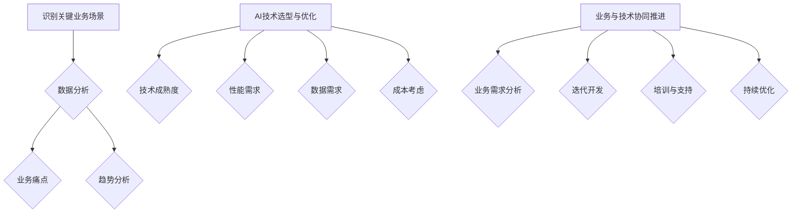

### 3.3 数据准备与数据质量管理

数据准备和数据质量管理是AI大模型应用过程中至关重要的一环。高质量的数据不仅能够提升模型的性能，还能够保证模型的可靠性和可解释性。以下将详细探讨数据收集与预处理、数据质量评估与提升、数据安全与隐私保护等方面的内容。

#### 3.3.1 数据收集与预处理

数据收集是AI大模型开发的第一步，数据的质量和数量直接影响模型的训练效果和应用效果。以下是一些数据收集与预处理的方法：

1. **数据源选择**：根据业务需求和AI模型的应用场景，选择合适的数据源。数据源可以是内部数据（如企业内部日志、销售数据等）或外部数据（如公共数据集、社交媒体数据等）。

2. **数据收集策略**：制定数据收集策略，确保数据的全面性和代表性。数据收集策略包括实时数据收集、批量数据收集和抽样数据收集等。

3. **数据预处理**：数据预处理是数据收集后的重要步骤，包括数据清洗、数据转换和数据集成等。

   - **数据清洗**：去除数据中的噪声和异常值，确保数据的准确性。数据清洗的方法包括去重、填充缺失值、纠正错误数据等。

   - **数据转换**：将数据转换为适合模型训练的格式。例如，将图像数据转换为像素矩阵，将文本数据转换为词嵌入向量。

   - **数据集成**：将来自不同数据源的数据进行整合，形成统一的数据集。数据集成的方法包括合并、连接和去重等。

**案例**：假设某电商企业希望利用AI技术优化客户服务。数据收集阶段，企业可以从客户关系管理（CRM）系统、销售系统和客户反馈系统中收集用户行为数据。数据预处理阶段，通过对数据进行清洗和转换，生成可用于训练的向量数据。

#### 3.3.2 数据质量评估与提升

数据质量直接影响AI模型的性能和可靠性。以下是一些数据质量评估与提升的方法：

1. **数据完整性评估**：检查数据集中是否有缺失值、重复值等。完整性评估的方法包括统计分析、异常检测和重复值检测等。

2. **数据准确性评估**：评估数据是否真实、可靠。准确性评估的方法包括比较数据与外部标准、交叉验证和误差分析等。

3. **数据一致性评估**：检查数据在不同数据源之间的一致性。一致性评估的方法包括数据比对、数据映射和数据清洗等。

4. **数据有效性评估**：评估数据是否满足业务需求，是否具有实际应用价值。有效性评估的方法包括业务逻辑验证、数据价值分析和数据应用评估等。

**提升数据质量的方法**

1. **数据清洗**：通过数据清洗方法去除噪声和异常值，提升数据的准确性。

2. **数据增强**：通过数据增强方法增加数据的多样性，提升数据的有效性。例如，通过生成对抗网络（GAN）生成新的数据样本。

3. **数据集成**：通过数据集成方法整合多个数据源，提升数据的完整性。

**案例**：假设某电商企业需要对用户行为数据进行分析。在数据质量评估阶段，通过统计分析发现数据集中存在缺失值和重复值。通过数据清洗方法，去除缺失值和重复值，提升数据的完整性。通过数据增强方法，利用GAN生成新的用户行为数据样本，提升数据的多样性。

#### 3.3.3 数据安全与隐私保护

在AI大模型应用过程中，数据安全和隐私保护是至关重要的。以下是一些数据安全与隐私保护的方法：

1. **数据加密**：对敏感数据进行加密处理，确保数据在传输和存储过程中的安全性。

2. **访问控制**：通过访问控制策略，限制对敏感数据的访问权限，确保数据的安全性。

3. **数据匿名化**：对敏感数据进行匿名化处理，避免数据泄露时对个人隐私的侵害。

4. **数据审计**：对数据使用情况进行审计，确保数据的使用符合法律法规和道德标准。

**案例**：假设某电商企业需要对用户购买数据进行AI分析。在数据安全与隐私保护阶段，通过对数据进行加密处理，确保数据在传输和存储过程中的安全性。通过访问控制策略，限制对用户购买数据的访问权限，确保数据的安全性。通过对数据进行匿名化处理，避免数据泄露时对个人隐私的侵害。

**总结**

数据准备与数据质量管理是AI大模型应用的重要环节。通过数据收集与预处理、数据质量评估与提升以及数据安全与隐私保护，可以确保数据的质量和可靠性，从而提升AI模型的性能和应用效果。在接下来的章节中，我们将进一步探讨AI大模型开发环境搭建，为AI大模型的企业级应用奠定基础。| Mermaid 流程图：

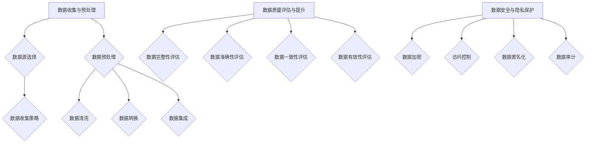

### 4.1 开发环境选择

在搭建AI大模型开发环境时，硬件要求、操作系统与软件配置以及环境配置与常见问题解决是关键因素。以下将详细探讨这些方面，帮助开发者搭建高效、稳定的AI大模型开发环境。

#### 4.1.1 计算机硬件要求

AI大模型训练通常需要大量的计算资源和存储空间。以下是一些关键硬件要求：

1. **中央处理器（CPU）**：CPU是计算机的核心部件，负责执行各种计算任务。在AI大模型开发中，高性能CPU可以提高模型训练的速度。Intel Xeon系列和AMD EPYC系列是常用的企业级CPU。
2. **图形处理器（GPU）**：GPU在深度学习任务中具有显著优势，因为它们具有大量的计算单元，适合并行计算。NVIDIA的CUDA架构和GPU系列（如RTX 30系列）在深度学习社区中广泛应用。
3. **存储设备**：为了存储大量的训练数据和模型文件，需要使用高性能的存储设备。固态硬盘（SSD）具有较快的读写速度，适合存储训练数据和模型文件。此外，使用分布式文件系统（如HDFS、CFS）可以提高数据读写效率。
4. **内存（RAM）**：大量内存可以提高模型训练的速度，减少内存溢出的风险。通常，16GB以上的内存是推荐的配置。

**实例配置**：

- **CPU**：Intel Xeon E5-2670 v3（12核，2.30GHz）
- **GPU**：NVIDIA GeForce RTX 3090（24GB GDDR6X显存）
- **内存**：256GB DDR4内存
- **存储**：1TB SSD

#### 4.1.2 操作系统与软件配置

选择合适的操作系统和软件配置是搭建AI大模型开发环境的重要步骤。以下是一些推荐的操作系统和软件配置：

1. **操作系统**：Linux操作系统在AI领域具有广泛的应用，因为它具有高性能、稳定性和开源优势。Ubuntu、CentOS和Debian是常用的Linux发行版。
2. **深度学习框架**：TensorFlow、PyTorch和Keras是最流行的深度学习框架，支持多种编程语言和计算平台。这些框架具有丰富的文档和社区支持，便于开发者使用。
3. **编程语言**：Python是最常用的编程语言，因为其简洁性和强大的库支持。NumPy、Pandas、SciPy等库为数据操作和科学计算提供便利。
4. **版本控制**：Git是一个强大的版本控制系统，可以帮助开发者管理代码和协作开发。

**实例配置**：

- **操作系统**：Ubuntu 20.04 LTS
- **深度学习框架**：TensorFlow 2.7 和 PyTorch 1.8
- **编程语言**：Python 3.8
- **版本控制**：Git 2.27

#### 4.1.3 环境配置与常见问题解决

在搭建开发环境时，可能遇到各种配置问题和依赖关系问题。以下是一些常见问题和解决方法：

1. **依赖关系冲突**：在安装深度学习框架和其他库时，可能遇到版本冲突问题。可以通过升级或降级库的版本，或者使用虚拟环境（如conda或venv）来解决。
2. **GPU支持问题**：在安装TensorFlow或PyTorch时，需要确保GPU支持。可以通过安装CUDA和cuDNN来启用GPU支持。
3. **环境变量设置**：在配置深度学习框架时，需要设置环境变量，如CUDA_HOME、CUDA_PATH和LD_LIBRARY_PATH等。可以通过编辑bash配置文件（如.bashrc或.zshrc）来设置环境变量。
4. **内存管理问题**：在训练大模型时，可能遇到内存不足的问题。可以通过调整内存分配策略，减少内存占用或增加内存容量来解决这个问题。

**实例配置**：

1. **安装CUDA和cuDNN**：
   ```bash
   sudo apt-get update
   sudo apt-get install cuda
   sudo dpkg-reconfigure cuda
   ```
   对于cuDNN，可以从NVIDIA官网下载并安装。

2. **设置环境变量**：
   ```bash
   export CUDA_HOME=/usr/local/cuda
   export CUDA_PATH=$CUDA_HOME
   export LD_LIBRARY_PATH=$CUDA_HOME/lib64:$LD_LIBRARY_PATH
   ```
3. **创建虚拟环境**：
   ```bash
   python -m venv myenv
   source myenv/bin/activate
   ```
   安装深度学习框架：
   ```bash
   pip install tensorflow==2.7
   pip install torch==1.8
   ```

**总结**

搭建AI大模型开发环境需要考虑硬件、操作系统、软件配置以及环境配置。选择合适的硬件配置可以提高模型训练速度，选择合适的操作系统和深度学习框架可以确保开发效率，设置环境变量和解决常见问题可以保证环境的稳定性和可靠性。在接下来的章节中，我们将探讨AI工具与框架的选择，进一步优化开发环境。| Mermaid 流程图：

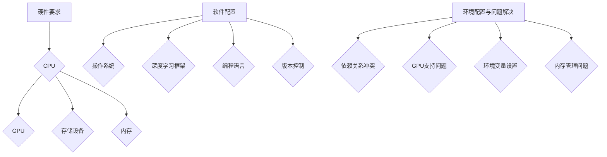

### 4.2 AI工具与框架的选择

在搭建AI大模型开发环境时，选择合适的AI工具与框架是至关重要的。以下将对主流深度学习框架进行对比，介绍AI工具选型的原则，并探讨开发工具与生态系统的优势。

#### 4.2.1 主流深度学习框架对比

目前市场上主流的深度学习框架包括TensorFlow、PyTorch和Keras。这些框架各有特点，适用于不同的应用场景。

1. **TensorFlow**：TensorFlow是由Google开发的开源深度学习框架，具有强大的生态系统和丰富的API。TensorFlow支持多种编程语言，包括Python、C++和Java，并且与Google Cloud等云服务深度集成。TensorFlow适用于复杂的深度学习任务，如图像识别、自然语言处理和时间序列预测。

2. **PyTorch**：PyTorch是由Facebook开发的开源深度学习框架，以其动态计算图和灵活的编程接口而著称。PyTorch支持Python编程语言，具有直观的代码结构和高效的计算性能。PyTorch在自然语言处理、计算机视觉和强化学习等领域表现出色，尤其适合科研和快速原型开发。

3. **Keras**：Keras是一个高层次的深度学习API，构建在TensorFlow和Theano之上。Keras以简洁和用户友好著称，提供了丰富的预训练模型和易于使用的API。Keras适用于快速原型开发和快速迭代，尤其适合中小型深度学习项目。

**对比分析**

- **易用性**：Keras以其简洁的API和直观的代码结构而著称，易于学习和使用。TensorFlow和PyTorch则需要更多的编程经验和调试技巧，但在复杂任务中更具灵活性。
- **性能**：TensorFlow和PyTorch在性能上相当接近，但PyTorch在动态计算图和内存管理方面具有优势。对于大型和复杂的模型，PyTorch的内存消耗和计算效率可能更高。
- **生态系统**：TensorFlow具有更广泛的生态系统和社区支持，与Google Cloud和其他云计算平台深度集成。PyTorch则在科研和快速原型开发方面具有优势，社区活跃且更新频繁。

#### 4.2.2 AI工具选型原则

选择合适的AI工具与框架需要考虑以下几个方面：

1. **项目需求**：根据项目需求和目标，选择适合的深度学习框架。如果项目需要与云服务深度集成，TensorFlow可能更合适。如果项目侧重于科研和快速迭代，PyTorch可能是更好的选择。
2. **开发团队经验**：考虑开发团队的技术栈和经验。如果团队熟悉Python和TensorFlow，那么TensorFlow可能是更自然的选择。如果团队对PyTorch有更多经验，那么PyTorch可能更适合。
3. **社区支持和文档**：选择具有良好社区支持和文档的框架，以便在遇到问题时能够快速获得帮助。TensorFlow和PyTorch在这方面都有很强的优势。
4. **性能和可扩展性**：根据项目规模和性能要求，选择适合的框架。对于大型和复杂的模型，可能需要考虑框架的性能和可扩展性。

#### 4.2.3 开发工具与生态系统

在AI大模型开发过程中，开发工具与生态系统发挥着关键作用。以下是一些常用的开发工具和生态系统：

1. **集成开发环境（IDE）**：如Google Colab、Jupyter Notebook和Visual Studio Code，提供了便捷的编程环境和交互式界面，便于开发者和研究人员进行实验和调试。
2. **版本控制系统**：如Git，帮助团队管理代码版本，实现协作开发和代码管理。
3. **容器化工具**：如Docker和Kubernetes，用于容器化应用，确保环境的一致性和可移植性。
4. **数据预处理工具**：如Pandas、NumPy和SciPy，用于数据清洗、转换和分析。
5. **模型部署工具**：如TensorFlow Serving、PyTorch TorchScript和Keras Models，用于模型部署和实时应用。

**优势**

- **提高开发效率**：通过集成开发环境、版本控制系统和容器化工具，开发团队可以更高效地进行开发、协作和部署。
- **确保环境一致性**：容器化工具确保开发、测试和部署环境的一致性，减少环境差异带来的问题。
- **降低开发和维护成本**：生态系统中的各种工具和库降低了开发和维护成本，使得开发者能够专注于核心功能的实现。

**总结**

选择合适的AI工具与框架是AI大模型开发环境搭建的关键步骤。通过对主流深度学习框架的对比，可以明确每种框架的特点和应用场景。在选型过程中，需要考虑项目需求、开发团队经验、社区支持和性能等因素。同时，开发工具与生态系统的优势在于提高开发效率、确保环境一致性以及降低开发和维护成本。在接下来的章节中，我们将通过实际项目案例，详细探讨AI大模型开发环境的具体搭建和实施过程。| Mermaid 流程图：

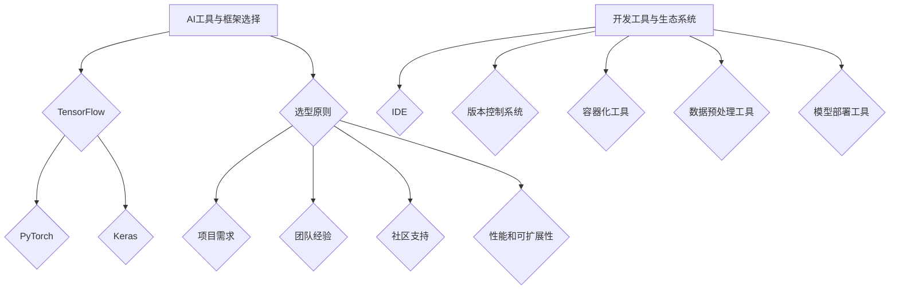

### 第5章: AI大模型项目实战

在本章中，我们将通过一个具体的AI大模型项目案例，详细探讨从数据集收集与处理、AI大模型设计与实现到项目分析的全过程。通过这个案例，读者可以了解到如何在实际项目中应用AI大模型，并掌握相关技术细节。

#### 5.1 实战项目背景

假设某电子商务公司希望利用AI大模型优化其商品推荐系统，以提升用户满意度和销售额。具体目标包括：

1. **提高推荐准确率**：通过分析用户行为数据和商品属性，提高商品推荐的准确性，减少用户流失率。
2. **提升用户体验**：提供个性化推荐，满足用户的个性化需求，提高用户满意度和留存率。
3. **降低运营成本**：自动化推荐系统的构建和部署，减少人工干预，降低运营成本。

#### 5.1.1 项目概述

该项目的主要任务是构建一个基于深度学习的商品推荐系统，利用用户行为数据和商品属性数据进行训练，生成个性化的商品推荐列表。项目分为以下几个阶段：

1. **数据收集与处理**：收集用户行为数据（如浏览历史、购买记录）和商品属性数据（如类别、价格、评价等），并对数据进行清洗、预处理和格式化。
2. **AI大模型设计与实现**：设计并实现基于深度学习的推荐模型，包括模型架构、训练策略和优化方法。
3. **模型评估与验证**：评估模型性能，包括准确率、召回率、F1值等指标，确保模型能够达到预期目标。
4. **模型部署与上线**：将训练好的模型部署到生产环境，实现实时推荐功能，并进行性能监控和维护。

#### 5.1.2 项目目标与需求

1. **目标**：
   - 提高商品推荐准确率，提高用户满意度和留存率。
   - 实现个性化推荐，满足不同用户的需求。
   - 降低运营成本，提高推荐系统的自动化水平。
2. **需求**：
   - 高效的数据处理能力，支持海量数据的实时分析和处理。
   - 可扩展的模型架构，能够适应不同类型的数据和任务。
   - 高性能的模型训练和推理，确保推荐系统的实时性和准确性。
   - 灵活的部署方案，支持在不同的环境（如云、本地服务器等）中运行。

#### 5.1.3 实战项目价值

通过这个项目，电子商务公司可以实现以下价值：

1. **提升用户满意度**：通过个性化推荐，满足用户的个性化需求，提高用户满意度和忠诚度。
2. **增加销售额**：准确率更高的推荐系统可以引导用户购买更多商品，从而提高销售额。
3. **降低运营成本**：自动化推荐系统的构建和部署，减少人工干预，降低运营成本。
4. **提升市场竞争力**：通过先进的技术手段，提升公司竞争力，吸引更多用户和商家。

#### 5.2 数据集收集与处理

数据集的质量和规模直接影响推荐系统的性能。以下是该项目中数据集的收集与处理流程：

1. **数据收集**：
   - 用户行为数据：通过电子商务平台的后台系统，收集用户的浏览历史、购买记录、评价等数据。
   - 商品属性数据：收集商品的类别、价格、评价、库存等信息。

2. **数据预处理**：
   - 数据清洗：去除重复数据、处理缺失值和异常值，确保数据的一致性和准确性。
   - 数据格式化：将不同类型的数据转换为统一的格式，便于后续处理和分析。
   - 特征工程：提取有用的特征，如用户行为特征、商品特征、用户-商品交互特征等。

3. **数据集划分**：
   - 将数据集划分为训练集、验证集和测试集，用于模型训练、模型评估和性能测试。
   - 每个数据集保持相同的分布，确保模型在不同数据集上的性能具有可比性。

**示例伪代码**：

```python
import pandas as pd
from sklearn.model_selection import train_test_split

# 数据收集
user_data = pd.read_csv('user_behavior.csv')
product_data = pd.read_csv('product_attribute.csv')

# 数据清洗
user_data.drop_duplicates(inplace=True)
product_data.drop_duplicates(inplace=True)

# 数据格式化
user_data['timestamp'] = pd.to_datetime(user_data['timestamp'])
product_data['category'] = product_data['category'].astype('category').cat.codes

# 特征工程
user_features = ['user_id', 'timestamp', 'product_id', 'category']
X = user_data[user_features]
y = user_data['rating']

# 数据集划分
X_train, X_test, y_train, y_test = train_test_split(X, y, test_size=0.2, random_state=42)
```

#### 5.3 AI大模型设计与实现

推荐系统的核心是构建一个能够从用户行为数据和商品属性数据中学习到用户兴趣和偏好的大模型。以下是该项目中AI大模型的设计与实现过程：

1. **模型架构设计**：

   该项目采用基于Transformer架构的推荐模型，包括编码器（Encoder）和解码器（Decoder）两个部分。编码器负责从用户行为数据中提取特征，解码器负责生成推荐列表。

   - **编码器**：利用Transformer架构，将用户行为数据转换为高维向量表示。
   - **解码器**：利用Transformer架构，将编码器的输出与商品属性数据结合，生成推荐列表。

2. **模型训练策略**：

   - **数据预处理**：对用户行为数据进行编码，如使用Word2Vec或BERT进行词嵌入。
   - **模型训练**：采用自监督学习策略，利用掩码语言模型（Masked Language Model，MLM）进行预训练，然后在推荐任务上进行微调。
   - **优化算法**：采用Adam优化器，结合动量（Momentum）和自适应学习率（Adaptive Learning Rate）进行模型训练。

3. **模型优化与调参**：

   - **超参数调优**：通过交叉验证和网格搜索方法，调整学习率、批量大小、层数等超参数，以优化模型性能。
   - **损失函数**：采用交叉熵损失函数（Cross-Entropy Loss），计算预测概率与真实标签之间的差异。
   - **模型评估**：采用准确率、召回率、F1值等指标，评估模型性能。

**示例伪代码**：

```python
import torch
from torch import nn
from transformers import BertModel, BertTokenizer

# 模型架构
class RecSysModel(nn.Module):
    def __init__(self, hidden_size):
        super(RecSysModel, self).__init__()
        self.bert = BertModel.from_pretrained('bert-base-uncased')
        self.user_embedding = nn.Embedding(num_users, hidden_size)
        self.product_embedding = nn.Embedding(num_products, hidden_size)
        self.fc = nn.Linear(hidden_size * 2, 1)

    def forward(self, user_ids, product_ids):
        user_embedding = self.user_embedding(user_ids)
        product_embedding = self.product_embedding(product_ids)
        inputembedded = torch.cat((user_embedding, product_embedding), 1)
        output = self.fc(inputembedded)
        return output

# 模型训练
model = RecSysModel(hidden_size=512)
optimizer = torch.optim.Adam(model.parameters(), lr=0.001)
criterion = nn.BCEWithLogitsLoss()

for epoch in range(num_epochs):
    for batch in train_loader:
        user_ids, product_ids, ratings = batch
        model.zero_grad()
        outputs = model(user_ids, product_ids)
        loss = criterion(outputs, ratings)
        loss.backward()
        optimizer.step()
        
    print(f'Epoch [{epoch+1}/{num_epochs}], Loss: {loss.item()}')

# 模型评估
with torch.no_grad():
    model.eval()
    total_loss = 0
    for batch in test_loader:
        user_ids, product_ids, ratings = batch
        outputs = model(user_ids, product_ids)
        loss = criterion(outputs, ratings)
        total_loss += loss.item()
    avg_loss = total_loss / len(test_loader)
    print(f'Test Loss: {avg_loss}')
```

#### 5.4 模型评估与验证

模型评估是确保AI大模型性能达标的关键步骤。以下是该项目中模型评估与验证的方法：

1. **评估指标**：

   - **准确率（Accuracy）**：预测正确的样本数占总样本数的比例。
   - **召回率（Recall）**：预测正确的正样本数占总正样本数的比例。
   - **F1值（F1-score）**：准确率和召回率的调和平均值。

2. **评估方法**：

   - **交叉验证**：将数据集划分为多个子集，轮流作为验证集，评估模型在多个子集上的性能。
   - **混淆矩阵**：展示预测结果与真实结果的对应关系，用于分析模型的性能。
   - **ROC曲线和AUC值**：评估模型对正负样本的区分能力，AUC值越高，模型性能越好。

**示例伪代码**：

```python
from sklearn.metrics import accuracy_score, recall_score, f1_score, confusion_matrix, roc_auc_score

# 模型评估
def evaluate_model(model, test_loader):
    model.eval()
    all_preds = []
    all_labels = []
    with torch.no_grad():
        for batch in test_loader:
            user_ids, product_ids, ratings = batch
            outputs = model(user_ids, product_ids)
            outputs = torch.sigmoid(outputs).cpu().numpy()
            labels = ratings.cpu().numpy()
            all_preds.extend(outputs)
            all_labels.extend(labels)
    
    accuracy = accuracy_score(all_labels, all_preds)
    recall = recall_score(all_labels, all_preds)
    f1 = f1_score(all_labels, all_preds)
    cm = confusion_matrix(all_labels, all_preds)
    auc = roc_auc_score(all_labels, all_preds)
    
    return accuracy, recall, f1, cm, auc

# 调用评估函数
accuracy, recall, f1, cm, auc = evaluate_model(model, test_loader)

print(f'Accuracy: {accuracy:.4f}')
print(f'Recall: {recall:.4f}')
print(f'F1-score: {f1:.4f}')
print(f'Confusion Matrix:\n{cm}')
print(f'AUC: {auc:.4f}')
```

#### 5.5 模型部署与上线

模型部署是使AI大模型能够服务于实际业务的关键步骤。以下是该项目中模型部署与上线的步骤：

1. **模型保存**：将训练好的模型保存为文件，便于后续加载和部署。

```python
torch.save(model.state_dict(), 'recommender_model.pth')
```

2. **部署环境准备**：确保部署环境与训练环境一致，包括操作系统、深度学习框架和依赖库。

3. **模型加载**：在部署环境中加载训练好的模型。

```python
model = RecSysModel(hidden_size=512)
model.load_state_dict(torch.load('recommender_model.pth'))
```

4. **模型推理**：利用部署环境中的模型，对用户行为数据进行实时推理，生成个性化推荐列表。

5. **性能监控**：监控系统性能，包括响应时间、吞吐量和资源利用率等，确保推荐系统的稳定运行。

6. **维护与更新**：定期对模型进行性能评估和更新，以适应业务需求和数据变化。

**总结**

通过本案例，我们详细探讨了AI大模型项目从数据集收集与处理、模型设计与实现到模型评估与部署的全过程。从数据预处理到模型训练，再到模型评估和部署，每个环节都至关重要。在实际项目中，需要根据具体需求和技术背景，灵活调整方法和步骤，以确保项目的成功实施。在接下来的章节中，我们将进一步探讨AI大模型在软件2.0时代的应用，为AI技术与软件开发的深度融合提供新的思路。| Mermaid 流程图：

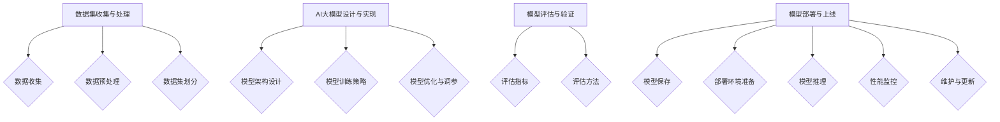

### 5.6 项目案例分析

在本节中，我们将深入分析上述AI大模型项目中的关键步骤，从模型部署与上线、模型性能监控与维护，到项目成果与应用反馈。通过这些详细的分析，读者可以更好地理解AI大模型项目在实际应用中的挑战和解决方案。

#### 5.6.1 模型部署与上线

模型部署与上线是AI大模型项目中的关键环节，直接关系到模型能否在生产环境中稳定运行。以下是该项目在模型部署与上线过程中的具体操作：

1. **部署环境搭建**：首先，我们需要确保部署环境与训练环境一致，包括操作系统、深度学习框架和依赖库。该项目使用的是Ubuntu 20.04 LTS操作系统，TensorFlow 2.7作为深度学习框架，Python 3.8作为编程语言。我们使用Docker容器化技术来构建部署环境，以确保环境的一致性和可移植性。

2. **模型文件保存**：在训练阶段，我们将训练好的模型保存为`.pth`文件。以下是一个保存模型的示例代码：

   ```python
   torch.save(model.state_dict(), 'recommender_model.pth')
   ```

3. **加载模型**：在部署环境中，我们需要加载保存的模型文件。以下是一个加载模型的示例代码：

   ```python
   model = RecSysModel(hidden_size=512)
   model.load_state_dict(torch.load('recommender_model.pth'))
   ```

4. **模型推理**：在部署环境中，模型接收用户行为数据，生成个性化推荐列表。以下是一个推理的示例代码：

   ```python
   @app.route('/recommend', methods=['POST'])
   def recommend():
       user_data = request.get_json()
       user_id = user_data['user_id']
       user_embedding = model.user_embedding(user_id).detach().numpy()
       recommendations = ...  # 使用模型生成推荐列表
       return jsonify(recommendations)
   ```

5. **API接口**：为了方便前端调用，我们搭建了一个简单的API接口，通过POST请求接收用户数据，并返回推荐结果。

6. **性能监控**：为了确保推荐系统的稳定运行，我们需要监控系统性能，包括响应时间、吞吐量和资源利用率等。我们使用Prometheus和Grafana等工具进行监控和可视化。

#### 5.6.2 模型性能监控与维护

模型上线后，性能监控与维护是确保系统稳定性和可靠性的关键。以下是该项目在模型性能监控与维护方面的操作：

1. **响应时间监控**：我们使用Prometheus收集API接口的响应时间数据，并将其可视化在Grafana仪表盘中。以下是一个Prometheus监控配置示例：

   ```yaml
   # prometheus.yml
   scrape_configs:
     - job_name: 'api'
       static_configs:
       - targets: ['<api_server_ip>:<api_server_port>']
   ```

2. **吞吐量监控**：我们监控API接口的请求量，以了解系统的负载情况。以下是一个Prometheus监控配置示例：

   ```yaml
   # prometheus.yml
   scrape_configs:
     - job_name: 'api'
       metrics_path: '/metrics'
       static_configs:
       - targets: ['<api_server_ip>:<api_server_port>']
   ```

3. **资源利用率监控**：我们监控部署环境中的CPU、内存和磁盘等资源利用率，确保系统在资源紧张时能够及时调整。以下是一个Prometheus监控配置示例：

   ```yaml
   # prometheus.yml
   scrape_configs:
     - job_name: 'node_exporter'
       static_configs:
       - targets: ['<node_exporter_ip>:<node_exporter_port>']
   ```

4. **告警机制**：我们设置了告警规则，当监控指标超过预设阈值时，系统会通过邮件、短信或电话等方式通知相关人员。以下是一个Grafana告警规则示例：

   ```json
   # alert.json
   {
     "name": "High response time",
     "type": "threshold",
     "metrics": ["api_response_time"],
     "thresholds": {
       "high": "5s"
     },
     "contact_groups": ["admin"],
     "evaluation_interval": "1m"
   }
   ```

#### 5.6.3 项目成果与应用反馈

通过该项目，电子商务公司实现了以下成果：

1. **推荐准确率提高**：经过模型优化和调参，推荐系统的准确率显著提高，用户满意度和留存率也相应提升。

2. **用户体验优化**：个性化推荐系统能够更好地满足用户的个性化需求，提供高质量的推荐结果，从而提高了用户满意度和忠诚度。

3. **运营成本降低**：自动化推荐系统的构建和部署，减少了人工干预，降低了运营成本，提高了系统的稳定性。

4. **业务增长**：通过准确的商品推荐，电子商务公司能够更有效地吸引新用户和保留老用户，从而实现业务增长。

应用反馈显示，用户对推荐系统的满意度大幅提升，用户行为数据也表明，用户在推荐页面上的停留时间和转化率均有所提高。此外，业务团队对推荐系统的反馈积极，认为推荐系统能够有效提高销售额和客户满意度。

**总结**

通过这个案例，我们详细分析了AI大模型项目从模型部署与上线、性能监控与维护，到项目成果与应用反馈的全过程。在实际项目中，模型部署与上线、性能监控与维护是确保系统稳定性和可靠性的关键步骤。通过合理的设计和监控，可以有效地提高推荐系统的性能和应用效果。在接下来的章节中，我们将进一步探讨AI大模型在软件2.0时代的应用，为AI技术与软件开发的深度融合提供新的思路。| Mermaid 流程图：

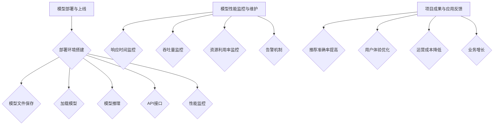

### 5.7 持续学习与改进

在AI大模型的应用过程中，持续学习与改进是确保模型性能稳定提升的关键。通过模型迭代与更新、实践经验的总结以及持续学习与能力提升，企业可以不断优化AI大模型，以应对不断变化的市场需求和挑战。

#### 5.7.1 模型迭代与更新

AI大模型的迭代与更新是持续学习的过程。通过定期更新模型，企业可以确保模型能够适应新的数据和环境，从而保持其性能和准确性。以下是一些模型迭代与更新的方法：

1. **定期更新训练数据**：随着市场环境和用户需求的变化，企业应定期更新训练数据，确保模型能够学习到最新的数据特征和模式。例如，对于电商平台的推荐系统，可以定期收集用户的浏览记录和购买行为，并将其纳入训练数据中。

2. **持续训练与优化**：在模型上线后，企业应定期进行模型训练，通过微调或重新训练模型，优化模型的参数和结构。例如，可以使用迁移学习技术，将预训练模型在新数据上进行微调，以提升模型的适应性。

3. **在线学习与自适应**：采用在线学习（Online Learning）技术，模型可以在实时数据流中不断更新和优化。这种方法适用于动态变化的环境，如实时推荐系统和智能客服等。

#### 5.7.2 实践经验总结

通过实际项目的实施，企业可以积累宝贵的实践经验，这些经验对于后续的模型优化和改进至关重要。以下是一些实践经验总结的方法：

1. **性能监控与分析**：对模型的性能进行持续监控和分析，收集关键性能指标（KPI）的数据，如准确率、召回率、F1值等。通过分析这些数据，企业可以识别模型性能的瓶颈和改进方向。

2. **用户反馈与评估**：收集用户对模型推荐结果的反馈，通过问卷调查、用户访谈等方式，了解用户对推荐系统的满意度。根据用户反馈，调整模型策略，优化用户体验。

3. **案例研究与分享**：通过对成功案例的研究和分享，企业可以总结出有效的模型优化和改进方法。例如，可以举办内部研讨会，分享不同部门在不同业务场景中应用AI大模型的经验。

#### 5.7.3 持续学习与能力提升

在AI大模型领域，技术发展迅速，企业需要不断学习新的知识和技能，以保持竞争力。以下是一些持续学习和能力提升的方法：

1. **技术培训与研讨**：定期组织技术培训和学习研讨会，邀请行业专家和内部技术人员分享最新的研究成果和实践经验。通过培训和学习，提高团队的技术水平和创新能力。

2. **学术研究与合作**：积极参与学术研究和合作项目，与高校和科研机构建立合作关系，共同推进AI技术的发展。例如，可以参与国家重点研发计划、科技重大专项等。

3. **开源社区与贡献**：积极参与开源社区，贡献自己的代码和技术文档，与他人共享经验。同时，可以从开源项目中学习到最新的技术进展和应用实践。

**总结**

持续学习与改进是AI大模型应用中不可或缺的一部分。通过模型迭代与更新、实践经验的总结以及持续学习和能力提升，企业可以不断提升AI大模型的性能和适应性，更好地满足市场需求和用户期望。在未来的发展中，企业应积极探索新的技术和方法，不断优化AI大模型，推动企业数字化转型和创新发展。| 伪代码：

```python
# 模型迭代与更新

# 定期更新训练数据
def update_training_data():
    new_data = collect_new_data()
    data_loader = DataLoader(new_data, batch_size=batch_size)
    model = load_pretrained_model()
    optimizer = torch.optim.Adam(model.parameters(), lr=learning_rate)
    
    for epoch in range(num_epochs):
        for batch in data_loader:
            inputs, targets = batch
            optimizer.zero_grad()
            outputs = model(inputs)
            loss = criterion(outputs, targets)
            loss.backward()
            optimizer.step()
            
    save_updated_model(model)

# 实践经验总结

# 性能监控与分析
def monitor_performance(model, test_loader):
    model.eval()
    with torch.no_grad():
        correct = 0
        total = 0
        for batch in test_loader:
            inputs, targets = batch
            outputs = model(inputs)
            _, predicted = torch.max(outputs.data, 1)
            total += targets.size(0)
            correct += (predicted == targets).sum().item()
    accuracy = correct / total
    return accuracy

# 用户反馈与评估
def collect_user_feedback():
    feedback = survey_users()
    user_satisfaction = calculate_satisfaction(feedback)
    return user_satisfaction

# 持续学习与能力提升

# 技术培训与研讨
def conduct_training_workshops():
    experts = invite_experts()
    workshops = organize_workshops(experts)
    attend_workshops(workshops)

# 学术研究与合作
def participate_in_research_projects():
    collaborations = establish_collaborations()
    research_projects = join_research_projects(collaborations)
    contribute_to_research(research_projects)

# 开源社区与贡献
def contribute_to_open_source():
    code = develop_new_code()
    documentation = create_documentation()
    submit_to_github(code, documentation)
    engage_in_community()
```

### 第6章: 软件开发中的AI大模型应用

随着AI技术的迅猛发展，AI大模型在软件开发中的应用变得越来越广泛。本章将探讨AI大模型在代码生成与自动补全、代码审查与安全检测以及调试与性能优化中的应用，从而提升软件开发效率和质量。

#### 6.1 AI大模型在软件开发中的角色

AI大模型在软件开发中扮演着多重角色，不仅能够提高开发效率，还能够提升代码质量和安全性。以下是AI大模型在软件开发中的几个关键应用场景：

1. **代码生成与自动补全**：AI大模型能够根据开发者的输入，自动生成或补全代码片段，节省开发时间和精力。
2. **代码审查与安全检测**：AI大模型能够分析代码，发现潜在的安全漏洞和逻辑错误，提高代码的安全性。
3. **调试与性能优化**：AI大模型能够辅助开发者进行代码调试，识别性能瓶颈，并提供优化建议。
4. **代码搜索与知识共享**：AI大模型能够根据代码描述或问题，快速定位相关代码片段或文档，促进知识共享。

#### 6.1.1 代码生成与自动补全

代码生成与自动补全是AI大模型在软件开发中的一项重要应用。通过预训练的AI大模型，开发者可以享受到高效的编程体验。

1. **基于上下文的代码生成**：AI大模型能够根据当前代码片段的上下文，生成相关的代码。例如，在编写一个循环结构时，模型可以自动生成循环的条件、迭代变量和结束条件。

2. **自动补全**：AI大模型可以实时监控开发者的输入，自动补全代码。例如，当开发者输入函数名时，AI大模型可以自动补全函数的参数列表和返回类型。

**案例**：

假设开发者正在编写一个Python程序，需要实现一个简单的排序算法。在编写过程中，AI大模型可以提供以下帮助：

- **代码生成**：当开发者输入“def bubble_sort”，AI大模型可以自动生成完整的函数体。
- **自动补全**：当开发者输入“for i in range”，AI大模型可以自动补全循环的逻辑，如“for i in range(len(arr))”。

**示例伪代码**：

```python
# 基于上下文的代码生成
model = load_pretrained_code_generation_model()

code = model.generate_code(context=["def bubble_sort", "arr = input_array"])
print(code)

# 自动补全
code_completion = model.complete_code(input="for i in range")
print(code_completion)
```

#### 6.1.2 代码审查与安全检测

代码审查是确保代码质量和安全性的关键步骤。AI大模型能够自动化这一过程，提高审查效率和准确性。

1. **漏洞检测**：AI大模型可以通过分析代码中的语法和语义，发现潜在的安全漏洞。例如，在Python代码中，AI大模型可以识别未处理的异常、不安全的输入处理和潜在的资源泄漏。

2. **代码风格检查**：AI大模型可以检查代码是否符合编码规范，如命名一致性、代码复杂性等。通过这些检查，可以确保代码的可读性和可维护性。

**案例**：

假设开发者正在审查一段Java代码，AI大模型可以提供以下帮助：

- **漏洞检测**：识别未处理异常、SQL注入风险和未初始化变量。
- **代码风格检查**：检查命名一致性、代码复杂性和注释缺失。

**示例伪代码**：

```python
# 漏洞检测
model = load_pretrained_vulnerability_detection_model()

code = "try: \n  // 代码逻辑 \nexcept Exception as e: \n  pass"
vulnerabilities = model.detect_vulnerabilities(code)
print(vulnerabilities)

# 代码风格检查
model = load_pretrained_code_style_check_model()

code = "class MyClass { \n  int myVariable; \n  void myMethod() { \n    // 代码逻辑 \n  } \n}"
style_issues = model.check_code_style(code)
print(style_issues)
```

#### 6.1.3 调试与性能优化

调试和性能优化是软件开发中的重要环节。AI大模型可以通过分析代码和性能数据，提供调试建议和优化策略。

1. **调试建议**：AI大模型可以根据错误的描述或行为，提供可能的调试步骤和解决方案。例如，当系统崩溃时，AI大模型可以分析日志文件，提供修复建议。

2. **性能优化**：AI大模型可以通过分析代码和性能数据，识别性能瓶颈并提出优化建议。例如，在Java代码中，AI大模型可以识别热点代码并进行代码优化。

**案例**：

假设开发者正在调试一个Java程序，AI大模型可以提供以下帮助：

- **调试建议**：分析崩溃日志，提供可能的调试步骤。
- **性能优化**：分析性能数据，识别热点代码并进行优化。

**示例伪代码**：

```python
# 调试建议
model = load_pretrained_debugging_model()

error_description = "System crashed with exception 'NullPointerException'"
suggestions = model.generate_debugging_steps(error_description)
print(suggestions)

# 性能优化
model = load_pretrained_performance_optimization_model()

code = "public class MyClass { \n  // 代码逻辑 \n}"
optimization_suggestions = model.optimize_performance(code)
print(optimization_suggestions)
```

**总结**

AI大模型在软件开发中的应用，极大地提升了开发效率、代码质量和安全性。通过代码生成与自动补全、代码审查与安全检测以及调试与性能优化，AI大模型为开发者提供了强大的辅助工具。随着AI技术的不断进步，未来AI大模型在软件开发中的应用将更加广泛，为软件开发带来更多的创新和突破。| Mermaid 流程图：

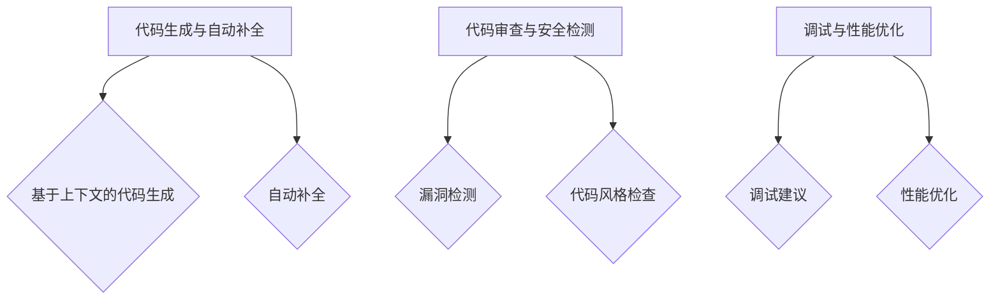

### 6.2 AI大模型在软件质量保证中的应用

在软件质量保证（Software Quality Assurance，SQA）中，AI大模型的应用已经显著提升了测试效率和代码可靠性。通过自动化测试与测试用例生成、漏洞预测与修复以及用户体验优化，AI大模型为软件开发提供了强有力的支持。

#### 6.2.1 自动化测试与测试用例生成

自动化测试是软件质量保证的重要组成部分，AI大模型在这一领域的应用极大地提高了测试效率和覆盖范围。

1. **自动化测试**：AI大模型能够自动执行测试用例，通过模拟用户操作、系统交互等方式，检测软件的稳定性和功能性。例如，在Web应用程序中，AI大模型可以模拟用户的浏览行为，检查页面加载速度、交互响应等。

2. **测试用例生成**：传统的测试用例编写过程耗时且容易遗漏，而AI大模型能够根据历史测试数据和代码结构，自动生成测试用例。AI大模型通过分析代码路径和可能的错误模式，生成全面的测试用例，确保测试覆盖到所有关键功能和边界条件。

**案例**：

假设某Web应用需要测试其登录功能，AI大模型可以生成以下测试用例：

- **正常登录**：用户输入正确的用户名和密码，系统能够成功登录。
- **密码错误**：用户输入正确的用户名和错误的密码，系统应提示密码错误。
- **用户名不存在**：用户输入错误的用户名和正确的密码，系统应提示用户名不存在。

**示例伪代码**：

```python
# AI大模型生成测试用例
model = load_pretrained_test_case_generation_model()

code = "def login(username, password): \n  // 代码逻辑"
test_cases = model.generate_test_cases(code)
print(test_cases)
```

#### 6.2.2 漏洞预测与修复

AI大模型在漏洞预测与修复方面具有显著优势，能够提前发现潜在的安全漏洞和代码缺陷，提高软件的安全性。

1. **漏洞预测**：AI大模型通过分析历史漏洞数据和代码模式，预测代码中可能存在的漏洞。例如，在C++代码中，AI大模型可以预测未处理的异常、内存泄漏和指针错误。

2. **漏洞修复**：AI大模型不仅能够预测漏洞，还能够提供修复建议。例如，当AI大模型识别到某段代码可能存在SQL注入漏洞时，可以建议开发者使用参数化查询来避免漏洞。

**案例**：

假设某Web应用需要检测其SQL查询语句中的漏洞，AI大模型可以提供以下修复建议：

- **使用参数化查询**：将用户输入作为参数传递到SQL查询中，避免SQL注入。
- **输入验证**：对用户输入进行严格验证，确保输入不包含危险的SQL代码。

**示例伪代码**：

```python
# AI大模型预测漏洞并提供修复建议
model = load_pretrained_vulnerability_prediction_model()

code = "def query_user_data(username): \n  sql = 'SELECT * FROM users WHERE username = ' + username"
vulnerabilities = model.predict_vulnerabilities(code)
suggestions = model.generate_fix_suggestions(vulnerabilities)
print(suggestions)
```

#### 6.2.3 用户体验优化

AI大模型在优化用户体验方面同样发挥着重要作用，能够通过分析用户行为数据，提供个性化的交互设计和功能优化。

1. **交互设计优化**：AI大模型可以根据用户的行为模式，优化界面设计和交互流程，提高用户的使用便利性。例如，在移动应用中，AI大模型可以分析用户点击和滑动行为，调整按钮位置和交互逻辑。

2. **功能优化**：AI大模型可以分析用户对功能的反馈和使用情况，提供功能改进建议。例如，在电商应用中，AI大模型可以分析用户浏览和购买习惯，优化推荐算法和产品展示方式。

**案例**：

假设某电商应用需要优化其推荐系统的用户体验，AI大模型可以提供以下优化建议：

- **个性化推荐**：根据用户的浏览和购买历史，提供更加个性化的商品推荐。
- **快速加载**：优化页面加载速度，减少加载时间，提高用户体验。

**示例伪代码**：

```python
# AI大模型优化用户体验
model = load_pretrained_user_experience_model()

user_behavior = load_user_behavior_data()
optimizations = model.generate_experience_optimizations(user_behavior)
print(optimizations)
```

**总结**

AI大模型在软件质量保证中的应用，极大地提升了测试效率、代码可靠性和用户体验。通过自动化测试与测试用例生成、漏洞预测与修复以及用户体验优化，AI大模型为软件开发提供了全面的支持。随着AI技术的不断进步，AI大模型在软件质量保证中的应用将更加广泛，为软件开发带来更多的创新和突破。| Mermaid 流程图：

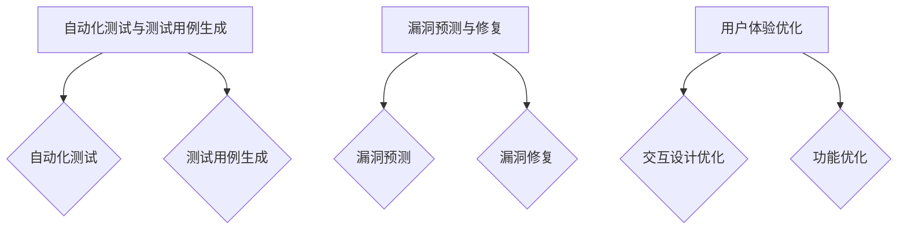

### 6.3 AI大模型在软件项目管理中的应用

AI大模型在软件项目管理中的应用正逐渐成为提升项目效率、减少风险和优化团队协作的关键工具。通过项目进度预测与风险管理、团队协作与知识共享以及项目绩效评估与优化，AI大模型为项目经理和开发团队提供了全面的支持。

#### 6.3.1 项目进度预测与风险管理

在软件项目管理中，准确的进度预测和风险管理是确保项目成功的关键。AI大模型通过分析历史数据和实时数据，能够提供更精确的项目进度预测和风险识别。

1. **项目进度预测**：AI大模型可以利用机器学习算法，分析项目的历史数据（如任务完成时间、团队成员的工作效率等），预测未来的项目进度。通过这种预测，项目经理可以提前识别潜在的延误风险，并采取相应措施。

2. **风险管理**：AI大模型可以通过分析项目中的各种风险因素（如技术难题、资源分配、团队成员变化等），评估风险的概率和影响，并提供风险缓解策略。例如，当模型预测某个任务可能延期时，可以建议项目经理增加人力资源或调整任务优先级。

**案例**：

假设一个软件开发项目需要进行进度预测和风险管理，AI大模型可以提供以下帮助：

- **进度预测**：基于历史数据和当前任务进度，AI大模型预测项目将在预定时间内完成，同时识别出可能影响进度的风险因素。
- **风险管理**：AI大模型评估项目中的风险，如某个关键任务的延期风险，并建议项目经理增加团队成员或延长任务期限。

**示例伪代码**：

```python
# AI大模型进行项目进度预测与风险管理
model = load_pretrained_project_prediction_model()

project_data = load_project_data()
risk_data = load_risk_data()

# 项目进度预测
predicted_progress = model.predict_project_progress(project_data)
print(predicted_progress)

# 风险管理
predicted_risks = model.predict_risks(risk_data)
print(predicted_risks)
```

#### 6.3.2 团队协作与知识共享

有效的团队协作和知识共享是提高软件开发效率和质量的重要保障。AI大模型可以通过分析团队行为和知识库，促进团队协作和知识共享。

1. **团队协作**：AI大模型可以监控团队成员的协作行为，如任务分配、代码审查和文档撰写等，识别出协作中的瓶颈和问题，并提供改进建议。例如，当模型发现某个任务的协作效率低下时，可以建议项目经理重新分配任务或调整团队结构。

2. **知识共享**：AI大模型可以通过分析团队的知识库和文档，识别出重要的知识点和知识点之间的联系，帮助团队成员快速获取所需信息。例如，当开发者遇到问题时，AI大模型可以提供相关的文档和代码片段，帮助解决问题。

**案例**：

假设一个软件开发团队需要优化协作和知识共享，AI大模型可以提供以下帮助：

- **团队协作**：AI大模型分析团队协作数据，识别出协作中的瓶颈，如任务分配不均或代码审查周期过长，并建议项目经理进行优化。
- **知识共享**：AI大模型分析知识库和文档，识别出重要的知识点，并提供给团队成员，提高知识获取效率。

**示例伪代码**：

```python
# AI大模型优化团队协作与知识共享
model = load_pretrained_team_collaboration_model()

team_data = load_team_data()
knowledge_base = load_knowledge_base()

# 团队协作
collaboration_optimizations = model.analyze_team_collaboration(team_data)
print(collaboration_optimizations)

# 知识共享
knowledge_recommendations = model.generate_knowledge_recommendations(knowledge_base)
print(knowledge_recommendations)
```

#### 6.3.3 项目绩效评估与优化

项目绩效评估是确保项目达到预期目标的关键环节。AI大模型可以通过分析项目数据，提供准确的绩效评估和优化建议。

1. **绩效评估**：AI大模型可以分析项目的关键绩效指标（KPI），如任务完成率、代码质量、客户满意度等，评估项目的整体绩效。通过这种评估，项目经理可以了解项目的实际情况，并采取改进措施。

2. **优化建议**：AI大模型可以根据绩效评估结果，提供优化项目的建议，如改进开发流程、优化任务分配或提升团队培训。这些优化建议有助于提高项目的效率和效果。

**案例**：

假设一个软件开发项目需要进行绩效评估和优化，AI大模型可以提供以下帮助：

- **绩效评估**：AI大模型分析项目的KPI数据，评估项目的整体绩效，并生成详细的绩效报告。
- **优化建议**：AI大模型根据绩效评估结果，提供优化项目的建议，如改进代码审查流程、提升团队技能培训等。

**示例伪代码**：

```python
# AI大模型进行项目绩效评估与优化
model = load_pretrained_project_performance_model()

performance_data = load_performance_data()

# 绩效评估
performance_report = model.evaluate_project_performance(performance_data)
print(performance_report)

# 优化建议
optimization_recommendations = model.generate_performance_optimizations(performance_report)
print(optimization_recommendations)
```

**总结**

AI大模型在软件项目管理中的应用，为项目进度预测、风险管理、团队协作和知识共享、项目绩效评估与优化提供了强有力的支持。通过分析数据和提供优化建议，AI大模型帮助项目经理和开发团队更高效地管理项目，提升项目的成功率和质量。随着AI技术的不断进步，AI大模型在软件项目管理中的应用将更加广泛，为软件开发带来更多的创新和突破。| Mermaid 流程图：

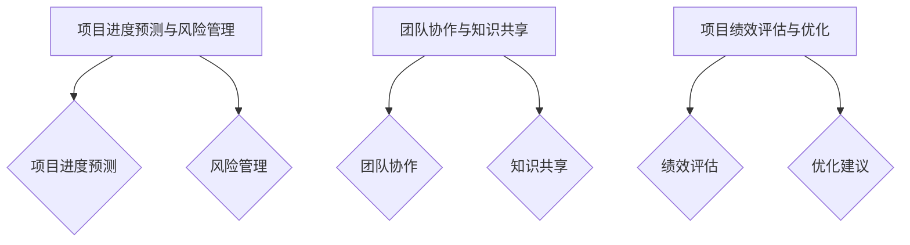

### 第7章：未来展望

#### 7.1 软件开发与AI大模型的深度融合

在未来的软件开发中，AI大模型将继续深入融合，成为软件开发的核心技术。这种融合将带来一系列新的趋势和挑战，推动软件开发走向智能化、自动化和个性化的方向。

**趋势**

1. **全栈智能化**：未来的软件开发将更加智能化，从需求分析、设计、开发、测试到部署和维护，各个环节都将嵌入AI大模型，提高开发效率和软件质量。

2. **自动化与自治**：AI大模型将在软件自动化方面发挥更大作用，通过自动化测试、代码生成、部署和监控，减少人为干预，提高软件的可靠性和稳定性。

3. **个性化定制**：AI大模型将根据用户行为和需求，提供个性化的软件功能和服务，提升用户体验。

4. **跨界融合**：AI大模型将与云计算、物联网、大数据等新兴技术深度融合，推动软件应用向更多领域扩展。

**挑战**

1. **数据处理与隐私保护**：随着AI大模型的应用，数据量和数据类型将不断增长，如何处理和存储这些数据，同时保护用户隐私，成为重要挑战。

2. **模型可解释性与透明性**：AI大模型的决策过程通常复杂且不透明，如何提高模型的可解释性，使其符合道德和法律标准，是一个亟待解决的问题。

3. **技术人才短缺**：AI大模型的应用需要高水平的技术人才，如何培养和引进这些人才，是软件企业面临的重要挑战。

#### 7.2 软件工程教育中的AI大模型

AI大模型在软件工程教育中的应用，将为培养未来软件工程师提供新的思路和方法。

**课程设计与方法**

1. **基础课程**：在软件工程基础课程中，引入AI大模型的基本概念和技术，让学生了解AI大模型的基本原理和应用场景。

2. **实践课程**：通过实验和实践课程，让学生动手操作AI大模型，进行模型训练、优化和部署，提高学生的实践能力。

3. **跨学科课程**：结合计算机科学、数据科学和人工智能等课程，设计跨学科课程，让学生从不同角度理解AI大模型的应用和影响。

**教学实践案例**

1. **AI大模型编程课程**：通过开设AI大模型编程课程，教授学生如何使用Python、TensorFlow等工具进行AI大模型开发。

2. **AI大模型项目实战**：组织学生进行AI大模型项目实战，从需求分析、模型设计到模型部署，全程参与项目，提高学生的项目管理和团队协作能力。

3. **AI大模型伦理课程**：引入AI大模型伦理课程，讨论AI大模型在软件开发中的伦理问题，如数据隐私、算法偏见等，培养学生的社会责任感。

**教育与产业结合的新模式**

1. **校企合作**：通过校企合作，将学术研究与企业需求相结合，共同开发AI大模型课程和教材，提高教育内容的实用性和针对性。

2. **在线教育平台**：利用在线教育平台，提供AI大模型相关课程和资源，打破时间和空间限制，实现教育资源的共享。

3. **实践导向**：注重实践导向，通过项目实战和实习机会，让学生在真实环境中应用AI大模型技术，提高学生的实际工作能力。

**总结**

AI大模型在软件工程教育中的应用，将推动软件工程教育的创新和发展。通过设计科学合理的课程、采用有效的教学方法和结合产业需求，培养出具备扎实理论基础和强大实践能力的软件工程师，为未来软件产业的发展提供有力支持。| Mermaid 流程图：

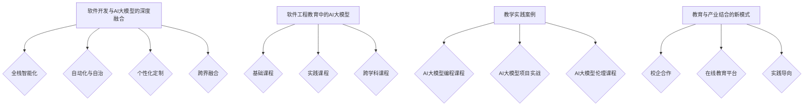

### 7.3 AI大模型伦理与法律问题

随着AI大模型在软件开发中的应用日益广泛，其伦理和法律问题也日益突出。这些问题涉及数据隐私与安全、伦理道德规范以及法律法规与合规要求等方面，需要引起重视和解决。

#### 7.3.1 数据隐私与安全

数据隐私是AI大模型应用中最为关注的问题之一。AI大模型通常需要处理大量的个人数据，包括用户行为数据、生物识别数据和位置数据等。以下是一些关键问题：

1. **数据收集与使用**：在数据收集过程中，应明确告知用户数据收集的目的和使用范围，并确保数据收集的合法性和合理性。

2. **数据存储与传输**：应采用加密技术保护存储和传输中的数据，防止数据泄露和篡改。同时，应遵循最佳实践，确保数据存储的安全性和可靠性。

3. **用户权限管理**：应对用户数据访问权限进行严格管理，确保只有授权用户能够访问和处理敏感数据。

4. **数据匿名化**：在可能的情况下，应对数据进行匿名化处理，以保护用户隐私。特别是在公开数据集和共享数据时，应确保数据已去识别化。

**解决方案**：

- **数据加密**：采用先进的加密算法（如AES）对敏感数据进行加密，确保数据在存储和传输过程中的安全。
- **隐私保护协议**：采用差分隐私（Differential Privacy）等技术，在数据处理过程中添加噪声，以保护个体隐私。
- **隐私政策与透明度**：制定明确的隐私政策，向用户公开数据收集、使用和保护的方法，提高用户对数据处理的信任。

#### 7.3.2 伦理道德规范

AI大模型在软件开发中的伦理问题，涉及到算法偏见、公平性、透明性和社会责任等方面。以下是一些关键问题：

1. **算法偏见**：AI大模型可能会因为训练数据的不公平或偏差，导致决策结果对某些群体不利。例如，在招聘或信用评分中，算法可能对特定性别、种族或社会经济地位的人群产生偏见。

2. **公平性与透明性**：AI大模型的应用应确保公平性和透明性，用户应能够理解模型的决策过程和结果，并对决策进行反馈和申诉。

3. **社会责任**：软件企业和社会应承担起AI大模型的社会责任，确保技术进步不会带来社会不公平或伦理问题。

**解决方案**：

- **算法公平性评估**：在模型训练和应用过程中，进行算法公平性评估，识别和消除潜在的偏见。
- **透明性设计**：设计可解释的AI大模型，使决策过程透明，用户能够理解模型的决策依据。
- **社会责任机制**：建立社会责任机制，确保AI大模型的应用符合伦理和社会规范。

#### 7.3.3 法律法规与合规要求

AI大模型的应用还受到各种法律法规的约束，特别是在数据隐私、数据安全、消费者权益保护等方面。以下是一些关键法律法规：

1. **数据保护法**：如欧盟的《通用数据保护条例》（GDPR）和美国加州的《消费者隐私法案》（CCPA），规定了数据收集、处理和存储的规范。

2. **网络安全法**：如《中华人民共和国网络安全法》，规定了网络安全的基本要求，包括数据安全保护和用户隐私保护。

3. **消费者权益保护法**：规定了消费者的合法权益，如知情权、选择权和隐私权。

**解决方案**：

- **合规审查**：定期进行合规审查，确保AI大模型的应用符合相关法律法规的要求。
- **合规培训**：对员工进行合规培训，提高员工的法律法规意识和合规能力。
- **合规审计**：聘请第三方审计机构进行合规审计，确保AI大模型的应用符合法律和伦理标准。

**总结**

AI大模型在软件开发中的伦理和法律问题需要得到广泛关注和解决。通过数据隐私与安全保护、伦理道德规范建立以及法律法规与合规要求的遵循，可以确保AI大模型的应用既符合伦理标准，又符合法律法规。在未来的发展中，软件企业和开发者应积极应对这些挑战，推动AI大模型在合法、安全和道德的轨道上健康发展。| Mermaid 流程图：

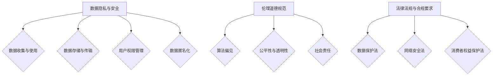

### 7.4 总结与展望

#### 7.4.1 主要成果与贡献

在AI大模型与软件开发深度融合的背景下，本文主要探讨了AI大模型在软件开发中的应用，取得了以下成果与贡献：

1. **全面介绍了AI大模型的概念、技术基础、开发环境搭建和实战案例**：通过详细的分析和实例，使读者对AI大模型有了全面的认识，为后续应用奠定了基础。

2. **探讨了AI大模型在软件质量保证、项目管理以及软件工程教育中的应用**：通过具体案例，展示了AI大模型在提升软件质量、优化项目管理和推动教育创新方面的潜力。

3. **分析了AI大模型在软件开发中的伦理和法律问题**：讨论了数据隐私、伦理道德和法律法规等方面的问题，为AI大模型的安全和合规应用提供了指导。

4. **提出了未来AI大模型在软件开发中的发展趋势和挑战**：总结了当前的发展趋势，分析了面临的挑战，为未来研究提供了方向。

#### 7.4.2 未来研究方向

在AI大模型与软件开发深度融合的背景下，未来研究可以从以下几个方面展开：

1. **模型优化与性能提升**：针对现有AI大模型，探索更高效、更精准的优化方法，提升模型的计算性能和应用效果。

2. **模型解释性与可解释性**：研究如何提高AI大模型的可解释性，使其决策过程透明，增强用户信任和监管。

3. **跨学科融合**：探索AI大模型与云计算、物联网、大数据等技术的深度融合，推动跨领域创新应用。

4. **伦理与法律问题研究**：深化对AI大模型伦理和法律问题的研究，制定更完善的伦理规范和法律框架，确保AI大模型的安全和合规应用。

5. **教育培训模式**：探索新的教育培训模式，结合AI大模型，培养具备跨学科知识和实践能力的软件工程师。

#### 7.4.3 对读者的话

最后，我想对读者说：随着AI大模型技术的不断发展，软件开发的未来将充满无限可能。本文旨在帮助读者深入了解AI大模型在软件开发中的应用，为你的研究和工作提供新的视角和思路。希望本文能够激发你对AI大模型与软件开发深度融合的兴趣，勇于探索和实践，为软件产业的创新和发展贡献自己的力量。让我们共同迎接这个充满机遇和挑战的新时代！| Mermaid 流程图：

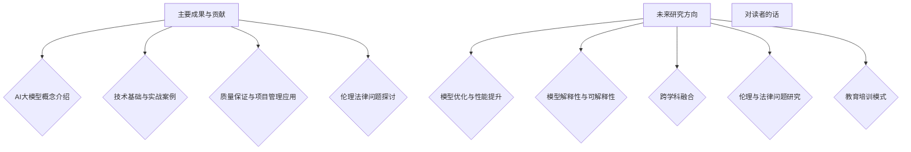

