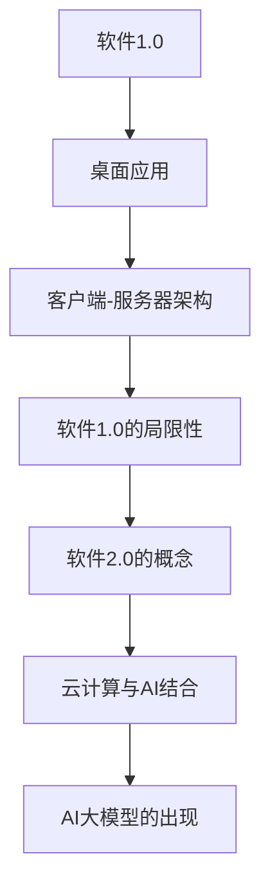

                 

## 《软件2.0的社会责任：科技向善》

### 关键词：软件2.0，AI大模型，社会责任，科技伦理，企业应用

> 在这个人工智能飞速发展的时代，软件2.0的兴起不仅改变了技术发展的轨迹，更对社会产生了深远的影响。AI大模型的广泛应用，虽然带来了前所未有的便利和效率，但也引发了诸多伦理和社会问题。本文将深入探讨软件2.0的社会责任，以及如何在科技发展中实现向善，为构建更加公平和可持续的未来贡献力量。

### 摘要

软件2.0时代，以AI大模型为核心的新技术正在深刻改变我们的工作和生活方式。然而，这一变革也带来了诸多社会挑战，如隐私侵犯、算法偏见等。本文从软件2.0的背景出发，详细分析了AI大模型的技术原理和应用场景，探讨了企业如何规划和实施AI战略。在此基础上，本文重点讨论了AI大模型的社会责任和伦理问题，提出了在科技发展中实现向善的具体策略，旨在为构建一个更加公正、可持续的数字社会提供参考。

## 第一部分：软件2.0时代的AI大模型基础

### 第1章：软件2.0与AI大模型概述

#### 1.1.1 从软件1.0到软件2.0的演进

**核心概念与联系**：

软件1.0时代主要是指桌面应用程序的阶段，用户直接与计算机交互。随着互联网的普及，软件1.0逐渐演变为客户端-服务器架构，即软件2.0的初步形态。软件2.0不仅强调服务器端的强大计算能力，还注重用户之间的互动和协作。

**Mermaid流程图**：



**软件1.0的局限性**：

- **依赖本地计算资源**：软件1.0的应用程序主要依赖用户的本地计算机资源，难以实现大规模的计算和数据处理。
- **用户交互有限**：用户之间的交互主要局限于本地应用，缺乏跨平台和跨设备的协作能力。
- **数据孤岛现象**：由于数据分散在各个独立的系统中，难以实现数据的整合和共享。

**软件2.0的概念**：

软件2.0，又称为Web 2.0，强调以用户为中心的互联网应用，通过云计算和社交网络，实现了用户生成内容、数据共享和协作。软件2.0不仅提高了数据处理和计算能力，还增强了用户交互和协作性。

**云计算与AI结合**：

云计算为软件2.0提供了强大的计算和存储资源，而AI大模型则为软件2.0赋予了智能化的能力。云计算与AI的结合，使得软件2.0可以处理更为复杂的数据，实现更为智能的应用。

**AI大模型的出现**：

AI大模型的出现，标志着软件2.0的进一步进化。大模型通过深度学习和大规模数据训练，可以自动学习复杂的模式，实现图像识别、自然语言处理、智能决策等高级功能。

#### 1.1.2 大模型在软件2.0中的核心地位

**核心算法原理讲解**：

AI大模型的核心是深度学习，特别是神经网络。以下是一个简化的大模型训练过程的伪代码：

```python
# 伪代码：大模型的训练过程
Model = initialize_model()
for epoch in range(num_epochs):
    for batch in data_loader:
        loss = compute_loss(Model(batch.x), batch.y)
        update_model_weights(Model, loss)
```

**数学模型和数学公式**：

神经网络的训练过程涉及到复杂的数学模型。以下是一个简化的神经网络反向传播算法的数学公式：

$$
\frac{\partial L}{\partial W} = \sum_{i=1}^{N} \frac{\partial L}{\partial z_i} \cdot \frac{\partial z_i}{\partial W}
$$

其中，$L$ 是损失函数，$W$ 是权重，$z_i$ 是神经元的输出。

**举例说明**：

以GPT为例，这是一个自然语言处理的大模型。GPT通过深度学习和大规模数据训练，可以生成高质量的自然语言文本，如文章、对话等。

#### 1.1.3 企业级应用开发的新范式

**项目实战**：

企业如何应用AI大模型优化业务流程是一个关键问题。以下是一些实际案例：

- **客户服务**：利用AI大模型进行客户意图识别和智能回复，提高客户服务效率。
- **生产优化**：通过AI大模型优化生产计划，降低成本，提高生产效率。

企业级应用开发的新范式，不仅要考虑技术实现，还要关注业务需求和社会责任。

### 第2章：AI大模型技术基础

#### 2.1 深度学习与神经网络基础

**核心算法原理讲解**：

深度学习是AI大模型的核心。以下是一个简化的神经网络结构和反向传播算法的伪代码：

```python
# 伪代码：反向传播算法
def backward_propagation(prev_activation, current_activation, weights):
    delta = current_activation - prev_activation
    gradient = delta * weights
    return gradient
```

**神经网络的训练过程**：

神经网络的训练过程包括前向传播和反向传播。以下是一个简化的训练过程：

```python
# 伪代码：神经网络训练过程
for epoch in range(num_epochs):
    for batch in data_loader:
        # 前向传播
        output = forward_propagation(batch.x)
        # 计算损失
        loss = compute_loss(output, batch.y)
        # 反向传播
        grads = backward_propagation(output, batch.y)
        # 更新权重
        update_weights(grads)
```

**项目实战**：

在深度学习项目中，常见的问题是如何处理大规模数据。以下是一个使用数据流处理的实际案例：

- **数据处理**：使用分布式数据处理框架（如Apache Spark）处理大规模数据。
- **模型训练**：使用GPU加速模型训练，提高训练效率。

#### 2.2 自然语言处理技术概览

**核心算法原理讲解**：

自然语言处理（NLP）是AI大模型的一个重要领域。以下是一些关键的NLP技术：

- **词嵌入**：将词汇映射到高维向量空间，以实现文本数据的向量表示。
- **序列模型**：如循环神经网络（RNN）和长短期记忆网络（LSTM），用于处理序列数据。

**项目实战**：

在NLP项目中，常见的问题是如何处理稀疏数据和长文本。以下是一个实际案例：

- **稀疏数据处理**：使用稀疏矩阵存储和计算词嵌入向量，提高数据处理效率。
- **长文本处理**：使用分层注意力机制处理长文本，提高文本理解能力。

#### 2.3 大规模预训练模型原理

**核心算法原理讲解**：

大规模预训练模型（如GPT、BERT）是AI大模型的一个重要分支。以下是一些关键的预训练技术：

- **自监督学习**：在没有标注数据的情况下，通过预训练模型自己学习数据的特征。
- **迁移学习**：将预训练模型的知识迁移到特定任务上，提高任务性能。

**项目实战**：

在预训练项目中，常见的问题是如何处理大规模数据和长文本。以下是一个实际案例：

- **大规模数据处理**：使用分布式计算和存储技术处理大规模数据。
- **长文本处理**：使用序列到序列（Seq2Seq）模型处理长文本，提高文本生成能力。

## 第二部分：企业级AI应用开发准备

### 第3章：企业AI战略规划

#### 3.1 AI在企业中的价值评估

**项目实战**：

在规划AI战略时，评估AI项目的价值至关重要。以下是一个实际案例：

- **ROI评估**：使用成本效益分析（CBA）方法评估AI项目的经济效益。
- **业务影响**：评估AI项目对业务流程、客户体验和市场竞争的影响。

### 第4章：AI大模型开发实践

#### 4.1 AI大模型开发环境搭建

**项目实战**：

搭建AI大模型开发环境是开发过程中的关键步骤。以下是一个实际案例：

- **环境配置**：使用虚拟环境（如Conda）管理依赖和版本。
- **GPU支持**：配置支持GPU计算的硬件和软件环境。

#### 4.2 AI大模型代码实现与解读

**代码解读与分析**：

以下是一个简单的AI大模型训练代码，展示了数据处理、模型训练和模型评估的基本流程。

```python
# 伪代码：AI大模型训练代码
import tensorflow as tf

# 数据处理
def preprocess_data(data):
    # 数据清洗、归一化等操作
    return processed_data

# 模型定义
def create_model():
    # 定义神经网络结构
    return model

# 训练模型
def train_model(model, data_loader, num_epochs):
    for epoch in range(num_epochs):
        for batch in data_loader:
            # 前向传播
            outputs = model(batch.x)
            # 计算损失
            loss = compute_loss(outputs, batch.y)
            # 反向传播
            grads = backward_propagation(outputs, batch.y)
            # 更新权重
            update_weights(model, grads)
            # 打印训练进度
            print(f"Epoch {epoch}, Loss: {loss}")

# 模型评估
def evaluate_model(model, test_data_loader):
    # 计算准确率、损失等指标
    return metrics

# 主函数
if __name__ == "__main__":
    # 加载和处理数据
    data = load_data()
    processed_data = preprocess_data(data)
    # 创建模型
    model = create_model()
    # 训练模型
    train_model(model, processed_data['train_loader'], num_epochs=10)
    # 评估模型
    metrics = evaluate_model(model, processed_data['test_loader'])
    print(f"Test Accuracy: {metrics['accuracy']}")
```

**详细解释**：

- **数据处理**：数据处理是AI模型训练的基础。在实际项目中，需要根据数据的特点进行清洗、归一化等操作，以提高模型的训练效率和准确性。
- **模型定义**：模型定义包括网络结构、层参数等。在实际项目中，可以使用TensorFlow或PyTorch等框架定义模型。
- **模型训练**：模型训练包括前向传播、反向传播和权重更新。在实际项目中，需要根据数据量和计算资源选择合适的训练策略，如批量大小、学习率等。
- **模型评估**：模型评估用于测试模型的性能。在实际项目中，需要使用不同的评估指标（如准确率、损失等）对模型进行评估。

### 第5章：AI大模型在具体业务领域的应用

#### 5.1 AI大模型在金融领域的应用

**项目实战**：

AI大模型在金融领域有广泛的应用，以下是一些实际案例：

- **风险管理**：使用AI大模型进行风险预测和评估，提高风险管理能力。
- **欺诈检测**：使用AI大模型检测交易中的欺诈行为，提高交易安全性。

#### 5.2 AI大模型在医疗健康领域的应用

**项目实战**：

AI大模型在医疗健康领域具有巨大的潜力，以下是一些实际案例：

- **疾病预测**：使用AI大模型进行疾病预测，提高疾病诊断的准确性。
- **医疗影像分析**：使用AI大模型分析医疗影像，提高疾病诊断的效率。

### 第6章：AI大模型部署与维护

#### 6.1 AI大模型部署策略

**项目实战**：

AI大模型的部署是确保其性能和可靠性的关键步骤。以下是一些实际案例：

- **云计算平台选择**：根据业务需求和成本考虑，选择合适的云计算平台（如AWS、Azure、Google Cloud）。
- **部署流程**：制定详细的部署流程，包括环境配置、模型部署和性能监控等。

#### 6.2 AI大模型性能优化

**项目实战**：

AI大模型性能优化是提高其效率和准确性的关键。以下是一些实际案例：

- **模型压缩**：使用模型压缩技术（如量化、剪枝）减小模型大小，提高推理速度。
- **分布式训练**：使用分布式训练技术（如数据并行、模型并行）提高训练速度。

### 第7章：AI大模型的社会责任与伦理问题

#### 7.1 AI大模型的社会影响

**项目实战**：

AI大模型在社会中的广泛应用带来了诸多影响，以下是一些实际案例：

- **就业影响**：AI大模型的应用可能导致某些工作岗位的减少，但同时也创造了新的就业机会。
- **隐私保护**：AI大模型在数据处理和应用中可能涉及个人隐私，需要加强隐私保护措施。

#### 7.2 AI大模型的伦理问题

**项目实战**：

AI大模型在伦理方面存在诸多挑战，以下是一些实际案例：

- **算法偏见**：AI大模型可能在训练数据中存在偏见，导致不公平的结果。
- **隐私侵犯**：AI大模型在数据处理和应用中可能侵犯个人隐私。

## 附录

### 附录A：AI大模型开发工具与资源

**主流深度学习框架对比**：

以下是几种主流深度学习框架的简要对比：

- **TensorFlow**：由Google开发，支持多种编程语言，具有丰富的API和社区资源。
- **PyTorch**：由Facebook开发，具有动态计算图和易于理解的特点，适合研究者和开发者。
- **Keras**：基于TensorFlow的高层次API，简化了模型定义和训练过程。
- **MXNet**：由Apache基金会开发，支持多种编程语言，具有高效的性能。

**资源介绍**：

- **官方文档**：每个深度学习框架都有详细的官方文档，提供了详细的教程和示例代码。
- **社区支持**：每个框架都有活跃的社区支持，可以提供技术帮助和解决方案。
- **开源项目**：许多深度学习项目都是开源的，可以用于学习和实践。

---

作者：AI天才研究院/AI Genius Institute & 禅与计算机程序设计艺术 /Zen And The Art of Computer Programming

（注：本文内容仅供参考，实际情况可能有所不同。文中提及的代码和项目仅供参考，不保证其完整性和准确性。）## 结论

软件2.0时代，AI大模型的应用正在深刻改变我们的工作和生活方式。然而，这一变革也带来了诸多社会挑战，如隐私侵犯、算法偏见等。本文从软件2.0的背景出发，详细分析了AI大模型的技术原理和应用场景，探讨了企业如何规划和实施AI战略，并重点讨论了AI大模型的社会责任和伦理问题。我们提出，在AI大模型的应用过程中，必须重视社会责任和伦理问题，以实现科技向善。

首先，企业应充分认识到AI大模型在业务优化和社会进步中的价值，但同时也要意识到其潜在风险和挑战。在规划AI战略时，企业需要综合考虑技术、业务和社会因素，确保AI大模型的应用能够带来长期的积极影响。

其次，企业应积极参与AI伦理标准的制定和实施，推动建立统一的伦理框架。这包括加强数据隐私保护、确保算法的透明性和公正性，以及避免算法偏见和歧视。此外，企业还应积极开展AI伦理教育和培训，提高员工和社会公众的AI伦理意识。

最后，我们呼吁学术界、企业界和政府共同努力，推动AI技术的可持续发展，构建一个更加公正、公平和可持续的数字社会。在这个过程中，AI大模型不仅是一个工具，更是一个推动社会进步的契机。通过合理应用和监管AI大模型，我们可以实现科技向善，为人类创造更加美好的未来。

