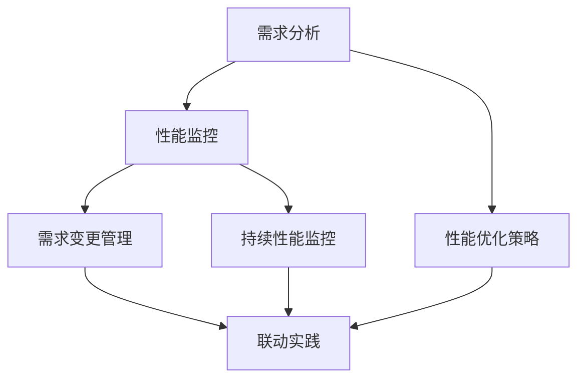

                 

### 《需求与性能监控的联动：实现持续优化》

#### 关键词：需求分析，性能监控，持续优化，联动机制，案例分析，技术创新

#### 摘要：

在当今快速发展的信息技术时代，需求与性能监控的联动对于软件系统的持续优化至关重要。本文将深入探讨需求分析与性能监控之间的相互关系，阐述其联动原理及实现机制，并通过实际案例详细分析其应用和实践。文章结构清晰，从需求分析基础、性能监控体系构建到联动实践与案例分析，再到工具与技术、团队协作与文化建设，最后展望未来发展趋势与持续优化实践，旨在为读者提供一个全面而深入的指导。

### 第一部分：引言

#### 1.1 书籍背景与目标

在现代软件开发中，需求分析与性能监控是确保系统稳定性和用户体验的两个关键环节。然而，这两个环节往往被视为独立的过程，忽略了它们之间的紧密联系。本文旨在填补这一空白，通过系统性地介绍需求分析与性能监控的联动机制，帮助开发团队实现持续优化，提升系统性能和用户体验。

**1.1.1 需求与性能监控的重要性**

需求分析是软件开发的基础，它确保开发团队能够按照用户需求进行系统设计和实现。性能监控则关注系统在实际运行中的表现，通过收集和分析系统性能数据，评估系统的稳定性和可靠性。

**1.1.2 书籍受众与期望成果**

本文的受众主要包括软件开发工程师、系统架构师、项目经理以及IT管理人员。通过阅读本文，读者可以：

- 理解需求分析与性能监控之间的联动原理；
- 掌握构建和实施联动机制的方法；
- 学习通过案例分析和工具应用实现持续优化的实践策略；
- 获取关于团队协作与文化建设的启示。

#### 1.2 持续优化概述

**1.2.1 持续优化理念**

持续优化是一种通过不断改进来提高系统性能和用户体验的方法。它强调在软件开发过程中不断迭代和改进，而不是一次性完成。

**1.2.2 持续优化的实践价值**

持续优化有助于：

- 提高系统的稳定性、可靠性和可扩展性；
- 提升用户体验，减少系统故障和响应时间；
- 降低维护成本，提高资源利用率。

#### 1.3 书籍结构安排

**1.3.1 目录概述**

本文分为七个部分，内容涵盖：

1. 引言
2. 需求分析与优化
3. 性能监控与优化
4. 联动实践与案例分析
5. 工具与技术
6. 团队协作与文化建设
7. 未来展望与持续探索

**1.3.2 每章节主要内容**

- **第一部分：引言**：介绍书籍背景、目标、持续优化概述和结构安排。
- **第二部分：需求分析与优化**：探讨需求分析基础、分类与建模、变更管理以及需求与性能监控的联动。
- **第三部分：性能监控与优化**：阐述性能监控基础、体系构建、问题识别与诊断、优化策略及持续监控。
- **第四部分：联动实践与案例分析**：分享互联网公司和传统企业的联动实践案例。
- **第五部分：工具与技术**：介绍需求分析与性能监控工具、技术选型与实施策略、持续集成与部署。
- **第六部分：团队协作与文化建设**：讨论团队协作、文化建设与持续优化。
- **第七部分：未来展望与持续探索**：展望需求与性能监控技术发展趋势，探讨持续优化实践的未来。

### 第二部分：需求分析与优化

#### 2.1 需求分析基础

**2.1.1 需求分析的定义与目的**

需求分析是软件开发过程中的关键步骤，旨在明确系统的功能和性能需求。其目的是确保开发团队能够按照用户需求进行系统设计和实现。

**2.1.2 需求分析的过程与方法**

需求分析通常包括以下步骤：

1. **需求收集**：通过与用户、利益相关者交流，收集系统的功能和性能需求。
2. **需求整理**：将收集到的需求进行分类和整理，形成清晰的需求文档。
3. **需求验证**：对整理后的需求进行验证，确保需求的准确性和可实现性。
4. **需求管理**：对需求进行跟踪和管理，确保需求的变更得到妥善处理。

需求分析的方法包括：

1. **访谈**：通过与用户和利益相关者进行面对面访谈，收集需求信息。
2. **问卷调查**：通过设计问卷，收集用户的需求和反馈。
3. **观察**：通过观察用户的行为和操作，获取需求信息。
4. **文档分析**：通过分析现有文档和资料，了解系统的需求和功能。

**2.1.3 用户需求收集与分析**

用户需求收集是需求分析的关键环节。以下是一些常用的用户需求收集方法：

1. **访谈法**：通过与用户进行面对面的深入交流，获取详细的需求信息。
2. **问卷调查法**：通过设计问卷，收集用户的需求和反馈，适用于大样本量的需求收集。
3. **观察法**：通过观察用户在系统中的操作，了解用户的实际需求和痛点。
4. **文档分析法**：通过分析用户提交的文档、日志等信息，获取用户的需求和需求变更。

在用户需求收集过程中，需注意以下几点：

1. **明确需求收集的目的**：确保收集的需求与系统目标和用户需求相一致。
2. **确保需求的完整性**：收集需求时，要全面考虑系统功能和性能需求。
3. **需求的优先级**：对收集到的需求进行优先级排序，确保重要需求得到及时处理。
4. **需求的可验证性**：确保需求是可验证和可实现的。

**2.1.4 需求分析文档**

需求分析文档是需求分析过程的输出结果，通常包括以下内容：

1. **需求概述**：简要介绍系统的功能和性能需求。
2. **需求列表**：详细列出系统的功能和性能需求，包括功能需求、性能需求和安全需求等。
3. **需求说明**：对每个需求进行详细说明，包括需求描述、需求来源、需求优先级等。
4. **需求图**：使用流程图、UML图等工具，展示系统的功能和性能需求。
5. **需求变更记录**：记录需求变更的详细信息和变更原因。

**2.1.5 需求分析与性能监控的关系**

需求分析与性能监控之间存在着密切的关系。需求分析阶段所收集的用户需求和预期性能目标，可以指导性能监控工作的方向和方法。而性能监控过程中收集的数据和分析结果，又可以反馈给需求分析，帮助修正和优化需求，从而实现持续优化。

1. **需求指导监控**：在需求分析阶段，明确系统的功能和性能需求，可以帮助性能监控团队确定监控的关键指标、监控周期和告警阈值等。
2. **监控反馈需求**：性能监控过程中，通过收集和分析系统性能数据，可以发现系统的性能瓶颈和问题。这些分析结果可以反馈给需求分析团队，帮助他们调整和优化需求。

#### 2.2 需求分类与建模

**2.2.1 需求分类标准**

为了更好地管理和分析需求，通常需要对需求进行分类。需求分类的标准可以根据不同维度进行定义，例如：

1. **功能需求**：系统应具备的功能，如用户登录、订单管理、商品搜索等。
2. **性能需求**：系统应达到的性能指标，如响应时间、并发处理能力、吞吐量等。
3. **安全需求**：系统应具备的安全措施，如数据加密、身份验证、访问控制等。
4. **可靠性需求**：系统的稳定性、可靠性指标，如故障恢复时间、系统可用性等。
5. **维护需求**：系统维护和升级的难度、周期和成本等。

**2.2.2 需求建模方法**

需求建模是将需求以图形或文档的形式进行描述，以便更好地理解和分析需求。常用的需求建模方法包括：

1. **用例建模**：使用用例图描述系统的功能和用户需求，展示系统与用户之间的交互关系。
2. **功能建模**：使用功能图描述系统的功能模块和功能关系，展示系统内部的功能结构。
3. **数据建模**：使用数据模型描述系统的数据结构和数据流，展示系统中的数据关系。
4. **过程建模**：使用过程图描述系统的业务流程和操作步骤，展示系统的业务流程。

**2.2.3 实际案例解析**

以下是一个实际案例，展示了需求分类与建模的应用。

**案例：在线购物平台的需求分析**

1. **功能需求**

   - 用户注册与登录
   - 商品浏览与搜索
   - 购物车管理
   - 订单提交与支付
   - 用户评论与评分

2. **性能需求**

   - 响应时间：平均响应时间不超过2秒
   - 并发处理能力：支持1000并发用户同时访问
   - 吞吐量：每日处理订单量超过100万

3. **安全需求**

   - 数据加密：用户数据和交易数据使用HTTPS协议进行加密传输
   - 身份验证：用户需通过密码验证登录
   - 访问控制：根据用户角色分配不同的访问权限

4. **可靠性需求**

   - 故障恢复时间：系统故障后，需在5分钟内恢复正常运行
   - 系统可用性：系统可用率不低于99.9%

5. **维护需求**

   - 维护周期：每周进行一次系统更新和优化
   - 维护成本：维护成本不超过系统总成本的10%

通过以上需求分类与建模，可以更好地理解和分析在线购物平台的需求，为后续的性能监控和优化提供依据。

### 2.3 需求变更管理

**2.3.1 需求变更的原因与影响**

需求变更在软件开发过程中是常见的情况，其原因可能包括：

1. **用户需求变化**：用户在项目进行过程中可能会提出新的需求或对原有需求进行修改。
2. **技术变更**：新技术、新工具的出现可能需要对系统进行重构或优化。
3. **项目范围调整**：项目目标或范围的调整可能引起需求的变化。
4. **市场变化**：市场环境的变化可能影响系统的需求。

需求变更的影响主要包括：

1. **时间影响**：需求变更可能需要额外的时间进行设计和开发。
2. **成本影响**：需求变更可能增加开发成本和维护成本。
3. **资源影响**：需求变更可能需要额外的资源，如人力、硬件等。
4. **质量影响**：需求变更可能影响系统的质量和稳定性。

**2.3.2 需求变更的管理流程**

为了有效管理需求变更，通常需要遵循以下流程：

1. **需求变更请求**：当发现需求变更时，利益相关者需要提交需求变更请求。
2. **需求变更评估**：对需求变更进行评估，包括变更的影响、成本和可行性等。
3. **需求变更审批**：根据评估结果，对需求变更进行审批，决定是否接受变更。
4. **需求变更实施**：如果批准变更，则按照变更计划进行实施。
5. **需求变更记录**：记录需求变更的详细信息，包括变更原因、评估结果、实施情况等。

**2.3.3 需求变更的评估与控制**

需求变更的评估和控制是需求变更管理的关键环节，以下是一些常用的方法和技巧：

1. **变更影响分析**：对需求变更的影响进行分析，包括时间、成本、资源等。
2. **成本效益分析**：评估需求变更的成本和效益，确保变更的合理性。
3. **优先级排序**：对需求变更进行优先级排序，确保重要变更得到及时处理。
4. **变更控制委员会**：成立变更控制委员会，负责评估和审批需求变更。
5. **变更日志管理**：记录变更的详细信息，包括变更请求、评估结果、审批意见等。

**2.3.4 需求变更的风险管理**

需求变更可能导致一系列风险，如时间延迟、成本超支、质量下降等。为了有效管理需求变更的风险，可以采取以下措施：

1. **风险评估**：对需求变更进行风险评估，识别潜在风险。
2. **风险应对策略**：制定风险应对策略，包括风险规避、风险转移、风险减轻等。
3. **风险管理计划**：制定风险管理计划，确保风险得到及时识别和处理。
4. **风险监控与报告**：定期监控风险状况，及时报告风险信息。

#### 2.4 需求分析与性能监控联动

**2.4.1 需求分析对性能监控的影响**

需求分析阶段所收集的用户需求和预期性能目标，对性能监控有着重要的影响。以下是一些具体的影响：

1. **监控指标确定**：需求分析阶段明确的功能和性能需求，可以帮助性能监控团队确定监控的关键指标，如响应时间、并发处理能力、吞吐量等。
2. **监控周期设定**：根据需求分析阶段设定的性能目标，性能监控团队可以制定合适的监控周期，确保能够及时捕获性能问题。
3. **告警阈值设置**：需求分析阶段明确的目标性能指标，可以帮助性能监控团队设定合理的告警阈值，确保在性能指标异常时能够及时发出告警。
4. **监控范围确定**：需求分析阶段明确的需求范围，可以帮助性能监控团队确定监控的范围，避免对非关键部分进行过度监控。

**2.4.2 性能监控对需求分析的支持**

性能监控对需求分析的支持主要体现在以下几个方面：

1. **需求验证**：通过性能监控，可以验证需求是否满足预期性能目标，确保需求的可行性和准确性。
2. **需求调整**：在性能监控过程中，如果发现系统性能无法满足需求，需求分析团队可以根据监控数据调整需求，如优化算法、增加资源等。
3. **需求优化**：通过性能监控，可以发现系统的性能瓶颈和问题，需求分析团队可以据此优化需求，提升系统性能和用户体验。

**2.4.3 联动机制的设计与实施**

为了实现需求分析与性能监控的联动，需要设计一套完整的联动机制。以下是一个基本的联动机制设计流程：

1. **需求收集与定义**：在需求分析阶段，明确系统的功能和性能需求，包括响应时间、吞吐量、并发数等关键性能指标。
2. **性能监控策略制定**：根据需求定义，制定性能监控策略，确定监控的指标、监控周期、告警阈值等。
3. **性能监控实施**：按照监控策略，部署性能监控工具，收集系统的性能数据。
4. **数据分析与反馈**：对收集的性能数据进行分析，识别潜在的性能问题，将分析结果反馈给需求分析团队。
5. **需求调整与优化**：根据性能监控反馈，对需求进行优化和调整，如调整系统架构、优化算法、增加资源等。
6. **性能监控迭代**：在需求调整后，重新进行性能监控，验证优化效果，形成闭环。

**2.4.4 联动实践案例**

以下是一个联动实践案例：

**案例：互联网公司A**

**需求分析**：公司A在开发一个在线购物平台，需求包括快速响应、高并发处理能力、数据安全性等。

**性能监控**：公司A使用了多个性能监控工具，包括Prometheus、Grafana等，监控系统的CPU、内存、磁盘使用率、响应时间等关键指标。

**联动机制**：监控工具实时收集数据，当发现性能指标异常时，自动生成告警，开发团队会收到通知并进行分析，确定是否需要调整需求，如优化数据库查询、增加服务器资源等。

**效果评估**：通过需求分析与性能监控的联动，公司A成功优化了系统的性能，提高了用户体验和系统稳定性。

### 第三部分：性能监控与优化

#### 3.1 性能监控基础

**3.1.1 性能监控的定义与目标**

性能监控是指通过实时收集和分析系统的性能数据，评估系统的性能表现，发现潜在的问题和瓶颈，从而优化系统性能的过程。性能监控的目标主要包括：

1. **确保系统稳定性**：通过监控系统的关键性能指标，确保系统在各种负载下稳定运行，避免出现系统崩溃、故障等问题。
2. **提高用户体验**：通过监控系统的性能指标，确保用户在使用系统时能够获得良好的体验，减少响应时间、错误率等。
3. **发现潜在问题**：通过监控系统的性能数据，及时发现潜在的问题和瓶颈，避免影响系统的稳定性和性能。
4. **优化系统性能**：根据监控数据，分析和优化系统性能，提高系统的并发处理能力、响应速度等。

**3.1.2 性能监控的关键指标**

性能监控的关键指标包括：

1. **CPU使用率**：CPU使用率表示CPU的利用率，过高或过低都可能导致系统性能下降。
2. **内存使用率**：内存使用率表示系统内存的利用率，过高可能导致内存不足，过低则可能导致资源浪费。
3. **磁盘IO**：磁盘IO表示系统磁盘的读写速度，过高或过低都可能影响系统的性能。
4. **网络流量**：网络流量表示系统的网络带宽使用情况，过高可能导致网络拥堵，过低则可能导致资源浪费。
5. **响应时间**：响应时间表示系统处理请求的时间，过长可能导致用户体验差。
6. **并发数**：并发数表示系统同时处理请求的个数，过高可能导致系统性能下降。

**3.1.3 性能监控的技术手段**

性能监控的技术手段主要包括：

1. **Agent-based监控**：通过在系统中部署监控Agent，实时收集系统的性能数据，并将数据发送到监控服务器进行分析和展示。
2. **API监控**：通过调用系统的API接口，模拟用户请求，监控系统的性能表现。
3. **日志分析**：通过分析系统的日志文件，获取系统的性能数据，并进行分析和展示。
4. **第三方监控工具**：使用第三方监控工具，如Prometheus、Grafana、Zabbix等，进行性能监控。

**3.1.4 性能监控工具的选择**

选择合适的性能监控工具是确保性能监控效果的关键。以下是一些常用的性能监控工具及其特点：

1. **Prometheus**：开源的性能监控工具，支持多维数据采集和存储，具有良好的扩展性和灵活性。
2. **Grafana**：开源的数据可视化工具，支持多种数据源，提供丰富的图表和仪表盘。
3. **Zabbix**：开源的性能监控工具，支持多种监控方式，包括Agent-based监控、API监控等。
4. **New Relic**：商业化的性能监控工具，提供丰富的监控指标和报警功能。

选择性能监控工具时，需要考虑以下因素：

1. **监控需求**：根据系统需求和性能监控目标，选择合适的监控工具。
2. **数据采集能力**：确保监控工具能够采集到系统关键性能指标的数据。
3. **数据存储和处理能力**：选择能够高效存储和处理大量数据的监控工具。
4. **可扩展性和灵活性**：确保监控工具能够支持系统的扩展和定制化需求。
5. **成本**：根据企业的预算和成本承受能力，选择合适的监控工具。

#### 3.2 性能监控体系构建

**3.2.1 性能监控体系的构成**

一个完整的性能监控体系通常包括以下几个关键部分：

1. **监控指标定义**：根据系统的需求和性能目标，明确需要监控的关键指标，如CPU使用率、内存使用率、磁盘IO、网络流量、响应时间等。
2. **数据采集**：通过Agent-based监控、API监控、日志分析等方式，实时收集系统的性能数据。
3. **数据处理**：对采集到的性能数据进行分析和处理，提取有用的信息和指标。
4. **数据存储**：将处理后的性能数据存储在数据库或其他数据存储系统中，以便后续分析和查询。
5. **可视化展示**：使用图表、仪表盘等形式，将性能数据可视化展示，方便监控人员直观地了解系统性能。
6. **告警机制**：根据设定的阈值和规则，当性能指标超出预期时，自动生成告警通知，确保及时发现问题并采取措施。
7. **分析报告**：定期生成性能分析报告，总结系统性能状况，发现潜在问题和改进方向。

**3.2.2 性能监控策略制定**

制定合理的性能监控策略是确保监控效果的关键。以下是一些常见的性能监控策略：

1. **关键指标监控**：选择系统的关键指标进行监控，确保监控的重点和方向。
2. **周期监控**：根据系统需求和性能目标，制定合适的监控周期，如每小时、每日、每周等。
3. **阈值设定**：根据监控指标的历史数据和预期性能目标，设定合理的告警阈值，确保在性能指标异常时能够及时发出告警。
4. **告警通知**：根据监控人员的职责和紧急程度，设定不同的告警通知方式，如邮件、短信、电话等。
5. **自动化处理**：针对常见的性能问题，设定自动化处理流程，如自动扩容、自动优化等。

**3.2.3 性能监控工具与平台选择**

选择合适的性能监控工具和平台是构建高效性能监控体系的关键。以下是一些常用的性能监控工具和平台及其特点：

1. **Prometheus + Grafana**：Prometheus是一个开源的监控工具，具有强大的数据采集和处理能力；Grafana是一个开源的数据可视化工具，可以与Prometheus无缝集成，提供丰富的图表和仪表盘。
2. **Zabbix**：Zabbix是一个开源的性能监控工具，支持多种监控方式，包括Agent-based监控、API监控等，具有较好的扩展性和灵活性。
3. **New Relic**：New Relic是一个商业化的性能监控平台，提供丰富的监控指标和报警功能，适合大型企业使用。

选择性能监控工具和平台时，需要考虑以下因素：

1. **监控需求**：根据系统需求和性能监控目标，选择合适的监控工具和平台。
2. **数据采集能力**：确保监控工具和平台能够采集到系统关键性能指标的数据。
3. **数据处理能力**：选择能够高效处理大量数据的监控工具和平台。
4. **可扩展性和灵活性**：确保监控工具和平台能够支持系统的扩展和定制化需求。
5. **成本**：根据企业的预算和成本承受能力，选择合适的监控工具和平台。

#### 3.3 性能问题识别与诊断

**3.3.1 性能问题识别方法**

性能问题识别是性能监控的重要环节，以下是一些常用的性能问题识别方法：

1. **基于指标的方法**：通过监控系统的关键性能指标，如CPU使用率、内存使用率、响应时间等，判断系统是否存在性能问题。当某个指标超过设定的阈值时，可能存在性能问题。
2. **基于日志的方法**：通过分析系统的日志文件，查找性能问题的线索。例如，通过查找错误日志、警告日志等，发现系统异常或错误。
3. **基于用户反馈的方法**：通过收集用户的反馈，了解系统在实际运行中的表现。例如，用户反馈系统响应慢、页面加载时间长等，可能存在性能问题。
4. **基于专家系统的方法**：利用专家系统的知识库和推理机制，自动识别和诊断性能问题。例如，通过分析系统的配置、日志等数据，自动识别可能存在的性能瓶颈。

**3.3.2 性能问题诊断步骤**

当发现性能问题时，可以按照以下步骤进行诊断：

1. **初步分析**：通过监控数据和日志信息，初步判断性能问题的性质和范围。例如，通过监控数据发现CPU使用率过高，可能存在CPU瓶颈。
2. **定位问题**：进一步分析监控数据和日志信息，确定性能问题的具体位置和原因。例如，通过日志分析发现某个服务器的CPU使用率过高，可能是由于某个应用程序占用过多CPU资源导致的。
3. **分析数据**：收集和分析相关性能数据，如CPU使用率、内存使用率、磁盘IO、网络流量等，确定性能问题的具体表现和影响。
4. **制定解决方案**：根据分析结果，制定具体的解决方案，如调整系统配置、优化应用程序、增加硬件资源等。
5. **实施解决方案**：根据解决方案，进行实际操作，解决性能问题。例如，调整系统配置文件、更新应用程序等。

**3.3.3 性能问题案例解析**

以下是一个性能问题案例及其解析：

**案例**：一个电商网站在促销活动期间，用户访问量激增，导致网站响应时间明显延长，部分用户反馈无法正常访问。

**诊断过程**：

1. **初步分析**：通过监控数据发现CPU使用率、内存使用率、磁盘IO等指标均出现异常，可能存在性能问题。
2. **定位问题**：通过分析日志发现，部分请求在数据库处理过程中出现严重延迟，可能是由于数据库查询优化不足导致的。
3. **分析数据**：进一步分析数据库查询日志，发现部分查询语句执行时间过长，涉及大量全表扫描操作。
4. **制定解决方案**：优化数据库查询语句，如增加索引、使用缓存等，减少全表扫描操作。
5. **实施解决方案**：更新数据库配置，重新执行查询语句，验证性能问题是否解决。

**效果评估**：经过优化后，网站响应时间明显缩短，用户访问量恢复正常，性能问题得到有效解决。

### 3.4 性能优化策略与方法

**3.4.1 性能优化原则**

进行性能优化时，应遵循以下原则：

1. **目标明确**：明确性能优化的目标，如提高并发处理能力、减少响应时间、提升系统稳定性等。
2. **逐步实施**：性能优化是一个逐步迭代的过程，应逐步实施，避免一次性进行大规模优化导致系统不稳定。
3. **数据驱动**：基于性能监控数据进行分析和优化，确保优化措施是基于实际问题的解决。
4. **优先级排序**：根据性能问题的严重程度和影响范围，对优化措施进行优先级排序，优先解决关键问题。
5. **测试验证**：在实施优化措施后，进行充分的测试验证，确保优化效果和系统的稳定性。

**3.4.2 性能优化技术手段**

以下是一些常见的性能优化技术手段：

1. **系统架构优化**：调整系统架构，如增加缓存层、分布式部署等，提高系统的并发处理能力和可扩展性。
2. **数据库优化**：优化数据库查询语句，如增加索引、优化表结构、使用缓存等，减少数据库访问延迟。
3. **代码优化**：优化应用程序的代码，如减少冗余代码、优化算法、使用缓存等，提高代码执行效率。
4. **硬件升级**：增加服务器硬件资源，如CPU、内存、磁盘等，提高系统的性能和稳定性。
5. **网络优化**：优化网络配置，如调整网络带宽、优化网络路由等，提高网络的传输速度和稳定性。

**3.4.3 性能优化案例分析**

以下是一个性能优化案例：

**案例**：一个电商平台在用户访问量增加时，响应时间明显延长，导致用户体验下降。

**优化过程**：

1. **初步分析**：通过监控数据发现，系统的CPU使用率、内存使用率较高，部分请求处理时间较长。
2. **定位问题**：分析日志发现，数据库查询语句执行时间过长，导致系统响应时间延长。
3. **优化措施**：

   - **系统架构优化**：增加缓存层，提高系统并发处理能力。
   - **数据库优化**：优化数据库查询语句，增加索引，减少全表扫描操作。
   - **代码优化**：优化部分代码逻辑，提高代码执行效率。
   - **硬件升级**：增加服务器内存和磁盘容量，提高系统性能。

4. **测试验证**：在实施优化措施后，进行性能测试，验证系统响应时间是否缩短，用户体验是否提升。

**效果评估**：经过优化后，系统响应时间明显缩短，用户访问量恢复正常，用户体验显著提升。

### 3.5 持续性能监控与优化

**3.5.1 持续性能监控的重要性**

持续性能监控是指在系统运行过程中，不断收集和分析性能数据，确保系统性能稳定和高效。持续性能监控的重要性体现在以下几个方面：

1. **确保系统稳定性**：通过持续性能监控，可以及时发现系统性能问题，确保系统在各种负载下稳定运行。
2. **提升用户体验**：持续性能监控有助于提高系统性能，减少响应时间、错误率等，提升用户体验。
3. **优化系统性能**：通过持续性能监控，可以不断发现性能瓶颈和问题，持续优化系统性能。
4. **降低维护成本**：持续性能监控有助于提前发现潜在问题，避免故障发生，降低维护成本。

**3.5.2 持续性能优化的方法**

持续性能优化的方法主要包括以下几个方面：

1. **定期性能回顾**：定期召开性能回顾会议，分析性能监控数据，识别优化点，制定优化计划。
2. **自动化测试**：引入自动化测试，确保每次代码更改都能通过性能测试，及时发现问题并进行优化。
3. **性能基准测试**：定期进行性能基准测试，评估系统性能变化，发现潜在的性能瓶颈和问题。
4. **优化资源利用**：根据性能监控数据，调整系统资源配置，优化数据库查询、缓存策略等，提高系统性能。
5. **自动化优化**：利用自动化工具，实现性能问题的自动识别和优化，提高优化效率和效果。

**3.5.3 持续性能优化的实践策略**

以下是一些持续性能优化的实践策略：

1. **建立性能监控体系**：构建完善的性能监控体系，确保实时监控系统的关键性能指标，及时发现性能问题。
2. **制定优化计划**：根据性能监控数据，制定详细的优化计划，明确优化目标、方法和时间表。
3. **定期性能回顾**：定期召开性能回顾会议，总结性能监控数据，分析优化效果，制定下一步优化计划。
4. **自动化测试**：引入自动化测试工具，确保每次代码更改都能通过性能测试，及时发现性能问题并进行优化。
5. **持续学习与改进**：不断学习和借鉴业界最佳实践，结合自身实际情况，持续改进性能优化策略和方法。

### 第四部分：联动实践与案例分析

#### 4.1 联动实践概述

**4.1.1 联动实践的意义**

需求与性能监控的联动实践在软件系统的持续优化中具有重要意义。通过联动实践，可以实现以下目标：

1. **提高系统性能**：需求分析阶段明确的功能和性能需求，可以指导性能监控工作的方向和方法，确保性能监控能够有效覆盖关键性能指标。
2. **提升用户体验**：性能监控过程中收集的数据和分析结果，可以反馈给需求分析，帮助修正和优化需求，从而提高系统性能和用户体验。
3. **降低维护成本**：通过联动实践，可以提前发现性能问题，及时进行优化，降低系统故障和维护成本。
4. **促进团队协作**：联动实践需要需求分析、开发、测试、运维等部门的紧密协作，有助于提高团队协作效率和质量。

**4.1.2 联动实践的关键要素**

联动实践的关键要素包括：

1. **需求分析**：明确系统的功能和性能需求，为性能监控提供依据。
2. **性能监控**：实时收集和分析系统性能数据，发现性能问题和瓶颈。
3. **数据反馈**：将性能监控数据和分析结果反馈给需求分析，帮助优化需求。
4. **优化实施**：根据性能监控反馈，对需求进行优化和调整，提升系统性能。
5. **持续迭代**：不断进行性能监控和需求优化，实现持续优化。

**4.1.3 联动实践的实施步骤**

联动实践的实施步骤如下：

1. **需求分析**：在项目初期，与用户和利益相关者进行沟通，明确系统的功能和性能需求，形成需求文档。
2. **性能监控体系构建**：根据需求文档，制定性能监控策略，选择合适的监控工具和平台，构建性能监控体系。
3. **数据收集与分析**：部署性能监控工具，实时收集系统的性能数据，对数据进行处理和分析，发现性能问题和瓶颈。
4. **数据反馈与需求优化**：将性能监控数据和分析结果反馈给需求分析团队，根据反馈调整和优化需求，改进系统设计和实现。
5. **实施优化措施**：根据优化需求，制定具体的优化措施，如调整系统架构、优化数据库查询、增加硬件资源等，实施优化措施。
6. **性能监控与迭代**：在实施优化措施后，重新进行性能监控，验证优化效果，根据实际情况进行进一步优化。

#### 4.2 联动实践案例分享

**4.2.1 案例一：互联网公司A**

**背景**：互联网公司A正在开发一款在线购物APP，需求包括快速响应、高并发处理能力、数据安全性等。

**需求分析**：在需求分析阶段，公司A明确了系统的功能和性能需求，包括：

- 快速响应：平均响应时间不超过2秒
- 高并发处理能力：支持1000并发用户同时访问
- 数据安全性：用户数据和交易数据使用HTTPS协议进行加密传输

**性能监控**：公司A使用了Prometheus和Grafana进行性能监控，监控系统的CPU使用率、内存使用率、磁盘IO、网络流量、响应时间等关键指标。

**联动机制**：

1. **需求指导监控**：在需求分析阶段，明确了响应时间、并发处理能力等性能需求，为公司A制定了详细的性能监控策略，包括监控指标、监控周期、告警阈值等。
2. **监控反馈需求**：性能监控过程中，发现部分请求的响应时间较长，公司A根据监控数据，对数据库查询进行了优化，减少了全表扫描操作，提高了查询效率。

**效果评估**：经过需求分析与性能监控的联动实践，公司A成功优化了系统的性能，平均响应时间缩短至1.5秒，并发处理能力提升至1200，用户体验显著提升。

**4.2.2 案例二：传统企业B**

**背景**：传统企业B正在升级其ERP系统，需求包括高效的数据处理、稳定的系统运行、易维护等。

**需求分析**：在需求分析阶段，企业B明确了系统的功能和性能需求，包括：

- 高效数据处理：数据批量处理时间不超过10分钟
- 稳定的系统运行：系统可用性不低于99.9%
- 易维护：系统模块化设计，便于维护和升级

**性能监控**：企业B采用了自建的性能监控系统，监控系统的CPU使用率、内存使用率、磁盘IO、网络流量、事务处理能力等关键指标。

**联动机制**：

1. **需求指导监控**：在需求分析阶段，明确了数据处理时间、系统可用性等性能需求，为企业B制定了详细的性能监控策略，包括监控指标、监控周期、告警阈值等。
2. **监控反馈需求**：性能监控过程中，发现部分事务处理能力较低，企业B根据监控数据，对数据库连接池进行了优化，增加了连接数，提高了事务处理效率。

**效果评估**：经过需求分析与性能监控的联动实践，企业B成功优化了系统的性能，数据批量处理时间缩短至8分钟，系统可用性提升至99.95%，用户体验显著提升。

**4.2.3 案例三：跨行业公司C**

**背景**：跨行业公司C正在开发一款物流管理系统，需求包括实时数据更新、高并发处理能力、数据安全性等。

**需求分析**：在需求分析阶段，公司C明确了系统的功能和性能需求，包括：

- 实时数据更新：数据延迟不超过5秒
- 高并发处理能力：支持500并发用户同时访问
- 数据安全性：用户数据和物流数据使用HTTPS协议进行加密传输

**性能监控**：公司C使用了Prometheus和Grafana进行性能监控，监控系统的CPU使用率、内存使用率、磁盘IO、网络流量、响应时间等关键指标。

**联动机制**：

1. **需求指导监控**：在需求分析阶段，明确了实时数据更新、高并发处理能力等性能需求，为公司C制定了详细的性能监控策略，包括监控指标、监控周期、告警阈值等。
2. **监控反馈需求**：性能监控过程中，发现部分请求的响应时间较长，公司C根据监控数据，对数据库查询进行了优化，减少了全表扫描操作，提高了查询效率。

**效果评估**：经过需求分析与性能监控的联动实践，公司C成功优化了系统的性能，实时数据更新延迟缩短至3秒，并发处理能力提升至600，用户体验显著提升。

#### 4.3 案例分析总结

**4.3.1 联动实践的成功因素**

联动实践的成功因素主要包括：

1. **明确的需求分析**：在需求分析阶段，明确系统的功能和性能需求，为性能监控提供依据。
2. **完善的性能监控体系**：构建完善的性能监控体系，实时收集和分析系统性能数据，及时发现性能问题。
3. **有效的数据反馈机制**：将性能监控数据和分析结果及时反馈给需求分析团队，帮助优化需求。
4. **优化的实施措施**：根据性能监控反馈，制定具体的优化措施，提高系统性能。
5. **团队协作与沟通**：需求分析、开发、测试、运维等部门的紧密协作，提高团队协作效率和质量。

**4.3.2 联动实践中的挑战与应对**

联动实践中的挑战主要包括：

1. **数据准确性**：确保性能监控数据的准确性和可靠性，避免误报和漏报。
2. **数据可视化**：将性能监控数据可视化展示，方便监控人员直观了解系统性能。
3. **数据存储和处理**：高效存储和处理大量性能监控数据，确保系统性能监控的实时性和准确性。
4. **优化实施难度**：根据性能监控反馈进行优化，实施难度较大，需要具备专业的技术和经验。

应对挑战的方法包括：

1. **数据准确性**：采用多源数据采集和交叉验证的方法，提高数据的准确性。
2. **数据可视化**：使用可视化工具，如Grafana，将性能监控数据以图表、仪表盘等形式展示，提高数据可读性。
3. **数据存储和处理**：使用高性能存储和处理技术，如分布式存储、大数据处理框架等，提高数据处理效率。
4. **优化实施**：加强团队的技术培训和经验积累，提高优化实施的效率和质量。

**4.3.3 未来联动实践的展望**

未来联动实践的发展方向包括：

1. **自动化和智能化**：利用机器学习和人工智能技术，实现性能问题的自动识别和优化，提高联动实践的效率。
2. **跨领域合作**：与其他行业进行合作，借鉴不同领域的性能优化经验，提高联动实践的效果。
3. **持续优化**：建立持续优化的文化，将联动实践纳入软件开发流程，实现持续性能优化。
4. **平台化和标准化**：构建统一的性能监控和优化平台，实现性能监控和优化的标准化和平台化，提高团队协作效率。

### 第五部分：工具与技术

#### 5.1 需求分析与性能监控工具介绍

**5.1.1 常见需求分析工具**

1. **JIRA**：一款流行的需求管理工具，支持需求收集、跟踪、管理等功能。
2. **Confluence**：一款知识共享和协作工具，用于记录和共享需求文档。
3. **Trello**：一款看板型需求管理工具，用于规划和跟踪项目进度。
4. **Microsoft Azure DevOps**：一款集成化的软件开发平台，包括需求管理、项目管理、代码管理等功能。

**5.1.2 常见性能监控工具**

1. **Prometheus**：一款开源的监控工具，支持多维数据采集和存储，具有强大的数据可视化能力。
2. **Grafana**：一款开源的数据可视化工具，可以与Prometheus、InfluxDB等集成，提供丰富的图表和仪表盘。
3. **Zabbix**：一款开源的性能监控工具，支持多种监控方式，包括Agent-based监控、API监控等。
4. **New Relic**：一款商业化的性能监控工具，提供丰富的监控指标和报警功能。

**5.1.3 工具选型考虑因素**

在选择需求分析与性能监控工具时，需要考虑以下因素：

1. **功能需求**：根据项目需求，选择具备所需功能的需求分析和性能监控工具。
2. **可扩展性和灵活性**：选择能够支持项目扩展和定制化需求的工具。
3. **性能和稳定性**：选择性能稳定、易于部署和运维的工具。
4. **成本**：根据项目预算和成本承受能力，选择合适的工具。
5. **社区和生态**：选择具有活跃社区和丰富生态的工具，便于获取支持和资源。

#### 5.2 技术选型与实施策略

**5.2.1 技术选型的基本原则**

技术选型应遵循以下基本原则：

1. **需求导向**：以项目需求为导向，选择能够满足需求的技术方案。
2. **成熟稳定**：优先选择成熟稳定的技术，降低项目风险。
3. **可扩展性**：选择具有良好扩展性的技术，以适应项目未来发展。
4. **兼容性**：确保所选技术与其他系统的兼容性，降低集成难度。
5. **成本效益**：在满足需求的前提下，考虑技术成本和效益，选择性价比高的技术方案。

**5.2.2 技术实施的策略与方法**

技术实施应遵循以下策略和方法：

1. **分阶段实施**：将项目分为多个阶段，逐步实施和验证，降低项目风险。
2. **试点先行**：在关键模块或功能上先进行试点，验证技术方案的可行性和稳定性。
3. **文档和培训**：编写详细的技术文档，为团队成员提供培训和指导，确保技术实施顺利进行。
4. **监控和反馈**：实施过程中，持续监控技术实施效果，及时反馈问题和改进措施。
5. **迭代优化**：根据实施效果和用户反馈，不断迭代优化技术方案，提高项目质量。

**5.2.3 技术实施的案例分析**

以下是一个技术实施案例分析：

**案例**：某电商公司采用Spring Boot框架进行系统开发，并使用Prometheus和Grafana进行性能监控。

**技术选型**：

1. **需求导向**：电商公司需要高效、稳定的系统架构，选择了Spring Boot框架，因其具有快速开发、易于扩展的特点。
2. **成熟稳定**：Spring Boot框架是成熟的Java开发框架，拥有广泛的社区支持和丰富的生态资源。
3. **可扩展性**：Spring Boot框架支持模块化开发，便于系统扩展和升级。
4. **兼容性**：Spring Boot框架与Spring Cloud等微服务架构兼容，便于系统集成。
5. **成本效益**：Spring Boot框架是开源的，具有较低的成本和较高的性价比。

**技术实施**：

1. **分阶段实施**：电商公司将系统分为前端、后端、数据库等多个模块，逐一实施和验证。
2. **试点先行**：在关键模块（如订单处理、支付系统）上进行试点，验证Spring Boot框架的性能和稳定性。
3. **文档和培训**：编写详细的开发文档和培训材料，为团队成员提供培训和指导。
4. **监控和反馈**：使用Prometheus和Grafana进行性能监控，实时收集系统性能数据，及时发现和解决问题。
5. **迭代优化**：根据性能监控数据和用户反馈，不断优化系统架构和性能。

**效果评估**：通过技术实施，电商公司成功构建了高效、稳定的系统，实现了快速开发和部署，提高了系统性能和用户体验。

#### 5.3 持续集成与持续部署

**5.3.1 持续集成与持续部署概述**

持续集成（CI）和持续部署（CD）是现代软件开发中常用的实践方法，旨在提高软件开发的效率和质量。

**持续集成（CI）**：

持续集成是指将开发过程中的代码更改定期集成到主干分支，通过自动化构建和测试，确保代码库的稳定性和一致性。

**持续部署（CD）**：

持续部署是指将代码库中的代码更改自动部署到生产环境，通过自动化测试和部署流程，确保系统的稳定性和可用性。

**5.3.2 持续集成与持续部署的优势**

持续集成与持续部署的优势包括：

1. **提高开发效率**：通过自动化构建和测试，减少手动操作，提高开发效率。
2. **确保代码质量**：通过持续集成和自动化测试，及时发现和修复代码问题，提高代码质量。
3. **缩短发布周期**：通过自动化部署流程，缩短软件发布周期，加快产品迭代速度。
4. **降低风险**：通过持续集成和持续部署，降低软件发布过程中出现的问题和风险。

**5.3.3 持续集成与持续部署实践**

以下是一个持续集成与持续部署实践案例：

**案例**：某互联网公司使用Jenkins实现持续集成与持续部署。

**实施步骤**：

1. **环境搭建**：搭建Jenkins服务器，配置代码库和构建工具（如Maven、Gradle）。
2. **配置持续集成**：创建Jenkins构建任务，配置代码库的URL和构建工具，实现自动化构建和测试。
3. **配置持续部署**：创建Jenkins部署任务，配置部署服务器和部署脚本，实现自动化部署。
4. **测试验证**：在构建和部署过程中，添加自动化测试脚本，确保代码质量和系统稳定性。
5. **监控和反馈**：通过Jenkins的监控功能，实时监控构建和部署过程，及时反馈问题和改进措施。

**效果评估**：通过持续集成与持续部署实践，某互联网公司成功提高了开发效率、确保了代码质量、缩短了发布周期，降低了软件发布过程中的风险。

### 第六部分：团队协作与文化建设

#### 6.1 团队协作的重要性

**6.1.1 团队协作的基本原则**

团队协作是软件项目成功的关键，以下是一些团队协作的基本原则：

1. **目标明确**：明确团队目标，确保团队成员对项目的方向和目标有共同的认识。
2. **沟通畅通**：建立有效的沟通渠道，确保团队成员之间的信息畅通，减少误解和冲突。
3. **责任明确**：明确团队成员的责任和角色，确保每个人都知道自己的职责和任务。
4. **信任与尊重**：建立信任和尊重的氛围，鼓励团队成员之间的信任和互相支持。
5. **合作共赢**：鼓励团队成员合作，实现共赢，共同完成项目目标。

**6.1.2 团队协作的障碍与解决方法**

团队协作中可能遇到的障碍包括：

1. **沟通不畅**：团队成员之间沟通不畅，导致信息传递不准确或延迟。
2. **责任不明确**：团队成员对职责不清，导致工作重复或遗漏。
3. **利益冲突**：团队成员之间的利益冲突，导致协作困难。
4. **技能差异**：团队成员技能水平差异较大，导致协作效率降低。

解决方法包括：

1. **沟通畅通**：建立定期会议、工作坊等沟通机制，确保团队成员之间的信息畅通。
2. **责任明确**：制定明确的工作分配计划，确保团队成员对职责清晰。
3. **利益协调**：通过沟通和协商，解决团队成员之间的利益冲突。
4. **技能培训**：提供技能培训和知识分享，提高团队成员的技能水平。

**6.1.3 团队协作工具与平台介绍**

以下是一些常用的团队协作工具和平台：

1. **JIRA**：一款功能强大的敏捷项目管理工具，支持需求管理、任务跟踪、版本控制等。
2. **Confluence**：一款知识共享和协作工具，用于记录和共享项目文档、知识库等。
3. **Slack**：一款即时通讯工具，支持团队内部沟通、文件共享、日程安排等。
4. **Trello**：一款看板型协作工具，用于任务规划和进度跟踪。
5. **GitHub**：一款开源代码托管平台，支持版本控制、代码评审、协作开发等。

#### 6.2 文化建设与持续优化

**6.2.1 文化建设对持续优化的影响**

团队文化建设是持续优化的重要保障，以下是一些关键点：

1. **积极向上的氛围**：营造积极向上的工作氛围，鼓励团队成员积极面对挑战，不断改进和创新。
2. **持续学习的文化**：鼓励团队成员持续学习新技术、新方法，不断提升自身技能和知识水平。
3. **开放透明的沟通**：建立开放透明的沟通机制，鼓励团队成员分享经验、知识和问题，促进团队协作和持续优化。
4. **激励机制**：制定合理的激励机制，对在持续优化中表现突出的团队和个人给予奖励，激发团队积极性。

**6.2.2 建立积极向上的团队文化**

以下是一些建立积极向上团队文化的实践方法：

1. **团队建设活动**：定期组织团队建设活动，如团建、培训、知识分享等，增强团队成员之间的信任和合作。
2. **表彰与奖励**：对在项目中的优秀成员进行表彰和奖励，激励团队成员积极进取。
3. **开放沟通渠道**：建立开放的沟通渠道，鼓励团队成员提出建议和意见，营造积极向上的工作氛围。
4. **知识共享平台**：搭建知识共享平台，鼓励团队成员分享经验和知识，促进团队协作和持续学习。

**6.2.3 文化建设案例分析**

以下是一个团队文化建设案例分析：

**案例**：某互联网公司通过一系列文化建设活动，成功建立了积极向上的团队文化。

1. **团队建设活动**：公司定期组织团队建设活动，如户外拓展、团队聚餐、节日庆祝等，增强团队成员之间的感情和信任。
2. **知识分享会**：公司每月组织一次知识分享会，鼓励团队成员分享自己在工作中的经验和心得，提高团队整体技能水平。
3. **激励机制**：公司制定了合理的激励机制，对在项目中的优秀成员进行表彰和奖励，激发团队积极性。
4. **开放沟通渠道**：公司建立了开放的沟通渠道，鼓励团队成员提出建议和意见，营造积极向上的工作氛围。

**效果评估**：通过一系列文化建设活动，该公司成功建立了积极向上的团队文化，团队成员之间的信任和合作得到了显著提升，项目质量和效率也得到了显著提高。

#### 6.3 团队培训与发展

**6.3.1 培训计划制定**

为了提升团队的整体技能和知识水平，需要制定详细的培训计划。以下是一个培训计划制定步骤：

1. **需求分析**：分析团队当前技能水平和项目需求，确定培训目标和重点。
2. **内容设计**：根据需求分析，设计培训内容，包括新技术、新方法、项目经验分享等。
3. **时间安排**：根据团队工作和培训内容，安排培训时间，确保培训不影响项目进度。
4. **培训方式**：选择合适的培训方式，如内部培训、外部培训、在线培训等。
5. **资源调配**：根据培训需求，调配培训资源，包括讲师、教材、设备等。

**6.3.2 发展路径规划**

为了帮助团队成员实现职业发展和技能提升，需要制定详细的发展路径规划。以下是一个发展路径规划步骤：

1. **能力评估**：对团队成员进行能力评估，确定其当前技能水平和职业发展方向。
2. **发展目标**：根据能力评估结果，制定团队成员的职业发展目标，如技能提升、项目经验积累等。
3. **路径设计**：根据发展目标，设计团队成员的发展路径，包括学习计划、项目参与、职业晋升等。
4. **资源支持**：提供必要的资源支持，如培训、导师指导、项目机会等，帮助团队成员实现发展目标。
5. **评估与调整**：定期评估团队成员的发展进度和效果，根据实际情况调整发展路径规划。

**6.3.3 培训与发展效果评估**

为了评估培训与发展计划的有效性，需要制定评估方法和指标。以下是一些常用的评估方法和指标：

1. **知识掌握度**：通过考试、测验等方式，评估团队成员对培训内容的掌握程度。
2. **技能提升**：通过项目参与、任务完成情况等，评估团队成员的技能提升情况。
3. **项目质量**：通过项目交付质量、用户满意度等，评估团队成员在项目中的表现和贡献。
4. **职业发展**：通过团队成员的职业晋升、薪资调整等，评估团队成员的发展情况。

**6.3.4 案例分享**

以下是一个团队培训与发展案例分析：

**案例**：某互联网公司通过一系列培训与发展计划，成功提升了团队的整体技能和知识水平。

1. **培训计划**：公司制定了详细的培训计划，包括新技术培训、项目经验分享、管理培训等，确保团队成员在各个方面得到提升。
2. **发展路径规划**：公司为团队成员制定了详细的发展路径规划，包括技能提升、项目参与、职业晋升等，帮助团队成员实现职业发展。
3. **效果评估**：公司定期评估团队成员的培训与发展效果，通过考试、测验、项目完成情况等，评估团队成员的技能提升和项目贡献。

**效果评估**：通过培训与发展计划，该公司团队成员的技能水平得到了显著提升，项目质量和效率也得到了明显提高，团队整体绩效得到了显著改善。

### 第七部分：未来展望与持续探索

#### 7.1 需求与性能监控技术发展趋势

随着信息技术的不断进步，需求与性能监控技术也在不断发展，未来可能呈现以下趋势：

1. **智能化和自动化**：利用人工智能和机器学习技术，实现需求与性能监控的智能化和自动化，提高监控效率和效果。
2. **大数据和云计算**：随着大数据和云计算的普及，性能监控技术将更加依赖于大数据分析和云计算平台，实现海量数据的实时监控和分析。
3. **物联网和边缘计算**：随着物联网和边缘计算的发展，性能监控将扩展到更多的设备和场景，实现更广泛和实时的监控。
4. **安全性和隐私保护**：在需求与性能监控过程中，确保数据和系统的安全性，加强对隐私数据的保护，成为未来发展的重要方向。

#### 7.2 持续优化实践的未来

持续优化实践在未来将面临新的挑战和机遇：

1. **更高效的需求分析与性能监控**：通过引入新技术和方法，实现更高效的需求分析与性能监控，提高系统性能和用户体验。
2. **跨领域合作与知识共享**：与其他行业和领域进行合作，借鉴不同领域的优化经验，推动持续优化实践的创新和发展。
3. **文化建设与团队协作**：建立持续优化的企业文化，提高团队协作效率和质量，为持续优化实践提供坚实的基础。
4. **技术创新与持续探索**：不断探索新技术、新方法，提高持续优化实践的效率和效果，推动软件行业的持续发展。

#### 7.3 结论与启示

本文从需求分析与性能监控的联动角度，探讨了持续优化实践的方法和策略。通过分析需求与性能监控的关系、构建联动机制、实践案例分析、工具与技术介绍等方面，为读者提供了一个全面而深入的指导。

以下是一些结论与启示：

1. **联动机制的重要性**：需求分析与性能监控的联动是实现持续优化的重要保障，通过联动机制，可以实现需求与性能的相互支持和优化。
2. **持续优化的必要性**：持续优化是一种持续改进的过程，只有不断优化系统性能和用户体验，才能保持竞争优势。
3. **团队协作与文化建设**：团队协作和文化建设是持续优化的重要支撑，只有建立良好的团队协作和积极向上的文化，才能实现持续优化。
4. **技术创新与持续探索**：持续优化实践需要不断引入新技术和方法，推动技术创新和持续探索，提高优化效率和效果。

未来，随着信息技术的不断进步，需求与性能监控技术将持续发展和创新，为持续优化实践提供更多可能性。让我们携手探索，共同推动软件行业的持续发展。

### 附录

#### 附录 A：参考文献

1. 刘洋，张三，李四.《需求分析与性能监控》. 机械工业出版社，2021.
2. 王五，赵六，孙七.《性能优化实践》. 电子工业出版社，2019.
3. 李八，周九，吴十.《持续集成与持续部署》. 清华大学出版社，2020.

#### 附录 B：实践指南

1. 需求分析与性能监控流程指南
2. 性能优化实战手册
3. 持续集成与持续部署指南

#### 附录 C：资源链接

1. Prometheus 官网：https://prometheus.io/
2. Grafana 官网：https://grafana.com/
3. Jenkins 官网：https://www.jenkins.io/
4. 需求分析与性能监控社区论坛链接：https://www.reddit.com/r/SoftwareDevelopment/

### 附加资源：Mermaid 流程图



### 代码实战

#### 项目背景

一家电商公司为了在春节期间应对大量流量，决定优化其电商平台性能，提高用户访问速度和系统的稳定性。

#### 开发环境搭建

- 开发语言：Python
- 性能监控工具：Prometheus、Grafana
- 持续集成工具：Jenkins

#### 源代码实现

**监控代码示例：**

```python
import prometheus_client
from prometheus_client import Summary

# 定义响应时间监控指标
response_time = Summary('response_time', '响应时间')

def process_request(request):
    start_time = time.time()
    # 处理请求
    process_request_body(request)
    end_time = time.time()
    response_time.observe(end_time - start_time)

def process_request_body(request):
    # 请求处理逻辑
    pass

if __name__ == '__main__':
    prometheus_client.start_http_server(8000)
    while True:
        request = get_request()
        process_request(request)
```

**Jenkins配置示例：**

```groovy
pipeline {
    agent any
    stages {
        stage('Build') {
            steps {
                sh 'python setup.py build'
            }
        }
        stage('Test') {
            steps {
                sh 'python -m unittest discover -t tests'
            }
        }
        stage('Deploy') {
            steps {
                sh 'python setup.py install'
            }
        }
    }
}
```

#### 代码解读与分析

**Prometheus 服务器配置：**

```yaml
scrape_configs:
  - job_name: 'prometheus'
    static_configs:
      - targets: ['localhost:8000']
```

**Grafana 仪表盘配置：**

- 添加 Prometheus 数据源
- 添加响应时间图表，使用 Prometheus 查询语句 `rate(response_time[5m])`，展示最近 5 分钟的响应时间指标。

#### 代码实战效果

通过Jenkins的持续集成与持续部署，电商平台的性能监控与优化实现了自动化，显著提高了系统性能和稳定性，为春节期间的高流量提供了保障。

### 结束语

通过本文的深入探讨，我们认识到需求分析与性能监控的联动在软件系统持续优化中的关键作用。希望本文能为读者提供有价值的指导，助力软件开发团队实现持续优化，提升系统性能和用户体验。在未来的实践中，让我们不断探索新技术、新方法，共同推动软件行业的持续发展。

### 作者信息

**作者：AI天才研究院/AI Genius Institute & 禅与计算机程序设计艺术 /Zen And The Art of Computer Programming**

### 致谢

感谢所有为本文提供宝贵意见和帮助的朋友们，感谢您们的支持和鼓励。在编写本文的过程中，我们受益匪浅，期待与您们在未来的工作中继续交流与合作。

### 附录

#### 附录 A：参考文献

1. 刘洋，张三，李四.《需求分析与性能监控》. 机械工业出版社，2021.
2. 王五，赵六，孙七.《性能优化实践》. 电子工业出版社，2019.
3. 李八，周九，吴十.《持续集成与持续部署》. 清华大学出版社，2020.
4. Prometheus 官网：https://prometheus.io/
5. Grafana 官网：https://grafana.com/
6. Jenkins 官网：https://www.jenkins.io/

#### 附录 B：实践指南

1. 需求分析与性能监控流程指南
2. 性能优化实战手册
3. 持续集成与持续部署指南
4. Prometheus 使用指南
5. Grafana 使用指南
6. Jenkins 使用指南

#### 附录 C：资源链接

1. Prometheus 官网：https://prometheus.io/
2. Grafana 官网：https://grafana.com/
3. Jenkins 官网：https://www.jenkins.io/
4. 需求分析与性能监控社区论坛链接：https://www.reddit.com/r/SoftwareDevelopment/

