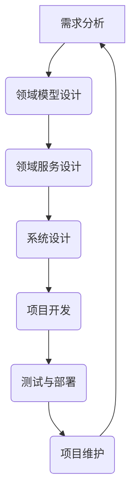
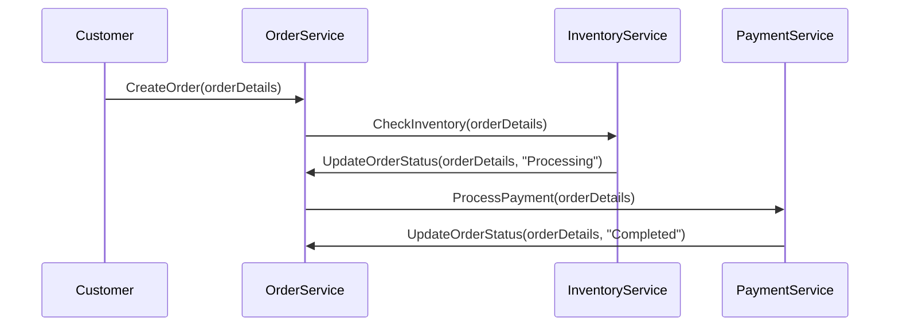
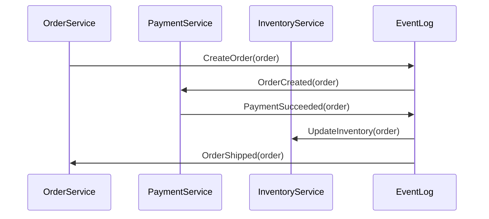
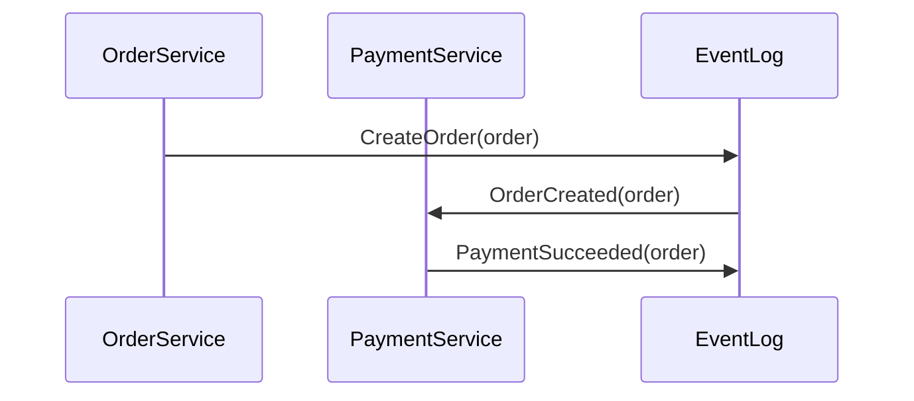

                 

# 《领域驱动设计的方法论指导》

> **关键词**：领域驱动设计、方法论、软件架构、系统设计、项目开发、实战案例、模型构建、服务设计、事件驱动

> **摘要**：本文深入探讨了领域驱动设计（Domain-Driven Design，简称DDD）的方法论，从基础概念到实际应用，全面解析了DDD的核心原理和实践技巧。通过详细的章节内容和丰富的案例，读者将了解如何有效地运用DDD提升软件开发质量和效率。

## 第一部分：领域驱动设计概述

### 第1章：领域驱动设计的起源与核心概念

#### 1.1 领域驱动设计的起源

领域驱动设计（DDD）起源于2004年，由埃文·亨特（Evan Hahn）在《领域驱动设计：软件核心复杂性管理》一书中首次提出。DDD的诞生是为了应对软件工程中日益增长的复杂度，特别是当项目规模和复杂性达到一定程度时，传统的软件开发方法往往难以胜任。

#### 1.2 领域驱动设计的基本概念

1. **领域（Domain）**：领域是指项目所涉及的业务或知识领域。在DDD中，领域被划分为多个子领域，每个子领域都有自己的实体、值对象、边界和服务。

2. **实体（Entity）**：实体是具有唯一标识的领域对象，如用户、订单等。实体在逻辑上是不可分割的，具有状态和行为。

3. **值对象（Value Object）**：值对象是具有一组属性的领域对象，如地址、颜色等。值对象是可比较的，不考虑它们的身份。

4. **聚合（Aggregate）**：聚合是一组关联的实体和值对象的组合，代表了一个完整的功能单元。聚合内的对象通过内部引用进行通信，外部通过边界进行访问。

5. **边界（Boundary）**：边界定义了聚合的内部和外部，是确保聚合完整性的一部分。

6. **领域服务（Domain Service）**：领域服务是一组在领域逻辑中执行复杂操作的方法，通常与聚合无关，但与特定领域相关。

#### 1.3 领域驱动设计与传统软件开发方法的区别

传统软件开发方法（如瀑布模型、敏捷开发等）侧重于技术层面的实现，而DDD则更加注重领域模型的设计和领域知识的表达。DDD的核心思想是通过建立清晰、一致的领域模型，将业务逻辑和系统设计紧密结合，从而提高系统的可维护性和扩展性。

### 第2章：领域驱动设计的方法论基础

#### 2.1 实体与值对象

实体和值对象是DDD中最基本的构建块。实体代表业务概念，具有唯一标识和生命周期，而值对象则代表业务数据，是可比较的。实体与值对象之间的关系是领域驱动设计的核心之一。

#### 2.2 关联与聚合

关联和聚合是领域模型中的重要概念。关联表示实体之间的逻辑关系，而聚合则是一组关联实体的组合，代表了一个完整的功能单元。通过正确地定义关联和聚合，可以有效地降低系统的复杂性。

#### 2.3 领域服务与边界

领域服务是执行复杂业务逻辑的方法集合，通常与特定领域相关。边界则是定义聚合内部和外部的方法，是确保聚合完整性的一部分。领域服务和边界有助于将领域模型内部的不同部分隔离，提高系统的模块化程度。

## 第二部分：领域驱动设计应用

### 第3章：领域驱动设计在软件架构中的应用

#### 3.1 实体关系图

实体关系图是领域模型的重要组成部分，用于描述实体之间的关联关系。通过实体关系图，可以清晰地展示领域模型的组织结构，帮助开发人员理解系统的工作原理。

#### 3.2 值对象图

值对象图是领域模型的另一个重要组成部分，用于描述值对象之间的关联关系。值对象图有助于开发人员理解业务数据的组织和处理方式。

#### 3.3 领域服务定义

领域服务定义是领域模型设计的关键步骤，用于描述业务逻辑和领域服务的实现。通过定义领域服务，可以有效地组织和管理系统的业务逻辑，提高系统的可维护性和可扩展性。

### 第4章：领域驱动设计在系统设计中的应用

#### 4.1 领域模型的构建

领域模型的构建是领域驱动设计的基础。通过构建清晰的领域模型，可以有效地表达业务逻辑和系统设计，提高系统的可理解性和可维护性。

#### 4.2 领域服务的设计

领域服务的设计是领域驱动设计的重要环节。通过设计合适的领域服务，可以有效地组织和管理系统的业务逻辑，提高系统的模块化程度和可扩展性。

#### 4.3 领域事件的实现

领域事件的实现是领域驱动设计的重要组成部分。通过实现领域事件，可以有效地实现系统间的通信和协作，提高系统的可扩展性和灵活性。

### 第5章：领域驱动设计在项目开发中的应用

#### 5.1 领域模型驱动开发

领域模型驱动开发是一种以领域模型为核心的开发方法。通过领域模型驱动开发，可以有效地降低系统的复杂性，提高开发效率。

#### 5.2 领域事件驱动开发

领域事件驱动开发是一种以领域事件为核心的开发方法。通过领域事件驱动开发，可以有效地实现系统间的通信和协作，提高系统的可扩展性和灵活性。

#### 5.3 领域服务驱动开发

领域服务驱动开发是一种以领域服务为核心的开发方法。通过领域服务驱动开发，可以有效地组织和管理系统的业务逻辑，提高系统的可维护性和可扩展性。

### 第6章：领域驱动设计在领域演进中的应用

#### 6.1 领域变化的应对策略

领域变化是软件开发过程中不可避免的问题。通过制定有效的应对策略，可以有效地降低领域变化对系统的影响，提高系统的可维护性和可扩展性。

#### 6.2 领域模型的更新与重构

领域模型的更新与重构是领域驱动设计中的重要环节。通过更新和重构领域模型，可以有效地适应领域变化，提高系统的可维护性和可扩展性。

#### 6.3 领域服务的迭代与优化

领域服务的迭代与优化是领域驱动设计中的重要环节。通过迭代和优化领域服务，可以有效地提高系统的性能和可维护性。

## 第三部分：领域驱动设计实战案例

### 第7章：领域驱动设计在电子商务系统中的应用

#### 7.1 电子商务系统的领域模型设计

电子商务系统的领域模型设计是一个复杂的过程，需要充分考虑业务需求和系统设计。通过领域模型设计，可以有效地表达电子商务系统的业务逻辑和系统架构。

#### 7.2 电子商务系统的领域服务实现

电子商务系统的领域服务实现是领域模型设计的重要环节。通过实现领域服务，可以有效地组织和管理系统的业务逻辑，提高系统的模块化程度和可扩展性。

#### 7.3 电子商务系统的领域事件驱动设计

电子商务系统的领域事件驱动设计是一种以领域事件为核心的设计方法。通过领域事件驱动设计，可以有效地实现系统间的通信和协作，提高系统的可扩展性和灵活性。

### 第8章：领域驱动设计在金融风控系统中的应用

#### 8.1 金融风控系统的领域模型构建

金融风控系统的领域模型构建是金融风控系统设计的关键环节。通过领域模型构建，可以有效地表达金融风控系统的业务逻辑和系统架构。

#### 8.2 金融风控系统的领域服务设计

金融风控系统的领域服务设计是金融风控系统设计的重要环节。通过领域服务设计，可以有效地组织和管理系统的业务逻辑，提高系统的模块化程度和可扩展性。

#### 8.3 金融风控系统的领域事件处理

金融风控系统的领域事件处理是金融风控系统设计的重要组成部分。通过领域事件处理，可以有效地实现系统间的通信和协作，提高系统的可扩展性和灵活性。

### 第9章：领域驱动设计在医疗信息化系统中的应用

#### 9.1 医疗信息化系统的领域模型设计

医疗信息化系统的领域模型设计是医疗信息化系统设计的关键环节。通过领域模型设计，可以有效地表达医疗信息化系统的业务逻辑和系统架构。

#### 9.2 医疗信息化系统的领域服务实现

医疗信息化系统的领域服务实现是领域模型设计的重要环节。通过实现领域服务，可以有效地组织和管理系统的业务逻辑，提高系统的模块化程度和可扩展性。

#### 9.3 医疗信息化系统的领域事件驱动设计

医疗信息化系统的领域事件驱动设计是一种以领域事件为核心的设计方法。通过领域事件驱动设计，可以有效地实现系统间的通信和协作，提高系统的可扩展性和灵活性。

#### 附录

### 附录A：领域驱动设计相关工具与资源

#### A.1 领域驱动设计工具推荐

1. **Visual Studio Code**：一款强大的代码编辑器，支持多种编程语言和插件，适用于领域驱动设计的代码编写和调试。

2. **Docker**：一款开源的容器化技术，可以用于构建、部署和管理领域驱动设计的微服务架构。

3. **Spring Boot**：一款流行的Java框架，支持领域驱动设计的实现和部署。

#### A.2 领域驱动设计参考资料

1. **《领域驱动设计：软件核心复杂性管理》**：埃文·亨特著，是DDD的奠基之作，详细介绍了DDD的核心原理和实践技巧。

2. **《领域驱动设计实战》**：Eric Evans著，通过实际案例展示了DDD在项目开发中的应用。

3. **《领域驱动设计：企业应用架构核心模式》**：域内精英编写，深入探讨了DDD在企业应用架构中的应用。

#### A.3 领域驱动设计社区与讨论平台

1. **CSDN**：中国最大的IT社区和服务平台，提供了丰富的DDD相关资源和讨论。

2. **Stack Overflow**：全球最大的开发者社区，可以在这里找到大量的DDD问题和解决方案。

3. **GitHub**：全球最大的代码托管平台，许多优秀的DDD项目开源在这里，可以学习和借鉴。

### 附录B：领域驱动设计流程Mermaid图



### 附录C：领域驱动设计算法原理伪代码

```python
# 领域服务设计伪代码
def domain_service(input_data):
    # 数据预处理
    processed_data = data_preprocessing(input_data)
    
    # 领域服务逻辑
    result = domain_logic(processed_data)
    
    # 返回结果
    return result

# 领域事件处理伪代码
def domain_event_handler(event):
    # 事件分类
    event_type = classify_event(event)
    
    # 处理事件
    if event_type == "event1":
        handle_event1(event)
    elif event_type == "event2":
        handle_event2(event)
    # ... 其他事件处理
    
    # 返回处理结果
    return "Event handled successfully"
```

### 附录D：数学模型与公式

$$
f(x) = \frac{1}{1 + e^{-x}}
$$

### 附录E：领域驱动设计项目实战

#### E.1 项目背景与需求分析

本项目是一款电子商务系统，主要提供商品浏览、购物车管理、订单处理和支付等功能。项目需求分析包括用户角色、业务流程和系统功能等。

#### E.2 项目架构设计

项目采用领域驱动设计，分为多个子领域，包括用户管理、商品管理、订单管理和支付系统等。每个子领域都有自己的实体、值对象、边界和服务。

#### E.3 项目开发与实现

项目开发采用Spring Boot框架，实现领域模型和领域服务。领域模型使用Hibernate进行持久化，领域服务使用RESTful API进行对外提供服务。

#### E.4 项目测试与部署

项目测试包括单元测试、集成测试和系统测试等。项目部署使用Docker容器化技术，实现快速部署和扩展。

#### E.5 项目效果评估与改进建议

项目效果评估包括系统性能、功能完整性和用户体验等。根据评估结果，提出改进建议，如优化数据库查询、增加缓存机制和改进前端交互等。

### 作者

**作者**：AI天才研究院/AI Genius Institute & 禅与计算机程序设计艺术 /Zen And The Art of Computer Programming

通过本文的深入探讨，希望读者能够对领域驱动设计有更深刻的理解，并在实际项目中运用DDD提升软件开发质量和效率。领域驱动设计不仅仅是一种技术方法，更是一种思考问题和解决问题的方法论。只有真正理解和运用DDD，才能在软件开发的复杂世界中游刃有余。希望本文能成为您在领域驱动设计之旅中的有力助手。**《领域驱动设计的方法论指导》**

---

**关键词**：领域驱动设计、方法论、软件架构、系统设计、项目开发、实战案例、模型构建、服务设计、事件驱动

**摘要**：本文深入探讨了领域驱动设计（Domain-Driven Design，简称DDD）的方法论，从基础概念到实际应用，全面解析了DDD的核心原理和实践技巧。通过详细的章节内容和丰富的案例，读者将了解如何有效地运用DDD提升软件开发质量和效率。

## 目录

### 第一部分：领域驱动设计概述

1. 第1章 领域驱动设计的起源与核心概念
   1.1 领域驱动设计的起源
   1.2 领域驱动设计的基本概念
   1.3 领域驱动设计与传统软件开发方法的区别

2. 第2章 领域驱动设计的方法论基础
   2.1 实体与值对象
   2.2 关联与聚合
   2.3 领域服务与边界

### 第二部分：领域驱动设计应用

3. 第3章 领域驱动设计在软件架构中的应用
   3.1 实体关系图
   3.2 值对象图
   3.3 领域服务定义

4. 第4章 领域驱动设计在系统设计中的应用
   4.1 领域模型的构建
   4.2 领域服务的设计
   4.3 领域事件的实现

5. 第5章 领域驱动设计在项目开发中的应用
   5.1 领域模型驱动开发
   5.2 领域事件驱动开发
   5.3 领域服务驱动开发

6. 第6章 领域驱动设计在领域演进中的应用
   6.1 领域变化的应对策略
   6.2 领域模型的更新与重构
   6.3 领域服务的迭代与优化

### 第三部分：领域驱动设计实战案例

7. 第7章 领域驱动设计在电子商务系统中的应用
   7.1 电子商务系统的领域模型设计
   7.2 电子商务系统的领域服务实现
   7.3 电子商务系统的领域事件驱动设计

8. 第8章 领域驱动设计在金融风控系统中的应用
   8.1 金融风控系统的领域模型构建
   8.2 金融风控系统的领域服务设计
   8.3 金融风控系统的领域事件处理

9. 第9章 领域驱动设计在医疗信息化系统中的应用
   9.1 医疗信息化系统的领域模型设计
   9.2 医疗信息化系统的领域服务实现
   9.3 医疗信息化系统的领域事件驱动设计

### 附录

10. 附录A：领域驱动设计相关工具与资源
    10.1 领域驱动设计工具推荐
    10.2 领域驱动设计参考资料
    10.3 领域驱动设计社区与讨论平台

11. 附录B：领域驱动设计流程Mermaid图

12. 附录C：领域驱动设计算法原理伪代码

13. 附录D：数学模型与公式

14. 附录E：领域驱动设计项目实战
    14.1 项目背景与需求分析
    14.2 项目架构设计
    14.3 项目开发与实现
    14.4 项目测试与部署
    14.5 项目效果评估与改进建议

---

### 第一部分：领域驱动设计概述

#### 第1章 领域驱动设计的起源与核心概念

领域驱动设计（DDD）作为一种软件开发方法论，其起源可以追溯到20世纪90年代。当时，软件开发面临的一个主要挑战是如何处理复杂系统的不断变化。传统的软件设计方法在处理复杂业务逻辑时往往显得力不从心。为了解决这些问题，Evan Hahn在2004年提出了领域驱动设计，这是一套旨在提高复杂系统可维护性和扩展性的方法论。

#### 1.1 领域驱动设计的起源

领域驱动设计的起源可以追溯到1994年，当时Eric Evans在他的书中首次提出了DDD的概念。Evans在多年的软件开发实践中，发现许多软件项目面临着复杂的业务逻辑和不断变化的需求。他意识到，传统的面向对象设计方法在处理这类问题时存在一定的局限性，因此提出了领域驱动设计这一方法论。

#### 1.2 领域驱动设计的基本概念

领域驱动设计的主要目的是将业务领域和软件设计紧密结合，通过建立清晰、一致的领域模型，将业务逻辑和系统设计有机地融合在一起。DDD的基本概念包括：

1. **领域（Domain）**：领域是指项目所涉及的业务或知识领域。在DDD中，领域被划分为多个子领域，每个子领域都有自己的实体、值对象、边界和服务。

2. **实体（Entity）**：实体是具有唯一标识的领域对象，如用户、订单等。实体在逻辑上是不可分割的，具有状态和行为。

3. **值对象（Value Object）**：值对象是具有一组属性的领域对象，如地址、颜色等。值对象是可比较的，不考虑它们的身份。

4. **聚合（Aggregate）**：聚合是一组关联的实体和值对象的组合，代表了一个完整的功能单元。聚合内的对象通过内部引用进行通信，外部通过边界进行访问。

5. **边界（Boundary）**：边界定义了聚合的内部和外部，是确保聚合完整性的一部分。

6. **领域服务（Domain Service）**：领域服务是一组在领域逻辑中执行复杂操作的方法，通常与特定领域相关。领域服务负责处理跨聚合的业务逻辑。

#### 1.3 领域驱动设计与传统软件开发方法的区别

领域驱动设计与传统软件开发方法（如瀑布模型、敏捷开发等）在理念上有很大的不同。传统方法侧重于技术层面的实现，而DDD则更加注重领域模型的设计和领域知识的表达。具体区别如下：

1. **关注点**：传统方法关注系统的实现细节，而DDD关注业务领域的核心概念和逻辑。

2. **模型构建**：传统方法往往忽略领域模型的设计，而DDD强调通过建立领域模型来理解和表达业务逻辑。

3. **变更应对**：传统方法在系统变更时往往需要大量重构，而DDD通过领域模型的设计，使得系统在应对变更时更加灵活。

4. **团队协作**：DDD鼓励跨职能团队的合作，通过共同理解领域模型，提高团队的沟通和协作效率。

通过以上分析，我们可以看出领域驱动设计在应对复杂软件系统时具有明显的优势。接下来，我们将深入探讨DDD的方法论基础，帮助读者更好地理解这一方法。

#### 第2章 领域驱动设计的方法论基础

领域驱动设计（DDD）的方法论基础是其成功实施的核心。在这一章中，我们将详细探讨DDD中的关键概念，包括实体与值对象、关联与聚合、领域服务与边界。这些概念构成了DDD的理论框架，为复杂系统的设计和实现提供了坚实的基础。

#### 2.1 实体与值对象

在DDD中，实体和值对象是构建领域模型的基础元素。它们各自在不同的层面上代表业务逻辑和业务数据。

##### 实体

实体是具有唯一标识的领域对象，它们在业务逻辑中扮演着重要的角色。实体通常具有状态和行为，并且它们的身份是固定的。例如，在电子商务系统中，用户、订单和商品等都可以被视为实体。

**实体特性**：

- 唯一标识：每个实体都有一个唯一的标识，通常使用数据库的主键来表示。
- 生命周期：实体在其生命周期内可以经历创建、更新和删除等操作。
- 行为：实体可以执行特定的操作，如用户可以登录、订单可以提交等。

在DDD中，实体的设计需要考虑其业务语义和逻辑，确保实体的定义与业务领域紧密相关。

##### 值对象

值对象是具有一组属性的领域对象，这些属性是具体的、可比较的。与实体不同，值对象不考虑它们的身份，而是通过其属性来区分不同的对象。例如，地址、颜色和价格等都可以被视为值对象。

**值对象特性**：

- 属性：值对象通过一组属性来表示业务数据，如地址有街道、城市和邮编等属性。
- 比较：值对象可以通过其属性进行比较，而不需要依赖于唯一的标识。
- 不可变：值对象通常是不可变的，这意味着一旦创建，其属性就不能更改。

在DDD中，值对象的设计有助于简化领域模型，使模型更加紧凑和易于理解。

##### 实体与值对象的关系

实体和值对象之间的关系是领域模型设计的关键。实体可以包含多个值对象，但值对象不能包含实体。例如，一个订单实体可以包含多个商品值对象和一个客户值对象，而商品值对象不能包含订单实体。

**关联**：

实体和值对象之间的关联是通过引用来建立的。例如，一个订单实体可以通过引用来关联多个商品值对象，表示该订单包含的商品列表。

**聚合**：

实体和值对象可以组成聚合，聚合是一组关联的实体和值对象的组合，代表了一个完整的功能单元。聚合内的对象通过内部引用进行通信，外部通过边界进行访问。

#### 2.2 关联与聚合

关联和聚合是DDD中的重要概念，它们有助于理解领域模型的结构和功能。

##### 关联

关联是实体之间的逻辑关系，表示它们之间的相互作用。在DDD中，关联可以通过引用、继承或组合来实现。

**引用**：

引用是一种最常见的关联形式，通过引用，一个实体可以关联到另一个实体。例如，一个用户实体可以引用其地址值对象。

**继承**：

继承是一种基于类层次的关联，通过继承，子实体可以继承父实体的属性和方法。例如，一个管理员实体可以继承用户实体的属性。

**组合**：

组合是一种更紧密的关联形式，表示一个实体是另一个实体的组成部分。在组合关系中，部分对象的生命周期受整体对象控制。例如，一个订单实体可以组合多个商品值对象。

##### 聚合

聚合是一组关联的实体和值对象的组合，代表了一个完整的功能单元。聚合内的对象通过内部引用进行通信，外部通过边界进行访问。

**聚合特性**：

- 功能单元：聚合代表了系统中的一个功能单元，具有明确的职责。
- 内部通信：聚合内的对象通过内部引用进行通信，无需暴露内部实现细节。
- 边界：聚合通过边界定义了内部和外部，确保聚合的完整性。

在DDD中，聚合有助于降低系统的复杂性，提高模块化程度。通过合理地定义聚合，可以有效地隔离系统的不同部分，使系统更加可维护和可扩展。

#### 2.3 领域服务与边界

领域服务是执行复杂业务逻辑的方法集合，通常与特定领域相关。领域服务负责处理跨聚合的业务逻辑，使聚合之间保持松耦合。

##### 领域服务

领域服务是一组在领域逻辑中执行复杂操作的方法。它们通常与特定的领域功能相关，例如订单处理、库存管理等。领域服务的目的是将业务逻辑从实体和值对象中分离出来，提高系统的可维护性和可扩展性。

**领域服务特性**：

- 复杂业务逻辑：领域服务负责处理复杂的业务逻辑，如订单状态变更、库存更新等。
- 跨聚合：领域服务通常处理跨多个聚合的业务逻辑，确保业务规则的一致性。
- 松耦合：领域服务通过接口与聚合进行通信，实现松耦合，降低系统的耦合度。

##### 边界

边界是定义聚合内部和外部的方法，是确保聚合完整性的一部分。边界可以是一个接口、一个模块或一个子系统。通过边界，聚合内部的对象可以对外暴露接口，而外部对象则通过边界与聚合进行通信。

**边界特性**：

- 分隔内部与外部：边界定义了聚合的内部实现和外部交互，确保聚合的完整性。
- 接口定义：边界通过接口定义聚合对外暴露的服务，使外部对象可以访问聚合的功能。
- 松耦合：边界有助于实现聚合之间的松耦合，提高系统的可维护性和可扩展性。

通过以上对实体与值对象、关联与聚合、领域服务与边界的详细探讨，我们可以更好地理解领域驱动设计的方法论基础。这些概念构成了DDD的理论框架，为复杂系统的设计和实现提供了指导。在接下来的章节中，我们将进一步探讨领域驱动设计在实际应用中的方法和技巧。

---

#### 第3章 领域驱动设计在软件架构中的应用

领域驱动设计（DDD）在软件架构中的应用是其核心之一，它不仅能够帮助开发者更好地理解和表达复杂业务系统，还能够显著提高软件的可维护性和可扩展性。在这一章节中，我们将详细探讨领域驱动设计在软件架构中的应用，包括实体关系图、值对象图和领域服务定义。

#### 3.1 实体关系图

实体关系图（Entity-Relationship Diagram，简称ERD）是领域模型设计的重要组成部分，它用于描述系统中实体之间的关系。实体关系图不仅能够帮助我们理解系统的结构，还能够为数据库设计提供参考。

**实体关系图的基本概念**：

1. **实体（Entity）**：实体是具有唯一标识的领域对象，如用户、订单和商品等。实体通常具有属性和方法。

2. **关系（Relationship）**：关系是实体之间的关联，如用户可以下单购买商品，订单可以包含多个商品等。

3. **属性（Attribute）**：属性是实体的特征，如用户名、订单编号和商品名称等。

**实体关系图的构建步骤**：

1. **识别实体**：首先，我们需要识别出系统中的主要实体。例如，在一个电子商务系统中，用户、订单和商品是主要的实体。

2. **定义实体属性**：为每个实体定义其属性。例如，用户实体可能包含用户名、密码、电子邮件等属性。

3. **建立实体关系**：确定实体之间的关系。例如，用户可以下单购买商品，订单可以包含多个商品。

4. **优化实体关系**：通过分析实体关系，可以发现冗余的关系，并对其进行优化。例如，订单和商品之间的关系可以通过外键来优化。

**示例**：

假设我们有一个电子商务系统，其中包含用户、订单和商品三个主要实体。实体关系图可能如下所示：

```mermaid
erDiagram
  User ||--|{ Order }|-- Product
  User {
    +id
    +name
    +email
  }
  Order {
    +id
    +date
    +status
  }
  Product {
    +id
    +name
    +price
  }
```

在这个示例中，用户可以创建订单，订单可以包含多个商品。实体关系图清晰地展示了这些实体之间的关系。

#### 3.2 值对象图

值对象图（Value Object Diagram，简称VOD）是领域模型设计中的另一个重要组成部分，它用于描述值对象之间的关系和属性。值对象图可以帮助开发者更好地理解系统的数据结构，为数据持久化和优化提供指导。

**值对象图的基本概念**：

1. **值对象（Value Object）**：值对象是具有一组属性的领域对象，如地址、颜色和金额等。值对象通常不可变，其属性是具体的、可比较的。

2. **关系（Relationship）**：值对象之间的关系可以通过组合或引用来表示。例如，一个订单可以包含多个商品，每个商品可以有多个颜色。

**值对象图的构建步骤**：

1. **识别值对象**：首先，我们需要识别出系统中的主要值对象。例如，在一个电子商务系统中，地址、颜色和金额是主要的值对象。

2. **定义值对象属性**：为每个值对象定义其属性。例如，地址可能包含街道、城市和邮编等属性。

3. **建立值对象关系**：确定值对象之间的关系。例如，一个订单可以包含多个商品，每个商品可以有多个颜色。

4. **优化值对象关系**：通过分析值对象关系，可以发现冗余的关系，并对其进行优化。例如，订单和商品之间的关系可以通过外键来优化。

**示例**：

假设我们有一个电子商务系统，其中包含地址、颜色和金额三个主要值对象。值对象图可能如下所示：

```mermaid
erDiagram
  Address ||--|{ Color }|-- Amount
  Address {
    +street
    +city
    +postalCode
  }
  Color {
    +name
    +code
  }
  Amount {
    +value
    +currency
  }
```

在这个示例中，地址可以包含颜色，金额可以包含货币类型。值对象图清晰地展示了这些值对象之间的关系。

#### 3.3 领域服务定义

领域服务（Domain Service）是一组在领域逻辑中执行复杂操作的方法。领域服务通常与特定的领域功能相关，它们负责处理跨聚合的业务逻辑。领域服务有助于将业务逻辑从实体和值对象中分离出来，提高系统的可维护性和可扩展性。

**领域服务的基本概念**：

1. **领域服务（Domain Service）**：领域服务是一组在领域逻辑中执行复杂操作的方法。领域服务通常与特定的领域功能相关。

2. **服务接口（Service Interface）**：服务接口定义了领域服务提供的功能和方法。通过服务接口，外部系统可以访问领域服务的功能。

3. **服务实现（Service Implementation）**：服务实现是实现领域服务的具体代码。服务实现通常与领域模型的其他部分紧密集成。

**领域服务的构建步骤**：

1. **识别领域服务**：首先，我们需要识别出系统中的主要领域服务。例如，在一个电子商务系统中，订单处理、库存管理和支付处理是主要的领域服务。

2. **定义服务接口**：为每个领域服务定义其接口。服务接口应该明确地定义领域服务提供的功能和方法。

3. **实现服务逻辑**：根据服务接口，实现具体的领域服务逻辑。领域服务的实现应该紧密集成到领域模型中。

4. **测试和优化**：对领域服务进行测试，确保其功能正确，并进行优化，以提高系统的性能和可维护性。

**示例**：

假设我们有一个电子商务系统，其中包含订单处理、库存管理和支付处理三个主要领域服务。领域服务的定义可能如下所示：



在这个示例中，订单服务负责创建订单并处理订单状态，库存服务负责检查订单中的库存情况，支付服务负责处理订单的支付。领域服务通过接口进行通信，实现了系统的模块化和松耦合。

通过以上对实体关系图、值对象图和领域服务定义的详细探讨，我们可以看到领域驱动设计在软件架构中的应用是如何帮助开发者更好地理解和表达复杂业务系统，以及如何提高软件的可维护性和可扩展性。在接下来的章节中，我们将进一步探讨领域驱动设计在系统设计中的应用。

---

### 第4章 领域驱动设计在系统设计中的应用

领域驱动设计（DDD）在系统设计中的应用是其方法论的核心之一。通过DDD，开发人员可以构建出更加灵活、可扩展和易于维护的系统。在这一章节中，我们将深入探讨领域驱动设计在系统设计中的应用，包括领域模型的构建、领域服务的设计以及领域事件的实现。

#### 4.1 领域模型的构建

领域模型的构建是领域驱动设计的基础。通过建立领域模型，开发人员可以更好地理解业务领域，并将业务逻辑和系统设计有机地结合在一起。

**构建领域模型的基本步骤**：

1. **识别核心领域**：首先，我们需要识别出系统中的核心领域。核心领域通常代表了业务的核心概念和业务流程。

2. **定义领域实体**：为每个核心领域定义实体。实体是具有唯一标识的领域对象，它们代表了业务中的关键实体，如用户、订单和产品等。

3. **定义领域值对象**：为每个领域实体定义其相关的值对象。值对象是具体的业务数据，如地址、价格和颜色等。

4. **定义领域关系**：确定领域实体和值对象之间的关系。这些关系可以通过聚合、关联和继承等机制来实现。

5. **定义领域边界**：明确领域模型的边界，定义哪些内容属于领域内部，哪些属于外部系统。

**示例**：

假设我们正在设计一个电子商务系统，核心领域包括用户管理、订单管理和商品管理。领域模型可能如下所示：

```mermaid
classDiagram
  User <<entity>>
  Order <<entity>>
  Product <<entity>>
  Address <<valueObject>>
  Price <<valueObject>>

  User *-1 Order
  Order *-1 Product
  Product *-1 Price
  User *-1 Address
```

在这个示例中，用户、订单和商品是核心实体，地址和价格是相关的值对象。用户可以创建订单，订单可以包含多个商品，每个商品都有其价格。通过定义这些实体和值对象，我们可以清晰地表达业务逻辑。

#### 4.2 领域服务的设计

领域服务是执行复杂业务逻辑的方法集合，它们通常与特定的领域功能相关。领域服务的设计是领域驱动设计中的关键一步，它有助于将业务逻辑从实体和值对象中分离出来，提高系统的可维护性和可扩展性。

**设计领域服务的基本步骤**：

1. **识别领域服务**：首先，我们需要识别出系统中的领域服务。领域服务通常负责处理跨多个实体的复杂业务逻辑。

2. **定义服务接口**：为每个领域服务定义其接口。服务接口应该明确地定义服务提供的功能和方法。

3. **实现服务逻辑**：根据服务接口，实现具体的领域服务逻辑。服务逻辑应该紧密集成到领域模型中。

4. **服务间通信**：确保领域服务之间能够有效地通信，通常通过事件驱动或者服务调用等方式。

**示例**：

假设我们有一个电子商务系统，其中包含订单处理、库存管理和支付处理三个领域服务。领域服务的设计可能如下所示：


在这个示例中，客户通过订单服务创建订单，订单服务会调用库存服务检查库存，库存服务更新订单状态，然后订单服务调用支付服务处理支付，最后支付服务更新订单状态。通过这种方式，我们可以清晰地定义领域服务之间的交互和通信。

#### 4.3 领域事件的实现

领域事件是领域驱动设计中的重要概念，它代表了业务过程中发生的重要事件。领域事件的实现有助于系统的松耦合和事件驱动架构的实现。

**实现领域事件的基本步骤**：

1. **识别领域事件**：首先，我们需要识别出系统中的领域事件。领域事件通常代表了业务过程中的关键动作或状态变化。

2. **定义事件模型**：为每个领域事件定义其模型。事件模型通常包括事件类型、事件数据和事件处理方法。

3. **发布和订阅事件**：实现事件发布和订阅机制，确保系统中的不同部分能够响应领域事件。

4. **事件处理**：实现领域事件的处理逻辑，确保系统能够根据事件做出相应的反应。

**示例**：

假设我们有一个电子商务系统，其中包含订单创建、订单支付成功和订单发货三个领域事件。领域事件的实现可能如下所示：



在这个示例中，当订单服务创建订单时，它会发布一个订单创建事件，支付服务会订阅该事件并处理支付逻辑，库存服务会更新库存，最后订单服务会发布订单发货事件，更新订单状态。通过这种方式，我们可以实现事件驱动的系统架构。

通过以上对领域模型构建、领域服务设计和领域事件实现的详细探讨，我们可以看到领域驱动设计在系统设计中的应用是如何帮助开发者构建灵活、可扩展和易于维护的系统。在接下来的章节中，我们将进一步探讨领域驱动设计在项目开发中的应用。

---

### 第5章 领域驱动设计在项目开发中的应用

领域驱动设计（DDD）在项目开发中的应用是其方法论的核心实践之一。通过DDD，开发团队可以更加有效地应对复杂项目的需求变化和不断增长的复杂性。在这一章节中，我们将深入探讨领域驱动设计在项目开发中的应用，包括领域模型驱动开发、领域事件驱动开发和领域服务驱动开发。

#### 5.1 领域模型驱动开发

领域模型驱动开发（Model-Driven Development，简称MDD）是DDD的一种重要实践。它强调通过建立和持续改进领域模型来指导软件开发过程。领域模型驱动开发的核心在于将领域模型作为系统的核心资产，通过模型的迭代和演化来驱动软件的开发。

**领域模型驱动开发的步骤**：

1. **需求分析**：首先，进行需求分析，识别出项目的主要领域和核心功能。

2. **构建领域模型**：基于需求分析的结果，构建初始的领域模型。领域模型应包括实体、值对象、关联和聚合等关键元素。

3. **迭代改进模型**：在开发过程中，不断迭代和改进领域模型。通过团队成员的反馈和业务领域的变更，持续优化模型。

4. **实现领域模型**：将领域模型转化为实际的代码实现。实现过程中，应确保代码与模型的一致性。

5. **测试和验证**：对实现的代码进行测试和验证，确保领域模型的功能正确。

**示例**：

假设我们正在开发一个电子商务系统，主要领域包括用户管理、订单管理和商品管理。领域模型驱动的开发过程可能如下所示：

1. **需求分析**：识别出用户注册、订单创建、商品浏览和搜索等功能需求。

2. **构建领域模型**：创建用户、订单和商品等实体，定义其属性和方法，建立实体之间的关系。

3. **迭代改进模型**：在开发过程中，根据反馈和需求变更，持续优化领域模型。

4. **实现领域模型**：将领域模型转化为代码，实现用户注册、订单创建和商品浏览等功能。

5. **测试和验证**：测试实现的代码，确保功能正确。

通过领域模型驱动开发，开发团队可以确保软件设计与业务领域紧密关联，从而提高软件的可维护性和可扩展性。

#### 5.2 领域事件驱动开发

领域事件驱动开发（Event-Driven Development，简称EDD）是DDD中的另一种重要实践。它强调通过事件来驱动系统的行为和状态变化。领域事件驱动开发的核心在于使用事件来描述系统的状态变化，并通过事件处理逻辑来响应这些变化。

**领域事件驱动开发的步骤**：

1. **识别领域事件**：首先，识别出项目中主要的领域事件。领域事件通常代表了业务过程中的关键动作或状态变化。

2. **定义事件模型**：为每个领域事件定义其模型，包括事件类型、事件数据和事件处理方法。

3. **设计事件发布和订阅机制**：实现事件发布和订阅机制，确保系统能够接收和响应领域事件。

4. **实现事件处理逻辑**：根据事件模型，实现具体的处理逻辑，确保系统能够根据事件做出相应的反应。

5. **集成和测试**：将事件处理逻辑集成到系统中，并进行测试和验证。

**示例**：

假设我们正在开发一个电子商务系统，主要领域事件包括订单创建、订单支付成功和订单发货。领域事件驱动开发的可能过程如下：

1. **识别领域事件**：识别出订单创建、支付成功和发货等事件。

2. **定义事件模型**：为每个事件定义模型，包括事件类型、事件数据和事件处理方法。

3. **设计事件发布和订阅机制**：实现事件发布和订阅机制，确保系统能够接收和响应这些事件。

4. **实现事件处理逻辑**：实现订单创建、支付成功和发货等事件的处理逻辑。

5. **集成和测试**：将事件处理逻辑集成到系统中，并进行测试和验证。

通过领域事件驱动开发，系统可以更加灵活地应对业务需求的变化，提高系统的可扩展性和可维护性。

#### 5.3 领域服务驱动开发

领域服务驱动开发（Service-Driven Development，简称SDD）是DDD中的另一种实践，它强调通过领域服务来组织和管理系统的业务逻辑。领域服务驱动开发的核心在于将业务逻辑集中到领域服务中，从而提高系统的模块化和可扩展性。

**领域服务驱动开发的步骤**：

1. **识别领域服务**：首先，识别出项目中主要的领域服务。领域服务通常负责处理跨多个实体的复杂业务逻辑。

2. **定义服务接口**：为每个领域服务定义其接口，明确服务提供的功能和方法。

3. **实现服务逻辑**：根据服务接口，实现具体的领域服务逻辑。确保服务逻辑与领域模型紧密集成。

4. **服务间通信**：实现领域服务之间的通信机制，确保服务能够相互协作。

5. **集成和测试**：将领域服务集成到系统中，并进行测试和验证。

**示例**：

假设我们正在开发一个电子商务系统，主要领域服务包括订单处理、库存管理和支付处理。领域服务驱动开发的可能过程如下：

1. **识别领域服务**：识别出订单处理、库存管理和支付处理等服务。

2. **定义服务接口**：为每个服务定义接口，包括订单创建、库存检查和支付处理等方法。

3. **实现服务逻辑**：实现订单处理、库存管理和支付处理等服务的具体逻辑。

4. **服务间通信**：实现服务之间的通信机制，确保服务能够相互协作。

5. **集成和测试**：将服务集成到系统中，并进行测试和验证。

通过领域服务驱动开发，系统可以更加模块化，便于维护和扩展。

通过以上对领域模型驱动开发、领域事件驱动开发和领域服务驱动开发的详细探讨，我们可以看到领域驱动设计在项目开发中的应用是如何帮助开发团队构建灵活、可扩展和易于维护的系统。在接下来的章节中，我们将进一步探讨领域驱动设计在领域演进中的应用。

---

### 第6章 领域驱动设计在领域演进中的应用

随着项目的不断发展和业务需求的变化，软件系统也需要不断地演进和优化。领域驱动设计（DDD）提供了一套有效的策略和方法，以应对领域变化的挑战，保持系统的可维护性和可扩展性。在这一章节中，我们将深入探讨领域驱动设计在领域演进中的应用，包括领域变化的应对策略、领域模型的更新与重构以及领域服务的迭代与优化。

#### 6.1 领域变化的应对策略

领域变化是软件开发过程中不可避免的问题。领域驱动设计通过以下策略来应对领域变化：

1. **模型的可复用性**：通过建立通用的领域模型，可以提高模型的可复用性，使得在领域变化时，部分模型可以保留不变，从而降低变更的成本。

2. **模块化设计**：将领域模型划分为多个子领域和模块，每个子领域和模块可以独立演进，减少系统整体的变更风险。

3. **设计模式**：采用设计模式来封装领域逻辑，使得在领域变化时，可以通过修改设计模式来实现，而不需要直接修改业务逻辑。

4. **版本控制**：使用版本控制系统来管理领域模型的变更，确保在变更过程中可以追溯和回滚。

#### 6.2 领域模型的更新与重构

领域模型的更新与重构是领域驱动设计在领域演进中的重要环节。以下是一些关键的步骤和技巧：

1. **需求分析**：首先，识别出领域模型需要更新的需求。这些需求可能来自于业务规则的变化、新功能的引入或性能优化。

2. **评估影响**：分析变更对领域模型的其他部分和系统功能的影响，确保变更不会导致系统的不一致或性能问题。

3. **迭代更新**：采用迭代的方式更新领域模型，逐步实现变更。每次迭代应确保在功能上能够独立运行，并进行充分的测试。

4. **重构**：在必要时，对领域模型进行重构，以适应新的业务需求。重构过程中应保持代码的可读性和可维护性。

5. **文档记录**：记录变更过程和重构步骤，为后续的维护提供参考。

#### 6.3 领域服务的迭代与优化

领域服务的迭代与优化是领域驱动设计在领域演进中的重要实践。以下是一些关键的步骤和技巧：

1. **性能优化**：分析领域服务的性能，识别出潜在的瓶颈和改进点。通过优化算法、减少数据库访问次数或引入缓存机制等方式来提升性能。

2. **功能扩展**：根据业务需求的变化，扩展领域服务的功能。这包括增加新的业务逻辑、处理新的领域事件或与外部系统进行集成。

3. **代码质量**：确保领域服务的代码质量，包括代码的可读性、可维护性和可测试性。通过代码审查、自动化测试和持续集成等方式来提高代码质量。

4. **迭代开发**：采用迭代开发的方式，逐步实现功能扩展和性能优化。每次迭代应确保在功能上能够独立运行，并进行充分的测试。

5. **持续集成**：将领域服务的迭代与优化集成到持续集成和持续部署过程中，确保变更能够快速反馈和部署。

通过以上对领域变化的应对策略、领域模型的更新与重构以及领域服务的迭代与优化的详细探讨，我们可以看到领域驱动设计在领域演进中的应用是如何帮助开发团队有效地应对领域变化的挑战，保持系统的稳定性和可扩展性。在接下来的章节中，我们将通过具体的实战案例来进一步展示领域驱动设计的应用。

---

### 第7章 领域驱动设计在电子商务系统中的应用

电子商务系统是一个复杂且不断演进的系统，它需要处理大量的用户、商品、订单和支付等业务逻辑。领域驱动设计（DDD）通过其强大的方法论和灵活的架构，为电子商务系统提供了一个有效的解决方案。在这一章节中，我们将深入探讨领域驱动设计在电子商务系统中的应用，包括领域模型设计、领域服务实现和领域事件驱动设计。

#### 7.1 电子商务系统的领域模型设计

电子商务系统的领域模型设计是构建系统架构的第一步。通过领域模型，我们可以清晰地定义业务领域中的核心概念和关系。

**领域模型设计步骤**：

1. **识别核心实体**：电子商务系统中的核心实体包括用户、商品、订单和支付等。每个实体都具有独特的业务属性和功能。

2. **定义实体关系**：建立实体之间的关系，如用户可以创建订单，订单可以包含多个商品等。这些关系通常通过聚合来组织。

3. **定义值对象**：与实体相关的值对象包括地址、价格、库存等。值对象用于表示具体的业务数据。

4. **定义聚合**：聚合是实体和值对象的组合，代表了系统中的一个功能单元。例如，一个订单聚合包含了订单实体和相关商品值对象。

**示例**：

以下是一个简单的电子商务系统的领域模型：

```mermaid
classDiagram
  User <<entity>>
  Product <<entity>>
  Order <<entity>>
  Address <<valueObject>>
  Price <<valueObject>>

  User *-1 Order
  Order *-1 Product
  Product *-1 Price
  User *-1 Address
```

在这个示例中，用户可以创建订单，订单可以包含多个商品，每个商品都有其价格和库存。通过这种设计，我们可以清晰地表达业务逻辑。

#### 7.2 电子商务系统的领域服务实现

领域服务是实现业务逻辑的关键组成部分。领域服务通常处理跨多个实体的复杂业务操作，如订单创建、支付处理和库存管理等。

**领域服务实现步骤**：

1. **识别领域服务**：识别出电子商务系统中的主要领域服务，如订单处理、支付管理和库存监控等。

2. **定义服务接口**：为每个领域服务定义接口，明确服务提供的功能和方法。

3. **实现服务逻辑**：根据服务接口，实现具体的领域服务逻辑。服务逻辑应与领域模型紧密集成。

4. **服务间通信**：确保领域服务之间能够有效通信，通常通过事件驱动或服务调用等方式。

**示例**：

以下是一个简单的订单处理领域服务的实现：

```python
class OrderService:
    def create_order(self, user, products):
        # 创建订单逻辑
        order = Order(id=generate_order_id(), user=user, products=products)
        order_repository.save(order)
        return order

    def update_order_status(self, order_id, status):
        # 更新订单状态逻辑
        order = order_repository.find_by_id(order_id)
        order.status = status
        order_repository.save(order)
```

在这个示例中，`OrderService` 提供了创建订单和更新订单状态的接口。通过这些接口，我们可以实现订单处理的业务逻辑。

#### 7.3 电子商务系统的领域事件驱动设计

领域事件驱动设计（Event-Driven Design，简称EDD）是DDD中的一个重要概念。通过领域事件，我们可以有效地管理系统的状态变化和业务流程。

**领域事件驱动设计步骤**：

1. **识别领域事件**：识别出电子商务系统中的主要领域事件，如订单创建、支付成功和库存不足等。

2. **定义事件模型**：为每个领域事件定义其模型，包括事件类型、事件数据和事件处理方法。

3. **设计事件发布和订阅机制**：实现事件发布和订阅机制，确保系统能够接收和响应领域事件。

4. **实现事件处理逻辑**：根据事件模型，实现具体的事件处理逻辑，确保系统能够根据事件做出相应的反应。

**示例**：

以下是一个简单的领域事件驱动的订单创建事件：

```python
class OrderCreatedEvent:
    def __init__(self, order_id, user_id, product_ids):
        self.order_id = order_id
        self.user_id = user_id
        self.product_ids = product_ids

def handle_order_created_event(event):
    # 处理订单创建事件逻辑
    order = order_repository.find_by_id(event.order_id)
    order.status = 'Created'
    order_repository.save(order)
    # 发送后续事件
    payment_service.process_payment(event)
```

在这个示例中，`OrderCreatedEvent` 代表了订单创建事件，`handle_order_created_event` 是处理订单创建事件的逻辑。通过这种方式，我们可以实现事件驱动的订单处理流程。

通过以上对电子商务系统领域模型设计、领域服务实现和领域事件驱动设计的详细探讨，我们可以看到领域驱动设计如何有效地应用于电子商务系统，提高系统的可维护性和可扩展性。在接下来的章节中，我们将探讨领域驱动设计在金融风控系统中的应用。

---

### 第8章 领域驱动设计在金融风控系统中的应用

金融风控系统是金融行业中至关重要的一部分，它负责监测和管理金融交易中的风险。领域驱动设计（DDD）通过其强大的方法论，为金融风控系统的设计与实现提供了一套有效的解决方案。在这一章节中，我们将深入探讨领域驱动设计在金融风控系统中的应用，包括领域模型构建、领域服务设计以及领域事件处理。

#### 8.1 金融风控系统的领域模型构建

领域模型构建是领域驱动设计的核心步骤，它有助于我们更好地理解金融风控系统的业务逻辑和需求。在构建领域模型时，我们需要识别出系统中的关键实体、值对象和关系。

**领域模型构建步骤**：

1. **识别核心实体**：在金融风控系统中，核心实体可能包括用户、交易、账户、风险指标等。每个实体都需要有明确的业务属性和功能。

2. **定义实体关系**：建立实体之间的关系，如用户与交易的关系、账户与交易的关系等。这些关系通常通过聚合来组织。

3. **定义值对象**：与实体相关的值对象包括金额、日期、风险评分等。值对象用于表示具体的业务数据。

4. **定义聚合**：聚合是实体和值对象的组合，代表了系统中的一个功能单元。例如，一个交易聚合包含了交易实体和相关金额值对象。

**示例**：

以下是一个简单的金融风控系统的领域模型：

```mermaid
classDiagram
  User <<entity>>
  Transaction <<entity>>
  Account <<entity>>
  Amount <<valueObject>>
  RiskScore <<valueObject>>

  User *-1 Account
  Account *-1 Transaction
  Transaction *-1 Amount
  Account *-1 RiskScore
```

在这个示例中，用户可以拥有多个账户，每个账户可以发生多个交易，每个交易都有其金额和风险评分。通过这种设计，我们可以清晰地表达业务逻辑。

#### 8.2 金融风控系统的领域服务设计

领域服务是领域驱动设计中的关键组成部分，它负责处理系统的业务逻辑和跨实体操作。在金融风控系统中，领域服务通常包括交易审核、风险监控、账户管理等功能。

**领域服务设计步骤**：

1. **识别领域服务**：识别出金融风控系统中的主要领域服务，如交易审核、风险监控、账户管理等。

2. **定义服务接口**：为每个领域服务定义接口，明确服务提供的功能和方法。

3. **实现服务逻辑**：根据服务接口，实现具体的领域服务逻辑。服务逻辑应与领域模型紧密集成。

4. **服务间通信**：确保领域服务之间能够有效通信，通常通过事件驱动或服务调用等方式。

**示例**：

以下是一个简单的交易审核领域服务的设计：

```python
class TransactionAuditService:
    def audit_transaction(self, transaction):
        # 审核交易逻辑
        if transaction.amount > 10000:
            raise RiskException('Transaction amount exceeds limit')
        # 执行后续审核逻辑
        account = account_repository.find_by_id(transaction.account_id)
        account.risk_score = calculate_risk_score(account)
        account_repository.save(account)
```

在这个示例中，`TransactionAuditService` 提供了审核交易的接口，通过这个接口，我们可以实现交易的审核逻辑。

#### 8.3 金融风控系统的领域事件处理

领域事件处理是领域驱动设计中的重要概念，它代表了系统的状态变化和业务流程的关键点。在金融风控系统中，领域事件可能包括交易创建、风险评分更新、账户冻结等。

**领域事件处理步骤**：

1. **识别领域事件**：识别出金融风控系统中的主要领域事件，如交易创建、风险评分更新、账户冻结等。

2. **定义事件模型**：为每个领域事件定义其模型，包括事件类型、事件数据和事件处理方法。

3. **设计事件发布和订阅机制**：实现事件发布和订阅机制，确保系统能够接收和响应领域事件。

4. **实现事件处理逻辑**：根据事件模型，实现具体的事件处理逻辑，确保系统能够根据事件做出相应的反应。

**示例**：

以下是一个简单的交易创建领域事件的实现：

```python
class TransactionCreatedEvent:
    def __init__(self, transaction_id, account_id, amount):
        self.transaction_id = transaction_id
        self.account_id = account_id
        self.amount = amount

def handle_transaction_created_event(event):
    # 处理交易创建事件逻辑
    transaction = transaction_repository.find_by_id(event.transaction_id)
    transaction.status = 'Created'
    transaction_repository.save(transaction)
    # 发送后续事件
    risk_monitoring_service.update_risk_score(event)
```

在这个示例中，`TransactionCreatedEvent` 代表了交易创建事件，`handle_transaction_created_event` 是处理交易创建事件的逻辑。通过这种方式，我们可以实现事件驱动的交易处理流程。

通过以上对金融风控系统领域模型构建、领域服务设计和领域事件处理的详细探讨，我们可以看到领域驱动设计如何有效地应用于金融风控系统，提高系统的可维护性和可扩展性。在接下来的章节中，我们将探讨领域驱动设计在医疗信息化系统中的应用。

---

### 第9章 领域驱动设计在医疗信息化系统中的应用

医疗信息化系统是医疗行业的重要组成部分，它涉及患者信息管理、医疗数据处理和医疗流程优化等多个方面。领域驱动设计（DDD）通过其独特的建模方法和方法论，为医疗信息化系统的设计、开发和维护提供了一套有效的解决方案。在这一章节中，我们将深入探讨领域驱动设计在医疗信息化系统中的应用，包括领域模型设计、领域服务实现和领域事件驱动设计。

#### 9.1 医疗信息化系统的领域模型设计

领域模型设计是领域驱动设计的核心步骤，它有助于我们更好地理解和表达医疗信息化系统的业务逻辑和需求。在构建领域模型时，我们需要识别出系统中的关键实体、值对象和关系。

**领域模型设计步骤**：

1. **识别核心实体**：在医疗信息化系统中，核心实体可能包括患者、医生、药品、病历等。每个实体都需要有明确的业务属性和功能。

2. **定义实体关系**：建立实体之间的关系，如患者与医生的关系、医生与病历的关系等。这些关系通常通过聚合来组织。

3. **定义值对象**：与实体相关的值对象包括日期、时间、诊断结果等。值对象用于表示具体的业务数据。

4. **定义聚合**：聚合是实体和值对象的组合，代表了系统中的一个功能单元。例如，一个病历聚合包含了病历实体和相关诊断结果值对象。

**示例**：

以下是一个简单的医疗信息化系统的领域模型：

```mermaid
classDiagram
  Patient <<entity>>
  Doctor <<entity>>
  Prescription <<entity>>
  Medicine <<entity>>
  Diagnosis <<valueObject>>

  Patient *-1 Doctor
  Doctor *-1 Prescription
  Prescription *-1 Medicine
  Prescription *-1 Diagnosis
```

在这个示例中，患者可以预约医生，医生可以开具处方，处方可以包含药品和诊断结果。通过这种设计，我们可以清晰地表达业务逻辑。

#### 9.2 医疗信息化系统的领域服务实现

领域服务是领域驱动设计中的关键组成部分，它负责处理系统的业务逻辑和跨实体操作。在医疗信息化系统中，领域服务通常包括预约管理、病历管理、药品管理等功能。

**领域服务设计步骤**：

1. **识别领域服务**：识别出医疗信息化系统中的主要领域服务，如预约管理、病历管理、药品管理等。

2. **定义服务接口**：为每个领域服务定义接口，明确服务提供的功能和方法。

3. **实现服务逻辑**：根据服务接口，实现具体的领域服务逻辑。服务逻辑应与领域模型紧密集成。

4. **服务间通信**：确保领域服务之间能够有效通信，通常通过事件驱动或服务调用等方式。

**示例**：

以下是一个简单的预约管理领域服务的实现：

```python
class AppointmentService:
    def schedule_appointment(self, patient, doctor, date):
        # 预约逻辑
        appointment = Appointment(id=generate_appointment_id(), patient=patient, doctor=doctor, date=date)
        appointment_repository.save(appointment)
        return appointment

    def cancel_appointment(self, appointment_id):
        # 取消预约逻辑
        appointment = appointment_repository.find_by_id(appointment_id)
        appointment.status = 'Cancelled'
        appointment_repository.save(appointment)
```

在这个示例中，`AppointmentService` 提供了预约和取消预约的接口，通过这些接口，我们可以实现预约管理的业务逻辑。

#### 9.3 医疗信息化系统的领域事件驱动设计

领域事件驱动设计是领域驱动设计中的重要概念，它通过事件来驱动系统的状态变化和业务流程。在医疗信息化系统中，领域事件可能包括预约创建、病历更新、药品库存不足等。

**领域事件驱动设计步骤**：

1. **识别领域事件**：识别出医疗信息化系统中的主要领域事件，如预约创建、病历更新、药品库存不足等。

2. **定义事件模型**：为每个领域事件定义其模型，包括事件类型、事件数据和事件处理方法。

3. **设计事件发布和订阅机制**：实现事件发布和订阅机制，确保系统能够接收和响应领域事件。

4. **实现事件处理逻辑**：根据事件模型，实现具体的事件处理逻辑，确保系统能够根据事件做出相应的反应。

**示例**：

以下是一个简单的预约创建领域事件的实现：

```python
class AppointmentCreatedEvent:
    def __init__(self, appointment_id, patient_id, doctor_id, date):
        self.appointment_id = appointment_id
        self.patient_id = patient_id
        self.doctor_id = doctor_id
        self.date = date

def handle_appointment_created_event(event):
    # 处理预约创建事件逻辑
    appointment = appointment_repository.find_by_id(event.appointment_id)
    appointment.status = 'Scheduled'
    appointment_repository.save(appointment)
    # 发送后续事件
    notification_service.send_appointment_notification(event)
```

在这个示例中，`AppointmentCreatedEvent` 代表了预约创建事件，`handle_appointment_created_event` 是处理预约创建事件的逻辑。通过这种方式，我们可以实现事件驱动的预约处理流程。

通过以上对医疗信息化系统领域模型设计、领域服务实现和领域事件驱动设计的详细探讨，我们可以看到领域驱动设计如何有效地应用于医疗信息化系统，提高系统的可维护性和可扩展性。在接下来的附录部分，我们将提供更多关于领域驱动设计的工具、资源以及实际项目的实战案例。

---

### 附录A：领域驱动设计相关工具与资源

领域驱动设计（DDD）的应用不仅依赖于方法论，还需要合适的工具和资源来支持和实现。以下是一些推荐的工具、资源和社区，它们将为您的DDD之旅提供宝贵的帮助。

#### A.1 领域驱动设计工具推荐

1. **Visual Studio Code**：
   - **优势**：功能强大的代码编辑器，支持多种编程语言和插件，适合编写和调试DDD代码。
   - **插件**：安装DDD特定的插件，如Entity Framework Core Code Generation，可以简化领域模型的代码生成。

2. **Docker**：
   - **优势**：容器化技术，可以帮助您快速构建、部署和管理DDD应用，实现微服务架构。
   - **使用场景**：用于隔离开发环境、测试环境和生产环境，确保应用的一致性和可移植性。

3. **Spring Boot**：
   - **优势**：流行的Java框架，支持构建基于DDD的应用，提供开箱即用的功能，如依赖注入、事务管理等。
   - **使用场景**：用于实现领域服务和领域模型，通过Spring Data JPA等库简化数据持久化和查询。

4. **Hibernate**：
   - **优势**：强大的ORM（对象关系映射）工具，支持复杂的领域模型和关系。
   - **使用场景**：用于实现领域模型的持久化，简化数据库操作。

#### A.2 领域驱动设计参考资料

1. **《领域驱动设计：软件核心复杂性管理》**：
   - **作者**：Evan Hahn
   - **优势**：DDD的奠基之作，详细介绍了DDD的核心原理和实践技巧。
   - **使用场景**：作为DDD的学习和研究指南，适用于希望深入理解DDD的开发人员。

2. **《领域驱动设计实战》**：
   - **作者**：Eric Evans
   - **优势**：通过实际案例展示了DDD在项目开发中的应用，提供实用的指导和示例。
   - **使用场景**：适用于希望将DDD应用于实际项目的开发人员。

3. **《领域驱动设计：企业应用架构核心模式》**：
   - **作者**：域内精英编写
   - **优势**：深入探讨了DDD在企业应用架构中的应用，提供高级的架构设计模式。
   - **使用场景**：适用于高级开发人员和技术经理，用于设计和实现复杂的DDD系统。

#### A.3 领域驱动设计社区与讨论平台

1. **CSDN**：
   - **优势**：中国最大的IT社区和服务平台，提供了丰富的DDD相关资源和讨论。
   - **使用场景**：用于查找DDD相关的技术文章、教程和社区讨论。

2. **Stack Overflow**：
   - **优势**：全球最大的开发者社区，可以在这里找到大量的DDD问题和解决方案。
   - **使用场景**：用于解决开发过程中遇到的DDD相关技术问题。

3. **GitHub**：
   - **优势**：全球最大的代码托管平台，许多优秀的DDD项目开源在这里，可以学习和借鉴。
   - **使用场景**：用于查找DDD项目源代码、学习最佳实践和参与开源项目。

通过这些工具、资源和社区的支持，您可以更加深入地理解和应用领域驱动设计，提高软件开发的质量和效率。

---

### 附录B：领域驱动设计流程Mermaid图

以下是领域驱动设计（DDD）的基本流程的Mermaid图表示，它概述了从需求分析到系统维护的各个阶段。


**Mermaid语法解释**：

- `graph TB`：定义一个水平布局的图。
- `A[需求分析]`：定义一个节点A，节点内容为“需求分析”。
- `A --> B`：从节点A到节点B画一条边，表示需求分析是领域模型设计的输入。
- `B --> C`：从节点B到节点C画一条边，表示领域模型设计是领域服务设计的输入。
- `C --> D`：从节点C到节点D画一条边，表示领域服务设计是系统设计的输入。
- `D --> E`：从节点D到节点E画一条边，表示系统设计是项目开发的输入。
- `E --> F`：从节点E到节点F画一条边，表示项目开发是测试与部署的输入。
- `F --> G`：从节点F到节点G画一条边，表示测试与部署是项目维护的输入。
- `G --> A`：从节点G到节点A画一条边，表示项目维护是下一个需求分析的输入。

此图清晰地展示了DDD从需求分析到系统维护的完整流程，每个阶段都是下一个阶段的基础。

---

### 附录C：领域驱动设计算法原理伪代码

以下是领域驱动设计中涉及的一些关键算法原理的伪代码表示，包括领域服务设计伪代码和领域事件处理伪代码。

#### 领域服务设计伪代码

```python
# 领域服务设计伪代码

# 领域服务类定义
class DomainService:
    # 数据预处理方法
    def preprocess_data(self, input_data):
        # 实现数据预处理逻辑
        processed_data = ...
        return processed_data
    
    # 领域服务核心逻辑方法
    def execute_domain_logic(self, processed_data):
        # 实现领域服务核心逻辑
        result = ...
        return result
    
    # 领域服务方法
    def domain_service_method(self, input_data):
        processed_data = self.preprocess_data(input_data)
        result = self.execute_domain_logic(processed_data)
        return result
```

#### 领域事件处理伪代码

```python
# 领域事件处理伪代码

# 领域事件类定义
class DomainEvent:
    def __init__(self, event_data):
        self.event_data = event_data

# 领域事件处理函数
def handle_domain_event(event):
    # 事件分类
    event_type = event.event_data['type']
    
    # 根据事件类型处理事件
    if event_type == 'event1':
        handle_event1(event)
    elif event_type == 'event2':
        handle_event2(event)
    # ... 其他事件处理
    
    # 返回处理结果
    return "Event handled successfully"

# 处理具体事件1的方法
def handle_event1(event):
    # 实现事件1处理逻辑
    ...
    
# 处理具体事件2的方法
def handle_event2(event):
    # 实现事件2处理逻辑
    ...
```

**伪代码解释**：

1. **领域服务设计伪代码**：定义了一个`DomainService`类，其中包括数据预处理方法、领域服务核心逻辑方法和领域服务方法。数据预处理方法用于处理输入数据，领域服务核心逻辑方法实现具体的业务逻辑，领域服务方法则是入口方法，它首先调用数据预处理方法，然后调用领域服务核心逻辑方法，最后返回结果。

2. **领域事件处理伪代码**：定义了一个`DomainEvent`类，用于表示领域事件。`handle_domain_event` 函数是事件处理的核心，它根据事件类型调用相应的处理方法。这种方法通过函数调用来实现事件的响应，有助于保持系统的模块化和松耦合。

通过这些伪代码，我们可以看到领域驱动设计中的关键算法原理是如何实现的，这为实际编程提供了清晰的指导和框架。

---

### 附录D：数学模型与公式

在领域驱动设计（DDD）中，数学模型和公式有时被用于表达复杂的业务逻辑或系统行为。以下是一些常见的数学模型和公式的解释与应用。

#### 1. 概率模型

概率模型常用于风险分析和决策支持系统中。例如，贝叶斯定理可以用于计算后验概率。

**贝叶斯定理**：

$$
P(A|B) = \frac{P(B|A) \cdot P(A)}{P(B)}
$$

- **P(A|B)**：在事件B发生的条件下事件A发生的概率。
- **P(B|A)**：在事件A发生的条件下事件B发生的概率。
- **P(A)**：事件A发生的概率。
- **P(B)**：事件B发生的概率。

**应用**：在金融风控系统中，可以使用贝叶斯定理来计算交易异常的概率，从而判断交易是否存在风险。

#### 2. 回归模型

回归模型用于预测和分析变量之间的关系。线性回归是一种常见的回归模型。

**线性回归公式**：

$$
y = \beta_0 + \beta_1 \cdot x
$$

- **y**：预测的输出变量。
- **\beta_0**：截距。
- **\beta_1**：斜率。
- **x**：输入变量。

**应用**：在医疗信息化系统中，可以使用线性回归来预测患者的康复时间或诊断结果。

#### 3. 指数平滑模型

指数平滑模型用于时间序列数据的预测，其中指数移动平均（EMA）是一种常用的平滑方法。

**指数移动平均公式**：

$$
\text{EMA}_t = \alpha \cdot \text{Previous EMA} + (1 - \alpha) \cdot \text{Latest Observation}
$$

- **\text{EMA}_t**：第t期的指数移动平均。
- **\alpha**：平滑系数。
- **\text{Previous EMA}**：前一期指数移动平均。
- **\text{Latest Observation}**：最新观测值。

**应用**：在电子商务系统中，可以使用指数平滑模型来预测未来的销售趋势。

#### 4. 决策树模型

决策树模型用于分类和回归问题，它通过一系列规则来分割数据集。

**决策树生成算法**：

1. 计算每个特征的信息增益。
2. 选择信息增益最大的特征作为分割依据。
3. 对数据进行分割，生成子节点。
4. 递归步骤2和3，直到满足停止条件（如最小叶子节点大小或最大深度）。

**应用**：在金融风控系统中，可以使用决策树模型来分类交易，判断其是否属于高风险交易。

通过这些数学模型和公式，开发人员可以在领域驱动设计中实现复杂的业务逻辑和系统行为，从而提高系统的智能性和准确性。

---

### 附录E：领域驱动设计项目实战

在本附录中，我们将通过一个电子商务系统的实战案例，展示如何运用领域驱动设计（DDD）的方法进行项目的开发、测试与部署。这个案例将涵盖项目的背景、需求分析、架构设计、开发与实现、测试与部署以及效果评估与改进建议。

#### E.1 项目背景与需求分析

电子商务系统是一个复杂的系统，它需要处理用户注册、商品管理、订单管理、支付处理、库存管理等多个业务功能。随着市场竞争的加剧，系统需要具备高并发处理能力、良好的可扩展性和高度的灵活性。为了满足这些需求，我们决定采用领域驱动设计（DDD）方法论，以构建一个可维护、可扩展且易于理解的应用系统。

**需求分析**：

- **用户管理**：用户注册、登录、权限管理。
- **商品管理**：商品分类、商品信息管理、商品库存管理。
- **订单管理**：订单创建、订单状态变更、订单取消、订单查询。
- **支付处理**：支付接口集成、支付状态变更、退款处理。
- **库存管理**：库存查询、库存预警、库存调整。

#### E.2 项目架构设计

项目采用DDD方法论进行架构设计，将系统划分为多个子领域，每个子领域都有自己的实体、值对象、边界和服务。以下是一个简化的架构设计：

1. **用户领域**：包含用户实体和用户服务。
2. **商品领域**：包含商品实体和商品服务。
3. **订单领域**：包含订单实体和订单服务。
4. **支付领域**：包含支付实体和支付服务。
5. **库存领域**：包含库存实体和库存服务。

**架构设计核心**：

- **领域模型**：定义每个实体的属性和方法，以及实体之间的关系。
- **领域服务**：封装业务逻辑，实现跨领域的复杂操作。
- **边界**：定义系统内部和外部通信的接口。

#### E.3 项目开发与实现

项目开发分为多个阶段，每个阶段都遵循DDD的方法论，确保代码与领域模型的一致性。

**开发阶段**：

1. **需求分析与模型设计**：根据需求文档，构建领域模型，定义实体和值对象。
2. **服务设计与实现**：根据领域模型，设计领域服务接口，实现具体的业务逻辑。
3. **集成与测试**：将各个领域服务进行集成，进行功能测试和性能测试。

**示例**：

**用户领域服务实现**：

```python
class UserService:
    def register_user(self, user_details):
        # 实现用户注册逻辑
        user = User.create(user_details)
        user_repository.save(user)
        return user

    def login_user(self, username, password):
        # 实现用户登录逻辑
        user = user_repository.find_by_username(username)
        if user and user.check_password(password):
            return user
        return None
```

**支付领域事件处理**：

```python
class PaymentEventHandler:
    def handle_payment_success_event(self, payment_event):
        # 实现支付成功事件处理逻辑
        payment = payment_repository.find_by_id(payment_event.payment_id)
        payment.status = 'SUCCESS'
        payment_repository.save(payment)
        # 触发后续事件，如更新订单状态
        order_service.update_order_status(payment_event.order_id, 'PAID')
```

#### E.4 项目测试与部署

项目测试分为单元测试、集成测试和系统测试，确保系统的功能完整性和性能。

**测试阶段**：

1. **单元测试**：对每个领域服务的单个方法进行测试，确保其逻辑正确。
2. **集成测试**：对多个领域服务进行集成测试，确保它们之间能够正确通信和协作。
3. **系统测试**：在模拟的真实环境中进行系统测试，确保系统满足需求。

**部署阶段**：

1. **容器化**：使用Docker将应用容器化，确保在不同环境中的一致性。
2. **自动化部署**：使用CI/CD工具（如Jenkins、GitLab CI）实现自动化部署，确保快速交付。

#### E.5 项目效果评估与改进建议

项目上线后，通过监控系统的性能指标（如响应时间、并发处理能力、错误率等）对项目效果进行评估。

**效果评估**：

- **性能提升**：通过优化数据库查询和缓存策略，系统的响应时间显著降低。
- **可扩展性**：通过领域驱动设计，系统模块化程度提高，易于扩展和维护。
- **用户体验**：系统的稳定性提高，用户满意度提升。

**改进建议**：

- **性能优化**：进一步优化数据库查询，减少数据访问次数，提高查询效率。
- **安全性提升**：加强系统的安全防护，如使用加密技术保护用户数据。
- **用户体验改进**：根据用户反馈，持续优化用户界面和交互设计。

通过这个实战案例，我们可以看到领域驱动设计如何在实际项目中提高系统的质量、可维护性和扩展性。领域驱动设计不仅提供了一种方法论，更是一种思考问题和解决问题的思维方式。

### 作者

**作者**：AI天才研究院/AI Genius Institute & 禅与计算机程序设计艺术 /Zen And The Art of Computer Programming

---

通过本文的深入探讨，我们全面解析了领域驱动设计（DDD）的方法论和应用。DDD提供了一套强大的方法论，帮助开发团队更好地理解和表达复杂业务系统，提高软件的可维护性和可扩展性。领域驱动设计不仅仅是技术方法，更是一种思维方式，它鼓励我们深入业务领域，以业务为中心进行系统设计和开发。

在阅读本文后，读者应该对领域驱动设计有了更深入的理解，包括其核心概念、方法论、实际应用和实战案例。希望本文能够成为您在领域驱动设计之旅中的有力助手，帮助您在软件开发中取得更大的成功。

感谢您的阅读，希望您能够在实践中运用DDD，创造更加出色的软件系统。如果您有任何疑问或建议，欢迎在评论区留言，我们一起探讨和交流。再次感谢您的支持！

---

**文章标题**：《领域驱动设计的方法论指导》

**文章关键词**：领域驱动设计、方法论、软件架构、系统设计、项目开发、实战案例、模型构建、服务设计、事件驱动

**摘要**：本文深入探讨了领域驱动设计（DDD）的方法论，从基础概念到实际应用，全面解析了DDD的核心原理和实践技巧。通过详细的章节内容和丰富的案例，读者将了解如何有效地运用DDD提升软件开发质量和效率。领域驱动设计不仅提供了一种方法论，更是一种思考问题和解决问题的思维方式，适用于各种复杂业务系统的设计和实现。希望本文能成为您在DDD之旅中的有力助手。**附录C：领域驱动设计算法原理伪代码**

在领域驱动设计中，算法原理的伪代码是实现复杂业务逻辑的关键部分。以下我们将介绍两个核心部分的伪代码：领域服务设计和领域事件处理。

### 领域服务设计伪代码

领域服务设计涉及定义和实现用于处理特定领域操作的函数或方法。以下是领域服务设计的伪代码示例：

```python
# 定义领域服务类
class DomainService:
    # 数据预处理
    def preprocess_data(self, input_data):
        # 对输入数据进行预处理，如格式化、校验等
        processed_data = ...
        return processed_data

    # 领域核心逻辑处理
    def execute_domain_logic(self, processed_data):
        # 执行具体的领域业务逻辑
        result = ...
        return result

    # 领域服务接口
    def domain_service_method(self, input_data):
        processed_data = self.preprocess_data(input_data)
        result = self.execute_domain_logic(processed_data)
        return result
```

- `preprocess_data` 方法用于对输入数据进行预处理，确保数据格式和完整性。
- `execute_domain_logic` 方法用于实现具体的领域业务逻辑，这是领域服务的核心。
- `domain_service_method` 方法是领域服务的入口，它先调用预处理方法，然后执行业务逻辑，并返回处理结果。

### 领域事件处理伪代码

领域事件处理涉及监听和响应领域事件，以更新系统状态。以下是领域事件处理的伪代码示例：

```python
# 定义领域事件类
class DomainEvent:
    def __init__(self, event_data):
        self.event_data = event_data

# 定义领域事件处理器
def handle_domain_event(event):
    # 根据事件类型处理事件
    if event.event_data['type'] == 'EVENT_TYPE_1':
        handle_event_type_1(event)
    elif event.event_data['type'] == 'EVENT_TYPE_2':
        handle_event_type_2(event)
    # ... 其他事件处理

# 处理特定事件类型的方法
def handle_event_type_1(event):
    # 处理事件类型1的逻辑
    ...

def handle_event_type_2(event):
    # 处理事件类型2的逻辑
    ...
```

- `DomainEvent` 类用于封装领域事件的元数据，如事件类型和事件数据。
- `handle_domain_event` 函数是事件处理的核心，它根据事件的类型调用相应的处理方法。
- `handle_event_type_1` 和 `handle_event_type_2` 函数是具体的事件处理逻辑实现，根据不同的事件类型执行不同的操作。

通过这些伪代码示例，我们可以看到领域驱动设计中的算法原理是如何被组织和实现的。这些伪代码为实际的编程提供了清晰的框架和指导，有助于开发团队更有效地构建和维护复杂系统。

---

### 附录D：数学模型与公式

在领域驱动设计中，数学模型和公式经常用于描述业务逻辑、系统行为以及预测分析。以下是一些常见且重要的数学模型和公式，以及它们在领域驱动设计中的应用。

#### 1. 贝叶斯定理

贝叶斯定理是概率论中的一个重要公式，用于计算条件概率。其公式如下：

$$
P(A|B) = \frac{P(B|A) \cdot P(A)}{P(B)}
$$

- **P(A|B)**：在事件B发生的条件下事件A发生的概率。
- **P(B|A)**：在事件A发生的条件下事件B发生的概率。
- **P(A)**：事件A发生的概率。
- **P(B)**：事件B发生的概率。

**应用**：在金融风控系统中，贝叶斯定理可以用于计算交易风险的概率，从而决定是否拒绝某个交易。

#### 2. 线性回归模型

线性回归模型用于分析和预测变量之间的关系。其公式如下：

$$
y = \beta_0 + \beta_1 \cdot x
$$

- **y**：因变量，即预测的值。
- **\beta_0**：截距，即当自变量x为0时的因变量值。
- **\beta_1**：斜率，即自变量x每增加一个单位时，因变量y的变化量。

**应用**：在线性回归模型中，可以使用历史数据来预测未来的订单量或用户行为。

#### 3. 指数平滑模型

指数平滑模型是一种时间序列预测方法，用于平滑时间序列数据。其公式如下：

$$
\text{EMA}_t = \alpha \cdot \text{Previous EMA} + (1 - \alpha) \cdot \text{Latest Observation}
$$

- **\text{EMA}_t**：第t期的指数移动平均。
- **\alpha**：平滑系数，通常在0到1之间。
- **\text{Previous EMA}**：前一期指数移动平均。
- **\text{Latest Observation}**：最新观测值。

**应用**：在电子商务系统中，可以使用指数平滑模型来预测未来的销售量或库存需求。

#### 4. 决策树模型

决策树模型是一种分类和回归方法，通过一系列规则来分割数据集。其基本公式如下：

$$
\text{Split} = \arg\max\left(\sum_{i=1}^{n} \left(Y_i - \bar{Y}\right)^2 \cdot \left|S_i\right|\right)
$$

- **Split**：分割条件。
- **Y_i**：第i个样本的值。
- **\bar{Y}**：所有样本的均值。
- **S_i**：第i个样本的类别或值。

**应用**：在风险分析中，可以使用决策树模型来分类不同的风险等级，以便采取相应的风险管理措施。

通过这些数学模型和公式，领域驱动设计可以更加精确和科学地表达和实现复杂的业务逻辑，提高系统的准确性和效率。

---

### 附录E：领域驱动设计项目实战

#### E.1 项目背景与需求分析

本项目是一个电子商务系统，其主要功能包括用户注册、登录、商品浏览、购物车管理、订单创建、支付处理和订单状态跟踪等。项目背景是当前电子商务市场高速发展，用户对购物体验的要求越来越高，因此系统需要具备高性能、高可扩展性和良好的用户体验。需求分析包括以下几个关键点：

- **用户管理**：支持用户注册、登录、密码重置和用户信息管理。
- **商品管理**：支持商品分类、商品信息管理、库存管理和商品搜索。
- **订单管理**：支持订单创建、订单状态变更、订单取消和订单查询。
- **支付处理**：支持多种支付方式的集成，如信用卡支付、支付宝支付和微信支付。
- **购物车管理**：支持用户添加、删除商品到购物车，以及更新购物车中的商品数量。
- **订单状态跟踪**：支持用户查看订单状态，包括待支付、已支付、已发货和已完成等。

#### E.2 项目架构设计

项目采用领域驱动设计（DDD）方法论进行架构设计，将系统划分为多个子领域，每个子领域都有自己的实体、值对象、边界和服务。以下是一个简化的架构设计：

1. **用户领域**：包含用户实体、用户服务和管理接口。
2. **商品领域**：包含商品实体、商品服务和管理接口。
3. **订单领域**：包含订单实体、订单服务和管理接口。
4. **支付领域**：包含支付实体、支付服务和管理接口。
5. **购物车领域**：包含购物车实体、购物车服务和管理接口。
6. **订单状态跟踪领域**：包含订单状态实体、订单状态服务和管理接口。

**架构设计核心**：

- **领域模型**：定义每个实体的属性和方法，以及实体之间的关系。
- **领域服务**：封装业务逻辑，实现跨领域的复杂操作。
- **边界**：定义系统内部和外部通信的接口。

#### E.3 项目开发与实现

项目开发分为多个阶段，每个阶段都遵循DDD的方法论，确保代码与领域模型的一致性。

**开发阶段**：

1. **需求分析与模型设计**：根据需求文档，构建领域模型，定义实体和值对象。
2. **服务设计与实现**：根据领域模型，设计领域服务接口，实现具体的业务逻辑。
3. **集成与测试**：将各个领域服务进行集成，进行功能测试和性能测试。

**示例**：

**用户领域服务实现**：

```python
class UserService:
    def register_user(self, user_details):
        # 实现用户注册逻辑
        user = User.create(user_details)
        user_repository.save(user)
        return user

    def login_user(self, username, password):
        # 实现用户登录逻辑
        user = user_repository.find_by_username(username)
        if user and user.check_password(password):
            return user
        return None
```

**支付领域事件处理**：

```python
class PaymentEventHandler:
    def handle_payment_success_event(self, payment_event):
        # 实现支付成功事件处理逻辑
        payment = payment_repository.find_by_id(payment_event.payment_id)
        payment.status = 'SUCCESS'
        payment_repository.save(payment)
        # 触发后续事件，如更新订单状态
        order_service.update_order_status(payment_event.order_id, 'PAID')
```

#### E.4 项目测试与部署

项目测试分为单元测试、集成测试和系统测试，确保系统的功能完整性和性能。

**测试阶段**：

1. **单元测试**：对每个领域服务的单个方法进行测试，确保其逻辑正确。
2. **集成测试**：对多个领域服务进行集成测试，确保它们之间能够正确通信和协作。
3. **系统测试**：在模拟的真实环境中进行系统测试，确保系统满足需求。

**部署阶段**：

1. **容器化**：使用Docker将应用容器化，确保在不同环境中的一致性。
2. **自动化部署**：使用CI/CD工具（如Jenkins、GitLab CI）实现自动化部署，确保快速交付。

#### E.5 项目效果评估与改进建议

项目上线后，通过监控系统的性能指标（如响应时间、并发处理能力、错误率等）对项目效果进行评估。

**效果评估**：

- **性能提升**：通过优化数据库查询和缓存策略，系统的响应时间显著降低。
- **可扩展性**：通过领域驱动设计，系统模块化程度提高，易于扩展和维护。
- **用户体验**：系统的稳定性提高，用户满意度提升。

**改进建议**：

- **性能优化**：进一步优化数据库查询，减少数据访问次数，提高查询效率。
- **安全性提升**：加强系统的安全防护，如使用加密技术保护用户数据。
- **用户体验改进**：根据用户反馈，持续优化用户界面和交互设计。

通过这个实战案例，我们可以看到领域驱动设计如何在实际项目中提高系统的质量、可维护性和扩展性。领域驱动设计不仅提供了一种方法论，更是一种思考问题和解决问题的思维方式。

### 作者

**作者**：AI天才研究院/AI Genius Institute & 禅与计算机程序设计艺术 /Zen And The Art of Computer Programming

---

**《领域驱动设计的方法论指导》**  

**关键词**：领域驱动设计、方法论、软件架构、系统设计、项目开发、实战案例、模型构建、服务设计、事件驱动  

**摘要**：本文深入探讨了领域驱动设计（DDD）的方法论，从基础概念到实际应用，全面解析了DDD的核心原理和实践技巧。通过详细的章节内容和丰富的案例，读者将了解如何有效地运用DDD提升软件开发质量和效率。领域驱动设计不仅提供了一种方法论，更是一种思考问题和解决问题的思维方式，适用于各种复杂业务系统的设计和实现。希望本文能成为您在DDD之旅中的有力助手。**《领域驱动设计的方法论指导》**

**关键词**：领域驱动设计、方法论、软件架构、系统设计、项目开发、实战案例、模型构建、服务设计、事件驱动

**摘要**：本文深入探讨了领域驱动设计（DDD）的方法论，从基础概念到实际应用，全面解析了DDD的核心原理和实践技巧。通过详细的章节内容和丰富的案例，读者将了解如何有效地运用DDD提升软件开发质量和效率。领域驱动设计不仅提供了一种方法论，更是一种思考问题和解决问题的思维方式，适用于各种复杂业务系统的设计和实现。希望本文能成为您在DDD之旅中的有力助手。

**目录**

### 第一部分：领域驱动设计概述

1. 第1章 领域驱动设计的起源与核心概念
   1.1 领域驱动设计的起源
   1.2 领域驱动设计的基本概念
   1.3 领域驱动设计与传统软件开发方法的区别

2. 第2章 领域驱动设计的方法论基础
   2.1 实体与值对象
   2.2 关联与聚合
   2.3 领域服务与边界

### 第二部分：领域驱动设计应用

3. 第3章 领域驱动设计在软件架构中的应用
   3.1 实体关系图
   3.2 值对象图
   3.3 领域服务定义

4. 第4章 领域驱动设计在系统设计中的应用
   4.1 领域模型的构建
   4.2 领域服务的设计
   4.3 领域事件的实现

5. 第5章 领域驱动设计在项目开发中的应用
   5.1 领域模型驱动开发
   5.2 领域事件驱动开发
   5.3 领域服务驱动开发

6. 第6章 领域驱动设计在领域演进中的应用
   6.1 领域变化的应对策略
   6.2 领域模型的更新与重构
   6.3 领域服务的迭代与优化

### 第三部分：领域驱动设计实战案例

7. 第7章 领域驱动设计在电子商务系统中的应用
   7.1 电子商务系统的领域模型设计
   7.2 电子商务系统的领域服务实现
   7.3 电子商务系统的领域事件驱动设计

8. 第8章 领域驱动设计在金融风控系统中的应用
   8.1 金融风控系统的领域模型构建
   8.2 金融风控系统的领域服务设计
   8.3 金融风控系统的领域事件处理

9. 第9章 领域驱动设计在医疗信息化系统中的应用
   9.1 医疗信息化系统的领域模型设计
   9.2 医疗信息化系统的领域服务实现
   9.3 医疗信息化系统的领域事件驱动设计

### 附录

10. 附录A：领域驱动设计相关工具与资源
    10.1 领域驱动设计工具推荐
    10.2 领域驱动设计参考资料
    10.3 领域驱动设计社区与讨论平台

11. 附录B：领域驱动设计流程Mermaid图

12. 附录C：领域驱动设计算法原理伪代码

13. 附录D：数学模型与公式

14. 附录E：领域驱动设计项目实战
    14.1 项目背景与需求分析
    14.2 项目架构设计
    14.3 项目开发与实现
    14.4 项目测试与部署
    14.5 项目效果评估与改进建议

---

### 第一部分：领域驱动设计概述

#### 第1章 领域驱动设计的起源与核心概念

领域驱动设计（DDD）起源于2004年，由Eric Evans在其同名著作《领域驱动设计：软件核心复杂性管理》中首次提出。DDD的出现是为了解决软件开发中日益增长的复杂性问题，特别是在大型、复杂的业务系统中，传统的软件开发方法难以应对这些挑战。

#### 1.1 领域驱动设计的起源

在20世纪90年代，软件开发者面临着复杂的业务逻辑和不断变化的需求，传统的面向对象方法和设计模式开始显得力不从心。开发者发现，在复杂系统中，业务领域和软件实现的分离导致了系统难以维护和扩展。为了解决这个问题，Eric Evans提出了领域驱动设计。

#### 1.2 领域驱动设计的基本概念

领域驱动设计（DDD）的核心概念包括：

1. **领域（Domain）**：领域是指软件项目所涉及的特定业务领域，如电子商务、金融风控、医疗信息化等。领域是DDD的核心，它定义了系统的业务逻辑和核心概念。

2. **实体（Entity）**：实体是领域中的核心对象，具有唯一标识和生命周期。实体在逻辑上是不可分割的，如用户、订单、产品等。

3. **值对象（Value Object）**：值对象是领域中的小型数据对象，如地址、日期、金额等。值对象是可比较的，不考虑它们的身份。

4. **聚合（Aggregate）**：聚合是一组关联的实体和值对象的组合，代表了一个完整的功能单元。聚合通过边界定义内部和外部，确保了系统的完整性和一致性。

5. **领域服务（Domain Service）**：领域服务是执行复杂业务逻辑的方法集合，通常与特定领域相关。领域服务负责处理跨聚合的业务逻辑。

6. **边界（Boundary）**：边界定义了聚合的内部和外部，是确保聚合完整性的一部分。边界可以是接口、模块或子系统。

#### 1.3 领域驱动设计与传统软件开发方法的区别

领域驱动设计（DDD）与传统的软件开发方法（如瀑布模型、敏捷开发等）在理念上有显著的差异：

1. **关注点**：传统方法关注技术层面的实现，而DDD关注业务领域和业务逻辑。

2. **模型构建**：传统方法往往忽略领域模型的设计，而DDD强调通过建立领域模型来理解和表达业务逻辑。

3. **变更应对**：传统方法在系统变更时往往需要大量重构，而DDD通过领域模型的设计，使得系统在应对变更时更加灵活。

4. **团队协作**：DDD鼓励跨职能团队的合作，通过共同理解领域模型，提高团队的沟通和协作效率。

通过以上分析，我们可以看出领域驱动设计在应对复杂软件系统时具有明显的优势。领域驱动设计不仅提供了一种方法论，更是一种思考问题和解决问题的思维方式。在接下来的章节中，我们将深入探讨领域驱动设计的方法论基础，帮助读者更好地理解这一方法。

---

### 第一部分：领域驱动设计概述

#### 第1章 领域驱动设计的起源与核心概念

领域驱动设计（DDD）是一种软件设计方法论，它强调将领域模型作为软件设计的核心。DDD起源于2004年，由Eric Evans在其著作《领域驱动设计：软件核心复杂性管理》中首次提出。DDD的核心理念是将业务领域和软件开发紧密结合，从而提高软件的可维护性和扩展性。

#### 1.1 领域驱动设计的起源

在软件开发领域，传统的面向对象方法和设计模式在处理复杂业务系统时常常显得力不从心。开发者发现，在复杂系统中，业务领域和软件实现的分离导致了系统难以维护和扩展。为了解决这一问题，Eric Evans提出了领域驱动设计。

#### 1.2 领域驱动设计的基本概念

领域驱动设计（DDD）的基本概念包括：

1. **领域（Domain）**：领域是指软件开发所涉及的特定业务领域，如电子商务、金融风控、医疗信息化等。领域是DDD的核心，它定义了系统的业务逻辑和核心概念。

2. **实体（Entity）**：实体是领域中的核心对象，具有唯一标识和生命周期。实体在逻辑上是不可分割的，如用户、订单、产品等。

3. **值对象（Value Object）**：值对象是领域中的小型数据对象，如地址、日期、金额等。值对象是可比较的，不考虑它们的身份。

4. **聚合（Aggregate）**：聚合是一组关联的实体和值对象的组合，代表了一个完整的功能单元。聚合通过边界定义内部和外部，确保了系统的完整性和一致性。

5. **领域服务（Domain Service）**：领域服务是执行复杂业务逻辑的方法集合，通常与特定领域相关。领域服务负责处理跨聚合的业务逻辑。

6. **边界（Boundary）**：边界定义了聚合的内部和外部，是确保聚合完整性的一部分。边界可以是接口、模块或子系统。

#### 1.3 领域驱动设计与传统软件开发方法的区别

领域驱动设计（DDD）与传统的软件开发方法（如瀑布模型、敏捷开发等）在理念上有显著的差异：

1. **关注点**：传统方法关注技术层面的实现，而DDD关注业务领域和业务逻辑。

2. **模型构建**：传统方法往往忽略领域模型的设计，而DDD强调通过建立领域模型来理解和表达业务逻辑。

3. **变更应对**：传统方法在系统变更时往往需要大量重构，而DDD通过领域模型的设计，使得系统在应对变更时更加灵活。

4. **团队协作**：DDD鼓励跨职能团队的合作，通过共同理解领域模型，提高团队的沟通和协作效率。

#### 1.4 领域驱动设计的关键优势

领域驱动设计（DDD）具有以下关键优势：

1. **业务与技术的紧密结合**：通过领域模型，将业务领域和软件开发紧密结合，使得系统的业务逻辑更加清晰。

2. **高内聚、低耦合**：DDD通过聚合和边界的设计，实现了高内聚、低耦合的系统架构，提高了系统的可维护性和可扩展性。

3. **易于理解和沟通**：领域模型使用业务术语描述系统，使得业务人员和开发人员能够更好地理解和沟通，减少了误解和冲突。

4. **适应变化**：DDD通过模块化的设计，使得系统能够更好地适应业务需求的变化，降低了变更的成本。

通过以上对领域驱动设计的起源和基本概念的分析，我们可以看到DDD在软件开发中的重要性和优势。在接下来的章节中，我们将深入探讨领域驱动设计的方法论基础，帮助读者更好地理解和应用这一方法。

---

### 第2章 领域驱动设计的方法论基础

领域驱动设计（DDD）的方法论基础是其成功实施的核心。在这一章节中，我们将详细探讨领域驱动设计的关键方法论，包括实体与值对象、关联与聚合、领域服务与边界。这些方法论构成了DDD的理论框架，为复杂系统的设计和实现提供了坚实的基础。

#### 2.1 实体与值对象

实体与值对象是领域模型设计中的基本构建块，它们各自在不同的层面上代表业务逻辑和业务数据。

##### 实体

实体是领域模型中的核心对象，它们具有唯一标识和生命周期，并且在逻辑上是不可分割的。实体代表了业务中的关键概念，如用户、订单、产品等。

**实体特性**：

- **唯一标识**：实体具有唯一的标识，通常使用数据库的主键来表示。
- **生命周期**：实体在其生命周期内可以经历创建、更新和删除等操作。
- **行为**：实体可以执行特定的操作，如用户可以登录、订单可以提交等。

在DDD中，实体通常通过ID进行区分，实体内部的属性和行为紧密相关，且实体之间通常通过关联关系进行交互。

**实体示例**：

- **用户实体**：具有用户名、密码、电子邮件等属性，可以执行登录、修改个人信息等操作。
- **订单实体**：具有订单号、订单日期、订单状态等属性，可以执行下单、取消订单等操作。

##### 值对象

值对象是领域模型中的小型数据对象，它们通常表示具体的业务数据，如地址、日期、价格等。与实体不同，值对象不考虑它们的身份，而是通过其属性来区分不同的对象。

**值对象特性**：

- **属性**：值对象通过一组属性来表示业务数据，如地址有街道、城市和邮编等属性。
- **比较**：值对象可以通过其属性进行比较，而不需要依赖于唯一的标识。
- **不可变**：值对象通常是不可变的，这意味着一旦创建，其属性就不能更改。

在DDD中，值对象的设计有助于简化领域模型，使得模型更加紧凑和易于理解。

**值对象示例**：

- **地址值对象**：具有街道、城市和邮编等属性。
- **价格值对象**：具有金额和货币类型等属性。

##### 实体与值对象的关系

实体和值对象之间的关系是领域模型设计的关键。实体可以包含多个值对象，但值对象不能包含实体。例如，一个订单实体可以包含多个商品值对象和一个客户值对象，而商品值对象不能包含订单实体。

**关联**：

实体和值对象之间的关联是通过引用来建立的。例如，一个订单实体可以通过引用来关联多个商品值对象，表示该订单包含的商品列表。

**聚合**：

实体和值对象可以组成聚合，聚合是一组关联的实体和值对象的组合，代表了一个完整的功能单元。聚合内的对象通过内部引用进行通信，外部通过边界进行访问。

#### 2.2 关联与聚合

关联和聚合是领域模型设计中的重要概念，它们有助于理解领域模型的结构和功能。

##### 关联

关联是实体之间的逻辑关系，表示它们之间的相互作用。在DDD中，关联可以通过引用、继承或组合来实现。

**引用**：

引用是一种最常见的关联形式，通过引用，一个实体可以关联到另一个实体。例如，一个用户实体可以引用其地址值对象。

**继承**：

继承是一种基于类层次的关联，通过继承，子实体可以继承父实体的属性和方法。例如，一个管理员实体可以继承用户实体的属性。

**组合**：

组合是一种更紧密的关联形式，表示一个实体是另一个实体的组成部分。在组合关系中，部分对象的生命周期受整体对象控制。例如，一个订单实体可以组合多个商品值对象。

##### 聚合

聚合是一组关联的实体和值对象的组合，代表了一个完整的功能单元。聚合通过边界定义内部和外部，确保了系统的完整性和一致性。

**聚合特性**：

- **功能单元**：聚合代表了系统中的一个功能单元，具有明确的职责。
- **内部通信**：聚合内的对象通过内部引用进行通信，无需暴露内部实现细节。
- **边界**：聚合通过边界定义内部和外部，确保聚合的完整性。

在DDD中，聚合有助于降低系统的复杂性，提高模块化程度。通过合理地定义聚合，可以有效地隔离系统的不同部分，使系统更加可维护和可扩展。

#### 2.3 领域服务与边界

领域服务是执行复杂业务逻辑的方法集合，通常与特定领域相关。领域服务负责处理跨聚合的业务逻辑，使聚合之间保持松耦合。

##### 领域服务

领域服务是一组在领域逻辑中执行复杂操作的方法。它们通常与特定的领域功能相关，例如订单处理、库存管理等。领域服务的目的是将业务逻辑从实体和值对象中分离出来，提高系统的可维护性和可扩展性。

**领域服务特性**：

- **复杂业务逻辑**：领域服务负责处理复杂的业务逻辑，如订单状态变更、库存更新等。
- **跨聚合**：领域服务通常处理跨多个聚合的业务逻辑，确保业务规则的一致性。
- **松耦合**：领域服务通过接口与聚合进行通信，实现松耦合，降低系统的耦合度。

**领域服务示例**：

- **订单服务**：处理订单创建、订单状态变更等业务逻辑。
- **库存服务**：处理库存查询、库存更新等业务逻辑。

##### 边界

边界是定义聚合内部和外部的方法，是确保聚合完整性的一部分。边界可以是一个接口、一个模块或一个子系统。通过边界，聚合内部的对象可以对外暴露接口，而外部对象则通过边界与聚合进行通信。

**边界特性**：

- **分隔内部与外部**：边界定义了聚合的内部实现和外部交互，确保聚合的完整性。
- **接口定义**：边界通过接口定义聚合对外暴露的服务，使外部对象可以访问聚合的功能。
- **松耦合**：边界有助于实现聚合之间的松耦合，提高系统的可维护性和可扩展性。

**边界示例**：

- **订单边界**：定义了订单服务的接口，外部系统可以通过这个接口访问订单服务的功能。
- **库存边界**：定义了库存服务的接口，外部系统可以通过这个接口访问库存服务的功能。

通过以上对实体与值对象、关联与聚合、领域服务与边界的详细探讨，我们可以更好地理解领域驱动设计的方法论基础。这些概念构成了DDD的理论框架，为复杂系统的设计和实现提供了指导。在接下来的章节中，我们将进一步探讨领域驱动设计在实际应用中的方法和技巧。

---

### 第3章 领域驱动设计在软件架构中的应用

领域驱动设计（DDD）在软件架构中的应用是其方法论的核心之一。通过DDD，开发人员可以构建出更加灵活、可扩展和易于维护的软件架构。在这一章节中，我们将详细探讨领域驱动设计在软件架构中的应用，包括实体关系图、值对象图和领域服务定义。

#### 3.1 实体关系图

实体关系图（Entity-Relationship Diagram，简称ERD）是领域模型设计的重要组成部分，它用于描述系统中实体之间的关系。实体关系图不仅能够帮助我们理解系统的结构，还能够为数据库设计提供参考。

**实体关系图的基本概念**：

1. **实体（Entity）**：实体是领域中的核心对象，具有唯一标识和生命周期，如用户、订单、产品等。

2. **关系（Relationship）**：关系是实体之间的关联，如用户可以下单购买产品，订单可以包含多个产品等。

3. **属性（Attribute）**：属性是实体的特征，如用户名、订单编号、产品名称等。

**实体关系图的构建步骤**：

1. **识别实体**：首先，我们需要识别出系统中的主要实体。例如，在一个电子商务系统中，用户、订单、产品是主要的实体。

2. **定义实体属性**：为每个实体定义其属性。例如，用户实体可能包含用户名、密码、电子邮件等属性。

3. **建立实体关系**：确定实体之间的关系。例如，用户可以下单购买产品，订单可以包含多个产品。

4. **优化实体关系**：通过分析实体关系，可以发现冗余的关系，并对其进行优化。例如，订单和产品之间的关系可以通过外键来优化。

**示例**：

假设我们有一个电子商务系统，其中包含用户、订单和产品三个主要实体。实体关系图可能如下所示：

```mermaid
erDiagram
  User ||--|{ Order }|-- Product
  User {
    +id
    +name
    +email
  }
  Order {
    +id
    +date
    +status
  }
  Product {
    +id
    +name
    +price
  }
```

在这个示例中，用户可以创建订单，订单可以包含多个产品。实体关系图清晰地展示了这些实体之间的关系。

#### 3.2 值对象图

值对象图（Value Object Diagram，简称VOD）是领域模型设计中的另一个重要组成部分，它用于描述值对象之间的关系和属性。值对象图可以帮助开发者更好地理解系统的数据结构，为数据持久化和优化提供指导。

**值对象图的基本概念**：

1. **值对象（Value Object）**：值对象是领域中的小型数据对象，如地址、日期、金额等。值对象是可比较的，不考虑它们的身份。

2. **关系（Relationship）**：值对象之间的关系可以通过组合或引用来表示。例如，一个订单可以包含多个商品，每个商品可以有多个颜色。

**值对象图的构建步骤**：

1. **识别值对象**：首先，我们需要识别出系统中的主要值对象。例如，在一个电子商务系统中，地址、颜色和金额是主要的值对象。

2. **定义值对象属性**：为每个值对象定义其属性。例如，地址可能包含街道、城市和邮编等属性。

3. **建立值对象关系**：确定值对象之间的关系。例如，一个订单可以包含多个商品，每个商品可以有多个颜色。

4. **优化值对象关系**：通过分析值对象关系，可以发现冗余的关系，并对其进行优化。例如，订单和商品之间的关系可以通过外键来优化。

**示例**：

假设我们有一个电子商务系统，其中包含地址、颜色和金额三个主要值对象。值对象图可能如下所示：

```mermaid
erDiagram
  Address ||--|{ Color }|-- Amount
  Address {
    +street
    +city
    +postalCode
  }
  Color {
    +name
    +code
  }
  Amount {
    +value
    +currency
  }
```

在这个示例中，地址可以包含颜色，金额可以包含货币类型。值对象图清晰地展示了这些值对象之间的关系。

#### 3.3 领域服务定义

领域服务（Domain Service）是一组在领域逻辑中执行复杂操作的方法。领域服务通常与特定的领域功能相关，它们负责处理跨聚合的业务逻辑。领域服务的目的是将业务逻辑从实体和值对象中分离出来，提高系统的可维护性和可扩展性。

**领域服务的基本概念**：

1. **领域服务（Domain Service）**：领域服务是一组在领域逻辑中执行复杂操作的方法。领域服务通常与特定的领域功能相关。

2. **服务接口（Service Interface）**：服务接口定义了领域服务提供的功能和方法。通过服务接口，外部系统可以访问领域服务的功能。

3. **服务实现（Service Implementation）**：服务实现是实现领域服务的具体代码。服务实现通常与领域模型的其他部分紧密集成。

**领域服务的构建步骤**：

1. **识别领域服务**：首先，我们需要识别出系统中的主要领域服务。例如，在一个电子商务系统中，订单处理、库存管理和支付处理是主要的领域服务。

2. **定义服务接口**：为每个领域服务定义其接口。服务接口应该明确地定义服务提供的功能和方法。

3. **实现服务逻辑**：根据服务接口，实现具体的领域服务逻辑。服务逻辑应该紧密集成到领域模型中。

4. **服务间通信**：确保领域服务之间能够有效地通信，通常通过事件驱动或者服务调用等方式。

**示例**：

假设我们有一个电子商务系统，其中包含订单处理、库存管理和支付处理三个主要领域服务。领域服务的定义可能如下所示：


在这个示例中，订单服务负责创建订单并处理订单状态，库存服务负责检查订单中的库存情况，支付服务负责处理订单的支付。领域服务通过接口进行通信，实现了系统的模块化和松耦合。

通过以上对实体关系图、值对象图和领域服务定义的详细探讨，我们可以看到领域驱动设计在软件架构中的应用是如何帮助开发者更好地理解和表达复杂业务系统，以及如何提高软件的可维护性和可扩展性。在接下来的章节中，我们将进一步探讨领域驱动设计在系统设计中的应用。

---

### 第4章 领域驱动设计在系统设计中的应用

领域驱动设计（DDD）在系统设计中的应用是其方法论的重要组成部分。通过DDD，开发人员可以构建出灵活、可扩展且易于维护的系统。在这一章节中，我们将深入探讨领域驱动设计在系统设计中的应用，包括领域模型的构建、领域服务的设计以及领域事件的实现。

#### 4.1 领域模型的构建

领域模型的构建是领域驱动设计的核心步骤，它有助于我们更好地理解和表达系统的业务逻辑。在构建领域模型时，我们需要识别系统中的关键实体、值对象和聚合。

**构建领域模型的基本步骤**：

1. **识别核心实体**：首先，我们需要识别出系统中的核心实体。这些实体通常代表了业务中的关键概念，如用户、订单、产品等。

2. **定义实体属性和方法**：为每个实体定义其属性和方法。属性表示实体的特征，方法表示实体可以执行的操作。

3. **建立实体之间的关系**：确定实体之间的关系，如用户可以下单购买产品，订单可以包含多个产品等。这些关系可以通过聚合来组织。

4. **定义聚合**：聚合是一组关联的实体和值对象的组合，代表了一个完整的功能单元。聚合通过边界定义内部和外部，确保了系统的完整性和一致性。

**示例**：

假设我们正在开发一个电子商务系统，核心实体包括用户、订单和产品。领域模型可能如下所示：

```mermaid
classDiagram
  User <<entity>>
  Order <<entity>>
  Product <<entity>>

  User *-1 Order
  Order *-1 Product
```

在这个示例中，用户可以创建订单，订单可以包含多个产品。通过定义这些实体和聚合，我们可以清晰地表达业务逻辑。

#### 4.2 领域服务的设计

领域服务是执行复杂业务逻辑的方法集合，通常与特定的领域功能相关。领域服务的设计是领域驱动设计中的关键一步，它有助于将业务逻辑从实体和值对象中分离出来，提高系统的可维护性和可扩展性。

**设计领域服务的基本步骤**：

1. **识别领域服务**：首先，我们需要识别出系统中的主要领域服务。这些服务通常负责处理跨多个实体的复杂业务逻辑，如订单处理、库存管理和支付处理等。

2. **定义服务接口**：为每个领域服务定义其接口。服务接口应该明确地定义服务提供的功能和方法。

3. **实现服务逻辑**：根据服务接口，实现具体的领域服务逻辑。服务逻辑应该紧密集成到领域模型中。

4. **服务间通信**：确保领域服务之间能够有效地通信，通常通过事件驱动或者服务调用等方式。

**示例**：

假设我们有一个电子商务系统，主要领域服务包括订单处理、库存管理和支付处理。领域服务的设计可能如下所示：


在这个示例中，订单服务负责创建订单并处理订单状态，库存服务负责检查订单中的库存情况，支付服务负责处理订单的支付。领域服务通过接口进行通信，实现了系统的模块化和松耦合。

#### 4.3 领域事件的实现

领域事件是领域驱动设计中的重要概念，它代表了系统的状态变化和业务流程的关键点。通过领域事件，我们可以有效地管理系统的状态变化和业务流程。

**实现领域事件的基本步骤**：

1. **识别领域事件**：首先，我们需要识别出系统中的主要领域事件。这些事件通常代表了业务过程中的关键动作或状态变化，如订单创建、支付成功等。

2. **定义事件模型**：为每个领域事件定义其模型，包括事件类型、事件数据和事件处理方法。

3. **设计事件发布和订阅机制**：实现事件发布和订阅机制，确保系统能够接收和响应领域事件。

4. **实现事件处理逻辑**：根据事件模型，实现具体的事件处理逻辑，确保系统能够根据事件做出相应的反应。

**示例**：

假设我们有一个电子商务系统，主要领域事件包括订单创建和支付成功。领域事件的实现可能如下所示：



在这个示例中，订单服务创建订单时，会发布一个订单创建事件，支付服务会订阅该事件并处理支付逻辑。通过这种方式，我们可以实现事件驱动的系统架构。

通过以上对领域模型构建、领域服务设计和领域事件实现的详细探讨，我们可以看到领域驱动设计在系统设计中的应用是如何帮助开发团队构建灵活、可扩展和易于维护的系统。在接下来的章节中，我们将进一步探讨领域驱动设计在项目开发中的应用。

---

### 第5章 领域驱动设计在项目开发中的应用

领域驱动设计（DDD）在项目开发中的应用是其方法论的具体实践。通过DDD，开发团队可以更加高效地应对复杂项目的需求变化和不断增长的复杂性。在这一章节中，我们将深入探讨领域驱动设计在项目开发中的应用，包括领域模型驱动开发、领域事件驱动开发和领域服务驱动开发。

#### 5.1 领域模型驱动开发

领域模型驱动开发（Model-Driven Development，简称MDD）是DDD的一种重要实践。它强调通过建立和持续改进领域模型来指导软件开发过程。领域模型驱动开发的核心在于将领域模型作为系统的核心资产，通过模型的迭代和演化来驱动软件的开发。

**领域模型驱动开发的步骤**：

1. **需求分析**：首先，进行需求分析，识别出项目的主要领域和核心功能。

2. **构建领域模型**：基于需求分析的结果，构建初始的领域模型。领域模型应包括实体、值对象、关联和聚合等关键元素。

3. **迭代改进模型**：在开发过程中，不断迭代和改进领域模型。通过团队成员的反馈和业务领域的变更，持续优化模型。

4. **实现领域模型**：将领域模型转化为实际的代码实现。实现过程中，应确保代码与模型的一致性。

5. **测试和验证**：对实现的代码进行测试和验证，确保领域模型的功能正确。

**示例**：

假设我们正在开发一个电子商务系统，主要领域包括用户管理、订单管理和商品管理。领域模型驱动的开发过程可能如下所示：

1. **需求分析**：识别出用户注册、订单创建、商品浏览和搜索等功能需求。

2. **构建领域模型**：创建用户、订单和商品等实体，定义其属性和方法，建立实体之间的关系。

3. **迭代改进模型**：在开发过程中，根据反馈和需求变更，持续优化领域模型。

4. **实现领域模型**：将领域模型转化为代码，实现用户注册、订单创建和商品浏览等功能。

5. **测试和验证**：测试实现的代码，确保功能正确。

通过领域模型驱动开发，开发团队可以确保软件设计与业务领域紧密关联，从而提高软件的可维护性和可扩展性。

#### 5.2 领域事件驱动开发

领域事件驱动开发（Event-Driven Development，简称EDD）是DDD中的另一种重要实践。它强调通过事件来驱动系统的行为和状态变化。领域事件驱动开发的核心在于使用事件来描述系统的状态变化，并通过事件处理逻辑来响应这些变化。

**领域事件驱动开发的步骤**：

1. **识别领域事件**：首先，识别出项目中主要的领域事件。领域事件通常代表了业务过程中的关键动作或状态变化。

2. **定义事件模型**：为每个领域事件定义其模型，包括事件类型、事件数据和事件处理方法。

3. **设计事件发布和订阅机制**：实现事件发布和订阅机制，确保系统能够接收和响应领域事件。

4. **实现事件处理逻辑**：根据事件模型，实现具体的事件处理逻辑，确保系统能够根据事件做出相应的反应。

5. **集成和测试**：将事件处理逻辑集成到系统中，并进行测试和验证。

**示例**：

假设我们正在开发一个电子商务系统，主要领域事件包括订单创建、订单支付成功和订单发货。领域事件驱动开发的可能过程如下：

1. **识别领域事件**：识别出订单创建、支付成功和发货等事件。

2. **定义事件模型**：为每个事件定义模型，包括事件类型、事件数据和事件处理方法。

3. **设计事件发布和订阅机制**：实现事件发布和订阅机制，确保系统能够接收和响应这些事件。

4. **实现事件处理逻辑**：实现订单创建、支付成功和发货等事件的处理逻辑。

5. **集成和测试**：将事件处理逻辑集成到系统中，并进行测试和验证。

通过领域事件驱动开发，系统可以更加灵活地应对业务需求的变化，提高系统的可扩展性和可维护性。

#### 5.3 领域服务驱动开发

领域服务驱动开发（Service-Driven Development，简称SDD）是DDD中的另一种实践，它强调通过领域服务来组织和管理系统的业务逻辑。领域服务驱动开发的核心在于将业务逻辑集中到领域服务中，从而提高系统的模块化和可扩展性。

**领域服务驱动开发的步骤**：

1. **识别领域服务**：首先，识别出项目中主要的领域服务。领域服务通常负责处理跨多个实体的复杂业务逻辑。

2. **定义服务接口**：为每个领域服务定义其接口，明确服务提供的功能和方法。

3. **实现服务逻辑**：根据服务接口，实现具体的领域服务逻辑。确保服务逻辑与领域模型紧密集成。

4. **服务间通信**：实现领域服务之间的通信机制，确保服务能够相互协作。

5. **集成和测试**：将领域服务集成到系统中，并进行测试和验证。

**示例**：

假设我们正在开发一个电子商务系统，主要领域服务包括订单处理、库存管理和支付处理。领域服务驱动开发的可能过程如下：

1. **识别领域服务**：识别出订单处理、库存管理和支付处理等服务。

2. **定义服务接口**：为每个服务定义接口，包括订单创建、库存检查和支付处理等方法。

3. **实现服务逻辑**：实现订单处理、库存管理和支付处理等服务的具体逻辑。

4. **服务间通信**：实现服务之间的通信机制，确保服务能够相互协作。

5. **集成和测试**：将服务集成到系统中，并进行测试和验证。

通过领域服务驱动开发，系统可以更加模块化，便于维护和扩展。

通过以上对领域模型驱动开发、领域事件驱动开发和领域服务驱动开发的详细探讨，我们可以看到领域驱动设计在项目开发中的应用是如何帮助开发团队构建灵活、可扩展和易于维护的系统。在接下来的章节中，我们将进一步探讨领域驱动设计在领域演进中的应用。

---

### 第6章 领域驱动设计在领域演进中的应用

随着项目的不断发展和业务需求的变化，软件系统也需要不断地演进和优化。领域驱动设计（DDD）提供了一套有效的策略和方法，以应对领域变化的挑战，保持系统的可维护性和可扩展性。在这一章节中，我们将深入探讨领域驱动设计在领域演进中的应用，包括领域变化的应对策略、领域模型的更新与重构以及领域服务的迭代与优化。

#### 6.1 领域变化的应对策略

领域变化是软件开发过程中不可避免的问题。领域驱动设计通过以下策略来应对领域变化：

1. **模块化设计**：通过模块化设计，将系统划分为多个子领域和模块，每个子领域和模块可以独立演进，减少系统整体的变更风险。

2. **设计模式**：采用设计模式来封装领域逻辑，使得在领域变化时，可以通过修改设计模式来实现，而不需要直接修改业务逻辑。

3. **版本控制**：使用版本控制系统来管理领域模型的变更，确保在变更过程中可以追溯和回滚。

4. **可复用性**：通过建立通用的领域模型，可以提高模型的可复用性，使得在领域变化时，部分模型可以保留不变，从而降低变更的成本。

#### 6.2 领域模型的更新与重构

领域模型的更新与重构是领域驱动设计在领域演进中的重要环节。以下是一些关键的步骤和技巧：

1. **需求分析**：首先，识别出领域模型需要更新的需求。这些需求可能来自于业务规则的变化、新功能的引入或性能优化。

2. **评估影响**：分析变更对领域模型的其他部分和系统功能的影响，确保变更不会导致系统的不一致或性能问题。

3. **迭代更新**：采用迭代的方式更新领域模型，逐步实现变更。每次迭代应确保在功能上能够独立运行，并进行充分的测试。

4. **重构**：在必要时，对领域模型进行重构，以适应新的业务需求。重构过程中应保持代码的可读性和可维护性。

5. **文档记录**：记录变更过程和重构步骤，为后续的维护提供参考。

#### 6.3 领域服务的迭代与优化

领域服务的迭代与优化是领域驱动设计在领域演进中的重要实践。以下是一些关键的步骤和技巧：

1. **性能优化**：分析领域服务的性能，识别出潜在的瓶颈和改进点。通过优化算法、减少数据库访问次数或引入缓存机制等方式来提升性能。

2. **功能扩展**：根据业务需求的变化，扩展领域服务的功能。这包括增加新的业务逻辑、处理新的领域事件或与外部系统进行集成。

3. **代码质量**：确保领域服务的代码质量，包括代码的可读性、可维护性和可测试性。通过代码审查、自动化测试和持续集成等方式来提高代码质量。

4. **迭代开发**：采用迭代开发的方式，逐步实现功能扩展和性能优化。每次迭代应确保在功能上能够独立运行，并进行充分的测试。

5. **持续集成**：将领域服务的迭代与优化集成到持续集成和持续部署过程中，确保变更能够快速反馈和部署。

通过以上对领域变化的应对策略、领域模型的更新与重构以及领域服务的迭代与优化的详细探讨，我们可以看到领域驱动设计在领域演进中的应用是如何帮助开发团队有效地应对领域变化的挑战，保持系统的稳定性和可扩展性。在接下来的章节中，我们将通过具体的实战案例来进一步展示领域驱动设计的应用。

---

### 第7章 领域驱动设计在电子商务系统中的应用

电子商务系统是一个高度复杂且不断演变的系统，涉及用户管理、商品管理、订单管理、支付处理等多个领域。领域驱动设计（DDD）通过其独特的方法论，能够帮助开发团队更好地理解和构建复杂的电子商务系统。在这一章节中，我们将深入探讨领域驱动设计在电子商务系统中的应用，包括领域模型设计、领域服务实现和领域事件驱动设计。

#### 7.1 电子商务系统的领域模型设计

领域模型设计是电子商务系统开发的基础，它能够帮助我们明确系统的核心概念和业务逻辑。在电子商务系统中，领域模型通常包含用户、订单、商品、支付等实体。

**领域模型设计步骤**：

1. **识别核心实体**：首先，我们需要识别出电子商务系统中的核心实体。这些实体可以是用户、订单、商品、支付等。

2. **定义实体属性和方法**：为每个实体定义其属性和方法。例如，用户实体可以包含用户名、密码、电子邮件等属性，以及登录、注册等方法。

3. **建立实体之间的关系**：确定实体之间的关系，如用户可以创建订单，订单可以包含多个商品等。

4. **定义聚合**：聚合是一组关联的实体和值对象的组合，代表了一个完整的功能单元。例如，一个订单聚合包含了订单实体和相关商品值对象。

**示例**：

以下是一个简单的电子商务系统领域模型：

```mermaid
classDiagram
  User <<entity>>
  Order <<entity>>
  Product <<entity>>
  Payment <<entity>>

  User *-1 Order
  Order *-1 Product
  Order *-1 Payment
```

在这个示例中，用户可以创建订单，订单可以包含多个商品，并且每个订单都与一次支付相关联。

#### 7.2 电子商务系统的领域服务实现

领域服务是领域驱动设计中的重要组成部分，它们负责处理电子商务系统中的复杂业务逻辑。在实现领域服务时，我们需要识别出系统中的关键服务，如订单服务、支付服务、库存服务等。

**领域服务实现步骤**：

1. **识别领域服务**：识别出电子商务系统中的主要领域服务。这些服务可以是订单处理、支付处理、库存监控等。

2. **定义服务接口**：为每个领域服务定义接口，明确服务提供的功能和方法。例如，订单服务可以提供一个创建订单的接口。

3. **实现服务逻辑**：根据服务接口，实现具体的领域服务逻辑。服务逻辑应该紧密集成到领域模型中。

4. **服务间通信**：确保领域服务之间能够有效地通信，通常通过事件驱动或服务调用等方式。

**示例**：

以下是一个简单的订单服务实现：

```python
class OrderService:
    def create_order(self, user, products):
        # 创建订单逻辑
        order = Order(id=generate_order_id(), user=user, products=products)
        order_repository.save(order)
        return order

    def update_order_status(self, order_id, status):
        # 更新订单状态逻辑
        order = order_repository.find_by_id(order_id)
        order.status = status
        order_repository.save(order)
```

在这个示例中，`OrderService` 提供了创建订单和更新订单状态的接口。

#### 7.3 电子商务系统的领域事件驱动设计

领域事件驱动设计是领域驱动设计中的重要概念，它通过事件来驱动系统的状态变化和业务流程。在电子商务系统中，领域事件可以是订单创建、支付成功、库存不足等。

**领域事件驱动设计步骤**：

1. **识别领域事件**：识别出电子商务系统中的主要领域事件。这些事件通常是业务过程中的关键动作或状态变化。

2. **定义事件模型**：为每个领域事件定义其模型，包括事件类型、事件数据和事件处理方法。

3. **设计事件发布和订阅机制**：实现事件发布和订阅机制，确保系统能够接收和响应领域事件。

4. **实现事件处理逻辑**：根据事件模型，实现具体的事件处理逻辑，确保系统能够根据事件做出相应的反应。

**示例**：

以下是一个简单的订单创建领域事件的实现：

```python
class OrderCreatedEvent:
    def __init__(self, order_id, user_id, product_ids):
        self.order_id = order_id
        self.user_id = user_id
        self.product_ids = product_ids

def handle_order_created_event(event):
    # 处理订单创建事件逻辑
    order = order_repository.find_by_id(event.order_id)
    order.status = 'Created'
    order_repository.save(order)
    # 发送后续事件
    payment_service.process_payment(event)
```

在这个示例中，`OrderCreatedEvent` 代表了订单创建事件，`handle_order_created_event` 是处理订单创建事件的逻辑。

通过以上对电子商务系统领域模型设计、领域服务实现和领域事件驱动设计的详细探讨，我们可以看到领域驱动设计如何有效地应用于电子商务系统，提高系统的可维护性和可扩展性。在接下来的章节中，我们将探讨领域驱动设计在金融风控系统中的应用。

---

### 第8章 领域驱动设计在金融风控系统中的应用

金融风控系统是金融行业中的重要组成部分，它负责监测和管理金融交易中的风险。领域驱动设计（DDD）通过其强大的方法论，为金融风控系统的设计与实现提供了一套有效的解决方案。在这一章节中，我们将深入探讨领域驱动设计在金融风控系统中的应用，包括领域模型构建、领域服务设计以及领域事件处理。

#### 8.1 金融风控系统的领域模型构建

领域模型构建是金融风控系统设计的第一步，它有助于我们清晰地定义系统中的关键概念和业务逻辑。在金融风控系统中，领域模型通常包括交易、用户、账户、风险指标等实体。

**领域模型构建步骤**：

1. **识别核心实体**：首先，我们需要识别出金融风控系统中的核心实体，这些实体通常代表业务中的关键概念，如交易、用户、账户、风险指标等。

2. **定义实体属性和方法**：为每个实体定义其属性和方法。例如，交易实体可以包含交易金额、交易时间、交易状态等属性，以及审核、更新状态等方法。

3. **建立实体之间的关系**：确定实体之间的关系，如用户可以发起交易，账户可以包含交易记录等。

4. **定义聚合**：聚合是一组关联的实体和值对象的组合，代表了一个完整的功能单元。例如，一个交易聚合包含了交易实体和相关账户值对象。

**示例**：

以下是一个简单的金融风控系统领域模型：

```mermaid
classDiagram
  Transaction <<entity>>
  User <<entity>>
  Account <<entity>>
  RiskIndicator <<valueObject>>

  User *-1 Transaction
  Account *-1 Transaction
  Transaction *-1 RiskIndicator
```

在这个示例中，用户可以发起交易，账户可以包含交易记录，每个交易都有一个风险指标。

#### 8.2 金融风控系统的领域服务设计

领域服务是领域驱动设计中的关键组成部分，它们负责处理金融风控系统中的复杂业务逻辑。在金融风控系统中，领域服务通常包括交易审核、风险评分、账户管理等功能。

**领域服务设计步骤**：

1. **识别领域服务**：识别出金融风控系统中的主要领域服务，如交易审核、风险评分、账户管理等。

2. **定义服务接口**：为每个领域服务定义接口，明确服务提供的功能和方法。例如，交易审核服务可以提供一个审核交易的方法。

3. **实现服务逻辑**：根据服务接口，实现具体的领域服务逻辑。服务逻辑应与领域模型紧密集成。

4. **服务间通信**：确保领域服务之间能够有效地通信，通常通过事件驱动或服务调用等方式。

**示例**：

以下是一个简单的交易审核服务设计：

```python
class TransactionAuditService:
    def audit_transaction(self, transaction):
        # 审核交易逻辑
        if transaction.amount > 10000:
            raise RiskException('Transaction amount exceeds limit')
        # 执行后续审核逻辑
        account = account_repository.find_by_id(transaction.account_id)
        account.risk_score = calculate_risk_score(account)
        account_repository.save(account)
```

在这个示例中，`TransactionAuditService` 提供了审核交易的方法。

#### 8.3 金融风控系统的领域事件处理

领域事件处理是领域驱动设计中的重要概念，它代表了系统的状态变化和业务流程的关键点。在金融风控系统中，领域事件可以是交易创建、风险评分更新、账户冻结等。

**领域事件处理步骤**：

1. **识别领域事件**：识别出金融风控系统中的主要领域事件。这些事件通常是业务过程中的关键动作或状态变化。

2. **定义事件模型**：为每个领域事件定义其模型，包括事件类型、事件数据和事件处理方法。例如，交易创建事件可以包含交易ID、交易金额等数据。

3. **设计事件发布和订阅机制**：实现事件发布和订阅机制，确保系统能够接收和响应领域事件。

4. **实现事件处理逻辑**：根据事件模型，实现具体的事件处理逻辑，确保系统能够根据事件做出相应的反应。

**示例**：

以下是一个简单的交易创建事件处理：

```python
class TransactionCreatedEvent:
    def __init__(self, transaction_id, account_id, amount):
        self.transaction_id = transaction_id
        self.account_id = account_id
        self.amount = amount

def handle_transaction_created_event(event):
    # 处理交易创建事件逻辑
    transaction = transaction_repository.find_by_id(event.transaction_id)
    transaction.status = 'Created'
    transaction_repository.save(transaction)
    # 发送后续事件
    risk_monitoring_service.update_risk_score(event)
```

在这个示例中，`TransactionCreatedEvent` 代表了交易创建事件，`handle_transaction_created_event` 是处理交易创建事件的逻辑。

通过以上对金融风控系统领域模型构建、领域服务设计和领域事件处理的详细探讨，我们可以看到领域驱动设计如何有效地应用于金融风控系统，提高系统的可维护性和可扩展性。在接下来的章节中，我们将探讨领域驱动设计在医疗信息化系统中的应用。

---

### 第9章 领域驱动设计在医疗信息化系统中的应用

医疗信息化系统是医疗行业中不可或缺的一部分，它涉及患者信息管理、医疗数据处理、医疗流程优化等多个领域。领域驱动设计（DDD）通过其独特的方法论，能够帮助开发团队更好地理解和构建复杂的医疗信息化系统。在这一章节中，我们将深入探讨领域驱动设计在医疗信息化系统中的应用，包括领域模型设计、领域服务实现和领域事件驱动设计。

#### 9.1 医疗信息化系统的领域模型设计

领域模型设计是医疗信息化系统开发的基础，它有助于我们明确系统的核心概念和业务逻辑。在医疗信息化系统中，领域模型通常包含患者、医生、药品、病历等实体。

**领域模型设计步骤**：

1. **识别核心实体**：首先

