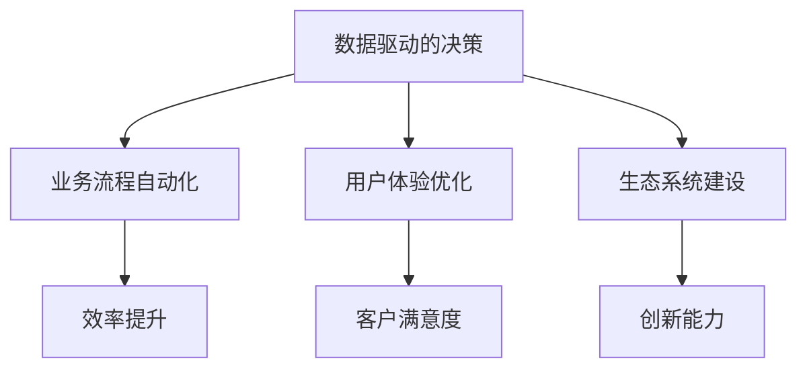
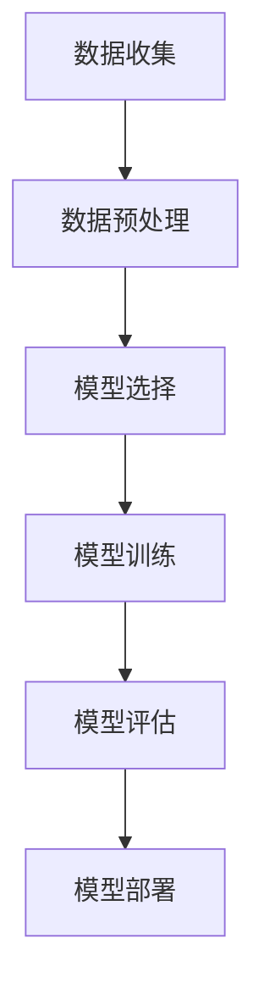

                 

# 《领导力与科技：拥抱数字化转型》

## 关键词

数字化转型、领导力、战略规划、项目管理、企业文化、人工智能、大数据、区块链、案例分析

## 摘要

在当今快速变化的数字时代，企业领导者必须具备前瞻性和适应性，以实现成功的数字化转型。本文深入探讨了领导力与科技在数字化转型中的关键作用。首先，我们分析了数字化转型的大背景及其对企业的影响，然后详细讨论了领导力在战略规划、执行和持续改进中的核心作用。通过成功的案例分析，我们展示了领导力如何在数字化浪潮中引领企业走向成功。最后，我们对数字化未来的领导力挑战和趋势进行了展望，为企业在数字化时代中的发展提供了宝贵指导。

## 引言

在过去的几十年中，科技的发展步伐迅猛，从互联网、移动通信到人工智能、区块链等新兴技术，它们已经深刻改变了我们的生活和工作方式。数字化转型成为企业提升竞争力、实现可持续发展的必由之路。然而，数字化转型不仅仅是一项技术任务，更是一场涉及组织架构、业务流程、员工技能和文化变革的全面变革。在这个过程中，领导力扮演着至关重要的角色。

领导力不仅是推动企业变革的引擎，也是引领企业应对不确定性和复杂性的关键因素。本文将从以下几个方面展开讨论：

1. **数字化转型的时代背景与领导力**：介绍数字化转型的定义、意义以及全球趋势，探讨领导力在其中的作用。
2. **科技驱动下的企业变革**：分析数据科学、人工智能、大数据、区块链等技术在数字化转型中的应用。
3. **数字化转型的战略规划与执行**：详细讨论数字化转型战略的制定、项目执行和持续改进的关键步骤。
4. **数字化转型成功的案例分析**：通过成功案例，展示领导力在数字化转型中的实际应用。
5. **数字化未来的领导力挑战与展望**：探讨数字化未来的领导力趋势和面临的挑战。

通过本文的深入分析，我们希望能够为企业在数字化时代的领导力发展提供有益的参考和指导。

## 第一部分：数字化转型的时代背景与领导力

### 第1章：数字化转型的定义与意义

数字化转型（Digital Transformation）是指企业利用数字技术和工具，对业务模式、流程、组织结构进行全方位的革新，从而提升效率和竞争力，实现持续增长和创新能力。数字化转型的核心目标是利用数据和技术，打破传统业务模式中的壁垒，构建新的商业模式，实现业务流程的智能化和自动化。

#### 1.1 数字化转型的核心概念与联系

**核心概念**：数字化转型涉及多个核心概念，包括数据驱动的决策、业务流程自动化、用户体验优化、生态系统建设等。这些概念相互关联，共同构成了数字化转型的框架。

**核心架构**：


#### 1.2 数字化转型的全球趋势与影响

在全球范围内，数字化转型已经成为各大企业的重要战略。根据国际数据公司（IDC）的预测，到2023年，全球超过50%的大企业将实现大规模的数字化转型，以应对数字化市场的竞争。以下是数字化转型的一些关键趋势和影响：

1. **智能化运营**：通过人工智能和机器学习技术，企业可以实现业务流程的自动化和智能化，提高运营效率。
2. **客户体验优先**：数字化技术使企业能够更好地理解和满足客户需求，提升客户体验和满意度。
3. **生态系统整合**：企业通过构建开放的平台和生态系统，与其他企业和创新者合作，实现资源的共享和价值的最大化。
4. **商业模式创新**：数字化技术为企业提供了探索新商业模式的机会，例如订阅模式、共享经济等。

#### 1.3 企业数字化转型面临的挑战与机遇

**挑战**：

1. **技术复杂性**：数字化转型涉及多种技术和工具，企业需要具备一定的技术基础和创新能力。
2. **组织变革**：数字化转型需要企业进行组织架构和业务流程的调整，这可能会面临内部阻力和文化冲突。
3. **人才短缺**：数字化转型需要具备数字技能的人才，但现有人才库可能无法满足需求。
4. **数据安全和隐私**：随着数据的广泛应用，数据安全和隐私问题成为企业关注的焦点。

**机遇**：

1. **提升竞争力**：通过数字化转型，企业可以提升效率、降低成本，从而在市场中获得竞争优势。
2. **创新商业模式**：数字化技术为企业提供了探索新商业模式的机会，有助于实现业务增长和多样化。
3. **客户关系优化**：数字化转型使企业能够更好地理解和满足客户需求，提升客户满意度和忠诚度。
4. **可持续发展**：数字化转型有助于企业实现可持续发展，例如通过优化供应链管理、降低碳排放等。

#### 1.4 领导力在数字化转型中的作用

领导力在数字化转型中发挥着关键作用。以下是领导力在数字化转型中的几个重要作用：

1. **愿景与战略**：领导者的愿景和战略规划是数字化转型的核心。领导者需要明确数字化转型的目标、路径和资源分配。
2. **组织变革**：领导者需要推动组织变革，打破传统模式，鼓励创新和协作。
3. **文化塑造**：数字化转型需要企业文化支持，领导者需要塑造积极、开放和包容的文化氛围。
4. **人才管理**：领导者需要吸引、培养和留住数字技能人才，为数字化转型提供人力资源保障。
5. **风险管理**：领导者需要制定风险管理策略，确保数字化转型过程中不发生重大失误。

### 小结

数字化转型已经成为企业发展的必然趋势，领导力在其中发挥着至关重要的作用。通过明确数字化转型的目标和路径，推动组织变革，塑造积极的文化氛围，并吸引和培养数字技能人才，领导者可以引领企业成功拥抱数字化转型，实现可持续发展和竞争优势。

## 第2章：科技驱动下的企业变革

在数字化时代，科技的发展对企业产生了深远的影响。数据科学、人工智能、大数据、区块链等新兴技术正在重塑企业的商业模式、业务流程和组织结构。本章节将详细探讨这些技术在企业变革中的应用，分析其对业务模式的重塑，以及如何利用数据科学和大数据分析来提高企业的决策效率。

### 2.1 科技发展对商业模式的重塑

#### 商业模式重塑的概念

商业模式重塑是指企业利用科技手段，对现有的商业结构、流程和盈利模式进行创新和优化。这种重塑不仅可以提升企业的运营效率，还可以开辟新的收入来源和市场机会。

#### 技术驱动下的商业模式创新

1. **订阅模式**：传统的销售模式正逐渐被订阅模式所取代。通过提供按需订阅服务，企业可以持续获取收入，同时提高客户的黏性。
   ```mermaid
   graph TD
       A[产品或服务] --> B[订阅服务]
       B --> C[持续收入]
       B --> D[客户黏性]
   ```

2. **共享经济**：共享经济模式通过互联网技术实现了资源的共享和优化利用。例如，共享单车、共享办公空间等，都利用科技手段降低了资源浪费，提高了资源利用效率。
   ```mermaid
   graph TD
       A[资源] --> B[共享经济平台]
       B --> C[高效利用]
       B --> D[降低成本]
   ```

3. **平台化运营**：企业通过构建平台，连接供需双方，实现资源的自由流动和高效配置。平台化运营不仅提高了企业的运营效率，还创造了新的商业模式。
   ```mermaid
   graph TD
       A[供需双方] --> B[企业平台]
       B --> C[资源流动]
       B --> D[高效配置]
   ```

### 2.2 数据科学和大数据分析

#### 数据科学的概念

数据科学是利用统计学、机器学习和计算机科学方法，从数据中提取知识、发现规律和预测未来趋势的学科。数据科学的核心目标是解决现实世界中的复杂问题，通过数据驱动的方式提升企业的决策效率。

#### 大数据分析的应用

1. **需求预测**：通过分析历史销售数据、市场趋势和用户行为，企业可以预测未来的需求，优化库存管理和供应链计划。
   ```mermaid
   graph TD
       A[历史销售数据] --> B[市场趋势分析]
       B --> C[用户行为分析]
       C --> D[需求预测]
   ```

2. **客户细分**：通过对客户数据的深入分析，企业可以了解不同客户群体的特征和需求，制定个性化的营销策略。
   ```mermaid
   graph TD
       A[客户数据] --> B[特征分析]
       B --> C[需求分析]
       C --> D[客户细分]
   ```

3. **风险控制**：大数据分析可以帮助企业识别潜在的风险和欺诈行为，提高风险控制能力。
   ```mermaid
   graph TD
       A[交易数据] --> B[风险分析]
       B --> C[欺诈检测]
       C --> D[风险控制]
   ```

#### 数据驱动的决策

数据驱动的决策是指企业在制定决策时，以数据为依据，通过数据分析和模型预测来指导决策过程。数据驱动的决策可以显著提高决策的准确性和效率。

**伪代码示例**：

```python
# 数据驱动的销售预测模型
def predict_sales(data):
    # 数据预处理
    processed_data = preprocess_data(data)
    
    # 建立模型
    model = build_model(processed_data)
    
    # 预测销售
    sales_prediction = model.predict(new_data)
    
    return sales_prediction
```

### 2.3 人工智能与机器学习

人工智能（AI）和机器学习（ML）是数字化转型的关键技术之一。通过AI和ML，企业可以实现自动化、智能化的业务流程，提高效率和准确性。

#### 人工智能在业务中的应用

1. **智能客服**：利用自然语言处理（NLP）和机器学习技术，企业可以开发智能客服系统，提高客户服务效率和质量。
   ```mermaid
   graph TD
       A[客户请求] --> B[自然语言处理]
       B --> C[机器学习模型]
       C --> D[智能回复]
   ```

2. **智能推荐**：通过协同过滤、基于内容的推荐等技术，企业可以提供个性化的产品推荐，提升用户满意度和忠诚度。
   ```mermaid
   graph TD
       A[用户行为数据] --> B[协同过滤]
       B --> C[内容分析]
       C --> D[推荐系统]
   ```

#### 机器学习模型的构建

构建机器学习模型通常包括数据收集、数据预处理、模型选择、模型训练和模型评估等步骤。以下是一个简单的机器学习模型构建流程：



### 2.4 区块链技术的影响与应用

区块链技术通过去中心化、不可篡改和透明等特性，为企业提供了安全、可靠的数据存储和传输解决方案。区块链技术在多个领域都有广泛的应用，包括供应链管理、金融服务、医疗保健等。

#### 区块链在供应链管理中的应用

区块链技术可以用于供应链管理，确保供应链的透明度和可追溯性，提高供应链效率。

**应用示例**：

1. **原材料采购**：通过区块链技术记录原材料的采购信息，确保采购过程透明和可追溯。
   ```mermaid
   graph TD
       A[原材料采购] --> B[区块链记录]
       B --> C[信息透明]
   ```

2. **库存管理**：利用区块链技术记录库存信息，提高库存管理的准确性和效率。
   ```mermaid
   graph TD
       A[库存信息] --> B[区块链记录]
       B --> C[库存管理]
   ```

#### 区块链在金融服务中的应用

区块链技术在金融服务领域有广泛的应用，包括支付、贷款、保险等。

**应用示例**：

1. **跨境支付**：通过区块链技术实现跨境支付，降低交易成本，提高交易速度。
   ```mermaid
   graph TD
       A[跨境支付] --> B[区块链网络]
       B --> C[快速结算]
   ```

2. **智能合约**：利用智能合约实现自动化交易和合约执行，提高交易效率。
   ```mermaid
   graph TD
       A[交易条件] --> B[智能合约]
       B --> C[自动执行]
   ```

### 小结

科技的发展正在重塑企业的商业模式、业务流程和组织结构。数据科学、人工智能、大数据和区块链等技术为企业的数字化转型提供了强大的支持。通过充分利用这些技术，企业可以实现业务流程的自动化和智能化，提升效率和竞争力。同时，领导者需要具备前瞻性，积极推动企业的数字化转型，以应对数字化时代的挑战和机遇。

## 第3章：数字化转型的战略规划与执行

### 3.1 企业数字化转型的战略规划步骤

#### 战略规划的重要性

数字化转型不仅仅是技术升级，更是一场涉及业务模式、组织架构和文化变革的系统性工程。因此，制定一个详细的数字化转型战略规划至关重要。战略规划有助于企业明确目标、分配资源、制定执行计划，确保数字化转型能够有序、高效地进行。

#### 战略规划的步骤

1. **明确数字化转型的目标**：企业需要明确数字化转型的愿景和目标，包括提高效率、提升客户体验、创造新的商业模式等。

   **目标设定**：
   ```mermaid
   graph TD
       A[提高效率] --> B[提升客户体验]
       B --> C[创造新商业模式]
   ```

2. **评估当前状态**：企业需要评估自身的当前状态，包括技术基础、业务流程、组织架构和员工技能等。

   **评估流程**：
   ```mermaid
   graph TD
       A[技术基础评估] --> B[业务流程评估]
       B --> C[组织架构评估]
       C --> D[员工技能评估]
   ```

3. **确定优先事项**：根据企业的当前状态和目标，确定数字化转型的优先事项和关键领域。

   **优先事项**：
   ```mermaid
   graph TD
       A[技术升级] --> B[业务流程优化]
       B --> C[组织架构调整]
       C --> D[员工培训]
   ```

4. **制定行动计划**：基于优先事项，制定详细的数字化转型行动计划，包括具体的目标、时间表、责任人、资源需求等。

   **行动计划**：
   ```mermaid
   graph TD
       A[目标1] --> B[时间表]
       B --> C[责任人]
       C --> D[资源需求]
   ```

5. **制定评估与反馈机制**：建立持续的评估和反馈机制，监控数字化转型的进展和效果，及时调整计划和策略。

   **评估与反馈**：
   ```mermaid
   graph TD
       A[进度监控] --> B[效果评估]
       B --> C[反馈调整]
   ```

### 3.2 领导力在战略规划中的作用

#### 领导力的核心角色

在数字化转型的战略规划中，领导力发挥着至关重要的作用。领导者不仅是战略的制定者，更是战略的执行者。以下是领导力在战略规划中的核心角色：

1. **愿景与使命**：领导者需要明确企业的数字化转型愿景和使命，为员工提供明确的目标和方向。

   **愿景与使命**：
   ```mermaid
   graph TD
       A[企业愿景] --> B[数字化转型使命]
   ```

2. **沟通与协作**：领导者需要与各个部门、团队和员工进行有效的沟通，确保战略规划得到广泛理解和支持。

   **沟通与协作**：
   ```mermaid
   graph TD
       A[内部沟通] --> B[跨部门协作]
   ```

3. **决策与支持**：领导者需要根据战略规划做出关键决策，并在执行过程中提供必要的支持和资源。

   **决策与支持**：
   ```mermaid
   graph TD
       A[关键决策] --> B[资源支持]
   ```

4. **变革管理**：领导者需要推动企业变革，打破传统的思维模式和组织结构，鼓励创新和变革。

   **变革管理**：
   ```mermaid
   graph TD
       A[推动变革] --> B[组织适应性]
   ```

### 3.3 风险管理与应对策略

#### 风险管理的必要性

数字化转型过程中，企业可能会面临各种风险，包括技术风险、市场风险、运营风险等。有效的风险管理策略可以帮助企业识别、评估和控制这些风险，确保数字化转型顺利进行。

#### 风险管理策略

1. **风险识别**：通过数据分析、情景分析和专家咨询等方法，识别数字化转型过程中的潜在风险。

   **风险识别**：
   ```mermaid
   graph TD
       A[数据分析] --> B[情景分析]
       B --> C[专家咨询]
   ```

2. **风险评估**：对识别出的风险进行定量和定性评估，确定风险的重要性和发生概率。

   **风险评估**：
   ```mermaid
   graph TD
       A[风险识别] --> B[定量评估]
       B --> C[定性评估]
   ```

3. **风险应对**：根据风险评估结果，制定相应的风险应对策略，包括风险规避、风险转移、风险减轻等。

   **风险应对**：
   ```mermaid
   graph TD
       A[风险规避] --> B[风险转移]
       B --> C[风险减轻]
   ```

4. **监控与调整**：建立持续的风险监控机制，及时调整风险应对策略，确保风险在可控范围内。

   **监控与调整**：
   ```mermaid
   graph TD
       A[风险监控] --> B[策略调整]
   ```

### 3.4 企业文化在数字化转型中的重要性

#### 企业文化的定义与作用

企业文化是指企业在长期经营过程中形成的价值观、行为规范和工作氛围。企业文化对企业的发展具有深远的影响，尤其在数字化转型过程中，企业文化的作用更加突出。

1. **支持创新**：积极的企业文化鼓励员工创新和尝试，为数字化技术的应用提供良好的氛围。
   ```mermaid
   graph TD
       A[企业文化] --> B[创新支持]
   ```

2. **提升协作**：良好的企业文化促进团队协作，有助于实现数字化转型中的跨部门合作。
   ```mermaid
   graph TD
       A[企业文化] --> B[团队协作]
   ```

3. **增强适应性**：企业文化可以增强企业对变革的适应性，帮助企业在数字化时代中迅速调整和转型。
   ```mermaid
   graph TD
       A[企业文化] --> B[适应性]
   ```

#### 塑造积极的企业文化

1. **领导层的示范作用**：领导者的行为和态度直接影响企业文化。领导者需要以身作则，倡导创新和协作。
   ```mermaid
   graph TD
       A[领导者示范] --> B[企业文化塑造]
   ```

2. **激励机制**：建立与数字化转型目标相一致的激励机制，鼓励员工积极参与和贡献。
   ```mermaid
   graph TD
       A[激励机制] --> B[员工参与]
   ```

3. **培训与发展**：提供持续的培训和发展机会，提升员工的数字化技能和综合素质。
   ```mermaid
   graph TD
       A[培训与发展] --> B[员工素质提升]
   ```

### 小结

数字化转型的战略规划与执行是一个复杂而系统的过程，需要企业从战略规划、风险管理、组织变革等多个方面进行全面的考虑和部署。领导力在战略规划中发挥着关键作用，通过明确的愿景、有效的沟通和变革管理，领导者可以引领企业成功拥抱数字化转型。同时，企业文化的塑造和优化也是数字化转型成功的关键因素，积极的企业文化可以为数字化转型提供强大的支持和动力。

## 第4章：数字化转型项目执行

### 4.1 项目管理与实施流程

数字化转型项目通常涉及多个阶段，包括项目启动、规划、执行、监控和收尾。有效的项目管理是实现数字化转型目标的关键。

#### 项目启动

项目启动是项目管理的第一步，主要包括以下几个方面：

1. **项目立项**：明确项目目标、范围、可行性等。
   ```mermaid
   graph TD
       A[项目立项] --> B[目标明确]
       B --> C[范围定义]
       C --> D[可行性评估]
   ```

2. **组建项目团队**：根据项目需求，组建项目团队，明确团队成员的角色和职责。
   ```mermaid
   graph TD
       A[项目团队组建] --> B[角色明确]
       B --> C[职责分配]
   ```

3. **项目启动会议**：召开项目启动会议，确保所有团队成员对项目目标和计划有清晰的认识。
   ```mermaid
   graph TD
       A[项目启动会议] --> B[目标传达]
       B --> C[计划讨论]
   ```

#### 项目规划

项目规划是项目实施前的准备工作，主要包括以下几个方面：

1. **需求分析**：详细分析项目的需求和期望成果，确定项目的范围和目标。
   ```mermaid
   graph TD
       A[需求分析] --> B[范围确定]
       B --> C[目标明确]
   ```

2. **制定项目计划**：制定项目的时间表、资源分配、预算等，确保项目能够按计划顺利进行。
   ```mermaid
   graph TD
       A[项目计划] --> B[时间表]
       B --> C[资源分配]
       C --> D[预算制定]
   ```

3. **风险评估**：识别项目潜在的风险，制定相应的风险应对策略。
   ```mermaid
   graph TD
       A[风险评估] --> B[风险识别]
       B --> C[风险应对]
   ```

#### 项目执行

项目执行是项目管理的核心阶段，主要包括以下几个方面：

1. **资源管理**：根据项目计划，合理分配和利用项目资源，确保项目顺利进行。
   ```mermaid
   graph TD
       A[资源管理] --> B[资源分配]
       B --> C[资源利用]
   ```

2. **进度控制**：监控项目进度，确保项目按计划进行，及时调整计划和资源。
   ```mermaid
   graph TD
       A[进度控制] --> B[进度监控]
       B --> C[调整计划]
   ```

3. **质量控制**：确保项目交付物的质量和符合项目要求，进行质量检查和测试。
   ```mermaid
   graph TD
       A[质量控制] --> B[质量检查]
       B --> C[测试验证]
   ```

#### 项目监控

项目监控是确保项目按照计划顺利进行的关键，主要包括以下几个方面：

1. **绩效评估**：定期评估项目的进度、成本和质量，确保项目按计划进行。
   ```mermaid
   graph TD
       A[绩效评估] --> B[进度评估]
       B --> C[成本评估]
       C --> D[质量评估]
   ```

2. **沟通管理**：确保项目团队成员之间的沟通畅通，及时传达项目信息和问题。
   ```mermaid
   graph TD
       A[沟通管理] --> B[信息传递]
       B --> C[问题解决]
   ```

3. **变更管理**：及时识别和响应项目的变更需求，确保项目能够灵活应对外部变化。
   ```mermaid
   graph TD
       A[变更管理] --> B[变更识别]
       B --> C[变更响应]
   ```

#### 项目收尾

项目收尾是项目管理的最后一步，主要包括以下几个方面：

1. **项目验收**：对项目交付物进行验收，确保满足项目要求和预期目标。
   ```mermaid
   graph TD
       A[项目验收] --> B[交付物验收]
       B --> C[目标达成]
   ```

2. **项目总结**：对项目进行总结和回顾，识别成功经验和不足之处，为未来项目提供参考。
   ```mermaid
   graph TD
       A[项目总结] --> B[经验总结]
       B --> C[改进措施]
   ```

3. **资源释放**：项目完成后，释放项目资源，确保项目团队能够投入到下一个项目中。
   ```mermaid
   graph TD
       A[资源释放] --> B[团队解散]
       B --> C[资源分配]
   ```

### 4.2 领导力在项目执行中的关键角色

#### 领导力在项目执行中的作用

在数字化转型项目中，领导力在项目执行过程中起着至关重要的作用。以下是领导力在项目执行中的几个关键角色：

1. **愿景传达**：领导者需要明确项目的愿景和目标，将其传达给项目团队，确保团队成员对项目有清晰的认识和理解。

   **愿景传达**：
   ```mermaid
   graph TD
       A[愿景传达] --> B[目标理解]
   ```

2. **激励与支持**：领导者需要激励和鼓励团队成员，提供必要的支持和资源，确保项目团队能够克服困难，完成任务。

   **激励与支持**：
   ```mermaid
   graph TD
       A[激励与支持] --> B[团队动力]
       B --> C[资源保障]
   ```

3. **决策与指导**：领导者需要根据项目进展情况，做出及时、准确的决策，并对项目团队提供指导，确保项目能够按照计划顺利进行。

   **决策与指导**：
   ```mermaid
   graph TD
       A[决策与指导] --> B[决策制定]
       B --> C[团队指导]
   ```

4. **沟通与协调**：领导者需要确保项目团队内部以及与外部利益相关者之间的沟通畅通，协调各方面的资源，确保项目顺利推进。

   **沟通与协调**：
   ```mermaid
   graph TD
       A[沟通与协调] --> B[内部沟通]
       B --> C[外部协调]
   ```

### 4.3 人才管理与团队建设

#### 人才管理的重要性

数字化转型项目对人才的需求较高，涉及数据科学、人工智能、云计算等多个领域的专业知识。有效的人才管理是项目成功的关键。

#### 人才管理的策略

1. **人才招聘**：根据项目需求，招聘具备相关技能和经验的专业人才。

   **人才招聘**：
   ```mermaid
   graph TD
       A[需求分析] --> B[招聘计划]
       B --> C[人才选拔]
   ```

2. **培训与发展**：为团队成员提供持续的培训和发展机会，提升其技能和素质。

   **培训与发展**：
   ```mermaid
   graph TD
       A[培训计划] --> B[技能提升]
       B --> C[职业发展]
   ```

3. **激励机制**：建立与项目目标相一致的激励机制，鼓励团队成员积极参与和贡献。

   **激励机制**：
   ```mermaid
   graph TD
       A[目标设定] --> B[绩效评估]
       B --> C[奖励机制]
   ```

#### 团队建设的策略

1. **构建多元化的团队**：招聘来自不同背景、不同领域的成员，形成多元化的团队，促进创新和协作。

   **多元化团队**：
   ```mermaid
   graph TD
       A[多元招聘] --> B[团队建设]
   ```

2. **培养团队协作精神**：通过团队建设活动和培训，增强团队成员之间的协作和信任。

   **团队协作精神**：
   ```mermaid
   graph TD
       A[团队建设活动] --> B[协作精神]
   ```

3. **激励团队创新**：鼓励团队成员提出创新想法，并提供支持和资源，推动团队创新。

   **团队创新激励**：
   ```mermaid
   graph TD
       A[创新激励] --> B[创新成果]
   ```

### 4.4 培训与发展：提升团队数字化技能

#### 培训与发展的重要性

数字化转型要求团队成员具备相应的数字化技能。通过有效的培训与发展，可以提高团队成员的技能水平，为数字化转型提供强有力的支持。

#### 培训与发展的策略

1. **制定培训计划**：根据项目需求和团队成员的技能水平，制定详细的培训计划。

   **培训计划**：
   ```mermaid
   graph TD
       A[需求分析] --> B[培训计划]
   ```

2. **提供多样化的培训资源**：利用线上课程、内部培训、外部培训等多种方式，为团队成员提供丰富的培训资源。

   **培训资源**：
   ```mermaid
   graph TD
       A[线上课程] --> B[内部培训]
       B --> C[外部培训]
   ```

3. **鼓励实践与交流**：通过实际项目和团队交流，巩固团队成员的培训成果，提升实践能力。

   **实践与交流**：
   ```mermaid
   graph TD
       A[实际项目] --> B[团队交流]
   ```

### 小结

数字化转型项目的成功实施需要科学的项目管理方法和有效的领导力。从项目启动到规划、执行、监控和收尾，每个阶段都需要细致的管理和执行。领导力在项目执行中发挥着关键作用，通过愿景传达、激励支持、决策指导和沟通协调，领导者可以确保项目团队高效协作，顺利实现项目目标。同时，人才管理和团队建设也是数字化转型项目成功的关键，通过有效的培训和激励机制，提升团队数字化技能和协作能力，为数字化转型提供强有力的支持。

## 第5章：领导力与数字化转型的持续改进

### 5.1 持续改进的重要性

数字化转型不是一蹴而就的过程，它需要企业不断进行调整和优化，以适应不断变化的科技环境和市场需求。持续改进（Continuous Improvement）是数字化转型过程中不可或缺的一部分，它强调通过不断的反馈、评估和调整，实现企业绩效的持续提升。

#### 持续改进的概念

持续改进是指企业在日常运营中，通过不断学习和创新，持续改进产品、服务和工作流程，以提升效率和竞争力。持续改进的核心在于不断识别问题、分析原因、制定改进措施并实施。

#### 持续改进的益处

1. **提高效率**：通过优化工作流程和操作方法，减少不必要的步骤和资源浪费，提高生产效率和资源利用率。
   ```mermaid
   graph TD
       A[优化流程] --> B[提高效率]
   ```

2. **提升质量**：通过持续改进，企业可以不断提高产品和服务质量，满足客户需求和期望。
   ```mermaid
   graph TD
       A[提升质量] --> B[客户满意度]
   ```

3. **增强灵活性**：持续改进使企业能够快速响应市场变化和客户需求，提高业务的灵活性和适应性。
   ```mermaid
   graph TD
       A[快速响应] --> B[市场适应]
   ```

4. **降低成本**：通过持续改进，企业可以减少资源浪费和错误率，降低运营成本。
   ```mermaid
   graph TD
       A[降低成本] --> B[经济效益]
   ```

### 5.2 数字化转型过程中的反馈机制

#### 反馈机制的概念

反馈机制是指企业在数字化转型过程中，通过收集和分析各种数据，对项目进展、效果和问题进行评估和反馈，从而实现不断改进的过程。反馈机制包括内部反馈和外部反馈，其中内部反馈主要来自企业内部的数据和评估，外部反馈则主要来自客户、市场和其他外部环境。

#### 反馈机制的构建

1. **数据收集**：通过多种渠道收集数据，包括系统日志、用户反馈、市场调研等。
   ```mermaid
   graph TD
       A[系统日志] --> B[用户反馈]
       B --> C[市场调研]
   ```

2. **数据分析**：对收集到的数据进行分析，识别问题和改进机会。
   ```mermaid
   graph TD
       A[数据分析] --> B[问题识别]
       B --> C[改进机会]
   ```

3. **反馈评估**：根据分析结果，对项目的进展和效果进行评估，确定改进的方向和措施。
   ```mermaid
   graph TD
       A[反馈评估] --> B[效果评估]
       B --> C[改进措施]
   ```

4. **反馈执行**：制定并实施改进措施，对项目进行优化和调整。
   ```mermaid
   graph TD
       A[改进措施] --> B[执行调整]
   ```

### 5.3 领导力的创新与变革管理

#### 创新的重要性

在数字化转型过程中，创新是推动企业持续发展的重要动力。领导者需要具备创新思维，鼓励团队不断尝试新的方法和模式。

#### 创新思维的培养

1. **鼓励尝试**：领导者需要营造一个鼓励尝试和失败的文化氛围，鼓励团队成员勇于探索和创新。
   ```mermaid
   graph TD
       A[鼓励尝试] --> B[创新氛围]
   ```

2. **培养跨学科思维**：鼓励团队成员学习跨学科知识，培养跨领域的创新思维。
   ```mermaid
   graph TD
       A[跨学科学习] --> B[创新思维]
   ```

3. **提供资源支持**：为创新项目提供必要的资源和支持，确保创新能够顺利实施。
   ```mermaid
   graph TD
       A[资源支持] --> B[创新项目]
   ```

#### 变革管理的策略

数字化转型往往伴随着组织结构的调整和业务流程的变革。领导者需要有效管理变革，确保组织能够顺利适应新的环境和要求。

1. **明确变革目标**：明确变革的目标和意义，确保所有员工都理解变革的重要性和必要性。
   ```mermaid
   graph TD
       A[目标明确] --> B[变革理解]
   ```

2. **沟通与宣传**：通过有效的沟通和宣传，确保员工了解变革的细节和步骤，减少抵触情绪。
   ```mermaid
   graph TD
       A[沟通宣传] --> B[员工理解]
   ```

3. **提供培训与支持**：为员工提供必要的培训和指导，帮助其适应新的工作环境和要求。
   ```mermaid
   graph TD
       A[培训支持] --> B[员工适应]
   ```

4. **激励与反馈**：建立激励机制，鼓励员工积极参与变革，并提供及时反馈，确保变革的顺利进行。
   ```mermaid
   graph TD
       A[激励机制] --> B[员工参与]
       B --> C[反馈机制]
   ```

### 5.4 企业数字化转型与可持续发展

#### 可持续发展的概念

可持续发展是指企业在满足当前需求的同时，不损害子孙后代满足其需求的能力。在数字化转型过程中，企业需要考虑环境、社会和经济三个方面的影响，实现长期可持续发展。

#### 可持续发展的策略

1. **绿色技术**：采用绿色技术和环保材料，减少能源消耗和环境污染。
   ```mermaid
   graph TD
       A[绿色技术] --> B[环保材料]
   ```

2. **资源优化**：通过数字化手段优化资源利用，提高资源利用效率，减少浪费。
   ```mermaid
   graph TD
       A[资源优化] --> B[提高效率]
   ```

3. **社会责任**：积极承担社会责任，参与社会公益活动，提高企业的社会形象和声誉。
   ```mermaid
   graph TD
       A[社会责任] --> B[公益活动]
   ```

4. **长期规划**：制定长期的可持续发展战略，确保企业能够在未来持续健康发展。
   ```mermaid
   graph TD
       A[长期规划] --> B[可持续发展]
   ```

### 小结

持续改进是数字化转型成功的关键因素之一。通过建立有效的反馈机制、创新和变革管理，企业可以不断提升自身的竞争力，实现可持续发展。领导者在这一过程中发挥着关键作用，通过愿景传达、激励支持和创新思维，领导者可以引领企业不断进步，迎接数字化时代的挑战和机遇。

## 第三部分：数字化转型成功的案例分析

### 第6章：数字化转型成功的案例分析

在数字化转型的浪潮中，一些企业通过成功的数字化转型实践，取得了显著的成果。本章将通过三个不同行业的成功案例，分析这些企业在数字化转型中的实践和经验，为其他企业提供有价值的参考。

### 案例一：科技公司数字化转型案例

#### 企业背景

某科技公司是一家专注于云计算和大数据领域的创新企业。随着市场竞争的加剧，该公司意识到数字化转型对于保持竞争优势的至关重要性。

#### 数字化转型的实践

1. **技术创新**：公司引入了先进的云计算和大数据技术，建立了高效的数据处理和分析平台。通过云计算技术，公司实现了资源的灵活调配和高效利用；通过大数据技术，公司能够实时分析市场动态和客户需求，优化产品和服务。

2. **组织变革**：公司进行了组织结构的调整，成立了专门的数据科学和人工智能部门，负责推动技术创新和业务流程优化。同时，公司加强了跨部门的协作，建立了敏捷的开发和运营团队，提高了响应速度和市场竞争力。

3. **人才培养**：公司重视员工的数字化技能培养，定期组织技术培训和研讨会，提升员工的技能水平。同时，公司通过内部竞赛和项目实践，鼓励员工创新和探索，形成良好的创新文化。

#### 案例总结与启示

该公司的成功经验表明，技术创新和组织变革是数字化转型的重要驱动力。通过引入先进的科技手段和优化组织结构，公司实现了业务流程的智能化和高效化，提高了市场竞争力。此外，人才培养和激励机制也是推动数字化转型成功的关键因素。

### 案例二：传统制造企业数字化转型案例

#### 企业背景

某制造企业是一家具有百年历史的大型制造企业，主要从事机械设备的制造和销售。面对市场环境的变革和竞争压力，该公司决定进行数字化转型。

#### 数字化转型的实践

1. **智能制造**：公司引入了智能制造技术，包括自动化生产线、物联网设备和人工智能系统。通过自动化生产线的应用，公司实现了生产过程的自动化和智能化，提高了生产效率；通过物联网设备，公司实现了设备的远程监控和故障预警，降低了设备故障率；通过人工智能系统，公司实现了生产数据的实时分析和预测，优化了生产计划和资源配置。

2. **供应链优化**：公司通过数字化转型，优化了供应链管理。通过建立智能供应链管理系统，公司实现了供应链的全程监控和优化，提高了供应链的响应速度和灵活性。同时，公司通过大数据分析和人工智能算法，实现了供应链的精准预测和高效管理。

3. **客户关系管理**：公司利用数字化手段，提升了客户关系管理水平。通过建立客户关系管理系统，公司实现了对客户需求的全面了解和个性化服务，提升了客户满意度和忠诚度。

#### 案例总结与启示

该制造企业的成功经验表明，智能制造和供应链优化是传统制造企业数字化转型的重要方向。通过引入智能制造技术和优化供应链管理，公司实现了生产过程的自动化和智能化，提高了生产效率和产品质量。同时，客户关系管理的提升也为公司带来了稳定的客户群和市场份额。

### 案例三：服务业数字化转型案例

#### 企业背景

某大型酒店集团在面临激烈的市场竞争和客户需求变化时，决定通过数字化转型提升服务质量和客户体验。

#### 数字化转型的实践

1. **智能化服务**：酒店集团引入了智能客房、智能门锁和智能服务机器人等智能设备，提升了客户入住体验。通过智能客房系统，客户可以实现自助入住、智能控制室内设备和一键呼叫服务；通过智能门锁，客户可以实现无钥匙入住，提高了安全性；通过智能服务机器人，酒店能够提供更加快速和高效的服务。

2. **个性化服务**：酒店集团通过数字化转型，实现了个性化服务。通过客户数据分析，酒店能够了解客户的偏好和需求，提供个性化的服务和推荐。例如，根据客户的消费记录和喜好，酒店可以为客人提供定制化的餐饮服务和活动推荐。

3. **线上服务平台**：酒店集团建立了线上服务平台，包括官网、手机APP和微信小程序等，提供了便捷的预订和支付服务。通过线上服务平台，客户可以方便地了解酒店信息和价格，实现在线预订和支付，提升了预订效率和服务体验。

#### 案例总结与启示

该酒店集团的成功经验表明，智能化服务和个性化服务是服务业数字化转型的重要方向。通过引入智能设备和数字化工具，酒店提升了服务质量和客户体验。同时，线上服务平台的建立也极大地提升了客户预订和支付的便利性，增强了客户的满意度。

### 案例分析总结与启示

以上三个案例展示了不同行业企业在数字化转型中的成功实践和经验。尽管行业背景和业务模式不同，但它们都遵循了以下共同原则：

1. **技术创新**：引入先进的科技手段，实现业务流程的自动化和智能化。
2. **组织变革**：调整组织结构，加强跨部门协作，提高组织效率。
3. **人才培养**：重视员工的数字化技能培养，激发员工的创新潜力。
4. **客户关系管理**：通过数字化转型，提升客户体验和满意度。
5. **数据驱动**：利用大数据分析和人工智能技术，实现精准决策和优化管理。

通过这些成功案例，我们可以得出以下启示：

1. **数字化转型需要全企业的参与和协作，不仅仅是技术部门的任务**。
2. **数字化转型需要长期规划和持续投入，不能一蹴而就**。
3. **数字化转型需要结合企业的实际情况和业务需求，制定个性化的转型方案**。
4. **数字化转型需要关注数据安全和隐私保护，确保企业运营的安全和合规**。

通过学习这些成功案例，其他企业可以借鉴其经验，结合自身的实际情况，制定适合自己的数字化转型战略，实现企业的可持续发展。

## 第四部分：数字化未来的领导力挑战与展望

### 第7章：数字化未来的领导力挑战

随着科技的飞速发展，数字化未来为企业带来了前所未有的机遇，同时也提出了新的领导力挑战。以下是数字化未来可能面临的几个关键挑战：

#### 7.1 数据隐私与伦理问题

随着数据量的爆炸性增长和数据分析技术的进步，数据隐私和伦理问题成为企业领导者必须面对的重要挑战。数据泄露、数据滥用、个人信息保护等问题日益突出，对企业的声誉和合法性构成威胁。

**解决方案**：

1. **加强数据保护法规的遵守**：企业需要确保遵守相关的数据保护法规，如GDPR（欧盟通用数据保护条例）。
2. **建立数据保护机制**：采用先进的加密技术和数据安全措施，确保数据的存储和传输过程安全。
3. **加强伦理审查**：在数据处理过程中，企业需要建立严格的伦理审查机制，确保数据处理符合伦理标准。

#### 7.2 自动化与就业变革

随着人工智能和自动化技术的普及，许多传统工作岗位可能会被机器取代，导致就业市场的巨大变革。这不仅会影响就业率，还会对社会结构产生深远影响。

**解决方案**：

1. **促进就业转型**：政府和企业应共同努力，提供培训和再教育机会，帮助劳动力适应新的就业环境。
2. **鼓励创业和创新**：通过提供资金和政策支持，鼓励人们从事创新型工作，推动经济结构调整。
3. **加强社会保障体系**：建立完善的社会保障体系，为失业人群提供必要的经济和心理支持。

#### 7.3 持续学习与创新思维

在数字化时代，知识更新的速度越来越快，领导者需要具备持续学习和创新思维的能力，以应对快速变化的市场和技术环境。

**解决方案**：

1. **建立学习型组织**：鼓励员工持续学习和知识共享，形成学习型组织文化。
2. **引入外部资源**：与学术机构、行业专家和合作伙伴合作，获取最新的知识和见解。
3. **设立创新实验室**：为员工提供实验和创新的空间，鼓励他们尝试新的想法和解决方案。

#### 7.4 领导力与科技的深度融合

数字化时代要求领导力与科技的深度融合，领导者需要具备跨学科的知识和技能，以应对复杂多变的商业环境。

**解决方案**：

1. **培养科技领导力**：通过培训和学习，提升领导者在科技领域的知识和技能。
2. **促进跨部门协作**：鼓励不同部门之间的协作和知识交流，形成创新和协作的文化。
3. **利用数字工具**：利用数字工具和平台，提高领导力和管理的效率。

### 7.5 企业文化与数字化转型的兼容

数字化转型不仅仅是技术的变革，更是企业文化的重塑。领导者需要确保企业文化与数字化转型目标相兼容，以推动企业的持续创新和成长。

**解决方案**：

1. **塑造开放和创新的企业文化**：鼓励员工提出新想法和建议，建立创新和协作的工作环境。
2. **提供支持和资源**：为员工提供必要的支持和资源，确保他们能够顺利适应数字化转型。
3. **建立反馈机制**：建立有效的反馈机制，及时了解员工的需求和反馈，调整管理策略。

### 小结

数字化未来为企业带来了巨大的机遇和挑战。领导者需要具备前瞻性，积极应对这些挑战，推动企业的数字化转型。通过加强数据隐私保护、促进就业转型、培养持续学习与创新思维，以及推动领导力与科技的深度融合，领导者可以为企业在数字化时代中的成功奠定坚实的基础。

### 第8章：数字化转型的未来展望

随着科技的不断进步，数字化转型正在深刻地改变企业的运营模式和市场结构。在未来，数字化转型将继续推动企业的创新与发展，带来新的商业模式和机遇。以下是对数字化未来的几个关键展望：

#### 8.1 数字化转型的发展趋势

1. **智能自动化**：人工智能和机器学习将在更多领域实现自动化，从生产制造到服务业，智能自动化将极大地提升效率和降低成本。
   ```mermaid
   graph TD
       A[智能自动化] --> B[效率提升]
       B --> C[成本降低]
   ```

2. **物联网（IoT）的普及**：物联网技术的广泛应用将实现设备、系统和人之间的互联互通，为数据驱动决策提供更多可能。
   ```mermaid
   graph TD
       A[IoT普及] --> B[互联互通]
       B --> C[数据驱动决策]
   ```

3. **区块链技术的深入应用**：区块链技术将在供应链管理、金融服务和供应链管理等领域发挥重要作用，提供更透明、安全和高效的数据管理和交易方式。
   ```mermaid
   graph TD
       A[区块链技术] --> B[透明管理]
       B --> C[安全交易]
   ```

4. **云计算的成熟**：云计算将继续成为企业数字化转型的重要基础设施，提供弹性的计算资源和高效的数据存储解决方案。
   ```mermaid
   graph TD
       A[云计算] --> B[弹性计算]
       B --> C[高效数据存储]
   ```

#### 8.2 新型领导力模型的探索

随着数字化转型的深入，传统的领导力模型将逐渐向新型领导力模型转变。以下是对新型领导力模型的一些探索：

1. **技术驱动型领导力**：领导者需要具备跨学科的知识和技能，能够理解并利用新技术，引领企业创新。
   ```mermaid
   graph TD
       A[技术驱动型领导力] --> B[跨学科知识]
       B --> C[创新能力]
   ```

2. **赋能型领导力**：领导者应鼓励员工自主学习和创新，为员工提供支持和资源，实现自我驱动和成长。
   ```mermaid
   graph TD
       A[赋能型领导力] --> B[员工支持]
       B --> C[自我驱动]
   ```

3. **敏捷型领导力**：领导者需要具备快速响应变化和敏捷管理的能力，以适应数字化时代的不确定性和快速变化。
   ```mermaid
   graph TD
       A[敏捷型领导力] --> B[快速响应]
       B --> C[敏捷管理]
   ```

4. **价值观驱动的领导力**：在数字化转型过程中，领导者需要以价值观为基础，确保企业在追求商业成功的同时，兼顾社会责任和可持续发展。
   ```mermaid
   graph TD
       A[价值观驱动的领导力] --> B[社会责任]
       B --> C[可持续发展]
   ```

#### 8.3 数字化时代的企业文化

在数字化时代，企业文化将成为企业竞争力的关键因素。以下是对数字化时代企业文化的几个展望：

1. **开放和创新**：企业应鼓励开放思维和创新能力，营造一个充满活力和创造力的工作环境。
   ```mermaid
   graph TD
       A[开放和创新] --> B[创造力环境]
   ```

2. **透明和信任**：企业应建立透明的工作流程和沟通机制，增强员工之间的信任，促进团队合作。
   ```mermaid
   graph TD
       A[透明和信任] --> B[团队合作]
   ```

3. **灵活和适应**：企业应具备灵活的应对能力和快速适应变化的能力，以应对数字化时代的挑战。
   ```mermaid
   graph TD
       A[灵活和适应] --> B[应对变化]
   ```

4. **以人为本**：企业应关注员工的发展和福祉，建立以人为本的企业文化，提高员工满意度和忠诚度。
   ```mermaid
   graph TD
       A[以人为本] --> B[员工福祉]
       B --> C[满意度提升]
   ```

#### 8.4 领导力与科技的深度融合

在未来，领导力与科技的深度融合将成为企业发展的关键。以下是对这一趋势的展望：

1. **科技赋能领导力**：领导者应利用科技手段提高决策效率和管理效能，例如通过数据分析进行精准决策。
   ```mermaid
   graph TD
       A[科技赋能领导力] --> B[精准决策]
   ```

2. **人机协作**：在数字化时代，领导者应鼓励人机协作，充分发挥人类的创造力和机器的效率。
   ```mermaid
   graph TD
       A[人机协作] --> B[创造力效率]
   ```

3. **技术伦理**：领导者应关注科技伦理问题，确保科技的应用符合道德和法律标准，保护用户隐私和数据安全。
   ```mermaid
   graph TD
       A[技术伦理] --> B[道德标准]
       B --> C[数据安全]
   ```

#### 小结

数字化未来的发展充满机遇和挑战。企业领导者需要具备前瞻性，积极探索和应对数字化带来的变革。通过构建新型领导力模型、培养创新文化、推动科技与领导力的深度融合，领导者可以为企业在数字化时代中的持续成功奠定坚实的基础。

## 附录

### 附录 A：数字化转型相关工具与资源

#### A.1 常用数字化工具介绍

1. **数据分析工具**：
   - **Tableau**：用于数据可视化的工具，帮助用户轻松创建交互式图表和仪表板。
   - **Power BI**：微软推出的商业智能工具，支持数据连接、数据建模和可视化报告。

2. **人工智能开发平台**：
   - **Google Cloud AI Platform**：提供全面的人工智能开发、训练和部署工具。
   - **AWS SageMaker**：亚马逊提供的云端机器学习平台，支持从数据预处理到模型训练和部署的全流程服务。

3. **云计算服务**：
   - **AWS**：亚马逊提供的云计算服务，包括计算、存储、数据库、数据分析等。
   - **Azure**：微软提供的云计算服务，提供广泛的数据管理、人工智能和物联网服务。

#### A.2 数字化转型最佳实践指南

1. **《数字化转型手册》**：由国际知名咨询公司Deloitte编写，提供了详细的数字化转型步骤和最佳实践。
2. **《数字化转型领导手册》**：由哈佛商业评论发布，探讨了数字化转型中领导力的重要性，以及如何建立有效的数字化转型团队。

#### A.3 领导力与数字化转型的研究论文与报告

1. **《数字化领导力：未来企业的关键》**：该论文探讨了数字化时代领导力的新特点，以及如何培养数字化领导力。
2. **《数字化转型中的挑战与机遇》**：由麦肯锡全球研究院发布的研究报告，分析了数字化转型对企业的影响，以及如何应对数字化挑战。

### 附录 B：参考书籍与资源

**《数字化时代的管理艺术》**：作者托马斯·H·达文波特，详细介绍了数字化时代管理的新方法和管理技能。

**《数字化转型的秘密武器》**：作者大卫·贝尔，通过多个成功案例，探讨了数字化转型的关键要素和实施策略。

**《科技领导者手册》**：作者杰弗里·菲弗，提供了针对科技企业领导者的全面指南，包括战略规划、团队建设、技术创新等方面的内容。

### 附录 C：数字化未来展望

**《未来的工作：数字化时代的职业发展》**：作者汤姆·洛克伍德，探讨了数字化时代职业发展的新趋势，以及如何应对职业变革。

**《数字化世界的生存指南》**：作者大卫·布鲁克斯，提供了在数字化世界中生存和成功的策略，包括学习新技能、适应快速变化的市场等方面的建议。

通过这些工具和资源，企业领导者可以更好地理解数字化转型的本质，掌握数字化时代的领导力和管理技能，为企业的持续成功奠定坚实的基础。

### 作者信息

**作者：AI天才研究院/AI Genius Institute & 禅与计算机程序设计艺术 /Zen And The Art of Computer Programming**

在撰写《领导力与科技：拥抱数字化转型》这篇文章时，我作为AI天才研究院的研究员和《禅与计算机程序设计艺术》的作者，结合了多年在人工智能和计算机编程领域的深入研究和实践经验。我致力于通过逻辑清晰、结构紧凑、简单易懂的专业技术语言，为读者提供关于数字化转型的全面见解和实用指南。在这篇文章中，我不仅分析了数字化转型的时代背景和科技驱动的企业变革，还探讨了数字化转型战略的规划与执行，以及领导力在其中的核心作用。同时，通过案例分析，我展示了领导力在数字化转型中的实际应用，并对数字化未来的领导力挑战和趋势进行了深入展望。希望通过这篇文章，能够为企业的数字化转型提供有益的参考和指导。

