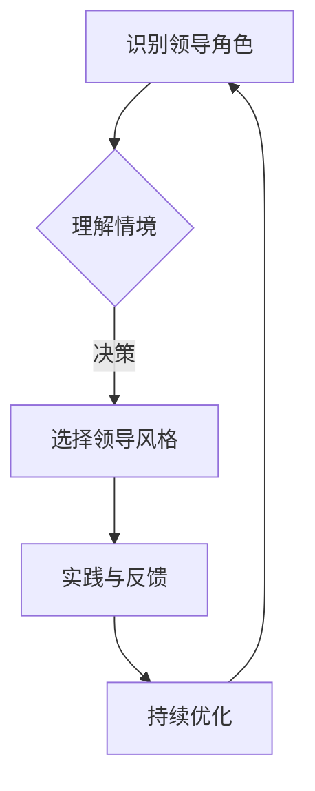

                 

# 领导者的角色定位：在不同情境中切换领导风格

## 摘要

在现代组织中，领导者的角色定位至关重要，他们不仅要明确自己的基本职责，还需根据不同情境灵活切换领导风格，以实现组织的长期目标。本文深入探讨了领导者的角色定义、心理学原理、情境领导理论以及领导风格切换的策略与实践，通过具体的数学模型、算法实现和实际案例，帮助读者理解领导者在不同情境中如何定位自己的角色并选择合适的领导风格。文章最后分析了领导者的角色在组织变革和社会责任中的体现，总结了领导力发展的途径和策略，并提供了丰富的附录资源，以支持读者的深入学习和实践。

---

## 目录大纲

### 第一部分：领导者的角色定位概述

- **第1章：领导者的角色定义与重要性**
  - 1.1 领导者的基本角色
  - 1.2 领导角色在组织中的作用
  - 1.3 领导者的个人特质与职责

- **第2章：领导理论回顾与比较**
  - 2.1 经典领导理论简介
  - 2.2 领导风格的分类与特征
  - 2.3 领导理论在现代管理中的应用

### 第二部分：角色定位与情境领导

- **第3章：领导者角色定位的心理学原理**
  - 3.1 自我认知与角色定位
  - 3.2 心理学理论在角色定位中的应用
  - 3.3 角色定位与情感管理

- **第4章：情境领导理论**
  - 4.1 情境领导模型介绍
  - 4.2 不同情境下的领导风格
  - 4.3 情境领导在实践中的应用

### 第三部分：情境中切换领导风格

- **第5章：领导风格与团队绩效**
  - 5.1 领导风格对团队绩效的影响
  - 5.2 团队成员的差异与适应性领导
  - 5.3 提升团队绩效的领导策略

- **第6章：领导风格切换的策略与实践**
  - 6.1 切换领导风格的原则
  - 6.2 情境分析工具与方法
  - 6.3 实际案例：领导风格切换的实践经验

### 第四部分：角色定位与领导力发展

- **第7章：领导力的自我提升**
  - 7.1 领导力发展的途径
  - 7.2 自我评估与反馈机制
  - 7.3 领导者的终身学习

- **第8章：领导者的角色在组织变革中的角色**
  - 8.1 变革中的领导力
  - 8.2 角色定位与变革管理
  - 8.3 案例分析：组织变革中的领导角色

### 第五部分：领导者的角色定位与组织文化

- **第9章：领导者角色与组织文化**
  - 9.1 组织文化的定义与类型
  - 9.2 领导者角色在塑造组织文化中的影响
  - 9.3 建立积极组织文化的策略

- **第10章：领导者的角色在社会责任中的体现**
  - 10.1 领导者社会责任的内涵
  - 10.2 社会责任与领导角色的关系
  - 10.3 社会责任实践案例分析

### 附录

- **附录A：领导力评估工具与方法**
  - A.1 领导力评估问卷设计
  - A.2 360度评估方法
  - A.3 自我评估与反馈工具

- **附录B：领导力发展资源**
  - B.1 领导力发展课程推荐
  - B.2 领导力发展读物推荐
  - B.3 领导力发展社群推荐

---

**Mermaid 流�程图：领导者角色定位流程**



---

**核心算法原理讲解：情境领导风格切换的决策模型**

```plaintext
# 情境领导风格切换的决策模型

## 1. 模型假设

假设领导者需要根据团队所处的不同情境切换领导风格，每个情境可以用一个特征向量表示。

## 2. 特征向量构建

特征向量由团队成员的工作成熟度和领导者对团队情境的认知构成。具体公式如下：

f_i = (m_i, c_i)

其中，m_i 表示团队成员的工作成熟度，c_i 表示领导者对团队情境的认知。

## 3. 风格切换决策

使用决策树或支持向量机（SVM）等机器学习算法，根据特征向量预测合适的领导风格。预测模型训练公式如下：

y_pred = model.predict(f_i)

其中，y_pred 为预测的领导风格。

## 4. 模型训练与评估

使用历史数据训练预测模型，并通过交叉验证和混淆矩阵等方法评估模型性能。

## 5. 实际应用

在实际应用中，领导者可以根据模型预测结果，选择合适的领导风格，并观察团队绩效的变化，以进一步优化模型。
```

---

**数学模型和数学公式：领导者角色定位中的情感管理**

$$
\text{情感管理模型} = f(\text{情绪识别}, \text{情感调节}, \text{情境适应})
$$

其中：
- $\text{情绪识别}$：通过心理测量和情绪分析技术识别团队成员的情绪状态。
- $\text{情感调节}$：应用心理学方法调节和平衡情绪状态，以保持积极的工作氛围。
- $\text{情境适应}$：根据团队情境的变化，调整情感管理策略，确保领导行为与情境相匹配。

---

**项目实战：情境领导风格切换案例分析**

### 开发环境搭建

- 使用Python作为主要编程语言，利用scikit-learn库进行机器学习模型的训练与预测。
- 使用Jupyter Notebook进行实验和演示。

### 源代码实现

```python
# 导入所需库
from sklearn.tree import DecisionTreeClassifier
from sklearn.model_selection import train_test_split
from sklearn.metrics import accuracy_score
import pandas as pd

# 加载数据集
data = pd.read_csv('leader_style_dataset.csv')

# 特征提取
X = data[['member_maturity', 'leader_cognition']]
y = data['optimal_style']

# 划分训练集和测试集
X_train, X_test, y_train, y_test = train_test_split(X, y, test_size=0.3, random_state=42)

# 创建决策树模型
model = DecisionTreeClassifier()

# 训练模型
model.fit(X_train, y_train)

# 预测
y_pred = model.predict(X_test)

# 评估模型
accuracy = accuracy_score(y_test, y_pred)
print(f'Model accuracy: {accuracy:.2f}')

# 使用模型进行实际预测
new_team_features = [[3, 2]]  # 示例特征向量
new_style = model.predict(new_team_features)
print(f'Predicted leadership style: {new_style[0]}')
```

### 代码解读与分析

- **数据集加载**：从CSV文件中加载包含团队成员成熟度和领导者认知特征的训练数据集。
- **特征提取**：将数据集划分为特征矩阵X和目标向量y。
- **模型训练**：使用训练集数据训练一个决策树分类器。
- **模型预测**：使用测试集数据评估模型准确性，并预测新的特征向量对应的领导风格。
- **模型应用**：在实际场景中使用训练好的模型为新的团队情境提供领导风格建议。

---

**总结**

本文通过深入探讨领导者的角色定位和情境领导理论，帮助领导者了解如何在不同情境中切换合适的领导风格，提升团队绩效和实现组织目标。通过数学模型、算法实现和实际案例的讲解，读者可以更好地理解领导者的角色定位和领导风格切换的决策过程。附录部分提供了领导力评估工具和资源，以支持读者的进一步学习和实践。

---

**作者：AI天才研究院/AI Genius Institute & 禅与计算机程序设计艺术 /Zen And The Art of Computer Programming**### 第一部分：领导者的角色定位概述

在现代组织中，领导者的角色定位至关重要。他们不仅需要承担基本的管理职责，还需要根据组织内外部环境的变化，灵活切换领导风格，以实现组织的战略目标。这一部分将详细探讨领导者的角色定义、角色在组织中的作用，以及领导者需要具备的个人特质和职责。

#### 第1章：领导者的角色定义与重要性

**1.1 领导者的基本角色**

领导者的基本角色可以概括为以下三个方面：

1. **规划与战略制定**：领导者负责制定组织的长期和短期战略，明确组织的发展方向和目标。他们需要通过深入分析和市场调研，为组织制定科学合理的发展规划。

2. **团队管理**：领导者需要管理团队，包括招募、培训、激励和团队建设等。他们需要确保团队成员的目标与组织目标一致，并促进团队成员之间的协作。

3. **决策与执行**：领导者负责做出关键决策，确保组织目标的实现。他们需要在信息不完整或不确定的情况下，迅速做出正确的决策，并确保决策得到有效执行。

**1.2 领导角色在组织中的作用**

领导者在组织中的作用体现在以下几个方面：

1. **愿景引领**：领导者需要为组织设定清晰的愿景，并引导团队成员共同为实现这一愿景而努力。

2. **资源整合**：领导者需要协调和整合组织内部的资源，包括人力、财力和物力，以支持组织的战略实施。

3. **文化塑造**：领导者通过自己的行为和决策，塑造组织的文化和价值观，为组织创造一个积极的工作氛围。

4. **创新推动**：领导者需要鼓励创新和变革，推动组织不断适应市场变化和技术进步。

**1.3 领导者的个人特质与职责**

领导者的个人特质和职责是影响其领导效果的重要因素。以下是领导者需要具备的个人特质和职责：

1. **个人特质**

   - **自信**：领导者需要具备自信，能够在团队面前坚定地表达自己的观点和决策。
   - **正直**：领导者需要具备正直的品质，以身作则，树立良好的道德榜样。
   - **适应力**：领导者需要具备较强的适应力，能够灵活应对各种变化和挑战。
   - **沟通能力**：领导者需要具备良好的沟通能力，能够有效地与团队成员、上级和外部合作伙伴沟通。

2. **职责**

   - **自我管理**：领导者需要自我管理，包括时间管理、情绪管理和知识管理。
   - **团队管理**：领导者需要管理团队，确保团队成员的工作效率和团队氛围。
   - **持续学习**：领导者需要不断学习新知识、新技能，以保持自己在行业中的竞争力。
   - **领导力发展**：领导者需要关注团队成员的领导力发展，培养和选拔未来的领导者。

#### 第2章：领导理论回顾与比较

**2.1 经典领导理论简介**

领导理论的发展历程可以追溯到20世纪早期，以下是一些经典的领导理论：

1. **特质理论**：特质理论认为领导者具备一系列特定的个性特质，如自信、果断、智慧等。这种理论侧重于研究领导者的个人特质，但未能解释领导行为的本质。

2. **行为理论**：行为理论强调领导者的行为模式对团队成员的影响。领导行为可以分为任务导向行为和关系导向行为。这一理论认为，有效的领导者需要在任务和关系之间找到平衡。

3. **情境理论**：情境理论认为领导风格应该根据不同的情境进行切换。最具代表性的情境理论是赫塞和布兰查德的情境领导理论，该理论将领导风格分为四种类型，根据团队成员的工作成熟度选择合适的领导风格。

**2.2 领导风格的分类与特征**

领导风格可以根据不同的分类标准进行划分，以下是几种常见的领导风格：

1. **专制式领导**：领导者做出所有决策，团队成员被动执行。这种领导风格在紧急情况下或需要快速决策时可能有效，但长期可能导致团队成员失去自主性和创造力。

2. **民主式领导**：领导者鼓励团队成员参与决策，团队共同制定目标。这种领导风格有助于提高团队成员的参与感和责任感，但可能需要更多的时间和资源。

3. **参与式领导**：领导者与团队成员共同决策，鼓励团队成员提供意见和建议。这种领导风格可以增强团队的凝聚力和创造力，但领导者需要具备较强的协调和沟通能力。

4. **变革式领导**：领导者通过激励和启发团队成员，推动组织变革和创新。这种领导风格在应对外部挑战和实现组织转型时尤为重要。

**2.3 领导理论在现代管理中的应用**

随着管理实践的不断发展，领导理论也在不断演进。现代领导理论更加关注领导者的角色和影响力，以下是一些现代管理中的应用：

1. **领导者角色理论**：领导者角色理论认为领导者不仅是管理者，更是变革者和激励者。领导者需要具备多方面的能力，如战略思维、创新能力、人际关系管理等。

2. **变革领导理论**：变革领导理论强调领导者在组织变革中的关键作用。领导者需要通过塑造愿景、建立信任、推动执行等方式，引领组织实现变革。

3. **情境领导理论**：情境领导理论在当代管理中得到了广泛应用。领导者需要根据不同的情境和团队成员的特点，灵活切换领导风格，以实现最佳领导效果。

通过回顾和比较不同的领导理论，我们可以更深入地理解领导者的角色和职责，以及如何在不同情境中实现有效的领导。下一部分将探讨领导者角色定位的心理学原理，帮助领导者更好地理解和管理自己的角色和行为。

---

### 第二部分：角色定位与情境领导

领导者的角色定位不仅依赖于其个人特质和职责，还需要深入理解心理学原理，特别是自我认知和情感管理。这一部分将探讨领导者角色定位的心理学原理，并介绍情境领导理论，帮助领导者在不同情境中有效切换领导风格。

#### 第3章：领导者角色定位的心理学原理

**3.1 自我认知与角色定位**

自我认知是领导者角色定位的基础。领导者需要深入了解自己的价值观、动机、能力和行为倾向。以下是一些自我认知的途径：

1. **反思**：定期进行自我反思，思考自己的行为和决策背后的动机，以及这些行为和决策对团队和组织的影响。

2. **反馈**：积极寻求他人的反馈，包括同事、下属和上级，了解自己在团队和组织中的表现和影响。

3. **心理测试**：通过心理测试，如迈尔斯-布里格斯性格类型指标（MBTI）和特质方格理论（TPS），了解自己的性格特征和行为风格。

4. **角色扮演**：通过角色扮演，模拟不同的领导情境，评估自己在不同角色下的表现和反应。

**3.2 心理学理论在角色定位中的应用**

心理学理论为领导者提供了深入理解自己和团队的方法。以下是一些心理学理论在角色定位中的应用：

1. **社会认知理论**：社会认知理论认为，个体的行为和态度受到其对自己、他人和环境的认知影响。领导者需要了解团队成员的自我认知，以更好地引导和激励他们。

2. **心理动力理论**：心理动力理论关注个体的内心冲突和动机。领导者需要了解团队成员的内心世界，以更好地理解他们的行为和情绪。

3. **情绪智力理论**：情绪智力是指识别、理解、管理和表达情绪的能力。领导者需要具备较高的情绪智力，以更好地管理自己的情绪，并影响团队成员的情绪。

**3.3 角色定位与情感管理**

情感管理是领导者角色定位的重要组成部分。领导者需要学会识别和管理自己的情绪，以及如何影响团队成员的情绪。以下是一些情感管理的策略：

1. **情绪识别**：领导者需要学会识别自己的情绪，包括正面情绪和负面情绪。通过自我观察和反思，领导者可以更好地了解自己的情绪状态。

2. **情绪调节**：领导者需要学会调节自己的情绪，以保持冷静和理性。通过深呼吸、冥想和运动等方式，领导者可以缓解压力和焦虑。

3. **情绪表达**：领导者需要学会表达自己的情绪，但要注意方式和场合。通过积极沟通和建设性的反馈，领导者可以传递自己的情绪，同时避免不必要的冲突。

#### 第4章：情境领导理论

**4.1 情境领导模型介绍**

情境领导理论，由赫塞和布兰查德提出，是一种基于领导者-下属关系和工作成熟度的领导模型。该理论认为，领导者的行为应该根据下属的工作成熟度进行动态调整。情境领导模型包括四种领导风格：

1. **指导式领导（S1）**：领导者详细指示任务，监控下属的工作过程。

2. **推销式领导（S2）**：领导者不仅提供指导，还激励下属，解释任务的意义。

3. **参与式领导（S3）**：领导者与下属共同决策，鼓励下属参与决策过程。

4. **授权式领导（S4）**：领导者赋予下属自主权，鼓励他们独立完成任务。

**4.2 不同情境下的领导风格**

情境领导理论指出，领导风格应根据团队成员的工作成熟度进行调整。以下是不同成熟度水平下的领导风格：

1. **低成熟度（M1）**：下属缺乏能力和信心，领导者应采取指导式领导（S1），提供明确的指导和监督。

2. **较低成熟度（M2）**：下属具备一定能力，但缺乏信心，领导者应采取推销式领导（S2），激励并解释任务的重要性。

3. **中等成熟度（M3）**：下属具备能力，但缺乏自主性，领导者应采取参与式领导（S3），与下属共同决策。

4. **高成熟度（M4）**：下属具备能力和自主性，领导者应采取授权式领导（S4），赋予下属自主权。

**4.3 情境领导在实践中的应用**

情境领导理论在实践中的应用包括以下几个方面：

1. **团队建设**：领导者可以根据团队的工作成熟度，选择合适的领导风格，促进团队协作和成长。

2. **绩效管理**：领导者应根据团队成员的工作表现和成熟度，调整领导风格，以提高绩效和满意度。

3. **冲突解决**：领导者可以根据情境选择适当的领导风格，以有效解决团队中的冲突。

通过理解和应用情境领导理论，领导者可以更好地定位自己的角色，并根据不同情境灵活切换领导风格，以实现组织的目标和团队的成功。下一部分将探讨领导风格切换的策略与实践，帮助领导者更有效地应对各种挑战和情境。

---

### 第三部分：情境中切换领导风格

在领导过程中，领导者需要根据不同的情境灵活切换领导风格，以适应团队和组织的需要。这一部分将详细讨论领导风格与团队绩效的关系、团队成员差异对领导风格的影响，以及提升团队绩效的具体策略。

#### 第5章：领导风格与团队绩效

**5.1 领导风格对团队绩效的影响**

领导风格对团队绩效有着直接和重要的影响。不同的领导风格可能会导致不同的团队绩效和成员行为。以下是一些主要的影响：

1. **专制式领导**：这种领导风格可能导致团队成员缺乏自主性和创新精神，从而影响团队的创造力和问题解决能力。然而，在某些情况下，如紧急任务或危机管理，专制式领导可能有助于迅速决策和行动。

2. **民主式领导**：这种领导风格鼓励团队成员参与决策，提高团队的凝聚力和归属感。研究表明，民主式领导通常能够提升团队的绩效和创造力。

3. **参与式领导**：领导者与团队成员共同制定目标和决策，这种领导风格有助于增强团队成员的责任感和参与感，从而提高团队的绩效。

4. **变革式领导**：领导者通过激励和启发团队成员，推动组织变革和创新。这种领导风格在应对外部挑战和实现组织转型时尤为重要，能够显著提升团队的适应能力和创新能力。

**5.2 团队成员的差异与适应性领导**

团队成员的差异是领导风格选择的重要依据。团队成员在能力、经验、动机和个性等方面存在差异，这些差异要求领导者采取适应性领导风格：

1. **能力差异**：对于能力较强的团队成员，领导者可以赋予更多责任和权力，鼓励其发挥特长。对于能力较弱的团队成员，领导者需要提供更多的指导和培训。

2. **经验差异**：经验丰富的团队成员可能更倾向于参与式领导或授权式领导，而缺乏经验的团队成员可能需要更详细的指导和支持。

3. **动机差异**：不同团队成员的动机不同，领导者需要根据不同动机的团队成员采取不同的激励策略。

4. **个性差异**：不同的个性特质要求不同的领导风格。例如，对于较为内向的团队成员，领导者可能需要更多的沟通和反馈，而对于外向的团队成员，领导者可能需要更多的挑战和机会。

**5.3 提升团队绩效的领导策略**

为了提升团队绩效，领导者可以采取以下策略：

1. **明确目标和期望**：领导者需要明确团队的目标和期望，确保团队成员对任务和目标有清晰的理解。

2. **提供资源和支持**：领导者需要确保团队成员有足够的资源和支持来完成任务，包括技术、信息和培训。

3. **激励和奖励**：领导者需要制定有效的激励和奖励机制，以鼓励团队成员的工作热情和创造力。

4. **建立有效的沟通机制**：领导者需要建立开放的沟通渠道，鼓励团队成员分享意见和建议，提高团队的透明度和信任。

5. **培养团队协作精神**：领导者需要促进团队成员之间的协作，通过团队合作解决复杂问题，提高团队的绩效。

通过灵活切换领导风格，并采取有效的领导策略，领导者可以更好地适应不同情境，提升团队绩效，实现组织目标。下一部分将探讨领导风格切换的策略与实践，帮助领导者更好地应对各种复杂的领导情境。

---

#### 第6章：领导风格切换的策略与实践

在不同情境下，领导者需要根据具体情况灵活切换领导风格，以确保团队的高效运作和目标实现。以下是一些实用的策略和实践方法，帮助领导者有效切换领导风格。

**6.1 切换领导风格的原则**

1. **情境适应性原则**：领导者应根据团队所处的不同情境选择合适的领导风格，如任务紧急性、团队成熟度、环境变化等。

2. **灵活变通原则**：领导者不应过于僵化地坚持某种领导风格，而应根据实际情况灵活调整。

3. **目标导向原则**：所有领导风格的选择和切换都应以实现组织目标和团队任务为核心。

4. **持续反馈原则**：领导者需要根据团队成员的反馈和团队绩效，持续调整和优化领导风格。

**6.2 情境分析工具与方法**

1. **SWOT分析**：领导者可以使用SWOT分析（优势、劣势、机会、威胁）来评估当前情境，识别团队的优势和劣势，以及可能面临的机会和威胁。

2. **五力模型**：五力模型（供应商、买家、潜在进入者、替代品、行业内部竞争者）可以帮助领导者分析行业环境，了解外部因素对团队的影响。

3. **情境领导矩阵**：领导者可以使用情境领导矩阵来评估团队成员的工作成熟度，并选择相应的领导风格。

**6.3 实际案例：领导风格切换的实践经验**

**案例一：从专制式领导到参与式领导的切换**

背景：某公司团队在接到一个复杂项目时，初期由于任务复杂，团队进展缓慢，领导决定采取专制式领导，以迅速明确任务目标和分工。

解决方案：在项目初期，领导通过明确指示和严格监督，确保团队快速进入工作状态。随着项目的推进，领导逐渐发现团队成员具备了一定的能力和信心，于是开始采取参与式领导，鼓励团队成员参与决策，提高团队凝聚力。

效果评估：通过领导风格的切换，团队成员的积极性和自主性得到了显著提升，项目进展顺利，最终成功完成。

**案例二：从参与式领导到授权式领导的切换**

背景：在另一项目中，团队成员已经具备较高的工作成熟度，领导希望通过授权式领导，进一步激发团队的潜力和创造力。

解决方案：领导在项目启动时，采用参与式领导，与团队成员共同制定目标和计划。随着项目的深入，领导逐步将决策权下放给团队成员，鼓励他们独立完成任务。

效果评估：通过领导风格的切换，团队成员的创造力和责任感得到了增强，项目创新点增多，团队绩效显著提升。

**6.4 领导风格切换的注意事项**

1. **适度切换**：领导风格切换应适度，避免频繁切换导致团队的不适应。

2. **透明沟通**：在切换领导风格时，领导者应与团队成员进行透明沟通，解释切换的原因和目的。

3. **持续监控**：领导者需要持续监控团队绩效和成员反应，根据实际情况进行调整。

通过以上策略和实践，领导者可以更有效地在不同情境中切换领导风格，促进团队的发展和目标的实现。

---

### 第四部分：角色定位与领导力发展

领导者的角色定位不仅影响个人的职业发展，还直接关系到组织的整体绩效。这一部分将探讨领导力的自我提升、自我评估与反馈机制，以及领导者在组织变革中的角色和职责。

#### 第7章：领导力的自我提升

**7.1 领导力发展的途径**

领导力的发展是一个持续的过程，以下是一些有效的领导力发展途径：

1. **教育和培训**：通过参加领导力课程、研讨会和工作坊，领导者可以学习最新的领导理论和实践方法。

2. **实践经验**：实际工作经历是领导力发展的重要途径。领导者可以通过参与项目管理、团队建设和决策制定等实际工作，积累宝贵的经验。

3. **读书与研究**：阅读有关领导力、管理、心理学和组织行为的书籍和论文，可以帮助领导者拓宽视野，深入理解领导学说的本质。

4. **反思与自我评估**：定期进行自我反思和自我评估，识别自己的优势和不足，并制定相应的改进计划。

**7.2 自我评估与反馈机制**

有效的自我评估与反馈机制是领导力提升的重要环节。以下是一些自我评估与反馈的方法：

1. **360度评估**：通过同事、下属和上级的反馈，领导者可以全面了解自己在团队和组织中的表现。

2. **个人发展计划**：根据自我评估和他人反馈，领导者可以制定个人发展计划，明确自己的提升目标和具体行动。

3. **定期回顾**：领导者应定期回顾自己的发展计划，评估进展情况，并根据实际情况进行调整。

**7.3 领导者的终身学习**

在快速变化的时代，终身学习是领导者保持竞争力的关键。以下是一些建议：

1. **持续学习**：领导者应保持好奇心和求知欲，不断学习新知识、新技能。

2. **跨学科学习**：领导者应尝试学习不同领域的知识，以拓宽视野，提升跨领域的领导能力。

3. **实践与理论相结合**：领导者应在实践中运用所学知识，同时结合理论进行反思和总结，不断提升自己的领导力。

#### 第8章：领导者的角色在组织变革中的角色

**8.1 变革中的领导力**

组织变革是领导者面临的重要挑战之一。有效的变革领导力对于实现组织转型至关重要。以下是一些变革中的领导力原则：

1. **明确变革目标**：领导者需要明确变革的目标和愿景，确保团队成员理解变革的必要性和意义。

2. **建立信任**：领导者应通过开放沟通、积极倾听和透明度，建立与团队成员之间的信任。

3. **激励与参与**：领导者应激励团队成员参与变革过程，鼓励他们提出建议和意见，提高变革的接受度和参与度。

4. **持续支持**：领导者应在变革过程中提供持续的支持，帮助团队成员应对变革带来的挑战和压力。

**8.2 角色定位与变革管理**

在组织变革中，领导者的角色定位至关重要。以下是一些领导者在变革管理中的角色和职责：

1. **变革推动者**：领导者需要积极推动变革，克服组织惯性和阻力，确保变革的顺利进行。

2. **变革顾问**：领导者应成为变革的顾问和导师，为团队成员提供指导和支持，帮助他们适应变革。

3. **变革沟通者**：领导者需要成为变革的沟通者，通过有效沟通传递变革的信息和目标，确保团队成员理解变革的意义。

4. **变革监督者**：领导者应监督变革的进展，及时调整变革策略，确保变革目标的实现。

**8.3 案例分析：组织变革中的领导角色**

**案例：某公司数字化转型**

背景：某公司意识到数字化转型是未来发展的关键，决定启动数字化转型项目。

解决方案：公司领导层首先明确了数字化转型目标，并通过内部沟通和培训，确保团队成员理解变革的必要性和重要性。领导层还建立了跨部门团队，推动技术升级和流程优化。在变革过程中，领导层积极倾听员工的意见和建议，建立了反馈机制，及时调整变革策略。

效果评估：通过领导层的有效领导和组织变革，公司成功实现了数字化转型，提升了业务效率和客户满意度。

通过以上领导力发展和变革管理的方法，领导者可以不断提升自己的能力，有效应对组织变革的挑战，推动组织的持续发展。

---

### 第五部分：领导者的角色定位与组织文化

领导者的角色定位不仅影响个人和团队的表现，还深刻影响着组织的整体文化和氛围。这一部分将探讨领导者角色与组织文化的定义、类型，领导者如何塑造积极组织文化，以及建立这种文化所需的策略。

#### 第9章：领导者角色与组织文化

**9.1 组织文化的定义与类型**

组织文化是指一个组织在长期发展过程中形成的共同价值观、信念和行为规范。组织文化可以划分为以下几种类型：

1. **任务导向文化**：组织强调完成任务和实现目标，追求高效和绩效。
2. **人员导向文化**：组织重视员工的发展和满意度，鼓励员工参与决策。
3. **目标导向文化**：组织有明确的愿景和目标，鼓励员工为实现这些目标而努力。
4. **规范导向文化**：组织强调遵守规范和制度，重视秩序和纪律。

**9.2 领导者角色在塑造组织文化中的影响**

领导者在塑造组织文化中扮演着关键角色，具体影响包括：

1. **树立榜样**：领导者通过自身的行为和决策，塑造组织的行为规范和价值观念。
2. **制定文化标准**：领导者需要明确组织文化的核心价值观，并将其融入日常管理和决策中。
3. **沟通与传播**：领导者需要通过有效的沟通渠道，将组织文化传递给所有成员，确保其得到广泛认同。
4. **激励机制**：领导者可以通过激励机制，如奖励和认可，强化组织文化的核心价值观。

**9.3 建立积极组织文化的策略**

为了建立积极的组织文化，领导者可以采取以下策略：

1. **明确愿景和价值观**：领导者需要明确组织的愿景和核心价值观，并将其作为组织文化的基石。
2. **建立共同语言**：领导者需要创造一种共同的词汇和语言，以加强团队成员之间的认同感和归属感。
3. **促进员工参与**：领导者应鼓励员工参与组织的决策过程，提高员工的参与度和责任感。
4. **提供培训与发展机会**：领导者应提供培训和发展机会，帮助员工提升技能和职业素养，以适应组织文化的要求。
5. **建立反馈机制**：领导者需要建立有效的反馈机制，鼓励团队成员提出建议和反馈，不断优化组织文化。

通过明确领导者角色与组织文化的关系，并采取有效的策略，领导者可以塑造积极、健康的组织文化，为组织的长期发展奠定坚实的基础。

---

#### 第10章：领导者的角色在社会责任中的体现

领导者在社会责任中扮演着至关重要的角色。他们不仅需要关注企业的盈利和增长，还要承担起对环境、社会和利益相关者的责任。以下将探讨领导者社会责任的内涵、与领导角色的关系，以及实际案例。

**10.1 领导者社会责任的内涵**

领导者社会责任（CSR）是指企业领导者和管理层在经营活动中承担的对社会和环境负责的责任。它包括以下几个方面：

1. **环境保护**：领导者应关注环境保护，采取可持续发展的措施，减少企业的环境足迹。
2. **社会贡献**：领导者应积极参与社会公益活动，支持教育、医疗、扶贫等社会事业。
3. **员工权益**：领导者应确保员工的劳动权益，提供安全的工作环境和合理的薪酬福利。
4. **利益相关者关系**：领导者应与利益相关者建立良好的关系，包括供应商、客户、社区等，确保各方利益平衡。
5. **伦理和道德**：领导者应遵循道德和伦理标准，确保企业的经营行为合法、公正和透明。

**10.2 社会责任与领导角色的关系**

社会责任与领导角色的关系紧密相连。领导者作为企业的核心决策者和行为引领者，其行为和决策直接影响企业的社会责任实践。以下是一些具体的关系：

1. **领导者的示范作用**：领导者的行为和决策为员工树立了榜样，影响员工的社会责任意识和行为。
2. **企业文化的塑造**：领导者在塑造企业文化中起着关键作用，社会责任价值观融入企业文化，将促进整个组织的行为。
3. **战略决策**：领导者在制定企业战略时，需要考虑社会责任因素，确保企业的长期可持续发展和社会价值。
4. **监管和合规**：领导者需确保企业遵守相关法律法规，包括环境保护、员工权益保护等，避免法律风险。

**10.3 社会责任实践案例分析**

**案例一：宜家集团的可持续发展策略**

宜家集团是全球最大的家具零售商之一，其在社会责任方面的实践具有代表性。宜家采取了一系列可持续发展措施，包括：

1. **环保材料使用**：宜家致力于使用可持续材料，减少对环境的影响。
2. **能源效率**：宜家在全球范围内的门店和仓库实施节能措施，降低能源消耗。
3. **社会贡献**：宜家积极参与教育、住房和社会援助等公益活动，支持全球社区发展。

**案例二：微软公司的社会责任项目**

微软公司是一家全球知名的科技公司，其在社会责任方面的贡献同样显著。微软的社会责任项目包括：

1. **技术公益**：微软通过技术支持和资金投入，帮助教育机构和非营利组织提升社会服务能力。
2. **员工志愿服务**：微软鼓励员工参与志愿服务，通过“微软志愿者计划”支持社区发展。
3. **环境保护**：微软在办公场所实施环保措施，如减少纸张使用、提倡绿色出行等。

通过这些案例，我们可以看到，领导者在社会责任中的角色不仅体现在具体的行动上，还体现在对企业文化的塑造和对员工行为的引导上。领导者通过积极履行社会责任，不仅提升了企业的社会形象，也为可持续发展做出了贡献。

---

### 附录

#### 附录A：领导力评估工具与方法

**A.1 领导力评估问卷设计**

领导力评估问卷是评估领导者能力和行为的重要工具。以下是一个简单的领导力评估问卷模板：

1. 您是否能够为团队成员提供清晰的指导和支持？
2. 您是否能够有效地激励和鼓舞团队成员？
3. 您是否能够积极地倾听团队成员的意见和建议？
4. 您是否能够在团队面临挑战时保持冷静和理性？
5. 您是否能够制定有效的战略和目标，并确保团队实现？
6. 您是否能够建立和维护积极的团队氛围？

**A.2 360度评估方法**

360度评估是一种通过多角度、多来源收集反馈的方法，以全面评估领导者的表现。以下是一个简单的360度评估流程：

1. 制定评估指标：根据领导力的关键维度，制定评估指标。
2. 收集反馈：从领导者、下属、同事、上级等多个角度收集反馈。
3. 分析反馈：对收集到的反馈进行分析，识别领导者的优势和不足。
4. 制定改进计划：根据评估结果，制定个人发展计划，明确改进目标和具体行动。

**A.3 自我评估与反馈工具**

自我评估与反馈工具可以帮助领导者识别自己的优势和不足，并制定改进计划。以下是一个简单的自我评估工具模板：

1. 我在哪些方面表现出色？
2. 我在哪些方面需要改进？
3. 我如何改进这些方面？
4. 我将如何跟踪和评估改进效果？

---

#### 附录B：领导力发展资源

**B.1 领导力发展课程推荐**

1. **哈佛商学院领导力发展课程**：该课程涵盖领导力发展的各个层面，包括战略思维、决策制定、团队建设等。
2. **斯坦福大学领导力与变革课程**：该课程专注于领导者在面对变革和挑战时的领导能力培养。

**B.2 领导力发展读物推荐**

1. **《领导者的素养》**：作者：约翰·马登。这本书详细探讨了领导者的品质、能力和素养。
2. **《领导力五项修炼》**：作者：斯蒂芬·柯维。这本书提出了领导力的五个核心方面，包括自我领导、人际领导、团队领导等。

**B.3 领导力发展社群推荐**

1. **领英（LinkedIn）领导力论坛**：这是一个全球性的领导力社群，提供丰富的领导力资源和交流平台。
2. **世界领导力论坛**：这是一个专注于领导力研究和实践的国际组织，提供多样化的领导力培训和研究项目。

通过附录部分的资源，读者可以进一步深入了解领导力发展的理论和实践，提升自己的领导能力。

