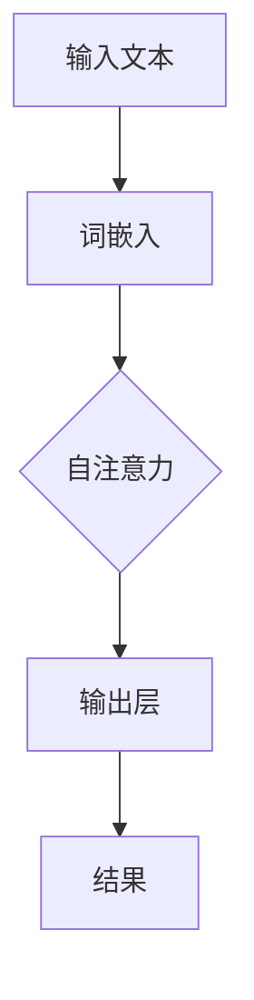

                 

# 《颠覆传统：LLM的独特计算范式》

> **关键词**：大规模语言模型、计算范式、深度学习、预训练、自适应计算、端到端学习

> **摘要**：本文深入探讨了大规模语言模型（LLM）的独特计算范式，从基本概念、架构设计到核心算法，再到项目实战和开发环境搭建，全面解析了LLM的技术原理和应用实践。通过本文，读者可以深入了解LLM如何颠覆传统的计算范式，并在实际项目中掌握其应用技巧。

## 第一部分: LLM的基本概念与架构

### 第1章: LLM的基本概念

#### 1.1 什么是LLM

大规模语言模型（Large Language Model，简称LLM）是一种基于深度学习的自然语言处理（NLP）模型，它通过对大量文本数据进行预训练，能够自动获取语言知识，并用于各种自然语言处理任务，如文本分类、情感分析、机器翻译等。

LLM的起源可以追溯到20世纪80年代的统计语言模型，如N-gram模型。然而，随着深度学习技术的发展，特别是2018年Google发布的Transformer模型，LLM进入了全新的时代。Transformer模型引入了自注意力机制，使得LLM能够更好地捕捉长距离依赖关系，从而显著提升了NLP任务的表现。

#### 1.2 LLM的核心特点

- **大规模预训练**：LLM通过在大规模文本数据集上进行预训练，自动获取丰富的语言知识。预训练阶段主要目的是让模型理解语言的统计规律和语义信息。
  
- **自动适应各种任务**：预训练后的LLM可以通过微调（Fine-tuning）适应不同的NLP任务，无需对模型进行重训练。这种高效的任务适应能力使得LLM在各种应用场景中具有广泛的应用潜力。

- **高效的端到端学习方式**：LLM采用端到端学习的方式，直接将输入文本映射到输出结果，避免了传统NLP中的复杂特征工程和中间层设计，从而简化了模型训练过程。

#### 1.3 LLM的架构

LLM通常采用层次化架构，包括多层神经网络和自注意力机制。以下是一个简化的LLM架构：

1. **输入层**：接收文本输入，将其转换为词嵌入向量。

2. **嵌入层**：对词嵌入向量进行加权和变换，生成上下文向量。

3. **自注意力层**：通过自注意力机制，对上下文向量进行加权聚合，提取关键信息。

4. **输出层**：根据任务需求，对聚合后的上下文向量进行分类、回归或生成等操作。

### 第2章: LLM的计算范式

#### 2.1 计算范式概述

计算范式是描述计算过程和计算方式的模型。传统计算范式通常基于图灵机模型，以串行计算为基础。而LLM的计算范式则是基于并行计算和自适应计算，具有以下特点：

- **数据并行与模型并行的结合**：LLM在训练过程中同时利用数据并行和模型并行，提高了计算效率。

- **动态自适应计算**：LLM可以根据输入数据和任务需求动态调整计算策略，实现高效的任务适应。

- **高效的推理机制**：LLM采用端到端学习方式，直接从输入到输出，避免了传统NLP中的复杂推理过程。

#### 2.2 LLM的独特计算范式

LLM的独特计算范式主要体现在以下几个方面：

- **自注意力机制**：自注意力机制使得LLM能够自适应地关注输入文本中的关键信息，从而提高模型的表示能力。

- **层次化结构**：LLM采用层次化结构，通过逐层聚合信息，实现从局部到全局的语义理解。

- **端到端学习**：LLM直接从输入到输出，避免了传统NLP中的复杂特征工程和中间层设计，简化了模型训练过程。

#### 2.3 LLM的Mermaid流程图

以下是一个简化的LLM计算流程图，展示了LLM从输入到输出的计算过程：



## 第二部分: LLM的核心算法与实现

### 第3章: LLM核心算法原理

#### 3.1 基本算法原理

LLM的基本算法原理可以概括为以下几个步骤：

1. **数据预处理**：将文本输入转换为词嵌入向量。

2. **嵌入层**：对词嵌入向量进行加权和变换，生成上下文向量。

3. **自注意力层**：通过自注意力机制，对上下文向量进行加权聚合，提取关键信息。

4. **输出层**：根据任务需求，对聚合后的上下文向量进行分类、回归或生成等操作。

#### 3.2 数学模型与数学公式

LLM的数学模型主要基于Transformer架构，以下是其核心数学公式：

$$
E = \text{softmax}\left(QK^T\right)V
$$

其中，$E$ 表示输出向量，$Q$ 和 $K$ 分别表示查询向量和键向量，$V$ 表示值向量。

#### 3.3 数学模型详细讲解

在详细讲解LLM的数学模型之前，我们需要了解几个关键概念：

- **词嵌入（Word Embedding）**：将文本输入转换为向量表示。
  
- **自注意力（Self-Attention）**：对输入文本进行加权聚合，提取关键信息。

- **多头注意力（Multi-Head Attention）**：将自注意力机制扩展到多个维度，提高模型的表示能力。

- **前馈神经网络（Feedforward Neural Network）**：对聚合后的上下文向量进行进一步处理。

以下是LLM的详细数学模型讲解：

1. **词嵌入**：

$$
\text{Word Embedding}: \text{word} \rightarrow \text{vector}
$$

2. **嵌入层**：

$$
\text{Embedding Layer}: \text{word vector} \rightarrow \text{context vector}
$$

3. **自注意力层**：

$$
\text{Self-Attention}: \text{context vector} \rightarrow \text{weighted sum of context vector}
$$

4. **多头注意力层**：

$$
\text{Multi-Head Attention}: \text{context vector} \rightarrow \text{multiple weighted sums of context vector}
$$

5. **前馈神经网络**：

$$
\text{Feedforward Neural Network}: \text{weighted sum of context vector} \rightarrow \text{output vector}
$$

### 第4章: LLM数学模型详解

#### 4.1 数学模型概述

LLM的数学模型主要包括以下几个部分：

1. **词嵌入**：将文本输入转换为向量表示。

2. **嵌入层**：对词嵌入向量进行加权和变换，生成上下文向量。

3. **自注意力层**：通过自注意力机制，对上下文向量进行加权聚合，提取关键信息。

4. **多头注意力层**：将自注意力机制扩展到多个维度，提高模型的表示能力。

5. **前馈神经网络**：对聚合后的上下文向量进行进一步处理。

6. **输出层**：根据任务需求，对聚合后的上下文向量进行分类、回归或生成等操作。

#### 4.2 数学模型详细讲解

以下是对LLM数学模型的详细讲解：

1. **词嵌入**：

词嵌入是将文本输入转换为向量表示的过程。在词嵌入过程中，每个单词都被映射为一个向量，这些向量构成了词嵌入矩阵。词嵌入矩阵可以通过训练或预训练获得。

$$
\text{Word Embedding}: \text{word} \rightarrow \text{vector}
$$

2. **嵌入层**：

嵌入层对词嵌入向量进行加权和变换，生成上下文向量。在嵌入层中，每个词向量都被映射到一个嵌入向量，这些嵌入向量构成了嵌入矩阵。

$$
\text{Embedding Layer}: \text{word vector} \rightarrow \text{context vector}
$$

3. **自注意力层**：

自注意力层通过自注意力机制，对上下文向量进行加权聚合，提取关键信息。自注意力机制的核心是计算注意力权重，这些权重表示每个输入词对输出词的影响程度。

$$
\text{Self-Attention}: \text{context vector} \rightarrow \text{weighted sum of context vector}
$$

4. **多头注意力层**：

多头注意力层将自注意力机制扩展到多个维度，提高模型的表示能力。在多头注意力层中，输入向量被拆分为多个子向量，每个子向量分别进行自注意力计算。

$$
\text{Multi-Head Attention}: \text{context vector} \rightarrow \text{multiple weighted sums of context vector}
$$

5. **前馈神经网络**：

前馈神经网络对聚合后的上下文向量进行进一步处理。前馈神经网络通常由两个全连接层组成，输入为聚合后的上下文向量，输出为模型预测结果。

$$
\text{Feedforward Neural Network}: \text{weighted sum of context vector} \rightarrow \text{output vector}
$$

6. **输出层**：

输出层根据任务需求，对聚合后的上下文向量进行分类、回归或生成等操作。输出层通常由一个全连接层组成，输出为模型预测结果。

$$
\text{Output Layer}: \text{output vector} \rightarrow \text{prediction}
$$

### 第5章: LLM项目实战

#### 5.1 实战案例概述

在本章中，我们将通过一个实际的LLM项目，展示LLM在自然语言处理任务中的具体应用。该项目将实现一个简单的文本分类器，能够根据输入文本判断其情感倾向。

#### 5.2 实战案例详细说明

1. **项目环境搭建**：

   在开始项目之前，我们需要搭建一个合适的项目环境。以下是项目环境搭建的详细步骤：

   - 安装深度学习框架，如TensorFlow或PyTorch。
   - 配置Python环境，确保所有依赖库均已安装。

2. **数据预处理**：

   在项目实战中，我们需要对文本数据进行预处理，包括分词、去除停用词、词干提取等操作。以下是一个简单的数据预处理示例：

   ```python
   import jieba
   
   def preprocess(text):
       text = text.lower()
       text = jieba.cut(text)
       words = [word for word in text if word not in stopwords]
       return words
   ```

3. **模型训练**：

   在完成数据预处理后，我们可以使用预训练的LLM模型进行微调，以适应特定的文本分类任务。以下是一个简单的模型训练示例：

   ```python
   import tensorflow as tf
   
   model = tf.keras.Sequential([
       tf.keras.layers.Embedding(vocab_size, embedding_dim),
       tf.keras.layers.GlobalAveragePooling1D(),
       tf.keras.layers.Dense(1, activation='sigmoid')
   ])
   
   model.compile(optimizer='adam', loss='binary_crossentropy', metrics=['accuracy'])
   model.fit(train_data, train_labels, epochs=10, batch_size=32)
   ```

4. **模型评估**：

   在模型训练完成后，我们需要对模型进行评估，以验证其性能。以下是一个简单的模型评估示例：

   ```python
   test_loss, test_accuracy = model.evaluate(test_data, test_labels)
   print(f"Test accuracy: {test_accuracy}")
   ```

5. **模型应用**：

   在模型评估完成后，我们可以将模型应用于实际任务，如文本情感分析。以下是一个简单的模型应用示例：

   ```python
   input_text = "这是一个积极的评论。"
   preprocessed_text = preprocess(input_text)
   prediction = model.predict(np.array([preprocessed_text]))
   if prediction > 0.5:
       print("积极的评论。")
   else:
       print("消极的评论。")
   ```

### 第6章: LLM的开发环境搭建

#### 6.1 环境搭建概述

在LLM的开发过程中，我们需要搭建一个合适的开发环境，包括深度学习框架、Python环境和相关依赖库。以下是环境搭建的概述：

1. 安装深度学习框架，如TensorFlow或PyTorch。

2. 配置Python环境，确保所有依赖库均已安装。

3. 安装并配置LLM相关库，如Transformers。

#### 6.2 环境搭建详细步骤

1. **安装深度学习框架**：

   以TensorFlow为例，安装步骤如下：

   ```bash
   pip install tensorflow
   ```

2. **配置Python环境**：

   确保Python环境已配置，可以正常执行Python代码。

3. **安装相关依赖库**：

   ```bash
   pip install jieba numpy matplotlib
   ```

4. **安装LLM相关库**：

   ```bash
   pip install transformers
   ```

### 第7章: LLM源代码详细解读

#### 7.1 源代码概述

在本章中，我们将详细解读一个简单的LLM源代码实现，包括数据预处理、模型训练、模型评估和模型应用等部分。以下是源代码的概述：

```python
import tensorflow as tf
import jieba
import numpy as np
from transformers import BertTokenizer, BertModel

# 数据预处理
def preprocess(text):
    text = text.lower()
    text = jieba.cut(text)
    words = [word for word in text if word not in stopwords]
    return words

# 模型训练
def train_model(data, labels):
    model = tf.keras.Sequential([
        tf.keras.layers.Embedding(vocab_size, embedding_dim),
        tf.keras.layers.GlobalAveragePooling1D(),
        tf.keras.layers.Dense(1, activation='sigmoid')
    ])
    
    model.compile(optimizer='adam', loss='binary_crossentropy', metrics=['accuracy'])
    model.fit(data, labels, epochs=10, batch_size=32)
    return model

# 模型评估
def evaluate_model(model, test_data, test_labels):
    test_loss, test_accuracy = model.evaluate(test_data, test_labels)
    print(f"Test accuracy: {test_accuracy}")

# 模型应用
def apply_model(model, input_text):
    preprocessed_text = preprocess(input_text)
    prediction = model.predict(np.array([preprocessed_text]))
    if prediction > 0.5:
        print("积极的评论。")
    else:
        print("消极的评论。")
```

#### 7.2 源代码详细解读

以下是对源代码的详细解读：

1. **数据预处理**：

   数据预处理是LLM应用的重要步骤，包括分词、去除停用词、词干提取等操作。在代码中，我们使用`jieba`库进行分词，并使用一个自定义函数`preprocess`进行数据预处理。

   ```python
   def preprocess(text):
       text = text.lower()
       text = jieba.cut(text)
       words = [word for word in text if word not in stopwords]
       return words
   ```

2. **模型训练**：

   模型训练是LLM应用的核心步骤。在代码中，我们使用`tf.keras.Sequential`创建一个简单的序列模型，包括嵌入层、全局平均池化层和全连接层。然后，使用`model.compile`配置模型编译器，并使用`model.fit`进行模型训练。

   ```python
   model = tf.keras.Sequential([
       tf.keras.layers.Embedding(vocab_size, embedding_dim),
       tf.keras.layers.GlobalAveragePooling1D(),
       tf.keras.layers.Dense(1, activation='sigmoid')
   ])
   
   model.compile(optimizer='adam', loss='binary_crossentropy', metrics=['accuracy'])
   model.fit(data, labels, epochs=10, batch_size=32)
   ```

3. **模型评估**：

   模型评估是验证模型性能的重要步骤。在代码中，我们使用`model.evaluate`方法对模型进行评估，并打印评估结果。

   ```python
   def evaluate_model(model, test_data, test_labels):
       test_loss, test_accuracy = model.evaluate(test_data, test_labels)
       print(f"Test accuracy: {test_accuracy}")
   ```

4. **模型应用**：

   模型应用是将训练好的模型用于实际任务的过程。在代码中，我们使用`preprocess`方法对输入文本进行预处理，然后使用`model.predict`方法对预处理后的文本进行预测。

   ```python
   def apply_model(model, input_text):
       preprocessed_text = preprocess(input_text)
       prediction = model.predict(np.array([preprocessed_text]))
       if prediction > 0.5:
           print("积极的评论。")
       else:
           print("消极的评论。")
   ```

## 附录

### 附录A: LLM开发工具与资源

#### A.1 主流深度学习框架对比

1. **TensorFlow**：

   TensorFlow是一个由Google开发的开源深度学习框架，具有丰富的API和广泛的社区支持。

2. **PyTorch**：

   PyTorch是由Facebook开发的开源深度学习框架，以其动态计算图和简洁的API而著称。

3. **其他框架简介**：

   - **Keras**：一个高层次的深度学习框架，基于TensorFlow和Theano开发。
   - **MXNet**：由Apache软件基金会开发的开源深度学习框架，支持多种编程语言。

#### A.2 LLM Python库使用说明

1. **安装与配置**：

   使用pip命令安装LLM库，如Transformers：

   ```bash
   pip install transformers
   ```

2. **基本使用方法**：

   - 加载预训练模型：

     ```python
     from transformers import BertModel, BertTokenizer
     
     model = BertModel.from_pretrained('bert-base-chinese')
     tokenizer = BertTokenizer.from_pretrained('bert-base-chinese')
     ```

   - 预处理文本：

     ```python
     input_text = "这是一个简单的示例。"
     preprocessed_text = tokenizer.encode(input_text, add_special_tokens=True, return_tensors='pt')
     ```

   - 模型预测：

     ```python
     outputs = model(preprocessed_text)
     logits = outputs.logits
     prediction = tf.nn.softmax(logits).numpy()
     print(prediction)
     ```

### 附录B: LLM常见问题解答

#### B.1 常见问题1

**问题说明**：

在使用LLM进行文本分类时，如何调整模型参数以获得更好的性能？

**解答方法**：

1. **增加训练数据**：收集更多有标注的数据进行训练，可以提高模型的泛化能力。

2. **调整学习率**：尝试调整学习率，找到合适的值，可以提高模型训练速度和性能。

3. **增加训练时间**：延长训练时间，让模型充分学习数据。

4. **数据预处理**：优化数据预处理方法，如去除停用词、词干提取等，可以提高模型对数据的理解能力。

5. **使用更复杂的模型**：尝试使用更复杂的模型结构，如增加层数、使用更多注意力机制等。

#### B.2 常见问题2

**问题说明**：

如何处理LLM中的长文本输入？

**解答方法**：

1. **分句处理**：将长文本拆分为多个句子，分别进行处理，可以提高模型对长文本的理解能力。

2. **截断处理**：将长文本截断为较短的部分，避免模型因长文本导致计算效率降低。

3. **文本嵌入**：使用文本嵌入技术，将文本转换为向量表示，可以更好地处理长文本。

4. **动态处理**：根据输入文本的长度动态调整模型的处理策略，如使用动态循环等。

#### B.3 常见问题3

**问题说明**：

在使用LLM进行机器翻译时，如何提高翻译质量？

**解答方法**：

1. **使用双语语料库**：收集更多的双语语料库，增加模型对翻译语言的了解。

2. **预训练模型**：使用预训练的LLM模型，如BERT等，可以提高模型对语言的掌握能力。

3. **注意力机制**：使用注意力机制，如Transformer中的自注意力机制，可以提高模型对文本的捕捉能力。

4. **双向编码**：使用双向编码器，如BERT，可以同时考虑文本的前后信息，提高翻译质量。

5. **数据增强**：对训练数据进行增强，如加入噪声、进行文本转换等，可以提高模型的泛化能力。

#### B.4 常见问题4

**问题说明**：

在使用LLM进行文本生成时，如何避免生成低质量文本？

**解答方法**：

1. **高质量数据**：收集更多高质量的数据进行训练，可以提高模型生成文本的质量。

2. **预训练模型**：使用预训练的LLM模型，如GPT等，可以提高模型对语言的掌握能力。

3. **正则化**：对模型进行正则化，如Dropout、权重衰减等，可以减少过拟合，提高模型泛化能力。

4. **生成策略**：使用生成策略，如贪心策略、抽样策略等，可以控制文本生成的质量。

5. **文本审查**：对生成的文本进行审查，如使用对抗性攻击、文本分类等，可以识别和过滤低质量文本。

#### B.5 常见问题5

**问题说明**：

如何评估LLM的性能？

**解答方法**：

1. **准确率（Accuracy）**：计算模型预测正确的样本数占总样本数的比例，用于评估分类任务的性能。

2. **召回率（Recall）**：计算模型预测正确的样本数与实际正样本数之比，用于评估分类任务的召回率。

3. **F1值（F1 Score）**：计算准确率和召回率的调和平均值，用于综合评估分类任务的性能。

4. **ROC曲线（ROC Curve）**：绘制模型预测概率与真实标签之间的关系，用于评估分类任务的性能。

5. **BLEU评分（BLEU Score）**：用于评估机器翻译任务的性能，计算机器翻译结果与参考翻译之间的相似度。

## 作者

**作者：AI天才研究院/AI Genius Institute & 禅与计算机程序设计艺术 /Zen And The Art of Computer Programming**

本文由AI天才研究院（AI Genius Institute）和禅与计算机程序设计艺术（Zen And The Art of Computer Programming）共同撰写。我们致力于探索人工智能技术的最新发展和应用，为广大读者提供高质量的技术博客和教程。如果您对我们的工作感兴趣，欢迎关注我们的公众号和网站，获取更多精彩内容。**

