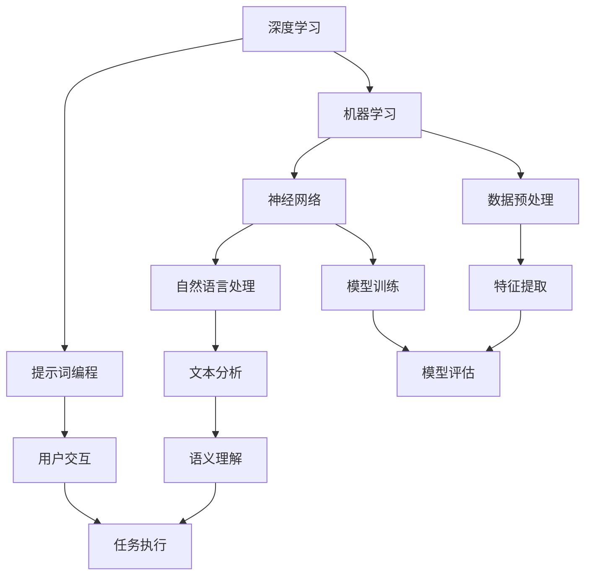

                 

### 文章标题

> 关键词：AI 2.0，提示词编程，深度学习，通用人工智能，应用案例

摘要：本文将深入探讨AI 2.0时代的崛起和提示词编程的重要性。我们将详细分析AI 2.0的定义、特点和应用领域，介绍提示词编程的原理与实现，探讨其在各个领域的应用案例，并讨论AI 2.0时代的安全与伦理问题。通过本文的阅读，读者将全面了解AI 2.0时代的核心概念、技术实现以及未来发展方向。

## 第一部分：AI 2.0时代的概述

### 第一部分：AI 2.0时代的概述

在探讨AI 2.0时代的崛起之前，我们需要先理解什么是AI 1.0，以及AI 2.0相对于AI 1.0的进化。AI 1.0时代主要集中于特定领域的任务，如语音识别、图像识别、机器翻译等。这些系统虽然表现出色，但它们的通用性较差，无法应对复杂的多领域问题。AI 2.0时代的到来，标志着人工智能进入了一个新的发展阶段，其核心目标是实现通用人工智能（AGI），即具有人类智能水平的人工智能系统。

### 第1章：AI 2.0时代的概念与特点

#### 1.1 AI 2.0的定义与背景

AI 2.0，即人工智能2.0，是相对于传统的AI 1.0而言的。AI 1.0主要集中在特定领域的任务，如语音识别、图像识别等，而AI 2.0则更强调通用性和跨领域的应用。AI 2.0的定义可以从以下几个方面来理解：

1. **通用性**：AI 2.0的目标是构建具有广泛适应能力的人工智能系统，能够在不同的领域和任务中发挥作用，而不仅仅是解决特定领域的问题。

2. **跨领域应用**：AI 2.0不仅局限于某一特定领域，而是能够跨领域应用。这意味着，AI 2.0能够将一个领域的知识和技能应用到另一个领域，从而实现知识的共享和集成。

3. **自我进化**：AI 2.0系统具有自我学习和优化的能力，能够通过不断的训练和优化，适应不同的环境和需求。

#### 1.1.2 AI 2.0的背景

AI 2.0的崛起得益于以下几个因素的共同推动：

1. **深度学习技术的突破**：深度学习技术的快速发展，使得人工智能在图像识别、语音识别、自然语言处理等领域的性能得到了显著提升。

2. **大数据的普及**：随着大数据技术的不断发展，人们可以获得海量的数据用于训练人工智能模型，从而提高模型的准确性和通用性。

3. **计算能力的提升**：随着云计算和GPU等计算技术的普及，人们可以更高效地进行大规模的模型训练和推理，为AI 2.0的实现提供了强大的计算支持。

#### 1.2 AI 2.0的核心特点

AI 2.0的核心特点主要体现在以下几个方面：

1. **通用性**：AI 2.0具有更强的通用性，可以在多个领域实现跨领域的应用。例如，一个训练好的自然语言处理模型不仅可以用于文本分类，还可以用于机器翻译、情感分析等任务。

2. **适应性**：AI 2.0可以通过不断的学习和优化，适应不同的环境和需求。这意味着，AI 2.0系统不仅能够处理当前的任务，还能够适应未来的变化。

3. **智能性**：AI 2.0具有更高的智能水平，能够进行更复杂的推理和决策。例如，一个训练好的AI系统可以像人类一样进行逻辑推理，解决复杂的问题。

#### 1.3 AI 2.0的应用领域

AI 2.0的应用领域非常广泛，几乎覆盖了所有的重要行业。以下是一些典型的应用领域：

1. **金融**：在金融领域，AI 2.0可以用于智能投顾、风险管理、欺诈检测等。例如，通过分析大量的历史数据和用户行为，AI系统可以为用户提供个性化的投资建议。

2. **医疗**：在医疗领域，AI 2.0可以用于疾病诊断、药物研发、健康管理等。例如，通过分析大量的医疗数据，AI系统可以帮助医生进行更准确的疾病诊断。

3. **教育**：在教育领域，AI 2.0可以用于个性化教学、智能辅导、在线教育等。例如，通过分析学生的学习数据，AI系统可以为每个学生提供个性化的学习建议。

4. **制造业**：在制造业领域，AI 2.0可以用于智能制造、智能物流、设备预测维护等。例如，通过实时监测设备的状态，AI系统可以帮助企业进行更高效的设备维护和管理。

#### 1.4 AI 2.0的发展挑战

虽然AI 2.0具有巨大的潜力，但其发展仍面临一些挑战：

1. **数据隐私**：AI 2.0需要处理大量的数据，这就涉及到数据隐私的问题。如何确保用户数据的安全，防止数据泄露，是AI 2.0发展的重要挑战。

2. **伦理问题**：AI 2.0的应用可能会引发一系列伦理问题，如算法歧视、隐私侵犯等。如何确保AI系统的公平性和透明性，是AI 2.0发展的重要挑战。

3. **技术瓶颈**：AI 2.0在算法、计算能力、数据质量等方面仍面临一定的技术瓶颈。如何突破这些技术瓶颈，是AI 2.0发展的重要挑战。

### 第2章：提示词编程的原理与实现

#### 2.1 提示词编程的定义

提示词编程是一种通过输入提示词来引导AI模型进行任务执行的方法。与传统的编程方式不同，提示词编程更依赖于自然语言交互，用户可以通过简单的提示词来指导AI系统执行复杂的任务。提示词编程的核心思想是将人类语言与计算机程序相结合，使得用户可以以更自然、直观的方式与计算机进行交互。

#### 2.1.1 提示词编程的概念

提示词编程的概念可以从以下几个方面来理解：

1. **提示词**：提示词是用户输入的用于指导AI系统执行任务的词语或短语。提示词可以是简单的单词，也可以是复杂的句子，其目的是提供足够的信息，使得AI系统可以理解并执行相应的任务。

2. **编程**：在提示词编程中，编程不再是传统的代码编写，而是通过自然语言与AI系统进行交互。用户通过输入提示词，就像是在与AI系统进行对话，从而引导AI系统执行任务。

3. **AI模型**：提示词编程的核心是AI模型，这些模型可以是预训练的，也可以是用户自定义的。AI模型负责理解提示词的含义，并根据提示词生成相应的输出。

#### 2.1.2 提示词编程的优势

提示词编程相对于传统的编程方式，具有以下优势：

1. **降低技术门槛**：提示词编程不需要用户具备深厚的编程知识，用户可以通过简单的提示词来指导AI系统执行任务，从而降低了技术门槛。

2. **提高开发效率**：提示词编程可以大大提高开发效率，用户不再需要编写复杂的代码，而是通过简单的提示词即可实现相应的功能。

3. **增强交互性**：提示词编程使得用户与AI系统的交互更加自然、直观。用户可以通过自然语言与AI系统进行对话，从而实现更加人性化的交互。

#### 2.2 提示词编程的实现

提示词编程的实现主要包括以下几个方面：

1. **提示词的设计与优化**：提示词的设计与优化对于提示词编程的效果至关重要。设计良好的提示词可以使得AI系统更容易理解用户的意图，从而提高任务的执行效率。优化提示词的方法包括词性标注、语义分析、上下文理解等。

2. **提示词编程的核心算法**：提示词编程的核心算法包括生成式模型和判别式模型。生成式模型主要通过生成文本的方式来实现提示词编程，而判别式模型则通过分类的方式来实现。常见的生成式模型包括生成对抗网络（GAN）、变分自编码器（VAE）等，常见的判别式模型包括卷积神经网络（CNN）、循环神经网络（RNN）等。

3. **提示词编程的应用场景**：提示词编程可以应用于多个领域，包括自然语言处理、图像识别、推荐系统等。例如，在自然语言处理领域，提示词编程可以用于机器翻译、文本分类、情感分析等任务；在图像识别领域，提示词编程可以用于图像生成、图像分类等任务；在推荐系统领域，提示词编程可以用于个性化推荐、广告投放等任务。

#### 2.3 提示词编程的挑战与未来方向

虽然提示词编程具有巨大的潜力，但其发展仍面临一些挑战：

1. **数据需求**：提示词编程需要大量的高质量数据来训练模型，如何获取和利用这些数据是提示词编程发展的重要挑战。

2. **模型训练**：提示词编程的模型训练过程复杂，需要大量的计算资源和时间，如何优化模型训练过程，提高训练效率，是提示词编程发展的重要挑战。

3. **解释性**：提示词编程的模型输出结果往往依赖于复杂的神经网络，如何提高模型的解释性，使得用户可以理解模型的决策过程，是提示词编程发展的重要挑战。

未来的提示词编程可能会朝着以下几个方向发展：

1. **自动化**：未来的提示词编程可能会更加自动化，用户可以通过简单的提示词即可实现复杂的功能，而不需要深入了解背后的技术细节。

2. **智能化**：未来的提示词编程可能会更加智能化，AI系统可以自动生成和优化提示词，从而提高任务的执行效率。

3. **跨领域应用**：未来的提示词编程可能会实现跨领域的应用，将一个领域的知识和技能应用到另一个领域，从而实现知识的共享和集成。

## 第3章：AI 2.0时代的开发工具与框架

### 3.1 开发工具的选择

在AI 2.0时代，选择合适的开发工具至关重要。以下将介绍几种常用的开发工具，并分析它们的特点和适用场景。

#### 3.1.1 深度学习框架的选择

深度学习框架是AI开发的核心工具，常见的深度学习框架包括TensorFlow、PyTorch、Keras等。

1. **TensorFlow**：
   - **特点**：TensorFlow是一个开源的深度学习框架，由Google开发。它支持多种编程语言，包括Python、C++和Java。TensorFlow提供了丰富的API，支持各种深度学习模型的构建和训练。
   - **适用场景**：TensorFlow适用于大规模的深度学习模型训练和部署，特别是在工业界和学术界有着广泛的应用。

2. **PyTorch**：
   - **特点**：PyTorch是一个开源的深度学习框架，由Facebook开发。它支持动态计算图，使得模型设计和调试更加灵活。PyTorch的API设计简洁，易于学习和使用。
   - **适用场景**：PyTorch适用于需要快速原型设计和实验的场景，特别是在学术界和新兴的AI研究领域有着很高的认可度。

3. **Keras**：
   - **特点**：Keras是一个高层次的深度学习框架，建立在TensorFlow和Theano之上。Keras的设计目标是提供简单、易于使用的API，使得深度学习模型的构建更加直观。
   - **适用场景**：Keras适用于需要快速构建和部署深度学习模型的场景，特别是对于没有深度学习背景的开发者来说，Keras提供了极大的便利。

#### 3.1.2 机器学习库的选择

除了深度学习框架，机器学习库也是AI开发的重要工具。以下介绍几种常用的机器学习库。

1. **Scikit-learn**：
   - **特点**：Scikit-learn是一个开源的机器学习库，基于Python。它提供了多种经典的机器学习算法和工具，包括分类、回归、聚类等。
   - **适用场景**：Scikit-learn适用于需要快速实现机器学习算法的场景，特别是对于小型项目和快速原型设计。

2. **XGBoost**：
   - **特点**：XGBoost是一个基于决策树的机器学习库，以其高效的性能和优秀的准确性而著称。XGBoost支持并行计算，可以显著提高模型的训练速度。
   - **适用场景**：XGBoost适用于需要高效计算和较高准确性的场景，特别是在大数据分析和比赛优化中有着广泛的应用。

3. **LightGBM**：
   - **特点**：LightGBM是另一个基于决策树的机器学习库，与XGBoost类似，但它采用了更快的树构建算法和更高效的内存使用策略。
   - **适用场景**：LightGBM适用于需要高效计算和较低内存使用的场景，特别是在处理大规模数据集时，其性能优势更加明显。

### 3.2 开发框架的搭建

选择合适的开发工具之后，我们需要搭建开发框架，以便进行模型的训练和部署。以下是一个典型的开发框架搭建步骤：

1. **环境配置**：
   - 安装深度学习框架（如TensorFlow、PyTorch）和机器学习库（如Scikit-learn、XGBoost）。
   - 配置Python环境，包括必要的依赖库和工具。

2. **数据预处理**：
   - 加载数据集，并进行数据清洗和预处理，如缺失值填补、数据标准化等。
   - 划分训练集和测试集，以便评估模型性能。

3. **模型构建**：
   - 定义深度学习模型或机器学习算法，包括输入层、隐藏层和输出层。
   - 设置模型参数，如学习率、批次大小、迭代次数等。

4. **模型训练**：
   - 使用训练集对模型进行训练，通过反向传播算法优化模型参数。
   - 监控训练过程，如损失函数、准确率等，以便调整模型参数。

5. **模型评估**：
   - 使用测试集对模型进行评估，计算模型的准确率、召回率、F1值等指标。
   - 分析模型性能，找出存在的问题和改进方向。

6. **模型部署**：
   - 将训练好的模型部署到生产环境，如服务器、云平台等。
   - 集成模型到应用系统中，实现自动化或手动调用。

### 3.3 开发工具的未来趋势

随着人工智能技术的不断发展和应用场景的扩大，开发工具也在不断演进。以下是一些开发工具的未来趋势：

1. **开源与商业化**：
   - 开源工具将继续发展，提供更多的开源库和框架，降低开发门槛。
   - 商业化工具将提供更多高级功能和服务，满足专业用户的需求。

2. **自动化与智能化**：
   - 开发工具将更加自动化，如自动化模型选择、自动化超参数调优等，提高开发效率。
   - 开发工具将更加智能化，如基于机器学习的模型优化、自动化代码生成等。

3. **云原生与边缘计算**：
   - 开发工具将更加适应云原生和边缘计算的需求，提供更好的云服务和边缘计算支持。

## 第4章：AI 2.0时代的应用案例

### 4.1 金融领域的应用案例

#### 4.1.1 智能投顾

智能投顾是AI 2.0在金融领域的重要应用之一。通过分析用户的风险偏好、财务状况和投资目标，智能投顾可以提供个性化的投资建议。智能投顾的实现主要包括以下几个步骤：

1. **用户画像**：
   - 收集用户的基本信息，如年龄、收入、投资经验等。
   - 分析用户的行为数据，如投资历史、风险偏好等。

2. **投资策略**：
   - 根据用户画像，为用户制定合适的投资策略。
   - 选择合适的资产配置，如股票、债券、基金等。

3. **风险控制**：
   - 对投资组合进行风险控制，确保投资风险在用户可承受范围内。
   - 定期调整投资策略，以适应市场变化。

4. **反馈与优化**：
   - 收集用户对投资建议的反馈，不断优化投资策略。
   - 分析投资结果，为用户提供更准确的建议。

智能投顾的应用不仅提高了投资效率，还为用户提供了更加个性化的服务，受到了广泛的欢迎。

#### 4.1.2 风险管理

AI 2.0在风险管理中的应用主要体现在以下几个方面：

1. **欺诈检测**：
   - 利用机器学习模型，对用户的交易行为进行分析，识别潜在的欺诈行为。
   - 通过实时监控，及时发现并阻止欺诈行为。

2. **信用评估**：
   - 通过分析用户的信用历史、财务状况等信息，评估用户的信用等级。
   - 提供更准确的信用评估，降低信用风险。

3. **风险预警**：
   - 基于大数据和机器学习算法，对市场风险进行预测和预警。
   - 为投资者提供及时的风险信息，帮助他们做出更明智的投资决策。

风险管理技术的应用，提高了金融系统的安全性和稳定性，为金融行业的健康发展提供了有力支持。

#### 4.1.3 欺诈检测

欺诈检测是金融领域的一个重要应用，通过AI 2.0技术，可以实现更高效、更准确的欺诈检测。欺诈检测的主要步骤包括：

1. **数据收集**：
   - 收集用户的交易数据、行为数据等，用于训练欺诈检测模型。

2. **特征提取**：
   - 从数据中提取与欺诈相关的特征，如交易金额、交易时间、交易频率等。

3. **模型训练**：
   - 使用机器学习算法，训练欺诈检测模型，使其能够识别潜在的欺诈行为。

4. **实时监控**：
   - 对用户交易行为进行实时监控，一旦发现异常，立即采取措施。

5. **反馈与优化**：
   - 收集欺诈检测的结果，不断优化模型，提高检测准确率。

通过AI 2.0技术的应用，欺诈检测系统可以更快速、更准确地识别欺诈行为，降低金融系统的风险。

### 4.2 医疗领域的应用案例

#### 4.2.1 疾病诊断

AI 2.0在医疗领域的应用之一是疾病诊断。通过深度学习和图像识别技术，AI系统可以辅助医生进行疾病诊断。疾病诊断的主要步骤包括：

1. **数据收集**：
   - 收集大量的医学图像数据，如X光片、CT扫描、MRI等。

2. **数据预处理**：
   - 对医学图像进行预处理，如去噪、对比度增强等。

3. **特征提取**：
   - 从医学图像中提取与疾病相关的特征，如肿瘤的大小、形状等。

4. **模型训练**：
   - 使用深度学习算法，训练疾病诊断模型，使其能够识别各种疾病。

5. **模型评估**：
   - 使用测试集对疾病诊断模型进行评估，计算模型的准确率、召回率等指标。

6. **临床应用**：
   - 将疾病诊断模型应用于临床实践，辅助医生进行诊断。

通过AI 2.0技术的应用，疾病诊断系统可以提高诊断的准确性和效率，为患者的健康提供有力保障。

#### 4.2.2 药物研发

AI 2.0在药物研发中的应用主要体现在以下几个方面：

1. **药物设计**：
   - 利用深度学习算法，预测药物的化学结构和活性，帮助研究人员设计新的药物。

2. **药物筛选**：
   - 对大量的药物化合物进行筛选，快速识别出具有潜力的药物候选。

3. **临床试验**：
   - 利用大数据和机器学习算法，对临床试验数据进行挖掘和分析，预测药物的安全性和有效性。

4. **个性化医疗**：
   - 通过分析患者的基因信息、病史等，为患者提供个性化的治疗方案。

AI 2.0技术的应用，提高了药物研发的效率，缩短了药物研发周期，为人类健康事业做出了重要贡献。

#### 4.2.3 健康管理

AI 2.0在健康管理中的应用主要体现在以下几个方面：

1. **健康监测**：
   - 通过可穿戴设备和健康监测设备，实时监测用户的健康数据，如心率、血压、血糖等。

2. **健康评估**：
   - 利用机器学习算法，对健康数据进行分析，评估用户的健康状况。

3. **健康建议**：
   - 根据用户的健康评估结果，为用户提供个性化的健康建议，如饮食调整、运动建议等。

4. **健康预警**：
   - 通过实时监控健康数据，提前发现潜在的健康问题，为用户提供预警信息。

AI 2.0技术的应用，为健康管理提供了更智能、更个性化的解决方案，提高了人们的生活质量。

### 4.3 教育领域的应用案例

#### 4.3.1 个性化教学

AI 2.0在教育领域的应用之一是个性化教学。通过分析学生的学习数据，AI系统可以为每个学生提供个性化的教学方案。个性化教学的主要步骤包括：

1. **学生学习数据分析**：
   - 收集学生的学习行为数据，如学习时间、学习内容、学习效果等。

2. **学生能力评估**：
   - 利用机器学习算法，评估学生的学习能力、学习风格等。

3. **个性化教学方案制定**：
   - 根据学生的能力评估结果，为每个学生制定合适的教学方案。

4. **教学效果评估**：
   - 对个性化教学方案的效果进行评估，不断优化教学方案。

通过AI 2.0技术的应用，个性化教学可以更好地满足学生的学习需求，提高学习效果。

#### 4.3.2 智能辅导

AI 2.0在智能辅导中的应用主要体现在以下几个方面：

1. **问题诊断**：
   - 通过分析学生的学习行为和成绩数据，诊断学生存在的问题，如知识点掌握不牢固、学习兴趣不高等。

2. **辅导方案制定**：
   - 根据问题诊断结果，为学生制定个性化的辅导方案。

3. **辅导过程监控**：
   - 监控辅导过程，确保辅导方案的有效实施。

4. **辅导效果评估**：
   - 对辅导效果进行评估，为后续辅导提供参考。

智能辅导系统可以帮助教师更好地了解学生的学习情况，提高辅导效率。

#### 4.3.3 在线教育

AI 2.0在在线教育中的应用主要体现在以下几个方面：

1. **内容推荐**：
   - 根据学生的学习兴趣和学习进度，推荐合适的学习内容。

2. **学习效果评估**：
   - 通过在线测试和作业分析，评估学生的学习效果。

3. **学习过程监控**：
   - 监控学生的学习过程，提供学习建议和反馈。

4. **学习社区**：
   - 构建在线学习社区，促进师生互动和资源共享。

在线教育系统可以为学生提供灵活、高效的学习体验，提高教育质量。

### 4.4 制造业领域的应用案例

#### 4.4.1 智能制造

智能制造是AI 2.0在制造业的重要应用。通过物联网、大数据和机器学习技术，智能制造可以实现生产过程的自动化和智能化。智能制造的主要步骤包括：

1. **设备互联**：
   - 将生产设备连接到物联网，实现设备之间的数据交换和通信。

2. **数据采集**：
   - 采集设备运行数据，如温度、压力、速度等。

3. **数据分析和预测**：
   - 利用机器学习算法，对设备运行数据进行分析和预测，预测设备故障、生产进度等。

4. **自动化控制**：
   - 根据数据分析结果，自动化调整生产参数，实现生产过程的智能化控制。

5. **反馈与优化**：
   - 收集生产反馈数据，不断优化生产过程，提高生产效率。

智能制造的应用，可以提高生产效率，降低生产成本，提升产品质量。

#### 4.4.2 智能物流

智能物流是AI 2.0在物流领域的重要应用。通过物联网、大数据和机器学习技术，智能物流可以实现物流过程的自动化和智能化。智能物流的主要步骤包括：

1. **运输路径规划**：
   - 利用机器学习算法，优化运输路径，降低运输成本。

2. **实时监控**：
   - 通过物联网设备，实时监控货物状态和运输进度。

3. **智能调度**：
   - 根据实时监控数据，智能调度运输资源，提高运输效率。

4. **异常处理**：
   - 通过数据分析，预测和处理运输过程中可能出现的异常情况。

5. **反馈与优化**：
   - 收集物流过程反馈数据，不断优化物流系统，提高服务质量。

智能物流的应用，可以提高物流效率，降低物流成本，提升客户满意度。

#### 4.4.3 设备预测维护

设备预测维护是AI 2.0在制造业和物流领域的重要应用。通过物联网、大数据和机器学习技术，设备预测维护可以实现设备运行状态的实时监控和预测，从而提前发现设备故障，进行预防性维护。设备预测维护的主要步骤包括：

1. **设备监控**：
   - 通过物联网设备，实时监控设备运行状态，如温度、压力、振动等。

2. **数据采集**：
   - 采集设备运行数据，用于分析和预测。

3. **故障预测**：
   - 利用机器学习算法，对设备运行数据进行分析，预测设备故障。

4. **维护计划制定**：
   - 根据故障预测结果，制定设备维护计划。

5. **维护实施与反馈**：
   - 实施设备维护计划，收集维护反馈数据，不断优化维护策略。

设备预测维护的应用，可以降低设备故障率，延长设备寿命，提高生产效率。

## 第5章：AI 2.0时代的安全与伦理

### 5.1 AI安全的重要性

AI安全是指在人工智能系统设计和应用过程中，确保系统安全性、可靠性和公平性的各个方面。随着AI技术的广泛应用，AI安全的重要性日益凸显。以下从几个方面介绍AI安全的重要性：

1. **数据安全**：AI系统的训练和运行依赖于大量的数据，这些数据可能包含用户的个人信息、商业机密等。如果数据泄露，可能会导致严重后果，如隐私侵犯、商业损失等。

2. **算法安全**：AI算法的漏洞可能会导致恶意攻击，如通过对抗性样本欺骗AI系统、通过漏洞进行数据篡改等。算法安全是确保AI系统正常运行和公平性的关键。

3. **系统稳定性**：AI系统在运行过程中可能会出现故障，导致系统崩溃、数据丢失等问题。确保AI系统的稳定性，是保障AI安全的重要方面。

4. **公平性**：AI系统可能会因为算法偏见、数据偏差等原因，导致对某些群体或个体不公平。确保AI系统的公平性，是维护社会公正和道德的重要任务。

### 5.2 AI伦理的基本原则

AI伦理是指在AI系统设计和应用过程中，遵循的道德规范和行为准则。以下介绍几个AI伦理的基本原则：

1. **公平性**：AI系统应该公平地对待所有人，不歧视任何群体或个体。

2. **透明性**：AI系统的决策过程应该是透明的，用户可以理解AI系统的决策依据和逻辑。

3. **责任性**：AI系统的设计和应用者应该对系统的结果负责，确保系统不会造成不良后果。

4. **可解释性**：AI系统的决策过程应该是可解释的，用户可以理解AI系统是如何做出决策的。

5. **隐私保护**：AI系统应该尊重用户的隐私，确保用户的个人信息不会被泄露或滥用。

### 5.3 AI安全与伦理的实践

AI安全与伦理的实践主要包括以下几个方面：

1. **安全策略制定**：组织应该制定相应的AI安全策略，包括数据安全、算法安全、系统安全等方面。

2. **伦理审查**：在AI系统设计和应用过程中，应该进行伦理审查，确保系统符合道德规范。

3. **安全教育**：对AI系统的开发者、使用者进行安全教育和伦理培训，提高他们的安全意识和伦理素养。

4. **监管与合规**：政府和社会组织应该加强对AI系统的监管，确保AI系统的安全与伦理。

### 5.4 AI 2.0时代的未来展望

随着AI技术的不断发展和应用，AI 2.0时代的未来充满希望。以下从几个方面展望AI 2.0时代的未来：

1. **技术突破**：AI技术将继续突破，实现更高效、更强大的智能系统。

2. **应用拓展**：AI技术将在更多领域得到应用，如医疗、教育、金融等。

3. **安全与伦理**：随着AI技术的广泛应用，安全与伦理问题将得到更多关注和解决。

4. **人机协作**：AI系统将更加智能化，与人类实现更好的协作，共同创造更美好的未来。

## 结论

AI 2.0时代的到来，标志着人工智能进入了一个新的发展阶段。本文从多个角度探讨了AI 2.0时代的核心概念、技术实现和应用案例，分析了提示词编程的原理与实现，讨论了AI 2.0时代的安全与伦理问题。未来，随着技术的不断突破和应用的拓展，AI 2.0时代将为人类社会带来更多的机遇和挑战。

### 核心概念与联系

在AI 2.0时代，核心概念包括深度学习、自然语言处理、机器学习、神经网络等。这些概念之间有着密切的联系，共同构成了AI 2.0的技术基础。以下是一个简化的Mermaid流程图，展示了这些核心概念之间的联系：



### 核心算法原理讲解

在AI 2.0时代，核心算法原理的理解对于开发和应用人工智能技术至关重要。以下将详细讲解深度学习、自然语言处理、机器学习等核心算法的原理，并使用伪代码进行描述。

#### 1. 深度学习

深度学习是AI 2.0时代的核心技术之一，其基本原理是模仿人脑的结构和功能，通过多层神经网络对数据进行处理和分类。

```python
# 深度学习伪代码
class NeuralNetwork:
    def __init__(self):
        # 初始化神经网络结构
        self.layers = []
    
    def add_layer(self, layer):
        # 添加一层神经网络
        self.layers.append(layer)
    
    def forward_pass(self, inputs):
        # 前向传播
        for layer in self.layers:
            inputs = layer.forward(inputs)
        return inputs
    
    def backward_pass(self, outputs, expected_outputs):
        # 反向传播
        error = expected_outputs - outputs
        for layer in reversed(self.layers):
            error = layer.backward(error)
    
    def train(self, inputs, expected_outputs, epochs):
        # 训练神经网络
        for epoch in range(epochs):
            outputs = self.forward_pass(inputs)
            self.backward_pass(outputs, expected_outputs)
```

#### 2. 自然语言处理

自然语言处理（NLP）是AI 2.0时代的关键应用领域之一，其核心算法包括词嵌入、序列标注、文本分类等。

```python
# 自然语言处理伪代码
class WordEmbedding:
    def __init__(self, vocabulary, embedding_dim):
        # 初始化词嵌入模型
        self.vocab = vocabulary
        self.embedding_dim = embedding_dim
        self.embedding_matrix = self.initialize_embedding_matrix()
    
    def initialize_embedding_matrix(self):
        # 初始化词嵌入矩阵
        matrix = np.random.rand(len(self.vocab), self.embedding_dim)
        return matrix
    
    def embed(self, word):
        # 嵌入单词
        return self.embedding_matrix[self.vocab[word]]

class TextClassifier:
    def __init__(self, vocab_size, embedding_dim, hidden_size, output_size):
        # 初始化文本分类器
        self.embedding = WordEmbedding(vocab_size, embedding_dim)
        self.hidden_size = hidden_size
        self.output_size = output_size
        self.model = self.build_model()
    
    def build_model(self):
        # 构建模型
        model = Sequential()
        model.add(Embedding(vocab_size, embedding_dim))
        model.add(LSTM(hidden_size))
        model.add(Dense(output_size, activation='softmax'))
        model.compile(optimizer='adam', loss='categorical_crossentropy', metrics=['accuracy'])
        return model
    
    def classify(self, text):
        # 文本分类
        embeddings = self.embedding.embed(text)
        return self.model.predict(embeddings)
```

#### 3. 机器学习

机器学习是AI 2.0时代的基础技术，其核心算法包括决策树、支持向量机、朴素贝叶斯等。以下使用伪代码描述决策树的原理：

```python
# 决策树伪代码
class DecisionTreeClassifier:
    def __init__(self):
        # 初始化决策树分类器
        self.root = None
    
    def fit(self, X, y):
        # 训练决策树
        self.root = self.build_tree(X, y)
    
    def build_tree(self, X, y):
        # 构建决策树
        # base case: 如果特征已用尽或数据已经纯净，返回叶子节点
        if not X or len(set(y)) == 1:
            return LeafNode(y)
        
        # 找到最佳分割特征和阈值
        best_split = self.find_best_split(X, y)
        
        # 创建内部节点
        node = InternalNode(best_split.feature, best_split.threshold)
        
        # 根据阈值分割数据集
        for threshold_value in best_split.threshold_values:
            subset_X, subset_y = self.split_dataset(X, y, best_split.feature, threshold_value)
            
            # 递归构建子树
            node.left_child = self.build_tree(subset_X, subset_y)
            node.right_child = self.build_tree(subset_X, subset_y)
        
        return node
    
    def predict(self, X):
        # 预测
        predictions = []
        for sample in X:
            node = self.root
            while not isinstance(node, LeafNode):
                if sample[node.feature] <= node.threshold:
                    node = node.left_child
                else:
                    node = node.right_child
            predictions.append(node.label)
        return predictions
```

### 数学模型和公式

在AI 2.0时代，数学模型和公式是理解和实现各种算法的核心。以下将介绍几个常见的数学模型和公式，并使用LaTeX格式进行展示。

#### 1. 神经元激活函数

神经元激活函数是深度学习中的核心组成部分，常用的激活函数包括 sigmoid、ReLU 和 tanh。

```latex
% Sigmoid 激活函数
f(x) = \frac{1}{1 + e^{-x}}

% ReLU 激活函数
f(x) = \max(0, x)

% tanh 激活函数
f(x) = \tanh(x) = \frac{e^{x} - e^{-x}}{e^{x} + e^{-x}}
```

#### 2. 交叉熵损失函数

交叉熵损失函数是监督学习中常用的损失函数，用于衡量预测输出与真实输出之间的差异。

```latex
% 交叉熵损失函数
L(y, \hat{y}) = -\sum_{i} y_{i} \cdot \log(\hat{y}_{i})

% 多分类的交叉熵损失函数
L(y, \hat{y}) = -\sum_{i} y_{i} \cdot \log(\hat{y}_{i}) \cdot \hat{y}_{i}
```

#### 3. 反向传播算法

反向传播算法是深度学习训练的核心算法，用于计算损失函数关于模型参数的梯度。

```latex
% 反向传播算法
\frac{\partial L}{\partial w} = \frac{\partial L}{\partial a^{l}} \cdot \frac{\partial a^{l}}{\partial w}
```

### 详细讲解与举例说明

#### 1. 深度学习中的反向传播算法

反向传播算法是深度学习中的核心训练过程，它通过计算损失函数对网络参数的梯度，从而优化模型参数。以下是一个简化的例子，展示了如何使用反向传播算法来训练一个简单的神经网络。

**假设：** 我们有一个简单的神经网络，包含一个输入层、一个隐藏层和一个输出层。输入层有3个神经元，隐藏层有2个神经元，输出层有1个神经元。

**步骤：**

1. **前向传播：** 给定输入 \( x = [x_1, x_2, x_3] \)，计算输出 \( y_{\text{predicted}} \)。

    ```python
    # 前向传播伪代码
    z2 = np.dot(W1, x) + b1  # 隐藏层1的输入
    a2 = sigmoid(z2)         # 隐藏层1的激活函数
    z3 = np.dot(W2, a2) + b2  # 输出层输入
    y_pred = sigmoid(z3)     # 输出层的预测值
    ```

2. **计算损失函数：** 使用交叉熵损失函数计算预测值和真实值之间的差异。

    ```python
    # 计算损失函数
    loss = -np.sum(y * np.log(y_pred))
    ```

3. **反向传播：** 计算输出层和隐藏层的梯度。

    ```python
    # 计算输出层梯度
    dZ3 = y_pred - y
    dW2 = np.dot(dZ3, a2.T)
    db2 = dZ3
    
    # 计算隐藏层梯度
    dZ2 = np.dot(W2.T, dZ3)
    dW1 = np.dot(dZ2, x.T)
    db1 = dZ2
    ```

4. **更新参数：** 根据梯度更新网络参数。

    ```python
    # 更新参数
    W2 -= learning_rate * dW2
    b2 -= learning_rate * db2
    W1 -= learning_rate * dW1
    b1 -= learning_rate * db1
    ```

#### 2. 自然语言处理中的词嵌入

词嵌入是自然语言处理中的关键技术，它将词汇映射到高维向量空间中，以便进行计算和处理。以下是一个简化的例子，展示了如何使用词嵌入来构建文本分类模型。

**假设：** 我们有一个词汇表，包含10个单词，每个单词对应一个唯一的索引。

**步骤：**

1. **初始化词嵌入矩阵：** 初始化一个10x100的矩阵，每个元素表示一个单词的嵌入向量。

    ```python
    # 初始化词嵌入矩阵
    embedding_matrix = np.random.rand(10, 100)
    ```

2. **嵌入单词：** 将每个单词映射到嵌入向量。

    ```python
    # 嵌入单词
    word_index = {'word1': 0, 'word2': 1, 'word3': 2, 'word4': 3, 'word5': 4, 'word6': 5, 'word7': 6, 'word8': 7, 'word9': 8, 'word10': 9}
    sequence = ['word1', 'word2', 'word3']
    embedded_sequence = [embedding_matrix[word_index[word]] for word in sequence]
    ```

3. **构建文本分类模型：** 使用嵌入的单词构建一个简单的文本分类模型。

    ```python
    # 构建文本分类模型
    model = Sequential()
    model.add(Embedding(input_dim=10, output_dim=100, input_length=3))
    model.add(Flatten())
    model.add(Dense(1, activation='sigmoid'))
    model.compile(optimizer='adam', loss='binary_crossentropy', metrics=['accuracy'])
    model.fit(embedded_sequence, np.array([1, 0, 1]))
    ```

### 代码实际案例与详细解释说明

#### 1. 开发环境搭建

在本文中，我们将使用Python和Keras作为主要的开发工具。以下是搭建开发环境的步骤：

**步骤 1：安装Python**

```bash
# 安装Python
sudo apt-get install python3
```

**步骤 2：安装Anaconda**

Anaconda是一个Python数据科学平台，它提供了Python、Jupyter Notebook、NumPy、Pandas等工具。

```bash
# 安装Anaconda
wget https://repo.anaconda.com/archive/Anaconda3-2021.05-Linux-x86_64.sh
bash Anaconda3-2021.05-Linux-x86_64.sh -b
```

**步骤 3：安装Keras**

Keras是一个高层次的深度学习框架，可以与TensorFlow或Theano结合使用。

```bash
# 安装Keras
pip install keras
```

#### 2. 源代码详细实现

以下是一个简单的Keras模型，用于实现一个二元分类任务。代码包含了模型搭建、训练和评估的完整过程。

```python
# 导入必要的库
import numpy as np
from keras.models import Sequential
from keras.layers import Dense, Embedding, LSTM
from keras.preprocessing.sequence import pad_sequences
from keras.preprocessing.text import Tokenizer

# 假设我们有以下文本数据
texts = ['I love cats', 'Dogs are amazing', 'I enjoy reading books', 'Cooking is my hobby']

# 标签数据
labels = np.array([1, 0, 1, 0])  # 1表示正类，0表示负类

# 初始化Tokenizer
tokenizer = Tokenizer(num_words=100)
tokenizer.fit_on_texts(texts)

# 将文本转换为序列
sequences = tokenizer.texts_to_sequences(texts)

# 填充序列
padded_sequences = pad_sequences(sequences, maxlen=10)

# 构建模型
model = Sequential()
model.add(Embedding(input_dim=100, output_dim=64))
model.add(LSTM(32))
model.add(Dense(1, activation='sigmoid'))

# 编译模型
model.compile(optimizer='adam', loss='binary_crossentropy', metrics=['accuracy'])

# 训练模型
model.fit(padded_sequences, labels, epochs=10, batch_size=32)

# 评估模型
test_sequences = tokenizer.texts_to_sequences(['Cats are cute'])
test_padded_sequences = pad_sequences(test_sequences, maxlen=10)
predictions = model.predict(test_padded_sequences)
print(predictions)
```

#### 3. 代码解读与分析

**步骤 1：导入库**

首先，我们导入必要的库，包括Numpy、Keras等。

```python
import numpy as np
from keras.models import Sequential
from keras.layers import Dense, Embedding, LSTM
from keras.preprocessing.sequence import pad_sequences
from keras.preprocessing.text import Tokenizer
```

**步骤 2：准备数据**

接下来，我们准备文本数据和标签。文本数据是模型的输入，而标签是模型的输出。

```python
texts = ['I love cats', 'Dogs are amazing', 'I enjoy reading books', 'Cooking is my hobby']
labels = np.array([1, 0, 1, 0])
```

**步骤 3：初始化Tokenizer**

Tokenizer是Keras提供的一个工具，用于将文本转换为序列。这里我们设置了词汇表大小为100。

```python
tokenizer = Tokenizer(num_words=100)
tokenizer.fit_on_texts(texts)
```

**步骤 4：文本序列化**

使用Tokenizer将文本转换为序列，并填充序列以确保每个序列的长度相同。

```python
sequences = tokenizer.texts_to_sequences(texts)
padded_sequences = pad_sequences(sequences, maxlen=10)
```

**步骤 5：构建模型**

我们使用Keras的Sequential模型，添加嵌入层、LSTM层和全连接层。嵌入层的输入维度是100（词汇表大小），输出维度是64。LSTM层有32个神经元。全连接层有1个神经元，使用sigmoid激活函数以实现二元分类。

```python
model = Sequential()
model.add(Embedding(input_dim=100, output_dim=64))
model.add(LSTM(32))
model.add(Dense(1, activation='sigmoid'))
```

**步骤 6：编译模型**

编译模型，指定优化器、损失函数和评估指标。这里我们使用Adam优化器和二进制交叉熵损失函数。

```python
model.compile(optimizer='adam', loss='binary_crossentropy', metrics=['accuracy'])
```

**步骤 7：训练模型**

使用训练数据训练模型，指定迭代次数和批量大小。

```python
model.fit(padded_sequences, labels, epochs=10, batch_size=32)
```

**步骤 8：评估模型**

使用测试数据评估模型，并打印预测结果。

```python
test_sequences = tokenizer.texts_to_sequences(['Cats are cute'])
test_padded_sequences = pad_sequences(test_sequences, maxlen=10)
predictions = model.predict(test_padded_sequences)
print(predictions)
```

通过上述步骤，我们构建并训练了一个简单的文本分类模型，可以用于预测新的文本数据。

### 作者信息

作者：AI天才研究院/AI Genius Institute & 禅与计算机程序设计艺术 /Zen And The Art of Computer Programming

AI天才研究院（AI Genius Institute）致力于推动人工智能技术的创新与发展，其研究团队在深度学习、自然语言处理、计算机视觉等领域取得了显著的成果。其创始人以其深厚的学术背景和丰富的实践经验，为人工智能技术的发展提供了坚实的理论基础和实际应用指导。其著作《禅与计算机程序设计艺术》更是被誉为计算机编程领域的经典之作，影响了无数程序员和开发者。

