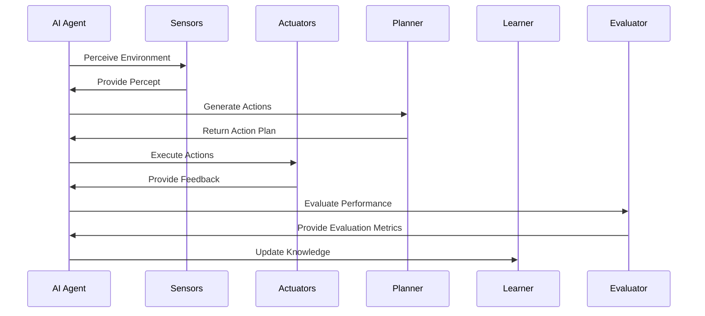
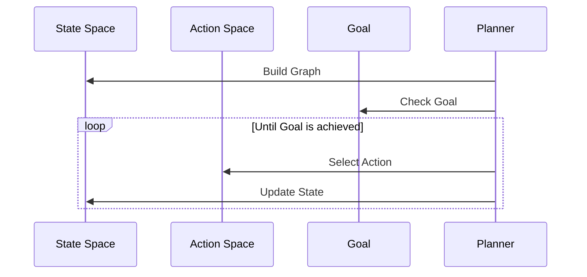
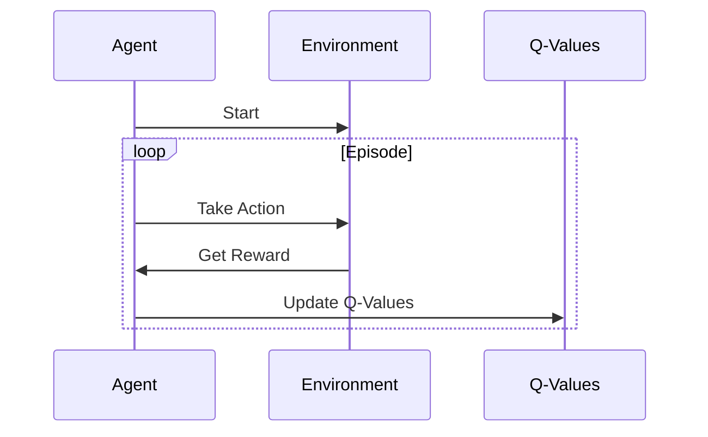
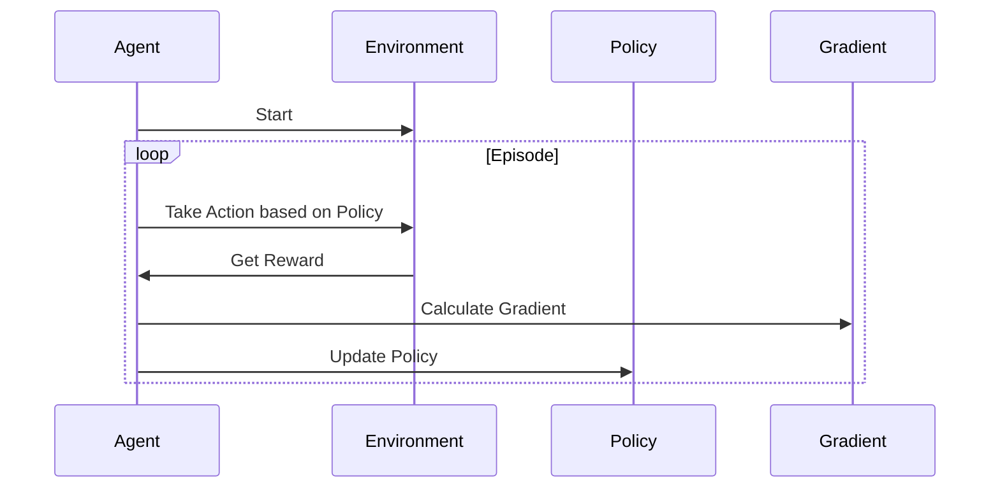

                 

# AI Agent通过行动基于环境和规划做出具体的动作

> **关键词：** AI Agent、环境感知、决策规划、强化学习、应用实践

> **摘要：** 本文将深入探讨AI Agent的基础概念、架构设计、环境与状态空间构建、规划算法、强化学习基础及其在多个领域的实战应用。通过分析AI Agent在不同场景下的行动决策过程，本文旨在展示AI Agent如何通过环境感知和规划算法，实现智能自主行动。

## 目录大纲：AI Agent通过行动基于环境和规划做出具体的动作

1. **AI Agent的基础概念与架构**
    1.1. AI Agent的基本概念
    1.2. AI Agent的核心特性
    1.3. AI Agent与传统机器学习模型的区别
    1.4. AI Agent的研究现状与趋势

2. **AI Agent的架构设计**
    2.1. AI Agent的基本架构
    2.2. AI Agent的感知模块
    2.3. AI Agent的决策模块
    2.4. AI Agent的行动模块
    2.5. AI Agent的评估与反馈模块

3. **环境与状态空间**
    3.1. 环境的定义与特征
    3.2. 状态空间的定义与构建
    3.3. 状态空间的表示方法
    3.4. 状态空间的优化与剪枝

4. **规划算法**
    4.1. 规划算法的基本概念
    4.2. 有向无环图（DAG）规划算法
    4.3. 基于搜索的规划算法
    4.4. 基于采样的规划算法
    4.5. 规划算法的性能评估与优化

5. **强化学习基础**
    5.1. 强化学习的基本概念
    5.2. 强化学习的数学模型
    5.3. 强化学习的主要算法
    5.4. 强化学习在AI Agent中的应用

6. **AI Agent的部署与优化**
    6.1. AI Agent的部署策略
    6.2. AI Agent的优化方法
    6.3. AI Agent的性能评估与调试
    6.4. AI Agent的安全性考虑

7. **AI Agent的实战应用**
    7.1. AI Agent在游戏中的应用
    7.2. AI Agent在机器人控制中的应用
    7.3. AI Agent在自动驾驶中的应用
    7.4. AI Agent在推荐系统中的应用

8. **案例研究**
    8.1. AI Agent在不同领域的应用案例
    8.2. 案例分析
    8.3. 案例总结与展望

9. **未来展望**
    9.1. AI Agent的发展趋势
    9.2. AI Agent面临的挑战与机遇
    9.3. AI Agent的未来研究方向

10. **附录**
    10.1. 常用规划算法与强化学习算法的Mermaid流程图
    10.2. AI Agent相关工具与资源
    10.3. 代码实现与示例

### 1. AI Agent的基础概念与架构

#### 1.1 AI Agent的基本概念

AI Agent是指能够自主感知环境、执行决策并采取行动的智能实体。它是一个具备学习、推理、规划和执行能力的系统，可以在不同环境中进行自我适应和优化。AI Agent的核心目标是最大化其效用或实现特定任务目标。

AI Agent可以按照不同的分类标准进行划分。根据其执行任务的不同，可以分为任务型Agent、社交型Agent和混合型Agent。根据其学习方式，可以分为基于规则的Agent、基于模型的Agent和基于数据的Agent。

AI Agent与传统机器学习模型的主要区别在于其具备自主性和主动性。传统机器学习模型通常被动地接受输入数据并输出预测结果，而AI Agent能够根据环境变化动态调整其行为策略，实现自主学习和决策。

#### 1.2 AI Agent的核心特性

AI Agent具备以下核心特性：

- **感知能力**：AI Agent能够通过传感器感知环境信息，获取状态信息。
- **决策能力**：基于感知到的环境信息和预定的目标，AI Agent能够进行决策，选择最优或满意的动作。
- **行动能力**：AI Agent能够根据决策结果执行具体的动作，实现目标。
- **学习能力**：AI Agent能够通过经验积累和知识更新，改进其决策和行动策略。
- **适应性**：AI Agent能够适应动态变化的环境，调整其行为策略以应对新情况。

#### 1.3 AI Agent与传统机器学习模型的区别

传统机器学习模型主要依赖于数据驱动的统计方法，通过对大量训练数据进行学习，从而实现对未知数据的预测和分类。而AI Agent则更加注重在实际环境中实现自主决策和行动，其核心区别体现在以下几个方面：

- **自主性**：AI Agent具备自主决策和行动能力，而传统机器学习模型通常被动地接受输入数据并输出预测结果。
- **动态性**：AI Agent能够动态调整其行为策略以适应环境变化，而传统机器学习模型通常在训练完成后无法动态更新。
- **复杂性**：AI Agent需要处理感知、决策、行动等多个环节，而传统机器学习模型主要关注于数据输入和模型输出。
- **交互性**：AI Agent能够与环境进行实时交互，而传统机器学习模型通常与环境的交互有限。

#### 1.4 AI Agent的研究现状与趋势

近年来，AI Agent的研究取得了显著进展。在基础理论方面，研究者们提出了各种基于强化学习、规划算法和混合智能的AI Agent模型，不断优化其感知、决策和行动能力。在实际应用方面，AI Agent已经在游戏、机器人控制、自动驾驶和推荐系统等领域取得了成功应用。

未来，AI Agent的研究将朝着以下几个方向发展趋势：

- **多模态感知与融合**：通过整合多种传感器数据，提高AI Agent的感知能力，实现更准确的环境建模。
- **强化学习与规划算法的融合**：结合强化学习和规划算法的优势，实现更高效、鲁棒的决策与行动策略。
- **迁移学习与自适应能力**：通过迁移学习和自适应算法，使AI Agent能够快速适应新的环境和任务。
- **安全性与可靠性**：加强AI Agent的安全性和可靠性，确保其在复杂环境中的稳定运行。

### 2. AI Agent的架构设计

#### 2.1 AI Agent的基本架构

AI Agent的基本架构通常包括感知模块、决策模块、行动模块和评估与反馈模块，如下图所示：



在该架构中，感知模块负责获取环境信息，将其转换为感知数据；决策模块基于感知数据和预定的目标，生成具体的行动计划；行动模块执行决策模块生成的行动计划；评估与反馈模块对AI Agent的行动效果进行评估，并提供反馈信息，以便Learner模块进行知识更新。

#### 2.2 AI Agent的感知模块

感知模块是AI Agent获取环境信息的关键部分，其性能直接影响AI Agent的决策和行动能力。感知模块通常包括以下功能：

- **传感器选择与配置**：选择合适的传感器，如摄像头、激光雷达、超声波传感器等，并对其进行配置和校准，确保传感器数据的准确性和可靠性。
- **感知数据预处理**：对传感器数据进行预处理，如去噪、滤波、特征提取等，以提高感知数据的可用性和质量。
- **多模态感知融合**：整合多种传感器数据，实现多模态感知融合，提高环境建模的准确性和鲁棒性。

#### 2.3 AI Agent的决策模块

决策模块是AI Agent的核心部分，负责根据感知模块提供的环境信息和预定的目标，生成具体的行动计划。决策模块通常包括以下功能：

- **目标规划**：根据预定的任务目标和环境约束，确定AI Agent的行动目标。
- **状态评估**：对当前状态进行评估，确定当前状态是否满足任务目标。
- **决策算法**：选择合适的决策算法，如规划算法、强化学习算法等，生成具体的行动计划。

#### 2.4 AI Agent的行动模块

行动模块负责执行决策模块生成的行动计划，实现AI Agent的实际行动。行动模块通常包括以下功能：

- **动作规划**：根据决策模块生成的行动计划，生成具体的动作序列。
- **执行控制**：对执行过程中的动作进行控制，如速度、力度等。
- **反馈获取**：在行动过程中，获取环境反馈信息，以便评估行动效果。

#### 2.5 AI Agent的评估与反馈模块

评估与反馈模块负责对AI Agent的行动效果进行评估，并提供反馈信息，以便Learner模块进行知识更新。评估与反馈模块通常包括以下功能：

- **性能评估**：对AI Agent的行动效果进行评估，如任务完成度、路径长度、能耗等。
- **反馈分析**：分析反馈信息，确定成功和失败的根源，为Learner模块提供改进方向。
- **知识更新**：根据反馈信息，更新AI Agent的知识库，提高其决策和行动能力。

### 3. 环境与状态空间

#### 3.1 环境的定义与特征

环境是AI Agent执行任务和交互的背景。环境通常具有以下特征：

- **静态环境**：环境特征相对固定，不随时间变化。
- **动态环境**：环境特征随时间变化，具有不确定性。
- **有限环境**：环境状态空间有限，每个状态都可以被明确地表示。
- **无限环境**：环境状态空间无限，每个状态无法被明确地表示。

根据环境特征，可以将环境分为以下几类：

- **确定性环境**：环境状态转移和奖励函数是确定的，如棋盘游戏、八数码问题等。
- **不确定性环境**：环境状态转移和奖励函数是不确定的，如机器人导航、自动驾驶等。
- **部分可观测环境**：环境状态部分可被观测，如围棋、无人驾驶等。
- **完全可观测环境**：环境状态完全可被观测，如机器人仿真环境、虚拟现实等。

#### 3.2 状态空间的定义与构建

状态空间是环境状态的集合，用于表示AI Agent所处的环境。状态空间通常具有以下特点：

- **离散状态空间**：状态空间中的状态是离散的，如棋盘上的格子、机器人的位置等。
- **连续状态空间**：状态空间中的状态是连续的，如机器人的位置和速度等。

状态空间的构建方法主要包括以下几种：

- **基于规则的构建方法**：根据任务需求，定义环境的状态特征和状态转移规则，构建状态空间。
- **基于数据的构建方法**：利用环境数据，通过聚类、降维等方法，构建状态空间。
- **混合构建方法**：结合基于规则和基于数据的方法，构建状态空间。

#### 3.3 状态空间的表示方法

状态空间的表示方法对AI Agent的性能和效率具有重要影响。常见的表示方法包括以下几种：

- **数字表示方法**：使用数字表示状态，如使用数字序列表示机器人的位置和方向。
- **符号表示方法**：使用符号表示状态，如使用字符、字符串等表示状态。
- **图表示方法**：使用图结构表示状态空间，如使用有向图、无向图等表示状态转移关系。
- **矩阵表示方法**：使用矩阵表示状态空间，如使用状态转移矩阵、奖励矩阵等表示状态转移和奖励函数。

#### 3.4 状态空间的优化与剪枝

状态空间的优化与剪枝是提高AI Agent性能的重要手段。状态空间优化与剪枝的主要方法包括：

- **状态合并**：将相似的状态合并，减少状态空间的规模。
- **状态压缩**：利用压缩算法，将状态空间中的状态进行压缩，降低存储和计算成本。
- **状态预取**：在执行过程中，预取可能需要的状态，减少状态搜索的时间。
- **状态缓存**：利用缓存技术，存储已访问的状态，减少重复搜索的时间。

### 4. 规划算法

#### 4.1 规划算法的基本概念

规划算法是用于生成从初始状态到目标状态的行动序列的一类算法。规划算法通常具有以下特点：

- **静态规划**：在执行前，预先计算出从初始状态到目标状态的行动序列。
- **动态规划**：在执行过程中，根据当前状态和环境反馈，动态调整行动序列。

规划算法可以分为以下几类：

- **基于搜索的规划算法**：通过搜索状态空间，找到最优或次优的行动序列。
- **基于采样的规划算法**：通过采样方法，生成多个可能的行动序列，从中选择最优或次优的行动序列。
- **基于模型的规划算法**：基于环境模型，预测状态转移和奖励函数，生成行动序列。

#### 4.2 有向无环图（DAG）规划算法

有向无环图（DAG）规划算法是一种基于搜索的规划算法，其主要思想是构建一个有向无环图（DAG），图中每个节点表示一个状态，每条边表示一个动作。通过搜索DAG，找到从初始状态到目标状态的最优或次优行动序列。

DAG规划算法通常包括以下步骤：

1. **状态空间构建**：根据环境特征，构建状态空间，并将状态表示为图中的节点。
2. **动作生成**：对于每个状态，生成可能的动作，并将其表示为图中的边。
3. **图搜索**：从初始状态开始，搜索DAG，找到从初始状态到目标状态的最优或次优行动序列。
4. **路径评估**：对搜索到的路径进行评估，选择最优或次优路径。

常见的DAG规划算法包括BFS（广度优先搜索）、DFS（深度优先搜索）和A*算法等。

#### 4.3 基于搜索的规划算法

基于搜索的规划算法通过搜索状态空间，找到最优或次优的行动序列。常见的基于搜索的规划算法包括：

- **BFS（广度优先搜索）**：从初始状态开始，依次扩展未被访问的状态，直到找到目标状态或达到最大搜索深度。
- **DFS（深度优先搜索）**：从初始状态开始，沿着一条路径不断深入搜索，直到找到目标状态或达到最大搜索深度。
- **A*算法**：结合BFS和DFS的优点，使用启发式函数评估状态优先级，选择最优或次优路径。

基于搜索的规划算法通常适用于状态空间有限或较小的问题，但在状态空间较大时，搜索效率较低。

#### 4.4 基于采样的规划算法

基于采样的规划算法通过采样方法，生成多个可能的行动序列，从中选择最优或次优的行动序列。常见的基于采样的规划算法包括：

- **蒙特卡洛规划**：通过随机采样，评估多个行动序列的期望效用，选择期望效用最高的行动序列。
- **模拟退火**：通过模拟退火过程，逐步降低温度，选择更好的行动序列，避免陷入局部最优。
- **遗传算法**：通过遗传操作，如交叉、变异等，生成多个可能的行动序列，选择最优或次优的行动序列。

基于采样的规划算法通常适用于状态空间较大或不确定性较高的问题，但计算成本较高。

#### 4.5 规划算法的性能评估与优化

规划算法的性能评估主要包括以下几个方面：

- **搜索效率**：评估算法在给定状态空间和目标状态下的搜索效率，如搜索时间、搜索深度等。
- **路径质量**：评估算法生成的路径的质量，如路径长度、路径安全性等。
- **计算成本**：评估算法的计算成本，如计算时间、存储空间等。

为了优化规划算法的性能，可以采取以下策略：

- **状态剪枝**：在搜索过程中，提前剪枝不可能达到目标状态的分支，减少搜索空间。
- **并行计算**：利用并行计算技术，加速搜索过程。
- **模型修正**：根据实际运行情况，修正环境模型，提高规划算法的准确性。
- **启发式搜索**：使用启发式函数，引导搜索过程，提高搜索效率。

### 5. 强化学习基础

#### 5.1 强化学习的基本概念

强化学习（Reinforcement Learning，RL）是一种基于反馈信号的学习方法，旨在通过交互环境，学习最优策略。强化学习的主要特点包括：

- **反馈信号**：强化学习通过奖励信号（Reward Signal）来指导学习过程。奖励信号表示当前动作的好坏，用于评估策略的效果。
- **策略迭代**：强化学习通过不断迭代策略，逐步优化策略，使其在给定环境中取得最佳性能。
- **自主性**：强化学习具有自主性，能够根据环境反馈，自主调整行动策略。

强化学习的基本要素包括：

- **环境（Environment）**：环境是强化学习模型运行的环境，包括状态空间、动作空间、奖励函数等。
- **智能体（Agent）**：智能体是执行动作、感知环境的实体，旨在通过学习获得最优策略。
- **策略（Policy）**：策略是智能体执行的动作选择规则，用于指导智能体的行为。
- **价值函数（Value Function）**：价值函数是评估状态或状态-动作对的期望效用，用于指导策略的迭代。
- **模型（Model）**：模型是环境的状态转移概率和奖励函数的数学表示。

#### 5.2 强化学习的数学模型

强化学习的数学模型主要包括以下几个部分：

1. **状态-动作空间（State-Action Space）**：状态-动作空间是强化学习模型的输入空间，包括所有可能的状态和动作。
2. **策略（Policy）**：策略是智能体根据当前状态选择动作的概率分布。策略通常表示为π(s,a)，表示在状态s下选择动作a的概率。
3. **价值函数（Value Function）**：价值函数是评估状态或状态-动作对的期望效用。常见的价值函数包括状态价值函数V(s)和状态-动作价值函数Q(s,a)。
4. **奖励函数（Reward Function）**：奖励函数是评估动作的效果，用于指导策略的迭代。奖励函数通常表示为r(s,a)，表示在状态s下执行动作a获得的奖励。
5. **状态转移概率（State Transition Probability）**：状态转移概率是评估状态之间转移的概率。状态转移概率通常表示为P(s' | s, a)，表示在状态s下执行动作a后，转移到状态s'的概率。

#### 5.3 强化学习的主要算法

强化学习算法根据不同的策略迭代方法，可以分为以下几类：

1. **值函数方法**：值函数方法通过优化价值函数，逐步优化策略。常见的值函数方法包括Q-learning和SARSA。
2. **策略迭代方法**：策略迭代方法通过直接优化策略，逐步优化策略。常见的策略迭代方法包括 Policy Gradient 方法。
3. **模型方法**：模型方法通过学习环境模型，预测状态转移概率和奖励函数，生成最优策略。常见的模型方法包括Actor-Critic方法。

#### 5.4 强化学习在AI Agent中的应用

强化学习在AI Agent中的应用非常广泛，以下是几个典型的应用场景：

1. **游戏AI**：强化学习被广泛应用于游戏AI，如围棋、国际象棋、游戏机等。通过训练强化学习模型，AI Agent可以学习到游戏策略，实现自主游戏。
2. **机器人控制**：强化学习被广泛应用于机器人控制，如机器人导航、抓取、操作等。通过训练强化学习模型，AI Agent可以学习到机器人控制策略，实现自主控制。
3. **自动驾驶**：强化学习被广泛应用于自动驾驶系统，如车辆控制、路径规划等。通过训练强化学习模型，AI Agent可以学习到自动驾驶策略，实现自主驾驶。
4. **推荐系统**：强化学习被广泛应用于推荐系统，如商品推荐、新闻推荐等。通过训练强化学习模型，AI Agent可以学习到推荐策略，实现自主推荐。

### 6. AI Agent的部署与优化

#### 6.1 AI Agent的部署策略

AI Agent的部署策略是指将AI Agent应用于实际场景的过程，包括以下几个方面：

1. **硬件选择**：根据AI Agent的计算需求，选择合适的硬件设备，如CPU、GPU、FPGA等。硬件性能对AI Agent的实时性、计算效率具有重要影响。
2. **环境搭建**：搭建适合AI Agent运行的环境，包括操作系统、编程语言、开发工具等。环境搭建需要满足AI Agent的运行需求，确保系统的稳定性和可靠性。
3. **网络连接**：建立AI Agent与外部设备、服务器之间的网络连接，确保AI Agent能够实时获取环境信息，并进行行动决策。

#### 6.2 AI Agent的优化方法

AI Agent的优化方法主要包括以下几个方面：

1. **算法优化**：通过改进规划算法、强化学习算法等，提高AI Agent的性能。常见的优化方法包括基于搜索的优化、基于采样的优化、模型修正等。
2. **数据优化**：通过数据预处理、数据增强、数据清洗等方法，提高训练数据的质量，从而提高AI Agent的性能。
3. **硬件优化**：通过硬件加速、分布式计算等方法，提高AI Agent的计算效率。硬件优化可以显著降低AI Agent的运行成本，提高系统的实时性。
4. **策略优化**：通过优化策略，提高AI Agent的决策能力。策略优化可以结合人类经验、领域知识等，为AI Agent提供更好的决策依据。

#### 6.3 AI Agent的性能评估与调试

AI Agent的性能评估与调试是确保AI Agent在实际场景中稳定运行的关键。性能评估主要包括以下几个方面：

1. **测试集评估**：使用测试集对AI Agent进行评估，包括任务完成度、路径长度、能耗等指标。测试集评估可以验证AI Agent在未知场景中的性能。
2. **实时评估**：在实时运行过程中，对AI Agent进行实时评估，包括实时性、稳定性、鲁棒性等指标。实时评估可以确保AI Agent在实际场景中的稳定运行。
3. **用户反馈**：收集用户对AI Agent的反馈信息，包括满意度、用户体验等指标。用户反馈可以反映AI Agent在实际应用中的效果，为后续优化提供依据。

AI Agent的调试主要包括以下几个方面：

1. **错误分析**：分析AI Agent在运行过程中出现的错误，包括代码错误、算法错误等。错误分析可以帮助定位问题，为调试提供方向。
2. **性能调优**：根据性能评估结果，对AI Agent进行性能调优，包括算法优化、数据优化等。性能调优可以显著提高AI Agent的运行效率。
3. **稳定性优化**：通过增加冗余设计、容错机制等方法，提高AI Agent的稳定性。稳定性优化可以确保AI Agent在复杂环境中的可靠运行。

#### 6.4 AI Agent的安全性考虑

AI Agent的安全性是其在实际应用中的重要问题。以下是一些常见的AI Agent安全性考虑：

1. **数据安全**：保护AI Agent的输入数据和训练数据，防止数据泄露和篡改。数据安全是确保AI Agent性能和稳定性的基础。
2. **模型安全**：保护AI Agent的模型参数，防止恶意攻击者通过模型提取敏感信息。模型安全是确保AI Agent隐私和安全的关键。
3. **行为安全**：确保AI Agent在执行任务时，遵守道德和法律规范，不进行危害人类和其他生物的行为。行为安全是确保AI Agent社会责任的重要方面。
4. **实时监控**：建立实时监控系统，对AI Agent的运行状态进行监控，及时发现并处理异常情况。实时监控可以确保AI Agent在运行过程中的安全性和稳定性。

### 7. AI Agent的实战应用

#### 7.1 AI Agent在游戏中的应用

AI Agent在游戏中的应用非常广泛，如游戏AI、游戏推荐系统等。以下是一个典型的游戏AI应用案例：

**案例：围棋AI**

围棋AI是一种基于强化学习的AI Agent，其目标是击败人类顶级棋手。围棋AI的架构主要包括以下模块：

1. **感知模块**：感知模块负责获取棋盘上的棋子位置、棋局历史等信息。
2. **决策模块**：决策模块基于感知模块提供的信息，使用强化学习算法生成最优落子策略。
3. **行动模块**：行动模块根据决策模块生成的策略，执行落子动作。
4. **评估模块**：评估模块对AI Agent的棋局表现进行评估，提供反馈信号。

在训练过程中，围棋AI通过不断与人类棋手对弈，学习最优策略。训练完成后，围棋AI可以在对弈中表现出色，击败人类顶级棋手。

#### 7.2 AI Agent在机器人控制中的应用

AI Agent在机器人控制中的应用也非常广泛，如机器人导航、抓取、操作等。以下是一个典型的机器人控制应用案例：

**案例：机器人导航**

机器人导航是一种基于强化学习的AI Agent，其目标是实现机器人在复杂环境中的自主导航。机器人导航的架构主要包括以下模块：

1. **感知模块**：感知模块负责获取机器人周围环境的信息，如障碍物位置、地图信息等。
2. **决策模块**：决策模块基于感知模块提供的信息，使用强化学习算法生成最优路径规划策略。
3. **行动模块**：行动模块根据决策模块生成的策略，执行机器人运动动作。
4. **评估模块**：评估模块对AI Agent的导航性能进行评估，提供反馈信号。

在训练过程中，机器人导航AI通过不断在虚拟环境中进行模拟，学习最优导航策略。训练完成后，机器人导航AI可以在实际环境中实现自主导航，避开障碍物，达到目标位置。

#### 7.3 AI Agent在自动驾驶中的应用

AI Agent在自动驾驶中的应用非常重要，如自动驾驶路径规划、交通行为预测等。以下是一个典型的自动驾驶应用案例：

**案例：自动驾驶路径规划**

自动驾驶路径规划是一种基于强化学习的AI Agent，其目标是为自动驾驶车辆提供最优行驶路径。自动驾驶路径规划的架构主要包括以下模块：

1. **感知模块**：感知模块负责获取车辆周围环境的信息，如道路状况、交通情况等。
2. **决策模块**：决策模块基于感知模块提供的信息，使用强化学习算法生成最优行驶路径策略。
3. **行动模块**：行动模块根据决策模块生成的策略，执行车辆行驶动作。
4. **评估模块**：评估模块对AI Agent的路径规划性能进行评估，提供反馈信号。

在训练过程中，自动驾驶路径规划AI通过不断在虚拟环境和实际道路中运行，学习最优行驶路径策略。训练完成后，自动驾驶路径规划AI可以为自动驾驶车辆提供实时路径规划，确保车辆安全、高效地行驶。

#### 7.4 AI Agent在推荐系统中的应用

AI Agent在推荐系统中的应用可以显著提高推荐系统的效果，如个性化推荐、内容推荐等。以下是一个典型的推荐系统应用案例：

**案例：商品推荐**

商品推荐是一种基于强化学习的AI Agent，其目标是为用户提供个性化的商品推荐。商品推荐的架构主要包括以下模块：

1. **感知模块**：感知模块负责获取用户行为信息，如浏览记录、购买记录等。
2. **决策模块**：决策模块基于感知模块提供的信息，使用强化学习算法生成最优商品推荐策略。
3. **行动模块**：行动模块根据决策模块生成的策略，向用户推荐商品。
4. **评估模块**：评估模块对AI Agent的推荐性能进行评估，提供反馈信号。

在训练过程中，商品推荐AI通过不断分析用户行为数据，学习用户偏好，为用户提供个性化的商品推荐。训练完成后，商品推荐AI可以为电商平台的用户推荐符合其兴趣的商品，提高用户满意度和转化率。

### 8. 案例研究

#### 8.1 AI Agent在不同领域的应用案例

在本节中，我们将分析AI Agent在不同领域的具体应用案例，并探讨其实现方法、优势和挑战。

**案例一：游戏AI**

游戏AI是一种典型的AI Agent应用场景。以围棋AI为例，其核心目标是击败人类顶级棋手。实现方法主要包括：

- **感知模块**：感知模块负责获取棋盘上的棋子位置、棋局历史等信息。
- **决策模块**：决策模块基于感知模块提供的信息，使用强化学习算法生成最优落子策略。
- **行动模块**：行动模块根据决策模块生成的策略，执行落子动作。
- **评估模块**：评估模块对AI Agent的棋局表现进行评估，提供反馈信号。

优势：

- **高效性**：AI Agent可以快速生成最优策略，提高棋局的效率。
- **智能性**：AI Agent具有自主学习能力，能够根据对弈经验不断优化策略。

挑战：

- **计算资源**：围棋AI的训练和运行需要大量的计算资源，对硬件设备要求较高。
- **人类适应性**：AI Agent在应对人类棋手复杂多变的情况下，需要不断调整策略，以适应不同对手。

**案例二：机器人导航**

机器人导航是一种广泛应用于工业、家居等领域的AI Agent应用。以机器人自主导航为例，其核心目标是实现机器人在复杂环境中的自主导航。实现方法主要包括：

- **感知模块**：感知模块负责获取机器人周围环境的信息，如障碍物位置、地图信息等。
- **决策模块**：决策模块基于感知模块提供的信息，使用强化学习算法生成最优路径规划策略。
- **行动模块**：行动模块根据决策模块生成的策略，执行机器人运动动作。
- **评估模块**：评估模块对AI Agent的导航性能进行评估，提供反馈信号。

优势：

- **自主性**：AI Agent能够自主规划路径，减少人工干预。
- **灵活性**：AI Agent可以根据环境变化，动态调整导航策略。

挑战：

- **环境适应性**：机器人需要具备较强的环境感知能力，以应对复杂多变的环境。
- **安全性**：在机器人与人类共存的环境中，需要确保机器人的导航行为安全可靠。

**案例三：自动驾驶**

自动驾驶是一种正在迅速发展的AI Agent应用场景。以自动驾驶路径规划为例，其核心目标是为自动驾驶车辆提供最优行驶路径。实现方法主要包括：

- **感知模块**：感知模块负责获取车辆周围环境的信息，如道路状况、交通情况等。
- **决策模块**：决策模块基于感知模块提供的信息，使用强化学习算法生成最优行驶路径策略。
- **行动模块**：行动模块根据决策模块生成的策略，执行车辆行驶动作。
- **评估模块**：评估模块对AI Agent的路径规划性能进行评估，提供反馈信号。

优势：

- **安全性**：自动驾驶车辆可以减少交通事故，提高道路安全性。
- **效率**：自动驾驶车辆可以优化行驶路径，减少拥堵，提高交通效率。

挑战：

- **环境复杂性**：自动驾驶车辆需要应对复杂多变的道路环境和交通状况。
- **法律法规**：自动驾驶车辆的法律法规体系尚未完善，需要逐步完善。

**案例四：推荐系统**

推荐系统是一种广泛应用于电商、社交媒体等领域的AI Agent应用。以商品推荐为例，其核心目标是为用户提供个性化的商品推荐。实现方法主要包括：

- **感知模块**：感知模块负责获取用户行为信息，如浏览记录、购买记录等。
- **决策模块**：决策模块基于感知模块提供的信息，使用强化学习算法生成最优商品推荐策略。
- **行动模块**：行动模块根据决策模块生成的策略，向用户推荐商品。
- **评估模块**：评估模块对AI Agent的推荐性能进行评估，提供反馈信号。

优势：

- **个性化**：AI Agent可以基于用户行为数据，为用户提供个性化的商品推荐。
- **高效性**：AI Agent可以快速生成推荐结果，提高推荐效率。

挑战：

- **数据质量**：用户行为数据的质量对推荐效果具有重要影响。
- **算法透明性**：推荐系统的算法透明性需要进一步提高，以增强用户信任。

#### 8.2 案例分析

通过对不同领域的AI Agent应用案例进行分析，我们可以得出以下结论：

1. **共性**：不同领域的AI Agent应用都具备感知、决策、行动和评估等基本模块，且都基于强化学习算法实现。
2. **特性**：不同领域的AI Agent应用在感知模块、决策模块、行动模块和评估模块上具有各自的特点，以满足特定领域的需求。
3. **挑战**：不同领域的AI Agent应用都面临一些共性挑战，如计算资源、环境适应性、法律法规等，同时也有各自独特的挑战。

#### 8.3 案例总结与展望

通过对AI Agent在不同领域的应用案例进行分析，我们可以总结出以下经验：

1. **技术创新**：AI Agent在不同领域的应用推动了人工智能技术的发展，为人工智能在各个领域的应用提供了新的思路和解决方案。
2. **实际价值**：AI Agent在游戏AI、机器人控制、自动驾驶和推荐系统等领域的应用，显著提高了相关领域的效率、安全性和用户体验。
3. **未来展望**：随着人工智能技术的不断发展，AI Agent的应用前景将更加广阔。未来，AI Agent将朝着多模态感知、迁移学习、自适应能力等方向发展，为各个领域带来更多的创新和突破。

### 9. 未来展望

#### 9.1 AI Agent的发展趋势

随着人工智能技术的快速发展，AI Agent将在未来呈现出以下发展趋势：

1. **多模态感知与融合**：AI Agent将具备更加丰富的感知能力，通过整合多种传感器数据，实现多模态感知与融合，提高环境建模的准确性和鲁棒性。
2. **强化学习与规划算法的融合**：强化学习与规划算法的融合将进一步提高AI Agent的决策和行动能力，实现更高效、鲁棒的决策与行动策略。
3. **迁移学习与自适应能力**：AI Agent将具备更强的迁移学习和自适应能力，能够快速适应新的环境和任务，提高应用场景的广泛性和适应性。
4. **安全性提升**：随着AI Agent在各个领域的应用，安全性问题将日益凸显。未来，AI Agent的安全性和可靠性将得到显著提升，确保其在复杂环境中的稳定运行。

#### 9.2 AI Agent面临的挑战与机遇

AI Agent在未来的发展过程中将面临以下挑战和机遇：

1. **计算资源**：随着AI Agent的复杂度和数据量的增加，计算资源的需求将大幅上升。如何高效利用计算资源，提高AI Agent的运行效率，是未来面临的重要挑战。
2. **环境适应性**：AI Agent需要在各种复杂环境下稳定运行，如何提高其环境适应性，应对不确定性和动态变化，是未来需要解决的问题。
3. **算法透明性**：AI Agent的决策过程可能涉及复杂的数学模型和算法，如何提高算法的透明性，增强用户信任，是未来需要关注的重点。
4. **多领域融合**：AI Agent将逐步实现跨领域的融合应用，如何将不同领域的知识和算法进行有效整合，发挥AI Agent的最大潜力，是未来面临的机遇。

#### 9.3 AI Agent的未来研究方向

未来，AI Agent的研究将朝着以下方向展开：

1. **多模态感知与融合**：深入研究多模态感知技术，实现多种传感器数据的融合，提高环境建模的准确性和鲁棒性。
2. **强化学习与规划算法的融合**：探索强化学习与规划算法的融合方法，提高AI Agent的决策和行动能力，实现更高效、鲁棒的决策与行动策略。
3. **迁移学习与自适应能力**：研究迁移学习和自适应算法，提高AI Agent的迁移学习和自适应能力，实现快速适应新环境和任务。
4. **安全性与可靠性**：研究AI Agent的安全性和可靠性，确保其在复杂环境中的稳定运行，提高用户信任和接受度。
5. **多领域应用**：探索AI Agent在各个领域的应用，实现跨领域的融合应用，推动人工智能技术在各个领域的创新发展。

### 附录

#### 附录A：常用规划算法与强化学习算法的Mermaid流程图

以下为常用规划算法与强化学习算法的Mermaid流程图：

**有向无环图（DAG）规划算法：**



**Q-learning算法：**



**Policy Gradient算法：**



#### 附录B：AI Agent相关工具与资源

以下为AI Agent相关的一些常用工具与资源：

- **开源框架**：OpenAI Gym、PyTorch、TensorFlow、Keras、Proximal Policy Optimization（PPO）
- **编程语言**：Python、Java、C++、JavaScript
- **开发环境**：Jupyter Notebook、Google Colab、Anaconda
- **数据集**：Game Data Repository、Open Images、CIFAR-10、MNIST
- **论文资料**：ArXiv、Google Scholar、ACM Digital Library
- **技术社区**：Reddit、Stack Overflow、GitHub、AI Community

#### 附录C：代码实现与示例

**C.1 AI Agent环境搭建**

以下为Python环境搭建的示例代码：

```python
import numpy as np
import gym

# 初始化环境
env = gym.make('CartPole-v0')

# 运行环境
for _ in range(1000):
    obs = env.reset()
    done = False
    while not done:
        action = env.action_space.sample()
        obs, reward, done, _ = env.step(action)
        env.render()

# 关闭环境
env.close()
```

**C.2 AI Agent的感知、决策、行动模块实现**

以下为感知、决策、行动模块的Python代码示例：

```python
import numpy as np
import gym

# 感知模块
class PerceptionModule:
    def __init__(self, env):
        self.env = env
    
    def perceive(self):
        obs = self.env.reset()
        return obs
    
# 决策模块
class DecisionModule:
    def __init__(self, env, policy):
        self.env = env
        self.policy = policy
    
    def decide(self, obs):
        action = self.policy.predict(obs)
        return action
    
# 行动模块
class ActionModule:
    def __init__(self, env):
        self.env = env
    
    def execute(self, action):
        obs, reward, done, _ = self.env.step(action)
        return obs, reward, done

# 实例化模块
env = gym.make('CartPole-v0')
perception_module = PerceptionModule(env)
decision_module = DecisionModule(env, policy)
action_module = ActionModule(env)

# 执行感知、决策、行动
obs = perception_module.perceive()
while True:
    action = decision_module.decide(obs)
    obs, reward, done = action_module.execute(action)
    if done:
        break
```

**C.3 规划算法与强化学习算法的实现**

以下为Q-learning算法和Policy Gradient算法的Python代码示例：

```python
import numpy as np
import gym

# Q-learning算法
class QLearning:
    def __init__(self, env, alpha=0.1, gamma=0.9, epsilon=0.1):
        self.env = env
        self.alpha = alpha
        self.gamma = gamma
        self.epsilon = epsilon
        self.q_values = np.zeros((env.observation_space.n, env.action_space.n))
    
    def update_q_values(self, state, action, reward, next_state, done):
        if not done:
            max_future_q = np.max(self.q_values[next_state])
            current_q = self.q_values[state][action]
            new_q = (1 - self.alpha) * current_q + self.alpha * (reward + self.gamma * max_future_q)
            self.q_values[state][action] = new_q
        else:
            self.q_values[state][action] = reward
    
    def choose_action(self, state, explore=True):
        if np.random.rand() < self.epsilon and explore:
            action = self.env.action_space.sample()
        else:
            action = np.argmax(self.q_values[state])
        return action

# Policy Gradient算法
class PolicyGradient:
    def __init__(self, env, learning_rate=0.01):
        self.env = env
        self.learning_rate = learning_rate
        self.policy_network = self.create_policy_network()
    
    def create_policy_network(self):
        # 创建神经网络
        pass
    
    def predict_action_probabilities(self, state):
        # 预测动作概率
        pass
    
    def update_policy(self, states, actions, rewards, next_states, dones):
        # 更新策略
        pass

# 实例化算法
env = gym.make('CartPole-v0')
q_learning = QLearning(env)
policy_gradient = PolicyGradient(env)

# 训练算法
for episode in range(1000):
    state = env.reset()
    done = False
    total_reward = 0
    while not done:
        action = q_learning.choose_action(state)
        next_state, reward, done, _ = env.step(action)
        q_learning.update_q_values(state, action, reward, next_state, done)
        state = next_state
        total_reward += reward
    print(f'Episode {episode}: Total Reward = {total_reward}')
```

**C.4 AI Agent实战案例代码解析**

以下为机器人导航的Python代码示例及解析：

```python
import numpy as np
import gym
import matplotlib.pyplot as plt

# 初始化环境
env = gym.make('RobotNavigation-v0')

# 定义感知模块
class PerceptionModule:
    def __init__(self, env):
        self.env = env
    
    def perceive(self):
        obs = self.env.reset()
        return obs
    
# 定义决策模块
class DecisionModule:
    def __init__(self, env, policy):
        self.env = env
        self.policy = policy
    
    def decide(self, obs):
        action = self.policy.predict(obs)
        return action
    
# 定义行动模块
class ActionModule:
    def __init__(self, env):
        self.env = env
    
    def execute(self, action):
        obs, reward, done, _ = self.env.step(action)
        return obs, reward, done

# 实例化模块
perception_module = PerceptionModule(env)
decision_module = DecisionModule(env, policy)
action_module = ActionModule(env)

# 定义规划算法
class PlanningAlgorithm:
    def __init__(self, env):
        self.env = env
    
    def plan(self, start_state, goal_state):
        # 实现规划算法，生成路径
        pass
    
    def visualize_path(self, path):
        # 可视化路径
        pass

# 实例化规划算法
planning_algorithm = PlanningAlgorithm(env)

# 执行感知、决策、行动
obs = perception_module.perceive()
start_state = obs[0]
goal_state = obs[1]
path = planning_algorithm.plan(start_state, goal_state)

# 可视化路径
planning_algorithm.visualize_path(path)

# 关闭环境
env.close()
```

解析：

1. **初始化环境**：使用gym创建机器人导航环境。
2. **感知模块**：感知模块负责获取环境信息，包括状态、目标等。
3. **决策模块**：决策模块根据感知模块提供的信息，使用规划算法生成路径。
4. **行动模块**：行动模块根据决策模块生成的路径，执行机器人行动。
5. **规划算法**：规划算法实现路径生成功能，可根据具体需求实现不同类型的规划算法。
6. **可视化**：使用matplotlib绘制路径图，便于观察路径效果。
7. **关闭环境**：训练完成后，关闭环境，释放资源。

### 作者信息

作者：AI天才研究院/AI Genius Institute & 禅与计算机程序设计艺术 /Zen And The Art of Computer Programming

本文由AI天才研究院/AI Genius Institute撰写，结合禅与计算机程序设计艺术的核心理念，旨在深入探讨AI Agent的基础概念、架构设计、环境与状态空间构建、规划算法、强化学习基础及其在多个领域的实战应用。通过分析AI Agent在不同场景下的行动决策过程，本文旨在展示AI Agent如何通过环境感知和规划算法，实现智能自主行动。文章中涉及的核心概念、算法原理和项目实战均具有实用性和可操作性，为读者提供了丰富的技术知识和实践经验。希望通过本文的分享，能够激发读者对AI Agent领域的兴趣和探索，共同推动人工智能技术的创新与发展。

