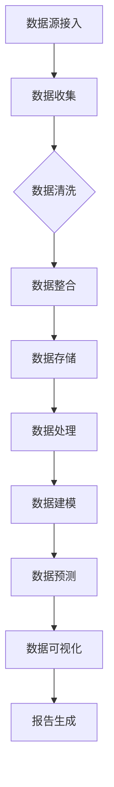

                 

## 第1章: AI DMP 概述

### 1.1 AI DMP 的定义与重要性

- **AI DMP 的概念**
  - AI DMP（Data Management Platform）是一种先进的数据管理解决方案，它利用人工智能技术对跨渠道的消费者数据进行收集、整合、管理和分析。通过这种集成的方式，企业能够更好地理解消费者的行为模式、兴趣和需求，从而实现更精准的市场营销。

- **AI DMP 在市场营销中的应用**
  - 在市场营销领域，AI DMP 具有广泛的应用。首先，它可以帮助企业构建详细的用户画像，包括用户的基本信息、行为习惯、偏好等。这些用户画像可以用于个性化推荐、精准广告投放、客户细分等营销活动。其次，AI DMP 可以优化营销渠道和策略，通过分析不同渠道的投放效果，实现营销资源的最大化利用。

- **AI DMP 对数据基建的需求**
  - 要实现上述功能，AI DMP 需要强大的数据基础设施支撑。这包括：
    - **数据处理能力**：能够处理海量数据，包括结构化数据和非结构化数据。
    - **数据存储能力**：需要高效、可靠的数据存储方案，支持快速的数据访问和分析。
    - **数据分析能力**：需要运用先进的机器学习算法和数据挖掘技术，从数据中提取有价值的信息。

### 1.2 AI DMP 的核心技术

- **数据收集与整合技术**
  - AI DMP 的第一步是数据收集。这包括从各种来源收集数据，如网站、移动应用、社交媒体、电子商务平台等。然后，通过数据整合技术将这些分散的数据源进行统一处理，确保数据的完整性和一致性。

- **数据管理与处理技术**
  - 数据管理包括数据存储、数据清洗、数据转换等过程。AI DMP 需要使用数据仓库、数据湖等技术进行数据存储，并运用 ETL（提取、转换、加载）过程对数据进行清洗和处理。

- **机器学习与数据挖掘技术**
  - 机器学习与数据挖掘技术是 AI DMP 的核心。通过这些技术，可以从数据中提取有价值的信息，构建用户画像，实现客户细分，并制定个性化的营销策略。常用的机器学习算法包括聚类分析、回归分析、协同过滤等。

### 1.3 AI DMP 的架构与组件

- **数据源接入**
  - AI DMP 的架构首先需要接入各种数据源，包括内部数据和外部数据。内部数据可能来自企业的CRM系统、ERP系统、网站日志等，外部数据可能来自社交媒体、广告平台、第三方数据提供商等。

- **数据存储与管理**
  - 收集到的数据需要存储在高效、可靠的数据存储平台上。常用的存储方案包括关系型数据库、NoSQL数据库、数据仓库和数据湖。其中，数据湖是一种用于存储大量非结构化数据的平台，适用于 AI DMP 这样的复杂应用。

- **数据处理与清洗**
  - 数据处理与清洗是数据管理的重要环节。通过数据处理，可以将不同格式的数据转换成统一的格式，提高数据的可用性。数据清洗则包括去除重复数据、填充缺失值、纠正错误数据等，以确保数据的准确性。

- **数据建模与预测**
  - 数据建模是构建用户画像和实现客户细分的关键步骤。通过机器学习算法，可以从数据中提取特征，建立预测模型，用于预测用户的购买行为、兴趣偏好等。这些模型可以帮助企业制定更加精准的营销策略。

- **数据可视化与报告**
  - 数据可视化是将分析结果以图形化、图表化的方式展示出来，使企业决策者能够直观地了解数据背后的趋势和规律。数据报告则是将分析结果以文档的形式进行总结和呈现，为决策提供参考。

### 总结
AI DMP 是一种利用人工智能技术进行数据管理和分析的解决方案，它在市场营销、客户关系管理等领域具有广泛的应用。要实现 AI DMP 的功能，需要构建强大的数据基础设施，包括数据源接入、数据存储与管理、数据处理与清洗、数据建模与预测、数据可视化与报告等组件。通过这些技术，企业能够更好地理解消费者，实现精准营销，提高业务效率。

## 第1章：AI DMP 概述

### 1.1 AI DMP 的定义与重要性

#### AI DMP 的概念

AI DMP（Data Management Platform），即人工智能数据管理平台，是一种集成多种数据来源、技术和工具的综合性解决方案。它的核心功能是利用人工智能和大数据技术，对用户数据进行全面收集、整合、存储和管理，进而实现用户细分、个性化推荐和精准营销。

AI DMP 在市场营销中的作用主要体现在以下几个方面：

1. **用户行为分析**：通过对用户在网站、移动应用、社交媒体等平台上的行为数据进行实时监测和分析，了解用户的浏览、点击、购买等行为，为后续的用户画像构建提供基础。

2. **用户画像构建**：利用机器学习算法，将用户的基本信息、行为数据、兴趣标签等进行综合分析，构建详细的用户画像。这些用户画像有助于企业了解用户需求，实现精准营销。

3. **个性化推荐**：基于用户画像，AI DMP 可以实现个性化推荐功能，将最符合用户兴趣的商品、内容或服务推荐给用户，提高用户满意度和转化率。

4. **营销自动化**：通过自动化营销工具，AI DMP 可以实现营销流程的自动化，如自动发送邮件、推送通知等，提高营销效率。

#### AI DMP 对数据基建的需求

AI DMP 的功能实现离不开强大的数据基础设施支持，这包括以下几个方面：

1. **数据处理能力**：AI DMP 需要处理大量的结构化和非结构化数据，因此需要具备强大的数据处理能力。这通常需要借助分布式计算框架（如 Apache Hadoop、Apache Spark）来处理海量数据。

2. **数据存储能力**：AI DMP 需要存储大量的用户数据和营销数据，因此需要具备高效、可靠的数据存储方案。数据仓库（如 Hive、HBase）和数据湖（如 Amazon S3、Google BigQuery）是常用的存储方案。

3. **数据分析能力**：AI DMP 需要利用数据分析工具（如 TensorFlow、Scikit-Learn）和算法（如聚类分析、回归分析、协同过滤）对数据进行深度分析，以提取有价值的信息。

4. **实时性**：AI DMP 的应用场景通常涉及实时数据处理和分析，因此需要具备实时数据处理能力。这可以通过实时数据流处理框架（如 Apache Flink、Apache Storm）来实现。

### 1.2 AI DMP 的核心技术

AI DMP 的核心技术包括数据收集与整合、数据管理与处理、机器学习与数据挖掘等。

#### 数据收集与整合技术

数据收集是 AI DMP 的第一步，主要包括以下内容：

1. **数据采集**：通过 Web 爬虫、API 调用、数据导入等方式，从各种数据源（如网站、移动应用、社交媒体、电商平台等）中收集数据。

2. **数据整合**：将来自不同数据源的数据进行整合，确保数据的完整性和一致性。数据整合通常涉及数据清洗、去重、转换等操作。

#### 数据管理与处理技术

数据管理与处理是 AI DMP 的核心环节，主要包括以下内容：

1. **数据存储**：将收集到的数据进行存储，通常使用数据仓库、数据湖等存储方案。数据仓库适合存储结构化数据，而数据湖则适合存储非结构化数据。

2. **数据清洗**：通过数据清洗，去除重复数据、填充缺失值、纠正错误数据等，确保数据的准确性。

3. **数据转换**：将不同格式的数据进行转换，使其符合分析需求。

#### 机器学习与数据挖掘技术

机器学习与数据挖掘是 AI DMP 的核心技术，主要包括以下内容：

1. **特征工程**：从原始数据中提取有用的特征，用于构建机器学习模型。

2. **模型训练**：使用机器学习算法（如聚类分析、回归分析、协同过滤等）对数据进行训练，构建预测模型。

3. **模型评估**：评估机器学习模型的性能，确保其准确性、稳定性和鲁棒性。

### 1.3 AI DMP 的架构与组件

AI DMP 的架构通常包括以下组件：

1. **数据源接入**：包括内部数据源（如 CRM、ERP 等）和外部数据源（如社交媒体、广告平台等）。

2. **数据存储与管理**：包括关系型数据库、NoSQL 数据库、数据仓库、数据湖等。

3. **数据处理与清洗**：包括 ETL 工具、数据处理平台等。

4. **数据建模与预测**：包括机器学习算法、数据挖掘工具等。

5. **数据可视化与报告**：包括数据可视化工具、报表生成工具等。

通过这些组件的协同工作，AI DMP 可以实现数据收集、整合、存储、处理、分析和可视化，为企业提供全面的用户画像和营销策略支持。

### 1.4 AI DMP 的应用场景

AI DMP 在市场营销、客户关系管理、个性化推荐等多个领域具有广泛的应用场景。以下是几个典型的应用场景：

1. **市场营销**：通过 AI DMP，企业可以收集和分析用户的浏览、点击、购买等行为数据，了解用户的需求和偏好，进而制定个性化的营销策略，提高营销效果。

2. **客户细分**：AI DMP 可以根据用户的行为数据、属性数据等，将用户分为不同的群体，为企业提供精准的客户细分，从而更好地满足客户需求。

3. **个性化推荐**：基于用户画像和用户行为数据，AI DMP 可以实现个性化推荐，将最符合用户兴趣的商品、内容或服务推荐给用户，提高用户满意度和转化率。

4. **客户关系管理**：通过 AI DMP，企业可以全面了解客户的需求和行为，提供更优质的客户服务，增强客户忠诚度。

5. **运营优化**：AI DMP 可以帮助企业优化运营策略，提高营销效率，降低成本。

### 总结

AI DMP 是一种利用人工智能技术进行数据管理和分析的重要工具，它在市场营销、客户关系管理、个性化推荐等领域具有广泛的应用。通过构建强大的数据基础设施，企业可以实现数据的全面收集、整合、存储、处理和分析，从而实现精准营销、客户细分、个性化推荐等目标。在接下来的章节中，我们将进一步探讨 AI DMP 的技术细节和实际应用案例。

### 第1章：AI DMP 概述

#### 1.1 AI DMP 的概念与分类

AI DMP，全称为人工智能数据管理平台，是现代数据管理和市场营销领域的核心工具。其定义可以进一步细化为以下几个方面：

- **数据管理平台（Data Management Platform, DMP）**：一个用于收集、整合、存储和管理跨渠道用户数据的中央系统。它为市场营销人员提供了一个统一的数据源，使他们能够更有效地分析和利用数据。

- **人工智能（Artificial Intelligence, AI）**：在 DMP 中，AI 技术的应用使系统能够自动识别用户行为模式，预测用户偏好，从而实现个性化推荐和营销自动化。

AI DMP 可以根据功能和应用场景进行分类：

1. **营销自动化 DMP**：专注于自动执行营销任务，如邮件发送、广告投放等。

2. **数据分析 DMP**：侧重于数据分析和洞察，帮助营销团队理解用户行为和市场趋势。

3. **个性化推荐 DMP**：利用机器学习和数据挖掘技术，为用户提供个性化的内容推荐。

#### 1.2 AI DMP 的基本架构

一个典型的 AI DMP 架构包括以下几个关键组件：

1. **数据收集层**：通过 API、Web 爬虫、数据采集工具等从多种渠道（如网站、移动应用、社交媒体、广告平台等）收集用户数据。

2. **数据整合层**：对收集到的数据进行清洗、去重、格式转换等操作，确保数据的质量和一致性。

3. **数据存储层**：使用分布式数据库和数据仓库（如 Hadoop、Spark、AWS S3 等）存储结构化和非结构化数据。

4. **数据处理层**：通过 ETL（提取、转换、加载）工具和流处理框架（如 Apache Kafka、Apache Flink）对数据进行处理。

5. **数据建模层**：利用机器学习算法和预测模型（如分类、回归、聚类等）对用户数据进行分析，构建用户画像。

6. **数据展示层**：使用数据可视化工具（如 Tableau、Google Data Studio）将分析结果以图表和报告的形式呈现。

#### 1.3 AI DMP 的核心技术

AI DMP 的核心技术包括以下几个方面：

1. **数据收集与整合技术**：
   - **数据采集**：通过多种渠道（如 Web 爬虫、API 调用、第三方数据提供商等）收集数据。
   - **数据整合**：处理和合并来自不同数据源的数据，确保数据的一致性和完整性。

2. **数据存储与处理技术**：
   - **数据存储**：选择合适的数据存储方案（如关系型数据库、NoSQL 数据库、数据仓库、数据湖等）。
   - **数据处理**：使用 ETL 工具（如 Apache NiFi、Apache Spark）对数据进行清洗、转换和加载。

3. **机器学习与数据挖掘技术**：
   - **特征工程**：从原始数据中提取特征，用于训练机器学习模型。
   - **模型训练与评估**：使用机器学习算法（如决策树、随机森林、神经网络等）训练模型，并评估模型性能。
   - **模型部署**：将训练好的模型部署到生产环境中，实现实时预测和推荐。

4. **数据可视化与报告技术**：
   - **数据可视化**：使用数据可视化工具（如 Tableau、Power BI）将分析结果以图形化形式展示。
   - **报告生成**：生成详细的分析报告，为决策提供数据支持。

### 1.4 AI DMP 在市场营销中的应用

AI DMP 在市场营销中具有广泛的应用，以下是几个关键应用场景：

1. **用户画像构建**：通过分析用户数据，AI DMP 可以构建详细的用户画像，包括用户的基本信息、行为偏好、购买习惯等，帮助企业更好地了解客户。

2. **精准营销**：基于用户画像，AI DMP 可以实现精准营销，将合适的营销信息推送到目标用户，提高营销转化率。

3. **个性化推荐**：通过机器学习算法，AI DMP 可以实现个性化推荐，将最符合用户兴趣的商品或内容推荐给用户，提高用户满意度和留存率。

4. **客户细分**：AI DMP 可以根据用户行为和属性数据，将用户划分为不同的群体，为企业提供定制化的营销策略。

5. **营销效果评估**：通过分析营销活动的数据表现，AI DMP 可以帮助企业评估不同营销渠道的效果，优化营销预算和策略。

### 1.5 AI DMP 对企业数据基础设施的要求

要实现 AI DMP 的功能，企业需要构建一个强大且高效的数据基础设施，这包括以下几个方面：

1. **数据处理能力**：企业需要具备处理海量数据的能力，这通常需要使用分布式计算框架（如 Hadoop、Spark）。

2. **数据存储能力**：企业需要选择适合的数据存储方案，如数据仓库、数据湖等，以确保数据的存储和访问效率。

3. **数据安全性**：企业需要确保数据的安全性，包括数据加密、访问控制、备份和恢复等。

4. **数据合规性**：企业需要遵守相关数据保护法规（如 GDPR），确保数据的合法性和合规性。

### 总结

AI DMP 作为一种结合人工智能和大数据技术的数据管理解决方案，在市场营销和客户管理中发挥着重要作用。通过数据收集、整合、存储、处理和分析，AI DMP 帮助企业构建用户画像，实现精准营销和个性化推荐。构建一个强大且高效的数据基础设施是实现 AI DMP 功能的关键。在接下来的章节中，我们将深入探讨 AI DMP 在数据基础设施建设中的应用和实践。

### 1.6 AI DMP 的核心技术与架构详解

为了更好地理解 AI DMP 的核心技术与架构，我们将通过 Mermaid 流程图来详细阐述数据从收集、整合到最终分析的全过程。



#### 数据源接入

数据源接入是 AI DMP 的第一步，它包括从多个渠道收集数据。这些渠道可能包括：

- **内部数据源**：企业的 CRM 系统、ERP 系统、网站日志、销售数据等。
- **外部数据源**：社交媒体平台、广告平台、第三方数据提供商等。


#### 数据收集

数据收集是将数据从不同的数据源导入到数据管理平台中。这一步可能涉及：

- **API 调用**：通过 RESTful API 或 GraphQL 等接口获取数据。
- **Web 爬虫**：自动化爬取网站上的数据。
- **数据导入**：将现有的数据文件（如 CSV、Excel）导入到系统中。


#### 数据清洗

数据清洗是确保数据质量的重要步骤。它包括以下操作：

- **去重**：去除重复的数据记录。
- **数据格式转换**：将不同格式的数据转换为统一的格式。
- **填充缺失值**：使用平均值、中位数或插值等方法填充缺失的数据。
- **异常值处理**：检测并处理异常值，如异常的数值或时间戳。


#### 数据整合

数据整合是将来自不同数据源的数据进行合并，以确保数据的完整性和一致性。这一步可能涉及：

- **数据连接**：将结构化数据（如关系型数据库）和非结构化数据（如日志文件）进行连接。
- **数据融合**：将不同的数据表进行合并，形成一个完整的用户数据视图。
- **数据标准化**：将不同来源的数据进行统一编码和格式化。


#### 数据存储

数据存储是将清洗和整合后的数据存储到合适的存储系统中。常用的存储系统包括：

- **关系型数据库**：适用于结构化数据的存储，如 MySQL、PostgreSQL。
- **NoSQL 数据库**：适用于非结构化数据的存储，如 MongoDB、Cassandra。
- **数据仓库**：适用于大规模数据存储和查询，如 Amazon Redshift、Google BigQuery。
- **数据湖**：适用于存储海量非结构化数据，如 Apache Hadoop、AWS S3。


#### 数据处理

数据处理是利用分布式计算框架对数据进行处理和转换。这一步可能涉及：

- **ETL 工具**：使用 ETL（提取、转换、加载）工具对数据进行处理，如 Apache NiFi、Apache Spark。
- **流处理框架**：实时处理和分析数据流，如 Apache Kafka、Apache Flink。


#### 数据建模

数据建模是使用机器学习算法和数据分析技术对数据进行分析和预测。这一步可能涉及：

- **特征工程**：从原始数据中提取有用的特征。
- **模型训练**：使用机器学习算法训练模型，如决策树、随机森林、神经网络等。
- **模型评估**：评估模型的性能和准确性。


#### 数据预测

数据预测是基于训练好的模型对未来事件进行预测，如用户行为预测、销售预测等。


#### 数据可视化

数据可视化是将分析结果以图形化的形式呈现，帮助用户更好地理解和分析数据。这一步可能涉及：

- **数据可视化工具**：如 Tableau、Power BI、Google Data Studio。
- **仪表板**：将多个图表和数据可视化集成到一个统一的界面中。


#### 报告生成

报告生成是将分析结果以文档的形式进行总结和呈现，为决策提供数据支持。这一步可能涉及：

- **报告生成工具**：如 Microsoft Word、Google Docs、JasperReports。


### 总结

通过上述 Mermaid 流程图，我们详细阐述了 AI DMP 的核心技术与架构。从数据源接入、数据收集、数据清洗、数据整合、数据存储、数据处理、数据建模、数据预测、数据可视化到报告生成，每个步骤都至关重要，共同构建了一个完整的 AI DMP 系统。了解这些步骤和技术，有助于企业更好地实施 AI DMP，实现精准营销和业务增长。

### 1.7 AI DMP 的核心技术之一：机器学习与数据挖掘技术

在 AI DMP 的构建过程中，机器学习与数据挖掘技术扮演着至关重要的角色。这些技术不仅能够从海量数据中提取有价值的信息，还能帮助企业实现自动化决策和智能化营销。下面我们将详细探讨机器学习与数据挖掘技术在 AI DMP 中的应用，并给出相应的伪代码示例。

#### 特征工程

特征工程是机器学习过程中的关键步骤，它涉及到从原始数据中提取出能够有效描述数据特征的变量。这些特征将用于训练机器学习模型，以实现预测和分类。

**步骤**：

1. **数据预处理**：包括数据清洗、去重、填补缺失值等。
2. **特征选择**：选择对模型性能有显著影响的特征，如使用信息增益、特征重要性等方法。
3. **特征转换**：将数值特征转换为分类特征，或将分类特征转换为数值特征，如将文本数据转换为词袋模型。

**伪代码示例**：

```python
# 特征选择
import pandas as pd
from sklearn.feature_selection import SelectKBest, f_classif

# 假设 df 是预处理后的数据帧，X 是特征，y 是标签
X = df.drop('target', axis=1)
y = df['target']

# 使用 f_classif 进行特征选择
selector = SelectKBest(score_func=f_classif, k=10)
X_new = selector.fit_transform(X, y)

# 输出选出的特征
print(selector.get_support())
```

#### 模型训练

模型训练是利用特征数据来训练机器学习模型，以便能够对新的数据进行预测。常见的机器学习算法包括线性回归、决策树、随机森林、神经网络等。

**步骤**：

1. **选择算法**：根据问题的类型（回归、分类等）选择合适的算法。
2. **划分数据集**：将数据集分为训练集和测试集，用于训练和评估模型。
3. **训练模型**：使用训练集数据训练模型。
4. **模型评估**：使用测试集数据评估模型的性能。

**伪代码示例**：

```python
# 使用线性回归模型进行训练
from sklearn.linear_model import LinearRegression
from sklearn.model_selection import train_test_split

# 划分训练集和测试集
X_train, X_test, y_train, y_test = train_test_split(X_new, y, test_size=0.2, random_state=42)

# 创建线性回归模型
model = LinearRegression()
model.fit(X_train, y_train)

# 输出模型参数
print(model.coef_)
print(model.intercept_)
```

#### 模型评估

模型评估是评估训练好的模型在预测新数据时的表现。常用的评估指标包括准确率、召回率、F1 分数等。

**步骤**：

1. **计算预测值**：使用测试集数据计算模型的预测值。
2. **计算评估指标**：根据预测值和真实值计算评估指标，如准确率、召回率等。

**伪代码示例**：

```python
# 计算模型评估指标
from sklearn.metrics import accuracy_score

# 计算预测值
y_pred = model.predict(X_test)

# 计算准确率
accuracy = accuracy_score(y_test, y_pred)
print("Accuracy:", accuracy)
```

#### 模型部署

模型部署是将训练好的模型应用到实际业务场景中，以便能够对实时数据进行预测和决策。

**步骤**：

1. **模型序列化**：将训练好的模型保存为文件，以便后续使用。
2. **模型加载**：从文件中加载模型。
3. **实时预测**：使用加载的模型对实时数据进行预测。

**伪代码示例**：

```python
# 保存模型
import joblib
joblib.dump(model, 'linear_regression_model.pkl')

# 加载模型
loaded_model = joblib.load('linear_regression_model.pkl')

# 实时预测
real_time_data = get_real_time_data()  # 假设已获取实时数据
predictions = loaded_model.predict(real_time_data)
```

### 总结

通过上述内容，我们详细介绍了机器学习与数据挖掘技术在 AI DMP 中的应用。从特征工程、模型训练到模型评估和部署，每个步骤都至关重要，共同构建了一个完整的机器学习工作流程。这些技术不仅提高了数据处理的效率，还为企业的智能化决策提供了强有力的支持。

### 1.8 AI DMP 的核心技术之二：数据存储与处理技术

数据存储与处理技术在 AI DMP 中扮演着关键角色，它们决定了数据平台的性能、可扩展性和可靠性。在这个章节中，我们将深入探讨数据存储与处理技术的核心概念、常用工具和最佳实践。

#### 数据存储技术

数据存储是 AI DMP 的基础，涉及到如何高效、安全地保存和管理海量数据。以下是一些常用的数据存储技术：

1. **关系型数据库**：
   - **概念**：关系型数据库（如 MySQL、PostgreSQL）是一种使用 SQL 语言进行数据管理和查询的数据库系统。
   - **优势**：结构化数据管理、事务支持、高性能查询。
   - **应用场景**：存储结构化数据，如用户信息、订单详情等。

2. **NoSQL 数据库**：
   - **概念**：NoSQL 数据库（如 MongoDB、Cassandra）是一种用于存储非结构化或半结构化数据的数据库系统。
   - **优势**：高扩展性、灵活性、快速读写。
   - **应用场景**：存储社交媒体数据、日志数据等非结构化数据。

3. **数据仓库**：
   - **概念**：数据仓库（如 Amazon Redshift、Google BigQuery）是一种用于大规模数据集存储、管理和分析的数据库系统。
   - **优势**：大规模数据处理、高性能查询、支持复杂查询。
   - **应用场景**：数据集成、数据分析和报表生成。

4. **数据湖**：
   - **概念**：数据湖（如 Apache Hadoop、AWS S3）是一种用于存储海量非结构化数据的存储解决方案。
   - **优势**：无限扩展、存储成本较低、支持多种数据处理框架。
   - **应用场景**：存储原始数据、支持实时数据处理和机器学习任务。

#### 数据处理技术

数据处理是数据存储后的重要环节，涉及到数据清洗、转换和集成等操作。以下是一些常用的数据处理技术：

1. **ETL 工具**：
   - **概念**：ETL（Extract, Transform, Load）工具用于从不同数据源提取数据、转换数据，并将其加载到目标存储系统。
   - **优势**：自动化数据处理、支持多种数据源和目标系统、易于管理。
   - **应用场景**：数据集成、数据迁移、数据同步。

2. **流处理框架**：
   - **概念**：流处理框架（如 Apache Kafka、Apache Flink）用于实时处理和分析数据流。
   - **优势**：低延迟、高吞吐量、可扩展性、支持实时数据处理。
   - **应用场景**：实时数据处理、事件驱动应用、实时分析。

3. **批处理系统**：
   - **概念**：批处理系统（如 Apache Spark、Hadoop）用于处理大规模静态数据集。
   - **优势**：高效数据处理、支持复杂数据处理任务、易于扩展。
   - **应用场景**：数据集成、批量数据分析、机器学习任务。

#### 数据存储与处理最佳实践

1. **数据分层存储**：
   - 根据数据的重要性和访问频率，采用分层存储策略。例如，热数据存储在高速存储设备上，冷数据存储在低成本存储设备上。

2. **数据备份与恢复**：
   - 定期进行数据备份，确保数据的安全性和可恢复性。可以使用增量备份和全量备份相结合的方式。

3. **数据安全性**：
   - 采用加密技术和访问控制机制，确保数据的安全性。例如，使用 SSL/TLS 加密网络通信，使用防火墙和访问控制列表限制对数据的访问。

4. **数据治理**：
   - 建立数据治理机制，包括数据质量监控、数据标准化、数据安全合规等，确保数据的准确性和合规性。

5. **弹性扩展**：
   - 设计可扩展的数据存储和处理架构，以应对数据量的增长和业务需求的变化。

### 总结

数据存储与处理技术是构建 AI DMP 的重要基石。通过关系型数据库、NoSQL 数据库、数据仓库、数据湖等数据存储技术，以及 ETL 工具、流处理框架、批处理系统等数据处理技术，AI DMP 可以高效地收集、整合、存储和处理海量数据，为企业的智能化决策提供强有力的支持。在接下来的章节中，我们将进一步探讨数据管理策略和实际应用案例。

### 1.9 AI DMP 的架构与组件详解

在了解了 AI DMP 的核心技术和数据存储与处理方法之后，接下来我们将详细探讨 AI DMP 的整体架构和各个关键组件的功能，以便读者能够对 AI DMP 的运作有一个全面的理解。

#### 数据源接入层

数据源接入层是 AI DMP 的入口，它负责从多个数据源收集数据。这些数据源可以包括内部系统（如 CRM、ERP、网站日志等）和外部系统（如社交媒体、广告平台、第三方数据提供商等）。数据源接入层的关键组件如下：

- **API 接口**：通过 RESTful API 或 GraphQL 等接口，从第三方平台或内部系统收集数据。
- **Web 爬虫**：自动化爬取网站上的公开数据。
- **数据采集工具**：如 Apache Kafka、Apache NiFi，用于从多个数据源提取和传输数据。

#### 数据整合层

数据整合层的主要任务是清洗和整合来自不同数据源的数据，以确保数据的完整性和一致性。这一层的关键组件包括：

- **数据清洗工具**：如 Apache Spark、Apache Flink，用于处理数据清洗任务，如去除重复数据、填充缺失值、数据格式转换等。
- **ETL 工具**：如 Apache NiFi、Apache Airflow，用于自动化数据抽取、转换和加载流程。
- **数据仓库**：如 Amazon Redshift、Google BigQuery，用于存储结构化数据，支持复杂查询和分析。

#### 数据存储层

数据存储层负责将整合后的数据进行存储，以便后续的数据处理和分析。数据存储层的组件包括：

- **关系型数据库**：如 MySQL、PostgreSQL，用于存储结构化数据，支持事务处理。
- **NoSQL 数据库**：如 MongoDB、Cassandra，用于存储非结构化或半结构化数据，支持高扩展性和快速读写。
- **数据湖**：如 Apache Hadoop、AWS S3，用于存储海量非结构化数据，支持大数据分析和机器学习任务。

#### 数据处理层

数据处理层是 AI DMP 的核心，它负责对数据进行处理和转换，以便为后续的分析和建模提供支持。数据处理层的关键组件包括：

- **分布式计算框架**：如 Apache Spark、Apache Flink，用于处理大规模数据集，支持实时数据处理和批处理。
- **流处理框架**：如 Apache Kafka、Apache Flink，用于实时处理和分析数据流。
- **数据处理工具**：如 Hadoop、Hive，用于进行数据清洗、转换和加载。

#### 数据建模与预测层

数据建模与预测层利用机器学习和数据挖掘技术，从数据中提取有价值的信息，构建用户画像和预测模型。这一层的关键组件包括：

- **机器学习库**：如 Scikit-learn、TensorFlow、PyTorch，用于实现机器学习算法和模型训练。
- **数据挖掘工具**：如 RapidMiner、Orange，用于数据分析和建模。
- **预测引擎**：用于部署和运行训练好的模型，对实时数据进行预测。

#### 数据可视化与报告层

数据可视化与报告层将分析结果以图表和报告的形式呈现，为决策者提供直观的数据洞察。这一层的关键组件包括：

- **数据可视化工具**：如 Tableau、Power BI、Google Data Studio，用于创建交互式图表和仪表板。
- **报告生成工具**：如 JasperReports、Apache POI，用于生成详细的报告文档。

#### 数据治理与安全层

数据治理与安全层负责确保数据的质量、安全和合规性。这一层的关键组件包括：

- **数据治理平台**：用于管理数据生命周期、数据质量和数据访问控制。
- **加密工具**：用于保护数据传输和存储过程中的安全性。
- **合规性管理**：确保数据处理过程符合相关法规和标准，如 GDPR。

#### AI DMP 架构的优势与挑战

- **优势**：
  - **高度集成**：AI DMP 提供了从数据收集、整合、存储、处理到分析和可视化的完整解决方案，大大简化了数据管理和分析流程。
  - **高效性**：利用分布式计算和流处理技术，AI DMP 能够处理海量数据，提供实时分析。
  - **灵活性**：支持多种数据源和存储方案，适应不同的业务需求。

- **挑战**：
  - **数据质量**：确保数据的一致性和准确性是 AI DMP 运作的基础，数据质量问题可能会影响分析结果。
  - **安全性**：随着数据量的增加，数据安全和隐私保护变得尤为重要，需要采取有效的安全措施。
  - **复杂度**：构建和维护一个完整的 AI DMP 需要丰富的技术知识和资源，对技术团队的要求较高。

### 总结

通过上述内容，我们详细介绍了 AI DMP 的架构和各个关键组件的功能。从数据源接入到数据存储、处理、建模、可视化，再到数据治理和安全，每个层次都至关重要，共同构建了一个完整的 AI DMP 系统。理解这些组件和架构，有助于企业更好地实施 AI DMP，实现数据驱动的决策和业务增长。

### 第2章：数据基础设施建设

#### 2.1 数据基础设施建设的重要性

数据基础设施建设是构建高效、可靠的 AI DMP 的关键。一个强大且稳定的数据基础设施不仅能够保证数据的完整性、一致性和安全性，还能够支持海量数据的快速处理和分析。以下是数据基础设施建设的重要性：

1. **数据质量**：数据质量是数据分析的基石。高质量的数据可以提供更准确的分析结果，支持更好的决策。数据基础设施需要确保数据的准确性、完整性和一致性。

2. **数据处理能力**：随着数据量的不断增长，数据处理能力变得尤为重要。一个高效的数据基础设施可以支持快速的数据处理和分析，满足实时决策的需求。

3. **数据安全性**：随着数据泄露和隐私问题的日益严重，数据安全性变得至关重要。数据基础设施需要采取有效的安全措施，保护数据不被未经授权的访问和泄露。

4. **数据合规性**：在数据驱动的商业环境中，数据合规性是必须遵守的法规和标准。数据基础设施需要确保数据处理过程符合相关法律法规和行业标准。

#### 2.2 数据采集与存储技术

数据采集是数据基础设施建设的首要任务，数据采集技术包括：

1. **数据采集方法**：
   - **直接采集**：通过 API 调用或 Web 爬虫直接从源系统中获取数据。
   - **间接采集**：通过日志文件、数据库备份或其他间接方式获取数据。

2. **数据存储方案**：
   - **关系型数据库**：适用于结构化数据的存储，如 MySQL、PostgreSQL。
   - **NoSQL 数据库**：适用于非结构化数据的存储，如 MongoDB、Cassandra。
   - **数据仓库**：适用于大规模数据集存储和复杂查询，如 Amazon Redshift、Google BigQuery。
   - **数据湖**：适用于存储海量非结构化数据，如 Apache Hadoop、AWS S3。

#### 2.3 数据处理与清洗技术

数据处理与清洗是确保数据质量的关键步骤，数据处理技术包括：

1. **数据处理流程**：
   - **数据抽取**：从不同的数据源中抽取数据。
   - **数据转换**：将数据转换成统一的格式。
   - **数据加载**：将转换后的数据加载到目标存储系统中。

2. **数据清洗方法**：
   - **去重**：去除重复的数据记录。
   - **填补缺失值**：使用平均值、中位数或插值等方法填补缺失的数据。
   - **异常值处理**：检测并处理异常值，如使用平均值替换异常值或删除异常值。

#### 2.4 数据管理策略

数据管理策略是确保数据质量、安全和合规性的重要手段。以下是数据管理策略的几个关键方面：

1. **数据治理**：建立数据治理机制，包括数据质量监控、数据标准化、数据访问控制等。

2. **数据生命周期管理**：定义数据从创建到销毁的全生命周期管理策略，包括数据创建、存储、使用、备份和销毁等。

3. **数据质量控制**：建立数据质量评估机制，定期对数据进行质量检查和优化。

4. **数据安全合规**：确保数据处理过程符合相关法律法规和行业标准，如 GDPR、CCPA。

#### 2.5 数据基础设施建设最佳实践

1. **数据分层存储**：根据数据的重要性和访问频率，采用分层存储策略，如热数据存储在 SSD 上，冷数据存储在 HDFS 上。

2. **数据备份与恢复**：定期进行数据备份，确保数据的安全性和可恢复性。

3. **数据加密**：采用数据加密技术，确保数据在传输和存储过程中的安全性。

4. **弹性扩展**：设计可扩展的数据基础设施，以应对数据量和业务需求的增长。

### 总结

数据基础设施建设是构建高效、可靠的 AI DMP 的关键。通过合理的数据采集、存储和处理技术，以及完善的数据管理策略，企业可以构建一个强大且稳定的数据基础设施，为数据驱动的决策提供有力支持。在接下来的章节中，我们将进一步探讨数据管理策略的具体实践和案例。

### 2.1 数据基础设施建设的重要性

数据基础设施建设是企业实现数据驱动的决策和业务增长的核心。以下是数据基础设施建设的重要性和具体原因：

1. **支持数据完整性**：数据基础设施确保数据的完整性，防止数据丢失、重复或不一致。这有助于保持数据的可信度和准确性，确保分析结果可靠。

2. **提升数据处理能力**：强大的数据处理能力使企业能够处理大量数据，进行实时分析，从而快速响应市场变化。这在竞争激烈的市场环境中尤为关键。

3. **确保数据安全性**：数据基础设施提供了多层次的安全措施，包括数据加密、访问控制和备份等，以防止数据泄露和未经授权的访问。

4. **合规性保障**：数据基础设施可以帮助企业遵守各种数据保护法规，如 GDPR 和 CCPA，从而避免法律风险和罚款。

5. **优化运营效率**：高效的数据基础设施可以自动化数据处理任务，减少人工操作，提高运营效率，降低成本。

6. **支持数据分析**：一个强大的数据基础设施为数据分析提供了基础，使企业能够从数据中提取有价值的信息，支持更明智的决策。

#### 数据质量

数据质量是数据基础设施的核心指标，直接影响到数据分析的准确性和可靠性。以下是几个关键方面：

1. **准确性**：数据必须是准确的，没有错误或偏差。错误的数值或分类会导致误导性的分析结果。

2. **完整性**：数据必须是完整的，没有缺失值或空值。缺失的数据会降低分析的准确性和完整性。

3. **一致性**：数据必须在不同的系统和应用程序中保持一致。不一致的数据会导致分析结果不准确。

4. **及时性**：数据必须是及时的，反映最新的信息。过时的数据可能会产生误导性的分析结果。

#### 数据安全

数据安全是数据基础设施建设的关键方面，涉及到以下几个方面：

1. **数据加密**：对传输和存储的数据进行加密，防止数据泄露。

2. **访问控制**：通过身份验证和权限管理，确保只有授权用户可以访问敏感数据。

3. **备份和恢复**：定期备份数据，确保在数据丢失或损坏时能够快速恢复。

4. **监控和审计**：监控数据访问和操作，记录审计日志，以便在发生安全事件时进行追踪。

#### 数据合规性

数据合规性是数据基础设施必须满足的要求，包括以下几个方面：

1. **隐私保护**：遵守隐私保护法规，如 GDPR 和 CCPA，确保用户数据的隐私。

2. **数据访问控制**：确保数据访问权限符合法规要求，防止未经授权的访问。

3. **数据审计**：定期进行数据审计，确保数据处理过程符合法规要求。

4. **透明性**：确保数据处理和使用的透明性，使用户了解其数据的用途和处理方式。

#### 总结

数据基础设施建设是确保数据完整性、安全性和合规性的关键。通过构建强大、稳定和可靠的数据基础设施，企业可以实现数据驱动的决策，提高运营效率，增强竞争力。

### 2.2 数据采集与存储技术

数据采集与存储是数据基础设施建设中的两个核心环节，它们决定了数据的质量和可访问性。以下将详细探讨数据采集与存储技术的具体内容。

#### 数据采集技术

数据采集是数据管理过程的第一步，涉及从各种来源收集数据。以下是几种常见的数据采集技术：

1. **API 接口**：
   - **概念**：API（应用程序接口）是一种允许不同软件系统之间通信的接口。
   - **优点**：高效、可靠，适用于结构化数据。
   - **应用场景**：从第三方服务（如广告平台、社交媒体）或内部系统（如 CRM、ERP）获取数据。

2. **Web 爬虫**：
   - **概念**：Web 爬虫是一种自动程序，用于从网站抓取信息。
   - **优点**：适用于非结构化数据。
   - **应用场景**：从公开网站、论坛、社交媒体等收集数据。

3. **日志收集**：
   - **概念**：日志收集是指从系统日志、Web 服务器日志等捕获数据。
   - **优点**：适用于实时数据监控。
   - **应用场景**：捕获网站访问、应用程序使用等实时数据。

4. **数据导入**：
   - **概念**：数据导入是指将现有的数据文件（如 CSV、Excel）导入到数据管理平台。
   - **优点**：适用于已有数据集。
   - **应用场景**：导入历史数据，进行数据分析和挖掘。

#### 数据存储技术

数据存储是数据采集之后的第二步，涉及将数据存储到适当的存储系统中。以下是几种常见的数据存储技术：

1. **关系型数据库**：
   - **概念**：关系型数据库（如 MySQL、PostgreSQL）是一种使用 SQL（结构化查询语言）进行数据管理和查询的数据库系统。
   - **优点**：适用于结构化数据，支持事务处理。
   - **应用场景**：存储用户信息、交易记录等结构化数据。

2. **NoSQL 数据库**：
   - **概念**：NoSQL 数据库（如 MongoDB、Cassandra）是一种用于存储非结构化或半结构化数据的数据库系统。
   - **优点**：适用于非结构化数据，支持高扩展性和快速读写。
   - **应用场景**：存储社交媒体数据、日志数据等非结构化数据。

3. **数据仓库**：
   - **概念**：数据仓库（如 Amazon Redshift、Google BigQuery）是一种用于大规模数据集存储、管理和分析的数据库系统。
   - **优点**：适用于大规模数据集，支持复杂查询。
   - **应用场景**：数据集成、数据分析和报表生成。

4. **数据湖**：
   - **概念**：数据湖（如 Apache Hadoop、AWS S3）是一种用于存储海量非结构化数据的存储解决方案。
   - **优点**：适用于海量非结构化数据，支持多种数据处理框架。
   - **应用场景**：存储原始数据、支持实时数据处理和机器学习任务。

#### 数据存储策略

数据存储策略是确保数据高效、安全地存储和访问的重要环节。以下是几种常见的数据存储策略：

1. **分层存储**：
   - **概念**：根据数据的重要性和访问频率，将数据存储在不同的存储层。
   - **优点**：优化存储成本，提高数据访问速度。
   - **应用场景**：热数据存储在 SSD 上，冷数据存储在 HDFS 上。

2. **分布式存储**：
   - **概念**：分布式存储是将数据分散存储在多个节点上，以提高数据可靠性和访问速度。
   - **优点**：提高数据可靠性，支持海量数据存储。
   - **应用场景**：大规模数据处理和分布式系统。

3. **备份与恢复**：
   - **概念**：备份是指将数据复制到其他存储介质上，以便在数据丢失或损坏时进行恢复。
   - **优点**：确保数据安全，提高数据可用性。
   - **应用场景**：防止数据丢失，确保业务连续性。

### 总结

数据采集与存储技术在数据基础设施建设中至关重要。通过合理的数据采集技术和存储策略，企业可以确保数据的完整性、一致性和安全性，从而支持高效的数据处理和分析，实现数据驱动的业务增长。

### 2.3 数据处理与清洗技术

数据处理与清洗是数据基础设施建设中的关键步骤，对于确保数据质量和提升分析效果至关重要。以下将详细探讨数据处理与清洗技术的具体内容。

#### 数据处理流程

数据处理流程包括多个环节，从数据抽取、转换到加载（ETL）等，以下是每个环节的具体内容：

1. **数据抽取**：
   - **概念**：数据抽取是指从各种数据源中提取所需数据。
   - **方法**：通过 API 接口、日志文件、数据库备份等方式抽取数据。
   - **优点**：灵活、适用于多种数据源。
   - **应用场景**：从网站、社交媒体、内部系统等抽取数据。

2. **数据转换**：
   - **概念**：数据转换是指将抽取的数据进行格式转换、数据清洗和整合。
   - **方法**：包括数据清洗（如去除重复、填充缺失值）、数据格式转换（如时间格式转换、数据类型转换）等。
   - **优点**：提高数据一致性，便于后续处理。
   - **应用场景**：将不同格式和来源的数据统一为标准格式。

3. **数据加载**：
   - **概念**：数据加载是指将转换后的数据加载到目标存储系统中。
   - **方法**：使用 ETL 工具（如 Apache NiFi、Apache Airflow）进行数据加载。
   - **优点**：自动化、提高数据加载效率。
   - **应用场景**：将数据加载到关系型数据库、NoSQL 数据库、数据仓库等。

#### 数据清洗方法

数据清洗是确保数据质量的关键步骤，以下是一些常见的数据清洗方法：

1. **去除重复数据**：
   - **概念**：去除重复的数据记录，确保数据的唯一性。
   - **方法**：通过比较关键字段（如 ID、电子邮件地址）来识别重复记录。
   - **优点**：减少冗余数据，提高数据准确性。
   - **应用场景**：在导入新数据或更新现有数据时使用。

2. **填补缺失值**：
   - **概念**：处理缺失的数据值，使其变得可用。
   - **方法**：使用平均值、中位数、插值等方法填补缺失值。
   - **优点**：提高数据的完整性，避免数据丢失。
   - **应用场景**：在数据分析过程中处理缺失值。

3. **异常值处理**：
   - **概念**：识别和处理异常值，如异常的数值或时间戳。
   - **方法**：使用统计学方法（如 Z-score、IQR）识别异常值，然后选择合适的处理方式（如删除、修正）。
   - **优点**：减少异常值对数据分析的影响。
   - **应用场景**：在数据分析前处理异常值。

#### 数据处理工具

以下是一些常用的数据处理工具：

1. **Apache Spark**：
   - **概念**：Spark 是一个分布式数据处理框架，适用于大规模数据集。
   - **优点**：支持多种数据处理任务，如批处理、流处理。
   - **应用场景**：处理大规模数据集，支持实时数据处理。

2. **Apache Flink**：
   - **概念**：Flink 是一个流处理框架，适用于实时数据处理。
   - **优点**：低延迟、高吞吐量，支持复杂事件处理。
   - **应用场景**：实时数据处理和事件驱动应用。

3. **Hadoop**：
   - **概念**：Hadoop 是一个分布式数据处理平台，基于 HDFS 和 MapReduce。
   - **优点**：高可靠性、高扩展性，适用于大规模数据处理。
   - **应用场景**：大规模数据处理和分布式存储。

### 总结

数据处理与清洗技术在数据基础设施建设中至关重要。通过合理的数据处理流程和清洗方法，企业可以确保数据的完整性、一致性和准确性，为后续的数据分析提供坚实的基础。有效的数据处理与清洗不仅能够提高数据分析的准确性，还能优化数据存储和计算资源的利用。

### 第2章：数据基础设施建设

#### 2.1 数据基础设施建设的重要性

数据基础设施建设是企业构建高效、可靠的 AI DMP 的关键环节。以下是数据基础设施建设的重要性和具体原因：

1. **支持业务决策**：数据基础设施为企业的业务决策提供了可靠的数据支持。通过高效的数据存储和处理，企业可以实时获取和分析关键业务指标，从而做出更明智的决策。

2. **提高运营效率**：强大的数据基础设施能够自动化数据采集、处理和分析任务，减少人工操作和错误，从而提高运营效率。

3. **确保数据安全**：数据基础设施提供了多层次的数据保护措施，包括数据加密、访问控制、备份和恢复等，有效防止数据泄露和损失。

4. **促进数据合规**：数据基础设施帮助确保数据处理过程符合相关法律法规和行业标准，如 GDPR、CCPA 等，降低合规风险。

5. **支持数据整合**：数据基础设施能够整合来自不同来源的数据，为企业的数据分析和应用提供统一的数据视图。

#### 数据质量

数据质量是数据基础设施的核心指标，对数据分析的准确性和可靠性至关重要。以下是确保数据质量的关键因素：

1. **准确性**：确保数据的准确性，避免数据错误和异常值。

2. **完整性**：确保数据的完整性，避免数据缺失和重复。

3. **一致性**：确保数据在不同系统和应用程序中保持一致。

4. **及时性**：确保数据的及时性，反映最新的信息。

5. **可用性**：确保数据易于访问和使用。

#### 数据安全

数据安全是数据基础设施必须考虑的关键方面。以下是确保数据安全的一些关键措施：

1. **数据加密**：对传输和存储的数据进行加密，防止数据泄露。

2. **访问控制**：通过身份验证和权限管理，确保只有授权用户可以访问数据。

3. **备份与恢复**：定期备份数据，确保在数据丢失或损坏时能够快速恢复。

4. **安全审计**：监控数据访问和操作，记录安全事件和日志，以便在发生安全事件时进行追踪。

#### 数据合规性

数据合规性是企业必须遵守的法律法规和行业标准。以下是确保数据合规性的关键方面：

1. **隐私保护**：确保数据处理符合隐私保护法规，如 GDPR、CCPA 等。

2. **数据访问控制**：确保数据访问权限符合法规要求。

3. **数据生命周期管理**：确保数据的整个生命周期（从创建到销毁）符合法规要求。

4. **透明性**：确保数据处理过程透明，使用户了解其数据的用途和处理方式。

#### 总结

数据基础设施建设是构建高效、可靠的 AI DMP 的关键。通过确保数据质量、安全性和合规性，企业可以构建一个稳定、可靠的数据基础设施，为数据驱动的决策提供有力支持。在接下来的章节中，我们将进一步探讨数据基础设施建设的技术细节和最佳实践。

### 2.2 数据采集与存储技术

数据采集与存储是构建高效 AI DMP 的基础环节。在这一部分，我们将详细探讨数据采集与存储技术的具体实现，包括数据采集方法、数据存储方案以及如何应对常见的挑战。

#### 数据采集方法

数据采集是将数据从源头（如网站、应用程序、数据库等）导入到数据管理平台的过程。以下是几种常见的数据采集方法：

1. **API 调用**：
   - **概念**：API（应用程序接口）是软件系统之间通信的桥梁，通过定义好的接口，可以方便地访问和操作数据。
   - **实现**：使用 RESTful API 或 GraphQL 等，通过编程语言（如 Python、Java）发送 HTTP 请求，获取数据。
   - **优点**：高效、灵活，适用于结构化数据。
   - **挑战**：依赖外部 API 的稳定性，可能面临 rate-limiting 和 SLA（服务级别协议）限制。

2. **Web 爬虫**：
   - **概念**：Web 爬虫是一种自动化程序，通过遍历网站链接，抓取网页内容。
   - **实现**：使用爬虫框架（如 Scrapy、BeautifulSoup）编写爬虫脚本，解析 HTML 页面并提取数据。
   - **优点**：适用于非结构化数据，无需依赖 API。
   - **挑战**：可能违反网站的使用条款，需要遵守 robots.txt 文件和反爬虫策略。

3. **日志收集**：
   - **概念**：日志收集是指从系统日志、Web 服务器日志等捕获数据。
   - **实现**：使用日志收集工具（如 Logstash、Fluentd）将日志文件传输到集中存储。
   - **优点**：适用于实时数据监控。
   - **挑战**：日志格式多样，需要定制化处理。

4. **数据导入**：
   - **概念**：数据导入是将现有的数据文件（如 CSV、Excel）导入到数据管理平台。
   - **实现**：使用数据处理工具（如 Apache NiFi、Apache Airflow）或编程语言（如 Python、Java）读取数据文件，导入数据库。
   - **优点**：适用于已有数据集。
   - **挑战**：数据格式可能不统一，需要预处理。

#### 数据存储方案

数据存储是将采集到的数据存储到持久化存储介质上的过程。以下是几种常见的数据存储方案：

1. **关系型数据库**：
   - **概念**：关系型数据库（如 MySQL、PostgreSQL）是一种使用 SQL 进行数据管理和查询的数据库系统。
   - **优点**：适用于结构化数据，支持事务处理。
   - **挑战**：扩展性有限，不适合存储海量非结构化数据。

2. **NoSQL 数据库**：
   - **概念**：NoSQL 数据库（如 MongoDB、Cassandra）是一种用于存储非结构化或半结构化数据的数据库系统。
   - **优点**：高扩展性、快速读写。
   - **挑战**：数据一致性可能不如关系型数据库，需要权衡性能和一致性。

3. **数据仓库**：
   - **概念**：数据仓库（如 Amazon Redshift、Google BigQuery）是一种用于大规模数据集存储、管理和分析的数据库系统。
   - **优点**：适用于大规模数据集，支持复杂查询。
   - **挑战**：查询性能可能受限于数据规模和硬件配置。

4. **数据湖**：
   - **概念**：数据湖（如 Apache Hadoop、AWS S3）是一种用于存储海量非结构化数据的存储解决方案。
   - **优点**：适用于海量非结构化数据，支持多种数据处理框架。
   - **挑战**：数据处理成本较高，需要优化成本效益。

#### 解决方案

为了应对数据采集与存储中的挑战，可以采用以下解决方案：

1. **分布式架构**：采用分布式架构，如 Hadoop、Kafka、Spark，提高系统扩展性和容错能力。

2. **数据预处理**：在数据采集和存储之前进行数据预处理，如清洗、去重、格式转换等，确保数据质量。

3. **混合存储方案**：结合关系型数据库、NoSQL 数据库、数据仓库和数据湖，根据数据类型和访问模式选择合适的存储方案。

4. **成本优化**：通过优化存储策略（如分层存储、压缩、冷热数据分离）和硬件配置（如 SSD、HDD）降低存储成本。

### 总结

数据采集与存储技术是构建高效 AI DMP 的关键环节。通过合理选择数据采集方法和存储方案，并采取有效的解决方案应对挑战，企业可以构建一个稳定、可靠的数据基础设施，为数据驱动的决策提供有力支持。

### 2.3 数据处理与清洗技术

数据处理与清洗是构建高效 AI DMP 的核心步骤，直接影响到数据的质量和可用性。在这一部分，我们将详细探讨数据处理与清洗技术的具体方法，包括数据处理流程、数据清洗方法以及常用的数据处理工具。

#### 数据处理流程

数据处理流程包括数据抽取、数据转换和数据加载（ETL）等步骤，以下是每个步骤的详细说明：

1. **数据抽取**：
   - **概念**：数据抽取是指从不同来源的数据源中提取所需的数据。
   - **实现**：通过 API 调用、数据库查询、日志文件读取等方式，将数据从原始数据源中提取出来。
   - **示例**：
     ```sql
     SELECT * FROM sales_data;
     ```

2. **数据转换**：
   - **概念**：数据转换是指对抽取的数据进行格式转换、数据清洗和整合。
   - **实现**：通过 ETL 工具（如 Apache NiFi、Apache Airflow）或编程语言（如 Python、Java）进行数据清洗、去重、填补缺失值等操作。
   - **示例**（Python）：
     ```python
     import pandas as pd
     df = pd.read_csv('sales_data.csv')
     df.drop_duplicates(inplace=True)
     df.fillna(method='ffill', inplace=True)
     ```

3. **数据加载**：
   - **概念**：数据加载是指将处理后的数据加载到目标存储系统中。
   - **实现**：使用数据库插入语句、文件上传等方式，将数据加载到关系型数据库、NoSQL 数据库、数据仓库等。
   - **示例**（SQL）：
     ```sql
     INSERT INTO processed_sales_data (column1, column2) VALUES ('value1', 'value2');
     ```

#### 数据清洗方法

数据清洗是确保数据质量的关键步骤，以下是一些常见的数据清洗方法：

1. **去除重复数据**：
   - **方法**：通过比较关键字段（如订单号、客户 ID），删除重复的数据记录。
   - **示例**（Python）：
     ```python
     df.drop_duplicates(subset=['order_id'], inplace=True)
     ```

2. **填补缺失值**：
   - **方法**：使用平均值、中位数、前一个值或后一个值等方法填补缺失的数据。
   - **示例**（Python）：
     ```python
     df.fillna(df.mean(), inplace=True)
     ```

3. **异常值处理**：
   - **方法**：使用统计学方法（如 Z-score、IQR）识别异常值，并根据具体情况进行处理（如删除、修正）。
   - **示例**（Python）：
     ```python
     from scipy.stats import zscore
     df['sales'] = zscore(df['sales'])
     df = df[(df['sales'] > -3) & (df['sales'] < 3)]
     ```

4. **数据格式转换**：
   - **方法**：将不同格式的数据转换为统一的格式，如将日期字符串转换为日期对象。
   - **示例**（Python）：
     ```python
     df['date'] = pd.to_datetime(df['date'])
     ```

#### 常用的数据处理工具

以下是一些常用的数据处理工具：

1. **Apache Spark**：
   - **概念**：Spark 是一个分布式数据处理框架，适用于大规模数据集。
   - **优点**：支持批处理和流处理，易于扩展。
   - **实现**：
     ```python
     from pyspark.sql import SparkSession
     spark = SparkSession.builder.appName("DataProcessing").getOrCreate()
     df = spark.read.csv("sales_data.csv", header=True)
     ```

2. **Apache Flink**：
   - **概念**：Flink 是一个流处理框架，适用于实时数据处理。
   - **优点**：低延迟、高吞吐量，支持复杂事件处理。
   - **实现**：
     ```java
     StreamExecutionEnvironment env = StreamExecutionEnvironment.getExecutionEnvironment();
     DataStream<String> text = env.readTextFile("sales_data.txt");
     ```

3. **Hadoop**：
   - **概念**：Hadoop 是一个分布式数据处理平台，基于 HDFS 和 MapReduce。
   - **优点**：高可靠性、高扩展性，适用于大规模数据处理。
   - **实现**：
     ```java
     Configuration conf = new Configuration();
     Job job = Job.getInstance(conf, "DataProcessing");
     job.setJarByClass(DataProcessing.class);
     job.setMapperClass(MyMapper.class);
     job.setReducerClass(MyReducer.class);
     FileInputFormat.addInputPath(job, new Path(args[0]));
     FileOutputFormat.setOutputPath(job, new Path(args[1]));
     job.waitForCompletion(true);
     ```

#### 总结

数据处理与清洗技术在构建高效 AI DMP 中至关重要。通过合理的数据处理流程和清洗方法，企业可以确保数据的完整性、一致性和准确性，为后续的数据分析提供坚实的基础。同时，利用常用的数据处理工具，企业可以更高效地实现数据处理任务。

### 第2章：数据基础设施建设

#### 2.1 数据基础设施建设的重要性

数据基础设施建设是构建高效、可靠的 AI DMP 的关键环节，它在整个数据管理和分析过程中起到基础性作用。以下是数据基础设施建设的重要性和具体原因：

1. **支持业务决策**：数据基础设施建设为企业提供了稳定、可靠的数据来源，使得业务决策更加科学和精准。通过高效的数据采集、存储和处理，企业可以快速获取和分析关键业务指标，从而做出更加明智的决策。

2. **提高运营效率**：一个强大的数据基础设施能够自动化数据采集、处理和分析任务，减少人工操作和错误，从而提高运营效率。同时，通过数据整合和标准化，企业可以更轻松地实现数据共享和协同工作。

3. **确保数据安全**：数据基础设施建设提供了多层次的数据保护措施，包括数据加密、访问控制和备份等，有效防止数据泄露和损失。这对于保护企业核心竞争力和商业秘密至关重要。

4. **促进数据合规**：随着数据保护法规的不断完善和严格实施，如 GDPR（通用数据保护条例）和 CCPA（加州消费者隐私法案），数据基础设施建设帮助企业确保数据处理过程符合相关法律法规，降低合规风险。

5. **支持数据整合**：数据基础设施建设为企业的数据整合提供了统一平台，使得来自不同渠道和系统的数据可以无缝集成，形成一个统一的数据视图。这有助于企业更全面地了解业务状况和客户需求。

#### 数据质量

数据质量是数据基础设施的核心指标，对数据分析的准确性和可靠性至关重要。以下是确保数据质量的关键因素：

1. **准确性**：数据必须准确无误，避免错误和异常值。错误的数值或分类会导致误导性的分析结果。

2. **完整性**：数据必须是完整的，没有缺失值或空值。缺失的数据会降低分析的准确性和完整性。

3. **一致性**：数据必须在不同的系统和应用程序中保持一致。不一致的数据会导致分析结果不准确。

4. **及时性**：数据必须是及时的，反映最新的信息。过时的数据可能会产生误导性的分析结果。

5. **可用性**：数据必须易于访问和使用，满足业务需求。

#### 数据安全

数据安全是数据基础设施建设必须考虑的关键方面。以下是确保数据安全的一些关键措施：

1. **数据加密**：对传输和存储的数据进行加密，防止数据泄露。

2. **访问控制**：通过身份验证和权限管理，确保只有授权用户可以访问数据。

3. **备份与恢复**：定期备份数据，确保在数据丢失或损坏时能够快速恢复。

4. **监控与审计**：监控数据访问和操作，记录审计日志，以便在发生安全事件时进行追踪。

5. **数据隔离**：通过数据隔离措施，防止数据泄露和未经授权的访问。

#### 数据合规性

数据合规性是企业必须遵守的法律法规和行业标准。以下是确保数据合规性的关键方面：

1. **隐私保护**：确保数据处理符合隐私保护法规，如 GDPR 和 CCPA。

2. **数据访问控制**：确保数据访问权限符合法规要求。

3. **数据生命周期管理**：确保数据的整个生命周期（从创建到销毁）符合法规要求。

4. **透明性**：确保数据处理过程透明，使用户了解其数据的用途和处理方式。

#### 总结

数据基础设施建设是构建高效、可靠的 AI DMP 的关键环节。通过确保数据质量、安全性和合规性，企业可以构建一个稳定、可靠的数据基础设施，为数据驱动的决策提供有力支持。在接下来的章节中，我们将进一步探讨数据基础设施建设的技术细节和最佳实践。

### 第2章：数据基础设施建设

#### 2.2 数据采集与存储技术

数据采集与存储是构建高效 AI DMP 的关键步骤。在这一部分，我们将详细探讨数据采集与存储技术的具体内容，包括数据采集方法、数据存储方案以及如何处理常见的数据质量问题。

#### 数据采集方法

数据采集是将数据从源头（如网站、应用程序、数据库等）导入到数据管理平台的过程。以下是几种常见的数据采集方法：

1. **API 调用**：
   - **概念**：API（应用程序接口）是软件系统之间通信的桥梁，通过定义好的接口，可以方便地访问和操作数据。
   - **实现**：使用 RESTful API 或 GraphQL 等，通过编程语言（如 Python、Java）发送 HTTP 请求，获取数据。
   - **示例**（Python）：
     ```python
     import requests
     response = requests.get('https://api.example.com/data')
     data = response.json()
     ```

2. **Web 爬虫**：
   - **概念**：Web 爬虫是一种自动化程序，通过遍历网站链接，抓取网页内容。
   - **实现**：使用爬虫框架（如 Scrapy、BeautifulSoup）编写爬虫脚本，解析 HTML 页面并提取数据。
   - **示例**（Python）：
     ```python
     from bs4 import BeautifulSoup
     import requests
     url = 'https://www.example.com'
     response = requests.get(url)
     soup = BeautifulSoup(response.text, 'html.parser')
     data = soup.find_all('div', class_='data-class')
     ```

3. **日志收集**：
   - **概念**：日志收集是指从系统日志、Web 服务器日志等捕获数据。
   - **实现**：使用日志收集工具（如 Logstash、Fluentd）将日志文件传输到集中存储。
   - **示例**（Python）：
     ```python
     import requests
     import json
     url = 'https://log.example.com/logs'
     response = requests.get(url)
     logs = json.loads(response.text)
     ```

4. **数据导入**：
   - **概念**：数据导入是将现有的数据文件（如 CSV、Excel）导入到数据管理平台。
   - **实现**：使用数据处理工具（如 Apache NiFi、Apache Airflow）或编程语言（如 Python、Java）读取数据文件，导入数据库。
   - **示例**（Python）：
     ```python
     import pandas as pd
     df = pd.read_csv('data.csv')
     df.to_sql('table_name', con='sqlite:///data.db', if_exists='replace', index=False)
     ```

#### 数据存储方案

数据存储是将采集到的数据存储到持久化存储介质上的过程。以下是几种常见的数据存储方案：

1. **关系型数据库**：
   - **概念**：关系型数据库（如 MySQL、PostgreSQL）是一种使用 SQL 进行数据管理和查询的数据库系统。
   - **优点**：适用于结构化数据，支持事务处理。
   - **示例**（SQL）：
     ```sql
     CREATE TABLE users (
       id INT PRIMARY KEY,
       name VARCHAR(255),
       email VARCHAR(255)
     );
     ```

2. **NoSQL 数据库**：
   - **概念**：NoSQL 数据库（如 MongoDB、Cassandra）是一种用于存储非结构化或半结构化数据的数据库系统。
   - **优点**：高扩展性、快速读写。
   - **示例**（MongoDB）：
     ```python
     from pymongo import MongoClient
     client = MongoClient('mongodb://localhost:27017/')
     db = client['example_database']
     collection = db['users']
     user = {"id": 1, "name": "John", "email": "john@example.com"}
     collection.insert_one(user)
     ```

3. **数据仓库**：
   - **概念**：数据仓库（如 Amazon Redshift、Google BigQuery）是一种用于大规模数据集存储、管理和分析的数据库系统。
   - **优点**：适用于大规模数据集，支持复杂查询。
   - **示例**（Amazon Redshift）：
     ```sql
     CREATE TABLE sales (
       id INT PRIMARY KEY,
       product VARCHAR(255),
       quantity INT
     );
     ```

4. **数据湖**：
   - **概念**：数据湖（如 Apache Hadoop、AWS S3）是一种用于存储海量非结构化数据的存储解决方案。
   - **优点**：适用于海量非结构化数据，支持多种数据处理框架。
   - **示例**（AWS S3）：
     ```python
     import boto3
     s3 = boto3.client('s3')
     s3.put_object(Bucket='example-bucket', Key='data.csv', Body='data')
     ```

#### 处理数据质量问题

数据质量是数据基础设施的核心指标，以下是几种常见的处理数据质量问题的方法：

1. **数据清洗**：
   - **概念**：数据清洗是指对数据进行去重、填补缺失值、格式转换等处理，以提高数据质量。
   - **示例**（Python）：
     ```python
     import pandas as pd
     df = pd.read_csv('data.csv')
     df.drop_duplicates(inplace=True)
     df.fillna(method='ffill', inplace=True)
     ```

2. **数据整合**：
   - **概念**：数据整合是指将来自不同来源的数据进行合并，形成统一的数据视图。
   - **示例**（Python）：
     ```python
     df1 = pd.read_csv('data1.csv')
     df2 = pd.read_csv('data2.csv')
     df = df1.merge(df2, on='common_column', how='left')
     ```

3. **数据验证**：
   - **概念**：数据验证是指对数据进行检查，确保其符合预定的规则和标准。
   - **示例**（Python）：
     ```python
     import pandas as pd
     df = pd.read_csv('data.csv')
     df = df[df['column'].astype(str).str.isnumeric()]
     ```

#### 总结

数据采集与存储技术是构建高效 AI DMP 的关键步骤。通过合理选择数据采集方法和存储方案，并采取有效的数据清洗和质量控制方法，企业可以确保数据的完整性、一致性和准确性，为后续的数据分析提供坚实的基础。

### 第3章：数据管理策略

#### 3.1 数据管理的基本概念

数据管理是指一系列组织和操作数据的过程，旨在确保数据的质量、安全性和可用性，以支持企业决策和业务目标。以下是数据管理的一些基本概念：

1. **数据治理**：数据治理是指组织内部制定和执行数据政策和流程的过程，以确保数据的质量、一致性和合规性。数据治理包括数据策略、数据标准、数据合规性和数据质量控制等方面。

2. **数据生命周期管理**：数据生命周期管理是指对数据从创建、存储、使用到销毁的整个过程进行管理。数据生命周期管理包括数据创建、数据存储、数据使用、数据备份、数据归档和数据销毁等环节。

3. **数据质量**：数据质量是指数据对于特定业务目的的适用性和可靠性。数据质量包括准确性、完整性、一致性、及时性和可用性等方面。

4. **数据安全**：数据安全是指防止数据被未授权访问、篡改或泄露的措施。数据安全包括数据加密、访问控制、备份与恢复、数据隔离和数据隐私保护等方面。

5. **数据合规**：数据合规是指数据处理过程符合相关法律法规和行业标准。数据合规包括遵守数据保护法规、隐私保护法规和行业数据管理标准等方面。

#### 3.2 数据分类与标签管理

数据分类是指将数据按照特定的标准或规则进行分类，以便于管理和检索。以下是几种常见的数据分类方法：

1. **按数据类型分类**：将数据按照数据类型（如结构化数据、非结构化数据、半结构化数据）进行分类。

2. **按数据来源分类**：将数据按照数据来源（如内部系统、外部数据源、第三方数据提供商）进行分类。

3. **按数据用途分类**：将数据按照数据用途（如市场营销、客户关系管理、财务报表等）进行分类。

标签管理是对数据进行标记和分类的过程，以便于数据检索和分析。以下是标签管理的一些关键点：

1. **标签定义**：定义标签的名称、类型和用途，确保标签的一致性和可理解性。

2. **标签应用**：根据数据分类结果，将标签应用于相应的数据记录。

3. **标签管理**：维护标签的完整性、一致性和可用性，确保标签的应用符合数据管理策略。

#### 3.3 数据质量控制与优化

数据质量控制是指确保数据在采集、存储、处理和分析过程中的准确性和可靠性。以下是几种常见的数据质量控制方法：

1. **数据校验**：在数据输入和传输过程中，对数据进行校验，确保数据格式、范围、类型等符合预期。

2. **数据清洗**：通过去除重复记录、填补缺失值、纠正错误数据等方法，提高数据质量。

3. **数据监控**：建立数据质量监控机制，定期检查数据质量，发现并解决数据质量问题。

数据优化是指通过改进数据存储、处理和分析方法，提高数据管理效率和性能。以下是几种常见的数据优化方法：

1. **数据压缩**：采用数据压缩技术，减少数据存储空间和提高数据访问速度。

2. **索引优化**：建立适当的索引，提高数据查询和检索性能。

3. **分片和分区**：将大规模数据集分成更小的分片或分区，提高数据处理和分析效率。

#### 3.4 数据管理策略的最佳实践

以下是数据管理策略的一些最佳实践：

1. **建立数据治理框架**：制定数据治理政策、标准和流程，确保数据管理的系统性和规范性。

2. **数据标准化**：制定数据标准和规范，确保数据的统一性和一致性。

3. **数据质量管理**：建立数据质量监控和评估机制，定期进行数据质量检查和优化。

4. **数据安全保护**：实施数据加密、访问控制和备份等安全措施，确保数据的安全性和合规性。

5. **数据生命周期管理**：制定数据生命周期管理策略，确保数据的合理存储、使用和销毁。

6. **数据分析和利用**：利用数据分析和挖掘技术，从数据中提取有价值的信息，支持业务决策和优化。

#### 总结

数据管理策略是确保数据质量、安全性和合规性的关键。通过制定和执行有效的数据管理策略，企业可以确保数据的价值得到充分发挥，为业务增长和决策提供有力支持。在接下来的章节中，我们将进一步探讨数据管理策略的具体实施和最佳实践。

### 第3章：数据管理策略

#### 3.1 数据管理的基本概念

数据管理是企业中至关重要的一环，它涉及到数据的采集、存储、处理、分析和利用。以下是一些关于数据管理的基本概念：

- **数据治理**：数据治理是一个全面的概念，它包括数据战略、数据标准、数据合规、数据质量等多个方面。其核心目的是确保数据在整个生命周期中的质量、一致性和合规性。

  **数据治理的关键要素**：
  - **数据策略**：确定企业数据管理的目标和方向，包括数据愿景、目标和政策。
  - **数据标准**：制定和实施数据格式、命名规则、数据类型等标准，确保数据的一致性和可维护性。
  - **数据合规**：确保数据处理符合相关法律法规，如 GDPR、CCPA 等。
  - **数据质量**：通过监控和改进数据质量，确保数据的准确性、完整性、一致性和及时性。

- **数据生命周期管理**：数据生命周期管理是指对数据的整个生命周期进行管理，包括数据的创建、存储、使用、归档和销毁。

  **数据生命周期的关键阶段**：
  - **创建**：数据生成或采集的阶段，包括数据的收集、捕获和记录。
  - **存储**：数据存储在数据库、文件系统或数据仓库中，需要确保数据的安全性和可访问性。
  - **使用**：数据在业务流程中被使用，包括数据分析、报告生成和决策支持。
  - **归档**：长期存储数据，但不会频繁访问，以保留历史数据和合规需求。
  - **销毁**：在数据不再需要时，按照合规要求进行销毁，以保护隐私和安全。

- **数据质量**：数据质量是指数据的准确性、完整性、一致性、及时性和可用性。

  **数据质量的关键因素**：
  - **准确性**：数据是否真实反映了现实世界的情况。
  - **完整性**：数据是否完整，没有缺失或遗漏。
  - **一致性**：数据在不同系统和应用中是否保持一致。
  - **及时性**：数据是否是最新的，能够反映当前状态。
  - **可用性**：数据是否易于访问和使用，满足业务需求。

- **数据安全**：数据安全是指保护数据免受未经授权的访问、篡改和泄露。

  **数据安全的关键措施**：
  - **数据加密**：对传输和存储的数据进行加密，确保数据在传输和存储过程中的安全性。
  - **访问控制**：通过身份验证和权限管理，确保只有授权用户可以访问数据。
  - **备份与恢复**：定期备份数据，确保在数据丢失或损坏时能够快速恢复。
  - **数据隐私保护**：确保数据处理过程符合隐私保护法规，如 GDPR 和 CCPA。

#### 3.2 数据分类与标签管理

数据分类和标签管理是数据管理中的重要环节，它们有助于提高数据的可管理性和可发现性。

- **数据分类**：数据分类是指根据特定的标准或规则，将数据分为不同的类别。

  **数据分类的方法**：
  - **按数据类型分类**：如结构化数据、非结构化数据、半结构化数据。
  - **按数据来源分类**：如内部数据、外部数据、第三方数据。
  - **按数据用途分类**：如市场营销数据、财务数据、人力资源数据。

  **数据分类的优势**：
  - **提高数据管理效率**：通过分类，可以更方便地进行数据检索和管理。
  - **支持数据治理**：分类有助于实施数据治理策略，确保数据的一致性和合规性。

- **标签管理**：标签管理是指对数据对象进行标记和分类，以便于数据检索和分析。

  **标签管理的关键点**：
  - **标签定义**：定义标签的名称、类型和用途，确保标签的一致性和可理解性。
  - **标签应用**：根据数据分类结果，将标签应用于相应的数据记录。
  - **标签维护**：定期检查和更新标签，确保其准确性和相关性。

#### 3.3 数据质量控制与优化

数据质量控制是确保数据质量的关键步骤，而数据优化则是提高数据管理效率和性能的关键。

- **数据质量控制**：数据质量控制是指通过一系列措施，确保数据的准确性、完整性、一致性和及时性。

  **数据质量控制的方法**：
  - **数据校验**：在数据输入和传输过程中，对数据进行校验，确保数据格式、范围、类型等符合预期。
  - **数据清洗**：通过去除重复记录、填补缺失值、纠正错误数据等方法，提高数据质量。
  - **数据监控**：建立数据质量监控机制，定期检查数据质量，发现并解决数据质量问题。

- **数据优化**：数据优化是指通过改进数据存储、处理和分析方法，提高数据管理效率和性能。

  **数据优化策略**：
  - **数据压缩**：采用数据压缩技术，减少数据存储空间和提高数据访问速度。
  - **索引优化**：建立适当的索引，提高数据查询和检索性能。
  - **分片和分区**：将大规模数据集分成更小的分片或分区，提高数据处理和分析效率。

#### 3.4 数据管理策略的最佳实践

以下是数据管理策略的一些最佳实践，可以帮助企业构建高效、可靠的数据管理框架。

- **建立数据治理框架**：制定数据治理政策、标准和流程，确保数据管理的系统性和规范性。
- **数据标准化**：制定数据标准和规范，确保数据的统一性和一致性。
- **数据质量管理**：建立数据质量监控和评估机制，定期进行数据质量检查和优化。
- **数据安全保护**：实施数据加密、访问控制和备份等安全措施，确保数据的安全性和合规性。
- **数据生命周期管理**：制定数据生命周期管理策略，确保数据的合理存储、使用和销毁。
- **数据分析和利用**：利用数据分析和挖掘技术，从数据中提取有价值的信息，支持业务决策和优化。

#### 总结

数据管理策略是确保数据质量、安全性和合规性的关键。通过制定和执行有效的数据管理策略，企业可以确保数据的价值得到充分发挥，为业务增长和决策提供有力支持。在接下来的章节中，我们将进一步探讨数据管理策略的具体实施和最佳实践。

### 第3章：数据管理策略

#### 3.1 数据管理的基本概念

数据管理是企业中至关重要的一环，它涉及到数据的收集、存储、处理、分析和利用。以下是一些关于数据管理的基本概念：

1. **数据治理**：数据治理是指组织内部制定和执行数据政策和流程的过程，以确保数据的质量、一致性和合规性。数据治理包括数据策略、数据标准、数据合规和数据质量控制等方面。

2. **数据生命周期管理**：数据生命周期管理是指对数据从创建、存储、使用到销毁的整个过程进行管理。数据生命周期管理包括数据创建、数据存储、数据使用、数据备份、数据归档和数据销毁等环节。

3. **数据质量**：数据质量是指数据对于特定业务目的的适用性和可靠性。数据质量包括准确性、完整性、一致性、及时性和可用性等方面。

4. **数据安全**：数据安全是指防止数据被未授权访问、篡改或泄露的措施。数据安全包括数据加密、访问控制、备份与恢复、数据隔离和数据隐私保护等方面。

5. **数据合规**：数据合规是指数据处理过程符合相关法律法规和行业标准。数据合规包括遵守数据保护法规、隐私保护法规和行业数据管理标准等方面。

#### 3.2 数据分类与标签管理

数据分类是指将数据按照特定的标准或规则进行分类，以便于管理和检索。以下是几种常见的数据分类方法：

1. **按数据类型分类**：将数据按照数据类型（如结构化数据、非结构化数据、半结构化数据）进行分类。

2. **按数据来源分类**：将数据按照数据来源（如内部系统、外部数据源、第三方数据提供商）进行分类。

3. **按数据用途分类**：将数据按照数据用途（如市场营销、财务报表、人力资源等）进行分类。

标签管理是对数据进行标记和分类的过程，以便于数据检索和分析。以下是标签管理的一些关键点：

1. **标签定义**：定义标签的名称、类型和用途，确保标签的一致性和可理解性。

2. **标签应用**：根据数据分类结果，将标签应用于相应的数据记录。

3. **标签维护**：定期检查和更新标签，确保其准确性和相关性。

#### 3.3 数据质量控制与优化

数据质量控制是指通过一系列措施，确保数据的准确性、完整性、一致性和及时性。以下是几种常见的数据质量控制方法：

1. **数据校验**：在数据输入和传输过程中，对数据进行校验，确保数据格式、范围、类型等符合预期。

2. **数据清洗**：通过去除重复记录、填补缺失值、纠正错误数据等方法，提高数据质量。

3. **数据监控**：建立数据质量监控机制，定期检查数据质量，发现并解决数据质量问题。

数据优化是指通过改进数据存储、处理和分析方法，提高数据管理效率和性能。以下是几种常见的数据优化方法：

1. **数据压缩**：采用数据压缩技术，减少数据存储空间和提高数据访问速度。

2. **索引优化**：建立适当的索引，提高数据查询和检索性能。

3. **分片和分区**：将大规模数据集分成更小的分片或分区，提高数据处理和分析效率。

#### 3.4 数据管理策略的最佳实践

以下是数据管理策略的一些最佳实践，可以帮助企业构建高效、可靠的数据管理框架：

1. **建立数据治理框架**：制定数据治理政策、标准和流程，确保数据管理的系统性和规范性。

2. **数据标准化**：制定数据标准和规范，确保数据的统一性和一致性。

3. **数据质量管理**：建立数据质量监控和评估机制，定期进行数据质量检查和优化。

4. **数据安全保护**：实施数据加密、访问控制和备份等安全措施，确保数据的安全性和合规性。

5. **数据生命周期管理**：制定数据生命周期管理策略，确保数据的合理存储、使用和销毁。

6. **数据分析和利用**：利用数据分析和挖掘技术，从数据中提取有价值的信息，支持业务决策和优化。

#### 总结

数据管理策略是确保数据质量、安全性和合规性的关键。通过制定和执行有效的数据管理策略，企业可以确保数据的价值得到充分发挥，为业务增长和决策提供有力支持。在接下来的章节中，我们将进一步探讨数据管理策略的具体实施和最佳实践。

### 第3章：数据管理策略

#### 3.1 数据管理的基本概念

数据管理是指一系列活动和流程，旨在确保数据的质量、完整性、一致性和可用性，以支持企业的业务决策和运营。以下是数据管理的一些核心概念：

- **数据治理**：数据治理是一个组织对数据管理活动的整体框架，包括数据战略、数据架构、数据标准、数据合规、数据安全和数据质量控制等方面。其目标是确保数据在整个生命周期中的高质量和可靠性。

  **数据治理的关键要素**：
  - **数据策略**：明确数据管理目标、愿景和方针。
  - **数据架构**：设计数据架构，包括数据模型、数据仓库、数据流程等。
  - **数据标准**：制定数据格式、命名规则、数据质量标准等。
  - **数据合规**：确保数据管理遵守相关法律法规和行业标准。
  - **数据安全**：确保数据的安全性和保密性。
  - **数据质量控制**：建立数据质量监控和改进机制。

- **数据生命周期管理**：数据生命周期管理是指对数据从创建、存储、使用、归档到销毁的全过程进行管理。每个阶段都有特定的活动和职责。

  **数据生命周期的关键阶段**：
  - **创建**：数据生成或采集的阶段。
  - **存储**：数据存储在数据库、文件系统或数据仓库中。
  - **使用**：数据在业务流程中被使用，包括数据分析、报告生成和决策支持。
  - **归档**：长期存储数据，但不会频繁访问。
  - **销毁**：在数据不再需要时，按照合规要求进行销毁。

- **数据质量**：数据质量是指数据满足业务需求的程度，包括准确性、完整性、一致性、及时性和可用性等方面。

  **数据质量的关键因素**：
  - **准确性**：数据是否真实反映了现实世界的情况。
  - **完整性**：数据是否完整，没有缺失或遗漏。
  - **一致性**：数据在不同系统和应用中是否保持一致。
  - **及时性**：数据是否是最新的，能够反映当前状态。
  - **可用性**：数据是否易于访问和使用，满足业务需求。

- **数据安全**：数据安全是指防止数据被未授权访问、篡改或泄露的措施。

  **数据安全的关键措施**：
  - **数据加密**：对传输和存储的数据进行加密，确保数据的安全性。
  - **访问控制**：通过身份验证和权限管理，确保只有授权用户可以访问数据。
  - **备份与恢复**：定期备份数据，确保在数据丢失或损坏时能够快速恢复。
  - **数据隐私保护**：确保数据处理过程符合隐私保护法规，如 GDPR、CCPA 等。

- **数据合规**：数据合规是指数据处理过程符合相关法律法规和行业标准。

  **数据合规的关键要素**：
  - **隐私保护**：确保数据处理符合数据保护法规，如 GDPR、CCPA 等。
  - **访问控制**：确保数据访问权限符合法规要求。
  - **数据生命周期管理**：确保数据的整个生命周期符合法规要求。
  - **透明性**：确保数据处理过程透明，使用户了解其数据的用途和处理方式。

### 3.2 数据分类与标签管理

数据分类和标签管理是确保数据可管理性和可发现性的关键步骤。

- **数据分类**：数据分类是将数据按照特定的标准或规则进行分类的过程。

  **数据分类的方法**：
  - **按数据类型分类**：如结构化数据、非结构化数据、半结构化数据。
  - **按数据来源分类**：如内部数据、外部数据、第三方数据。
  - **按数据用途分类**：如市场营销数据、财务数据、人力资源数据。

  **数据分类的优势**：
  - **提高数据管理效率**：通过分类，可以更方便地进行数据检索和管理。
  - **支持数据治理**：分类有助于实施数据治理策略，确保数据的一致性和合规性。

- **标签管理**：标签管理是对数据进行标记和分类的过程，以便于数据检索和分析。

  **标签管理的步骤**：
  - **定义标签**：定义标签的名称、类型和用途，确保标签的一致性和可理解性。
  - **应用标签**：根据数据分类结果，将标签应用于相应的数据记录。
  - **维护标签**：定期检查和更新标签，确保其准确性和相关性。

### 3.3 数据质量控制与优化

数据质量控制是指通过一系列措施，确保数据的准确性、完整性、一致性和及时性。

- **数据质量控制的步骤**：
  - **数据校验**：在数据输入和传输过程中，对数据进行校验，确保数据格式、范围、类型等符合预期。
  - **数据清洗**：通过去除重复记录、填补缺失值、纠正错误数据等方法，提高数据质量。
  - **数据监控**：建立数据质量监控机制，定期检查数据质量，发现并解决数据质量问题。

- **数据优化的方法**：
  - **数据压缩**：采用数据压缩技术，减少数据存储空间和提高数据访问速度。
  - **索引优化**：建立适当的索引，提高数据查询和检索性能。
  - **分片和分区**：将大规模数据集分成更小的分片或分区，提高数据处理和分析效率。

### 3.4 数据管理策略的最佳实践

以下是数据管理策略的一些最佳实践，可以帮助企业构建高效、可靠的数据管理框架：

- **建立数据治理框架**：制定数据治理政策、标准和流程，确保数据管理的系统性和规范性。
- **数据标准化**：制定数据标准和规范，确保数据的统一性和一致性。
- **数据质量管理**：建立数据质量监控和评估机制，定期进行数据质量检查和优化。
- **数据安全保护**：实施数据加密、访问控制和备份等安全措施，确保数据的安全性和合规性。
- **数据生命周期管理**：制定数据生命周期管理策略，确保数据的合理存储、使用和销毁。
- **数据分析和利用**：利用数据分析和挖掘技术，从数据中提取有价值的信息，支持业务决策和优化。

### 总结

数据管理策略是确保数据质量、安全性和合规性的关键。通过制定和执行有效的数据管理策略，企业可以确保数据的价值得到充分发挥，为业务增长和决策提供有力支持。在接下来的章节中，我们将进一步探讨数据管理策略的具体实施和最佳实践。

### 第3章：数据管理策略

#### 3.1 数据治理的概念与重要性

数据治理是一个组织确保其数据质量和数据管理活动的一致性和合规性的框架。它涵盖了从数据创建到销毁的整个生命周期，确保数据能够被有效利用，支持业务决策和合规要求。

**数据治理的组成部分**：

1. **数据战略**：明确组织的数据目标和愿景，确保数据管理活动与组织整体战略相一致。
2. **数据架构**：定义数据架构，包括数据模型、数据流和数据存储。
3. **数据标准**：制定数据标准和规范，确保数据的一致性和可靠性。
4. **数据合规**：确保数据处理符合相关法律法规和行业标准，如 GDPR 和 CCPA。
5. **数据安全**：制定数据安全政策，确保数据在存储、传输和使用过程中的安全性。
6. **数据质量控制**：建立数据质量监控和改进机制，确保数据的准确性、完整性和一致性。

**数据治理的重要性**：

- **确保数据质量**：通过数据治理，组织可以确保数据的准确性、完整性和一致性，提高数据的价值。
- **合规性**：数据治理有助于组织遵守数据保护法规，降低合规风险。
- **数据利用**：通过有效的数据治理，组织可以更高效地利用数据，支持业务分析和决策。
- **风险管理**：数据治理有助于识别和管理数据相关的风险，如数据泄露、数据丢失等。

#### 3.2 数据生命周期管理

数据生命周期管理是指对数据的整个生命周期进行管理，包括数据的创建、存储、使用、归档和销毁。以下是数据生命周期的关键阶段：

1. **数据创建**：数据生成或采集的阶段，包括数据的记录、收集和生成。
2. **数据存储**：将数据存储在数据库、文件系统或数据仓库中，确保数据的安全性和可访问性。
3. **数据使用**：在业务流程中使用数据，包括数据分析、报告生成和决策支持。
4. **数据归档**：长期存储数据，但不会频繁访问，以保留历史数据和合规需求。
5. **数据销毁**：在数据不再需要时，按照合规要求进行销毁，以保护隐私和安全。

**数据生命周期管理的原则**：

- **持续性**：确保数据在整个生命周期中保持一致性和可靠性。
- **透明性**：数据生命周期管理过程应该是透明的，便于跟踪和审计。
- **灵活性**：数据生命周期管理策略应该能够适应不同的业务需求和技术变化。
- **合规性**：数据生命周期管理应确保数据处理符合相关法律法规。

#### 3.3 数据分类与标签管理

数据分类和标签管理是确保数据可管理性和可发现性的关键步骤。

**数据分类的方法**：

- **按数据类型分类**：如结构化数据、非结构化数据、半结构化数据。
- **按数据来源分类**：如内部数据、外部数据、第三方数据。
- **按数据用途分类**：如市场营销数据、财务数据、人力资源数据。

**标签管理的步骤**：

- **定义标签**：明确标签的名称、类型和用途，确保标签的一致性和可理解性。
- **应用标签**：根据数据分类结果，将标签应用于相应的数据记录。
- **维护标签**：定期检查和更新标签，确保其准确性和相关性。

**标签管理的优势**：

- **提高数据检索效率**：通过标签，可以快速定位和访问所需的数据。
- **支持数据治理**：标签管理有助于实施数据治理策略，确保数据的一致性和合规性。

#### 3.4 数据质量控制与优化

数据质量控制是确保数据准确性、完整性、一致性和及时性的过程。数据优化则是提高数据管理效率和性能的过程。

**数据质量控制的方法**：

- **数据校验**：在数据输入和传输过程中，对数据进行校验，确保数据格式、范围、类型等符合预期。
- **数据清洗**：通过去除重复记录、填补缺失值、纠正错误数据等方法，提高数据质量。
- **数据监控**：建立数据质量监控机制，定期检查数据质量，发现并解决数据质量问题。

**数据优化的策略**：

- **数据压缩**：采用数据压缩技术，减少数据存储空间和提高数据访问速度。
- **索引优化**：建立适当的索引，提高数据查询和检索性能。
- **分片和分区**：将大规模数据集分成更小的分片或分区，提高数据处理和分析效率。

#### 3.5 数据管理策略的最佳实践

以下是数据管理策略的一些最佳实践，可以帮助企业构建高效、可靠的数据管理框架：

- **建立数据治理框架**：制定数据治理政策、标准和流程，确保数据管理的系统性和规范性。
- **数据标准化**：制定数据标准和规范，确保数据的统一性和一致性。
- **数据质量管理**：建立数据质量监控和评估机制，定期进行数据质量检查和优化。
- **数据安全保护**：实施数据加密、访问控制和备份等安全措施，确保数据的安全性和合规性。
- **数据生命周期管理**：制定数据生命周期管理策略，确保数据的合理存储、使用和销毁。
- **数据分析和利用**：利用数据分析和挖掘技术，从数据中提取有价值的信息，支持业务决策和优化。

#### 总结

数据管理策略是确保数据质量、安全性和合规性的关键。通过制定和执行有效的数据管理策略，企业可以确保数据的价值得到充分发挥，为业务增长和决策提供有力支持。在接下来的章节中，我们将进一步探讨数据管理策略的具体实施和最佳实践。

### 3.6 数据治理框架的建立与实施

建立数据治理框架是确保数据质量、安全性和合规性的关键步骤。以下是一个详细的数据治理框架建立与实施流程：

#### 1. 明确数据治理目标

- **目标确定**：明确数据治理的目标，如提高数据质量、确保数据合规性、提升数据利用率等。
- **利益相关者沟通**：与业务部门、IT 部门、法务部门和合规部门等利益相关者进行沟通，了解他们的需求和期望。

#### 2. 制定数据治理政策

- **政策制定**：制定数据治理政策，明确数据治理的范围、目标、职责和权限。
- **政策发布**：将数据治理政策文档化，并发布给相关利益相关者。

#### 3. 设计数据架构

- **数据架构设计**：设计数据架构，包括数据模型、数据流和数据存储。
- **数据架构评审**：对数据架构进行评审，确保其满足业务需求和数据治理目标。

#### 4. 制定数据标准和规范

- **数据标准制定**：制定数据标准，包括数据格式、命名规则、数据质量标准等。
- **规范文档化**：将数据标准文档化，并发布给相关利益相关者。

#### 5. 建立数据质量控制机制

- **质量控制流程**：设计数据质量控制流程，包括数据校验、数据清洗、数据监控等。
- **质量评估**：定期对数据进行质量评估，确保数据质量符合标准。

#### 6. 实施数据安全措施

- **安全策略制定**：制定数据安全策略，包括数据加密、访问控制、备份和恢复等。
- **安全培训**：对员工进行数据安全培训，确保他们了解和遵守安全措施。

#### 7. 建立数据合规性管理

- **合规性检查**：定期对数据处理过程进行合规性检查，确保符合相关法律法规和行业标准。
- **合规性报告**：定期生成合规性报告，并向相关利益相关者报告。

#### 8. 建立数据生命周期管理

- **生命周期管理流程**：设计数据生命周期管理流程，包括数据的创建、存储、使用、归档和销毁。
- **生命周期管理**：对数据进行全生命周期管理，确保数据的合理存储和使用。

#### 9. 建立数据治理组织

- **组织结构**：建立数据治理组织，包括数据治理委员会、数据治理办公室等。
- **职责分配**：明确各数据治理组织成员的职责和权限。

#### 10. 实施与监控

- **实施**：根据数据治理框架，实施数据治理计划和项目。
- **监控**：定期监控数据治理活动的执行情况，确保数据治理目标的实现。

### 总结

建立数据治理框架是确保数据质量、安全性和合规性的关键步骤。通过制定数据治理政策、设计数据架构、制定数据标准、建立数据质量控制机制、实施数据安全措施、建立数据合规性管理、建立数据生命周期管理、建立数据治理组织和实施与监控，企业可以构建一个高效、可靠的数据治理框架，为数据驱动的决策提供支持。

### 第3章：数据管理策略

#### 3.7 数据生命周期管理

数据生命周期管理是指对数据的整个生命周期进行管理，包括数据的创建、存储、使用、归档和销毁。有效的数据生命周期管理可以确保数据在整个生命周期中的质量、安全性和合规性。

**数据生命周期管理的阶段**

1. **创建**：数据生成或采集的阶段，包括数据的记录、收集和生成。

2. **存储**：数据存储在数据库、文件系统或数据仓库中，确保数据的安全性和可访问性。

3. **使用**：在业务流程中使用数据，包括数据分析、报告生成和决策支持。

4. **归档**：长期存储数据，但不会频繁访问，以保留历史数据和合规需求。

5. **销毁**：在数据不再需要时，按照合规要求进行销毁，以保护隐私和安全。

**数据生命周期管理的最佳实践**

1. **建立数据生命周期管理策略**：明确数据生命周期管理的目标和流程，确保数据在整个生命周期中的质量、安全性和合规性。

2. **数据分类与标签管理**：根据数据的重要性和使用频率，对数据进行分类和标签管理，以便于数据检索和监控。

3. **数据备份与恢复**：定期备份数据，确保在数据丢失或损坏时能够快速恢复。

4. **数据访问控制**：通过身份验证和权限管理，确保只有授权用户可以访问数据。

5. **数据隐私保护**：确保数据处理过程符合隐私保护法规，如 GDPR 和 CCPA。

6. **数据安全审计**：定期进行数据安全审计，确保数据安全措施的有效性。

7. **数据销毁策略**：制定数据销毁策略，确保在数据不再需要时按照合规要求进行销毁。

**数据生命周期管理的好处**

- **提高数据质量**：通过数据生命周期管理，可以确保数据的准确性、完整性和一致性。
- **增强数据安全**：通过数据生命周期管理，可以确保数据在存储、使用和传输过程中的安全性。
- **满足合规要求**：通过数据生命周期管理，可以确保数据处理过程符合相关法律法规和行业标准。
- **降低数据管理成本**：通过数据生命周期管理，可以优化数据存储和备份策略，降低数据管理成本。

### 总结

数据生命周期管理是确保数据在整个生命周期中的质量、安全性和合规性的关键。通过建立数据生命周期管理策略、数据分类与标签管理、数据备份与恢复、数据访问控制、数据隐私保护、数据安全审计和数据销毁策略，企业可以确保数据的有效管理和利用，为数据驱动的决策提供支持。

### 第3章：数据管理策略

#### 3.8 数据分类与标签管理

数据分类与标签管理是数据管理策略中的关键环节，旨在提高数据的可管理性和可发现性。通过分类和标签，企业可以更有效地组织、检索和使用数据，从而支持业务决策和操作。

**数据分类的方法**

1. **按数据类型分类**：将数据分为结构化数据、非结构化数据和半结构化数据。结构化数据通常存储在关系型数据库中，非结构化数据存储在文档数据库或数据湖中，半结构化数据则介于两者之间。

2. **按数据来源分类**：根据数据来源的不同，如内部系统、外部数据源或第三方数据提供商，对数据分类。

3. **按数据用途分类**：根据数据的用途，如市场营销、财务报表、客户关系管理等，对数据进行分类。

4. **按数据层级分类**：根据数据的层级结构，如国家级、省级、市级等，对数据进行分类。

**标签管理的步骤**

1. **定义标签**：明确标签的名称、类型和用途，确保标签的一致性和可理解性。

2. **应用标签**：根据数据分类结果，将标签应用于相应的数据记录。例如，将某个客户数据记录标记为“高价值客户”或“潜在客户”。

3. **维护标签**：定期检查和更新标签，确保标签的准确性和相关性。

**标签管理的优势**

1. **提高数据检索效率**：通过标签，可以快速定位和访问所需的数据，减少搜索时间。

2. **支持数据治理**：标签管理有助于实施数据治理策略，确保数据的一致性和合规性。

3. **增强数据可发现性**：通过标签，企业可以更好地理解和利用数据，提高数据的利用率。

**实际案例**

- **电子商务公司**：对商品数据进行分类和标签管理，如按商品类型、品牌、价格等分类，并使用标签如“新品”、“热卖”、“促销”等，以便于用户快速找到所需商品。

- **金融机构**：对客户数据分类和标签管理，如按客户风险等级、信用评分等分类，并使用标签如“优质客户”、“潜在客户”等，以便于风控部门和管理层进行风险评估和决策。

**数据分类与标签管理的挑战**

1. **标签冲突**：当多个标签之间存在冲突时，可能导致数据检索和分析的困难。

2. **标签过时**：标签随着时间的推移可能会变得不准确或不再相关，需要定期更新和维护。

3. **标签泛滥**：过多的标签可能导致数据混乱，影响数据管理的效率。

**解决方案**

1. **标签标准化**：制定统一的标签标准，确保标签的一致性和可理解性。

2. **定期更新**：定期检查和更新标签，确保其准确性和相关性。

3. **标签权限管理**：通过权限管理，确保只有授权用户可以创建、更新或删除标签。

### 总结

数据分类与标签管理是确保数据有效管理和利用的重要手段。通过合理的数据分类和标签管理，企业可以提高数据检索效率，支持数据治理和业务决策，从而实现数据的价值最大化。

### 第3章：数据管理策略

#### 3.9 数据质量控制与优化

数据质量控制与优化是数据管理策略中的关键环节，直接影响数据分析和业务决策的准确性。以下将详细探讨数据质量控制的方法和优化策略。

**数据质量控制的方法**

1. **数据校验**：
   - **概念**：在数据输入和传输过程中，对数据进行校验，确保数据格式、范围、类型等符合预期。
   - **步骤**：
     - **数据格式校验**：检查数据是否遵循预定义的格式（如日期格式、电话号码格式）。
     - **范围校验**：检查数据是否在预定的范围内（如年龄在18至65岁之间）。
     - **类型校验**：确保数据类型与预期一致（如性别字段只能包含“男”或“女”）。

2. **数据清洗**：
   - **概念**：通过去除重复记录、填补缺失值、纠正错误数据等方法，提高数据质量。
   - **步骤**：
     - **去重**：删除重复的数据记录，确保数据的唯一性。
     - **填补缺失值**：使用平均值、中位数或插值等方法填补缺失的数据。
     - **纠正错误数据**：使用统计方法或人工审核，纠正明显的错误数据。

3. **数据监控**：
   - **概念**：建立数据质量监控机制，定期检查数据质量，发现并解决数据质量问题。
   - **步骤**：
     - **质量指标**：定义数据质量指标（如准确性、完整性、一致性），定期评估。
     - **异常检测**：使用机器学习算法或统计分析方法，检测异常数据。
     - **反馈机制**：建立反馈机制，确保数据质量问题得到及时解决。

**数据优化的策略**

1. **数据压缩**：
   - **概念**：采用数据压缩技术，减少数据存储空间和提高数据访问速度。
   - **方法**：
     - **文件压缩**：使用如 GZIP、BZIP2 等文件压缩工具。
     - **数据库压缩**：使用如 MySQL 的压缩存储引擎。

2. **索引优化**：
   - **概念**：建立适当的索引，提高数据查询和检索性能。
   - **方法**：
     - **选择性索引**：为经常查询的字段建立索引。
     - **复合索引**：为涉及多个字段的查询建立复合索引。

3. **分片和分区**：
   - **概念**：将大规模数据集分成更小的分片或分区，提高数据处理和分析效率。
   - **方法**：
     - **水平分片**：将数据按行或记录进行分片，分配到不同服务器。
     - **垂直分区**：将数据按列或字段进行分区，优化查询性能。

**实际案例**

- **电商公司**：使用数据清洗工具，如 Apache Spark，对用户行为数据去重和缺失值填补，确保数据准确性。
- **金融机构**：采用数据库压缩技术，如 MySQL 的压缩存储引擎，减少存储需求。
- **社交媒体平台**：使用复合索引优化用户查询性能，提高数据检索速度。

**数据质量控制与优化的好处**

- **提高数据准确性**：确保数据分析结果准确可靠，支持更有效的业务决策。
- **提升数据处理性能**：通过优化数据存储和检索，提高数据处理速度和效率。
- **降低成本**：通过数据压缩和优化，减少存储需求，降低数据管理成本。

### 总结

数据质量控制与优化是确保数据质量和提升数据处理性能的关键步骤。通过数据校验、数据清洗、数据监控以及数据压缩、索引优化和分片分区等策略，企业可以确保数据的准确性和高效性，为业务增长和决策提供有力支持。

### 第3章：数据管理策略

#### 3.10 数据管理策略的最佳实践

在数据管理策略的实施过程中，遵循最佳实践可以确保数据管理活动的系统性和高效性。以下是一些数据管理策略的最佳实践，旨在帮助企业构建高效、可靠的数据管理框架。

**1. 建立数据治理框架**

- **制定数据治理政策**：明确数据治理的目标、原则和职责，确保数据管理活动的统一和规范。
- **建立数据治理组织**：设立数据治理委员会或办公室，负责协调各部门的数据管理工作。
- **数据治理流程**：制定数据治理流程，包括数据创建、存储、使用、归档和销毁等环节。

**2. 数据标准化**

- **数据标准制定**：根据业务需求，制定统一的数据标准，包括数据格式、命名规则、数据质量标准等。
- **数据标准文档化**：将数据标准文档化，并确保相关员工了解和遵守。
- **数据标准更新**：定期更新数据标准，以适应业务变化和技术发展。

**3. 数据质量管理**

- **数据质量评估**：定期对数据进行质量评估，包括准确性、完整性、一致性和及时性等方面。
- **数据质量监控**：建立数据质量监控机制，及时发现和解决数据质量问题。
- **数据质量改进**：根据数据质量评估结果，采取改进措施，提高数据质量。

**4. 数据生命周期管理**

- **数据生命周期规划**：根据数据的重要性和使用频率，制定数据生命周期策略，确保数据的合理存储和使用。
- **数据备份与恢复**：定期备份数据，确保在数据丢失或损坏时能够快速恢复。
- **数据销毁策略**：制定数据销毁策略，确保在数据不再需要时按照合规要求进行销毁。

**5. 数据安全与合规**

- **数据加密**：采用数据加密技术，确保数据在传输和存储过程中的安全性。
- **访问控制**：通过身份验证和权限管理，确保只有授权用户可以访问数据。
- **合规性检查**：定期进行合规性检查，确保数据处理过程符合相关法律法规和行业标准。

**6. 数据分析与利用**

- **数据需求分析**：了解业务部门的数据需求，确保数据分析能够支持业务决策。
- **数据可视化**：利用数据可视化工具，将分析结果以图形化形式展示，提高数据理解和利用。
- **数据挖掘**：利用数据挖掘技术，从数据中提取有价值的信息，支持业务优化和创新。

**7. 技术选型与工具集成**

- **选择合适的技术和工具**：根据业务需求和预算，选择合适的数据存储、处理和分析工具。
- **系统集成**：确保数据管理工具之间的集成，实现数据的高效流动和共享。

**实际案例**

- **电商公司**：采用数据治理框架和标准化策略，确保用户数据的准确性和一致性，支持精准营销。
- **金融机构**：利用数据生命周期管理策略，确保数据的合规性和安全性，降低合规风险。
- **医疗行业**：通过数据质量管理和分析，提高医疗数据的利用效率，支持医疗决策和患者管理。

### 总结

数据管理策略的最佳实践是确保数据质量、安全性和合规性的关键。通过建立数据治理框架、数据标准化、数据质量管理、数据生命周期管理、数据安全与合规、数据分析与利用、技术选型与工具集成等最佳实践，企业可以构建一个高效、可靠的数据管理框架，为数据驱动的决策提供有力支持。

### 第4章：用户画像构建

#### 4.1 用户画像的概念与作用

用户画像是指通过数据分析技术，对用户进行全面的描述和刻画，形成一个包含用户基本特征、行为习惯、兴趣偏好等多维度信息的用户概要。用户画像在市场营销、客户关系管理和个性化推荐等领域具有重要作用。

**用户画像的概念**

- **用户基本特征**：包括用户的性别、年龄、职业、地域、收入水平等基本信息。
- **行为习惯**：用户在网站、移动应用等平台上进行的行为，如浏览、点击、购买等。
- **兴趣偏好**：用户的兴趣标签、收藏、评论等，反映用户的偏好和需求。

**用户画像的作用**

1. **精准营销**：通过用户画像，企业可以更好地了解用户需求，实现精准营销，提高营销效果和 ROI。
2. **客户细分**：用户画像可以帮助企业将用户划分为不同的群体，为不同群体提供定制化的服务和产品。
3. **个性化推荐**：基于用户画像，企业可以提供个性化的商品推荐、内容推荐和服务，提高用户满意度和留存率。
4. **需求预测**：通过分析用户画像，企业可以预测用户未来的需求和购买行为，优化产品和服务。

#### 4.2 用户画像构建方法

构建用户画像需要从数据收集、数据整合、用户特征提取和用户画像模型构建等几个方面进行。

**数据收集**

1. **用户行为数据收集**：通过网站、移动应用等平台的日志记录，收集用户在平台上的行为数据，如浏览、点击、购买等。
2. **用户属性数据收集**：从用户注册、调查问卷等渠道收集用户的基本信息，如性别、年龄、职业等。
3. **第三方数据收集**：通过数据交换、购买第三方数据等方式，获取更多的用户信息，丰富用户画像。

**数据整合**

1. **数据清洗**：对收集到的数据进行清洗，去除重复、异常和缺失的数据。
2. **数据转换**：将不同格式和来源的数据进行统一转换，确保数据的一致性和可比性。
3. **数据集成**：将不同来源的数据进行集成，形成一个统一的数据视图。

**用户特征提取**

1. **特征工程**：从原始数据中提取有价值的特征，如用户活跃度、购买频率、消费能力等。
2. **特征选择**：通过统计学方法或机器学习算法，选择对用户画像构建有显著影响的特征。
3. **特征编码**：将提取的特征进行编码，便于后续分析和建模。

**用户画像模型构建**

1. **聚类分析**：将用户划分为不同的群体，如通过 K-Means 算法对用户进行聚类，构建群体画像。
2. **回归分析**：利用回归模型，分析用户特征与用户行为之间的关系，构建个体画像。
3. **协同过滤**：利用协同过滤算法，根据用户的兴趣和行为，推荐相关商品或内容。

#### 4.3 用户画像应用案例

**电商行业用户画像**

1. **个性化推荐**：通过用户画像，电商平台可以为用户推荐个性化的商品，提高购买转化率和用户满意度。
2. **精准营销**：根据用户画像，电商企业可以针对不同用户群体设计定制化的营销活动，提高营销ROI。
3. **客户细分**：电商企业可以根据用户画像将用户划分为不同的群体，为不同群体提供差异化服务和产品。

**社交媒体用户画像**

1. **广告定位**：社交媒体平台可以根据用户画像，为广告主提供精准的广告定位服务，提高广告效果。
2. **内容推荐**：根据用户画像，社交媒体平台可以为用户提供个性化的内容推荐，提高用户留存率。
3. **用户运营**：通过用户画像，社交媒体平台可以更好地了解用户需求和行为，优化用户运营策略。

#### 总结

用户画像构建是数据驱动的营销和个性化服务的重要手段。通过数据收集、整合、特征提取和模型构建，企业可以更好地了解用户，实现精准营销、个性化推荐和客户细分，从而提高业务效率和用户满意度。

### 第4章：用户画像构建

#### 4.1 用户画像的概念与作用

用户画像是一种基于数据分析技术对用户进行全面描述和刻画的方法。通过构建用户画像，企业可以深入了解用户的基本特征、行为习惯和兴趣偏好，从而为市场营销、客户关系管理和个性化推荐等提供有力支持。

**用户画像的概念**

- **用户基本特征**：包括用户的性别、年龄、职业、地域、收入水平等基本信息。
- **行为习惯**：用户在网站、移动应用等平台上进行的行为，如浏览、点击、购买等。
- **兴趣偏好**：用户的兴趣标签、收藏、评论等，反映用户的偏好和需求。

**用户画像的作用**

1. **精准营销**：通过用户画像，企业可以更准确地了解用户需求，实现精准营销，提高营销效果和 ROI。
2. **客户细分**：用户画像可以帮助企业将用户划分为不同的群体，为不同群体提供定制化的服务和产品。
3. **个性化推荐**：基于用户画像，企业可以提供个性化的商品推荐、内容推荐和服务，提高用户满意度和留存率。
4. **需求预测**：通过分析用户画像，企业可以预测用户未来的需求和购买行为，优化产品和服务。

#### 4.2 用户画像构建方法

构建用户画像需要从数据收集、数据整合、用户特征提取和用户画像模型构建等几个方面进行。

**数据收集**

- **用户行为数据收集**：通过网站、移动应用等平台的日志记录，收集用户在平台上的行为数据，如浏览、点击、购买等。
- **用户属性数据收集**：从用户注册、调查问卷等渠道收集用户的基本信息，如性别、年龄、职业等。
- **第三方数据收集**：通过数据交换、购买第三方数据等方式，获取更多的用户信息，丰富用户画像。

**数据整合**

- **数据清洗**：对收集到的数据进行清洗，去除重复、异常和缺失的数据。
- **数据转换**：将不同格式和来源的数据进行统一转换，确保数据的一致性和可比性。
- **数据集成**：将不同来源的数据进行集成，形成一个统一的数据视图。

**用户特征提取**

- **特征工程**：从原始数据中提取有价值的特征，如用户活跃度、购买频率、消费能力等。
- **特征选择**：通过统计学方法或机器学习算法，选择对用户画像构建有显著影响的特征。
- **特征编码**：将提取的特征进行编码，便于后续分析和建模。

**用户画像模型构建**

- **聚类分析**：将用户划分为不同的群体，如通过 K-Means 算法对用户进行聚类，构建群体画像。
- **回归分析**：利用回归模型，分析用户特征与用户行为之间的关系，构建个体画像。
- **协同过滤**：利用协同过滤算法，根据用户的兴趣和行为，推荐相关商品或内容。

#### 4.3 用户画像构建步骤

1. **数据收集**：
   - 收集用户行为数据（如浏览、点击、购买）和用户属性数据（如性别、年龄、职业）。
   - 收集第三方数据（如社交媒体数据、地理位置数据）。

2. **数据整合**：
   - 清洗和去重数据，确保数据的一致性和完整性。
   - 将不同来源和格式的数据进行转换和集成。

3. **用户特征提取**：
   - 提取用户活跃度、购买频率、消费能力等特征。
   - 通过机器学习算法（如聚类分析、回归分析）提取用户特征。

4. **用户画像模型构建**：
   - 利用聚类分析构建群体画像。
   - 利用回归分析构建个体画像。
   - 利用协同过滤算法实现个性化推荐。

5. **用户画像应用**：
   - 根据用户画像进行精准营销。
   - 根据用户画像进行客户细分和个性化服务。
   - 根据用户画像进行需求预测和产品优化。

#### 4.4 用户画像构建的挑战与应对策略

**挑战**

1. **数据质量**：数据质量直接影响用户画像的准确性，需要确保数据的完整性、一致性和准确性。
2. **数据隐私**：用户数据的隐私保护是数据管理中的重要问题，需要遵守相关法律法规，确保用户数据的安全。
3. **数据多样性**：用户数据的多样性可能导致数据处理的复杂性，需要采用适当的数据处理和分析方法。

**应对策略**

1. **数据质量管理**：建立数据质量监控和评估机制，

