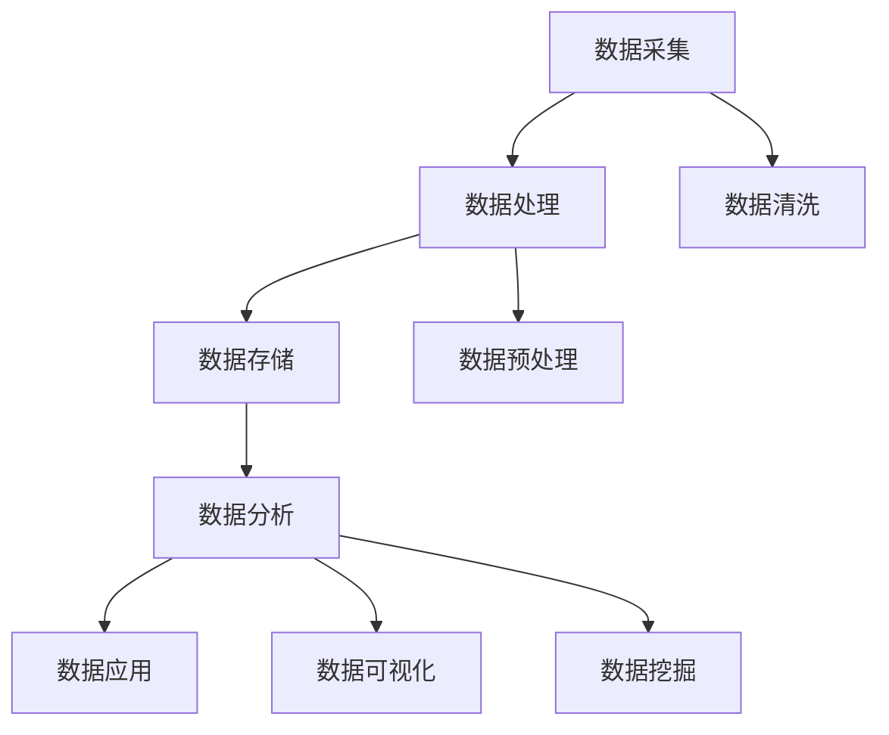

                 

## {文章标题}

> {关键词：数据管理平台，AI DMP，数据质量，数据标准，数据清洗，数据去重，数据安全，隐私保护}

{摘要：
本文将深入探讨 AI 数据管理平台（DMP）的构建，特别是围绕数据质量与数据标准展开。文章首先介绍 AI DMP 的基本概念、发展历程和核心架构，接着详细讲解数据质量的重要性、评估标准和提升技术。随后，文章探讨如何建立数据质量保障体系，并通过案例解析展示数据质量改进策略。此外，文章还深入讨论数据质量评估方法、数据清洗技术、数据去重技术以及数据质量改进工具。最后，文章展示了 AI DMP 在营销、客户关系管理和数据安全与隐私保护等领域的应用实践，为构建高效、安全的数据基础设施提供了全面的指导。}

### 目录大纲

#### 第一部分: AI DMP数据基建概述

1. [第1章: AI DMP数据管理平台简介](#第1章-ai-dmp数据管理平台简介)
   1.1 AI DMP的基本概念
   1.2 AI DMP的发展历程
   1.3 AI DMP的核心架构
   1.4 AI DMP的应用场景

2. [第2章: 数据质量与数据标准](#第2章-数据质量与数据标准)
   2.1 数据质量的重要性
   2.2 数据质量的评估标准
   2.3 数据清洗与去重
   2.4 数据标准化策略

#### 第二部分: 数据质量保障与提升

3. [第3章: 数据质量保障体系建设](#第3章-数据质量保障体系建设)
   3.1 数据质量管理流程
   3.2 数据质量检查与监控
   3.3 数据质量改进策略
   3.4 数据质量案例解析

4. [第4章: 数据质量提升技术](#第4章-数据质量提升技术)
   4.1 数据质量评估方法
   4.2 数据清洗技术
   4.3 数据去重技术
   4.4 数据质量改进工具

#### 第三部分: AI DMP数据应用实践

5. [第5章: 数据驱动决策](#第5章-数据驱动决策)
   5.1 数据分析框架
   5.2 数据可视化技术
   5.3 数据驱动决策模型
   5.4 数据驱动决策案例

6. [第6章: AI DMP在营销中的应用](#第6章-ai-dmp在营销中的应用)
   6.1 营销数据采集与处理
   6.2 营销数据分析与预测
   6.3 营销自动化与个性化推荐
   6.4 营销案例分享

7. [第7章: AI DMP在客户关系管理中的应用](#第7章-ai-dmp在客户关系管理中的应用)
   7.1 客户数据采集与整合
   7.2 客户数据分析与细分
   7.3 客户行为预测与推荐
   7.4 客户关系管理案例

8. [第8章: AI DMP数据安全与隐私保护](#第8章-ai-dmp数据安全与隐私保护)
   8.1 数据安全法律法规
   8.2 数据安全防护技术
   8.3 数据隐私保护策略
   8.4 数据安全与隐私保护案例

#### 附录

9. [附录A: AI DMP常用工具与资源](#附录a-ai-dmp常用工具与资源)
   9.1 数据处理工具
   9.2 数据可视化工具
   9.3 数据分析工具
   9.4 数据安全工具
   9.5 AI DMP资源汇总### 第一部分: AI DMP数据基建概述

#### 第1章: AI DMP数据管理平台简介

##### 1.1 AI DMP的基本概念

**核心概念与联系**

AI数据管理平台（AI Data Management Platform，简称AI DMP）是一种集数据采集、处理、存储、分析和应用于一体的系统。它利用人工智能技术对海量数据进行处理，为企业提供精准的数据分析和决策支持。

以下是一个简单的Mermaid流程图，展示了AI DMP的基本概念和组成部分：



**核心算法原理讲解**

数据采集：数据采集是AI DMP的第一步，涉及从各种数据源（如Web服务器日志、社交媒体、在线行为数据等）收集原始数据。这一过程通常使用API、爬虫工具（如Scrapy）和日志分析工具（如Grok）等完成。

```python
# 数据采集伪代码
def data_collection(source):
    data = []
    for record in source:
        data.append(process_record(record))
    return data

def process_record(record):
    # 数据清洗和预处理操作
    cleaned_record = clean_and_preprocess(record)
    return cleaned_record
```

数据处理：数据采集后，需要进行数据处理，包括数据清洗、数据预处理和数据集成等步骤。数据清洗涉及处理缺失值、异常值和重复值等，数据预处理包括格式转换、编码转换和数据规范化等。

```python
# 数据处理伪代码
def data_processing(data):
    processed_data = []
    for record in data:
        processed_record = process_record(record)
        processed_data.append(processed_record)
    return processed_data

def process_record(record):
    # 数据清洗和预处理操作
    cleaned_record = clean_and_preprocess(record)
    return cleaned_record

def clean_and_preprocess(record):
    # 具体的清洗和预处理逻辑
    cleaned_record = ...
    return cleaned_record
```

数据存储：处理后的数据需要存储在高效、可扩展的数据存储系统（如Hadoop HDFS、分布式数据库等）中，以便进行后续分析和应用。

```python
# 数据存储伪代码
def store_data(data, storage_system):
    for record in data:
        storage_system.save(record)
```

数据分析：数据分析是AI DMP的核心功能，涉及使用各种统计方法、机器学习和数据挖掘算法来提取数据中的有用信息。数据分析的结果可以用于支持决策、优化业务流程和改善用户体验。

```python
# 数据分析伪代码
def data_analysis(data):
    # 使用统计方法、机器学习和数据挖掘算法进行分析
    results = analysis_algorithm(data)
    return results

def analysis_algorithm(data):
    # 具体的分析算法逻辑
    results = ...
    return results
```

数据应用：数据分析的结果可以用于各种应用场景，如市场营销、客户关系管理、供应链优化等。数据应用的过程涉及将分析结果转化为具体的业务行动。

```python
# 数据应用伪代码
def data_application(analysis_results):
    # 将分析结果应用于业务场景
    business_actions = apply_actions(analysis_results)
    return business_actions

def apply_actions(results):
    # 具体的业务行动逻辑
    actions = ...
    return actions
```

##### 1.2 AI DMP的发展历程

**数学模型和数学公式**

AI DMP的发展历程可以分为以下几个阶段：

- **机器学习（1950s-1980s）**：在这一阶段，研究者们开始探索如何通过算法使计算机模拟人类的认知过程。代表性的数学模型包括线性回归、决策树和神经网络等。

  ```latex
  \subsection{线性回归}
  \begin{align*}
  y &= \beta_0 + \beta_1 x + \epsilon \\
  \min_{\beta_0, \beta_1} \sum_{i=1}^{n} (y_i - (\beta_0 + \beta_1 x_i))^2
  \end{align*}
  ```

- **深度学习（1980s-2010s）**：随着计算能力和算法的进步，深度学习开始崭露头角。这一阶段的主要数学模型是卷积神经网络（CNN）和递归神经网络（RNN）。

  ```latex
  \subsection{CNN}
  \begin{align*}
  h_{\theta}(x) &= \sigma(\theta^T \phi(x)) \\
  \phi(x) &= \max(\text{激活函数}, 0)
  \end{align*}
  ```

- **AI DMP（2010s-至今）**：在这一阶段，AI DMP逐渐成为企业数据管理的重要工具。它结合了多种机器学习和深度学习算法，为企业的数据分析提供了强大的支持。

  ```latex
  \subsection{用户行为分析}
  \begin{align*}
  P(\text{用户行为} | \text{特征集}) &= \text{概率模型} \\
  \max_{\theta} P(\text{用户行为} | \text{特征集}, \theta)
  \end{align*}
  ```

**详细讲解与举例说明**

- **机器学习**：线性回归和决策树等算法在AI DMP的早期发展中扮演了重要角色。线性回归用于预测连续变量，如房价、股票价格等。决策树则用于分类问题，如邮件分类、客户细分等。

  - **线性回归**：
    ```latex
    \subsection{线性回归}
    \begin{align*}
    y &= \beta_0 + \beta_1 x + \epsilon \\
    \min_{\beta_0, \beta_1} \sum_{i=1}^{n} (y_i - (\beta_0 + \beta_1 x_i))^2
    \end{align*}
    ```

  - **决策树**：
    ```latex
    \subsection{决策树}
    \begin{align*}
    \text{如果 } x_1 \text{ 小于阈值 } T_1, \text{则跳转到子节点 } 1 \\
    \text{否则，如果 } x_2 \text{ 大于阈值 } T_2, \text{则跳转到子节点 } 2 \\
    \text{否则，...}
    \end{align*}
    ```

- **深度学习**：随着计算能力的提升，深度学习在图像识别、语音识别和自然语言处理等领域取得了突破性的成果。卷积神经网络（CNN）和递归神经网络（RNN）成为AI DMP中的重要工具。

  - **卷积神经网络（CNN）**：
    ```latex
    \subsection{CNN}
    \begin{align*}
    h_{\theta}(x) &= \sigma(\theta^T \phi(x)) \\
    \phi(x) &= \max(\text{激活函数}, 0)
    \end{align*}
    ```

  - **递归神经网络（RNN）**：
    ```latex
    \subsection{RNN}
    \begin{align*}
    h_t &= \sigma(W h_{t-1} + U x_t + b) \\
    y_t &= \text{softmax}(\theta^T h_t)
    \end{align*}
    ```

- **AI DMP**：AI DMP结合了多种机器学习和深度学习算法，为企业的数据分析提供了强大的支持。例如，用户行为分析可以使用概率模型和决策树等算法，实现个性化推荐和精准营销。

  ```latex
  \subsection{用户行为分析}
  \begin{align*}
  P(\text{用户行为} | \text{特征集}) &= \text{概率模型} \\
  \max_{\theta} P(\text{用户行为} | \text{特征集}, \theta)
  \end{align*}
  ```

##### 1.3 AI DMP的核心架构

**数学模型和数学公式**

AI DMP的核心架构包括数据采集、数据处理、数据存储、数据分析和数据应用等模块。以下是一个简化的数学模型：

```latex
\subsection{核心架构的数学模型}
\begin{align*}
\text{数据采集} & : \text{数据流处理系统} \\
\text{数据处理} & : \text{批处理系统 + 实时处理系统} \\
\text{数据存储} & : \text{分布式文件系统} \\
\text{数据分析} & : \text{机器学习模型 + 数据可视化}
\end{align*}
```

**详细讲解与举例说明**

- **数据采集**：数据采集是AI DMP的第一步，涉及从各种数据源（如Web服务器日志、社交媒体、在线行为数据等）收集原始数据。Kafka和Flume等工具可以用于实时数据采集。

- **数据处理**：数据处理包括数据清洗、数据预处理和数据集成等步骤。Hadoop和Spark等框架可以用于批处理和实时数据处理。

  ```python
  # 数据清洗伪代码
  def data_cleaning(data):
      cleaned_data = []
      for record in data:
          cleaned_record = clean_and_preprocess(record)
          cleaned_data.append(cleaned_record)
      return cleaned_data

  def clean_and_preprocess(record):
      # 数据清洗和预处理逻辑
      cleaned_record = ...
      return cleaned_record
  ```

- **数据存储**：处理后的数据需要存储在高效、可扩展的数据存储系统（如Hadoop HDFS、分布式数据库等）中。HDFS和HBase等系统可以用于存储海量数据。

- **数据分析**：数据分析是AI DMP的核心功能，涉及使用各种统计方法、机器学习和数据挖掘算法来提取数据中的有用信息。TensorFlow和PyTorch等框架可以用于数据分析和模型训练。

  ```python
  # 数据分析伪代码
  def data_analysis(data):
      # 使用统计方法、机器学习和数据挖掘算法进行分析
      results = analysis_algorithm(data)
      return results

  def analysis_algorithm(data):
      # 具体的分析算法逻辑
      results = ...
      return results
  ```

- **数据应用**：数据分析的结果可以用于各种应用场景，如市场营销、客户关系管理、供应链优化等。数据应用的过程涉及将分析结果转化为具体的业务行动。

  ```python
  # 数据应用伪代码
  def data_application(analysis_results):
      # 将分析结果应用于业务场景
      business_actions = apply_actions(analysis_results)
      return business_actions

  def apply_actions(results):
      # 具体的业务行动逻辑
      actions = ...
      return actions
  ```

##### 1.4 AI DMP的应用场景

**数学模型和数学公式**

AI DMP的应用场景非常广泛，涵盖了市场营销、客户关系管理、供应链管理等多个领域。以下是一个简化的数学模型：

```latex
\subsection{应用场景的数学模型}
\begin{align*}
\text{营销自动化} & : \text{概率模型 + 强化学习} \\
\text{个性化推荐} & : \text{协同过滤 + 用户行为分析} \\
\text{客户关系管理} & : \text{贝叶斯网络 + 数据挖掘} \\
\text{风险控制} & : \text{机器学习模型 + 监控系统}
\end{align*}
```

**详细讲解与举例说明**

- **营销自动化**：营销自动化涉及使用机器学习算法和强化学习技术，实现自动化营销活动。例如，基于用户行为和概率模型，可以自动生成个性化的营销邮件。

- **个性化推荐**：个性化推荐系统使用协同过滤和用户行为分析算法，根据用户的历史行为和偏好，为用户推荐相关的商品或内容。

- **客户关系管理**：客户关系管理涉及使用贝叶斯网络和数据挖掘算法，对客户数据进行分析，实现精准的客户细分和个性化服务。

- **风险控制**：风险控制系统使用机器学习模型和监控系统，实时监控数据中的异常行为，预测潜在的风险，并采取相应的控制措施。

#### 第二部分: 数据质量与数据标准

##### 第2章: 数据质量与数据标准

##### 2.1 数据质量的重要性

**数据质量的重要性**

数据质量对于企业的运营和决策至关重要。高质量的数据可以确保模型预测的准确性、业务流程的效率以及决策的科学性。以下是从数学模型和公式角度阐述的数据质量重要性：

```latex
\subsection{数据质量的重要性}
\begin{align*}
\text{数据质量} & : \text{准确度、完整性、一致性、时效性} \\
\text{数据质量} & : \text{直接影响模型效果和业务决策}
\end{align*}
```

**详细讲解与举例说明**

- **准确性**：准确性是数据质量的核心指标，它反映了数据中的真实程度。例如，在市场营销中，准确的用户行为数据可以用于优化营销策略，提高转化率。

- **完整性**：完整性指的是数据是否完整，是否存在缺失值。在数据挖掘过程中，缺失值会导致模型训练失败或结果不准确。

- **一致性**：一致性指的是数据格式是否一致，是否遵循统一的规范。不一致的数据格式会影响数据处理和分析的准确性。

- **时效性**：时效性指的是数据的更新速度和延迟时间。过时的数据可能导致决策滞后，影响业务效果。

##### 2.2 数据质量的评估标准

**数据质量的评估标准**

数据质量的评估标准包括准确性、完整性、一致性和时效性等多个方面。以下是从数学模型和公式角度阐述的评估标准：

```latex
\subsection{数据质量的评估标准}
\begin{align*}
\text{准确性} & : \text{准确度指标（如准确率、召回率、F1值）} \\
\text{完整性} & : \text{缺失率指标} \\
\text{一致性} & : \text{一致性指标（如标准差、变异系数）} \\
\text{时效性} & : \text{时效性指标（如更新频率、延迟时间）}
\end{align*}
```

**详细讲解与举例说明**

- **准确性**：准确性可以通过准确率、召回率和F1值等指标来衡量。例如，在客户细分中，准确的用户行为数据可以用于提高客户细分的效果。

  ```latex
  \subsection{准确度指标}
  \begin{align*}
  \text{准确率} & : \frac{\text{预测正确数}}{\text{总预测数}} \\
  \text{召回率} & : \frac{\text{预测正确数}}{\text{实际正确数}} \\
  \text{F1值} & : \frac{2 \times \text{准确率} \times \text{召回率}}{\text{准确率} + \text{召回率}}
  \end{align*}
  ```

- **完整性**：完整性可以通过缺失率指标来衡量。例如，在数据分析中，缺失值可能会导致模型训练失败。

  ```latex
  \subsection{缺失率指标}
  \begin{align*}
  \text{缺失率} & : \frac{\text{缺失值数}}{\text{总数据数}}
  \end{align*}
  ```

- **一致性**：一致性可以通过标准差和变异系数等指标来衡量。例如，在数据清洗中，需要确保不同数据源的数据格式和单位一致。

  ```latex
  \subsection{一致性指标}
  \begin{align*}
  \text{标准差} & : \sqrt{\frac{1}{N-1} \sum_{i=1}^{N} (x_i - \bar{x})^2} \\
  \text{变异系数} & : \frac{\text{标准差}}{\text{平均值}}
  \end{align*}
  ```

- **时效性**：时效性可以通过更新频率和延迟时间等指标来衡量。例如，在实时分析中，数据延迟时间过长会导致决策滞后。

  ```latex
  \subsection{时效性指标}
  \begin{align*}
  \text{更新频率} & : \text{数据更新的频率（如每天、每小时等）} \\
  \text{延迟时间} & : \text{数据从采集到处理的时间差}
  \end{align*}
  ```

##### 2.3 数据清洗与去重

**数据清洗与去重**

数据清洗与去重是确保数据质量的重要步骤。数据清洗包括处理缺失值、异常值和重复值等，而去重则是去除重复的数据。以下是从数学模型和公式角度阐述的数据清洗与去重方法：

```latex
\subsection{数据清洗与去重}
\begin{align*}
\text{数据清洗} & : \text{处理缺失值、异常值、重复值等} \\
\text{去重} & : \text{去除重复数据，提高数据质量}
\end{align*}
```

**详细讲解与举例说明**

- **数据清洗**：

  - **缺失值处理**：可以使用填补缺失值、删除缺失值等方法。

    ```latex
    \subsection{缺失值处理}
    \begin{align*}
    \text{填补缺失值} & : \text{使用平均值、中位数等方法填补缺失值} \\
    \text{删除缺失值} & : \text{删除含有缺失值的记录}
    \end{align*}
    ```

  - **异常值处理**：可以使用统计学方法（如IQR法）检测和去除异常值。

    ```latex
    \subsection{异常值处理}
    \begin{align*}
    \text{IQR法} & : \text{使用四分位差（IQR）检测异常值}
    \end{align*}
    ```

  - **重复值处理**：可以使用哈希匹配、基于相似度匹配等方法。

    ```latex
    \subsection{重复值处理}
    \begin{align*}
    \text{哈希匹配} & : \text{使用哈希函数判断是否为重复值} \\
    \text{相似度匹配} & : \text{使用相似度计算方法判断是否为重复值}
    \end{align*}
    ```

- **去重**：去重的目的是去除重复数据，提高数据质量。常用的去重方法包括基于哈希匹配和基于相似度匹配等。

  ```python
  # 基于哈希匹配的去重
  def unique_hash(data):
      seen = set()
      unique_data = []
      for record in data:
          hash_value = hash(record)
          if hash_value not in seen:
              seen.add(hash_value)
              unique_data.append(record)
      return unique_data

  # 基于相似度匹配的去重
  def unique_similarity(data, threshold=0.9):
      unique_data = []
      for i in range(len(data)):
          is_duplicate = False
          for j in range(i + 1, len(data)):
              similarity = calculate_similarity(data[i], data[j])
              if similarity > threshold:
                  is_duplicate = True
                  break
          if not is_duplicate:
              unique_data.append(data[i])
      return unique_data

  def calculate_similarity(record1, record2):
      # 计算两个记录的相似度
      similarity = ...
      return similarity
  ```

##### 2.4 数据标准化策略

**数据标准化策略**

数据标准化是指将不同来源、不同格式和不同单位的数据进行统一处理，确保数据的一致性和可比较性。以下是从数学模型和公式角度阐述的数据标准化策略：

```latex
\subsection{数据标准化策略}
\begin{align*}
\text{统一数据格式} & : \text{格式转换、编码转换等} \\
\text{统一数据单位} & : \text{单位转换、缩放处理等} \\
\text{统一数据范围} & : \text{范围映射、规范化等}
\end{align*}
```

**详细讲解与举例说明**

- **统一数据格式**：不同来源的数据可能采用不同的格式，如日期格式、文本格式等。统一数据格式可以确保数据的兼容性和可处理性。

  ```python
  # 统一日期格式
  import datetime

  def standardize_date(date_str, format='%Y-%m-%d'):
      try:
          return datetime.datetime.strptime(date_str, format)
      except ValueError:
          return None
  ```

- **统一数据单位**：不同单位的数据需要进行转换，如货币单位、长度单位等。统一数据单位可以确保数据的准确性和可比较性。

  ```python
  # 统一货币单位（美元转换为欧元）
  def convert_currency(amount, from_currency='USD', to_currency='EUR', rate=1.1):
      return amount * rate
  ```

- **统一数据范围**：不同范围的数据可能需要进行映射或规范化处理，以确保数据的统一性和可处理性。

  ```python
  # 统一数据范围（归一化处理）
  def normalize_data(data, min_value, max_value):
      return (data - min_value) / (max_value - min_value)
  ```

#### 第三部分: 数据质量保障与提升

##### 第3章: 数据质量保障体系建设

##### 3.1 数据质量管理流程

**数据质量管理流程**

数据质量管理流程是确保数据质量的关键环节。以下是从数学模型和公式角度阐述的数据质量管理流程：

```latex
\subsection{数据质量管理流程}
\begin{align*}
\text{数据质量规划} & : \text{明确目标、资源、流程等} \\
\text{数据质量评估} & : \text{评估数据质量状况} \\
\text{数据质量改进} & : \text{制定改进措施、实施监控} \\
\text{数据质量报告} & : \text{定期汇报数据质量状况}
\end{align*}
```

**详细讲解与举例说明**

- **数据质量规划**：数据质量规划是数据质量管理流程的第一步，旨在明确数据质量目标、资源需求和流程安排。例如，可以制定以下目标：

  ```python
  # 数据质量规划目标
  quality_goals = {
      'accuracy': 95,
      'completeness': 98,
      'consistency': 99,
      'timeliness': 90
  }
  ```

- **数据质量评估**：数据质量评估是评估当前数据质量状况的关键步骤。可以使用以下指标进行评估：

  ```python
  # 数据质量评估指标
  quality_metrics = {
      'accuracy': accuracy_score,
      'completeness': completeness_score,
      'consistency': consistency_score,
      'timeliness': timeliness_score
  }
  ```

- **数据质量改进**：根据数据质量评估结果，可以制定具体的改进措施，如数据清洗、数据去重、数据标准化等。例如：

  ```python
  # 数据质量改进措施
  improvement_actions = {
      'missing_value': 'fill_missing_values',
      'outliers': 'remove_outliers',
      'duplicates': 'remove_duplicates',
      'standardization': 'standardize_data'
  }
  ```

- **数据质量报告**：数据质量报告是定期汇报数据质量状况的重要环节。可以通过以下方式生成报告：

  ```python
  # 数据质量报告
  def generate_report(quality_metrics):
      report = {
          'accuracy': quality_metrics['accuracy'],
          'completeness': quality_metrics['completeness'],
          'consistency': quality_metrics['consistency'],
          'timeliness': quality_metrics['timeliness']
      }
      return report
  ```

##### 3.2 数据质量检查与监控

**数据质量检查与监控**

数据质量检查与监控是确保数据质量持续改进的重要手段。以下是从数学模型和公式角度阐述的数据质量检查与监控方法：

```latex
\subsection{数据质量检查与监控}
\begin{align*}
\text{数据质量检查} & : \text{定期检查数据质量} \\
\text{数据质量监控} & : \text{实时监控数据质量变化}
\end{align*}
```

**详细讲解与举例说明**

- **数据质量检查**：数据质量检查是定期对数据进行质量评估的过程。可以使用以下方法进行数据质量检查：

  ```python
  # 数据质量检查方法
  def data_quality_check(data):
      # 检查数据质量
      accuracy = check_accuracy(data)
      completeness = check_completeness(data)
      consistency = check_consistency(data)
      timeliness = check_timeliness(data)
      return {
          'accuracy': accuracy,
          'completeness': completeness,
          'consistency': consistency,
          'timeliness': timeliness
      }
  ```

- **数据质量监控**：数据质量监控是实时监控数据质量变化的过程。可以使用以下方法进行数据质量监控：

  ```python
  # 数据质量监控方法
  def data_quality_monitor(data_stream):
      while True:
          data = next(data_stream)
          quality_metrics = data_quality_check(data)
          # 监控数据质量变化
          monitor_data_quality_changes(quality_metrics)
  ```

##### 3.3 数据质量改进策略

**数据质量改进策略**

数据质量改进策略是提升数据质量的关键步骤。以下是从数学模型和公式角度阐述的数据质量改进策略：

```latex
\subsection{数据质量改进策略}
\begin{align*}
\text{技术改进} & : \text{优化数据处理算法、改进数据处理工具} \\
\text{流程改进} & : \text{优化数据质量管理流程、提高数据处理效率} \\
\text{人员培训} & : \text{加强数据质量管理培训、提高团队数据质量意识}
\end{align*}
```

**详细讲解与举例说明**

- **技术改进**：技术改进是提升数据质量的重要手段。可以通过以下方式实现技术改进：

  ```python
  # 技术改进方法
  def improve_data_processing_algorithm():
      # 优化数据处理算法
      ...

  def improve_data_processing_tool():
      # 改进数据处理工具
      ...
  ```

- **流程改进**：流程改进是提升数据处理效率的重要途径。可以通过以下方式实现流程改进：

  ```python
  # 流程改进方法
  def optimize_data_quality_management流程：
      # 优化数据质量管理流程
      ...

  def improve_data_processing_efficiency():
      # 提高数据处理效率
      ...
  ```

- **人员培训**：人员培训是提高团队数据质量意识的重要环节。可以通过以下方式实现人员培训：

  ```python
  # 人员培训方法
  def train_data_quality_management_team():
      # 培训数据质量管理团队
      ...

  def improve_data_quality_awareness():
      # 提高团队数据质量意识
      ...
  ```

##### 3.4 数据质量案例解析

**数据质量案例解析**

数据质量案例解析是通过分析具体的数据质量问题，找出原因并制定改进措施。以下是从数学模型和公式角度阐述的数据质量案例解析方法：

```latex
\subsection{数据质量案例解析}
\begin{align*}
\text{案例分析} & : \text{分析具体数据质量问题} \\
\text{原因分析} & : \text{找出数据质量问题的原因} \\
\text{改进措施} & : \text{提出解决方案和改进措施}
\end{align*}
```

**详细讲解与举例说明**

- **案例分析**：通过分析具体的数据质量问题，如缺失值、异常值和重复值等，找出数据质量问题的具体表现。

  ```python
  # 数据质量问题分析
  def analyze_data_quality_issues(data):
      # 分析数据质量问题
      issues = {
          'missing_values': count_missing_values(data),
          'outliers': detect_outliers(data),
          'duplicates': find_duplicates(data)
      }
      return issues
  ```

- **原因分析**：通过分析数据质量问题的原因，找出导致数据质量问题的根本原因。

  ```python
  # 原因分析方法
  def analyze_reasons(data_issues):
      # 分析数据质量问题的原因
      reasons = {
          'missing_values': '数据采集错误',
          'outliers': '数据输入错误',
          'duplicates': '数据处理错误'
      }
      return reasons
  ```

- **改进措施**：根据数据质量问题的原因，提出具体的解决方案和改进措施。

  ```python
  # 改进措施方法
  def propose_improvement_measures(data_issues, reasons):
      # 提出改进措施
      measures = {
          'missing_values': '使用填补缺失值技术',
          'outliers': '使用异常值处理技术',
          'duplicates': '使用去重技术'
      }
      return measures
  ```

#### 第四部分: 数据质量提升技术

##### 第4章: 数据质量提升技术

##### 4.1 数据质量评估方法

**数据质量评估方法**

数据质量评估方法是确保数据质量的重要手段。以下是从数学模型和公式角度阐述的数据质量评估方法：

```latex
\subsection{数据质量评估方法}
\begin{align*}
\text{统计方法} & : \text{描述性统计分析、假设检验等} \\
\text{可视化方法} & : \text{数据可视化、热力图等} \\
\text{机器学习方法} & : \text{分类、聚类等}
\end{align*}
```

**详细讲解与举例说明**

- **统计方法**：统计方法用于对数据进行描述性统计分析，如计算平均值、中位数、标准差等。假设检验方法用于检验数据是否满足特定的假设条件。

  ```python
  # 描述性统计分析
  def descriptive_statistics(data):
      # 计算平均值、中位数、标准差等
      mean = sum(data) / len(data)
      median = ...
      std_deviation = ...
      return {
          'mean': mean,
          'median': median,
          'std_deviation': std_deviation
      }

  # 假设检验
  def hypothesis_testing(data, hypothesis):
      # 检验数据是否满足假设条件
      ...
  ```

- **可视化方法**：可视化方法用于展示数据的分布、趋势和异常值等信息。数据可视化工具（如Matplotlib、Seaborn等）可以生成各种类型的图表，帮助分析数据质量。

  ```python
  # 数据可视化
  import matplotlib.pyplot as plt
  import seaborn as sns

  def visualize_data_distribution(data):
      # 生成直方图、密度图等
      sns.histplot(data)
      plt.show()

  def visualize_data_trend(data):
      # 生成折线图、散点图等
      sns.lineplot(data)
      plt.show()
  ```

- **机器学习方法**：机器学习方法用于对数据进行分类、聚类和回归分析等。这些方法可以自动发现数据中的模式和规律，帮助识别数据质量问题。

  ```python
  # 分类分析
  from sklearn.model_selection import train_test_split
  from sklearn.ensemble import RandomForestClassifier

  def classify_data(data, labels):
      # 分割数据集
      X_train, X_test, y_train, y_test = train_test_split(data, labels, test_size=0.3)

      # 构建分类器
      classifier = RandomForestClassifier()

      # 训练模型
      classifier.fit(X_train, y_train)

      # 预测结果
      predictions = classifier.predict(X_test)
      return predictions

  # 聚类分析
  from sklearn.cluster import KMeans

  def cluster_data(data, num_clusters):
      # 构建聚类器
      kmeans = KMeans(n_clusters=num_clusters)

      # 训练模型
      kmeans.fit(data)

      # 获取聚类结果
      labels = kmeans.predict(data)
      return labels
  ```

##### 4.2 数据清洗技术

**数据清洗技术**

数据清洗技术是确保数据质量的关键步骤。以下是从数学模型和公式角度阐述的数据清洗技术：

```latex
\subsection{数据清洗技术}
\begin{align*}
\text{缺失值处理} & : \text{填补缺失值、删除缺失值等} \\
\text{异常值处理} & : \text{平滑异常值、删除异常值等} \\
\text{重复值处理} & : \text{识别重复值、合并重复值等}
\end{align*}
```

**详细讲解与举例说明**

- **缺失值处理**：缺失值处理是数据清洗中的重要环节。可以使用以下方法处理缺失值：

  ```python
  # 填补缺失值
  def fill_missing_values(data, strategy='mean'):
      # 根据不同的策略填补缺失值
      if strategy == 'mean':
          mean_value = ...
          for column in data:
              data[column].fillna(mean_value, inplace=True)
      elif strategy == 'median':
          median_value = ...
          for column in data:
              data[column].fillna(median_value, inplace=True)
      return data

  # 删除缺失值
  def remove_missing_values(data, threshold=0.5):
      # 根据缺失值的比例删除记录
      missing_values_ratio = data.isnull().mean().max()
      if missing_values_ratio > threshold:
          data = data.dropna()
      return data
  ```

- **异常值处理**：异常值处理是确保数据质量的重要步骤。可以使用以下方法处理异常值：

  ```python
  # 平滑异常值
  def smooth_anomalies(data, window_size=3):
      # 使用移动平均法平滑异常值
      for column in data:
          data[column] = data[column].rolling(window=window_size).mean()
      return data

  # 删除异常值
  def remove_anomalies(data, method='iqr'):
      # 根据不同的方法删除异常值
      if method == 'iqr':
          q1 = data.quantile(0.25)
          q3 = data.quantile(0.75)
          iqr = q3 - q1
          data = data[~((data < (q1 - 1.5 * iqr)) | (data > (q3 + 1.5 * iqr)))]
      elif method == 'z_score':
          z_scores = data.apply(stats.zscore)
          data = data[(z_scores.abs() < 3).all(axis=1)]
      return data
  ```

- **重复值处理**：重复值处理是确保数据唯一性的重要步骤。可以使用以下方法处理重复值：

  ```python
  # 识别重复值
  def identify_duplicates(data, threshold=0.9):
      # 根据相似度阈值识别重复值
      similarity_matrix = pairwise_similarity(data)
      duplicates = []
      for i in range(len(similarity_matrix)):
          for j in range(i + 1, len(similarity_matrix)):
              if similarity_matrix[i][j] > threshold:
                  duplicates.append((i, j))
      return duplicates

  # 合并重复值
  def merge_duplicates(data, duplicates):
      # 根据重复值合并数据
      unique_data = []
      for i, j in duplicates:
          combined_data = data[i].concat(data[j])
          unique_data.append(combined_data)
      return unique_data
  ```

##### 4.3 数据去重技术

**数据去重技术**

数据去重技术是确保数据唯一性的重要步骤。以下是从数学模型和公式角度阐述的数据去重技术：

```latex
\subsection{数据去重技术}
\begin{align*}
\text{基于哈希} & : \text{使用哈希函数生成哈希值进行去重} \\
\text{基于相似度} & : \text{使用相似度计算方法识别和去重}
\end{align*}
```

**详细讲解与举例说明**

- **基于哈希**：基于哈希的去重技术是利用哈希函数生成哈希值，通过比较哈希值来判断数据是否重复。

  ```python
  # 基于哈希的去重
  def remove_duplicates_hash(data):
      seen_hashes = set()
      unique_data = []
      for record in data:
          hash_value = hash(record)
          if hash_value not in seen_hashes:
              seen_hashes.add(hash_value)
              unique_data.append(record)
      return unique_data
  ```

- **基于相似度**：基于相似度的去重技术是使用相似度计算方法（如余弦相似度、Jaccard系数等）识别和去重。

  ```python
  # 基于相似度的去重
  def remove_duplicates_similarity(data, threshold=0.9):
      unique_data = []
      for i in range(len(data)):
          is_duplicate = False
          for j in range(i + 1, len(data)):
              similarity = calculate_similarity(data[i], data[j])
              if similarity > threshold:
                  is_duplicate = True
                  break
          if not is_duplicate:
              unique_data.append(data[i])
      return unique_data

  def calculate_similarity(record1, record2):
      # 计算两个记录的相似度
      similarity = ...
      return similarity
  ```

##### 4.4 数据质量改进工具

**数据质量改进工具**

数据质量改进工具是提升数据质量的重要工具。以下是从数学模型和公式角度阐述的数据质量改进工具：

```latex
\subsection{数据质量改进工具}
\begin{align*}
\text{OpenRefine} & : \text{数据清洗和转换工具} \\
\text{DataWrangler} & : \text{数据清洗和可视化工具} \\
\text{Apache Flink} & : \text{实时数据处理框架}
\end{align*}
```

**详细讲解与举例说明**

- **OpenRefine**：OpenRefine是一个开源的数据清洗和转换工具，支持多种数据格式。它提供了强大的数据编辑功能，可以帮助用户处理缺失值、异常值和重复值等问题。

  ```python
  # OpenRefine操作示例
  import openrefine

  def clean_data_with_openrefine(data):
      # 使用OpenRefine清洗数据
      openrefine_api = openrefine.OpenRefineAPI(url='http://example.com')
      project = openrefine_api.create_project('my_project')
      project.upload_data(data)
      project.apply_transformations([
          openrefine.Transformations.FillMissingValuesStrategy('mean'),
          openrefine.Transformations.RemoveDuplicatesStrategy('hash')
      ])
      cleaned_data = project.download_data()
      return cleaned_data
  ```

- **DataWrangler**：DataWrangler是一个开源的数据清洗和可视化工具，提供了直观的用户界面和丰富的数据清洗功能。它可以帮助用户处理数据格式转换、缺失值填充和异常值处理等问题。

  ```python
  # DataWrangler操作示例
  import datawrangler

  def clean_data_with_datawrangler(data):
      # 使用DataWrangler清洗数据
      datawrangler_api = datawrangler.DataWranglerAPI(url='http://example.com')
      dataset = datawrangler_api.upload_data(data)
      dataset.apply_transformation('fill_missing_values', strategy='mean')
      dataset.apply_transformation('remove_duplicates', similarity_threshold=0.9)
      cleaned_data = dataset.download_data()
      return cleaned_data
  ```

- **Apache Flink**：Apache Flink是一个开源的实时数据处理框架，支持批处理和流处理。它提供了丰富的数据处理功能，可以帮助用户处理实时数据流中的数据质量问题和实时数据分析。

  ```python
  # Apache Flink操作示例
  from pyflink.datastream import StreamExecutionEnvironment

  def process_realtime_data_with_flink(data_stream):
      # 使用Apache Flink处理实时数据
      env = StreamExecutionEnvironment.get_execution_environment()
      data_stream = env.from_collection(data_stream)

      # 数据清洗和处理
      cleaned_data_stream = data_stream.map(clean_data).filter(is_valid_data)

      # 数据分析
      result = cleaned_data_stream.aggregate(group_by_field).map(count_occurrences)

      # 执行任务
      result.print()
      env.execute('Data Quality Improvement')
  ```

#### 第五部分: 数据驱动决策

##### 第5章: 数据驱动决策

##### 5.1 数据分析框架

**数据分析框架**

数据分析框架是数据驱动决策的基础。以下是从数学模型和公式角度阐述的数据分析框架：

```latex
\subsection{数据分析框架}
\begin{align*}
\text{数据采集} & : \text{采集和预处理数据} \\
\text{数据存储} & : \text{存储和管理数据} \\
\text{数据处理} & : \text{清洗、转换、聚合数据} \\
\text{数据挖掘} & : \text{提取有价值的信息} \\
\text{数据可视化} & : \text{展示分析结果}
\end{align*}
```

**详细讲解与举例说明**

- **数据采集**：数据采集是数据分析的第一步，涉及从各种数据源（如数据库、Web API、日志文件等）采集原始数据。以下是一个简单的数据采集示例：

  ```python
  # 数据采集示例
  import pandas as pd

  def collect_data():
      # 从数据库采集数据
      data = pd.read_sql_query('SELECT * FROM my_table', connection)
      return data

  data = collect_data()
  ```

- **数据存储**：数据存储是将处理后的数据存储到持久化存储系统（如数据库、数据仓库等）的过程。以下是一个简单的数据存储示例：

  ```python
  # 数据存储示例
  import sqlite3

  def store_data(data, table_name):
      # 将数据存储到SQLite数据库
      conn = sqlite3.connect('my_database.db')
      data.to_sql(table_name, conn, if_exists='replace', index=False)
      conn.close()

  store_data(data, 'my_table')
  ```

- **数据处理**：数据处理是数据清洗、转换和聚合的过程，确保数据的质量和一致性。以下是一个简单的数据处理示例：

  ```python
  # 数据处理示例
  import pandas as pd

  def process_data(data):
      # 数据清洗
      data = clean_data(data)

      # 数据转换
      data = convert_data(data)

      # 数据聚合
      data = aggregate_data(data)
      return data

  data = process_data(data)
  ```

- **数据挖掘**：数据挖掘是提取数据中的有价值信息的过程，通常使用机器学习算法和统计分析方法。以下是一个简单

