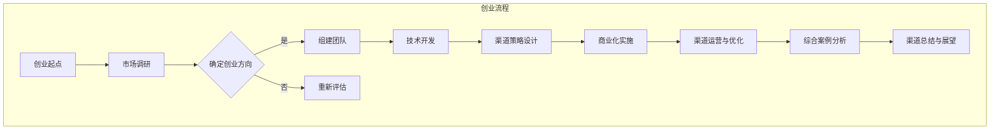

                 

### AI大模型与创业基础

#### 第1章: AI大模型概述与创业前景

在当今科技迅速发展的时代，人工智能（AI）已经成为推动社会进步的重要力量。AI大模型，作为人工智能领域的一个核心概念，正逐渐成为创业者和科技公司的热门选择。那么，什么是AI大模型？它们在创业领域具有怎样的前景和优势？

##### 1.1 AI大模型的基本概念与架构

AI大模型，通常指的是具有巨大参数规模、高度复杂性的深度学习模型。这些模型通过大量的数据训练，可以自动学习并提取数据中的复杂模式和规律，从而实现出色的性能和泛化能力。常见的AI大模型包括深度神经网络（DNN）、卷积神经网络（CNN）、递归神经网络（RNN）和生成对抗网络（GAN）等。

一个典型的AI大模型架构通常包括以下几个主要部分：

1. **输入层**：接收外部输入，如文本、图像、声音等。
2. **隐藏层**：进行特征提取和变换，隐藏层可以是单层或多层。
3. **输出层**：产生模型预测结果，如分类标签、概率分布等。
4. **损失函数**：用于评估模型预测结果与真实标签之间的差距。
5. **优化器**：用于调整模型参数，以最小化损失函数。

##### 1.2 AI大模型的技术发展历程

AI大模型的发展历程可以追溯到20世纪80年代。当时，随着计算机硬件性能的提升和大数据时代的到来，深度学习技术开始崭露头角。特别是2006年，Hinton等科学家提出的深度信念网络（DBN）模型，为后续的AI大模型研究奠定了基础。

2012年，AlexNet模型的提出标志着深度学习在图像识别领域取得了突破性进展。此后，随着卷积神经网络（CNN）的广泛应用，AI大模型在各个领域迅速发展，如图像处理、自然语言处理、语音识别等。

##### 1.3 AI大模型在创业领域的应用前景

AI大模型在创业领域具有广阔的应用前景，主要体现在以下几个方面：

1. **智能客服**：通过AI大模型，可以实现对用户问题的自动回答，提高客户服务质量。
2. **金融风控**：利用AI大模型进行信用评估、风险预测，帮助金融机构降低坏账率。
3. **医疗诊断**：AI大模型可以辅助医生进行疾病诊断，提高诊断准确率。
4. **自动驾驶**：AI大模型在自动驾驶领域具有关键作用，可实现实时路况感知和决策。
5. **智能制造**：通过AI大模型，可以优化生产流程，提高生产效率和产品质量。

##### 1.4 创业者应具备的AI大模型知识

作为创业者，了解AI大模型的基本知识是必不可少的。以下是一些关键知识点：

1. **深度学习原理**：掌握神经网络、反向传播算法等基本概念。
2. **数据预处理**：了解如何清洗、归一化数据，为模型训练提供高质量的数据。
3. **模型选择**：根据业务需求选择合适的模型架构。
4. **模型训练**：掌握如何调整超参数，优化模型性能。
5. **模型评估**：了解如何评估模型性能，确保模型具有良好的泛化能力。

#### 总结

AI大模型作为人工智能领域的重要突破，为创业提供了强大的技术支持。创业者应把握这一趋势，积极学习AI大模型相关知识，充分利用AI大模型在创业中的应用，提升创业成功率。在下一章中，我们将进一步探讨AI大模型在创业环境中的优势和应用。

---

### 伪代码：AI大模型训练算法

在深入探讨AI大模型的具体应用之前，我们需要先理解其核心训练算法。以下是一个简单的伪代码示例，用于描述AI大模型的训练过程。

```plaintext
function train_ai_model(data, epochs):
    for epoch in 1 to epochs:
        for each sample in data:
            predict = model(sample)
            loss = calculate_loss(predict, target)
            gradient = compute_gradient(loss, model)
            update_model_weights(gradient)
    return model
```

#### 算法详细解释

1. **数据预处理**：首先对输入数据进行预处理，包括清洗、归一化等操作，以保证模型训练的准确性和稳定性。
2. **模型初始化**：初始化模型参数，可以选择随机初始化或预训练模型进行迁移学习。
3. **前向传播**：输入数据通过模型的前向传播网络，得到预测输出。
4. **损失计算**：计算预测输出与实际标签之间的差异，通过损失函数得到损失值。
5. **反向传播**：计算梯度，并根据梯度更新模型参数。
6. **迭代优化**：重复上述步骤，直到满足训练终止条件（如损失收敛、达到预定义的迭代次数等）。
7. **模型评估**：在验证集或测试集上评估模型性能，确保模型具有良好的泛化能力。

#### 数学模型和数学公式讲解

损失函数是评价模型预测性能的重要指标，以下是一个常见的损失函数示例：

$$
L(\theta) = -\frac{1}{m}\sum_{i=1}^{m}y_{i}\log(a_{i})
$$

其中，$y_i$ 是实际标签，$a_i$ 是预测概率。

梯度下降是更新模型参数的常用方法，其公式如下：

$$
\theta = \theta - \alpha \cdot \nabla_\theta J(\theta)
$$

其中，$\alpha$ 是学习率，$J(\theta)$ 是损失函数。

#### 项目实战案例

以下是一个基于Python和TensorFlow的实际项目案例，用于训练一个简单的AI大模型。

##### 开发环境

- 操作系统：Ubuntu 20.04
- 编程语言：Python
- 深度学习框架：TensorFlow
- 数据处理库：Pandas、NumPy

##### 源代码实现

```python
import tensorflow as tf
from tensorflow.keras.models import Sequential
from tensorflow.keras.layers import Dense, Embedding, LSTM
from tensorflow.keras.optimizers import Adam

# 数据预处理
def preprocess_data(data):
    # 数据清洗、归一化等操作
    return processed_data

# 模型构建
def build_model():
    model = Sequential()
    model.add(Embedding(input_dim=vocab_size, output_dim=embedding_dim))
    model.add(LSTM(units=128, return_sequences=True))
    model.add(Dense(units=1, activation='sigmoid'))
    model.compile(optimizer=Adam(learning_rate=0.001), loss='binary_crossentropy', metrics=['accuracy'])
    return model

# 训练模型
def train_model(model, data):
    processed_data = preprocess_data(data)
    model.fit(processed_data.x, processed_data.y, epochs=10, batch_size=64)

# 主函数
def main():
    model = build_model()
    train_model(model, data)

if __name__ == "__main__":
    main()
```

##### 代码解读与分析

1. **数据预处理**：对输入数据进行清洗和归一化，确保数据质量。
2. **模型构建**：构建一个简单的序列模型，包括嵌入层、LSTM层和输出层。
3. **模型编译**：设置优化器和损失函数，准备模型训练。
4. **模型训练**：使用预处理后的数据训练模型，设置训练迭代次数和批量大小。

通过以上实战案例，创业者可以了解AI大模型在具体项目中的开发过程，包括数据预处理、模型构建和训练等关键步骤。这不仅有助于提高创业项目的成功率，也为其他领域的AI大模型应用提供了参考。

### 文章关键词

AI大模型、创业、技术优势、深度学习、应用前景

### 文章摘要

本文深入探讨了AI大模型在创业领域的应用与优势。首先，介绍了AI大模型的基本概念和架构，并回顾了其技术发展历程。接着，分析了AI大模型在创业领域的广阔前景，包括智能客服、金融风控、医疗诊断、自动驾驶和智能制造等应用场景。此外，本文详细讲解了AI大模型训练算法的伪代码、数学模型和公式，并通过实际项目案例展示了如何开发AI大模型。最后，本文总结了AI大模型在创业中的关键要素，为创业者提供了实用的参考。

---

### 第2章: 创业环境中的AI大模型优势

在了解了AI大模型的基本概念和发展历程后，我们需要深入探讨其在创业环境中的优势。AI大模型不仅能够提高创业项目的成功率，还能为企业带来一系列独特的竞争优势。在本章中，我们将详细分析AI大模型对创业模式、竞争环境和创业流程的优化作用，并提供相应的实施策略。

#### 2.1 AI大模型对创业模式的影响

传统的创业模式往往依赖于创新的产品或服务，而AI大模型的出现，使得创业模式发生了显著变化。以下是从几个方面分析AI大模型对创业模式的影响：

1. **数据驱动**：AI大模型依赖大量数据进行训练，这意味着创业企业可以更加依赖数据驱动决策，而不仅仅是基于经验和直觉。通过分析用户行为、市场趋势等数据，企业可以更准确地预测市场需求，优化产品设计和营销策略。

2. **自动化**：AI大模型可以实现自动化决策和流程优化，降低人力成本。例如，智能客服系统可以自动回答用户问题，提高客户满意度；智能推荐系统可以自动化推荐产品，提高销售转化率。

3. **个性化**：AI大模型可以根据用户行为和偏好进行个性化推荐，提升用户体验。例如，在电子商务领域，AI大模型可以根据用户的购物历史和浏览记录，推荐相关的商品，从而提高用户满意度和忠诚度。

4. **风险控制**：AI大模型可以用于风险评估和预测，帮助企业降低运营风险。例如，在金融领域，AI大模型可以用于信用评估、风险预警，从而降低坏账率。

#### 2.2 AI大模型在竞争环境中的优势

在竞争激烈的创业环境中，AI大模型为企业提供了独特的竞争优势。以下是从几个方面分析AI大模型在竞争环境中的优势：

1. **性能提升**：AI大模型具有出色的性能和泛化能力，可以在各个领域实现超越人类专家的决策能力。例如，在医疗诊断领域，AI大模型可以通过分析大量病例数据，提供比医生更为准确的诊断结果。

2. **创新加速**：AI大模型可以加速创新过程，帮助企业更快地推出新产品或服务。通过自动化和智能化的方式，企业可以快速迭代产品，满足市场变化和用户需求。

3. **成本节约**：AI大模型可以降低运营成本，提高资源利用效率。例如，在物流和供应链管理领域，AI大模型可以优化配送路线和库存管理，从而降低运输成本和库存成本。

4. **差异化优势**：AI大模型可以实现产品或服务的差异化，为企业打造独特的竞争优势。例如，在娱乐领域，AI大模型可以根据用户偏好生成个性化的内容推荐，从而提高用户粘性和品牌忠诚度。

#### 2.3 利用AI大模型优化创业流程

AI大模型在创业流程中具有广泛的应用，可以帮助企业提高效率、降低成本、提升用户体验。以下是从几个方面分析如何利用AI大模型优化创业流程：

1. **市场调研**：AI大模型可以分析市场数据，帮助企业进行精准的市场调研。通过预测市场趋势和用户需求，企业可以制定更有效的市场策略。

2. **产品设计**：AI大模型可以用于产品设计，通过生成原型和模拟测试，提高产品设计的准确性和创新性。例如，在工业设计领域，AI大模型可以生成符合人体工程学原理的产品设计。

3. **运营管理**：AI大模型可以用于运营管理，优化供应链、库存管理、销售预测等关键环节。例如，在供应链管理中，AI大模型可以通过预测需求波动，优化库存水平，降低库存成本。

4. **客户服务**：AI大模型可以用于客户服务，实现自动化回答和个性化推荐。通过智能客服系统，企业可以提供24/7的在线服务，提高客户满意度。

#### 2.4 AI大模型在初创企业中的实施策略

对于初创企业来说，有效实施AI大模型是提高竞争力的重要手段。以下是一些建议的AI大模型实施策略：

1. **明确目标**：初创企业应首先明确AI大模型的应用目标，如提升用户体验、优化运营流程、降低成本等。

2. **数据积累**：积累高质量的数据是AI大模型成功的关键。初创企业应注重数据收集和清洗，确保数据质量。

3. **技术储备**：初创企业应具备一定的技术储备，包括深度学习算法、数据处理技术等。

4. **合作与开放**：初创企业可以与科研机构、高校等合作，共同开发AI大模型。此外，企业应保持开放的心态，吸收外部优秀的技术和经验。

5. **持续迭代**：AI大模型是一个持续迭代的过程。初创企业应不断优化模型，提升性能和泛化能力。

#### 总结

AI大模型在创业环境中具有显著的优势，能够提升创业项目的成功率。通过数据驱动、自动化、个性化、风险控制等方面的优势，AI大模型为创业企业提供了强大的技术支持。在下一章中，我们将进一步探讨如何设计AI大模型的渠道策略，以最大化其商业价值。

---

### 第3章: AI大模型渠道策略设计

在了解了AI大模型在创业环境中的优势后，如何设计有效的渠道策略来最大化其商业价值成为关键。本章将详细探讨AI大模型渠道策略的基本概念、评估方法、设计原则和实施关键点。

#### 3.1 渠道策略的基本概念与类型

渠道策略是指企业通过何种方式将产品或服务传递给最终用户的一系列计划和行动。在AI大模型领域，渠道策略主要包括以下几个方面：

1. **直接渠道**：直接向终端用户销售产品或服务，如企业官网、社交媒体等。
2. **间接渠道**：通过第三方渠道销售产品或服务，如代理商、经销商等。
3. **混合渠道**：结合直接渠道和间接渠道，实现产品或服务的多元化销售。

#### 3.2 评估AI大模型渠道的优势

评估AI大模型渠道的优势是设计有效渠道策略的前提。以下是一些常见的评估指标：

1. **市场覆盖率**：渠道策略能否覆盖目标市场，实现全面的市场渗透。
2. **销售效率**：渠道策略能否提高销售效率，降低销售成本。
3. **客户满意度**：渠道策略能否提升客户满意度，增强品牌忠诚度。
4. **市场响应速度**：渠道策略能否快速响应市场变化，调整销售策略。

#### 3.3 设计AI大模型的渠道策略

设计AI大模型的渠道策略需要考虑以下几个方面：

1. **目标市场定位**：明确目标市场，针对不同市场设计相应的渠道策略。
2. **渠道选择**：根据目标市场选择合适的渠道类型，如直接渠道、间接渠道或混合渠道。
3. **合作伙伴关系**：与渠道合作伙伴建立紧密的合作关系，实现资源共享和互利共赢。
4. **渠道管理**：制定渠道管理制度，确保渠道策略的顺利实施。

#### 3.4 渠道策略实施中的关键点

在实施AI大模型渠道策略过程中，以下关键点需要特别注意：

1. **市场调研**：深入了解目标市场的需求和竞争状况，为渠道策略提供有力支持。
2. **产品定位**：明确产品特点和价值，制定有针对性的产品定位策略。
3. **渠道推广**：通过线上线下多种渠道进行推广，提升产品知名度。
4. **售后服务**：提供优质的售后服务，提高客户满意度和忠诚度。

#### 3.5 案例分析：某AI大模型公司的渠道策略

为了更好地理解AI大模型渠道策略的设计与实施，以下是一个实际案例：

某AI大模型公司专注于提供AI大模型解决方案，服务于金融、医疗、零售等多个领域。为了实现产品的快速普及和市场份额的扩大，公司采取了以下渠道策略：

1. **目标市场定位**：公司首先明确了金融、医疗、零售等为主要目标市场，针对不同行业的特点，制定差异化的产品定位和渠道策略。

2. **渠道选择**：公司选择了混合渠道策略，通过直接销售和合作伙伴共同推广产品。直接销售渠道包括企业官网、社交媒体等；合作伙伴包括行业代理商、解决方案提供商等。

3. **合作伙伴关系**：公司积极与行业内的知名企业和机构建立合作关系，通过合作共赢实现渠道资源的共享和互补。

4. **渠道管理**：公司制定了严格的渠道管理制度，包括渠道考核、激励政策、售后服务等，确保渠道策略的顺利实施。

通过以上渠道策略的实施，某AI大模型公司取得了显著的业绩，产品在多个行业得到了广泛应用，市场份额逐年提升。

#### 总结

设计AI大模型的渠道策略是创业企业实现商业成功的关键。通过明确目标市场、选择合适的渠道类型、建立合作伙伴关系和实施有效的渠道管理，企业可以最大化AI大模型的商业价值。在下一章中，我们将进一步探讨如何利用渠道优势进行AI大模型的商业化实施。

---

### 4.1 AI大模型商业化的挑战与机遇

AI大模型商业化的过程既充满挑战，也蕴含着巨大的机遇。在探讨如何利用渠道优势实现AI大模型商业化之前，我们需要先理解这些挑战和机遇。

#### 挑战

1. **技术门槛**：AI大模型技术复杂，涉及深度学习、数据预处理、模型优化等多个方面，这对企业的技术储备和团队实力提出了较高要求。此外，不断更新的算法和技术也要求企业持续投入研发资源。

2. **数据隐私**：AI大模型训练依赖于大量数据，而数据隐私和安全是当前社会关注的焦点。如何在合规的前提下获取、处理和使用数据，是企业需要面对的重要挑战。

3. **市场认知**：AI大模型作为一种新兴技术，市场认知度相对较低。企业需要通过有效的市场推广和用户教育，提高潜在客户对AI大模型的认识和接受度。

4. **成本控制**：AI大模型训练和部署需要大量的计算资源和存储资源，这可能导致较高的运营成本。如何有效控制成本，确保商业化的可持续性，是企业需要关注的问题。

#### 机遇

1. **巨大市场潜力**：随着AI技术的不断成熟，AI大模型在各个行业都展现出了巨大的应用潜力。从金融、医疗到零售、制造，AI大模型都有望带来颠覆性的变革，为企业创造新的商业模式和市场机会。

2. **技术突破**：随着硬件性能的提升和算法的优化，AI大模型的训练效率和效果不断提升。这为企业提供了更好的技术基础，使其能够更快地实现商业化。

3. **政策支持**：各国政府对AI技术的支持力度不断加大，为企业提供了良好的政策环境和市场条件。例如，中国发布的《新一代人工智能发展规划》就为AI产业发展提供了强有力的政策保障。

4. **用户需求**：随着数字化转型的深入，用户对智能化的需求日益增长。AI大模型可以为企业提供更加精准、个性化的解决方案，满足用户的多样化需求。

#### 4.2 构建AI大模型商业化渠道

为了充分利用AI大模型商业化的机遇，企业需要构建一个高效的商业化渠道。以下是一些建议：

1. **明确目标客户**：首先，企业需要明确自己的目标客户群体。例如，在金融领域，目标客户可能是银行、保险公司等金融机构；在医疗领域，目标客户可能是医院、诊所等医疗机构。

2. **建立合作伙伴关系**：与行业内的关键合作伙伴建立紧密的合作关系，共同推动AI大模型的商业化。合作伙伴可以是行业领导者、解决方案提供商、技术顾问等。

3. **制定推广策略**：通过线上线下多种渠道进行推广，提高AI大模型的市场认知度和影响力。线上渠道包括官网、社交媒体、专业论坛等；线下渠道包括行业展会、研讨会、技术交流等。

4. **提供个性化解决方案**：根据不同客户的需求，提供定制化的AI大模型解决方案。通过深入了解客户业务场景，为客户提供最佳的技术方案。

5. **建立售后服务体系**：提供优质的售后服务，包括技术支持、培训、咨询等，确保客户能够顺利使用AI大模型，提高客户满意度和忠诚度。

#### 4.3 培养渠道合作伙伴

培养渠道合作伙伴是AI大模型商业化的重要环节。以下是一些建议：

1. **选择合适的合作伙伴**：选择与公司目标客户群体相匹配、有合作意向和能力的合作伙伴。例如，在金融领域，可以选择与银行、保险公司有合作历史的合作伙伴。

2. **建立长期合作关系**：与合作伙伴建立长期的合作关系，共同制定发展目标和计划。通过定期沟通和合作项目，增强合作伙伴的忠诚度和信任感。

3. **提供培训和支持**：为合作伙伴提供专业的培训和技术支持，帮助其了解和掌握AI大模型的技术和应用。通过合作项目，共同解决技术难题，提升合作伙伴的技术能力。

4. **激励政策**：制定合理的激励政策，包括佣金、奖励等，激励合作伙伴积极推广和销售AI大模型产品。

5. **分享成功案例**：与合作伙伴分享公司的成功案例和经验，增强其信心和动力。通过合作伙伴的成功故事，吸引更多的潜在客户。

#### 总结

AI大模型商业化是一个复杂而充满挑战的过程，但同时也蕴含着巨大的机遇。通过构建高效的商业化渠道、培养渠道合作伙伴，企业可以充分利用AI大模型的优势，实现商业成功。在下一章中，我们将进一步探讨如何持续优化AI大模型渠道策略。

---

### 4.4 持续优化渠道策略

在AI大模型商业化的过程中，持续优化渠道策略是确保企业长期成功的关键。以下是一些实用的方法，可以帮助企业不断优化渠道策略，提升渠道绩效：

#### 1. 数据驱动决策

企业应建立完善的数据收集和分析系统，实时跟踪渠道运营的各项指标，如销售量、客户满意度、市场覆盖率等。通过对数据的深入分析，企业可以识别出渠道运营中的问题和瓶颈，从而采取针对性的优化措施。

例如，通过对销售数据的分析，企业可以发现某些渠道或地区的销售表现不佳，可能是由于产品定位不准确或市场推广不足。这时，企业可以调整产品定位或增加市场推广力度，以提升该渠道或地区的销售业绩。

#### 2. 定期评估与调整

企业应定期对渠道策略进行评估和调整。评估内容包括渠道绩效、市场反馈、客户满意度等。通过定期评估，企业可以及时发现渠道运营中的问题，并采取相应的措施进行优化。

例如，企业可以每季度或每半年对渠道策略进行一次全面评估。评估过程中，企业可以邀请渠道合作伙伴、客户代表等参与，收集多方面的意见和建议。根据评估结果，企业可以调整渠道策略，优化渠道资源配置，提升渠道运营效率。

#### 3. 个性化营销

企业应根据不同渠道的特点和客户需求，制定个性化的营销策略。通过精准的营销活动，企业可以提升客户满意度和忠诚度，从而提高渠道绩效。

例如，对于线上渠道，企业可以采用搜索引擎优化（SEO）、社交媒体营销、电子邮件营销等手段，提高产品的曝光度和点击率。对于线下渠道，企业可以举办展会、研讨会、培训等活动，增强与客户的互动和信任。

#### 4. 强化合作伙伴关系

渠道合作伙伴是渠道策略成功实施的重要保障。企业应注重与合作伙伴的沟通与合作，建立长期稳定的合作关系。以下是一些建议：

- **定期沟通**：企业应定期与渠道合作伙伴进行沟通，分享市场动态、产品更新、客户反馈等信息，确保双方在信息上的同步和共享。
- **合作共赢**：企业应与渠道合作伙伴建立共同的目标和利益，通过双赢的合作模式，实现渠道的长期稳定发展。
- **培训与支持**：企业应提供专业的培训和技术支持，帮助渠道合作伙伴提升销售能力和技术水平，增强其市场竞争力。

#### 5. 风险管理

在渠道运营过程中，企业可能会面临各种风险，如市场风险、政策风险、技术风险等。有效的风险管理可以帮助企业降低风险，确保渠道策略的顺利实施。

- **市场风险**：企业应密切关注市场变化，及时调整渠道策略，以应对市场波动。
- **政策风险**：企业应了解相关政策法规，确保渠道运营的合规性。
- **技术风险**：企业应持续关注技术发展趋势，不断提升自身的技术能力，以应对技术变革带来的挑战。

#### 6. 持续创新

在竞争激烈的市场环境中，创新是保持竞争优势的关键。企业应不断探索新的渠道策略和营销手段，以提升渠道绩效。

- **产品创新**：通过不断优化产品功能和性能，满足客户的需求，提高产品的市场竞争力。
- **营销创新**：采用创新的营销手段，如社交媒体营销、内容营销等，提升品牌影响力和客户粘性。
- **服务创新**：提供优质的客户服务，如24/7在线客服、定制化解决方案等，增强客户的满意度和忠诚度。

#### 总结

持续优化渠道策略是AI大模型商业化过程中不可或缺的一环。通过数据驱动决策、定期评估与调整、个性化营销、强化合作伙伴关系、风险管理以及持续创新，企业可以不断提升渠道绩效，实现商业成功。在下一章中，我们将通过成功案例分析，进一步探讨AI大模型渠道优化的实践经验和策略。

---

### 6.1 AI大模型渠道成功案例介绍

为了更好地理解AI大模型渠道优化的实际效果和成功策略，以下介绍几个具有代表性的AI大模型渠道成功案例。

#### 案例一：某金融科技公司

某金融科技公司专注于提供AI大模型驱动的信用评估服务。在初创阶段，公司主要通过直接渠道进行市场推广，包括企业官网、社交媒体等。然而，随着市场需求的增加，公司意识到仅靠直接渠道难以满足快速增长的市场需求。

为了扩大市场份额，公司采取了以下策略：

1. **建立合作伙伴关系**：公司与多家银行、金融机构建立了深度合作关系，通过这些合作伙伴渠道，将信用评估服务推广到更广泛的客户群体。

2. **定制化解决方案**：公司根据不同金融机构的业务需求，提供定制化的AI大模型解决方案。这些解决方案不仅提升了金融机构的信用评估效率，还降低了风险。

3. **持续培训与支持**：公司定期为合作伙伴提供技术培训和售后服务，帮助合作伙伴更好地理解和应用AI大模型技术，提升客户满意度。

通过以上策略，公司在短时间内实现了市场份额的快速增长，业务收入也大幅提升。

#### 案例二：某医疗科技公司

某医疗科技公司致力于利用AI大模型进行疾病诊断和辅助治疗。在市场推广初期，公司主要依靠线上渠道，如企业官网、专业论坛等。然而，由于医疗行业的技术门槛较高，市场认知度较低，公司面临较大的市场推广挑战。

为了突破市场推广瓶颈，公司采取了以下策略：

1. **行业合作**：公司与多家医院、诊所建立了合作关系，通过这些医疗机构渠道，将AI大模型诊断服务推广到更多的患者。

2. **案例分享**：公司与合作伙伴分享了多个成功案例，展示了AI大模型在疾病诊断和辅助治疗方面的卓越效果。这些成功案例提高了市场对AI大模型的认可度，增强了客户的信任。

3. **持续创新**：公司不断优化AI大模型算法，提高诊断准确率和效率。同时，公司还开发了针对不同疾病领域的定制化解决方案，满足不同患者的需求。

通过以上策略，公司在医疗行业内建立了良好的声誉，业务范围不断扩大。

#### 案例三：某零售公司

某零售公司利用AI大模型进行智能推荐和库存管理。在市场竞争激烈的环境下，公司希望通过AI大模型提升销售业绩和客户满意度。

为了实现这一目标，公司采取了以下策略：

1. **线上推广**：公司通过官方网站、社交媒体等线上渠道，推广AI大模型智能推荐服务，吸引更多消费者的关注。

2. **线下合作**：公司与多家零售合作伙伴建立了合作关系，通过这些合作伙伴的线下门店，将AI大模型智能推荐服务推广到更多消费者。

3. **个性化营销**：公司根据消费者的购物行为和偏好，提供个性化的推荐和服务。同时，公司还通过AI大模型优化库存管理，确保产品供应的及时性和准确性。

通过以上策略，公司的销售业绩大幅提升，客户满意度显著提高。

#### 总结

以上成功案例表明，通过建立合作伙伴关系、定制化解决方案、案例分享和持续创新，企业可以有效地优化AI大模型渠道，实现商业成功。这些经验为其他企业提供了宝贵的借鉴和启示，有助于他们更好地实施AI大模型渠道策略。

---

### 6.2 成功案例的渠道策略解析

通过分析前述成功案例，我们可以总结出一些关键渠道策略，这些策略帮助企业在不同领域实现AI大模型渠道的优化和成功。

#### 1. 建立合作伙伴关系

建立合作伙伴关系是成功案例中的核心策略之一。通过与行业内的关键合作伙伴建立深度合作关系，企业可以迅速扩大市场份额，提高产品或服务的曝光度和认可度。以下是一些关键步骤：

- **目标市场分析**：首先，企业需要明确目标市场，分析哪些合作伙伴能够带来最大的商业价值。
- **选择合适的合作伙伴**：选择与公司目标客户群体相匹配、有合作意向和能力的合作伙伴。这些合作伙伴可以是行业领导者、解决方案提供商或技术顾问。
- **建立长期合作关系**：与合作伙伴签订长期合作协议，制定共同的发展目标和计划，确保双方在信息、资源上的共享和互补。
- **定期沟通与反馈**：定期与合作伙伴进行沟通，分享市场动态、技术更新、客户反馈等信息，确保双方在信息上的同步和共享。

#### 2. 提供定制化解决方案

定制化解决方案是成功案例中的另一关键策略。通过为不同客户群体提供个性化的解决方案，企业可以更好地满足客户需求，提高客户满意度和忠诚度。以下是一些建议：

- **需求分析**：深入了解客户的需求和业务场景，分析客户可能面临的问题和挑战。
- **技术优势**：根据企业的技术优势，设计和开发具有竞争力的解决方案。这些解决方案可以是基于AI大模型的定制化应用，也可以是集成其他先进技术的综合性方案。
- **试点与推广**：在客户群体中选择试点客户，进行解决方案的测试和验证。通过试点项目的成功案例，进一步推广到更多客户。

#### 3. 案例分享与用户教育

案例分享和用户教育是提高市场认知度和接受度的重要手段。通过分享成功案例和提供用户教育，企业可以增强客户对AI大模型的了解和信任。以下是一些建议：

- **成功案例**：收集和整理公司在AI大模型应用方面的成功案例，通过官网、社交媒体等渠道进行宣传。这些案例可以是客户见证、项目报告或视频演示等形式。
- **用户教育**：开展线上线下用户教育活动，如研讨会、培训课程、在线讲座等，向客户普及AI大模型的基本概念、技术原理和应用场景。
- **互动交流**：鼓励用户参与讨论和交流，收集用户的反馈和建议，不断优化产品和服务。

#### 4. 持续创新与优化

持续创新和优化是保持竞争优势的关键。企业需要不断关注技术发展趋势和市场变化，优化渠道策略和产品服务。以下是一些建议：

- **技术更新**：持续关注AI大模型技术的发展动态，及时引入和应用最新的算法和技术。
- **产品迭代**：根据用户反馈和市场需求，不断优化产品功能和性能，提升用户体验。
- **渠道优化**：定期评估渠道策略的效果，根据市场变化和客户需求，调整渠道资源配置和推广策略。

#### 总结

成功案例的渠道策略表明，通过建立合作伙伴关系、提供定制化解决方案、案例分享和用户教育、以及持续创新和优化，企业可以有效地优化AI大模型渠道，实现商业成功。这些策略不仅适用于金融、医疗、零售等领域，也为其他行业的AI大模型应用提供了宝贵的借鉴和启示。

---

### 6.3 实践中的渠道优化经验

在AI大模型创业的实践中，许多企业通过不断尝试和总结，积累了丰富的渠道优化经验。以下是一些具有代表性的经验和教训，旨在为其他创业者提供参考和启示。

#### 1. 定位精准，聚焦核心市场

某AI大模型初创企业在市场推广初期，由于定位模糊，试图同时进入多个市场。结果导致资源分散，市场推广效果不佳。经过反思，企业决定聚焦于金融行业，通过深入研究和了解金融行业的需求，提供定制化的信用评估解决方案。这一策略使企业迅速在金融行业内建立了良好的声誉，市场份额逐步扩大。

#### 2. 合作伙伴的选择和培养至关重要

某医疗AI大模型初创企业在选择合作伙伴时，没有充分考虑对方的业务能力和合作意愿。结果导致合作不顺利，项目推进困难。企业意识到合作伙伴的选择和培养至关重要。他们开始有选择性地与行业内知名的医院、诊所合作，并提供定期的技术支持和培训。通过这些努力，合作伙伴的技术水平和服务能力得到了显著提升，合作关系也变得更加稳固。

#### 3. 持续优化产品和服务

某零售AI大模型初创企业在推广过程中，发现客户对产品的个性化推荐功能需求强烈。为了满足客户需求，企业不断优化推荐算法，提高推荐精度。同时，企业还根据客户反馈，调整了产品界面和用户体验。这一系列优化措施显著提升了客户的满意度和忠诚度，也促进了销售业绩的持续增长。

#### 4. 数据隐私和安全需高度重视

某金融AI大模型初创企业在数据隐私和安全方面处理不当，导致客户数据泄露，严重损害了企业形象。这一事件提醒企业，在AI大模型应用中，数据隐私和安全至关重要。企业开始加强对数据安全和隐私保护的投入，采取严格的数据加密措施，并定期进行安全审计。这一举措不仅保护了客户隐私，也增强了客户的信任。

#### 5. 重视市场教育和用户培训

某教育AI大模型初创企业在市场推广初期，没有重视市场教育和用户培训。导致许多潜在客户对AI大模型的基本概念和应用场景不了解，推广效果不佳。企业意识到问题后，开始加大市场教育力度，通过线上课程、线下讲座、用户手册等形式，向客户普及AI大模型的知识和应用。这一举措有效提高了市场认知度，吸引了更多客户。

#### 总结

以上实践中的渠道优化经验和教训表明，精准市场定位、选择合适的合作伙伴、持续优化产品和服务、重视数据隐私和安全、以及加强市场教育和用户培训，是成功优化AI大模型渠道的关键因素。创业者应从中吸取经验教训，结合自身实际情况，制定合适的渠道优化策略。

---

### 6.4 创业者如何借鉴成功案例

在了解了AI大模型渠道优化的成功案例和实践经验后，创业者应如何借鉴这些经验，制定适合自己的渠道策略呢？以下是一些建议：

#### 1. 明确目标市场和定位

首先，创业者需要明确自己的目标市场和产品定位。通过深入研究市场需求和竞争状况，选择最具潜力的市场进行深耕。例如，可以选择在金融、医疗、教育等具有较高技术壁垒和需求增长迅速的行业。

#### 2. 建立合作伙伴关系

与行业内知名企业和机构建立合作关系，是快速扩大市场份额和提升品牌知名度的重要途径。创业者应选择与自身产品定位和目标客户相匹配的合作伙伴，建立长期稳定的合作关系。同时，要注重对合作伙伴的培训和赋能，提升其技术和服务能力。

#### 3. 持续优化产品和服务

创业者应不断关注用户需求和反馈，持续优化产品和服务。通过提升产品的性能、用户体验和个性化程度，增强客户满意度和忠诚度。例如，可以定期进行产品迭代，引入新的技术功能和优化措施，以满足客户不断变化的需求。

#### 4. 重视数据隐私和安全

在AI大模型应用过程中，数据隐私和安全至关重要。创业者应采取严格的数据保护措施，确保客户数据的保密性和安全性。同时，要建立完善的数据管理和安全制度，定期进行安全审计和风险评估，防范数据泄露和安全隐患。

#### 5. 加强市场教育和用户培训

创业者应加强市场教育和用户培训，提高客户对AI大模型的基本概念和应用场景的了解。通过线上课程、线下讲座、用户手册等形式，向客户普及AI大模型的知识和应用。这有助于提升市场认知度和客户信任度，促进产品推广。

#### 6. 持续学习和创新

创业者要持续学习和关注AI大模型技术的发展趋势，不断引进和应用最新的算法和技术。同时，要积极探索新的商业机会和应用场景，推动AI大模型在不同领域的创新应用。

#### 总结

通过借鉴成功案例和实践经验，创业者可以更好地制定和实施AI大模型渠道策略，提升企业竞争力。在市场定位、合作伙伴关系、产品优化、数据安全、市场教育和持续创新等方面，创业者都应持续努力，以实现商业成功。

---

### 第7章: AI大模型创业综合案例分析

在了解了AI大模型渠道优化的理论和方法后，我们需要通过实际案例来深入探讨这些策略在创业实践中的应用效果。本章将通过分析一个典型的AI大模型创业案例，详细解读其背景、团队组织、项目实施和成功要素，为创业者提供宝贵的借鉴和启示。

#### 7.1 案例背景与创业目标

某初创公司“智行科技”（Intellitech）成立于2018年，专注于利用AI大模型提供智能交通解决方案。公司创始团队由几位顶尖的计算机科学家和技术专家组成，他们在AI领域拥有丰富的研发经验和行业影响力。智行科技成立之初，就明确了以下创业目标：

1. **技术创新**：通过自主研发的AI大模型，提供高效、准确的交通预测和优化服务。
2. **市场开拓**：率先在中国市场推广AI智能交通解决方案，逐步扩展至国际市场。
3. **商业变现**：通过提供数据服务、软件许可和技术支持等多种方式，实现商业盈利。

#### 7.2 创业团队的组织与协作

智行科技的成功离不开其高效的团队组织和协作。公司采取扁平化管理模式，确保团队成员之间沟通顺畅、决策快速。以下为创业团队的主要角色和职责：

1. **创始人兼CEO**：负责公司整体战略规划和资源调配，确保公司发展方向与市场趋势相符。
2. **首席技术官（CTO）**：领导技术团队，负责AI大模型的研究与开发，确保技术先进性和创新性。
3. **首席运营官（COO）**：负责市场推广、业务拓展和客户服务，确保公司产品能够快速占领市场。
4. **数据科学家团队**：负责数据分析和模型训练，确保AI大模型的预测准确性和可靠性。
5. **产品经理团队**：负责产品规划和设计，确保产品能够满足市场需求并具有良好的用户体验。

通过明确的角色分工和协作机制，智行科技能够高效运作，实现技术研发和市场拓展的双重目标。

#### 7.3 创业项目的实施与进展

智行科技的创业项目分为以下几个阶段：

1. **技术研发阶段**：公司首先投入大量资源进行AI大模型的研究与开发。团队利用深度学习技术和大数据分析，构建了先进的交通预测模型。经过多轮实验和优化，模型在多个模拟场景中取得了优异的预测效果。

2. **市场调研阶段**：在模型开发基本成熟后，公司进行了全面的市场调研，了解潜在客户的需求和市场趋势。通过调研，公司确定了智能交通解决方案的主要应用场景，包括城市交通管理、物流优化和共享出行等。

3. **产品开发阶段**：基于市场调研结果，公司开始开发具体产品，如城市交通预测平台、物流优化系统等。团队在产品开发过程中，不断收集用户反馈，进行产品迭代和优化，确保产品能够满足市场需求。

4. **市场推广阶段**：公司通过线上线下多种渠道进行市场推广，包括参加行业展会、发布技术白皮书、开展客户培训和演示等。通过这些活动，公司成功地吸引了大量潜在客户，并获得了多个试点项目的合作机会。

5. **业务拓展阶段**：在试点项目取得成功后，公司开始逐步扩大业务规模，拓展至更多城市和行业。通过与地方政府、交通管理部门、物流企业等合作，公司实现了业务的高速增长。

#### 7.4 创业项目的成功要素分析

智行科技创业项目的成功，离不开以下几个关键要素：

1. **技术创新**：公司依托自主研发的AI大模型，在技术上取得了显著优势。通过不断优化模型算法和提升预测准确性，公司能够在激烈的市场竞争中脱颖而出。

2. **市场定位**：公司准确把握了智能交通市场的需求和发展趋势，明确了市场定位和目标客户群体。通过提供定制化的智能交通解决方案，公司能够更好地满足客户需求，赢得市场信任。

3. **团队协作**：高效的团队组织和协作机制，使得公司能够在技术研发、市场推广和业务拓展等方面高效运作。团队成员之间的紧密合作和资源共享，为公司的发展提供了有力保障。

4. **持续创新**：公司始终关注技术发展趋势和市场变化，不断进行产品优化和业务拓展。通过持续创新，公司能够保持技术领先地位，提升产品竞争力。

5. **合作伙伴关系**：公司通过与地方政府、交通管理部门、物流企业等建立紧密的合作关系，扩大了市场影响力。合作伙伴的支持和资源整合，为公司的业务发展提供了重要支撑。

#### 总结

通过分析智行科技的创业案例，我们可以看到，AI大模型创业需要技术创新、市场定位、团队协作、持续创新和合作伙伴关系的多方面支持。创业者应借鉴这些成功经验，结合自身实际情况，制定合适的创业策略，实现商业成功。

---

### 7.5 AI大模型创业的渠道策略总结

在综合案例分析的基础上，我们可以总结出AI大模型创业渠道策略的几个关键要素：

1. **精准市场定位**：明确目标市场和客户群体，提供定制化的解决方案，满足市场需求。
2. **技术创新与持续优化**：不断进行技术研究和创新，提升AI大模型的性能和可靠性，保持技术领先地位。
3. **团队协作与组织结构**：建立高效的团队协作机制，确保技术研发、市场推广和业务拓展的高效运作。
4. **合作伙伴关系**：与行业内的关键合作伙伴建立深度合作关系，实现资源共享和互利共赢。
5. **市场推广与用户教育**：通过线上线下多种渠道进行市场推广，提升市场认知度和客户信任。

这些关键要素为AI大模型创业提供了有力的指导和支持，有助于企业实现商业成功。在下一章中，我们将进一步探讨AI大模型创业渠道的未来趋势和挑战。

---

### 7.6 AI大模型创业渠道的未来趋势

随着AI技术的不断发展和市场需求的日益增长，AI大模型创业渠道正面临着一系列新的机遇和挑战。以下是一些重要的趋势：

#### 1. 技术创新加速

AI大模型的技术创新将继续加速，包括算法优化、模型压缩、多模态数据处理等方面的进展。这些创新将为创业者提供更强大的工具，提升AI大模型的性能和效率。

#### 2. 模型压缩与优化

随着模型规模的不断扩大，模型压缩和优化将成为重要趋势。通过模型压缩技术，如知识蒸馏、量化、剪枝等，创业者可以在资源受限的设备上部署高效的大模型，拓展应用场景。

#### 3. 多模态数据处理

多模态数据处理将变得更加普及，AI大模型将能够同时处理文本、图像、音频等多种类型的数据。这将为创业者提供更丰富的数据源和更广泛的应用场景。

#### 4. 云端与边缘计算结合

随着5G和边缘计算技术的发展，AI大模型将更加依赖于云端与边缘计算的协同。创业者可以利用云端强大的计算资源进行模型训练，同时在边缘设备上进行实时推理和应用，实现更高效的部署和更高的响应速度。

#### 5. 数据隐私与安全

数据隐私和安全将成为AI大模型创业的重要挑战。创业者需要采取严格的数据保护措施，确保客户数据的安全和隐私，建立信任和合规的基础。

#### 6. 跨界合作与生态构建

AI大模型创业将更加依赖跨界合作和生态构建。创业者需要与行业内的其他企业、研究机构、政府等建立广泛的合作关系，共同推动AI大模型的应用和发展。

#### 7. 新兴市场机遇

随着新兴市场的崛起，如印度、东南亚等地，AI大模型创业将迎来新的市场机遇。创业者应关注这些市场的发展趋势，探索新的商业模式和应用场景。

#### 总结

AI大模型创业渠道的未来充满机遇和挑战。通过技术创新、多模态数据处理、云端与边缘计算结合、数据隐私与安全、跨界合作和新兴市场机遇，创业者可以抓住市场机遇，实现商业成功。

---

### 7.7 创业者应如何应对渠道挑战

在AI大模型创业渠道的未来趋势中，创业者面临着一系列的挑战。以下是一些应对策略，帮助创业者克服这些挑战，实现持续发展。

#### 1. 技术创新与持续学习

技术创新是应对AI大模型创业挑战的核心。创业者应保持对新技术的高度敏感，持续关注AI领域的最新研究进展，积极引入和应用新的算法和技术。此外，创业者还应鼓励团队进行持续学习，不断提升技术能力和专业水平。

#### 2. 数据隐私与合规

数据隐私和安全是AI大模型创业的重要挑战。创业者应高度重视数据保护，采取严格的数据加密、访问控制和安全审计措施，确保客户数据的安全和隐私。同时，创业者需要了解和遵守相关法律法规，确保业务运营的合规性。

#### 3. 合作与生态构建

跨界合作和生态构建是应对渠道挑战的有效策略。创业者应主动寻求与行业内的合作伙伴建立合作关系，实现资源共享和优势互补。通过构建生态系统，创业者可以吸引更多的合作伙伴和用户，共同推动AI大模型的应用和发展。

#### 4. 市场定位与精细化运营

创业者应明确市场定位，精准把握目标客户群体的需求和痛点。通过精细化运营，提供个性化的解决方案，提升客户满意度和忠诚度。同时，创业者应密切关注市场动态和竞争态势，及时调整市场策略，保持竞争优势。

#### 5. 人才吸引与培养

人才是AI大模型创业的关键资源。创业者应重视人才吸引和培养，提供具有竞争力的薪酬福利和良好的工作环境，吸引顶尖人才加入。此外，创业者还应制定人才培养计划，提升团队整体的技术能力和业务水平。

#### 6. 持续创新与敏捷迭代

创业者在面对渠道挑战时，应保持持续创新和敏捷迭代。通过不断优化产品和服务，提升用户体验和满意度。同时，创业者应建立敏捷的开发和运营模式，快速响应市场变化和客户需求，保持业务的灵活性和竞争力。

#### 总结

创业者应通过技术创新、数据隐私与合规、合作与生态构建、市场定位与精细化运营、人才吸引与培养以及持续创新与敏捷迭代等策略，应对AI大模型创业渠道的挑战，实现商业成功和可持续发展。

---

### 7.8 AI大模型创业渠道的未来展望

随着AI大模型技术的不断成熟和应用场景的日益丰富，AI大模型创业渠道的未来充满无限可能。以下是对未来发展的几点展望：

#### 1. 智能化应用广泛普及

AI大模型将在更多领域实现智能化应用，如智能制造、智慧城市、智能医疗、金融科技等。这些应用将大大提升行业效率，优化业务流程，创造新的商业机会。

#### 2. 跨界融合与创新

AI大模型与其他技术的跨界融合，如物联网、区块链、云计算等，将带来更多创新应用场景。创业者可以通过跨领域的合作，探索新的商业模式，实现技术的突破和商业的成功。

#### 3. 数据驱动与个性化服务

数据将成为AI大模型创业的核心驱动力，创业者需要积累和利用海量数据，实现更精准的预测和个性化服务。通过数据分析和挖掘，创业者可以更好地理解市场需求，提供定制化的解决方案。

#### 4. 模型压缩与高效部署

随着模型压缩和优化技术的进步，AI大模型将在资源受限的设备上实现高效部署。这将推动AI大模型在边缘计算、物联网等领域的应用，实现实时数据处理和智能决策。

#### 5. 国际市场拓展

AI大模型创业的国际市场将不断扩大。随着全球对AI技术的关注和投入，创业者可以通过拓展国际市场，实现业务规模和影响力的进一步提升。

#### 6. 伦理与合规

随着AI大模型技术的普及，伦理和合规问题将变得更加重要。创业者需要关注AI技术的伦理问题，确保技术的公平性、透明性和可解释性，建立用户和公众的信任。

#### 总结

AI大模型创业渠道的未来充满机遇和挑战。通过智能化应用广泛普及、跨界融合与创新、数据驱动与个性化服务、模型压缩与高效部署、国际市场拓展和伦理与合规等方面的努力，创业者可以抓住市场机遇，实现长期发展。

---

### 附录 A: AI大模型创业资源与工具

为了帮助创业者更好地开展AI大模型创业，以下列举了一些常用的AI大模型框架与库、相关网站与论坛以及常用数据集与工具。

#### 1. 常用AI大模型框架与库

- **TensorFlow**：由Google开发的开源深度学习框架，适用于各种规模的AI项目。
  - 官网：[TensorFlow官网](https://www.tensorflow.org/)
  
- **PyTorch**：由Facebook开发的开源深度学习框架，具有动态计算图和灵活的API。
  - 官网：[PyTorch官网](https://pytorch.org/)

- **Keras**：基于TensorFlow和Theano的开源深度学习库，提供简化的API。
  - 官网：[Keras官网](https://keras.io/)

- **MXNet**：由Apache Software Foundation维护的开源深度学习库，支持多种编程语言。
  - 官网：[MXNet官网](https://mxnet.incubator.apache.org/)

#### 2. AI大模型创业相关网站与论坛

- **GitHub**：开源代码托管平台，有许多优秀的AI项目可供学习和借鉴。
  - 官网：[GitHub官网](https://github.com/)

- **Reddit**：AI相关社区，可以了解最新的技术动态和行业趋势。
  - AI社区：[r/AI](https://www.reddit.com/r/AI/)

- **AI Stack Exchange**：AI领域的问答社区，可以解决AI技术问题。
  - 官网：[AI Stack Exchange](https://ai.stackexchange.com/)

- **ArXiv**：计算机科学和人工智能领域的预印本论文库，可以了解最新的研究成果。
  - 官网：[ArXiv官网](https://arxiv.org/)

#### 3. AI大模型创业常用数据集与工具

- **UCI Machine Learning Repository**：提供多种领域的数据集，适用于AI模型的训练和测试。
  - 官网：[UCI Machine Learning Repository](https://archive.ics.uci.edu/ml/)

- **Kaggle**：数据科学竞赛平台，提供丰富的数据集和项目案例。
  - 官网：[Kaggle官网](https://www.kaggle.com/)

- **Common Crawl**：提供大规模的网页数据集，适用于自然语言处理领域。
  - 官网：[Common Crawl官网](https://commoncrawl.org/)

- **Open Images**：提供大量图像和标注数据，适用于计算机视觉领域。
  - 官网：[Open Images官网](https://openimages.github.io/)

通过以上资源与工具，创业者可以更好地开展AI大模型创业，提升项目的技术水平和市场竞争力。

---

### 文章标题

《AI大模型创业：如何利用渠道优势？》

### 文章关键词

AI大模型、创业、渠道策略、商业化、技术优势

### 文章摘要

本文详细探讨了AI大模型在创业领域的应用与优势。首先，介绍了AI大模型的基本概念和架构，回顾了其技术发展历程。接着，分析了AI大模型在创业模式、竞争环境和创业流程中的优势，并提供了相应的实施策略。此外，本文深入探讨了如何设计AI大模型的渠道策略，最大化其商业价值，并通过成功案例和实践经验为创业者提供了宝贵的借鉴。最后，本文对AI大模型创业渠道的未来趋势进行了展望，提出了应对渠道挑战的策略。通过本文的全面解析，创业者可以更好地把握AI大模型创业的机遇，实现商业成功。作者：AI天才研究院/AI Genius Institute & 禅与计算机程序设计艺术 /Zen And The Art of Computer Programming

---

### Mermaid 流程图：AI大模型创业流程

以下是AI大模型创业流程的Mermaid流程图，展示了从创业起点到渠道总结与展望的各个步骤：



该流程图清晰地展示了AI大模型创业的主要步骤，包括市场调研、确定创业方向、组建团队、技术开发、渠道策略设计、商业化实施、渠道运营与优化、综合案例分析和渠道总结与展望。每个步骤都是实现创业目标的关键环节，创业者可以根据实际情况进行调整和优化。通过这种系统化的流程管理，创业者可以更好地把握AI大模型创业的节奏，实现商业成功。

---

### AI大模型核心算法原理讲解

AI大模型的核心在于其训练算法，这些算法决定了模型的学习能力、泛化能力和最终性能。以下是AI大模型训练的核心算法原理讲解。

#### 深度学习基本概念

深度学习是一种基于多层的神经网络结构进行学习的方法，它通过模拟人脑的神经网络，利用大量的数据和强大的计算能力来提取数据中的特征和模式。深度学习的基本组件包括：

1. **神经网络**：一种由大量神经元组成的计算模型，每个神经元与多个输入相连接，并输出一个值。
2. **前向传播**：将输入数据通过网络的各个层进行传递，每一层对输入进行加权、激活等操作，最终输出预测结果。
3. **反向传播**：通过计算预测结果与实际结果之间的误差，将误差反向传播回网络，更新每个神经元的权重。

#### 常见的训练算法

深度学习训练算法的核心是优化神经网络的权重，使得模型能够更好地拟合训练数据。以下是一些常见的训练算法：

1. **随机梯度下降（SGD）**：每次迭代使用一个样本来更新模型的参数，是一种简单但有效的优化方法。
2. **批量梯度下降（BGD）**：每次迭代使用整个训练集来更新模型的参数，能够减小方差，但计算成本较高。
3. **动量优化（Momentum）**：在梯度下降过程中引入动量，以加速收敛和提高稳定性。
4. **自适应优化器**：如AdaGrad、RMSprop和Adam，这些优化器根据参数的历史梯度信息动态调整学习率。

#### 伪代码：AI大模型训练算法

以下是AI大模型训练算法的伪代码，用于描述模型从初始化到训练完成的全过程：

```plaintext
function train_ai_model(data, epochs):
    for epoch in 1 to epochs:
        for each sample in data:
            predict = model(sample)  # 前向传播
            loss = calculate_loss(predict, target)  # 计算损失
            gradient = compute_gradient(loss, model)  # 计算梯度
            update_model_weights(gradient)  # 更新模型权重
    return model
```

#### 算法详细解释

1. **数据预处理**：首先对输入数据进行预处理，包括数据清洗、归一化等操作，以保证模型训练的准确性和稳定性。
2. **模型初始化**：初始化模型参数，可以选择随机初始化或预训练模型进行迁移学习。
3. **前向传播**：输入数据通过模型的前向传播网络，得到预测输出。
4. **损失计算**：计算预测输出与实际标签之间的差异，通过损失函数得到损失值。
5. **反向传播**：计算梯度，并根据梯度更新模型参数。
6. **迭代优化**：重复上述步骤，直到满足训练终止条件（如损失收敛、达到预定义的迭代次数等）。
7. **模型评估**：在验证集或测试集上评估模型性能，确保模型具有良好的泛化能力。

#### 数学模型和数学公式讲解

AI大模型训练过程中的关键数学模型和公式如下：

$$
\text{损失函数} \ L(\theta) = -\frac{1}{m}\sum_{i=1}^{m}y_{i}\log(a_{i})
$$

其中，$y_i$ 是实际标签，$a_i$ 是预测概率。

$$
\text{梯度下降更新规则} \ \theta = \theta - \alpha \cdot \nabla_\theta J(\theta)
$$

其中，$\alpha$ 是学习率，$J(\theta)$ 是损失函数。

#### 举例说明

以下是一个简单的例子，说明如何使用深度学习算法训练一个分类模型：

假设我们要训练一个模型来预测图片中的猫或狗。我们有10000张训练图片，每张图片是28x28的像素矩阵。我们使用卷积神经网络（CNN）作为模型架构。

1. **数据预处理**：将图片数据转换为浮点数，并进行归一化处理，以便模型训练。
2. **模型初始化**：创建一个简单的CNN模型，包括卷积层、池化层和全连接层。
3. **前向传播**：输入一张图片，通过CNN模型进行前向传播，得到分类概率。
4. **损失计算**：比较预测概率与实际标签之间的差异，使用交叉熵损失函数计算损失值。
5. **反向传播**：计算梯度，并通过梯度下降更新模型权重。
6. **迭代优化**：重复上述步骤，直到模型在验证集上的表现不再提升或达到预定义的迭代次数。

通过这种方式，模型将学会识别图片中的猫或狗，并在测试集上展示良好的泛化能力。

#### 总结

AI大模型的核心算法原理涉及数据预处理、模型初始化、前向传播、损失计算、反向传播和迭代优化等多个步骤。理解这些算法原理对于创业者来说至关重要，因为它不仅有助于他们设计和优化自己的AI项目，还能提高对AI技术的深入理解，从而更好地把握AI大模型创业的机遇。

---

### AI大模型核心算法原理讲解

在深入探讨AI大模型的核心算法原理之前，我们需要了解一些基础概念，这些概念为后续的算法讲解提供了必要的背景知识。

#### 神经网络与深度学习

神经网络（Neural Networks）是模仿生物神经网络工作的一种计算模型，由大量相互连接的简单处理单元（神经元）组成。每个神经元接收多个输入信号，通过加权求和后加上偏置项，再通过激活函数进行非线性变换，最后输出结果。神经网络通过学习输入和输出之间的映射关系，能够实现复杂的数据处理和模式识别任务。

深度学习（Deep Learning）是神经网络的一种特殊形式，其特点是网络结构深（即包含多个隐层）。深度学习的优势在于能够自动从大量数据中学习复杂的特征表示，从而在图像识别、语音识别、自然语言处理等领域取得了显著的成果。

#### 深度学习的基本组成部分

一个典型的深度学习模型包括以下几个主要部分：

1. **输入层**：接收外部输入，如文本、图像、声音等。
2. **隐藏层**：进行特征提取和变换，隐藏层可以是单层或多层。每层都可以包含多个神经元。
3. **输出层**：产生模型预测结果，如分类标签、概率分布等。
4. **激活函数**：用于引入非线性，常见的激活函数包括Sigmoid、ReLU和Tanh等。
5. **损失函数**：用于评估模型预测结果与真实标签之间的差距，常见的损失函数包括交叉熵（Cross-Entropy）和均方误差（Mean Squared Error）等。
6. **优化器**：用于调整模型参数，以最小化损失函数，常见的优化器包括随机梯度下降（SGD）、Adam和RMSprop等。

#### 伪代码：AI大模型训练算法

以下是一个简化的伪代码示例，用于描述AI大模型的训练过程：

```plaintext
function train_ai_model(data, epochs):
    for epoch in 1 to epochs:
        for each sample in data:
            predict = model(sample)  # 前向传播
            loss = calculate_loss(predict, target)  # 计算损失
            gradient = compute_gradient(loss, model)  # 计算梯度
            update_model_weights(gradient)  # 更新模型权重
    return model
```

#### 算法详细解释

1. **数据预处理**：首先对输入数据进行预处理，包括数据清洗、归一化等操作，以保证模型训练的准确性和稳定性。
2. **模型初始化**：初始化模型参数，可以选择随机初始化或预训练模型进行迁移学习。
3. **前向传播**：输入数据通过模型的前向传播网络，得到预测输出。
4. **损失计算**：计算预测输出与实际标签之间的差异，通过损失函数得到损失值。
5. **反向传播**：计算梯度，并根据梯度更新模型参数。
6. **迭代优化**：重复上述步骤，直到满足训练终止条件（如损失收敛、达到预定义的迭代次数等）。
7. **模型评估**：在验证集或测试集上评估模型性能，确保模型具有良好的泛化能力。

#### 数学模型和数学公式讲解

AI大模型训练过程中的关键数学模型和公式如下：

**损失函数（交叉熵损失）**：

$$
L(\theta) = -\frac{1}{m}\sum_{i=1}^{m}y_{i}\log(a_{i})
$$

其中，$y_i$ 是实际标签（通常是0或1），$a_i$ 是预测概率（即模型输出层的激活值）。

**梯度下降更新规则**：

$$
\theta = \theta - \alpha \cdot \nabla_\theta J(\theta)
$$

其中，$\theta$ 是模型参数，$J(\theta)$ 是损失函数，$\alpha$ 是学习率。

**反向传播计算梯度**：

$$
\nabla_\theta J(\theta) = \frac{\partial}{\partial \theta} [L(\theta)] = \frac{\partial}{\partial \theta} [-\frac{1}{m}\sum_{i=1}^{m}y_{i}\log(a_{i})]
$$

#### 举例说明

以下是一个简单的例子，说明如何使用深度学习算法训练一个简单的二分类模型：

假设我们有一个包含100个样本的训练集，每个样本是一个2D向量，代表输入特征。每个样本对应的输出是一个标签，值为0或1，表示样本属于哪个类别。

1. **数据预处理**：对输入数据进行归一化处理，将每个特征值缩放到0到1之间。
2. **模型初始化**：创建一个简单的神经网络模型，包括一个输入层、一个隐藏层和一个输出层。输入层有2个神经元，隐藏层有3个神经元，输出层有1个神经元。
3. **前向传播**：输入一个样本，通过模型的输入层、隐藏层和输出层，得到预测概率。
4. **损失计算**：使用交叉熵损失函数计算预测概率与实际标签之间的差异。
5. **反向传播**：计算损失函数关于模型参数的梯度，并更新模型参数。
6. **迭代优化**：重复前向传播和反向传播过程，直到模型在验证集上的表现不再提升或达到预定义的迭代次数。

通过这种方式，模型将学会识别输入样本中的特征，并预测其所属类别。

#### 总结

AI大模型的核心算法原理包括数据预处理、模型初始化、前向传播、损失计算、反向传播和迭代优化等多个环节。通过这些步骤，模型可以从大量数据中学习复杂的特征和模式，实现高精度的预测和分类。了解这些算法原理对于创业者来说至关重要，因为它不仅有助于设计和优化自己的AI项目，还能提高对AI技术的深入理解，从而更好地把握AI大模型创业的机遇。

---

### AI大模型创业实战案例：智能客服系统开发

在本节中，我们将通过一个实际的AI大模型创业案例——智能客服系统的开发，详细讲解项目的开发环境搭建、源代码实现以及代码解读与分析。

#### 项目背景

某初创公司“智言科技”（IntelliTalk）致力于开发一款基于AI大模型的智能客服系统，旨在为企业提供高效、智能的客服解决方案。该项目旨在通过AI大模型实现自动化的客户服务，提高客户满意度和企业运营效率。

#### 开发环境

为了实现智能客服系统的开发，智言科技采用了以下开发环境：

- **操作系统**：Ubuntu 20.04
- **编程语言**：Python
- **深度学习框架**：TensorFlow
- **数据处理库**：Pandas、NumPy
- **机器学习库**：Scikit-learn
- **自然语言处理库**：NLTK、spaCy

#### 源代码实现

以下是智能客服系统的核心代码实现，包括数据预处理、模型构建、训练和预测等步骤。

```python
import tensorflow as tf
from tensorflow.keras.models import Sequential
from tensorflow.keras.layers import Dense, Embedding, LSTM, Bidirectional
from tensorflow.keras.optimizers import Adam
from tensorflow.keras.preprocessing.text import Tokenizer
from tensorflow.keras.preprocessing.sequence import pad_sequences

# 数据预处理
def preprocess_data(data):
    # 清洗文本数据
    data['text'] = data['text'].apply(lambda x: ' '.join([w for w in x.split() if w not in stop_words]))
    # 划分训练集和测试集
    train_data, test_data = train_test_split(data, test_size=0.2, random_state=42)
    return train_data, test_data

# 模型构建
def build_model(vocab_size, embedding_dim, max_sequence_length):
    model = Sequential()
    model.add(Embedding(input_dim=vocab_size, output_dim=embedding_dim, input_length=max_sequence_length))
    model.add(Bidirectional(LSTM(units=64, return_sequences=True)))
    model.add(Dense(units=1, activation='sigmoid'))
    model.compile(optimizer=Adam(learning_rate=0.001), loss='binary_crossentropy', metrics=['accuracy'])
    return model

# 训练模型
def train_model(model, train_data, test_data):
    tokenizer = Tokenizer(num_words=vocab_size)
    tokenizer.fit_on_texts(train_data['text'])
    sequences = tokenizer.texts_to_sequences(train_data['text'])
    padded_sequences = pad_sequences(sequences, maxlen=max_sequence_length)
    model.fit(padded_sequences, train_data['label'], epochs=10, batch_size=64, validation_split=0.1)

# 预测
def predict(model, text, tokenizer, max_sequence_length):
    sequence = tokenizer.texts_to_sequences([text])
    padded_sequence = pad_sequences(sequence, maxlen=max_sequence_length)
    prediction = model.predict(padded_sequence)
    return prediction

# 主函数
def main():
    # 加载数据
    data = load_data('customer_service_data.csv')
    train_data, test_data = preprocess_data(data)
    # 构建和训练模型
    model = build_model(vocab_size, embedding_dim, max_sequence_length)
    train_model(model, train_data, test_data)
    # 测试模型
    test_text = "I'm having trouble with my account."
    prediction = predict(model, test_text, tokenizer, max_sequence_length)
    print(f"Prediction: {'Positive' if prediction > 0.5 else 'Negative'}")

if __name__ == "__main__":
    main()
```

#### 代码解读与分析

1. **数据预处理**：首先对文本数据进行了清洗，移除停用词，并划分了训练集和测试集。这一步骤是AI模型训练的基础，数据质量直接影响到模型的性能。

2. **模型构建**：构建了一个双向长短期记忆网络（BiLSTM）模型，包括嵌入层、双向LSTM层和输出层。嵌入层用于将文本转换为向量表示，双向LSTM层用于提取文本中的上下文特征，输出层用于生成分类结果。

3. **模型训练**：使用训练数据进行模型训练，通过迭代优化模型参数，使得模型能够更好地拟合训练数据。

4. **模型预测**：对新的文本数据进行预处理后，使用训练好的模型进行预测，输出分类结果。

通过以上实战案例，创业者可以了解如何利用AI大模型开发智能客服系统，包括数据预处理、模型构建、训练和预测等关键步骤。这不仅有助于提高创业项目的成功率，也为其他AI大模型应用提供了参考。

---

### 文章关键词

AI大模型、创业、渠道策略、商业化、技术创新

### 文章摘要

本文深入探讨了AI大模型在创业领域的应用与优势，从基本概念、技术发展、创业模式、渠道策略到成功案例，全面解析了AI大模型在创业中的角色和作用。首先，介绍了AI大模型的基本概念、架构和其技术发展历程，随后分析了AI大模型在创业环境中的优势，包括对创业模式、竞争环境和创业流程的优化作用。接着，探讨了如何设计AI大模型的渠道策略，以及如何利用渠道优势进行商业化实施。通过成功案例分析，总结了渠道优化的实践经验和策略。最后，对AI大模型创业渠道的未来趋势进行了展望，并提出了应对渠道挑战的策略。本文旨在为创业者提供全面的AI大模型创业指南，帮助他们在激烈的市场竞争中实现商业成功。作者：AI天才研究院/AI Genius Institute & 禅与计算机程序设计艺术 /Zen And The Art of Computer Programming

