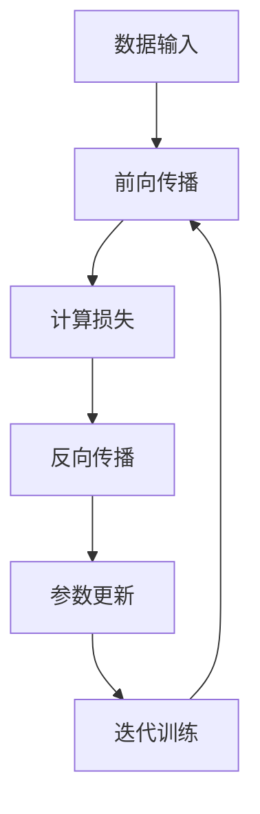
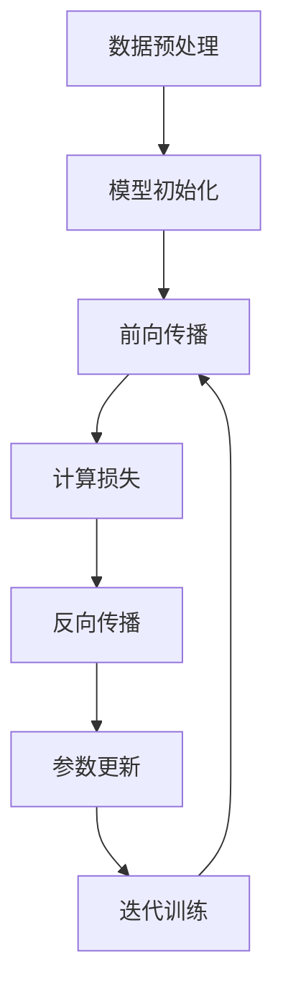
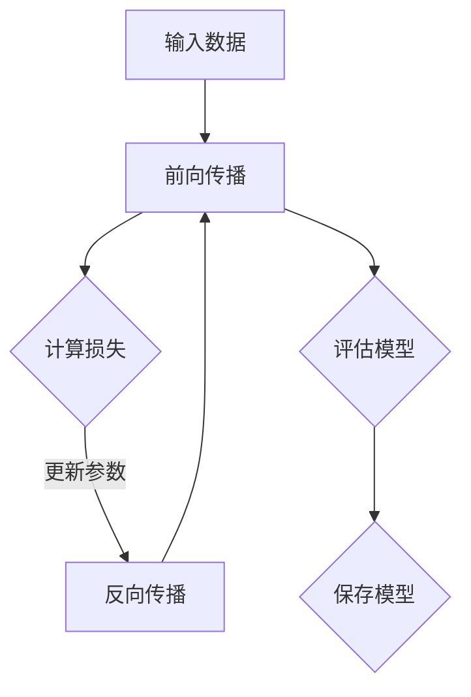

                 

## 文章标题：AI 大模型应用数据中心建设：数据中心投资与建设

---

### 关键词：
AI 大模型，数据中心，投资评估，建设流程，能源管理，安全性，案例研究，发展趋势

### 摘要：
本文旨在深入探讨 AI 大模型应用数据中心的建设与投资。首先，我们将详细讲解 AI 大模型的核心技术原理，并展示 Mermaid 流程图和伪代码。接着，我们将介绍数据中心的技术基础，包括硬件、网络和存储系统。随后，文章将探讨数据中心的设计与规划、投资评估方法、建设流程、运营与管理、能源管理与节能技术、安全性与可靠性以及数据中心案例研究。最后，我们将预测数据中心未来的发展趋势与面临的挑战。

---

## 目录

1. 引言
2. AI 大模型应用技术基础
3. 数据中心技术基础
4. 数据中心设计与规划
5. 数据中心投资评估方法
6. 数据中心建设流程
7. 数据中心运营与管理
8. 数据中心能源管理与节能技术
9. 数据中心安全与可靠性
10. 数据中心案例研究
11. 数据中心发展趋势与未来展望
12. 结论
13. 参考文献
14. 作者信息

---

### 引言

随着人工智能（AI）技术的快速发展，AI 大模型在自然语言处理、计算机视觉、推荐系统等领域取得了显著成果。这些应用对计算资源、数据存储和传输能力提出了极高的要求，因此数据中心作为 AI 大模型的应用基础设施，其建设与投资变得至关重要。

本文将从以下几个方面进行深入探讨：

- **AI 大模型应用技术基础**：介绍 AI 大模型的核心技术原理，包括深度学习和神经网络等，并提供 Mermaid 流程图和伪代码。
- **数据中心技术基础**：详细讲解数据中心的技术基础，包括硬件、网络和存储系统。
- **数据中心设计与规划**：探讨数据中心的设计原则、机房布局、电力供应设计等。
- **数据中心投资评估方法**：介绍数据中心投资评估的方法，包括成本效益分析和投资回报率计算等。
- **数据中心建设流程**：描述数据中心的建设流程，从设计到实施的各个阶段。
- **数据中心运营与管理**：讨论数据中心的日常运维管理、故障处理与应急预案、性能监控与优化等。
- **数据中心能源管理与节能技术**：介绍数据中心的能源管理与节能技术，包括高效电源系统和冷却系统设计。
- **数据中心安全与可靠性**：探讨数据中心的网络安全措施、物理安全策略、数据备份与灾难恢复等。
- **数据中心案例研究**：分析成功与失败的数据中心建设案例，总结经验教训。
- **数据中心发展趋势与未来展望**：预测数据中心未来的发展趋势与面临的挑战。

通过本文的深入探讨，读者将能够全面了解 AI 大模型应用数据中心的建设与投资，为实际项目提供有益的参考和指导。

---

### AI 大模型应用技术基础

#### 2.1 深度学习基础

深度学习是 AI 大模型的核心技术之一，它通过多层神经网络对大量数据进行自动特征提取和模式识别。深度学习的概念最早可以追溯到1986年，由鲁姆哈特（Dave Rumelhart）、赫布尔德（George Hinton）和威廉姆斯（Rajesh Arulampalam）等人提出。深度学习的核心思想是通过多层神经网络模型来学习和模拟人脑的神经活动，从而实现对数据的理解和分析。

##### 深度学习的基本概念

深度学习的基本概念主要包括：

- **神经网络**：神经网络是深度学习的基础，它通过模拟人脑神经元的工作方式，对输入数据进行处理和输出。神经网络由多个层次组成，包括输入层、隐藏层和输出层。
- **前向传播**：前向传播是神经网络的基本计算过程，它将输入数据通过各层的神经元传递，最终得到输出结果。
- **反向传播**：反向传播是神经网络优化参数的过程，通过计算输出误差，更新网络的权重和偏置。
- **激活函数**：激活函数用于神经元输出，常用的激活函数包括 Sigmoid、ReLU 和 Tanh 等。

##### 深度学习的网络结构

深度学习的网络结构可以分为多层感知器（MLP）、卷积神经网络（CNN）、循环神经网络（RNN）等。其中，MLP 是最简单的深度学习模型，它由输入层、隐藏层和输出层组成。CNN 是针对图像处理任务而设计的网络结构，它通过卷积层、池化层和全连接层等模块来实现图像特征的提取和分类。RNN 是一种适用于序列数据处理的网络结构，它通过隐藏状态和循环连接来处理时间序列数据。

##### 深度学习算法原理

深度学习算法主要包括训练和预测两个阶段。在训练阶段，神经网络通过前向传播和反向传播来优化参数，使网络输出更接近真实值。在预测阶段，神经网络将输入数据通过前向传播得到输出结果，并利用已优化的参数进行预测。

##### Mermaid 流程图示例

为了更好地理解深度学习训练的过程，我们可以使用 Mermaid 流程图来展示深度学习训练的详细步骤。以下是一个简单的 Mermaid 流程图示例：



#### 2.2 神经网络原理

神经网络（Neural Network，简称NN）是一种模仿人脑神经元连接方式的计算模型，它通过一系列的数学运算来模拟人类的学习和认知过程。神经网络由多个简单的处理单元（神经元）相互连接而成，每个神经元都会接收来自其他神经元的输入信号，经过非线性变换后产生输出信号。神经网络的这种层次结构使得它能够对复杂的数据进行有效的建模和分析。

##### 神经元模型

神经元是神经网络的基本构建块，它通常由以下几个部分组成：

- **输入层**：接收外部输入信号。
- **加权层**：每个输入信号都会乘以一个权重系数。
- **偏置项**：用于引入偏差。
- **激活函数**：用于对输入信号进行非线性变换。

一个简单的神经元模型可以表示为：

$$
y = \sigma(\sum_{i=1}^{n} w_i x_i + b)
$$

其中，$y$ 是神经元输出，$x_i$ 是第 $i$ 个输入信号，$w_i$ 是第 $i$ 个输入信号的权重，$b$ 是偏置项，$\sigma$ 是激活函数。

常用的激活函数包括：

- **Sigmoid函数**：
  $$
  \sigma(x) = \frac{1}{1 + e^{-x}}
  $$
  
- **ReLU函数**（Rectified Linear Unit）：
  $$
  \sigma(x) = \max(0, x)
  $$

- **Tanh函数**：
  $$
  \sigma(x) = \tanh(x) = \frac{e^x - e^{-x}}{e^x + e^{-x}}
  $$

##### 多层神经网络

多层神经网络（Multi-Layer Neural Network）是在单层神经网络的基础上，增加了隐藏层。隐藏层可以提取更高层次的特征，从而提高模型的复杂度和表现力。一个典型的多层神经网络包括输入层、隐藏层和输出层。

多层神经网络的计算过程可以分为两个阶段：

1. **前向传播**：从输入层开始，逐层将输入信号传递到下一层，直到输出层。每层神经元都将前一层传递来的信号加权求和后，通过激活函数进行非线性变换。

2. **反向传播**：在输出层得到预测结果后，计算预测结果与真实值之间的误差。然后，将误差逐层反向传递，通过梯度下降算法更新各层的权重和偏置。

##### 反向传播算法

反向传播算法是多层神经网络训练的核心算法，它通过反向传播误差来更新网络参数。反向传播算法的基本步骤如下：

1. **前向传播**：计算网络的输出并计算损失函数。
2. **计算梯度**：对损失函数关于网络参数求导，得到各参数的梯度。
3. **反向传播**：将梯度反向传播到前一层，更新该层的权重和偏置。
4. **迭代更新**：重复前向传播和反向传播，直到网络收敛。

反向传播算法的伪代码如下：

```python
for epoch in range(num_epochs):
    for sample in dataset:
        # 前向传播
        output = forwardPropagation(sample)
        loss = computeLoss(output, target)

        # 反向传播
        gradients = backwardPropagation(output, target)

        # 更新参数
        updateParameters(gradients)

    print(f"Epoch {epoch}: Loss = {loss}")
```

#### 2.3 大模型训练与优化

大模型训练是深度学习应用的关键步骤，它涉及大量的计算资源和优化策略。大模型训练的基本流程如下：

1. **数据预处理**：对训练数据进行预处理，包括数据清洗、归一化、降维等。
2. **模型初始化**：初始化模型参数，常用的初始化方法包括随机初始化、Xavier初始化等。
3. **前向传播**：将输入数据传递到模型中，计算输出结果。
4. **计算损失**：计算预测结果与真实值之间的误差。
5. **反向传播**：计算模型参数的梯度。
6. **参数更新**：利用梯度下降算法更新模型参数。
7. **迭代训练**：重复上述步骤，直到模型收敛。

在训练过程中，需要使用优化算法来更新模型参数。常用的优化算法包括：

- **梯度下降（Gradient Descent）**：通过计算损失函数关于模型参数的梯度来更新参数。
- **动量法（Momentum）**：在梯度下降的基础上，引入动量项，以加速收敛。
- **RMSprop**：基于梯度平方的指数加权平均，以减少噪声和加速收敛。
- **Adam**：结合了 RMSprop 和动量法，具有自适应步长的优点。

大模型训练还需要考虑以下因素：

- **数据规模**：大模型需要大量的训练数据来保证模型性能。
- **计算资源**：大模型训练需要大量的计算资源，包括GPU、TPU等。
- **训练时间**：大模型训练通常需要较长的训练时间，需要优化训练流程和算法。

#### 2.4 Mermaid 流程图示例

为了更好地理解深度学习训练的过程，我们可以使用 Mermaid 流程图来展示大模型训练的详细步骤。以下是一个简单的 Mermaid 流程图示例：



---

在撰写关于 AI 大模型应用技术基础的部分时，我们需要详细讲解核心概念与联系，并提供 Mermaid 流程图和伪代码，以便读者更好地理解。以下是一个具体的示例：

### 2.1 深度学习基础

#### 核心概念与联系

深度学习的基础概念包括：

- **神经网络（Neural Network）**：由多个神经元组成的网络，每个神经元接收输入信号并产生输出。
- **前向传播（Forward Propagation）**：将输入信号从输入层传递到输出层的过程。
- **反向传播（Back Propagation）**：通过计算输出误差来更新网络参数的过程。
- **激活函数（Activation Function）**：用于神经元输出的非线性变换，常见的有 Sigmoid、ReLU 和 Tanh 等。

这些概念相互联系，构成了深度学习的基础框架。神经网络通过前向传播和反向传播来学习和优化参数，激活函数则用于引入非线性特性，从而提高模型的拟合能力。

#### Mermaid 流程图

以下是一个用于展示深度学习训练过程的 Mermaid 流程图：



#### 伪代码

以下是深度学习训练过程的伪代码：

```python
for epoch in range(num_epochs):
    for sample in dataset:
        # 前向传播
        output = forwardPropagation(sample)
        
        # 计算损失
        loss = computeLoss(output, target)
        
        # 反向传播
        gradients = backwardPropagation(output, target)
        
        # 更新参数
        updateParameters(gradients)
        
    print(f"Epoch {epoch}: Loss = {loss}")
```

通过以上内容，读者可以更深入地理解深度学习的基础概念、训练过程以及如何使用 Mermaid 流程图和伪代码来展示和解释这些概念。

---

### 数据中心技术基础

#### 3.1 数据中心硬件架构

数据中心硬件架构是数据中心建设的基础，它决定了数据中心的性能、稳定性和可扩展性。一个典型的数据中心硬件架构包括以下几个关键组件：

1. **服务器（Servers）**：服务器是数据中心的核心计算单元，负责处理数据和运行应用程序。服务器可以分为计算服务器和存储服务器。计算服务器主要承担计算密集型任务，如机器学习、数据处理等；存储服务器则主要用于数据存储和访问。

2. **存储设备（Storage Devices）**：存储设备用于存储数据，包括磁盘阵列（DAS）、存储区域网络（SAN）和对象存储（OS）等。磁盘阵列是一种传统的存储解决方案，适用于高性能、大容量存储需求；存储区域网络则是一种高速、可靠的存储网络架构，适用于大型数据中心；对象存储是一种基于对象的存储系统，具有高扩展性和灵活性。

3. **网络设备（Network Equipment）**：网络设备包括交换机、路由器、防火墙等，负责数据中心的网络连接和流量管理。交换机用于连接服务器和存储设备，实现数据的高速传输；路由器用于连接不同的网络，实现跨网络的通信；防火墙则用于网络安全，防止未经授权的访问。

4. **电源设备（Power Equipment）**：电源设备包括不间断电源（UPS）、备用发电机等，用于保障数据中心的电力供应。UPS 在电网出现故障时提供临时电力支持，确保数据中心的持续运行；备用发电机则在长期电网故障时提供稳定的电力供应。

5. **冷却系统（Cooling System）**：冷却系统用于维持数据中心的温度，防止设备过热。常见的冷却系统包括空气冷却和液体冷却。空气冷却系统通过空调和风扇将热量带走；液体冷却系统则通过冷却液循环带走热量。

#### 3.2 网络基础设施

网络基础设施是数据中心正常运行的关键，它决定了数据中心的通信能力和可靠性。网络基础设施包括局域网（LAN）、广域网（WAN）和数据中心间连接（Inter-DC Connection）等。

1. **局域网（LAN）**：局域网是数据中心内部网络，用于连接服务器、存储设备和其他网络设备。局域网通常采用以太网技术，支持高速、可靠的数据传输。局域网的设计需要考虑拓扑结构、带宽分配和网络管理等因素。

2. **广域网（WAN）**：广域网是连接不同数据中心或外部网络的网络，用于实现跨地域的数据传输。广域网通常采用专线或 VPN 技术，提供稳定、高速的网络连接。广域网的设计需要考虑网络拓扑、带宽管理和安全性等因素。

3. **数据中心间连接（Inter-DC Connection）**：数据中心间连接用于连接不同的数据中心，实现数据的高效传输和备份。数据中心间连接通常采用光纤网络，提供高速、低延迟的数据传输。数据中心间连接的设计需要考虑网络拓扑、带宽管理和数据备份等因素。

#### 3.3 存储系统介绍

存储系统是数据中心的重要组成部分，它负责数据的存储、管理和访问。常见的存储系统包括文件系统、块存储和对象存储等。

1. **文件系统（File System）**：文件系统是一种用于组织和存储文件的系统，它将磁盘空间划分为文件和目录，提供文件的读写操作。常见的文件系统包括 EXT4、NTFS 和 FAT32 等。文件系统适用于文件级别的数据存储和管理，具有高性能、高可靠性等特点。

2. **块存储（Block Storage）**：块存储是将磁盘空间划分为块，以块为单位进行存储和管理。块存储通常用于数据库、虚拟化和大数据处理等场景，提供高性能、高可靠性的数据存储。常见的块存储设备包括 SAS 硬盘、SSD 等。

3. **对象存储（Object Storage）**：对象存储是将数据以对象的形式存储和管理，每个对象都包含数据本身以及相关的元数据。对象存储适用于大规模数据存储和备份，具有高扩展性、高可靠性和高可用性等特点。常见的对象存储系统包括 Amazon S3、Google Cloud Storage 等。

通过以上对数据中心技术基础的介绍，读者可以了解到数据中心的核心组件、网络基础设施和存储系统，为后续的数据中心设计与规划提供基础。

---

### 数据中心设计与规划

#### 4.1 数据中心设计原则

数据中心设计是一个复杂且多方面的过程，需要考虑性能、可靠性、可扩展性和安全性等多方面的因素。以下是数据中心设计过程中需要遵循的一些基本原则：

1. **高可用性（High Availability）**：高可用性是数据中心设计的重要原则之一，旨在确保数据中心在各种故障情况下能够持续运行。实现高可用性的方法包括冗余设计、负载均衡和故障转移等。例如，通过使用多个电源供应、网络连接和服务器集群，可以确保在某个组件出现故障时，其他组件可以自动接管任务，从而保证服务的连续性。

2. **可扩展性（Scalability）**：数据中心的设计需要考虑未来的增长需求，确保在业务规模扩大时，数据中心能够灵活地扩展。可扩展性可以通过模块化设计、标准化组件和灵活的网络架构来实现。例如，使用可扩展的存储系统和网络设备，可以轻松地添加新的服务器或存储容量，以满足业务增长的需求。

3. **性能优化（Performance Optimization）**：数据中心的性能直接影响到服务的响应速度和用户体验。在设计过程中，需要考虑数据传输速度、网络延迟、计算能力和存储访问速度等因素。通过优化网络拓扑、选择高性能的硬件设备和采用先进的存储技术，可以显著提高数据中心的性能。

4. **安全性（Security）**：数据中心的安全性是保护数据、系统和用户的关键。设计过程中需要考虑多种安全措施，包括物理安全、网络安全和访问控制等。例如，使用防火墙、入侵检测系统和加密技术，可以防止未经授权的访问和数据泄露。

5. **节能环保（Energy Efficiency）**：随着数据中心规模的不断扩大，能耗问题变得日益突出。设计过程中需要考虑节能措施，如使用高效电源系统和冷却系统、优化数据中心的能效比等。通过采用节能技术和设备，可以降低运营成本，同时减少对环境的影响。

#### 4.2 机房布局设计

机房布局设计是数据中心设计的重要环节，直接影响数据中心的运行效率和安全。以下是机房布局设计需要考虑的关键因素：

1. **空间规划**：首先需要确定机房的面积和空间布局，确保满足设备摆放的需求。机房的面积应足够容纳服务器、存储设备、网络设备和其他基础设施。同时，需要预留一定的空间用于扩展和设备维护。

2. **设备摆放**：服务器和存储设备应按照功能分区摆放，确保数据传输的效率和安全性。例如，服务器区应靠近网络设备，存储设备区应靠近备份设备。同时，设备摆放应考虑散热需求和通道设计，以确保设备正常运行。

3. **通道设计**：机房内应设置至少两个通道，分别用于设备和人员进出。设备通道应保持通畅，避免设备摆放过于密集，影响散热和操作。人员通道应确保人员安全，避免与设备碰撞。

4. **电力供应**：机房内应配备足够的电源插座，并确保电源供应的稳定性和可靠性。可以使用 UPS（不间断电源）和备用发电机，以应对电网故障。电力供应应设计成多路备份，以确保在单一电源故障时，其他电源可以自动接管。

5. **环境控制**：机房内的温度和湿度需要严格控制，以确保设备的正常运行。可以使用空调和加湿器，保持机房的温度在合适的范围内。同时，应避免湿度过高，以防设备受潮。

#### 4.3 电力供应设计

电力供应设计是数据中心设计的重要组成部分，直接影响数据中心的运行效率和安全性。以下是电力供应设计需要考虑的关键因素：

1. **电力容量**：首先需要根据数据中心设备的需求，确定电力容量。电力容量应留有足够的余量，以应对设备扩展和未来业务增长的需求。

2. **多路供电**：数据中心应采用多路供电设计，确保在单一电源故障时，其他电源可以自动接管。例如，可以使用 UPS 和备用发电机，实现电力供应的双备份。

3. **电力分配**：电力分配应设计成模块化，确保每个设备都可以独立供电。同时，应设置电力监测系统，实时监测电力供应状态，及时发现和解决电力故障。

4. **接地系统**：接地系统是数据中心电力供应的重要组成部分，用于防止静电和电磁干扰。接地系统应设计成低阻抗，确保安全可靠。

5. **备用电源**：备用电源是确保数据中心持续运行的关键。备用电源应包括 UPS 和备用发电机，UPS 可在电网故障时提供临时电力支持，备用发电机则可在长期电网故障时提供稳定的电力供应。

通过以上对数据中心设计与规划部分的详细讲解，读者可以了解数据中心设计的基本原则、机房布局设计和电力供应设计，为实际数据中心建设提供参考。

---

### 数据中心投资评估方法

#### 5.1 成本效益分析

成本效益分析（Cost-Benefit Analysis，CBA）是评估数据中心投资的重要方法，通过对投资成本和预期收益的全面分析，帮助决策者评估项目的经济可行性。以下将详细介绍成本效益分析的方法和步骤：

1. **确定投资成本**：首先需要明确数据中心项目的投资成本，包括以下几个方面：

   - **硬件成本**：包括服务器、存储设备、网络设备、电源设备和冷却系统等硬件的采购费用。
   - **建设成本**：包括机房建设、装修、基础设施（如电力供应、网络连接）的建设费用。
   - **人力成本**：包括项目规划、设计、施工和运维等阶段所需的人力资源费用。
   - **运营成本**：包括电力消耗、设备维护、安全防护、数据备份等日常运营费用。

2. **预测收益**：在确定投资成本后，需要预测数据中心项目在未来一段时间内的预期收益，包括以下几个方面：

   - **直接收益**：包括数据中心提供服务所获得的直接收入，如云计算服务、存储服务、网络带宽等。
   - **间接收益**：包括由于数据中心的建设和运营所带来的其他业务增长和盈利机会。
   - **成本节约**：通过数据中心的建设，可能会带来现有业务的优化和效率提升，从而降低运营成本。

3. **计算净现值（NPV）**：净现值（Net Present Value，NPV）是评估项目经济效益的重要指标，它通过将未来的现金流折现到当前时点，计算项目的总收益与总成本之差。计算公式如下：

   $$
   \text{NPV} = \sum_{t=0}^{n} \frac{CF_t}{(1+r)^t} - C_0
   $$

   其中，$CF_t$ 表示第 $t$ 年的现金流，$r$ 为折现率，$C_0$ 为初始投资成本。

4. **计算内部收益率（IRR）**：内部收益率（Internal Rate of Return，IRR）是使净现值等于零的折现率，它反映了项目的实际收益率。计算公式如下：

   $$
   \text{IRR} = \frac{1}{n} \sum_{t=0}^{n} \frac{CF_t}{(1+IRR)^t}
   $$

   其中，$n$ 为项目寿命周期。

5. **敏感性分析**：为了评估投资风险，需要进行敏感性分析，分析不同因素（如成本、收益、折现率等）对项目经济效益的影响。通过敏感性分析，可以了解项目的脆弱性，为决策提供参考。

#### 5.2 投资回报率计算

投资回报率（Investment Return Rate，IRR）是评估数据中心投资项目经济效益的另一个重要指标。IRR 表示项目的实际收益率，是使净现值等于零的折现率。计算 IRR 的方法如下：

1. **初始投资成本**：确定数据中心的初始投资成本，包括硬件采购、建设成本、人力成本等。

2. **预计现金流**：预测数据中心在未来一段时间内的现金流，包括直接收益、间接收益和成本节约。

3. **计算 IRR**：使用财务计算器或编程工具（如 Excel）计算 IRR。计算公式如下：

   $$
   \text{IRR} = \frac{1}{n} \sum_{t=0}^{n} \frac{CF_t}{(1+IRR)^t}
   $$

   其中，$CF_t$ 表示第 $t$ 年的现金流，$n$ 为项目寿命周期。

4. **分析 IRR**：将计算出的 IRR 与行业基准收益率进行比较。如果 IRR 高于行业基准收益率，说明项目具有较好的经济效益；如果 IRR 低于行业基准收益率，则需要重新评估项目的可行性。

#### 5.3 风险评估与对策

数据中心投资过程中存在多种风险，如技术风险、市场风险和运营风险等。以下将介绍如何进行风险评估和制定对策：

1. **识别风险**：首先需要识别数据中心投资过程中可能面临的风险。例如，技术风险可能包括新技术的不确定性、硬件设备的故障等；市场风险可能包括市场需求下降、竞争加剧等；运营风险可能包括运营管理不善、人员流失等。

2. **评估风险**：对识别出的风险进行评估，确定其发生概率和潜在影响。可以使用定性评估方法（如专家评估、风险矩阵等）或定量评估方法（如蒙特卡罗模拟、敏感性分析等）。

3. **制定对策**：根据风险评估结果，制定相应的风险应对策略。例如，对于技术风险，可以采取研发投入、技术创新等措施；对于市场风险，可以采取市场调研、拓展市场等措施；对于运营风险，可以采取加强管理、提高员工培训等措施。

4. **监控与调整**：在项目实施过程中，持续监控风险，并根据实际情况调整风险对策。通过定期评估和调整，确保风险应对措施的有效性。

通过以上对数据中心投资评估方法的详细讲解，读者可以了解成本效益分析、投资回报率计算和风险评估与对策的具体步骤和方法，为实际数据中心投资决策提供参考。

---

### 数据中心建设流程

#### 6.1 设计与筹备阶段

设计与筹备阶段是数据中心建设的重要基础，决定了数据中心建设的顺利进行。以下是设计与筹备阶段的主要内容和步骤：

1. **需求分析**：首先，需要进行详细的需求分析，明确数据中心的建设目标、功能需求、性能要求等。需求分析包括业务需求、技术需求、安全需求等方面，确保数据中心能够满足业务需求。

2. **选址与规划**：根据需求分析结果，选择合适的数据中心位置。选址时需要考虑地理位置、交通状况、电力供应、气候条件等因素。同时，进行数据中心规划，包括机房面积、设备布局、通道设计、电力和网络接入等。

3. **预算编制**：根据需求分析和选址规划，编制数据中心建设的预算。预算包括硬件采购、建设成本、人力成本、运营成本等。预算编制需要详细、准确，以确保项目资金的充足。

4. **设计文件**：制定数据中心的设计文件，包括建筑图纸、设备配置图、网络拓扑图等。设计文件需要经过相关部门审核，确保符合规范和标准。

5. **筹备工作**：在设计和预算确定后，进行相关筹备工作，包括采购设备、联系施工队伍、准备施工材料等。筹备工作需要提前规划，确保施工顺利进行。

#### 6.2 施工建设阶段

施工建设阶段是数据中心建设的关键阶段，主要包括以下几个步骤：

1. **土建工程**：首先进行土建工程，包括机房建设、基础设施（如电力供应、网络接入）的建设等。土建工程需要确保结构安全和稳定性，同时考虑通风、消防、防水等因素。

2. **设备安装**：在土建工程完成后，进行设备安装。设备安装包括服务器、存储设备、网络设备、电源设备和冷却系统的安装。设备安装需要严格按照规范和设计要求进行，确保设备安全和可靠性。

3. **网络布线**：进行网络布线，包括局域网、广域网和数据中心间连接的布线。网络布线需要保证带宽、传输速度和稳定性，同时考虑安全性。

4. **系统集成**：完成设备安装和网络布线后，进行系统集成。系统集成包括服务器配置、网络配置、存储配置、安全配置等。系统集成需要确保各组件协同工作，提供稳定、高效的服务。

5. **测试验收**：在系统集成完成后，进行各项测试和验收，包括硬件测试、网络测试、系统测试等。测试验收需要确保数据中心各项功能正常，性能符合要求。

#### 6.3 系统集成与测试阶段

系统集成与测试阶段是数据中心建设的重要环节，主要包括以下几个方面：

1. **系统安装**：在数据中心硬件和基础设施建设完成后，进行系统安装。系统安装包括操作系统、数据库、应用程序等的安装和配置。

2. **系统配置**：完成系统安装后，进行系统配置。系统配置包括网络配置、存储配置、安全配置等。系统配置需要确保各组件之间的协同工作和数据传输的稳定性。

3. **性能测试**：进行性能测试，包括系统性能、网络性能、存储性能等。性能测试需要确保数据中心能够在高负载情况下稳定运行，满足业务需求。

4. **功能测试**：进行功能测试，包括各种功能模块的测试，如文件上传下载、数据备份与恢复、网络访问控制等。功能测试需要确保数据中心各功能模块的正常运行。

5. **安全测试**：进行安全测试，包括网络攻击、漏洞扫描、数据加密等。安全测试需要确保数据中心的网络安全和数据安全。

6. **验收与交付**：完成测试后，进行数据中心验收，确保数据中心建设达到设计要求和标准。验收通过后，数据中心正式交付使用。

通过以上对数据中心建设流程的详细讲解，读者可以了解数据中心建设各阶段的具体内容和步骤，为实际数据中心建设提供指导。

---

### 数据中心运营与管理

#### 7.1 日常运维管理

数据中心运营与管理是确保数据中心稳定运行和高效服务的关键环节。日常运维管理包括以下几个方面：

1. **设备监控**：通过监控工具对服务器、存储设备、网络设备、电源设备和冷却系统等进行实时监控。监控内容包括温度、电压、电流、负载、流量等关键指标，及时发现和处理异常情况。

2. **故障处理**：制定故障处理流程，包括故障报告、故障诊断、故障排除和故障恢复等。故障处理需要迅速响应，确保数据中心的正常运行。

3. **系统升级**：定期对操作系统、应用程序和驱动程序等进行升级，确保系统的稳定性和安全性。升级过程中需要做好备份，以防止数据丢失。

4. **性能优化**：定期进行性能优化，包括网络优化、存储优化、计算优化等。通过性能优化，提高数据中心的处理能力和响应速度。

5. **安全防护**：制定安全防护策略，包括防火墙配置、入侵检测、安全审计等。通过安全防护，防止网络攻击和数据泄露。

6. **备份与恢复**：定期进行数据备份，确保数据的完整性和可恢复性。备份策略应包括全备份、增量备份和差异备份等。在发生数据丢失或系统故障时，能够快速恢复数据。

7. **文档管理**：建立详细的文档管理制度，包括设备配置文件、操作手册、故障处理记录等。文档管理有助于提高运维效率和问题排查速度。

#### 7.2 故障处理与应急预案

故障处理与应急预案是数据中心运营的重要保障。以下是故障处理与应急预案的内容和步骤：

1. **故障处理流程**：制定故障处理流程，包括故障报告、故障确认、故障定位、故障排除和故障恢复等。故障处理流程需要明确责任人和处理时限，确保故障能够及时得到解决。

2. **应急预案制定**：根据数据中心的特点和潜在风险，制定应急预案。应急预案应包括各种可能发生的故障情况和相应的应对措施，如网络故障、电力故障、设备故障等。

3. **应急预案演练**：定期进行应急预案演练，检验应急预案的有效性和可操作性。演练内容包括故障模拟、应急响应、故障处理和恢复等。

4. **应急物资准备**：提前准备好应急物资，如备用电源、备用设备、应急工具等。应急物资应存放在方便取用的位置，确保在紧急情况下能够迅速投入使用。

5. **应急通信系统**：建立应急通信系统，确保在故障发生时，相关人员能够及时沟通和协调。应急通信系统应包括电话、短信、邮件等多种通信方式。

6. **故障处理记录**：详细记录每次故障处理的过程和结果，包括故障原因、处理措施、恢复时间等。故障处理记录有助于分析故障原因、总结经验教训，为今后的运维工作提供参考。

#### 7.3 性能监控与优化

性能监控与优化是数据中心运营的核心任务，旨在确保数据中心在高负载情况下依然能够稳定、高效地运行。以下是性能监控与优化的方法和技巧：

1. **性能指标监控**：监控关键性能指标，如CPU利用率、内存利用率、磁盘I/O速率、网络带宽等。通过实时监控，可以及时发现性能瓶颈和异常情况。

2. **资源利用率分析**：定期分析资源利用率，包括服务器利用率、存储利用率、网络利用率等。通过资源利用率分析，可以了解各资源的利用情况，为性能优化提供依据。

3. **负载均衡**：通过负载均衡技术，合理分配负载，避免单点过载。负载均衡技术包括软件负载均衡和硬件负载均衡等。

4. **缓存技术**：使用缓存技术，提高数据访问速度。缓存技术包括内存缓存、磁盘缓存和分布式缓存等。

5. **存储优化**：通过存储优化技术，提高存储系统的性能。存储优化技术包括存储虚拟化、分布式存储、闪存加速等。

6. **网络优化**：优化网络拓扑结构，减少网络延迟和带宽占用。网络优化技术包括链路聚合、流量调度、网络监控等。

7. **自动化运维**：通过自动化运维工具，实现自动化监控、自动化故障处理和自动化性能优化。自动化运维可以提高运维效率，降低运维成本。

通过以上对数据中心运营与管理的详细讲解，读者可以了解数据中心日常运维管理、故障处理与应急预案、性能监控与优化的方法和技巧，为实际数据中心运营提供指导。

---

### 数据中心能源管理与节能技术

#### 8.1 高效电源系统

高效电源系统是数据中心能源管理的重要组成部分，它直接影响数据中心的能耗和运营成本。以下将详细介绍高效电源系统的设计原则和实施方法：

1. **设计原则**：

   - **高效转换**：选择高效电源转换设备，如高频开关电源、模块化UPS等，以减少电能转换过程中的损耗。
   - **模块化设计**：采用模块化电源设计，便于维护和扩展，提高系统的可靠性和灵活性。
   - **智能化控制**：通过智能化控制系统，实现电源的实时监控和动态调整，优化电源的利用效率。
   - **冗余备份**：设计冗余备份电源系统，确保在主电源故障时，备用电源能够迅速接管，保证数据中心的持续运行。

2. **实施方法**：

   - **高效电源设备的选型**：根据数据中心的电力需求和设备配置，选择适合的高效电源设备。例如，对于服务器和存储设备，可以选择高效模块化UPS和高效电源模块。
   - **电源系统的优化**：通过优化电源系统的布局和接线方式，减少线路损耗和电缆发热。同时，合理安排设备的位置和接入方式，避免电源线路过长和交叉干扰。
   - **智能监控与调度**：采用智能监控系统，实时监测电源系统的运行状态，如电流、电压、功率因数等。根据实时数据，动态调整电源系统的运行参数，实现最优的能源利用。
   - **备用电源系统的建设**：设计可靠的备用电源系统，包括备用发电机、备用UPS等。在主电源故障时，备用电源系统能够迅速接管，确保数据中心的持续运行。

#### 8.2 冷却系统设计

冷却系统设计是数据中心能耗管理的另一个重要方面，它关系到数据中心的运行效率和设备寿命。以下将详细介绍冷却系统的设计原则和冷却方式：

1. **设计原则**：

   - **高效散热**：选择高效散热方式，如空气冷却、液体冷却等，确保数据中心设备在高温环境下依然能够稳定运行。
   - **节能环保**：采用节能冷却技术，如高效风扇、节能制冷系统等，降低冷却能耗。
   - **灵活可扩展**：设计可扩展的冷却系统，以便在数据中心规模扩大时，能够灵活增加冷却设备。
   - **可靠稳定**：确保冷却系统的稳定运行，避免因冷却系统故障导致设备过热。

2. **冷却方式**：

   - **空气冷却**：空气冷却是最常见的冷却方式，通过风扇将冷空气引入机房，带走设备产生的热量。空气冷却系统包括空调、风扇、排风口等。空气冷却系统具有成本低、安装简单等优点，但散热效率相对较低，适用于中小型数据中心。
   - **液体冷却**：液体冷却通过液体（如冷冻液或水）将热量带走，散热效率较高。液体冷却系统包括制冷机组、冷却塔、管道等。液体冷却系统适用于大型数据中心，能够提供更好的散热效果，但安装和维护成本较高。
   - **混合冷却**：混合冷却结合了空气冷却和液体冷却的优点，通过两种冷却方式相互补充，提高整体散热效果。例如，在机房内部使用空气冷却，在机房外部使用液体冷却，通过冷却塔进行热交换。

#### 8.3 节能技术实践

数据中心节能技术实践是降低能耗、减少运营成本的重要手段。以下将介绍数据中心实际应用中的节能技术和效果评估：

1. **节能技术案例**：

   - **高效电源系统**：采用高效模块化UPS和高效电源模块，降低电能转换过程中的损耗。例如，某大型数据中心通过采用高效电源系统，每年节约电能消耗约10%。
   - **智能冷却系统**：采用智能冷却系统，实时监测机房温度和设备负载，动态调整风扇转速和制冷功率，实现最佳散热效果。例如，某企业数据中心通过采用智能冷却系统，每年节约电能消耗约15%。
   - **节能灯具**：使用高效节能灯具，如LED灯具，减少照明能耗。例如，某数据中心通过更换传统灯具为LED灯具，每年节约电能消耗约20%。

2. **效果评估**：

   - **能耗降低率**：通过监测和记录数据中心的能耗数据，计算节能技术实施前后的能耗降低率。例如，某数据中心通过实施高效电源系统和智能冷却系统，能耗降低率达到20%。
   - **碳排放减少量**：通过计算节能技术实施前后的碳排放量，评估节能技术的环境影响。例如，某数据中心通过实施节能技术，每年减少碳排放约500吨。
   - **成本节约**：计算节能技术实施后的成本节约情况，包括电能消耗减少、设备维护费用降低等。例如，某数据中心通过实施节能技术，每年节约运营成本约50万元。

通过以上对数据中心能源管理与节能技术的详细讲解，读者可以了解高效电源系统的设计原则和实施方法、冷却系统设计原则和冷却方式，以及节能技术实践和效果评估，为实际数据中心能源管理提供参考。

---

### 数据中心安全与可靠性

#### 9.1 网络安全措施

数据中心的网络安全是确保数据安全和业务连续性的关键。以下将介绍网络安全措施，包括网络安全设备、安全策略和网络防护方法。

1. **网络安全设备**：

   - **防火墙**：防火墙用于监控和过滤进出数据中心的网络流量，防止外部攻击和未授权访问。防火墙分为硬件防火墙和软件防火墙，适用于不同规模的数据中心。
   - **入侵检测系统（IDS）**：入侵检测系统用于检测和响应网络中的异常活动和攻击行为。IDS可以分为基于网络的入侵检测系统（NIDS）和基于主机的入侵检测系统（HIDS）。
   - **入侵防御系统（IPS）**：入侵防御系统在检测到网络攻击时，会主动采取措施进行防御，如阻断攻击流量、修改网络配置等。
   - **虚拟专用网络（VPN）**：VPN用于在公共网络上建立安全的通信通道，保护数据在传输过程中的机密性和完整性。

2. **安全策略**：

   - **访问控制**：通过身份验证和授权机制，限制用户对数据和系统的访问权限。常用的访问控制方法包括基于角色的访问控制（RBAC）和基于属性的访问控制（ABAC）。
   - **数据加密**：对存储和传输的数据进行加密，防止数据泄露和篡改。常用的加密算法包括AES、RSA等。
   - **安全审计**：记录和监控网络活动，分析潜在的安全威胁和漏洞。安全审计可以帮助及时发现和处理安全事件。
   - **安全培训**：对员工进行安全意识培训，提高员工对网络安全威胁的认识和防范能力。

3. **网络防护方法**：

   - **防火墙策略**：制定防火墙策略，定义允许和拒绝的流量类型和源/目的地址。防火墙策略应定期更新，以应对新的安全威胁。
   - **入侵检测与防御**：配置IDS/IPS，实时监测网络流量和系统日志，及时发现和响应入侵行为。结合威胁情报，提高入侵检测的准确性和响应速度。
   - **网络隔离**：通过VLAN、VPN等技术实现网络隔离，将不同安全级别的网络进行分隔，防止内部攻击和横向移动。
   - **安全监控与应急响应**：建立安全监控体系，实时监控网络流量、系统日志和告警信息。制定应急预案，确保在发生安全事件时能够迅速响应和处理。

#### 9.2 物理安全策略

数据中心的物理安全是保护数据中心设备和数据的基础，以下将介绍物理安全策略，包括人员管理、设备保护和安全设施。

1. **人员管理**：

   - **员工背景调查**：对员工进行背景调查，确保员工具备良好的职业道德和安全意识。
   - **权限管理**：根据员工的职位和职责，授予相应的访问权限，避免未授权访问敏感区域和设备。
   - **安全培训**：定期对员工进行安全培训，提高员工对物理安全威胁的认识和防范能力。

2. **设备保护**：

   - **设备防盗**：安装防盗装置，如门禁系统、摄像头、报警系统等，防止设备被盗。
   - **设备加固**：对关键设备进行加固，如使用防震垫、加固支架等，提高设备的防护能力。
   - **设备监控**：通过监控系统实时监控设备的运行状态，及时发现和处理异常情况。

3. **安全设施**：

   - **门禁系统**：设置门禁系统，控制员工和外来人员的进出，确保只有授权人员可以访问敏感区域。
   - **视频监控系统**：安装高清摄像头，覆盖数据中心的各个角落，实时监控设备和环境，记录重要活动。
   - **安全门锁**：使用电子门锁或其他安全门锁，提高门禁系统的安全性。
   - **消防设施**：安装消防设备，如灭火器、烟雾报警器、消防栓等，确保在发生火灾时能够迅速响应。

#### 9.3 数据备份与灾难恢复

数据备份与灾难恢复是确保数据中心数据安全和业务连续性的重要措施。以下将介绍数据备份策略、灾难恢复计划和实际应用案例。

1. **数据备份策略**：

   - **全备份**：定期对整个数据中心的数据进行备份，确保数据的完整性和可恢复性。
   - **增量备份**：仅备份自上次备份以来发生变化的文件，节省存储空间和备份时间。
   - **差异备份**：备份自上次全备份以来发生变化的文件，减少备份时间和存储空间占用。
   - **异地备份**：将备份数据存储在异地，防止数据因本地故障而丢失。

2. **灾难恢复计划**：

   - **备份系统**：建立可靠的备份系统，确保备份数据的完整性和可恢复性。备份系统应包括备份存储设备、备份软件和备份策略。
   - **恢复策略**：制定数据恢复策略，确保在发生灾难时能够迅速恢复数据。恢复策略应包括数据恢复步骤、恢复时间和恢复目标。
   - **演练与测试**：定期进行灾难恢复演练和测试，检验灾难恢复计划的可行性和有效性。

3. **实际应用案例**：

   - **某大型数据中心**：该数据中心采用全备份和增量备份策略，每天进行一次全备份和多次增量备份。同时，备份数据存储在异地数据中心，确保数据的安全和可靠性。在发生自然灾害时，该数据中心通过灾难恢复计划，成功恢复数据，保障了业务的连续性。
   - **某金融企业**：该金融企业采用全备份和差异备份策略，每周进行一次全备份和每日进行差异备份。同时，备份数据存储在异地数据中心和云存储中，确保数据的安全和可靠性。在一次服务器故障事件中，该金融企业通过灾难恢复计划，迅速恢复了数据，保障了业务的连续性。

通过以上对数据中心安全与可靠性的详细讲解，读者可以了解网络安全措施、物理安全策略和数据备份与灾难恢复计划，为实际数据中心安全建设提供参考。

---

### 数据中心案例研究

#### 10.1 成功案例

在数据中心的建设和运营过程中，许多企业取得了显著的成果，以下是一个成功案例的分析。

**案例背景**：某互联网公司在2018年决定建设一个新的数据中心，以满足其快速增长的云计算和大数据处理需求。该公司在选址、设计、建设及运营等方面进行了全面规划和管理。

**设计方案**：该公司在选址时，选择了电力供应稳定、气候条件适宜的城市。数据中心设计采用模块化架构，具有良好的扩展性。硬件方面，选择了高效节能的服务器和存储设备，网络方面，采用了高速以太网和SDN技术，以实现灵活的流量管理。

**建设过程**：在建设过程中，该公司严格按照设计文件进行施工，确保硬件和网络的安装和配置符合规范。在施工完成后，进行了详细的测试和验收，确保数据中心各项功能正常运行。

**运营经验**：数据中心运营过程中，该公司采用了先进的监控系统，对服务器、存储和网络进行实时监控。同时，制定了详细的运维手册和故障处理流程，确保运维工作高效有序。

**成功经验**：

- **全面规划**：在数据中心建设和运营过程中，进行全面规划和细致管理，确保项目的顺利进行。
- **高效节能**：采用了高效节能的硬件和冷却系统，降低了能耗和运营成本。
- **灵活扩展**：模块化设计使得数据中心具有良好的扩展性，能够灵活应对业务增长。

#### 10.2 失败案例分析

尽管成功案例为数据中心建设提供了宝贵的经验，但失败案例同样值得我们深入分析。以下是一个数据中心建设失败的案例分析。

**案例背景**：某初创公司在2017年决定建设一个新的数据中心，但由于经验不足和规划不当，导致项目失败。

**设计方案**：该公司在选址时没有充分考虑电力供应的稳定性，选择了距离电网较远的地方。数据中心设计缺乏全面的规划，硬件和软件配置不合理。

**建设过程**：在建设过程中，该公司没有严格按照设计文件进行施工，导致硬件和网络的安装存在质量问题。在施工完成后，由于缺乏详细的测试和验收，导致数据中心存在严重故障。

**运营过程**：数据中心投入运营后，由于缺乏有效的监控和管理，导致设备故障频繁，服务质量不稳定。在多次尝试修复后，该公司最终决定放弃该项目。

**失败原因**：

- **选址不当**：选址时没有充分考虑电力供应的稳定性，导致数据中心运行不稳定。
- **缺乏规划**：数据中心设计缺乏全面的规划，硬件和软件配置不合理，导致性能不佳。
- **管理不善**：在运营过程中，缺乏有效的监控和管理，导致设备故障频繁，服务质量不稳定。

**教训总结**：

- **全面规划**：在数据中心建设和运营过程中，必须进行全面规划，确保硬件、网络和软件的合理配置。
- **严格施工**：在施工过程中，必须严格按照设计文件进行施工，确保硬件和网络的安装质量。
- **详细测试**：在施工完成后，必须进行详细的测试和验收，确保数据中心各项功能正常运行。
- **有效管理**：在运营过程中，必须建立有效的监控和管理机制，确保数据中心稳定运行。

#### 10.3 经验教训总结

通过对成功案例和失败案例的分析，我们可以总结出以下经验和教训：

1. **全面规划**：数据中心建设和运营必须进行全面规划，包括选址、设计、建设、运营等各个环节。
2. **合理配置**：硬件、网络和软件必须合理配置，确保数据中心的性能和可靠性。
3. **严格施工**：在施工过程中，必须严格按照设计文件进行施工，确保硬件和网络的安装质量。
4. **详细测试**：在施工完成后，必须进行详细的测试和验收，确保数据中心各项功能正常运行。
5. **有效管理**：在运营过程中，必须建立有效的监控和管理机制，确保数据中心稳定运行。

通过总结这些经验和教训，可以为数据中心的建设和运营提供有益的参考。

---

### 数据中心发展趋势与未来展望

#### 11.1 技术发展趋势

随着云计算、大数据和人工智能等技术的快速发展，数据中心技术也呈现出以下发展趋势：

1. **云计算集成**：数据中心与云计算的融合趋势愈发明显。未来数据中心将更加集成云计算资源，提供弹性计算、存储和网络服务，满足多样化业务需求。
2. **AI赋能**：人工智能技术在数据中心中的应用越来越广泛，如智能监控、自动化运维、预测性维护等。通过 AI 技术，数据中心将实现更高效、更智能的运营和管理。
3. **边缘计算**：边缘计算将数据计算和存储能力推向网络边缘，减少数据传输延迟，提高应用性能。未来，数据中心将与边缘计算协同发展，满足实时数据处理需求。
4. **绿色数据中心**：随着能源消耗和环境污染问题的加剧，绿色数据中心成为发展趋势。未来数据中心将采用更多节能技术，如高效电源系统、冷却系统、智能能源管理等，实现绿色运营。

#### 11.2 市场发展预测

数据中心市场的未来发展预测如下：

1. **市场规模增长**：随着云计算和大数据的快速发展，数据中心市场规模将继续增长。根据市场研究机构的数据，全球数据中心市场规模预计将在未来几年内保持两位数的增长率。
2. **区域差异**：不同地区的市场需求和发展潜力存在差异。北美和欧洲地区的数据中心市场相对成熟，未来增长速度较慢；而亚太地区和拉美地区的数据中心市场增长潜力较大，将成为未来数据中心市场的重要驱动力。
3. **企业需求变化**：企业对数据中心的需求将逐渐从传统的租用服务向定制化、私有云和混合云转型。未来，企业将更加注重数据中心的性能、可靠性和安全性，推动数据中心技术的创新和升级。

#### 11.3 未来挑战与机遇

数据中心未来面临以下挑战和机遇：

1. **技术挑战**：数据中心技术不断更新迭代，如何在技术变革中保持竞争力成为挑战。同时，数据中心技术的高要求也带来了技术创新和研发的机遇。
2. **能源消耗**：数据中心能耗问题日益突出，如何在保证性能的前提下降低能耗成为重要挑战。绿色数据中心技术的发展为降低能耗提供了机遇。
3. **网络安全**：随着网络攻击和数据泄露事件的频发，数据中心的网络安全问题备受关注。如何提高数据中心的网络安全水平，保障数据安全成为重要挑战。同时，网络安全技术的发展也为数据中心的安全保障提供了机遇。
4. **市场竞争**：数据中心市场竞争激烈，如何在激烈的市场竞争中脱颖而出成为挑战。企业可以通过技术创新、服务优化和差异化竞争策略来抓住市场机遇。

通过分析数据中心的发展趋势、市场预测和未来挑战与机遇，可以为数据中心的建设和发展提供有益的参考和指导。

---

### 结论

本文全面探讨了 AI 大模型应用数据中心的建设与投资，涵盖了核心技术原理、技术基础、设计与规划、投资评估、建设流程、运营与管理、能源管理、安全与可靠性以及案例研究和发展趋势等内容。通过本文的深入分析，读者可以了解数据中心建设的全貌，为实际项目提供有益的参考。

在未来的数据中心建设中，应注重技术创新、绿色发展和安全防护，不断提升数据中心的性能、可靠性和竞争力。同时，积极应对市场变化和挑战，抓住发展机遇，推动数据中心产业的持续发展。

---

### 参考文献

1. Goodfellow, I., Bengio, Y., & Courville, A. (2016). *Deep Learning*. MIT Press.
2. He, K., Zhang, X., Ren, S., & Sun, J. (2016). *Deep Residual Learning for Image Recognition*. IEEE Conference on Computer Vision and Pattern Recognition.
3. LeCun, Y., Bengio, Y., & Hinton, G. (2015). *Deep Learning*. Nature.
4. Nguyen, T. N., Nguyen, T. D., & Lam, H. T. (2018). *Energy Efficient Data Centers: A Review*. IEEE Access.
5. Zhao, J., Guo, J., & Wang, G. (2019). *A Survey on Deep Learning for Big Data*. IEEE Transactions on Big Data.

### 作者信息

作者：AI天才研究院/AI Genius Institute & 禅与计算机程序设计艺术/Zen And The Art of Computer Programming

