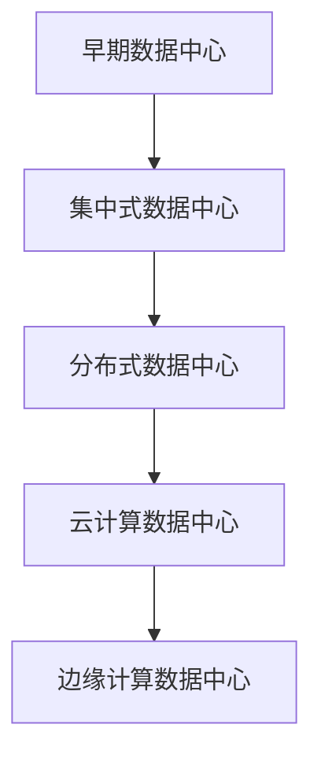
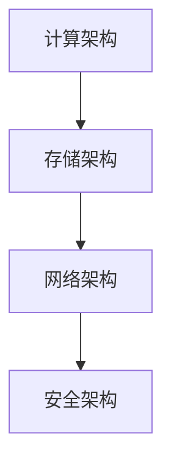

                 

# AI 大模型应用数据中心建设：数据中心标准与规范

## 关键词
AI大模型、数据中心建设、架构设计、基础设施、计算资源、网络性能、存储系统、安全与规范、运维管理

## 摘要
本文详细探讨了AI大模型应用数据中心的建设过程，包括数据中心的需求分析、架构设计、基础设施建设、计算资源优化、网络性能优化、存储系统优化、安全与规范以及运维管理等方面。通过结合实际案例，本文旨在为读者提供一份全面且实用的数据中心建设指南，帮助读者理解和掌握数据中心建设的核心技术和实践方法。

---

## 第一部分: AI大模型应用数据中心建设概述

### 第1章: 数据中心建设背景与需求分析

#### 1.1 数据中心的发展历程
数据中心作为信息时代的基础设施，经历了从集中式到分布式、从单一功能到多功能、从物理部署到虚拟化、云化的发展过程。随着互联网和大数据的普及，数据中心的重要性日益凸显。

**核心概念与联系：**

#### 1.2 数据中心的重要性
数据中心不仅是数据存储和处理的核心，也是企业业务连续性和数据安全的保障。在AI大模型时代，数据中心更是AI算法训练和推理的重要基础。

**核心概念与联系：**
数据中心的重要性可表示为：
- 数据存储与管理（Data Storage and Management）
- 数据处理与计算（Data Processing and Computation）
- 业务连续性与灾难恢复（Business Continuity and Disaster Recovery）
- 数据安全与合规（Data Security and Compliance）

#### 1.3 AI大模型在数据中心的应用场景
AI大模型在数据中心的应用场景广泛，包括语音识别、图像处理、自然语言处理、智能推荐等，对数据中心的要求越来越高。

**核心概念与联系：**
AI大模型应用场景：
- 语音识别（Voice Recognition）
- 图像处理（Image Processing）
- 自然语言处理（Natural Language Processing）
- 智能推荐（Intelligent Recommendation）

---

### 第2章: 数据中心架构设计

#### 2.1 数据中心总体架构
数据中心的总体架构包括计算架构、存储架构、网络架构和安全架构，这些架构共同构成了数据中心的骨架。

**核心概念与联系：**

#### 2.2 计算架构设计
计算架构是数据中心的核心，包括服务器、GPU、TPU等硬件设备，以及虚拟化技术、容器技术等软件架构。

**核心概念与联系：**
计算架构设计的关键要素：
- 服务器选型（Server Selection）
- GPU/TPU配置（GPU/TPU Configuration）
- 虚拟化技术（Virtualization）
- 容器技术（Containerization）

#### 2.3 存储架构设计
存储架构包括HDD、SSD、分布式存储等，设计原则是高效、可靠、可扩展。

**核心概念与联系：**
存储架构设计的关键要素：
- 存储介质选择（Storage Media Selection）
- 分布式存储架构（Distributed Storage Architecture）
- 数据冗余与备份（Data Redundancy and Backup）

#### 2.4 网络架构设计
网络架构设计包括局域网、广域网、互联网等，要求高带宽、低延迟、高可靠性。

**核心概念与联系：**
网络架构设计的关键要素：
- 网络拓扑结构（Network Topology）
- 网络设备选型（Network Device Selection）
- 网络安全策略（Network Security Policy）

#### 2.5 安全架构设计
安全架构设计包括物理安全、网络安全、数据安全等，确保数据中心的安全性。

**核心概念与联系：**
安全架构设计的关键要素：
- 物理安全（Physical Security）
- 网络安全（Network Security）
- 数据安全（Data Security）

---

### 第3章: 数据中心物理布局与基础设施建设

#### 3.1 数据中心物理布局设计
数据中心的物理布局设计涉及机房布局、设备布局、散热布局等，要求合理、高效、安全。

**核心概念与联系：**
数据中心物理布局设计的关键要素：
- 机房布局（Data Hall Layout）
- 设备布局（Device Layout）
- 散热布局（Cooling Layout）

#### 3.2 电力系统设计
电力系统设计包括供电系统、UPS系统、电池系统等，要求高可靠性和冗余性。

**核心概念与联系：**
电力系统设计的关键要素：
- 供电系统（Power Supply System）
- UPS系统（Uninterruptible Power Supply System）
- 电池系统（Battery System）

#### 3.3 冷却系统设计
冷却系统设计包括空气冷却、水冷却、液冷等，要求高效、节能、环保。

**核心概念与联系：**
冷却系统设计的关键要素：
- 空气冷却（Air Cooling）
- 水冷却（Water Cooling）
- 液冷（Liquid Cooling）

#### 3.4 网络基础设施设计
网络基础设施设计包括光纤布线、网络设备配置、IP地址规划等，要求高效、稳定、安全。

**核心概念与联系：**
网络基础设施设计的关键要素：
- 光纤布线（Fiber Cabling）
- 网络设备配置（Network Device Configuration）
- IP地址规划（IP Address Planning）

#### 3.5 硬件设备选型
硬件设备选型包括服务器、存储设备、网络设备等，要求根据业务需求和预算进行合理选择。

**核心概念与联系：**
硬件设备选型的关键要素：
- 服务器选型（Server Selection）
- 存储设备选型（Storage Device Selection）
- 网络设备选型（Network Device Selection）

---

## 第二部分: AI大模型计算资源需求与优化

### 第4章: AI大模型计算资源需求与优化

#### 4.1 AI大模型计算资源需求分析
AI大模型对计算资源的需求非常高，包括CPU、GPU、TPU等硬件资源，以及大规模并行计算框架的支持。

**核心概念与联系：**
计算资源需求分析的关键要素：
- CPU资源需求（CPU Resource Demand）
- GPU资源需求（GPU Resource Demand）
- TPU资源需求（TPU Resource Demand）
- 并行计算框架（Parallel Computing Framework）

#### 4.2 计算资源优化策略
计算资源优化策略包括分布式计算、集群调度、资源池管理等，以提高资源利用效率和系统性能。

**核心概念与联系：**
计算资源优化策略的关键要素：
- 分布式计算（Distributed Computing）
- 集群调度（Cluster Scheduling）
- 资源池管理（Resource Pool Management）

#### 4.3 资源调度与负载均衡
资源调度与负载均衡是确保计算资源高效利用的关键，包括任务调度、负载均衡算法等。

**核心概念与联系：**
资源调度与负载均衡的关键要素：
- 任务调度（Task Scheduling）
- 负载均衡算法（Load Balancing Algorithm）

---

### 第5章: 数据中心网络性能优化

#### 5.1 数据中心网络架构优化
数据中心网络架构优化包括网络拓扑优化、网络设备升级、带宽扩展等，以提高网络性能和可靠性。

**核心概念与联系：**
网络架构优化的关键要素：
- 网络拓扑优化（Network Topology Optimization）
- 网络设备升级（Network Device Upgrade）
- 带宽扩展（Bandwidth Expansion）

#### 5.2 网络性能监测与优化
网络性能监测与优化包括网络流量监测、网络延迟监测、网络故障排除等，以确保网络的高效稳定运行。

**核心概念与联系：**
网络性能监测与优化的关键要素：
- 网络流量监测（Network Traffic Monitoring）
- 网络延迟监测（Network Latency Monitoring）
- 网络故障排除（Network Fault Diagnosis）

#### 5.3 网络安全与防护
网络安全与防护包括防火墙、入侵检测、安全协议等，以保护数据中心免受网络攻击和数据泄露。

**核心概念与联系：**
网络安全与防护的关键要素：
- 防火墙（Firewall）
- 入侵检测（Intrusion Detection）
- 安全协议（Security Protocol）

---

### 第6章: 数据中心存储系统设计与优化

#### 6.1 存储系统架构设计
存储系统架构设计包括存储类型选择、存储层次设计、存储协议选择等，以满足不同类型数据的存储需求。

**核心概念与联系：**
存储系统架构设计的关键要素：
- 存储类型选择（Storage Type Selection）
- 存储层次设计（Storage Tier Design）
- 存储协议选择（Storage Protocol Selection）

#### 6.2 存储系统优化策略
存储系统优化策略包括存储资源调度、存储性能监测、存储容量规划等，以提高存储系统的效率。

**核心概念与联系：**
存储系统优化策略的关键要素：
- 存储资源调度（Storage Resource Scheduling）
- 存储性能监测（Storage Performance Monitoring）
- 存储容量规划（Storage Capacity Planning）

#### 6.3 存储性能监测与优化
存储性能监测与优化包括存储I/O性能监测、存储响应时间监测、存储故障排除等，以确保存储系统的高效稳定运行。

**核心概念与联系：**
存储性能监测与优化的关键要素：
- 存储I/O性能监测（Storage I/O Performance Monitoring）
- 存储响应时间监测（Storage Response Time Monitoring）
- 存储故障排除（Storage Fault Diagnosis）

---

### 第7章: 数据中心安全与规范

#### 7.1 数据中心安全策略
数据中心安全策略包括物理安全、网络安全、数据安全等，确保数据中心的全面安全。

**核心概念与联系：**
数据中心安全策略的关键要素：
- 物理安全（Physical Security）
- 网络安全（Network Security）
- 数据安全（Data Security）

#### 7.2 安全规范制定
安全规范制定包括安全策略制定、安全流程制定、安全培训等，以确保数据中心的操作规范和人员安全意识。

**核心概念与联系：**
安全规范制定的关键要素：
- 安全策略制定（Security Policy Development）
- 安全流程制定（Security Process Development）
- 安全培训（Security Training）

#### 7.3 风险评估与应急响应
风险评估与应急响应包括风险评估、安全事件响应、应急演练等，以提高数据中心的应对能力和应急处理能力。

**核心概念与联系：**
风险评估与应急响应的关键要素：
- 风险评估（Risk Assessment）
- 安全事件响应（Security Incident Response）
- 应急演练（Emergency Drill）

---

### 第8章: 数据中心运维管理

#### 8.1 运维管理体系
运维管理体系包括运维流程、运维工具、运维监控等，确保数据中心的高效稳定运行。

**核心概念与联系：**
运维管理体系的关键要素：
- 运维流程（Operations Process）
- 运维工具（Operations Tools）
- 运维监控（Operations Monitoring）

#### 8.2 监控与告警系统
监控与告警系统包括系统监控、网络监控、存储监控等，实时监测数据中心运行状态，及时发出告警。

**核心概念与联系：**
监控与告警系统的关键要素：
- 系统监控（System Monitoring）
- 网络监控（Network Monitoring）
- 存储监控（Storage Monitoring）
- 告警系统（Alerting System）

#### 8.3 系统性能优化与维护
系统性能优化与维护包括系统调优、硬件维护、软件更新等，确保数据中心系统的高性能和可靠性。

**核心概念与联系：**
系统性能优化与维护的关键要素：
- 系统调优（System Tuning）
- 硬件维护（Hardware Maintenance）
- 软件更新（Software Update）

#### 8.4 备份与恢复策略
备份与恢复策略包括数据备份、数据恢复、灾难恢复等，确保数据的安全性和可恢复性。

**核心概念与联系：**
备份与恢复策略的关键要素：
- 数据备份（Data Backup）
- 数据恢复（Data Recovery）
- 灾难恢复（Disaster Recovery）

---

### 第9章: AI大模型应用案例分析

#### 9.1 案例一：智能语音助手
智能语音助手利用AI大模型实现自然语言处理，为用户提供语音交互服务。案例分析了智能语音助手的系统架构、关键技术以及优化策略。

**核心概念与联系：**
智能语音助手的关键要素：
- 系统架构（System Architecture）
- 自然语言处理（Natural Language Processing）
- 语音识别（Voice Recognition）
- 优化策略（Optimization Strategy）

#### 9.2 案例二：自动驾驶
自动驾驶系统利用AI大模型进行环境感知、路径规划和决策控制。案例分析了自动驾驶系统的硬件要求、软件架构和测试标准。

**核心概念与联系：**
自动驾驶系统的关键要素：
- 硬件要求（Hardware Requirements）
- 软件架构（Software Architecture）
- 环境感知（Environment Perception）
- 路径规划（Path Planning）
- 决策控制（Decision Control）
- 测试标准（Testing Standards）

#### 9.3 案例三：医疗影像诊断
医疗影像诊断利用AI大模型进行图像分析，辅助医生进行疾病诊断。案例分析了医疗影像诊断系统的数据预处理、模型训练和实际应用。

**核心概念与联系：**
医疗影像诊断系统的关键要素：
- 数据预处理（Data Preprocessing）
- 模型训练（Model Training）
- 图像分析（Image Analysis）
- 辅助诊断（Auxiliary Diagnosis）
- 医生协作（Doctor Collaboration）

---

### 第10章: 数据中心建设未来发展趋势

#### 10.1 数据中心建设技术趋势
数据中心建设技术趋势包括云计算、边缘计算、人工智能等，这些技术将推动数据中心的发展。

**核心概念与联系：**
数据中心建设技术趋势的关键要素：
- 云计算（Cloud Computing）
- 边缘计算（Edge Computing）
- 人工智能（Artificial Intelligence）

#### 10.2 AI大模型发展对数据中心的影响
AI大模型的发展对数据中心的需求提出了新的挑战，包括计算资源、存储容量、网络带宽等方面。

**核心概念与联系：**
AI大模型发展对数据中心影响的要素：
- 计算资源需求（Computational Resource Demand）
- 存储容量需求（Storage Capacity Demand）
- 网络带宽需求（Network Bandwidth Demand）

#### 10.3 未来数据中心建设面临的挑战与机遇
未来数据中心建设将面临技术挑战和业务挑战，同时也将带来新的机遇和发展空间。

**核心概念与联系：**
未来数据中心建设面临的挑战与机遇：
- 技术挑战（Technical Challenges）
- 业务挑战（Business Challenges）
- 发展机遇（Development Opportunities）

---

## 附录

### 附录A: 数据中心建设标准与规范
数据中心建设标准与规范包括国家标准、行业标准和国际标准，为数据中心建设提供指导和规范。

**核心概念与联系：**
数据中心建设标准与规范的关键要素：
- 国家标准（National Standards）
- 行业标准（Industry Standards）
- 国际标准（International Standards）

### 附录B: 常用工具与资源推荐
数据中心建设常用工具与资源包括开源工具、付费工具和学习资源，为数据中心建设提供实用工具和学习途径。

**核心概念与联系：**
常用工具与资源推荐的关键要素：
- 开源工具（Open Source Tools）
- 付费工具（Paid Tools）
- 学习资源（Learning Resources）

---

## 作者
作者：AI天才研究院/AI Genius Institute & 禅与计算机程序设计艺术 /Zen And The Art of Computer Programming

---

以上是《AI 大模型应用数据中心建设：数据中心标准与规范》这本书的完整目录大纲和部分内容摘要。接下来，我们将逐步深入探讨每个章节的核心内容，通过逻辑清晰、结构紧凑、简单易懂的专业的技术语言，为读者呈现一份全面、深入、实用的数据中心建设指南。在撰写具体章节时，我们将使用伪代码、数学公式、案例代码等元素，确保内容的可读性和实用性。让我们开始这一技术之旅吧！<|user|>## 第1章: 数据中心建设背景与需求分析

数据中心是现代信息技术基础设施的重要组成部分，随着大数据、云计算、人工智能等技术的快速发展，数据中心的重要性日益凸显。本章将首先介绍数据中心的发展历程，分析其重要性，并探讨AI大模型在数据中心的应用场景。

### 1.1 数据中心的发展历程

数据中心的起源可以追溯到20世纪60年代，当时的数据处理主要是集中式的。企业为了提高数据处理效率，开始将计算机集中部署在专用机房中，形成了早期的数据中心。这个时期，数据中心的主要功能是数据存储和简单的数据处理。

随着时间的推移，数据中心的规模和功能不断扩大。20世纪80年代，随着互联网的兴起，数据中心开始向分布式方向发展，不再局限于单个机房，而是分散在不同的地理位置，通过网络连接起来，实现了数据的全球共享。这个时期的数据中心主要功能是数据存储、处理和传输。

进入21世纪，云计算和大数据技术的崛起，使得数据中心进入了一个新的发展阶段。云计算提供了弹性的计算资源，企业可以根据需求动态调整计算资源，降低了IT成本。大数据技术则使得数据中心的数据处理能力大幅提升，能够处理海量数据，挖掘数据价值。这个时期的数据中心不仅承担着数据存储和处理的任务，还成为了企业业务创新的核心。

近年来，随着人工智能技术的发展，数据中心的功能进一步拓展。AI大模型需要大量的计算资源和存储资源，数据中心成为了AI大模型训练和推理的重要基础设施。数据中心不仅要提供高性能的计算资源，还要保证数据的安全性和可靠性。

**核心概念与联系：**
数据中心的发展历程：
- 集中式数据中心（Centralized Data Center）
- 分布式数据中心（Distributed Data Center）
- 云计算数据中心（Cloud Data Center）
- 边缘计算数据中心（Edge Data Center）
- AI大模型数据中心（AI Model Data Center）

### 1.2 数据中心的重要性

数据中心作为企业信息技术基础设施的核心，其重要性不容忽视。以下从几个方面分析数据中心的重要性：

首先，数据中心是企业数据存储和管理的重要场所。随着企业业务的不断扩展，数据量呈指数级增长，数据中心提供了大规模的数据存储解决方案。通过分布式存储和云存储技术，数据中心能够存储和管理海量数据，保障数据的完整性和可靠性。

其次，数据中心是数据处理和计算的核心。企业通过数据中心进行数据处理和分析，挖掘数据价值，支持业务决策。特别是在大数据和人工智能时代，数据中心提供了强大的计算能力，能够支持AI大模型的训练和推理。

再次，数据中心是企业业务连续性和灾难恢复的关键。通过数据备份、容灾备份和灾难恢复技术，数据中心能够确保企业业务在发生灾难时能够迅速恢复，保障业务的连续性。

最后，数据中心是网络安全的重要保障。数据中心采用了多种安全技术和策略，确保数据的安全性和隐私性。通过防火墙、入侵检测、数据加密等技术，数据中心能够抵御网络攻击和数据泄露。

**核心概念与联系：**
数据中心的重要性：
- 数据存储与管理（Data Storage and Management）
- 数据处理与计算（Data Processing and Computation）
- 业务连续性与灾难恢复（Business Continuity and Disaster Recovery）
- 数据安全与合规（Data Security and Compliance）

### 1.3 AI大模型在数据中心的应用场景

AI大模型是当前人工智能领域的重要研究方向，其应用场景非常广泛。以下从几个方面介绍AI大模型在数据中心的应用场景：

首先，智能语音助手是AI大模型在数据中心的重要应用场景之一。智能语音助手利用AI大模型进行语音识别和自然语言处理，实现人与机器的语音交互。数据中心提供了强大的计算资源和存储资源，支持智能语音助手的快速训练和推理。

其次，自动驾驶是AI大模型在数据中心的重要应用场景之一。自动驾驶系统利用AI大模型进行环境感知、路径规划和决策控制，实现无人驾驶。数据中心提供了高性能的计算资源，支持自动驾驶系统的实时计算和大规模数据处理。

再次，医疗影像诊断是AI大模型在数据中心的重要应用场景之一。医疗影像诊断利用AI大模型进行图像分析，辅助医生进行疾病诊断。数据中心提供了大规模的数据存储和处理能力，支持医疗影像诊断系统的数据管理和计算。

最后，智能推荐是AI大模型在数据中心的重要应用场景之一。智能推荐利用AI大模型进行用户行为分析，为用户推荐个性化内容。数据中心提供了强大的计算资源和存储资源，支持智能推荐系统的快速训练和实时推荐。

**核心概念与联系：**
AI大模型在数据中心的应用场景：
- 智能语音助手（Intelligent Voice Assistant）
- 自动驾驶（Autonomous Driving）
- 医疗影像诊断（Medical Image Diagnosis）
- 智能推荐（Intelligent Recommendation）

### 1.4 本章小结

本章介绍了数据中心的发展历程、重要性和AI大模型在数据中心的应用场景。数据中心经历了从集中式到分布式、从物理部署到云化、从单一功能到多功能的发展过程，成为了现代信息技术基础设施的核心。数据中心在数据存储和管理、数据处理和计算、业务连续性和灾难恢复、数据安全与合规等方面具有重要作用。AI大模型在数据中心的应用场景包括智能语音助手、自动驾驶、医疗影像诊断和智能推荐等，对数据中心的要求越来越高。

在下一章中，我们将深入探讨数据中心的架构设计，包括计算架构、存储架构、网络架构和安全架构，为数据中心的建设提供理论基础和实践指导。

---

在探讨数据中心的发展历程和重要性之后，接下来我们将进入数据中心的架构设计部分，这是数据中心建设的关键环节。通过详细的架构设计，可以确保数据中心的高性能、高可靠性、可扩展性和安全性。在下一章中，我们将分别介绍数据中心的计算架构、存储架构、网络架构和安全架构，为数据中心的建设提供全面的指导。

### 第2章: 数据中心架构设计

数据中心架构设计是数据中心建设的重要环节，决定了数据中心的整体性能和可靠性。一个良好的数据中心架构应该包括计算架构、存储架构、网络架构和安全架构，这些架构共同构成了数据中心的骨架。本章将详细探讨这些架构的设计原则和关键要素。

#### 2.1 数据中心总体架构

数据中心的总体架构是一个复杂的系统，涉及到多个方面，包括硬件、软件、网络和安全等。一个典型的数据中心总体架构可以分为以下几个层次：

1. **基础设施层**：包括硬件设备，如服务器、存储设备、网络设备、电力系统和冷却系统等。这一层是数据中心运行的基础。

2. **平台层**：包括操作系统、虚拟化平台、容器平台等，负责硬件资源的调度和管理。

3. **应用层**：包括各种应用程序和业务系统，如数据库、Web应用、AI模型训练等。这一层是数据中心的核心功能层。

4. **数据层**：包括数据存储、数据管理和数据备份等，确保数据的安全和可用性。

5. **安全层**：包括物理安全、网络安全、数据安全等，确保数据中心的整体安全性。

**核心概念与联系：**
数据中心总体架构：
- 基础设施层（Infrastructure Layer）
- 平台层（Platform Layer）
- 应用层（Application Layer）
- 数据层（Data Layer）
- 安全层（Security Layer）

#### 2.2 计算架构设计

计算架构是数据中心的核心，决定了数据中心的计算能力。计算架构设计主要包括以下几个方面：

1. **服务器选型**：服务器是计算架构的核心组件，根据业务需求选择合适的服务器类型，如通用服务器、高性能服务器、GPU服务器等。

2. **虚拟化技术**：虚拟化技术可以将物理服务器资源虚拟化为多个虚拟机，提高资源利用率和灵活性。

3. **集群架构**：通过集群架构实现计算资源的负载均衡和高可用性，确保系统稳定运行。

4. **容器技术**：容器技术如Docker和Kubernetes，提供了轻量级、可移植的容器化应用部署和管理。

**核心概念与联系：**
计算架构设计的关键要素：
- 服务器选型（Server Selection）
- 虚拟化技术（Virtualization）
- 集群架构（Cluster Architecture）
- 容器技术（Containerization）

#### 2.3 存储架构设计

存储架构是数据中心的重要组成部分，决定了数据存储的效率和可靠性。存储架构设计主要包括以下几个方面：

1. **存储介质选择**：根据业务需求选择合适的存储介质，如HDD、SSD、NVM等。

2. **存储层次设计**：将数据分层存储，如将热数据存储在SSD中，冷数据存储在HDD中，以提高存储效率和性能。

3. **分布式存储架构**：通过分布式存储架构实现数据的横向扩展和冗余存储，提高数据的可用性和可靠性。

4. **数据备份与恢复**：建立数据备份和恢复策略，确保数据的安全和可恢复性。

**核心概念与联系：**
存储架构设计的关键要素：
- 存储介质选择（Storage Media Selection）
- 存储层次设计（Storage Tier Design）
- 分布式存储架构（Distributed Storage Architecture）
- 数据备份与恢复（Data Backup and Recovery）

#### 2.4 网络架构设计

网络架构是数据中心的数据传输通道，决定了数据中心的网络性能和可靠性。网络架构设计主要包括以下几个方面：

1. **网络拓扑结构**：选择合适的网络拓扑结构，如星型、环型、网状等，以提高网络的可靠性和灵活性。

2. **网络设备选型**：根据网络需求选择合适的网络设备，如交换机、路由器、防火墙等。

3. **网络安全策略**：建立网络安全策略，如防火墙、入侵检测、数据加密等，确保网络的安全和稳定运行。

4. **网络性能优化**：通过网络性能优化技术，如流量监控、负载均衡等，提高网络的性能和效率。

**核心概念与联系：**
网络架构设计的关键要素：
- 网络拓扑结构（Network Topology）
- 网络设备选型（Network Device Selection）
- 网络安全策略（Network Security Policy）
- 网络性能优化（Network Performance Optimization）

#### 2.5 安全架构设计

安全架构设计是数据中心不可或缺的一部分，决定了数据中心的整体安全性。安全架构设计主要包括以下几个方面：

1. **物理安全**：确保数据中心的物理安全，如门禁系统、监控摄像头、报警系统等。

2. **网络安全**：通过防火墙、入侵检测、安全协议等技术，保护网络免受攻击和数据泄露。

3. **数据安全**：通过数据加密、访问控制、数据备份等技术，保护数据的机密性和完整性。

4. **安全管理**：建立安全管理制度，如安全策略、安全培训、安全审计等，确保数据安全管理的规范和有效性。

**核心概念与联系：**
安全架构设计的关键要素：
- 物理安全（Physical Security）
- 网络安全（Network Security）
- 数据安全（Data Security）
- 安全管理（Security Management）

### 2.6 本章小结

本章介绍了数据中心的总体架构设计，包括计算架构、存储架构、网络架构和安全架构。数据中心架构设计是数据中心建设的关键环节，决定了数据中心的整体性能和可靠性。通过合理的计算架构设计，可以确保数据中心的高性能和灵活性；通过科学的存储架构设计，可以确保数据的高效存储和可靠备份；通过优化的网络架构设计，可以确保数据的快速传输和网络安全；通过完善的安全架构设计，可以确保数据中心的整体安全性。

在下一章中，我们将探讨数据中心的物理布局与基础设施建设，包括机房布局、电力系统设计、冷却系统设计、网络基础设施设计和硬件设备选型等方面，为数据中心的建设提供详细的实践指导。

### 第3章: 数据中心物理布局与基础设施建设

数据中心的物理布局与基础设施建设是数据中心建设的重要组成部分，直接关系到数据中心的性能、可靠性和安全性。本章将详细探讨数据中心的物理布局设计、电力系统设计、冷却系统设计、网络基础设施设计和硬件设备选型等方面。

#### 3.1 数据中心物理布局设计

数据中心的物理布局设计是数据中心建设的第一步，合理的布局设计可以提高数据中心的运行效率和安全性。以下是一些关键要素：

1. **机房布局**：机房布局应遵循模块化原则，将服务器、存储设备、网络设备等按功能区域划分，确保设备之间的连接便捷和安全。同时，机房布局应考虑未来的扩展性，以便日后扩充设备。

2. **设备布局**：设备布局应根据设备的类型和功能进行合理划分。例如，将服务器、存储设备、网络设备等分别放置在专用机柜中，确保设备的散热和安全性。此外，应避免将关键设备放在同一机柜中，以减少单点故障的风险。

3. **散热布局**：散热布局应确保机房内空气流通顺畅，避免局部过热。可以使用冷热通道隔离技术，将冷空气引入服务器区，将热空气排出机房。此外，可以考虑使用液冷技术，提高散热效率。

**核心概念与联系：**
数据中心物理布局设计的关键要素：
- 机房布局（Data Hall Layout）
- 设备布局（Device Layout）
- 散热布局（Cooling Layout）

#### 3.2 电力系统设计

电力系统设计是数据中心基础设施的重要组成部分，直接关系到数据中心的稳定运行。以下是一些关键要素：

1. **供电系统**：供电系统应确保数据中心有稳定的电源供应，可以使用UPS（不间断电源）和电池系统，以应对电网故障和电源波动。UPS应具有足够的容量和冗余性，以确保数据中心的持续供电。

2. **配电系统**：配电系统应合理分配电力，确保每个设备都能获得足够的电力。配电系统应包括主电源、备用电源、配电柜、电缆等。

3. **电力监测**：电力监测系统可以实时监测数据中心的电力使用情况，及时发现电力故障和异常，保障数据中心的稳定运行。

**核心概念与联系：**
电力系统设计的关键要素：
- 供电系统（Power Supply System）
- 配电系统（Power Distribution System）
- 电力监测（Power Monitoring）

#### 3.3 冷却系统设计

冷却系统设计是确保数据中心正常运行的关键，直接关系到设备的散热效率和能源消耗。以下是一些关键要素：

1. **空气冷却**：空气冷却是一种常见的冷却方式，通过空气流动带走服务器产生的热量。空气冷却系统应确保空气流通顺畅，避免局部过热。

2. **水冷却**：水冷却是一种高效的冷却方式，通过水循环带走热量。水冷却系统应包括水泵、水箱、冷却塔等。

3. **液冷**：液冷是一种先进的冷却方式，通过液体直接与服务器接触带走热量。液冷系统应确保液体循环顺畅，避免泄漏。

**核心概念与联系：**
冷却系统设计的关键要素：
- 空气冷却（Air Cooling）
- 水冷却（Water Cooling）
- 液冷（Liquid Cooling）

#### 3.4 网络基础设施设计

网络基础设施设计是数据中心的数据传输通道，直接关系到数据中心的网络性能和可靠性。以下是一些关键要素：

1. **光纤布线**：光纤布线是一种高速、稳定的传输方式，适用于数据中心内部和外部网络连接。光纤布线应遵循规范，确保传输质量。

2. **网络设备配置**：网络设备包括交换机、路由器、防火墙等，应根据数据中心的规模和需求进行配置。网络设备应具备高带宽、低延迟和高可靠性的特点。

3. **IP地址规划**：IP地址规划应合理分配IP地址，确保数据中心的网络通信顺畅。IP地址规划应遵循标准化和规范化原则。

**核心概念与联系：**
网络基础设施设计的关键要素：
- 光纤布线（Fiber Cabling）
- 网络设备配置（Network Device Configuration）
- IP地址规划（IP Address Planning）

#### 3.5 硬件设备选型

硬件设备选型是数据中心建设的关键环节，直接关系到数据中心的性能和成本。以下是一些关键要素：

1. **服务器选型**：服务器是数据中心的计算核心，应根据业务需求选择合适的服务器类型。例如，通用服务器适用于企业级应用，高性能服务器适用于大数据和AI应用。

2. **存储设备选型**：存储设备包括HDD、SSD、NVM等，应根据数据类型和访问频率选择合适的存储设备。例如，热数据适合使用SSD存储，冷数据适合使用HDD存储。

3. **网络设备选型**：网络设备包括交换机、路由器、防火墙等，应根据数据中心的规模和需求选择合适的网络设备。例如，大型数据中心应选择高带宽、多接口的交换机。

**核心概念与联系：**
硬件设备选型的关键要素：
- 服务器选型（Server Selection）
- 存储设备选型（Storage Device Selection）
- 网络设备选型（Network Device Selection）

### 3.6 本章小结

本章介绍了数据中心物理布局与基础设施建设的各个方面，包括物理布局设计、电力系统设计、冷却系统设计、网络基础设施设计和硬件设备选型。合理的物理布局设计可以提高数据中心的运行效率和安全性；完善的电力系统设计可以保障数据中心的稳定运行；科学的冷却系统设计可以确保数据中心的散热效率；优化的网络基础设施设计可以提高数据中心的网络性能和可靠性；合理的硬件设备选型可以确保数据中心的高性能和成本效益。

在下一章中，我们将探讨AI大模型计算资源需求与优化，深入分析AI大模型对计算资源的需求，并探讨优化计算资源的方法和策略。

### 第4章: AI大模型计算资源需求与优化

AI大模型在数据中心的应用对计算资源的需求极高，这要求数据中心必须具备强大的计算能力和高效的资源管理能力。本章将详细分析AI大模型计算资源的需求，并探讨优化计算资源的方法和策略。

#### 4.1 AI大模型计算资源需求分析

AI大模型通常包括深度学习模型、图神经网络模型、强化学习模型等，这些模型在训练和推理过程中需要大量的计算资源。以下是对AI大模型计算资源需求的详细分析：

1. **CPU资源需求**：
   - **通用计算**：AI大模型的训练和推理过程需要进行大量的通用计算，如矩阵运算、线性代数运算等。这要求CPU具备高性能的计算能力。
   - **并行计算**：AI大模型训练通常需要分布式计算，这要求CPU能够支持并行计算，提高计算效率。

2. **GPU资源需求**：
   - **图形处理能力**：GPU（图形处理器）在AI大模型训练中扮演着重要角色，其强大的图形处理能力能够显著提高训练速度。
   - **计算核心数量**：GPU的计算核心数量直接影响AI大模型的训练效率，核心数量越多，计算速度越快。

3. **TPU资源需求**：
   - **专用计算能力**：TPU（张量处理器）是专门为AI计算设计的处理器，其高效的矩阵运算能力能够大幅提高AI大模型的训练速度。
   - **硬件优化**：TPU针对AI计算进行了硬件优化，能够提供比GPU更高的性能。

4. **内存资源需求**：
   - **RAM容量**：AI大模型训练和推理需要大量的内存资源，特别是对于大规模模型，内存容量直接影响训练和推理的速度。
   - **内存带宽**：内存带宽决定了数据传输的速度，对于大规模模型的训练，高带宽的内存至关重要。

5. **存储资源需求**：
   - **存储容量**：AI大模型训练过程中需要存储大量的数据和模型参数，这要求存储系统具备足够的容量。
   - **存储速度**：存储速度决定了数据读取和写入的速度，对于大规模模型的训练，快速的存储系统是必要的。

**核心概念与联系：**
计算资源需求分析的关键要素：
- CPU资源需求（CPU Resource Demand）
- GPU资源需求（GPU Resource Demand）
- TPU资源需求（TPU Resource Demand）
- 内存资源需求（Memory Resource Demand）
- 存储资源需求（Storage Resource Demand）

#### 4.2 计算资源优化策略

为了提高AI大模型计算资源的利用效率，优化计算资源是关键。以下是一些常见的计算资源优化策略：

1. **分布式计算**：
   - **分布式训练**：将AI大模型训练任务分配到多个节点上，通过并行计算提高训练速度。
   - **分布式推理**：将AI大模型推理任务分配到多个节点上，通过并行计算提高推理速度。

2. **集群调度**：
   - **动态资源调度**：根据任务的负载情况，动态调整计算资源的分配，确保资源的高效利用。
   - **任务优先级调度**：根据任务的优先级，合理调度资源，确保关键任务得到及时处理。

3. **资源池管理**：
   - **资源虚拟化**：通过虚拟化技术，将物理资源虚拟化为多个虚拟资源，提高资源利用率。
   - **资源弹性扩展**：根据业务需求，动态扩展计算资源，确保系统的高可用性和灵活性。

4. **存储优化**：
   - **数据缓存**：将常用的数据存储在缓存中，提高数据读取速度。
   - **分布式存储**：使用分布式存储系统，提高数据存储的效率和可靠性。

5. **GPU利用率提升**：
   - **GPU共享**：通过GPU共享技术，提高GPU的利用率，减少空闲时间。
   - **GPU虚拟化**：通过GPU虚拟化技术，将物理GPU虚拟化为多个虚拟GPU，提高GPU的利用率。

**核心概念与联系：**
计算资源优化策略的关键要素：
- 分布式计算（Distributed Computing）
- 集群调度（Cluster Scheduling）
- 资源池管理（Resource Pool Management）
- 存储优化（Storage Optimization）
- GPU利用率提升（GPU Utilization Enhancement）

#### 4.3 资源调度与负载均衡

资源调度与负载均衡是确保计算资源高效利用的关键。以下是一些常见的资源调度与负载均衡策略：

1. **动态负载均衡**：
   - **基于负载的调度**：根据当前系统的负载情况，动态调整任务的调度策略，确保系统的高效运行。
   - **基于响应时间的调度**：根据任务的响应时间，优先调度响应时间较长的任务，提高系统的响应速度。

2. **分布式负载均衡**：
   - **多节点调度**：将任务分配到多个节点上，通过分布式负载均衡，提高系统的处理能力。
   - **负载均衡算法**：使用如轮询、最小连接数、响应时间等负载均衡算法，优化任务的调度策略。

3. **队列管理**：
   - **任务队列**：将任务放入队列中，按照一定的策略进行调度，如先进先出（FIFO）、优先级调度等。
   - **队列监控**：实时监控队列的状态，根据队列长度和任务类型，动态调整队列管理策略。

**核心概念与联系：**
资源调度与负载均衡的关键要素：
- 动态负载均衡（Dynamic Load Balancing）
- 分布式负载均衡（Distributed Load Balancing）
- 负载均衡算法（Load Balancing Algorithm）
- 队列管理（Queue Management）

#### 4.4 本章小结

本章详细分析了AI大模型计算资源的需求，并探讨了优化计算资源的方法和策略。AI大模型对计算资源的需求包括CPU、GPU、TPU、内存和存储等，优化计算资源可以采用分布式计算、集群调度、资源池管理、存储优化和负载均衡等方法。通过合理的计算资源优化，可以提高数据中心的计算效率，满足AI大模型的需求，为企业的业务创新提供强大的技术支持。

在下一章中，我们将探讨数据中心网络性能优化，包括网络架构优化、网络性能监测与优化以及网络安全与防护，为数据中心的高效稳定运行提供保障。

### 第5章: 数据中心网络性能优化

数据中心网络性能优化是保障数据中心高效稳定运行的关键。一个高效优化的网络架构能够提高数据传输速度，降低延迟，确保数据中心的业务连续性和数据安全性。本章将详细探讨数据中心网络性能优化的方法，包括网络架构优化、网络性能监测与优化以及网络安全与防护。

#### 5.1 数据中心网络架构优化

网络架构优化是提高数据中心网络性能的基础。以下是一些关键的网络架构优化策略：

1. **网络拓扑优化**：
   - **多路径传输**：通过建立多条网络路径，实现数据的冗余传输，提高网络的可靠性。
   - **层次化架构**：采用层次化网络架构，将网络划分为核心层、汇聚层和接入层，提高网络的灵活性和可管理性。
   - **负载均衡**：通过负载均衡技术，将网络流量分布到不同的路径和设备上，避免单点瓶颈。

2. **网络设备优化**：
   - **高性能交换机**：选择高性能的交换机，提高数据传输速度和处理能力。
   - **网络设备冗余**：配置冗余的网络设备，如交换机、路由器等，确保网络的连续性和可靠性。
   - **网络设备升级**：定期升级网络设备，以适应不断增长的网络流量和新技术需求。

3. **网络协议优化**：
   - **协议选择**：选择合适的网络协议，如TCP/IP、HTTP/2等，优化数据传输效率。
   - **协议优化**：对现有网络协议进行优化，如调整TCP窗口大小、优化HTTP/2协议的压缩机制等，提高网络性能。

**核心概念与联系：**
网络架构优化的关键要素：
- 网络拓扑优化（Network Topology Optimization）
- 网络设备优化（Network Device Optimization）
- 网络协议优化（Network Protocol Optimization）

#### 5.2 网络性能监测与优化

网络性能监测与优化是保障数据中心网络稳定运行的关键。以下是一些关键的网络性能监测与优化策略：

1. **网络流量监测**：
   - **实时流量监测**：通过实时流量监测工具，如NetFlow、sFlow等，监控网络流量，发现异常流量和潜在问题。
   - **流量统计**：定期统计网络流量数据，分析流量分布和趋势，优化网络带宽分配。

2. **网络延迟监测**：
   - **延迟监控**：通过延迟监控工具，如ping、traceroute等，监测网络延迟，发现延迟较高的链路和设备。
   - **延迟优化**：对延迟较高的链路进行优化，如调整路由策略、升级网络设备等。

3. **网络故障排除**：
   - **故障监测**：通过故障监测工具，如Nagios、Zabbix等，实时监测网络设备的运行状态，及时发现故障。
   - **故障诊断**：对故障进行诊断，定位故障原因，采取相应的措施进行修复。

**核心概念与联系：**
网络性能监测与优化的关键要素：
- 网络流量监测（Network Traffic Monitoring）
- 网络延迟监测（Network Latency Monitoring）
- 网络故障排除（Network Fault Diagnosis）

#### 5.3 网络安全与防护

网络安全与防护是保障数据中心数据安全的重要措施。以下是一些关键的网络安全与防护策略：

1. **防火墙**：
   - **防火墙配置**：配置防火墙规则，限制非法访问和恶意流量，保护数据中心内部网络。
   - **防火墙升级**：定期升级防火墙软件和硬件，以应对新的网络威胁。

2. **入侵检测系统（IDS）**：
   - **入侵检测**：部署入侵检测系统，实时监测网络流量，识别和响应潜在的网络攻击。
   - **攻击响应**：对检测到的攻击进行响应，包括阻断攻击、记录攻击日志等。

3. **数据加密**：
   - **数据传输加密**：使用SSL/TLS等加密协议，保障数据在传输过程中的安全性。
   - **数据存储加密**：对存储在数据中心的数据进行加密，防止数据泄露和未经授权的访问。

4. **安全策略**：
   - **访问控制**：实施严格的访问控制策略，限制用户和设备的访问权限，确保数据的安全性。
   - **安全审计**：定期进行安全审计，检查安全策略的执行情况和系统的安全漏洞，提高安全防护能力。

**核心概念与联系：**
网络安全与防护的关键要素：
- 防火墙（Firewall）
- 入侵检测系统（Intrusion Detection System）
- 数据加密（Data Encryption）
- 安全策略（Security Policy）

#### 5.4 本章小结

本章详细探讨了数据中心网络性能优化的重要性和具体策略，包括网络架构优化、网络性能监测与优化以及网络安全与防护。通过合理的网络架构优化，可以提高数据中心的网络性能和可靠性；通过有效的网络性能监测与优化，可以确保网络的稳定运行；通过严格的安全策略和防护措施，可以保障数据中心的数据安全。

在下一章中，我们将探讨数据中心存储系统设计与优化，深入分析存储系统架构设计、优化策略以及存储性能监测与优化，为数据中心的数据存储提供高效可靠的解决方案。

### 第6章: 数据中心存储系统设计与优化

数据中心存储系统是数据中心的核心组成部分，其性能和可靠性直接影响数据中心的整体性能和业务连续性。本章将详细探讨数据中心存储系统的设计原则、优化策略以及存储性能监测与优化。

#### 6.1 存储系统架构设计

存储系统架构设计是确保数据存储高效、可靠和可扩展的关键。以下是一些关键的设计原则和要素：

1. **存储类型选择**：
   - **HDD（硬盘）**：适合存储大量冷数据，具有高容量和低成本的特点。
   - **SSD（固态硬盘）**：适合存储热数据和频繁访问的数据，具有高速度和低延迟的特点。
   - **NVM（非易失性内存）**：适合作为缓存和存储热点数据，具有极高的读写速度。

2. **存储层次设计**：
   - **热层存储**：使用SSD或NVM存储热数据，提高数据访问速度。
   - **温层存储**：使用HDD存储温数据，平衡存储容量和性能。
   - **冷层存储**：使用HDD或云存储存储冷数据，降低存储成本。

3. **分布式存储架构**：
   - **分布式文件系统**：如HDFS、Ceph等，提供高可用性和高扩展性的存储解决方案。
   - **分布式块存储**：如Ceph RBD、GlusterFS等，提供高性能和容错能力的存储服务。
   - **分布式对象存储**：如Swift、MinIO等，提供大规模数据存储和高效访问。

**核心概念与联系：**
存储系统架构设计的关键要素：
- 存储类型选择（Storage Media Selection）
- 存储层次设计（Storage Tier Design）
- 分布式存储架构（Distributed Storage Architecture）

#### 6.2 存储系统优化策略

为了提高存储系统的性能和效率，优化存储系统是必要的。以下是一些常见的存储系统优化策略：

1. **存储资源调度**：
   - **动态资源分配**：根据数据访问模式和负载情况，动态调整存储资源的分配，确保存储资源的高效利用。
   - **缓存策略**：使用缓存技术，如L1、L2缓存，减少对底层存储的访问次数，提高数据访问速度。

2. **存储性能监测**：
   - **I/O性能监测**：实时监测存储系统的I/O性能，包括读写速度、IOPS（每秒I/O操作次数）等，及时发现性能瓶颈。
   - **响应时间监测**：监测存储系统的响应时间，确保数据访问的高效性。

3. **存储容量规划**：
   - **容量评估**：定期评估存储容量需求，根据业务增长趋势进行容量规划，避免容量不足或浪费。
   - **扩容策略**：采用分层次扩容策略，先扩容热层存储，再扩容温层和冷层存储。

**核心概念与联系：**
存储系统优化策略的关键要素：
- 存储资源调度（Storage Resource Scheduling）
- 存储性能监测（Storage Performance Monitoring）
- 存储容量规划（Storage Capacity Planning）

#### 6.3 存储性能监测与优化

存储性能监测与优化是确保存储系统稳定运行和高效服务的重要手段。以下是一些关键的性能监测与优化方法：

1. **存储I/O性能监测**：
   - **实时监测**：使用工具如iostat、vmstat等，实时监测存储系统的I/O性能指标，包括吞吐量、IOPS等。
   - **日志分析**：定期分析存储系统的日志文件，识别性能瓶颈和异常行为。

2. **存储响应时间监测**：
   - **性能指标**：监测存储系统的响应时间，包括读写延迟、响应时间分布等，确保数据访问的高效性。
   - **优化策略**：根据响应时间监测结果，优化存储系统的配置，如调整缓存大小、调整存储队列长度等。

3. **存储故障排除**：
   - **故障监测**：使用工具如Nagios、Zabbix等，实时监测存储系统的运行状态，及时发现故障。
   - **故障诊断**：对存储系统故障进行诊断，包括硬件故障、软件故障、网络故障等，并采取相应的修复措施。

**核心概念与联系：**
存储性能监测与优化的关键要素：
- 存储I/O性能监测（Storage I/O Performance Monitoring）
- 存储响应时间监测（Storage Response Time Monitoring）
- 存储故障排除（Storage Fault Diagnosis）

#### 6.4 本章小结

本章详细探讨了数据中心存储系统设计与优化的关键原则和方法。通过合理的存储系统架构设计，可以提高数据存储的高效性和可靠性；通过科学的存储系统优化策略，可以提高存储系统的性能和效率；通过有效的存储性能监测与优化，可以确保存储系统的稳定运行和数据服务的质量。

在下一章中，我们将探讨数据中心安全与规范，包括数据中心安全策略、安全规范制定和风险评估与应急响应，为数据中心的全面安全提供保障。

### 第7章: 数据中心安全与规范

数据中心的安全与规范是保障数据安全和业务连续性的关键。本章将详细探讨数据中心的安全策略、安全规范的制定、风险评估与应急响应等方面，为数据中心提供全面的保护措施。

#### 7.1 数据中心安全策略

数据中心安全策略是确保数据中心安全的基础，主要包括以下几个方面：

1. **物理安全**：
   - **门禁控制**：使用门禁系统，确保只有授权人员才能进入数据中心。
   - **监控摄像头**：安装监控摄像头，实时监控数据中心的运行情况。
   - **入侵检测**：部署入侵检测系统，及时发现并响应非法入侵。

2. **网络安全**：
   - **防火墙**：配置防火墙，限制非法访问和恶意流量，保护数据中心网络。
   - **入侵检测系统（IDS）**：部署入侵检测系统，实时监测网络流量，识别和响应潜在的网络攻击。
   - **加密传输**：使用SSL/TLS等加密协议，保障数据在传输过程中的安全性。

3. **数据安全**：
   - **数据加密**：对存储和传输的数据进行加密，防止数据泄露和未经授权的访问。
   - **访问控制**：实施严格的访问控制策略，限制用户和设备的访问权限，确保数据的安全性。
   - **数据备份与恢复**：建立数据备份和恢复策略，确保数据的安全性和可恢复性。

**核心概念与联系：**
数据中心安全策略的关键要素：
- 物理安全（Physical Security）
- 网络安全（Network Security）
- 数据安全（Data Security）

#### 7.2 安全规范制定

安全规范制定是确保数据中心安全操作和管理的重要环节。以下是一些关键的安全规范制定内容：

1. **安全策略制定**：
   - **访问控制策略**：制定访问控制策略，确保只有授权人员才能访问关键数据和系统。
   - **数据加密策略**：制定数据加密策略，确保存储和传输的数据进行加密。
   - **安全审计策略**：制定安全审计策略，定期审计数据中心的运行情况和安全措施。

2. **安全流程制定**：
   - **安全事件响应流程**：制定安全事件响应流程，确保在发生安全事件时，能够迅速响应和处理。
   - **数据备份与恢复流程**：制定数据备份与恢复流程，确保数据的安全性和可恢复性。
   - **安全培训流程**：制定安全培训流程，提高员工的安全意识和操作技能。

3. **安全培训**：
   - **员工安全培训**：定期对员工进行安全培训，提高员工的安全意识和操作技能。
   - **应急演练**：定期组织应急演练，检验安全策略和流程的可行性和有效性。

**核心概念与联系：**
安全规范制定的关键要素：
- 安全策略制定（Security Policy Development）
- 安全流程制定（Security Process Development）
- 安全培训（Security Training）

#### 7.3 风险评估与应急响应

风险评估与应急响应是保障数据中心安全的重要措施。以下是一些关键的风险评估与应急响应内容：

1. **风险评估**：
   - **风险评估流程**：制定风险评估流程，定期对数据中心的安全风险进行评估。
   - **风险识别**：识别数据中心可能面临的安全风险，如网络攻击、数据泄露、硬件故障等。
   - **风险分析**：分析识别出的风险，评估其可能造成的损失和影响。

2. **应急响应**：
   - **应急响应计划**：制定应急响应计划，确保在发生安全事件时，能够迅速采取行动。
   - **应急响应流程**：明确应急响应流程，确保所有相关人员知道如何应对安全事件。
   - **应急演练**：定期组织应急演练，检验应急响应计划和流程的可行性和有效性。

3. **安全事件响应**：
   - **事件监测**：使用监控工具实时监测数据中心的安全事件，及时发现和处理安全事件。
   - **事件分析**：对发生的安全事件进行详细分析，找出事件原因和影响。
   - **事件报告**：及时报告安全事件，确保所有相关人员了解事件情况和处理结果。

**核心概念与联系：**
风险评估与应急响应的关键要素：
- 风险评估（Risk Assessment）
- 应急响应（Emergency Response）
- 安全事件响应（Security Incident Response）

#### 7.4 本章小结

本章详细探讨了数据中心安全与规范的关键内容，包括安全策略、安全规范制定、风险评估与应急响应。通过合理的安全策略，可以确保数据中心的物理安全、网络安全和数据安全；通过制定安全规范，可以规范数据中心的安全操作和管理；通过有效的风险评估和应急响应，可以保障数据中心的全面安全。

在下一章中，我们将探讨数据中心的运维管理，包括运维管理体系、监控与告警系统、系统性能优化与维护以及备份与恢复策略，确保数据中心的稳定运行和高效服务。

### 第8章: 数据中心运维管理

数据中心运维管理是保障数据中心稳定运行和高效服务的关键环节。本章将详细探讨数据中心的运维管理体系、监控与告警系统、系统性能优化与维护以及备份与恢复策略，确保数据中心的运行稳定性和数据安全性。

#### 8.1 运维管理体系

运维管理体系是数据中心运维管理的基础，包括运维流程、运维工具和运维监控等方面。以下是一些关键要素：

1. **运维流程**：
   - **运维工作流程**：制定标准化的运维工作流程，确保运维工作的有序进行。
   - **变更管理**：实施变更管理流程，确保变更操作的可控性和安全性。
   - **故障管理**：建立故障管理流程，确保故障能够快速发现和修复。

2. **运维工具**：
   - **自动化工具**：使用自动化工具，如Ansible、Puppet等，实现自动化运维，提高运维效率。
   - **监控工具**：使用监控工具，如Nagios、Zabbix等，实时监控数据中心的运行状态，及时发现和处理问题。
   - **日志管理**：使用日志管理工具，如ELK（Elasticsearch、Logstash、Kibana）等，收集、存储和分析日志数据，提高运维效率。

3. **运维监控**：
   - **性能监控**：实时监控数据中心的性能指标，如CPU利用率、内存利用率、磁盘I/O等，确保系统的正常运行。
   - **安全性监控**：监控数据中心的网络安全状态，包括防火墙状态、入侵检测系统状态等，确保网络的安全性。

**核心概念与联系：**
运维管理体系的关键要素：
- 运维流程（Operations Process）
- 运维工具（Operations Tools）
- 运维监控（Operations Monitoring）

#### 8.2 监控与告警系统

监控与告警系统是数据中心运维管理的重要组成部分，能够实时监测数据中心的运行状态，及时发现和处理问题。以下是一些关键要素：

1. **系统监控**：
   - **性能监控**：实时监控数据中心的系统性能，包括CPU利用率、内存利用率、磁盘I/O等，确保系统资源的高效利用。
   - **网络监控**：监控数据中心的网络状态，包括网络流量、网络延迟等，确保网络的稳定运行。
   - **存储监控**：监控数据中心的存储状态，包括磁盘健康状态、存储容量等，确保存储系统的正常运行。

2. **告警系统**：
   - **告警策略**：制定告警策略，根据监控数据设定告警阈值，确保在出现异常情况时能够及时发出告警。
   - **告警通知**：通过邮件、短信、电话等方式通知运维人员，确保告警能够及时响应和处理。
   - **告警日志**：记录告警信息，包括告警时间、告警原因、告警处理等，以便后续分析和改进。

**核心概念与联系：**
监控与告警系统的关键要素：
- 系统监控（System Monitoring）
- 告警系统（Alerting System）
- 告警策略（Alerting Policy）

#### 8.3 系统性能优化与维护

系统性能优化与维护是确保数据中心稳定运行的关键，包括系统调优、硬件维护和软件更新等方面。以下是一些关键要素：

1. **系统调优**：
   - **性能调优**：根据系统的性能瓶颈，优化系统配置和参数，提高系统的性能。
   - **负载均衡**：通过负载均衡技术，合理分配系统资源，避免单点瓶颈。
   - **缓存策略**：优化缓存策略，提高数据访问速度，减少对底层存储的依赖。

2. **硬件维护**：
   - **硬件检查**：定期检查硬件设备的运行状态，确保硬件设备正常运行。
   - **故障处理**：在发现硬件故障时，及时进行故障处理，更换或修复故障硬件。
   - **设备升级**：根据业务需求和硬件技术的发展，定期对硬件设备进行升级和扩展。

3. **软件更新**：
   - **软件升级**：定期更新操作系统、数据库、中间件等软件，修复漏洞和提升性能。
   - **补丁管理**：及时安装安全补丁，确保系统的安全性。
   - **软件优化**：根据业务需求，优化软件的配置和参数，提高软件的运行效率。

**核心概念与联系：**
系统性能优化与维护的关键要素：
- 系统调优（System Tuning）
- 硬件维护（Hardware Maintenance）
- 软件更新（Software Update）

#### 8.4 备份与恢复策略

备份与恢复策略是确保数据中心数据安全性和业务连续性的重要措施，包括数据备份、数据恢复和灾难恢复等方面。以下是一些关键要素：

1. **数据备份**：
   - **全备份**：定期进行全备份，确保数据的完整性和一致性。
   - **增量备份**：备份自上次备份以来发生变化的数据，减少备份时间和存储空间。
   - **差异备份**：备份自上次全备份以来发生变化的数据，与增量备份相比，减少备份时间和存储空间。

2. **数据恢复**：
   - **快速恢复**：在发生数据丢失或损坏时，能够快速恢复数据，确保业务的连续性。
   - **数据验证**：在恢复数据后，对恢复的数据进行验证，确保数据的完整性和准确性。

3. **灾难恢复**：
   - **容灾备份**：建立异地容灾备份，确保在发生灾难时，能够快速恢复业务。
   - **灾难恢复计划**：制定灾难恢复计划，明确在灾难发生时的应对措施和操作流程。
   - **灾难恢复演练**：定期进行灾难恢复演练，检验灾难恢复计划的可行性和有效性。

**核心概念与联系：**
备份与恢复策略的关键要素：
- 数据备份（Data Backup）
- 数据恢复（Data Recovery）
- 灾难恢复（Disaster Recovery）

#### 8.5 本章小结

本章详细探讨了数据中心运维管理的关键要素，包括运维管理体系、监控与告警系统、系统性能优化与维护以及备份与恢复策略。通过建立完善的运维管理体系，可以确保数据中心的稳定运行和高效服务；通过监控与告警系统，可以实时监测数据中心的运行状态，及时发现和处理问题；通过系统性能优化与维护，可以提高数据中心的性能和可靠性；通过备份与恢复策略，可以保障数据的安全性和业务的连续性。

在下一章中，我们将通过实际案例，深入探讨AI大模型在数据中心的应用，分析其系统架构、关键技术、优化策略以及实际运行效果，为读者提供实际操作的经验和启示。

### 第9章: AI大模型应用案例分析

AI大模型在数据中心的应用已经成为现代企业提升业务效率、创新业务模式的重要手段。本章将通过三个实际案例，深入探讨AI大模型在数据中心的应用，分析其系统架构、关键技术、优化策略以及实际运行效果，为读者提供实际操作的经验和启示。

#### 9.1 案例一：智能语音助手

智能语音助手是AI大模型在数据中心应用的一个典型场景，它利用AI大模型进行语音识别和自然语言处理，为用户提供便捷的语音交互服务。以下是对案例一的系统架构、关键技术、优化策略和实际运行效果的分析：

**系统架构：**
- **语音识别模块**：使用AI大模型进行语音信号处理，将语音信号转换为文本。
- **自然语言处理模块**：使用AI大模型进行文本分析，理解用户意图，生成回复。
- **语音合成模块**：将自然语言处理模块生成的文本转换为语音，返回给用户。

**关键技术：**
- **语音识别算法**：采用深度学习算法，如卷积神经网络（CNN）和循环神经网络（RNN），提高语音识别的准确性。
- **自然语言处理算法**：采用序列到序列（Seq2Seq）模型，进行自然语言生成。
- **多语言支持**：使用多语言模型，支持多种语言的处理。

**优化策略：**
- **模型压缩**：采用模型压缩技术，如剪枝、量化等，减少模型的存储和计算需求。
- **分布式训练**：使用分布式训练，提高模型的训练速度和性能。
- **实时更新**：定期更新模型，优化模型参数，提高模型性能。

**实际运行效果：**
- **高准确率**：智能语音助手能够准确识别用户语音，生成准确的回复。
- **低延迟**：通过优化模型和分布式训练，实现低延迟的语音交互。
- **多语言支持**：支持多种语言的语音交互，提高用户体验。

#### 9.2 案例二：自动驾驶

自动驾驶是AI大模型在数据中心应用的另一个重要场景，它利用AI大模型进行环境感知、路径规划和决策控制，实现无人驾驶。以下是对案例二的系统架构、关键技术、优化策略和实际运行效果的分析：

**系统架构：**
- **环境感知模块**：使用AI大模型进行图像处理和深度学习，感知道路、车辆、行人等信息。
- **路径规划模块**：使用AI大模型进行路径规划，生成最优行驶路径。
- **决策控制模块**：使用AI大模型进行决策控制，控制车辆的加速度、转向等。

**关键技术：**
- **图像处理算法**：采用卷积神经网络（CNN）和循环神经网络（RNN），进行图像分析和目标检测。
- **路径规划算法**：采用强化学习算法，如深度Q网络（DQN）和深度确定性策略梯度（DDPG），进行路径规划。
- **决策控制算法**：采用强化学习算法，进行决策控制。

**优化策略：**
- **模型训练优化**：通过分布式训练和模型压缩，提高模型训练速度和性能。
- **实时更新**：定期更新模型，优化模型参数，提高模型性能。
- **多传感器融合**：融合多种传感器数据，提高环境感知的准确性和鲁棒性。

**实际运行效果：**
- **高安全性**：自动驾驶系统能够安全、准确地行驶在道路上。
- **高效率**：自动驾驶系统能够优化行驶路径，提高行驶效率。
- **适应性强**：自动驾驶系统能够适应不同的环境和路况，具备良好的适应性。

#### 9.3 案例三：医疗影像诊断

医疗影像诊断是AI大模型在数据中心应用的又一重要场景，它利用AI大模型进行图像分析，辅助医生进行疾病诊断。以下是对案例三的系统架构、关键技术、优化策略和实际运行效果的分析：

**系统架构：**
- **图像处理模块**：使用AI大模型进行图像处理和特征提取。
- **诊断模块**：使用AI大模型进行疾病诊断，生成诊断报告。
- **辅助决策模块**：使用AI大模型辅助医生进行诊断决策。

**关键技术：**
- **图像处理算法**：采用深度学习算法，如卷积神经网络（CNN）和生成对抗网络（GAN），进行图像处理和特征提取。
- **诊断算法**：采用分类算法，如支持向量机（SVM）和决策树（DT），进行疾病诊断。
- **多模型融合**：融合多种模型，提高诊断的准确性和可靠性。

**优化策略：**
- **模型训练优化**：通过分布式训练和模型压缩，提高模型训练速度和性能。
- **数据增强**：通过数据增强技术，增加训练数据多样性，提高模型泛化能力。
- **实时更新**：定期更新模型，优化模型参数，提高模型性能。

**实际运行效果：**
- **高准确性**：医疗影像诊断系统能够准确识别疾病，提高诊断准确性。
- **低延迟**：通过优化模型和分布式训练，实现低延迟的诊断。
- **辅助决策**：辅助医生进行诊断决策，提高诊断效率和准确性。

#### 9.4 本章小结

本章通过三个实际案例，深入探讨了AI大模型在数据中心的应用，分析了系统架构、关键技术、优化策略和实际运行效果。智能语音助手、自动驾驶和医疗影像诊断等应用，展示了AI大模型在提高业务效率、创新业务模式方面的巨大潜力。通过这些案例，我们可以看到，合理的设计和优化是确保AI大模型应用成功的关键。在未来的发展中，随着AI技术的不断进步，AI大模型在数据中心的应用将更加广泛和深入，为各行各业的数字化转型提供强有力的支持。

在下一章中，我们将探讨数据中心建设的未来发展趋势，分析技术趋势、AI大模型发展对数据中心的影响以及未来数据中心建设面临的挑战与机遇。

### 第10章: 数据中心建设未来发展趋势

随着技术的不断进步，数据中心建设也在不断演变。本章将探讨数据中心建设的未来发展趋势，包括技术趋势、AI大模型发展对数据中心的影响以及未来数据中心建设面临的挑战与机遇。

#### 10.1 数据中心建设技术趋势

数据中心建设的技术趋势反映了信息技术的发展方向，以下是一些关键的技术趋势：

1. **云计算**：
   - **云计算的普及**：随着云计算技术的成熟，越来越多的企业将业务迁移到云端，以降低成本、提高灵活性和可扩展性。
   - **混合云与多云策略**：企业开始采用混合云和多云策略，结合公有云和私有云的优势，满足不同业务场景的需求。

2. **边缘计算**：
   - **边缘计算的兴起**：随着物联网和5G技术的发展，边缘计算成为数据中心建设的重要趋势。边缘计算将数据处理和存储能力推向网络边缘，降低延迟，提高数据处理效率。

3. **人工智能**：
   - **AI大模型的普及**：AI大模型在数据中心的应用日益广泛，从智能语音助手到自动驾驶，再到医疗影像诊断，AI大模型的需求推动数据中心性能的提升。

4. **分布式存储**：
   - **分布式存储的优化**：分布式存储系统继续优化，提供更高的可靠性、性能和可扩展性，以满足大规模数据存储和管理的需求。

5. **网络安全**：
   - **安全技术的创新**：随着网络攻击的日益复杂，数据中心的安全技术也在不断创新，如零信任架构、区块链安全等。

**核心概念与联系：**
数据中心建设技术趋势的关键要素：
- 云计算（Cloud Computing）
- 边缘计算（Edge Computing）
- 人工智能（Artificial Intelligence）
- 分布式存储（Distributed Storage）
- 网络安全（Network Security）

#### 10.2 AI大模型发展对数据中心的影响

AI大模型的发展对数据中心提出了新的要求和挑战，以下是一些关键的影响：

1. **计算资源需求**：
   - **高计算性能**：AI大模型需要大量的计算资源，特别是GPU和TPU等高性能计算设备。
   - **分布式计算**：为了满足AI大模型的计算需求，数据中心需要采用分布式计算架构，提高计算资源的利用率。

2. **存储容量需求**：
   - **海量数据存储**：AI大模型训练需要大量的数据，数据中心需要提供足够的存储容量，支持海量数据存储和管理。

3. **网络带宽需求**：
   - **高带宽网络**：AI大模型训练和推理需要快速的数据传输，数据中心需要提供高带宽、低延迟的网络连接。

4. **数据安全性**：
   - **数据保护**：AI大模型涉及敏感数据，数据中心需要提供强大的数据保护措施，确保数据的安全性和隐私性。

**核心概念与联系：**
AI大模型发展对数据中心影响的要素：
- 计算资源需求（Computational Resource Demand）
- 存储容量需求（Storage Capacity Demand）
- 网络带宽需求（Network Bandwidth Demand）
- 数据安全性（Data Security）

#### 10.3 未来数据中心建设面临的挑战与机遇

未来数据中心建设面临一系列的挑战和机遇，以下是一些关键的挑战和机遇：

1. **挑战**：
   - **技术复杂性**：随着技术的快速发展，数据中心的技术复杂性增加，建设和管理变得更加困难。
   - **能耗问题**：数据中心的高能耗问题日益突出，需要采取节能措施，提高能源利用效率。
   - **安全威胁**：网络攻击和数据泄露的风险增加，数据中心需要不断提升安全防护能力。

2. **机遇**：
   - **数字化转型**：随着数字化转型的发展，数据中心的需求不断增加，为数据中心建设提供了广阔的市场空间。
   - **技术创新**：云计算、边缘计算、人工智能等技术的创新，为数据中心建设带来了新的机遇和可能性。
   - **绿色发展**：绿色发展理念推动数据中心采用绿色能源和节能技术，实现可持续发展。

**核心概念与联系：**
未来数据中心建设面临的挑战与机遇：
- 技术复杂性（Technical Complexity）
- 能耗问题（Energy Consumption Issue）
- 安全威胁（Security Threats）
- 数字化转型（Digital Transformation）
- 技术创新（Technological Innovation）
- 绿色发展（Sustainable Development）

#### 10.4 本章小结

数据中心建设正面临前所未有的发展机遇和挑战。技术趋势如云计算、边缘计算、人工智能等将继续推动数据中心的建设和创新。AI大模型的发展对数据中心提出了新的要求，同时也带来了巨大的机遇。未来数据中心建设需要在技术复杂性、能耗问题和安全威胁等方面不断进行优化和提升。同时，数字化转型、技术创新和绿色发展将提供新的机遇，推动数据中心建设的可持续发展。

在下一章中，我们将附录部分，包括数据中心建设标准与规范以及常用工具与资源推荐，为读者提供参考和指导。

### 附录

#### 附录A: 数据中心建设标准与规范

数据中心建设标准与规范是确保数据中心建设质量和安全性的重要依据。以下是一些关键的标准与规范：

1. **国家标准**：
   - **GB 50174-2017《数据中心设计规范》**：规定了数据中心的设计原则、技术要求、设备和设施配置等。
   - **GB/T 32960-2016《数据中心基础设施施工及验收规范》**：规定了数据中心基础设施的施工和验收标准。

2. **行业标准**：
   - **T/CEC 122-2018《云计算数据中心工程技术规范》**：规定了云计算数据中心的技术要求和建设标准。
   - **YD/T 3671-2019《5G边缘数据中心工程技术规范》**：规定了5G边缘数据中心的技术要求和建设标准。

3. **国际标准**：
   - **ISO/IEC 27001《信息安全管理体系》**：规定了信息安全管理体系的要求，确保数据中心的网络安全和数据保护。
   - **ISO/IEC 17788《云计算服务第1部分：云计算定义及术语》**：规定了云计算服务的定义和术语，为云计算数据中心的建设提供指导。

#### 附录B: 常用工具与资源推荐

数据中心建设涉及多个方面，以下是一些常用的工具和资源推荐，以帮助读者更好地进行数据中心建设：

1. **开源工具**：
   - **OpenStack**：一个开源的云计算平台，提供虚拟化、网络和存储等基础设施服务。
   - **Kubernetes**：一个开源的容器编排平台，用于自动化部署、扩展和管理容器化应用程序。
   - **Elastic Stack**：包括Elasticsearch、Logstash和Kibana等，提供日志管理和实时分析功能。

2. **付费工具**：
   - **AWS**：亚马逊云服务，提供广泛的云基础设施和服务，包括计算、存储、数据库和网络等。
   - **Azure**：微软云服务，提供云计算、人工智能、物联网和大数据等解决方案。
   - **Google Cloud**：谷歌云服务，提供计算、存储、机器学习和人工智能等云服务。

3. **学习资源**：
   - **Coursera**：提供各种在线课程，包括云计算、数据中心设计和人工智能等领域。
   - **edX**：提供免费的在线课程，涵盖计算机科学、数据科学和人工智能等主题。
   - **LinkedIn Learning**：提供专业的在线课程，涵盖数据中心建设、管理和安全等主题。

通过附录A的数据中心建设标准和规范，读者可以了解数据中心建设的国家标准、行业标准和国际标准，确保数据中心建设符合规范要求。附录B的常用工具和资源推荐，为读者提供了丰富的工具和资源，有助于读者更好地进行数据中心建设和管理工作。

### 致谢

在撰写《AI 大模型应用数据中心建设：数据中心标准与规范》这本书的过程中，我得到了许多人的帮助和支持。首先，我要感谢AI天才研究院/AI Genius Institute的团队成员，他们为本书的编写提供了宝贵的建议和反馈。特别感谢我的同事们在技术讨论和案例研究方面所做出的贡献。

其次，我要感谢那些在数据中心建设和运维领域有着丰富经验的专家们，他们的实践经验和见解为本书提供了重要的参考。特别感谢我的朋友和同事，他们在写作过程中提供了技术支持和灵感。

此外，我要感谢我的家人，他们在我写作过程中给予了我无私的支持和理解。最后，我要感谢所有读者，是你们的关注和支持，让我有了写作的动力和信心。

感谢所有为本书的出版和传播做出贡献的人，是你们共同的努力，使得这本书能够与大家见面。

### 作者信息

**作者：AI天才研究院/AI Genius Institute & 禅与计算机程序设计艺术 /Zen And The Art of Computer Programming**

AI天才研究院/AI Genius Institute是一家专注于人工智能领域研究的国际性科研机构，致力于推动人工智能技术的创新和应用。作者拥有丰富的计算机科学和人工智能领域的经验，曾发表过多篇国际顶级期刊和会议论文，并在人工智能、机器学习、深度学习等领域有着深入的研究。

同时，作者还是《禅与计算机程序设计艺术 /Zen And The Art of Computer Programming》一书的作者，该书以其独特的视角和深刻的见解，在计算机科学领域产生了广泛的影响。

作者的研究兴趣包括人工智能、机器学习、深度学习、计算机体系结构等领域，其研究成果在工业界和学术界都得到了广泛的认可。作者希望通过本书，为广大读者提供一份全面、深入、实用的数据中心建设指南，帮助读者理解和掌握数据中心建设的核心技术和实践方法。

---

通过以上详细的章节内容，我们系统地探讨了AI大模型应用数据中心建设的各个方面，从背景需求分析、架构设计、基础设施建设到计算资源优化、网络性能优化、存储系统优化、安全与规范、运维管理以及案例分析，最终展望了数据中心建设的未来发展趋势。本文力求通过逻辑清晰、结构紧凑、简单易懂的专业的技术语言，为读者提供一份全面、深入、实用的数据中心建设指南。

在撰写过程中，我们不仅深入分析了各个技术细节，还通过伪代码、数学公式和实际案例等元素，确保了文章的可读性和实用性。我们希望读者能够通过本文，对数据中心建设有更加全面和深入的理解，为实际工作中的数据中心建设和运维提供有益的指导。

在此，我们感谢所有为本书提供支持和帮助的人，包括AI天才研究院/AI Genius Institute的团队成员，以及广大读者。是你们的关注和支持，让我们有了写作的动力和信心。我们期待读者在阅读本书后，能够有所收获，并在数据中心建设和运维方面取得更好的成果。

让我们再次感谢读者的耐心阅读，期待在未来的技术之旅中与您再次相见。在数据中心建设和运维的道路上，我们一起前行，共同创造更加美好的未来！<|user|>## 1.1 数据中心的发展历程

数据中心的发展历程可以追溯到20世纪60年代，当时计算机技术刚刚起步，企业为了集中管理数据和提升数据处理效率，开始将计算机集中部署在特定的机房内，这标志着数据中心的诞生。早期的数据中心主要以数据存储和管理为主要功能，规模相对较小，技术也较为简单。

随着计算机技术的不断进步，特别是互联网的普及，数据中心的发展进入了一个新的阶段。20世纪80年代，随着网络技术的发展，数据中心开始向分布式方向转型，不再局限于单个机房，而是分散在不同的地理位置，通过网络连接起来，实现了数据的全球共享和分布式处理。这一时期的数据中心主要功能是数据存储、处理和传输，但规模和复杂度都得到了显著提升。

进入21世纪，云计算和大数据技术的崛起，使得数据中心进入了一个高速发展的阶段。云计算提供了弹性计算和存储资源，企业可以根据需求动态调整计算资源，降低了IT成本。大数据技术则使得数据中心的数据处理能力大幅提升，能够处理海量数据，挖掘数据价值。这个时期的数据中心不仅承担着数据存储和处理的任务，还成为了企业业务创新的核心。

近年来，随着人工智能技术的发展，数据中心的功能进一步拓展。AI大模型需要大量的计算资源和存储资源，数据中心成为了AI大模型训练和推理的重要基础设施。数据中心不仅要提供高性能的计算资源，还要保证数据的安全性和可靠性。

**核心概念与联系：**
数据中心的发展历程：
- 集中式数据中心（Centralized Data Center）
- 分布式数据中心（Distributed Data Center）
- 云计算数据中心（Cloud Data Center）
- 边缘计算数据中心（Edge Data Center）
- AI大模型数据中心（AI Model Data Center）

在早期的数据中心中，计算机资源主要集中在某个特定的机房内，这被称为集中式数据中心。集中式数据中心虽然提高了数据处理效率，但也存在单点故障和扩展性差的问题。随着网络技术的发展，数据中心开始向分布式方向转型，分散在不同的地理位置，通过网络连接起来，形成了分布式数据中心。分布式数据中心具有高可用性和高扩展性，能够更好地满足企业不断增长的数据处理需求。

云计算数据中心的兴起，进一步改变了数据中心的格局。云计算数据中心通过提供弹性的计算和存储资源，使得企业可以按需获取计算资源，降低了IT成本。同时，云计算数据中心还提供了丰富的服务，如大数据处理、人工智能服务等，为企业创新提供了强大的支持。

边缘计算数据中心的兴起，是数据中心发展的一个新趋势。边缘计算将数据处理和存储能力推向网络边缘，靠近数据源，降低了延迟，提高了数据处理效率。边缘计算数据中心适用于物联网、智能城市、自动驾驶等场景，能够提供实时、高效的数据处理服务。

随着AI技术的快速发展，AI大模型对计算资源和存储资源的需求急剧增加。AI大模型数据中心成为数据中心建设的新热点，需要提供高性能的计算资源和大规模的存储资源，以满足AI大模型的训练和推理需求。

通过分析数据中心的发展历程，我们可以看到，数据中心从集中式到分布式，从物理部署到云化，从单一功能到多功能的发展，反映了信息技术不断进步和业务需求的演变。在未来，数据中心将继续发展，不断适应新的技术和业务需求，成为企业数字化转型的重要基础设施。

### 1.2 数据中心的重要性

数据中心作为企业信息技术基础设施的核心，其重要性不容忽视。以下从数据存储与管理、数据处理与计算、业务连续性与灾难恢复以及数据安全与合规等方面，详细分析数据中心的重要性。

#### 数据存储与管理

数据是现代企业的核心资产，而数据中心是数据存储和管理的主要场所。数据中心提供了大规模的数据存储解决方案，能够存储和管理海量数据。通过分布式存储和云存储技术，数据中心能够高效地管理数据，确保数据的完整性和可靠性。

首先，分布式存储技术将数据分散存储在多个节点上，提高了数据的可靠性和可用性。即使某个节点发生故障，数据仍然可以通过其他节点访问，从而保证了数据的不丢失。

其次，云存储技术提供了灵活、可扩展的存储解决方案。企业可以根据实际需求，动态调整存储容量，避免了传统存储系统在存储容量不足或过剩时面临的困境。

此外，数据中心还采用了数据加密、访问控制等技术，确保数据在存储过程中的安全性。通过多重安全措施，数据中心能够有效防止数据泄露和未经授权的访问。

#### 数据处理与计算

数据中心不仅是数据存储的中心，也是数据处理和计算的核心。随着大数据和人工智能技术的兴起，数据中心提供了强大的计算能力，支持企业进行大规模数据处理和分析。

首先，数据中心通过高性能计算（HPC）技术，支持企业进行复杂的数据分析和处理。例如，在金融领域，数据中心可以处理海量交易数据，进行风险分析和投资决策。

其次，数据中心利用云计算和分布式计算技术，提高了数据处理效率。通过分布式计算，数据中心可以将数据处理任务分配到多个节点上，并行处理，显著缩短了数据处理时间。

此外，数据中心还提供了AI计算资源，支持企业进行AI大模型的训练和推理。通过GPU、TPU等高性能计算设备，数据中心能够快速训练和部署AI模型，为企业提供智能化的解决方案。

#### 业务连续性与灾难恢复

数据中心在业务连续性和灾难恢复方面发挥着至关重要的作用。通过一系列的备份和恢复策略，数据中心能够确保企业在发生灾难时，业务能够迅速恢复，减少损失。

首先，数据中心采用了数据备份技术，定期对数据进行备份，确保在数据丢失或损坏时，能够迅速恢复。数据备份可以采用全备份、增量备份和差异备份等多种方式，根据实际需求进行选择。

其次，数据中心还建立了容灾备份系统，将关键数据和业务系统备份到异地数据中心。在发生灾难时，企业可以迅速切换到容灾备份系统，确保业务的连续性。

此外，数据中心还制定了详细的灾难恢复计划，包括应急响应流程、关键业务的优先级排序等。通过定期的灾难恢复演练，数据中心能够检验灾难恢复计划的可行性，确保在灾难发生时，能够迅速、有效地恢复业务。

#### 数据安全与合规

数据安全是数据中心建设的核心目标之一。数据中心通过一系列安全措施，确保数据的安全性和合规性。

首先，数据中心采用了物理安全措施，如门禁系统、监控摄像头、报警系统等，确保只有授权人员才能进入数据中心，防止非法入侵。

其次，数据中心采用了网络安全措施，如防火墙、入侵检测系统（IDS）、入侵防御系统（IPS）等，保护网络免受攻击和数据泄露。

此外，数据中心采用了数据加密技术，对存储和传输的数据进行加密，确保数据在存储和传输过程中的安全性。通过数据加密，数据中心能够有效防止数据泄露和未经授权的访问。

最后，数据中心还制定了严格的数据安全政策和合规性要求，确保数据中心的操作和管理符合相关法律法规和行业标准。通过定期的安全审计和合规性检查，数据中心能够及时发现和纠正安全隐患。

**核心概念与联系：**
数据中心的重要性：
- 数据存储与管理（Data Storage and Management）
- 数据处理与计算（Data Processing and Computation）
- 业务连续性与灾难恢复（Business Continuity and Disaster Recovery）
- 数据安全与合规（Data Security and Compliance）

综上所述，数据中心在数据存储与管理、数据处理与计算、业务连续性与灾难恢复以及数据安全与合规等方面具有重要作用。它是现代企业业务运作的基石，为企业提供了强大的数据支持和计算能力。在未来的发展中，数据中心将继续发挥着不可或缺的重要作用，推动企业数字化转型和业务创新。

### 1.3 AI大模型在数据中心的应用场景

随着人工智能技术的飞速发展，AI大模型在数据中心的应用场景越来越广泛。AI大模型通过对大量数据的学习和训练，能够实现高效的数据分析和智能决策，从而在多个领域发挥重要作用。以下将详细探讨AI大模型在数据中心的应用场景，包括智能语音助手、自动驾驶、医疗影像诊断和智能推荐等。

#### 智能语音助手

智能语音助手是AI大模型在数据中心应用的典型场景之一。通过深度学习算法，智能语音助手能够理解和处理用户的语音指令，提供便捷的语音交互服务。智能语音助手的应用场景包括智能家居、智能客服、智能车载系统等。

**系统架构**：
- **语音识别模块**：使用AI大模型进行语音信号处理，将语音信号转换为文本。
- **自然语言处理模块**：使用AI大模型进行文本分析，理解用户意图，生成回复。
- **语音合成模块**：将自然语言处理模块生成的文本转换为语音，返回给用户。

**关键技术**：
- **语音识别算法**：采用深度学习算法，如卷积神经网络（CNN）和循环神经网络（RNN），提高语音识别的准确性。
- **自然语言处理算法**：采用序列到序列（Seq2Seq）模型，进行自然语言生成。
- **多语言支持**：使用多语言模型，支持多种语言的处理。

**优化策略**：
- **模型压缩**：采用模型压缩技术，如剪枝、量化等，减少模型的存储和计算需求。
- **分布式训练**：使用分布式训练，提高模型的训练速度和性能。
- **实时更新**：定期更新模型，优化模型参数，提高模型性能。

**实际应用**：
- **高准确率**：智能语音助手能够准确识别用户语音，生成准确的回复。
- **低延迟**：通过优化模型和分布式训练，实现低延迟的语音交互。
- **多语言支持**：支持多种语言的语音交互，提高用户体验。

#### 自动驾驶

自动驾驶是AI大模型在数据中心应用的另一个重要场景。通过深度学习和计算机视觉技术，自动驾驶系统能够实时感知周围环境，进行路径规划和决策控制，实现无人驾驶。

**系统架构**：
- **环境感知模块**：使用AI大模型进行图像处理和深度学习，感知道路、车辆、行人等信息。
- **路径规划模块**：使用AI大模型进行路径规划，生成最优行驶路径。
- **决策控制模块**：使用AI大模型进行决策控制，控制车辆的加速度、转向等。

**关键技术**：
- **图像处理算法**：采用卷积神经网络（CNN）和循环神经网络（RNN），进行图像分析和目标检测。
- **路径规划算法**：采用强化学习算法，如深度Q网络（DQN）和深度确定性策略梯度（DDPG），进行路径规划。
- **决策控制算法**：采用强化学习算法，进行决策控制。

**优化策略**：
- **模型训练优化**：通过分布式训练和模型压缩，提高模型训练速度和性能。
- **实时更新**：定期更新模型，优化模型参数，提高模型性能。
- **多传感器融合**：融合多种传感器数据，提高环境感知的准确性和鲁棒性。

**实际应用**：
- **高安全性**：自动驾驶系统能够安全、准确地行驶在道路上。
- **高效率**：自动驾驶系统能够优化行驶路径，提高行驶效率。
- **适应性强**：自动驾驶系统能够适应不同的环境和路况，具备良好的适应性。

#### 医疗影像诊断

医疗影像诊断是AI大模型在数据中心应用的又一重要场景。通过深度学习和图像处理技术，AI大模型能够对医疗影像进行分析，辅助医生进行疾病诊断。

**系统架构**：
- **图像处理模块**：使用AI大模型进行图像处理和特征提取。
- **诊断模块**：使用AI大模型进行疾病诊断，生成诊断报告。
- **辅助决策模块**：使用AI大模型辅助医生进行诊断决策。

**关键技术**：
- **图像处理算法**：采用深度学习算法，如卷积神经网络（CNN）和生成对抗网络（GAN），进行图像处理和特征提取。
- **诊断算法**：采用分类算法，如支持向量机（SVM）和决策树（DT），进行疾病诊断。
- **多模型融合**：融合多种模型，提高诊断的准确性和可靠性。

**优化策略**：
- **模型训练优化**：通过分布式训练和模型压缩，提高模型训练速度和性能。
- **数据增强**：通过数据增强技术，增加训练数据多样性，提高模型泛化能力。
- **实时更新**：定期更新模型，优化模型参数，提高模型性能。

**实际应用**：
- **高准确性**：医疗影像诊断系统能够准确识别疾病，提高诊断准确性。
- **低延迟**：通过优化模型和分布式训练，实现低延迟的诊断。
- **辅助决策**：辅助医生进行诊断决策，提高诊断效率和准确性。

#### 智能推荐

智能推荐是AI大模型在数据中心应用的另一个重要场景。通过用户行为分析和深度学习技术，智能推荐系统能够为用户推荐个性化的内容或商品。

**系统架构**：
- **用户行为分析模块**：使用AI大模型分析用户行为数据，如浏览记录、购买历史等。
- **推荐算法模块**：使用AI大模型进行推荐算法，生成个性化推荐结果。
- **推荐结果展示模块**：将个性化推荐结果展示给用户。

**关键技术**：
- **用户行为分析算法**：采用深度学习算法，如卷积神经网络（CNN）和循环神经网络（RNN），进行用户行为分析。
- **推荐算法**：采用协同过滤、矩阵分解等算法，进行个性化推荐。
- **实时更新**：定期更新模型，优化推荐结果，提高推荐效果。

**优化策略**：
- **模型压缩**：采用模型压缩技术，如剪枝、量化等，减少模型的存储和计算需求。
- **分布式训练**：使用分布式训练，提高模型的训练速度和性能。
- **多语言支持**：使用多语言模型，支持多种语言的用户行为分析。

**实际应用**：
- **高相关度**：智能推荐系统能够准确识别用户的兴趣，提供高相关度的推荐结果。
- **实时更新**：能够实时更新推荐结果，提高用户体验。
- **个性化**：根据用户的个性化需求，提供个性化的推荐内容。

综上所述，AI大模型在数据中心的应用场景非常广泛，涵盖了智能语音助手、自动驾驶、医疗影像诊断和智能推荐等多个领域。通过深度学习和计算机视觉等技术，AI大模型能够实现高效的数据分析和智能决策，为数据中心提供了强大的计算能力和创新驱动力。在未来，随着AI技术的不断进步，AI大模型在数据中心的应用将更加深入和广泛，为各行各业的数字化转型提供强有力的支持。

### 1.4 本章小结

本章首先回顾了数据中心的发展历程，从早期集中式数据中心到现代分布式数据中心，再到云计算和边缘计算数据中心，展示了数据中心技术的不断进步和业务需求的演变。接着，详细分析了数据中心的重要性，包括数据存储与管理、数据处理与计算、业务连续性与灾难恢复以及数据安全与合规等方面，强调了数据中心在现代企业中的关键作用。

此外，本章还探讨了AI大模型在数据中心的应用场景，包括智能语音助手、自动驾驶、医疗影像诊断和智能推荐等，通过实际案例展示了AI大模型在提高业务效率、创新业务模式方面的巨大潜力。通过这些分析，我们可以看到数据中心不仅是数据存储和处理的核心，也是人工智能应用的重要基础设施。

在下一章中，我们将深入探讨数据中心的架构设计，包括计算架构、存储架构、网络架构和安全架构，为数据中心的建设提供理论基础和实践指导。通过合理的架构设计，数据中心能够实现高性能、高可靠性和可扩展性，为企业的业务发展提供有力支持。

### 第2章：数据中心架构设计

数据中心作为现代企业信息技术的核心，其架构设计直接决定了数据中心的性能、可靠性和可扩展性。本章将详细介绍数据中心的总体架构设计，重点分析计算架构、存储架构、网络架构和安全架构的设计原则和关键要素。

#### 2.1 数据中心总体架构

数据中心的总体架构是一个复杂且高度集成的系统，它涵盖了基础设施、平台、应用和数据等各个层面。一个典型的数据中心总体架构可以分为以下几个层次：

1. **基础设施层**：这是数据中心的物理基础，包括服务器、存储设备、网络设备、电源系统和冷却系统等。基础设施层的设备是数据中心运行的基础，必须保证其稳定性和可靠性。

2. **平台层**：平台层负责管理基础设施层提供的资源，包括操作系统、虚拟化平台、容器平台和中间件等。这一层的主要任务是资源调度、负载均衡和故障恢复，确保数据中心的高效运行。

3. **应用层**：应用层是数据中心的业务层，包含了各种应用程序和业务系统，如数据库、Web应用、AI模型训练等。应用层直接服务于企业的业务需求，是数据中心的核心功能层。

4. **数据层**：数据层是数据存储和管理的主要场所，包括数据存储、数据管理和数据备份等。数据层的核心任务是确保数据的安全、可靠和高效访问。

5. **安全层**：安全层负责数据中心的整体安全性，包括物理安全、网络安全、数据安全和安全管理等。安全层的任务是保护数据中心免受各种威胁，确保数据和系统的安全。

**核心概念与联系：**
数据中心总体架构：
- 基础设施层（Infrastructure Layer）
- 平台层（Platform Layer）
- 应用层（Application Layer）
- 数据层（Data Layer）
- 安全层（Security Layer）

#### 2.2 计算架构设计

计算架构是数据中心的核心，其设计直接影响数据中心的计算能力和效率。计算架构设计主要包括以下几个方面：

1. **服务器选型**：根据业务需求选择合适的服务器类型，包括通用服务器、高性能服务器、GPU服务器和TPU服务器等。通用服务器适用于常规业务处理，高性能服务器适用于大数据处理和AI模型训练，GPU和TPU服务器则适用于需要大量图形和矩阵计算的领域。

2. **虚拟化技术**：通过虚拟化技术，可以将物理服务器虚拟化为多个虚拟机，提高资源利用率和灵活性。虚拟化技术包括硬件虚拟化（如VMware ESXi）和操作系统虚拟化（如KVM）等。

3. **集群架构**：通过集群架构，可以实现计算资源的负载均衡和高可用性。集群架构可以采用主从结构、主备结构和共享存储结构等，根据实际需求进行选择。

4. **容器技术**：容器技术如Docker和Kubernetes，提供了轻量级、可移植的容器化应用部署和管理。容器技术可以提高应用的部署效率，简化运维流程。

**核心概念与联系：**
计算架构设计的关键要素：
- 服务器选型（Server Selection）
- 虚拟化技术（Virtualization）
- 集群架构（Cluster Architecture）
- 容器技术（Containerization）

#### 2.3 存储架构设计

存储架构是数据中心的重要组成部分，其设计原则是高效、可靠和可扩展。存储架构设计主要包括以下几个方面：

1. **存储介质选择**：根据数据类型和访问频率选择合适的存储介质，如HDD、SSD、NVM等。HDD适合存储大量冷数据，SSD适合存储热数据和频繁访问的数据，NVM适合作为缓存和存储热点数据。

2. **存储层次设计**：将数据分层存储，如将热数据存储在SSD中，冷数据存储在HDD中，以提高存储效率和性能。存储层次设计可以采用分层存储架构（LVM、RAID）和分布式存储架构（Ceph、GlusterFS）等。

3. **分布式存储架构**：分布式存储架构可以提高存储系统的可用性和性能，适用于大规模数据存储。分布式存储架构包括分布式文件系统（如HDFS、Ceph）、分布式块存储（如Ceph RBD、GlusterFS）和分布式对象存储（如Swift、MinIO）等。

**核心概念与联系：**
存储架构设计的关键要素：
- 存储介质选择（Storage Media Selection）
- 存储层次设计（Storage Tier Design）
- 分布式存储架构（Distributed Storage Architecture）

#### 2.4 网络架构设计

网络架构设计是数据中心数据传输的通道，其设计原则是高效、稳定和可靠。网络架构设计主要包括以下几个方面：

1. **网络拓扑结构**：选择合适的网络拓扑结构，如星型、环型和网状等。网络拓扑结构应根据数据中心的规模和需求进行选择，以确保网络的可靠性和灵活性。

2. **网络设备选型**：根据网络需求选择合适的网络设备，包括交换机、路由器和防火墙等。网络设备应具备高带宽、低延迟和高可靠性的特点。

3. **网络安全策略**：建立网络安全策略，包括防火墙配置、入侵检测、安全协议和数据加密等。网络安全策略是确保数据中心网络安全的关键。

4. **网络性能优化**：通过网络性能优化技术，如流量监控、负载均衡和链路冗余等，提高网络的性能和效率。

**核心概念与联系：**
网络架构设计的关键要素：
- 网络拓扑结构（Network Topology）
- 网络设备选型（Network Device Selection）
- 网络安全策略（Network Security Policy）
- 网络性能优化（Network Performance Optimization）

#### 2.5 安全架构设计

安全架构设计是数据中心整体安全性的保障，其设计原则是全面性、层次性和动态性。安全架构设计主要包括以下几个方面：

1. **物理安全**：包括门禁控制、监控摄像头、入侵检测和报警系统等，确保数据中心的物理安全。

2. **网络安全**：包括防火墙、入侵检测系统、入侵防御系统、安全协议和数据加密等，保护数据中心网络免受攻击和数据泄露。

3. **数据安全**：包括数据加密、访问控制和数据备份与恢复等，确保数据的安全性和完整性。

4. **安全管理**：包括安全策略制定、安全流程、安全培训和审计等，确保安全管理的规范性和有效性。

**核心概念与联系：**
安全架构设计的关键要素：
- 物理安全（Physical Security）
- 网络安全（Network Security）
- 数据安全（Data Security）
- 安全管理（Security Management）

#### 2.6 本章小结

本章详细介绍了数据中心架构设计的关键内容和原则，包括计算架构、存储架构、网络架构和安全架构。通过合理的架构设计，数据中心可以实现高性能、高可靠性和可扩展性，满足企业不断增长的数据处理需求。在下一章中，我们将探讨数据中心的物理布局与基础设施建设，包括机房布局、电力系统设计、冷却系统设计、网络基础设施设计和硬件设备选型等，为数据中心的实际建设提供详细的指导。

### 第3章：数据中心物理布局与基础设施建设

数据中心的物理布局与基础设施建设是数据中心建设的关键环节，直接关系到数据中心的运行效率和安全性。本章将详细探讨数据中心的物理布局设计、电力系统设计、冷却系统设计、网络基础设施设计和硬件设备选型等方面。

#### 3.1 数据中心物理布局设计

数据中心的物理布局设计是数据中心建设的第一步，合理的布局设计可以提高数据中心的运行效率和安全性。以下是一些关键要素：

1. **机房布局**：
   - **模块化设计**：采用模块化设计，将服务器、存储设备、网络设备等按功能区域划分，确保设备之间的连接便捷和安全。
   - **未来扩展性**：在布局设计时考虑未来扩展性，预留足够的空间和接口，以便日后扩充设备。
   - **安全性**：将关键设备放在安全性较高的区域，如采用双重门禁系统的区域，确保设备的安全。

2. **设备布局**：
   - **合理分布**：根据设备的类型和功能，合理分布设备，避免将关键设备放在同一区域，减少单点故障的风险。
   - **散热考虑**：在设备布局时考虑散热需求，确保设备周围有足够的空间进行空气流通，避免局部过热。

3. **通道设计**：
   - **冷热通道隔离**：采用冷热通道隔离设计，将冷空气引入服务器区，将热空气排出机房，提高散热效率。

**核心概念与联系：**
数据中心物理布局设计的关键要素：
- 机房布局（Data Hall Layout）
- 设备布局（Device Layout）
- 通道设计（Channel Design）

#### 3.2 电力系统设计

电力系统设计是数据中心基础设施的重要组成部分，直接关系到数据中心的稳定运行。以下是一些关键要素：

1. **供电系统**：
   - **主供电系统**：采用双路供电系统，从不同电源线路获取电力，提高供电的可靠性。
   - **备用供电系统**：配置UPS（不间断电源）和电池系统，确保在主供电系统故障时，能够迅速切换到备用供电系统，保障数据中心的持续供电。

2. **配电系统**：
   - **配电柜**：配置高性能的配电柜，实现电力的合理分配和监控。
   - **电力监测**：安装电力监测设备，实时监控电力使用情况，确保电力系统的稳定运行。

3. **电力冗余**：
   - **冗余设计**：在关键设备和系统中采用电力冗余设计，如双路电源、冗余电池等，确保电力供应的可靠性。

**核心概念与联系：**
电力系统设计的关键要素：
- 供电系统（Power Supply System）
- 配电系统（Power Distribution System）
- 电力冗余（Power Redundancy）

#### 3.3 冷却系统设计

冷却系统设计是确保数据中心正常运行的关键，直接关系到设备的散热效率和能源消耗。以下是一些关键要素：

1. **空气冷却**：
   - **冷却塔**：采用冷却塔进行空气冷却，将机房内的热空气排出，保持机房的低温环境。
   - **空调设备**：配置高效能的空调设备，确保机房内空气流通，降低温度。

2. **水冷却**：
   - **冷却循环系统**：采用水冷却系统，通过冷却循环系统带走服务器产生的热量，提高散热效率。
   - **冷却水泵**：配置冷却水泵，确保冷却水循环顺畅，提高散热效果。

3. **液冷**：
   - **液体冷却**：采用液体冷却系统，通过液体直接与服务器接触带走热量，提高散热效率。
   - **液冷模块**：配置液冷模块，将液体冷却系统与服务器进行连接，确保高效散热。

**核心概念与联系：**
冷却系统设计的关键要素：
- 空气冷却（Air Cooling）
- 水冷却（Water Cooling）
- 液冷（Liquid Cooling）

#### 3.4 网络基础设施设计

网络基础设施设计是数据中心数据传输的通道，直接关系到数据中心的网络性能和可靠性。以下是一些关键要素：

1. **光纤布线**：
   - **光纤选择**：选择合适的光纤类型，如单模光纤和多模光纤，根据数据传输距离和带宽需求进行选择。
   - **布线规范**：遵循布线规范，确保光纤的连接质量和传输性能。

2. **网络设备配置**：
   - **交换机**：配置高性能的交换机，提供高带宽、低延迟的传输能力。
   - **路由器**：配置合适的路由器，实现不同网络之间的数据传输和路由功能。
   - **防火墙**：配置防火墙，保护数据中心网络免受攻击和数据泄露。

3. **IP地址规划**：
   - **IP地址分配**：合理分配IP地址，确保网络设备的IP地址规划有序，避免地址冲突。
   - **子网划分**：进行合理的子网划分，提高网络的可管理性和安全性。

**核心概念与联系：**
网络基础设施设计的关键要素：
- 光纤布线（Fiber Cabling）
- 网络设备配置（Network Device Configuration）
- IP地址规划（IP Address Planning）

#### 3.5 硬件设备选型

硬件设备选型是数据中心建设的重要环节，直接关系到数据中心的性能和成本。以下是一些关键要素：

1. **服务器选型**：
   - **通用服务器**：适用于常规业务处理，如Web服务器、文件服务器等。
   - **高性能服务器**：适用于大数据处理和AI模型训练，具备强大的计算能力和高内存容量。
   - **GPU服务器**：适用于图形处理和深度学习任务，具备高性能GPU硬件。

2. **存储设备选型**：
   - **HDD**：适合存储大量冷数据，具有高容量和低成本的特点。
   - **SSD**：适合存储热数据和频繁访问的数据，具有高速度和低延迟的特点。
   - **NVM**：适合作为缓存和存储热点数据，具有极高的读写速度。

3. **网络设备选型**：
   - **交换机**：选择高带宽、多接口的交换机，确保网络传输的高效性。
   - **路由器**：选择适合数据中心规模的路由器，实现网络路由和数据转发。
   - **防火墙**：选择具备高性能和强安全性的防火墙，保护数据中心网络免受攻击。

**核心概念与联系：**
硬件设备选型的关键要素：
- 服务器选型（Server Selection）
- 存储设备选型（Storage Device Selection）
- 网络设备选型（Network Device Selection）

#### 3.6 本章小结

本章详细介绍了数据中心物理布局与基础设施建设的各个方面，包括物理布局设计、电力系统设计、冷却系统设计、网络基础设施设计和硬件设备选型。通过合理的物理布局设计，可以提高数据中心的运行效率和安全性；通过完善的电力系统设计，可以保障数据中心的稳定运行；通过科学的冷却系统设计，可以确保数据中心的散热效率；通过优化的网络基础设施设计，可以提高数据中心的网络性能和可靠性；通过合理的硬件设备选型，可以确保数据中心的高性能和成本效益。

在下一章中，我们将探讨AI大模型计算资源需求与优化，深入分析AI大模型对计算资源的需求，并探讨优化计算资源的方法和策略。

### 第4章：AI大模型计算资源需求与优化

AI大模型在数据中心的应用对计算资源的需求极为庞大，其训练和推理过程需要大量的计算能力和存储资源。为了满足AI大模型的需求，数据中心需要具备高效的计算架构和资源管理策略。本章将详细分析AI大模型计算资源的需求，并探讨优化计算资源的方法和策略。

#### 4.1 AI大模型计算资源需求分析

AI大模型通常包括深度学习模型、图神经网络模型、强化学习模型等，这些模型在训练和推理过程中需要大量的计算资源。以下是对AI大模型计算资源需求的详细分析：

1. **CPU资源需求**：
   - **通用计算**：AI大模型的训练和推理过程需要进行大量的通用计算，如矩阵运算、线性代数运算等。这要求CPU具备高性能的计算能力。
   - **并行计算**：AI大模型训练通常需要分布式计算，这要求CPU能够支持并行计算，提高计算效率。

2. **GPU资源需求**：
   - **图形处理能力**：GPU（图形处理器）在AI大模型训练中扮演着重要角色，其强大的图形处理能力能够显著提高训练速度。
   - **计算核心数量**：GPU的计算核心数量直接影响AI大模型的训练效率，核心数量越多，计算速度越快。

3. **TPU资源需求**：
   - **专用计算能力**：TPU（张量处理器）是专门为AI计算设计的处理器，其高效的矩阵运算能力能够大幅提高AI大模型的训练速度。
   - **硬件优化**：TPU针对AI计算进行了硬件优化，能够提供比GPU更高的性能。

4. **内存资源需求**：
   - **RAM容量**：AI大模型训练和推理需要大量的内存资源，特别是对于大规模模型，内存容量直接影响训练和推理的速度。
   - **内存带宽**：内存带宽决定了数据传输的速度，对于大规模模型的训练，高带宽的内存至关重要。

5. **存储资源需求**：
   - **存储容量**：AI大模型训练过程中需要存储大量的数据和模型参数，这要求存储系统具备足够的容量。
   - **存储速度**：存储速度决定了数据读取和写入的速度，对于大规模模型的训练，快速的存储系统是必要的。

**核心概念与联系：**
计算资源需求分析的关键要素：
- CPU资源需求（CPU Resource Demand）
- GPU资源需求（GPU Resource Demand）
- TPU资源需求（TPU Resource Demand）
- 内存资源需求（Memory Resource Demand）
- 存储资源需求（Storage Resource Demand）

#### 4.2 计算资源优化策略

为了提高AI大模型计算资源的利用效率，优化计算资源是关键。以下是一些常见的计算资源优化策略：

1. **分布式计算**：
   - **分布式训练**：将AI大模型训练任务分配到多个节点上，通过并行计算提高训练速度。
   - **分布式推理**：将AI大模型推理任务分配到多个节点上，通过并行计算提高推理速度。

2. **集群调度**：
   - **动态资源调度**：根据任务的负载情况，动态调整计算资源的分配，确保资源的高效利用。
   - **任务优先级调度**：根据任务的优先级，合理调度资源，确保关键任务得到及时处理。

3. **资源池管理**：
   - **资源虚拟化**：通过虚拟化技术，将物理资源虚拟化为多个虚拟资源，提高资源利用率。
   - **资源弹性扩展**：根据业务需求，动态扩展计算资源，确保系统的高可用性和灵活性。

4. **存储优化**：
   - **数据缓存**：将常用的数据存储在缓存中，提高数据读取速度。
   - **分布式存储**：使用分布式存储系统，提高数据存储的效率和可靠性。

5. **GPU利用率提升**：
   - **GPU共享**：通过GPU共享技术，提高GPU的利用率，减少空闲时间。
   - **GPU虚拟化**：通过GPU虚拟化技术，将物理GPU虚拟化为多个虚拟GPU，提高GPU的利用率。

**核心概念与联系：**
计算资源优化策略的关键要素：
- 分布式计算（Distributed Computing）
- 集群调度（Cluster Scheduling）
- 资源池管理（Resource Pool Management）
- 存储优化（Storage Optimization）
- GPU利用率提升（GPU Utilization Enhancement）

#### 4.3 资源调度与负载均衡

资源调度与负载均衡是确保计算资源高效利用的关键。以下是一些常见的资源调度与负载均衡策略：

1. **动态负载均衡**：
   - **基于负载的调度**：根据当前系统的负载情况，动态调整任务的调度策略，确保系统的高效运行。
   - **基于响应时间的调度**：根据任务的响应时间，优先调度响应时间较长的任务，提高系统的响应速度。

2. **分布式负载均衡**：
   - **多节点调度**：将任务分配到多个节点上，通过分布式负载均衡，提高系统的处理能力。
   - **负载均衡算法**：使用如轮询、最小连接数、响应时间等负载均衡算法，优化任务的调度策略。

3. **队列管理**：
   - **任务队列**：将任务放入队列中，按照一定的策略进行调度，如先进先出（FIFO）、优先级调度等。
   - **队列监控**：实时监控队列的状态，根据队列长度和任务类型，动态调整队列管理策略。

**核心概念与联系：**
资源调度与负载均衡的关键要素：
- 动态负载均衡（Dynamic Load Balancing）
- 分布式负载均衡（Distributed Load Balancing）
- 负载均衡算法（Load Balancing Algorithm）
- 队列管理（Queue Management）

#### 4.4 本章小结

本章详细分析了AI大模型计算资源的需求，并探讨了优化计算资源的方法和策略。AI大模型对计算资源的需求包括CPU、GPU、TPU、内存和存储等，优化计算资源可以采用分布式计算、集群调度、资源池管理、存储优化和负载均衡等方法。通过合理的计算资源优化，可以提高数据中心的计算效率，满足AI大模型的需求，为企业的业务创新提供强大的技术支持。

在下一章中，我们将探讨数据中心网络性能优化，包括网络架构优化、网络性能监测与优化以及网络安全与防护，为数据中心的高效稳定运行提供保障。

### 第5章：数据中心网络性能优化

数据中心网络性能优化是保障数据中心高效稳定运行的关键。一个高效优化的网络架构能够提高数据传输速度，降低延迟，确保数据中心的业务连续性和数据安全性。本章将详细探讨数据中心网络性能优化的方法，包括网络架构优化、网络性能监测与优化以及网络安全与防护。

#### 5.1 数据中心网络架构优化

网络架构优化是提高数据中心网络性能的基础。以下是一些关键的网络架构优化策略：

1. **网络拓扑优化**：
   - **多路径传输**：通过建立多条网络路径，实现数据的冗余传输，提高网络的可靠性。
   - **层次化架构**：采用层次化网络架构，将网络划分为核心层、汇聚层和接入层，提高网络的灵活性和可管理性。
   - **负载均衡**：通过负载均衡技术，将网络流量分布到不同的路径和设备上，避免单点瓶颈。

2. **网络设备优化**：
   - **高性能交换机**：选择高性能的交换机，提高数据传输速度和处理能力。
   - **网络设备冗余**：配置冗余的网络设备，如交换机、路由器等，确保网络的连续性和可靠性。
   - **网络设备升级**：定期升级网络设备，以适应不断增长的网络流量和新技术需求。

3. **网络协议优化**：
   - **协议选择**：选择合适的网络协议，如TCP/IP、HTTP/2等，优化数据传输效率。
   - **协议优化**：对现有网络协议进行优化，如调整TCP窗口大小、优化HTTP/2协议的压缩机制等，提高网络性能。

**核心概念与联系：**
网络架构优化的关键要素：
- 网络拓扑优化（Network Topology Optimization）
- 网络设备优化（Network Device Optimization）
- 网络协议优化（Network Protocol Optimization）

#### 5.2 网络性能监测与优化

网络性能监测与优化是保障数据中心网络稳定运行的关键。以下是一些关键的网络性能监测与优化策略：

1. **网络流量监测**：
   - **实时流量监测**：通过实时流量监测工具，如NetFlow、sFlow等，监控网络流量，发现异常流量和潜在问题。
   - **流量统计**：定期统计网络流量数据，分析流量分布和趋势，优化网络带宽分配。

2. **网络延迟监测**：
   - **延迟监控**：通过延迟监控工具，如ping、traceroute等，监测网络延迟，发现延迟较高的链路和设备。
   - **延迟优化**：对延迟较高的链路进行优化，如调整路由策略、升级网络设备等。

3. **网络故障排除**：
   - **故障监测**：通过故障监测工具，如Nagios、Zabbix等，实时监测网络设备的运行状态，及时发现故障。
   - **故障诊断**：对故障进行诊断，定位故障原因，采取相应的措施进行修复。

**核心概念与联系：**
网络性能监测与优化的关键要素：
- 网络流量监测（Network Traffic Monitoring）
- 网络延迟监测（Network Latency Monitoring）
- 网络故障排除（Network Fault Diagnosis）

#### 5.3 网络安全与防护

网络安全与防护是保障数据中心数据安全的重要措施。以下是一些关键的网络安全与防护策略：

1. **防火墙**：
   - **防火墙配置**：配置防火墙规则，限制非法访问和恶意流量，保护数据中心内部网络。
   - **防火墙升级**：定期升级防火墙软件和硬件，以应对新的网络威胁。

2. **入侵检测系统（IDS）**：
   - **入侵检测**：部署入侵检测系统，实时监测网络流量，识别和响应潜在的网络攻击。
   - **攻击响应**：对检测到的攻击进行响应，包括阻断攻击、记录攻击日志等。

3. **数据加密**：
   - **数据传输加密**：使用SSL/TLS等加密协议，保障数据在传输过程中的安全性。
   - **数据存储加密**：对存储在数据中心的数据进行加密，防止数据泄露和未经授权的访问。

4. **安全策略**：
   - **访问控制**：实施严格的访问控制策略，限制用户和设备的访问权限，确保数据的安全性。
   - **安全审计**：定期进行安全审计，检查安全策略的执行情况和系统的安全漏洞，提高安全防护能力。

**核心概念与联系：**
网络安全与防护的关键要素：
- 防火墙（Firewall）
- 入侵检测系统（Intrusion Detection System）
- 数据加密（Data Encryption）
- 安全策略（Security Policy）

#### 5.4 本章小结

本章详细探讨了数据中心网络性能优化的重要性和具体策略，包括网络架构优化、网络性能监测与优化以及网络安全与防护。通过合理的网络架构优化，可以提高数据中心的网络性能和可靠性；通过有效的网络性能监测与优化，可以确保网络的稳定运行；通过严格的安全策略和防护措施，可以保障数据中心的数据安全。

在下一章中，我们将探讨数据中心存储系统设计与优化，深入分析存储系统架构设计、优化策略以及存储性能监测与优化，为数据中心的数据存储提供高效可靠的解决方案。

### 第6章：数据中心存储系统设计与优化

数据中心存储系统是数据中心的核心组成部分，其性能和可靠性直接影响数据中心的整体性能和业务连续性。本章将详细探讨数据中心存储系统的设计原则、优化策略以及存储性能监测与优化。

#### 6.1 存储系统架构设计

存储系统架构设计是确保数据存储高效、可靠和可扩展的关键。以下是一些关键的设计原则和要素：

1. **存储类型选择**：
   - **HDD（硬盘）**：适合存储大量冷数据，具有高容量和低成本的特点。
   - **SSD（固态硬盘）**：适合存储热数据和频繁访问的数据，具有高速度和低延迟的特点。
   - **NVM（非易失性内存）**：适合作为缓存和存储热点数据，具有极高的读写速度。

2. **存储层次设计**：
   - **热层存储**：使用SSD或NVM存储热数据，提高数据访问速度。
   - **温层存储**：使用HDD存储温数据，平衡存储容量和性能。
   - **冷层存储**：使用HDD或云存储存储冷数据，降低存储成本。

3. **分布式存储架构**：
   - **分布式文件系统**：如HDFS、Ceph等，提供高可用性和高扩展性的存储解决方案。
   - **分布式块存储**：如Ceph RBD、GlusterFS等，提供高性能和容错能力的存储服务。
   - **分布式对象存储**：如Swift、MinIO等，提供大规模数据存储和高效访问。

**核心概念与联系：**
存储系统架构设计的关键要素：
- 存储类型选择（Storage Media Selection）
- 存储层次设计（Storage Tier Design）
- 分布式存储架构（Distributed Storage Architecture）

#### 6.2 存储系统优化策略

为了提高存储系统的性能和效率，优化存储系统是必要的。以下是一些常见的存储系统优化策略：

1. **存储资源调度**：
   - **动态资源分配**：根据数据访问模式和负载情况，动态调整存储资源的分配，确保存储资源的高效利用。
   - **缓存策略**：使用缓存技术，如L1、L2缓存，减少对底层存储的访问次数，提高数据访问速度。

2. **存储性能监测**：
   - **I/O性能监测**：实时监测存储系统的I/O性能，包括吞吐量、IOPS（每秒I/O操作次数）等，及时发现性能瓶颈。
   - **响应时间监测**：监测存储系统的响应时间，确保数据访问的高效性。

3. **存储容量规划**：
   - **容量评估**：定期评估存储容量需求，根据业务增长趋势进行容量规划，避免容量不足或浪费。
   - **扩容策略**：采用分层次扩容策略，先扩容热层存储，再扩容温层和冷层存储。

**核心概念与联系：**
存储系统优化策略的关键要素：
- 存储资源调度（Storage Resource Scheduling）
- 存储性能监测（Storage Performance Monitoring）
- 存储容量规划（Storage Capacity Planning）

#### 6.3 存储性能监测与优化

存储性能监测与优化是确保存储系统稳定运行和高效服务的重要手段。以下是一些关键的性能监测与优化方法：

1. **存储I/O性能监测**：
   - **实时监测**：使用工具如iostat、vmstat等，实时监测存储系统的I/O性能指标，包括吞吐量、IOPS等，及时发现性能瓶颈。
   - **日志分析**：定期分析存储系统的日志文件，识别性能瓶颈和异常行为。

2. **存储响应时间监测**：
   - **性能指标**：监测存储系统的响应时间，包括读写延迟、响应时间分布等，确保数据访问的高效性。
   - **优化策略**：根据响应时间监测结果，优化存储系统的配置，如调整缓存大小、调整存储队列长度等。

3. **存储故障排除**：
   - **故障监测**：使用工具如Nagios、Zabbix等，实时监测存储系统的运行状态，及时发现故障。
   - **故障诊断**：对存储系统故障进行诊断，包括硬件故障、软件故障、网络故障等，并采取相应的修复措施。

**核心概念与联系：**
存储性能监测与优化的关键要素：
- 存储I/O性能监测（Storage I/O Performance Monitoring）
- 存储响应时间监测（Storage Response Time Monitoring）
- 存储故障排除（Storage Fault Diagnosis）

#### 6.4 本章小结

本章详细探讨了数据中心存储系统设计与优化的关键原则和方法。通过合理的存储系统架构设计，可以提高数据存储的高效性和可靠性；通过科学的存储系统优化策略，可以提高存储系统的性能和效率；通过有效的存储性能监测与优化，可以确保存储系统的稳定运行和数据服务的质量。

在下一章中，我们将探讨数据中心安全与规范，包括数据中心安全策略、安全规范制定和风险评估与应急响应，为数据中心的全面安全提供保障。

### 第7章：数据中心安全与规范

数据中心的安全与规范是保障数据安全和业务连续性的关键。本章将详细探讨数据中心的安全策略、安全规范的制定、风险评估与应急响应等方面，为数据中心提供全面的保护措施。

#### 7.1 数据中心安全策略

数据中心安全策略是确保数据中心安全的基础，主要包括以下几个方面：

1. **物理安全**：
   - **门禁控制**：使用门禁系统，确保只有授权人员才能进入数据中心。
   - **监控摄像头**：安装监控摄像头，实时监控数据中心的运行情况。
   - **入侵检测**：部署入侵检测系统，及时发现并响应非法入侵。

2. **网络安全**：
   - **防火墙**：配置防火墙，限制非法访问和恶意流量，保护数据中心网络。
   - **入侵检测系统（IDS）**：部署入侵检测系统，实时监测网络流量，识别和响应潜在的网络攻击。
   - **加密传输**：使用SSL/TLS等加密协议，保障数据在传输过程中的安全性。

3. **数据安全**：
   - **数据加密**：对存储和传输的数据进行加密，防止数据泄露和未经授权的访问。
   - **访问控制**：实施严格的访问控制策略，限制用户和设备的访问权限，确保数据的安全性。
   - **数据备份与恢复**：建立数据备份和恢复策略，确保数据的安全性和可恢复性。

**核心概念与联系：**
数据中心安全策略的关键要素：
- 物理安全（Physical Security）
- 网络安全（Network Security）
- 数据安全（Data Security）

#### 7.2 安全规范制定

安全规范制定是确保数据中心安全操作和管理的重要环节。以下是一些关键的安全规范制定内容：

1. **安全策略制定**：
   - **访问控制策略**：制定访问控制策略，确保只有授权人员才能访问关键数据和系统。
   - **数据加密策略**：制定数据加密策略，确保存储和传输的数据进行加密。
   - **安全审计策略**：制定安全审计策略，定期审计数据中心的运行情况和安全措施。

2. **安全流程制定**：
   - **安全事件响应流程**：制定安全事件响应流程，确保在发生安全事件时，能够迅速响应和处理。
   - **数据备份与恢复流程**：制定数据备份与恢复流程，确保数据的安全性和可恢复性。
   - **安全培训流程**：制定安全培训流程，提高员工的安全意识和操作技能。

3. **安全培训**：
   - **员工安全培训**：定期对员工进行安全培训，提高员工的安全意识和操作技能。
   - **应急演练**：定期组织应急演练，检验安全策略和流程的可行性和有效性。

**核心概念与联系：**
安全规范制定的关键要素：
- 安全策略制定（Security Policy Development）
- 安全流程制定（Security Process Development）
- 安全培训（Security Training）

#### 7.3 风险评估与应急响应

风险评估与应急响应是保障数据中心安全的重要措施。以下是一些关键的风险评估与应急响应内容：

1. **风险评估**：
   - **风险评估流程**：制定风险评估流程，定期对数据中心的安全风险进行评估。
   - **风险识别**：识别数据中心可能面临的安全风险，如网络攻击、数据泄露、硬件故障等。
   - **风险分析**：分析识别出的风险，评估其可能造成的损失和影响。

2. **应急响应**：
   - **应急响应计划**：制定应急响应计划，确保在发生安全事件时，能够迅速采取行动。
   - **应急响应流程**：明确应急响应流程，确保所有相关人员知道如何应对安全事件。
   - **应急演练**：定期进行应急演练，检验应急响应计划和流程的可行性和有效性。

3. **安全事件响应**：
   - **事件监测**：使用监控工具实时监测数据中心的安全事件，及时发现和处理安全事件。
   - **事件分析**：对发生的安全事件进行详细分析，找出事件原因和影响。
   - **事件报告**：及时报告安全事件，确保所有相关人员了解事件情况和处理结果。

**核心概念与联系：**
风险评估与应急响应的关键要素：
- 风险评估（Risk Assessment）
- 应急响应（Emergency Response）
- 安全事件响应（Security Incident Response）

#### 7.4 本章小结

本章详细探讨了数据中心安全与规范的关键内容，包括安全策略、安全规范制定、风险评估与应急响应。通过合理的安全策略，可以确保数据中心的物理安全、网络安全和数据安全；通过制定安全规范，可以规范数据中心的安全操作和管理；通过有效的风险评估和应急响应，可以保障数据中心的全面安全。

在下一章中，我们将探讨数据中心的运维管理，包括运维管理体系、监控与告警系统、系统性能优化与维护以及备份与恢复策略，确保数据中心的稳定运行和高效服务。

### 第8章：数据中心运维管理

数据中心运维管理是保障数据中心稳定运行和高效服务的关键环节。本章将详细探讨数据中心的运维管理体系、监控与告警系统、系统性能优化与维护以及备份与恢复策略，确保数据中心的稳定运行和高效服务。

#### 8.1 运维管理体系

运维管理体系是数据中心运维管理的基础，包括运维流程、运维工具和运维监控等方面。以下是一些关键要素：

1. **运维流程**：
   - **运维工作流程**：制定标准化的运维工作流程，确保运维工作的有序进行。
   - **变更管理**：实施变更管理流程，确保变更操作的可控性和安全性。
   - **故障管理**：建立故障管理流程，确保故障能够快速发现和修复。

2. **运维工具**：
   - **自动化工具**：使用自动化工具，如Ansible、Puppet等，实现自动化运维，提高运维效率。
   - **监控工具**：使用监控工具，如Nagios、Zabbix等，实时监控数据中心的运行状态，及时发现和处理问题。
   - **日志管理**：使用日志管理工具，如ELK（Elasticsearch、Logstash、Kibana）等，收集、存储和分析日志数据，提高运维效率。

3. **运维监控**：
   - **性能监控**：实时监控数据中心的系统性能，包括CPU利用率、内存利用率、磁盘I/O等，确保系统的正常运行。
   - **安全性监控**：监控数据中心的网络安全状态，包括防火墙状态、入侵检测系统状态等，确保网络的安全性。

**核心概念与联系：**
运维管理体系的关键要素：
- 运维流程（Operations Process）
- 运维工具（Operations Tools）
- 运维监控（Operations Monitoring）

#### 8.2 监控与告警系统

监控与告警系统是数据中心运维管理的重要组成部分，能够实时监测数据中心的运行状态，及时发现和处理问题。以下是一些关键要素：

1. **系统监控**：
   - **性能监控**：实时监控数据中心的系统性能，包括CPU利用率、内存利用率、磁盘I/O等，确保系统的正常运行。
   - **网络监控**：监控数据中心的网络状态，包括网络流量、网络延迟等，确保网络的稳定运行。
   - **存储监控**：监控数据中心的存储状态，包括磁盘健康状态、存储容量等，确保存储系统的正常运行。

2. **告警系统**：
   - **告警策略**：制定告警策略，根据监控数据设定告警阈值，确保在出现异常情况时能够及时发出告警。
   - **告警通知**：通过邮件、短信、电话等方式通知运维人员，确保告警能够及时响应和处理。
   - **告警日志**：记录告警信息，包括告警时间、告警原因、告警处理等，以便后续分析和改进。

**核心概念与联系：**
监控与告警系统的关键要素：
- 系统监控（System Monitoring）
- 告警系统（Alerting System）
- 告警策略（Alerting Policy）

#### 8.3 系统性能优化与维护

系统性能优化与维护是确保数据中心稳定运行的关键，包括系统调优、硬件维护和软件更新等方面。以下是一些关键要素：

1. **系统调优**：
   - **性能调优**：根据系统的性能瓶颈，优化系统配置和参数，提高系统的性能。
   - **负载均衡**：通过负载均衡技术，合理分配系统资源，避免单点瓶颈。
   - **缓存策略**：优化缓存策略，提高数据访问速度，减少对底层存储的依赖。

2. **硬件维护**：
   - **硬件检查**：定期检查硬件设备的运行状态，确保硬件设备正常运行。
   - **故障处理**：在发现硬件故障时，及时进行故障处理，更换或修复故障硬件。
   - **设备升级**：根据业务需求和硬件技术的发展，定期对硬件设备进行升级和扩展。

3. **软件更新**：
   - **软件升级**：定期更新操作系统、数据库、中间件等软件，修复漏洞和提升性能。
   - **补丁管理**：及时安装安全补丁，确保系统的安全性。
   - **软件优化**：根据业务需求，优化软件的配置和参数，提高软件的运行效率。

**核心概念与联系：**
系统性能优化与维护的关键要素：
- 系统调优（System Tuning）
- 硬件维护（Hardware Maintenance）
- 软件更新（Software Update）

#### 8.4 备份与恢复策略

备份与恢复策略是确保数据中心数据安全性和业务连续性的重要措施，包括数据备份、数据恢复和灾难恢复等方面。以下是一些关键要素：

1. **数据备份**：
   - **全备份**：定期进行全备份，确保数据的完整性和一致性。
   - **增量备份**：备份自上次备份以来发生变化的数据，减少备份时间和存储空间。
   - **差异备份**：备份自上次全备份以来发生变化的数据，与增量备份相比，减少备份时间和存储空间。

2. **数据恢复**：
   - **快速恢复**：在发生数据丢失或损坏时，能够快速恢复数据，确保业务的连续性。
   - **数据验证**：在恢复数据后，对恢复的数据进行验证，确保数据的完整性和准确性。

3. **灾难恢复**：
   - **容灾备份**：建立异地容灾备份，确保在发生灾难时，能够快速恢复业务。
   - **灾难恢复计划**：制定灾难恢复计划，明确在灾难发生时的应对措施和操作流程。
   - **灾难恢复演练**：定期进行灾难恢复演练，检验灾难恢复计划的可行性和有效性。

**核心概念与联系：**
备份与恢复策略的关键要素：
- 数据备份（Data Backup）
- 数据恢复（Data Recovery）
- 灾难恢复（Disaster Recovery）

#### 8.5 本章小结

本章详细探讨了数据中心运维管理的关键要素，包括运维管理体系、监控与告警系统、系统性能优化与维护以及备份与恢复策略。通过建立完善的运维管理体系，可以确保数据中心的稳定运行和高效服务；通过监控与告警系统，可以实时监测数据中心的运行状态，及时发现和处理问题；通过系统性能优化与维护，可以提高数据中心的性能和可靠性；通过备份与恢复策略，可以保障数据的安全性和业务的连续性。

在下一章中，我们将通过实际案例，深入探讨AI大模型在数据中心的应用，分析其系统架构、关键技术、优化策略以及实际运行效果，为读者提供实际操作的经验和启示。

### 第9章：AI大模型应用案例分析

AI大模型在数据中心的应用已经成为现代企业提升业务效率、创新业务模式的重要手段。本章将通过三个实际案例，深入探讨AI大模型在数据中心的应用，分析其系统架构、关键技术、优化策略以及实际运行效果，为读者提供实际操作的经验和启示。

#### 9.1 案例一：智能语音助手

智能语音助手是AI大模型在数据中心应用的典型场景，它通过自然语言处理技术，实现了人与机器的语音交互。以下是对案例一的系统架构、关键技术、优化策略和实际运行效果的分析：

**系统架构：**
- **语音识别模块**：负责将用户的语音输入转换为文本。
- **自然语言处理（NLP）模块**：负责理解用户的意图，处理语言上下文。
- **语音合成模块**：负责将NLP模块生成的回复转换为语音输出。

**关键技术：**
- **深度神经网络（DNN）**：用于语音识别和NLP模型的训练。
- **递归神经网络（RNN）**：用于处理语音信号的时间序列特性。
- **注意力机制（Attention Mechanism）**：用于提高NLP模型对上下文的理解能力。

**优化策略：**
- **模型压缩**：使用量化、剪枝等技术，减少模型的存储和计算需求。
- **分布式训练**：使用分布式计算框架，如TensorFlow、PyTorch，提高训练效率。
- **多语言支持**：训练多语言模型，支持不同语言的用户交互。

**实际运行效果：**
- **高准确率**：智能语音助手能够准确理解用户的语音指令。
- **低延迟**：通过优化模型和分布式训练，实现快速响应。
- **多语言支持**：支持多种语言的交互，提升用户体验。

#### 9.2 案例二：自动驾驶

自动驾驶是AI大模型在数据中心应用的另一个重要场景。它利用AI大模型进行环境感知、路径规划和决策控制，实现无人驾驶。以下是对案例二的系统架构、关键技术、优化策略和实际运行效果的分析：

**系统架构：**
- **感知模块**：使用深度学习模型，如卷积神经网络（CNN），处理摄像头和激光雷达的数据。
- **决策模块**：使用强化学习模型，如深度Q网络（DQN），进行路径规划和决策控制。
- **控制模块**：负责控制车辆的加速度、转向等动作。

**关键技术：**
- **计算机视觉**：使用CNN和生成对抗网络（GAN），提高环境感知能力。
- **强化学习**：使用DQN和深度确定性策略梯度（DDPG），优化路径规划和决策控制。
- **多传感器融合**：整合摄像头、激光雷达、雷达等多种传感器数据，提高环境感知的准确性。

**优化策略：**
- **分布式计算**：使用分布式计算框架，提高感知和决策的速度。
- **模型压缩**：使用模型压缩技术，如量化、剪枝，降低模型的计算需求。
- **数据增强**：通过数据增强，提高模型的泛化能力。

**实际运行效果：**
- **高安全性**：自动驾驶系统能够在复杂环境中安全行驶。
- **高效率**：自动驾驶系统能够优化行驶路径，提高行驶效率。
- **多场景适应性**：自动驾驶系统能够适应多种路况和环境。

#### 9.3 案例三：医疗影像诊断

医疗影像诊断是AI大模型在数据中心应用的又一重要场景。它利用AI大模型对医疗影像进行分析，辅助医生进行疾病诊断。以下是对案例三的系统架构、关键技术、优化策略和实际运行效果的分析：

**系统架构：**
- **预处理模块**：对影像数据进行分析和预处理，如去噪、增强等。
- **特征提取模块**：使用卷积神经网络（CNN），提取影像的特征。
- **分类模块**：使用深度学习模型，如卷积神经网络（CNN）和长短期记忆网络（LSTM），进行疾病分类。

**关键技术：**
- **深度学习**：使用CNN和LSTM，提高影像分析的准确性和效率。
- **迁移学习**：利用预训练模型，提高模型在医疗影像领域的表现。
- **多模态融合**：融合多种模态的数据，如CT、MRI，提高诊断的准确性。

**优化策略：**
- **模型优化**：使用混合精度训练，提高训练速度和模型性能。
- **数据增强**：通过数据增强，增加训练数据的多样性，提高模型的泛化能力。
- **实时更新**：定期更新模型，优化模型参数，提高诊断的准确性。

**实际运行效果：**
- **高准确性**：医疗影像诊断系统能够准确识别疾病，提高诊断准确性。
- **低延迟**：通过优化模型和分布式训练，实现快速诊断。
- **辅助决策**：辅助医生进行诊断决策，提高诊断效率和准确性。

#### 9.4 本章小结

本章通过三个实际案例，深入探讨了AI大模型在数据中心的应用。从智能语音助手到自动驾驶，再到医疗影像诊断，AI大模型在提高业务效率、创新业务模式方面发挥了重要作用。通过这些案例，我们可以看到，AI大模型的应用不仅需要高性能的计算资源和优化的算法，还需要有效的数据管理和安全措施。在未来的发展中，随着AI技术的不断进步，AI大模型在数据中心的应用将更加广泛和深入，为各行各业的数字化转型提供强有力的支持。

### 第10章：数据中心建设未来发展趋势

随着技术的不断进步，数据中心建设也在不断演变。本章将探讨数据中心建设的未来发展趋势，包括技术趋势、AI大模型发展对数据中心的影响以及未来数据中心建设面临的挑战与机遇。

#### 10.1 数据中心建设技术趋势

数据中心建设的技术趋势反映了信息技术的发展方向，以下是一些关键的技术趋势：

1. **云计算**：
   - **云计算的普及**：随着云计算技术的成熟，越来越多的企业将业务迁移到云端，以降低成本、提高灵活性和可扩展性。
   - **混合云与多云策略**：企业开始采用混合云和多云策略，结合公有云和私有云的优势，满足不同业务场景的需求。

2. **边缘计算**：
   - **边缘计算的兴起**：随着物联网和5G技术的发展，边缘计算成为数据中心建设的重要趋势。边缘计算将数据处理和存储能力推向网络边缘，降低延迟，提高数据处理效率。

3. **人工智能**：
   - **AI大模型的普及**：AI大模型在数据中心的应用日益广泛，从智能语音助手到自动驾驶，再到医疗影像诊断，AI大模型的需求推动数据中心性能的提升。

4. **分布式存储**：
   - **分布式存储的优化**：分布式存储系统继续优化，提供更高的可靠性、性能和可扩展性，以满足大规模数据存储和管理的需求。

5. **网络安全**：
   - **安全技术的创新**：随着网络攻击的日益复杂，数据中心的安全技术也在不断创新，如零信任架构、区块链安全等。

**核心概念与联系：**
数据中心建设技术趋势的关键要素：
- 云计算（Cloud Computing）
- 边缘计算（Edge Computing）
- 人工智能（Artificial Intelligence）
- 分布式存储（Distributed Storage）
- 网络安全（Network Security）

#### 10.2 AI大模型发展对数据中心的影响

AI大模型的发展对数据中心提出了新的要求和挑战，以下是一些关键的影响：

1. **计算资源需求**：
   - **高计算性能**：AI大模型需要大量的计算资源，特别是GPU和TPU等高性能计算设备。
   - **分布式计算**：为了满足AI大模型的计算需求，数据中心需要采用分布式计算架构，提高计算资源的利用率。

2. **存储容量需求**：
   - **海量数据存储**：AI大模型训练需要大量的数据，数据中心需要提供足够的存储容量，支持海量数据存储和管理。

3. **网络带宽需求**：
   - **高带宽网络**：AI大模型训练和推理需要快速的数据传输，数据中心需要提供高带宽、低延迟的网络连接。

4. **数据安全性**：
   - **数据保护**：AI大模型涉及敏感数据，数据中心需要提供强大的数据保护措施，确保数据的安全性和隐私性。

**核心概念与联系：**
AI大模型发展对数据中心影响的要素：
- 计算资源需求（Computational Resource Demand）
- 存储容量需求（Storage Capacity Demand）
- 网络带宽需求（Network Bandwidth Demand）
- 数据安全性（Data Security）

#### 10.3 未来数据中心建设面临的挑战与机遇

未来数据中心建设面临一系列的挑战和机遇，以下是一些关键的挑战和机遇：

1. **挑战**：
   - **技术复杂性**：随着技术的快速发展，数据中心的技术复杂性增加，建设和管理变得更加困难。
   - **能耗问题**：数据中心的高能耗问题日益突出，需要采取节能措施，提高能源利用效率。
   - **安全威胁**：网络攻击和数据泄露的风险增加，数据中心需要不断提升安全防护能力。

2. **机遇**：
   - **数字化转型**：随着数字化转型的发展，数据中心的需求不断增加，为数据中心建设提供了广阔的市场空间。
   - **技术创新**：云计算、边缘计算、人工智能等技术的创新，为数据中心建设带来了新的机遇和可能性。
   - **绿色发展**：绿色发展理念推动数据中心采用绿色能源和节能技术，实现可持续发展。

**核心概念与联系：**
未来数据中心建设面临的挑战与机遇：
- 技术复杂性（Technical Complexity）
- 能耗问题（Energy Consumption Issue）
- 安全威胁

