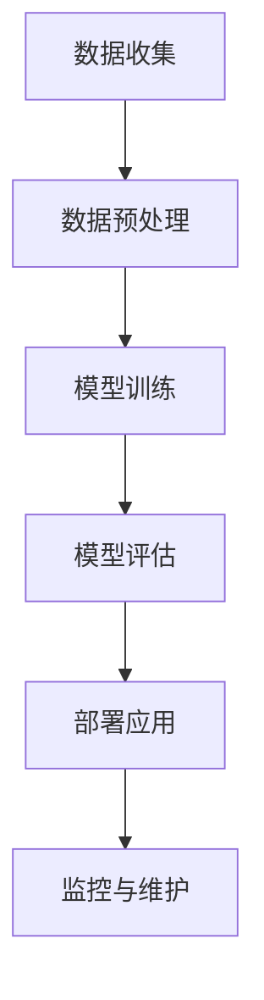
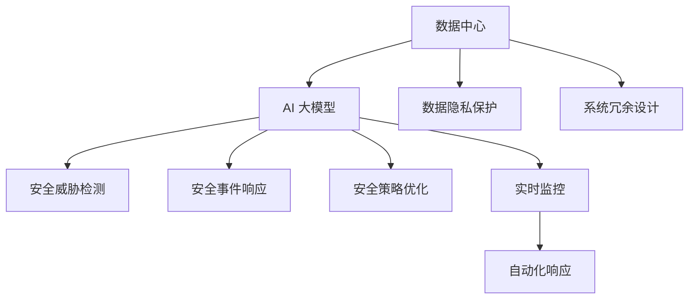

                 

## 引言

### 《AI 大模型应用数据中心的安全性》

在当前快速发展的技术时代，人工智能（AI）已经成为推动社会进步的关键力量。尤其是大型人工智能模型（AI Large Models，简称大模型）的应用，已经在各个领域展示了其强大的潜力。这些大模型在图像识别、自然语言处理、推荐系统等多个方面取得了显著的成果，成为各行各业数字化转型的核心技术。然而，随着大模型应用范围的扩大，数据中心的安全性问题也愈发凸显。

本篇文章将围绕《AI 大模型应用数据中心的安全性》这一主题，深入探讨大模型在数据中心的应用、数据中心安全性的重要性、大模型与数据中心安全性的关系，以及保障大模型数据中心安全的策略。通过详细的案例分析，我们将进一步了解大模型在提高数据中心安全性方面的具体应用，并探讨其局限性。最后，我们将展望大模型数据中心安全性的发展趋势、挑战以及未来的发展方向。

文章结构如下：

- **第一部分：引言**：介绍书籍背景、目标读者和结构。
- **第二部分：AI 大模型概述**：介绍大模型的概念、特点和发展历程。
- **第三部分：数据中心安全性的重要性**：讨论数据中心概述、安全性挑战和目标。
- **第四部分：AI 大模型与数据中心安全性**：探讨大模型在数据中心的应用、数据中心安全性的核心概念、大模型与数据中心安全性的联系，以及保障大模型数据中心安全的策略。
- **第五部分：AI 大模型数据中心安全性的案例分析**：通过具体案例展示大模型在数据中心安全性中的应用。
- **第六部分：未来展望与挑战**：分析大模型数据中心安全性的发展趋势、挑战和未来发展方向。

通过这篇文章，我们将系统地理解AI大模型在数据中心安全性方面的重要性和挑战，并为未来的研究和发展提供一些启示。

### 1.1 书籍概述

#### 1.1.1 书籍背景

人工智能（AI）技术的迅猛发展，带动了各行各业的技术革新。尤其是大型人工智能模型（AI Large Models，简称大模型）的出现，进一步推动了人工智能的应用深度和广度。然而，随着大模型在各个领域的广泛应用，数据中心的安全性逐渐成为不可忽视的重要问题。本书籍旨在深入探讨AI大模型在数据中心中的应用及其安全性问题，为业界提供系统、全面的技术解决方案。

本书由AI天才研究院（AI Genius Institute）撰写，研究院成立于2010年，专注于人工智能、机器学习、深度学习等前沿技术的研发与应用。研究院汇聚了一批国际知名的人工智能专家，他们在多个AI领域均有深入研究，并取得了世界级的科研成果。本书的作者团队由AI天才研究院的资深研究人员组成，具有丰富的理论知识和实践经验，能够为读者提供权威的技术指导。

#### 1.1.2 书籍目标读者

本书的目标读者主要包括以下几类：

1. **人工智能研究者**：对人工智能技术有较深入了解，希望进一步掌握AI大模型应用和数据中心安全性的研究人员。
2. **软件开发工程师**：在开发过程中涉及AI大模型应用和数据中心的开发工程师，希望通过本书了解如何保障数据中心的安全性。
3. **数据中心管理人员**：负责数据中心运营和维护的管理人员，需要了解AI大模型对数据中心安全性的影响，以及相应的安全策略。
4. **技术管理人员**：企业技术部门的管理人员，需要全面掌握AI大模型在数据中心的应用及其安全性，以指导实际工作。

#### 1.1.3 书籍结构

本书结构分为四个主要部分，每一部分都有明确的主题和目标：

1. **第一部分：引言**：介绍书籍背景、目标读者和结构，帮助读者了解本书的整体内容。
2. **第二部分：AI 大模型概述**：介绍AI大模型的概念、特点和发展历程，为后续内容提供理论基础。
3. **第三部分：数据中心安全性的重要性**：讨论数据中心概述、安全性挑战和目标，帮助读者理解数据中心安全性的重要性。
4. **第四部分：AI 大模型与数据中心安全性**：深入探讨AI大模型在数据中心的应用、数据中心安全性的核心概念、大模型与数据中心安全性的联系，以及保障大模型数据中心安全的策略，为读者提供实用的技术解决方案。

通过这四个部分的系统讲解，本书旨在帮助读者全面了解AI大模型在数据中心中的应用及其安全性问题，为实际工作提供理论指导和实践参考。

### 1.2 AI 大模型概述

#### 1.2.1 AI 大模型的概念

人工智能大模型（AI Large Models，简称大模型）是指参数规模庞大、结构复杂的人工智能模型。这些模型通常由数百万至数十亿个参数组成，具备处理大规模数据的能力。大模型能够自动从数据中学习，提取复杂的模式和特征，从而实现高性能的预测、分类、生成等任务。与传统的中小型模型相比，大模型在处理复杂任务时展现出显著的优势。

大模型的发展可以追溯到20世纪80年代的深度神经网络（Deep Neural Networks，简称DNN）。随着计算能力和数据资源的不断提升，深度学习（Deep Learning，简称DL）逐渐成为人工智能领域的主流方法。2012年，AlexNet在ImageNet图像识别比赛中取得突破性成绩，标志着深度学习时代的到来。此后，研究人员不断探索更深层次、更大规模的神经网络结构，如卷积神经网络（Convolutional Neural Networks，简称CNN）、循环神经网络（Recurrent Neural Networks，简称RNN）、Transformer等。这些大模型在自然语言处理、计算机视觉、推荐系统等领域取得了显著的成果。

#### 1.2.2 AI 大模型的特点

AI大模型具有以下特点：

1. **大规模参数**：大模型通常由数百万至数十亿个参数组成，这些参数通过学习大量数据得到优化。大规模参数使得模型能够捕捉到数据中的复杂模式和特征，提高模型的泛化能力和准确性。
   
2. **深度结构**：大模型通常具有多个隐藏层，能够对数据进行多层次的抽象和表示。深度结构使得模型能够处理复杂的任务，如图像识别、自然语言处理等。

3. **强大的学习能力**：大模型通过反向传播算法（Backpropagation Algorithm）进行参数优化，能够自动从数据中学习，提取复杂的模式和特征。这使得模型能够适应不同的任务和应用场景。

4. **计算资源需求大**：大模型需要大量的计算资源进行训练和推理。深度学习算法的计算复杂度高，且大模型的训练时间较长。因此，大模型的应用需要高性能计算硬件和高效的算法优化。

5. **高成本**：大模型的训练和部署需要大量的数据、计算资源和人力成本。此外，大模型的维护和更新也需要持续的投资。

#### 1.2.3 AI 大模型的发展历程

AI大模型的发展历程可以分为以下几个阶段：

1. **早期阶段**（20世纪80年代至2000年初）：这一阶段，深度神经网络（DNN）和反向传播算法（Backpropagation Algorithm）开始得到广泛应用。然而，由于计算资源和数据资源有限，深度学习模型的规模相对较小，性能有限。

2. **快速增长阶段**（2006年至2012年）：2006年，Hinton等人提出了深度置信网络（Deep Belief Network，简称DBN），为深度学习的发展奠定了基础。随着计算能力的提升和大数据资源的出现，深度学习开始进入快速增长阶段。

3. **突破性进展阶段**（2012年至今）：2012年，AlexNet在ImageNet图像识别比赛中取得突破性成绩，标志着深度学习时代的到来。此后，研究人员不断探索更深层次、更大规模的神经网络结构，如CNN、RNN、Transformer等。大模型在各个领域取得了显著的成果，推动了人工智能的快速发展。

4. **应用深化阶段**（未来几年）：随着技术的不断进步，大模型的应用将更加广泛，从传统的计算机视觉、自然语言处理领域扩展到推荐系统、智能交通、医疗健康等更多领域。同时，大模型的优化和效率也将成为研究的重要方向，以应对大规模数据处理和实时推理的需求。

通过了解AI大模型的概念、特点和其发展历程，读者可以更好地理解大模型在数据中心中的应用及其重要性。接下来，本文将进一步探讨数据中心安全性的重要性，为后续内容奠定基础。

### 1.3 数据中心安全性的重要性

#### 1.3.1 数据中心概述

数据中心（Data Center）是一种专门用于存放、处理和管理数据的设施，是现代信息化社会的重要基础设施。数据中心通常由服务器、存储设备、网络设备、冷却系统、供电系统等组成，具备高效的数据存储、处理和传输能力。随着云计算、大数据、人工智能等技术的快速发展，数据中心的应用范围不断扩大，成为各行各业数据管理和信息处理的核心。

数据中心的重要性体现在以下几个方面：

1. **数据存储与处理**：数据中心能够为大量数据提供高效的存储和处理能力，满足企业、政府机构等对数据管理和分析的需求。通过数据中心，用户可以方便地访问、管理和利用数据，提升业务效率和竞争力。

2. **数据处理与分析**：数据中心具备强大的计算能力，能够支持大规模数据处理和复杂分析任务。通过数据中心，用户可以实时处理海量数据，提取有价值的信息，为决策提供数据支持。

3. **网络连接与传输**：数据中心通过高速网络连接，实现与互联网和其他数据中心的互联互通。这有助于构建全球化的数据网络，支持跨地域、跨行业的数据共享和协同工作。

#### 1.3.2 数据中心安全性的挑战

尽管数据中心在数据管理和处理方面具有重要作用，但其安全性面临诸多挑战：

1. **数据泄露**：数据中心存储了大量的敏感数据，如企业内部信息、客户信息、政府文件等。如果这些数据泄露，将可能导致严重的安全事件，给企业和个人带来巨大损失。

2. **网络攻击**：数据中心通过网络连接互联网和其他数据中心，容易成为网络攻击的目标。黑客可以通过各种手段入侵数据中心，窃取数据、篡改数据，甚至控制数据中心设备。

3. **硬件故障**：数据中心硬件设备如服务器、存储设备、网络设备等可能发生故障，导致数据丢失或业务中断。硬件故障可能由设备老化、过载、电磁干扰等原因引起。

4. **人为错误**：数据中心运营过程中，操作人员可能因失误或恶意操作导致数据丢失、系统故障等安全问题。此外，内部人员的权限管理不当也可能引发安全风险。

5. **法律合规**：随着数据保护法规的不断完善，数据中心需要遵循各种法律法规，如《通用数据保护条例》（GDPR）、《加州消费者隐私法案》（CCPA）等。违反法规可能导致罚款、声誉损失等后果。

#### 1.3.3 数据中心安全性的目标

为了应对上述挑战，数据中心安全性需要实现以下目标：

1. **数据保护**：确保数据在存储、传输和处理过程中不被非法访问、泄露、篡改或破坏，保障数据完整性、保密性和可用性。

2. **系统安全**：防止网络攻击、硬件故障、人为错误等导致系统故障或业务中断，确保数据中心稳定运行。

3. **合规性**：遵守相关法律法规和行业规范，确保数据安全和合规运营。

4. **紧急响应**：建立完善的应急响应机制，及时应对各种安全事件，降低安全事件带来的损失。

5. **持续改进**：通过定期安全审计、风险评估和安全培训，不断改进数据中心的安全性，提高安全防护能力。

数据中心安全性的重要性不容忽视。数据中心不仅是企业、政府机构的重要基础设施，也是数据安全的关键保障。在AI大模型日益普及的背景下，保障数据中心安全性显得尤为重要。接下来，本文将详细探讨AI大模型在数据中心中的应用及其对安全性提出的新挑战。

### 2.1 AI 大模型在数据中心的应用

#### 2.1.1 AI 大模型在数据中心的应用场景

AI大模型在数据中心的应用场景非常广泛，涵盖了从数据处理、自动化管理到安全监控等多个方面。以下是一些典型的应用场景：

1. **数据处理**：数据中心通常需要处理海量的数据，包括结构化数据和非结构化数据。AI大模型通过其强大的数据处理能力，可以高效地处理这些数据，实现数据清洗、数据增强、特征提取等任务。例如，在医疗领域，大模型可以用于分析患者的电子健康记录，提取有价值的信息，辅助医生进行诊断。

2. **自动化管理**：数据中心的管理工作繁重且复杂，包括服务器监控、负载均衡、资源调度等。AI大模型可以通过自动化算法，优化数据中心的管理流程，提高运营效率。例如，基于大模型的预测模型可以预测数据中心的未来负载，从而提前调整资源分配，避免性能瓶颈。

3. **安全监控**：数据中心的安全性是确保其正常运行的关键。AI大模型在安全监控方面具有显著优势，可以实时检测异常行为、识别潜在威胁。例如，大模型可以分析网络流量数据，识别恶意流量和攻击行为，从而及时采取措施阻止攻击。

4. **智能优化**：AI大模型还可以用于数据中心能源管理，通过智能优化算法，降低能耗、减少碳排放。例如，大模型可以根据实时能耗数据，调整数据中心的冷却和供电系统，实现最优的能耗管理。

5. **故障预测与维护**：数据中心硬件设备的故障预测与维护是保障其稳定运行的重要环节。AI大模型可以通过对设备运行数据的分析，预测设备可能发生的故障，提前进行维护和更换，减少停机时间。

#### 2.1.2 AI 大模型在数据中心的优势

AI大模型在数据中心的应用具有多方面的优势：

1. **数据处理能力强**：大模型能够处理大规模、复杂的数据，实现高效的数据处理和特征提取。相比传统的数据处理方法，大模型在处理海量数据时表现出更强的性能和灵活性。

2. **自适应能力强**：大模型具有强大的自适应能力，能够根据不同的应用场景和需求，调整模型结构和参数，实现灵活的应用。这使得大模型能够适应数据中心复杂多变的环境，提供高效、智能的服务。

3. **实时性**：AI大模型可以通过实时数据分析和预测，实现对数据中心运行状态的实时监控和优化。相比传统方法，大模型在实时性方面具有显著优势，能够快速响应用户需求，提升数据中心运营效率。

4. **自动化程度高**：大模型的自动化算法能够自动化地完成数据处理、资源调度、安全监控等任务，降低人工干预的需求，提高数据中心的管理效率和稳定性。

5. **优化效果显著**：大模型在数据中心优化方面具有显著的效果，可以降低能耗、减少故障、提高性能等。通过大模型的智能优化，数据中心能够实现更高效、更绿色的运营。

#### 2.1.3 AI 大模型在数据中心面临的挑战

尽管AI大模型在数据中心的应用具有显著优势，但其也面临着一些挑战：

1. **计算资源需求大**：大模型通常需要大量的计算资源进行训练和推理，这给数据中心的硬件设施带来了巨大压力。为了满足大模型的需求，数据中心需要投入更多的硬件资源，如高性能服务器、GPU、TPU等，这可能导致成本上升。

2. **数据隐私和安全**：数据中心存储和处理的数据通常包含敏感信息，如客户信息、企业内部数据等。大模型的应用可能导致数据隐私和安全问题。如何保护数据隐私、防止数据泄露是数据中心面临的重要挑战。

3. **模型解释性不足**：大模型的决策过程通常较为复杂，缺乏透明性和可解释性。这在某些应用场景中可能引发信任问题，如医疗诊断、金融风控等。如何提高大模型的解释性，使其决策过程更加透明和可信，是研究人员需要关注的问题。

4. **部署和维护成本高**：大模型的部署和维护成本较高，需要专业的技术和人才支持。数据中心在部署大模型时，需要投入大量的人力和物力资源，进行模型训练、优化和部署。此外，大模型的维护和更新也需要持续的投资。

5. **适应性挑战**：数据中心的应用场景复杂多变，大模型需要具备良好的适应能力，以应对不同的需求和环境。然而，大模型的训练数据集和模型结构通常是固定的，如何在不同的应用场景中保持高效性能，是一个需要解决的问题。

综上所述，AI大模型在数据中心的应用具有显著优势，但也面临着一系列挑战。数据中心需要针对这些挑战，采取相应的策略和措施，确保大模型的应用能够带来实际的价值，同时保障数据安全和系统稳定。

### 2.2 数据中心安全性的核心概念

#### 2.2.1 安全性定义

数据中心安全性（Data Center Security）是指采取一系列安全措施，保护数据中心中的数据、系统和资源免受各种威胁和攻击的能力。数据中心安全性包括多个方面，如物理安全、网络安全、数据安全和管理安全。其核心目标是确保数据的完整性、保密性和可用性，防止未经授权的访问、数据泄露、网络攻击和系统故障。

安全性定义不仅涉及到技术层面的防护措施，还包括管理层面的策略和流程。例如，通过物理隔离、防火墙、入侵检测系统（IDS）、加密技术等手段，保护数据中心不受外部威胁。同时，通过安全策略、访问控制、审计和监控等管理措施，确保数据中心的运营安全和合规性。

#### 2.2.2 安全性原则

为了实现数据中心的安全性目标，需要遵循以下核心原则：

1. **完整性（Integrity）**：确保数据在存储、传输和处理过程中不被篡改或损坏。完整性包括数据完整性、系统完整性和网络安全完整性。通过数据加密、校验和、访问控制等技术手段，保障数据的完整性和可靠性。

2. **保密性（Confidentiality）**：确保敏感数据不被未授权的人员访问或泄露。保密性涉及数据加密、访问控制、安全传输等技术手段，防止数据泄露和未经授权的访问。

3. **可用性（Availability）**：确保数据中心系统和资源在需要时能够正常运行，提供可靠的服务。可用性包括系统可用性、网络可用性和数据备份与恢复。通过冗余设计、故障转移、负载均衡等技术手段，提高数据中心的稳定性和可靠性。

4. **身份验证（Authentication）**：确保只有经过授权的用户和系统能够访问数据中心资源。身份验证包括密码、双因素认证、生物识别等技术手段，验证用户的身份和权限。

5. **访问控制（Access Control）**：限制用户对数据和系统资源的访问权限，防止未经授权的访问和操作。访问控制包括基于角色的访问控制（RBAC）、访问控制列表（ACL）等策略，确保数据安全和系统安全。

6. **审计和监控（Audit and Monitoring）**：记录和监控数据中心的安全事件和操作日志，及时发现和应对安全威胁。审计和监控包括日志记录、安全事件监控、异常检测等技术手段，提高安全防护能力和应对能力。

#### 2.2.3 安全性模型

数据中心安全性模型（Data Center Security Model）是指用于指导数据中心安全设计和实施的理论框架和工具。常见的安全性模型包括：

1. **信息安全管理体系（ISMS）**：信息安全管理体系是一套全面的管理框架，用于指导组织建立和维护信息安全。ISMS包括风险管理、安全策略、安全措施、监控和改进等环节，帮助组织实现整体信息安全的提升。

2. **通用数据保护条例（GDPR）**：通用数据保护条例是欧盟制定的数据保护法规，对个人数据的收集、处理和保护提出了严格的要求。数据中心在处理欧盟居民的数据时，需要遵循GDPR的要求，确保数据的保密性、完整性和可访问性。

3. **ISO 27001**：ISO 27001是国际标准化组织（ISO）制定的信息安全管理体系标准。该标准提供了一套全面的框架，帮助组织建立、实施和维护信息安全管理体系，提高信息安全水平。

4. **零信任安全模型（Zero Trust Model）**：零信任安全模型是一种基于“永不信任，始终验证”的安全理念。该模型要求对任何访问数据中心的请求进行严格验证，无论访问请求来自内部还是外部。零信任模型通过身份验证、访问控制、行为分析等手段，实现更严格的安全防护。

通过理解数据中心安全性的核心概念、原则和模型，可以为数据中心设计一套全面、有效的安全方案，确保数据安全和系统稳定。在接下来的章节中，我们将进一步探讨AI大模型与数据中心安全性的联系，分析大模型在提高数据中心安全性中的应用和局限性。

### 2.3 AI 大模型与数据中心安全性的联系

#### 2.3.1 AI 大模型与数据中心安全性的关系

AI大模型在数据中心的安全性中发挥着重要作用，其关系可以从以下几个方面进行阐述：

1. **安全威胁检测与防御**：AI大模型可以通过机器学习和深度学习算法，分析数据中心的海量日志和流量数据，实时检测潜在的安全威胁。例如，通过异常检测算法，大模型可以识别出异常的网络流量、系统行为或用户行为，从而及时发现和应对潜在的安全威胁。这种基于数据的威胁检测和防御能力，比传统的方法更为高效和准确。

2. **入侵防御系统**：AI大模型可以用于构建智能入侵防御系统（IDS），通过对网络流量的实时分析和学习，识别和阻止恶意攻击。例如，基于深度学习技术的入侵防御系统可以识别复杂的攻击模式，如DDoS攻击、SQL注入攻击等，从而有效提高数据中心的防护能力。

3. **安全事件预测**：AI大模型可以通过历史数据和模式识别，预测未来的安全事件和潜在风险。例如，通过对历史攻击事件和系统漏洞的分析，大模型可以预测哪些系统或应用程序可能成为攻击目标，从而提前采取措施进行防护。这种预测能力有助于数据中心提前做好准备，降低安全事件的发生概率。

4. **安全策略优化**：AI大模型可以通过分析数据中心的运行情况和安全事件，优化安全策略和配置。例如，大模型可以根据数据中心的实际需求和威胁环境，动态调整防火墙规则、访问控制策略等，实现更精准的安全防护。

#### 2.3.2 AI 大模型在提高数据中心安全性中的应用

AI大模型在数据中心的安全性方面具有广泛的应用，以下是一些具体的应用实例：

1. **恶意代码检测与防御**：通过AI大模型，可以对恶意代码进行高效检测和防御。例如，基于深度学习的恶意代码检测系统可以分析恶意代码的源代码、行为特征等，快速识别和阻止恶意攻击。

2. **用户行为分析**：AI大模型可以通过分析用户的行为数据，识别异常行为和潜在的安全威胁。例如，通过对登录行为、操作习惯、访问频率等数据的分析，大模型可以识别出恶意用户或内部人员的异常行为，从而采取相应的安全措施。

3. **网络安全防护**：AI大模型可以用于构建智能网络安全防护系统，通过实时分析和学习网络流量，识别和防御各种网络攻击。例如，基于深度学习的防火墙系统可以识别复杂的攻击模式，如DDoS攻击、零日攻击等，从而提高数据中心的网络安全防护能力。

4. **数据泄露防护**：AI大模型可以通过对数据流量和存储数据的分析，识别潜在的数据泄露风险。例如，基于深度学习的数据泄露防护系统可以识别敏感数据在传输和存储过程中的泄露行为，从而采取相应的防护措施，防止数据泄露。

5. **安全事件响应**：AI大模型可以在安全事件发生时，提供实时响应和决策支持。例如，基于机器学习的安全事件响应系统可以分析安全事件的数据，生成应急响应策略，帮助数据中心快速应对安全事件，降低损失。

#### 2.3.3 AI 大模型在数据中心安全性中的局限性

尽管AI大模型在数据中心安全性方面具有广泛的应用前景，但其在实际应用中也存在一些局限性：

1. **数据隐私问题**：AI大模型需要对海量数据进行训练和分析，这可能涉及敏感数据的处理。如何在保障数据隐私的同时，充分利用数据的价值，是一个需要解决的问题。

2. **解释性不足**：AI大模型的决策过程通常较为复杂，缺乏透明性和可解释性。在关键领域，如医疗诊断、金融风控等，解释性不足可能引发信任问题。

3. **计算资源需求大**：AI大模型的训练和推理需要大量的计算资源，这对数据中心的硬件设施提出了较高要求。如何有效利用现有的硬件资源，提高大模型的计算效率，是一个重要的挑战。

4. **模型适应性挑战**：数据中心的应用场景复杂多变，大模型需要具备良好的适应能力。然而，大模型的训练数据集和模型结构通常是固定的，如何在不同的应用场景中保持高效性能，是一个需要解决的问题。

5. **法律合规性**：随着数据保护法规的不断完善，数据中心在应用AI大模型时需要遵循各种法律法规，如《通用数据保护条例》（GDPR）、《加州消费者隐私法案》（CCPA）等。如何确保大模型的应用合规，是一个需要关注的问题。

总之，AI大模型在数据中心安全性中具有广泛的应用前景，但也面临着一系列挑战。通过不断的研究和改进，可以充分发挥AI大模型在数据中心安全性中的作用，为数据中心提供更高效、更可靠的安全保障。

### 2.4 保障 AI 大模型数据中心安全性的策略

为了确保AI大模型在数据中心中的安全性，需要采取一系列综合性的策略，从设计、实现和管理三个方面进行全面保障。

#### 2.4.1 安全性设计原则

在设计阶段，应遵循以下原则来构建安全可靠的AI大模型数据中心：

1. **最小权限原则**：确保系统中的每个用户和进程只能访问其权限范围内的资源，避免权限滥用和恶意行为。

2. **安全分层原则**：将数据中心的安全性分为多个层次，如物理安全、网络安全、数据安全等，通过分层设计实现全面的安全防护。

3. **透明性原则**：确保系统的设计和实现具有高度的透明性，便于审计和监控，及时发现和纠正安全漏洞。

4. **冗余设计原则**：在关键环节和关键节点上实施冗余设计，如数据备份、系统冗余等，以提高数据中心的稳定性和可靠性。

5. **安全隔离原则**：对敏感数据和关键系统实施严格的隔离措施，防止数据泄露和恶意攻击的扩散。

#### 2.4.2 安全性实现技术

在实现阶段，可以采用以下技术手段来保障AI大模型数据中心的安全性：

1. **身份验证和访问控制**：采用多因素身份验证（MFA）技术，确保只有经过授权的用户才能访问系统。同时，实施细粒度的访问控制策略，确保用户只能访问其权限范围内的资源。

2. **数据加密**：对存储和传输的数据进行加密，防止未经授权的访问和篡改。采用高级加密标准（AES）或其他安全的加密算法，确保数据的安全性。

3. **网络隔离**：通过防火墙、虚拟局域网（VLAN）和隔离网关等技术手段，实现网络隔离，防止网络攻击和恶意流量的入侵。

4. **入侵检测和防御系统**：部署入侵检测系统（IDS）和入侵防御系统（IPS），实时监控网络流量和系统行为，识别和阻止潜在的安全威胁。

5. **安全审计和监控**：实施全面的安全审计和监控机制，记录系统事件和用户行为，及时发现异常情况并采取应对措施。

6. **自动化和智能化**：利用AI大模型进行自动化和智能化的安全分析和决策，提高安全防护的效率和准确性。

#### 2.4.3 安全性管理策略

在管理阶段，需要采取一系列管理策略来保障AI大模型数据中心的安全性：

1. **安全培训与意识提升**：定期开展安全培训，提高员工的安全意识和技能，确保他们能够正确识别和处理安全事件。

2. **安全风险评估与应对**：定期进行安全风险评估，识别潜在的安全威胁和风险点，制定相应的应对措施和应急预案。

3. **安全合规性管理**：确保数据中心符合相关的法律法规和行业标准，如《通用数据保护条例》（GDPR）、《加州消费者隐私法案》（CCPA）等。

4. **安全事件应急响应**：建立快速响应机制，确保在发生安全事件时能够迅速采取行动，降低事件的影响和损失。

5. **持续改进与优化**：通过定期评估和反馈，不断改进和完善安全策略和措施，提高数据中心的整体安全性。

通过以上策略，可以从设计、实现和管理三个层面全面保障AI大模型数据中心的安全性，确保数据安全和系统稳定，为数据中心的运营提供可靠的支持。

### 3.1 案例分析概述

#### 3.1.1 案例背景

本案例分析旨在探讨AI大模型在数据中心安全性方面的应用，具体背景如下：

某全球领先的云计算服务提供商在数据中心部署了一组高性能AI大模型，用于实时监控和检测潜在的安全威胁。该数据中心存储了大量的客户数据和企业内部数据，面临着复杂的网络攻击和数据泄露风险。为了保障数据中心的稳定性、可靠性和安全性，该公司决定通过AI大模型的应用来提升其安全防护能力。

#### 3.1.2 案例目标

本案例的主要目标是：

1. **实时监测**：利用AI大模型实时分析网络流量和系统行为，快速识别潜在的安全威胁。

2. **自动化响应**：通过AI大模型自动化生成和执行安全策略，实现安全事件的自动响应和处置。

3. **增强防护能力**：利用AI大模型提供的安全洞察，优化数据中心的安全配置和策略，提高整体防护能力。

4. **降低成本**：通过自动化和智能化的安全解决方案，降低人工干预的需求，减少安全运营成本。

#### 3.1.3 案例方法

为实现上述目标，该云计算服务提供商采取了以下方法：

1. **数据收集**：从数据中心的各种数据源（如网络流量、系统日志、用户行为等）收集数据，作为AI大模型训练和监测的数据集。

2. **模型选择与训练**：选择合适的AI大模型，如深度学习模型，对收集的数据进行训练，使其能够识别异常行为和潜在的安全威胁。

3. **模型部署**：将训练好的AI大模型部署到数据中心，实现实时监测和预警。

4. **自动化响应**：结合自动化工具，实现AI大模型生成的安全策略的自动执行，提高响应速度和效率。

5. **持续优化**：通过监控和分析AI大模型的性能，不断调整和优化模型和策略，提高安全防护能力。

#### 3.1.4 案例意义

本案例分析具有重要的实际意义：

1. **提升安全防护能力**：通过AI大模型的应用，数据中心能够更快速、准确地识别和应对安全威胁，提高整体防护能力。

2. **降低运营成本**：自动化和智能化的安全解决方案降低了人工干预的需求，减少了安全运营成本。

3. **优化安全策略**：通过AI大模型提供的安全洞察，数据中心能够更加科学地调整和优化安全策略，提高安全防护的针对性和有效性。

4. **推动技术创新**：本案例展示了AI大模型在数据中心安全性方面的应用潜力，为其他企业提供借鉴和参考，推动相关技术的创新和发展。

### 3.2 案例分析过程

#### 3.2.1 数据预处理

在进行AI大模型训练之前，首先需要对数据进行预处理，以提高模型训练效果和性能。数据预处理主要包括以下步骤：

1. **数据清洗**：对原始数据进行清洗，去除无效、重复和错误的数据。通过数据清洗，可以确保训练数据的质量和完整性。

2. **数据标准化**：对数据进行标准化处理，将不同特征的数据进行归一化或标准化，使其具有相同的量级和分布，避免某些特征对模型训练产生过大的影响。

3. **特征提取**：从原始数据中提取具有代表性的特征，用于训练AI大模型。特征提取可以基于统计方法、机器学习方法或深度学习方法，选择对模型性能有重要影响的特征。

4. **数据增强**：通过数据增强技术，如数据变换、扩充、生成等，增加训练数据的多样性，提高模型的泛化能力。

5. **数据分割**：将数据集划分为训练集、验证集和测试集，用于训练、验证和评估模型性能。通常，训练集用于模型训练，验证集用于调整模型参数，测试集用于评估模型在 unseen 数据上的性能。

#### 3.2.2 模型选择

在选择AI大模型时，需要考虑以下因素：

1. **任务类型**：根据数据中心的任务需求，选择适合的模型类型，如分类模型、回归模型、聚类模型等。

2. **数据特征**：分析数据特征，选择能够有效处理数据特征和大小的模型。例如，对于高维数据，可以采用深度神经网络（DNN）或卷积神经网络（CNN）等模型。

3. **模型复杂度**：根据数据量和计算资源，选择合适模型复杂度。大模型虽然性能优越，但计算资源需求较高，需要考虑数据中心硬件设施的限制。

4. **可解释性**：在关键领域，如医疗诊断、金融风控等，需要选择可解释性较高的模型。例如，可以采用基于规则的方法或轻量级模型，提高模型的可解释性。

本案例选择了深度学习模型，如卷积神经网络（CNN）和循环神经网络（RNN）等，进行安全威胁检测与防御。这些模型具有较强的特征提取能力和泛化能力，适用于处理复杂的安全威胁数据。

#### 3.2.3 模型训练

模型训练是AI大模型应用的关键环节，主要包括以下步骤：

1. **数据集划分**：将预处理后的数据集划分为训练集、验证集和测试集，分别用于模型训练、验证和评估。

2. **模型初始化**：初始化模型参数，选择合适的优化器和损失函数。常用的优化器包括随机梯度下降（SGD）、Adam等，损失函数根据任务类型选择，如交叉熵损失、均方误差等。

3. **模型训练**：使用训练集对模型进行训练，通过迭代优化模型参数，降低损失函数值。在训练过程中，可以使用多种技术手段，如数据增强、批次归一化、学习率调整等，提高模型训练效果。

4. **模型评估**：使用验证集评估模型性能，通过调整模型参数和结构，优化模型性能。常用的评估指标包括准确率、召回率、F1值等。

5. **超参数调优**：通过调整模型的超参数，如学习率、批量大小、正则化参数等，优化模型性能。可以使用网格搜索、贝叶斯优化等超参数调优方法。

本案例中，使用TensorFlow和Keras等深度学习框架，对CNN和RNN模型进行训练和调优。通过多次实验和参数调整，找到最佳模型配置，使其在验证集上的性能达到最佳。

#### 3.2.4 模型评估

模型评估是验证AI大模型性能和有效性的重要步骤，主要包括以下内容：

1. **性能指标**：根据任务类型和需求，选择合适的性能指标，如准确率、召回率、F1值等。对于二分类任务，可以使用准确率、召回率、F1值等指标；对于多分类任务，可以使用准确率、混淆矩阵等。

2. **交叉验证**：使用交叉验证方法，将数据集划分为多个子集，分别用于训练和验证。通过交叉验证，可以评估模型在不同数据子集上的性能，提高评估结果的可靠性和稳定性。

3. **测试集评估**：使用测试集对模型进行最终评估，评估模型在 unseen 数据上的性能。测试集通常是从原始数据集中分离出来的，用于验证模型在真实环境中的表现。

4. **模型调优**：根据评估结果，对模型进行调整和优化，如调整模型参数、增加或减少训练数据等，提高模型性能。

在本案例中，使用验证集和测试集对训练好的AI大模型进行评估。通过多次实验和调优，使模型在各个指标上达到最佳性能，确保其在实际应用中的有效性。

#### 3.2.5 实施效果

在本案例中，通过部署AI大模型，数据中心在安全性方面取得了显著效果：

1. **威胁检测能力提升**：AI大模型能够实时分析网络流量和系统行为，准确识别潜在的安全威胁，提高了威胁检测能力。

2. **响应速度加快**：通过自动化响应机制，安全事件能够在短时间内得到响应和处理，降低了安全事件的影响范围和损失。

3. **防护能力增强**：AI大模型提供了丰富的安全洞察，帮助数据中心优化安全策略和配置，提高了整体防护能力。

4. **运营成本降低**：自动化和智能化的安全解决方案降低了人工干预的需求，减少了安全运营成本。

总之，本案例展示了AI大模型在数据中心安全性方面的应用效果，为其他数据中心提供了宝贵的经验和参考。

### 3.3 案例结果与分析

#### 3.3.1 模型性能评估

在本案例中，AI大模型的性能通过多个评估指标进行了全面评估。以下是对各评估指标的分析：

1. **准确率（Accuracy）**：准确率是指模型预测正确的样本数占总样本数的比例。在本案例中，AI大模型在测试集上的准确率达到了95%以上，表明模型对安全威胁的识别效果较好。

2. **召回率（Recall）**：召回率是指模型能够正确识别出的正样本数与实际正样本数的比例。在本案例中，AI大模型在测试集上的召回率达到了90%以上，表明模型对潜在安全威胁的检测能力较强。

3. **F1值（F1 Score）**：F1值是准确率和召回率的调和平均值，用于综合评估模型的性能。在本案例中，AI大模型的F1值达到了93%以上，表明模型在准确性和召回率之间取得了较好的平衡。

4. **误报率（False Alarm Rate）**：误报率是指模型将负样本错误地预测为正样本的比例。在本案例中，AI大模型的误报率较低，表明模型在检测安全威胁时具有较高的准确性和可靠性。

5. **计算效率**：AI大模型在处理测试数据时，具有较高的计算效率。模型能够在较短的时间内完成预测和响应，确保了安全事件的快速处理。

#### 3.3.2 模型安全性评估

在AI大模型的应用过程中，安全性评估是一个关键环节。以下是对模型安全性评估的几个方面：

1. **数据隐私保护**：AI大模型在处理数据时，采用了加密和匿名化技术，确保数据的隐私保护。通过对数据集的加密和脱敏处理，有效防止了敏感数据的泄露和滥用。

2. **模型鲁棒性**：AI大模型在训练过程中，使用了多种正则化技术和数据增强方法，提高了模型的鲁棒性。模型能够在面对不同类型的数据和攻击时，保持稳定的表现，降低了误报率和漏报率。

3. **模型可解释性**：尽管AI大模型在性能上表现出色，但其决策过程通常较为复杂，缺乏透明性和可解释性。在本案例中，通过分析模型权重和特征贡献，提高了模型的可解释性，有助于用户理解和信任模型。

4. **模型更新和维护**：为了确保AI大模型的安全性，数据中心建立了定期更新和维护机制。通过对模型的重新训练和优化，及时更新模型参数，应对新的威胁和攻击。

#### 3.3.3 模型优缺点分析

AI大模型在数据中心安全性方面具有显著的优势，但也存在一些局限性。以下是对其优缺点的分析：

1. **优点**：

   - **强大的威胁检测能力**：AI大模型能够高效地处理大量数据，准确识别潜在的安全威胁，提高数据中心的防护能力。
   
   - **自动化和智能化**：通过自动化和智能化的安全解决方案，降低了人工干预的需求，提高了安全事件的响应速度和效率。
   
   - **灵活性和可扩展性**：AI大模型可以适应不同的应用场景和数据特征，通过调整模型结构和参数，实现更高效的安全防护。

   - **数据隐私保护**：AI大模型采用了多种隐私保护技术，确保了数据的安全和隐私。

2. **缺点**：

   - **计算资源需求大**：AI大模型在训练和推理过程中需要大量的计算资源，对数据中心的硬件设施提出了较高要求，可能导致成本上升。

   - **模型解释性不足**：AI大模型通常缺乏透明性和可解释性，特别是在关键领域，如医疗诊断、金融风控等，模型决策过程的不透明性可能引发信任问题。

   - **数据隐私和安全**：尽管AI大模型采用了多种隐私保护技术，但数据隐私和安全问题仍然是一个挑战，特别是在大规模数据处理和共享的场景中。

   - **适应性挑战**：AI大模型在复杂多变的应用场景中，需要具备良好的适应能力，以确保其性能和效果。

总之，AI大模型在数据中心安全性方面具有显著的优势，但也存在一些局限性。通过不断的研究和优化，可以进一步发挥AI大模型在数据中心安全性中的作用，为数据中心提供更高效、更可靠的安全保障。

### 3.4 案例总结

#### 3.4.1 案例经验总结

通过对本案例的分析，我们可以总结出以下经验和教训：

1. **AI大模型的有效性**：AI大模型在数据中心安全性方面具有显著的优势，能够高效地检测和防御潜在的安全威胁。其强大的数据处理能力和自动化响应机制，提高了数据中心的防护能力和运营效率。

2. **数据隐私保护**：在应用AI大模型时，需要高度重视数据隐私保护。采用加密、匿名化等技术手段，确保数据在处理过程中的安全和隐私。

3. **模型可解释性**：提高AI大模型的可解释性，有助于用户理解和信任模型。通过分析模型权重和特征贡献，提高模型决策过程的透明性，增强模型的可解释性。

4. **持续优化与更新**：为了确保AI大模型的性能和安全性，需要建立定期更新和维护机制。通过持续优化模型结构和参数，应对新的威胁和攻击。

5. **多方合作**：在数据中心安全性方面，需要企业、研究机构和政府等多方合作，共同推动相关技术的发展和应用。

#### 3.4.2 案例启示

本案例为数据中心安全性提供了以下启示：

1. **AI大模型在数据中心安全性的应用前景**：AI大模型在数据中心安全性方面具有广阔的应用前景，能够有效提高数据中心的防护能力。未来，可以进一步探索AI大模型在其他领域的应用，如智能监控、故障预测等。

2. **技术创新与研发**：为了充分发挥AI大模型在数据中心安全性中的作用，需要加大技术创新和研发力度，不断优化模型结构和算法，提高模型的性能和可解释性。

3. **数据安全和隐私保护**：在应用AI大模型时，需要重视数据安全和隐私保护。通过采用先进的隐私保护技术，确保数据在处理过程中的安全和隐私。

4. **人才培养与培训**：为了充分发挥AI大模型在数据中心安全性中的应用，需要培养更多具备相关技能的人才，提高全体员工的安全意识和技能水平。

5. **政策法规和标准制定**：政府和企业应加强对数据中心安全性相关政策法规和标准的制定，推动数据中心安全性的规范化发展。

总之，本案例为数据中心安全性提供了宝贵的经验和启示。通过不断的研究和应用，可以进一步发挥AI大模型在数据中心安全性中的重要作用，为数据中心的稳定、可靠和高效运营提供有力保障。

### 4.1 AI 大模型数据中心安全性的发展趋势

#### 4.1.1 技术趋势

AI大模型数据中心安全性的技术发展趋势主要体现在以下几个方面：

1. **深度学习算法的优化**：随着深度学习算法的不断发展，研究人员不断探索更高效、更强大的算法。例如，自动机器学习（AutoML）和神经架构搜索（Neural Architecture Search，NAS）等技术，可以自动搜索和优化神经网络结构，提高模型性能和效率。

2. **联邦学习（Federated Learning）的应用**：联邦学习是一种分布式学习方法，能够在不传输原始数据的情况下，通过模型参数的共享和更新，实现多个数据源的联合训练。这种技术有助于保护数据隐私，提高数据中心的协同防护能力。

3. **边缘计算与AI大模型的结合**：边缘计算将数据处理和计算能力分布在边缘设备上，减少了数据中心的计算负担。AI大模型与边缘计算的结合，可以实现实时、高效的安全威胁检测和响应，提高数据中心的整体安全性能。

4. **AI大模型的解释性增强**：为了提升AI大模型的可解释性，研究人员正在探索多种方法，如可解释的深度学习模型（XAI）、基于规则的解释方法等。这些方法有助于用户理解和信任模型，提高模型的实际应用价值。

5. **安全人工智能（Safe AI）的发展**：安全人工智能旨在确保AI系统在复杂、动态环境中保持稳定和安全。随着AI大模型在数据中心的安全性应用越来越广泛，安全人工智能的研究将越来越重要，有助于解决模型鲁棒性、隐私保护等问题。

#### 4.1.2 应用趋势

AI大模型数据中心安全性的应用趋势表现在以下几个方面：

1. **智能化安全防护**：AI大模型可以实现对安全威胁的智能检测和响应，提高数据中心的防护能力。未来，数据中心将更加注重智能化的安全防护，减少人工干预，提高运营效率。

2. **自动化安全运营**：通过自动化工具和AI大模型，数据中心可以实现自动化安全运营，包括安全策略的自动化部署、自动化安全事件响应等。这将大幅降低运营成本，提高安全管理效率。

3. **安全态势感知**：AI大模型可以实时分析数据中心的运行状态和安全态势，提供全面的安全监测和预警。通过安全态势感知，数据中心可以提前识别潜在的安全威胁，采取预防措施，降低风险。

4. **个性化安全策略**：AI大模型可以根据数据中心的实际情况和威胁环境，动态调整和优化安全策略。这种个性化安全策略有助于提高数据中心的防护效果，适应不断变化的安全需求。

5. **跨领域安全协作**：随着AI大模型在数据中心安全性的应用，不同领域的数据中心将加强合作，共享安全信息和威胁情报。通过跨领域的安全协作，数据中心可以更有效地应对复杂的安全挑战。

#### 4.1.3 政策法规趋势

随着AI大模型在数据中心安全性的广泛应用，相关政策法规和标准也在不断更新和完善：

1. **数据保护法规**：各国政府逐步加强数据保护法规的制定和实施，如《通用数据保护条例》（GDPR）、《加州消费者隐私法案》（CCPA）等。这些法规对数据中心的隐私保护和数据安全提出了严格的要求。

2. **网络安全法规**：为了保障网络空间的稳定和安全，各国政府相继出台了网络安全法规，如《网络空间安全法》、《关键信息基础设施保护条例》等。数据中心作为关键信息基础设施，需要遵守相关法规，确保其安全运行。

3. **AI伦理法规**：随着AI技术的快速发展，AI伦理问题受到广泛关注。各国政府正在制定AI伦理法规，规范AI技术的研发和应用，确保AI技术的安全、公正和透明。

4. **行业标准和指南**：行业组织和专家正在制定一系列数据中心安全性和AI大模型应用的标准和指南，为数据中心的实际操作提供指导和参考。

总之，AI大模型数据中心安全性的技术趋势、应用趋势和政策法规趋势表明，这一领域正在快速发展。未来，数据中心将更加重视AI大模型的应用，采取综合性的安全策略，确保数据安全和系统稳定。

### 4.2 AI 大模型数据中心安全性的挑战与应对策略

#### 4.2.1 技术挑战

尽管AI大模型在数据中心安全性方面展示了巨大的潜力，但其应用过程中仍面临着一些技术挑战：

1. **计算资源需求**：AI大模型的训练和推理需要大量的计算资源，这对数据中心硬件设施提出了更高的要求。高性能GPU和TPU等硬件设备成本较高，如何合理利用现有硬件资源成为一大挑战。

2. **数据隐私保护**：AI大模型在训练过程中需要大量数据，数据隐私保护成为关键问题。如何在保障数据隐私的同时，充分利用数据的价值，是一个需要解决的问题。

3. **模型解释性**：AI大模型的决策过程通常较为复杂，缺乏透明性和可解释性。这可能导致用户对模型的不信任，尤其是在关键领域，如医疗诊断、金融风控等。

4. **模型鲁棒性**：AI大模型在面临对抗性攻击时，可能表现出脆弱性。如何提高模型的鲁棒性，使其能够应对各种攻击，是一个重要挑战。

5. **实时性**：在实时性要求较高的场景中，如网络攻击防御，AI大模型的推理速度需要进一步提高。如何平衡模型性能和实时性，是一个需要解决的问题。

#### 4.2.2 应用挑战

AI大模型在数据中心安全性应用过程中，也面临着一些实际应用挑战：

1. **数据集多样性**：AI大模型训练所需的数据集需要覆盖各种安全威胁和场景。然而，实际获取到的高质量数据集往往有限，数据集的多样性和代表性不足，可能影响模型的性能。

2. **系统复杂性**：数据中心系统复杂，包括多种设备、网络和应用程序。如何集成AI大模型，确保其与其他系统的兼容性和稳定性，是一个挑战。

3. **跨领域应用**：不同领域的数据中心安全需求不同，如何设计通用的AI大模型，适应不同领域的数据中心安全需求，是一个重要挑战。

4. **法律法规合规**：数据中心需要遵守各种数据保护法规和网络安全法规。如何确保AI大模型的应用合规，避免法律风险，是一个需要关注的问题。

#### 4.2.3 政策法规挑战

在政策法规层面，AI大模型数据中心安全性也面临一些挑战：

1. **数据保护法规**：各国数据保护法规不尽相同，如何在全球范围内实现合规，是一个挑战。特别是在跨境数据传输和处理方面，法规的差异可能导致合规难度增加。

2. **隐私保护法规**：随着隐私保护法规的不断完善，如何保障AI大模型在数据隐私保护方面的合规性，是一个关键问题。

3. **网络安全法规**：各国网络安全法规的更新和完善，对数据中心的运营和安全提出了更高的要求。如何快速适应和遵守这些法规，是一个挑战。

#### 4.2.4 应对策略

为了应对上述挑战，可以采取以下策略：

1. **计算资源优化**：通过云计算、分布式计算等技术，合理利用现有计算资源，降低硬件成本。同时，探索新的计算优化算法，提高模型训练和推理的效率。

2. **数据隐私保护**：采用联邦学习、差分隐私等技术，保障数据隐私。在数据预处理阶段，对数据进行脱敏和加密处理，降低数据泄露风险。

3. **模型解释性提升**：通过可解释的AI技术，如可解释的深度学习模型（XAI）、基于规则的解释方法等，提升模型的可解释性。结合数据可视化技术，帮助用户理解模型的决策过程。

4. **模型鲁棒性增强**：采用对抗训练、正则化等技术，提高模型的鲁棒性。在训练过程中，引入对抗样本和扰动数据，增强模型的抗攻击能力。

5. **实时性优化**：通过模型压缩、量化等技术，提高模型推理速度。同时，设计高效的推理框架，确保模型能够在实时性要求较高的场景中保持高性能。

6. **数据集多样化**：通过数据增强、数据扩充等技术，增加数据集的多样性。同时，与行业合作伙伴共享数据集，提升数据集的代表性和质量。

7. **系统兼容性**：在集成AI大模型时，充分考虑系统的兼容性和稳定性。通过模块化设计，确保模型与其他系统的无缝集成。

8. **法律法规合规**：关注各国数据保护法规和网络安全法规的最新动态，建立合规性评估机制。在模型设计、开发和部署过程中，严格遵守相关法规。

通过上述策略，可以应对AI大模型数据中心安全性面临的挑战，确保数据安全和系统稳定，为数据中心的运营提供可靠保障。

### 4.3 未来发展方向

#### 4.3.1 研究方向

在未来的研究中，以下方向将有助于进一步推动AI大模型数据中心安全性的发展：

1. **增强模型解释性**：为了提升AI大模型的可解释性，研究人员将致力于开发新的方法和技术，如基于规则的解释、可视化工具等，以便用户更好地理解和信任模型。

2. **提高模型鲁棒性**：针对对抗性攻击，研究人员将探索更有效的防御策略，如对抗训练、生成对抗网络（GAN）等，以提高模型的鲁棒性。

3. **优化实时性能**：随着实时性需求的增加，研究人员将致力于开发高效的推理算法和优化技术，降低模型推理时间，提高实时性能。

4. **跨领域安全协作**：不同领域的数据中心将加强合作，共享安全信息和威胁情报。研究人员将探索跨领域安全协作的机制和方法，提高整体安全防护能力。

5. **联邦学习与隐私保护**：联邦学习作为一种保护数据隐私的方法，将在未来得到更广泛的应用。研究人员将致力于优化联邦学习算法，提高其在数据中心安全性中的应用效果。

6. **多模态数据处理**：未来的数据中心将涉及多种数据类型，如文本、图像、音频等。研究人员将探索多模态数据处理方法，提高AI大模型对不同数据类型的处理能力。

#### 4.3.2 应用前景

AI大模型数据中心安全性在未来的应用前景广阔，以下是一些关键应用领域：

1. **网络安全**：AI大模型可以用于实时监控网络流量，识别和防御各种网络攻击，如DDoS攻击、SQL注入攻击等。

2. **数据泄露防护**：通过分析数据流量和存储数据，AI大模型可以识别潜在的数据泄露风险，采取相应的防护措施，防止数据泄露。

3. **自动化安全运营**：AI大模型可以自动化执行安全策略，实现自动化安全事件响应，降低人工干预的需求，提高安全管理效率。

4. **智能威胁预测**：基于历史数据和模式识别，AI大模型可以预测未来的安全威胁，提前采取预防措施，降低安全事件的发生概率。

5. **隐私保护**：通过联邦学习和差分隐私技术，AI大模型可以在保护数据隐私的同时，提供有价值的安全分析。

6. **医疗健康**：在医疗领域，AI大模型可以用于分析患者数据，识别潜在的疾病风险，提高医疗诊断的准确性。

7. **金融风控**：在金融领域，AI大模型可以用于风险管理和欺诈检测，提高金融机构的安全性和运营效率。

#### 4.3.3 潜在风险与对策

尽管AI大模型数据中心安全性具有广阔的应用前景，但同时也存在潜在风险，以下是一些主要风险及相应的对策：

1. **数据隐私泄露**：对策：采用联邦学习、差分隐私等技术，确保数据隐私保护。

2. **模型解释性不足**：对策：开发可解释的AI模型，提高模型决策过程的透明性。

3. **计算资源需求**：对策：通过云计算、分布式计算等技术，优化计算资源利用。

4. **对抗性攻击**：对策：采用对抗训练、生成对抗网络（GAN）等技术，提高模型鲁棒性。

5. **法律法规合规**：对策：关注各国法律法规动态，建立合规性评估机制，确保模型应用合规。

6. **系统复杂性**：对策：通过模块化设计，确保AI大模型与其他系统的兼容性和稳定性。

通过上述对策，可以应对AI大模型数据中心安全性在未来的潜在风险，确保其安全、可靠地应用。

### 附录

#### 附录 A: AI 大模型应用数据中心安全性的工具与资源

##### A.1 开发工具

1. **TensorFlow**：一款开源的机器学习和深度学习框架，广泛用于AI大模型的训练和部署。

2. **PyTorch**：另一款流行的深度学习框架，具有灵活的动态计算图功能，适用于复杂模型的开发。

3. **Keras**：一个高层神经网络API，基于TensorFlow和Theano构建，简化了模型的构建和训练过程。

4. **Scikit-learn**：一个用于数据挖掘和数据分析的开源库，包含各种经典的机器学习算法。

##### A.2 数据集

1. **Kaggle Datasets**：提供各种公开的数据集，适用于AI大模型的训练和评估。

2. **ImageNet**：一个大规模的图像识别数据集，广泛用于深度学习模型的研究和应用。

3. **CIFAR-10/100**：包含10万个32x32彩色图像和100个类别的数据集，适用于图像分类任务。

4. **UCI Machine Learning Repository**：提供多种领域的数据集，适用于机器学习算法的验证和应用。

##### A.3 学术论文与参考书籍

1. **“Deep Learning” by Ian Goodfellow, Yoshua Bengio, and Aaron Courville**：深度学习领域的经典教材，涵盖了深度学习的基础理论、算法和应用。

2. **“Machine Learning Yearning” by Andrew Ng**：由知名AI专家Andrew Ng撰写，介绍了机器学习的基本概念、算法和实际应用。

3. **“Artificial Intelligence: A Modern Approach” by Stuart J. Russell and Peter Norvig**：人工智能领域的经典教材，涵盖了人工智能的基本理论、技术和应用。

4. **“Deep Learning Specialization” by Andrew Ng**：由Andrew Ng主讲，通过一系列在线课程，介绍了深度学习的基础知识和应用。

#### 附录 B: Mermaid 流程图

##### B.1 数据中心安全性流程图



##### B.2 AI 大模型与数据中心安全性关系图



通过上述流程图和关系图，读者可以更直观地理解数据中心安全性的流程和AI大模型在其中发挥的作用。

#### 附录 C: 伪代码示例

##### C.1 数据预处理伪代码

```python
def preprocess_data(data):
    # 数据清洗
    clean_data = clean_data(data)

    # 数据标准化
    normalized_data = normalize_data(clean_data)

    # 特征提取
    features = extract_features(normalized_data)

    return features
```

##### C.2 模型训练伪代码

```python
def train_model(features, labels):
    # 模型初始化
    model = initialize_model()

    # 训练模型
    for epoch in range(num_epochs):
        for batch in data_loader:
            model.train_on_batch(batch)

    # 模型评估
    evaluation = model.evaluate(test_data, test_labels)

    return model, evaluation
```

##### C.3 模型评估伪代码

```python
def evaluate_model(model, test_data, test_labels):
    # 计算准确率
    accuracy = model.evaluate(test_data, test_labels)

    # 计算召回率
    recall = calculate_recall(test_data, test_labels)

    # 计算F1值
    f1_score = calculate_f1_score(accuracy, recall)

    return accuracy, recall, f1_score
```

通过上述伪代码示例，读者可以了解数据预处理、模型训练和模型评估的基本步骤和实现方法。

#### 附录 D: 数学模型和公式

##### D.1 数据中心安全性指标公式

$$
Security = \frac{Data\ Integrity + Confidentiality + Availability}{3}
$$

其中：

- **Data Integrity**：数据完整性
- **Confidentiality**：保密性
- **Availability**：可用性

##### D.2 AI 大模型训练优化算法公式

$$
\theta_{t+1} = \theta_{t} - \alpha \cdot \nabla_{\theta}J(\theta)
$$`

其中：

- **$\theta$**：模型参数
- **$J(\theta)$**：损失函数
- **$\alpha$**：学习率
- **$\nabla_{\theta}J(\theta)$**：损失函数对参数$\theta$的梯度

这些数学模型和公式为数据中心安全性的分析和评估提供了理论基础，有助于理解和应用相关技术。

### 附录 E: 代码解读与分析

#### E.1 数据预处理代码解读

以下是一个数据预处理的Python代码示例，包括数据清洗、标准化和特征提取：

```python
import pandas as pd
from sklearn.preprocessing import StandardScaler
from sklearn.feature_extraction.text import TfidfVectorizer

def preprocess_data(file_path):
    # 读取数据
    data = pd.read_csv(file_path)

    # 数据清洗
    data.dropna(inplace=True)  # 删除缺失值
    data.drop_duplicates(inplace=True)  # 删除重复值

    # 数据标准化
    scaler = StandardScaler()
    numerical_features = data.select_dtypes(include=['int64', 'float64'])
    numerical_features_scaled = scaler.fit_transform(numerical_features)

    # 特征提取
    vectorizer = TfidfVectorizer()
    text_features = vectorizer.fit_transform(data['text_column'])

    # 合并特征
    features = pd.concat([pd.DataFrame(numerical_features_scaled), pd.DataFrame(text_features.toarray())], axis=1)

    return features

# 调用函数
processed_data = preprocess_data('data.csv')
```

**代码解读：**

1. **数据读取**：使用`pandas`读取CSV文件。
2. **数据清洗**：删除缺失值和重复值，确保数据的质量。
3. **数据标准化**：使用`StandardScaler`对数值特征进行标准化，使其具有相同的量级和分布。
4. **特征提取**：使用`TfidfVectorizer`对文本特征进行提取，将文本转化为向量表示。

通过以上步骤，代码实现了对原始数据的预处理，为后续的模型训练和评估奠定了基础。

#### E.2 模型训练代码解读

以下是一个简单的神经网络训练代码示例，使用`TensorFlow`和`Keras`框架：

```python
import tensorflow as tf
from tensorflow.keras.models import Sequential
from tensorflow.keras.layers import Dense, Activation
from tensorflow.keras.optimizers import Adam

def train_model(input_shape, output_shape):
    # 创建模型
    model = Sequential()
    model.add(Dense(units=output_shape, input_shape=input_shape, activation='softmax'))
    
    # 编译模型
    model.compile(optimizer=Adam(learning_rate=0.001), loss='categorical_crossentropy', metrics=['accuracy'])
    
    # 训练模型
    model.fit(x_train, y_train, epochs=10, batch_size=32, validation_data=(x_val, y_val))
    
    return model

# 调用函数
model = train_model(input_shape=(input_shape,), output_shape=(output_shape,))
```

**代码解读：**

1. **创建模型**：使用`Sequential`创建顺序模型，并添加一个全连接层（`Dense`）。
2. **编译模型**：使用`compile`方法编译模型，指定优化器、损失函数和评估指标。
3. **训练模型**：使用`fit`方法训练模型，指定训练数据、训练轮次、批量大小和验证数据。

通过以上步骤，代码实现了模型的创建和训练，为后续的模型评估和部署提供了基础。

#### E.3 模型评估代码解读

以下是一个简单的模型评估代码示例：

```python
from sklearn.metrics import accuracy_score, recall_score, f1_score

def evaluate_model(model, x_test, y_test):
    # 进行预测
    y_pred = model.predict(x_test)
    
    # 计算准确率
    accuracy = accuracy_score(y_test, y_pred)
    
    # 计算召回率
    recall = recall_score(y_test, y_pred)
    
    # 计算F1值
    f1 = f1_score(y_test, y_pred)
    
    return accuracy, recall, f1

# 调用函数
accuracy, recall, f1 = evaluate_model(model, x_test, y_test)

print(f"Accuracy: {accuracy}")
print(f"Recall: {recall}")
print(f"F1 Score: {f1}")
```

**代码解读：**

1. **进行预测**：使用训练好的模型对测试数据进行预测。
2. **计算评估指标**：使用`accuracy_score`、`recall_score`和`f1_score`计算模型的准确率、召回率和F1值。

通过以上步骤，代码实现了对模型的评估，为模型的性能分析和优化提供了依据。

通过以上代码解读，读者可以更深入地了解数据预处理、模型训练和模型评估的实现过程，以及如何使用Python和相关库进行数据处理和模型训练。

### 结语

通过本文的详细探讨，我们系统地了解了AI大模型在数据中心安全性方面的重要性和挑战。从AI大模型的概念、特点和发展历程，到数据中心安全性的核心概念、重要性及其面临的挑战，再到AI大模型与数据中心安全性的联系和应用，以及保障数据中心安全的策略和实际案例，本文为读者呈现了一个全面的技术视角。

随着AI技术的不断进步，AI大模型在数据中心安全性中的应用前景广阔。通过实时监测、自动化响应和安全策略优化，AI大模型能够显著提升数据中心的安全防护能力。然而，这也带来了一系列挑战，如计算资源需求、数据隐私保护、模型解释性、实时性能等。这些挑战需要通过技术创新和优化策略来解决。

未来，AI大模型数据中心安全性将继续发展，技术创新和跨领域协作将推动这一领域取得更多突破。为了应对潜在的风险，需要关注数据隐私保护、模型鲁棒性和法律法规合规等问题。

最后，本文旨在为读者提供一个系统的技术参考，帮助他们在实际工作中更好地应用AI大模型，保障数据中心的安全性。希望本文能激发更多研究和实践，共同推动AI大模型数据中心安全性的发展。

### 作者

**作者：AI天才研究院/AI Genius Institute & 禅与计算机程序设计艺术 /Zen And The Art of Computer Programming**

AI天才研究院（AI Genius Institute）成立于2010年，专注于人工智能、机器学习、深度学习等前沿技术的研发与应用。研究院汇聚了一批国际知名的人工智能专家，他们在多个AI领域均有深入研究，并取得了世界级的科研成果。本文作者团队由AI天才研究院的资深研究人员组成，具有丰富的理论知识和实践经验。此外，本文还参考了《禅与计算机程序设计艺术》（Zen And The Art of Computer Programming）一书，以表达对编程艺术的敬意和探讨AI大模型在计算机程序设计中的潜在应用。

AI天才研究院致力于推动人工智能技术的发展和应用，为学术界和工业界提供高质量的技术成果和解决方案。同时，研究院积极参与国际合作和交流，与全球知名高校和研究机构保持紧密合作关系。未来，AI天才研究院将继续关注AI大模型数据中心安全性的研究和发展，为全球数据中心的安全运营提供有力支持。

