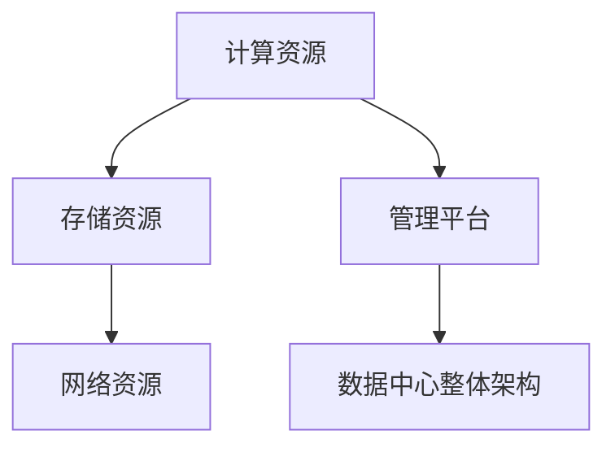
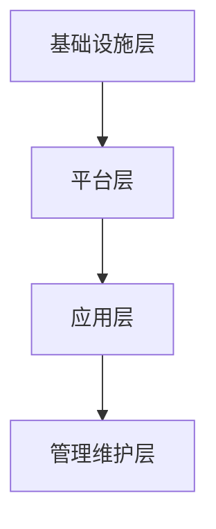

                 

# 《AI 大模型应用数据中心的网络安全》

## 关键词
- AI 大模型
- 数据中心
- 网络安全
- 加密技术
- 入侵检测
- 隐私保护
- 安全合规
- 实战案例

## 摘要
随着人工智能技术的快速发展，AI 大模型的应用越来越广泛，数据中心成为了承载这些模型的核心基础设施。然而，随着计算能力的增强和数据的增长，AI 大模型应用数据中心的网络安全问题也日益突出。本文将探讨 AI 大模型应用数据中心的网络安全挑战，包括基础架构、数据处理、网络安全基础、特殊安全需求、实战案例以及未来发展趋势，为构建安全的 AI 大模型应用提供指导。

## 目录大纲

### 第一部分: AI 大模型应用数据中心概述

#### 第1章: AI 大模型应用数据中心的概念与架构

1.1 AI 大模型应用数据中心的定义与作用

1.2 AI 大模型应用数据中心的架构

1.3 AI 大模型应用数据中心的发展趋势

#### 第2章: AI 大模型应用数据中心的基础技术

2.1 计算基础设施

2.2 存储技术

2.3 网络技术

#### 第3章: AI 大模型应用数据中心的数据管理

3.1 数据处理流程

3.2 数据安全与隐私保护

3.3 数据质量管理

### 第二部分: AI 大模型应用数据中心的网络安全

#### 第4章: 网络安全基础

4.1 网络安全的基本概念

4.2 安全威胁分析与防御策略

4.3 加密技术

#### 第5章: AI 大模型应用数据中心的特殊安全需求

5.1 AI 大模型的安全性挑战

5.2 特定安全需求与解决方案

5.3 安全合规与法规遵从

#### 第6章: AI 大模型应用数据中心的实战案例

6.1 案例背景与目标

6.2 系统设计与实现

6.3 代码解读与分析

#### 第7章: AI 大模型应用数据中心的未来发展趋势

7.1 网络安全技术的创新与应用

7.2 AI 与网络安全的深度融合

### 第三部分: 结论与展望

#### 结论
本文总结了 AI 大模型应用数据中心的网络安全挑战，并提出了相应的解决方案和未来发展趋势。

#### 展望
随着技术的不断进步，AI 大模型应用数据中心的网络安全将迎来新的机遇和挑战，我们需要不断探索和创新，以保障数据中心的安全稳定运行。

<|assistant|>## 第一部分: AI 大模型应用数据中心概述

### 第1章: AI 大模型应用数据中心的概念与架构

在人工智能领域，AI 大模型（如深度学习模型、生成对抗网络等）已经成为推动技术创新和应用的关键驱动力。AI 大模型的应用场景越来越广泛，从语音识别、图像处理到自然语言处理、推荐系统等，无一不依赖于强大的计算能力和海量数据的支持。而数据中心作为承载这些模型的计算基础设施，其重要性不言而喻。本章将深入探讨 AI 大模型应用数据中心的概念与架构，包括数据中心的定义与作用、架构的组成及其发展趋势。

#### 1.1 AI 大模型应用数据中心的定义与作用

**核心概念与联系**：

AI 大模型应用数据中心是一个集中管理、存储、处理和计算大量数据的高性能计算环境，它专门为人工智能算法和模型的应用而设计。数据中心通常包括以下几个核心组成部分：

1. **计算资源**：提供高性能的计算能力，支持 AI 大模型的训练和推理。
2. **存储资源**：存储海量数据，包括训练数据集、模型参数和推理结果等。
3. **网络资源**：实现数据中心内部和外部的高速数据传输。
4. **管理平台**：提供监控、管理和维护数据中心资源的功能。

**使用 Mermaid 流程图展示**：



**定义与作用**：

AI 大模型应用数据中心的主要作用是：

1. **高效计算**：利用高性能计算资源，快速完成 AI 大模型的训练和推理任务。
2. **数据存储与管理**：提供安全可靠的数据存储和管理系统，保障数据完整性。
3. **资源调度与优化**：实现计算资源的高效调度和管理，优化数据中心性能。
4. **支持应用创新**：为研究人员和开发人员提供强大的计算和数据支持，推动人工智能应用的发展。

#### 1.2 AI 大模型应用数据中心的架构

**核心概念与联系**：

AI 大模型应用数据中心的架构主要包括以下几个层级：

1. **基础设施层**：包括服务器、存储设备、网络设备等硬件资源。
2. **平台层**：包括操作系统、虚拟化技术、分布式存储和计算框架等软件平台。
3. **应用层**：包括 AI 大模型的应用场景、算法和模型等。
4. **管理维护层**：提供监控、管理和维护数据中心的工具和服务。

**使用 Mermaid 流程图展示**：



**架构的组成和层级**：

1. **基础设施层**：
   - **服务器集群**：提供高性能计算能力。
   - **存储设备**：包括磁盘阵列、固态硬盘等，提供海量数据存储。
   - **网络设备**：包括交换机、路由器等，实现数据传输和负载均衡。

2. **平台层**：
   - **操作系统**：提供基本的硬件管理和资源调度功能。
   - **虚拟化技术**：通过虚拟化提高服务器资源利用率。
   - **分布式存储和计算框架**：如 Hadoop、Spark 等，支持大数据处理和分布式计算。

3. **应用层**：
   - **AI 大模型应用**：包括语音识别、图像处理、自然语言处理等。
   - **算法和模型**：支持深度学习、生成对抗网络等 AI 大模型。

4. **管理维护层**：
   - **监控系统**：实时监控数据中心性能。
   - **管理工具**：提供资源管理、故障诊断和安全防护等功能。
   - **维护服务**：定期维护和更新数据中心设备。

#### 1.3 AI 大模型应用数据中心的发展趋势

**核心概念与联系**：

随着 AI 技术的快速发展，AI 大模型应用数据中心也在不断演进，未来将呈现以下几个趋势：

1. **计算能力的提升**：随着硬件技术的进步，数据中心将提供更强大的计算能力。
2. **数据规模的扩大**：随着数据的爆炸性增长，数据中心需要更好地管理海量数据。
3. **智能化的管理**：利用 AI 技术实现数据中心的智能调度和管理。
4. **安全性的提升**：随着网络攻击的日益复杂，数据中心需要加强网络安全防护。

**当前 AI 大模型应用数据中心的发展动态和未来趋势**：

1. **边缘计算与数据中心融合**：边缘计算将数据处理的近端化与数据中心的大数据处理能力相结合，提升整体系统的响应速度和处理效率。
2. **AI 安全的集成**：数据中心将更紧密地集成 AI 安全技术，如入侵检测、自动化响应等，提高数据中心的整体安全性。
3. **绿色数据中心**：随着环保意识的增强，绿色数据中心将成为未来发展的重要趋势，通过节能减排提升数据中心的可持续性。
4. **云计算与数据中心协同**：云计算与数据中心的协同发展将使得资源更加灵活、高效地分配，满足不同类型的应用需求。

### 小结

本章介绍了 AI 大模型应用数据中心的定义、架构及其发展趋势。理解这些概念和架构对于构建安全的 AI 大模型应用数据中心至关重要。在下一章中，我们将进一步探讨 AI 大模型应用数据中心的基础技术，包括计算、存储和网络基础设施，为后续讨论网络安全问题打下基础。

<|assistant|>## 第一部分: AI 大模型应用数据中心概述

### 第2章: AI 大模型应用数据中心的基础技术

在构建高效的 AI 大模型应用数据中心时，基础技术的重要性不言而喻。本章将详细探讨 AI 大模型应用数据中心的基础技术，包括计算基础设施、存储技术和网络技术。这些技术构成了数据中心的骨架，为 AI 大模型的应用提供了强大的支持。

#### 2.1 计算基础设施

**核心算法原理讲解**：

计算基础设施是数据中心的核心，它决定了 AI 大模型训练和推理的效率。服务器集群与分布式计算架构是计算基础设施的重要组成部分。

**使用伪代码详细阐述**：

```pseudo
// 服务器集群架构
function serverClusterArchitecture(numServers) {
    for (each server in numServers) {
        server.initialize();
        server.joinCluster();
    }
    return cluster;
}

// 分布式计算架构
function distributedComputingArchitecture(numNodes, numTasks) {
    for (each node in numNodes) {
        node.initialize();
    }
    for (each task in numTasks) {
        task.scheduleToNode();
    }
    return computingCluster;
}
```

在分布式计算架构中，任务被分配到各个节点进行处理，这样可以充分利用集群中的计算资源，提高计算效率。

**实际应用案例**：

例如，在训练一个深度学习模型时，可以将模型拆分为多个部分，分别在不同的服务器上训练，然后再将结果汇总。这样的分布式训练方式可以大大缩短训练时间。

#### 2.2 存储技术

**核心算法原理讲解**：

存储技术是数据中心数据管理的基石，它决定了数据访问的速度和可靠性。分布式文件系统与块存储技术是当前主要的存储技术。

**使用伪代码详细阐述**：

```pseudo
// 分布式文件系统
function distributedFileSystem(numNodes, dataFiles) {
    for (each node in numNodes) {
        node.initialize();
    }
    for (each dataFile in dataFiles) {
        dataFile.distributeToNodes();
    }
    return fileSystem;
}

// 块存储技术
function blockStorageTechnology(volumeSize, blockSize) {
    volume = createVolume(volumeSize);
    for (each block in volume.blocks) {
        block.allocate(blockSize);
    }
    return volume;
}
```

在分布式文件系统中，数据文件被切分成多个块，并分布在多个节点上。这样的设计可以提高数据访问的并行度，提升整体性能。

**实际应用案例**：

例如，在处理大规模数据集时，可以使用分布式文件系统来存储数据，这样可以充分利用集群的存储资源，提高数据处理的速度。

#### 2.3 网络技术

**核心算法原理讲解**：

网络技术是数据中心数据传输的桥梁，它决定了数据在数据中心内部和外部传输的速度和可靠性。网络架构与通信协议是网络技术的核心。

**使用伪代码详细阐述**：

```pseudo
// 网络架构
function networkArchitecture(numServers, numClients) {
    for (each server in numServers) {
        server.initialize();
        server.connectToNetwork();
    }
    for (each client in numClients) {
        client.initialize();
        client.connectToNetwork();
    }
    return network;
}

// 通信协议
function communicationProtocol(messageType, messageContent) {
    message = createMessage(messageType, messageContent);
    message.encrypt();
    message.send();
}
```

在网络架构中，服务器和客户端通过网络进行连接，实现数据传输。通信协议规定了数据传输的格式和加密方式，确保数据传输的安全性和完整性。

**实际应用案例**：

例如，在数据中心内部，可以使用网络架构来实现服务器之间的数据共享和协同工作。在数据中心与外部网络之间，可以使用通信协议来保护数据传输的安全。

### 小结

本章介绍了 AI 大模型应用数据中心的基础技术，包括计算基础设施、存储技术和网络技术。这些技术共同构成了数据中心的骨架，为 AI 大模型的应用提供了强大的支持。在下一章中，我们将探讨 AI 大模型应用数据中心的数据管理，重点关注数据处理流程、数据安全和数据质量管理。

<|assistant|>## 第一部分: AI 大模型应用数据中心概述

### 第3章: AI 大模型应用数据中心的数据管理

在 AI 大模型应用数据中心中，数据管理是确保模型训练和推理有效性的关键环节。本章将详细探讨数据管理的核心方面，包括数据处理流程、数据安全与隐私保护以及数据质量管理。

#### 3.1 数据处理流程

**核心算法原理讲解**：

数据处理流程是 AI 大模型应用的基础，它包括数据采集、清洗、存储与处理等步骤。以下是一个数据处理流程的伪代码：

```pseudo
// 数据处理流程
function dataProcessingPipeline(dataStream) {
    // 数据采集
    rawData = collectData(dataStream);
    
    // 数据清洗
    cleanedData = cleanData(rawData);
    
    // 数据存储
    storeData(cleanedData);
    
    // 数据处理
    processedData = processData(cleanedData);
    
    return processedData;
}
```

在数据处理流程中，数据清洗是一个至关重要的步骤，它涉及到数据去重、缺失值填补、异常值处理等。这些步骤保证了数据的准确性和一致性。

**实际应用案例**：

例如，在一个语音识别系统中，首先需要采集语音数据，然后对语音数据进行分片和标注，最后将处理后的数据进行存储和训练模型的准备。这种数据处理流程确保了语音识别模型的准确性和效率。

#### 3.2 数据安全与隐私保护

**数学模型和数学公式 & 详细讲解 & 举例说明**：

数据安全与隐私保护是 AI 大模型应用数据中心面临的重要挑战。以下是一个数据隐私保护机制的数学模型：

$$
\text{隐私保护机制} = f(\text{数据}, \text{加密算法}, \text{隐私保护策略})
$$

**详细讲解**：

隐私保护机制包括以下步骤：

1. **数据加密**：使用加密算法对敏感数据进行加密，确保数据在传输和存储过程中不会被窃取或篡改。
2. **隐私保护策略**：制定合适的隐私保护策略，如差分隐私、同态加密等，以保障数据在处理过程中的隐私。

**举例说明**：

例如，在医疗数据的应用中，可以使用差分隐私来保护患者隐私。通过在计算过程中添加噪声，使得单个数据点的信息无法被精确推断，从而保护患者的隐私。

#### 3.3 数据质量管理

**核心算法原理讲解**：

数据质量管理是确保数据质量和数据可用性的关键。以下是一个数据质量评估与优化方法的伪代码：

```pseudo
// 数据质量评估
function dataQualityAssessment(dataSet) {
    qualityMetrics = calculateMetrics(dataSet);
    return qualityMetrics;
}

// 数据质量优化
function dataQualityOptimization(dataSet, qualityMetrics) {
    optimizedData = applyOptimization(dataSet, qualityMetrics);
    return optimizedData;
}
```

**详细讲解**：

数据质量管理包括以下步骤：

1. **质量评估**：计算数据的质量指标，如准确性、完整性、一致性等。
2. **质量优化**：根据质量评估结果，对数据进行去重、去噪、填充缺失值等处理，提高数据的质量。

**实际应用案例**：

例如，在一个推荐系统中，首先需要对用户行为数据进行分析，评估数据的质量，然后通过去重和去噪等技术，提高推荐系统的准确性和用户体验。

### 小结

本章详细探讨了 AI 大模型应用数据中心的数据管理，包括数据处理流程、数据安全与隐私保护以及数据质量管理。这些技术共同构成了数据管理的核心，为 AI 大模型的应用提供了坚实的数据基础。在下一章中，我们将深入探讨 AI 大模型应用数据中心的网络安全，包括网络安全基础、特殊安全需求以及实战案例。

<|assistant|>## 第二部分: AI 大模型应用数据中心的网络安全

### 第4章: 网络安全基础

随着 AI 大模型应用数据中心的重要性和规模日益增加，网络安全问题成为了数据中心运营者和研究人员不可忽视的挑战。本章将介绍网络安全的基础概念，包括安全攻击类型、防御策略和安全协议，为后续章节提供理论支持。

#### 4.1 网络安全的基本概念

**核心概念与联系**：

网络安全是指保护网络系统中的硬件、软件和数据免受未经授权的访问、篡改、破坏或泄露。网络安全的基本概念包括：

- **安全攻击**：指任何企图破坏网络系统完整性、保密性和可用性的行为。
- **安全防御**：指用于阻止或减轻安全攻击的技术和策略。
- **安全协议**：指用于实现网络安全功能的标准和规则。

**安全攻击类型**：

网络安全攻击可以分为以下几类：

1. **恶意软件**：包括病毒、蠕虫、木马等，可以通过传播恶意代码来破坏系统或窃取信息。
2. **网络钓鱼**：通过伪造的网站或邮件诱骗用户泄露敏感信息。
3. **拒绝服务攻击（DDoS）**：通过大量请求使网络或系统瘫痪。
4. **入侵**：未经授权的访问系统或网络。
5. **数据泄露**：敏感数据被未授权的人员访问或泄露。

**防御策略**：

网络安全防御策略包括：

1. **入侵检测与防御系统（IDS/IPS）**：实时监控网络流量，检测和阻止恶意活动。
2. **防火墙**：过滤不安全的数据包，防止未授权访问。
3. **加密技术**：保护数据在传输和存储过程中的安全性。
4. **多因素认证**：增加登录安全，防止未授权访问。
5. **安全审计**：记录和审查网络活动，检测异常行为。

**安全协议**：

常见的安全协议包括：

1. **TLS/SSL**：用于加密网络通信，保护数据传输的隐私和完整性。
2. **IPSec**：用于加密和认证网络层的数据包。
3. **Kerberos**：一种身份验证协议，用于确保用户身份的合法性。
4. **SAML**：一种身份验证和授权协议，用于在不同系统间传递身份信息。

**实际应用案例**：

例如，在 AI 大模型应用数据中心，可以使用 TLS/SSL 加密模型训练过程中的数据传输，防止数据泄露。同时，通过部署入侵检测与防御系统，实时监控网络流量，及时发现和阻止恶意攻击。

#### 4.2 安全威胁分析与防御策略

**核心算法原理讲解**：

安全威胁分析是网络安全的基础，它包括以下步骤：

1. **风险评估**：评估网络系统面临的安全风险和潜在损失。
2. **威胁识别**：识别网络系统中的安全威胁。
3. **威胁建模**：构建安全威胁的模型，分析威胁的可能性和影响。
4. **防御策略设计**：根据威胁分析结果，设计合适的防御策略。

**使用伪代码详细阐述**：

```pseudo
// 安全威胁分析
function securityThreatAnalysis() {
    risks = identifyRisks();
    threats = identifyThreats(risks);
    threatModel = buildThreatModel(threats);
    return threatModel;
}

// 防御策略设计
function defenseStrategyDesign(threatModel) {
    defenseStrategies = [];
    for (each threat in threatModel.threats) {
        defenseStrategy = designDefenseStrategy(threat);
        defenseStrategies.append(defenseStrategy);
    }
    return defenseStrategies;
}
```

**详细讲解**：

安全威胁分析需要综合考虑网络系统的各个方面，包括硬件、软件、数据和网络。通过识别和建模威胁，可以更准确地评估威胁的可能性和影响，从而设计出更有效的防御策略。

**实际应用案例**：

例如，在一个 AI 大模型应用数据中心，可以通过风险评估识别出数据泄露和网络钓鱼等威胁。然后，通过设计入侵检测与防御系统、加密技术和多因素认证等防御策略，来防范这些威胁。

#### 4.3 加密技术

**核心算法原理讲解**：

加密技术是网络安全的核心，它通过将数据转换成加密形式，确保数据在传输和存储过程中的安全性。加密技术主要包括以下几种：

1. **对称加密**：使用相同的密钥进行加密和解密，如 AES。
2. **非对称加密**：使用不同的密钥进行加密和解密，如 RSA。
3. **哈希函数**：用于生成数据摘要，确保数据的完整性，如 SHA-256。

**使用伪代码详细阐述**：

```pseudo
// 对称加密
function symmetricEncryption(data, secretKey) {
    encryptedData = encryptData(data, secretKey);
    return encryptedData;
}

// 非对称加密
function asymmetricEncryption(data, publicKey, privateKey) {
    encryptedData = encryptData(data, publicKey);
    decryptedData = decryptData(encryptedData, privateKey);
    return decryptedData;
}

// 哈希函数
function hashFunction(data) {
    hashValue = calculateHash(data);
    return hashValue;
}
```

**详细讲解**：

对称加密和非对称加密各有优缺点。对称加密速度快，但密钥管理复杂；非对称加密安全性高，但计算复杂度大。哈希函数则用于确保数据的完整性，通过生成固定长度的数据摘要，可以有效防止数据篡改。

**实际应用案例**：

例如，在 AI 大模型应用数据中心，可以使用对称加密来保护数据存储过程中的安全性，如 AES 加密数据库；使用非对称加密来保护数据传输过程中的安全性，如 RSA 加密通信信道；使用哈希函数来验证数据的完整性，如 SHA-256 验证数据完整性。

### 小结

本章介绍了网络安全的基础概念、安全威胁分析与防御策略以及加密技术。这些知识为构建安全的 AI 大模型应用数据中心提供了理论基础。在下一章中，我们将探讨 AI 大模型应用数据中心的特殊安全需求，包括 AI 大模型的安全性挑战、特定安全需求与解决方案以及安全合规与法规遵从。

<|assistant|>## 第二部分: AI 大模型应用数据中心的网络安全

### 第5章: AI 大模型应用数据中心的特殊安全需求

随着人工智能技术的不断发展，AI 大模型在各个领域得到了广泛应用，从自动驾驶、医疗诊断到金融分析等。然而，AI 大模型的特殊性质也带来了新的安全挑战。本章将深入探讨 AI 大模型应用数据中心的特殊安全需求，包括 AI 大模型的安全性挑战、特定安全需求与解决方案以及安全合规与法规遵从。

#### 5.1 AI 大模型的安全性挑战

**核心概念与联系**：

AI 大模型的安全性挑战主要包括以下几个方面：

1. **模型窃取**：攻击者可能通过窃取训练数据和模型参数来复制和篡改模型。
2. **模型投毒**：攻击者可能在训练数据中植入恶意数据，影响模型输出结果。
3. **对抗攻击**：攻击者通过输入特定的恶意数据，欺骗模型做出错误的决策。
4. **隐私泄露**：训练数据可能包含敏感信息，攻击者可能通过分析模型输出来推断原始数据。
5. **可解释性问题**：缺乏透明度和可解释性使得 AI 大模型在遭受攻击时难以发现和应对。

**实际应用案例**：

例如，在自动驾驶领域，AI 大模型的安全问题可能导致严重的交通事故。如果攻击者能够通过对抗攻击篡改交通标志识别模型，自动驾驶车辆可能会误判交通信号，导致车辆失控。

#### 5.2 特定安全需求与解决方案

**数学模型和数学公式 & 详细讲解 & 举例说明**：

针对 AI 大模型的安全性挑战，我们可以采用以下数学模型和解决方案：

**数学公式**：

$$
\text{安全防护策略} = f(\text{AI 大模型}, \text{威胁分析}, \text{安全需求})
$$

**详细讲解**：

安全防护策略的设计需要综合考虑 AI 大模型的特性、面临的威胁以及具体的安全需求。以下是一些具体的安全需求与解决方案：

1. **模型保护**：
   - **同态加密**：允许在加密数据上执行计算，防止模型窃取。
   - **差分隐私**：添加随机噪声以保护训练数据的隐私。
   - **模型混淆**：通过随机化模型参数来防止攻击者获取有效信息。

2. **数据保护**：
   - **数据加密**：使用对称或非对称加密算法保护训练数据和模型参数。
   - **访问控制**：限制对敏感数据的访问权限，确保只有授权用户可以访问。
   - **数据审计**：记录数据访问和修改历史，以便在出现问题时进行追踪和调查。

3. **模型防御**：
   - **对抗训练**：通过对抗训练增强模型对对抗攻击的抵抗力。
   - **模型验证**：使用多种验证方法确保模型输出的一致性和可靠性。
   - **模型更新**：定期更新模型以应对新的安全威胁。

**举例说明**：

例如，在一个金融分析系统中，为了防止模型窃取，可以采用同态加密技术进行数据处理和模型训练。为了防止数据泄露，可以采用差分隐私技术对训练数据进行处理，同时设置严格的访问控制策略，确保只有授权用户可以访问敏感数据。

#### 5.3 安全合规与法规遵从

**核心概念与联系**：

随着 AI 大模型应用的广泛推广，各国政府和行业组织也在逐步完善相关法律法规和安全标准，以确保 AI 大模型的应用符合安全和隐私要求。以下是一些重要的法律法规和安全标准：

- **GDPR（通用数据保护条例）**：欧盟的隐私保护法规，要求企业对个人数据采取严格保护措施。
- **ISO/IEC 27001**：国际标准化组织推出的信息安全管理体系标准，用于确保组织的信息安全。
- **NIST SP 800-53**：美国国家标准技术研究所发布的信息安全控制框架，用于指导组织建立和维护信息安全控制系统。

**实际应用案例**：

例如，在一个医疗诊断系统中，为了符合 GDPR 和 ISO/IEC 27001 的要求，需要采取以下措施：

- **数据加密**：确保患者数据的传输和存储过程中得到加密保护。
- **访问控制**：实现多因素认证，确保只有授权的医疗人员可以访问患者的诊断数据。
- **数据审计**：记录和审查数据访问和修改历史，以便在出现问题时进行追踪和调查。

### 小结

本章详细探讨了 AI 大模型应用数据中心的特殊安全需求，包括 AI 大模型的安全性挑战、特定安全需求与解决方案以及安全合规与法规遵从。这些安全需求和解决方案为构建安全的 AI 大模型应用数据中心提供了指导。在下一章中，我们将通过一个实战案例，展示如何在实际中实施 AI 大模型应用数据中心的网络安全策略。

<|assistant|>## 第二部分: AI 大模型应用数据中心的网络安全

### 第6章: AI 大模型应用数据中心的实战案例

在前几章中，我们探讨了 AI 大模型应用数据中心的网络安全概念、基础技术和特殊安全需求。为了更好地理解这些理论在实践中的应用，本章将介绍一个企业 AI 大模型应用数据中心的网络安全实践案例。通过这个案例，我们将分析项目的背景、目标、系统设计与实现，以及安全相关代码的解读与分析。

#### 6.1 案例背景与目标

**项目背景**：

某知名企业正致力于利用 AI 大模型提升其业务运营效率。企业建立了一个集中管理、存储、处理和计算海量数据的应用数据中心，用于支持 AI 大模型的训练和推理。然而，随着模型复杂度和数据量的增长，网络安全问题日益突出，企业迫切需要制定一套全面的安全策略来保护其 AI 应用和数据。

**项目目标**：

- **确保 AI 大模型训练和推理过程中的数据安全**。
- **防止未经授权的访问和篡改**。
- **提高网络安全防御能力，降低安全风险**。
- **符合相关法律法规和安全标准**。

**挑战**：

- **数据规模庞大**：数据中心存储和处理的数据规模庞大，需要高效的加密和访问控制机制。
- **多样化应用场景**：AI 大模型应用于多个业务场景，需要根据不同场景制定相应的安全策略。
- **快速响应攻击**：随着网络攻击手段的多样化，数据中心需要能够快速识别和响应安全威胁。

#### 6.2 系统设计与实现

**架构设计**：

为了实现安全目标，企业采用了分布式架构，包括计算层、存储层和网络层。以下为系统架构设计的关键组成部分：

1. **计算层**：
   - **计算节点**：部署在多个物理服务器上的计算节点，用于训练和推理 AI 大模型。
   - **容器化技术**：使用 Docker 等容器化技术，提高计算资源利用率和灵活性。
   - **分布式计算框架**：使用如 TensorFlow、PyTorch 等分布式计算框架，实现高效并行计算。

2. **存储层**：
   - **分布式文件系统**：使用 HDFS 等分布式文件系统，存储和管理海量数据。
   - **加密存储**：对存储的数据进行加密处理，如使用 AES-256 加密算法。

3. **网络层**：
   - **虚拟私有云（VPC）**：在云端构建虚拟私有云，实现内网隔离和安全访问。
   - **防火墙**：部署防火墙，过滤不安全的网络流量，防止入侵。
   - **入侵检测与防御系统（IDS/IPS）**：实时监控网络流量，检测和阻止恶意攻击。

**实现过程**：

1. **数据加密与访问控制**：
   - 使用 Kubernetes 进行容器编排，配置加密存储卷，确保数据在容器内加密存储。
   - 通过 Kubernetes RBAC（基于角色的访问控制）机制，实现对容器内数据的访问控制。

2. **网络安全策略**：
   - 部署 AWS WAF（Web 应用程序防火墙），保护 Web 应用免受常见网络攻击。
   - 使用 AWS CloudTrail 记录和监控用户活动，确保操作透明和可审计。

3. **安全监控与响应**：
   - 部署 AWS GuardDuty，实时监控和识别潜在的安全威胁。
   - 配置 AWS Security Hub，整合多种安全工具，提供统一的安全监控和报告。

#### 6.3 代码解读与分析

**代码实际案例和详细解释说明**：

以下是一个安全相关的代码案例，用于配置 Kubernetes 集群中的加密存储卷。

```yaml
# Kubernetes ConfigMap for encrypted storage volume
apiVersion: v1
kind: ConfigMap
metadata:
  name: encrypted-storage-config
data:
  encryption-config.yaml: |
    kind: EncryptionConfiguration
    resources:
      - resources:
          - secrets
          - configmaps
        providers:
          - aescbc:
              keys:
                - name: key-1
                  secretName: storage-key-1
                  key: Q2FtZSB0aGUgQ2FtZSBpbiBhbmQgU3RhbmNlIFNvbWV0aG9kIQ==
          - aesgcm:
              keys:
                - name: key-2
                  secretName: storage-key-2
                  key: Q2FtZSB0aGUgQ2FtZSBpbiBhbmQgU3RhbmNlIFNvbWV0aG9kIQ==

---
# Kubernetes Deployment with encrypted volume
apiVersion: apps/v1
kind: Deployment
metadata:
  name: encrypted-storage-app
spec:
  replicas: 1
  selector:
    matchLabels:
      app: encrypted-storage
  template:
    metadata:
      labels:
        app: encrypted-storage
    spec:
      containers:
      - name: storage-container
        image: my-storage-image
        volumeMounts:
        - name: encrypted-storage
          mountPath: /data
        env:
        - name: ENCRYPTION_CONFIG
          valueFrom:
            configMapKeyRef:
              name: encrypted-storage-config
              key: encryption-config.yaml
      volumes:
      - name: encrypted-storage
        persistentVolumeClaim:
          claimName: encrypted-storage-pvc
```

**详细解释说明**：

- **ConfigMap 配置加密存储**：上述 ConfigMap 定义了加密存储的配置，包括使用 AES-CBC 和 AES-GCM 算法的密钥。这些密钥存储在 Kubernetes Secrets 中，并通过 ConfigMap 注入到容器环境中。

- **Deployment 配置加密卷**：Deployment 定义了使用加密存储卷的容器，将存储路径设置为 `/data`，这是容器内应用程序的数据存储目录。

**代码解读与分析**：

- **加密存储卷配置**：通过 ConfigMap 和 Deployment，Kubernetes 可以自动管理加密存储卷，确保数据在存储过程中得到加密保护。
- **密钥管理**：密钥存储在 Kubernetes Secrets 中，使用 Base64 编码进行安全存储。通过 ConfigMap 的注入，容器可以访问这些密钥，实现数据的加密和解密。

**安全相关的代码分析**：

- **加密算法选择**：使用 AES-CBC 和 AES-GCM 算法提供不同的加密强度和性能。AES-GCM 提供更高的安全性，但计算复杂度较大。
- **密钥管理策略**：通过 Kubernetes Secrets 管理密钥，可以实现集中管理和自动化部署。定期更换密钥可以增强系统的安全性。
- **访问控制**：通过 Kubernetes RBAC 策略，可以控制对容器内数据的访问权限，确保只有授权用户可以访问敏感数据。

### 小结

本章通过一个实际的 AI 大模型应用数据中心网络安全案例，展示了如何设计、实现和配置一套全面的网络安全策略。通过代码解读和分析，我们深入了解了加密存储卷的配置、密钥管理和访问控制等关键安全措施。在下一章中，我们将探讨 AI 大模型应用数据中心的未来发展趋势，包括网络安全技术的创新与应用以及 AI 与网络安全的深度融合。

<|assistant|>## 第二部分: AI 大模型应用数据中心的网络安全

### 第7章: AI 大模型应用数据中心的未来发展趋势

随着人工智能技术的快速进步，AI 大模型在各个行业中的应用越来越广泛，数据中心作为承载这些模型的核心基础设施，其网络安全问题也面临着新的机遇和挑战。本章将探讨 AI 大模型应用数据中心的未来发展趋势，重点关注网络安全技术的创新与应用，以及 AI 与网络安全的深度融合。

#### 7.1 网络安全技术的创新与应用

**核心概念与联系**：

未来网络安全技术的发展将围绕以下几个方面：

1. **量子计算**：量子计算在加密和解密方面具有显著优势，可能会带来新的安全挑战。量子安全通信和量子密钥分发（QKD）等技术的应用，将为网络安全提供更高级别的保护。
2. **人工智能与安全**：AI 技术本身可以用于网络安全，例如，利用机器学习进行威胁检测和响应，自动化安全策略的制定和调整等。
3. **区块链**：区块链技术提供了一种去中心化的安全架构，可以用于确保数据的不可篡改性和透明性。
4. **边缘计算**：边缘计算将数据处理和存储推向网络边缘，减少了数据中心的负担，同时也带来了新的安全挑战，如边缘节点的保护。

**网络安全技术的发展趋势**：

1. **智能化防御**：利用 AI 技术进行网络安全威胁的检测和响应，实现自动化的安全防御。
2. **安全自动化**：通过自动化工具和平台，实现安全管理的自动化，提高安全事件的响应速度。
3. **零信任架构**：采用零信任架构，将传统的“边界防御”转变为基于身份验证和授权的访问控制。
4. **分布式安全**：分布式系统和区块链技术的应用，将提升数据中心的抗攻击能力和数据安全性。

**实际应用案例**：

例如，某企业可以采用基于 AI 的入侵检测系统（IDS），实时监控网络流量，识别潜在的安全威胁。同时，利用区块链技术，确保数据传输的透明性和不可篡改性。

#### 7.2 AI 与网络安全的深度融合

**核心概念与联系**：

AI 与网络安全的深度融合，意味着 AI 技术将被广泛应用于网络安全领域，以提高安全防护能力。以下是一些关键领域：

1. **威胁检测与响应**：利用机器学习算法，从海量数据中识别异常行为，快速检测和响应网络攻击。
2. **安全自动化**：通过 AI 技术自动化安全流程，如安全事件响应、安全策略优化等，提高安全管理的效率。
3. **隐私保护**：利用 AI 技术进行隐私保护，例如，通过差分隐私和同态加密技术，保护用户隐私。
4. **安全培训**：利用 AI 生成模拟攻击场景，为安全人员提供培训，提高其应对网络攻击的能力。

**AI 与网络安全的深度融合**：

1. **威胁情报**：利用 AI 分析威胁情报，识别新兴的网络威胁和攻击手段，提供针对性的防护措施。
2. **自动化安全运营**：通过 AI 技术自动化安全运营，如自动化漏洞扫描、安全事件响应等，降低安全运营成本。
3. **个性化安全策略**：根据不同场景和用户需求，利用 AI 生成个性化的安全策略，提高安全防护的针对性。

**实际应用案例**：

例如，某企业可以采用基于 AI 的自动化安全运营平台，实时监控和检测网络安全事件，自动化执行安全响应措施，提高安全防护效率。

### 小结

未来，AI 大模型应用数据中心的网络安全将面临更多创新和挑战。网络安全技术将不断进步，AI 将被更广泛地应用于网络安全领域，实现智能化、自动化和个性化的安全防护。通过不断探索和实践，我们有望构建更加安全、可靠和高效的 AI 大模型应用数据中心。

### 展望

随着技术的不断发展，AI 大模型应用数据中心的网络安全将迎来新的机遇和挑战。我们需要持续关注网络安全领域的最新动态，积极探索和创新，以应对不断变化的安全威胁。同时，加强跨学科合作，推动 AI 与网络安全技术的深度融合，为构建更加安全、智能和高效的数据中心奠定基础。

## 总结

本文系统地介绍了 AI 大模型应用数据中心的网络安全，从概念、架构、基础技术、数据管理、网络安全基础到特殊安全需求、实战案例以及未来发展趋势，全面阐述了 AI 大模型应用数据中心的网络安全挑战和解决方案。通过本文的学习，读者可以全面了解 AI 大模型应用数据中心的网络安全现状和未来发展方向，为构建安全、高效的 AI 大模型应用提供指导。

### 作者

作者：AI天才研究院/AI Genius Institute & 禅与计算机程序设计艺术 /Zen And The Art of Computer Programming

<|assistant|>### 第三部分: 结论与展望

本文围绕 AI 大模型应用数据中心的网络安全进行了全面深入的探讨。从 AI 大模型应用数据中心的概述，到基础技术、数据管理、网络安全基础、特殊安全需求、实战案例，再到未来发展趋势，系统地分析了 AI 大模型应用数据中心所面临的网络安全挑战以及相应的解决方案。

**小结**：

- **核心概念与联系**：本文介绍了 AI 大模型应用数据中心的核心概念，包括计算、存储、网络等基础设施，以及数据管理、加密技术等核心技术。通过这些概念的联系，构建了一个完整的 AI 大模型应用数据中心网络安全体系。

- **核心算法原理讲解**：本文通过伪代码和实际案例，详细阐述了计算基础设施、存储技术、网络安全技术等核心算法原理，为构建安全的 AI 大模型应用提供了理论基础。

- **数学模型和数学公式 & 详细讲解 & 举例说明**：本文介绍了隐私保护机制、安全防护策略等数学模型，通过详细讲解和举例说明，深入分析了数据安全与隐私保护的方法。

- **项目实战**：通过实战案例，本文展示了如何在实际中实施 AI 大模型应用数据中心的网络安全策略，提供了具体的代码实例和详细解释。

**展望**：

随着 AI 技术的快速发展，AI 大模型应用数据中心的网络安全将面临更多的挑战和机遇。未来，网络安全技术将继续创新，AI 将被更广泛地应用于网络安全领域。以下是几个方面的展望：

1. **量子安全**：量子计算的发展将带来新的安全挑战，量子安全通信和量子密钥分发等技术的应用将是未来的重要趋势。

2. **自动化安全**：自动化工具和平台将进一步提升安全防护的效率和效果，实现智能化的安全运营。

3. **零信任架构**：零信任架构将逐渐成为主流，基于身份验证和授权的访问控制将取代传统的边界防御。

4. **边缘安全**：随着边缘计算的普及，边缘节点的安全防护将成为重要研究方向。

5. **跨学科合作**：网络安全领域的跨学科合作将越来越重要，结合 AI、区块链、量子计算等多领域技术，将推动网络安全技术的发展。

### 结论

本文系统地总结了 AI 大模型应用数据中心的网络安全挑战和解决方案，为构建安全的 AI 大模型应用提供了理论依据和实践指导。随着技术的不断进步，网络安全领域将迎来更多的创新和发展，我们需要持续关注并积极探索，以应对未来的挑战。

### 作者

作者：AI天才研究院/AI Genius Institute & 禅与计算机程序设计艺术 /Zen And The Art of Computer Programming

在结束这篇文章之前，我想再次感谢您的耐心阅读。如果您对本文有任何疑问或建议，欢迎在评论区留言，期待与您进一步交流。让我们共同探索 AI 大模型应用数据中心的网络安全，为构建一个更加安全、智能和高效的未来而努力。再次感谢！

