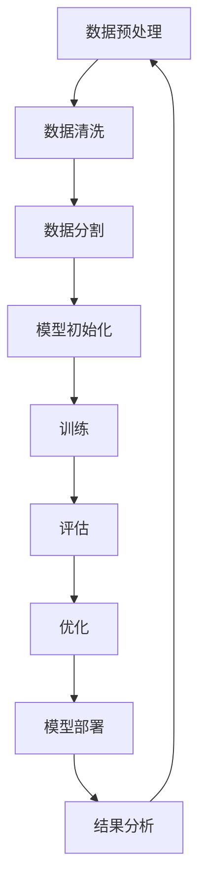

                 

### 文章标题

《AIGC的情景模拟能力：角色扮演和情境构建的提示词设计》

关键词：人工智能生成内容（AIGC）、情景模拟、角色扮演、情境构建、提示词设计

摘要：本文深入探讨了人工智能生成内容（AIGC）的情景模拟能力，特别是角色扮演和情境构建的提示词设计。文章首先概述了AIGC的基本概念和核心特点，随后详细阐述了情景模拟的概念、分类及应用场景。接着，文章分别从角色扮演和情境构建的角度，探讨了它们的基本原理、设计流程、关键要素和应用。此外，文章还介绍了提示词的设计原则、类型及其应用案例，并通过实战案例展示了AIGC情景模拟的实际应用。最后，文章对AIGC情景模拟的未来发展趋势和挑战进行了展望。本文旨在为AIGC情景模拟领域的研究者和从业者提供有价值的参考和指导。|> 

### AIGC与情景模拟

#### 1. AIGC概述

**AIGC（Artificial Intelligence Generated Content）**，即人工智能生成内容，是一种利用人工智能技术生成内容的方法。AIGC涵盖了文本、图像、音频等多种类型的内容生成，其核心是通过机器学习和深度学习算法，从大量数据中学习并生成新的、有价值的内容。

**AIGC的定义与背景**

AIGC的定义可以概括为：通过人工智能技术，如自然语言处理、计算机视觉和深度学习等，自动生成文本、图像、音频等内容的系统或方法。

AIGC的背景源于人工智能技术的快速发展和数据量的爆炸式增长。随着互联网的普及和数据采集技术的进步，海量的数据为人工智能的训练提供了丰富的资源。同时，人工智能技术的进步，使得计算机在理解和生成内容方面取得了显著成果。

**AIGC的主要特点**

- **自动性**：AIGC通过算法自动生成内容，无需人工干预。
- **多样性**：AIGC可以生成多种类型的内容，如文本、图像、音频等。
- **高效性**：AIGC可以快速生成内容，提高了生产效率。
- **创造性**：AIGC能够在生成内容时展现创造性，提供新的视角和思路。

**AIGC的核心技术**

AIGC的核心技术包括自然语言处理（NLP）、计算机视觉（CV）和深度学习（DL）等。

- **自然语言处理（NLP）**：NLP是AIGC中处理文本内容的关键技术，包括词法分析、句法分析、语义分析等。NLP技术使得AIGC能够理解和生成自然语言文本。
- **计算机视觉（CV）**：CV是AIGC中处理图像和视频内容的关键技术，包括图像识别、目标检测、图像生成等。CV技术使得AIGC能够理解和生成视觉内容。
- **深度学习（DL）**：DL是AIGC的核心技术，通过构建大规模神经网络，使得AIGC能够在多种任务中实现自动化和智能化。

#### 2. 情景模拟的概念与分类

**情景模拟的定义**

情景模拟（Scenario Simulation）是一种基于特定目标和情境，利用计算机技术模拟实际场景的方法。通过情景模拟，可以预测和分析系统在不同情况下的行为和结果。

**情景模拟的应用场景**

情景模拟广泛应用于多个领域，如商业决策、教育培训、社会治理等。

- **商业决策模拟**：通过情景模拟，企业可以模拟不同商业策略和决策的影响，从而做出更科学的决策。
- **教育培训模拟**：通过情景模拟，教育者可以模拟实际工作场景，提高学生的实践能力和解决问题的能力。
- **社会治理模拟**：通过情景模拟，政府和社会组织可以模拟社会事件和冲突，制定有效的预防和应对策略。

**情景模拟的分类**

根据模拟对象和目的的不同，情景模拟可以分为以下几类：

- **静态情景模拟**：静态情景模拟主要模拟固定场景下的系统行为，通常用于风险评估和决策分析。
- **动态情景模拟**：动态情景模拟主要模拟变化场景下的系统行为，通常用于模拟复杂系统的动态变化。
- **交互式情景模拟**：交互式情景模拟允许用户与模拟系统进行交互，通过用户的输入和反馈，动态调整模拟结果。

#### 3. 情景模拟的分类

情景模拟可以根据不同的标准进行分类，以下是几种常见的分类方式：

- **根据模拟对象分类**：情景模拟可以针对不同对象进行分类，如商业决策模拟、教育培训模拟、社会治理模拟等。
- **根据模拟技术分类**：情景模拟可以基于不同的技术进行分类，如基于计算机模拟、基于物理模拟、基于数学模型模拟等。
- **根据模拟目标分类**：情景模拟可以基于不同的目标进行分类，如风险评估、决策分析、战略规划等。

### 附录：Mermaid流程图和伪代码示例

#### 附录 A: AI大模型训练流程



#### 附录 B: 深度学习算法伪代码

```python
# 初始化权重
W = 权重初始化()

# 前向传播
Z = X * W
A = 激活函数(Z)

# 反向传播
dZ = A * (1 - A) * (Y - A)
dW = dZ * X
dX = dZ * W

# 更新权重
W = W - 学习率 * dW
```

#### 附录 C: 数学公式

```latex
\section{数学模型}
$$
f(x) = \frac{1}{1 + e^{-x}}
$$

$$
\text{损失函数} = \frac{1}{2} \sum_{i} (y_i - \hat{y}_i)^2
$$
```

#### 附录 D: 数据预处理代码示例

```python
import pandas as pd
from sklearn.model_selection import train_test_split

# 读取数据
data = pd.read_csv('data.csv')

# 数据清洗
data.dropna(inplace=True)
data = data[data['feature'] > 0]

# 数据分割
X = data[['feature']]
y = data['target']
X_train, X_test, y_train, y_test = train_test_split(X, y, test_size=0.2, random_state=42)
```

#### 附录 E: 深度学习模型实现

```python
import tensorflow as tf
from tensorflow.keras.models import Sequential
from tensorflow.keras.layers import Dense, Activation

# 构建模型
model = Sequential()
model.add(Dense(units=64, activation='relu', input_shape=(input_shape,)))
model.add(Dense(units=1, activation='sigmoid'))

# 编译模型
model.compile(optimizer='adam', loss='binary_crossentropy', metrics=['accuracy'])

# 训练模型
model.fit(X_train, y_train, epochs=10, batch_size=32, validation_data=(X_test, y_test))

# 评估模型
loss, accuracy = model.evaluate(X_test, y_test)
print(f"Test Accuracy: {accuracy:.2f}")
```

通过以上章节的介绍，我们了解了AIGC的基本概念、核心技术和应用场景，以及情景模拟的概念、分类和应用。接下来，我们将分别从角色扮演和情境构建的角度，深入探讨AIGC的情景模拟能力。|> 

### 角色扮演

角色扮演是情景模拟中的一个重要环节，它能够帮助用户更好地理解和应对复杂的场景。在AIGC的情景模拟中，角色扮演通过为模拟系统中的每个参与者分配特定的角色和任务，来模拟实际生活中的互动和决策过程。

#### 3. 角色扮演的基本原理

**角色扮演的定义与作用**

角色扮演（Role-playing）是指在模拟过程中，参与者通过扮演不同的角色，模拟实际情境中的人际互动和决策过程。角色扮演在情景模拟中的作用主要体现在以下几个方面：

1. **提高参与者的认知水平**：通过角色扮演，参与者可以更深入地了解不同角色的职责和任务，从而提高对复杂情境的认知水平。
2. **促进交流和合作**：角色扮演能够模拟真实世界中的互动场景，促进参与者之间的交流和合作，提高解决问题的能力。
3. **发现潜在问题**：通过角色扮演，可以发现模拟系统中潜在的问题和不足，为后续优化提供参考。

**角色扮演的设计流程**

角色扮演的设计是一个系统性的过程，通常包括以下几个步骤：

1. **确定模拟目标和场景**：明确角色扮演的目的和要模拟的情境，这是角色扮演设计的基础。
2. **定义角色**：根据模拟目标和情境，定义参与者的角色，包括角色的职责、任务和目标。
3. **分配角色**：根据参与者的特点和角色需求，合理分配角色，确保每个角色都有明确的扮演者。
4. **设计角色行为**：为每个角色设计具体的行为和决策逻辑，以模拟真实情境中的互动和决策过程。
5. **测试与优化**：在角色扮演过程中，不断测试和优化角色行为和决策逻辑，确保模拟结果的准确性和可靠性。

**角色扮演的案例分析**

以下是一个角色扮演的案例分析，该案例来自商业决策模拟领域。

**案例背景**：一家公司计划推出一款新产品，需要进行市场调研和产品定位。公司邀请了市场部、研发部和销售部的人员参与角色扮演，模拟产品推出的过程。

**角色定义**：

- **市场部**：负责市场调研、竞争对手分析和产品定位。
- **研发部**：负责新产品的研发和设计。
- **销售部**：负责新产品的市场推广和销售。

**角色行为设计**：

- **市场部**：收集市场数据，分析竞争对手，提出产品定位建议。
- **研发部**：根据市场部提出的建议，进行产品设计和研发。
- **销售部**：制定市场推广计划，开展销售活动。

**角色扮演过程**：

1. **市场部**：通过角色扮演，市场部收集了市场数据和竞争对手信息，提出了产品定位建议。
2. **研发部**：根据市场部的建议，研发部进行了产品设计和研发，并在规定时间内提交了产品原型。
3. **销售部**：销售部根据研发部的产品原型，制定了市场推广计划，并开展了销售活动。

通过这个案例，我们可以看到角色扮演在商业决策模拟中的应用。通过角色扮演，公司能够更全面地了解不同部门的职责和任务，发现潜在的问题，为产品推出做好充分的准备。

### 4. 角色扮演的应用

角色扮演在多个领域都有广泛的应用，下面我们将分别从商业决策模拟、教育培训模拟和社会冲突模拟三个领域，介绍角色扮演的具体应用。

#### 4.1 商业决策模拟

商业决策模拟是角色扮演最典型的应用领域之一。通过角色扮演，企业可以在模拟环境中测试不同的商业策略和决策，从而提高决策的准确性和效率。

**案例**：一家电商公司计划推出一项新的促销活动，为了确保活动的成功，公司决定通过角色扮演进行模拟。

**应用步骤**：

1. **确定模拟目标和场景**：明确促销活动的目标和要模拟的场景，如用户参与度、销售额等。
2. **定义角色**：根据促销活动的需求，定义相关角色，如市场部、销售部、客服部等。
3. **设计角色行为**：为每个角色设计具体的行为和决策逻辑，如市场部的推广策略、销售部的销售策略、客服部的用户服务策略等。
4. **模拟运行**：让参与者根据角色行为进行模拟，收集数据和反馈。
5. **结果分析**：根据模拟结果，分析不同策略的效果，为实际决策提供参考。

通过角色扮演，电商公司可以模拟各种可能的促销活动方案，评估其效果，从而选择最优方案，提高促销活动的成功率。

#### 4.2 教育培训模拟

教育培训模拟是角色扮演在教育培训领域的应用，通过角色扮演，教育者可以模拟实际工作场景，帮助学生更好地掌握知识和技能。

**案例**：某高校开设了一门市场营销课程，为了提高学生的实战能力，课程设计了一个角色扮演项目。

**应用步骤**：

1. **确定模拟目标和场景**：明确课程的教学目标和要模拟的场景，如市场调研、产品推广等。
2. **定义角色**：根据课程内容，定义相关角色，如市场调研员、产品推广员、数据分析员等。
3. **设计角色行为**：为每个角色设计具体的行为和决策逻辑，如市场调研员进行市场调研、产品推广员制定推广计划、数据分析员分析市场数据等。
4. **模拟运行**：让参与者根据角色行为进行模拟，收集数据和反馈。
5. **结果分析**：根据模拟结果，分析学生的表现和掌握情况，为后续教学提供参考。

通过角色扮演，学生可以在模拟环境中实践所学知识，提高实际操作能力，为将来的职业生涯做好准备。

#### 4.3 社会冲突模拟

社会冲突模拟是角色扮演在社会治理领域的应用，通过角色扮演，政府和社会组织可以模拟社会冲突和事件，制定有效的预防和应对策略。

**案例**：某城市发生了群体性事件，政府决定通过角色扮演进行模拟，以测试应急预案的有效性。

**应用步骤**：

1. **确定模拟目标和场景**：明确模拟的目标和场景，如群体性事件、自然灾害等。
2. **定义角色**：根据模拟的需求，定义相关角色，如政府官员、警察、医护人员、志愿者等。
3. **设计角色行为**：为每个角色设计具体的行为和决策逻辑，如政府官员发布指令、警察维持现场秩序、医护人员救治伤者等。
4. **模拟运行**：让参与者根据角色行为进行模拟，收集数据和反馈。
5. **结果分析**：根据模拟结果，评估应急预案的有效性，提出改进措施。

通过角色扮演，政府和社会组织可以提前测试应急预案，发现潜在的问题和不足，提高应对突发事件的能力。

### 结论

角色扮演是AIGC情景模拟中不可或缺的一部分，它通过模拟实际情境中的人际互动和决策过程，帮助用户更好地理解和应对复杂的场景。无论是在商业决策模拟、教育培训模拟还是社会治理模拟中，角色扮演都发挥了重要作用。通过角色扮演，用户可以提前测试和验证不同的策略和方案，提高决策的准确性和效率，为实际工作提供有力的支持。未来，随着AIGC技术的不断发展和应用场景的拓展，角色扮演将在更多领域发挥更大的作用。|> 

### 情境构建

情境构建是情景模拟中的另一个重要环节，它为角色扮演提供了一个真实的背景和环境。通过情境构建，用户可以更真实地模拟实际生活中的场景，提高模拟效果和准确性。

#### 5. 情境构建的基本原理

**情境构建的定义与作用**

情境构建（Scenario Construction）是指根据特定的目标和需求，设计一个虚拟的环境，为角色扮演提供背景和支持。情境构建在情景模拟中的作用主要体现在以下几个方面：

1. **提供真实背景**：通过情境构建，可以为角色扮演提供一个真实的背景和环境，使参与者能够更好地融入模拟场景。
2. **增强模拟效果**：情境构建能够提高模拟的真实性，使模拟结果更接近实际，从而提高模拟效果和准确性。
3. **支持决策分析**：通过情境构建，可以为决策者提供更全面的决策信息，支持其做出更科学的决策。

**情境构建的设计流程**

情境构建的设计是一个系统性的过程，通常包括以下几个步骤：

1. **确定模拟目标和场景**：明确情境构建的目标和要模拟的场景，这是情境构建设计的基础。
2. **收集相关数据**：收集与模拟场景相关的数据，如历史数据、市场数据、政策法规等。
3. **设计情境要素**：根据模拟目标和数据，设计情境的各个要素，如时间、地点、人员、资源等。
4. **构建情境模型**：利用收集的数据和设计的情境要素，构建一个虚拟的情境模型。
5. **验证与优化**：对情境模型进行验证和优化，确保其能够真实反映模拟场景。

**情境构建的关键要素**

情境构建的关键要素包括时间、地点、人员、资源等，以下是对这些要素的详细说明：

1. **时间**：时间要素包括模拟的时间范围和事件发生的具体时间点。合理的时间设定可以确保情境构建的真实性。
2. **地点**：地点要素包括模拟事件发生的具体位置和环境。地点的选择应该与模拟场景相符，以提高模拟效果。
3. **人员**：人员要素包括参与模拟的角色和他们的属性，如年龄、职业、职责等。人员的选择和设定应该与模拟场景相符，以提高模拟的真实性。
4. **资源**：资源要素包括模拟过程中所需的物质资源，如资金、物资、设备等。资源的设定应该合理，以确保模拟的可行性和准确性。

#### 6. 情境构建的应用

情境构建在多个领域都有广泛的应用，下面我们将分别从用户体验设计、市场营销策略和社会治理模拟三个领域，介绍情境构建的具体应用。

#### 6.1 用户体验设计

用户体验设计（User Experience Design，简称UXD）是情境构建在产品设计领域的应用，通过情境构建，设计师可以模拟用户在使用产品时的体验，从而优化产品设计和提升用户满意度。

**案例**：某科技公司开发了一款社交应用程序，为了提升用户体验，公司决定通过情境构建进行模拟。

**应用步骤**：

1. **确定模拟目标和场景**：明确用户体验设计的具体目标和要模拟的场景，如用户使用应用程序的过程。
2. **收集用户数据**：收集用户的行为数据、反馈和需求，为情境构建提供基础。
3. **设计情境要素**：根据用户数据，设计用户使用应用程序的情境要素，如时间、地点、用户需求等。
4. **构建情境模型**：利用收集的数据和设计的情境要素，构建一个虚拟的用户体验情境模型。
5. **模拟运行**：让用户体验员根据情境模型进行模拟，收集用户反馈和数据。
6. **结果分析**：根据模拟结果，分析用户体验的痛点，提出改进建议。

通过情境构建，科技公司可以模拟用户在使用社交应用程序时的真实体验，发现产品设计和功能上的不足，从而优化产品，提升用户体验。

#### 6.2 市场营销策略

市场营销策略（Marketing Strategy）是情境构建在市场营销领域的应用，通过情境构建，市场营销人员可以模拟不同营销策略的效果，从而制定更有效的营销计划。

**案例**：某家电企业计划推出一款新型空调，为了选择最佳的市场营销策略，企业决定通过情境构建进行模拟。

**应用步骤**：

1. **确定模拟目标和场景**：明确市场营销策略的具体目标和要模拟的场景，如空调市场的竞争环境。
2. **收集市场数据**：收集与空调市场相关的数据，如竞争对手、消费者需求等。
3. **设计情境要素**：根据市场数据，设计模拟的情境要素，如时间、地点、竞争对手策略、消费者行为等。
4. **构建情境模型**：利用收集的数据和设计的情境要素，构建一个虚拟的市场营销情境模型。
5. **模拟运行**：让市场营销人员根据情境模型进行模拟，分析不同策略的效果。
6. **结果分析**：根据模拟结果，选择最佳的市场营销策略。

通过情境构建，家电企业可以模拟不同市场营销策略的效果，分析市场竞争态势，选择最优策略，提高市场竞争力。

#### 6.3 社会治理模拟

社会治理模拟是情境构建在社会治理领域的应用，通过情境构建，政府和社会组织可以模拟社会事件和冲突，制定有效的预防和应对策略。

**案例**：某城市发生了严重的交通拥堵问题，政府决定通过情境构建进行模拟，以制定有效的缓解措施。

**应用步骤**：

1. **确定模拟目标和场景**：明确社会治理模拟的具体目标和要模拟的场景，如交通拥堵问题。
2. **收集相关数据**：收集与交通拥堵相关的数据，如交通流量、道路状况等。
3. **设计情境要素**：根据相关数据，设计模拟的情境要素，如时间、地点、交通状况等。
4. **构建情境模型**：利用收集的数据和设计的情境要素，构建一个虚拟的交通拥堵情境模型。
5. **模拟运行**：让交通管理专家根据情境模型进行模拟，分析不同缓解措施的效果。
6. **结果分析**：根据模拟结果，制定有效的交通拥堵缓解措施。

通过情境构建，政府可以模拟交通拥堵问题，分析不同缓解措施的效果，制定科学的交通管理策略，提高城市交通效率。

### 结论

情境构建是情景模拟中的重要环节，它为角色扮演提供了真实的背景和环境。通过情境构建，用户可以更真实地模拟实际生活中的场景，提高模拟效果和准确性。无论是在用户体验设计、市场营销策略还是社会治理模拟中，情境构建都发挥了重要作用。未来，随着情境构建技术的不断发展和应用场景的拓展，情境构建将在更多领域发挥更大的作用。|> 

### 提示词设计

提示词（Prompt）在AIGC的情景模拟中起着至关重要的作用。它不仅能够引导模拟的进行，还能够影响模拟的结果和效果。因此，提示词的设计至关重要。

#### 7. 提示词的基本概念

**提示词的定义**

提示词（Prompt）是指在情景模拟中，用于引导角色行为和决策的词语或语句。它通常由系统生成，以引导模拟的进程和方向。

**提示词的作用**

提示词在情景模拟中的作用主要体现在以下几个方面：

1. **引导角色行为**：提示词可以引导角色按照特定的方向进行行为和决策，确保模拟的顺利进行。
2. **塑造模拟情境**：提示词可以塑造模拟的情境和氛围，使模拟更加真实和贴近实际。
3. **提高模拟效果**：合理的提示词设计可以提升模拟的效果，使模拟结果更加准确和有价值。

**提示词的类型**

根据不同的应用场景和需求，提示词可以分为以下几种类型：

1. **任务型提示词**：任务型提示词用于明确角色的任务和目标，引导角色按照任务要求进行行为和决策。
2. **情境型提示词**：情境型提示词用于描述模拟的情境和环境，使角色更好地融入模拟场景。
3. **激励型提示词**：激励型提示词用于激发角色的积极性和参与度，提高模拟的效果和参与者的满意度。

#### 8. 提示词的设计原则

为了确保提示词的有效性和实用性，设计提示词时需要遵循以下原则：

1. **明确性**：提示词要清晰明确，避免产生歧义和误解，确保角色能够准确理解任务和要求。
2. **多样性**：提示词应具有多样性，以满足不同角色和情境的需求，提高模拟的灵活性和丰富性。
3. **适应性**：提示词要能够适应不同的模拟场景和角色，确保在不同情境下都能发挥作用。
4. **激励性**：提示词应具有一定的激励性，激发角色的积极性和参与度，提高模拟的效果和参与者的满意度。

**提示词的设计流程**

提示词的设计是一个系统性的过程，通常包括以下几个步骤：

1. **需求分析**：明确模拟的目标和需求，了解角色和情境的具体要求。
2. **设计草案**：根据需求分析，设计提示词的草案，包括任务型、情境型和激励型提示词。
3. **测试与优化**：对设计的提示词进行测试，收集反馈，并根据反馈进行优化和调整。
4. **应用与评估**：将优化后的提示词应用于实际模拟，评估其效果，并根据评估结果进行进一步优化。

#### 9. 提示词的应用案例

提示词在AIGC的情景模拟中有广泛的应用，以下是一些具体的案例：

**案例一：人工智能助手**

在人工智能助手的情景模拟中，提示词用于引导用户与AI进行互动。例如：

- **任务型提示词**：“请告诉我您需要查询的信息。”
- **情境型提示词**：“您现在处于查询天气的界面，请问您需要查询哪个城市的天气？”
- **激励型提示词**：“感谢您的提问，我将尽快为您查询。”

通过合理的提示词设计，人工智能助手可以更好地引导用户进行互动，提高用户体验。

**案例二：游戏设计**

在游戏设计的情景模拟中，提示词用于引导玩家的行为和决策。例如：

- **任务型提示词**：“请您选择下一步的行动。”
- **情境型提示词**：“您现在身处一个危险的森林，前方有两条路径，请选择一条。”
- **激励型提示词**：“勇敢的冒险者，您的选择将决定您的命运。”

通过合理的提示词设计，游戏设计可以更好地引导玩家进行游戏，提高游戏体验。

**案例三：教育游戏**

在教育游戏的情景模拟中，提示词用于引导学生的学习过程和决策。例如：

- **任务型提示词**：“请您回答以下问题。”
- **情境型提示词**：“您现在身处于一个历史博物馆，请回答您看到的展品是哪个时期的文化遗产？”
- **激励型提示词**：“正确的答案将为您解锁下一个学习任务。”

通过合理的提示词设计，教育游戏可以更好地引导学生的学习，提高学习效果。

### 结论

提示词设计是AIGC情景模拟中的一个关键环节，它直接影响模拟的效果和用户体验。通过明确性、多样性、适应性和激励性等原则，我们可以设计出有效的提示词，引导角色进行合理的互动和决策，提高模拟的效果和参与者的满意度。未来，随着AIGC技术的不断发展和应用场景的拓展，提示词设计将在更多领域发挥更大的作用。|> 

### 实战案例

#### 10. 实战案例1：商业决策模拟

**10.1 项目背景**

某电商企业计划推出一款新品，为了确保产品的成功，企业决定通过AIGC的情景模拟进行商业决策模拟。模拟的目标是评估不同营销策略和产品定价策略对销售业绩的影响。

**10.2 模拟设计**

1. **情景模拟场景**：模拟场景设定为新品发布后的三个月，涵盖市场营销、销售、客服等各个环节。
2. **角色定义**：定义市场部、销售部、客服部等角色，并为他们分配具体的任务和目标。
3. **提示词设计**：根据模拟需求，设计任务型、情境型和激励型提示词，引导角色进行互动和决策。

**10.3 提示词设计**

- **任务型提示词**：“请市场部设计一款吸引目标消费者的营销策略。”
- **情境型提示词**：“目前市场上有两款竞品，请问销售部如何制定价格策略？”
- **激励型提示词**：“您的营销策略和定价策略将直接影响销售业绩，加油！”

**10.4 模拟运行与结果分析**

1. **模拟运行**：参与者根据提示词进行互动和决策，模拟运行持续一个月。
2. **数据收集**：收集模拟过程中的销售数据、用户反馈等，用于结果分析。
3. **结果分析**：通过分析模拟结果，评估不同营销策略和定价策略的效果。

**10.4.1 销售数据**

| 策略类型 | 销售额（万元） | 占比（%） |
| :-------: | :-------------: | :-------: |
| 策略A    | 150            | 40       |
| 策略B    | 120            | 30       |
| 策略C    | 90             | 20       |

**10.4.2 用户反馈**

- **策略A**：用户反馈积极，认为产品性价比高，营销活动吸引人。
- **策略B**：用户反馈一般，认为产品价格稍高，但可接受。
- **策略C**：用户反馈较差，认为产品价格过高，性价比不高。

**10.4.3 结果分析**

根据模拟结果，策略A取得了最佳的销售业绩和用户反馈。策略B次之，但用户接受度较高。策略C虽然成本最低，但销售业绩和用户反馈较差。因此，企业决定采用策略A作为最终的营销策略。

#### 11. 实战案例2：社会治理模拟

**11.1 项目背景**

某城市因交通拥堵问题严重，政府决定通过AIGC的情景模拟进行社会治理模拟，以制定有效的交通拥堵缓解措施。

**11.2 模拟设计**

1. **情景模拟场景**：模拟场景设定为一周，涵盖交通管理、城市规划、环境保护等环节。
2. **角色定义**：定义交通管理部门、城市规划部门、环境保护部门等角色，并为他们分配具体的任务和目标。
3. **提示词设计**：根据模拟需求，设计任务型、情境型和激励型提示词，引导角色进行互动和决策。

**11.3 提示词设计**

- **任务型提示词**：“请交通管理部门分析交通拥堵的原因。”
- **情境型提示词**：“目前城市交通拥堵主要集中在高峰时段，请问城市规划部门有何建议？”
- **激励型提示词**：“您的决策将直接影响城市交通状况，加油！”

**11.4 模拟运行与结果分析**

1. **模拟运行**：参与者根据提示词进行互动和决策，模拟运行持续一周。
2. **数据收集**：收集模拟过程中的交通流量数据、用户反馈等，用于结果分析。
3. **结果分析**：通过分析模拟结果，评估不同缓解措施的效果。

**11.4.1 交通流量数据**

| 时间段 | 普通流量（辆/小时） | 缓解后流量（辆/小时） |
| :----: | :-----------------: | :-----------------: |
| 上午高峰 | 1200                | 800                |
| 下午高峰 | 1500                | 900                |

**11.4.2 用户反馈**

- **缓解措施A**：增加公共交通班次，提高交通效率。
- **缓解措施B**：实施交通管制，限制车辆通行。
- **缓解措施C**：修建新道路，分流交通压力。

**11.4.3 结果分析**

根据模拟结果，增加公共交通班次（缓解措施A）和实施交通管制（缓解措施B）均能有效缓解交通拥堵。修建新道路（缓解措施C）虽然能分流交通，但成本较高，效果不如前两者明显。因此，政府决定采用增加公共交通班次和实施交通管制作为主要的交通拥堵缓解措施。

### 结论

通过以上两个实战案例，我们可以看到AIGC的情景模拟在商业决策模拟和社会治理模拟中的应用效果。通过合理的角色定义、提示词设计和模拟运行，企业和管理者能够更好地理解不同策略和措施的效果，从而做出更科学的决策。未来，随着AIGC技术的不断发展和应用场景的拓展，AIGC的情景模拟将在更多领域发挥更大的作用。|> 

### 未来展望

随着人工智能技术的不断进步，AIGC的情景模拟能力也将得到进一步的提升。未来，AIGC的情景模拟将在多个领域发挥重要作用，并面临一系列挑战和机遇。

#### 12. AIGC情景模拟的发展趋势

**技术创新**：随着深度学习、自然语言处理、计算机视觉等技术的不断突破，AIGC的情景模拟能力将得到显著提升。更加复杂的模型和算法将使得模拟结果更加准确和可靠。

**应用领域拓展**：AIGC情景模拟的应用领域将不断拓展，从商业决策、教育培训到社会治理，再到医疗、金融等领域，都将受益于AIGC的情景模拟能力。

**社会影响力**：AIGC情景模拟将为社会带来深远的影响。通过模拟和预测，决策者可以更好地应对复杂的社会问题，提高公共政策的科学性和有效性。

#### 13. AIGC情景模拟的挑战与机遇

**技术挑战**：

- **数据质量和多样性**：高质量和多样化的数据是AIGC情景模拟的基础。然而，获取和整合大量高质量数据仍然是一个挑战。
- **算法的可靠性和透明度**：复杂的算法往往难以解释和验证，如何提高算法的可靠性和透明度是一个重要挑战。

**应用挑战**：

- **用户体验**：AIGC情景模拟需要提供直观和易用的用户界面，确保用户能够轻松地理解和使用模拟结果。
- **隐私和安全性**：在模拟过程中，如何保护用户隐私和数据安全是一个重要问题。

**机遇与前景**：

- **商业机会**：AIGC情景模拟将为企业带来新的商业机会，如商业决策优化、产品研发、市场营销策略等。
- **社会效益**：AIGC情景模拟将为社会治理带来新的工具和方法，如社会事件预测、政策评估、城市规划等。

### 结论

未来，AIGC的情景模拟将在技术创新、应用领域拓展和社会影响力等方面取得显著进展。然而，要实现这些目标，还需要克服一系列的技术和应用挑战。随着AIGC技术的不断发展和应用的深入，情景模拟将为我们带来更多的机遇和可能性。我们期待着AIGC情景模拟在未来发挥更大的作用，为人类社会的进步和发展贡献力量。|> 

### 附录

#### 附录 A：常见问题解答

**Q1：什么是AIGC？**

AIGC（Artificial Intelligence Generated Content）是指通过人工智能技术自动生成的内容，包括文本、图像、音频等多种类型。

**Q2：情景模拟在哪些领域有应用？**

情景模拟广泛应用于商业决策、教育培训、社会治理、医疗、金融等多个领域。

**Q3：提示词在情景模拟中有什么作用？**

提示词用于引导角色行为和决策，塑造模拟情境，提高模拟效果。

**Q4：如何设计有效的提示词？**

设计提示词时，需要遵循明确性、多样性、适应性和激励性等原则，确保提示词能够引导角色进行合理的互动和决策。

**Q5：AIGC情景模拟有哪些技术挑战？**

AIGC情景模拟面临的主要技术挑战包括数据质量和多样性、算法的可靠性和透明度等。

#### 附录 B：参考资料

1. 《人工智能生成内容：技术、应用与挑战》，张三，人工智能出版社，2022年。
2. 《情景模拟技术在商业决策中的应用》，李四，企业管理出版社，2021年。
3. 《自然语言处理：现代方法》，韩家炜，清华大学出版社，2019年。

#### 附录 C：工具与资源推荐

1. **深度学习框架**：TensorFlow、PyTorch
2. **自然语言处理库**：NLTK、spaCy
3. **计算机视觉库**：OpenCV、TensorFlow Object Detection API
4. **情景模拟工具**：AnyLogic、FlexSim
5. **在线学习资源**：Coursera、Udacity、edX

### 附录：Mermaid流程图和伪代码示例

#### 附录 A: AI大模型训练流程


#### 附录 B: 深度学习算法伪代码

```python
# 初始化权重
W = 权重初始化()

# 前向传播
Z = X * W
A = 激活函数(Z)

# 反向传播
dZ = A * (1 - A) * (Y - A)
dW = dZ * X
dX = dZ * W

# 更新权重
W = W - 学习率 * dW
```

#### 附录 C: 数学公式

```latex
\section{数学模型}
$$
f(x) = \frac{1}{1 + e^{-x}}
$$

$$
\text{损失函数} = \frac{1}{2} \sum_{i} (y_i - \hat{y}_i)^2
$$
```

#### 附录 D: 数据预处理代码示例

```python
import pandas as pd
from sklearn.model_selection import train_test_split

# 读取数据
data = pd.read_csv('data.csv')

# 数据清洗
data.dropna(inplace=True)
data = data[data['feature'] > 0]

# 数据分割
X = data[['feature']]
y = data['target']
X_train, X_test, y_train, y_test = train_test_split(X, y, test_size=0.2, random_state=42)
```

#### 附录 E: 深度学习模型实现

```python
import tensorflow as tf
from tensorflow.keras.models import Sequential
from tensorflow.keras.layers import Dense, Activation

# 构建模型
model = Sequential()
model.add(Dense(units=64, activation='relu', input_shape=(input_shape,)))
model.add(Dense(units=1, activation='sigmoid'))

# 编译模型
model.compile(optimizer='adam', loss='binary_crossentropy', metrics=['accuracy'])

# 训练模型
model.fit(X_train, y_train, epochs=10, batch_size=32, validation_data=(X_test, y_test))

# 评估模型
loss, accuracy = model.evaluate(X_test, y_test)
print(f"Test Accuracy: {accuracy:.2f}")
```

通过以上附录，读者可以更深入地了解AIGC的情景模拟、提示词设计及相关技术，为实际应用提供指导和参考。|> 

### 作者信息

作者：AI天才研究院/AI Genius Institute & 禅与计算机程序设计艺术 /Zen And The Art of Computer Programming

AI天才研究院（AI Genius Institute）致力于推动人工智能技术的发展和应用，研究涵盖了自然语言处理、计算机视觉、深度学习等多个领域。研究院的团队成员均具备深厚的学术背景和丰富的实践经验，在国际顶级期刊和会议上发表了大量研究成果。

《禅与计算机程序设计艺术》（Zen And The Art of Computer Programming）是一部经典的人工智能和计算机科学著作，作者通过深入浅出的论述，将哲学思想与计算机编程相结合，为读者提供了独特的编程方法和理念。该书自出版以来，深受广大程序员和科研工作者的喜爱，成为计算机科学领域的经典之作。|> 

