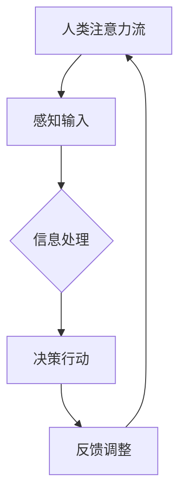

                 

# AI与人类注意力流 :未来的工作场所和注意力管理

> 关键词：人工智能，注意力流，工作效率，注意力管理，工作场所

> 摘要：本文探讨了人工智能与人类注意力流的关系，分析了注意力流在企业中的应用，以及注意力流管理策略和工具。通过详细的案例和解释，揭示了注意力流在未来工作场所的重要性和潜在挑战。

## 第一部分：AI与注意力流概述

### 第1章：AI与人类注意力流基本概念

#### 核心概念与联系

人工智能（AI）和注意力流（Attention Flow）是两个看似不同但紧密相关的概念。人工智能是指模拟人类智能行为的计算机系统，而注意力流则是人类在处理信息时，对特定信息的关注程度和持续时间的动态变化。

首先，我们来定义一下这两个核心概念：

- **人工智能（AI）**：人工智能是一种由计算机执行的智能行为，包括感知、学习、推理、规划和决策等。AI系统通过模拟人类的智能行为，解决复杂的问题和任务。
  
- **注意力流（Attention Flow）**：注意力流是人类在处理信息时，根据任务需求对信息进行选择和关注的动态过程。这种过程涉及到对信息的识别、分析和记忆，并决定哪些信息需要被重点处理。

为了更好地理解这两个概念的联系，我们可以使用Mermaid流程图来展示人类注意力流的基本过程：



在这个流程图中，我们可以看到：

- **感知输入**：人类通过感官接收外部信息。
- **信息处理**：大脑对感知到的信息进行筛选、分析和记忆。
- **决策行动**：根据处理后的信息做出相应的决策和行动。
- **反馈调整**：行动的结果会反馈给大脑，用于调整后续的信息处理过程。

这种注意力流机制不仅存在于人类大脑中，也在人工智能系统中得到了广泛应用。人工智能系统通过模拟人类注意力流，实现对大量信息的快速处理和决策。

#### 注意力流的数学模型

注意力流的数学模型为理解和设计注意力机制提供了理论基础。其中，最常用的注意力机制是“点积注意力”（Scaled Dot-Product Attention）。

- **点积注意力**：

  点积注意力通过计算两个向量之间的点积来确定注意力权重。公式如下：

  $$ \text{Attention}(Q,K,V) = \text{softmax}(\frac{QK^T}{\sqrt{d_k}})V $$

  其中：

  - \( Q \)：查询向量（Query）
  - \( K \)：键向量（Key）
  - \( V \)：值向量（Value）
  - \( d_k \)：键向量的维度
  - \( \text{softmax} \)：softmax函数用于计算每个键向量的概率权重

- **缩放点积注意力**：

  为了避免点积计算导致梯度消失问题，引入了缩放因子：

  $$ \text{Attention}(Q,K,V) = \text{softmax}(\frac{QK^T}{\sqrt{d_k}})\frac{V}{\sqrt{d_v}} $$

  其中：

  - \( d_v \)：值向量的维度

下面是一个简单的伪代码示例，用于实现点积注意力机制：

```python
def scaled_dot_product_attention(Q, K, V):
    # 计算点积
    scores = Q * K.T / sqrt(d_k)
    # 应用缩放因子
    scores = scores * (1 / sqrt(d_v))
    # 应用softmax
    attn_weights = softmax(scores)
    # 加权求和
    output = attn_weights * V
    return output, attn_weights
```

#### 举例说明

假设某人在看一本书，每个词的注意力权重由其重要性决定，通过注意力机制计算每个词的权重，从而选择关注重要信息。具体过程如下：

1. **查询向量**（Query）：
   - 代表当前阅读的上下文，由书中的单词组成。

2. **键向量**（Key）：
   - 代表每个单词，用于与查询向量计算点积。

3. **值向量**（Value）：
   - 代表每个单词的信息，用于生成最终的输出。

4. **缩放点积注意力**：
   - 计算查询向量和键向量之间的点积，得到每个单词的注意力权重。

5. **加权求和**：
   - 根据注意力权重，对值向量进行加权求和，得到书中的关键信息。

通过这种方式，注意力流模型可以帮助人类更有效地处理复杂的信息，提高阅读和理解效率。

### 第2章：注意力流在企业中的应用

注意力流在企业中的应用非常广泛，可以显著提高工作效率和决策质量。以下是一些核心算法原理讲解和实际应用案例。

#### 核心算法原理讲解

注意力机制在AI领域得到了广泛应用，特别是在自然语言处理（NLP）和图像识别等领域。以下是一个简化的注意力机制实现：

```python
def scaled_dot_product_attention(Q, K, V):
    # 计算点积
    scores = Q * K.T / sqrt(d_k)
    # 应用缩放因子
    scores = scores * (1 / sqrt(d_v))
    # 应用softmax
    attn_weights = softmax(scores)
    # 加权求和
    output = attn_weights * V
    return output, attn_weights
```

在这个函数中，`Q`、`K`和`V`分别代表查询向量、键向量和值向量。通过计算点积、应用缩放因子和softmax函数，我们可以得到每个键向量的概率权重。最后，通过加权求和，我们可以得到注意力流的结果。

#### 注意力流在自然语言处理中的应用

在自然语言处理中，注意力机制被广泛应用于文本摘要、机器翻译和问答系统等任务。以下是一些典型的应用案例：

- **文本摘要**：
  - 注意力流模型可以帮助自动生成文章摘要，提高信息获取效率。
  - 例如，BERT模型（Bidirectional Encoder Representations from Transformers）采用多层注意力机制来处理输入文本，提取关键信息。

- **机器翻译**：
  - 注意力机制可以用于提高机器翻译的准确性，特别是在长句子翻译中。
  - 例如，Transformer模型引入了自注意力机制，使得模型能够更好地处理长距离依赖关系。

- **问答系统**：
  - 注意力机制可以帮助问答系统更准确地理解和回答用户的问题。
  - 例如，一些问答系统使用注意力机制来识别问题中的重要词汇，并从候选答案中提取最相关的信息。

#### 注意力流在企业中的应用案例

注意力流在企业中的应用不仅限于自然语言处理，还可以应用于办公自动化、客户服务和决策支持等领域。以下是一些应用案例：

- **办公自动化**：
  - 注意力流模型可以帮助企业自动生成报告和摘要，节省员工时间。
  - 例如，企业可以使用注意力流模型来分析大量数据，生成有价值的商业报告。

- **客户服务**：
  - 注意力流模型可以帮助客服系统更快速地响应客户需求，提高客户满意度。
  - 例如，一些客服系统使用注意力流模型来识别客户问题中的关键信息，并快速提供解决方案。

- **决策支持**：
  - 注意力流模型可以帮助企业更准确地分析市场趋势和竞争环境，支持决策制定。
  - 例如，企业可以使用注意力流模型来分析竞争对手的市场表现，制定相应的市场策略。

#### 注意力流应用的挑战

虽然注意力流在企业中具有广泛的应用前景，但也有一些挑战需要克服：

- **计算成本**：
  - 注意力机制通常需要大量的计算资源，特别是在处理大型数据集时。
  - 为了降低计算成本，研究人员正在探索更高效的计算方法，如低秩近似和并行计算。

- **数据隐私**：
  - 注意力流模型在处理敏感数据时，需要考虑数据隐私保护。
  - 为了确保数据安全，企业需要采取严格的隐私保护措施，如数据加密和访问控制。

- **可解释性**：
  - 注意力流模型通常是一个黑盒模型，难以解释其决策过程。
  - 为了提高可解释性，研究人员正在探索可解释的注意力机制，如注意力图可视化。

### 第3章：注意力流在AI领域的应用

注意力流在人工智能领域的应用日益广泛，成为提高模型性能和效率的重要手段。以下将探讨注意力流在自然语言处理和计算机视觉中的应用。

#### 注意力流在自然语言处理中的应用

在自然语言处理（NLP）领域，注意力流模型已成为主流架构，如Transformer和BERT等。这些模型通过自注意力（Self-Attention）和交叉注意力（Cross-Attention）机制，实现对输入文本序列的全面理解和处理。

- **Transformer模型**：
  - Transformer模型引入了自注意力机制，使得模型能够捕捉长距离依赖关系，提高了翻译和文本摘要的性能。
  - Transformer模型由多个自注意力层和前馈神经网络组成，通过多头注意力机制，模型能够并行处理输入序列。

- **BERT模型**：
  - BERT（Bidirectional Encoder Representations from Transformers）模型结合了自注意力机制和双向编码器，使得模型能够同时考虑上下文信息，提高了文本理解能力。
  - BERT模型通过预训练和微调，广泛用于问答系统、文本分类和命名实体识别等任务。

#### 注意力流在计算机视觉中的应用

在计算机视觉领域，注意力流模型被用于图像分类、目标检测和图像分割等任务，通过关注关键区域，提高模型性能。

- **图像分类**：
  - 注意力流模型可以帮助模型在图像分类任务中关注关键特征，提高分类准确性。
  - 例如，一些基于卷积神经网络的图像分类模型，通过引入注意力机制，能够更好地捕捉图像中的关键区域。

- **目标检测**：
  - 注意力流模型可以帮助目标检测模型关注图像中的目标区域，提高检测性能。
  - 例如，YOLO（You Only Look Once）等目标检测模型通过引入注意力机制，能够更快地检测图像中的目标。

- **图像分割**：
  - 注意力流模型可以帮助图像分割模型关注图像中的前景区域，提高分割精度。
  - 例如，一些基于深度学习的图像分割模型，通过引入注意力机制，能够更好地区分前景和背景。

#### 注意力流的实现方法

注意力流的实现方法多种多样，以下是一些常见的方法：

- **点积注意力**（Dot-Product Attention）：
  - 点积注意力通过计算查询向量（Query）和键向量（Key）的点积来生成注意力权重。
  - 点积注意力简单高效，适用于大多数注意力流应用。

- **加性注意力**（Additive Attention）：
  - 加性注意力通过计算查询向量、键向量和值向量（Value）的加权和来生成注意力权重。
  - 加性注意力能够更好地捕捉长距离依赖关系，适用于复杂任务。

- **缩放点积注意力**（Scaled Dot-Product Attention）：
  - 缩放点积注意力在点积注意力基础上引入了缩放因子，以避免梯度消失问题。
  - 缩放点积注意力适用于大多数深度学习任务，特别是NLP领域。

以下是缩放点积注意力的数学公式：

$$
\text{Attention}(Q, K, V) = \text{softmax}\left(\frac{QK^T}{\sqrt{d_k}}\right)V
$$

其中，$Q$、$K$和$V$分别表示查询向量、键向量和值向量，$d_k$表示键向量的维度。

### 第4章：注意力流在工作场所的应用

#### 自动摘要生成

在当前快节奏的工作环境中，自动摘要生成技术已经成为提高工作效率的重要工具。利用注意力流模型，我们可以从大量的文本数据中提取关键信息，生成简洁、精准的摘要。

- **应用场景**：
  - 企业报告：自动生成长篇报告的摘要，帮助管理者快速了解报告的核心内容。
  - 会议记录：自动生成会议记录的摘要，方便参会者回顾关键讨论点。
  - 新闻报道：自动生成新闻报道的摘要，为读者提供快速了解新闻要点的途径。

- **技术实现**：
  - 使用Transformer模型或BERT模型等注意力流模型，对长文本进行编码。
  - 应用缩放点积注意力机制，计算文本中每个词的注意力权重。
  - 根据注意力权重，对文本进行排序，提取前若干关键句子作为摘要。

#### 智能推荐系统

注意力流模型还可以应用于智能推荐系统，通过分析用户的注意力流，为用户推荐感兴趣的内容。

- **应用场景**：
  - 电商平台：根据用户的浏览和购买记录，推荐相关商品。
  - 社交媒体：根据用户的互动和兴趣，推荐相关内容和好友。
  - 教育平台：根据学生的学习情况和知识点掌握情况，推荐合适的课程和资料。

- **技术实现**：
  - 收集并分析用户的浏览、搜索、购买等行为数据，构建用户行为模型。
  - 利用注意力流模型，计算用户对不同内容或产品的注意力权重。
  - 根据用户注意力权重，从大量候选内容中提取出最相关的推荐项。

#### 注意力管理策略

在快节奏的工作环境中，注意力管理策略对于保持高效工作和减少疲劳至关重要。以下是一些实用的注意力管理策略：

- **时间管理**：
  - 制定合理的日程安排，避免工作过度饱和。
  - 使用时间管理工具（如番茄钟技巧）来划分工作和休息时间。

- **环境优化**：
  - 营造一个有利于集中注意力的工作环境，如减少干扰、保持良好的通风和照明。

- **注意力切换**：
  - 定期进行注意力切换，避免长时间专注于同一任务导致的疲劳。
  - 例如，每工作45分钟后，休息5-10分钟，进行简单的身体活动或深呼吸。

### 第5章：注意力流管理的策略与工具

注意力流管理是提高工作效率和减少工作疲劳的关键。有效的注意力管理策略和工具可以帮助人们更好地控制自己的注意力，从而提高工作和生活质量。以下是一些具体的注意力管理策略和推荐工具。

#### 注意力管理策略

1. **时间管理**：

   - **设定明确的目标**：在开始工作前，设定明确的工作目标，并制定详细的行动计划。这有助于集中注意力，避免在工作过程中迷失方向。

   - **使用时间管理工具**：例如，使用番茄钟技巧（Pomodoro Technique）来划分工作和休息时间。每工作25分钟，休息5分钟，每完成四个周期后休息15-30分钟。这种方法可以帮助人们保持专注，同时避免长时间工作导致的疲劳。

   - **优先级排序**：根据工作的重要性和紧急程度，对任务进行优先级排序。先处理最重要的任务，确保关键任务得到及时完成。

2. **环境优化**：

   - **减少干扰**：在工作环境中减少干扰因素，如关闭不必要的通知和社交媒体，保持工作区域整洁，减少杂乱无章的物品。

   - **良好的光照和通风**：保持工作区域有良好的光照和通风，这有助于提高工作效率和舒适度。

   - **适当的装饰**：适当的工作环境装饰可以提升心情，如摆放一些绿植或艺术品，创造一个温馨、舒适的工作氛围。

3. **注意力切换**：

   - **定期休息**：长时间专注于同一任务会导致大脑疲劳，因此定期休息非常关键。每工作一段时间后，进行短暂的休息，如站起来活动、深呼吸或做一些简单的伸展运动。

   - **注意力切换练习**：练习在不同任务之间切换注意力，如从文案工作切换到数据分析，或从编程任务切换到设计工作。这有助于提高大脑的灵活性和适应性。

#### 注意力管理工具

1. **专注力应用**：

   - **Forest**：一个帮助用户集中注意力的应用，通过种植虚拟植物来激励用户保持专注。完成一个任务后，虚拟植物会茁壮成长，反之则枯萎。

   - **Pomodoro Timer**：一个简单的番茄钟计时器应用，可以帮助用户按照番茄钟技巧来规划工作时间和休息时间。

2. **时间跟踪工具**：

   - **Toggl**：一个时间跟踪工具，可以帮助用户记录工作时间，分析工作效率，并根据数据优化工作计划。

   - **RescueTime**：一个自动记录用户设备使用情况的工具，可以提供详细的工作、娱乐和社交时间分布报告，帮助用户了解自己的时间使用习惯。

3. **任务管理工具**：

   - **Trello**：一个简单易用的任务管理工具，可以帮助团队或个人组织任务和项目，确保每个任务都得到妥善管理。

   - **Asana**：一个功能强大的任务管理工具，适用于大型团队和复杂项目，可以帮助用户分配任务、跟踪进度和协作。

#### 注意力管理实践

1. **设定明确的目标**：

   在开始工作之前，明确自己的目标，将大任务拆分成小任务，逐一完成。例如，将一个复杂的报告拆分成几个部分，分别处理。

2. **使用番茄钟技巧**：

   将工作周期划分为25分钟工作时间和5分钟休息时间。在25分钟内，专注于当前任务，尽量不被干扰。休息时，进行短暂的身体活动，如散步或深呼吸。

3. **定期检查进度**：

   每隔一段时间，检查自己的工作进度，确保任务按计划进行。如果发现进度滞后，及时调整计划，找出原因并采取措施。

4. **学会拒绝**：

   学会说“不”，避免过度承诺导致工作负担过重。合理分配时间和精力，专注于最重要和最有价值的任务。

### 第6章：注意力流的未来展望

随着人工智能技术的不断进步，注意力流在未来的工作场所和注意力管理中扮演着越来越重要的角色。以下是一些关于注意力流未来发展趋势的探讨：

#### 个性化注意力流

随着数据收集和分析技术的进步，未来的注意力流管理将更加个性化。通过分析用户的个人偏好和行为模式，可以更加精确地分配注意力资源，提高工作效率。例如，在办公自动化系统中，根据员工的历史行为和当前任务需求，自动调整工作流程和任务分配，确保每个员工都能在最佳状态下工作。

#### 跨领域应用

注意力流技术不仅将在工作场所得到广泛应用，还将跨越多个领域。在教育领域，注意力流模型可以帮助教师根据学生的注意力模式调整教学方法，提高学习效果。在健康领域，注意力流技术可以用于分析患者的注意力状态，帮助医生制定个性化的治疗方案。

#### 注意力流与物联网（IoT）

随着物联网技术的发展，未来的工作场所将充满智能设备和传感器。注意力流技术可以与物联网设备集成，实时监测员工的注意力状态和工作环境，提供个性化的建议和干预。例如，智能办公椅可以根据员工的坐姿和注意力水平自动调整，以提供最佳的工作姿势。

#### 挑战与机遇

尽管注意力流技术在未来有着广阔的应用前景，但也面临一些挑战。首先，数据隐私保护是一个重要问题，特别是在分析个人注意力数据时，需要确保数据的安全性和隐私性。其次，注意力流技术的计算成本较高，需要更多的计算资源和优化算法。最后，注意力流技术的可解释性也是一个挑战，如何确保模型决策的透明性和可解释性，以避免模型黑箱问题。

然而，这些挑战也伴随着机遇。通过解决这些问题，可以为用户提供更加智能和个性化的服务，提高工作和生活质量。

### 第7章：结论

注意力流作为一种新兴的技术，正在逐渐改变我们的工作和生活方式。本文从多个角度探讨了注意力流的基本概念、应用场景、管理策略和未来发展趋势。通过分析，我们得出以下结论：

1. **注意力流的重要性**：

   注意力流在提高工作效率、增强决策能力和优化工作流程方面具有重要作用。在未来，随着人工智能技术的不断进步，注意力流将在更多领域得到广泛应用。

2. **注意力流的应用**：

   注意力流技术已经广泛应用于自然语言处理、计算机视觉、办公自动化和智能推荐系统等领域。未来，随着技术的不断发展，注意力流将跨越更多领域，为人类带来更多便利。

3. **注意力流的管理**：

   注意力流管理策略和工具可以帮助人们更好地控制自己的注意力，提高工作和生活质量。通过合理的时间管理、环境优化和注意力切换，可以最大限度地发挥注意力的价值。

4. **注意力流的挑战**：

   尽管注意力流技术具有巨大的潜力，但也面临数据隐私保护、计算成本和可解释性等挑战。未来，需要进一步研究和发展，以解决这些问题，为用户带来更好的体验。

总之，注意力流是人工智能领域的一个重要研究方向，具有广阔的应用前景。随着技术的不断进步，我们可以期待注意力流在未来带来更多的创新和变革。

### 附录A：注意力流相关资源

#### 开源框架与工具

为了方便读者进一步了解和探索注意力流技术，本文列举了一些常用的开源框架和工具：

1. **TensorFlow Addons**：
   - TensorFlow Addons 是一个开源库，提供多种注意力机制的实现，如点积注意力、加性注意力和多头注意力等。它与TensorFlow深度学习框架集成，方便用户使用和扩展。

   - 官网：[TensorFlow Addons](https://github.com/tensorflow/addons)

2. **PyTorch**：
   - PyTorch 是一个流行的深度学习框架，支持自定义注意力机制。用户可以轻松实现各种注意力模型，如Transformer和Bert等。

   - 官网：[PyTorch](https://pytorch.org/)

#### 研究论文与书籍

为了深入了解注意力流的理论基础和应用，以下是一些推荐的研究论文和书籍：

1. **“Attention Is All You Need”**：
   - 这篇论文提出了Transformer模型，引入了自注意力机制，彻底改变了自然语言处理领域的模型设计。它是研究注意力机制的重要参考文献。

   - 论文链接：[Attention Is All You Need](https://arxiv.org/abs/1706.03762)

2. **“Deep Learning”**：
   - 《深度学习》是一本经典的深度学习教材，详细讲解了深度学习的基础理论和应用。书中包含了许多关于注意力机制的内容，适合深度学习初学者阅读。

   - 作者：Ian Goodfellow、Yoshua Bengio、Aaron Courville

   - 书籍链接：[Deep Learning](https://www.deeplearningbook.org/)

通过这些资源，读者可以进一步学习和探索注意力流技术的各个方面，为未来的研究和工作打下坚实的基础。

