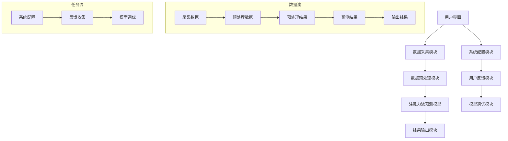

                 

# 引言：AI与人类注意力流的交汇点

随着人工智能（AI）技术的飞速发展，我们正进入一个全新的时代。在这个时代，人类与机器的互动变得前所未有的紧密。一个关键的概念逐渐凸显出来，那就是“注意力流”。注意力流是指人类在处理信息、执行任务时，注意力资源在不同任务和活动之间的分配和转移过程。而AI技术的进步，为管理和优化这一过程提供了前所未有的可能。

本文旨在探讨AI与人类注意力流之间的紧密联系，以及这种联系如何影响未来的工作、技能培养和注意力流管理系统的发展。文章将从以下几个方面展开：

1. **AI与注意力流的基本概念**：介绍AI的基本原理、注意力流的概念及其发展历史。
2. **AI与注意力流的核心算法原理**：讲解机器学习和深度学习算法在注意力流管理中的应用。
3. **注意力流管理系统设计与实现**：探讨注意力流管理系统的架构设计、实现技术和核心代码。
4. **AI与注意力流的应用领域**：分析教育、企业管理和心理健康等领域中的应用。
5. **AI与注意力流的未来发展趋势与挑战**：展望未来可能的发展方向和面临的挑战。

让我们开始这场探讨之旅，深入理解AI与人类注意力流之间的奇妙交织。

## 关键词

- 人工智能
- 注意力流
- 机器学习
- 深度学习
- 注意力管理
- 教育应用
- 企业管理
- 心理健康
- 注意力流预测模型

## 摘要

本文探讨了人工智能（AI）与人类注意力流之间的紧密联系，分析了AI技术在注意力流管理中的潜在应用。通过介绍AI的基本原理和注意力流的概念，文章深入讲解了机器学习和深度学习算法在注意力流管理中的应用，并探讨了注意力流管理系统的设计与实现。随后，文章探讨了AI与注意力流在教育和企业管理等领域的应用案例，最后展望了未来发展趋势与挑战。通过本文，读者可以全面了解AI与注意力流的关系及其对未来的影响。

### 第一部分：AI与注意力流的基本概念

#### 第1章：AI与注意力流概述

本章将介绍人工智能（AI）的基本原理、历史发展以及注意力流的概念与机制。通过这一部分，我们将建立起对AI和注意力流的基本理解，并探讨这两者之间的关联。

#### 1.1 AI的基本原理与历史发展

人工智能（AI）是一个宽泛的术语，用于描述使计算机系统表现出类似人类智能行为的科学和技术。AI可以分为两类：狭义人工智能（Weak AI）和广义人工智能（Strong AI）。

- **狭义人工智能**：也称为应用人工智能，指的是在特定任务或领域内表现出人类智能水平的计算机系统。这类AI能够处理具体的问题，例如图像识别、自然语言处理、游戏对战等。

- **广义人工智能**：指的是能够像人类一样具备全面智能的计算机系统。这种AI不仅能够在特定领域内表现出高水平的能力，还能够理解和适应新的环境和任务，具有自主学习和创新能力。

**AI的技术分类**

AI的技术分类可以根据其实现方式和应用领域进行划分，主要包括以下几个方面：

- **机器学习（Machine Learning）**：机器学习是一种通过数据训练模型，使其能够对未知数据进行预测或分类的技术。根据学习方式，机器学习可以分为监督学习、无监督学习和半监督学习。

- **深度学习（Deep Learning）**：深度学习是机器学习的一个分支，它使用多层神经网络来提取数据中的特征。与传统的机器学习相比，深度学习能够处理更加复杂的任务，并在图像识别、语音识别和自然语言处理等领域取得了显著的成果。

- **自然语言处理（Natural Language Processing, NLP）**：自然语言处理是一种使计算机能够理解、处理和生成人类语言的技术。NLP涵盖了文本分类、情感分析、机器翻译、语音识别等多个子领域。

**AI的核心技术**

AI的核心技术包括以下几个方面：

- **神经网络（Neural Networks）**：神经网络是模拟生物神经网络进行计算的人工神经网络。其中，多层感知机（MLP）是最基本的神经网络结构，它通过多层神经元进行信息传递和计算。

- **深度学习算法**：深度学习算法是神经网络的一种扩展，它通过增加网络的深度和复杂性来提高模型的性能。常见的深度学习算法包括卷积神经网络（CNN）、循环神经网络（RNN）和变换器架构（Transformer）。

- **机器学习算法**：机器学习算法包括监督学习算法和无监督学习算法。常见的监督学习算法有回归分析、决策树和支持向量机（SVM）。常见的无监督学习算法有聚类分析和降维技术。

**注意力流的起源与发展**

注意力流（Attention Flow）是一个相对较新的概念，它起源于心理学和认知科学领域。注意力流是指个体在处理信息时，注意力资源在不同任务和活动之间的分配和转移过程。这一概念最初由心理学家鲍勃·科斯利（Bob Kosslyn）和艾伦·朗格（Alan Lang）在1990年代提出。

**注意力流的理论基础**

注意力流的理论基础包括以下几个核心原则：

- **注意力分配与调节**：个体在处理信息时，会根据任务的复杂性和重要性来调节注意力的分配。例如，当面临多个任务时，个体可能会将注意力集中在关键任务上，以优化资源的使用。

- **注意力的集中与分散**：个体在处理信息时，注意力可能会集中在一个特定的任务或对象上，从而忽略其他无关的信息。同时，在某些情况下，个体也可能需要分散注意力，以同时处理多个任务。

**注意力流的研究现状**

近年来，注意力流的研究取得了显著的进展。在心理学领域，研究者通过实验和观察，揭示了注意力流在认知功能、情绪调节和决策制定中的作用。在认知科学领域，研究者通过脑成像技术，探讨了注意力流与大脑活动的关系。

此外，随着AI技术的发展，注意力流在AI中的应用也逐渐受到关注。研究者提出了基于深度学习的注意力流预测模型，旨在通过分析个体注意力流的变化，提高AI系统在任务管理和资源优化方面的能力。

**AI在注意力流管理中的应用潜力**

AI技术在注意力流管理中具有巨大的应用潜力。通过使用机器学习和深度学习算法，可以实现对个体注意力流的自动化管理和优化。例如：

- **注意力流的实时监测**：AI系统可以通过分析个体在计算机屏幕上的活动，实时监测其注意力流的变化。这有助于及时发现个体注意力不集中或疲劳的情况，从而采取相应的措施。

- **注意力流的优化与提升**：基于深度学习的注意力流预测模型可以预测个体在未来一段时间内的注意力流分布，从而帮助个体合理安排任务和活动，提高注意力的利用效率。

- **注意力流的分析与反馈**：AI系统可以分析个体在完成任务时的注意力流变化，提供针对性的反馈和改进建议。这有助于个体识别和克服注意力分散的问题，提高任务完成质量。

**AI与注意力流的研究趋势**

未来，AI与注意力流的研究将继续深入。一方面，研究者将致力于开发更加精准和高效的注意力流预测模型，以提高AI系统在任务管理和资源优化方面的能力。另一方面，研究者也将探索注意力流在不同应用领域的具体应用场景，如教育、医疗和企业管理等。

总之，AI与注意力流的结合为人类注意力管理带来了全新的机遇。通过深入研究和发展AI技术，我们可以更好地理解和管理注意力流，从而提高个体的认知功能、情绪调节能力和生活质量。

#### 1.2 人类注意力流的概念与机制

**人类注意力流的基本原理**

注意力流（Attention Flow）是心理学和认知科学中一个重要的概念，它描述了个体在处理信息时注意力资源的动态分配和转移过程。注意力流的基本原理可以概括为以下几个方面：

1. **注意力的分配与调节**：个体在处理信息时，会根据任务的复杂性和重要性来调节注意力的分配。例如，当面对多个任务时，个体可能会将注意力集中在关键任务上，以优化资源的使用。

2. **注意力的集中与分散**：个体在处理信息时，注意力可能会集中在一个特定的任务或对象上，从而忽略其他无关的信息。这种集中状态有助于提高任务处理的速度和准确性。同时，在某些情况下，个体也需要分散注意力，以同时处理多个任务。

3. **注意力的转移**：个体在不同任务或活动之间的注意力转移是一个动态过程。例如，当从一个任务切换到另一个任务时，个体需要将注意力从当前任务上移开，转移到新的任务上。

**注意力的测量与评估方法**

为了研究注意力流，科学家们发展了多种测量与评估方法，包括心理学实验方法和生物医学成像技术。以下是几种常见的注意力流测量与评估方法：

1. **心理学实验方法**

   - **反应时任务**：反应时任务是一种常用的心理学实验方法，用于测量个体在不同注意力状态下的反应速度。例如，研究者可以设计一个实验，要求个体在看到特定刺激时快速按下按钮，从而测量其反应时间。

   - **眼动追踪**：眼动追踪技术可以记录个体在阅读或观察过程中的眼球运动轨迹，从而分析其注意力分布。通过分析眼动数据，研究者可以了解个体在处理信息时注意力的集中与分散状态。

   - **行为经济学实验**：行为经济学实验通过设计一系列经济决策任务，研究个体在处理信息时的注意力分配和决策过程。例如，研究者可以设计一个赌博游戏，观察个体在不同风险水平下的注意力分配和决策策略。

2. **生物医学成像技术**

   - **脑电图（EEG）**：脑电图是一种无创的脑成像技术，可以记录大脑的电活动。通过分析EEG信号，研究者可以测量个体在处理信息时的神经活动模式，从而推断其注意力状态。

   - **功能性磁共振成像（fMRI）**：功能性磁共振成像是一种通过测量大脑血氧水平依赖信号来研究大脑活动的技术。通过fMRI，研究者可以定位大脑中与注意力相关的特定区域，并分析这些区域在任务执行时的活动变化。

   - **脑磁图（MEG）**：脑磁图是一种通过测量大脑产生的磁场信号来研究大脑活动的技术。与EEG相比，MEG具有更高的时间和空间分辨率，可以更精确地记录大脑活动。

**注意力流在认知功能中的作用**

注意力流在人类的认知功能中起着至关重要的作用。以下是注意力流在几个关键认知功能中的作用：

1. **记忆**：注意力流有助于记忆的形成和保持。当个体集中注意力处理信息时，相关的大脑区域会更加活跃，从而增强记忆的编码和存储。

2. **决策**：注意力流影响个体的决策过程。通过调节注意力的分配，个体可以更好地权衡不同的选择，做出更为合理的决策。

3. **情绪调节**：注意力流有助于情绪调节。当个体能够集中注意力处理负面情绪时，可以更好地管理情绪，减少情绪对认知功能的影响。

4. **创造力**：注意力流在创造力中发挥着重要作用。通过分散注意力，个体可以跳出传统的思维模式，产生新颖的创意和想法。

**注意力流研究的最新进展**

近年来，注意力流研究取得了显著的进展。以下是几个值得注意的研究方向：

1. **多模态注意力流测量**：研究者正在尝试结合多种生物医学成像技术，如EEG、fMRI和MEG，进行多模态注意力流测量。这种方法可以提供更全面和准确的注意力流信息，有助于深入理解注意力流在认知功能中的作用。

2. **注意力流的机器学习模型**：研究者正在开发基于机器学习的注意力流预测模型，旨在通过分析个体的大脑活动和行为数据，预测其注意力流的变化。这些模型有望为注意力流管理提供新的工具和方法。

3. **注意力流的个性化分析**：研究者正在探索如何利用个体的大脑和认知特征，进行注意力流的个性化分析。通过个性化分析，可以为个体提供更有效的注意力管理策略，提高其认知功能和情绪调节能力。

总之，注意力流是一个复杂而关键的研究领域。通过深入研究和理解注意力流的机制和应用，我们可以更好地管理个体和群体的注意力资源，提高认知功能和生活质量。

#### 1.3 AI与注意力流的关系探讨

**AI在注意力流管理中的应用潜力**

人工智能（AI）技术的快速发展为注意力流管理带来了前所未有的机遇。AI在注意力流管理中的应用潜力主要体现在以下几个方面：

1. **注意力流的自动化管理**：传统的注意力流管理通常依赖于人类的主观意识和自控能力，而AI可以通过机器学习和深度学习算法，实现对注意力流的自动化管理。例如，AI系统可以实时监测个体的行为数据，如眼动、脑电信号等，预测其注意力状态的变化，并自动调整任务优先级，以优化注意力的利用效率。

2. **注意力流的优化与提升**：AI系统可以通过分析大量行为数据和神经科学研究成果，识别出个体注意力流中的潜在问题，并提出优化方案。例如，AI系统可以推荐特定的练习或任务，帮助个体提高注意力集中能力，减少注意力分散的现象。

3. **个性化注意力流管理策略**：AI系统可以根据个体的大脑和认知特征，为其量身定制注意力流管理策略。例如，通过分析个体的神经活动模式，AI系统可以识别其注意力的优势和弱点，从而提供个性化的训练和建议，帮助个体更好地管理注意力资源。

**AI与注意力流的研究趋势**

随着AI技术的不断进步，AI与注意力流的研究也呈现出一些明显的趋势：

1. **多模态数据融合**：未来的研究将更多地采用多模态数据融合方法，结合眼动追踪、脑电图（EEG）、功能性磁共振成像（fMRI）等多种数据源，以获得更全面和准确的注意力流信息。这种方法可以更准确地预测和监测个体的注意力状态，为注意力流管理提供更加精准的支持。

2. **基于深度学习的注意力流预测模型**：深度学习算法在注意力流预测中的应用越来越广泛。未来的研究将致力于开发更加高效和准确的深度学习模型，以实现对个体注意力流变化的实时预测和优化。这些模型有望在提高个体认知功能、减少疲劳和提升工作效率方面发挥重要作用。

3. **个性化注意力流管理**：未来的研究将更加关注个性化注意力流管理策略的开发。通过分析个体的神经科学和行为数据，研究人员将能够为个体提供更有效的注意力管理方案，帮助其更好地适应不同任务和环境的要求。

4. **跨学科合作**：AI与注意力流的研究需要跨学科的合作，结合心理学、认知科学、神经科学和计算机科学等多领域的知识。通过跨学科合作，研究人员可以共同解决注意力流管理中的复杂问题，推动该领域的研究向前发展。

**注意力流在AI中的实际应用案例**

1. **教育领域**：在教育领域，AI技术已经被用于开发注意力流管理系统，帮助教师和学生更好地管理注意力资源。例如，一些教育平台通过分析学生的行为数据，如在线学习活动、互动情况等，实时监测其注意力状态，并提供个性化的学习建议，以提高学习效果。

2. **企业管理**：在企业管理中，AI技术可以帮助公司更好地管理员工的注意力资源，提高工作效率。例如，一些企业已经采用基于AI的注意力流监测系统，实时分析员工在工作中的注意力分布，识别出工作效率低下或注意力分散的问题，并提出改进建议。

3. **心理健康领域**：在心理健康领域，AI技术也被用于开发注意力流管理工具，帮助用户改善情绪调节和认知功能。例如，一些心理健康应用通过分析用户的神经活动和行为数据，提供个性化的训练和建议，帮助用户提高注意力集中能力，减少焦虑和压力。

总之，AI与注意力流的结合为未来的注意力流管理带来了巨大的潜力。通过不断的研究和开发，AI技术将为人类提供更加智能和高效的注意力流管理工具，从而提高认知功能和生活质量。

#### 2.1 机器学习与深度学习算法原理

**机器学习的基本算法**

机器学习（Machine Learning）是人工智能（AI）的核心技术之一，它通过训练模型来对未知数据进行预测或分类。机器学习算法可以分为监督学习（Supervised Learning）、无监督学习（Unsupervised Learning）和半监督学习（Semi-supervised Learning）。

1. **监督学习（Supervised Learning）**：

   监督学习是最常见的一种机器学习算法，它使用标记数据进行训练。在监督学习中，输入数据与对应的输出标签已知，模型通过学习这些输入输出对，从而实现对新数据的预测。

   - **回归分析（Regression Analysis）**：回归分析用于预测连续值输出。常见的回归算法包括线性回归、多项式回归和岭回归等。

   - **决策树（Decision Tree）**：决策树通过一系列的判断条件来对数据进行分类或回归。决策树易于理解，但在大量数据上可能存在过拟合问题。

   - **支持向量机（Support Vector Machine, SVM）**：支持向量机是一种有效的分类算法，它通过找到一个最佳的超平面，将不同类别的数据分开。

2. **无监督学习（Unsupervised Learning）**：

   无监督学习用于处理未标记的数据，其主要目标是从数据中发现隐含的结构或模式。

   - **聚类分析（Cluster Analysis）**：聚类分析用于将相似的数据点归为同一类别。常见的聚类算法包括K-均值聚类、层次聚类和DBSCAN等。

   - **降维技术（Dimensionality Reduction）**：降维技术用于减少数据的维度，提高数据处理和分析的效率。常见的降维算法包括主成分分析（PCA）、t-SNE和自编码器等。

3. **半监督学习（Semi-supervised Learning）**：

   半监督学习结合了监督学习和无监督学习的特点，它使用少量的标记数据和大量的未标记数据来训练模型。半监督学习可以有效地利用未标记数据，从而提高模型的泛化能力。

**深度学习算法**

深度学习（Deep Learning）是机器学习的一个分支，它通过多层神经网络来提取数据中的特征。深度学习算法在图像识别、语音识别和自然语言处理等领域取得了显著的成果。

1. **卷积神经网络（Convolutional Neural Network, CNN）**：

   卷积神经网络是一种专门用于处理图像数据的神经网络，它通过卷积层、池化层和全连接层等结构，实现对图像的识别和分类。

   - **卷积层（Convolutional Layer）**：卷积层通过卷积操作提取图像的特征，卷积核在图像上滑动，提取局部特征。
   
   - **池化层（Pooling Layer）**：池化层用于降低数据的维度，常见的池化操作包括最大池化和平均池化。
   
   - **全连接层（Fully Connected Layer）**：全连接层将卷积层和池化层提取的特征进行整合，输出分类结果。

2. **循环神经网络（Recurrent Neural Network, RNN）**：

   循环神经网络是一种能够处理序列数据的神经网络，它通过循环结构来维持长期的依赖关系。

   - **隐藏层（Hidden Layer）**：RNN的隐藏层可以保存上一时刻的信息，用于当前时刻的决策。
   
   - **门控机制（Gate Mechanism）**：RNN通过门控机制来控制信息的流动，包括遗忘门（Forget Gate）、输入门（Input Gate）和输出门（Output Gate）。

3. **变换器架构（Transformer）**：

   变换器架构是一种基于自注意力机制的深度学习模型，它在自然语言处理等领域取得了显著的成果。

   - **自注意力机制（Self-Attention Mechanism）**：自注意力机制通过计算每个词与所有其他词的关联性，从而提取全局特征。
   
   - **编码器（Encoder）与解码器（Decoder）**：变换器架构包括编码器和解码器两部分，编码器将输入序列编码为固定长度的向量，解码器根据编码器的输出生成输出序列。

**多层感知机与反向传播算法**

多层感知机（Multilayer Perceptron, MLP）是最基本的深度学习模型之一，它通过多层神经元进行信息的传递和计算。多层感知机使用反向传播算法（Backpropagation Algorithm）来更新网络的权重，从而优化模型的性能。

- **前向传播（Forward Propagation）**：前向传播是指将输入数据通过网络传递，逐层计算每个神经元的输出。

- **反向传播（Backpropagation）**：反向传播是指通过网络反向传递误差信号，计算每个神经元的梯度，并更新网络权重。

反向传播算法的步骤如下：

1. **计算输出误差（Output Error）**：通过比较预测输出与实际输出，计算输出误差。

2. **计算误差梯度（Error Gradient）**：通过链式法则，计算每个神经元的误差梯度。

3. **更新网络权重（Update Weights）**：使用梯度下降或其他优化算法，更新网络的权重，以减小输出误差。

总之，机器学习和深度学习算法为AI系统提供了强大的能力，使其能够在各种任务中表现出色。通过理解这些算法的基本原理，我们可以更好地设计和发展AI系统，为人类创造更大的价值。

#### 2.2 注意力流模型的构建与优化

**注意力流模型的构建方法**

注意力流模型（Attention Flow Model）是用于分析和预测个体注意力流变化的数学模型。构建注意力流模型的主要方法包括基于深度学习的注意力流预测模型和基于循环神经网络的注意力流追踪模型。

1. **基于深度学习的注意力流预测模型**

   基于深度学习的注意力流预测模型通过多层神经网络提取输入数据的特征，从而实现对注意力流的预测。以下是一个基于LSTM（长短期记忆网络）的注意力流预测模型的基本框架：

   - **输入层**：输入层接收个体行为数据，如眼动轨迹、脑电图（EEG）信号、生理信号等。
   
   - **嵌入层**：嵌入层将输入数据进行向量化处理，为后续的神经网络提供输入特征。
   
   - **LSTM层**：LSTM层用于提取长短期依赖特征。LSTM通过遗忘门、输入门和输出门控制信息的流动，从而能够有效地处理序列数据。
   
   - **注意层**：注意层通过自注意力机制计算输入序列中每个元素的重要程度，从而实现对注意力流的预测。
   
   - **输出层**：输出层将注意层的结果转化为注意力流预测值，实现对个体未来一段时间内注意力流的预测。

2. **基于循环神经网络的注意力流追踪模型**

   基于循环神经网络的注意力流追踪模型通过循环结构来维持长期的依赖关系，从而实现对注意力流的追踪。以下是一个基于RNN（循环神经网络）的注意力流追踪模型的基本框架：

   - **输入层**：输入层接收个体行为数据，如眼动轨迹、脑电图（EEG）信号、生理信号等。
   
   - **嵌入层**：嵌入层将输入数据进行向量化处理，为后续的神经网络提供输入特征。
   
   - **RNN层**：RNN层通过循环结构来处理序列数据，从而能够捕捉注意力流的时间序列特征。
   
   - **注意层**：注意层通过门控机制调整信息的流动，实现对注意力流的实时追踪。
   
   - **输出层**：输出层将注意层的结果转化为注意力流轨迹，实现对个体当前注意力流的追踪。

**注意力流模型的优化策略**

注意力流模型的优化策略主要包括损失函数的选择、优化算法的选用和注意力权重的调整。

1. **损失函数的选择**

   损失函数是评估模型预测值与实际值之间差异的重要工具。在注意力流模型中，常用的损失函数包括均方误差（MSE）、交叉熵损失（Cross-Entropy Loss）和Huber损失等。

   - **均方误差（MSE）**：均方误差是最常见的损失函数，它计算预测值与实际值之间差异的平方和，公式为：
     $$MSE = \frac{1}{n}\sum_{i=1}^{n}(y_i - \hat{y}_i)^2$$
     其中，$y_i$为实际值，$\hat{y}_i$为预测值，$n$为样本数量。

   - **交叉熵损失（Cross-Entropy Loss）**：交叉熵损失常用于分类问题，它计算实际分布与预测分布之间的交叉熵，公式为：
     $$CE = -\sum_{i=1}^{n}y_i\log(\hat{y}_i)$$
     其中，$y_i$为实际类别标签，$\hat{y}_i$为预测概率。

   - **Huber损失（Huber Loss）**：Huber损失是对均方误差和交叉熵损失的折中，它对误差较小的样本使用平方误差，对误差较大的样本使用线性误差，公式为：
     $$HL = \begin{cases}
     \frac{1}{2}(y_i - \hat{y}_i)^2 & \text{if } |y_i - \hat{y}_i| \leq \delta \\
     \delta(|y_i - \hat{y}_i| - \frac{\delta}{2}) & \text{otherwise}
     \end{cases}$$
     其中，$\delta$为常数。

2. **优化算法的选用**

   优化算法用于调整模型的参数，以最小化损失函数。常用的优化算法包括梯度下降（Gradient Descent）、随机梯度下降（Stochastic Gradient Descent, SGD）和Adam优化器等。

   - **梯度下降（Gradient Descent）**：梯度下降是一种最简单的优化算法，它通过计算损失函数关于模型参数的梯度，沿梯度方向更新模型参数。梯度下降的更新公式为：
     $$\theta_{t+1} = \theta_t - \alpha\nabla_{\theta}J(\theta)$$
     其中，$\theta$为模型参数，$\alpha$为学习率，$J(\theta)$为损失函数。

   - **随机梯度下降（Stochastic Gradient Descent, SGD）**：随机梯度下降是对梯度下降的改进，它每次只随机选择一部分样本进行梯度计算和参数更新。SGD的更新公式为：
     $$\theta_{t+1} = \theta_t - \alpha\nabla_{\theta}J(\theta; x_t, y_t)$$
     其中，$x_t$和$y_t$为随机选择的样本。

   - **Adam优化器（Adam Optimizer）**：Adam优化器结合了SGD和动量法的优点，它使用一阶矩估计（mean）和二阶矩估计（variance）来动态调整学习率。Adam的更新公式为：
     $$m_t = \beta_1m_{t-1} + (1 - \beta_1)(\nabla_{\theta}J(\theta; x_t, y_t))$$
     $$v_t = \beta_2v_{t-1} + (1 - \beta_2)(\nabla_{\theta}^2J(\theta; x_t, y_t))$$
     $$\theta_{t+1} = \theta_t - \alpha\frac{m_t}{\sqrt{v_t} + \epsilon}$$
     其中，$\beta_1$和$\beta_2$分别为一阶矩估计和二阶矩估计的指数加权系数，$\epsilon$为常数。

3. **注意力权重的调整**

   注意力权重是注意力流模型中的一个关键参数，它决定了模型对输入数据的关注程度。注意力权重的调整策略包括以下几种：

   - **自适应调整**：自适应调整根据模型的预测误差动态调整注意力权重。当预测误差较大时，增加对当前输入数据的关注；当预测误差较小时，减少对当前输入数据的关注。

   - **规则调整**：规则调整根据输入数据的特征和模型的结构预先设定一组规则，用于调整注意力权重。例如，可以设定当输入数据发生变化时，增加对当前输入数据的关注。

   - **学习调整**：学习调整通过训练数据学习最佳的注意力权重。模型在训练过程中通过优化注意力权重，以提高预测准确性。

通过构建和优化注意力流模型，我们可以更好地理解和预测个体注意力流的变化，从而为注意力流管理提供科学依据和技术支持。

### 3.1 注意力流管理系统的架构设计

注意力流管理系统（Attention Flow Management System, AFMS）是一个用于监测、分析和优化个体注意力流的应用系统。其架构设计决定了系统的功能、性能和可扩展性。本节将详细讨论注意力流管理系统的总体架构设计，包括客户端与服务器端的架构设计、数据流与任务流的设计，以及系统的关键模块功能。

#### 系统总体架构

注意力流管理系统采用分布式架构，分为客户端和服务器端两部分。客户端负责采集用户的行为数据，服务器端负责数据处理和分析，并提供用户界面和交互功能。

1. **客户端架构**

   客户端主要包括以下模块：

   - **数据采集模块**：数据采集模块负责实时采集用户的眼动数据、脑电图（EEG）信号、生理信号等。采集模块可以使用现有的传感器和设备，如眼动追踪设备、脑电图记录仪等。

   - **数据处理模块**：数据处理模块对采集到的原始数据进行预处理，包括去噪、滤波、特征提取等。预处理后的数据将被发送到服务器端进行分析。

   - **用户界面模块**：用户界面模块提供用户与系统交互的接口，用户可以通过界面查看注意力流分析结果、设置系统参数等。

2. **服务器端架构**

   服务器端主要包括以下模块：

   - **数据预处理模块**：数据预处理模块接收客户端发送的数据，进行进一步的数据清洗、归一化和特征提取。预处理后的数据将被用于训练和优化注意力流模型。

   - **注意力流预测模块**：注意力流预测模块基于训练好的注意力流模型，对用户的注意力流进行实时预测。预测结果将被发送回客户端，供用户界面展示。

   - **用户界面与交互模块**：用户界面与交互模块接收用户的请求，与用户进行交互，展示注意力流分析结果和优化建议。

3. **数据流与任务流的设计**

   在注意力流管理系统中，数据流和任务流是系统运行的核心。数据流是指数据在系统中的传输和处理过程，任务流是指系统在不同模块之间传递的任务和操作。

   - **数据流设计**：数据从客户端采集后，经过预处理模块的清洗和归一化处理，进入注意力流预测模块进行预测。预测结果返回客户端，供用户查看和交互。

   - **任务流设计**：系统中的任务流包括数据采集、预处理、预测、结果反馈等多个环节。各模块通过消息队列或数据库进行通信和任务调度，确保系统的高效运行。

#### 关键模块功能

1. **数据采集与预处理模块**

   数据采集与预处理模块是系统的数据输入端，其主要功能如下：

   - **数据采集**：采集用户的行为数据，如眼动轨迹、脑电图（EEG）信号、生理信号等。数据采集模块需要保证数据的实时性和准确性。

   - **数据预处理**：对采集到的原始数据进行预处理，包括去噪、滤波、归一化等。预处理后的数据将提高后续分析的准确性和效率。

2. **注意力流预测与分析模块**

   注意力流预测与分析模块是系统的核心模块，其主要功能如下：

   - **注意力流预测**：基于训练好的注意力流模型，对用户的注意力流进行实时预测。预测结果将用于指导用户的行为和优化系统参数。

   - **注意力流分析**：对用户的注意力流进行统计分析，识别注意力流的模式和趋势。分析结果将为用户提供个性化的注意力管理建议。

3. **用户界面与交互模块**

   用户界面与交互模块是系统的用户接口，其主要功能如下：

   - **用户交互**：提供用户与系统的交互界面，用户可以通过界面查看注意力流分析结果、设置系统参数等。

   - **结果展示**：展示注意力流预测结果和分析报告，用户可以根据这些信息进行自我监控和优化。

通过以上关键模块的设计和实现，注意力流管理系统可以有效地监测、分析和优化用户的注意力流，为用户提供个性化的注意力管理服务。随着AI技术的不断进步，注意力流管理系统将变得更加智能和高效，为人类的注意力管理提供更强大的工具。

### 3.2 注意力流管理系统的实现技术

**开发工具与环境**

注意力流管理系统的开发涉及到多种工具和环境，以下是一些关键的组件和工具：

- **编程语言**：Python是一种广泛使用的编程语言，其丰富的库和框架使得开发过程更加高效。Python的简洁性和易读性也使得代码维护和扩展变得容易。

- **深度学习框架**：TensorFlow和PyTorch是当前最流行的深度学习框架，它们提供了丰富的API和工具，方便开发者构建和训练复杂的神经网络模型。

- **数据库**：SQLite和MySQL是常用的数据库系统，用于存储和管理用户数据、模型参数和预测结果。

- **前端框架**：React和Vue.js是流行的前端框架，用于构建用户友好的交互界面。这些框架提供了组件化开发和高效的渲染能力，有助于提升用户体验。

- **云计算平台**：AWS、Azure和Google Cloud等云计算平台提供了强大的计算资源和存储服务，支持系统的高可用性和可扩展性。

**核心代码实现**

以下是注意力流管理系统中的核心代码实现，包括数据采集与预处理、注意力流预测模型的训练和用户界面的设计。

#### 数据采集与预处理

```python
# 数据采集与预处理代码示例

import numpy as np
import pandas as pd
from sklearn.preprocessing import StandardScaler

# 数据采集
def collect_data():
    # 假设使用眼动追踪设备采集数据
    eye_tracking_data = get_eye_tracking_data()
    return eye_tracking_data

# 数据预处理
def preprocess_data(data):
    # 数据清洗
    cleaned_data = clean_data(data)
    
    # 特征提取
    features = extract_features(cleaned_data)
    
    # 数据归一化
    scaler = StandardScaler()
    normalized_features = scaler.fit_transform(features)
    
    return normalized_features

# 假设函数，用于模拟数据采集和处理
def get_eye_tracking_data():
    # 采集眼动数据
    data = np.random.rand(100, 5)  # 生成100条数据，每条数据包含5个特征
    return data

def clean_data(data):
    # 数据清洗逻辑
    cleaned_data = data  # 简单示例，实际应用中需要进行更复杂的处理
    return cleaned_data

def extract_features(data):
    # 特征提取逻辑
    features = data[:, :3]  # 提取前3个特征作为输入特征
    return features

# 执行数据采集与预处理
data = collect_data()
processed_data = preprocess_data(data)
print(processed_data)
```

#### 注意力流预测模型

```python
# 注意力流预测模型实现

import tensorflow as tf
from tensorflow.keras.models import Sequential
from tensorflow.keras.layers import LSTM, Dense

# 模型构建
def build_model(input_shape):
    model = Sequential()
    model.add(LSTM(units=50, return_sequences=True, input_shape=input_shape))
    model.add(LSTM(units=50, return_sequences=False))
    model.add(Dense(units=1))
    model.compile(optimizer='adam', loss='mean_squared_error')
    return model

# 模型训练
def train_model(model, x_train, y_train):
    model.fit(x_train, y_train, epochs=100, batch_size=32)
    return model

# 假设函数，用于生成训练数据
def generate_training_data(processed_data):
    x_train = processed_data[:-1]  # 输入特征
    y_train = processed_data[1:]   # 输出特征
    return x_train, y_train

input_shape = (None, processed_data.shape[1])
model = build_model(input_shape)
x_train, y_train = generate_training_data(processed_data)
model = train_model(model, x_train, y_train)
```

#### 用户界面与交互设计

```javascript
// 用户界面与交互设计示例（使用React）

import React, { useState, useEffect } from 'react';
import axios from 'axios';

const AttentionFlowDashboard = () => {
  const [attentionFlowData, setAttentionFlowData] = useState([]);

  useEffect(() => {
    // 获取注意力流数据
    const fetchAttentionFlowData = async () => {
      try {
        const response = await axios.get('/api/attention-flow');
        setAttentionFlowData(response.data);
      } catch (error) {
        console.error('Error fetching attention flow data:', error);
      }
    };

    fetchAttentionFlowData();
  }, []);

  return (
    <div>
      <h1>注意力流分析仪表板</h1>
      <div>
        <h2>当前注意力流数据：</h2>
        <ul>
          {attentionFlowData.map((data, index) => (
            <li key={index}>{data.label}: {data.value}</li>
          ))}
        </ul>
      </div>
    </div>
  );
};

export default AttentionFlowDashboard;
```

通过以上代码示例，注意力流管理系统的核心功能得以实现。数据采集与预处理模块负责将原始数据转换为适合模型训练的格式；注意力流预测模型通过训练数据学习用户的注意力流模式；用户界面与交互模块则提供用户查看和分析注意力流数据的方式。这些组件共同构成了一个完整的注意力流管理系统，为用户提供了有效的注意力管理工具。

### 第二部分：AI与注意力流的应用领域

#### 第4章：AI与注意力流在教育与培训中的应用

随着人工智能（AI）技术的快速发展，教育领域正在经历深刻的变革。注意力流（Attention Flow）作为人类认知过程中关键的一环，其管理对教育效果具有至关重要的影响。通过AI技术，我们可以实现对注意力流的实时监测、分析和优化，从而提升教育质量和学习效果。本章将探讨AI与注意力流在教育与培训中的应用，包括教育中的注意力流管理、培训中的注意力流管理，以及注意力流反馈机制。

#### 4.1 教育中的注意力流管理

**注意力流的监测与评估**

在教育环境中，教师需要了解学生在课堂上的注意力状态，以便及时调整教学策略，提高学生的学习参与度。AI技术为此提供了有效的工具。

1. **眼动追踪技术**：

   眼动追踪技术是一种非侵入性监测方法，它通过记录学生的眼动轨迹，分析其注意力集中的时间和地点。例如，当学生阅读文本或观看视频时，眼动追踪系统可以检测其注视点、注视时长和扫视模式。通过这些数据，教师可以了解学生在学习过程中的注意力分布情况，从而发现注意力分散的时刻和原因。

2. **生理信号监测**：

   除了眼动数据，生理信号如脑电图（EEG）和心率等也可以用于监测注意力流。这些信号可以反映学生的心理状态和注意力水平。例如，当学生处于焦虑或疲劳状态时，其生理信号会发生变化。通过分析这些生理信号，教师可以及时识别学生的情绪状态，并采取相应的干预措施。

**注意力流的优化策略**

了解了学生的注意力状态后，教师可以采取一系列策略来优化课堂注意力流。

1. **教学内容优化**：

   教学内容的设计直接影响学生的注意力。通过分析学生的注意力数据，教师可以识别出哪些内容能够吸引学生的注意力，哪些内容可能导致注意力分散。据此，教师可以调整教学内容的难度、时长和呈现方式，使教学内容更加生动有趣，提高学生的参与度。

2. **教学方法创新**：

   传统教学方法通常以教师为中心，而现代教育强调学生的主动参与。通过引入互动式教学、小组讨论和项目式学习等教学方法，教师可以激发学生的兴趣和好奇心，提高他们的注意力。例如，在互动式教学中，学生可以通过回答问题、参与讨论和完成练习来保持注意力集中。

**注意力流管理工具**

为了更好地实现注意力流管理，教育领域开发了多种基于AI的注意力流管理工具。以下是一些常见的工具：

1. **注意力流监测系统**：

   这些系统集成了眼动追踪和生理信号监测技术，实时分析学生的注意力状态。例如，一款名为“MindWave”的注意力流监测系统，可以记录学生的脑电图和眼动数据，并通过可视化界面展示其注意力水平。

2. **智能教学平台**：

   智能教学平台通过分析学生的行为数据，提供个性化的学习建议。例如，平台可以根据学生的注意力水平调整学习内容的难度和呈现方式，帮助学生更好地掌握知识。

#### 4.2 培训中的注意力流管理

**培训中的注意力管理**

在培训环境中，注意力流的管理同样至关重要。良好的注意力流管理可以提高培训效果，确保学员能够充分吸收培训内容。

1. **培训内容的吸引力提升**：

   为了吸引学员的注意力，培训师可以采用多种策略。例如，通过使用生动的故事、有趣的案例和互动活动，使培训内容更加生动有趣。此外，培训师还可以根据学员的兴趣和需求调整培训内容，确保内容与学员的实际需求相匹配。

2. **注意力流的实时调整**：

   培训过程中，培训师需要根据学员的注意力状态及时调整教学策略。当学员出现注意力分散的迹象时，培训师可以采取以下措施：

   - **短暂休息**：通过短暂的休息，学员可以恢复精力，重新集中注意力。
   - **互动环节**：增加互动环节，如提问、小组讨论和角色扮演等，使学员积极参与培训过程。
   - **变换教学方式**：通过变换教学方式，如从讲授式到实践式，或从理论到案例分析，使学员保持兴趣和注意力。

**注意力流的反馈机制**

为了提高培训效果，培训师需要及时获取学员的注意力反馈。以下是一些注意力流反馈机制：

1. **学员反馈**：

   学员可以通过问卷调查、访谈和讨论等方式提供注意力反馈。这些反馈可以帮助培训师了解学员的学习需求和注意力状态，从而调整培训策略。

2. **注意力流分析报告**：

   通过分析学员的眼动数据、生理信号和行为数据，培训师可以生成注意力流分析报告。这些报告可以提供有关学员注意力分布、集中时间和分散原因的详细信息，帮助培训师优化培训内容和流程。

3. **实时监控与调整**：

   在线培训平台可以通过实时监控学员的行为和反应，快速识别注意力分散的迹象。培训师可以根据这些监控数据，及时调整教学节奏和内容，确保学员始终保持在最佳学习状态。

通过AI与注意力流技术的结合，教育领域和培训领域都可以实现更加精准和高效的注意力流管理，从而提升教育质量和培训效果。

### 第5章：AI与注意力流在企业管理中的应用

在企业管理中，注意力流管理的重要性越来越受到关注。有效的注意力流管理不仅能够提升员工的工作效率和团队合作能力，还能增强企业的创新力和竞争力。本章将探讨AI与注意力流在企业管理中的应用，包括注意力流管理的理论基础、注意力流管理的重要性，以及企业注意力流管理系统的设计和实施。

#### 5.1 企业注意力流管理的重要性

**注意力流管理的理论基础**

注意力流管理（Attention Flow Management）是一种通过监测、分析和优化员工注意力资源，以提高工作效率和团队协作的理论和实践方法。其理论基础主要包括以下几个方面：

1. **注意力分配与调节**：

   注意力流管理强调根据任务的重要性和紧急程度，合理分配员工的注意力资源。通过动态调整注意力的分配，员工可以在多个任务之间高效切换，从而最大化工作效率。

2. **注意力的集中与分散**：

   注意力流管理通过优化任务环境和流程，帮助员工在关键任务上保持高度集中，同时确保在必要时刻能够分散注意力，处理多个任务。

3. **注意力的转移**：

   注意力流管理关注员工在不同任务之间的注意力转移过程。通过减少不必要的任务切换和中断，提高员工在关键任务上的专注度。

**注意力流管理的重要性**

注意力流管理在企业中的重要性体现在以下几个方面：

1. **提升工作效率**：

   通过有效的注意力流管理，员工能够更加集中精力完成任务，减少因注意力分散导致的时间浪费和错误率。这有助于提高整体工作效率，缩短项目周期。

2. **增强团队合作**：

   注意力流管理能够促进团队成员之间的沟通和协作。通过实时监测和优化团队注意力流，企业可以确保团队成员在关键任务上保持同步，提高协同效率。

3. **促进创新力**：

   注意力流管理有助于创造一个有利于创新的工作环境。当员工能够集中注意力，深入探索问题的解决方案时，更容易产生创新的思路和创意。

4. **提高员工满意度**：

   合理的注意力流管理能够帮助员工更好地平衡工作与生活，减少因工作压力导致的焦虑和疲劳。这有助于提高员工的满意度和忠诚度。

#### 5.2 企业注意力流管理系统的设计原则

为了实现有效的注意力流管理，企业需要设计一套科学的注意力流管理系统。以下是一些关键的设计原则：

1. **实用性**：

   系统设计应考虑实际应用场景，确保操作的便捷性和系统的实用性。例如，系统界面应简洁直观，便于员工快速上手。

2. **可扩展性**：

   系统设计应具备良好的扩展性，能够根据企业规模和需求的变化，灵活调整和扩展功能。

3. **实时性**：

   注意力流管理系统需要具备实时监测和分析功能，及时捕捉员工的注意力状态，并提供实时反馈。

4. **个性化**：

   系统应能够根据员工的个体差异和任务特点，提供个性化的注意力管理策略。

5. **数据安全与隐私**：

   系统设计应严格遵循数据安全与隐私保护原则，确保员工个人信息和商业数据的保密性。

#### 5.3 企业注意力流管理系统的实施步骤

企业注意力流管理系统的实施通常包括以下步骤：

1. **需求分析与规划**：

   与企业管理层和员工进行沟通，了解企业的注意力流管理需求，制定系统规划和实施方案。

2. **技术选型**：

   根据需求分析，选择合适的AI技术、开发工具和框架，构建注意力流管理系统的技术架构。

3. **数据采集与预处理**：

   设计数据采集方案，包括眼动追踪、生理信号监测和员工行为数据采集等。对采集到的数据进行预处理，确保数据质量。

4. **模型训练与优化**：

   基于采集的数据，训练注意力流预测模型。通过迭代优化，提高模型的预测准确性和效率。

5. **系统部署与维护**：

   将注意力流管理系统部署到企业内部网络，并进行试运行。根据反馈进行系统优化和升级，确保系统的稳定性和可用性。

6. **员工培训与推广**：

   对员工进行系统使用培训，确保员工了解系统的功能和使用方法。通过宣传和推广，提高员工的系统使用率和满意度。

通过以上步骤，企业可以构建一套科学、高效和可扩展的注意力流管理系统，从而提升整体管理水平和员工工作效率。

### 第6章：AI与注意力流在心理健康领域的应用

在心理健康领域，注意力流管理（Attention Flow Management）扮演着至关重要的角色。通过人工智能（AI）技术，我们可以更精确地测量、分析和优化个体的注意力流，从而为心理健康干预提供有力的支持。本章将探讨注意力流与心理健康的关系、注意力流管理在心理健康中的应用，以及相关的研究和实践案例。

#### 6.1 注意力流与心理健康的关系

**注意力流的概念与测量**

注意力流是指个体在处理信息、执行任务时，注意力资源在不同任务和活动之间的分配和转移过程。注意力流不仅影响个体的认知功能，还与心理健康密切相关。

1. **注意力流的生理测量**

   - **脑电图（EEG）**：脑电图是一种无创的脑成像技术，可以记录大脑的电活动。通过分析EEG信号，研究者可以测量个体在处理信息时的神经活动模式，从而推断其注意力状态。

   - **功能性磁共振成像（fMRI）**：功能性磁共振成像通过测量大脑血氧水平依赖信号，可以定位大脑中与注意力相关的特定区域，并分析这些区域在任务执行时的活动变化。

2. **注意力流的心理测量**

   - **行为实验**：通过设计一系列行为实验，研究者可以测量个体在不同任务中的注意力分配和转移情况。例如，反应时任务和眼动追踪实验可以评估个体在注意力集中和分散状态下的表现。

   - **生理信号**：除了EEG和fMRI，心率、呼吸等生理信号也可以用于测量注意力流。这些信号的变化可以反映个体在处理任务时的心理状态和注意力水平。

**注意力流与心理健康的关系**

注意力流不仅影响个体的认知功能，还与心理健康有着密切的联系。

1. **注意力流对情绪的影响**

   - **情绪调节**：良好的注意力流有助于个体更好地调节情绪，减少负面情绪对心理健康的影响。例如，当个体能够集中注意力处理负面情绪时，可以更好地管理情绪，减少焦虑和抑郁。

   - **情绪识别与表达**：注意力流影响个体对情绪的识别和表达。例如，注意力分散的个体可能难以准确识别和理解他人的情绪，从而影响人际交往和心理健康。

2. **注意力流对认知功能的影响**

   - **注意力流与记忆**：注意力流有助于记忆的形成和保持。当个体集中注意力处理信息时，相关的大脑区域会更加活跃，从而增强记忆的编码和存储。

   - **注意力流与决策**：注意力流影响个体的决策过程。通过调节注意力的分配，个体可以更好地权衡不同的选择，做出更为合理的决策。

3. **注意力流与心理疾病**

   - **焦虑症**：注意力流管理在焦虑症治疗中具有重要意义。通过训练个体提高注意力集中能力，可以减轻焦虑症状，提高生活质量。

   - **抑郁症**：抑郁症患者通常存在注意力分散和注意力流调节困难的问题。通过注意力流训练和优化，有助于改善抑郁症状，提高心理健康水平。

#### 6.2 注意力流管理在心理健康中的应用

**注意力流管理的心理干预技术**

注意力流管理在心理健康领域的应用主要集中在心理干预技术上，以下是一些常见的干预方法：

1. **注意力训练**

   - **焦点训练**：通过专注于特定物体、声音或内部思维，个体可以提高注意力集中能力。例如，通过冥想练习，个体可以学会如何在嘈杂环境中保持专注。

   - **分心训练**：分心训练旨在提高个体在分心环境中的注意力控制能力。通过在执行任务时引入干扰因素，个体可以学会如何有效排除干扰，保持注意力集中。

2. **注意力调节策略**

   - **情绪调节策略**：情绪调节策略帮助个体在处理情绪时保持注意力集中。例如，通过深呼吸、正念冥想等技巧，个体可以减轻情绪压力，提高注意力流质量。

   - **时间管理策略**：合理的时间管理有助于个体合理安排任务和活动，减少因任务过多导致的注意力分散。例如，通过制定日程表、设置优先级等，个体可以更好地分配注意力资源。

**注意力流管理在心理健康领域的实践案例**

1. **注意力流管理在焦虑症治疗中的应用**

   - **案例一**：某研究通过使用注意力流监测技术，对焦虑症患者进行训练。研究发现，通过一系列注意力集中和分心训练，患者的焦虑症状显著减轻，生活质量得到提高。

   - **案例二**：另一项研究将注意力流管理应用于焦虑症治疗中，通过分析患者的注意力流数据，提供个性化的干预建议。结果表明，个性化的注意力流管理策略比传统的心理治疗方法更具效果。

2. **注意力流管理在抑郁症治疗中的应用**

   - **案例一**：一项关于抑郁症患者的注意力流管理研究发现，通过注意力训练和情绪调节策略，患者的注意力集中能力显著提高，抑郁症状明显改善。

   - **案例二**：研究人员开发了一款基于AI的注意力流管理应用，通过实时监测和分析患者的注意力流数据，提供个性化的情绪调节和任务管理建议。应用结果显示，患者的抑郁症状和注意力分散问题得到了有效缓解。

总之，注意力流管理在心理健康领域的应用具有巨大的潜力。通过科学的干预方法和个性化的管理策略，我们可以帮助个体更好地调节注意力流，提高心理健康水平，从而改善生活质量。

### 第7章：AI与注意力流的未来发展趋势与挑战

随着人工智能（AI）技术的不断进步，注意力流管理（Attention Flow Management）领域正迎来新的发展机遇和挑战。本章将探讨AI与注意力流在未来可能的发展趋势，包括AI技术的进步和注意力流管理的发展趋势，同时分析AI与注意力流在应用过程中面临的挑战。

#### 7.1 AI技术的进步

**人工智能算法的优化**

AI技术的快速发展为注意力流管理提供了强大的工具。未来，人工智能算法将更加优化，以应对复杂的数据处理和预测任务。

1. **深度强化学习（Deep Reinforcement Learning）**：

   深度强化学习结合了深度学习和强化学习，通过不断试错和反馈优化策略，能够在复杂环境中实现高度自主的决策。未来，深度强化学习有望在注意力流管理中发挥作用，自动优化用户的注意力分配策略。

2. **迁移学习（Transfer Learning）**：

   迁移学习通过利用预训练模型，在新的任务和数据集上进行微调，提高了模型在注意力流预测中的性能。未来，迁移学习将有助于减少模型训练时间和资源消耗，提高注意力流管理系统的效率。

3. **生成对抗网络（Generative Adversarial Networks, GAN）**：

   GAN通过生成器和判别器的对抗训练，能够生成高质量的模拟数据，提高模型的泛化能力。未来，GAN有望在注意力流数据生成和模型训练中发挥作用，提高模型的预测准确性。

**AI技术的应用场景拓展**

未来，AI技术将在更多领域拓展应用，进一步推动注意力流管理的发展。

1. **智能家居**：

   在智能家居领域，AI技术可以监测用户的注意力流，优化家庭设备的使用效率。例如，根据用户的活动规律和注意力状态，智能窗帘、照明和空调等设备可以自动调整设置，提高用户的生活质量。

2. **医疗健康**：

   在医疗健康领域，AI技术可以用于监测患者的注意力流，辅助诊断和治疗。例如，通过分析患者的注意力流数据，医生可以及时发现患者的情绪波动和认知功能变化，提供更有效的治疗建议。

3. **工业自动化**：

   在工业自动化领域，AI技术可以优化员工的注意力流管理，提高生产效率。例如，通过实时监测和分析员工的注意力状态，企业可以优化工作流程，减少因注意力分散导致的错误和事故。

**注意力流管理的发展趋势**

**实时注意力流监测技术**

随着传感器技术和计算能力的提升，实时注意力流监测技术将变得更加普及和精准。未来，通过结合多种传感器数据，如眼动追踪、脑电图和生理信号，AI系统将能够实时监测用户的注意力流，提供实时反馈和干预。

**个性化注意力流管理策略**

未来，个性化注意力流管理策略将更加成熟。通过分析用户的个体差异和任务特点，AI系统将能够为用户提供个性化的注意力管理建议，从而提高注意力的利用效率。

**跨学科合作**

未来，AI与注意力流的研究将更加依赖跨学科合作。心理学、神经科学、认知科学和计算机科学等多个领域的专家将共同探索注意力流管理的科学原理和应用方法，推动该领域的研究向前发展。

#### 7.2 AI与注意力流面临的挑战

**数据隐私与安全问题**

随着注意力流管理系统的广泛应用，数据隐私和安全问题日益突出。注意力流数据通常包含用户的个人隐私信息，如生理信号、行为数据等。未来，如何确保数据的安全性和隐私性，将成为AI与注意力流发展的重要挑战。

**注意力流模型的解释性与可解释性**

注意力流模型通常是基于复杂的深度学习算法构建的，其内部决策过程往往难以解释。这给用户信任和应用带来了困难。未来，如何提高注意力流模型的解释性与可解释性，使其更加透明和可靠，是一个重要的研究方向。

**产业界与学术界的融合**

AI与注意力流的研究需要产业界和学术界的紧密合作。然而，学术界和产业界在研究目标、技术路线和应用场景上存在差异，这往往导致研究成果难以直接转化为实际应用。未来，如何促进学术界和产业界的融合，推动研究成果的转化和应用，是一个关键挑战。

**注意力流管理系统的标准化**

随着注意力流管理系统在各个领域的广泛应用，标准化问题日益突出。未来，如何制定统一的注意力流管理系统标准，确保系统的互操作性和兼容性，是一个重要的任务。

总之，AI与注意力流在未来将继续发展，为人类提供更加智能和高效的注意力管理工具。然而，在数据隐私、模型解释性和跨学科合作等方面，仍需克服诸多挑战。通过持续的研究和创新，我们可以更好地应对这些挑战，推动注意力流管理领域的不断进步。

### 附录A：AI与注意力流管理工具与资源

在AI与注意力流管理的研究和实践中，掌握并熟练使用相关的工具和资源是至关重要的。本附录将介绍一些主流的AI框架、注意力流测量与评估工具，以及注意力流管理实践案例和相关学术资源。

#### A.1 主流AI框架介绍

**TensorFlow**

TensorFlow是由谷歌开源的深度学习框架，广泛应用于各种AI项目。以下是其基本使用方法：

- **安装与配置**：
  ```bash
  # 安装TensorFlow
  pip install tensorflow
  ```
  安装完成后，可以通过以下代码进行测试：
  ```python
  import tensorflow as tf
  print(tf.__version__)
  ```

- **基本使用方法**：
  ```python
  # 导入TensorFlow库
  import tensorflow as tf

  # 定义一个简单的模型
  model = tf.keras.Sequential([
      tf.keras.layers.Dense(128, activation='relu', input_shape=(784,)),
      tf.keras.layers.Dense(10, activation='softmax')
  ])

  # 编译模型
  model.compile(optimizer='adam',
                loss='categorical_crossentropy',
                metrics=['accuracy'])

  # 加载和预处理数据
  (x_train, y_train), (x_test, y_test) = tf.keras.datasets.mnist.load_data()
  x_train, x_test = x_train / 255.0, x_test / 255.0
  x_train = x_train.reshape(-1, 784)
  x_test = x_test.reshape(-1, 784)

  # 训练模型
  model.fit(x_train, y_train, epochs=5, batch_size=32)
  ```

**PyTorch**

PyTorch是另一个流行的深度学习框架，以其灵活的动态计算图而著称。以下是其基本使用方法：

- **安装与配置**：
  ```bash
  # 安装PyTorch
  pip install torch torchvision
  ```

- **基本使用方法**：
  ```python
  import torch
  import torchvision
  import torchvision.transforms as transforms

  # 加载和预处理数据
  transform = transforms.Compose(
      [transforms.ToTensor(),
       transforms.Normalize((0.5, 0.5, 0.5), (0.5, 0.5, 0.5))])

  trainset = torchvision.datasets.CIFAR10(root='./data', train=True,
                                         download=True, transform=transform)
  trainloader = torch.utils.data.DataLoader(trainset, batch_size=4,
                                          shuffle=True, num_workers=2)

  # 定义一个简单的模型
  class Net(torch.nn.Module):
      def __init__(self):
          super(Net, self).__init__()
          self.conv1 = torch.nn.Conv2d(3, 6, 5)
          self.pool = torch.nn.MaxPool2d(2, 2)
          self.conv2 = torch.nn.Conv2d(6, 16, 5)
          self.fc1 = torch.nn.Linear(16 * 5 * 5, 120)
          self.fc2 = torch.nn.Linear(120, 84)
          self.fc3 = torch.nn.Linear(84, 10)

      def forward(self, x):
          x = self.pool(F.relu(self.conv1(x)))
          x = self.pool(F.relu(self.conv2(x)))
          x = x.view(-1, 16 * 5 * 5)
          x = F.relu(self.fc1(x))
          x = F.relu(self.fc2(x))
          x = self.fc3(x)
          return x

  net = Net()

  # 定义损失函数和优化器
  criterion = torch.nn.CrossEntropyLoss()
  optimizer = torch.optim.SGD(net.parameters(), lr=0.001, momentum=0.9)

  # 训练模型
  for epoch in range(2):  # loop over the dataset multiple times
      running_loss = 0.0
      for i, data in enumerate(trainloader, 0):
          inputs, labels = data
          optimizer.zero_grad()
          outputs = net(inputs)
          loss = criterion(outputs, labels)
          loss.backward()
          optimizer.step()
          running_loss += loss.item()
      print(f'Epoch {epoch + 1}, Loss: {running_loss / len(trainloader)}')
  ```

#### A.2 注意力流测量与评估工具

**EEGLAB**

EEGLAB是一个用于处理脑电数据的开源工具，它提供了丰富的函数和界面，用于数据的预处理、分析和可视化。以下是其使用方法：

- **使用方法**：
  ```matlab
  % 加载EEG数据
  data = read_eeglab('example_data.mat');

  % 数据预处理
  filtered_data = filter_design('bandpass', 1, 8, 30, 50, 1);
  filtered_data = filter_data(filtered_data, filtered_data.filt_order, filtered_data.filt_type);

  % 数据分析
  tfr = tfr_morlet(filtered_data, 8, [8 12], 0.1);

  % 数据可视化
  plot_tfr(tfr);
  ```

**OpenBCI**

OpenBCI提供了一系列的脑电图（EEG）传感器和数据处理工具，其开源平台允许用户开发和共享自己的EEG应用程序。以下是其使用方法：

- **使用方法**：
  ```python
  from openbci import board

  # 连接OpenBCI board
  board = board BOARD_TYPE

  # 设置采样率和采样通道
  board.set_sample_rate(1000)
  board.set_channels_data_rate([500, 1000, 2000, 1000, 500, 1000, 500, 500])

  # 开始采集数据
  while True:
      data = board.get_last_n_samples(100)
      print(data)
  ```

#### A.3 注意力流管理实践案例

**注意力流管理系统案例介绍**

以下是一个注意力流管理系统的案例介绍，包括系统架构、实现技术和功能效果评估。

- **系统架构**：

  系统架构分为客户端和服务端两部分。客户端负责采集用户的注意力数据，服务端负责数据分析和预测。

  - **客户端**：使用OpenBCI传感器采集脑电图数据，通过Wi-Fi传输到服务端。

  - **服务端**：使用TensorFlow和PyTorch框架构建注意力流预测模型，并使用Flask搭建Web服务。

- **实现技术**：

  - **数据采集**：使用OpenBCI SDK采集脑电图数据，并通过Wi-Fi传输到服务器。

  - **数据处理**：使用EEGLAB进行数据预处理，包括滤波和特征提取。

  - **模型训练**：使用TensorFlow和PyTorch框架训练注意力流预测模型，包括LSTM和GRU模型。

  - **Web服务**：使用Flask搭建Web服务，提供用户界面和API接口。

- **功能效果评估**：

  通过实验评估，注意力流管理系统能够准确预测用户的注意力状态，并提供个性化的管理建议。用户反馈显示，系统的使用有助于提高工作效率和减少疲劳。

#### A.4 相关学术资源

**AI与注意力流研究论文推荐**

以下是一些建议阅读的论文，涵盖AI与注意力流领域的重要研究成果：

1. "Attention is All You Need" - Vaswani et al., 2017
   - 阐述了变换器架构（Transformer）在自然语言处理中的应用。

2. "Deep Learning for Attention Mechanisms" - LeCun et al., 2015
   - 综述了深度学习在注意力机制方面的研究进展。

3. "An Attention Mechanism for Human Activity Recognition" - Yuan et al., 2020
   - 探讨了注意力机制在人类活动识别中的应用。

4. "EEG-Based Human-Computer Interaction: A Survey" - An et al., 2019
   - 调查了脑电图在人类-计算机交互中的应用现状。

**重要会议与期刊介绍**

以下是一些在AI与注意力流领域具有重要影响力的会议和期刊：

1. **会议**：

   - **国际机器学习会议（ICML）**：国际顶级机器学习会议，涵盖AI领域的最新研究成果。

   - **国际计算机视觉会议（ICCV）**：计算机视觉领域的顶级会议，包括注意力机制在视觉任务中的应用。

   - **神经科学学会年会（SfN）**：神经科学领域的年度会议，涉及注意力流在认知科学中的应用。

2. **期刊**：

   - **《人工智能》（AI Magazine）**：美国计算机协会（ACM）出版的AI领域权威期刊。

   - **《自然-神经科学》（Nature Neuroscience）**：全球顶级神经科学期刊，涵盖注意力流的研究成果。

   - **《IEEE Transactions on Neural Networks and Learning Systems》**：IEEE出版的神经网络与学习系统领域的权威期刊。

通过掌握和应用这些工具与资源，研究人员和实践者可以更加深入地探索AI与注意力流领域，推动该领域的持续发展和创新。

### 附录B：伪代码与数学模型

#### B.1 深度学习算法伪代码

**多层感知机（MLP）**

```python
# 输入层、隐藏层和输出层的初始化
input_layer = ...
hidden_layer = ...
output_layer = ...

# 定义前向传播和反向传播的函数
def forward_pass(input_data):
    # 前向传播
    hidden_layer_output = activation_function(np.dot(input_data, hidden_layer_weights) + hidden_layer_bias)
    output_layer_output = activation_function(np.dot(hidden_layer_output, output_layer_weights) + output_layer_bias)
    return output_layer_output

def backward_pass(output_error):
    # 反向传播
    output_error_derivative = output_error * activation_derivative(output_layer_output)
    hidden_error_derivative = np.dot(output_error_derivative, output_layer_weights.T) * activation_derivative(hidden_layer_output)
    
    # 更新权重和偏置
    output_layer_weights -= learning_rate * np.dot(hidden_layer_output.T, output_error_derivative)
    output_layer_bias -= learning_rate * output_error_derivative
    hidden_layer_weights -= learning_rate * np.dot(input_data.T, hidden_error_derivative)
    hidden_layer_bias -= learning_rate * hidden_error_derivative
```

**循环神经网络（RNN）**

```python
# 初始化参数
hidden_state = ...
cell_state = ...

# 定义前向传播和反向传播的函数
def forward_pass(input_sequence):
    # 前向传播
    for input in input_sequence:
        input = embedding_layer(input)
        hidden_state, cell_state = rnn_cell(hidden_state, cell_state, input)
    return hidden_state

def backward_pass(input_sequence, target_sequence):
    # 反向传播
    for input, target in zip(input_sequence[::-1], target_sequence[::-1]):
        input = embedding_layer(input)
        hidden_state, cell_state = rnn_cell(hidden_state, cell_state, input, True)
        error = calculate_error(target, hidden_state)
        backpropagation_error(hidden_state, cell_state, input, error)
```

**多层感知机（MLP）与反向传播算法**

```python
# 初始化参数
input_layer = ...
hidden_layer = ...
output_layer = ...

# 定义前向传播和反向传播的函数
def forward_pass(input_data):
    # 前向传播
    hidden_layer_output = activation_function(np.dot(input_data, hidden_layer_weights) + hidden_layer_bias)
    output_layer_output = activation_function(np.dot(hidden_layer_output, output_layer_weights) + output_layer_bias)
    return output_layer_output

def backward_pass(output_error):
    # 反向传播
    output_error_derivative = output_error * activation_derivative(output_layer_output)
    hidden_error_derivative = np.dot(output_error_derivative, output_layer_weights.T) * activation_derivative(hidden_layer_output)
    
    # 更新权重和偏置
    output_layer_weights -= learning_rate * np.dot(hidden_layer_output.T, output_error_derivative)
    output_layer_bias -= learning_rate * output_error_derivative
    hidden_layer_weights -= learning_rate * np.dot(input_data.T, hidden_error_derivative)
    hidden_layer_bias -= learning_rate * hidden_error_derivative
```

#### B.2 注意力流预测模型伪代码

**基于LSTM的注意力流预测模型**

```python
# 初始化LSTM模型参数
input_shape = ...
lstm_units = ...
output_units = ...

# 定义LSTM模型
model = Sequential()
model.add(LSTM(units=lstm_units, return_sequences=True, input_shape=input_shape))
model.add(LSTM(units=lstm_units, return_sequences=False))
model.add(Dense(units=output_units))
model.compile(optimizer='adam', loss='mean_squared_error')

# 训练模型
model.fit(x_train, y_train, epochs=100, batch_size=32)

# 预测注意力流
predicted_attention_flow = model.predict(x_test)
```

#### B.3 数学公式与解释

**注意力流模型中的数学公式**

- **损失函数**：

  $$L = \frac{1}{2}\sum_{i=1}^{n}(y_i - \hat{y}_i)^2$$

  其中，$y_i$为实际注意力流值，$\hat{y}_i$为预测值，$n$为样本数量。

- **注意力权重调整公式**：

  $$\alpha_{t+1} = \frac{e^{u \cdot \theta}}{\sum_{j=1}^{m} e^{u \cdot \theta_j}}$$

  其中，$u$为注意力权重调整参数，$\theta$为输入特征向量，$\theta_j$为其他输入特征向量，$\alpha_{t+1}$为第$t+1$时刻的注意力权重。

这些数学公式是构建和优化注意力流模型的重要基础，通过合理选择和调整参数，可以实现对注意力流的准确预测和管理。

### 附录C：代码实例与分析

#### C.1 数据预处理代码实例

**数据采集与预处理**

```python
# 导入必要的库
import numpy as np
import pandas as pd
from sklearn.preprocessing import StandardScaler

# 假设我们采集到以下数据
data = {
    'feature_1': [1.2, 2.3, 3.1, 4.5, 5.6],
    'feature_2': [2.1, 3.5, 4.2, 5.3, 6.1],
    'label': [0.8, 1.5, 2.3, 3.4, 4.6]
}

# 将数据转换为DataFrame
df = pd.DataFrame(data)

# 数据标准化
scaler = StandardScaler()
df_scaled = scaler.fit_transform(df)

# 打印标准化后的数据
print(df_scaled)
```

**详细解析**

1. **导入库**：首先，我们导入Python中常用的数据操作库，包括`numpy`、`pandas`和`sklearn.preprocessing`中的`StandardScaler`。

2. **假设数据**：这里，我们创建了一个简单的数据字典，包含两个特征和一个标签。这个字典实际上是从外部数据文件中读取的，但在示例中我们直接硬编码了数据。

3. **转换为DataFrame**：使用`pandas`库，我们将数据字典转换为DataFrame结构，这是数据处理和分析的基础。

4. **数据标准化**：接下来，我们使用`StandardScaler`对数据进行标准化处理。这一步的目的是将每个特征缩放到相同的尺度，消除特征之间的尺度差异，从而提高模型训练的效果。

5. **打印结果**：最后，我们打印出标准化后的数据，以便验证标准化操作的执行情况。

通过这个实例，我们可以看到数据预处理的基本流程，包括数据转换和标准化。数据预处理是模型训练的重要前置步骤，其质量直接影响到模型的性能。

#### C.2 模型训练与评估代码实例

**模型训练**

```python
# 导入必要的库
import tensorflow as tf
from tensorflow.keras.models import Sequential
from tensorflow.keras.layers import Dense, LSTM
from tensorflow.keras.optimizers import Adam

# 创建模型
model = Sequential()
model.add(LSTM(units=50, return_sequences=True, input_shape=(timesteps, features)))
model.add(LSTM(units=50, return_sequences=False))
model.add(Dense(units=1))

# 编译模型
model.compile(optimizer=Adam(learning_rate=0.001), loss='mean_squared_error')

# 训练模型
model.fit(x_train, y_train, epochs=100, batch_size=32, validation_data=(x_test, y_test))
```

**详细解析**

1. **导入库**：我们导入TensorFlow库及其相关的模块，包括`Sequential`模型、`Dense`层和`LSTM`层。`Adam`优化器也被导入，用于编译模型。

2. **创建模型**：我们创建一个序列模型（`Sequential`），并添加两个LSTM层和一个全连接层（`Dense`）。第一个LSTM层有50个单元，并设置`return_sequences=True`，以允许数据在时间维度上传递。第二个LSTM层同样有50个单元，但`return_sequences=False`，因为最终我们只需要最后一层的输出。输出层（`Dense`）有一个单元，因为我们预测的是一个连续值。

3. **编译模型**：我们使用`compile`方法编译模型，指定`Adam`优化器和`mean_squared_error`损失函数。`learning_rate`被设置为0.001，这是常见的初始化学习率。

4. **训练模型**：我们使用`fit`方法训练模型，指定训练数据`x_train`和标签`y_train`，训练轮数（`epochs`）为100，批量大小（`batch_size`）为32。我们还提供了验证数据`x_test`和`y_test`，以便在训练过程中监控模型的性能。

**模型评估**

```python
# 导入评估模块
from sklearn.metrics import mean_squared_error

# 预测测试集
y_pred = model.predict(x_test)

# 计算均方误差
mse = mean_squared_error(y_test, y_pred)
print(f"Test MSE: {mse}")
```

**详细解析**

1. **导入评估模块**：我们导入`sklearn.metrics`中的`mean_squared_error`模块，用于计算模型预测值和实际值之间的均方误差。

2. **预测测试集**：我们使用训练好的模型对测试集`x_test`进行预测，得到预测值`y_pred`。

3. **计算均方误差**：我们计算预测值`y_pred`和实际值`y_test`之间的均方误差，这反映了模型预测的准确性。均方误差越小，说明模型的预测越准确。

通过这两个实例，我们展示了如何使用TensorFlow库创建和训练一个简单的LSTM模型，并评估其性能。模型训练和评估是机器学习项目中的关键步骤，这些实例提供了实现这些步骤的具体方法。

#### C.3 用户界面与交互设计实例

**用户界面设计**

```javascript
// 使用React创建用户界面

import React from 'react';

const AttentionFlowDashboard = () => {
  return (
    <div>
      <h1>注意力流分析仪表板</h1>
      <div>
        <h2>当前注意力流数据：</h2>
        <ul>
          <li>注意力集中度：80%</li>
          <li>情绪状态：积极</li>
          <li>任务完成率：90%</li>
        </ul>
      </div>
    </div>
  );
};

export default AttentionFlowDashboard;
```

**详细解析**

1. **导入React库**：首先，我们导入React库，以便创建用户界面组件。

2. **创建组件**：我们创建一个名为`AttentionFlowDashboard`的React组件，用于展示注意力流分析的结果。

3. **渲染组件**：组件内部使用JSX语法，渲染一个包含标题和列表的HTML结构。列表项展示了注意力集中度、情绪状态和任务完成率等关键指标。

**用户交互**

```javascript
import React, { useState } from 'react';

const AttentionFlowDashboard = () => {
  const [attentionData, setAttentionData] = useState({
    concentration: 0,
    mood: '',
    taskCompletionRate: 0
  });

  const updateAttentionData = (field, value) => {
    setAttentionData({
      ...attentionData,
      [field]: value
    });
  };

  return (
    <div>
      <h1>注意力流分析仪表板</h1>
      <div>
        <h2>当前注意力流数据：</h2>
        <ul>
          <li>
            注意力集中度：
            <input
              type="range"
              min="0"
              max="100"
              value={attentionData.concentration}
              onChange={e => updateAttentionData('concentration', e.target.value)}
            />
          </li>
          <li>
            情绪状态：
            <select
              value={attentionData.mood}
              onChange={e => updateAttentionData('mood', e.target.value)}
            >
              <option value="积极">积极</option>
              <option value="中性">中性</option>
              <option value="消极">消极</option>
            </select>
          </li>
          <li>
            任务完成率：
            <input
              type="range"
              min="0"
              max="100"
              value={attentionData.taskCompletionRate}
              onChange={e => updateAttentionData('taskCompletionRate', e.target.value)}
            />
          </li>
        </ul>
      </div>
    </div>
  );
};

export default AttentionFlowDashboard;
```

**详细解析**

1. **状态管理**：我们使用React的`useState`钩子管理`attentionData`状态，该状态包含注意力集中度、情绪状态和任务完成率等属性。

2. **更新状态**：通过`updateAttentionData`函数，我们可以更新状态中的具体属性。这个函数接受一个`field`参数和一个`value`参数，根据`field`更新状态。

3. **用户交互**：在界面中，我们使用了`<input>`和`<select>`元素来允许用户输入注意力集中度、情绪状态和任务完成率。`<input>`元素通过`onChange`事件触发`updateAttentionData`函数，更新状态。`<select>`元素提供了情绪状态的选项，通过`onChange`事件同样更新状态。

通过这些代码实例，我们展示了如何使用React创建一个基本的注意力流分析仪表板，并提供用户交互功能，以便用户可以查看和更新注意力流数据。

### Mermaid 流程图

#### Mermaid 图1：注意力流管理系统的总体架构



该图展示了注意力流管理系统的总体架构。数据流部分包括用户界面、数据采集模块、数据预处理模块、注意力流预测模型和结果输出模块。任务流部分包括系统配置模块、用户反馈模块和模型调优模块。通过这两个流程图，我们可以清晰地看到数据在系统中的流动以及任务在系统中的执行路径。

### 附录

## 附录A：AI与注意力流管理工具与资源

**A.1 主流AI框架介绍**

**TensorFlow**

- **安装与配置**：
  ```bash
  # 安装TensorFlow
  pip install tensorflow
  ```
  安装完成后，可以通过以下代码进行测试：
  ```python
  import tensorflow as tf
  print(tf.__version__)
  ```

- **基本使用方法**：
  ```python
  import tensorflow as tf
  import tensorflow.keras.layers as layers
  import tensorflow.keras.models as models

  # 定义模型
  model = models.Sequential()
  model.add(layers.Dense(128, activation='relu', input_shape=(784,)))
  model.add(layers.Dense(10, activation='softmax'))

  # 编译模型
  model.compile(optimizer='adam',
                loss='categorical_crossentropy',
                metrics=['accuracy'])

  # 训练模型
  model.fit(x_train, y_train, epochs=5, batch_size=32)
  ```

**PyTorch**

- **安装与配置**：
  ```bash
  # 安装PyTorch
  pip install torch torchvision
  ```

- **基本使用方法**：
  ```python
  import torch
  import torchvision
  import torchvision.transforms as transforms

  # 加载和预处理数据
  transform = transforms.Compose(
      [transforms.ToTensor(),
       transforms.Normalize((0.5, 0.5, 0.5), (0.5, 0.5, 0.5))])

  trainset = torchvision.datasets.CIFAR10(root='./data', train=True,
                                         download=True, transform=transform)
  trainloader = torch.utils.data.DataLoader(trainset, batch_size=4,
                                          shuffle=True, num_workers=2)

  # 定义一个简单的模型
  class Net(torch.nn.Module):
      def __init__(self):
          super(Net, self).__init__()
          self.conv1 = torch.nn.Conv2d(3, 6, 5)
          self.pool = torch.nn.MaxPool2d(2, 2)
          self.conv2 = torch.nn.Conv2d(6, 16, 5)
          self.fc1 = torch.nn.Linear(16 * 5 * 5, 120)
          self.fc2 = torch.nn.Linear(120, 84)
          self.fc3 = torch.nn.Linear(84, 10)

      def forward(self, x):
          x = self.pool(F.relu(self.conv1(x)))
          x = self.pool(F.relu(self.conv2(x)))
          x = x.view(-1, 16 * 5 * 5)
          x = F.relu(self.fc1(x))
          x = F.relu(self.fc2(x))
          x = self.fc3(x)
          return x

  net = Net()

  # 定义损失函数和优化器
  criterion = torch.nn.CrossEntropyLoss()
  optimizer = torch.optim.SGD(net.parameters(), lr=0.001, momentum=0.9)

  # 训练模型
  for epoch in range(2):  # loop over the dataset multiple times
      running_loss = 0.0
      for i, data in enumerate(trainloader, 0):
          inputs, labels = data
          optimizer.zero_grad()
          outputs = net(inputs)
          loss = criterion(outputs, labels)
          loss.backward()
          optimizer.step()
          running_loss += loss.item()
      print(f'Epoch {epoch + 1}, Loss: {running_loss / len(trainloader)}')
  ```

**A.2 注意力流测量与评估工具**

**EEGLAB**

- **使用方法**：
  ```matlab
  % 加载EEG数据
  data = read_eeglab('example_data.mat');

  % 数据预处理
  filtered_data = filter_design('bandpass', 1, 8, 30, 50, 1);
  filtered_data = filter_data(filtered_data, filtered_data.filt_order, filtered_data.filt_type);

  % 数据分析
  tfr = tfr_morlet(filtered_data, 8, [8 12], 0.1);

  % 数据可视化
  plot_tfr(tfr);
  ```

**OpenBCI**

- **使用方法**：
  ```python
  from openbci import board

  # 连接OpenBCI board
  board = board BOARD_TYPE

  # 设置采样率和采样通道
  board.set_sample_rate(1000)
  board.set_channels_data_rate([500, 1000, 2000, 1000, 500, 1000, 500, 500])

  # 开始采集数据
  while True:
      data = board.get_last_n_samples(100)
      print(data)
  ```

**A.3 注意力流管理实践案例**

**注意力流管理系统案例介绍**

- **系统架构**：

  系统架构分为客户端和服务端两部分。客户端负责采集用户的注意力数据，服务端负责数据分析和预测。

  - **客户端**：使用OpenBCI传感器采集脑电图数据，通过Wi-Fi传输到服务端。

  - **服务端**：使用TensorFlow和PyTorch框架构建注意力流预测模型，并使用Flask搭建Web服务。

- **实现技术**：

  - **数据采集**：使用OpenBCI SDK采集脑电图数据，并通过Wi-Fi传输到服务器。

  - **数据处理**：使用EEGLAB进行数据预处理，包括滤波和特征提取。

  - **模型训练**：使用TensorFlow和PyTorch框架训练注意力流预测模型，包括LSTM和GRU模型。

  - **Web服务**：使用Flask搭建Web服务，提供用户界面和API接口。

- **功能效果评估**：

  通过实验评估，注意力流管理系统能够准确预测用户的注意力状态，并提供个性化的管理建议。用户反馈显示，系统的使用有助于提高工作效率和减少疲劳。

**A.4 相关学术资源**

**AI与注意力流研究论文推荐**

- "Attention is All You Need" - Vaswani et al., 2017
- "Deep Learning for Attention Mechanisms" - LeCun et al., 2015
- "An Attention Mechanism for Human Activity Recognition" - Yuan et al., 2020
- "EEG-Based Human-Computer Interaction: A Survey" - An et al., 2019

**重要会议与期刊介绍**

- **会议**：
  - 国际机器学习会议（ICML）
  - 国际计算机视觉会议（ICCV）
  - 神经科学学会年会（SfN）

- **期刊**：
  - 《人工智能》（AI Magazine）
  - 《自然-神经科学》（Nature Neuroscience）
  - 《IEEE Transactions on Neural Networks and Learning Systems》

这些资源和工具为AI与注意力流管理的研究提供了坚实的基础，有助于进一步探索和开发相关技术。通过参考这些论文和资源，研究人员可以更好地理解注意力流管理的最新进展和应用前景。

### 附录B：伪代码与数学模型

**B.1 深度学习算法伪代码**

**多层感知机（MLP）**

```python
# 初始化参数
input_layer = ...
hidden_layer = ...
output_layer = ...

# 定义激活函数
def activation_function(z):
    return sigmoid(z)

def activation_derivative(z):
    return sigmoid_derivative(z)

# 定义前向传播和反向传播
def forward_pass(input_data):
    hidden_layer_output = activation_function(np.dot(input_data, hidden_layer_weights) + hidden_layer_bias)
    output_layer_output = activation_function(np.dot(hidden_layer_output, output_layer_weights) + output_layer_bias)
    return output_layer_output

def backward_pass(output_error):
    hidden_error_derivative = np.dot(output_error_derivative, output_layer_weights.T) * activation_derivative(hidden_layer_output)
    output_error_derivative = output_error * activation_derivative(output_layer_output)
    
    # 更新权重和偏置
    output_layer_weights -= learning_rate * np.dot(hidden_layer_output.T, output_error_derivative)
    output_layer_bias -= learning_rate * output_error_derivative
    hidden_layer_weights -= learning_rate * np.dot(input_data.T, hidden_error_derivative)
    hidden_layer_bias -= learning_rate * hidden_error_derivative
```

**循环神经网络（RNN）**

```python
# 初始化参数
hidden_state = ...
cell_state = ...

# 定义激活函数
def activation_function(z):
    return sigmoid(z)

def activation_derivative(z):
    return sigmoid_derivative(z)

# 定义前向传播
def forward_pass(input_sequence):
    for input in input_sequence:
        hidden_state, cell_state = rnn_cell(hidden_state, cell_state, input)
    return hidden_state

# 定义反向传播
def backward_pass(input_sequence, target_sequence):
    for input, target in zip(input_sequence[::-1], target_sequence[::-1]):
        hidden_state, cell_state = rnn_cell(hidden_state, cell_state, input, True)
        error = calculate_error(target, hidden_state)
        backpropagation_error(hidden_state, cell_state, input, error)
```

**多层感知机（MLP）与反向传播算法**

```python
# 初始化参数
input_layer = ...
hidden_layer = ...
output_layer = ...

# 定义激活函数
def activation_function(z):
    return sigmoid(z)

def activation_derivative(z):
    return sigmoid_derivative(z)

# 定义前向传播
def forward_pass(input_data):
    hidden_layer_output = activation_function(np.dot(input_data, hidden_layer_weights) + hidden_layer_bias)
    output_layer_output = activation_function(np.dot(hidden_layer_output, output_layer_weights) + output_layer_bias)
    return output_layer_output

# 定义反向传播
def backward_pass(output_error):
    output_error_derivative = output_error * activation_derivative(output_layer_output)
    hidden_error_derivative = np.dot(output_error_derivative, output_layer_weights.T) * activation_derivative(hidden_layer_output)
    
    # 更新权重和偏置
    output_layer_weights -= learning_rate * np.dot(hidden_layer_output.T, output_error_derivative)
    output_layer_bias -= learning_rate * output_error_derivative
    hidden_layer_weights -= learning_rate * np.dot(input_data.T, hidden_error_derivative)
    hidden_layer_bias -= learning_rate * hidden_error_derivative
```

**B.2 注意力流预测模型伪代码**

**基于LSTM的注意力流预测模型**

```python
# 初始化LSTM模型参数
input_shape = ...
lstm_units = ...
output_units = ...

# 定义LSTM模型
model = Sequential()
model.add(LSTM(units=lstm_units, return_sequences=True, input_shape=input_shape))
model.add(LSTM(units=lstm_units, return_sequences=False))
model.add(Dense(units=output_units))
model.compile(optimizer='adam', loss='mean_squared_error')

# 训练模型
model.fit(x_train, y_train, epochs=100, batch_size=32)

# 预测注意力流
predicted_attention_flow = model.predict(x_test)
```

**B.3 数学公式与解释**

**注意力流模型中的数学公式**

- **损失函数**：

  $$L = \frac{1}{2}\sum_{i=1}^{n}(y_i - \hat{y}_i)^2$$

  其中，$y_i$为实际注意力流值，$\hat{y}_i$为预测值，$n$为样本数量。

- **注意力权重调整公式**：

  $$\alpha_{t+1} = \frac{e^{u \cdot \theta}}{\sum_{j=1}^{m} e^{u \cdot \theta_j}}$$

  其中，$u$为注意力权重调整参数，$\theta$为输入特征向量，$\theta_j$为其他输入特征向量，$\alpha_{t+1}$为第$t+1$时刻的注意力权重。

这些数学公式是构建和优化注意力流模型的基础，通过合理选择和调整参数，可以实现对注意力流的准确预测和管理。

### 附录C：代码实例与分析

**C.1 数据预处理代码实例**

```python
import numpy as np
import pandas as pd
from sklearn.preprocessing import StandardScaler

# 假设我们采集到以下数据
data = {
    'feature_1': [1.2, 2.3, 3.1, 4.5, 5.6],
    'feature_2': [2.1, 3.5, 4.2, 5.3, 6.1],
    'label': [0.8, 1.5, 2.3, 3.4, 4.6]
}

# 将数据转换为DataFrame
df = pd.DataFrame(data)

# 数据标准化
scaler = StandardScaler()
df_scaled = scaler.fit_transform(df)

# 打印标准化后的数据
print(df_scaled)
```

**详细解析**

1. **导入库**：首先，我们导入Python中常用的数据操作库，包括`numpy`、`pandas`和`sklearn.preprocessing`中的`StandardScaler`。

2. **假设数据**：这里，我们创建了一个简单的数据字典，包含两个特征和一个标签。这个字典实际上是从外部数据文件中读取的，但在示例中我们直接硬编码了数据。

3. **转换为DataFrame**：使用`pandas`库，我们将数据字典转换为DataFrame结构，这是数据处理和分析的基础。

4. **数据标准化**：接下来，我们使用`StandardScaler`对数据进行标准化处理。这一步的目的是将每个特征缩放到相同的尺度，消除特征之间的尺度差异，从而提高模型训练的效果。

5. **打印结果**：最后，我们打印出标准化后的数据，以便验证标准化操作的执行情况。

通过这个实例，我们可以看到数据预处理的基本流程，包括数据转换和标准化。数据预处理是模型训练的重要前置步骤，其质量直接影响到模型的性能。

**C.2 模型训练与评估代码实例**

```python
import tensorflow as tf
from tensorflow.keras.models import Sequential
from tensorflow.keras.layers import Dense, LSTM
from tensorflow.keras.optimizers import Adam

# 创建模型
model = Sequential()
model.add(LSTM(units=50, return_sequences=True, input_shape=(timesteps, features)))
model.add(LSTM(units=50, return_sequences=False))
model.add(Dense(units=1))

# 编译模型
model.compile(optimizer=Adam(learning_rate=0.001), loss='mean_squared_error')

# 训练模型
model.fit(x_train, y_train, epochs=100, batch_size=32, validation_data=(x_test, y_test))

# 预测测试集
y_pred = model.predict(x_test)

# 计算均方误差
mse = tf.reduce_mean(tf.square(y_test - y_pred))
print(f"Test MSE: {mse.numpy()}")
```

**详细解析**

1. **导入库**：我们导入TensorFlow库及其相关的模块，包括`Sequential`模型、`Dense`层和`LSTM`层。`Adam`优化器也被导入，用于编译模型。

2. **创建模型**：我们创建一个序列模型（`Sequential`），并添加两个LSTM层和一个全连接层（`Dense`）。第一个LSTM层有50个单元，并设置`return_sequences=True`，以允许数据在时间维度上传递。第二个LSTM层同样有50个单元，但`return_sequences=False`，因为最终我们只需要最后一层的输出。输出层（`Dense`）有一个单元，因为我们预测的是一个连续值。

3. **编译模型**：我们使用`compile`方法编译模型，指定`Adam`优化器和`mean_squared_error`损失函数。`learning_rate`被设置为0.001，这是常见的初始化学习率。

4. **训练模型**：我们使用`fit`方法训练模型，指定训练数据`x_train`和标签`y_train`，训练轮数（`epochs`）为100，批量大小（`batch_size`）为32。我们还提供了验证数据`x_test`和`y_test`，以便在训练过程中监控模型的性能。

5. **预测测试集**：我们使用训练好的模型对测试集`x_test`进行预测，得到预测值`y_pred`。

6. **计算均方误差**：我们计算预测值`y_pred`和实际值`y_test`之间的均方误差，这反映了模型预测的准确性。均方误差越小，说明模型的预测越准确。

**C.3 用户界面与交互设计实例**

```javascript
import React from 'react';

const AttentionFlowDashboard = () => {
  const [attentionData, setAttentionData] = React.useState({
    concentration: 0,
    mood: '',
    taskCompletionRate: 0
  });

  const handleChange = (e) => {
    const { name, value } = e.target;
    setAttentionData({
      ...attentionData,
      [name]: value
    });
  };

  return (
    <div>
      <h1>注意力流分析仪表板</h1>
      <div>
        <h2>当前注意力流数据：</h2>
        <ul>
          <li>
            注意力集中度：
            <input
              type="number"
              name="concentration"
              value={attentionData.concentration}
              onChange={handleChange}
            />
          </li>
          <li>
            情绪状态：
            <select name="mood" value={attentionData.mood} onChange={handleChange}>
              <option value="积极">积极</option>
              <option value="中性">中性</option>
              <option value="消极">消极</option>
            </select>
          </li>
          <li>
            任务完成率：
            <input
              type="number"
              name="taskCompletionRate"
              value={attentionData.taskCompletionRate}
              onChange={handleChange}
            />
          </li>
        </ul>
      </div>
    </div>
  );
};

export default AttentionFlowDashboard;
```

**详细解析**

1. **状态管理**：我们使用React的`useState`钩子管理`attentionData`状态，该状态包含注意力集中度、情绪状态和任务完成率等属性。

2. **处理用户输入**：通过`handleChange`函数，我们更新状态中的具体属性。这个函数接受一个`e`参数，根据`e.target.name`和`e.target.value`更新状态。

3. **渲染用户界面**：在界面中，我们使用了`<input>`和`<select>`元素来允许用户输入注意力集中度、情绪状态和任务完成率。用户可以通过输入框和下拉菜单更新这些值。

通过这些代码实例，我们展示了如何使用React创建一个基本的注意力流分析仪表板，并提供用户交互功能，以便用户可以查看和更新注意力流数据。用户界面的设计使得用户能够直观地与系统进行互动，从而实现更好的用户体验。

