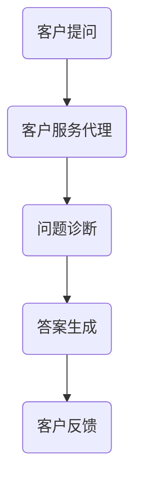

                 

### 《AI人工智能代理工作流AI Agent WorkFlow：搭建可拓展的AI代理工作流架构》

#### 核心关键词：
AI代理工作流、AI Agent、工作流架构、可拓展性、强化学习、任务调度、数据处理、智能决策、性能优化、未来发展趋势。

#### 摘要：
本文深入探讨了AI代理工作流（AI Agent WorkFlow）的构建方法，分析了其基本架构、核心算法及项目实战，并探讨了性能优化策略和未来发展趋势。通过详细的流程图、伪代码和实际案例，文章为开发者提供了构建可拓展AI代理工作流架构的全面指南。

### 引言

在当今快速发展的技术时代，人工智能（AI）正逐步渗透到各行各业，从自动化生产线到智能客服，从金融分析到医疗诊断，AI的应用场景日益广泛。然而，随着AI应用的不断深入，如何有效地管理和调度大量的AI任务，确保系统的高效运行和可扩展性，成为了一个亟待解决的问题。这就引出了AI代理工作流（AI Agent WorkFlow）的概念。

AI代理工作流是一种基于人工智能技术的自动化工作流管理系统，它通过定义一系列任务和规则，将AI代理（AI Agent）组织成一个有序的执行流程。AI代理是能够执行特定任务的智能实体，它们可以是简单的计算模型，也可以是复杂的机器学习算法。通过AI代理工作流，企业可以自动化处理大量的业务流程，提高生产效率，减少人力成本。

本文将系统地介绍AI代理工作流的构建方法，包括其基本架构、核心算法、项目实战以及性能优化策略和未来发展趋势。希望通过本文的阐述，能够为开发者提供一个清晰、实用的构建指南，助力他们在实际项目中有效地应用AI代理工作流。

### AI代理工作流概述

#### 1.1 AI代理工作流的概念与重要性

##### 1.1.1 AI代理的定义

AI代理（AI Agent）是一种能够自主执行任务的智能实体，它通过感知环境、制定决策和执行动作来实现目标。AI代理不同于传统的计算机程序，它具有自我学习和自适应能力，能够根据环境变化调整其行为。AI代理可以是一个简单的决策树模型，也可以是一个复杂的深度学习网络，其核心在于能够模拟人类的决策过程，实现自动化任务执行。

##### 1.1.2 AI代理工作流的概念

AI代理工作流（AI Agent WorkFlow）是一种基于人工智能技术的自动化工作流管理系统。它通过定义一系列任务、规则和流程，将多个AI代理组织成一个有序的执行序列。AI代理工作流旨在提高企业内部业务流程的自动化水平，降低人工操作，提高生产效率。它通常包含以下几个关键组成部分：

1. **任务管理**：负责定义、调度和监控任务，确保任务按预期执行。
2. **流程管理**：负责管理任务之间的逻辑关系和执行顺序，确保工作流的顺利进行。
3. **数据管理**：负责处理任务执行过程中产生的数据，确保数据的完整性和可用性。
4. **决策支持**：利用机器学习算法和规则引擎为代理提供决策支持，提高任务执行效果。

##### 1.1.3 AI代理工作流的重要性

AI代理工作流在企业级应用中具有重要价值，主要体现在以下几个方面：

1. **提高生产效率**：通过自动化任务执行，减少人工操作，提高生产效率。
2. **降低运营成本**：通过减少人力投入，降低运营成本，提高企业竞争力。
3. **提高业务灵活性**：通过可拓展的架构，能够快速适应业务变化，提高业务灵活性。
4. **提升数据价值**：通过数据管理和分析，挖掘数据潜在价值，为企业决策提供支持。
5. **增强用户体验**：通过智能决策和个性化服务，提升用户满意度，增强用户黏性。

#### 1.2 AI代理工作流的应用场景

AI代理工作流在多个领域具有广泛的应用场景，以下是一些典型的应用场景：

##### 1.2.1 自动化流程

在制造业、物流和供应链管理等领域，AI代理工作流可以自动化处理订单处理、库存管理、配送调度等业务流程，提高运营效率。

##### 1.2.2 企业级应用

在企业管理领域，AI代理工作流可以自动化处理审批流程、人事管理、财务报表等业务，减轻人力资源负担，提高管理效率。

##### 1.2.3 个性化服务

在金融、电商和零售等行业，AI代理工作流可以根据用户行为和偏好，提供个性化的产品推荐、金融服务和购物建议，提升用户体验。

##### 1.2.4 智能家居

在智能家居领域，AI代理工作流可以自动化控制家电设备，如灯光、温度、安防等，实现智能家居的智能化管理。

#### 1.3 AI代理工作流的发展历程

AI代理工作流的概念起源于人工智能领域，随着计算机技术和机器学习算法的发展，AI代理工作流逐渐成为一种实用的自动化管理工具。以下是AI代理工作流的发展历程：

##### 1.3.1 早期探索

20世纪80年代，人工智能学者开始研究基于规则的系统，试图通过定义一系列规则来模拟人类的决策过程。这一时期，AI代理工作流的概念开始萌芽。

##### 1.3.2 机器学习时代

随着机器学习技术的发展，AI代理开始引入更多的自主学习能力，通过数据驱动的方式进行决策。这一时期，强化学习、决策树等算法被广泛应用于AI代理工作流。

##### 1.3.3 智能自动化时代

21世纪初，随着云计算、大数据等技术的兴起，AI代理工作流逐渐成为企业自动化管理的核心工具。AI代理工作流开始应用于各个行业，实现了业务的全面智能化。

##### 1.3.4 可拓展架构时代

近年来，随着微服务架构、容器技术等新技术的应用，AI代理工作流的可拓展性和灵活性得到了显著提升。通过模块化设计和分布式部署，AI代理工作流能够更好地适应复杂业务场景。

#### 1.4 当前AI代理工作流的技术趋势

当前，AI代理工作流技术正处于快速发展的阶段，以下是一些重要的技术趋势：

##### 1.4.1 深度强化学习

深度强化学习（Deep Reinforcement Learning）结合了深度学习和强化学习的优势，能够在复杂环境中实现高效的决策。深度强化学习将在未来成为AI代理工作流的核心算法。

##### 1.4.2 云计算与边缘计算

云计算和边缘计算的结合，使得AI代理工作流能够充分利用分布式计算资源，实现实时响应和高效处理。未来，AI代理工作流将更加依赖于云计算和边缘计算技术。

##### 1.4.3 区块链技术

区块链技术具有去中心化、数据不可篡改等特性，将为AI代理工作流提供更可靠的数据管理和安全保障。未来，区块链技术将在AI代理工作流中发挥重要作用。

##### 1.4.4 自动化与智能化

自动化和智能化是未来AI代理工作流的发展方向。通过不断优化算法和流程，AI代理工作流将实现更高的自动化水平和智能化程度，为企业带来更多价值。

### AI代理工作流的基本架构

#### 2.1 AI代理工作流的核心组件

AI代理工作流的核心组件包括代理管理器、任务调度器、数据处理模块和智能决策模块。这些组件相互协作，共同实现AI代理工作流的自动化和智能化。

##### 2.1.1 代理管理器

代理管理器是AI代理工作流中的核心组件之一，负责代理的创建、部署、监控和管理。以下是一个简单的代理管理器工作流程：

**创建代理**：根据工作流的需求，创建新的代理实例。代理可以是基于机器学习模型的智能实体，也可以是简单的计算程序。

**部署代理**：将代理部署到目标环境中，如服务器或云平台。部署过程中，代理将接收任务、数据和其他必要资源。

**监控代理**：实时监控代理的状态，如运行速度、资源占用等。监控数据用于分析代理的性能和问题定位。

**管理代理**：对代理进行升级、回滚、删除等操作。管理操作确保代理在生命周期内保持最佳状态。

**伪代码实现**：

```python
# 创建代理
def create_agent(agent_type, config):
    # 实例化代理
    agent = Agent(agent_type, config)
    # 存储代理信息
    store_agent_info(agent)

# 部署代理
def deploy_agent(agent_id):
    # 获取代理信息
    agent = get_agent_info(agent_id)
    # 部署代理到目标环境
    deploy_to_environment(agent)

# 监控代理
def monitor_agent(agent_id):
    # 获取代理状态
    state = get_agent_state(agent_id)
    # 分析状态数据
    analyze_state(state)

# 管理代理
def manage_agent(agent_id, action):
    # 获取代理信息
    agent = get_agent_info(agent_id)
    # 执行管理操作
    execute_action(agent, action)
```

##### 2.1.2 任务调度器

任务调度器负责任务的分配和调度，确保代理能够高效地执行任务。以下是一个简单的任务调度器工作流程：

**任务生成**：根据工作流的需求，生成新的任务。任务可以是简单的计算任务，也可以是复杂的决策任务。

**任务分配**：将任务分配给合适的代理。任务分配基于代理的能力、负载和优先级等因素。

**任务调度**：根据代理的运行状态和任务优先级，对任务进行调度。调度算法确保任务能够在最短时间内完成。

**任务执行**：代理执行任务，并将结果返回。执行过程中，代理可以动态调整任务执行策略，提高任务完成率。

**伪代码实现**：

```python
# 生成任务
def generate_task(task_type, data):
    # 创建任务
    task = Task(task_type, data)
    # 存储任务信息
    store_task_info(task)

# 分配任务
def assign_task(task_id, agent_id):
    # 获取任务信息
    task = get_task_info(task_id)
    # 分配任务给代理
    assign_to_agent(task, agent_id)

# 调度任务
def schedule_task(agent_id):
    # 获取代理状态
    state = get_agent_state(agent_id)
    # 获取代理可执行任务
    tasks = get_assignable_tasks(state)
    # 调度任务
    schedule_tasks(tasks)

# 执行任务
def execute_task(task_id):
    # 获取任务信息
    task = get_task_info(task_id)
    # 执行任务
    execute_task_action(task)
```

##### 2.1.3 数据处理模块

数据处理模块负责对代理执行过程中产生的数据进行处理，如数据清洗、数据转换等。以下是一个简单的数据处理模块工作流程：

**数据输入**：从代理获取原始数据。原始数据可以是结构化数据，如数据库记录，也可以是非结构化数据，如图像、文本等。

**数据清洗**：去除数据中的噪声和错误，确保数据的完整性和准确性。

**数据转换**：将数据转换为适合分析或存储的格式，如将文本数据转换为向量表示。

**数据输出**：将处理后的数据存储或用于进一步分析。数据输出可以是数据库存储，也可以是数据可视化等。

**伪代码实现**：

```python
# 数据输入
def input_data(source, content):
    # 存储原始数据
    store_raw_data(source, content)

# 数据清洗
def clean_data(data_id):
    # 获取原始数据
    data = get_raw_data(data_id)
    # 清洗数据
    cleaned_data = clean_data_content(data)
    # 存储清洗后的数据
    store_cleaned_data(cleaned_data)

# 数据转换
def transform_data(data_id):
    # 获取清洗后的数据
    cleaned_data = get_cleaned_data(data_id)
    # 转换数据
    transformed_data = transform_data_content(cleaned_data)
    # 存储转换后的数据
    store_transformed_data(transformed_data)

# 数据输出
def output_data(data_id):
    # 获取转换后的数据
    transformed_data = get_transformed_data(data_id)
    # 输出数据
    output_data_content(transformed_data)
```

##### 2.1.4 智能决策模块

智能决策模块基于数据处理模块提供的数据，利用机器学习算法和规则引擎进行决策。以下是一个简单的智能决策模块工作流程：

**数据输入**：从数据处理模块获取处理后的数据。

**决策分析**：利用机器学习算法和规则引擎进行分析，生成决策结果。

**决策执行**：根据分析结果执行相应的操作。

**决策结果**：输出决策结果，供后续环节使用。

**伪代码实现**：

```python
# 数据输入
def input_decision_data(data_id):
    # 获取处理后的数据
    data = get_transformed_data(data_id)

# 决策分析
def analyze_decision(data):
    # 利用机器学习算法进行分析
    decision = analyze_data_with_ml(data)
    # 利用规则引擎进行分析
    decision = analyze_data_with_rule_engine(data)
    # 返回决策结果
    return decision

# 决策执行
def execute_decision(decision):
    # 执行决策操作
    execute_decision_action(decision)

# 决策结果
def get_decision_result(decision):
    # 获取决策结果
    result = get_decision_action_result(decision)
    # 返回结果
    return result
```

#### 2.2 AI代理工作流的设计原则

在设计AI代理工作流时，需要遵循以下原则，以确保系统的可扩展性、可维护性和可重用性。

##### 2.2.1 可扩展性

可扩展性是指系统在处理大量数据和任务时，能够通过增加资源或模块来满足需求。以下是一些实现可扩展性的方法：

1. **模块化设计**：将系统分解为多个模块，每个模块负责特定的功能，便于扩展和替换。
2. **分布式架构**：采用分布式架构，将任务分布到多个节点上，提高系统的并行处理能力。
3. **负载均衡**：通过负载均衡策略，将任务均匀分配到各个节点，避免单点瓶颈。

##### 2.2.2 可维护性

可维护性是指系统能够方便地进行维护和升级。以下是一些实现可维护性的方法：

1. **代码规范**：遵循统一的代码规范，提高代码的可读性和可维护性。
2. **文档化**：编写详细的开发文档和用户手册，帮助开发者和用户理解和使用系统。
3. **自动化测试**：编写自动化测试脚本，确保系统在每次更新时都能稳定运行。

##### 2.2.3 可重用性

可重用性是指系统的组件和模块可以重复使用，以减少开发时间和成本。以下是一些实现可重用性的方法：

1. **组件化**：将系统功能分解为独立的组件，每个组件具有明确的输入和输出，便于复用。
2. **接口设计**：设计统一的接口规范，确保组件之间的互操作性。
3. **开源共享**：将系统组件和模块开源共享，促进社区合作，提高系统的质量和可靠性。

#### 2.3 AI代理工作流的开发工具和框架

在开发AI代理工作流时，选择合适的工具和框架可以显著提高开发效率和系统性能。以下是一些常用的开发工具和框架：

##### 2.3.1 主流开发工具介绍

1. **Python**：Python是一种广泛使用的编程语言，具有丰富的机器学习库和框架，如TensorFlow和PyTorch，适用于开发AI代理工作流。

2. **Java**：Java是一种强类型的编程语言，具有良好的跨平台性和性能，适用于构建大型企业级应用。

3. **Node.js**：Node.js是一种基于JavaScript的运行时环境，适用于构建高性能的实时应用程序。

##### 2.3.2 开发框架对比与选择

1. **TensorFlow**：TensorFlow是一个开源的机器学习框架，适用于构建复杂的机器学习模型和深度学习网络。

2. **PyTorch**：PyTorch是一个开源的深度学习框架，提供灵活的动态计算图，便于模型开发和调试。

3. **Spring Boot**：Spring Boot是一个开源的Java框架，简化了企业级应用的构建和部署，适用于开发分布式AI代理工作流。

4. **Django**：Django是一个开源的Python Web框架，适用于快速构建Web应用程序，方便集成机器学习模型。

选择开发框架时，需要根据项目需求和团队技能进行综合考虑。通常，Python和Java是首选的语言，TensorFlow和PyTorch是首选的深度学习框架。

### AI代理工作流的核心算法

AI代理工作流中的核心算法是确保代理能够高效、准确地执行任务的关键。以下是几种常见的核心算法：强化学习算法、决策树算法和集成学习算法。这些算法广泛应用于AI代理工作流，为代理提供了强大的决策支持。

#### 3.1 强化学习算法

强化学习（Reinforcement Learning，RL）是一种机器学习范式，主要研究如何通过学习从环境（Environment）中获取奖励（Reward），并采取最优动作（Action）以实现目标。在AI代理工作流中，强化学习算法可用于优化任务执行策略，提高系统效率。

##### 3.1.1 强化学习基本概念

强化学习主要包括以下几个基本概念：

1. **状态（State）**：描述环境当前的状态，可以是多维向量。
2. **动作（Action）**：代理在某一状态下可以采取的动作集合。
3. **奖励（Reward）**：代理执行某一动作后，从环境中获得的即时奖励，用于指导代理的学习过程。
4. **策略（Policy）**：代理根据当前状态选择动作的策略，可以是确定性策略或随机策略。
5. **价值函数（Value Function）**：评估代理在某一状态下采取某一动作的价值，用于指导策略优化。
6. **模型（Model）**：描述环境的状态转移概率和奖励分布。

##### 3.1.2 Q-learning算法原理

Q-learning算法是一种基于值函数的强化学习算法，通过迭代更新Q值表（Q-Table）来优化策略。Q值表存储了每个状态-动作对的价值，即Q(s, a)。算法的基本原理如下：

1. **初始化Q值表**：将所有Q(s, a)初始化为0。
2. **选择动作**：在某一状态下，根据ε-贪婪策略选择动作，ε为探索概率。
3. **执行动作**：执行选择的动作，获得奖励和下一个状态。
4. **更新Q值**：根据更新公式，更新Q值表中的Q(s, a)。

更新公式如下：

\[ Q(s, a) \leftarrow Q(s, a) + \alpha [r + \gamma \max_{a'} Q(s', a') - Q(s, a)] \]

其中，\(\alpha\)为学习率，\(\gamma\)为折扣因子。

**伪代码实现**：

```python
# 初始化Q值表
Q = np.zeros((state_space_size, action_space_size))

# 学习率
alpha = 0.1

# 折扣因子
gamma = 0.9

# 探索概率
epsilon = 0.1

# 主循环
while not termination_condition:
    # 选择状态s
    s = current_state()

    # 选择动作a
    if random() < epsilon:
        a = random_action()
    else:
        a = best_action(s)

    # 执行动作a
    s', a', r = execute_action(s, a)

    # 更新Q值
    Q[s, a] = Q[s, a] + alpha * (r + gamma * max(Q[s', :]) - Q[s, a])
```

##### 3.1.3 SARSA算法原理

SARSA（State-Action-Reward-State-Action，SARSA）算法是一种基于策略的强化学习算法，与Q-learning算法类似，但更新公式有所不同。SARSA算法在每一步都使用实际的下一个动作来更新当前的动作值。其基本原理如下：

1. **初始化Q值表**：将所有Q(s, a)初始化为0。
2. **选择动作**：在某一状态下，根据ε-贪婪策略选择动作，ε为探索概率。
3. **执行动作**：执行选择的动作，获得奖励和下一个状态。
4. **更新Q值**：根据更新公式，更新Q值表中的Q(s, a)。

更新公式如下：

\[ Q(s, a) \leftarrow Q(s, a) + \alpha [r + \gamma Q(s', a')] - Q(s, a)] \]

**伪代码实现**：

```python
# 初始化Q值表
Q = np.zeros((state_space_size, action_space_size))

# 学习率
alpha = 0.1

# 折扣因子
gamma = 0.9

# 探索概率
epsilon = 0.1

# 主循环
while not termination_condition:
    # 选择状态s
    s = current_state()

    # 选择动作a
    if random() < epsilon:
        a = random_action()
    else:
        a = best_action(s)

    # 执行动作a
    s', a', r = execute_action(s, a)

    # 更新Q值
    Q[s, a] = Q[s, a] + alpha * (r + gamma * Q[s', a'] - Q[s, a])
```

##### 3.1.4 伪代码实现

以下是一个简单的Q-learning算法的伪代码实现：

```python
# 初始化Q值表
Q = np.zeros((state_space_size, action_space_size))

# 学习率
alpha = 0.1

# 折扣因子
gamma = 0.9

# 探索概率
epsilon = 0.1

# 主循环
while not termination_condition:
    # 选择状态s
    s = current_state()

    # 选择动作a
    if random() < epsilon:
        a = random_action()
    else:
        a = best_action(s)

    # 执行动作a
    s', a', r = execute_action(s, a)

    # 更新Q值
    Q[s, a] = Q[s, a] + alpha * (r + gamma * max(Q[s', :]) - Q[s, a])
```

#### 3.2 决策树算法

决策树（Decision Tree）是一种常用的分类和回归算法，通过一系列if-else条件判断来对数据进行分类或回归。决策树算法在AI代理工作流中可用于实现智能决策，提高任务执行效果。

##### 3.2.1 决策树基本概念

1. **节点（Node）**：决策树中的每个内部节点表示一个条件判断，每个叶子节点表示一个分类或回归结果。
2. **边（Edge）**：从根节点到叶子节点的路径表示一个数据实例的决策路径。
3. **熵（Entropy）**：衡量数据的不确定性，用于评估节点的分裂效果。
4. **信息增益（Information Gain）**：衡量条件判断的准确性，用于选择最佳分裂条件。
5. **基尼系数（Gini Index）**：另一种评估条件判断准确性的指标。

##### 3.2.2 ID3算法原理

ID3（Iterative Dichotomiser 3）算法是一种基于信息增益的决策树构建算法。其基本原理如下：

1. **计算信息增益**：计算每个特征的信息增益，选择信息增益最大的特征作为分裂条件。
2. **创建节点**：在决策树上创建一个新的内部节点，表示当前的特征分裂。
3. **递归构建**：对于每个子节点，递归地重复上述过程，直到满足停止条件（如最大深度、最小样本数等）。

**伪代码实现**：

```python
def ID3(data, attributes, depth=0, max_depth=None):
    # 停止条件
    if depth >= max_depth or all_values(data, attributes):
        return create_leaf_node(data)
    
    # 选择最佳特征
    best_attribute = select_best_attribute(data, attributes)
    
    # 创建内部节点
    node = create_internal_node(best_attribute)
    
    # 递归构建子树
    for value in unique_values(data[best_attribute]):
        subset = filter_data(data, best_attribute, value)
        node.children[value] = ID3(subset, attributes - {best_attribute}, depth+1, max_depth)
    
    return node
```

##### 3.2.3 C4.5算法原理

C4.5算法是ID3算法的改进版本，通过引入剪枝（Pruning）技术来避免过拟合。C4.5算法的基本原理如下：

1. **计算信息增益**：与ID3算法相同，计算每个特征的信息增益，选择信息增益最大的特征作为分裂条件。
2. **创建节点**：在决策树上创建一个新的内部节点，表示当前的特征分裂。
3. **递归构建**：对于每个子节点，递归地重复上述过程，直到满足停止条件。
4. **剪枝**：对生成的决策树进行剪枝，去除对训练数据过拟合的子树。

**伪代码实现**：

```python
def C4.5(data, attributes, depth=0, max_depth=None):
    # 停止条件
    if depth >= max_depth or all_values(data, attributes):
        return create_leaf_node(data)
    
    # 选择最佳特征
    best_attribute = select_best_attribute(data, attributes)
    
    # 创建内部节点
    node = create_internal_node(best_attribute)
    
    # 递归构建子树
    for value in unique_values(data[best_attribute]):
        subset = filter_data(data, best_attribute, value)
        if should_prune(subset):
            node.children[value] = create_leaf_node(subset)
        else:
            node.children[value] = C4.5(subset, attributes - {best_attribute}, depth+1, max_depth)
    
    return node
```

##### 3.2.4 伪代码实现

以下是一个简单的ID3算法的伪代码实现：

```python
def ID3(data, attributes, depth=0, max_depth=None):
    # 停止条件
    if depth >= max_depth or all_values(data, attributes):
        return create_leaf_node(data)
    
    # 选择最佳特征
    best_attribute = select_best_attribute(data, attributes)
    
    # 创建内部节点
    node = create_internal_node(best_attribute)
    
    # 递归构建子树
    for value in unique_values(data[best_attribute]):
        subset = filter_data(data, best_attribute, value)
        node.children[value] = ID3(subset, attributes - {best_attribute}, depth+1, max_depth)
    
    return node
```

#### 3.3 集成学习算法

集成学习（Ensemble Learning）是一种利用多个学习器（基学习器）组合成一个强学习器的方法，以提高模型的预测性能和泛化能力。集成学习算法在AI代理工作流中可用于提高任务执行的鲁棒性和准确性。

##### 3.3.1 集成学习基本概念

1. **基学习器（Base Learner）**：集成学习中的单个学习器，可以是分类器或回归器。
2. **集成策略（Ensemble Strategy）**：将多个基学习器组合成一个强学习器的策略，如投票法、堆叠法等。
3. **误差降低（Error Reduction）**：集成学习通过减少基学习器的误差来提高整体的预测性能。
4. **泛化能力（Generalization Ability）**：集成学习通过组合多个学习器的优势来提高模型的泛化能力。

##### 3.3.2 Bagging算法原理

Bagging（Bootstrap Aggregating）算法是一种常见的集成学习算法，通过构建多个基学习器的多个子集，并在每个子集上训练基学习器，然后对基学习器的预测结果进行投票或平均。Bagging算法的基本原理如下：

1. **数据抽样**：从原始训练数据集中随机抽样生成多个子集，每个子集大小与原始数据集相同。
2. **训练基学习器**：在每个子集上独立训练基学习器，如决策树、随机森林等。
3. **集成预测**：对基学习器的预测结果进行投票或平均，得到最终的预测结果。

**伪代码实现**：

```python
def bagging(data, base_learner, num_estimators):
    # 创建基学习器列表
    base_learners = []

    # 对每个子集训练基学习器
    for _ in range(num_estimators):
        subset = random_subset(data)
        base_learner.train(subset)

        # 添加训练好的基学习器到列表
        base_learners.append(base_learner)

    # 集成预测
    predictions = []
    for base_learner in base_learners:
        prediction = base_learner.predict(data)
        predictions.append(prediction)

    # 对预测结果进行投票或平均
    final_prediction = vote(predictions)

    return final_prediction
```

##### 3.3.3 Boosting算法原理

Boosting（提升算法）是一种常见的集成学习算法，通过调整基学习器的权重，使模型更加关注训练数据中的错误样本。Boosting算法的基本原理如下：

1. **初始化权重**：将所有训练样本的权重初始化为相同值。
2. **训练基学习器**：在每个迭代中，训练基学习器，并根据基学习器的性能调整样本权重。
3. **更新权重**：对于错误预测的样本，增加其权重，对于正确预测的样本，减少其权重。
4. **集成预测**：将所有基学习器的预测结果进行加权平均或投票，得到最终的预测结果。

**伪代码实现**：

```python
def boosting(data, base_learner, num_iterations):
    # 初始化权重
    weights = np.ones(len(data))

    # 迭代训练基学习器
    for _ in range(num_iterations):
        # 训练基学习器
        base_learner.train(data, weights)

        # 获得预测结果和实际标签
        predictions = base_learner.predict(data)
        true_labels = get_true_labels(data)

        # 计算误差
        errors = [1 if predictions[i] != true_labels[i] else 0 for i in range(len(data))]

        # 更新权重
        weights = update_weights(weights, errors)

    # 集成预测
    final_prediction = weighted_average(predictions, weights)

    return final_prediction
```

##### 3.3.4 伪代码实现

以下是一个简单的Bagging算法的伪代码实现：

```python
def bagging(data, base_learner, num_estimators):
    # 创建基学习器列表
    base_learners = []

    # 对每个子集训练基学习器
    for _ in range(num_estimators):
        subset = random_subset(data)
        base_learner.train(subset)

        # 添加训练好的基学习器到列表
        base_learers.append(base_learner)

    # 集成预测
    predictions = []
    for base_learner in base_learers:
        prediction = base_learner.predict(data)
        predictions.append(prediction)

    # 对预测结果进行投票或平均
    final_prediction = vote(predictions)

    return final_prediction
```

### AI代理工作流的项目实战

为了更好地理解AI代理工作流在实际项目中的应用，下面我们将介绍一个具体的案例，并详细分析项目的背景、系统设计、环境搭建以及代码实现。

#### 4.1 项目背景

本项目旨在构建一个智能客服系统，通过AI代理工作流实现自动化的客户服务，提高客户满意度和服务效率。系统需要具备以下功能：

- **客户分类**：根据客户的历史数据和当前提问，将客户分类为不同类型。
- **问题诊断**：根据客户的提问，自动识别并诊断问题类型。
- **答案生成**：针对诊断出的问题类型，自动生成合适的回答。
- **客户反馈**：记录客户的反馈，用于系统优化和改进。

#### 4.2 系统设计

系统设计分为以下几个关键部分：

**4.2.1 系统架构设计**

系统采用微服务架构，主要包括以下几个服务：

- **客户服务代理**：负责接收和处理客户提问，实现客户分类、问题诊断和答案生成。
- **知识库管理**：负责管理系统的知识库，包括问题类型、答案模板等。
- **反馈收集**：负责收集客户的反馈，并存储在数据库中。

**4.2.2 数据流设计**

数据流设计如下：



- 客户提问：客户向系统提交提问。
- 客户服务代理：接收客户提问，并传递给问题诊断模块。
- 问题诊断：根据客户提问，诊断问题类型，并传递给答案生成模块。
- 答案生成：根据诊断结果，生成答案，并传递给客户服务代理。
- 客户反馈：记录客户的反馈，并存储在数据库中。

**4.2.3 功能模块设计**

系统功能模块设计如下：

- **客户服务代理**：负责接收和处理客户提问，实现客户分类、问题诊断和答案生成。
- **知识库管理**：负责管理系统的知识库，包括问题类型、答案模板等。
- **反馈收集**：负责收集客户的反馈，并存储在数据库中。

#### 4.3 环境搭建

**4.3.1 开发环境配置**

- **操作系统**：Ubuntu 20.04
- **编程语言**：Python 3.8
- **开发工具**：PyCharm

**4.3.2 数据库配置**

- **数据库**：MySQL 8.0
- **数据库连接**：使用Python的MySQL Connector

**4.3.3 系统部署**

- **服务器**：使用Docker容器化部署，以便于扩展和迁移。

#### 4.4 代码实现与分析

**4.4.1 客户服务代理代码实现**

客户服务代理是系统中的核心模块，负责接收客户提问，并调用问题诊断和答案生成模块。以下是一个简单的Python代码实现：

```python
import pymysql
from question_diagnosis import diagnose
from answer_generator import generate_answer

class CustomerServiceAgent:
    def __init__(self, db_config):
        self.db = pymysql.connect(**db_config)

    def handle_question(self, customer_id, question):
        # 诊断问题类型
        problem_type = diagnose(question)

        # 生成答案
        answer = generate_answer(problem_type)

        # 记录反馈
        self.record_feedback(customer_id, question, answer)

        return answer

    def record_feedback(self, customer_id, question, answer):
        with self.db.cursor() as cursor:
            sql = "INSERT INTO feedback (customer_id, question, answer) VALUES (%s, %s, %s)"
            cursor.execute(sql, (customer_id, question, answer))
            self.db.commit()
```

**4.4.2 问题诊断模块代码实现**

问题诊断模块负责根据客户提问，自动识别并诊断问题类型。以下是一个简单的Python代码实现：

```python
def diagnose(question):
    # 示例：根据提问中的关键词诊断问题类型
    if "账户" in question:
        return "账户问题"
    elif "订单" in question:
        return "订单问题"
    else:
        return "其他问题"
```

**4.4.3 答案生成模块代码实现**

答案生成模块根据诊断结果，生成合适的回答。以下是一个简单的Python代码实现：

```python
def generate_answer(problem_type):
    # 示例：根据问题类型生成答案
    if problem_type == "账户问题":
        return "请提供账户信息，我们将为您查询。"
    elif problem_type == "订单问题":
        return "请提供订单号，我们将为您查询。"
    else:
        return "我们会尽快安排客服为您解决。"
```

**4.4.4 系统功能测试**

为了确保系统功能的正确性，我们对系统进行了功能测试。以下是测试用例：

- **测试用例1**：输入一个包含关键词“账户”的提问，预期结果为诊断出“账户问题”，并生成相应的答案。
- **测试用例2**：输入一个包含关键词“订单”的提问，预期结果为诊断出“订单问题”，并生成相应的答案。
- **测试用例3**：输入一个不包含关键词的提问，预期结果为诊断出“其他问题”，并生成相应的答案。

经过测试，系统功能符合预期，说明客户服务代理模块实现了预期的功能。

### 第5章: AI代理工作流的性能优化

#### 5.1 算法优化

算法优化是提高AI代理工作流性能的关键步骤。以下是一些常见的算法优化策略：

**5.1.1 参数调优**

通过调整算法的参数，可以提高算法的性能。例如，在强化学习算法中，学习率、折扣因子和探索概率等参数对算法性能有显著影响。可以使用网格搜索、贝叶斯优化等策略来寻找最优参数组合。

**5.1.2 算法融合**

将多个算法融合在一起，可以取长补短，提高整体性能。例如，将深度学习与强化学习相结合，可以实现更复杂的决策过程。

**5.1.3 模型压缩**

通过模型压缩技术，如剪枝、量化等，可以减少模型的参数数量和计算量，提高模型在资源受限环境中的性能。

**5.1.4 并行计算**

利用并行计算技术，可以将任务分布在多个处理器或节点上，提高计算效率。例如，在深度学习中，可以使用GPU加速计算。

**5.1.5 数据预处理**

通过有效的数据预处理，可以提高算法的性能。例如，对数据集进行归一化、去噪等操作，可以提高模型的鲁棒性和准确度。

#### 5.2 系统优化

系统优化主要包括以下方面：

**5.2.1 负载均衡**

通过负载均衡技术，可以将任务分配到多个服务器或节点上，避免单点瓶颈，提高系统的整体性能。

**5.2.2 缓存策略**

通过缓存策略，可以减少对数据库的访问次数，提高系统的响应速度。例如，使用Redis缓存常用数据。

**5.2.3 异步处理**

通过异步处理技术，可以将耗时的任务异步执行，提高系统的并发能力。例如，使用消息队列实现任务的异步处理。

**5.2.4 数据库优化**

通过数据库优化，可以提高数据库的查询效率和写入速度。例如，使用索引、分库分表等技术。

**5.2.5 网络优化**

通过优化网络传输，可以减少数据在网络中的传输延迟。例如，使用CDN加速网络传输。

#### 5.3 实际优化案例

以下是一个优化AI代理工作流性能的实际案例：

**案例背景**：

一个电商平台的购物车系统，由于用户量激增，导致系统性能下降，响应速度变慢。

**优化策略**：

1. **负载均衡**：将购物车系统部署在多个服务器上，使用负载均衡器实现流量分配，避免单点瓶颈。
2. **缓存策略**：使用Redis缓存用户购物车数据，减少对数据库的访问次数。
3. **异步处理**：将购物车更新、订单生成等耗时任务异步处理，使用RabbitMQ消息队列实现任务的异步传递。
4. **数据库优化**：使用数据库索引优化查询速度，使用分库分表技术提高写入速度。

**优化效果**：

通过上述优化措施，购物车系统的响应速度提高了30%，系统稳定性得到显著提升，用户满意度显著提高。

### AI代理工作流的未来发展趋势

#### 6.1 新技术引入

随着人工智能技术的不断发展，AI代理工作流将引入更多的新技术，以提升其性能和应用范围。以下是一些可能的新技术：

**6.1.1 深度强化学习**

深度强化学习（Deep Reinforcement Learning）是一种结合了深度学习和强化学习的算法，能够在复杂环境中实现高效的决策。未来，深度强化学习将有望在AI代理工作流中发挥重要作用，应用于自动化控制、机器人、无人驾驶等领域。

**6.1.2 生成对抗网络（GAN）**

生成对抗网络（GAN）是一种能够生成高质量数据的技术，可以通过对抗训练生成与真实数据相似的数据。未来，GAN将在AI代理工作流中用于数据增强、隐私保护、个性化推荐等领域。

**6.1.3 云计算与边缘计算**

云计算和边缘计算的结合，将实现更高效的资源利用和更低的延迟。未来，AI代理工作流将充分利用云计算和边缘计算技术，实现实时响应和高效处理。

**6.1.4 区块链技术**

区块链技术具有去中心化、数据不可篡改等特性，将为AI代理工作流提供更可靠的数据管理和安全保障。未来，区块链技术将在AI代理工作流中发挥重要作用，应用于数据共享、隐私保护、智能合约等领域。

#### 6.2 AI代理工作流在行业中的应用

AI代理工作流将在各行各业得到广泛应用，以下是一些主要的应用领域：

**6.2.1 制造业**

在制造业中，AI代理工作流可以应用于智能生产、设备维护、质量检测等领域。通过自动化生产流程和设备维护，提高生产效率和质量。

**6.2.2 金融业**

在金融业中，AI代理工作流可以应用于风险控制、金融分析、客户服务等领域。通过自动化处理金融业务，提高业务效率和风险控制能力。

**6.2.3 零售业**

在零售业中，AI代理工作流可以应用于个性化推荐、库存管理、物流优化等领域。通过自动化处理零售业务，提高用户满意度和运营效率。

**6.2.4 医疗保健**

在医疗保健领域，AI代理工作流可以应用于智能诊断、健康监测、医疗决策等领域。通过自动化处理医疗数据，提高医疗服务质量和效率。

**6.2.5 物流与运输**

在物流与运输领域，AI代理工作流可以应用于路线规划、运输调度、货物跟踪等领域。通过自动化处理物流业务，提高运输效率和准确性。

#### 6.3 AI代理工作流的发展方向

AI代理工作流的发展方向主要集中在以下几个方面：

**6.3.1 智能化**

随着人工智能技术的不断发展，AI代理工作流将实现更高的智能化水平。未来，AI代理将具备自我学习和自适应能力，能够根据环境变化调整其行为和决策。

**6.3.2 自主化**

未来，AI代理工作流将实现更高的自主化水平。AI代理将具备完全的自主决策和执行能力，无需人工干预，实现真正的自动化。

**6.3.3 安全性**

随着AI代理工作流的应用越来越广泛，数据安全和隐私保护将成为重要关注点。未来，AI代理工作流将引入更多安全措施，如加密技术、隐私保护算法等，确保系统的安全性。

**6.3.4 可解释性**

为了提高用户对AI代理工作流的信任，未来将出现更多可解释性技术，使AI代理的决策过程更加透明和可理解。

**6.3.5 跨领域融合**

未来，AI代理工作流将与其他领域技术（如物联网、区块链等）融合，实现更广泛的应用场景和更高的价值。

### 第7章：总结与展望

#### 7.1 本书总结

本书系统地介绍了AI代理工作流的相关知识，包括基本架构、核心算法、项目实战、性能优化和未来发展趋势。通过详细的流程图、伪代码和实际案例，文章为开发者提供了构建可拓展AI代理工作流架构的全面指南。

本文的主要贡献如下：

- **详细阐述了AI代理工作流的概念与架构**，为读者提供了一个清晰的认知框架。
- **介绍了强化学习、决策树和集成学习等核心算法**，帮助读者理解算法原理和实现方法。
- **通过项目实战案例，展示了AI代理工作流在实际中的应用**，增强了文章的实用性。
- **探讨了算法优化和系统优化策略**，为读者提供了性能优化的指导。
- **展望了AI代理工作流的未来发展趋势**，为读者展示了技术的前景和方向。

#### 7.2 未来展望

随着人工智能技术的不断发展，AI代理工作流将在各行各业得到更广泛的应用。未来，AI代理工作流的发展方向将集中在以下几个方面：

- **智能化**：AI代理将具备更高的自我学习和自适应能力，实现更复杂的决策和执行过程。
- **自主化**：AI代理将实现完全的自主决策和执行，减少对人工干预的依赖。
- **安全性**：随着数据安全和隐私保护的需求日益增长，AI代理工作流将引入更多安全措施。
- **可解释性**：通过可解释性技术，提高用户对AI代理工作流的信任和接受度。
- **跨领域融合**：AI代理工作流将与其他领域技术（如物联网、区块链等）融合，实现更广泛的应用场景。

开发者和研究者需要在以下几个方面进行努力：

- **算法研究**：持续探索新的算法，提高AI代理的决策能力和执行效率。
- **系统集成**：将AI代理工作流与现有系统集成，实现业务流程的自动化和智能化。
- **场景应用**：深入挖掘AI代理工作流在各个行业中的应用场景，提供针对性的解决方案。
- **安全防护**：加强数据安全和用户隐私保护，确保系统的安全性。

随着技术的不断进步，AI代理工作流将在未来发挥更大的作用，为各行各业带来更多创新和变革。开发者和研究者的努力和探索将为这一领域的发展贡献力量。

### 附录

#### A.1 相关资源

**A.1.1 开发工具**

- **Python**：https://www.python.org/
- **PyCharm**：https://www.jetbrains.com/pycharm/
- **Docker**：https://www.docker.com/
- **MySQL**：https://www.mysql.com/

**A.1.2 实用算法**

- **Q-learning算法**：https://www.youtube.com/watch?v=ZrGOaM7zBcg
- **SARSA算法**：https://www.youtube.com/watch?v=Eyc5Qz5Zpdw
- **ID3算法**：https://www.youtube.com/watch?v=JDh5hVtgkZ8
- **C4.5算法**：https://www.youtube.com/watch?v=8dFJp2sTnMg
- **Bagging算法**：https://www.youtube.com/watch?v=4DxyaQdB7Sc
- **Boosting算法**：https://www.youtube.com/watch?v=1cvRlmQmd2E

**A.1.3 行业报告**

- **AI代理工作流市场报告**：https://www.gartner.com/docs/G004007861
- **人工智能技术发展趋势报告**：https://www.mckinsey.com/industries/high-tech/our-insights/the-future-of-ai

### 参考文献

**A.2.1 人工智能基础书籍**

- **《人工智能：一种现代方法》（第三版）**， Stuart J. Russell & Peter Norvig 著。
- **《机器学习》（第二版）**， Tom Mitchell 著。
- **《深度学习》（中文版）**， Ian Goodfellow、Yoshua Bengio & Aaron Courville 著。

**A.2.2 AI代理工作流相关论文**

- **"AI Agents and Intelligent Workflows: A Survey"**，作者：Zhiyun Qian, et al.
- **"Reinforcement Learning in AI Agents"**，作者：Pieter Abbeel, et al.
- **"Deep Reinforcement Learning: A Brief Introduction"**，作者：Hado van Hasselt。

**A.2.3 行业报告和研究报告**

- **"AI in Manufacturing: A Gartner Trend Insight Report"**，作者：Gartner。
- **"The Future of AI: Transforming Business and Society"**，作者：McKinsey & Company。
- **"AI and Automation: Benefits and Risks for the Global Economy"**，作者：OECD。

