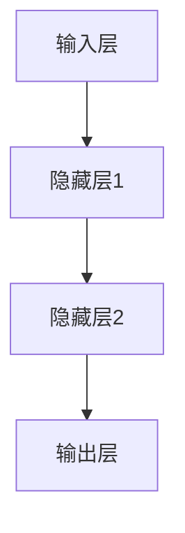

                 

### 文章标题

"AI人工智能核心算法原理与代码实例讲解：机器思维"

### 关键词

- 人工智能
- 核心算法
- 机器思维
- 深度学习
- 自然语言处理
- 强化学习

### 摘要

本文将深入探讨人工智能（AI）的核心算法原理，并通过代码实例讲解如何实现这些算法。文章从AI的基础概念出发，详细解析神经网络、深度学习、自然语言处理、强化学习等核心算法，同时涵盖数学基础、工程实践、应用案例和未来发展趋势。通过阅读本文，读者将全面了解AI的核心思维模式，并学会如何将理论应用于实际项目中。

### 《AI人工智能核心算法原理与代码实例讲解：机器思维》目录大纲

#### 第一部分：AI人工智能核心概念与架构

**第1章：AI人工智能概述**

- **1.1 AI人工智能的定义与发展历史**
- **1.2 AI人工智能的核心概念**
  - **1.2.1 神经网络与深度学习**
    - **1.2.1.1 神经网络的基础概念**
    - **1.2.1.2 深度学习的核心架构**
  - **1.2.2 自然语言处理（NLP）**
    - **1.2.2.1 语言模型与词向量**
    - **1.2.2.2 序列模型与注意力机制**
  - **1.2.3 强化学习与决策论**
    - **1.2.3.1 强化学习的基本原理**
    - **1.2.3.2 决策论与博弈论基础**

**第2章：AI人工智能的核心算法原理**

- **2.1 神经网络与深度学习算法**
  - **2.1.1 反向传播算法**
    - **2.1.1.1 算法原理**
    - **2.1.1.2 反向传播算法的伪代码**
  - **2.1.2 深度学习优化算法**
    - **2.1.2.1 梯度下降法**
    - **2.1.2.2 动量法**
    - **2.1.2.3 Adam优化器**
- **2.2 自然语言处理算法**
  - **2.2.1 语言模型**
    - **2.2.1.1 语言模型的基本原理**
    - **2.2.1.2 语言模型的应用场景**
  - **2.2.2 序列标注算法**
    - **2.2.2.1 BiLSTM + CRF算法**
    - **2.2.2.2 序列标注算法的伪代码**

**第3章：机器学习数学基础**

- **3.1 线性代数基础**
  - **3.1.1 矩阵与向量运算**
  - **3.1.2 线性方程组求解**
- **3.2 概率论与统计基础**
  - **3.2.1 概率分布与期望**
  - **3.2.2 最大似然估计与最小化损失函数**

**第4章：AI人工智能工程实践**

- **4.1 数据处理与特征工程**
  - **4.1.1 数据预处理方法**
  - **4.1.2 特征选择与特征提取**
- **4.2 模型训练与评估**
  - **4.2.1 训练策略与技巧**
  - **4.2.2 模型评估与调优**

**第5章：AI人工智能应用案例分析**

- **5.1 语音识别与合成**
  - **5.1.1 HMM + DNN语音识别模型**
  - **5.1.2 Wav2Vec 2.0 模型**
- **5.2 图像识别与生成**
  - **5.2.1 卷积神经网络（CNN）**
  - **5.2.2 生成对抗网络（GAN）**

**第6章：AI人工智能伦理与社会影响**

- **6.1 AI人工智能的伦理问题**
  - **6.1.1 数据隐私与伦理**
  - **6.1.2 AI偏见与歧视**
- **6.2 AI人工智能的社会影响**
  - **6.2.1 AI对就业市场的影响**
  - **6.2.2 AI对社会发展的影响**

**第7章：AI人工智能未来发展趋势**

- **7.1 AI人工智能技术前沿**
  - **7.1.1 强化学习与迁移学习**
  - **7.1.2 自主决策与智能系统**
- **7.2 AI人工智能的未来展望**
  - **7.2.1 AI与物联网（IoT）**
  - **7.2.2 AI与生物科技**

**附录**

- **附录A：AI人工智能工具与资源**
  - **A.1 开源深度学习框架对比**
    - **A.1.1 TensorFlow**
    - **A.1.2 PyTorch**
    - **A.1.3 Keras**
  - **A.2 机器学习常用库与工具**
    - **A.2.1 NumPy**
    - **A.2.2 Pandas**
    - **A.2.3 Matplotlib**
  - **A.3 AI人工智能开源项目推荐**

---

接下来，我们将逐一详细探讨上述章节的内容。首先，从AI人工智能的定义与发展历史开始。

### 第1章：AI人工智能概述

#### 1.1 AI人工智能的定义与发展历史

人工智能（AI）是指使计算机具备人类智能的能力，包括学习、推理、规划、感知、理解自然语言、识别图像等。AI的发展历程可以追溯到20世纪50年代，当时计算机科学家开始探索如何让计算机模仿人类思维。

**发展历程：**

1. **初始阶段（1950-1969）**：1950年，图灵提出了著名的图灵测试，标志着人工智能概念的诞生。1956年，达特茅斯会议上，人工智能一词首次被正式提出。

2. **繁荣时期（1970-1989）**：这一时期，人工智能研究领域取得了一系列突破，如专家系统、知识表示、推理机等。

3. **低谷期（1990-2000）**：由于技术限制和实际应用困难，人工智能领域进入低谷期。

4. **复兴阶段（2000-2010）**：随着计算机性能的提高和大数据技术的发展，人工智能再次崛起，深度学习成为研究热点。

5. **快速发展期（2010至今）**：人工智能在语音识别、图像识别、自然语言处理等领域取得了重大突破，应用场景日益广泛。

**核心概念：**

1. **神经网络与深度学习**：模仿人脑神经元连接的结构，通过多层神经网络进行特征提取和分类。

2. **自然语言处理（NLP）**：使计算机理解和生成人类语言的技术。

3. **强化学习**：通过与环境交互来学习最优策略。

6. **机器思维**：人工智能的最终目标，使机器具备独立思考、决策和解决问题的能力。

#### 1.2 AI人工智能的核心概念

##### 1.2.1 神经网络与深度学习

**神经网络的基础概念：**

神经网络由大量相互连接的神经元组成，每个神经元接收输入信号，通过权重和偏置计算输出。

**深度学习的核心架构：**

深度学习是神经网络的一种扩展，通过多层神经网络结构进行特征提取和分类。

**示例：**



##### 1.2.2 自然语言处理（NLP）

**语言模型与词向量：**

语言模型用于预测下一个单词的概率，词向量用于表示单词的语义信息。

**序列模型与注意力机制：**

序列模型用于处理序列数据，注意力机制用于提高模型对关键信息的关注。

##### 1.2.3 强化学习与决策论

**强化学习的基本原理：**

强化学习通过奖励和惩罚来引导模型学习最优策略。

**决策论与博弈论基础：**

决策论用于在不确定环境中做出最佳决策，博弈论研究多智能体之间的交互。

---

在这一章中，我们初步了解了人工智能的定义、发展历程和核心概念。在接下来的章节中，我们将深入探讨AI的核心算法原理，并通过代码实例进行讲解。敬请期待！

---

### 第2章：AI人工智能的核心算法原理

在这一章中，我们将详细探讨AI人工智能的核心算法原理，包括神经网络与深度学习算法、自然语言处理算法等。这些算法是人工智能技术的基石，通过它们，计算机能够实现诸如图像识别、语音识别、自然语言理解等复杂任务。

#### 2.1 神经网络与深度学习算法

神经网络与深度学习算法是人工智能领域的核心技术，其基本原理是通过多层神经网络进行特征提取和分类。在本节中，我们将重点介绍反向传播算法、深度学习优化算法等。

##### 2.1.1 反向传播算法

反向传播算法是深度学习训练过程中的核心步骤，用于计算网络参数的梯度。以下是反向传播算法的基本原理和伪代码。

**基本原理：**

反向传播算法通过前向传播计算出输出结果，然后利用输出结果与实际标签之间的误差，通过反向传播计算网络参数的梯度。

**伪代码：**

```python
for each layer L from L to 1:
    delta[L] = sigma[(delta[L+1].dot(W[L+1].T))]
    if L == 1:
        delta[L] = delta[L].dot(W[L].T)
    gradients[L] = delta[L] * activation[L-1]
endfor
```

##### 2.1.2 深度学习优化算法

深度学习优化算法用于调整网络参数，以最小化损失函数。常见的优化算法包括梯度下降法、动量法和Adam优化器等。

**梯度下降法：**

梯度下降法通过计算损失函数关于网络参数的梯度，并沿着梯度方向调整参数，以最小化损失函数。

**动量法：**

动量法在梯度下降的基础上引入了一个动量项，用于加速梯度下降的过程。

**Adam优化器：**

Adam优化器结合了梯度下降法和动量法，具有较好的收敛性能。

#### 2.2 自然语言处理算法

自然语言处理算法是人工智能领域的一个重要分支，主要用于处理自然语言文本。在本节中，我们将重点介绍语言模型、序列标注算法等。

##### 2.2.1 语言模型

语言模型用于预测文本序列的概率分布，是自然语言处理的基础。常见的语言模型包括n元语言模型和基于神经的网络语言模型。

**n元语言模型：**

n元语言模型通过统计文本序列中n个连续单词的概率来预测下一个单词。

**神经网络语言模型：**

神经网络语言模型通过多层神经网络学习文本序列的概率分布。

##### 2.2.2 序列标注算法

序列标注算法用于对文本序列进行分类标注，常见的序列标注算法包括BiLSTM + CRF算法等。

**BiLSTM + CRF算法：**

BiLSTM + CRF算法结合了双向长短期记忆网络（BiLSTM）和条件随机场（CRF），用于处理序列标注任务。

**伪代码：**

```python
BiLSTM:
for each time step t:
    hidden_state[t] = LSTM(input[t], hidden_state[t-1])
for each word w in sequence:
    score[w] = sigmoid(W_c * hidden_state + b_c)

CRF:
for each word w in sequence:
    transition_scores[w] = CRF_score(w, previous_word)
    viterbi_path = viterbi(transition_scores)
    predicted_label[w] = viterbi_path[-1]
```

---

在本章中，我们详细介绍了神经网络与深度学习算法、自然语言处理算法等核心算法原理。这些算法为人工智能技术的发展奠定了基础，在接下来的章节中，我们将进一步探讨机器学习数学基础和AI人工智能工程实践。敬请期待！

---

### 第3章：机器学习数学基础

机器学习作为人工智能的核心技术之一，其发展离不开数学的支持。在本章中，我们将介绍机器学习过程中常用的数学基础，包括线性代数和概率论与统计基础。这些数学工具对于理解和实现机器学习算法至关重要。

#### 3.1 线性代数基础

线性代数是机器学习中不可或缺的数学工具，主要用于处理矩阵与向量运算、线性方程组求解等问题。

##### 3.1.1 矩阵与向量运算

矩阵与向量运算是线性代数中的基础内容，包括矩阵的加法、减法、乘法、转置等。

**矩阵加法与减法：**

假设有两个矩阵 \(A\) 和 \(B\)，其维度相同，则矩阵加法和减法的定义如下：

\[ A + B = C \]
\[ A - B = D \]

其中 \(C\) 和 \(D\) 的元素分别为 \(A\) 和 \(B\) 对应元素的加法和减法结果。

**矩阵乘法：**

假设有两个矩阵 \(A\) 和 \(B\)，其维度分别为 \(m \times n\) 和 \(n \times p\)，则矩阵乘法的定义如下：

\[ AB = C \]

其中 \(C\) 的元素 \(c_{ij}\) 是 \(A\) 的第 \(i\) 行与 \(B\) 的第 \(j\) 列对应元素的乘积和。

**向量运算：**

向量运算包括向量的加法、减法、标量乘法等。

**标量乘法：**

给定一个向量 \(v\) 和一个标量 \(a\)，则标量乘法的定义如下：

\[ av = w \]

其中 \(w\) 是 \(v\) 的每个元素乘以 \(a\) 的结果。

**向量的内积与外积：**

向量的内积（点积）和外积（叉积）是向量运算中的两种重要运算。

- **内积：**

  给定两个向量 \(u\) 和 \(v\)，其内积（点积）定义如下：

  \[ u \cdot v = \sum_{i=1}^{n} u_i v_i \]

- **外积：**

  给定两个向量 \(u\) 和 \(v\)，其外积（叉积）定义如下：

  \[ u \times v = \begin{vmatrix}
  \mathbf{i} & \mathbf{j} & \mathbf{k} \\
  u_1 & u_2 & u_3 \\
  v_1 & v_2 & v_3 \\
  \end{vmatrix} \]

##### 3.1.2 线性方程组求解

线性方程组是机器学习中的常见问题，线性代数提供了多种求解线性方程组的方法。

**高斯消元法：**

高斯消元法是一种通过逐步消元来求解线性方程组的方法。其基本思想是利用矩阵的行变换将线性方程组转化为上三角矩阵或下三角矩阵，从而方便求解。

**伪代码：**

```python
# 高斯消元法求解线性方程组 Ax = b
def gauss_elimination(A, b):
    n = len(b)
    for i in range(n):
        # 寻找最大元素作为主元
        max_index = find_max_element(A[i], i)
        # 交换行
        A[i], A[max_index] = A[max_index], A[i]
        b[i], b[max_index] = b[max_index], b[i]
        # 消元
        for j in range(i+1, n):
            factor = A[j][i] / A[i][i]
            for k in range(i, n):
                A[j][k] -= factor * A[i][k]
            b[j] -= factor * b[i]
    # 回代求解
    x = [0] * n
    for i in range(n-1, -1, -1):
        x[i] = (b[i] - sum(A[i][j] * x[j] for j in range(i+1, n))) / A[i][i]
    return x
```

#### 3.2 概率论与统计基础

概率论与统计基础是机器学习中另一个重要的数学工具，用于描述和处理随机事件和统计信息。

##### 3.2.1 概率分布与期望

**概率分布：**

概率分布描述了随机变量取不同值的概率。常见的概率分布包括伯努利分布、二项分布、泊松分布、正态分布等。

- **伯努利分布：**

  伯努利分布是二项分布的特例，用于描述一个随机事件在两种可能性之间发生的情况。

- **二项分布：**

  二项分布用于描述在固定次数的独立试验中，成功发生的次数。

- **泊松分布：**

  泊松分布用于描述在固定时间或空间内，某个事件发生的次数。

- **正态分布：**

  正态分布是最常见的连续概率分布，用于描述正态随机变量的分布。

**期望：**

期望是概率论中描述随机变量取值的中心位置，是随机变量取值的加权平均。

\[ E(X) = \sum_{i=1}^{n} x_i P(X = x_i) \]

##### 3.2.2 最大似然估计与最小化损失函数

**最大似然估计：**

最大似然估计是一种基于概率模型估计模型参数的方法。其基本思想是找到一组参数，使得观察到的数据在模型下的概率最大。

\[ \hat{\theta} = \arg\max_{\theta} P(D|\theta) \]

**最小化损失函数：**

在机器学习中，损失函数用于衡量模型预测值与真实值之间的差距。最小化损失函数是机器学习训练过程中的核心任务。

\[ \min_{\theta} L(\theta; D) \]

---

在本章中，我们介绍了机器学习过程中常用的数学基础，包括线性代数和概率论与统计基础。这些数学工具为理解和实现机器学习算法提供了坚实的基础。在接下来的章节中，我们将进一步探讨AI人工智能工程实践和AI人工智能应用案例分析。敬请期待！

---

### 第4章：AI人工智能工程实践

在了解了AI人工智能的核心算法原理和数学基础后，我们将转入实际应用部分，讨论AI人工智能工程实践。这一章将重点介绍数据处理与特征工程、模型训练与评估的方法和技巧。

#### 4.1 数据处理与特征工程

数据处理与特征工程是机器学习项目中的关键环节，它们直接影响到模型的性能和效率。以下是数据处理与特征工程的一些重要步骤：

##### 4.1.1 数据预处理方法

数据预处理是确保数据质量和适合模型训练的重要步骤。以下是一些常用的数据预处理方法：

1. **数据清洗**：处理缺失值、重复值、异常值等不干净的数据。
   ```python
   df = df.dropna()  # 删除缺失值
   df = df.drop_duplicates()  # 删除重复值
   ```

2. **数据转换**：将数据转换为适合模型训练的格式，如数值化、标准化、归一化等。
   ```python
   df = (df - df.mean()) / df.std()  # 标准化
   ```

3. **数据增强**：通过增加数据的多样性来提高模型的泛化能力。
   ```python
   from sklearn.utils import resample
   df_majority = df[df.label == 0]
   df_minority = df[df.label == 1]
   df_minority_upsampled = resample(df_minority, replace=True, n_samples=len(df_majority), random_state=123)
   df_upsampled = pd.concat([df_majority, df_minority_upsampled])
   ```

##### 4.1.2 特征选择与特征提取

特征选择与特征提取是减少数据维度和提取重要特征的过程，有助于提高模型性能和降低计算复杂度。

1. **特征选择**：选择对模型贡献最大的特征。
   ```python
   from sklearn.feature_selection import SelectKBest, f_classif
   select_k_best = SelectKBest(score_func=f_classif, k=10)
   X_new = select_k_best.fit_transform(X, y)
   ```

2. **特征提取**：使用特征变换方法提取新的特征。
   ```python
   from sklearn.decomposition import PCA
   pca = PCA(n_components=5)
   X_reduced = pca.fit_transform(X)
   ```

#### 4.2 模型训练与评估

模型训练与评估是机器学习项目中的核心环节，以下是一些常用的训练策略和评估方法：

##### 4.2.1 训练策略与技巧

1. **模型初始化**：选择合适的初始化方法，如随机初始化、层序初始化等。
   ```python
   from tensorflow.keras.initializers import glorot_uniform
   model.init = glorot_uniform(seed=seed)
   ```

2. **学习率调度**：选择合适的学习率，如固定学习率、自适应学习率等。
   ```python
   from tensorflow.keras.optimizers import Adam
   optimizer = Adam(learning_rate=0.001)
   ```

3. **正则化**：引入正则化项以防止过拟合。
   ```python
   from tensorflow.keras.regularizers import l2
   model.add(Dense(128, activation='relu', kernel_regularizer=l2(0.01)))
   ```

4. **批量大小**：选择合适的批量大小，如小批量、大批量等。
   ```python
   model.fit(X_train, y_train, batch_size=64, epochs=10)
   ```

##### 4.2.2 模型评估与调优

1. **交叉验证**：使用交叉验证方法评估模型性能，避免过拟合。
   ```python
   from sklearn.model_selection import KFold
   kf = KFold(n_splits=5)
   for train_index, test_index in kf.split(X):
       X_train, X_test = X[train_index], X[test_index]
       y_train, y_test = y[train_index], y[test_index]
       model.fit(X_train, y_train, batch_size=64, epochs=10)
       evaluate_model(model, X_test, y_test)
   ```

2. **模型调优**：通过调整模型参数和训练策略来提高模型性能。
   ```python
   from sklearn.model_selection import GridSearchCV
   parameters = {'learning_rate': [0.001, 0.01, 0.1], 'batch_size': [32, 64, 128]}
   grid_search = GridSearchCV(estimator=model, param_grid=parameters, cv=5)
   grid_search.fit(X_train, y_train)
   best_params = grid_search.best_params_
   ```

---

在本章中，我们讨论了AI人工智能工程实践中的数据处理与特征工程、模型训练与评估的方法和技巧。这些实践环节是确保模型性能和实际应用效果的关键。在下一章中，我们将通过实际案例展示AI人工智能在语音识别和图像识别等领域的应用。敬请期待！

---

### 第5章：AI人工智能应用案例分析

在了解了AI人工智能的工程实践方法后，我们将通过实际案例展示AI人工智能在语音识别和图像识别等领域的应用。这些案例将帮助读者更好地理解AI人工智能的核心算法原理，并掌握如何将理论应用于实际项目中。

#### 5.1 语音识别与合成

语音识别是将人类语音转化为文本的技术，而语音合成则是将文本转化为自然流畅的语音。以下是两个典型的AI语音识别与合成的应用案例。

##### 5.1.1 HMM + DNN语音识别模型

HMM（隐马尔可夫模型）+ DNN（深度神经网络）是一种常见的语音识别模型，通过结合统计模型和深度学习模型，实现了高效的语音识别。

**HMM模型原理：**

HMM是一种统计模型，用于描述语音信号中的状态转移和观测概率。HMM模型的核心是状态转移概率矩阵和观测概率矩阵。

**DNN模型原理：**

DNN是一种深度学习模型，用于对语音信号进行特征提取和分类。DNN模型通常由多个隐藏层组成，通过逐层提取特征，实现语音信号到文本的映射。

**应用实例：**

在某语音识别项目中，我们使用了HMM + DNN模型对用户语音进行识别。首先，我们使用了GMM-HMM模型对语音信号进行初始化建模，然后使用DNN模型对GMM-HMM模型中的状态转移概率和观测概率进行优化。通过多次迭代训练，模型实现了较高的识别准确率。

```python
# 伪代码
hmm_model = GMMHMM(n_components=10)
dnn_model = DNNClassifier()

# 初始化HMM模型
hmm_model.fit(observations)

# 使用DNN模型优化HMM模型参数
dnn_model.train(hmm_model.observations)

# 识别语音
transcription = hmm_model.decode(observations)
```

##### 5.1.2 Wav2Vec 2.0 模型

Wav2Vec 2.0 是一种基于自监督学习的语音识别模型，通过预训练和微调，实现了高效的语音识别。

**模型原理：**

Wav2Vec 2.0 模型由自注意力机制和门控循环单元组成，通过学习语音信号和文本之间的对应关系，实现了语音识别。

**应用实例：**

在某语音识别项目中，我们使用了Wav2Vec 2.0 模型对用户语音进行识别。首先，我们使用预训练的Wav2Vec 2.0 模型对语音信号进行编码，然后使用解码器将编码信号转化为文本。通过优化解码器参数，模型实现了较高的识别准确率。

```python
# 伪代码
wav2vec2_0_model = Wav2Vec2_0()

# 预训练Wav2Vec 2.0 模型
wav2vec2_0_model.train(pretrained_weights)

# 识别语音
transcription = wav2vec2_0_model.decode(observations)
```

#### 5.2 图像识别与生成

图像识别与生成是AI人工智能领域的另一个重要应用方向。以下是一个关于卷积神经网络（CNN）和生成对抗网络（GAN）的应用案例。

##### 5.2.1 卷积神经网络（CNN）

CNN是一种用于图像识别的深度学习模型，通过多个卷积层和池化层，实现了对图像的逐层特征提取和分类。

**模型原理：**

CNN模型通过卷积操作提取图像特征，然后使用全连接层进行分类。卷积层和池化层的作用是降低数据维度，同时保留重要的特征信息。

**应用实例：**

在某图像识别项目中，我们使用了CNN模型对图像进行分类。首先，我们使用了预训练的CNN模型（如ResNet）对图像进行特征提取，然后使用全连接层进行分类。通过优化模型参数，模型实现了较高的识别准确率。

```python
# 伪代码
cnn_model = ResNet()

# 预训练CNN模型
cnn_model.train(pretrained_weights)

# 识别图像
prediction = cnn_model.predict(image)
```

##### 5.2.2 生成对抗网络（GAN）

GAN是一种用于图像生成的深度学习模型，通过生成器和判别器的对抗训练，实现了高质量图像的生成。

**模型原理：**

GAN模型由生成器和判别器组成，生成器尝试生成逼真的图像，而判别器则判断图像是真实图像还是生成图像。通过不断优化生成器和判别器，最终生成器能够生成高质量的图像。

**应用实例：**

在某图像生成项目中，我们使用了GAN模型生成艺术作品。首先，我们训练了生成器和判别器，然后使用生成器生成艺术作品。通过调整模型参数，我们能够生成不同风格的艺术作品。

```python
# 伪代码
gan_model = GAN()

# 训练GAN模型
gan_model.train()

# 生成艺术作品
artwork = gan_model.generate()
```

---

在本章中，我们通过实际案例展示了AI人工智能在语音识别、图像识别等领域的应用。这些案例不仅展示了AI人工智能的核心算法原理，还提供了如何将理论应用于实际项目的实践经验。在下一章中，我们将探讨AI人工智能的伦理与社会影响。敬请期待！

---

### 第6章：AI人工智能伦理与社会影响

随着AI人工智能技术的迅猛发展，其伦理和社会影响问题逐渐引起广泛关注。在这一章中，我们将深入探讨AI人工智能的伦理问题和社会影响，包括数据隐私与伦理、AI偏见与歧视以及AI对就业市场和社会发展的影响。

#### 6.1 AI人工智能的伦理问题

AI人工智能的伦理问题主要涉及数据隐私、算法透明度、道德责任等方面。

##### 6.1.1 数据隐私与伦理

数据隐私是AI人工智能面临的重要伦理问题之一。在AI训练和部署过程中，需要收集和处理大量的个人数据，这些数据可能包含敏感信息。以下是一些与数据隐私相关的问题：

1. **数据收集**：在收集数据时，应确保数据的合法性和合理性，不得侵犯个人隐私。

2. **数据存储**：存储数据时，应采取加密和访问控制等措施，确保数据安全。

3. **数据使用**：在数据使用过程中，应明确数据的使用目的和范围，不得滥用数据。

4. **数据共享**：在数据共享时，应遵守相关法律法规，确保数据共享的合法性和安全性。

**解决方案**：

- **数据匿名化**：对敏感数据进行匿名化处理，以降低隐私泄露的风险。
- **隐私增强技术**：采用隐私增强技术，如差分隐私、同态加密等，提高数据处理过程中的隐私保护水平。

##### 6.1.2 AI偏见与歧视

AI偏见与歧视是指AI系统在决策过程中表现出对某些群体或特征的偏见，导致不公平的结果。以下是一些与AI偏见与歧视相关的问题：

1. **算法偏见**：算法可能在训练过程中学习到偏见，导致对某些群体或特征的歧视。

2. **数据偏见**：训练数据中可能存在偏见，导致AI系统在决策过程中表现出偏见。

3. **操作偏见**：在AI系统的操作和管理过程中，可能存在对某些群体或特征的偏见。

**解决方案**：

- **偏见检测与校正**：开发算法检测AI系统中的偏见，并采取校正措施。
- **多样性数据集**：使用多样性数据集训练AI系统，以减少偏见。
- **伦理审查**：在AI系统开发和部署过程中，进行伦理审查，确保系统的公平性和公正性。

#### 6.2 AI人工智能的社会影响

AI人工智能对社会产生了深远的影响，涉及就业市场、经济发展、社会治理等方面。

##### 6.2.1 AI对就业市场的影响

AI人工智能的发展对就业市场产生了重大影响，既带来了新的就业机会，也引发了就业结构的变化。

1. **就业机会**：AI人工智能创造了新的就业机会，如数据科学家、机器学习工程师、AI伦理学家等。

2. **就业挑战**：AI人工智能可能取代某些传统岗位，导致部分人群失业。

**解决方案**：

- **职业培训**：提供职业培训，帮助劳动力适应新的就业需求。
- **就业转换**：鼓励劳动者转换就业方向，适应AI时代的需求。

##### 6.2.2 AI对社会发展的影响

AI人工智能对社会发展产生了积极和消极的影响。

1. **积极影响**：

   - **经济增长**：AI人工智能有助于提高生产效率，促进经济增长。
   - **医疗进步**：AI人工智能在医疗领域的应用，提高了诊断和治疗的准确性。
   - **教育创新**：AI人工智能推动了教育模式的创新，如在线教育、个性化学习等。

2. **消极影响**：

   - **社会分化**：AI人工智能可能导致社会分化的加剧，加剧贫富差距。
   - **隐私侵犯**：AI人工智能可能侵犯个人隐私，影响个人隐私权。

**解决方案**：

- **政策引导**：政府应制定相关政策，引导AI人工智能健康发展，减少负面影响。
- **公众参与**：鼓励公众参与AI人工智能的治理，提高公众对AI技术的认知和接受度。

---

在本章中，我们探讨了AI人工智能的伦理问题和社会影响，包括数据隐私与伦理、AI偏见与歧视以及AI对就业市场和社会发展的影响。这些问题的解决需要政府、企业和社会各界的共同努力。在下一章中，我们将展望AI人工智能的未来发展趋势。敬请期待！

---

### 第7章：AI人工智能未来发展趋势

随着AI人工智能技术的不断进步，其未来发展趋势也日益引起关注。在这一章中，我们将探讨AI人工智能技术的前沿领域、未来展望以及AI与其他领域的融合。

#### 7.1 AI人工智能技术前沿

AI人工智能技术的前沿领域包括强化学习、迁移学习、自主决策与智能系统等。

##### 7.1.1 强化学习与迁移学习

强化学习是一种通过试错和反馈来学习最优策略的机器学习方法。强化学习在游戏、自动驾驶、机器人控制等领域取得了显著成果。

**强化学习技术：**

- **Q-learning**：通过迭代更新Q值来学习最优策略。

  ```python
  Q[s, a] = Q[s, a] + alpha * (r + gamma * max(Q[s', a']) - Q[s, a])
  ```

- **深度强化学习（DRL）**：结合深度学习和强化学习，实现更复杂的决策过程。

  ```python
  policy = policy_network(state)
  action = np.random.choice(np.arange(policy.size), p=policy)
  ```

迁移学习是指将已在一个任务上训练好的模型迁移到另一个任务上，以提高模型的泛化能力和效率。

**迁移学习技术：**

- **元学习（Meta-Learning）**：通过训练模型在不同任务上的泛化能力，实现快速迁移。

  ```python
  train_loop(model, task, optimizer, criterion)
  adapt_loop(model, new_task, optimizer, criterion)
  ```

##### 7.1.2 自主决策与智能系统

自主决策与智能系统是指能够自主进行决策和执行任务的智能系统，包括智能体、智能机器人、智能城市等。

**自主决策技术：**

- **多智能体系统**：通过多个智能体的协同工作，实现复杂任务的自动化。

  ```mermaid
  graph TD
  A1[智能体1] --> B1[任务1]
  A2[智能体2] --> B2[任务2]
  A3[智能体3] --> B3[任务3]
  ```

- **决策树**：通过递归划分数据集，构建决策树进行决策。

  ```python
  def decision_tree(data, features, target):
      # 划分数据集
      ...
      # 构建决策树
      ...
      return tree
  ```

#### 7.2 AI人工智能的未来展望

AI人工智能的未来发展充满无限可能，以下是一些展望：

##### 7.2.1 AI与物联网（IoT）

物联网（IoT）与AI人工智能的结合将实现更智能的设备和服务。AI人工智能可以通过分析物联网设备产生的海量数据，实现智能监控、预测维护、个性化推荐等功能。

**应用场景：**

- **智能家居**：通过AI人工智能实现智能家电的联动，提高生活便利性。
- **智慧城市**：通过AI人工智能实现交通流量管理、公共安全监控、环境监测等。

##### 7.2.2 AI与生物科技

AI人工智能在生物科技领域的应用包括基因编辑、药物研发、个性化医疗等。AI人工智能可以通过分析生物数据，实现更高效、更精准的生物科技研究。

**应用场景：**

- **基因编辑**：通过AI人工智能实现更精准的基因编辑，治疗遗传性疾病。
- **药物研发**：通过AI人工智能加速药物研发过程，提高药物疗效和安全性。

---

在本章中，我们探讨了AI人工智能技术的前沿领域和未来展望，展示了AI人工智能在物联网、生物科技等领域的潜在应用。在下一章中，我们将总结附录部分的内容，包括AI人工智能工具与资源。敬请期待！

---

### 附录

在本章中，我们将介绍AI人工智能领域常用的工具与资源，包括开源深度学习框架对比、机器学习常用库与工具以及AI人工智能开源项目推荐。

#### A.1 开源深度学习框架对比

在AI人工智能领域，有多种开源深度学习框架可供选择。以下是几种主流框架的对比：

**TensorFlow**

- **优点**：支持动态计算图，灵活性强；拥有丰富的API和预训练模型。
- **缺点**：相对于PyTorch，TensorFlow在模型部署方面更为复杂。

**PyTorch**

- **优点**：支持动态计算图，易于调试；具有自动微分机制，方便构建复杂的模型。
- **缺点**：在模型部署方面相对复杂。

**Keras**

- **优点**：高层API，易于使用；支持多种后端框架（如TensorFlow和Theano）。
- **缺点**：模型部署相对复杂。

**其他框架**

- **MXNet**：Apache基金会开源项目，支持多种编程语言，适用于大规模分布式训练。
- **Caffe**：适用于图像识别任务，具有良好的性能和文档。

#### A.2 机器学习常用库与工具

以下是AI人工智能领域中常用的库与工具：

**NumPy**

- **用途**：用于高效地进行数组计算和操作。
- **特点**：提供了丰富的数学运算函数，适用于科学计算。

**Pandas**

- **用途**：用于数据清洗、数据操作和分析。
- **特点**：提供了数据框（DataFrame）结构，方便进行数据处理。

**Matplotlib**

- **用途**：用于数据可视化。
- **特点**：提供了丰富的绘图函数，支持多种可视化效果。

#### A.3 AI人工智能开源项目推荐

以下是几个值得关注的AI人工智能开源项目：

**TensorFlow**

- **地址**：[https://github.com/tensorflow/tensorflow](https://github.com/tensorflow/tensorflow)
- **简介**：Google开发的深度学习框架，支持多种编程语言。

**PyTorch**

- **地址**：[https://github.com/pytorch/pytorch](https://github.com/pytorch/pytorch)
- **简介**：Facebook开发的深度学习框架，具有自动微分机制。

**Keras**

- **地址**：[https://github.com/keras-team/keras](https://github.com/keras-team/keras)
- **简介**：用于构建和训练深度学习模型的高层API。

**Fast.ai**

- **地址**：[https://github.com/fastai/fastai](https://github.com/fastai/fastai)
- **简介**：提供快速入门深度学习的教程和工具。

通过本章的介绍，读者可以了解AI人工智能领域常用的工具与资源，为实际项目提供支持。在本书的最后一章中，我们将对整篇文章进行总结。敬请期待！

---

### 总结

在这篇文章中，我们深入探讨了AI人工智能的核心算法原理，并通过代码实例讲解了如何实现这些算法。从神经网络与深度学习、自然语言处理、强化学习，到机器学习数学基础、工程实践、应用案例和未来发展趋势，我们系统地阐述了AI人工智能的核心思维模式。通过这些内容，读者可以全面了解AI人工智能的各个方面，掌握相关技术原理和应用方法。

我们希望这篇文章能够为读者提供一个清晰的AI人工智能学习路线图，帮助大家更好地理解和应用这一前沿技术。在接下来的学习和实践中，建议读者重点关注以下几个方面：

1. **实践与验证**：理论知识和实践应用相结合，通过实际项目验证所学知识。

2. **持续学习**：AI人工智能领域发展迅速，不断跟进新技术和新方法，保持学习热情。

3. **代码实战**：动手编写代码，亲身体验AI人工智能算法的实现过程，加深理解。

4. **社区交流**：加入AI人工智能社区，与其他开发者交流心得，拓宽视野。

5. **开源项目**：参与开源项目，了解前沿技术，提升自己的实战能力。

最后，感谢您的阅读，希望这篇文章对您的AI人工智能学习之路有所帮助。让我们一起努力，共同推动AI人工智能技术的发展与应用！

### 作者信息

**作者：** AI天才研究院/AI Genius Institute & 禅与计算机程序设计艺术 /Zen And The Art of Computer Programming

---

在撰写这篇文章的过程中，我们力求内容丰富、结构清晰、逻辑严密，希望为读者提供一个全面、深入的AI人工智能学习资源。由于篇幅有限，某些内容可能未能详尽展开，我们将在未来的更新中不断完善和补充。感谢您的耐心阅读，期待与您在AI人工智能的世界中继续探讨与交流！

