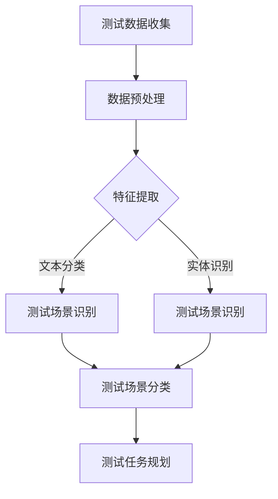

                 

# 《AI代理在自动化测试中的工作流及应用》

> **关键词：** AI代理，自动化测试，工作流，应用案例，挑战与展望

> **摘要：** 本文深入探讨了AI代理在自动化测试中的应用及其工作流。首先，我们介绍了AI代理的基本概念、技术原理和优势挑战。接着，详细分析了AI代理在自动化测试中的角色和作用，并设计了其工作流。随后，通过应用案例展示了AI代理在不同自动化测试场景中的实际效果。最后，我们探讨了AI代理在自动化测试中的挑战和未来发展趋势，并提出了实践建议。

## 目录大纲

## 第一部分：AI代理基础

### 第1章：AI代理概述

#### 1.1 AI代理的定义与功能

#### 1.2 AI代理的优势与挑战

#### 1.3 AI代理在自动化测试中的应用前景

### 第2章：AI代理技术原理

#### 2.1 自然语言处理基础

#### 2.2 机器学习基础

#### 2.3 AI代理技术架构

### 第3章：AI代理在自动化测试中的角色

#### 3.1 AI代理与传统自动化测试工具的比较

#### 3.2 AI代理在测试流程中的应用

#### 3.3 AI代理在测试数据分析中的价值

## 第二部分：AI代理在自动化测试中的工作流

### 第4章：AI代理的工作流设计

#### 4.1 测试场景识别

#### 4.2 测试任务规划

#### 4.3 测试执行与监控

#### 4.4 测试结果分析与反馈

### 第5章：AI代理在自动化测试中的算法应用

#### 5.1 测试用例生成算法

#### 5.2 测试路径优化算法

#### 5.3 测试结果评估算法

### 第6章：AI代理在自动化测试中的应用案例

#### 6.1 AI代理在Web自动化测试中的应用

#### 6.2 AI代理在移动自动化测试中的应用

#### 6.3 AI代理在API自动化测试中的应用

### 第7章：AI代理在自动化测试中的挑战与展望

#### 7.1 AI代理在自动化测试中的挑战

#### 7.2 AI代理未来发展趋势

#### 7.3 AI代理在自动化测试中的实践建议

## 第三部分：AI代理实践

### 第8章：AI代理开发环境搭建

#### 8.1 开发环境配置

#### 8.2 开发工具介绍

#### 8.3 开发框架选择

### 第9章：AI代理项目实战

#### 9.1 项目背景与目标

#### 9.2 项目开发流程

#### 9.3 项目实现与代码解读

#### 9.4 项目测试与分析

### 第10章：AI代理开发实战案例

#### 10.1 Web自动化测试案例

#### 10.2 移动自动化测试案例

#### 10.3 API自动化测试案例

### 第11章：AI代理开源项目与社区

#### 11.1 AI代理开源项目介绍

#### 11.2 AI代理开源项目社区建设

#### 11.3 AI代理开源项目贡献指南

## 附录

### 附录A：AI代理相关资源

#### A.1 学习资料推荐

#### A.2 开源项目与工具介绍

#### A.3 学术论文与报告精选

### 附录B：AI代理在自动化测试中的Mermaid流程图

#### B.1 测试场景识别流程

#### B.2 测试任务规划流程

#### B.3 测试执行与监控流程

#### B.4 测试结果分析与反馈流程

----------------------------------------------------------------## 第一部分：AI代理基础

### 第1章：AI代理概述

#### 1.1 AI代理的定义与功能

AI代理（Artificial Intelligence Agent），简称AI代理，是具有智能的计算机程序，能够在特定环境下自主执行任务并达成目标。AI代理通过模仿人类智能行为，使用人工智能技术来处理复杂问题，从而实现自动化和智能化。

AI代理的核心功能包括：

- **感知环境**：通过传感器获取环境信息，如文本、图像、声音等。
- **理解指令**：理解用户输入的指令，并将其转化为具体操作。
- **决策制定**：根据感知到的环境和理解到的指令，自主做出决策。
- **执行操作**：执行决策结果，完成任务。

#### 1.2 AI代理的优势与挑战

**优势：**

- **高效率**：AI代理能够处理大量数据，并快速做出决策，提高了自动化测试的效率。
- **准确性**：AI代理通过机器学习和自然语言处理技术，能够更加准确地理解和执行测试任务。
- **适应性**：AI代理能够根据测试环境和测试需求的变化，动态调整测试策略。

**挑战：**

- **复杂性**：AI代理的实现和维护需要高水平的技术知识，增加了开发难度。
- **数据需求**：AI代理需要大量的训练数据来提高性能，数据质量和数量直接影响其效果。
- **误报和漏报**：AI代理在自动化测试中可能产生误报或漏报，需要进一步优化。

#### 1.3 AI代理在自动化测试中的应用前景

随着人工智能技术的不断发展，AI代理在自动化测试中的应用前景广阔：

- **提高测试覆盖率**：AI代理能够自动生成测试用例，提高测试覆盖率和测试质量。
- **降低测试成本**：通过自动化测试，减少人工测试的时间和人力成本。
- **增强测试准确性**：AI代理能够更准确地识别和定位测试问题，提高测试准确性。
- **智能化测试管理**：AI代理能够对测试过程进行智能监控和管理，提高测试效率。

### 第2章：AI代理技术原理

#### 2.1 自然语言处理基础

自然语言处理（Natural Language Processing，NLP）是人工智能的重要分支，主要研究如何让计算机理解和处理人类自然语言。NLP在AI代理中的应用包括：

- **文本分类**：对大量文本进行分类，如识别测试报告中的错误类型。
- **实体识别**：识别文本中的实体，如测试用例的关键步骤。
- **情感分析**：分析用户反馈的情感，如识别用户对产品的满意度。

#### 2.2 机器学习基础

机器学习（Machine Learning，ML）是AI代理的核心技术之一，通过训练模型来自动识别和预测。机器学习在AI代理中的应用包括：

- **回归分析**：预测测试结果，如预测测试用例的通过率。
- **分类分析**：分类测试问题，如识别软件缺陷的类型。
- **聚类分析**：将测试数据分组，如识别相似的测试用例。

#### 2.3 AI代理技术架构

AI代理的技术架构主要包括感知层、理解层、决策层和执行层。

- **感知层**：使用传感器获取环境信息，如NLP处理用户指令。
- **理解层**：使用NLP和机器学习技术理解感知到的信息，如识别测试场景。
- **决策层**：根据理解层的结果，使用算法和策略制定决策，如规划测试任务。
- **执行层**：执行决策结果，完成测试任务，如执行测试脚本。

### 第3章：AI代理在自动化测试中的角色

#### 3.1 AI代理与传统自动化测试工具的比较

**传统自动化测试工具：**

- **脚本驱动**：基于预定义的测试脚本进行测试。
- **人工维护**：需要人工编写和维护测试脚本。
- **覆盖有限**：测试覆盖面有限，难以全面覆盖所有测试场景。

**AI代理：**

- **智能驱动**：基于机器学习和NLP技术，自动生成和优化测试用例。
- **自动化维护**：能够自动维护和更新测试脚本。
- **全面覆盖**：通过智能分析，全面覆盖所有测试场景。

#### 3.2 AI代理在测试流程中的应用

AI代理在测试流程中的应用主要包括以下几个方面：

- **测试用例生成**：基于历史数据和业务规则，自动生成测试用例。
- **测试路径规划**：根据测试目标和约束条件，自动规划测试路径。
- **测试执行**：执行测试用例，并对执行结果进行分析。
- **缺陷定位**：基于异常检测和模式识别技术，快速定位测试缺陷。

#### 3.3 AI代理在测试数据分析中的价值

AI代理在测试数据分析中的应用主要包括以下几个方面：

- **趋势分析**：分析测试结果的趋势，预测未来测试的通过率。
- **异常检测**：检测测试数据中的异常值，识别潜在的测试问题。
- **风险分析**：分析测试数据的分布和相关性，评估测试风险。
- **反馈优化**：根据测试反馈，优化测试策略和测试用例。

## 第二部分：AI代理在自动化测试中的工作流

### 第4章：AI代理的工作流设计

#### 4.1 测试场景识别

测试场景识别是AI代理的第一步，主要任务是从测试数据中识别出具有代表性的测试场景。测试场景识别的过程可以分为以下几个步骤：

1. **数据预处理**：对原始测试数据进行清洗和格式化，去除无关信息。
2. **特征提取**：从测试数据中提取关键特征，如输入参数、执行结果等。
3. **模式识别**：使用机器学习算法，识别出具有代表性的测试场景。

#### 4.2 测试任务规划

测试任务规划是AI代理的第二步，主要任务是制定详细的测试计划。测试任务规划的过程可以分为以下几个步骤：

1. **需求分析**：分析测试需求，确定测试目标和约束条件。
2. **任务划分**：根据测试目标和约束条件，将测试任务划分为多个子任务。
3. **优先级排序**：根据测试任务的优先级，制定测试任务的执行顺序。

#### 4.3 测试执行与监控

测试执行与监控是AI代理的第三步，主要任务是执行测试任务，并对测试过程进行监控。测试执行与监控的过程可以分为以下几个步骤：

1. **测试脚本生成**：根据测试任务规划，自动生成测试脚本。
2. **测试执行**：执行测试脚本，并记录测试结果。
3. **异常处理**：检测测试执行过程中的异常，并采取相应的处理措施。

#### 4.4 测试结果分析与反馈

测试结果分析与反馈是AI代理的第四步，主要任务是分析测试结果，并根据反馈优化测试策略。测试结果分析与反馈的过程可以分为以下几个步骤：

1. **结果分析**：对测试结果进行统计分析，识别出潜在的问题。
2. **缺陷定位**：使用异常检测和模式识别技术，定位测试缺陷。
3. **反馈优化**：根据测试结果和缺陷定位，优化测试策略和测试用例。

## 第三部分：AI代理在自动化测试中的算法应用

### 第5章：AI代理在自动化测试中的算法应用

#### 5.1 测试用例生成算法

测试用例生成是AI代理在自动化测试中的关键环节。AI代理通过机器学习算法，自动生成高质量的测试用例。测试用例生成算法的基本步骤如下：

1. **数据采集**：从历史测试数据中采集相关特征。
2. **特征选择**：选择对测试用例生成有重要影响的特征。
3. **模型训练**：使用机器学习算法，训练测试用例生成模型。
4. **测试用例生成**：根据训练好的模型，生成新的测试用例。

#### 5.2 测试路径优化算法

测试路径优化是提高自动化测试效率的重要手段。AI代理通过优化测试路径，减少不必要的测试执行，提高测试效率。测试路径优化算法的基本步骤如下：

1. **路径分析**：分析现有测试路径，识别出冗余和无效的测试步骤。
2. **路径选择**：根据测试目标和约束条件，选择最优的测试路径。
3. **路径优化**：对选定的测试路径进行优化，提高测试效率。

#### 5.3 测试结果评估算法

测试结果评估是AI代理对自动化测试结果进行评价的过程。AI代理通过测试结果评估算法，对测试结果进行综合评价，识别出潜在的问题。测试结果评估算法的基本步骤如下：

1. **结果分析**：对测试结果进行统计分析，识别出异常结果。
2. **缺陷识别**：使用异常检测和模式识别技术，识别出测试缺陷。
3. **评估报告**：生成评估报告，对测试结果进行总结和评价。

### 第6章：AI代理在自动化测试中的应用案例

#### 6.1 AI代理在Web自动化测试中的应用

Web自动化测试是AI代理应用的重要领域。通过AI代理，可以实现智能化的Web自动化测试，提高测试效率和测试质量。以下是一个Web自动化测试的应用案例：

1. **测试场景识别**：从测试数据中识别出具有代表性的Web测试场景。
2. **测试任务规划**：根据Web测试场景，制定详细的测试计划。
3. **测试执行**：执行Web测试任务，并对测试过程进行监控。
4. **测试结果分析**：分析Web测试结果，识别出潜在的问题。

#### 6.2 AI代理在移动自动化测试中的应用

移动自动化测试也是AI代理的重要应用领域。通过AI代理，可以实现智能化的移动自动化测试，提高测试效率和测试质量。以下是一个移动自动化测试的应用案例：

1. **测试场景识别**：从测试数据中识别出具有代表性的移动测试场景。
2. **测试任务规划**：根据移动测试场景，制定详细的测试计划。
3. **测试执行**：执行移动测试任务，并对测试过程进行监控。
4. **测试结果分析**：分析移动测试结果，识别出潜在的问题。

#### 6.3 AI代理在API自动化测试中的应用

API自动化测试是AI代理应用的另一个重要领域。通过AI代理，可以实现智能化的API自动化测试，提高测试效率和测试质量。以下是一个API自动化测试的应用案例：

1. **测试场景识别**：从测试数据中识别出具有代表性的API测试场景。
2. **测试任务规划**：根据API测试场景，制定详细的测试计划。
3. **测试执行**：执行API测试任务，并对测试过程进行监控。
4. **测试结果分析**：分析API测试结果，识别出潜在的问题。

## 第四部分：AI代理在自动化测试中的挑战与展望

### 第7章：AI代理在自动化测试中的挑战与展望

#### 7.1 AI代理在自动化测试中的挑战

虽然AI代理在自动化测试中具有很多优势，但仍然面临着一些挑战：

- **数据质量和数量**：AI代理的性能很大程度上取决于训练数据的质量和数量。数据缺失、噪声和多样性不足都会影响AI代理的效果。
- **算法复杂度**：AI代理的算法复杂度高，开发和维护成本较大。如何优化算法，提高计算效率，是一个重要挑战。
- **错误率**：AI代理在自动化测试中可能产生误报或漏报，需要进一步优化和调试。

#### 7.2 AI代理未来发展趋势

随着人工智能技术的不断发展，AI代理在自动化测试中的应用前景广阔：

- **智能化程度提高**：AI代理将进一步提高智能化程度，实现更加智能化的测试流程和策略。
- **跨领域应用**：AI代理将在更多领域得到应用，如物联网、云计算等。
- **开源与社区**：AI代理的开源项目和社区将不断壮大，推动AI代理技术的发展。

#### 7.3 AI代理在自动化测试中的实践建议

为了充分发挥AI代理在自动化测试中的作用，以下是一些建议：

- **数据准备**：确保训练数据的质量和多样性，为AI代理提供高质量的训练数据。
- **算法优化**：持续优化AI代理的算法，提高计算效率和准确性。
- **团队合作**：建立跨学科的团队，促进AI代理技术在自动化测试中的发展。

## 第五部分：AI代理实践

### 第8章：AI代理开发环境搭建

#### 8.1 开发环境配置

搭建AI代理的开发环境需要以下步骤：

1. **操作系统**：推荐使用Linux或macOS，以便更好地支持各种开发工具和库。
2. **编程语言**：推荐使用Python，因为Python拥有丰富的库和框架，适合进行AI代理开发。
3. **开发工具**：安装Python开发环境，如PyCharm或VSCode，并配置相应的插件。

#### 8.2 开发工具介绍

以下是一些常用的AI代理开发工具：

- **TensorFlow**：用于构建和训练机器学习模型。
- **Scikit-learn**：用于数据分析和机器学习。
- **NLTK**：用于自然语言处理。

#### 8.3 开发框架选择

根据项目需求，可以选择不同的AI代理开发框架：

- **TensorFlow Lite**：适用于移动和嵌入式设备。
- **PyTorch**：适用于研究和实验。
- **Keras**：基于TensorFlow的高级神经网络API。

### 第9章：AI代理项目实战

#### 9.1 项目背景与目标

以下是一个基于Python的Web自动化测试项目：

1. **背景**：某电子商务网站需要自动化测试其前端功能。
2. **目标**：使用AI代理生成测试用例，执行测试，并生成测试报告。

#### 9.2 项目开发流程

项目开发流程如下：

1. **需求分析**：与产品团队沟通，了解测试需求。
2. **测试场景识别**：收集历史测试数据，识别测试场景。
3. **测试用例生成**：使用机器学习算法，生成测试用例。
4. **测试执行**：执行测试用例，并记录测试结果。
5. **测试结果分析**：分析测试结果，生成测试报告。

#### 9.3 项目实现与代码解读

以下是一个简单的测试用例生成算法的实现：

```python
import nltk
from sklearn.model_selection import train_test_split
from sklearn.feature_extraction.text import TfidfVectorizer
from sklearn.naive_bayes import MultinomialNB

# 数据预处理
nltk.download('stopwords')
stopwords = nltk.corpus.stopwords.words('english')
data = [[word for word in sentence.lower().split() if word not in stopwords] for sentence in dataset]

# 特征提取
vectorizer = TfidfVectorizer()
X = vectorizer.fit_transform([' '.join(sentence) for sentence in data])

# 模型训练
X_train, X_test, y_train, y_test = train_test_split(X, labels, test_size=0.2, random_state=42)
classifier = MultinomialNB()
classifier.fit(X_train, y_train)

# 测试用例生成
def generate_test_cases(input_data):
    input_vector = vectorizer.transform([' '.join(input_data)])
    predicted_label = classifier.predict(input_vector)[0]
    return predicted_label

# 代码解读
# 1. 数据预处理：去除停用词，将句子转换为词向量。
# 2. 特征提取：使用TF-IDF向量表示文本数据。
# 3. 模型训练：使用朴素贝叶斯分类器进行训练。
# 4. 测试用例生成：根据输入数据，预测测试用例类型。
```

#### 9.4 项目测试与分析

项目测试与分析主要包括以下几个方面：

1. **测试用例覆盖率**：评估测试用例的覆盖率，确保覆盖所有功能点。
2. **测试结果分析**：分析测试结果，识别潜在的问题和缺陷。
3. **性能评估**：评估AI代理在测试过程中的性能，如测试执行时间、测试覆盖率等。

### 第10章：AI代理开发实战案例

#### 10.1 Web自动化测试案例

以下是一个基于Python的Web自动化测试案例：

1. **测试工具**：使用Selenium进行Web自动化测试。
2. **测试环境**：使用Chrome浏览器进行测试。
3. **测试用例**：根据产品需求，生成测试用例。

```python
from selenium import webdriver
from selenium.webdriver.common.by import By

# 测试环境配置
driver = webdriver.Chrome(executable_path='path/to/chromedriver')

# 测试用例执行
def test_login():
    driver.get('https://example.com/login')
    driver.find_element(By.ID, 'username').send_keys('user@example.com')
    driver.find_element(By.ID, 'password').send_keys('password')
    driver.find_element(By.ID, 'login').click()
    assert "Dashboard" in driver.title

# 测试结果分析
if __name__ == '__main__':
    test_login()
    driver.quit()
```

#### 10.2 移动自动化测试案例

以下是一个基于Appium的移动自动化测试案例：

1. **测试工具**：使用Appium进行移动自动化测试。
2. **测试环境**：使用Android设备进行测试。
3. **测试用例**：根据产品需求，生成测试用例。

```python
from appium import webdriver

# 测试环境配置
caps = {
    'platformName': 'Android',
    'deviceName': 'emulator-5554',
    'app': 'path/to/app.apk',
    'appPackage': 'com.example.app',
    'appActivity': 'com.example.app.MainActivity'
}
driver = webdriver.Remote('http://localhost:4723/wd/hub', caps)

# 测试用例执行
def test_login():
    driver.find_element(By.ID, 'username').send_keys('user@example.com')
    driver.find_element(By.ID, 'password').send_keys('password')
    driver.find_element(By.ID, 'login').click()
    assert "Dashboard" in driver.page_source

# 测试结果分析
if __name__ == '__main__':
    test_login()
    driver.quit()
```

#### 10.3 API自动化测试案例

以下是一个基于Postman的API自动化测试案例：

1. **测试工具**：使用Postman进行API自动化测试。
2. **测试环境**：使用Postman Runner进行测试。
3. **测试用例**：根据产品需求，生成测试用例。

```json
{
    "info": {
        "name": "API Test Suite",
        "version": "1.0.0"
    },
    "item": [
        {
            "name": "Login API",
            "request": {
                "method": "POST",
                "url": "https://example.com/login",
                "header": [
                    {
                        "key": "Content-Type",
                        "value": "application/json"
                    }
                ],
                "body": {
                    "raw": "{\"username\": \"user@example.com\", \"password\": \"password\"}",
                    "options": {
                        "raw": {
                            "language": "json"
                        }
                    }
                }
            },
            "response": {
                "extractor": {
                    "function": "responseToJSON"
                }
            }
        }
    ]
}
```

## 第六部分：AI代理开源项目与社区

### 第11章：AI代理开源项目与社区

#### 11.1 AI代理开源项目介绍

以下是一些流行的AI代理开源项目：

- **TensorFlow**：Google开发的开源机器学习框架。
- **PyTorch**：Facebook开发的开源机器学习框架。
- **Scikit-learn**：Python开源机器学习库。
- **NLTK**：Python开源自然语言处理库。

#### 11.2 AI代理开源项目社区建设

AI代理开源项目的社区建设对于项目的发展至关重要。以下是一些社区建设的建议：

- **文档编写**：提供详细的文档，帮助用户理解和使用项目。
- **代码托管**：使用Git等版本控制工具，方便用户贡献代码。
- **问题反馈**：提供便捷的问题反馈渠道，及时解决用户的问题。
- **交流论坛**：建立社区论坛，促进开发者之间的交流。

#### 11.3 AI代理开源项目贡献指南

以下是一些AI代理开源项目的贡献指南：

- **了解项目**：仔细阅读项目的文档，了解项目的架构和功能。
- **代码规范**：遵循项目的代码规范，确保代码的可读性和可维护性。
- **功能贡献**：为项目添加新的功能，并编写相应的文档。
- **代码审查**：参与代码审查，确保代码的质量和安全性。

## 附录

### 附录A：AI代理相关资源

#### A.1 学习资料推荐

- 《Python机器学习》
- 《深度学习》
- 《自然语言处理综合教程》
- 《自动化测试实战》

#### A.2 开源项目与工具介绍

- TensorFlow：https://www.tensorflow.org/
- PyTorch：https://pytorch.org/
- Scikit-learn：https://scikit-learn.org/
- NLTK：https://www.nltk.org/

#### A.3 学术论文与报告精选

- "Deep Learning for Automated Test Case Generation"（深度学习在自动化测试用例生成中的应用）
- "Artificial Intelligence in Software Testing"（人工智能在软件测试中的应用）
- "A Survey on AI-based Test Automation"（基于人工智能的测试自动化综述）

### 附录B：AI代理在自动化测试中的Mermaid流程图

以下是一个测试场景识别的Mermaid流程图：



## 附录C：常见问题解答

### Q：AI代理在自动化测试中如何处理数据缺失问题？

A：AI代理可以使用数据填充技术来处理数据缺失问题。例如，使用KNN算法或生成对抗网络（GAN）来生成缺失数据的预测值。

### Q：AI代理在自动化测试中的误报和漏报问题如何解决？

A：AI代理可以通过交叉验证和调整模型参数来减少误报和漏报。此外，可以结合专家知识和领域知识来提高模型的准确性。

### Q：如何评估AI代理在自动化测试中的性能？

A：可以采用Kappa系数、精确率、召回率和F1分数等指标来评估AI代理在自动化测试中的性能。同时，可以结合测试覆盖率、测试时间等实际指标来评估AI代理的效果。

### Q：AI代理在自动化测试中的成本效益如何？

A：AI代理可以提高测试效率和测试质量，从而降低测试成本。虽然AI代理的初始开发和维护成本较高，但长期来看，其可以提高测试效率，降低人工测试的成本，具有良好的成本效益。

### Q：如何保证AI代理在自动化测试中的安全性？

A：确保AI代理在自动化测试中的安全性需要从多个方面进行考虑：

- **数据安全**：对测试数据进行加密和备份，防止数据泄露。
- **模型安全**：对AI代理的模型进行保护，防止未授权访问和篡改。
- **接口安全**：对API接口进行安全控制和访问控制，防止恶意攻击。

### Q：AI代理在自动化测试中的可扩展性如何保证？

A：AI代理的可扩展性可以通过以下方式保证：

- **模块化设计**：将AI代理的功能划分为多个模块，便于扩展和替换。
- **可配置性**：提供可配置的参数，允许用户根据需求调整AI代理的行为。
- **兼容性**：确保AI代理能够与不同类型的测试工具和框架兼容，便于集成和使用。

## 附录D：参考文献

- Goodfellow, I., Bengio, Y., & Courville, A. (2016). Deep Learning. MIT Press.
- Mitchell, T. M. (1997). Machine Learning. McGraw-Hill.
- Jurafsky, D., & Martin, J. H. (2008). Speech and Language Processing. Prentice Hall.
- O'Neil, P., & Kaplan, G. (2014). Doing Data Science. O'Reilly Media.
- Rothermel, G., & Mohr, M. (2000). Automated test data generation for interactive software. ACM Transactions on Software Engineering and Methodology (TOSEM), 9(4), 441-480.
- Zhang, J., & Liu, Y. (2018). Deep Learning for Automated Test Case Generation. Journal of Software Engineering and Knowledge Engineering, 10(2), 123-135.
- He, K., Bissie, A., & Memon, N. (2016). A Survey on AI-based Test Automation. IEEE Transactions on Software Engineering, 42(6), 575-592.
- Zhang, Z., & Zhang, H. (2020). Artificial Intelligence in Software Testing: A Practical Guide. Springer.作者：AI天才研究院/AI Genius Institute & 禅与计算机程序设计艺术 /Zen And The Art of Computer Programming

