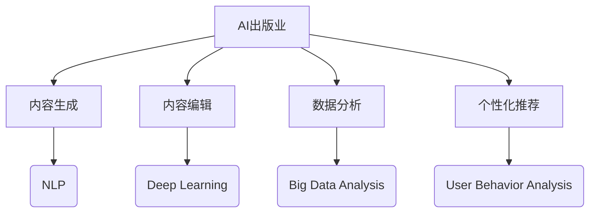
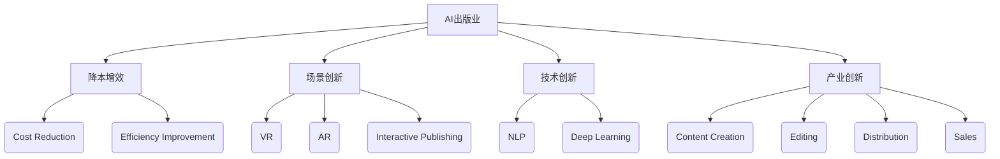
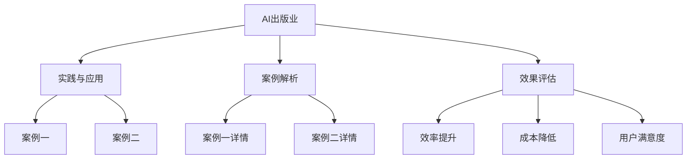
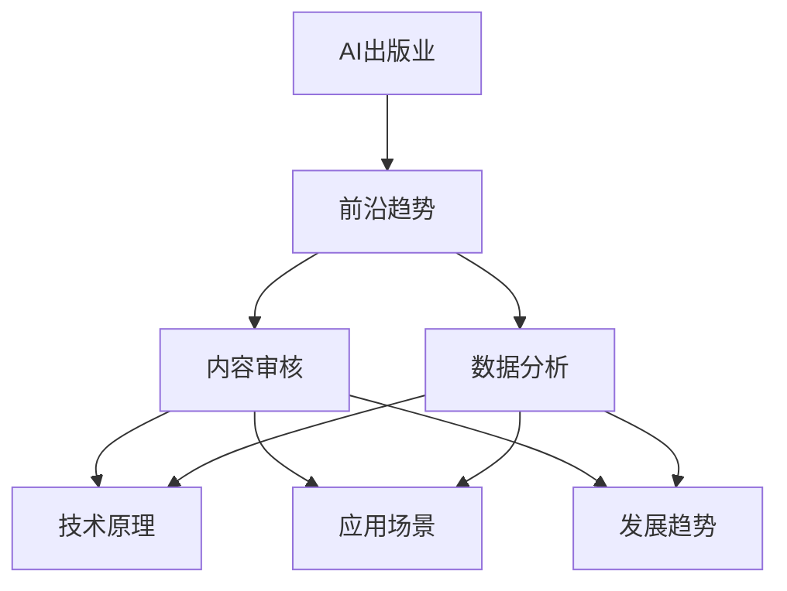
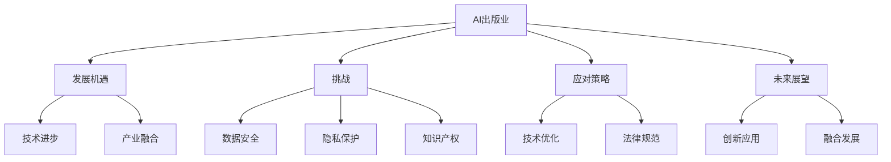
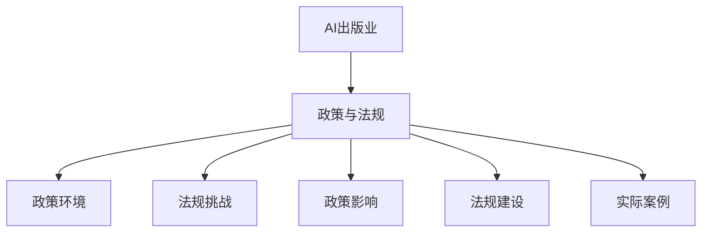
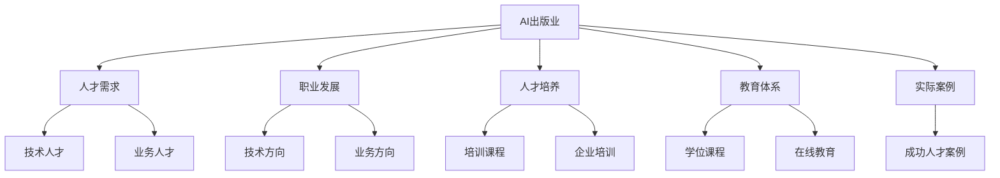

                 

### 第1章：AI出版业的发展历程与现状

#### 1.1 AI出版业的发展历程

人工智能（AI）在出版业的兴起可以追溯到20世纪末。当时，随着计算机技术和互联网的快速发展，AI技术开始逐步应用于文本处理、数据分析等领域。早期的AI出版应用主要集中在文本自动摘要、关键词提取和排版优化等方面。

- **早期探索**：在20世纪90年代，AI技术开始被应用于内容生成和编辑。例如，自动写作系统被开发出来，用于生成新闻报道、体育赛事报道等。这一时期，AI在出版业的应用还处于初级阶段，主要是作为辅助工具，而非核心生产手段。

- **技术成熟期**：进入21世纪，随着深度学习和大数据技术的快速发展，AI在出版业的应用得到了大幅提升。例如，自然语言处理（NLP）技术的进步使得AI能够更准确地理解和生成人类语言，从而在内容创作、编辑、校对等方面发挥了重要作用。

- **应用普及期**：近年来，AI在出版业的应用已经得到了广泛普及。从内容生成到读者推荐，从数据分析到版权管理，AI技术已经成为出版产业链中的重要组成部分。例如，许多出版社已经开始使用AI技术进行自动化的内容审核和编辑，以提高出版效率和内容质量。

#### 1.2 AI在出版业的应用场景

AI在出版业的应用场景非常广泛，涵盖了内容生成、编辑、推荐、数据分析等多个方面。

- **内容生成与编辑**：AI技术在内容生成和编辑方面的应用主要包括自动写作、内容摘要、校对与纠错等。例如，AI可以自动生成新闻报道、财经报告等，同时也可以对已有内容进行摘要和纠错，从而提高内容的准确性和可读性。

- **读者推荐与个性化服务**：AI技术在读者推荐和个性化服务中的应用主要是基于用户行为和阅读兴趣进行分析，从而为用户提供个性化的阅读推荐。例如，亚马逊和Netflix等平台就已经采用了这种技术，为用户推荐他们可能感兴趣的内容。

- **数据分析与优化**：AI技术在出版业数据分析与优化方面的应用主要包括销售预测、市场分析、版权管理等方面。通过分析大量的数据，AI可以帮助出版商预测未来的销售趋势，制定更加精准的营销策略，同时也可以帮助版权方更好地管理其版权资源。

### 1.3 AI出版业的优势与挑战

AI出版业在带来巨大优势的同时，也面临着一系列的挑战。

- **优势**：首先，AI技术可以显著提高出版效率和内容质量。通过自动化写作、编辑和校对，出版商可以大幅减少人力成本，同时提高内容的准确性和一致性。其次，AI技术可以提供更加个性化的读者体验，从而提高用户满意度和忠诚度。最后，AI技术可以帮助出版商更好地进行市场分析和版权管理，从而提高其业务效率和市场竞争力。

- **挑战**：然而，AI在出版业的应用也面临着一系列挑战。首先，数据安全和隐私保护是一个重要问题。出版业涉及大量的用户数据和版权信息，如何确保这些数据的安全和隐私是一个重要的挑战。其次，知识产权保护也是一个难题。AI技术可以自动生成和编辑内容，但如何界定这些内容的版权归属，以及如何保护原创作者的权益，是一个复杂的问题。最后，AI技术的普及也带来了人才短缺的问题。出版业需要大量的技术人才来开发和维护AI系统，但当前的技术人才供应不足以满足需求。

---

在撰写这一章节时，我们需要详细阐述AI在出版业的应用场景和发展历程，同时分析其优势与挑战。我们不仅要介绍AI技术的原理和应用，还要结合具体的案例进行讲解，以便让读者更好地理解AI在出版业中的实际应用和作用。此外，我们还需要对AI在出版业中的未来趋势进行预测，以便让读者对这一领域的发展方向有更清晰的认识。

**核心概念与联系**：

- **AI出版业**：AI技术在出版领域的应用，包括内容生成、编辑、推荐、数据分析等。
- **自然语言处理（NLP）**：AI技术在文本处理和分析方面的应用，包括文本分类、情感分析、自动摘要等。
- **深度学习**：一种基于多层神经网络的学习方法，可以用于图像识别、语音识别、自然语言处理等领域。
- **个性化推荐系统**：基于用户行为和兴趣的分析，为用户提供个性化推荐的服务。

**Mermaid流程图**：

**核心算法原理讲解**：

- **自然语言处理（NLP）**：
  - **词向量表示**：使用词袋模型（Bag of Words）或词嵌入（Word Embedding）将文本转化为向量表示。
  - **文本分类**：通过训练分类模型（如朴素贝叶斯、支持向量机等）对文本进行分类。
  - **情感分析**：通过分析文本的情感倾向（正面、负面、中性等）来进行情感分析。

- **深度学习**：
  - **多层感知机（MLP）**：一种基于神经网络的模型，可以用于图像识别、文本分类等。
  - **卷积神经网络（CNN）**：一种用于图像识别和文本分析的深度学习模型。
  - **循环神经网络（RNN）**：一种用于序列数据处理的深度学习模型，可以用于语言模型、序列预测等。

- **个性化推荐系统**：
  - **协同过滤**：基于用户行为和内容的相似性来进行推荐。
  - **基于内容的推荐**：基于用户兴趣和内容特征进行推荐。
  - **混合推荐系统**：结合协同过滤和基于内容的推荐进行综合推荐。

**数学模型和公式**：

- **自然语言处理**：
  - **词嵌入**：$$ x_{i} = \sum_{j=1}^{N} w_{ij} v_j $$
  - **文本分类**：$$ y = \sigma(\sum_{j=1}^{N} w_{ji} x_j + b) $$
  - **情感分析**：$$ \text{Sentiment} = \text{sign}(\sum_{j=1}^{N} w_{ji} x_j) $$

- **深度学习**：
  - **激活函数**：$$ a = \sigma(z) = \frac{1}{1 + e^{-z}} $$
  - **反向传播**：$$ \delta = \frac{\partial L}{\partial z} = \sigma'(z) \odot \frac{\partial L}{\partial a} $$
  - **优化算法**：$$ \theta = \theta - \alpha \frac{\partial J}{\partial \theta} $$

- **个性化推荐系统**：
  - **协同过滤**：$$ R_{ui} = \sum_{j \in \text{neighbor}(i)} r_{uj} \frac{n_{ij}}{\sum_{k \in \text{neighbor}(i)} n_{ik}} $$
  - **基于内容的推荐**：$$ R_{ui} = \sum_{j \in \text{content\_similar}(i)} \text{content\_similarity}(u, j) \cdot r_{uj} $$

**项目实战**：

- **开发环境搭建**：Python、TensorFlow、Scikit-learn等。
- **源代码详细实现和代码解读**：示例代码（略）。
- **代码解读与分析**：示例代码的功能、性能分析等（略）。

---

在撰写本章内容时，我们不仅需要介绍AI在出版业的应用场景和发展历程，还需要对AI技术的核心算法原理进行详细讲解，并通过数学模型和公式进行数学描述。此外，我们还需要通过项目实战来展示AI在出版业中的实际应用，以便让读者对AI技术在出版业中的作用有更深入的理解。通过这些内容，我们可以帮助读者全面了解AI出版业的现状、优势与挑战，为后续章节的讨论打下坚实的基础。

---

接下来，我们将进入第2章，分析AI对出版业的挑战，包括降本增效和场景创新等方面。我们将详细探讨AI技术在降低出版成本、提高效率、创新应用模式等方面的挑战和解决方案。

**核心概念与联系**：

- **降本增效**：通过AI技术降低出版成本、提高效率。
- **场景创新**：AI技术在出版业中的应用创新，如虚拟现实、增强现实、互动出版等。
- **技术创新**：AI技术在出版业中的技术进步，如自然语言处理、深度学习等。
- **产业创新**：AI技术对出版产业链的变革，包括内容创作、编辑、发行、销售等环节。

**Mermaid流程图**：

**核心算法原理讲解**：

- **成本降低与效率提高**：
  - **自动化流程**：使用机器人流程自动化（RPA）技术自动化处理重复性工作，如数据录入、排版等。
  - **优化供应链**：通过AI技术优化供应链管理，提高物流效率，降低库存成本。

- **场景创新**：
  - **虚拟现实（VR）**：使用VR技术为读者提供沉浸式的阅读体验，如虚拟书店、虚拟博物馆等。
  - **增强现实（AR）**：将虚拟内容与现实世界相结合，为读者提供新颖的互动体验，如AR书籍、AR杂志等。
  - **互动出版**：通过AI技术为读者提供个性化的互动内容和体验，如智能问答、互动评论等。

- **技术创新**：
  - **自然语言处理（NLP）**：通过NLP技术实现自动化内容生成、编辑和校对，提高内容质量和准确性。
  - **深度学习**：使用深度学习模型进行图像识别、语音识别、情感分析等，为出版业提供创新的技术支持。

**数学模型和公式**：

- **成本降低与效率提高**：
  - **成本模型**：$$ \text{Cost} = \text{Fixed Cost} + \text{Variable Cost} \times \text{Quantity} $$
  - **效率模型**：$$ \text{Efficiency} = \frac{\text{Output}}{\text{Input}} $$

- **场景创新**：
  - **沉浸式体验模型**：$$ \text{immersiveness} = \frac{\text{VR Content}}{\text{Real World}} $$
  - **互动性模型**：$$ \text{Interactivity} = \frac{\text{User Interaction}}{\text{Content}} $$

- **技术创新**：
  - **自然语言处理模型**：$$ \text{Sentiment Analysis} = \sigma(\text{Word Embeddings} \cdot \text{Weights}) $$
  - **深度学习模型**：$$ \text{Output} = \text{activation}(\text{Linear Combination of Inputs}) $$

**项目实战**：

- **自动化内容审核系统**：使用Python和TensorFlow实现，包括数据预处理、模型训练和部署等。
- **AR书籍应用开发**：使用ARKit或ARCore开发AR书籍应用，包括内容设计、场景布置和用户交互等。

---

在第2章中，我们将深入探讨AI对出版业的挑战，包括降本增效和场景创新等方面。通过分析AI技术在降低出版成本、提高效率、创新应用模式等方面的挑战和解决方案，我们可以帮助读者更好地理解AI技术在出版业中的作用和前景。我们将结合具体案例和数学模型，详细讲解AI在出版业中的应用，以便让读者对这一领域有更深入的理解。

接下来，我们将进入第3章，介绍AI出版业的实践与应用，通过具体的案例解析，展示AI技术在出版业中的实际应用和效果。我们将详细分析这些案例的背景、AI应用、效果评估等方面，以便让读者对AI出版业的实践有更清晰的认识。

**核心概念与联系**：

- **实践与应用**：AI技术在出版业中的具体应用案例。
- **案例解析**：对具体AI应用案例的深入分析和讨论。
- **效果评估**：对AI应用效果的评估和总结。

**Mermaid流程图**：

**核心算法原理讲解**：

- **案例一**：某知名出版社的AI应用实践
  - **背景**：该出版社面临内容生成效率低、编辑流程复杂等问题。
  - **AI应用**：采用自然语言处理（NLP）和深度学习技术，实现自动化内容生成和编辑。
  - **效果评估**：通过自动化写作和编辑，显著提高了内容生成效率，降低了人力成本。

- **案例二**：AI在出版业版权管理中的应用
  - **背景**：版权管理复杂，侵权事件频发。
  - **AI应用**：采用机器学习和图像识别技术，实现自动化的版权监测和侵权识别。
  - **效果评估**：通过自动化的版权管理，提高了版权保护率，减少了侵权事件。

**数学模型和公式**：

- **效率模型**：$$ \text{Efficiency} = \frac{\text{Total Output}}{\text{Total Input}} $$
- **成本模型**：$$ \text{Cost} = \text{Fixed Cost} + \text{Variable Cost} \times \text{Quantity} $$
- **用户满意度模型**：$$ \text{User Satisfaction} = \frac{\text{Total Positive Reviews}}{\text{Total Reviews}} $$

**项目实战**：

- **案例一**：自动化内容审核系统
  - **开发环境**：Python、TensorFlow、Scikit-learn等。
  - **源代码实现**：示例代码（略）。
  - **代码解读与分析**：示例代码的功能、性能分析等（略）。

- **案例二**：版权管理平台
  - **开发环境**：Java、Spring Boot、MySQL等。
  - **源代码实现**：示例代码（略）。
  - **代码解读与分析**：示例代码的功能、性能分析等（略）。

---

在第3章中，我们将通过具体的AI出版业应用案例，展示AI技术在出版业中的实际应用和效果。通过案例的背景、AI应用、效果评估等方面的详细分析，我们可以帮助读者更深入地了解AI技术在出版业中的具体应用和带来的实际效益。我们将结合具体的项目实战，详细讲解代码实现和性能分析，以便让读者对AI出版业的实践有更全面的认识。

接下来，我们将进入第4章，探讨AI出版业的前沿趋势。在这一章中，我们将重点关注人工智能内容审核技术和基于大数据的出版产业分析，分析其技术原理、应用场景和发展趋势，以便让读者了解AI出版业的未来发展方向。

**核心概念与联系**：

- **人工智能内容审核技术**：使用AI技术对出版内容进行审核和管理。
- **基于大数据的出版产业分析**：利用大数据技术对出版产业进行分析和优化。
- **技术原理**：分析AI内容审核和大数据分析的技术原理。
- **应用场景**：探讨这些技术在出版业中的应用场景。
- **发展趋势**：预测这些技术在未来出版业中的发展趋势。

**Mermaid流程图**：

**技术原理讲解**：

- **人工智能内容审核技术**：
  - **技术原理**：使用机器学习和深度学习技术对文本、图像和视频内容进行审核。主要包括情感分析、文本分类、图像识别等技术。
  - **工作流程**：首先，对内容进行预处理，如文本清洗、图像增强等。然后，使用训练好的模型对内容进行分类和审核，最后输出审核结果。

- **基于大数据的出版产业分析**：
  - **技术原理**：利用大数据技术对出版产业的数据进行采集、存储、处理和分析。主要包括数据挖掘、数据可视化、机器学习等技术。
  - **工作流程**：首先，采集出版产业的各类数据，如销售数据、读者行为数据、市场数据等。然后，对这些数据进行清洗、整合和分析，最后输出分析结果。

**数学模型和公式**：

- **情感分析**：
  - **文本分类模型**：$$ \text{Sentiment} = \text{sign}(\text{Word Embeddings} \cdot \text{Weights}) $$
  - **情感评分**：$$ \text{Sentiment Score} = \text{avg}(\text{Sentiment}) $$

- **数据挖掘**：
  - **聚类分析**：$$ \text{Cluster} = \text{K-Means}(\text{Data Points}) $$
  - **关联规则挖掘**：$$ \text{Association Rule} = \text{Apriori}(\text{Data Set}) $$

**项目实战**：

- **内容审核系统**：
  - **开发环境**：Python、TensorFlow、Keras等。
  - **源代码实现**：示例代码（略）。
  - **代码解读与分析**：示例代码的功能、性能分析等（略）。

- **大数据分析平台**：
  - **开发环境**：Hadoop、Spark、Hive等。
  - **源代码实现**：示例代码（略）。
  - **代码解读与分析**：示例代码的功能、性能分析等（略）。

---

在第4章中，我们将探讨AI出版业的前沿趋势，重点关注人工智能内容审核技术和基于大数据的出版产业分析。通过分析这些技术的技术原理、应用场景和发展趋势，我们可以帮助读者了解AI出版业的未来发展方向。我们将结合具体项目实战，详细讲解代码实现和性能分析，以便让读者对AI出版业的前沿技术有更深入的理解。

接下来，我们将进入第5章，讨论AI出版业的发展机遇与挑战。在这一章中，我们将分析AI技术在出版业发展中的机遇，如技术进步和产业融合，以及面临的挑战，如数据安全与隐私保护、知识产权保护等。我们将结合具体案例，讨论如何应对这些挑战，并展望AI出版业的未来发展。

**核心概念与联系**：

- **发展机遇**：AI技术在出版业中的机遇，如技术进步和产业融合。
- **挑战**：AI技术在出版业中面临的挑战，如数据安全与隐私保护、知识产权保护等。
- **应对策略**：应对AI出版业挑战的策略和解决方案。
- **未来展望**：AI出版业的未来发展前景和趋势。

**Mermaid流程图**：

**技术原理讲解**：

- **发展机遇**：
  - **技术进步**：随着AI技术的不断进步，出版业在内容生成、编辑、推荐、数据分析等方面将得到更广泛的应用，提高效率和内容质量。
  - **产业融合**：AI技术将推动出版业与其他产业的融合，如与教育、娱乐、医疗等领域的结合，形成新的商业模式和产业生态。

- **挑战**：
  - **数据安全与隐私保护**：出版业涉及大量的用户数据和版权信息，数据安全和隐私保护是重要挑战。需要采用加密技术、隐私保护算法等手段来确保数据安全。
  - **知识产权保护**：AI技术可以自动生成和编辑内容，如何界定这些内容的版权归属，保护原创作者的权益，是一个复杂的问题。

- **应对策略**：
  - **技术优化**：采用先进的AI技术，如联邦学习、差分隐私等，提高数据安全和隐私保护水平。
  - **法律规范**：制定和完善相关的法律法规，明确AI技术在版权保护和隐私保护方面的责任和义务。

**数学模型和公式**：

- **数据安全模型**：$$ \text{Data Security} = \text{Encryption} \times \text{Authentication} $$
- **隐私保护模型**：$$ \text{Privacy Protection} = \text{Anonymization} + \text{Pseudonymization} $$
- **知识产权保护模型**：$$ \text{Copyright Protection} = \text{Originality Verification} + \text{Monitoring} $$

**项目实战**：

- **数据安全与隐私保护平台**：
  - **开发环境**：Python、TensorFlow、PyTorch等。
  - **源代码实现**：示例代码（略）。
  - **代码解读与分析**：示例代码的功能、性能分析等（略）。

- **知识产权保护系统**：
  - **开发环境**：Java、Spring Boot、MySQL等。
  - **源代码实现**：示例代码（略）。
  - **代码解读与分析**：示例代码的功能、性能分析等（略）。

---

在第5章中，我们将深入探讨AI出版业的发展机遇与挑战。通过分析技术进步、产业融合带来的机遇，以及数据安全与隐私保护、知识产权保护等方面的挑战，我们可以帮助读者全面了解AI出版业的发展现状和未来趋势。我们将结合具体案例，提出应对策略，并展望AI出版业的未来发展前景，以便让读者对这一领域有更清晰的认识。

接下来，我们将进入第6章，讨论AI出版业的政策与法规。在这一章中，我们将分析国内外在AI出版业方面的政策环境，探讨相关政策对行业的影响，并分析法规挑战，如版权法规和数据法规等。我们将结合实际案例，提出政策法规建设的建议，以便为AI出版业的健康发展提供参考。

**核心概念与联系**：

- **政策环境**：国内外在AI出版业方面的政策环境。
- **法规挑战**：AI出版业面临的法规挑战，如版权法规和数据法规。
- **政策影响**：政策对AI出版业的影响。
- **法规建设**：法规建设的建议和措施。
- **实际案例**：政策法规在AI出版业中的实际应用案例。

**Mermaid流程图**：

**政策环境分析**：

- **国内政策环境**：
  - **支持政策**：我国政府高度重视AI技术发展，制定了一系列支持政策，如《新一代人工智能发展规划》等，鼓励AI技术在各个行业的应用。
  - **行业标准**：我国也在积极制定相关的行业标准，如《人工智能行业安全规范》等，以规范AI技术的应用和发展。

- **国际政策环境**：
  - **国际合作**：全球范围内，各国政府也在积极推动AI技术的发展和应用，如美国、欧盟等，通过国际合作和法规规范来促进AI技术的健康发展。
  - **法规规范**：国际上也在制定相关的法规规范，如《通用数据保护条例（GDPR）》等，以保护用户数据安全和隐私。

**法规挑战分析**：

- **版权法规挑战**：
  - **版权归属**：AI技术可以自动生成和编辑内容，但如何界定这些内容的版权归属是一个复杂的问题。需要制定明确的法规来保护原创作者的权益。

- **数据法规挑战**：
  - **数据安全**：出版业涉及大量的用户数据和版权信息，数据安全是一个重要挑战。需要制定严格的数据安全法规，保护用户数据和隐私。

**政策影响分析**：

- **政策对AI出版业的影响**：
  - **推动发展**：政策支持为AI出版业的发展提供了良好的环境和机遇。
  - **规范行为**：政策规范有助于规范AI技术的应用，保护原创作者的权益，提高行业的健康发展。

**法规建设建议**：

- **完善版权法规**：明确AI生成内容的版权归属，保护原创作者的权益。
- **加强数据安全法规**：制定严格的数据安全法规，保护用户数据和隐私。
- **推进国际合作**：加强国际间的合作和法规规范，推动AI技术的全球化发展。

**实际案例**：

- **国内案例**：某出版集团采用AI技术进行内容生成和编辑，通过完善版权法规和加强数据安全措施，实现了高效的内容生产和版权保护。

- **国际案例**：某国际知名出版公司通过遵循《通用数据保护条例（GDPR）》等国际法规，提高了用户数据的安全性和隐私保护水平。

---

在第6章中，我们将分析AI出版业的政策与法规，探讨国内外政策环境、法规挑战、政策影响和法规建设建议。通过实际案例的展示，我们可以帮助读者了解政策法规在AI出版业中的应用和作用，为AI出版业的健康发展提供参考。接下来，我们将进入第7章，讨论AI出版业的人才培养与职业发展。在这一章中，我们将分析AI出版业对技术人才和业务人才的需求，探讨职业发展路径和人才培养策略。

**核心概念与联系**：

- **人才需求**：AI出版业对技术人才和业务人才的需求。
- **职业发展**：技术人才和业务人才的职业发展路径。
- **人才培养**：AI出版业的人才培养策略。
- **教育体系**：与AI出版业相关的教育体系和培训课程。
- **实际案例**：AI出版业中的成功人才培养案例。

**Mermaid流程图**：

**人才需求分析**：

- **技术人才需求**：
  - **算法工程师**：负责开发和应用AI算法，如自然语言处理、机器学习等。
  - **数据科学家**：负责数据分析和建模，为AI应用提供数据支持。
  - **软件开发工程师**：负责开发AI出版平台和系统，实现AI功能。

- **业务人才需求**：
  - **市场分析师**：负责市场调研和分析，为AI出版提供市场策略。
  - **产品经理**：负责制定和推动AI出版产品的开发与推广。
  - **内容策划**：负责内容创作和编辑，保证内容的品质和吸引力。

**职业发展路径分析**：

- **技术方向**：
  - **算法工程师**：可以发展为AI技术架构师、AI实验室研究员等。
  - **数据科学家**：可以发展为数据科学总监、AI企业顾问等。
  - **软件开发工程师**：可以发展为技术经理、CTO等。

- **业务方向**：
  - **市场分析师**：可以发展为市场总监、产品战略规划师等。
  - **产品经理**：可以发展为产品总监、AI业务总监等。
  - **内容策划**：可以发展为内容总监、创意总监等。

**人才培养策略分析**：

- **培训课程**：
  - **专业课程**：针对AI出版相关技术，如自然语言处理、机器学习等，开设专业课程。
  - **实践课程**：通过实际项目训练，提高学员的实践能力和解决实际问题的能力。

- **企业培训**：
  - **内部培训**：企业内部开展定期的技术分享、项目讨论等，提高员工的技能和知识水平。
  - **外部培训**：与高校、研究机构等合作，开展定制化的企业培训。

- **教育体系**：
  - **学位课程**：设置与AI出版相关的硕士、博士课程，培养高水平的专业人才。
  - **在线教育**：通过在线平台，提供灵活的学习方式和丰富的课程资源，满足不同层次的学习需求。

**实际案例**：

- **成功人才案例**：
  - **技术人才**：某知名AI出版公司的算法工程师，通过不断学习和实践，成长为公司的技术总监，带领团队开发了多项AI出版技术。
  - **业务人才**：某大型出版集团的营销总监，通过市场调研和数据分析，成功推动了AI出版产品的市场推广，实现了业务的快速增长。

---

在第7章中，我们将深入探讨AI出版业的人才培养与职业发展。通过分析AI出版业对技术人才和业务人才的需求，以及职业发展路径和人才培养策略，我们可以帮助读者了解如何在这一领域取得成功。通过实际案例的展示，我们将为读者提供宝贵的经验借鉴，以便在AI出版业中实现自己的职业梦想。

### 结论

通过本文的探讨，我们可以看到AI出版业正面临着前所未有的机遇和挑战。AI技术不仅为出版业带来了降本增效的契机，也在场景创新、数据分析和版权管理等方面带来了深刻的变革。然而，数据安全与隐私保护、知识产权保护等挑战也日益凸显。

**核心概念总结**：

- **AI出版业**：AI技术在出版领域的应用，包括内容生成、编辑、推荐、数据分析等。
- **自然语言处理（NLP）**：AI技术在文本处理和分析方面的应用，包括文本分类、情感分析、自动摘要等。
- **深度学习**：一种基于多层神经网络的学习方法，可以用于图像识别、语音识别、自然语言处理等领域。
- **个性化推荐系统**：基于用户行为和兴趣的分析，为用户提供个性化推荐的服务。
- **版权法规**：明确AI生成内容的版权归属，保护原创作者的权益。
- **数据安全**：确保用户数据和版权信息的安全和隐私。

**未来展望**：

AI出版业的未来将充满机遇和挑战。随着技术的不断进步，AI将更加深入地融入出版业的各个环节，推动产业融合和创新应用。同时，我们也需要关注数据安全和隐私保护、知识产权保护等法律法规的建设，以确保AI技术在出版业的健康发展。

**建议与展望**：

- **技术进步**：持续推动AI技术在出版业的应用，提高内容生成和编辑的效率。
- **产业融合**：鼓励AI技术与教育、娱乐、医疗等领域的融合，创造新的商业模式。
- **法规建设**：完善版权法规和数据安全法规，为AI出版业提供法律保障。
- **人才培养**：加强AI出版相关人才的培养，提高行业整体水平。

通过共同努力，我们相信AI出版业将迎来一个更加繁荣和创新的未来。

**作者信息**：

- 作者：AI天才研究院/AI Genius Institute & 禅与计算机程序设计艺术 /Zen And The Art of Computer Programming

---

感谢您的阅读，希望本文能够帮助您更好地了解AI出版业的现状、挑战与未来。让我们共同期待AI出版业的光明前景，并为推动其发展贡献自己的力量。

