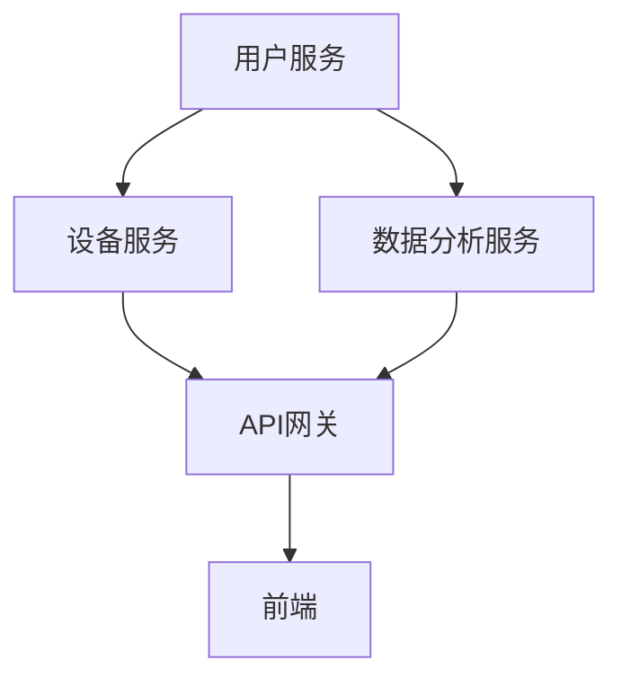
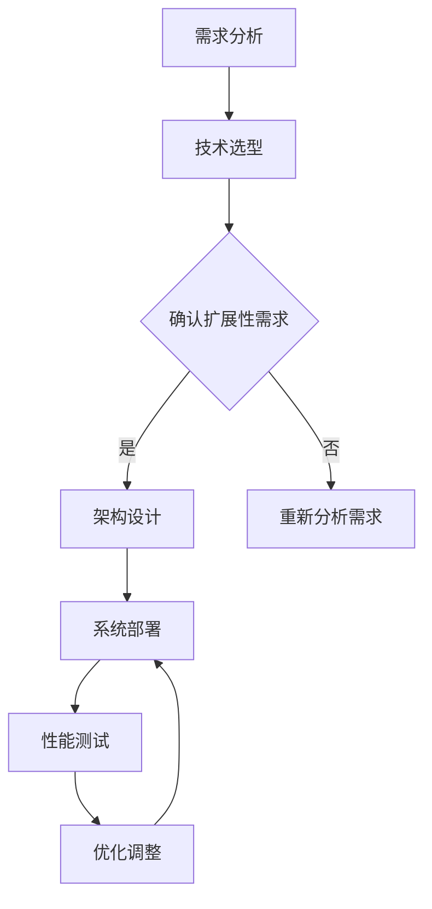
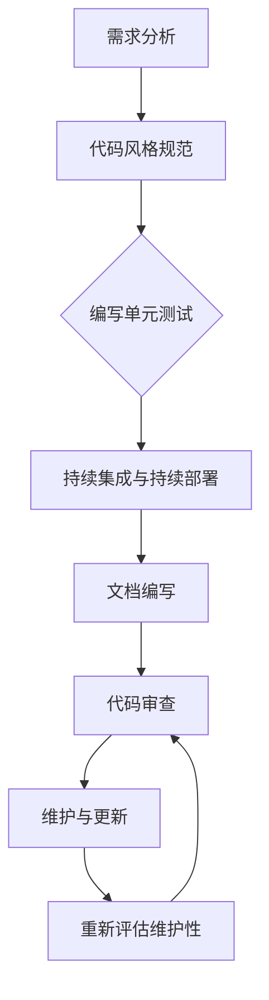
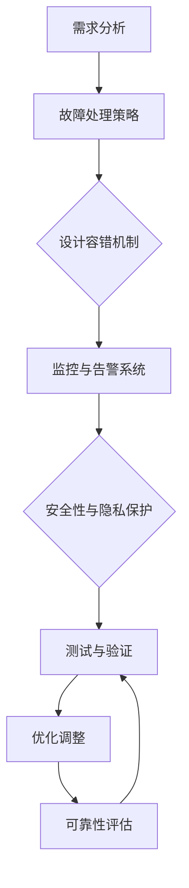

                 

### 第1章: AI创业公司的技术架构设计原则概述

#### 1.1 AI创业公司技术架构设计的背景和重要性

AI创业公司近年来在全球范围内迅速崛起，成为科技领域的一股新兴力量。随着人工智能技术的不断发展和商业应用的深入，越来越多的创业者投身于AI领域，试图通过创新的AI解决方案来颠覆传统行业，提升企业竞争力。然而，AI创业公司在技术架构设计方面面临着诸多挑战，这直接关系到公司的生存和发展。

技术架构设计在AI创业公司中的角色至关重要。一个良好的技术架构不仅能够支撑公司的业务需求，还能确保系统的高扩展性、可维护性和可靠性，从而为公司的长期发展奠定坚实基础。具体来说，技术架构设计的重要性体现在以下几个方面：

1. **支持业务需求：** AI创业公司通常需要快速响应市场变化，因此技术架构必须具备高度灵活性和可扩展性，能够快速适应业务需求的变更。

2. **提高开发效率：** 一个合理的技术架构能够优化开发流程，减少冗余代码和重复工作，提高开发团队的生产效率。

3. **确保系统稳定性：** 稳定的技术架构能够降低系统故障率，提高用户体验，增强用户对公司的信任。

4. **降低长期成本：** 可维护性和可靠性设计原则有助于减少系统维护成本和故障修复时间，从而降低公司的长期运营成本。

#### 1.2 设计原则的核心目标

AI创业公司的技术架构设计应遵循以下核心目标：

1. **可扩展性（Scalability）**：技术架构应能够支持系统在用户数量、数据处理量、功能需求等方面的增长，确保系统能够无缝扩展。

2. **可维护性（Maintainability）**：技术架构应便于后续的维护和更新，确保系统能够长期稳定运行。

3. **可靠性（Reliability）**：技术架构应具备高可靠性，能够在各种情况下保持系统的正常运行，避免因故障导致服务中断。

#### 1.3 AI创业公司的兴起

AI创业公司的兴起主要受到以下几个因素的推动：

1. **技术成熟度：** 人工智能领域的研究取得了显著进展，算法、硬件和大数据技术的不断突破为创业公司提供了强大的技术支持。

2. **市场机遇：** 各行各业对AI技术的需求日益增长，从金融、医疗到零售、制造，AI技术正逐渐融入各个行业，为创业公司提供了丰富的市场机遇。

3. **投资热潮：** AI领域吸引了大量风险投资，为创业公司提供了充足的资金支持，推动了AI创业公司的快速发展。

4. **政策支持：** 各国政府纷纷出台支持人工智能发展的政策，为创业公司提供了良好的发展环境。

#### 1.4 技术架构设计在创业公司中的角色

在AI创业公司中，技术架构设计扮演着至关重要的角色，直接影响公司的成功与否。以下从几个方面阐述技术架构设计在创业公司中的关键角色：

1. **支撑业务创新：** 技术架构设计是公司业务创新的重要基础，一个灵活、可扩展的技术架构能够快速响应市场变化，支撑公司不断推出创新的AI产品和服务。

2. **提升竞争力：** 技术架构设计决定了公司的系统性能、稳定性和可维护性，优秀的技术架构能够提升公司的市场竞争力，赢得更多客户和市场份额。

3. **降低开发成本：** 通过合理的架构设计，可以减少开发过程中的重复劳动，提高开发效率，降低开发成本。

4. **保障长期发展：** 一个良好的技术架构设计能够支撑公司的长期发展，确保系统能够随着公司规模的扩大和业务需求的增加而持续优化。

#### 1.5 设计原则的核心目标

AI创业公司的技术架构设计应遵循以下核心目标：

1. **可扩展性（Scalability）**：技术架构应能够支持系统在用户数量、数据处理量、功能需求等方面的增长，确保系统能够无缝扩展。

2. **可维护性（Maintainability）**：技术架构应便于后续的维护和更新，确保系统能够长期稳定运行。

3. **可靠性（Reliability）**：技术架构应具备高可靠性，能够在各种情况下保持系统的正常运行，避免因故障导致服务中断。

### 第2章: 可扩展性设计实践

#### 2.1 架构模式与设计模式

可扩展性设计是AI创业公司技术架构设计的关键原则之一。一个具备高扩展性的技术架构能够支持公司业务的快速增长，确保系统在用户数量、数据处理量、功能需求等方面具备足够的灵活性。在本节中，我们将探讨几种常见的架构模式与设计模式，以及它们在可扩展性设计中的应用。

##### 2.1.1 微服务架构

微服务架构（Microservices Architecture）是一种基于组件的分布式系统设计方法，通过将应用程序分解为多个独立的、小型、可扩展的服务，从而实现系统的弹性扩展。微服务架构具有以下几个优点：

1. **高可扩展性：** 每个微服务都可以独立扩展，根据实际需求分配计算资源，从而提高系统的整体可扩展性。

2. **高灵活性：** 微服务架构使得系统可以更加灵活地应对业务需求的变化，每个微服务都可以独立开发、部署和更新。

3. **高可用性：** 微服务架构通过冗余部署和故障转移机制，提高了系统的可用性和容错能力。

在实现微服务架构时，常见的模式包括：

1. **服务拆分：** 根据业务功能将大型应用程序分解为多个独立的微服务。

2. **服务自治：** 每个微服务拥有自己的数据存储、API接口和业务逻辑，实现高度自治。

3. **服务发现与注册：** 使用服务发现与注册机制，确保各个微服务之间能够相互发现和通信。

##### 2.1.2 响应式架构

响应式架构（Responsive Architecture）是一种面向事件驱动的系统设计方法，旨在提高系统的响应速度和灵活性。响应式架构通过事件驱动的方式，实现了系统各组件之间的松耦合，从而提高了系统的可扩展性和容错能力。

响应式架构的核心组件包括：

1. **事件总线：** 负责事件的生产、消费和路由。

2. **事件源：** 产生事件，如用户操作、系统异常等。

3. **事件处理器：** 负责处理事件，如数据存储、业务逻辑处理等。

响应式架构的优点包括：

1. **高可扩展性：** 通过事件驱动的方式，系统可以更加灵活地应对业务需求的变化。

2. **高容错性：** 系统各个组件之间松耦合，某个组件的故障不会影响其他组件的运行。

3. **高响应速度：** 系统各个组件通过事件进行通信，响应速度更快。

##### 2.1.3 无状态服务与有状态服务的设计

在可扩展性设计中，无状态服务（Stateless Service）和有状态服务（Stateful Service）的设计方式有所不同。

1. **无状态服务：** 无状态服务不保存客户端会话信息，每次请求都是独立的，独立于之前的请求。无状态服务易于扩展，因为可以随意部署和替换实例，不会影响系统的整体功能。典型的无状态服务包括HTTP服务器、消息队列等。

2. **有状态服务：** 有状态服务保存客户端会话信息，每个请求都与之前的请求相关联。有状态服务在处理连续请求时更具优势，但扩展性较差，因为需要确保会话信息的一致性和持久性。

在设计有状态服务时，可以采用以下策略：

1. **分布式会话存储：** 使用分布式存储系统（如Redis、MongoDB等）来保存会话信息，确保会话数据的一致性和可用性。

2. **会话复制与负载均衡：** 通过会话复制和负载均衡机制，确保有状态服务能够横向扩展。

#### 2.2 技术选型与系统设计

在实现可扩展性设计时，技术选型和系统设计至关重要。以下从分布式系统关键技术、数据库选型与优化、系统容灾与故障恢复策略等方面进行详细探讨。

##### 2.2.1 分布式系统关键技术

分布式系统（Distributed System）是AI创业公司实现高扩展性的基础。以下是一些关键的分布式系统技术：

1. **服务发现与注册：** 服务发现与注册（Service Discovery and Registration）是一种自动化管理分布式服务的方法，通过注册中心（如Consul、Zookeeper等）实现服务的自动发现和注册，简化服务间的通信。

2. **负载均衡：** 负载均衡（Load Balancing）通过将请求分配到多个服务器实例，实现系统的水平扩展。常见的负载均衡算法包括轮询、最小连接数、哈希等。

3. **分布式缓存：** 分布式缓存（Distributed Caching）通过将缓存数据分布在多个节点上，提高系统的缓存性能和可扩展性。常用的分布式缓存系统包括Redis、Memcached等。

4. **分布式数据库：** 分布式数据库（Distributed Database）通过将数据分布在多个节点上，实现数据的高可用性和水平扩展。常用的分布式数据库包括MongoDB、Cassandra等。

##### 2.2.2 数据库选型与优化

数据库选型与优化是影响系统扩展性的重要因素。以下是几种常见的数据库选型与优化方法：

1. **关系型数据库 vs. 非关系型数据库：** 
   - 关系型数据库（如MySQL、PostgreSQL等）适合处理结构化数据，具有较好的事务处理能力和查询性能。
   - 非关系型数据库（如MongoDB、Redis等）适合处理半结构化或非结构化数据，具有更高的扩展性和灵活性。

2. **垂直扩展 vs. 水平扩展：**
   - 垂直扩展（Vertical Scaling）通过增加服务器硬件资源（如CPU、内存等）来提升系统性能。
   - 水平扩展（Horizontal Scaling）通过增加服务器节点来提升系统性能，适合处理大量数据和高并发请求。

3. **分库分表：** 分库分表（Sharding）是一种将数据分布到多个数据库或表中的方法，可以提高系统的扩展性和性能。

4. **读写分离：** 读写分离（Master-Slave Replication）通过将读操作路由到从库，将写操作路由到主库，提高系统的读写性能。

##### 2.2.3 系统容灾与故障恢复策略

系统容灾与故障恢复策略是确保系统高可靠性的重要手段。以下是一些常见的策略：

1. **主从备份：** 主从备份（Master-Slave Backup）通过将主库的数据定期备份到从库，确保数据的一致性和可用性。

2. **多活架构：** 多活架构（Active-Active Architecture）通过将业务部署在多个可用区，实现数据的冗余和故障切换。

3. **故障自愈：** 故障自愈（Self-Recovery）通过自动检测和修复系统故障，确保系统的高可用性。

4. **灾难恢复计划：** 灾难恢复计划（Disaster Recovery Plan）包括数据备份、故障转移、业务连续性等方面的预案，确保在发生灾难时能够快速恢复业务。

#### 2.3 扩展性评估与优化

在实现可扩展性设计的过程中，扩展性评估与优化至关重要。以下从扩展性评估指标、性能测试与瓶颈分析、优化策略与实践案例等方面进行详细探讨。

##### 2.3.1 扩展性评估指标

扩展性评估指标是衡量系统扩展性能的重要参数。以下是一些常见的扩展性评估指标：

1. **吞吐量（Throughput）**：系统每秒处理请求的数量，反映系统的处理能力。

2. **响应时间（Response Time）**：系统处理请求的平均时间，反映系统的响应速度。

3. **并发用户数（Concurrent Users）**：系统能够同时处理的最大用户数，反映系统的并发处理能力。

4. **资源利用率（Resource Utilization）**：系统资源的利用程度，如CPU、内存、磁盘等。

5. **扩展性比率（Scalability Ratio）**：系统扩展前后性能的比值，反映系统的扩展效果。

##### 2.3.2 性能测试与瓶颈分析

性能测试是评估系统扩展性的重要手段。以下是一些常见的性能测试方法：

1. **负载测试（Load Testing）**：模拟真实用户负载，评估系统的性能和稳定性。

2. **压力测试（Stress Testing）**：模拟极端负载，评估系统的极限性能和容错能力。

3. **性能瓶颈分析（Performance Bottleneck Analysis）**：通过性能测试，找出系统的瓶颈，如CPU、内存、磁盘I/O等。

##### 2.3.3 优化策略与实践案例

根据性能测试的结果，可以采取以下优化策略：

1. **分布式架构优化**：优化分布式架构，如服务拆分、负载均衡、分布式缓存等，提高系统的扩展性。

2. **数据库优化**：优化数据库结构、索引、查询优化等，提高数据库的性能。

3. **缓存优化**：优化缓存策略，如缓存过期、缓存预热等，提高系统的响应速度。

4. **代码优化**：优化代码逻辑、减少资源消耗、提高代码执行效率等，提高系统的性能。

以下是一个实践案例：

**案例：** 一家AI创业公司开发了一款实时推荐系统，随着用户数量的增加，系统性能逐渐下降。经过性能测试和瓶颈分析，发现主要瓶颈在于数据库查询速度和缓存策略。

**优化策略：**
- **数据库优化**：对数据库进行分库分表，提高查询性能。
- **缓存优化**：优化缓存策略，将热门数据预热到缓存中，减少数据库查询次数。
- **分布式架构优化**：增加分布式缓存节点，提高缓存性能。

**效果**：通过以上优化策略，系统的响应速度显著提高，并发用户数从原来的1000增长到5000，用户满意度显著提升。

### 第3章: 可维护性设计实践

#### 3.1 代码质量与代码风格

在AI创业公司的技术架构设计中，可维护性是一个至关重要的原则。一个良好的代码质量和高标准的代码风格不仅能提高开发效率，还能降低维护成本，确保系统长期稳定运行。因此，在设计和实现技术架构时，必须重视代码质量和代码风格。

##### 3.1.1 代码质量的重要性

代码质量是指代码的可读性、可靠性、可维护性和可扩展性等方面的综合体现。高代码质量具有以下几个优点：

1. **提高开发效率**：良好的代码质量使得代码可读性更强，开发人员能够更快地理解和修改代码，提高开发效率。

2. **降低维护成本**：高质量的代码便于后续的维护和更新，减少了代码缺陷和错误，降低了维护成本。

3. **提高系统稳定性**：高质量的代码能够更好地处理各种异常情况，提高系统的稳定性。

4. **促进团队协作**：良好的代码风格和规范有助于团队之间的协作，减少因代码风格不一致导致的冲突。

##### 3.1.2 代码风格规范

为了确保代码质量，必须遵循一系列代码风格规范。以下是一些常见的代码风格规范：

1. **命名规范**：变量、函数和类的命名应具有明确的意义，避免使用缩写和拼音，以提高代码的可读性。

2. **缩进和空格**：保持统一的缩进和空格风格，通常使用两个或四个空格进行缩进，避免使用制表符。

3. **代码注释**：添加必要的代码注释，解释代码的功能、算法逻辑和关键步骤，提高代码的可理解性。

4. **代码格式**：统一代码格式，如括号位置、语句顺序等，避免因代码格式不一致导致的编译错误。

5. **模块化**：将代码划分为模块和函数，实现代码的复用性和可维护性。

6. **避免重复代码**：避免重复代码，通过函数、类或模块的复用减少代码冗余。

7. **错误处理**：合理处理异常和错误，确保代码在出现异常时能够优雅地恢复或中断。

##### 3.1.3 单元测试与实践

单元测试（Unit Testing）是确保代码质量的重要手段。通过编写单元测试，可以验证代码的正确性、稳定性和可靠性。以下是一些常见的单元测试方法和实践：

1. **测试覆盖率**：确保单元测试覆盖率达到一定比例，通常建议达到80%以上。

2. **测试用例设计**：设计全面、合理的测试用例，覆盖各种输入和输出情况，包括正常情况和异常情况。

3. **自动化测试**：编写自动化测试脚本，通过持续集成工具（如Jenkins、GitLab CI等）实现自动化测试，提高测试效率。

4. **代码评审**：在代码提交前进行代码评审，确保代码质量符合规范，减少潜在的错误和缺陷。

5. **持续测试**：在开发过程中持续进行单元测试，及时发现和修复问题，避免积累技术债务。

以下是一个简单的单元测试示例：

```python
# 示例：Python单元测试
import unittest
from my_module import calculate_sum

class TestCalculateSum(unittest.TestCase):
    def test_calculate_sum_positive_numbers(self):
        self.assertEqual(calculate_sum(1, 2), 3)
        self.assertEqual(calculate_sum(10, 20), 30)

    def test_calculate_sum_negative_numbers(self):
        self.assertEqual(calculate_sum(-1, -2), -3)
        self.assertEqual(calculate_sum(-10, -20), -30)

    def test_calculate_sum_mixed_numbers(self):
        self.assertEqual(calculate_sum(1, -2), -1)
        self.assertEqual(calculate_sum(-10, 20), 10)

if __name__ == '__main__':
    unittest.main()
```

通过以上代码，可以验证`calculate_sum`函数在不同输入情况下的正确性。

#### 3.2 持续集成与持续部署

持续集成（Continuous Integration，CI）和持续部署（Continuous Deployment，CD）是现代软件开发中重要的实践方法。通过持续集成，可以确保代码库中的每个提交都是可集成和可测试的；而通过持续部署，可以实现自动化部署，提高开发效率和系统稳定性。以下将从持续集成的重要性、工具选择与应用、持续部署策略与实践等方面进行详细探讨。

##### 3.2.1 持续集成的重要性

持续集成是软件开发过程中的关键环节，其重要性体现在以下几个方面：

1. **快速发现和修复缺陷**：通过持续集成，开发人员可以在每次提交代码后立即发现和修复缺陷，避免缺陷在后续开发过程中积累。

2. **确保代码库的稳定性**：持续集成能够确保代码库中的每个提交都是可集成和可测试的，从而提高代码库的整体稳定性。

3. **提高开发效率**：持续集成自动化了编译、测试和构建过程，减少了人工干预，提高了开发效率。

4. **促进团队协作**：持续集成促进了团队成员之间的协作，确保每个人都关注代码库的整体质量。

##### 3.2.2 持续集成工具的选择与应用

在实施持续集成时，选择合适的工具至关重要。以下是一些常用的持续集成工具及其特点：

1. **Jenkins**：Jenkins是一个开源的持续集成工具，具有丰富的插件生态系统，支持各种开发语言和平台。

2. **GitLab CI/CD**：GitLab CI/CD是GitLab集成的一部分，提供自动化构建、测试和部署功能。

3. **Travis CI**：Travis CI是一个基于GitHub的持续集成工具，支持多种编程语言，提供免费的社区版。

4. **CircleCI**：CircleCI是一个云端的持续集成工具，提供自动化构建、测试和部署功能。

以下是一个使用Jenkins实现持续集成的示例：

**步骤 1**：安装Jenkins

在服务器上安装Jenkins，可以通过包管理器或Jenkins官网提供的安装脚本进行安装。

```bash
# 示例：使用Apache Maven安装Jenkins
sudo wget -q -O - https://pkg.jenkins.io/debian-stable/jenkins.io.key | sudo apt-key add -
sudo sh -c 'echo deb https://pkg.jenkins.io/debian-stable binary/ > /etc/apt/sources.list.d/jenkins.list'
sudo apt-get update
sudo apt-get install jenkins
```

**步骤 2**：配置Jenkins

启动Jenkins服务，并配置必要的插件。

```bash
# 启动Jenkins服务
sudo systemctl start jenkins

# 访问Jenkins Web界面，进行插件安装和配置
```

**步骤 3**：创建构建流水线

在Jenkins中创建一个新的构建流水线，配置构建过程。

```bash
# 创建新项目
# 配置构建流水线，包括源代码管理、构建脚本、测试脚本等
```

**步骤 4**：自动化部署

配置持续部署策略，实现自动化部署。

```bash
# 配置部署脚本，包括环境准备、应用部署、服务启动等
```

##### 3.2.3 持续部署策略与实践

持续部署是确保代码从开发到生产环境顺利过渡的关键环节。以下是一些常见的持续部署策略：

1. **蓝绿部署**：在新的环境中部署新版本，然后逐步切换流量到新环境，确保系统平稳过渡。

2. **灰度发布**：在部分用户中发布新版本，观察用户反馈和系统性能，逐步扩大发布范围。

3. **滚动更新**：逐步替换旧版本，确保系统在更新过程中保持可用。

以下是一个使用Docker和Kubernetes实现持续部署的示例：

**步骤 1**：构建Docker镜像

编写Dockerfile，定义应用容器化过程。

```Dockerfile
# 示例：Dockerfile
FROM python:3.8
WORKDIR /app
COPY requirements.txt .
RUN pip install -r requirements.txt
COPY . .
CMD ["python", "app.py"]
```

**步骤 2**：创建Kubernetes配置文件

编写Kubernetes配置文件（如deployment.yaml），定义部署策略。

```yaml
# 示例：deployment.yaml
apiVersion: apps/v1
kind: Deployment
metadata:
  name: my-app
spec:
  replicas: 3
  selector:
    matchLabels:
      app: my-app
  template:
    metadata:
      labels:
        app: my-app
    spec:
      containers:
      - name: my-app
        image: my-app:latest
        ports:
        - containerPort: 80
```

**步骤 3**：部署应用

使用kubectl命令部署应用。

```bash
# 部署应用
kubectl apply -f deployment.yaml
```

**步骤 4**：自动化部署

配置持续集成工具，实现自动化部署。

```bash
# 示例：使用Jenkins实现自动化部署
# 配置Jenkins流水线，触发Docker镜像构建和Kubernetes部署
```

通过以上步骤，可以实现应用的持续集成和持续部署，提高开发效率和系统稳定性。

#### 3.3 文档与知识管理

在AI创业公司的技术架构设计中，文档和知识管理同样重要。良好的文档和知识管理不仅有助于团队成员之间的协作，还能提高系统的可维护性和可扩展性。以下将从文档的作用与分类、知识管理的实践方法、知识共享与协作工具等方面进行详细探讨。

##### 3.3.1 文档的作用与分类

文档在技术架构设计中具有重要作用，具体包括以下几个方面：

1. **知识传递**：通过文档，可以将技术架构设计、实现细节、业务逻辑等知识传递给团队成员，提高团队整体的技能水平。

2. **代码解释**：文档可以帮助开发者更好地理解代码的功能、结构和实现原理，减少沟通成本，提高开发效率。

3. **维护指导**：详细的文档为系统的后续维护和更新提供了宝贵的参考资料，有助于团队成员快速定位问题并进行修复。

4. **风险防范**：文档可以记录系统设计中的关键风险点和应对策略，提高系统的稳定性和可靠性。

常见的文档分类包括：

1. **设计文档**：包括系统架构图、模块设计、接口文档等，描述系统的整体架构和各个模块的功能。

2. **开发文档**：包括开发指南、代码规范、测试用例等，指导开发人员编写高质量代码。

3. **操作文档**：包括系统部署、运维、监控等操作手册，帮助团队成员进行日常运维工作。

4. **问题记录**：包括故障排除、问题解决等记录，为后续的维护和优化提供参考。

##### 3.3.2 知识管理的实践方法

有效的知识管理可以提高团队的协作效率，减少知识流失。以下是一些常见的知识管理实践方法：

1. **文档标准化**：制定统一的文档规范，确保文档结构清晰、内容完整，提高文档的可读性和可维护性。

2. **版本控制**：使用版本控制系统（如Git）管理文档，确保文档的版本可追溯，便于团队成员协同工作和代码合并。

3. **知识共享**：建立知识共享平台，鼓励团队成员分享经验和心得，提高团队整体的知识水平。

4. **培训与交流**：定期组织技术培训、内部交流等活动，提高团队成员的技能水平和知识储备。

5. **知识沉淀**：将团队的经验和知识进行沉淀，形成知识库，为后续项目提供参考资料。

##### 3.3.3 知识共享与协作工具

为了提高团队的知识共享和协作效率，可以采用以下知识共享与协作工具：

1. **文档管理工具**：如Confluence、Notion等，用于编写、管理和共享文档。

2. **代码库**：如GitHub、GitLab等，用于代码管理和版本控制。

3. **协作平台**：如Trello、Asana等，用于任务管理和团队协作。

4. **即时通讯工具**：如Slack、Telegram等，用于实时沟通和协作。

5. **知识库**：如WIKI、Markdown文件等，用于存储和共享团队的知识和经验。

以下是一个使用Confluence管理文档的示例：

**步骤 1**：创建文档空间

在Confluence中创建一个用于项目管理的新空间。

```bash
# 创建新空间
confluence space-create -s "Project Management"
```

**步骤 2**：编写和编辑文档

在新建的空间中编写和编辑文档，包括项目计划、技术文档、问题记录等。

```bash
# 编辑文档
curl -X PUT "https://your-confluence-instance.com/wiki/rest/api/content/1234" -H "Content-Type: application/json" --data-binary @document.json
```

**步骤 3**：共享和协作

将文档共享给团队成员，并邀请他们进行编辑和评论。

```bash
# 共享文档
curl -X POST "https://your-confluence-instance.com/wiki/rest/api/content/1234/child" -H "Content-Type: application/json" --data-binary @share.json
```

通过以上步骤，可以方便地使用Confluence管理项目文档，实现知识共享和团队协作。

### 第4章: 可靠性设计实践

#### 4.1 故障处理与容错机制

在AI创业公司的技术架构设计中，可靠性是确保系统稳定运行的关键因素。为了应对各种可能的故障和异常情况，系统必须具备强大的故障处理和容错机制。以下将从故障处理策略、容错机制设计、实践案例分析等方面进行详细探讨。

##### 4.1.1 故障处理策略

故障处理策略是指系统在遇到故障时采取的一系列措施，以确保系统的正常运行。以下是一些常见的故障处理策略：

1. **故障预警与监控**：通过实时监控系统的运行状态，及时发现潜在故障和异常情况，提前预警。

2. **自动故障转移**：当主系统出现故障时，自动将流量切换到备用系统，确保服务的连续性。

3. **故障恢复**：当系统从故障中恢复后，自动恢复到正常工作状态，确保系统的可靠性。

4. **日志记录与审计**：详细记录系统故障和处理过程，便于后续分析和改进。

##### 4.1.2 容错机制设计

容错机制是指系统在遇到故障时能够自动恢复或继续运行的能力。以下是一些常见的容错机制设计：

1. **主从备份**：将数据或服务备份到备用节点，确保在主节点出现故障时能够快速切换到备用节点。

2. **分布式存储**：使用分布式存储系统，将数据分布在多个节点上，提高数据的可靠性和可用性。

3. **服务冗余**：通过冗余部署，确保系统在部分节点出现故障时仍能正常运行。

4. **故障隔离**：将故障节点与正常节点隔离，避免故障扩散，确保系统的整体稳定性。

##### 4.1.3 实践案例分析

以下是一个AI创业公司的故障处理与容错机制设计案例：

**背景**：该公司开发了一款实时语音识别系统，用于在线教育领域。随着用户数量的增加，系统的负载逐渐增大，出现了多次故障，影响了用户体验。

**故障处理策略**：
1. **故障预警与监控**：使用Prometheus和Grafana实时监控系统的运行状态，包括CPU、内存、磁盘I/O、网络延迟等指标，设置阈值进行预警。

2. **自动故障转移**：使用Kubernetes的自动故障转移功能，当主节点出现故障时，自动将Pod切换到备用节点。

3. **故障恢复**：系统从故障中恢复后，自动恢复到正常工作状态，避免人工干预。

**容错机制设计**：
1. **主从备份**：使用Elasticsearch作为搜索引擎，主从备份确保数据的一致性和可用性。

2. **分布式存储**：使用Cassandra作为分布式数据库，将数据分布在多个节点上，提高数据的可靠性和可用性。

3. **服务冗余**：使用微服务架构，每个服务都有多个实例，确保在部分服务实例出现故障时仍能正常运行。

4. **故障隔离**：使用Docker和Kubernetes的隔离功能，将故障节点与正常节点隔离，避免故障扩散。

**效果**：通过以上故障处理和容错机制设计，系统的可靠性显著提高，故障率降低，用户体验得到明显改善。

#### 4.2 监控与告警系统

监控与告警系统是确保系统高可靠性的重要手段。通过实时监控系统的运行状态，及时发现异常情况并采取相应措施，可以有效提高系统的稳定性和可用性。以下从监控的重要性、告警机制设计、实践案例分享等方面进行详细探讨。

##### 4.2.1 监控的重要性

监控在系统可靠性设计中扮演着至关重要的角色，其重要性体现在以下几个方面：

1. **及时发现异常**：通过实时监控，可以及时发现系统的异常情况，如CPU过高、内存不足、网络延迟等，避免故障扩大。

2. **快速故障定位**：监控系统能够快速定位故障发生的位置和原因，为故障处理提供有力支持。

3. **优化系统性能**：通过监控性能指标，可以发现系统的瓶颈和问题，及时进行优化和调整，提高系统性能。

4. **提高运维效率**：监控系统能够自动化记录和报告系统运行状态，降低运维人员的工作负担。

##### 4.2.2 告警机制设计

告警机制是监控系统的核心功能，通过设置阈值和规则，当监控指标超过设定阈值时，自动发送告警通知。以下是一些常见的告警机制设计：

1. **阈值设置**：根据系统运行特点，设置合理的监控指标阈值，如CPU使用率、内存使用率、网络延迟等。

2. **告警通知**：当监控指标超过阈值时，通过邮件、短信、微信等渠道发送告警通知，通知运维人员及时处理。

3. **告警分级**：根据告警的严重程度，设置不同的告警级别，如紧急告警、警告告警等，确保重要故障得到及时处理。

4. **告警抑制**：为了避免频繁告警和误告警，可以设置告警抑制规则，如连续多次告警后暂停告警。

以下是一个告警机制设计的示例：

**步骤 1**：配置监控指标阈值

```yaml
# 示例：监控指标阈值配置
- name: CPU使用率
  type: gauge
  thresholds:
    - threshold: 90
      type: critical
      duration: 1m
    - threshold: 80
      type: warning
      duration: 1m
```

**步骤 2**：配置告警通知

```yaml
# 示例：告警通知配置
- name: CPU使用率告警
  rule:
    type: threshold
    metric_name: 'CPU使用率'
    comparison: '>'
    value: 90
  notifications:
    - name: email
      channels:
        - type: email
          config:
            to: 'sysadmin@example.com'
    - name: sms
      channels:
        - type: sms
          config:
            to: '+1234567890'
```

**步骤 3**：配置告警抑制

```yaml
# 示例：告警抑制配置
- name: CPU使用率抑制
  rule:
    type: threshold
    metric_name: 'CPU使用率'
    comparison: '>'
    value: 90
  notifications:
    - name: email
      channels:
        - type: email
          config:
            to: 'sysadmin@example.com'
  suppressions:
    - match:
        alert: 'CPU使用率告警'
      extend_for: 5m
```

通过以上配置，当CPU使用率超过90%时，会发送紧急告警邮件和短信，并启用告警抑制，避免频繁告警。

##### 4.2.3 实践案例分享

以下是一个AI创业公司的监控与告警系统设计案例：

**背景**：该公司开发了一款智能语音助手，提供语音识别、自然语言处理等功能。由于系统涉及多个服务和组件，需要对整个系统进行全面的监控和告警。

**监控与告警策略**：
1. **服务监控**：使用Prometheus监控系统的各个服务，包括API服务、语音识别服务、自然语言处理服务等。

2. **数据库监控**：使用Prometheus和Grafana监控数据库的性能指标，包括连接数、延迟、吞吐量等。

3. **日志监控**：使用ELK（Elasticsearch、Logstash、Kibana）监控系统的日志，包括错误日志、告警日志等。

4. **告警通知**：通过邮件、微信和企业微信群等渠道发送告警通知，确保运维人员及时处理。

**实践效果**：
1. **快速故障定位**：通过监控和告警系统，能够快速定位故障发生的位置和原因，缩短故障处理时间。

2. **优化系统性能**：通过监控指标的分析和优化，及时发现系统瓶颈和问题，提高系统性能和稳定性。

3. **提高运维效率**：通过自动化告警和故障处理，降低运维人员的工作负担，提高运维效率。

#### 4.3 安全性与隐私保护

在AI创业公司的技术架构设计中，安全性和隐私保护是确保系统可靠性和用户信任的关键因素。以下从安全性原则、隐私保护策略、安全实践案例分析等方面进行详细探讨。

##### 4.3.1 安全性原则

在系统设计过程中，应遵循以下安全性原则：

1. **最小权限原则**：每个组件和用户都应仅拥有完成其任务所需的最小权限，避免权限滥用。

2. **数据加密**：对敏感数据进行加密存储和传输，确保数据在传输和存储过程中的安全性。

3. **访问控制**：使用访问控制机制，确保只有授权用户才能访问系统资源和数据。

4. **身份验证与授权**：使用强身份验证机制（如双因素认证），确保用户身份的合法性和安全性。

5. **安全审计**：定期进行安全审计，检测和修复系统中的安全漏洞和风险。

##### 4.3.2 隐私保护策略

在AI创业公司中，隐私保护策略至关重要。以下是一些常见的隐私保护策略：

1. **数据匿名化**：对用户数据进行匿名化处理，确保无法直接识别用户身份。

2. **数据最小化**：仅收集和存储实现功能所需的最小数据量，避免过度收集。

3. **数据加密**：对存储和传输的数据进行加密，确保数据在传输和存储过程中的安全性。

4. **隐私政策**：制定清晰的隐私政策，告知用户数据收集、存储和使用的目的，确保用户知情权。

5. **用户权限管理**：为用户设置合理的权限，确保用户只能访问其需要的数据。

##### 4.3.3 安全实践案例分析

以下是一个AI创业公司的安全性与隐私保护实践案例：

**背景**：该公司开发了一款面向消费者的智能家居控制系统，用户可以通过手机应用程序控制家中的智能设备。

**安全性策略**：
1. **最小权限原则**：每个用户都只能访问与其智能家居设备相关的数据，无法访问其他用户的数据。

2. **数据加密**：使用SSL/TLS协议对数据传输进行加密，确保数据在传输过程中的安全性。

3. **访问控制**：使用OAuth2.0协议进行用户身份验证和授权，确保只有授权用户才能访问系统资源。

4. **安全审计**：定期进行安全审计，检测和修复系统中的安全漏洞和风险。

**隐私保护策略**：
1. **数据匿名化**：对用户数据进行匿名化处理，确保无法直接识别用户身份。

2. **数据最小化**：仅收集和存储实现智能家居控制所需的最小数据量，如设备状态、用户操作等。

3. **隐私政策**：制定清晰的隐私政策，告知用户数据收集、存储和使用的目的，确保用户知情权。

**实践效果**：
1. **提高了系统的安全性**：通过最小权限原则、数据加密和访问控制等安全策略，确保系统的安全性。

2. **增强了用户隐私保护**：通过数据匿名化、数据最小化和隐私政策等隐私保护策略，提高了用户对系统的信任。

3. **降低了安全风险**：通过安全审计，及时发现和修复系统中的安全漏洞，降低安全风险。

### 第5章: AI创业公司技术架构设计项目实战

#### 5.1 项目背景与目标

**项目背景：** 某初创公司名为SmartHome，专注于智能家居领域。公司目标是通过AI技术和物联网（IoT）设备，为用户提供智能、便捷的家居控制体验。SmartHome计划开发一个智能家居平台，支持智能设备的管理、控制和分析，满足用户对智能生活的需求。

**项目目标：**
1. **高扩展性**：确保系统能够支持数百万用户和设备的同时在线，并支持未来业务的扩展。
2. **高可靠性**：系统应具备高可靠性，确保在任何情况下都能稳定运行，避免服务中断。
3. **易维护性**：系统设计应便于后续的维护和更新，确保系统在长期运行中保持高效稳定。

#### 5.2 技术选型与架构设计

**技术选型：**
1. **后端框架**：选择Spring Boot作为主要后端框架，因其具有快速开发、高性能和易于扩展的特点。
2. **数据库**：选择PostgreSQL作为关系型数据库，用于存储用户数据和设备信息。
3. **消息队列**：采用RabbitMQ作为消息队列，处理设备数据传输和系统间通信。
4. **缓存**：使用Redis作为缓存系统，提高数据读取性能。
5. **前端框架**：选择Vue.js作为前端框架，提供良好的用户交互体验。

**架构设计：**
- **前端架构**：采用Vue.js构建单页面应用（SPA），使用Vuex进行状态管理。
- **后端架构**：
  - **用户服务**：处理用户认证和用户数据管理。
  - **设备服务**：管理设备数据，处理设备注册、状态更新等。
  - **数据分析服务**：处理用户数据，提供数据分析和报告功能。
  - **API网关**：使用Zuul或Kong作为API网关，统一处理请求路由、权限验证等。

**架构图：**



#### 5.3 开发与测试

**开发流程：**
1. **敏捷开发**：采用Scrum敏捷开发方法，每个迭代周期为2周，确保快速响应需求变化。
2. **版本控制**：使用Git进行代码版本控制，确保代码的稳定性和可追踪性。
3. **持续集成**：使用Jenkins实现持续集成，自动化构建、测试和部署，提高开发效率。

**测试策略：**
1. **单元测试**：编写单元测试，覆盖核心功能模块，确保代码质量。
2. **集成测试**：进行集成测试，确保模块间接口的正确性。
3. **性能测试**：使用JMeter进行性能测试，评估系统的负载能力和响应速度。
4. **安全测试**：定期进行安全测试，包括SQL注入、XSS攻击等，确保系统的安全性。

**工具选择：**
- **测试工具**：JUnit、Mockito、JMeter、SonarQube
- **代码审查**：使用GitLab或GitHub的代码审查功能，确保代码质量。

#### 5.4 部署与维护

**部署策略：**
1. **容器化**：使用Docker容器化应用，确保部署的一致性和可移植性。
2. **自动化部署**：使用Kubernetes进行容器编排，实现自动化部署和运维。
3. **蓝绿部署**：采用蓝绿部署策略，确保新版本的平稳上线。

**维护实践：**
1. **监控与告警**：使用Prometheus和Grafana进行实时监控，设置告警规则，及时发现和解决问题。
2. **日志管理**：使用ELK（Elasticsearch、Logstash、Kibana）进行日志收集和分析，便于问题追踪和性能优化。
3. **备份与恢复**：定期进行数据库备份，确保数据安全，并制定数据恢复计划。
4. **性能优化**：定期进行性能测试，发现并解决性能瓶颈，提高系统响应速度。

### 第6章: 总结与展望

#### 6.1 技术架构设计的关键要素

在AI创业公司的技术架构设计中，可扩展性、可维护性和可靠性是三个关键要素。以下是每个要素的重要性总结：

1. **可扩展性（Scalability）**：确保系统能够支持业务增长，处理大量用户和数据处理需求。良好的可扩展性能够提高系统的稳定性和用户体验。

2. **可维护性（Maintainability）**：使系统易于维护和更新，降低维护成本和复杂度。良好的可维护性能够确保系统长期稳定运行。

3. **可靠性（Reliability）**：确保系统在各种情况下都能稳定运行，避免因故障导致服务中断。可靠性是用户对系统信任的基础。

#### 6.2 未来发展趋势

随着人工智能和物联网技术的不断发展，AI创业公司的技术架构设计将面临新的挑战和机遇。以下是一些未来发展趋势：

1. **云计算与边缘计算**：云计算和边缘计算的融合将提供更高效、更灵活的计算资源，满足不同场景的需求。

2. **人工智能与深度学习**：AI算法和深度学习的进步将推动系统智能化，提高数据分析和处理能力。

3. **微服务和容器化**：微服务和容器化技术的普及将进一步提升系统的可扩展性和可维护性。

4. **自动化与智能化**：自动化和智能化技术的发展将使系统运维更加高效，降低人力成本。

#### 6.3 对创业公司的建议

针对AI创业公司的技术架构设计，以下是一些建议：

1. **重视架构设计**：在项目初期就重视架构设计，确保系统能够适应未来业务需求的变化。

2. **选择合适的技术栈**：根据业务需求和团队经验，选择合适的技术栈和开发框架，避免过度复杂化。

3. **持续迭代和优化**：保持系统的持续迭代和优化，及时修复漏洞、改进性能。

4. **遵循最佳实践**：遵循业界最佳实践，如代码质量、测试、持续集成等，提高开发效率和系统稳定性。

5. **注重团队建设**：打造一支专业、高效、协同的团队，共同推动公司技术架构的发展。

### 附录

#### 附录 A: 技术选型指南与资源推荐

**常用技术框架与库：**
- **后端框架**：Spring Boot、Django、Express
- **前端框架**：Vue.js、React、Angular
- **数据库**：PostgreSQL、MongoDB、MySQL、Redis
- **消息队列**：RabbitMQ、Kafka、RocketMQ
- **缓存**：Redis、Memcached、EhCache
- **容器化**：Docker、Kubernetes
- **持续集成**：Jenkins、GitLab CI、Travis CI
- **监控与告警**：Prometheus、Grafana、Zabbix
- **日志管理**：ELK（Elasticsearch、Logstash、Kibana）

**开发与测试工具：**
- **代码库**：GitHub、GitLab、Bitbucket
- **代码质量**：SonarQube、Checkstyle、PMD
- **测试工具**：JUnit、Mockito、TestNG、JMeter

**监控与告警系统：**
- **Prometheus**：开源监控解决方案，提供数据收集、存储和可视化。
- **Grafana**：开源监控仪表盘，与Prometheus集成，提供丰富的数据可视化功能。
- **Zabbix**：开源监控解决方案，支持多平台、多协议监控。

#### 附录 B: Mermaid 流程图示例

**可扩展性设计流程：**



**可维护性设计流程：**



**可靠性设计流程：**



#### 附录 C: 伪代码示例

**可扩展性算法伪代码：**

```python
# 可扩展性算法伪代码
def scalable_system_design(params):
    # 初始化系统参数
    system_params = initialize_params(params)

    # 设计微服务架构
    microservices_architecture = design_microservices(system_params)

    # 数据库选型与优化
    database_selection = select_database(system_params)

    # 系统容灾与故障恢复策略
    disaster_recovery_strategy = design_disaster_recovery(microservices_architecture)

    # 扩展性评估与优化
    extendibility_evaluation = evaluate_extendibility(microservices_architecture, disaster_recovery_strategy)

    # 返回设计结果
    return microservices_architecture, database_selection, disaster_recovery_strategy, extendibility_evaluation
```

**可维护性算法伪代码：**

```python
# 可维护性算法伪代码
def maintainability_system_design(params):
    # 初始化系统参数
    system_params = initialize_params(params)

    # 代码质量与代码风格
    code_quality = enforce_code_style(system_params)

    # 单元测试与实践
    unit_tests = create_unit_tests(code_quality)

    # 持续集成与持续部署
    ci_cd_strategy = design_ci_cd_system(unit_tests)

    # 可维护性评估与优化
    maintainability_evaluation = evaluate_maintainability(ci_cd_strategy)

    # 返回设计结果
    return code_quality, unit_tests, ci_cd_strategy, maintainability_evaluation
```

**可靠性算法伪代码：**

```python
# 可靠性算法伪代码
def reliability_system_design(params):
    # 初始化系统参数
    system_params = initialize_params(params)

    # 故障处理与容错机制
    fault_handling = design_fault_handling(system_params)

    # 监控与告警系统
    monitoring_system = design_monitoring_system(fault_handling)

    # 安全性与隐私保护
    security_measures = design_security_measures(monitoring_system)

    # 可靠性评估与优化
    reliability_evaluation = evaluate_reliability(security_measures)

    # 返回设计结果
    return fault_handling, monitoring_system, security_measures, reliability_evaluation
```

#### 附录 D: 数学模型与公式

**扩展性评估模型：**

$$
\text{Extendibility Score} = \frac{\text{Total Scalability Capacity}}{\text{Current Scalability Utilization}}
$$

**可维护性评估模型：**

$$
\text{Maintainability Index} = \frac{1000 \times (1 + \text{Cyclomatic Complexity}) \times (1 + \text{Lines of Code})}{\text{Number of Executable Statements}}
$$

**可靠性评估模型：**

$$
\text{Reliability Score} = \frac{\text{Total Time System is Operational}}{\text{Total Time Observed}}
$$

### 作者信息

**作者：** AI天才研究院/AI Genius Institute & 禅与计算机程序设计艺术 /Zen And The Art of Computer Programming

### 总结

本文详细阐述了AI创业公司的技术架构设计原则，包括可扩展性、可维护性和可靠性，并通过多个案例和实践进行了深入分析。通过本文的阅读，读者可以了解如何在实际项目中应用这些设计原则，从而构建高效、稳定、可靠的AI技术架构。在未来的发展中，随着技术的不断进步，AI创业公司的技术架构设计也将面临新的挑战和机遇，本文的探讨将为读者提供有益的参考和启示。作者希望本文能够为AI创业公司的技术架构设计提供有价值的指导，助力读者在技术领域取得更大的成就。

### 本文关键词

AI创业公司、技术架构设计、可扩展性、可维护性、可靠性、微服务架构、持续集成、持续部署、故障处理、监控与告警系统、安全性、隐私保护。

### 摘要

本文围绕AI创业公司的技术架构设计原则，深入探讨了可扩展性、可维护性和可靠性这三个核心要素。通过多个案例和实践，本文详细阐述了如何在实际项目中应用这些设计原则，构建高效、稳定、可靠的AI技术架构。本文旨在为AI创业公司提供有价值的指导，帮助读者在技术领域取得更大的成就。

