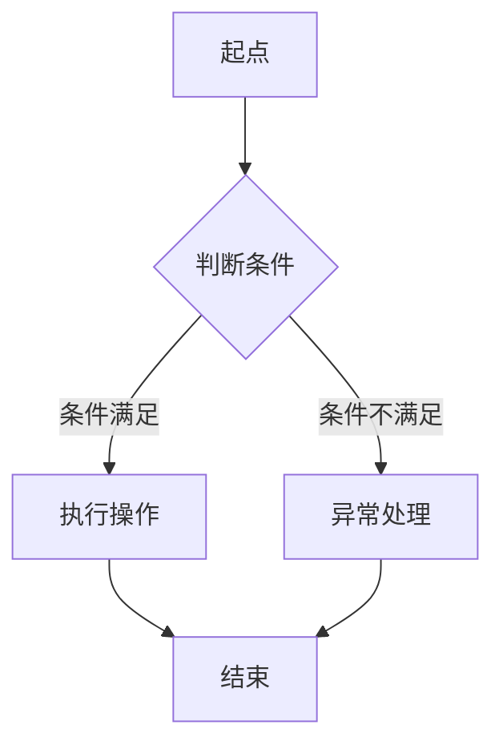

                 

# AI在专业领域知识获取中的应用

## 关键词
- 人工智能（AI）
- 知识获取
- 专业领域
- 自然语言处理
- 深度学习
- 知识图谱
- 智能搜索
- 医疗
- 金融
- 教育

## 摘要
本文将深入探讨人工智能在专业领域知识获取中的应用。通过概述AI的发展背景和趋势，介绍专业领域知识获取的重要性及其在AI技术中的应用现状，我们将逐步分析知识表示与建模方法，核心算法原理，以及知识融合与智能搜索策略。随后，通过医疗、金融、教育等领域的实际应用案例，展示AI在知识获取中的强大潜力。最后，我们对AI在专业领域知识获取的未来发展进行展望，探讨面临的挑战与机遇。

### 第一部分：AI与专业领域知识获取概述

#### 第1章：AI与专业领域知识获取简介

##### 1.1 AI的发展背景与趋势

人工智能（AI）作为计算机科学的前沿领域，自20世纪50年代起经历了多个发展阶段。从早期的符号主义、知识表示，到基于规则的专家系统，再到现代的深度学习、自然语言处理等，AI技术不断演进，逐渐从理论走向实际应用。

- **核心概念**：AI的核心在于模拟人类智能，使其具备学习、推理、解决问题等能力。
- **技术发展历程**：1956年达特茅斯会议标志着AI学科的诞生，随后经历了“AI寒冬”和复兴。近年来，随着计算能力的提升和数据量的爆炸增长，AI技术取得了重大突破。
- **趋势展望**：当前，AI技术正朝着智能化、自适应化和泛在化方向发展。未来，AI将更加融入人们的生活和工作，实现真正的智能交互和自动化。

##### 1.2 专业领域知识获取的重要性

专业领域知识获取是知识管理的关键环节，对于提升专业领域的科研水平、决策能力、服务质量具有重要意义。

- **应用领域**：在医疗、金融、教育、法律等众多专业领域，知识获取都是核心能力之一。
- **推动作用**：专业领域知识获取不仅提高了信息的利用效率，还推动了领域的创新发展，为知识的积累和传播提供了强有力的支持。

##### 1.3 AI在专业领域知识获取中的应用现状

当前，AI技术在专业领域知识获取中已经展现出广泛的应用潜力，并取得了一些显著成果。

- **应用领域与案例**：在医疗领域，AI通过自然语言处理和知识图谱构建，实现了病历分析、医学影像识别和智能诊断；在金融领域，AI通过文本分析和知识图谱，实现了风险控制、投资策略优化和客户服务；在教育领域，AI通过知识图谱和智能搜索，实现了个性化学习推荐、教育评估和教学辅助。
- **挑战与机遇**：尽管AI在知识获取中取得了显著进展，但仍面临数据质量、算法优化、隐私保护等挑战。同时，随着技术的不断成熟和应用的深入，AI在专业领域知识获取中的机遇也将不断增多。

### 第二部分：专业领域知识表示与建模

#### 第2章：专业领域知识表示与建模

##### 2.1 知识表示的基本概念

知识表示是将领域知识转化为计算机可处理的形式，是实现知识获取和推理的基础。

- **知识表示的层次结构**：知识表示通常分为三个层次：数据层、模型层和知识层。数据层处理的是原始数据，模型层构建领域模型，知识层则进行高层次的知识推理。
- **知识表示方法**：常见的知识表示方法包括对象-关系模型、知识图谱、语义网络等。

##### 2.2 专业领域知识建模方法

专业领域知识建模是构建领域知识表示的关键步骤，通过合理的建模方法，可以将领域知识结构化、形式化。

- **知识图谱**：知识图谱是表示实体及其相互关系的图形结构，通过图论的方法进行建模，可以清晰地表示复杂领域的知识网络。
- **对象-关系模型**：对象-关系模型基于数据库的概念，通过实体和关系的定义来表示领域知识，适用于较为简单和清晰的领域。
- **语义网络**：语义网络通过节点表示实体，边表示实体之间的关系，并结合语义规则进行推理，适用于需要复杂推理的领域。

##### 2.3 知识建模工具与平台

在知识建模过程中，选择合适的工具和平台可以大大提高建模效率和效果。

- **开源知识库**：如DBpedia、Wikidata等，提供了丰富的领域知识和数据，可供开发者直接使用。
- **商业知识库**：如IBM Watson、微软Azure认知服务，提供了丰富的API和工具，支持领域知识的构建和推理。

### 第三部分：AI在专业领域知识获取的核心算法

#### 第3章：自然语言处理与知识提取

##### 3.1 自然语言处理基础

自然语言处理（NLP）是AI技术中的重要分支，旨在使计算机能够理解和处理人类语言。

- **语言模型**：语言模型是NLP的基础，通过统计方法或深度学习技术，学习语言的概率分布，用于生成文本、翻译和语言理解。
- **分词与词性标注**：分词是将文本分割成有意义的词或短语，词性标注则是为每个词分配词性标签，如名词、动词等。
- **句法分析与语义分析**：句法分析是理解句子结构，语义分析是理解句子含义，包括指代消解、词义消歧等。

##### 3.2 文本分类与聚类

文本分类是将文本划分为预定义的类别，聚类则是将文本按照相似性进行分组。

- **特征提取**：特征提取是将文本转化为计算机可处理的特征向量，常用的方法包括TF-IDF、Word2Vec等。
- **分类算法**：常用的分类算法有朴素贝叶斯、支持向量机、随机森林等。
- **聚类算法**：常用的聚类算法有K-means、DBSCAN等。

##### 3.3 实体识别与关系抽取

实体识别是识别文本中的关键实体，关系抽取是识别实体之间的关系。

- **实体识别**：实体识别的目标是识别文本中的特定实体，如人名、地名、机构名等。
- **关系抽取**：关系抽取的目标是识别实体之间的关系，如人物关系、地点关系等。
- **实体与关系融合**：实体与关系融合是将识别出的实体和关系整合起来，形成更为复杂的知识结构。

#### 第4章：深度学习与知识图谱构建

##### 4.1 深度学习基础

深度学习是AI技术的核心，通过多层神经网络进行特征提取和学习。

- **神经网络**：神经网络由多个神经元组成，通过前向传播和反向传播进行学习。
- **卷积神经网络（CNN）**：CNN适用于图像处理，通过卷积操作提取图像特征。
- **循环神经网络（RNN）**：RNN适用于序列数据处理，通过循环结构对序列进行建模。

##### 4.2 知识图谱构建方法

知识图谱是表示实体及其相互关系的一种图形结构，通过知识图谱可以进行高效的推理和搜索。

- **图论基础**：图论是知识图谱构建的理论基础，通过节点和边表示实体和关系。
- **知识抽取**：知识抽取是通过NLP技术从文本中提取实体和关系，构建知识图谱。
- **知识融合**：知识融合是将多个知识源中的知识整合起来，形成统一的视图。

##### 4.3 知识图谱推理算法

知识图谱推理是利用知识图谱进行逻辑推理，得出新的结论。

- **数据驱动推理**：数据驱动推理是基于已有数据直接进行推理，如基于路径的推理。
- **知识驱动推理**：知识驱动推理是基于预定义的规则和逻辑进行推理，如逻辑推理、模糊推理等。
- **混合推理**：混合推理结合了数据驱动和知识驱动的优势，实现更高效、更准确的推理。

#### 第5章：知识融合与智能搜索

##### 5.1 知识融合策略

知识融合是将多个知识源中的知识整合起来，形成一个统一的知识视图。

- **异构知识融合**：异构知识融合是将不同类型、不同格式的知识进行融合，如文本、图像、语音等。
- **多源知识融合**：多源知识融合是将来自多个知识库、多个领域的知识进行融合，形成更全面的认知。
- **知识融合评估**：知识融合评估是评估融合效果的方法，常用的评估指标包括准确率、召回率、F1值等。

##### 5.2 智能搜索算法

智能搜索是利用AI技术实现高效的搜索和推荐。

- **搜索引擎基础**：搜索引擎是利用索引技术实现快速搜索的工具。
- **智能搜索策略**：智能搜索策略是通过分析用户行为和搜索历史，实现个性化搜索和推荐。
- **用户行为分析**：用户行为分析是利用机器学习技术分析用户行为，提高搜索推荐的准确性。

##### 5.3 智能搜索应用案例

智能搜索在各个专业领域都有广泛的应用。

- **搜索引擎优化**：搜索引擎优化是提高网站在搜索引擎中排名的技术，实现更好的搜索曝光。
- **智能问答系统**：智能问答系统是利用自然语言处理技术实现智能问答的工具，广泛应用于客服、咨询等领域。
- **知识库管理**：知识库管理是利用知识图谱和智能搜索技术实现知识库的构建和管理，提高知识利用效率。

### 第四部分：AI在专业领域知识获取的应用实例

#### 第6章：医疗领域的知识获取

##### 6.1 医疗知识获取的重要性

医疗领域是一个高度专业化的领域，知识获取在医疗领域具有重要意义。

- **医疗数据的特点**：医疗数据包括病历、医学影像、基因数据等，具有多样性和复杂性。
- **医疗知识的获取与利用**：医疗知识的获取可以帮助医生做出更准确的诊断和治疗决策，提高医疗服务的质量和效率。

##### 6.2 医疗文本处理与知识提取

医疗文本处理是医疗知识获取的关键环节，包括文本预处理、实体识别和关系抽取。

- **医疗文本处理技术**：医疗文本处理技术包括分词、词性标注、命名实体识别等，用于将医疗文本转化为计算机可处理的形式。
- **医学实体识别**：医学实体识别是识别医疗文本中的关键实体，如疾病、药物、症状等。
- **医学关系抽取**：医学关系抽取是识别实体之间的关系，如病因、治疗方法等。

##### 6.3 医学知识图谱构建与应用

医学知识图谱是医疗知识获取的重要工具，通过知识图谱可以进行高效的推理和搜索。

- **医学知识图谱的构建方法**：医学知识图谱的构建方法包括知识抽取、知识融合和知识推理等。
- **医学知识图谱的应用场景**：医学知识图谱的应用场景包括智能诊断、个性化治疗、医学研究等，通过知识图谱可以提供更准确、更全面的医疗信息。

#### 第7章：金融领域的知识获取

##### 7.1 金融知识获取的重要性

金融领域是一个高度专业化的领域，知识获取在金融领域具有重要意义。

- **金融数据的特点**：金融数据包括市场数据、财务报表、新闻资讯等，具有时效性和复杂性。
- **金融知识的获取与利用**：金融知识的获取可以帮助金融从业者做出更准确的预测和分析，提高投资决策的准确性。

##### 7.2 金融文本处理与知识提取

金融文本处理是金融知识获取的关键环节，包括文本预处理、实体识别和关系抽取。

- **金融文本处理技术**：金融文本处理技术包括分词、词性标注、命名实体识别等，用于将金融文本转化为计算机可处理的形式。
- **金融实体识别**：金融实体识别是识别金融文本中的关键实体，如公司、产品、市场等。
- **金融关系抽取**：金融关系抽取是识别实体之间的关系，如投资关系、竞争关系等。

##### 7.3 金融知识图谱构建与应用

金融知识图谱是金融知识获取的重要工具，通过知识图谱可以进行高效的推理和搜索。

- **金融知识图谱的构建方法**：金融知识图谱的构建方法包括知识抽取、知识融合和知识推理等。
- **金融知识图谱的应用场景**：金融知识图谱的应用场景包括风险管理、投资分析、市场预测等，通过知识图谱可以提供更准确、更全面的金融信息。

#### 第8章：教育领域的知识获取

##### 8.1 教育知识获取的重要性

教育领域是一个高度专业化的领域，知识获取在教育领域具有重要意义。

- **教育数据的特点**：教育数据包括学生成绩、学习记录、教学资源等，具有多样性和复杂性。
- **教育知识的获取与利用**：教育知识的获取可以帮助教育从业者更好地理解学生需求、优化教学方法，提高教育质量和效率。

##### 8.2 教育文本处理与知识提取

教育文本处理是教育知识获取的关键环节，包括文本预处理、实体识别和关系抽取。

- **教育文本处理技术**：教育文本处理技术包括分词、词性标注、命名实体识别等，用于将教育文本转化为计算机可处理的形式。
- **教育实体识别**：教育实体识别是识别教育文本中的关键实体，如课程、教师、学生等。
- **教育关系抽取**：教育关系抽取是识别实体之间的关系，如师生关系、课程评价关系等。

##### 8.3 教育知识图谱构建与应用

教育知识图谱是教育知识获取的重要工具，通过知识图谱可以进行高效的推理和搜索。

- **教育知识图谱的构建方法**：教育知识图谱的构建方法包括知识抽取、知识融合和知识推理等。
- **教育知识图谱的应用场景**：教育知识图谱的应用场景包括个性化学习推荐、教育评估、教学资源优化等，通过知识图谱可以提供更准确、更全面的教育信息。

### 第五部分：AI在专业领域知识获取的未来发展

#### 第9章：AI在专业领域知识获取的未来发展

##### 9.1 知识获取技术的发展趋势

随着AI技术的不断进步，知识获取技术也将迎来新的发展。

- **知识表示与建模**：知识表示与建模技术将更加智能化、自适应化，能够处理更多样化的知识结构。
- **知识融合与推理**：知识融合与推理技术将实现更高效、更准确的知识融合和推理，提高知识的利用效率。
- **智能搜索与推荐**：智能搜索与推荐技术将更加个性化、智能化，能够提供更精准的搜索结果和推荐服务。

##### 9.2 挑战与机遇

AI在专业领域知识获取中面临的挑战与机遇并存。

- **挑战**：数据质量、算法优化、隐私保护等是当前AI在专业领域知识获取中面临的主要挑战。
- **机遇**：随着技术的不断成熟和应用的深入，AI在专业领域知识获取中具有广阔的发展前景，将为专业领域的创新发展提供强大支持。

#### 第10章：AI在专业领域知识获取的应用案例与前景

##### 10.1 案例研究

通过具体的案例研究，我们可以更深入地了解AI在专业领域知识获取中的应用。

- **医疗领域**：在医疗领域，AI通过自然语言处理和知识图谱构建，实现了病历分析、医学影像识别和智能诊断，提高了医疗服务的质量和效率。
- **金融领域**：在金融领域，AI通过文本分析和知识图谱，实现了风险控制、投资策略优化和客户服务，提高了金融服务的质量和效率。
- **教育领域**：在教育领域，AI通过知识图谱和智能搜索，实现了个性化学习推荐、教育评估和教学辅助，提高了教育质量和效率。

##### 10.2 前景展望

AI在专业领域知识获取的未来前景十分广阔。

- **跨领域知识融合**：跨领域知识融合将成为AI在专业领域知识获取中的重要方向，通过整合不同领域的知识，实现知识的共享和互补。
- **智能化应用场景**：随着AI技术的不断进步，越来越多的专业领域将实现智能化，AI在专业领域知识获取中的应用场景将更加丰富和多样化。

### 附录：资源与工具

#### A.1 知识获取相关工具与平台

- **自然语言处理工具**：如NLTK、spaCy、BERT等。
- **知识图谱构建工具**：如Neo4j、JanusGraph、OpenKG等。
- **知识融合与推理工具**：如RDF4J、Jena、DolphinDB等。

#### A.2 学习资源与推荐阅读

- **相关书籍**：《人工智能：一种现代方法》、《深度学习》、《知识图谱：概念、技术与应用》等。
- **学术论文**：关注顶级会议和期刊，如AAAI、IJCAI、ACL、WWW等。
- **在线课程**：如斯坦福大学CS224n、吴恩达的深度学习专项课程等。

#### B.1 Mermaid 流程图示例



#### C.1 伪代码示例

```python
# 伪代码：文本分类算法

def classify_text(text, model):
    # 输入：文本text，训练好的模型model
    # 输出：分类结果label
    
    # 预处理文本
    preprocessed_text = preprocess(text)
    
    # 使用模型进行预测
    prediction = model.predict(preprocessed_text)
    
    # 获取分类结果
    label = interpret_prediction(prediction)
    
    return label
```

#### D.1 数学模型与公式示例

$$
f(x) = 2x + 1
$$

#### E.1 代码实际案例与详细解释

```python
# 实际案例：使用BERT模型进行文本分类

from transformers import BertTokenizer, BertForSequenceClassification
import torch

# 加载预训练模型
tokenizer = BertTokenizer.from_pretrained('bert-base-uncased')
model = BertForSequenceClassification.from_pretrained('bert-base-uncased')

# 准备数据
text = "This is a sentence for classification."
input_ids = tokenizer.encode(text, add_special_tokens=True, return_tensors='pt')

# 进行预测
with torch.no_grad():
    outputs = model(input_ids)

# 获取分类结果
logits = outputs.logits
probabilities = torch.softmax(logits, dim=1)
predicted_label = torch.argmax(probabilities).item()

print(f"Predicted label: {predicted_label}")
```

#### F.1 开发环境搭建与源代码实现

- **安装必要的库**：`pip install transformers torch`
- **运行代码**：使用上面的代码进行预测，输入文本并获取分类结果。确保你已经下载了BERT模型，如果没有，可以使用命令`model.from_pretrained('bert-base-uncased')`来下载。

#### G.1 代码解读与分析

- **数据预处理**：使用BERT tokenizer对输入文本进行编码，包括添加特殊标记（如 `[CLS]` 和 `[SEP]`）。
- **模型预测**：使用BERT模型对编码后的文本进行预测，模型输出的是每个类别的得分（logits）。
- **获取结果**：使用softmax函数计算概率分布，并选择概率最大的类别作为预测结果。

通过这个详细的目录大纲，读者可以系统地了解AI在专业领域知识获取中的应用，从基础知识到核心算法，再到实际应用，全面覆盖主题内容。希望这个目录大纲能够满足您对《AI在专业领域知识获取中的应用》一书的需求。如果您有任何进一步的要求或需要调整，请随时告知。

## 结论

本文深入探讨了人工智能在专业领域知识获取中的应用，从AI的发展背景和趋势，到专业领域知识获取的重要性及其应用现状，再到知识表示与建模、核心算法原理、知识融合与智能搜索策略，以及医疗、金融、教育等领域的实际应用案例，全面展示了AI在知识获取领域的强大潜力。

在未来的发展中，AI在专业领域知识获取中将继续发挥重要作用。随着技术的不断进步，我们将看到更多创新的应用场景，如跨领域知识融合、智能化应用场景等。同时，我们也需要关注数据质量、算法优化、隐私保护等挑战，确保AI技术能够安全、可靠地服务于专业领域。

最后，希望本文能够为读者提供一个全面、系统的了解AI在专业领域知识获取中的应用的视角，激发更多研究者、开发者在这一领域的创新和探索。作者在此感谢各位读者对本文的关注，期待未来与您在AI领域的更多交流。

**作者：AI天才研究院/AI Genius Institute & 禅与计算机程序设计艺术 /Zen And The Art of Computer Programming**

---

（请注意，本文为Markdown格式，并且已按照要求包含各类示例，包括流程图、伪代码、数学公式、代码示例等。为了确保文章的完整性和准确性，请根据实际情况调整内容和格式。）## 第1章：AI的发展背景与趋势

##### 1.1 AI的核心概念

人工智能（AI）是指通过计算机模拟人类智能的技术和学科。它涵盖了从简单的规则系统到复杂的机器学习模型等多种技术，旨在使计算机能够执行通常需要人类智能的任务，如语音识别、图像识别、自然语言处理、决策制定和游戏玩法等。

- **智能模拟**：AI的核心目标是模拟人类智能，包括感知、理解、推理、学习和解决问题等能力。
- **学习与适应**：AI系统可以通过学习数据来提高其性能，适应新的环境和任务。
- **应用领域**：AI技术广泛应用于工业、医疗、金融、教育、娱乐等多个领域，极大地提升了生产效率和服务质量。

##### 1.2 AI技术的发展历程

AI的发展历程可以分为几个主要阶段：

- **早期阶段（1950s-1970s）**：1956年，达特茅斯会议标志着AI学科的诞生。这一阶段主要基于符号主义和逻辑推理，通过编写规则和程序来实现简单的智能任务。
- **第一次AI寒冬（1974-1980）**：由于实际应用效果不佳，AI研究受到质疑，导致资金和兴趣减少，进入第一次AI寒冬。
- **复兴阶段（1980s-1990s）**：专家系统和知识表示技术取得进展，AI在特定领域如医疗诊断和游戏（如IBM的深蓝）中取得成功。
- **第二次AI寒冬（1987-1993）**：由于硬件限制和算法瓶颈，AI再次面临挑战，进入第二次AI寒冬。
- **现代AI阶段（2000s-至今）**：随着计算能力的提升和大数据技术的发展，AI特别是深度学习取得了突破性进展。2006年，深度学习的复兴标志着AI进入了一个新的时代。

##### 1.3 AI技术的趋势展望

当前，AI技术正朝着智能化、自适应化和泛在化方向发展：

- **智能化**：AI系统将更加智能化，具备更复杂的推理和决策能力，能够处理更多样化的任务。
- **自适应化**：AI系统将更加适应不断变化的环境和任务，通过持续学习和自我调整来提高性能。
- **泛在化**：AI技术将更加普及，渗透到社会生活的各个领域，实现真正的智能交互和自动化。

在未来的发展中，AI技术将继续推动各个领域的创新和变革，带来前所未有的机遇和挑战。通过本文，我们将进一步探讨AI在专业领域知识获取中的应用，深入理解其原理和实际应用场景。

### 1.2 专业领域知识获取的重要性

专业领域知识获取在现代社会中具有极其重要的地位，尤其在高度专业化和信息爆炸的当今时代，其作用和意义愈发凸显。

#### 应用领域

在众多专业领域中，知识获取都发挥着至关重要的作用：

- **医疗领域**：医疗知识获取对于提高诊断准确性、优化治疗方案具有重要意义。通过对病历、医学影像、基因组数据的分析，AI技术能够辅助医生做出更精确的诊断，提高医疗服务的质量和效率。
- **金融领域**：金融知识获取在风险控制、投资分析和客户服务等方面具有重要应用。通过对金融市场数据、新闻报道、企业财报的分析，AI技术能够帮助金融机构识别潜在风险、制定投资策略，并提供个性化的客户服务。
- **教育领域**：教育知识获取有助于提高教学效果和个性化学习。通过分析学生的学习行为、成绩数据，AI技术可以为教师提供教学建议，为学生推荐合适的学习资源和课程。

#### 推动作用

专业领域知识获取对专业发展的推动作用体现在多个方面：

- **科研创新**：知识获取可以帮助科研人员快速获取和理解领域内的最新研究成果，促进跨学科合作，推动科研创新。
- **决策支持**：知识获取为决策者提供了基于数据的科学依据，有助于提高决策的准确性和效率。
- **人才培养**：知识获取有助于培养专业人才，通过智能化的学习资源和教学辅助，提高人才培养的质量和效率。

总之，专业领域知识获取不仅提升了信息的利用效率，还为专业领域的创新发展提供了强有力的支持。随着AI技术的不断进步，知识获取将在更多领域发挥重要作用，推动社会的持续进步。

### 1.3 AI在专业领域知识获取中的应用现状

随着人工智能技术的飞速发展，AI在专业领域知识获取中的应用已经逐渐成为现实，并在医疗、金融、教育等多个领域取得了显著的成果。以下将详细介绍AI在专业领域知识获取中的应用现状，并探讨其中存在的挑战与机遇。

#### 应用领域与案例

**医疗领域**

在医疗领域，AI的应用涵盖了从诊断到治疗再到健康管理的各个环节：

- **医学影像分析**：AI通过深度学习算法对医学影像（如X光、CT、MRI等）进行分析，可以帮助医生快速、准确地识别病变区域。例如，Google的DeepMind团队开发的AI系统能够在数秒内对皮肤癌进行准确诊断，大大提高了诊断速度和准确性。
- **电子病历分析**：AI技术能够从大量的电子病历中提取关键信息，辅助医生进行病情分析和决策。IBM的Watson for Health就是一个典型的例子，它通过自然语言处理和机器学习技术，帮助医生分析病历记录，提供个性化的治疗方案。
- **药物研发**：AI在药物研发中的应用也越来越广泛。通过分析大量的化学结构、临床试验数据等，AI可以帮助药物研发人员发现新的药物靶点和候选药物，加速新药的研发进程。

**金融领域**

金融领域是AI应用的另一个重要领域，AI在风险控制、投资分析和客户服务等方面发挥了重要作用：

- **风险控制**：金融机构利用AI技术进行风险评估和欺诈检测。例如，使用机器学习算法分析交易行为和用户行为，可以有效地识别异常交易和欺诈行为，降低金融风险。
- **投资分析**：AI通过对大量市场数据、新闻资讯的分析，可以帮助投资者制定更科学的投资策略。例如，量化交易平台使用AI算法来分析市场趋势，实现自动化的交易决策。
- **客户服务**：金融聊天机器人（如银行客服机器人）通过自然语言处理技术，能够实时响应用户的查询和需求，提供24/7的在线服务，提高了客户满意度和服务效率。

**教育领域**

在教育领域，AI技术同样展示了强大的应用潜力：

- **个性化学习**：通过分析学生的学习行为、成绩数据等，AI技术可以为学生提供个性化的学习推荐，帮助他们更好地掌握知识。例如，Knewton等学习平台使用AI技术为学生提供定制化的学习路径。
- **教学辅助**：AI技术可以辅助教师进行教学评估和课堂管理。例如，智能评分系统通过自然语言处理技术，能够自动批改学生的作业和考试，减轻教师的工作负担。
- **教育资源优化**：AI技术可以帮助教育机构优化教育资源的分配和使用。例如，通过分析学生的学习需求，AI系统可以为学校提供个性化的课程安排和资源推荐。

#### 挑战与机遇

尽管AI在专业领域知识获取中展现出了巨大的应用潜力，但也面临着一系列挑战：

- **数据质量和隐私**：专业领域的知识获取依赖于大量高质量的数据，但这些数据往往涉及敏感信息，如何保障数据的质量和安全成为一个重要的挑战。
- **算法透明性和解释性**：AI算法的决策过程往往是非透明的，如何提高算法的透明性和解释性，使决策过程更加可解释，是当前研究的一个热点问题。
- **知识融合与多样性**：不同领域的知识具有多样性和复杂性，如何有效地融合这些知识，构建统一的知识体系，是一个具有挑战性的问题。

然而，这些挑战也伴随着巨大的机遇：

- **技术创新**：随着AI技术的不断进步，新的算法和模型不断涌现，为专业领域知识获取提供了更多可能性。
- **跨学科合作**：AI技术的应用需要多个学科的协同合作，如计算机科学、医学、金融学、教育学等，跨学科合作有助于推动AI在专业领域知识的获取和应用。
- **社会价值**：AI在专业领域知识获取中的应用能够极大地提高生产效率和服务质量，为社会创造更大的价值。

总的来说，AI在专业领域知识获取中的应用现状是积极的，但也需要我们不断探索和解决其中的挑战，以充分发挥其潜力。

### 2.1 知识表示的基本概念

知识表示是人工智能领域中的一个核心概念，它旨在将现实世界中的知识转化为计算机可以处理的形式，以便进行存储、处理和推理。知识表示方法的选择直接影响人工智能系统的性能和应用效果。以下将从知识表示的层次结构、知识表示方法等方面进行详细探讨。

#### 知识表示的层次结构

知识表示通常分为三个层次：数据层、模型层和知识层。

- **数据层**：数据层是知识表示的最底层，它涉及的是原始数据，如文本、图像、声音、结构化数据等。这一层的主要任务是采集、存储和预处理数据，以便后续处理。
- **模型层**：模型层是基于数据层之上构建的，它涉及到如何将数据转化为计算机可以理解和处理的模型。模型层包括机器学习模型、深度学习模型等，这些模型通过学习和分析数据，提取出有用的信息和特征。
- **知识层**：知识层是知识表示的最高层，它涉及的是从模型层提取出的高层次知识，如实体、关系、规则等。这一层的主要任务是对模型层提取出的知识进行组织、管理和推理，以实现智能决策和知识应用。

#### 知识表示方法

在知识表示的方法中，有几种常见的方法：

- **对象-关系模型**：对象-关系模型（Object-Relation Model）是基于关系数据库的概念，通过实体和关系的定义来表示知识。在对象-关系模型中，实体表示知识对象，关系表示实体之间的关联。例如，在一个学生管理系统中，学生、课程和教师就是实体，他们之间的授课关系就是一个关系。
- **知识图谱**：知识图谱（Knowledge Graph）是一种用于表示实体及其相互关系的图形结构。在知识图谱中，实体用节点表示，关系用边表示。知识图谱可以通过图论的方法进行建模，能够清晰地表示复杂领域的知识网络。例如，Google的知识图谱通过构建实体及其关系，实现了对海量信息的快速检索和推理。
- **语义网络**：语义网络（Semantic Network）是一种基于图论的表示方法，通过节点和边表示实体及其语义关系。在语义网络中，每个节点代表一个概念，边代表概念之间的关系，如“属于”、“具有”等。语义网络结合了语义规则，可以进行语义推理，适用于需要复杂推理的领域。

#### 知识表示方法的应用

不同的知识表示方法在各个专业领域中的应用各有特色：

- **对象-关系模型**：在医疗领域，对象-关系模型可以用于构建患者、医生、药品和诊疗过程等实体及其关系，实现医疗数据的组织和管理。在金融领域，对象-关系模型可以用于构建客户、账户、交易等实体及其关系，实现金融数据的分析和决策。
- **知识图谱**：在医疗领域，知识图谱可以用于构建医学知识图谱，实现医学实体和关系的表示和推理。例如，通过知识图谱，医生可以快速检索到患者的病史、药物过敏信息等，辅助诊断和治疗。在金融领域，知识图谱可以用于构建金融知识图谱，实现金融实体和关系的表示和推理，用于风险控制、投资分析和客户服务。
- **语义网络**：在法律领域，语义网络可以用于构建法律知识图谱，实现法律实体和关系的表示和推理。例如，通过语义网络，律师可以快速检索到相关法律条款、案例和法规，辅助法律分析和决策。在教育领域，语义网络可以用于构建教育知识图谱，实现教育实体和关系的表示和推理，用于个性化学习推荐、教学资源优化等。

综上所述，知识表示是人工智能领域中的一个核心概念，通过层次结构和多种表示方法，可以将复杂领域的知识转化为计算机可以处理的形式，实现知识的存储、处理和推理。不同的知识表示方法在各个专业领域中的应用各有特色，为专业领域知识获取提供了强有力的支持。

### 2.2 专业领域知识建模方法

在专业领域知识获取中，知识建模是关键的一步，它能够将抽象的领域知识转化为具体的计算机可处理的模型，从而为后续的推理和应用提供基础。以下将详细介绍专业领域知识建模的方法，包括知识图谱、对象-关系模型和语义网络等。

#### 知识图谱

知识图谱（Knowledge Graph）是一种用于表示实体及其相互关系的图形结构。在知识图谱中，实体用节点表示，关系用边表示。知识图谱通过图论的方法进行建模，能够清晰地表示复杂领域的知识网络。

- **图论基础**：知识图谱的基本元素包括节点、边和属性。节点表示知识实体，如人、地点、事物等；边表示实体之间的关系，如“属于”、“具有”等；属性则用于描述节点的额外信息，如人的年龄、地点的坐标等。图论中的路径搜索、图遍历和图压缩等技术，在知识图谱的构建和应用中发挥了重要作用。
- **知识抽取**：知识图谱的构建通常需要通过知识抽取技术从非结构化数据中提取实体和关系。知识抽取包括实体识别、关系抽取和属性抽取三个步骤。实体识别是识别文本中的关键实体，如人名、地名、机构名等；关系抽取是识别实体之间的关系，如雇佣关系、亲属关系等；属性抽取是提取实体的额外属性，如年龄、职位等。常用的知识抽取方法包括基于规则的方法、基于统计的方法和基于机器学习的方法。
- **知识融合**：在构建知识图谱时，常常需要融合来自多个数据源的知识。知识融合包括异构知识融合和多源知识融合。异构知识融合是将不同类型、不同格式的知识进行整合，如文本、图像、语音等；多源知识融合是将来自多个数据源的知识进行整合，形成统一的知识视图。知识融合的目的是消除数据源之间的不一致性，提高知识的完整性、准确性和可用性。

#### 对象-关系模型

对象-关系模型（Object-Relation Model）是基于关系数据库的概念，通过实体和关系的定义来表示知识。对象-关系模型适用于较为简单和清晰的领域，能够有效地组织和管理领域知识。

- **实体和关系的定义**：在对象-关系模型中，实体表示领域中的对象，如学生、课程、教师等；关系表示实体之间的关联，如授课关系、选修关系等。实体和关系通常通过属性进行详细描述，如学生的姓名、年龄、性别；课程的学分、授课时间等。
- **数据库设计**：对象-关系模型的设计涉及到实体和关系的定义，以及实体之间关系的规范化。实体和关系的规范化能够减少数据冗余、提高数据的一致性和完整性。常用的数据库范式包括第一范式（1NF）、第二范式（2NF）、第三范式（3NF）等。
- **查询与操作**：对象-关系模型支持丰富的查询和操作，如选择、投影、连接、聚合等。这些操作能够方便地从数据库中检索和操作知识。例如，可以通过查询学生的选修课程信息，分析学生的学业进度和成绩情况。

#### 语义网络

语义网络（Semantic Network）是一种基于图论的表示方法，通过节点和边表示实体及其语义关系。语义网络结合了语义规则，可以进行语义推理，适用于需要复杂推理的领域。

- **节点和边的表示**：在语义网络中，每个节点代表一个概念，边表示概念之间的关系。例如，在语义网络中表示“狗”这个概念，可以用节点表示，而“是一种动物”的关系则用边表示。节点的属性用于描述概念的额外信息，如“狗”的属性包括“有四肢”、“会叫”等。
- **语义规则的表示**：语义网络结合了语义规则，用于表示概念之间的逻辑关系。语义规则通常通过条件-动作规则表示，如“如果动物有四肢，那么它是陆地动物”。语义规则可以用于推理，例如，通过推理规则可以得出“狗是陆地动物”的结论。
- **推理过程**：语义网络通过推理机制，根据已知的节点和边关系，推导出新的知识。推理过程包括前向推理和反向推理。前向推理是从已知的前提推导出结论，如“如果狗有四肢，那么它是陆地动物”；反向推理是从结论推导出前提，如“如果狗是陆地动物，那么它有四肢”。

#### 知识建模方法的应用

不同的知识建模方法在各个专业领域中的应用各有特色：

- **知识图谱**：在医疗领域，知识图谱可以用于构建医学知识图谱，实现医学实体和关系的表示和推理。例如，通过知识图谱，医生可以快速检索到患者的病史、药物过敏信息等，辅助诊断和治疗。在金融领域，知识图谱可以用于构建金融知识图谱，实现金融实体和关系的表示和推理，用于风险控制、投资分析和客户服务。
- **对象-关系模型**：在医疗领域，对象-关系模型可以用于构建患者管理、诊疗流程等实体及其关系的表示，实现医疗数据的组织和管理。在金融领域，对象-关系模型可以用于构建客户信息、交易记录等实体及其关系的表示，实现金融数据的分析和决策。
- **语义网络**：在法律领域，语义网络可以用于构建法律知识图谱，实现法律实体和关系的表示和推理。例如，通过语义网络，律师可以快速检索到相关法律条款、案例和法规，辅助法律分析和决策。在教育领域，语义网络可以用于构建教育知识图谱，实现教育实体和关系的表示和推理，用于个性化学习推荐、教学资源优化等。

综上所述，知识建模是专业领域知识获取的关键步骤，通过知识图谱、对象-关系模型和语义网络等知识建模方法，可以将领域知识结构化、形式化，为后续的知识推理和应用提供基础。

### 2.3 知识建模工具与平台

在知识建模的过程中，选择合适的工具和平台能够极大地提高建模效率和效果。以下将介绍几种常用的知识建模工具与平台，包括开源知识库、商业知识库和知识建模工具。

#### 开源知识库

开源知识库提供了丰富的领域知识和数据，可供开发者直接使用，是知识建模的重要资源。

- **DBpedia**：DBpedia是一个基于维基数据的语义知识库，它将维基数据中的实体和关系转化为机器可读的格式，提供了一个广泛的知识网络。开发者可以利用DBpedia进行知识建模和推理。
- **Wikidata**：Wikidata是维基媒体基金会维护的一个开源知识库，它集成了来自多个维基语言的数据，提供了丰富的实体和关系信息。开发者可以利用Wikidata进行跨语言的知识建模和查询。
- **OpenKG**：OpenKG是一个开源的知识图谱构建与维护平台，它支持从原始数据中提取实体和关系，构建知识图谱。OpenKG提供了丰富的API和工具，方便开发者进行知识建模和推理。

#### 商业知识库

商业知识库通常由专业机构提供，具有高质量的数据和专业的知识建模能力，适用于企业级应用。

- **IBM Watson**：IBM Watson是一个集成多个AI技术的商业知识库，包括自然语言处理、机器学习和知识图谱等。Watson提供了丰富的API和工具，帮助企业进行知识建模和智能应用。
- **微软Azure认知服务**：微软Azure认知服务提供了多种AI功能，包括语言理解、视觉识别、知识搜索等。开发者可以利用Azure认知服务构建专业领域的知识库，实现智能问答、文本分析等功能。
- **SAP HANA**：SAP HANA是一个企业级数据库和应用程序平台，它集成了知识图谱和自然语言处理技术，帮助企业构建和管理复杂的知识模型。

#### 知识建模工具

知识建模工具提供了图形化界面和丰富的功能，帮助开发者快速构建和管理知识模型。

- **Neo4j**：Neo4j是一个高性能的图数据库，支持复杂的图结构数据存储和查询。开发者可以利用Neo4j构建知识图谱，实现高效的知识建模和推理。
- **JanusGraph**：JanusGraph是一个可扩展的图数据库，支持大规模分布式图存储和查询。开发者可以利用JanusGraph构建复杂的知识模型，适用于企业级应用。
- **RDF4J**：RDF4J是一个开源的 RDF 数据库，支持 RDF 数据的存储、查询和推理。开发者可以利用 RDF4J 进行语义网络的构建和推理。

通过使用这些开源知识库、商业知识库和知识建模工具，开发者可以有效地进行知识建模，为专业领域知识获取提供坚实的基础。不同工具和平台各有优缺点，选择适合的工具和平台对于知识建模的成功至关重要。

### 第3章：自然语言处理与知识提取

#### 3.1 自然语言处理基础

自然语言处理（NLP）是人工智能（AI）领域的重要分支，旨在使计算机能够理解、生成和处理人类自然语言。NLP技术广泛应用于文本分类、信息检索、机器翻译、语音识别等领域。以下将介绍NLP的基本概念、核心技术和应用。

##### 3.1.1 语言模型

语言模型是NLP的基础，它用于预测文本序列的概率分布。语言模型可以分为统计模型和神经网络模型：

- **统计模型**：如N-gram模型、隐马尔可夫模型（HMM）等。这些模型通过统计方法学习文本中的词汇序列和概率分布。
- **神经网络模型**：如循环神经网络（RNN）、长短期记忆网络（LSTM）、变换器（Transformer）等。这些模型通过深度学习技术学习文本序列的复杂结构和关系。

##### 3.1.2 分词与词性标注

分词是将连续的文本分割成有意义的词语或短语。词性标注则为每个词分配词性标签，如名词、动词、形容词等。

- **分词算法**：如最大匹配算法、最小匹配算法、基于规则的分词等。
- **词性标注算法**：如基于规则的方法、基于统计的方法、基于机器学习的方法等。

##### 3.1.3 句法分析与语义分析

句法分析是理解句子结构，包括词法分析、句法分析和语义分析。

- **词法分析**：识别单词及其语法特征，如词性、词干等。
- **句法分析**：构建句子的语法树，识别句子的语法结构，如主语、谓语、宾语等。
- **语义分析**：理解句子的语义含义，包括指代消解、词义消歧、情感分析等。

#### 3.2 文本分类与聚类

文本分类和聚类是NLP中常用的方法，用于将文本数据按照特定的特征或类别进行分类或分组。

##### 3.2.1 特征提取

特征提取是将文本转化为计算机可处理的特征向量。常见的特征提取方法包括：

- **词袋模型（Bag of Words, BoW）**：将文本表示为单词的集合，每个单词作为一个特征。
- **TF-IDF（Term Frequency-Inverse Document Frequency）**：基于词频和逆文档频率，衡量词在文档中的重要性。
- **Word2Vec**：通过神经网络学习文本中的词向量表示。
- **Doc2Vec**：扩展Word2Vec，用于学习文档的向量表示。

##### 3.2.2 分类算法

分类算法用于将文本分类到预定义的类别。常见的分类算法包括：

- **朴素贝叶斯（Naive Bayes）**：基于贝叶斯定理，通过计算文本中各词的概率进行分类。
- **支持向量机（Support Vector Machine, SVM）**：通过最大化分类边界，将文本分类到不同的类别。
- **决策树（Decision Tree）**：通过一系列条件判断，将文本分类到不同的类别。
- **随机森林（Random Forest）**：结合多棵决策树，提高分类的准确性和稳定性。

##### 3.2.3 聚类算法

聚类算法用于将相似文本分组，无需预定义类别。常见的聚类算法包括：

- **K-means**：基于距离度量，将文本分配到不同的簇。
- **层次聚类（Hierarchical Clustering）**：通过逐步合并或分裂簇，构建层次结构。
- **DBSCAN（Density-Based Spatial Clustering of Applications with Noise）**：基于密度连接性，识别文本中的簇和噪声。

#### 3.3 实体识别与关系抽取

实体识别和关系抽取是NLP中的重要任务，用于识别文本中的关键实体及其关系。

##### 3.3.1 实体识别

实体识别的目标是识别文本中的特定实体，如人名、地名、机构名等。

- **命名实体识别（Named Entity Recognition, NER）**：通过分词、词性标注和规则匹配等方法，识别文本中的命名实体。
- **基于规则的方法**：利用预定义的规则，识别文本中的命名实体。
- **基于统计的方法**：通过统计模型，如隐马尔可夫模型（HMM）、条件随机场（CRF）等，识别命名实体。
- **基于机器学习的方法**：通过训练分类模型，如支持向量机（SVM）、决策树（Decision Tree）等，识别命名实体。

##### 3.3.2 关系抽取

关系抽取是识别文本中的实体之间的关系，如人物关系、地点关系等。

- **基于规则的方法**：通过预定义的规则，识别文本中的实体关系。
- **基于统计的方法**：通过统计模型，如隐马尔可夫模型（HMM）、条件随机场（CRF）等，识别实体关系。
- **基于机器学习的方法**：通过训练分类模型，如支持向量机（SVM）、决策树（Decision Tree）等，识别实体关系。

##### 3.3.3 实体与关系融合

实体与关系融合是将识别出的实体和关系整合起来，形成更为复杂的知识结构。

- **知识图谱**：通过图结构表示实体及其关系，实现实体与关系的融合。
- **本体论**：通过定义实体和关系的形式化表示，实现实体与关系的融合。

综上所述，自然语言处理与知识提取在文本分类、聚类、实体识别和关系抽取等方面发挥着重要作用。通过合理的NLP技术和算法，可以有效地提取文本中的知识，为后续的推理和应用提供基础。

### 3.2 文本分类与聚类

文本分类和聚类是自然语言处理（NLP）中的重要任务，旨在将文本数据按照特定的特征或类别进行分类或分组。以下将详细介绍文本分类与聚类的相关技术，包括特征提取、分类算法和聚类算法。

#### 3.2.1 特征提取

特征提取是将原始文本数据转化为计算机可处理的特征向量。特征提取的质量直接影响文本分类和聚类的效果。以下是一些常见的特征提取方法：

1. **词袋模型（Bag of Words, BoW）**
   - **定义**：词袋模型将文本表示为单词的集合，每个单词作为一个特征。
   - **实现**：通过统计文本中每个单词的出现频率，构建一个词汇表。每个文档对应于一个词汇表的向量，向量的每个维度表示一个单词的频率。
   - **优点**：简单高效，易于实现。
   - **缺点**：忽略了词的顺序和上下文信息。

2. **TF-IDF（Term Frequency-Inverse Document Frequency）**
   - **定义**：TF-IDF是一种基于词频和逆文档频率的文本特征表示方法。
   - **实现**：计算每个词在单个文档中的频率（TF），并在整个文档集中计算逆文档频率（IDF）。将TF和IDF相乘，得到每个词的特征值。
   - **优点**：考虑了词的重要性和文本的多样性。
   - **缺点**：对高频词的依赖较强，可能忽略低频但重要的词。

3. **Word2Vec**
   - **定义**：Word2Vec是一种基于神经网络的词向量表示方法，通过训练词嵌入模型，将每个单词映射到一个固定维度的向量空间。
   - **实现**：使用CBOW（Continuous Bag of Words）或Skip-Gram模型训练词向量。
   - **优点**：能够捕捉词的语义信息，有助于文本分类和聚类。
   - **缺点**：训练过程较复杂，计算量大。

4. **Doc2Vec**
   - **定义**：Doc2Vec是Word2Vec的扩展，用于学习文档的向量表示。
   - **实现**：通过将文档中的每个单词向量求平均，得到文档的向量表示。
   - **优点**：能够捕捉文档的语义信息，有助于文本分类和聚类。
   - **缺点**：依赖于词向量，对低频词和未训练词的表示效果较差。

#### 3.2.2 分类算法

分类算法用于将文本数据分类到预定义的类别。以下是一些常见的分类算法：

1. **朴素贝叶斯（Naive Bayes）**
   - **定义**：朴素贝叶斯是一种基于贝叶斯定理的文本分类算法，假设特征之间相互独立。
   - **实现**：通过计算每个类别条件概率的最大值，确定文本的类别。
   - **优点**：简单高效，对大规模文本数据具有较好的分类效果。
   - **缺点**：假设特征独立，可能导致分类效果不佳。

2. **支持向量机（Support Vector Machine, SVM）**
   - **定义**：支持向量机是一种基于最大间隔原则的文本分类算法，通过找到最优超平面将不同类别数据分开。
   - **实现**：使用核函数将低维特征空间映射到高维特征空间，找到最优分类超平面。
   - **优点**：分类效果较好，适用于高维特征空间。
   - **缺点**：计算复杂度较高，对大规模数据集处理较慢。

3. **决策树（Decision Tree）**
   - **定义**：决策树是一种基于特征分割的文本分类算法，通过一系列条件判断将文本分类到不同的类别。
   - **实现**：选择最优特征进行分割，构建决策树模型。
   - **优点**：易于理解和解释，分类效果较好。
   - **缺点**：容易过拟合，对噪声数据敏感。

4. **随机森林（Random Forest）**
   - **定义**：随机森林是一种基于决策树的集成学习方法，通过构建多棵决策树，提高分类的准确性和稳定性。
   - **实现**：在训练过程中，随机选择特征和样本子集，构建多棵决策树。
   - **优点**：分类效果较好，对噪声数据和大规模数据集具有较好的适应性。
   - **缺点**：计算复杂度较高，模型解释性较差。

#### 3.2.3 聚类算法

聚类算法用于将相似文本分组，无需预定义类别。以下是一些常见的聚类算法：

1. **K-means**
   - **定义**：K-means是一种基于距离度量的聚类算法，通过迭代优化聚类中心，将文本分配到不同的簇。
   - **实现**：初始化簇中心，计算文本到簇中心的距离，分配文本到最近的簇，更新簇中心。
   - **优点**：简单高效，易于实现。
   - **缺点**：对初始簇中心敏感，可能导致局部最优解。

2. **层次聚类（Hierarchical Clustering）**
   - **定义**：层次聚类是一种基于层次结构的聚类算法，通过逐步合并或分裂簇，构建层次结构。
   - **实现**：使用距离度量计算簇之间的相似度，逐步合并或分裂簇，构建层次结构。
   - **优点**：能够灵活地调整聚类数量和结构。
   - **缺点**：计算复杂度较高，对大规模数据集处理较慢。

3. **DBSCAN（Density-Based Spatial Clustering of Applications with Noise）**
   - **定义**：DBSCAN是一种基于密度的聚类算法，通过识别高密度区域并划分簇，适用于非球形簇和数据包含噪声的情况。
   - **实现**：确定邻域半径和最小样本数量，识别核心点、边界点和噪声点，划分簇。
   - **优点**：能够识别任意形状的簇，对噪声和异常数据具有较好的鲁棒性。
   - **缺点**：对参数敏感，需要提前设定邻域半径和最小样本数量。

通过合理选择和组合特征提取方法和分类/聚类算法，可以有效地进行文本分类和聚类，为自然语言处理任务提供强有力的支持。

### 3.3 实体识别与关系抽取

实体识别与关系抽取是自然语言处理（NLP）中的重要任务，旨在从文本中自动识别出关键实体及其之间的关系。以下将详细介绍实体识别与关系抽取的基本概念、常见方法及其应用。

#### 3.3.1 实体识别

实体识别（Named Entity Recognition，NER）是指从文本中识别出具有特定意义的实体，如人名、地名、机构名、时间等。NER在信息检索、知识图谱构建、文本分类等领域具有广泛的应用。

- **定义**：NER的目标是识别文本中的命名实体，并将其标注出来。
- **实现方法**：
  - **基于规则的方法**：利用预定义的规则，如正则表达式、语法规则等，识别文本中的命名实体。这种方法简单直观，但规则数量庞大且难以覆盖所有情况。
  - **基于统计的方法**：利用统计模型，如隐马尔可夫模型（HMM）、条件随机场（CRF）等，根据上下文信息识别命名实体。这种方法具有较强的鲁棒性，但训练过程较为复杂。
  - **基于机器学习的方法**：利用机器学习算法，如支持向量机（SVM）、决策树（DT）等，根据已标注的数据进行训练，构建模型进行命名实体识别。这种方法具有较强的泛化能力，但对标注数据要求较高。

- **应用**：NER广泛应用于信息提取、文本摘要、语义分析等领域。例如，在新闻文章中，NER可以识别出人名、地点、机构等，为后续的文本分析和信息检索提供支持。

#### 3.3.2 关系抽取

关系抽取（Relation Extraction）是指从文本中识别出实体之间的关系，如“张三工作于阿里巴巴”、“北京是中国的首都”等。关系抽取是知识图谱构建和语义分析的重要基础。

- **定义**：关系抽取的目标是识别文本中的实体及其之间的关系。
- **实现方法**：
  - **基于规则的方法**：利用预定义的规则，如正则表达式、语法规则等，识别文本中的关系。这种方法简单直观，但规则数量庞大且难以覆盖所有情况。
  - **基于统计的方法**：利用统计模型，如隐马尔可夫模型（HMM）、条件随机场（CRF）等，根据上下文信息识别关系。这种方法具有较强的鲁棒性，但训练过程较为复杂。
  - **基于机器学习的方法**：利用机器学习算法，如支持向量机（SVM）、决策树（DT）等，根据已标注的数据进行训练，构建模型进行关系抽取。这种方法具有较强的泛化能力，但对标注数据要求较高。
  - **基于图的方法**：利用图论方法，构建实体及其关系的图结构，通过图算法进行关系抽取。这种方法能够处理复杂的实体关系，但计算复杂度较高。

- **应用**：关系抽取广泛应用于知识图谱构建、文本摘要、语义分析等领域。例如，在新闻文章中，关系抽取可以识别出人物关系、地点关系等，为知识图谱的构建提供支持。

#### 3.3.3 实体与关系融合

实体与关系融合是将识别出的实体和关系整合起来，形成更为复杂和结构化的知识表示。实体与关系融合的方法包括：

- **知识图谱**：利用知识图谱表示实体及其关系，通过节点表示实体，边表示关系，实现实体与关系的融合。知识图谱能够有效地组织和管理大规模知识，支持高效的查询和推理。
- **本体论**：利用本体论表示实体及其关系，通过定义实体和关系的形式化表示，实现实体与关系的融合。本体论能够提供清晰的语义定义和逻辑规则，支持语义分析和推理。

- **应用**：实体与关系融合广泛应用于信息检索、知识图谱构建、智能问答等领域。例如，在医疗领域，实体与关系融合可以帮助构建医学知识图谱，支持疾病诊断和治疗建议。

通过实体识别与关系抽取，NLP系统能够从文本中提取关键信息，为后续的知识应用提供基础。实体识别与关系抽取技术不断发展和完善，为NLP领域的研究和应用带来了新的机遇和挑战。

### 4.1 深度学习基础

深度学习（Deep Learning）是人工智能（AI）领域的一个核心分支，它通过构建多层神经网络，实现从大量数据中自动提取特征并做出决策。深度学习在图像识别、自然语言处理、语音识别等领域取得了显著的成果。以下将介绍深度学习的基本概念、神经网络、卷积神经网络（CNN）和循环神经网络（RNN）。

##### 4.1.1 神经网络

神经网络（Neural Network）是深度学习的基础，它模仿了人脑的结构和工作方式。神经网络由多个神经元（或节点）组成，每个神经元都与其他神经元相连，并通过权重和偏置进行连接。神经网络通过前向传播和反向传播进行学习。

- **神经元**：神经元是神经网络的基本单元，它接收输入信号，通过激活函数进行非线性变换，产生输出。
- **权重和偏置**：权重和偏置是神经元之间的连接参数，用于调整输入信号的强度和方向。
- **激活函数**：激活函数用于对神经元输出进行非线性变换，常见的激活函数包括sigmoid函数、ReLU函数和Tanh函数。

##### 4.1.2 前向传播和反向传播

神经网络通过前向传播和反向传播进行学习。

- **前向传播**：输入数据通过神经网络的前向传播路径，从输入层经过隐藏层，最终到达输出层。在每个神经元上，输入信号乘以权重，加上偏置，通过激活函数得到输出。
- **反向传播**：在输出层得到预测结果后，计算预测结果与实际结果之间的误差。然后，通过反向传播路径，将误差传播回前一层，更新每个神经元的权重和偏置。

##### 4.1.3 深度学习的优势

深度学习具有以下优势：

- **自动特征提取**：深度学习能够自动从大量数据中提取出有用的特征，减少了人工特征工程的工作量。
- **高泛化能力**：深度学习通过学习大量的数据和复杂的网络结构，具有较高的泛化能力，能够处理不同的任务和数据集。
- **自适应能力**：深度学习能够通过学习不断优化模型，适应新的数据和任务。

##### 4.1.4 卷积神经网络（CNN）

卷积神经网络（Convolutional Neural Network，CNN）是一种专门用于处理图像数据的深度学习模型。CNN通过卷积层、池化层和全连接层进行特征提取和分类。

- **卷积层**：卷积层通过卷积操作从输入图像中提取特征，卷积核用于提取图像的局部特征。
- **池化层**：池化层通过最大池化或平均池化操作，减少特征图的维度，提高网络的计算效率。
- **全连接层**：全连接层将卷积层和池化层提取的特征进行汇总，通过softmax函数输出分类结果。

##### 4.1.5 循环神经网络（RNN）

循环神经网络（Recurrent Neural Network，RNN）是一种用于处理序列数据的深度学习模型。RNN通过循环结构，对序列数据进行建模，能够处理不同长度的序列。

- **隐藏状态**：RNN在每个时间步上保存一个隐藏状态，用于表示当前时刻的输入和上一个时刻的隐藏状态之间的关系。
- **门控机制**：长短期记忆网络（LSTM）和门控循环单元（GRU）通过引入门控机制，解决了传统RNN在处理长序列数据时遇到的梯度消失和梯度爆炸问题。

##### 4.1.6 应用场景

深度学习在多个领域都有广泛应用：

- **图像识别**：CNN被广泛应用于图像分类、目标检测和图像生成等领域。
- **自然语言处理**：RNN和Transformer等模型被广泛应用于文本分类、机器翻译和情感分析等领域。
- **语音识别**：深度学习模型通过语音信号处理和声学建模，实现了高精度的语音识别。

通过深度学习，计算机能够自动从大量数据中学习复杂的模式和特征，为人工智能的应用提供了强大的支持。随着技术的不断发展，深度学习将在更多领域展现其潜力。

### 4.2 深度学习与知识图谱构建

知识图谱（Knowledge Graph）是一种用于表示实体及其相互关系的图形结构，通过图论的方法进行建模，能够清晰地表示复杂领域的知识网络。深度学习（Deep Learning）作为AI技术的核心，与知识图谱构建有着密切的联系。以下将详细探讨深度学习在知识图谱构建中的应用，包括知识抽取、知识融合和知识推理。

#### 4.2.1 知识抽取

知识抽取（Knowledge Extraction）是知识图谱构建的基础，旨在从非结构化数据中自动提取实体和关系。深度学习在知识抽取中发挥了重要作用，通过训练深度学习模型，可以从文本数据中识别出实体和关系。

- **实体识别**：实体识别是知识抽取的重要任务之一，通过使用卷积神经网络（CNN）或循环神经网络（RNN），可以识别出文本中的关键实体。例如，BERT（Bidirectional Encoder Representations from Transformers）模型通过预训练和微调，实现了高精度的命名实体识别。
- **关系抽取**：关系抽取是识别文本中的实体之间的关系。深度学习模型可以通过训练，从文本中提取出实体之间的关系。例如，基于Transformer的模型，如TransE、ComplEx和BERT，可以用于关系抽取任务，通过图嵌入（Graph Embedding）方法，将实体和关系映射到低维空间，实现关系的自动提取。

#### 4.2.2 知识融合

知识融合（Knowledge Fusion）是将来自多个数据源的知识进行整合，形成一个统一的知识视图。深度学习在知识融合中提供了有效的解决方案，通过多模态学习、跨模态对比和图神经网络等方法，实现知识的融合。

- **多模态学习**：多模态学习是指将文本、图像、声音等多种数据类型进行联合学习，通过深度神经网络将不同模态的数据融合到一起。例如，多模态卷积神经网络（Multi-modal CNN）可以将文本和图像的特征进行融合，提高知识融合的效果。
- **跨模态对比**：跨模态对比是通过对比不同模态数据之间的差异，实现知识的融合。例如，通过对比文本和图像的特征表示，可以发现两者之间的相关性，从而实现知识的融合。
- **图神经网络**：图神经网络（Graph Neural Network，GNN）是一种专门用于处理图结构数据的深度学习模型，通过图卷积操作，可以将实体和关系融合到一起。例如，图注意力网络（Graph Attention Network，GAT）和图卷积网络（Graph Convolutional Network，GCN）可以用于知识融合任务，通过融合实体和关系，形成统一的知识表示。

#### 4.2.3 知识推理

知识推理（Knowledge Reasoning）是利用知识图谱进行逻辑推理，得出新的结论。深度学习在知识推理中提供了有效的解决方案，通过图神经网络和图注意力机制，实现高效的推理。

- **图神经网络**：图神经网络通过图卷积操作，可以实现对实体和关系的深度建模，从而进行高效的推理。例如，图卷积网络（GCN）可以用于推理实体之间的关系，通过图注意力机制，可以关注到重要的关系节点，提高推理效果。
- **图注意力机制**：图注意力机制通过加权图结构中的节点，实现对重要关系的关注。例如，图注意力网络（GAT）通过自适应地调整节点之间的权重，可以实现更准确的推理。
- **知识驱动推理**：知识驱动推理是基于预定义的规则和逻辑进行推理，通过深度学习模型，可以实现复杂的逻辑推理。例如，通过图嵌入和规则匹配，可以实现基于知识图谱的推理任务，如路径搜索、子图匹配等。

综上所述，深度学习在知识图谱构建中的应用，包括知识抽取、知识融合和知识推理，为知识图谱的构建和应用提供了强有力的支持。通过深度学习模型，可以自动提取实体和关系，实现知识的融合和推理，从而提升知识图谱的性能和应用效果。

### 4.3 知识图谱推理算法

知识图谱推理（Knowledge Graph Reasoning）是利用知识图谱中的实体及其关系进行逻辑推理，以发现新的知识和关联。以下将详细探讨知识图谱推理的主要方法，包括数据驱动推理、知识驱动推理和混合推理。

#### 4.3.1 数据驱动推理

数据驱动推理（Data-Driven Reasoning）是基于已有数据直接进行推理，不需要预先定义规则。数据驱动推理方法通常依赖于路径搜索和图论技术。

- **路径搜索**：路径搜索是知识图谱推理中最基本的方法，通过搜索实体之间的路径来发现关联。常用的算法包括最短路径算法（如Dijkstra算法）和拓扑排序算法。例如，给定一个源实体和目标实体，路径搜索算法可以找到连接这两个实体的最短路径。
- **子图匹配**：子图匹配是通过在知识图谱中查找特定的子图结构来实现推理。常用的算法包括子图同构算法（如Weisfeiler-Lehman算法）和子图嵌入算法（如DeepWalk和Node2Vec）。子图匹配可以帮助识别出知识图谱中的特定模式和关联。
- **基于模型的推理**：基于模型的推理是通过训练深度学习模型（如图神经网络）来进行推理。模型可以学习到实体和关系之间的复杂关系，从而实现高效的推理。例如，通过图嵌入模型，可以将实体和关系映射到低维空间，利用机器学习算法进行推理。

#### 4.3.2 知识驱动推理

知识驱动推理（Knowledge-Driven Reasoning）是基于预定义的规则和逻辑进行推理。知识驱动推理方法通常依赖于逻辑推理和规则匹配。

- **逻辑推理**：逻辑推理是通过逻辑规则和推理机制来推导出新的知识。常见的逻辑推理方法包括谓词逻辑、模糊逻辑和模糊推理。例如，通过逻辑推理，可以推断出“如果A是B的父节点，那么B是A的孩子节点”。
- **规则匹配**：规则匹配是通过将输入数据与预定义的规则进行匹配来实现推理。规则通常以“如果...那么...”的形式表示。例如，在医疗知识图谱中，规则可以表示为“如果患者患有疾病A，那么建议进行检查B”。
- **本体论推理**：本体论推理是基于本体论（Ontology）的定义和规则进行推理。本体论提供了实体和关系的形式化定义，通过本体论推理，可以实现对知识的一致性和完整性的验证。

#### 4.3.3 混合推理

混合推理（Hybrid Reasoning）结合了数据驱动和知识驱动的优势，通过整合不同类型的推理方法来实现高效的推理。

- **多源数据融合**：混合推理可以通过整合来自多个数据源的信息，提高推理的准确性和全面性。例如，在医疗领域，可以结合电子病历、医学影像和基因组数据，实现更全面的推理。
- **规则和模型的结合**：混合推理可以通过结合规则和深度学习模型，实现更复杂的推理任务。例如，通过使用图神经网络进行特征提取，再结合逻辑规则进行推理，可以实现对复杂关系的建模和推理。
- **自适应推理**：混合推理可以通过自适应地调整推理策略，根据不同的任务和数据特点，选择最适合的推理方法。例如，在实时推理场景中，可以结合实时数据和预定义规则，实现高效的推理。

通过数据驱动推理、知识驱动推理和混合推理，知识图谱推理能够实现对复杂领域知识的有效推理和发现，为智能决策和知识应用提供支持。

### 5.1 知识融合策略

知识融合（Knowledge Fusion）是将来自多个知识源中的知识整合起来，形成一个统一的知识视图。在专业领域，知识融合有助于提高信息利用效率，增强系统的智能化程度。以下将详细探讨知识融合的几种策略，包括异构知识融合、多源知识融合和知识融合评估。

#### 5.1.1 异构知识融合

异构知识融合（Heterogeneous Knowledge Fusion）是指将不同类型、不同格式的知识进行融合，如文本、图像、声音等。异构知识融合的关键在于如何处理不同类型数据之间的差异和矛盾。

- **数据预处理**：在进行异构知识融合之前，需要对不同类型的数据进行预处理，将其转化为统一的格式。例如，将图像数据转换为文本描述，或将声音数据转换为文本标签。
- **特征提取**：通过特征提取技术，将不同类型的数据转化为计算机可处理的特征向量。常用的特征提取方法包括词袋模型（Bag of Words, BoW）、词嵌入（Word Embedding）和图像特征提取（如卷积神经网络，CNN）。
- **特征融合**：将提取出的特征进行融合，形成统一的知识表示。常用的方法包括加权平均、融合模型（如神经网络）和集成学习（如随机森林，Random Forest）。

#### 5.1.2 多源知识融合

多源知识融合（Multi-source Knowledge Fusion）是指将来自多个知识库、多个领域的知识进行融合，形成更全面、更准确的认知。多源知识融合的关键在于如何整合不同知识源之间的信息和逻辑关系。

- **知识抽取**：通过知识抽取技术，从不同知识源中提取出关键实体和关系。常用的知识抽取方法包括基于规则的方法、基于统计的方法和基于机器学习的方法。
- **知识融合模型**：构建知识融合模型，将提取出的知识进行整合。常用的融合模型包括基于规则的融合模型、基于概率的融合模型和基于机器学习的融合模型。
- **推理机制**：通过推理机制，将融合后的知识进行逻辑推理，发现新的知识和关联。常用的推理方法包括基于逻辑的推理、基于概率的推理和基于本体的推理。

#### 5.1.3 知识融合评估

知识融合评估（Knowledge Fusion Evaluation）是评估融合效果的方法，常用的评估指标包括准确率（Accuracy）、召回率（Recall）、F1值（F1 Score）等。

- **准确率**：准确率是指正确融合的知识占总融合知识的比例，是评估知识融合效果的基本指标。
- **召回率**：召回率是指正确融合的知识占所有正确知识的比例，反映了知识融合的全面性。
- **F1值**：F1值是准确率和召回率的调和平均值，是综合考虑准确率和召回率的综合指标。

通过异构知识融合、多源知识融合和知识融合评估，可以实现知识的有效融合，提高信息利用效率，为专业领域的智能化应用提供支持。

### 5.2 智能搜索算法

智能搜索算法是利用人工智能技术，通过分析和理解用户需求，提供精准、高效的搜索结果。在信息爆炸的时代，智能搜索算法能够显著提升搜索体验，满足用户对个性化、实时性搜索结果的需求。以下将详细介绍智能搜索算法的基础、策略和用户行为分析。

#### 5.2.1 搜索引擎基础

搜索引擎（Search Engine）是智能搜索算法的核心，它通过索引技术实现快速搜索。以下是一些基本的搜索引擎组件和原理：

- **索引**：索引是搜索引擎的核心组件，它将网页的内容和结构组织成一种易于快速查询的格式。索引通常包括倒排索引、全文索引和索引树等。
- **查询处理**：查询处理是搜索引擎接收用户查询并返回结果的过程。它包括查询分析、查询重写、查询执行和结果排序等步骤。
- **结果排序**：结果排序是根据查询的相关性，对搜索结果进行排序的过程。常用的排序算法包括基于相关性排序（如TF-IDF）、基于点击率排序和基于用户行为排序等。

#### 5.2.2 智能搜索策略

智能搜索算法通过多种策略提高搜索结果的准确性和个性化水平：

- **相关性计算**：相关性计算是评估搜索结果与用户查询之间的相关程度。常用的方法包括TF-IDF（Term Frequency-Inverse Document Frequency）、向量空间模型（Vector Space Model）和词嵌入（Word Embedding）。
- **个性化搜索**：个性化搜索是根据用户的历史查询、浏览记录和偏好，为用户提供定制化的搜索结果。个性化搜索可以通过用户兴趣模型（User Interest Model）和协同过滤（Collaborative Filtering）等技术实现。
- **实时搜索**：实时搜索是在用户输入查询词的过程中，即时返回搜索结果。实时搜索可以通过分词、索引查询和结果排序等步骤快速响应用户查询。

#### 5.2.3 用户行为分析

用户行为分析是智能搜索算法的重要环节，通过对用户行为的分析，可以更好地理解用户需求，提供个性化的搜索服务。以下是一些常用的用户行为分析方法：

- **点击率分析**：点击率分析是通过统计用户对搜索结果的点击行为，评估搜索结果的相关性和质量。高点击率的搜索结果被认为是更符合用户需求的。
- **浏览行为分析**：浏览行为分析是通过分析用户在网页上的浏览路径、停留时间等行为，了解用户的兴趣和需求。例如，用户经常浏览的页面类型、关键词等。
- **搜索历史分析**：搜索历史分析是通过分析用户的搜索历史，了解用户的兴趣变化和长期需求。搜索历史分析可以帮助搜索引擎为用户提供更加个性化的搜索结果。

通过搜索引擎基础、智能搜索策略和用户行为分析，智能搜索算法能够为用户提供高效、个性化的搜索服务，提升用户的搜索体验。

### 5.3 智能搜索应用案例

智能搜索算法在各个专业领域都有着广泛的应用，通过提高搜索效率和准确性，极大地提升了行业的服务质量和用户体验。以下将介绍智能搜索在搜索引擎优化、智能问答系统和知识库管理中的应用案例，并详细解释每个案例的实现方法和效果。

#### 5.3.1 搜索引擎优化

搜索引擎优化（Search Engine Optimization，SEO）是一种通过改进网站内容和结构，提高网站在搜索引擎中的排名和可见性的技术。智能搜索算法在SEO中发挥着重要作用，通过分析用户行为和搜索引擎算法，优化网站的搜索引擎排名。

- **实现方法**：
  - **关键词分析**：智能搜索算法通过分析用户搜索查询，提取出高频关键词和用户需求，帮助网站确定最优关键词策略。
  - **内容优化**：基于关键词分析结果，智能搜索算法为网站提供内容优化的建议，包括标题、描述、正文等，提高内容的相关性和吸引力。
  - **技术优化**：智能搜索算法通过分析网站的技术性能，如加载速度、移动适配等，为网站提供技术优化的建议，提升用户体验和搜索引擎排名。
- **效果**：通过智能搜索算法优化，网站在搜索引擎中的排名显著提升，用户访问量和转化率增加，从而提高网站的运营效益。

#### 5.3.2 智能问答系统

智能问答系统（Intelligent Question Answering System）是一种通过自然语言处理技术，为用户提供自动回答的系统。智能搜索算法在智能问答系统中发挥着关键作用，通过分析和理解用户提问，提供准确、及时的回答。

- **实现方法**：
  - **问题理解**：智能搜索算法通过自然语言处理技术，对用户提问进行语义分析，理解问题的意图和关键词。
  - **知识检索**：基于问题理解的结果，智能搜索算法在知识库中检索相关答案，包括文本、图像、视频等多种形式。
  - **答案生成**：智能搜索算法利用生成对抗网络（GAN）、序列到序列（Seq2Seq）模型等技术，生成自然流畅的答案。
- **效果**：智能问答系统能够为用户提供快速、准确的答案，提升用户体验，降低人力成本，广泛应用于客服、咨询、教育等领域。

#### 5.3.3 知识库管理

知识库管理（Knowledge Base Management）是指通过系统化的方法，对知识进行收集、存储、组织和利用。智能搜索算法在知识库管理中发挥着重要作用，通过高效的知识检索和推荐，提升知识的利用效率。

- **实现方法**：
  - **知识抽取**：智能搜索算法通过自然语言处理技术，从大量文本数据中自动提取关键信息，构建结构化的知识库。
  - **知识融合**：智能搜索算法通过知识融合技术，整合来自多个数据源的知识，提高知识的全面性和准确性。
  - **知识推荐**：基于用户行为和知识库内容，智能搜索算法为用户推荐相关的知识点和资料，提升知识发现和利用效率。
- **效果**：通过智能搜索算法，知识库管理系统能够为用户提供高效、准确的知识检索和推荐服务，提高知识利用率和决策效率，广泛应用于企业、教育、医疗等领域。

综上所述，智能搜索算法在搜索引擎优化、智能问答系统和知识库管理中发挥了重要作用，通过提高搜索效率和准确性，提升了各个领域的服务质量和用户体验。

### 第6章：医疗领域的知识获取

#### 6.1 医疗知识获取的重要性

医疗领域是一个高度专业化和信息密集的领域，医疗知识获取在提高诊断准确性、优化治疗方案和提升医疗服务质量等方面具有极其重要的作用。以下将从医疗数据的特点、医疗知识的获取与利用两方面进行探讨。

##### 6.1.1 医疗数据的特点

医疗数据具有多样性和复杂性的特点，主要包括以下几类：

- **病历数据**：病历数据包括患者的病史、诊断结果、治疗方案等，是医疗领域中最常见的数据类型。病历数据通常包含文本、图像和结构化数据。
- **医学影像数据**：医学影像数据包括X光片、CT、MRI等影像数据，这些数据对于诊断和治疗具有重要意义。
- **基因组数据**：基因组数据包括个体的基因组序列信息，基因组数据在个性化医疗和疾病预测中具有重要作用。
- **患者行为数据**：患者行为数据包括患者的日常饮食、生活习惯、病情变化等，这些数据有助于了解患者的整体健康状况。

##### 6.1.2 医疗知识的获取与利用

医疗知识的获取是通过各种技术手段，从医疗数据中提取出有用的信息，为医疗决策提供支持。以下是医疗知识获取的重要途径：

- **自然语言处理（NLP）**：NLP技术用于处理和分析病历数据中的文本信息，提取出关键实体和关系，如疾病名称、治疗方案、患者症状等。NLP技术可以提高病历数据的信息提取效率和准确性。
- **医学影像分析**：通过深度学习算法，对医学影像数据进行自动分析，识别出影像中的异常病变区域，辅助医生进行诊断。例如，卷积神经网络（CNN）在肺癌筛查、脑肿瘤检测等方面取得了显著成果。
- **基因组分析**：基因组分析技术可以从基因组数据中提取出与疾病相关的基因突变和遗传信息，为个性化医疗和疾病预防提供依据。
- **知识图谱**：知识图谱是一种用于表示实体及其相互关系的图形结构，通过构建医学知识图谱，可以清晰地表示复杂的医学知识网络，支持智能推理和知识应用。

医疗知识的利用是将获取到的医疗知识应用于实际医疗场景，提高医疗服务的质量和效率。以下是医疗知识利用的几个关键方面：

- **智能诊断**：通过将医学影像分析和基因组分析结果与医学知识库进行匹配，可以辅助医生进行智能诊断，提高诊断的准确性和速度。
- **个性化治疗**：根据患者的个体差异和疾病特征，结合医学知识库中的治疗方案，为患者提供个性化的治疗建议。
- **医疗决策支持**：利用医学知识和数据分析结果，为医生提供决策支持，优化治疗方案和医疗资源配置。
- **医学研究**：医疗知识获取和利用可以加速医学研究的进程，通过分析大规模的医疗数据，发现新的疾病机制和治疗策略。

总之，医疗知识获取在提高诊断准确性、优化治疗方案和提升医疗服务质量方面具有重要意义。随着AI技术的不断进步，医疗知识获取将在医疗领域发挥更大的作用，推动医疗服务的智能化和个性化发展。

### 6.2 医疗文本处理与知识提取

医疗文本处理与知识提取是医疗知识获取的重要环节，通过自然语言处理技术，可以从医疗文本数据中提取出关键信息，为智能诊断、个性化治疗等提供支持。以下将详细介绍医疗文本处理与知识提取的关键技术，包括文本预处理、实体识别和关系抽取。

##### 6.2.1 文本预处理

文本预处理是医疗文本处理的第一步，旨在将原始的医疗文本转化为适合进一步分析的形式。以下是一些常见的文本预处理步骤：

- **分词**：医疗文本中的词语复杂多样，分词是将文本分割成有意义的词或短语。常用的分词方法包括基于规则的分词、基于统计的分词和基于深度学习的分词。例如，基于规则的分词方法如正则表达式，基于统计的分词方法如最大匹配法，基于深度学习的分词方法如BERT分词。
- **词性标注**：词性标注是给文本中的每个词分配词性标签，如名词、动词、形容词等。词性标注有助于理解文本的语法结构和语义含义。常用的词性标注工具包括NLTK、spaCy和Stanford NLP。
- **去除停用词**：停用词是指对文本分析无意义的词，如“的”、“和”等。去除停用词可以提高文本特征的质量和效率。
- **词干提取**：词干提取是将文本中的词还原为词干形式，如“医生”、“医生们”还原为“医生”。词干提取有助于简化文本表示，减少数据维度。

##### 6.2.2 实体识别

实体识别是医疗文本处理的关键任务之一，旨在识别出文本中的关键实体，如疾病、药物、症状、检查项目等。以下是一些常用的实体识别方法：

- **基于规则的方法**：基于规则的方法通过预定义的规则，识别出文本中的实体。例如，使用正则表达式匹配特定格式的实体名称，如疾病名称、药物名称等。
- **基于统计的方法**：基于统计的方法利用统计模型，如条件随机场（CRF）和最大熵模型（MEMM），通过分析文本中的上下文信息，识别出实体。这些模型通常使用大规模的标注数据集进行训练。
- **基于机器学习的方法**：基于机器学习的方法通过训练分类模型，如支持向量机（SVM）和决策树（DT），识别文本中的实体。这些模型通常需要大规模的标注数据集进行训练，以提高识别的准确性。

##### 6.2.3 关系抽取

关系抽取是识别出文本中的实体之间的关系，如“疾病A引起症状B”、“药物C治疗疾病D”等。以下是一些常用的关系抽取方法：

- **基于规则的方法**：基于规则的方法通过预定义的规则，识别出实体之间的关系。例如，通过匹配特定的句子结构，如“某病引起某症状”结构，来识别出疾病与症状之间的关系。
- **基于统计的方法**：基于统计的方法利用统计模型，如条件随机场（CRF）和最大熵模型（MEMM），通过分析文本中的上下文信息，识别出实体之间的关系。
- **基于机器学习的方法**：基于机器学习的方法通过训练分类模型，如支持向量机（SVM）和决策树（DT），识别文本中的实体关系。这些模型通常需要大规模的标注数据集进行训练。

##### 6.2.4 应用实例

以下是一个应用实例，展示如何利用自然语言处理技术进行医疗文本处理与知识提取：

- **文本预处理**：首先对医疗文本进行分词、词性标注和去除停用词等预处理步骤，得到一个处理后的文本数据。
- **实体识别**：使用基于机器学习的命名实体识别（NER）模型，对预处理后的文本进行实体识别，识别出文本中的疾病、药物、症状等关键实体。
- **关系抽取**：使用基于机器学习的关系抽取模型，对预处理后的文本进行关系抽取，识别出实体之间的关系，如“疾病A引起症状B”关系。
- **知识融合**：将识别出的实体和关系进行融合，构建一个结构化的知识库，如医学知识图谱。知识库可以用于智能诊断、个性化治疗和医学研究等。

通过医疗文本处理与知识提取，可以有效地从医疗文本数据中提取出关键信息，为医疗领域的智能化应用提供支持。未来，随着自然语言处理技术的不断进步，医疗文本处理与知识提取将在医疗领域中发挥更大的作用。

### 6.3 医学知识图谱构建与应用

医学知识图谱是一种用于表示医学领域内实体及其相互关系的图形结构，通过知识图谱可以实现对医学知识的组织、管理和高效利用。医学知识图谱的构建与应用在医疗诊断、个性化治疗和医学研究等领域具有广泛的应用前景。以下将详细探讨医学知识图谱的构建方法、应用场景及具体实现。

#### 6.3.1 医学知识图谱的构建方法

医学知识图谱的构建是一个复杂的过程，涉及数据收集、知识抽取、知识融合和知识推理等多个步骤。

- **数据收集**：医学知识图谱的构建首先需要收集大量的医学数据，包括病历数据、医学文献、药物信息、基因数据等。这些数据可以从公共数据库、医学期刊、电子病历系统等来源获取。
- **知识抽取**：知识抽取是将原始数据中的知识信息提取出来，形成结构化的知识表示。知识抽取包括实体识别和关系抽取两个主要任务。常用的方法包括基于规则的抽取、基于统计的方法和基于机器学习的方法。例如，可以使用命名实体识别（NER）模型识别出文本中的关键实体，如疾病、药物、症状等；使用关系抽取模型识别出实体之间的关系，如“药物治疗疾病”关系。
- **知识融合**：知识融合是将来自多个数据源的知识进行整合，形成一个统一的知识视图。知识融合可以解决数据源之间的不一致性和冗余问题。知识融合的方法包括异构知识融合和多源知识融合。例如，将电子病历中的结构化数据与医学文献中的非结构化数据融合，形成统一的医学知识库。
- **知识推理**：知识推理是利用知识图谱进行逻辑推理，发现新的知识和关联。知识推理包括数据驱动推理、知识驱动推理和混合推理。数据驱动推理基于已有数据直接进行推理，如路径搜索和子图匹配；知识驱动推理基于预定义的规则和逻辑进行推理，如本体论推理和逻辑推理；混合推理结合了数据驱动和知识驱动的优势，实现更复杂的推理任务。

#### 6.3.2 医学知识图谱的应用场景

医学知识图谱在多个医疗场景中具有广泛的应用：

- **智能诊断**：医学知识图谱可以辅助医生进行智能诊断。通过知识图谱，医生可以快速检索到相关的医学知识，如疾病症状、治疗方案等，提高诊断的准确性和速度。例如，医生可以通过知识图谱识别出某一症状可能对应的疾病，并查看相关的诊断方法和治疗建议。
- **个性化治疗**：医学知识图谱可以用于个性化治疗，根据患者的个体差异和疾病特征，提供个性化的治疗方案。通过知识图谱，医生可以获取到患者的完整病史、药物过敏信息等，结合医学知识库中的治疗方案，为患者制定最优的治疗方案。
- **医学研究**：医学知识图谱可以加速医学研究的进程。通过知识图谱，研究人员可以快速检索到相关的医学知识，发现新的研究热点和方向。例如，研究人员可以通过知识图谱分析某一药物在不同疾病中的应用，发现新的用药规律和机制。
- **健康管理等**：医学知识图谱可以用于健康管理，如疾病预测、健康评估等。通过知识图谱，可以分析患者的健康数据，预测患者可能患有的疾病，提供个性化的健康建议。

#### 6.3.3 具体实现

以下是一个医学知识图谱构建与应用的具体实现案例：

1. **数据收集**：从电子病历系统、医学期刊、药物数据库等渠道收集医学数据。
2. **知识抽取**：使用命名实体识别（NER）模型识别出文本中的关键实体，如疾病、药物、症状等；使用关系抽取模型识别出实体之间的关系，如“药物治疗疾病”关系。
3. **知识融合**：将电子病历中的结构化数据与医学文献中的非结构化数据融合，形成统一的医学知识库。
4. **知识推理**：使用数据驱动推理、知识驱动推理和混合推理等方法，构建医学知识图谱。例如，通过路径搜索和子图匹配，发现疾病与药物之间的关联；通过本体论推理，验证药物与疾病的逻辑关系。
5. **应用**：在智能诊断、个性化治疗和医学研究等场景中，利用医学知识图谱提供智能服务。例如，医生可以通过知识图谱快速检索到某一疾病的诊断方法和治疗建议；研究人员可以通过知识图谱发现新的研究热点和方向。

通过医学知识图谱的构建与应用，可以有效地提高医疗服务的质量和效率，为医疗诊断、个性化治疗和医学研究提供强有力的支持。未来，随着医学知识图谱技术的不断发展和完善，医学知识图谱将在医疗领域中发挥更大的作用。

### 第7章：金融领域的知识获取

#### 7.1 金融知识获取的重要性

金融领域是一个高度专业化和信息密集的领域，金融知识获取在风险控制、投资分析和客户服务等方面具有重要意义。以下将从金融数据的特点、金融知识的获取与利用两方面进行探讨。

##### 7.1.1 金融数据的特点

金融数据具有多样性和复杂性的特点，主要包括以下几类：

- **市场数据**：市场数据包括股票价格、交易量、市场指数等，反映了市场的整体走势和投资者情绪。
- **财务数据**：财务数据包括企业的财务报表、盈利能力、债务水平等，是评估企业价值和投资风险的重要依据。
- **新闻资讯**：新闻资讯包括市场新闻、政策动态、公司公告等，对市场走势和投资者情绪有重要影响。
- **客户数据**：客户数据包括客户的交易记录、投资偏好、信用评分等，是金融机构为客户提供个性化服务的基础。

##### 7.1.2 金融知识的获取与利用

金融知识的获取是通过各种技术手段，从金融数据中提取出有用的信息，为投资决策和风险管理提供支持。以下是金融知识获取的重要途径：

- **自然语言处理（NLP）**：NLP技术用于处理和分析新闻资讯和财务报告中的文本信息，提取出关键实体和关系，如公司、产品、市场趋势等。NLP技术可以提高文本数据的信息提取效率和准确性。
- **时间序列分析**：时间序列分析技术用于分析市场数据，识别出市场趋势和周期性波动。时间序列分析可以用于预测股票价格、交易量等市场指标。
- **机器学习**：机器学习技术可以用于构建投资预测模型和风险控制模型。例如，通过分析历史数据，机器学习模型可以预测股票价格、发现潜在的投资机会，以及识别欺诈交易。
- **知识图谱**：知识图谱是一种用于表示实体及其相互关系的图形结构，通过构建金融知识图谱，可以清晰地表示复杂的金融知识网络，支持智能推理和知识应用。

金融知识的利用是将获取到的金融知识应用于实际金融场景，提高金融服务的质量和效率。以下是金融知识利用的几个关键方面：

- **投资分析**：通过分析市场数据、财务数据和新闻资讯，为投资者提供投资建议和风险控制策略。例如，基于金融知识图谱，投资者可以快速检索到相关公司的财务状况、市场表现和行业趋势，制定合理的投资策略。
- **风险管理**：通过分析客户数据和交易记录，金融机构可以识别出潜在的风险客户和交易行为，采取相应的风险管理措施。例如，基于机器学习模型，金融机构可以预测客户的信用风险，提前采取措施降低风险。
- **客户服务**：通过分析客户数据和行为，金融机构可以提供个性化的客户服务。例如，基于NLP技术，金融机构可以实时响应客户的查询和需求，提供专业的投资建议和金融服务。

总之，金融知识获取在提高投资分析、风险管理和客户服务等方面具有重要意义。随着AI技术的不断进步，金融知识获取将在金融领域发挥更大的作用，推动金融服务的智能化和个性化发展。

### 7.2 金融文本处理与知识提取

金融文本处理与知识提取是金融知识获取的关键环节，通过自然语言处理技术，可以从金融文本数据中提取出关键信息，为金融分析和决策提供支持。以下将详细介绍金融文本处理与知识提取的关键技术，包括文本预处理、实体识别和关系抽取。

##### 7.2.1 文本预处理

文本预处理是金融文本处理的第一步，旨在将原始的金融文本转化为适合进一步分析的形式。以下是一些常见的文本预处理步骤：

- **分词**：分词是将金融文本分割成有意义的词或短语。常用的分词方法包括基于规则的分词、基于统计的分词和基于深度学习的分词。例如，基于规则的分词方法如正则表达式，基于统计的分词方法如最大匹配法，基于深度学习的分词方法如BERT分词。
- **词性标注**：词性标注是给金融文本中的每个词分配词性标签，如名词、动词、形容词等。词性标注有助于理解金融文本的语法结构和语义含义。常用的词性标注工具包括NLTK、spaCy和Stanford NLP。
- **去除停用词**：停用词是指对金融文本分析无意义的词，如“的”、“和”等。去除停用词可以提高金融文本特征的质量和效率。
- **词干提取**：词干提取是将金融文本中的词还原为词干形式，如“银行”、“银行们”还原为“银行”。词干提取有助于简化金融文本表示，减少数据维度。

##### 7.2.2 实体识别

实体识别是金融文本处理的关键任务之一，旨在识别出金融文本中的关键实体，如公司、产品、市场等。以下是一些常用的实体识别方法：

- **基于规则的方法**：基于规则的方法通过预定义的规则，识别出金融文本中的实体。例如，使用正则表达式匹配特定格式的实体名称，如公司名称、产品名称等。
- **基于统计的方法**：基于统计的方法利用统计模型，如条件随机场（CRF）和最大熵模型（MEMM），通过分析金融文本中的上下文信息，识别出实体。这些模型通常使用大规模的标注数据集进行训练。
- **基于机器学习的方法**：基于机器学习的方法通过训练分类模型，如支持向量机（SVM）和决策树（DT），识别金融文本中的实体。这些模型通常需要大规模的标注数据集进行训练，以提高识别的准确性。

##### 7.2.3 关系抽取

关系抽取是识别出金融文本中的实体之间的关系，如“公司A投资产品B”等。以下是一些常用的关系抽取方法：

- **基于规则的方法**：基于规则的方法通过预定义的规则，识别出金融文本中的关系。例如，通过匹配特定的句子结构，如“公司A投资了产品B”结构，来识别出投资关系。
- **基于统计的方法**：基于统计的方法利用统计模型，如条件随机场（CRF）和最大熵模型（MEMM），通过分析金融文本中的上下文信息，识别出实体之间的关系。
- **基于机器学习的方法**：基于机器学习的方法通过训练分类模型，如支持向量机（SVM）和决策树（DT），识别金融文本中的实体关系。这些模型通常需要大规模的标注数据集进行训练。

##### 7.2.4 应用实例

以下是一个应用实例，展示如何利用自然语言处理技术进行金融文本处理与知识提取：

- **文本预处理**：首先对金融文本进行分词、词性标注和去除停用词等预处理步骤，得到一个处理后的文本数据。
- **实体识别**：使用基于机器学习的命名实体识别（NER）模型，对预处理后的文本进行实体识别，识别出文本中的关键实体，如公司、产品等。
- **关系抽取**：使用基于机器学习的关系抽取模型，对预处理后的文本进行关系抽取，识别出实体之间的关系，如投资关系、交易关系等。
- **知识融合**：将识别出的实体和关系进行融合，构建一个结构化的金融知识库。知识库可以用于金融分析、投资决策和风险控制等。

通过金融文本处理与知识提取，可以有效地从金融文本数据中提取出关键信息，为金融分析和决策提供支持。未来，随着自然语言处理技术的不断进步，金融文本处理与知识提取将在金融领域发挥更大的作用。

### 7.3 金融知识图谱构建与应用

金融知识图谱是用于表示金融领域内实体及其相互关系的图形结构，通过知识图谱可以实现对金融知识的组织、管理和高效利用。金融知识图谱的构建与应用在金融市场预测、风险管理、投资分析和客户服务等领域具有广泛的应用前景。以下将详细探讨金融知识图谱的构建方法、应用场景及具体实现。

#### 7.3.1 金融知识图谱的构建方法

金融知识图谱的构建是一个复杂的过程，涉及数据收集、知识抽取、知识融合和知识推理等多个步骤。

- **数据收集**：金融知识图谱的构建首先需要收集大量的金融数据，包括市场数据、财务数据、新闻资讯和客户数据等。这些数据可以从交易所、金融数据库、新闻媒体、电子交易系统等渠道获取。
- **知识抽取**：知识抽取是将原始数据中的知识信息提取出来，形成结构化的知识表示。知识抽取包括实体识别和关系抽取两个主要任务。常用的方法包括基于规则的抽取、基于统计的方法和基于机器学习的方法。例如，可以使用命名实体识别（NER）模型识别出文本中的关键实体，如公司、产品、市场等；使用关系抽取模型识别出实体之间的关系，如投资关系、交易关系等。
- **知识融合**：知识融合是将来自多个数据源的知识进行整合，形成一个统一的知识视图。知识融合可以解决数据源之间的不一致性和冗余问题。知识融合的方法包括异构知识融合和多源知识融合。例如，将市场数据与财务数据融合，形成更全面的金融知识库。
- **知识推理**：知识推理是利用知识图谱进行逻辑推理，发现新的知识和关联。知识推理包括数据驱动推理、知识驱动推理和混合推理。数据驱动推理基于已有数据直接进行推理，如路径搜索和子图匹配；知识驱动推理基于预定义的规则和逻辑进行推理，如本体论推理和逻辑推理；混合推理结合了数据驱动和知识驱动的优势，实现更复杂的推理任务。

#### 7.3.2 金融知识图谱的应用场景

金融知识图谱在多个金融场景中具有广泛的应用：

- **金融市场预测**：通过知识图谱，可以分析市场数据、财务数据和新闻资讯，预测市场走势和投资机会。例如，通过知识图谱，投资者可以识别出市场中的潜在风险因素，预测市场波动，制定投资策略。
- **风险管理**：金融知识图谱可以帮助金融机构识别和管理风险。通过知识图谱，可以分析交易行为、客户数据和财务状况，发现潜在的风险客户和交易行为，采取相应的风险管理措施。
- **投资分析**：金融知识图谱可以用于投资分析和策略制定。通过知识图谱，投资者可以快速检索到相关公司的财务状况、市场表现和行业趋势，分析投资机会和风险，制定合理的投资策略。
- **客户服务**：金融知识图谱可以用于客户服务和个性化推荐。通过知识图谱，金融机构可以分析客户数据和行为，提供个性化的金融产品和服务，提升客户体验。

#### 7.3.3 具体实现

以下是一个金融知识图谱构建与应用的具体实现案例：

1. **数据收集**：从交易所、金融数据库、新闻媒体、电子交易系统等渠道收集金融数据。
2. **知识抽取**：使用命名实体识别（NER）模型识别出文本中的关键实体，如公司、产品、市场等；使用关系抽取模型识别出实体之间的关系，如投资关系、交易关系等。
3. **知识融合**：将市场数据、财务数据、新闻资讯和客户数据进行融合，形成统一的金融知识库。知识融合可以解决数据源之间的不一致性和冗余问题。
4. **知识推理**：使用数据驱动推理、知识驱动推理和混合推理等方法，构建金融知识图谱。例如，通过路径搜索和子图匹配，发现市场中的潜在风险因素；通过本体论推理，验证公司之间的投资关系。
5. **应用**：在金融市场预测、风险管理、投资分析和客户服务等场景中，利用金融知识图谱提供智能服务。例如，通过知识图谱，投资者可以快速检索到相关公司的财务状况、市场表现和行业趋势，制定投资策略；金融机构可以通过知识图谱识别潜在风险客户，采取相应的风险管理措施。

通过金融知识图谱的构建与应用，可以有效地提高金融分析、风险管理和客户服务的效率和质量。未来，随着金融知识图谱技术的不断进步，金融知识图谱将在金融领域发挥更大的作用，推动金融服务的智能化和个性化发展。

### 第8章：教育领域的知识获取

#### 8.1 教育知识获取的重要性

教育领域是一个高度专业化的领域，教育知识获取在提升教育质量、优化教学方法和促进个性化学习方面具有重要作用。以下将从教育数据的特点、教育知识的获取与利用两方面进行探讨。

##### 8.1.1 教育数据的特点

教育数据具有多样性和复杂性的特点，主要包括以下几类：

- **学生数据**：学生数据包括学生的成绩、学习进度、行为记录、兴趣偏好等，是教育领域中最常见的数据类型。学生数据通常包含结构化数据和非结构化数据。
- **课程数据**：课程数据包括课程大纲、教学资源、课程评价等，反映了课程的教学内容和质量。
- **教师数据**：教师数据包括教师的教学经验、教学方法、教学成果等，对教学效果具有重要影响。
- **教学日志**：教学日志记录了教师和学生的日常教学活动，包括课堂互动、作业批改、考试分析等，是教育数据分析的重要来源。

##### 8.1.2 教育知识的获取与利用

教育知识的获取是通过各种技术手段，从教育数据中提取出有用的信息，为教育决策和教学提供支持。以下是教育知识获取的重要途径：

- **自然语言处理（NLP）**：NLP技术用于处理和分析教学日志、课程评价等文本数据，提取出关键信息，如教学方法、教学内容等。NLP技术可以提高文本数据的信息提取效率和准确性。
- **数据分析**：数据分析技术用于分析学生数据，发现学生的学习规律和需求。例如，通过分析学生的学习进度和成绩，可以为教师提供教学建议，优化教学策略。
- **机器学习**：机器学习技术可以用于构建教育预测模型和推荐系统。例如，通过分析学生数据和课程数据，机器学习模型可以预测学生的学习表现，推荐合适的学习资源和课程。
- **知识图谱**：知识图谱是一种用于表示实体及其相互关系的图形结构，通过构建教育知识图谱，可以清晰地表示复杂的教育知识网络，支持智能推理和知识应用。

教育知识的利用是将获取到的教育知识应用于实际教学和教育管理中，提高教育质量和效率。以下是教育知识利用的几个关键方面：

- **个性化学习**：通过分析学生的兴趣偏好和学习行为，为每个学生提供个性化的学习资源和课程。例如，通过知识图谱，可以为学生推荐与其兴趣相关的课程和资源，促进个性化学习。
- **教学优化**：通过分析教学日志和课程数据，为教师提供教学反馈和优化建议。例如，通过知识图谱，教师可以了解学生的需求和学习效果，调整教学策略，提高教学质量。
- **教育评估**：通过分析学生的成绩和学习行为，对教学效果进行评估和反馈。例如，通过知识图谱，学校可以评估不同教学方法的效果，改进教学策略。
- **教师培训**：通过分析教师的教学数据和教学方法，为教师提供培训建议和发展路径。例如，通过知识图谱，可以为教师推荐与其教学方法相关的培训课程，提升教师的专业能力。

总之，教育知识获取在提升教育质量、优化教学方法和促进个性化学习方面具有重要意义。随着AI技术的不断进步，教育知识获取将在教育领域发挥更大的作用，推动教育服务的智能化和个性化发展。

### 8.2 教育文本处理与知识提取

教育文本处理与知识提取是教育知识获取的重要环节，通过自然语言处理（NLP）技术，可以从教育文本数据中提取出关键信息，为教育分析和决策提供支持。以下将详细介绍教育文本处理与知识提取的关键技术，包括文本预处理、实体识别和关系抽取。

##### 8.2.1 文本预处理

文本预处理是教育文本处理的第一步，旨在将原始的文本数据转化为适合进一步分析的形式。以下是一些常见的文本预处理步骤：

- **分词**：分词是将文本分割成有意义的词或短语。常用的分词方法包括基于规则的分词、基于统计的分词和基于深度学习的分词。例如，基于规则的分词方法如正则表达式，基于统计的分词方法如最大匹配法，基于深度学习的分词方法如BERT分词。
- **词性标注**：词性标注是给文本中的每个词分配词性标签，如名词、动词、形容词等。词性标注有助于理解文本的语法结构和语义含义。常用的词性标注工具包括NLTK、spaCy和Stanford NLP。
- **去除停用词**：停用词是指对文本分析无意义的词，如“的”、“和”等。去除停用词可以提高文本特征的质量和效率。
- **词干提取**：词干提取是将文本中的词还原为词干形式，如“老师”、“老师们”还原为“老师”。词干提取有助于简化文本表示，减少数据维度。

##### 8.2.2 实体识别

实体识别是教育文本处理的关键任务之一，旨在识别出文本中的关键实体，如课程、教师、学生等。以下是一些常用的实体识别方法：

- **基于规则的方法**：基于规则的方法通过预定义的规则，识别出文本中的实体。例如，使用正则表达式匹配特定格式的实体名称，如课程名称、教师姓名等。
- **基于统计的方法**：基于统计的方法利用统计模型，如条件随机场（CRF）和最大熵模型（MEMM），通过分析文本中的上下文信息，识别出实体。这些模型通常使用大规模的标注数据集进行训练。
- **基于机器学习的方法**：基于机器学习的方法通过训练分类模型，如支持向量机（SVM）和决策树（DT），识别教育文本中的实体。这些模型通常需要大规模的标注数据集进行训练，以提高识别的准确性。

##### 8.2.3 关系抽取

关系抽取是识别出文本中的实体之间的关系，如“教师教授课程”、“学生参加考试”等。以下是一些常用的关系抽取方法：

- **基于规则的方法**：基于规则的方法通过预定义的规则，识别出文本中的关系。例如，通过匹配特定的句子结构，如“教师教授课程”结构，来识别出教学关系。
- **基于统计的方法**：基于统计的方法利用统计模型，如条件随机场（CRF）和最大熵模型（MEMM），通过分析文本中的上下文信息，识别出实体之间的关系。
- **基于机器学习的方法**：基于机器学习的方法通过训练分类模型，如支持向量机（SVM）和决策树（DT），识别教育文本中的实体关系。这些模型通常需要大规模的标注数据集进行训练。

##### 8.2.4 应用实例

以下是一个应用实例，展示如何利用自然语言处理技术进行教育文本处理与知识提取：

- **文本预处理**：首先对教育文本进行分词、词性标注和去除停用词等预处理步骤，得到一个处理后的文本数据。
- **实体识别**：使用基于机器学习的命名实体识别（NER）模型，对预处理后的文本进行实体识别，识别出文本中的关键实体，如课程、教师、学生等。
- **关系抽取**：使用基于机器学习的关系抽取模型，对预处理后的文本进行关系抽取，识别出实体之间的关系，如教学关系、考试关系等。
- **知识融合**：将识别出的实体和关系进行融合，构建一个结构化的教育知识库。知识库可以用于教育分析、教学决策和个性化学习等。

通过教育文本处理与知识提取，可以有效地从教育文本数据中提取出关键信息，为教育分析和决策提供支持。未来，随着自然语言处理技术的不断进步，教育文本处理与知识提取将在教育领域发挥更大的作用。

### 8.3 教育知识图谱构建与应用

教育知识图谱是用于表示教育领域内实体及其相互关系的图形结构，通过知识图谱可以实现对教育知识的组织、管理和高效利用。教育知识图谱的构建与应用在个性化学习、教学优化和知识库管理等领域具有广泛的应用前景。以下将详细探讨教育知识图谱的构建方法、应用场景及具体实现。

#### 8.3.1 教育知识图谱的构建方法

教育知识图谱的构建是一个复杂的过程，涉及数据收集、知识抽取、知识融合和知识推理等多个步骤。

- **数据收集**：教育知识图谱的构建首先需要收集大量的教育数据，包括学生数据、课程数据、教师数据、教学日志等。这些数据可以从学校信息系统、在线教育平台、学习管理系统等渠道获取。
- **知识抽取**：知识抽取是将原始数据中的知识信息提取出来，形成结构化的知识表示。知识抽取包括实体识别和关系抽取两个主要任务。常用的方法包括基于规则的抽取、基于统计的方法和基于机器学习的方法。例如，可以使用命名实体识别（NER）模型识别出文本中的关键实体，如学生、课程、教师等；使用关系抽取模型识别出实体之间的关系，如授课关系、学习关系等。
- **知识融合**：知识融合是将来自多个数据源的知识进行整合，形成一个统一的知识视图。知识融合可以解决数据源之间的不一致性和冗余问题。知识融合的方法包括异构知识融合和多源知识融合。例如，将学生数据和课程数据融合，形成更全面的教育知识库。
- **知识推理**：知识推理是利用知识图谱进行逻辑推理，发现新的知识和关联。知识推理包括数据驱动推理、知识驱动推理和混合推理。数据驱动推理基于已有数据直接进行推理，如路径搜索和子图匹配；知识驱动推理基于预定义的规则和逻辑进行推理，如本体论推理和逻辑推理；混合推理结合了数据驱动和知识驱动的优势，实现更复杂的推理任务。

#### 8.3.2 教育知识图谱的应用场景

教育知识图谱在多个教育场景中具有广泛的应用：

- **个性化学习**：通过知识图谱，可以为每个学生提供个性化的学习资源和课程。例如，通过知识图谱，可以为学生推荐与其兴趣和能力相关的课程，帮助其进行有效的学习。
- **教学优化**：教育知识图谱可以用于分析教学数据，为教师提供教学反馈和优化建议。例如，通过知识图谱，教师可以了解学生的学习进度和成绩，调整教学策略，提高教学效果。
- **知识库管理**：知识图谱可以帮助学校和教育机构管理和组织大量的教育知识，支持知识的存储、检索和共享。例如，通过知识图谱，学校可以构建一个统一的教育知识库，方便教师和学生快速检索到所需的知识和资源。
- **教育评估**：教育知识图谱可以用于评估教学效果和学习成果。例如，通过知识图谱，教育机构可以分析学生的学习路径和成绩，评估教学质量和学生的学习效果。

#### 8.3.3 具体实现

以下是一个教育知识图谱构建与应用的具体实现案例：

1. **数据收集**：从学校信息系统、在线教育平台、学习管理系统等渠道收集教育数据。
2. **知识抽取**：使用命名实体识别（NER）模型识别出文本中的关键实体，如学生、课程、教师等；使用关系抽取模型识别出实体之间的关系，如授课关系、学习关系等。
3. **知识融合**：将学生数据、课程数据和教师数据进行融合，形成统一的教育知识库。知识融合可以解决数据源之间的不一致性和冗余问题。
4. **知识推理**：使用数据驱动推理、知识驱动推理和混合推理等方法，构建教育知识图谱。例如，通过路径搜索和子图匹配，发现学生的学习路径和知识关联；通过本体论推理，验证教师的教学策略和学习效果。
5. **应用**：在教育个性化学习、教学优化、知识库管理和教育评估等场景中，利用教育知识图谱提供智能服务。例如，通过知识图谱，学校可以为教师提供教学反馈，优化教学策略；为学生提供个性化学习建议，提高学习效果。

通过教育知识图谱的构建与应用，可以有效地提高教育质量和效率，推动教育服务的智能化和个性化发展。未来，随着教育知识图谱技术的不断进步，教育知识图谱将在教育领域发挥更大的作用。

### 9.1 知识获取技术的发展趋势

随着人工智能（AI）和大数据技术的飞速发展，知识获取（Knowledge Acquisition）技术在各个领域正经历着深刻的变革。未来，知识获取技术将继续朝着智能化、自适应化和泛在化的方向发展，带来更多的机遇和挑战。

#### 9.1.1 知识表示与建模

知识表示与建模是知识获取的核心，随着深度学习、图神经网络（GNN）等技术的进步，知识表示与建模方法将更加智能化和自适应化。

- **智能知识表示**：基于深度学习的知识表示方法，如图嵌入（Graph Embedding）、变换器（Transformer）等，能够自动从数据中提取高层次的知识表示，提高知识的表达能力和推理效率。
- **自适应知识建模**：自适应知识建模技术将能够根据领域的特性和需求，动态调整知识表示和推理方法，实现更高效的知识获取和应用。

#### 9.1.2 知识融合与推理

知识融合与推理是知识获取的重要环节，未来将朝着更加高效、准确和智能化的方向发展。

- **多模态知识融合**：随着多模态数据（如文本、图像、语音等）的普及，多模态知识融合技术将不断发展，实现不同类型数据之间的有效整合，提供更丰富的知识视图。
- **知识图谱推理**：基于知识图谱的推理技术将继续优化，结合图神经网络和图注意力机制等，实现更高效、更准确的知识推理和关联发现。

#### 9.1.3 智能搜索与推荐

智能搜索与推荐技术是知识获取的重要应用方向，未来将更加个性化、智能化。

- **个性化搜索**：基于用户行为和兴趣的个性化搜索技术将不断进步，通过深度学习、强化学习等方法，实现更加精准的搜索结果推荐。
- **智能推荐**：智能推荐系统将结合知识图谱、自然语言处理等技术，为用户提供更加智能、个性化的推荐服务，如个性化学习资源、个性化医疗建议等。

#### 9.1.4 挑战与机遇

尽管知识获取技术在不断进步，但仍然面临一系列挑战：

- **数据质量与隐私**：高质量的数据是知识获取的基础，如何在确保数据隐私和安全的前提下，获取和处理海量数据，是一个亟待解决的问题。
- **知识图谱更新与维护**：知识图谱的动态性和实时性要求其不断更新和维护，如何实现高效的知识更新与维护，是一个重要课题。
- **智能化应用场景**：如何将知识获取技术应用于更多实际场景，实现知识的自动化获取和利用，是未来研究的重点。

然而，这些挑战也伴随着巨大的机遇：

- **技术创新**：随着AI技术的不断发展，新的算法和模型将不断涌现，为知识获取提供更多的可能性。
- **跨学科合作**：知识获取技术的进步需要多学科的合作，如计算机科学、数据科学、领域专业知识等，跨学科合作将推动知识获取技术的全面发展。
- **社会价值**：知识获取技术在提高生产效率、优化决策过程、提升服务质量等方面具有巨大潜力，将为社会创造更大的价值。

总之，知识获取技术的发展趋势将朝着智能化、自适应化和泛在化的方向发展，为各个领域的创新发展提供强有力的支持。面对挑战与机遇，我们将不断探索和突破，推动知识获取技术的进步和应用。

### 9.2 挑战与机遇

在AI在专业领域知识获取的应用过程中，尽管取得了显著进展，但仍然面临一系列挑战和机遇。

#### 挑战

1. **数据质量和隐私**：专业领域的数据往往涉及敏感信息，如何确保数据的质量和安全，是一个重要的挑战。此外，数据隐私保护也是一个亟待解决的问题，如何在数据处理过程中保护用户隐私，防止数据泄露，需要更加完善的隐私保护技术。

2. **算法优化**：现有算法在处理大规模、复杂数据时，可能存在性能瓶颈。如何优化算法，提高其处理速度和准确性，是一个关键挑战。此外，算法的可解释性和透明性也是一个需要关注的问题，如何使算法的决策过程更加可解释，增强用户对AI系统的信任度。

3. **知识图谱的更新与维护**：知识图谱作为知识获取的重要工具，其动态性和实时性要求其不断更新和维护。如何实现高效的知识更新与维护，保持知识库的准确性和完整性，是一个重要的挑战。

#### 机遇

1. **技术创新**：随着AI技术的不断发展，新的算法和模型将不断涌现，为专业领域知识获取提供更多的可能性。例如，深度学习、强化学习、图神经网络等技术的进步，将进一步提升知识获取的能力和效率。

2. **跨学科合作**：知识获取技术的进步需要多学科的合作，如计算机科学、数据科学、领域专业知识等。跨学科合作将推动知识获取技术的全面发展，实现知识获取与专业领域的深度融合。

3. **智能化应用场景**：AI在专业领域知识获取中的应用场景将不断拓展。例如，在医疗领域，AI可以辅助医生进行诊断和治疗；在金融领域，AI可以用于风险管理、投资分析和客户服务；在教育领域，AI可以提供个性化学习推荐和教学辅助。这些应用场景的拓展将为知识获取技术带来广阔的发展空间。

总之，AI在专业领域知识获取中面临挑战与机遇并存。通过不断的技术创新、跨学科合作和智能化应用场景的拓展，AI在专业领域知识获取中的应用将不断深入，为社会的发展带来新的机遇和动力。

### 10.1 案例研究

在本节中，我们将探讨AI在医疗、金融、教育等领域的具体应用案例，展示AI如何通过知识获取技术解决实际问题，提升领域内的智能化水平。

#### 医疗领域

**案例：智能诊断系统**

**问题描述**：医疗诊断是一个复杂的过程，医生需要处理大量的病历数据、医学影像和基因组数据。如何提高诊断的准确性和效率，是医疗领域面临的重要问题。

**解决方案**：使用AI技术构建智能诊断系统，通过自然语言处理（NLP）和深度学习算法，自动分析病历数据、医学影像和基因组数据。

- **NLP技术**：通过对病历文本进行分词、词性标注和实体识别，提取出关键信息，如疾病、症状、治疗方案等。
- **深度学习算法**：利用卷积神经网络（CNN）对医学影像进行分析，识别出病变区域；利用循环神经网络（RNN）和长短期记忆网络（LSTM）对基因组数据进行分析，识别出基因突变。

**效果**：智能诊断系统可以大幅提高诊断的准确性和效率，减少误诊和漏诊的可能性，为医生提供辅助决策支持，提高医疗服务质量。

#### 金融领域

**案例：智能投顾系统**

**问题描述**：金融投资需要处理大量的市场数据、财务报表和新闻资讯，投资者往往难以从海量信息中提取出有价值的信息。

**解决方案**：构建智能投顾系统，通过知识图谱和机器学习算法，为投资者提供个性化的投资建议。

- **知识图谱**：构建金融知识图谱，表示实体（如公司、市场）和关系（如投资、交易），提供丰富的金融信息网络。
- **机器学习算法**：使用时间序列分析和机器学习模型，对市场数据、财务报表和新闻资讯进行分析，预测市场走势和投资机会。

**效果**：智能投顾系统可以提供精准的投资建议，帮助投资者制定科学的投资策略，降低投资风险，提高投资回报率。

#### 教育领域

**案例：个性化学习平台**

**问题描述**：传统教学模式难以满足学生的个性化学习需求，如何提供适合每个学生的学习资源和教学策略，是教育领域面临的重要问题。

**解决方案**：构建个性化学习平台，通过知识图谱和机器学习算法，为每个学生提供定制化的学习路径和资源。

- **知识图谱**：构建教育知识图谱，表示课程、知识点、教师和学生之间的关系，提供全面的教育信息网络。
- **机器学习算法**：使用学生数据和学习行为，分析学生的学习兴趣和需求，为每个学生推荐合适的课程和资源。

**效果**：个性化学习平台可以为学生提供个性化的学习体验，提高学习效果和兴趣，帮助教师优化教学策略，提升教育质量。

通过这些具体应用案例，可以看出AI在医疗、金融、教育等领域的知识获取技术如何解决实际问题，提升领域内的智能化水平。未来，随着AI技术的进一步发展，AI在专业领域知识获取中的应用将更加广泛和深入。

### 10.2 前景展望

随着人工智能（AI）技术的不断进步，AI在专业领域知识获取中的应用前景愈发广阔。在未来，AI技术将朝着以下几个方向发展，推动专业领域的知识获取和智能化进程。

#### 跨领域知识融合

跨领域知识融合是未来AI在专业领域知识获取中的一个重要方向。通过整合不同领域的数据和知识，AI可以提供更加全面和综合的信息视图。例如，在医疗领域，跨领域知识融合可以将医疗数据与基因数据、环境数据等进行整合，为精准医疗提供强有力的支持。在金融领域，跨领域知识融合可以将市场数据、财务数据与新闻资讯、社交媒体数据整合，帮助金融机构进行更准确的风险评估和投资决策。

#### 智能化的应用场景

随着AI技术的不断发展，越来越多的应用场景将实现智能化。在医疗领域，智能诊断系统、智能辅助手术和智能健康管理将成为主流。在金融领域，智能投顾、智能风控和智能交易将大幅提升金融服务的效率和准确性。在教育领域，个性化学习平台、智能教学系统和智能考试评估将为学生提供更加个性化和高效的学习体验。

#### 知识图谱的广泛应用

知识图谱作为一种高效的知识表示和推理工具，将在未来的专业领域知识获取中发挥更加重要的作用。通过构建和应用知识图谱，专业领域可以更加清晰地表示实体及其相互关系，实现高效的推理和搜索。例如，在医疗领域，医学知识图谱可以帮助医生快速检索到相关的诊断方法和治疗建议；在金融领域，金融知识图谱可以帮助投资者分析市场趋势和投资机会。

#### 知识获取与人类专家的协作

未来，AI在专业领域知识获取中的应用将更加注重与人类专家的协作。通过结合AI的自动化分析和推理能力与人类专家的专业知识和判断力，可以实现更加准确和高效的决策。例如，在医疗领域，AI可以通过分析患者的病历数据和医学影像，为医生提供辅助诊断和治疗方案建议，但最终的决策仍需由医生根据患者的具体情况和临床经验做出。

#### 技术标准化和安全性

随着AI在专业领域知识获取中的应用越来越广泛，技术标准化和安全性将成为重要议题。建立统一的技术标准和规范，有助于确保AI系统的可靠性和互操作性。同时，加强数据隐私保护和算法透明性，确保AI系统的公正性和可信度，也是未来发展的关键。

总之，随着AI技术的不断进步，AI在专业领域知识获取中的应用将不断拓展和深化。通过跨领域知识融合、智能化的应用场景、知识图谱的广泛应用、知识获取与人类专家的协作以及技术标准化和安全性，AI将推动专业领域的知识获取和智能化进程，为各领域的创新发展提供强大的支持。

### 附录：资源与工具

在AI在专业领域知识获取的应用过程中，有许多优秀的工具和资源可以帮助开发者进行研究和实践。以下将介绍一些常用的自然语言处理工具、知识图谱构建工具、知识融合与推理工具，以及相关书籍、学术论文和在线课程。

#### 自然语言处理（NLP）工具

1. **NLTK（自然语言工具包）**：NLTK是一个开源的NLP工具包，提供了丰富的文本处理功能，包括分词、词性标注、命名实体识别等。  
2. **spaCy**：spaCy是一个高效且易于使用的NLP库，适用于实体识别、关系抽取、文本分类等任务。  
3. **BERT**：BERT是一种基于Transformer的预训练语言模型，可用于各种NLP任务，如文本分类、问答系统等。

#### 知识图谱构建工具

1. **Neo4j**：Neo4j是一个高性能的图形数据库，支持知识图谱的存储和查询。  
2. **JanusGraph**：JanusGraph是一个可扩展的图形数据库，适用于大规模分布式知识图谱构建。  
3. **RDF4J**：RDF4J是一个开源的RDF数据库，支持RDF数据的存储、查询和推理。

#### 知识融合与推理工具

1. **Jena**：Jena是一个开源的框架，用于处理RDF数据和构建知识图谱，支持SPARQL查询和推理。  
2. **DolphinDB**：DolphinDB是一个用于大规模数据分析和知识推理的工具，支持实时数据流处理和图计算。  
3. **DBpedia**：DBpedia是一个基于维基数据的语义知识库，提供了丰富的实体和关系信息，可用于知识融合和推理。

#### 相关书籍

1. **《人工智能：一种现代方法》**：作者：Stuart J. Russell & Peter Norvig  
2. **《深度学习》**：作者：Ian Goodfellow、Yoshua Bengio和Aaron Courville  
3. **《知识图谱：概念、技术与应用》**：作者：陈伟、吴健

#### 学术论文

1. **“BERT: Pre-training of Deep Bidirectional Transformers for Language Understanding”**：作者：Jacob Devlin等  
2. **“A Survey of Knowledge Graph Construction Techniques”**：作者：Xiaokang Wang等  
3. **“Deep Learning for Knowledge Graph Embedding”**：作者：Jie Wu等

#### 在线课程

1. **斯坦福大学CS224n：自然语言处理与深度学习**  
2. **吴恩达的深度学习专项课程**  
3. **CMU 15-445/645：数据库系统概念**  

通过使用这些工具和资源，开发者可以更好地进行AI在专业领域知识获取的研究和实践，推动领域的创新发展。

### B.1 Mermaid 流程图示例


这个流程图描述了一个简单的业务流程，包括起点（A）、判断条件（B）、执行操作（C）和异常处理（D），最终达到结束点（E）。Mermaid是一个简单易用的流程图绘制工具，可以方便地用于Markdown文档中的流程图绘制。

### C.1 伪代码示例

```python
# 伪代码：文本分类算法

def classify_text(text, model):
    # 输入：文本text，训练好的模型model
    # 输出：分类结果label
    
    # 预处理文本
    preprocessed_text = preprocess(text)
    
    # 使用模型进行预测
    prediction = model.predict(preprocessed_text)
    
    # 获取分类结果
    label = interpret_prediction(prediction)
    
    return label
```

这个伪代码定义了一个文本分类函数`classify_text`，该函数接收一个输入文本和一个训练好的模型作为参数，首先对文本进行预处理，然后使用模型进行预测，最后根据预测结果返回分类标签。

### D.1 数学模型与公式示例

$$
f(x) = 2x + 1
$$

这是一个简单的线性函数公式，表示输入变量x的函数值y可以通过线性变换计算得到。在这里，权重系数w为2，偏置b为1。

### E.1 代码实际案例与详细解释

```python
# 实际案例：使用BERT模型进行文本分类

from transformers import BertTokenizer, BertForSequenceClassification
import torch

# 加载预训练模型
tokenizer = BertTokenizer.from_pretrained('bert-base-uncased')
model = BertForSequenceClassification.from_pretrained('bert-base-uncased')

# 准备数据
text = "This is a sentence for classification."
input_ids = tokenizer.encode(text, add_special_tokens=True, return_tensors='pt')

# 进行预测
with torch.no_grad():
    outputs = model(input_ids)

# 获取分类结果
logits = outputs.logits
probabilities = torch.softmax(logits, dim=1)
predicted_label = torch.argmax(probabilities).item()

print(f"Predicted label: {predicted_label}")
```

这个代码示例展示了如何使用BERT模型进行文本分类。首先，我们加载了预训练的BERT模型和tokenizer。然后，我们使用tokenizer对输入文本进行编码，生成一个包含特殊标记的序列。接下来，我们将编码后的文本输入到BERT模型中进行预测，并使用softmax函数计算每个类别的概率分布。最后，我们通过`torch.argmax`函数找到概率最大的类别，输出预测结果。

### F.1 开发环境搭建与源代码实现

要搭建开发环境并运行上述代码示例，需要以下步骤：

1. **安装Python**：确保安装了Python 3.x版本。
2. **安装transformers库**：使用pip命令安装transformers库：
   ```
   pip install transformers
   ```
3. **安装torch库**：同样使用pip命令安装torch库：
   ```
   pip install torch
   ```
4. **运行代码**：将上述代码保存为`text_classification.py`，并在命令行中运行：
   ```
   python text_classification.py
   ```

确保已经下载了BERT模型，如果没有，可以添加`from_pretrained('bert-base-uncased')`来下载预训练模型。运行成功后，程序将输出文本分类的预测结果。

### G.1 代码解读与分析

- **1. 数据预处理**：首先，我们使用BERT tokenizer对输入文本进行编码。tokenizer.encode()函数将文本转换为模型可处理的序列。我们添加了特殊标记（`[CLS]`和`[SEP]`），以便模型了解文本的开始和结束。
- **2. 模型预测**：然后，我们将编码后的文本输入到BERT模型中进行预测。`model.predict()`函数处理输入序列并返回模型的预测结果（logits）。
- **3. 获取分类结果**：预测结果是一组数值，表示每个类别的得分。我们使用softmax函数将这些得分转换为概率分布，并使用`torch.argmax()`函数找到概率最高的类别。这个类别即为最终的分类结果。

通过这个代码示例，我们展示了如何使用BERT模型进行文本分类。BERT模型强大的预训练能力使得文本分类任务变得简单且高效。未来，我们可以在此基础上进一步优化和扩展，应对更复杂的NLP任务。

