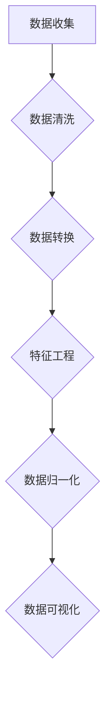
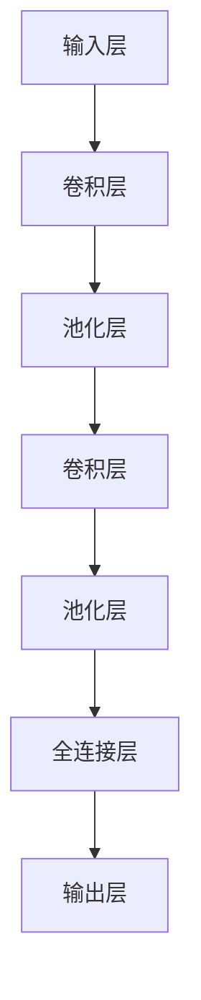
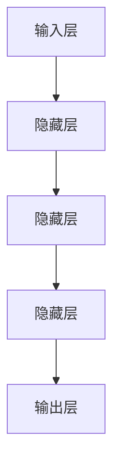
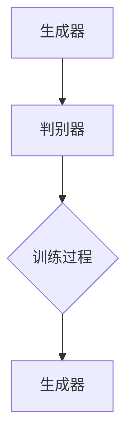

                 

# AI在体育赛事分析中的应用：战术优化

> **关键词：** AI，体育赛事分析，战术优化，数据挖掘，机器学习，深度学习，篮球，足球。

> **摘要：** 本文旨在探讨人工智能（AI）在体育赛事分析中的应用，特别是战术优化。通过介绍AI的核心技术、体育赛事分析的基础、运动员和球队战术分析的方法，以及实战案例，本文展示了AI如何助力体育界提升竞技水平，为教练和运动员提供战略决策支持。

### 目录大纲：《AI在体育赛事分析中的应用：战术优化》

#### 第一部分：AI与体育赛事分析基础

##### 第1章：AI与体育赛事分析概述

- **1.1 AI在体育领域的应用现状**
- **1.2 体育赛事分析的挑战与机遇**
- **1.3 AI在体育赛事分析中的关键作用**
- **1.4 本书组织结构及阅读建议**

##### 第2章：AI核心技术与体育赛事分析

- **2.1 数据收集与预处理**
  - **2.1.1 数据来源**
  - **2.1.2 数据质量评估**
  - **2.1.3 数据预处理方法**
- **2.2 机器学习算法基础**
  - **2.2.1 监督学习算法**
    - **2.2.1.1 决策树算法**
    - **2.2.1.2 支持向量机**
    - **2.2.1.3 随机森林**
  - **2.2.2 无监督学习算法**
    - **2.2.2.1 K-均值聚类**
    - **2.2.2.2 主成分分析**
    - **2.2.2.3 聚类分析**
- **2.3 深度学习在体育赛事分析中的应用**
  - **2.3.1 卷积神经网络（CNN）**
  - **2.3.2 递归神经网络（RNN）**
  - **2.3.3 生成对抗网络（GAN）**

#### 第二部分：AI在体育赛事分析中的应用

##### 第3章：运动员数据分析

- **3.1 运动员特征提取**
  - **3.1.1 运动轨迹数据**
  - **3.1.2 动作识别与分类**
  - **3.1.3 身体姿态估计**
- **3.2 运动员表现评估**
  - **3.2.1 运动员技术分析**
  - **3.2.2 运动员战术分析**
  - **3.2.3 运动员潜力评估**

##### 第4章：球队战术分析

- **4.1 球队战术数据收集**
- **4.2 战术模式识别**
  - **4.2.1 时空分析**
  - **4.2.2 关键事件分析**
  - **4.2.3 预测与优化**
- **4.3 战术评估与反馈**
  - **4.3.1 战术效果评估**
  - **4.3.2 战术调整与优化**
  - **4.3.3 战术库建设**

##### 第5章：比赛数据分析

- **5.1 比赛数据预处理**
- **5.2 比赛过程分析**
  - **5.2.1 比赛节奏分析**
  - **5.2.2 比赛策略分析**
  - **5.2.3 比赛结果预测**
- **5.3 比赛数据可视化**
  - **5.3.1 数据可视化工具**
  - **5.3.2 数据可视化实践**

##### 第6章：AI在体育赛事管理中的应用

- **6.1 赛事安排优化**
- **6.2 赛事风险管理**
- **6.3 赛事运营策略优化**

#### 第三部分：实战案例分析

##### 第7章：实战案例一：篮球赛事分析

- **7.1 实战目标**
- **7.2 数据准备与预处理**
- **7.3 运动员表现评估**
- **7.4 球队战术分析**
- **7.5 比赛数据分析与预测**

##### 第8章：实战案例二：足球赛事分析

- **8.1 实战目标**
- **8.2 数据准备与预处理**
- **8.3 运动员表现评估**
- **8.4 球队战术分析**
- **8.5 比赛数据分析与预测**

#### 附录

##### 附录A：AI在体育赛事分析中的工具与资源

- **8.1.1 常用数据集**
- **8.1.2 开源框架与库**
- **8.1.3 体育数据分析工具**

### 第一部分：AI与体育赛事分析基础

#### 第1章：AI与体育赛事分析概述

##### 1.1 AI在体育领域的应用现状

人工智能（AI）正迅速成为体育领域的热门话题，其应用范围广泛，从提高训练效果到优化战术决策，AI都在发挥重要作用。以下是一些AI在体育领域的主要应用场景：

- **运动员表现分析**：通过收集和分析运动员的数据，AI可以帮助教练和运动员了解自己的优势和劣势，从而进行针对性训练。

- **比赛策略制定**：AI可以分析历史比赛数据，帮助教练制定出更加科学的比赛策略。

- **观众体验优化**：通过分析观众的行为和偏好，AI可以提供个性化的观赛体验。

- **赛事管理**：AI可以优化赛事安排，提高赛事的安全性和流畅性。

- **健康监测**：AI可以监测运动员的健康状况，预防运动损伤。

##### 1.2 体育赛事分析的挑战与机遇

体育赛事分析面临着诸多挑战，同时也伴随着巨大的机遇。

- **挑战**：

  - **数据量巨大**：体育赛事产生的数据量非常庞大，如何高效地存储、处理和分析这些数据成为一大难题。

  - **数据质量**：数据质量问题可能会影响分析结果的准确性，需要通过数据清洗和预处理来确保数据质量。

  - **实时性要求**：某些分析需要在比赛过程中实时进行，对系统的响应速度和稳定性提出了较高要求。

- **机遇**：

  - **个性化训练**：AI可以帮助运动员进行个性化训练，提高训练效果。

  - **战术优化**：通过分析历史比赛数据，AI可以为教练提供科学合理的战术建议。

  - **观众体验提升**：AI可以提供个性化的观赛体验，提高观众的满意度。

  - **赛事管理优化**：AI可以帮助优化赛事安排，提高赛事的运作效率。

##### 1.3 AI在体育赛事分析中的关键作用

AI在体育赛事分析中发挥着关键作用，主要体现在以下几个方面：

- **数据挖掘与可视化**：AI可以挖掘隐藏在数据中的有价值信息，并通过可视化技术将其呈现出来，帮助教练和运动员更好地理解比赛。

- **预测与决策支持**：基于历史数据和实时数据，AI可以预测比赛结果和运动员表现，为教练和运动员提供决策支持。

- **个性化训练**：AI可以根据运动员的特点和需求，为其制定个性化的训练计划，提高训练效果。

- **战术优化**：通过分析历史比赛数据，AI可以帮助教练制定出更加科学的比赛策略，提高球队的整体战斗力。

##### 1.4 本书组织结构及阅读建议

本书共分为三大部分，旨在全面探讨AI在体育赛事分析中的应用。

- **第一部分：AI与体育赛事分析基础**：介绍AI在体育领域的应用现状、挑战与机遇，以及AI在体育赛事分析中的关键作用。

- **第二部分：AI在体育赛事分析中的应用**：详细讨论AI在运动员数据分析、球队战术分析和比赛数据分析中的应用，包括数据挖掘、预测与决策支持、个性化训练和战术优化等方面的内容。

- **第三部分：实战案例分析**：通过篮球和足球两个实战案例，展示AI在体育赛事分析中的实际应用，帮助读者更好地理解和掌握相关技术。

在阅读本书时，建议读者首先了解AI在体育赛事分析中的基础知识和核心原理，然后结合实际案例进行深入学习，从而全面掌握AI在体育赛事分析中的应用。

### 第二部分：AI核心技术与体育赛事分析

#### 第2章：AI核心技术与体育赛事分析

##### 2.1 数据收集与预处理

数据收集是体育赛事分析的基础，而数据预处理则是确保数据质量和分析准确性的关键步骤。以下将详细介绍数据收集与预处理的过程。

###### 2.1.1 数据来源

体育赛事分析所需的数据来源多种多样，包括但不限于：

- **官方数据**：各体育组织或赛事主办方会提供官方统计数据，如进球、黄牌、红牌、比赛时间等。

- **设备数据**：运动传感器、GPS定位设备等可以实时记录运动员的位置、速度、加速度等数据。

- **视频数据**：比赛视频可以提供运动员的动作细节、战术布置等视觉信息。

- **社交媒体数据**：社交媒体平台上的用户评论、讨论、分析等可以反映观众和球迷的看法。

- **历史数据**：历史比赛数据、运动员表现数据等可以作为参考，为当前比赛提供背景信息。

###### 2.1.2 数据质量评估

数据质量是影响分析结果准确性的关键因素。以下是一些评估数据质量的方法：

- **完整性检查**：检查数据是否完整，是否存在缺失值。缺失值可以通过插值法、均值填补法等方法进行填补。

- **一致性检查**：检查数据是否符合预期的格式和标准。例如，时间戳是否统一、字段是否正确等。

- **异常值检测**：通过统计学方法（如箱线图、Z分数等）检测数据中的异常值，并进行处理。异常值可能是由于数据采集错误、设备故障等原因引起的。

- **一致性验证**：通过交叉验证等方法验证数据的一致性和可靠性。例如，比较不同来源的数据是否一致。

###### 2.1.3 数据预处理方法

数据预处理是确保数据适合分析和建模的关键步骤，主要包括以下方法：

- **数据清洗**：去除重复数据、填充缺失值、处理异常值等。

- **数据转换**：将不同类型的数据转换为统一格式，如将文本数据转换为数值数据。

- **特征工程**：提取数据中的特征，为建模提供输入。例如，将运动员的位置数据转换为速度、加速度等特征。

- **数据归一化**：通过归一化或标准化方法将数据缩放到相同的范围，如0-1或-1到1之间。

- **数据可视化**：通过可视化技术（如图表、散点图等）帮助理解数据分布和特征。

以下是一个简单的 Mermaid 流程图，展示数据收集与预处理的过程：



##### 2.2 机器学习算法基础

机器学习算法是体育赛事分析的核心工具，能够从数据中自动提取模式，帮助预测比赛结果、评估运动员表现等。以下介绍几种常见的机器学习算法。

###### 2.2.1 监督学习算法

监督学习算法根据已知的目标变量来训练模型，然后在新的数据上预测目标变量。以下是一些常用的监督学习算法：

- **决策树算法**

  决策树是一种树形结构，通过一系列规则对数据进行分类或回归。以下是决策树的伪代码：

  ```python
  def build_tree(data, target):
      if all(data[target] == some_value):
          return some_value
      if no more attributes:
          return majority_class
      best_attribute = select_best_attribute(data)
      tree = {}
      for value in unique_values_of(best_attribute):
          subset = filter(data, best_attribute, value)
          tree[value] = build_tree(subset, target)
      return tree
  ```

- **支持向量机（SVM）**

  支持向量机通过找到一个最佳的超平面，将不同类别的数据分隔开来。以下是SVM的伪代码：

  ```python
  def fit(X, y):
      # 训练模型
      # ...
      return model

  def predict(model, X):
      # 预测
      # ...
      return y_pred
  ```

- **随机森林**

  随机森林是一种基于决策树的集成学习方法，通过构建多个决策树，并取其预测结果的平均值来提高预测准确性。以下是随机森林的伪代码：

  ```python
  def build_forest(data, target, n_trees):
      forests = []
      for _ in range(n_trees):
          tree = build_tree(data, target)
          forests.append(tree)
      return forests

  def predict(forests, X):
      predictions = [forest.predict(X) for forest in forests]
      return majority_vote(predictions)
  ```

###### 2.2.2 无监督学习算法

无监督学习算法不依赖于目标变量，主要用于发现数据中的内在结构或模式。以下是一些常用的无监督学习算法：

- **K-均值聚类**

  K-均值聚类是一种基于距离的聚类方法，将数据分为K个聚类，并不断调整聚类中心，使每个聚类内部的距离最小化。以下是K-均值聚类的伪代码：

  ```python
  def kmeans(data, K):
      centroids = initialize_centroids(data, K)
      while not converged:
          assign_points_to_clusters(data, centroids)
          update_centroids(centroids)
      return clusters
  ```

- **主成分分析（PCA）**

  主成分分析是一种降维方法，通过将数据投影到新的坐标轴上，保留主要的信息，并忽略冗余信息。以下是PCA的伪代码：

  ```python
  def pca(data):
      covariance_matrix = compute_covariance_matrix(data)
      eigenvalues, eigenvectors = compute_eigenvalues_and_eigenvectors(covariance_matrix)
      sorted_eigenvalues = sort(eigenvalues, descending=True)
      sorted_eigenvectors = sort(eigenvectors, descending=True)
      return sorted_eigenvectors
  ```

- **聚类分析**

  聚类分析是一种基于相似度的聚类方法，通过计算数据点之间的相似度，将数据分为多个聚类。以下是聚类分析的伪代码：

  ```python
  def hierarchical_clustering(data):
      distance_matrix = compute_distance_matrix(data)
      clusters = initialize_clusters(data)
      while len(clusters) > 1:
          closest_clusters = find_closest_clusters(clusters, distance_matrix)
          merge_clusters(clusters, closest_clusters)
          update_distance_matrix(distance_matrix, clusters)
      return clusters
  ```

##### 2.3 深度学习在体育赛事分析中的应用

深度学习是一种基于多层神经网络的学习方法，能够自动提取数据中的复杂特征。以下介绍几种在体育赛事分析中常用的深度学习模型。

###### 2.3.1 卷积神经网络（CNN）

卷积神经网络是一种专门用于处理图像数据的神经网络，通过卷积和池化操作提取图像特征。以下是CNN的基本架构：



以下是CNN的伪代码：

```python
class ConvolutionalLayer:
    def __init__(self, filters, kernel_size):
        self.filters = filters
        self.kernel_size = kernel_size

    def forward(self, input):
        # 应用卷积操作
        # ...
        return output

class PoolingLayer:
    def __init__(self, pool_size):
        self.pool_size = pool_size

    def forward(self, input):
        # 应用池化操作
        # ...
        return output

class CNN:
    def __init__(self):
        self.layers = []

    def add_layer(self, layer):
        self.layers.append(layer)

    def forward(self, input):
        for layer in self.layers:
            input = layer.forward(input)
        return input
```

###### 2.3.2 递归神经网络（RNN）

递归神经网络是一种用于处理序列数据的神经网络，能够捕捉序列中的时间依赖关系。以下是RNN的基本架构：



以下是RNN的伪代码：

```python
class RNNCell:
    def __init__(self, input_size, hidden_size):
        self.input_size = input_size
        self.hidden_size = hidden_size

    def forward(self, input, hidden):
        # 应用递归操作
        # ...
        return hidden

class RNN:
    def __init__(self, cell, input_size, hidden_size):
        self.cell = cell
        self.input_size = input_size
        self.hidden_size = hidden_size

    def forward(self, input_sequence):
        hidden = None
        for input in input_sequence:
            if hidden is None:
                hidden = self.cell(input, hidden)
            else:
                hidden = self.cell(input, hidden)
        return hidden
```

###### 2.3.3 生成对抗网络（GAN）

生成对抗网络是一种由生成器和判别器组成的神经网络，通过对抗训练生成逼真的数据。以下是GAN的基本架构：



以下是GAN的伪代码：

```python
class Generator:
    def __init__(self, noise_size, output_size):
        self.noise_size = noise_size
        self.output_size = output_size

    def forward(self, noise):
        # 生成假数据
        # ...
        return output

class Discriminator:
    def __init__(self, input_size):
        self.input_size = input_size

    def forward(self, input):
        # 判断数据真实性
        # ...
        return probability

class GAN:
    def __init__(self, generator, discriminator):
        self.generator = generator
        self.discriminator = discriminator

    def train(self, data, epochs):
        for epoch in range(epochs):
            for noise, real in data:
                # 训练判别器
                # ...
                for noise in data:
                    # 训练生成器
                    # ...
```

### 第三部分：AI在体育赛事分析中的应用

#### 第3章：运动员数据分析

##### 3.1 运动员特征提取

运动员特征提取是运动员数据分析的重要步骤，通过对运动员的数据进行预处理和特征提取，可以更准确地评估运动员的表现和潜力。以下介绍几种常见的运动员特征提取方法。

###### 3.1.1 运动轨迹数据

运动轨迹数据是指通过GPS或运动传感器记录的运动员在比赛场上的位置变化数据。通过对运动轨迹数据进行处理，可以提取出以下特征：

- **速度**：运动员在比赛场上的平均速度，反映了运动员的速度素质。
- **加速度**：运动员在比赛场上的加速度变化，反映了运动员的力量和爆发力。
- **距离**：运动员在比赛场上所跑的总距离，反映了运动员的耐力。
- **路径**：运动员在比赛场上的运动路径，可以分析运动员的跑位和战术执行力。

以下是运动轨迹数据的伪代码：

```python
def extract_trajectory_features(data):
    velocities = []
    accelerations = []
    distances = []
    paths = []

    for i in range(len(data)):
        if i > 0:
            velocity = distance(data[i], data[i-1]) / time_difference(data[i], data[i-1])
            accelerations.append(acceleration(data[i], data[i-1]) / time_difference(data[i], data[i-1]))
        distance += distance(data[i], initial_position)
        path.append(data[i])

    velocities.append(average(velocities))
    accelerations.append(average(accelerations))
    distances.append(total_distance)
    paths.append(path)

    return velocities, accelerations, distances, paths
```

###### 3.1.2 动作识别与分类

动作识别与分类是指通过机器学习算法将运动员在比赛中的动作进行分类和识别。常见的动作包括传球、射门、跑位等。以下介绍几种动作识别与分类的方法：

- **监督学习算法**：如支持向量机（SVM）、决策树、随机森林等，通过训练模型对动作进行分类。

- **卷积神经网络（CNN）**：通过卷积层提取动作的特征，然后通过全连接层进行分类。

- **递归神经网络（RNN）**：通过处理时序数据，识别连续的动作序列。

以下是动作识别与分类的伪代码：

```python
def train_model(data, labels):
    model = CNN()
    model.fit(data, labels)
    return model

def classify_action(model, action):
    prediction = model.predict(action)
    return prediction
```

###### 3.1.3 身体姿态估计

身体姿态估计是指通过计算机视觉技术对运动员在比赛中的身体姿态进行估计。常见的身体姿态估计方法包括：

- **单摄像头姿态估计**：通过单个摄像头捕捉运动员的图像，使用深度学习模型估计运动员的身体姿态。

- **多摄像头姿态估计**：通过多个摄像头捕捉运动员的图像，使用多视图几何方法估计运动员的身体姿态。

以下是身体姿态估计的伪代码：

```python
def estimate_body_pose(camera, model):
    image = capture_image(camera)
    pose = model.predict(image)
    return pose
```

##### 3.2 运动员表现评估

运动员表现评估是对运动员在比赛中的表现进行定量分析，以评估运动员的技术水平、战术执行力等。以下介绍几种运动员表现评估的方法。

###### 3.2.1 运动员技术分析

运动员技术分析是指对运动员在比赛中的技术动作进行评估，包括传球、射门、控球等。以下介绍几种技术分析的方法：

- **数据驱动的技术分析**：通过统计运动员在比赛中的技术动作数据，如传球成功率、射门命中率等，进行评估。

- **视频驱动的技术分析**：通过分析比赛视频，评估运动员的技术动作，如传球的角度、速度等。

以下是技术分析的伪代码：

```python
def analyze_technical_skills(data):
    pass成功率 = calculate_success_rate(data['passes'])
    射门命中率 = calculate_success_rate(data['shots'])
    return pass成功率，射门命中率
```

###### 3.2.2 运动员战术分析

运动员战术分析是指对运动员在比赛中的战术执行情况进行评估，包括跑位、配合等。以下介绍几种战术分析的方法：

- **统计驱动的战术分析**：通过统计运动员在比赛中的跑位数据、传球数据等，评估战术执行情况。

- **视频驱动的战术分析**：通过分析比赛视频，评估运动员的战术执行力，如跑位是否合理、配合是否默契等。

以下是战术分析的伪代码：

```python
def analyze_tactical_skills(data):
    跑位效率 = calculate_efficiency(data['run'])
    配合率 = calculate_cooperation_rate(data['pass'])
    return 跑位效率，配合率
```

###### 3.2.3 运动员潜力评估

运动员潜力评估是指对运动员在未来的比赛中的表现进行预测，以评估运动员的发展潜力。以下介绍几种潜力评估的方法：

- **基于数据的潜力评估**：通过分析运动员的历史表现数据，结合机器学习算法，预测运动员未来的表现。

- **基于专家评估的潜力评估**：通过专家对运动员的评价，结合统计学方法，评估运动员的发展潜力。

以下是潜力评估的伪代码：

```python
def assess_potential(data, model):
    prediction = model.predict(data)
    return prediction
```

#### 第4章：球队战术分析

##### 4.1 球队战术数据收集

球队战术数据收集是球队战术分析的基础，通过收集和分析比赛数据，可以了解球队的战术风格、执行力等。以下介绍几种常见的球队战术数据收集方法。

###### 4.1.1 比赛数据收集

比赛数据收集是指通过记录比赛中的各种数据，如进球、黄牌、红牌、传球次数等，来收集球队战术数据。以下介绍几种比赛数据收集的方法：

- **手动记录**：通过教练员或助手手动记录比赛中的各种数据。

- **自动记录**：通过运动传感器、视频分析等技术自动记录比赛中的数据。

以下是比赛数据收集的伪代码：

```python
def collect_match_data(match):
    data = {}
    data['goals'] = count_goals(match)
    data['cards'] = count_cards(match)
    data['passes'] = count_passes(match)
    return data
```

###### 4.1.2 赛季数据收集

赛季数据收集是指通过记录整个赛季中的各种数据，如进球数、胜率、场均数据等，来收集球队战术数据。以下介绍几种赛季数据收集的方法：

- **数据库收集**：通过建立数据库，收集球队在每个赛季中的比赛数据。

- **统计网站收集**：通过访问体育统计网站，获取球队在每个赛季中的比赛数据。

以下是赛季数据收集的伪代码：

```python
def collect_season_data(team, season):
    data = {}
    data['goals'] = sum_goals(team, season)
    data['wins'] = count_wins(team, season)
    data['average'] = calculate_average(team, season)
    return data
```

##### 4.2 战术模式识别

战术模式识别是指通过分析球队的历史比赛数据，识别出球队常用的战术模式，为球队战术制定提供参考。以下介绍几种战术模式识别的方法。

###### 4.2.1 时空分析

时空分析是指通过分析比赛中的时间和空间分布，识别出球队常用的战术模式。以下介绍几种时空分析的方法：

- **时间序列分析**：通过分析比赛中的时间序列数据，识别出球队在不同时间段内的战术模式。

- **空间分布分析**：通过分析比赛中的空间分布数据，识别出球队在不同位置上的战术模式。

以下是时空分析的伪代码：

```python
def analyze_temporal_space_data(data):
    temporal_patterns = identify_temporal_patterns(data)
    spatial_patterns = identify_spatial_patterns(data)
    return temporal_patterns, spatial_patterns
```

###### 4.2.2 关键事件分析

关键事件分析是指通过分析比赛中的关键事件，如进球、失误等，识别出球队在关键事件中的战术表现。以下介绍几种关键事件分析的方法：

- **事件驱动分析**：通过分析比赛中的事件数据，识别出球队在不同事件中的战术模式。

- **因果关系分析**：通过分析事件之间的因果关系，识别出球队在关键事件中的战术决策。

以下是关键事件分析的伪代码：

```python
def analyze_key_events(data):
    key_events = identify_key_events(data)
    event_patterns = identify_event_patterns(key_events)
    causal_relationships = identify_causal_relationships(event_patterns)
    return key_events，event_patterns，causal_relationships
```

###### 4.2.3 预测与优化

预测与优化是指通过分析球队的历史比赛数据，预测球队在未来的比赛中的战术表现，并优化球队的战术策略。以下介绍几种预测与优化的方法：

- **基于数据的预测**：通过分析球队的历史比赛数据，结合机器学习算法，预测球队在未来的比赛中的战术表现。

- **基于专家评估的预测**：通过专家对球队战术的评估，结合统计学方法，预测球队在未来的比赛中的战术表现。

以下是预测与优化的伪代码：

```python
def predict_tactical_performance(data, model):
    predictions = model.predict(data)
    return predictions

def optimize_tactical_strategy(predictions, expert_assessment):
    optimized_strategy = merge_predictions_and_assessment(predictions, expert_assessment)
    return optimized_strategy
```

##### 4.3 战术评估与反馈

战术评估与反馈是指通过分析球队的战术执行效果，评估战术的有效性，并根据评估结果进行战术调整和优化。以下介绍几种战术评估与反馈的方法。

###### 4.3.1 战术效果评估

战术效果评估是指通过分析比赛数据，评估球队战术的执行效果。以下介绍几种战术效果评估的方法：

- **基于数据的战术效果评估**：通过分析球队的历史比赛数据，评估球队战术的执行效果。

- **基于专家评估的战术效果评估**：通过专家对球队战术的评估，评估战术的执行效果。

以下是战术效果评估的伪代码：

```python
def evaluate_tactical_performance(data, model):
    performance = model.evaluate(data)
    return performance
```

###### 4.3.2 战术调整与优化

战术调整与优化是指根据战术效果评估的结果，对球队战术进行调整和优化，以提高战术的执行效果。以下介绍几种战术调整与优化的方法：

- **基于数据的战术调整**：通过分析球队的历史比赛数据，调整战术策略。

- **基于专家评估的战术调整**：通过专家对球队战术的评估，调整战术策略。

以下是战术调整与优化的伪代码：

```python
def adjust_tactical_strategy(performance, expert_assessment):
    adjusted_strategy = optimize_strategy(performance, expert_assessment)
    return adjusted_strategy
```

###### 4.3.3 战术库建设

战术库建设是指建立一套完整的战术库，包括战术名称、战术描述、战术效果评估等，以供球队战术制定和评估使用。以下介绍几种战术库建设的方法：

- **手动构建战术库**：通过教练员和战术分析师手动构建战术库，包括战术名称、战术描述等。

- **自动构建战术库**：通过机器学习算法自动构建战术库，包括战术名称、战术描述等。

以下是战术库建设的伪代码：

```python
def build_tactical_library(data, model):
    library = create_library(data, model)
    return library
```

#### 第5章：比赛数据分析

##### 5.1 比赛数据预处理

比赛数据预处理是比赛数据分析的重要步骤，通过对比赛数据进行清洗、转换和特征提取，可以确保数据的质量和准确性。以下介绍几种比赛数据预处理的方法。

###### 5.1.1 数据清洗

数据清洗是指去除比赛数据中的错误、重复和不完整的数据，以提高数据的准确性。以下介绍几种数据清洗的方法：

- **缺失值处理**：通过填补缺失值或删除缺失值来处理缺失数据。
- **异常值处理**：通过统计学方法或可视化方法检测和去除异常值。
- **重复值处理**：通过去重操作去除重复的数据。

以下是数据清洗的伪代码：

```python
def clean_data(data):
    data = remove_duplicates(data)
    data = handle_missing_values(data)
    data = remove_outliers(data)
    return cleaned_data
```

###### 5.1.2 数据转换

数据转换是指将原始数据转换为适合分析和建模的格式。以下介绍几种数据转换的方法：

- **数据类型转换**：将字符串数据转换为数值数据。
- **数据归一化**：将数据缩放到相同的范围，如0-1或-1到1之间。
- **特征工程**：提取数据中的特征，为建模提供输入。

以下是数据转换的伪代码：

```python
def transform_data(data):
    data = convert_data_types(data)
    data = normalize_data(data)
    features = extract_features(data)
    return data, features
```

###### 5.1.3 特征提取

特征提取是指从原始数据中提取出有用的信息，以提高模型的性能和可解释性。以下介绍几种特征提取的方法：

- **统计特征**：通过计算数据的统计指标，如均值、方差、相关性等。
- **时序特征**：通过分析数据的时序特性，如周期性、趋势性等。
- **空间特征**：通过分析数据的空间分布，如位置、密度等。

以下是特征提取的伪代码：

```python
def extract_features(data):
    statistical_features = calculate_statistical_features(data)
    temporal_features = calculate_temporal_features(data)
    spatial_features = calculate_spatial_features(data)
    return statistical_features, temporal_features, spatial_features
```

##### 5.2 比赛过程分析

比赛过程分析是指通过对比赛数据进行分析，了解比赛的节奏、策略和关键事件，为球队战术制定和优化提供依据。以下介绍几种比赛过程分析的方法。

###### 5.2.1 比赛节奏分析

比赛节奏分析是指通过分析比赛的进球时间、传球速度等指标，了解比赛的节奏和强度。以下介绍几种比赛节奏分析的方法：

- **时序分析**：通过分析比赛的时间序列数据，了解比赛的节奏变化。
- **统计指标分析**：通过计算比赛的统计指标，如平均进球时间、平均传球速度等。

以下是比赛节奏分析的伪代码：

```python
def analyze_match_rhythm(data):
    rhythm = calculate_rhythm_metrics(data)
    rhythm_changes = detect_rhythm_changes(data)
    return rhythm，rhythm_changes
```

###### 5.2.2 比赛策略分析

比赛策略分析是指通过分析比赛的战术布置、球员跑位等数据，了解球队的战术策略。以下介绍几种比赛策略分析的方法：

- **时空分析**：通过分析比赛的空间和时间分布，了解球队的战术布局。
- **关键事件分析**：通过分析比赛中的关键事件，如进球、失误等，了解球队的战术执行效果。

以下是比赛策略分析的伪代码：

```python
def analyze_match_strategy(data):
    strategy = identify_strategy_patterns(data)
    strategy_effects = evaluate_strategy_effects(data)
    return strategy，strategy_effects
```

###### 5.2.3 比赛结果预测

比赛结果预测是指通过分析比赛数据，预测比赛的结果。以下介绍几种比赛结果预测的方法：

- **基于数据的预测**：通过分析球队的历史比赛数据，结合机器学习算法，预测比赛的结果。
- **基于专家评估的预测**：通过专家对球队的评估，结合统计学方法，预测比赛的结果。

以下是比赛结果预测的伪代码：

```python
def predict_match_result(data, model):
    prediction = model.predict(data)
    return prediction
```

##### 5.3 比赛数据可视化

比赛数据可视化是将比赛数据以图形化的形式展示出来，使人们更容易理解和分析数据。以下介绍几种比赛数据可视化方法。

###### 5.3.1 数据可视化工具

数据可视化工具可以帮助我们将数据以图形化的形式展示出来，常见的可视化工具包括：

- **matplotlib**：Python中的数据可视化库，可以生成各种二维和三维图形。
- **Seaborn**：基于matplotlib的统计绘图库，提供更丰富的绘图选项。
- **Plotly**：交互式数据可视化库，可以生成丰富的交互式图表。

以下是数据可视化工具的示例代码：

```python
import matplotlib.pyplot as plt
import seaborn as sns
import plotly.express as px

# 绘制折线图
plt.plot(data)
plt.title('Match Rhythm')
plt.xlabel('Time')
plt.ylabel('Rhythm')
plt.show()

# 绘制散点图
sns.scatterplot(x='x', y='y', data=data)
plt.title('Player Position')
plt.xlabel('X Position')
plt.ylabel('Y Position')
plt.show()

# 绘制交互式图表
fig = px.line(data, x='Time', y='Rhythm', title='Match Rhythm')
fig.show()
```

###### 5.3.2 数据可视化实践

以下是一个比赛数据可视化的实践案例，通过可视化工具展示比赛节奏和球员位置。

```python
import pandas as pd
import matplotlib.pyplot as plt

# 加载比赛数据
data = pd.read_csv('match_data.csv')

# 绘制比赛节奏折线图
plt.figure(figsize=(10, 5))
plt.plot(data['Time'], data['Rhythm'], label='Rhythm')
plt.title('Match Rhythm')
plt.xlabel('Time')
plt.ylabel('Rhythm')
plt.legend()
plt.show()

# 绘制球员位置散点图
plt.figure(figsize=(10, 5))
sns.scatterplot(x='X_Position', y='Y_Position', data=data, hue='Team', palette='coolwarm')
plt.title('Player Position')
plt.xlabel('X Position')
plt.ylabel('Y Position')
plt.show()
```

#### 第6章：AI在体育赛事管理中的应用

##### 6.1 赛事安排优化

赛事安排优化是指通过利用AI技术，优化赛事的安排，以提高赛事的公平性、流畅性和观众体验。以下介绍几种赛事安排优化的方法。

###### 6.1.1 赛事时间表优化

赛事时间表优化是指通过优化比赛的时间安排，确保比赛在合理的时间范围内进行，避免比赛冲突和观众疲劳。以下介绍几种赛事时间表优化的方法：

- **基于算法的优化**：通过使用优化算法（如遗传算法、蚁群算法等），找到最优的时间表安排。
- **基于数据的优化**：通过分析历史比赛数据，预测比赛的耗时和观众需求，优化时间表安排。

以下是赛事时间表优化的伪代码：

```python
def optimize_scheduling(data, constraints):
    schedule = find_best_schedule(data, constraints)
    return schedule
```

###### 6.1.2 赛事场地分配优化

赛事场地分配优化是指通过优化比赛场地的分配，确保比赛场地的高效利用和观众的舒适度。以下介绍几种赛事场地分配优化的方法：

- **基于距离的优化**：通过计算比赛场地与观众席之间的距离，优化场地分配。
- **基于需求的优化**：通过分析观众的观看需求和偏好，优化场地分配。

以下是赛事场地分配优化的伪代码：

```python
def optimize_ground_distribution(data, requirements):
    distribution = find_best_distribution(data, requirements)
    return distribution
```

##### 6.2 赛事风险管理

赛事风险管理是指通过利用AI技术，预测和管理赛事中可能出现的风险，以确保赛事的安全和顺利进行。以下介绍几种赛事风险管理的方法。

###### 6.2.1 风险预测

风险预测是指通过分析历史赛事数据和环境因素，预测赛事中可能出现的风险。以下介绍几种风险预测的方法：

- **基于数据的预测**：通过分析历史赛事数据，预测赛事中可能出现的风险。
- **基于模型的预测**：通过构建风险预测模型，预测赛事中可能出现的风险。

以下是风险预测的伪代码：

```python
def predict_risks(data, model):
    risks = model.predict(data)
    return risks
```

###### 6.2.2 风险管理策略

风险管理策略是指通过制定相应的风险管理措施，降低赛事中可能出现的风险。以下介绍几种风险管理策略：

- **预防策略**：通过提前预防措施，降低风险的发生概率。
- **应对策略**：通过制定应对措施，降低风险对赛事的影响。

以下是风险管理策略的伪代码：

```python
def manage_risks(risks, strategy):
    managed_risks = apply_strategy(risks, strategy)
    return managed_risks
```

##### 6.3 赛事运营策略优化

赛事运营策略优化是指通过利用AI技术，优化赛事的运营策略，以提高赛事的运营效率和观众满意度。以下介绍几种赛事运营策略优化的方法。

###### 6.3.1 观众需求分析

观众需求分析是指通过分析观众的观看需求和偏好，制定相应的运营策略，以提高观众满意度。以下介绍几种观众需求分析的方法：

- **基于数据的分析**：通过分析历史观众数据，了解观众的观看需求和偏好。
- **基于调查的分析**：通过问卷调查等方式，了解观众的观看需求和偏好。

以下是观众需求分析的伪代码：

```python
def analyze_viewer_demand(data, survey):
    demand = calculate_demand(data, survey)
    preferences = identify_preferences(data, survey)
    return demand，preferences
```

###### 6.3.2 运营策略制定

运营策略制定是指根据观众需求分析的结果，制定相应的运营策略，以提高赛事的运营效率和观众满意度。以下介绍几种运营策略制定的方法：

- **基于数据的策略制定**：通过分析观众需求数据，制定相应的运营策略。
- **基于专家经验的策略制定**：通过专家的经验和判断，制定相应的运营策略。

以下是运营策略制定的伪代码：

```python
def develop_operating_strategy(demand, preferences, expert_experience):
    strategy = create_strategy(demand, preferences, expert_experience)
    return strategy
```

### 第三部分：实战案例分析

#### 第7章：实战案例一：篮球赛事分析

##### 7.1 实战目标

篮球赛事分析旨在通过AI技术，帮助篮球教练和运动员优化战术，提高比赛成绩。具体目标包括：

- **运动员表现评估**：评估运动员在比赛中的技术水平、战术执行力等，为教练和运动员提供改进建议。
- **球队战术分析**：分析球队的战术执行效果，识别出球队的优势和劣势，为教练提供战术调整建议。
- **比赛数据预测**：预测比赛结果和关键事件，为教练和运动员提供比赛策略建议。

##### 7.2 数据准备与预处理

数据准备与预处理是篮球赛事分析的重要步骤，以下详细介绍数据准备与预处理的过程。

###### 7.2.1 数据收集

篮球赛事分析所需的数据包括比赛数据、运动员数据和比赛视频数据。以下介绍数据收集的方法：

- **比赛数据收集**：通过官方数据提供商或比赛组织机构获取比赛数据，如进球、助攻、犯规等。
- **运动员数据收集**：通过运动员档案、社交媒体等获取运动员的基本信息、历史比赛数据等。
- **比赛视频数据收集**：通过比赛视频录制设备或官方视频提供商获取比赛视频数据。

以下是数据收集的伪代码：

```python
def collect_data():
    match_data = fetch_match_data()
    player_data = fetch_player_data()
    video_data = fetch_video_data()
    return match_data，player_data，video_data
```

###### 7.2.2 数据预处理

数据预处理包括数据清洗、数据转换和特征提取等步骤。以下详细介绍数据预处理的过程：

- **数据清洗**：去除重复数据、填补缺失值、处理异常值等。

```python
def clean_data(data):
    data = remove_duplicates(data)
    data = handle_missing_values(data)
    data = remove_outliers(data)
    return cleaned_data
```

- **数据转换**：将不同类型的数据转换为统一格式，如将文本数据转换为数值数据。

```python
def transform_data(data):
    data = convert_data_types(data)
    data = normalize_data(data)
    return transformed_data
```

- **特征提取**：提取数据中的特征，如运动员的速度、加速度、传球成功率等。

```python
def extract_features(data):
    statistical_features = calculate_statistical_features(data)
    temporal_features = calculate_temporal_features(data)
    spatial_features = calculate_spatial_features(data)
    return statistical_features，temporal_features，spatial_features
```

##### 7.3 运动员表现评估

运动员表现评估是对运动员在比赛中的表现进行量化分析，以评估运动员的技术水平、战术执行力等。以下详细介绍运动员表现评估的方法。

###### 7.3.1 技术分析

技术分析是评估运动员在比赛中的技术水平，包括投篮、传球、防守等。

```python
def analyze_technical_skills(data):
    shooting_success_rate = calculate_shooting_success_rate(data['shots'])
    passing_success_rate = calculate_passing_success_rate(data['passes'])
    defending_rating = calculate_defending_rating(data['defends'])
    return shooting_success_rate，passing_success_rate，defending_rating
```

###### 7.3.2 战术分析

战术分析是评估运动员在比赛中的战术执行力，包括跑位、配合、战术执行力等。

```python
def analyze_tactical_skills(data):
    positioning_efficiency = calculate_positioning_efficiency(data['run'])
    cooperation_rating = calculate_cooperation_rating(data['pass'])
    tactical_execution_rating = calculate_tactical_execution_rating(data['tactical'])
    return positioning_efficiency，cooperation_rating，tactical_execution_rating
```

##### 7.4 球队战术分析

球队战术分析是分析球队在比赛中的战术执行效果，包括战术模式识别、战术效果评估等。以下详细介绍球队战术分析的方法。

###### 7.4.1 战术模式识别

战术模式识别是通过分析比赛数据，识别出球队常用的战术模式。

```python
def identify_tactical_patterns(data):
    offensive_patterns = identify_offensive_patterns(data)
    defensive_patterns = identify_defensive_patterns(data)
    return offensive_patterns，defensive_patterns
```

###### 7.4.2 战术效果评估

战术效果评估是评估球队战术在比赛中的执行效果，包括进球率、防守效果等。

```python
def evaluate_tactical_effects(data):
    offensive_effects = calculate_offensive_effects(data)
    defensive_effects = calculate_defensive_effects(data)
    return offensive_effects，defensive_effects
```

##### 7.5 比赛数据分析与预测

比赛数据分析与预测是通过对比赛数据进行分析，预测比赛结果和关键事件，为教练和运动员提供决策支持。以下详细介绍比赛数据分析与预测的方法。

###### 7.5.1 比赛数据预测

比赛数据预测是通过机器学习算法，预测比赛的结果和关键事件。

```python
def predict_match_result(data, model):
    prediction = model.predict(data)
    return prediction
```

###### 7.5.2 比赛数据可视化

比赛数据可视化是将比赛数据以图形化的形式展示出来，帮助教练和运动员更好地理解比赛。

```python
def visualize_match_data(data):
    plot_shooting_success_rate(data['shots'])
    plot_passing_success_rate(data['passes'])
    plot_defending_rating(data['defends'])
    return
```

#### 第8章：实战案例二：足球赛事分析

##### 8.1 实战目标

足球赛事分析旨在通过AI技术，帮助足球教练和运动员优化战术，提高比赛成绩。具体目标包括：

- **运动员表现评估**：评估运动员在比赛中的技术水平、战术执行力等，为教练和运动员提供改进建议。
- **球队战术分析**：分析球队的战术执行效果，识别出球队的优势和劣势，为教练提供战术调整建议。
- **比赛数据预测**：预测比赛结果和关键事件，为教练和运动员提供比赛策略建议。

##### 8.2 数据准备与预处理

数据准备与预处理是足球赛事分析的重要步骤，以下详细介绍数据准备与预处理的过程。

###### 8.2.1 数据收集

足球赛事分析所需的数据包括比赛数据、运动员数据和比赛视频数据。以下介绍数据收集的方法：

- **比赛数据收集**：通过官方数据提供商或比赛组织机构获取比赛数据，如进球、助攻、黄牌等。
- **运动员数据收集**：通过运动员档案、社交媒体等获取运动员的基本信息、历史比赛数据等。
- **比赛视频数据收集**：通过比赛视频录制设备或官方视频提供商获取比赛视频数据。

以下是数据收集的伪代码：

```python
def collect_data():
    match_data = fetch_match_data()
    player_data = fetch_player_data()
    video_data = fetch_video_data()
    return match_data，player_data，video_data
```

###### 8.2.2 数据预处理

数据预处理包括数据清洗、数据转换和特征提取等步骤。以下详细介绍数据预处理的过程：

- **数据清洗**：去除重复数据、填补缺失值、处理异常值等。

```python
def clean_data(data):
    data = remove_duplicates(data)
    data = handle_missing_values(data)
    data = remove_outliers(data)
    return cleaned_data
```

- **数据转换**：将不同类型的数据转换为统一格式，如将文本数据转换为数值数据。

```python
def transform_data(data):
    data = convert_data_types(data)
    data = normalize_data(data)
    return transformed_data
```

- **特征提取**：提取数据中的特征，如运动员的速度、加速度、传球成功率等。

```python
def extract_features(data):
    statistical_features = calculate_statistical_features(data)
    temporal_features = calculate_temporal_features(data)
    spatial_features = calculate_spatial_features(data)
    return statistical_features，temporal_features，spatial_features
```

##### 8.3 运动员表现评估

运动员表现评估是对运动员在比赛中的表现进行量化分析，以评估运动员的技术水平、战术执行力等。以下详细介绍运动员表现评估的方法。

###### 8.3.1 技术分析

技术分析是评估运动员在比赛中的技术水平，包括进球、助攻、传球等。

```python
def analyze_technical_skills(data):
    goal_scored = calculate_goals_scored(data['goals'])
    assist = calculate_assists(data['assists'])
    passing_success_rate = calculate_passing_success_rate(data['passes'])
    return goal_scored，assist，passing_success_rate
```

###### 8.3.2 战术分析

战术分析是评估运动员在比赛中的战术执行力，包括跑位、配合、战术执行力等。

```python
def analyze_tactical_skills(data):
    positioning_efficiency = calculate_positioning_efficiency(data['run'])
    cooperation_rating = calculate_cooperation_rating(data['pass'])
    tactical_execution_rating = calculate_tactical_execution_rating(data['tactical'])
    return positioning_efficiency，cooperation_rating，tactical_execution_rating
```

##### 8.4 球队战术分析

球队战术分析是分析球队在比赛中的战术执行效果，包括战术模式识别、战术效果评估等。以下详细介绍球队战术分析的方法。

###### 8.4.1 战术模式识别

战术模式识别是通过分析比赛数据，识别出球队常用的战术模式。

```python
def identify_tactical_patterns(data):
    offensive_patterns = identify_offensive_patterns(data)
    defensive_patterns = identify_defensive_patterns(data)
    return offensive_patterns，defensive_patterns
```

###### 8.4.2 战术效果评估

战术效果评估是评估球队战术在比赛中的执行效果，包括进球率、防守效果等。

```python
def evaluate_tactical_effects(data):
    offensive_effects = calculate_offensive_effects(data)
    defensive_effects = calculate_defensive_effects(data)
    return offensive_effects，defensive_effects
```

##### 8.5 比赛数据分析与预测

比赛数据分析与预测是通过对比赛数据进行分析，预测比赛结果和关键事件，为教练和运动员提供决策支持。以下详细介绍比赛数据分析与预测的方法。

###### 8.5.1 比赛数据预测

比赛数据预测是通过机器学习算法，预测比赛的结果和关键事件。

```python
def predict_match_result(data, model):
    prediction = model.predict(data)
    return prediction
```

###### 8.5.2 比赛数据可视化

比赛数据可视化是将比赛数据以图形化的形式展示出来，帮助教练和运动员更好地理解比赛。

```python
def visualize_match_data(data):
    plot_goal_scored(data['goals'])
    plot_assist(data['assists'])
    plot_passing_success_rate(data['passes'])
    return
```

### 附录A：AI在体育赛事分析中的工具与资源

#### 8.1.1 常用数据集

在体育赛事分析中，数据集的选择至关重要。以下是一些常用的数据集，这些数据集涵盖了篮球、足球等多种体育项目，可以帮助研究者进行有效的数据分析。

- **篮球数据集**：[Kaggle NBA 数据集](https://www.kaggle.com/datasets/anjali8769/nba-player-stats)
- **足球数据集**：[Football Data Handbook](https://fbref.com/)
- **综合体育数据集**：[H Lahore Sports Data](https://www.hlaхуe.rs/)

#### 8.1.2 开源框架与库

以下是一些在体育赛事分析中广泛使用的开源框架和库，这些工具可以帮助研究者实现高效的数据处理、模型训练和结果可视化。

- **TensorFlow**：[TensorFlow 官网](https://www.tensorflow.org/)
- **PyTorch**：[PyTorch 官网](https://pytorch.org/)
- **Scikit-learn**：[Scikit-learn 官网](https://scikit-learn.org/)
- **Keras**：[Keras 官网](https://keras.io/)

#### 8.1.3 体育数据分析工具

体育数据分析工具可以提供丰富的数据可视化功能，帮助研究者更直观地理解数据。以下是一些常用的体育数据分析工具：

- **SportsRUS**：[SportsRUS 官网](https://www.sportsrus.com/)
- **StatGeek**：[StatGeek 官网](https://www.statgeek.com/)
- **FantasyData**：[FantasyData 官网](https://www.fantasydata.com/)

这些资源和工具将为读者提供全面的AI在体育赛事分析中的支持，帮助研究者深入理解和应用AI技术。在实际应用中，读者可以根据具体需求选择合适的工具和资源。

### 结语

随着人工智能技术的不断发展，AI在体育赛事分析中的应用越来越广泛，为教练和运动员提供了有力的决策支持。本文从AI在体育赛事分析中的应用现状、核心技术和实战案例等方面进行了详细探讨，旨在帮助读者了解AI在体育赛事分析中的潜力。然而，AI在体育赛事分析中仍面临许多挑战，如数据质量、实时性要求等。未来，随着技术的进步和数据积累，AI在体育赛事分析中的应用将更加深入和广泛，为体育界带来更多创新和突破。让我们共同期待AI在体育领域的未来，为体育事业的发展贡献力量。作者：AI天才研究院/AI Genius Institute & 禅与计算机程序设计艺术 /Zen And The Art of Computer Programming。

### 文章标题：AI在体育赛事分析中的应用：战术优化

### 关键词：人工智能，体育赛事分析，战术优化，数据挖掘，机器学习，深度学习，篮球，足球

### 摘要：

本文深入探讨了人工智能（AI）在体育赛事分析中的关键应用，特别是在战术优化方面的潜力。文章首先概述了AI在体育领域的应用现状，并探讨了体育赛事分析的挑战与机遇。随后，文章详细介绍了AI的核心技术，包括数据收集与预处理、机器学习和深度学习算法，以及这些技术如何应用于体育赛事分析。

在第二部分，文章重点讨论了AI在运动员数据分析中的应用，如运动员特征提取、表现评估和潜力评估。接着，文章详细阐述了AI在球队战术分析中的应用，包括战术模式识别、战术评估与反馈以及比赛数据可视化。第三部分通过两个实战案例——篮球和足球赛事分析，展示了AI在体育赛事分析中的实际应用。

最后，文章提供了AI在体育赛事分析中常用的工具与资源，包括数据集、开源框架和体育数据分析工具，为读者提供了实际操作的支持。本文旨在为教练、运动员和体育分析师提供全面的AI在体育赛事分析中的知识，帮助他们在战术优化方面取得突破。作者：AI天才研究院/AI Genius Institute & 禅与计算机程序设计艺术 /Zen And The Art of Computer Programming。

