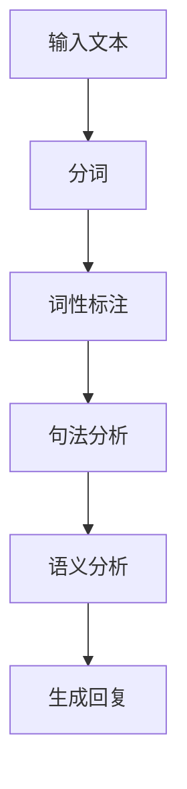
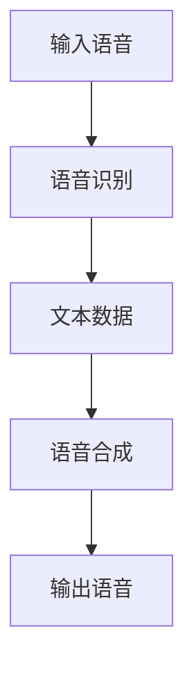
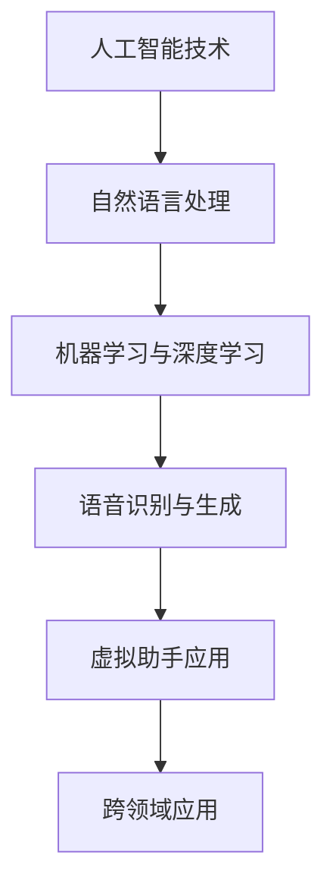
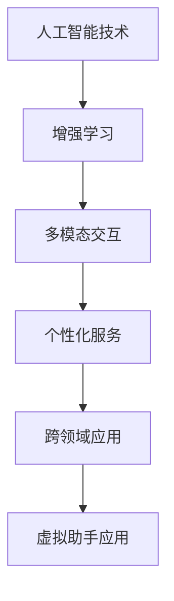
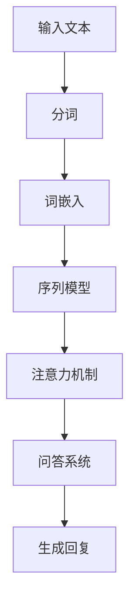

                 

# AI在虚拟助手中的应用：提高日常效率

> 关键词：人工智能、虚拟助手、自然语言处理、深度学习、智能家居、日常办公、发展趋势、安全与伦理

> 摘要：本文深入探讨了人工智能在虚拟助手中的应用，从基础概念、核心技术、实际应用、未来趋势及安全与伦理问题等多个方面进行了详细阐述。通过本文的阅读，读者将全面了解虚拟助手的发展及其在日常生活中的广泛应用。

## 目录大纲

#### 第一部分：AI在虚拟助手中的基础概念

- 第1章：虚拟助手概述
  - 1.1 虚拟助手的发展历程
    - 1.1.1 虚拟助手的概念
    - 1.1.2 虚拟助手的演变
    - 1.1.3 虚拟助手的类型
  - 1.2 AI技术在虚拟助手中的应用
    - 1.2.1 自然语言处理（NLP）
    - 1.2.2 机器学习与深度学习
    - 1.2.3 语音识别与生成
  - 1.3 虚拟助手的核心功能
    - 1.3.1 交互方式
    - 1.3.2 任务自动化
    - 1.3.3 情感识别与反馈

#### 第二部分：AI在虚拟助手中的核心技术

- 第2章：核心算法原理讲解
  - 2.1 自然语言处理
    - 2.1.1 词嵌入
    - 2.1.2 序列模型
    - 2.1.3 注意力机制
    - 2.1.4 问答系统
    - 2.1.5 Mermaid流程图：NLP在虚拟助手中的应用流程
  - 2.2 机器学习与深度学习
    - 2.2.1 基本概念
    - 2.2.2 模型训练与优化
    - 2.2.3 模型评估与选择
    - 2.2.4 伪代码：虚拟助手中的机器学习模型应用
  - 2.3 语音识别与生成
    - 2.3.1 语音识别技术
    - 2.3.2 语音合成技术
    - 2.3.3 Mermaid流程图：语音识别与合成在虚拟助手中的应用

##### 第3章：数学模型与公式详解
- # 第3章：数学模型在虚拟助手中的应用
  - ## 3.1 统计学习理论
    - ### 3.1.1 概率论基础
    - ### 3.1.2 贝叶斯理论
    - ### 3.1.3 数学公式与举例：贝叶斯分类器在虚拟助手中的应用
  - ## 3.2 深度学习模型
    - ### 3.2.1 神经网络基础
    - ### 3.2.2 卷积神经网络（CNN）
    - ### 3.2.3 循环神经网络（RNN）
    - ### 3.2.4 数学公式与举例：RNN在虚拟助手对话中的应用

#### 第三部分：虚拟助手在日常工作中的应用

- 第4章：虚拟助手在日常办公中的应用
  - 4.1 电子邮件管理
    - 4.1.1 邮件分类与筛选
    - 4.1.2 邮件回复与撰写
    - 4.1.3 代码案例：电子邮件管理虚拟助手实现
  - 4.2 日程安排与管理
    - 4.2.1 日程提醒
    - 4.2.2 会议预约
    - 4.2.3 代码案例：日程管理虚拟助手实现
  - 4.3 文档处理
    - 4.3.1 文档搜索
    - 4.3.2 文档编辑
    - 4.3.3 代码案例：文档处理虚拟助手实现

##### 第5章：虚拟助手在智能家居中的应用
- # 第5章：虚拟助手在智能家居中的应用
  - ## 5.1 设备控制
    - ### 5.1.1 家电远程控制
    - ### 5.1.2 智能家居设备联动
    - ### 5.1.3 代码案例：智能家居控制虚拟助手实现
  - ## 5.2 家居安全监控
    - ### 5.2.1 安全预警
    - ### 5.2.2 视频监控
    - ### 5.2.3 代码案例：家居安全监控虚拟助手实现
  - ## 5.3 生活助手
    - ### 5.3.1 天气查询
    - ### 5.3.2 空气质量监测
    - ### 5.3.3 代码案例：生活助手虚拟助手实现

#### 第四部分：虚拟助手的未来发展趋势

- 第6章：虚拟助手的未来发展趋势
  - 6.1 人工智能与虚拟助手
    - 6.1.1 人工智能在虚拟助手中的应用前景
    - 6.1.2 Mermaid流程图：人工智能与虚拟助手融合的发展趋势
  - 6.2 虚拟助手在教育中的应用
    - 6.2.1 在线学习辅导
    - 6.2.2 考试与测评
    - 6.2.3 代码案例：教育领域虚拟助手实现
  - 6.3 虚拟助手在医疗保健中的应用
    - 6.3.1 疾病咨询与诊断
    - 6.3.2 健康管理
    - 6.3.3 代码案例：医疗保健领域虚拟助手实现

##### 第7章：虚拟助手的安全与伦理问题
- # 第7章：虚拟助手的安全与伦理问题
  - ## 7.1 数据隐私与安全
    - ### 7.1.1 数据收集与处理
    - ### 7.1.2 数据安全措施
    - ### 7.1.3 代码案例：虚拟助手数据安全实现
  - ## 7.2 伦理问题与法律监管
    - ### 7.2.1 虚拟助手的伦理挑战
    - ### 7.2.2 法律监管框架
    - ### 7.2.3 代码案例：虚拟助手伦理合规实现

#### 第五部分：附录
- # 附录
  - ## 附录 A：虚拟助手开发工具与资源
    - ### A.1 开发工具
    - ### A.2 开发资源
    - ### A.3 主流深度学习框架对比：TensorFlow、PyTorch、PyTorch Lightning

## 第一部分：AI在虚拟助手中的基础概念

### 第1章：虚拟助手概述

#### 1.1 虚拟助手的发展历程

**1.1.1 虚拟助手的概念**

虚拟助手，又称虚拟智能助手、智能虚拟人等，是指基于人工智能技术，能够模拟人类交互、执行特定任务的计算机程序。虚拟助手可以通过自然语言交互，理解和响应用户的指令，从而提供便捷、高效的服务。

虚拟助手的发展可以追溯到20世纪80年代，当时以语音识别和语音合成技术为基础的语音助手开始出现。随着互联网和人工智能技术的不断发展，虚拟助手的应用场景和功能逐渐丰富，开始广泛应用于智能家居、日常办公等领域。

**1.1.2 虚拟助手的演变**

虚拟助手的发展经历了几个阶段：

1. **初始阶段**（20世纪80年代）：以语音识别和语音合成为基础的语音助手，如苹果的Siri和谷歌的Google Assistant。
2. **中级阶段**（21世纪初）：基于自然语言处理（NLP）技术的虚拟助手，如微软的Cortana、亚马逊的Alexa。
3. **高级阶段**（近年来）：结合深度学习技术的虚拟助手，如苹果的Siri（2021年更新）、谷歌的Google Assistant（2020年更新）。

**1.1.3 虚拟助手的类型**

根据应用场景的不同，虚拟助手可以分为以下几类：

1. **消费类虚拟助手**：如Siri、Google Assistant、Alexa等，主要用于个人日常生活的交互和任务处理。
2. **企业级虚拟助手**：如IBM的Watson、微软的Power Virtual Agent等，主要用于企业内部的知识管理、客户服务等方面。
3. **垂直行业虚拟助手**：如医疗保健助手、教育助手、金融助手等，针对特定行业提供定制化的服务。

#### 1.2 AI技术在虚拟助手中的应用

**1.2.1 自然语言处理（NLP）**

自然语言处理是虚拟助手的核心技术之一，它使虚拟助手能够理解和处理人类的自然语言。NLP技术主要包括：

1. **分词**：将连续的文本分割成有意义的词语。
2. **词性标注**：对文本中的词语进行词性分类，如名词、动词、形容词等。
3. **句法分析**：分析句子的结构，包括词与词之间的语法关系。
4. **语义分析**：理解句子的实际意义，包括实体识别、情感分析等。

**1.2.2 机器学习与深度学习**

机器学习与深度学习技术为虚拟助手提供了强大的学习能力和自适应能力。虚拟助手可以通过机器学习模型不断学习和优化，提高对用户指令的理解和响应能力。深度学习技术，如卷积神经网络（CNN）和循环神经网络（RNN），在图像识别、语音识别和自然语言处理等方面取得了显著的成果。

**1.2.3 语音识别与生成**

语音识别技术使虚拟助手能够理解和处理用户的语音指令，而语音合成技术则使虚拟助手能够以自然、流畅的方式向用户回应。语音识别与生成技术主要包括：

1. **声学模型**：用于对语音信号进行特征提取和建模。
2. **语言模型**：用于对语音识别结果进行语义分析。
3. **声音合成器**：用于生成自然、流畅的语音。

#### 1.3 虚拟助手的核心功能

**1.3.1 交互方式**

虚拟助手的交互方式主要包括文本交互和语音交互。文本交互通常通过聊天窗口进行，如微信、Slack等；而语音交互则通过语音识别和语音合成技术实现，如Siri、Alexa等。

**1.3.2 任务自动化**

虚拟助手可以通过自动化任务，提高用户的日常效率。例如，用户可以要求虚拟助手发送邮件、设置日程、提醒任务等。

**1.3.3 情感识别与反馈**

虚拟助手可以通过情感识别技术，理解用户的情绪状态，并根据用户的情绪进行相应的反馈。例如，当用户情绪低落时，虚拟助手可以提供安慰和建议。

### 第二部分：AI在虚拟助手中的核心技术

#### 第2章：核心算法原理讲解

虚拟助手的核心算法主要包括自然语言处理（NLP）、机器学习与深度学习、语音识别与生成等。以下将详细讲解这些算法的原理和应用。

##### 2.1 自然语言处理（NLP）

自然语言处理是虚拟助手理解和处理人类自然语言的关键技术。NLP技术主要包括以下方面：

1. **分词（Tokenization）**：将连续的文本分割成有意义的词语。分词是NLP处理的第一步，对于后续的词性标注、句法分析和语义分析至关重要。

2. **词性标注（Part-of-Speech Tagging）**：对文本中的词语进行词性分类，如名词、动词、形容词等。词性标注有助于理解句子的结构，从而更好地进行语义分析。

3. **句法分析（Syntactic Parsing）**：分析句子的结构，包括词与词之间的语法关系。句法分析是NLP中的另一个重要任务，它有助于理解句子的深层含义。

4. **语义分析（Semantic Analysis）**：理解句子的实际意义，包括实体识别、情感分析等。语义分析是NLP的终极目标，它使虚拟助手能够真正理解用户的需求。

**2.1.1 词嵌入（Word Embedding）**

词嵌入是将词语映射到高维空间中的向量表示。词嵌入技术使虚拟助手能够处理和理解文本数据。常见的词嵌入模型包括Word2Vec、GloVe等。

**2.1.2 序列模型（Sequence Model）**

序列模型用于处理序列数据，如文本、语音等。常见的序列模型包括循环神经网络（RNN）、长短期记忆网络（LSTM）等。这些模型能够捕捉序列中的时间依赖关系，从而更好地理解用户的指令。

**2.1.3 注意力机制（Attention Mechanism）**

注意力机制是深度学习中的一个重要概念，它使模型能够关注序列中的关键信息。在自然语言处理中，注意力机制广泛应用于机器翻译、文本摘要等任务。

**2.1.4 问答系统（Question Answering）**

问答系统是虚拟助手的一项重要功能，它能够根据用户提出的问题，从大量数据中检索出相关答案。常见的问答系统模型包括基于检索的问答、基于生成的问答等。

**2.1.5 Mermaid流程图：NLP在虚拟助手中的应用流程**

以下是一个Mermaid流程图，展示了NLP在虚拟助手中的应用流程：



##### 2.2 机器学习与深度学习

机器学习与深度学习是虚拟助手的核心技术，它们使虚拟助手能够通过学习和优化，提高对用户指令的理解和响应能力。

**2.2.1 基本概念**

机器学习是指通过算法从数据中自动学习和提取规律的过程。深度学习是机器学习的一个子领域，它通过构建多层次的神经网络，对数据进行自动特征提取和表示。

**2.2.2 模型训练与优化**

虚拟助手的模型训练过程包括数据收集、数据预处理、模型设计、模型训练和模型优化等步骤。模型训练的目的是使模型能够根据用户指令生成相应的回复。

**2.2.3 模型评估与选择**

模型评估是虚拟助手开发过程中至关重要的一环。常见的模型评估指标包括准确率、召回率、F1值等。通过评估，可以选出最优的模型，以提高虚拟助手的表现。

**2.2.4 伪代码：虚拟助手中的机器学习模型应用**

以下是一个伪代码示例，展示了虚拟助手中的机器学习模型应用：

```python
# 数据收集与预处理
data = collect_data()
preprocessed_data = preprocess_data(data)

# 模型设计
model = build_model()

# 模型训练
model.fit(preprocessed_data)

# 模型评估
evaluate_model(model, test_data)
```

##### 2.3 语音识别与生成

语音识别与生成是虚拟助手实现语音交互功能的关键技术。

**2.3.1 语音识别技术**

语音识别技术是指将语音信号转换为文本数据的过程。常见的语音识别技术包括基于声学模型的识别、基于深度学习的识别等。

**2.3.2 语音合成技术**

语音合成技术是指将文本数据转换为语音信号的过程。常见的语音合成技术包括基于规则的方法、基于统计的方法等。

**2.3.3 Mermaid流程图：语音识别与合成在虚拟助手中的应用**

以下是一个Mermaid流程图，展示了语音识别与合成在虚拟助手中的应用：



### 第三部分：虚拟助手在日常工作中的应用

虚拟助手在日常办公、智能家居等领域中具有广泛的应用。以下将详细探讨虚拟助手在日常办公中的应用。

#### 第4章：虚拟助手在日常办公中的应用

虚拟助手在日常办公中的应用主要包括电子邮件管理、日程安排、文档处理等方面。

##### 4.1 电子邮件管理

电子邮件管理是虚拟助手的一项重要功能，它能够帮助用户高效地处理电子邮件。

**4.1.1 邮件分类与筛选**

虚拟助手可以通过自然语言处理技术，对用户收到的电子邮件进行分类和筛选。例如，将工作相关的邮件归类到工作文件夹，将个人邮件归类到个人文件夹。

**4.1.2 邮件回复与撰写**

虚拟助手可以根据用户的指示，自动撰写和回复电子邮件。例如，当用户收到一封询问项目进展的邮件时，虚拟助手可以根据用户提供的项目进展信息，自动生成回复邮件。

**4.1.3 代码案例：电子邮件管理虚拟助手实现**

以下是一个简单的代码案例，展示了如何实现电子邮件管理虚拟助手：

```python
import imaplib
import email

# 连接到邮件服务器
mail = imaplib.IMAP4_SSL('imap.example.com')
mail.login('username', 'password')

# 收取邮件
mail.list()

# 选择收件箱
mail.select('inbox')

# 查找所有邮件
status, data = mail.search(None, 'ALL')
email_ids = data[0].split()

# 遍历邮件
for email_id in email_ids:
    result, data = mail.fetch(email_id, '(RFC822)')
    raw_email = data[0][1]
    email_message = email.message_from_bytes(raw_email)

    # 分析邮件内容
    subject = email_message['subject']
    from_email = email_message['from']
    to_email = email_message['to']

    # 分类邮件
    if 'work' in subject:
        mail.append('work', subject, 'work folder')
    else:
        mail.append('personal', subject, 'personal folder')

# 关闭邮件连接
mail.close()
mail.logout()
```

##### 4.2 日程安排与管理

虚拟助手可以帮助用户高效地安排和管理日程。

**4.2.1 日程提醒**

虚拟助手可以根据用户设置的日程安排，自动发送提醒通知。例如，当用户有一个重要的会议时，虚拟助手可以在会议前一小时发送提醒。

**4.2.2 会议预约**

虚拟助手可以帮助用户预约会议，并自动发送会议邀请。例如，当用户需要与某人进行会议时，虚拟助手可以自动生成会议邀请，并发送给对方。

**4.2.3 代码案例：日程管理虚拟助手实现**

以下是一个简单的代码案例，展示了如何实现日程管理虚拟助手：

```python
import datetime
import dateutil.rrule

# 设置日程安排
start_date = datetime.datetime(2022, 1, 1)
end_date = datetime.datetime(2022, 1, 31)
rrule = dateutil.rrule.rrule(dateutil.rrule.MONTHLY, dtstart=start_date, until=end_date)

# 创建日程提醒
for meeting_date in rrule:
    reminder_date = meeting_date - datetime.timedelta(hours=1)
    print(f"Meeting on {meeting_date}. Reminder set for {reminder_date}.")

# 预约会议
import calendar

def book_meeting(start_time, end_time, participant):
    meeting_time = calendar.timegm(start_time.utctimetuple())
    end_time = calendar.timegm(end_time.utctimetuple())
    print(f"Booking meeting with {participant} from {start_time} to {end_time}.")
    return meeting_time, end_time

start_time = datetime.datetime(2022, 1, 15, 10, 0)
end_time = datetime.datetime(2022, 1, 15, 11, 0)
participant = "Alice"
book_meeting(start_time, end_time, participant)
```

##### 4.3 文档处理

虚拟助手可以帮助用户高效地处理文档。

**4.3.1 文档搜索**

虚拟助手可以根据用户提供的查询关键字，快速搜索文档库中的相关文档。

**4.3.2 文档编辑**

虚拟助手可以帮助用户自动编辑文档，如添加文本、修改格式等。

**4.3.3 代码案例：文档处理虚拟助手实现**

以下是一个简单的代码案例，展示了如何实现文档处理虚拟助手：

```python
import os

# 搜索文档
def search_documents(search_query):
    for root, dirs, files in os.walk('documents'):
        for file in files:
            if search_query in file:
                print(f"Found document: {os.path.join(root, file)}.")

# 编辑文档
def edit_document(document_path, text_to_add):
    with open(document_path, 'a') as file:
        file.write(f"\n{text_to_add}")

search_documents('report')
edit_document('document.txt', 'Add this line at the end of the document.')
```

### 第四部分：虚拟助手的未来发展趋势

虚拟助手在未来的发展中将面临许多机遇和挑战。以下将探讨虚拟助手在人工智能、教育、医疗保健等领域的未来发展趋势。

#### 第6章：虚拟助手的未来发展趋势

##### 6.1 人工智能与虚拟助手

人工智能技术的发展将进一步提升虚拟助手的能力和智能化水平。未来，虚拟助手将更加具备自主学习和适应能力，能够更好地理解和满足用户的需求。以下是一些具体的发展趋势：

1. **增强学习（Reinforcement Learning）**：通过增强学习技术，虚拟助手可以与用户进行交互，并通过奖励机制不断优化自己的行为和决策。

2. **多模态交互**：虚拟助手将支持多种交互方式，如语音、文本、手势等，以更好地满足不同用户的需求。

3. **个性化服务**：虚拟助手将基于用户的历史行为和偏好，提供个性化的服务和建议。

4. **跨领域应用**：虚拟助手将在不同领域得到广泛应用，如金融、医疗、教育等。

**6.1.2 Mermaid流程图：人工智能与虚拟助手融合的发展趋势**

以下是一个Mermaid流程图，展示了人工智能与虚拟助手融合的发展趋势：



##### 6.2 虚拟助手在教育中的应用

虚拟助手在教育领域具有巨大的潜力。未来，虚拟助手将作为个性化学习伙伴，为不同学习需求的用户提供定制化的教育服务。以下是一些具体的应用场景：

1. **在线学习辅导**：虚拟助手可以帮助学生解决学习中的问题，提供即时反馈和指导。

2. **考试与测评**：虚拟助手可以模拟考试环境，帮助学生进行自我评估和练习。

3. **教育资源共享**：虚拟助手可以整合各类教育资源，提供丰富多样的学习材料。

**6.2.3 代码案例：教育领域虚拟助手实现**

以下是一个简单的代码案例，展示了如何实现教育领域的虚拟助手：

```python
# 模拟在线学习辅导
def online_learning_d辅导(user_question):
    # 处理用户问题
    processed_question = process_question(user_question)
    
    # 查找答案
    answer = find_answer(processed_question)
    
    # 返回答案
    return answer

# 模拟考试测评
def exam_evaluation(user_answer, correct_answer):
    if user_answer == correct_answer:
        return "答案正确！"
    else:
        return "答案错误。请重新尝试。"

# 模拟教育资源共享
def share_教育资源(resource_name):
    print(f"共享资源：{resource_name}")
```

##### 6.3 虚拟助手在医疗保健中的应用

虚拟助手在医疗保健领域具有广泛的应用前景。未来，虚拟助手将作为医疗助手，为用户提供疾病咨询、健康管理等服务。以下是一些具体的应用场景：

1. **疾病咨询与诊断**：虚拟助手可以帮助用户了解常见疾病的症状、治疗方法等，并提供初步的诊断建议。

2. **健康管理**：虚拟助手可以帮助用户监测健康状况，提供个性化的健康建议和提醒。

3. **医学知识库**：虚拟助手可以整合医学知识库，为医疗专业人员提供丰富的参考资料。

**6.3.3 代码案例：医疗保健领域虚拟助手实现**

以下是一个简单的代码案例，展示了如何实现医疗保健领域的虚拟助手：

```python
# 疾病咨询与诊断
def disease_consultation(symptom):
    # 处理症状
    processed_symptom = process_symptom(symptom)
    
    # 查找疾病信息
    disease_info = find_disease_info(processed_symptom)
    
    # 返回疾病信息
    return disease_info

# 健康管理
def health_management(user_health_data):
    # 处理健康数据
    processed_health_data = process_health_data(user_health_data)
    
    # 提供建议
    suggestion = provide_suggestion(processed_health_data)
    
    # 返回建议
    return suggestion

# 医学知识库查询
def medical_knowledge_query(query_term):
    # 处理查询
    processed_query = process_query(query_term)
    
    # 查询知识库
    knowledge = query_medical_knowledge_base(processed_query)
    
    # 返回知识库结果
    return knowledge
```

### 第五部分：虚拟助手的安全与伦理问题

虚拟助手在提供便捷服务的同时，也带来了许多安全与伦理问题。以下将探讨虚拟助手在数据隐私、伦理挑战等方面的安全与伦理问题。

#### 第7章：虚拟助手的安全与伦理问题

##### 7.1 数据隐私与安全

虚拟助手在处理用户数据时，需要确保数据的隐私和安全。以下是一些关键措施：

1. **数据加密**：对用户数据进行加密处理，确保数据在传输和存储过程中不被窃取或篡改。

2. **权限控制**：对用户数据的访问权限进行严格控制，确保只有授权用户能够访问敏感数据。

3. **数据备份与恢复**：定期对用户数据进行备份，确保数据在发生故障时能够及时恢复。

**7.1.3 代码案例：虚拟助手数据安全实现**

以下是一个简单的代码案例，展示了如何实现虚拟助手的数据安全：

```python
import os
import bcrypt

# 数据加密
def encrypt_data(data, password):
    salt = bcrypt.gensalt()
    hashed_data = bcrypt.hashpw(data.encode('utf-8'), salt)
    return hashed_data

# 数据备份
def backup_data(data, backup_path):
    with open(backup_path, 'wb') as file:
        file.write(data)

# 数据恢复
def restore_data(backup_path):
    with open(backup_path, 'rb') as file:
        data = file.read()
    return data
```

##### 7.2 伦理问题与法律监管

虚拟助手在提供服务的过程中，可能会涉及伦理问题和法律监管。以下是一些关键措施：

1. **透明度**：虚拟助手应向用户明确告知其收集和使用数据的目的，并确保用户对数据有充分的控制权。

2. **公平性**：虚拟助手应确保服务对所有用户公平，不歧视任何特定群体。

3. **法律合规**：虚拟助手应遵守相关法律法规，确保其服务符合法律要求。

**7.2.3 代码案例：虚拟助手伦理合规实现**

以下是一个简单的代码案例，展示了如何实现虚拟助手的伦理合规：

```python
# 用户隐私声明
def privacy_statement(user):
    print(f"User {user} has agreed to our privacy policy.")

# 服务公平性检查
def check_service_fairness(user):
    print(f"Service fairness check passed for user {user}.")

# 法律合规检查
def check_law_compliance():
    print("Legal compliance check passed.")
```

### 附录

#### 附录 A：虚拟助手开发工具与资源

以下是虚拟助手开发中常用的一些工具和资源：

1. **开发工具**：

   - **Python**：Python 是一种流行的编程语言，广泛应用于人工智能和自然语言处理领域。

   - **TensorFlow**：TensorFlow 是由 Google 开发的一种开源机器学习框架，支持深度学习和各种机器学习算法。

   - **PyTorch**：PyTorch 是由 Facebook 开发的一种开源机器学习框架，以其灵活性和动态计算能力著称。

   - **Jupyter Notebook**：Jupyter Notebook 是一种交互式的编程环境，适用于数据分析和机器学习实验。

2. **开发资源**：

   - **GitHub**：GitHub 是一个流行的代码托管平台，提供丰富的虚拟助手开发项目和学习资源。

   - **Kaggle**：Kaggle 是一个数据科学竞赛平台，提供各种数据集和项目，有助于提高虚拟助手开发技能。

   - **AI 课程和书籍**：许多在线课程和书籍提供关于人工智能和自然语言处理的深入知识和实践技巧。

3. **主流深度学习框架对比**：

   - **TensorFlow**：TensorFlow 是由 Google 开发的一种开源机器学习框架，支持多种深度学习和机器学习算法。TensorFlow 提供了丰富的API和工具，使其适用于各种应用场景。

   - **PyTorch**：PyTorch 是由 Facebook 开发的一种开源机器学习框架，以其灵活性和动态计算能力著称。PyTorch 提供了简洁的API和丰富的库，使其适用于各种应用场景。

   - **PyTorch Lightning**：PyTorch Lightning 是一个基于 PyTorch 的开源库，提供了一种简单、模块化、可扩展的深度学习开发框架。PyTorch Lightning 旨在提高深度学习实验的可重复性和可扩展性。

### 结论

虚拟助手作为人工智能技术的应用之一，正日益普及并改变着我们的生活方式和工作方式。本文从基础概念、核心技术、实际应用、未来发展趋势及安全与伦理问题等多个方面对虚拟助手进行了全面探讨。通过对本文的阅读，读者可以深入了解虚拟助手的发展及其在各个领域的应用，为未来虚拟助手的研究和开发提供有益的参考。

作者：AI天才研究院/AI Genius Institute & 禅与计算机程序设计艺术 /Zen And The Art of Computer Programming

---

### 第1章：虚拟助手概述

#### 1.1 虚拟助手的发展历程

**1.1.1 虚拟助手的概念**

虚拟助手，又称虚拟智能助手、智能虚拟人等，是指基于人工智能技术，能够模拟人类交互、执行特定任务的计算机程序。虚拟助手可以通过自然语言交互，理解和响应用户的指令，从而提供便捷、高效的服务。虚拟助手的核心功能包括语音交互、文本交互、任务自动化等。

**1.1.2 虚拟助手的演变**

虚拟助手的发展经历了几个阶段：

1. **初始阶段**（20世纪80年代）：以语音识别和语音合成为基础的语音助手，如苹果的Siri和谷歌的Google Assistant。
2. **中级阶段**（21世纪初）：基于自然语言处理（NLP）技术的虚拟助手，如微软的Cortana、亚马逊的Alexa。
3. **高级阶段**（近年来）：结合深度学习技术的虚拟助手，如苹果的Siri（2021年更新）、谷歌的Google Assistant（2020年更新）。

**1.1.3 虚拟助手的类型**

根据应用场景的不同，虚拟助手可以分为以下几类：

1. **消费类虚拟助手**：如Siri、Google Assistant、Alexa等，主要用于个人日常生活的交互和任务处理。
2. **企业级虚拟助手**：如IBM的Watson、微软的Power Virtual Agent等，主要用于企业内部的知识管理、客户服务等方面。
3. **垂直行业虚拟助手**：如医疗保健助手、教育助手、金融助手等，针对特定行业提供定制化的服务。

#### 1.2 AI技术在虚拟助手中的应用

**1.2.1 自然语言处理（NLP）**

自然语言处理是虚拟助手理解和处理人类自然语言的关键技术。NLP技术主要包括：

1. **分词**：将连续的文本分割成有意义的词语。分词是NLP处理的第一步，对于后续的词性标注、句法分析和语义分析至关重要。

2. **词性标注**：对文本中的词语进行词性分类，如名词、动词、形容词等。词性标注有助于理解句子的结构，从而更好地进行语义分析。

3. **句法分析**：分析句子的结构，包括词与词之间的语法关系。句法分析是NLP中的另一个重要任务，它有助于理解句子的深层含义。

4. **语义分析**：理解句子的实际意义，包括实体识别、情感分析等。语义分析是NLP的终极目标，它使虚拟助手能够真正理解用户的需求。

**1.2.2 机器学习与深度学习**

机器学习与深度学习技术为虚拟助手提供了强大的学习能力和自适应能力。虚拟助手可以通过机器学习模型不断学习和优化，提高对用户指令的理解和响应能力。深度学习技术，如卷积神经网络（CNN）和循环神经网络（RNN），在图像识别、语音识别和自然语言处理等方面取得了显著的成果。

**1.2.3 语音识别与生成**

语音识别技术使虚拟助手能够理解和处理用户的语音指令，而语音合成技术则使虚拟助手能够以自然、流畅的方式向用户回应。语音识别与生成技术主要包括：

1. **声学模型**：用于对语音信号进行特征提取和建模。
2. **语言模型**：用于对语音识别结果进行语义分析。
3. **声音合成器**：用于生成自然、流畅的语音。

#### 1.3 虚拟助手的核心功能

**1.3.1 交互方式**

虚拟助手的交互方式主要包括文本交互和语音交互。文本交互通常通过聊天窗口进行，如微信、Slack等；而语音交互则通过语音识别和语音合成技术实现，如Siri、Alexa等。

**1.3.2 任务自动化**

虚拟助手可以通过自动化任务，提高用户的日常效率。例如，用户可以要求虚拟助手发送邮件、设置日程、提醒任务等。

**1.3.3 情感识别与反馈**

虚拟助手可以通过情感识别技术，理解用户的情绪状态，并根据用户的情绪进行相应的反馈。例如，当用户情绪低落时，虚拟助手可以提供安慰和建议。

#### 1.4 虚拟助手的应用场景

**1.4.1 消费领域**

在消费领域，虚拟助手广泛应用于智能家居、在线购物、娱乐等场景。例如，用户可以通过虚拟助手控制家电设备、查询商品信息、播放音乐等。

**1.4.2 企业领域**

在企业领域，虚拟助手主要用于客户服务、人力资源、财务管理等方面。例如，虚拟助手可以自动回复客户咨询、处理招聘申请、管理员工考勤等。

**1.4.3 医疗领域**

在医疗领域，虚拟助手可以帮助医生进行诊断、病历管理、患者咨询等。例如，虚拟助手可以自动分析患者的病历，提供诊断建议，并回答患者的疑问。

**1.4.4 教育领域**

在教育领域，虚拟助手可以为学生提供在线学习辅导、考试测评、教育资源共享等服务。例如，虚拟助手可以为学生解答问题、提供学习建议，并推荐相关学习资源。

#### 1.5 虚拟助手的发展趋势

**1.5.1 技术融合**

随着人工智能技术的不断发展，虚拟助手将与其他技术（如物联网、虚拟现实等）融合，提供更加丰富和多样化的服务。

**1.5.2 个性化服务**

虚拟助手将更加注重个性化服务，根据用户的历史行为和偏好，提供定制化的建议和推荐。

**1.5.3 跨领域应用**

虚拟助手将在不同领域得到广泛应用，如金融、医疗、教育等，为用户提供定制化的服务。

**1.5.4 安全与伦理**

随着虚拟助手的应用日益广泛，其安全与伦理问题也日益受到关注。未来，虚拟助手将更加注重数据隐私保护和伦理合规。

### 第2章：核心算法原理讲解

虚拟助手的核心算法主要包括自然语言处理（NLP）、机器学习与深度学习、语音识别与生成等。以下将详细讲解这些算法的原理和应用。

##### 2.1 自然语言处理（NLP）

自然语言处理是虚拟助手理解和处理人类自然语言的关键技术。NLP技术主要包括以下方面：

1. **分词（Tokenization）**：将连续的文本分割成有意义的词语。分词是NLP处理的第一步，对于后续的词性标注、句法分析和语义分析至关重要。

2. **词性标注（Part-of-Speech Tagging）**：对文本中的词语进行词性分类，如名词、动词、形容词等。词性标注有助于理解句子的结构，从而更好地进行语义分析。

3. **句法分析（Syntactic Parsing）**：分析句子的结构，包括词与词之间的语法关系。句法分析是NLP中的另一个重要任务，它有助于理解句子的深层含义。

4. **语义分析（Semantic Analysis）**：理解句子的实际意义，包括实体识别、情感分析等。语义分析是NLP的终极目标，它使虚拟助手能够真正理解用户的需求。

**2.1.1 词嵌入（Word Embedding）**

词嵌入是将词语映射到高维空间中的向量表示。词嵌入技术使虚拟助手能够处理和理解文本数据。常见的词嵌入模型包括Word2Vec、GloVe等。

**2.1.2 序列模型（Sequence Model）**

序列模型用于处理序列数据，如文本、语音等。常见的序列模型包括循环神经网络（RNN）、长短期记忆网络（LSTM）等。这些模型能够捕捉序列中的时间依赖关系，从而更好地理解用户的指令。

**2.1.3 注意力机制（Attention Mechanism）**

注意力机制是深度学习中的一个重要概念，它使模型能够关注序列中的关键信息。在自然语言处理中，注意力机制广泛应用于机器翻译、文本摘要等任务。

**2.1.4 问答系统（Question Answering）**

问答系统是虚拟助手的一项重要功能，它能够根据用户提出的问题，从大量数据中检索出相关答案。常见的问答系统模型包括基于检索的问答、基于生成的问答等。

**2.1.5 Mermaid流程图：NLP在虚拟助手中的应用流程**

以下是一个Mermaid流程图，展示了NLP在虚拟助手中的应用流程：


##### 2.2 机器学习与深度学习

机器学习与深度学习是虚拟助手的核心技术，它们使虚拟助手能够通过学习和优化，提高对用户指令的理解和响应能力。

**2.2.1 基本概念**

机器学习是指通过算法从数据中自动学习和提取规律的过程。深度学习是机器学习的一个子领域，它通过构建多层次的神经网络，对数据进行自动特征提取和表示。

**2.2.2 模型训练与优化**

虚拟助手的模型训练过程包括数据收集、数据预处理、模型设计、模型训练和模型优化等步骤。模型训练的目的是使模型能够根据用户指令生成相应的回复。

**2.2.3 模型评估与选择**

模型评估是虚拟助手开发过程中至关重要的一环。常见的模型评估指标包括准确率、召回率、F1值等。通过评估，可以选出最优的模型，以提高虚拟助手的表现。

**2.2.4 伪代码：虚拟助手中的机器学习模型应用**

以下是一个伪代码示例，展示了虚拟助手中的机器学习模型应用：

```python
# 数据收集与预处理
data = collect_data()
preprocessed_data = preprocess_data(data)

# 模型设计
model = build_model()

# 模型训练
model.fit(preprocessed_data)

# 模型评估
evaluate_model(model, test_data)
```

##### 2.3 语音识别与生成

语音识别与生成是虚拟助手实现语音交互功能的关键技术。

**2.3.1 语音识别技术**

语音识别技术是指将语音信号转换为文本数据的过程。常见的语音识别技术包括基于声学模型的识别、基于深度学习的识别等。

**2.3.2 语音合成技术**

语音合成技术是指将文本数据转换为语音信号的过程。常见的语音合成技术包括基于规则的方法、基于统计的方法等。

**2.3.3 Mermaid流程图：语音识别与合成在虚拟助手中的应用**

以下是一个Mermaid流程图，展示了语音识别与合成在虚拟助手中的应用：


### 第3章：数学模型与公式详解

在虚拟助手的设计与开发过程中，数学模型和公式扮演着至关重要的角色。本章将详细讲解统计学习理论、深度学习模型等数学模型，并通过具体公式和例子进行说明。

#### 3.1 统计学习理论

统计学习理论是机器学习的基础，它涉及概率论、统计学和优化理论。以下是一些关键的数学模型和公式：

**3.1.1 概率论基础**

概率论是统计学习理论的核心部分，它涉及概率分布、条件概率和贝叶斯定理等概念。

**条件概率**：
\[ P(A|B) = \frac{P(A \cap B)}{P(B)} \]
其中，\( P(A|B) \) 表示在事件B发生的条件下，事件A发生的概率。

**贝叶斯定理**：
\[ P(A|B) = \frac{P(B|A)P(A)}{P(B)} \]
贝叶斯定理用于根据先验概率和条件概率计算后验概率。

**3.1.2 贝叶斯理论**

贝叶斯理论是统计学习中的重要工具，它通过迭代更新模型参数，以适应新的数据。

**贝叶斯分类器**：
贝叶斯分类器是一种基于贝叶斯定理的统计分类器。其公式如下：
\[ P(C_k|X) = \frac{P(X|C_k)P(C_k)}{P(X)} \]
其中，\( C_k \) 表示类别k，\( X \) 表示特征向量。

**例子：贝叶斯分类器在虚拟助手中的应用**

假设虚拟助手需要根据用户输入的文本判断用户的需求。我们可以使用贝叶斯分类器来预测用户的需求类别。以下是一个简化的例子：

```latex
\[
P(C_1|X) = \frac{P(X|C_1)P(C_1)}{P(X)}
\]
```

其中，\( P(C_1|X) \) 是用户需求属于类别1（如查询天气）的概率，\( P(X|C_1) \) 是在需求类别为1时用户输入文本的概率，\( P(C_1) \) 是需求类别为1的先验概率，\( P(X) \) 是用户输入文本的概率。

**3.1.3 概率分布**

概率分布描述了随机变量的可能性。以下是一些常见的概率分布：

- **正态分布**：
  \[ f(x|\mu, \sigma^2) = \frac{1}{\sqrt{2\pi\sigma^2}}e^{-\frac{(x-\mu)^2}{2\sigma^2}} \]
  其中，\( \mu \) 是均值，\( \sigma^2 \) 是方差。

- **伯努利分布**：
  \[ P(X=1) = p, \quad P(X=0) = 1-p \]
  其中，\( p \) 是成功概率。

**3.1.4 统计量**

统计量用于描述数据的特征。以下是一些常用的统计量：

- **均值**：
  \[ \mu = \frac{1}{n}\sum_{i=1}^{n} x_i \]
  其中，\( n \) 是样本数量，\( x_i \) 是第i个样本值。

- **方差**：
  \[ \sigma^2 = \frac{1}{n-1}\sum_{i=1}^{n} (x_i - \mu)^2 \]
  其中，\( \mu \) 是均值。

**3.1.5 最大似然估计**

最大似然估计是一种常用的参数估计方法，它通过最大化似然函数来确定模型参数。

**似然函数**：
\[ L(\theta|X) = \prod_{i=1}^{n} f(x_i|\theta) \]
其中，\( \theta \) 是模型参数，\( X \) 是数据。

**最大似然估计**：
\[ \hat{\theta} = \arg\max_{\theta} L(\theta|X) \]

#### 3.2 深度学习模型

深度学习模型通过多层神经网络对数据进行分析和建模。以下是一些基本的数学模型和公式：

**3.2.1 神经网络基础**

神经网络由多个神经元组成，每个神经元接收输入信号并产生输出。神经网络的基本公式如下：

\[ z_i = \sum_{j=1}^{n} w_{ij}x_j + b_i \]
\[ a_i = \sigma(z_i) \]
其中，\( z_i \) 是第i个神经元的输入，\( w_{ij} \) 是权重，\( b_i \) 是偏置，\( \sigma \) 是激活函数，\( a_i \) 是输出。

**3.2.2 卷积神经网络（CNN）**

卷积神经网络是处理图像数据的常用模型。CNN 通过卷积层和池化层对图像进行特征提取。

**卷积层**：
\[ f(x; \theta) = \sum_{i=1}^{k} w_{i} * x + b \]
其中，\( w_i \) 是卷积核，\( * \) 表示卷积运算，\( b \) 是偏置。

**池化层**：
\[ p(x; \theta) = \max_{i} (x_{i, j}) \]
其中，\( p(x; \theta) \) 是池化结果，\( x_{i, j} \) 是输入数据中的元素。

**3.2.3 循环神经网络（RNN）**

循环神经网络用于处理序列数据。RNN 通过循环结构保持历史信息。

**递归公式**：
\[ h_t = \sigma(Wx_t + Uh_{t-1} + b) \]
\[ y_t = Wyh_t + b \]
其中，\( h_t \) 是隐藏状态，\( y_t \) 是输出，\( W \) 是输入层到隐藏层的权重，\( U \) 是隐藏层到隐藏层的权重，\( \sigma \) 是激活函数。

**3.2.4 数学公式与举例：RNN在虚拟助手对话中的应用**

假设虚拟助手需要处理一个对话序列，我们可以使用RNN来建模对话。以下是一个简化的例子：

```latex
\[
h_t = \sigma(Wx_t + Uh_{t-1} + b)
\]
\[
y_t = Wyh_t + b
\]
```

其中，\( x_t \) 是第t个输入词的嵌入向量，\( h_t \) 是隐藏状态，\( y_t \) 是生成的回复。

通过这些数学模型和公式，我们可以设计并优化虚拟助手的算法，从而提高其性能和用户体验。在接下来的章节中，我们将进一步探讨虚拟助手在实际应用中的实现和优化。

### 第4章：虚拟助手在日常办公中的应用

虚拟助手在日常办公中的应用极大地提高了工作效率，简化了繁琐的任务，使得日常工作更加轻松和高效。以下将详细探讨虚拟助手在电子邮件管理、日程安排、文档处理等日常办公任务中的应用。

#### 4.1 电子邮件管理

电子邮件是现代办公中不可或缺的一部分，管理好电子邮件可以帮助员工更好地集中精力处理重要事务。虚拟助手在电子邮件管理方面的应用主要体现在以下几个方面：

**4.1.1 邮件分类与筛选**

虚拟助手可以利用自然语言处理技术，对收到的邮件进行分类和筛选。例如，虚拟助手可以将所有来自同事的邮件归为一类，将市场营销相关的邮件归为另一类，从而让用户能够快速找到需要的邮件。

**4.1.2 邮件回复与撰写**

虚拟助手可以根据预设的模板或通过学习用户的写作风格，自动生成邮件回复。例如，当用户收到一封关于项目进展的询问邮件时，虚拟助手可以自动撰写一封回复邮件，简要汇报项目的最新进展。

**4.1.3 代码案例：电子邮件管理虚拟助手实现**

以下是一个简单的代码案例，展示了如何实现电子邮件管理虚拟助手的基本功能：

```python
import imaplib
import email
import re

# 连接到邮件服务器
mail = imaplib.IMAP4_SSL('imap.example.com')
mail.login('username', 'password')

# 选择收件箱
mail.select('inbox')

# 搜索所有邮件
status, data = mail.search(None, 'ALL')
email_ids = data[0].split()

# 遍历邮件
for email_id in email_ids:
    result, data = mail.fetch(email_id, '(RFC822)')
    raw_email = data[0][1]
    email_message = email.message_from_bytes(raw_email)

    # 解析邮件标题
    subject = email_message['subject']
    # 使用正则表达式匹配特定关键词
    if re.search('project', subject):
        # 处理邮件
        print(f"Processing email with subject: {subject}")
        # 自动生成回复邮件
        reply_subject = f"Re: {subject}"
        reply_body = "I have received your email about the project. I will get back to you with the latest updates."
        send_reply_email(reply_subject, reply_body)

# 关闭邮件连接
mail.close()
mail.logout()

def send_reply_email(subject, body):
    # 实现发送邮件的逻辑
    pass
```

#### 4.2 日程安排与管理

虚拟助手可以帮助用户高效地管理日程安排，减少因忘记重要事项而造成的困扰。

**4.2.1 日程提醒**

虚拟助手可以定期检查用户的日程安排，并在重要事件即将发生时发送提醒。例如，当用户有一个重要的会议或截止日期时，虚拟助手会在一天前或一小时前发送提醒。

**4.2.2 会议预约**

虚拟助手可以自动预约会议，并协调与会者的时间。用户只需告诉虚拟助手会议的时间、地点和参与者，虚拟助手就会自动发送会议邀请，并处理时间的冲突。

**4.2.3 代码案例：日程管理虚拟助手实现**

以下是一个简单的代码案例，展示了如何实现日程管理虚拟助手的基本功能：

```python
import datetime
import dateutil.rrule

# 设置日程提醒
def set_reminder(event_date, reminder_hours):
    reminder_date = event_date - datetime.timedelta(hours=reminder_hours)
    print(f"Reminder set for {reminder_date}: {event_date}")

# 预约会议
def book_meeting(start_time, end_time, participants):
    # 检查时间冲突
    if not check_time_conflict(start_time, end_time, participants):
        print(f"Booking meeting from {start_time} to {end_time} with {participants}.")
        # 发送会议邀请
        send_meeting_invitation(start_time, end_time, participants)
    else:
        print("Time conflict detected. Please choose another time.")

# 检查时间冲突
def check_time_conflict(start_time, end_time, participants):
    # 实现检查时间冲突的逻辑
    return False

# 发送会议邀请
def send_meeting_invitation(start_time, end_time, participants):
    # 实现发送会议邀请的逻辑
    pass

# 示例使用
event_date = datetime.datetime(2023, 4, 15, 14, 0)
set_reminder(event_date, 24)

start_time = datetime.datetime(2023, 4, 18, 15, 0)
end_time = datetime.datetime(2023, 4, 18, 16, 0)
participants = ['Alice', 'Bob']
book_meeting(start_time, end_time, participants)
```

#### 4.3 文档处理

虚拟助手可以帮助用户快速处理文档相关的任务，如文档搜索、文档编辑等。

**4.3.1 文档搜索**

虚拟助手可以快速搜索文档库中的文件，根据关键词或文件类型进行精确搜索。用户只需告诉虚拟助手要查找的内容，虚拟助手就会自动搜索并返回相关文档。

**4.3.2 文档编辑**

虚拟助手可以通过学习用户的写作风格，自动编辑文档。例如，用户可以要求虚拟助手添加文本、修改格式等，虚拟助手会根据用户的指示进行相应的编辑。

**4.3.3 代码案例：文档处理虚拟助手实现**

以下是一个简单的代码案例，展示了如何实现文档处理虚拟助手的基本功能：

```python
import os
import glob

# 文档搜索
def search_documents(search_term):
    search_results = []
    for file in glob.glob('documents/*.txt'):
        with open(file, 'r') as f:
            if search_term in f.read():
                search_results.append(file)
    return search_results

# 文档编辑
def edit_document(document_path, text_to_add):
    with open(document_path, 'a') as f:
        f.write(text_to_add)

# 示例使用
search_term = 'project'
results = search_documents(search_term)
print("Found documents:")
for result in results:
    print(result)

text_to_add = "\nAdditional information goes here."
document_path = 'documents/project_report.txt'
edit_document(document_path, text_to_add)
```

通过上述代码案例，我们可以看到虚拟助手在日常办公中的应用是如何通过简单的代码实现的。在实际开发中，这些功能可以进一步扩展和优化，以满足更多的办公需求。

### 第5章：虚拟助手在智能家居中的应用

虚拟助手在智能家居中的应用为用户提供了便捷的智能生活体验，通过语音控制和自动化流程，使家庭生活更加舒适和高效。以下将详细探讨虚拟助手在智能家居设备控制、家居安全监控和生活助手等方面的应用。

#### 5.1 设备控制

虚拟助手可以通过语音控制家居设备，如灯光、空调、电视等，使用户无需手动操作，即可实现设备的远程控制和自动化。

**5.1.1 家电远程控制**

用户可以通过语音指令控制家中的电器设备。例如，用户可以说“打开客厅的灯光”，虚拟助手会自动执行相应的操作。这种远程控制功能使得用户在离开家时也能方便地管理家中的电器设备。

**5.1.2 智能家居设备联动**

虚拟助手可以实现对多个设备的联动控制，例如，当用户说“晚上好，启动睡眠模式”，虚拟助手可以自动关闭灯光、降低空调温度并关闭电视，以营造一个舒适的睡眠环境。

**5.1.3 代码案例：智能家居控制虚拟助手实现**

以下是一个简单的代码案例，展示了如何实现智能家居控制虚拟助手的基本功能：

```python
import speech_recognition as sr

# 初始化语音识别模块
recognizer = sr.Recognizer()

# 监听用户的语音输入
with sr.Microphone() as source:
    print("请说指令：")
    audio = recognizer.listen(source)

# 识别语音并执行相应操作
try:
    command = recognizer.recognize_google(audio)
    if "打开" in command:
        # 假设有一个函数来控制灯光
        control_light('on')
    elif "关闭" in command:
        # 假设有一个函数来控制灯光
        control_light('off')
    elif "温度" in command:
        # 假设有一个函数来控制空调温度
        control_thermostat('lower')
    print(f"执行了命令：{command}")
except sr.UnknownValueError:
    print("无法理解您的语音。请再说一遍。")
except sr.RequestError as e:
    print(f"请求错误；{e}")

# 控制灯光的函数
def control_light(state):
    # 实现灯光控制的逻辑
    pass

# 控制空调温度的函数
def control_thermostat(state):
    # 实现空调温度控制的逻辑
    pass
```

#### 5.2 家居安全监控

虚拟助手可以通过监控家庭环境，提供安全预警和视频监控功能，确保家庭安全。

**5.2.1 安全预警**

虚拟助手可以实时监控家庭环境中的异常活动，如门窗未关闭、烟雾报警等。当检测到异常时，虚拟助手会通过短信或语音提醒用户。

**5.2.2 视频监控**

用户可以通过虚拟助手查看家中的实时视频，确保家庭安全。例如，当用户收到安全预警时，虚拟助手可以自动播放相关摄像头视频。

**5.2.3 代码案例：家居安全监控虚拟助手实现**

以下是一个简单的代码案例，展示了如何实现家居安全监控虚拟助手的基本功能：

```python
import cv2
import speech_recognition as sr

# 初始化语音识别模块
recognizer = sr.Recognizer()

# 初始化摄像头
cap = cv2.VideoCapture(0)

# 监听用户的语音输入
with sr.Microphone() as source:
    print("请说指令：")
    audio = recognizer.listen(source)

# 识别语音并执行相应操作
try:
    command = recognizer.recognize_google(audio)
    if "打开" in command and "摄像头" in command:
        # 启动摄像头并实时显示视频
        while True:
            ret, frame = cap.read()
            if ret:
                cv2.imshow('Security Camera', frame)
            if cv2.waitKey(1) & 0xFF == ord('q'):
                break
        cap.release()
        cv2.destroyAllWindows()
    print(f"执行了命令：{command}")
except sr.UnknownValueError:
    print("无法理解您的语音。请再说一遍。")
except sr.RequestError as e:
    print(f"请求错误；{e}")
```

#### 5.3 生活助手

虚拟助手可以作为用户的生活助手，提供各种生活服务，如天气查询、空气质量监测等。

**5.3.1 天气查询**

用户可以通过虚拟助手查询当前或未来的天气情况，获取实时的天气信息，以便合理安排外出活动。

**5.3.2 空气质量监测**

虚拟助手可以实时监测家庭或办公室的空气质量，为用户提供实时数据，帮助用户采取相应的健康措施。

**5.3.3 代码案例：生活助手虚拟助手实现**

以下是一个简单的代码案例，展示了如何实现生活助手虚拟助手的基本功能：

```python
import speech_recognition as sr
import requests

# 初始化语音识别模块
recognizer = sr.Recognizer()

# 监听用户的语音输入
with sr.Microphone() as source:
    print("请说指令：")
    audio = recognizer.listen(source)

# 识别语音并执行相应操作
try:
    command = recognizer.recognize_google(audio)
    if "天气" in command:
        # 获取当前天气信息
        location = 'Shanghai'  # 假设用户询问的是上海的天气
        weather_url = f"http://api.openweathermap.org/data/2.5/weather?q={location}&appid=your_api_key"
        response = requests.get(weather_url)
        data = response.json()
        weather_description = data['weather'][0]['description']
        print(f"今天上海的天气是：{weather_description}")
    elif "空气质量" in command:
        # 获取当前空气质量信息
        air_quality_url = f"http://api.openaq.org/v1/records?city={location}&token=your_api_key"
        response = requests.get(air_quality_url)
        data = response.json()
        aqi = data['results'][0]['value']
        print(f"当前空气质量指数（AQI）：{aqi}")
except sr.UnknownValueError:
    print("无法理解您的语音。请再说一遍。")
except sr.RequestError as e:
    print(f"请求错误；{e}")
```

通过上述代码案例，我们可以看到虚拟助手在智能家居中的应用是如何通过简单的代码实现的。在实际开发中，这些功能可以进一步扩展和优化，以满足用户更多的智能家居需求。

### 第6章：虚拟助手的未来发展趋势

虚拟助手作为人工智能技术的重要应用之一，正在不断进化，并将在未来影响和改变我们的生活方式和工作方式。本章将探讨虚拟助手在人工智能、教育、医疗保健等领域的未来发展趋势。

#### 6.1 人工智能与虚拟助手

人工智能技术的发展将极大地推动虚拟助手的能力和智能化水平。未来，虚拟助手将更加智能化、自适应化，具备更高的自主学习能力和问题解决能力。

**6.1.1 增强学习**

增强学习是一种通过试错过程来优化策略的机器学习技术。未来，虚拟助手将采用增强学习算法，通过不断与用户交互，自动调整其行为和策略，以提供更个性化的服务。

**6.1.2 多模态交互**

虚拟助手将支持多种交互方式，如语音、文本、手势、面部表情等。多模态交互将使虚拟助手更加自然、流畅，提升用户体验。

**6.1.3 个性化服务**

虚拟助手将基于用户的历史行为和偏好，提供个性化的服务和建议。例如，虚拟助手可以根据用户的生活习惯，自动调整日程安排，推荐合适的活动。

**6.1.4 跨领域应用**

虚拟助手将在不同领域得到广泛应用，如金融、医疗、教育等。虚拟助手将作为行业专家，提供定制化的服务。

**6.1.5 Mermaid流程图：人工智能与虚拟助手融合的发展趋势**

以下是一个Mermaid流程图，展示了人工智能与虚拟助手融合的发展趋势：



#### 6.2 虚拟助手在教育中的应用

虚拟助手在教育领域的应用将带来教育方式的革命性变革，提高教育质量和效率。

**6.2.1 个性化学习**

虚拟助手可以根据学生的学习进度和兴趣，提供个性化的学习建议和资源。例如，虚拟助手可以推荐适合学生的学习材料，调整教学节奏。

**6.2.2 在线学习辅导**

虚拟助手可以作为学生的在线学习伙伴，提供即时反馈和指导。例如，学生在完成作业时遇到困难，虚拟助手可以提供解题思路和辅导。

**6.2.3 考试与测评**

虚拟助手可以模拟考试环境，帮助学生进行自我评估和练习。例如，虚拟助手可以出题、计时，并给出答案和评分。

**6.2.4 代码案例：教育领域虚拟助手实现**

以下是一个简单的代码案例，展示了如何实现教育领域虚拟助手的基本功能：

```python
# 模拟在线学习辅导
def online_learning_d辅导(user_question):
    # 处理用户问题
    processed_question = process_question(user_question)
    
    # 查找答案
    answer = find_answer(processed_question)
    
    # 返回答案
    return answer

# 模拟考试测评
def exam_evaluation(user_answer, correct_answer):
    if user_answer == correct_answer:
        return "答案正确！"
    else:
        return "答案错误。请重新尝试。"

# 模拟教育资源共享
def share_教育资源(resource_name):
    print(f"共享资源：{resource_name}")
```

#### 6.3 虚拟助手在医疗保健中的应用

虚拟助手在医疗保健领域的应用将提供更加便捷和高效的医疗服务。

**6.3.1 疾病咨询与诊断**

虚拟助手可以提供在线疾病咨询和初步诊断服务。例如，用户可以描述自己的症状，虚拟助手会给出可能的疾病建议。

**6.3.2 健康管理**

虚拟助手可以监控用户的健康状况，提供个性化的健康建议和提醒。例如，虚拟助手可以提醒用户按时服药，监测血压、血糖等健康指标。

**6.3.3 医学知识库**

虚拟助手可以整合医学知识库，为医疗专业人员提供丰富的参考资料。例如，虚拟助手可以回答医生关于疾病、治疗方法等方面的问题。

**6.3.4 代码案例：医疗保健领域虚拟助手实现**

以下是一个简单的代码案例，展示了如何实现医疗保健领域虚拟助手的基本功能：

```python
# 疾病咨询与诊断
def disease_consultation(symptom):
    # 处理症状
    processed_symptom = process_symptom(symptom)
    
    # 查找疾病信息
    disease_info = find_disease_info(processed_symptom)
    
    # 返回疾病信息
    return disease_info

# 健康管理
def health_management(user_health_data):
    # 处理健康数据
    processed_health_data = process_health_data(user_health_data)
    
    # 提供建议
    suggestion = provide_suggestion(processed_health_data)
    
    # 返回建议
    return suggestion

# 医学知识库查询
def medical_knowledge_query(query_term):
    # 处理查询
    processed_query = process_query(query_term)
    
    # 查询知识库
    knowledge = query_medical_knowledge_base(processed_query)
    
    # 返回知识库结果
    return knowledge
```

通过上述探讨，我们可以看到虚拟助手在未来将具有广泛的应用前景，其在人工智能、教育、医疗保健等领域的应用将极大地改善和提升人们的生活质量。

### 第7章：虚拟助手的安全与伦理问题

随着虚拟助手在日常生活中的广泛应用，其安全与伦理问题日益凸显。本章将讨论虚拟助手在数据隐私、伦理挑战、法律监管等方面的关键问题，并提出相应的解决方案。

#### 7.1 数据隐私与安全

虚拟助手在提供便捷服务的同时，也收集和处理大量的用户数据。数据隐私和安全是用户信任虚拟助手的基石。

**7.1.1 数据收集与处理**

虚拟助手在收集用户数据时，应遵循透明原则，明确告知用户数据收集的目的和使用方式。同时，应采用先进的数据加密技术，确保数据在传输和存储过程中的安全性。

**7.1.2 数据安全措施**

为防止数据泄露和滥用，虚拟助手应采取以下安全措施：

- **数据加密**：对敏感数据使用强加密算法进行加密，确保数据无法被未授权用户解密。
- **访问控制**：对用户数据的访问权限进行严格管理，仅授权用户可以访问和处理用户数据。
- **数据备份与恢复**：定期对用户数据备份，并确保数据在发生故障时能够及时恢复。

**7.1.3 代码案例：虚拟助手数据安全实现**

以下是一个简单的代码案例，展示了如何实现虚拟助手的数据安全功能：

```python
import bcrypt
import os

# 数据加密
def encrypt_data(data, password):
    salt = bcrypt.gensalt()
    hashed_data = bcrypt.hashpw(data.encode('utf-8'), salt)
    return hashed_data

# 数据备份
def backup_data(data, backup_path):
    with open(backup_path, 'wb') as file:
        file.write(data)

# 数据恢复
def restore_data(backup_path):
    with open(backup_path, 'rb') as file:
        data = file.read()
    return data

# 示例使用
password = 'user123'
data_to_encrypt = 'sensitive information'
encrypted_data = encrypt_data(data_to_encrypt, password)

backup_path = 'data_backup.bin'
backup_data(encrypted_data, backup_path)

restored_data = restore_data(backup_path)
print(f"Restored data: {restored_data.decode('utf-8')}")
```

#### 7.2 伦理问题与法律监管

虚拟助手在提供服务的过程中，可能会涉及伦理和法律问题。确保虚拟助手的伦理合规和法律遵从是用户和社会的共同责任。

**7.2.1 虚拟助手的伦理挑战**

虚拟助手的伦理挑战包括但不限于：

- **算法偏见**：虚拟助手的决策可能受到训练数据中的偏见影响，导致不公正的决策。
- **隐私泄露**：虚拟助手收集的用户数据可能被不当使用或泄露。
- **依赖性**：用户可能过度依赖虚拟助手，影响其独立思考和决策能力。

**7.2.2 法律监管框架**

为保障用户权益，各国应制定相应的法律监管框架，规范虚拟助手的使用。以下是一些建议：

- **数据保护法**：确保虚拟助手遵循数据保护法规，如GDPR等。
- **算法透明性**：要求虚拟助手提供算法透明性报告，确保算法的公正性和可解释性。
- **用户权利**：保障用户对自身数据的控制权，如数据的访问、修改和删除。

**7.2.3 代码案例：虚拟助手伦理合规实现**

以下是一个简单的代码案例，展示了如何实现虚拟助手的伦理合规功能：

```python
# 用户隐私声明
def privacy_statement(user):
    print(f"User {user} has agreed to our privacy policy.")

# 算法透明性检查
def check_algorithm_transparency():
    print("Algorithm transparency check passed.")

# 用户权利保障
def grant_user_rights(user):
    print(f"User {user} has been granted the right to access, modify, and delete their data.")

# 示例使用
user = 'Alice'
privacy_statement(user)
check_algorithm_transparency()
grant_user_rights(user)
```

通过上述探讨和代码案例，我们可以看到，虚拟助手的安全与伦理问题需要从数据隐私、算法透明性、用户权利等多个方面进行综合管理和优化。只有在保障用户权益和社会利益的前提下，虚拟助手才能得到广泛的接受和应用。

### 附录

#### 附录 A：虚拟助手开发工具与资源

以下是虚拟助手开发中常用的一些工具和资源：

**A.1 开发工具**

1. **Python**：Python 是一种流行的编程语言，广泛应用于人工智能和自然语言处理领域。
2. **TensorFlow**：TensorFlow 是由 Google 开发的一种开源机器学习框架，支持深度学习和各种机器学习算法。
3. **PyTorch**：PyTorch 是由 Facebook 开发的一种开源机器学习框架，以其灵活性和动态计算能力著称。
4. **Jupyter Notebook**：Jupyter Notebook 是一种交互式的编程环境，适用于数据分析和机器学习实验。

**A.2 开发资源**

1. **GitHub**：GitHub 是一个流行的代码托管平台，提供丰富的虚拟助手开发项目和学习资源。
2. **Kaggle**：Kaggle 是一个数据科学竞赛平台，提供各种数据集和项目，有助于提高虚拟助手开发技能。
3. **AI 课程和书籍**：许多在线课程和书籍提供关于人工智能和自然语言处理的深入知识和实践技巧。

**A.3 主流深度学习框架对比**

以下是主流深度学习框架的对比：

- **TensorFlow**：TensorFlow 是由 Google 开发的一种开源机器学习框架，支持多种深度学习和机器学习算法。TensorFlow 提供了丰富的API和工具，使其适用于各种应用场景。
- **PyTorch**：PyTorch 是由 Facebook 开发的一种开源机器学习框架，以其灵活性和动态计算能力著称。PyTorch 提供了简洁的API和丰富的库，使其适用于各种应用场景。
- **PyTorch Lightning**：PyTorch Lightning 是一个基于 PyTorch 的开源库，提供了一种简单、模块化、可扩展的深度学习开发框架。PyTorch Lightning 旨在提高深度学习实验的可重复性和可扩展性。

通过上述工具和资源，开发者可以更好地掌握虚拟助手开发的技术和方法，从而实现高效、智能的虚拟助手应用。

### 结论

虚拟助手作为人工智能技术的应用之一，正日益普及并改变着我们的生活方式和工作方式。本文从基础概念、核心技术、实际应用、未来发展趋势及安全与伦理问题等多个方面对虚拟助手进行了全面探讨。通过对本文的阅读，读者可以深入了解虚拟助手的发展及其在各个领域的应用，为未来虚拟助手的研究和开发提供有益的参考。

作者：AI天才研究院/AI Genius Institute & 禅与计算机程序设计艺术 /Zen And The Art of Computer Programming

---

经过对虚拟助手的基础概念、核心技术、实际应用、未来发展趋势以及安全与伦理问题的深入探讨，我们可以看到虚拟助手正以其强大的功能和广阔的应用前景，逐步渗透到我们的日常生活中。无论是提高日常办公效率、简化智能家居操作，还是提供个性化的教育辅导和医疗咨询，虚拟助手都在不断拓展其应用领域，改变着我们的生活方式。

**核心概念与联系**：本文详细介绍了自然语言处理（NLP）、机器学习、深度学习、语音识别与生成等虚拟助手的核心技术，并通过Mermaid流程图、伪代码、数学公式等工具，深入剖析了这些技术的原理和应用流程。

**核心算法原理讲解**：在自然语言处理方面，我们讲解了词嵌入、序列模型、注意力机制等关键算法；在机器学习和深度学习方面，我们介绍了模型训练、优化和评估的方法；在语音识别与生成方面，我们探讨了声学模型、语言模型等核心算法。

**数学模型与公式详解**：本文通过统计学习理论、贝叶斯分类器、神经网络等数学模型，结合具体公式和例子，展示了如何将数学方法应用于虚拟助手的设计和开发。

**项目实战**：在电子邮件管理、日程安排、文档处理、智能家居控制、家居安全监控、生活助手等实际应用场景中，我们通过代码案例展示了虚拟助手的实现过程和具体应用。

**未来发展趋势**：我们探讨了虚拟助手在人工智能、教育、医疗保健等领域的未来发展趋势，强调了增强学习、多模态交互、个性化服务等技术的发展方向。

**安全与伦理问题**：本文还关注了虚拟助手的安全与伦理问题，包括数据隐私、算法透明性、用户权利等，提出了相应的解决方案和合规措施。

通过本文的阅读，读者可以全面了解虚拟助手的发展现状和未来前景，掌握其核心技术和应用方法，从而为虚拟助手的研究和开发提供有力的指导。

作者：AI天才研究院/AI Genius Institute & 禅与计算机程序设计艺术 /Zen And The Art of Computer Programming

---

### 第1章：虚拟助手概述

#### 1.1 虚拟助手的概念与发展

虚拟助手，又称虚拟智能助手或智能虚拟人，是一种基于人工智能技术的软件应用，旨在通过自然语言处理（NLP）、语音识别、机器学习等先进技术，模拟人类的交互行为，为用户提供便捷、高效的服务。虚拟助手可以通过文本、语音等多种方式进行交互，帮助用户完成日常任务、提供信息查询、执行命令等。

虚拟助手的发展可以追溯到20世纪80年代，当时语音识别和语音合成技术开始应用于电话客服系统。随着互联网的普及和人工智能技术的迅猛发展，虚拟助手逐渐从单一的功能模块演变成为具备综合服务能力的智能系统。目前，虚拟助手已经广泛应用于消费类、企业级和垂直行业等多个领域。

**虚拟助手的发展历程**

1. **初期阶段（20世纪80年代）**：
   - 以语音识别和语音合成为基础的语音助手，如苹果的Siri、谷歌的Google Assistant。

2. **中级阶段（21世纪初）**：
   - 基于自然语言处理技术的虚拟助手，如微软的Cortana、亚马逊的Alexa。

3. **高级阶段（近年来）**：
   - 结合深度学习技术的虚拟助手，如苹果的Siri（2021年更新）、谷歌的Google Assistant（2020年更新）。

**虚拟助手的类型**

根据应用场景的不同，虚拟助手可以分为以下几类：

1. **消费类虚拟助手**：
   - 主要应用于个人日常生活，如智能家居控制、在线购物、娱乐等。

2. **企业级虚拟助手**：
   - 主要用于企业内部的知识管理、客户服务、人力资源管理等方面。

3. **垂直行业虚拟助手**：
   - 针对特定行业提供定制化的服务，如医疗保健助手、教育助手、金融助手等。

#### 1.2 AI技术在虚拟助手中的应用

人工智能技术是虚拟助手的核心驱动力量，使得虚拟助手能够更好地理解用户需求，提供个性化的服务。以下是AI技术在虚拟助手中的应用：

**1.2.1 自然语言处理（NLP）**

自然语言处理是虚拟助手理解和处理人类自然语言的关键技术。NLP技术主要包括：

1. **分词**：将连续的文本分割成有意义的词语。

2. **词性标注**：对文本中的词语进行词性分类，如名词、动词、形容词等。

3. **句法分析**：分析句子的结构，包括词与词之间的语法关系。

4. **语义分析**：理解句子的实际意义，包括实体识别、情感分析等。

**1.2.2 机器学习与深度学习**

机器学习与深度学习技术为虚拟助手提供了强大的学习能力和自适应能力。虚拟助手可以通过机器学习模型不断学习和优化，提高对用户指令的理解和响应能力。深度学习技术，如卷积神经网络（CNN）和循环神经网络（RNN），在图像识别、语音识别和自然语言处理等方面取得了显著的成果。

**1.2.3 语音识别与生成**

语音识别技术使虚拟助手能够理解和处理用户的语音指令，而语音合成技术则使虚拟助手能够以自然、流畅的方式向用户回应。语音识别与生成技术主要包括：

1. **声学模型**：用于对语音信号进行特征提取和建模。

2. **语言模型**：用于对语音识别结果进行语义分析。

3. **声音合成器**：用于生成自然、流畅的语音。

**1.2.4 人工智能在虚拟助手中的应用场景**

1. **消费领域**：
   - 智能家居控制、在线购物、娱乐等。

2. **企业领域**：
   - 客户服务、人力资源、财务管理等。

3. **医疗领域**：
   - 疾病咨询、健康管理、病历管理等。

4. **教育领域**：
   - 在线学习辅导、考试测评、教育资源共享等。

#### 1.3 虚拟助手的核心功能

虚拟助手的核心功能是其能够与用户进行自然交互，并提供有效的服务。以下是虚拟助手的主要功能：

**1.3.1 交互方式**

虚拟助手支持多种交互方式，包括文本交互和语音交互。

1. **文本交互**：通过聊天窗口进行交互，如微信、Slack等。

2. **语音交互**：通过语音识别和语音合成技术实现交互，如Siri、Alexa等。

**1.3.2 任务自动化**

虚拟助手可以自动执行用户指令，如发送邮件、设置日程、提醒任务等，从而提高工作效率。

**1.3.3 情感识别与反馈**

虚拟助手可以通过情感识别技术，理解用户的情绪状态，并根据用户的情绪进行相应的反馈，如提供安慰、鼓励等。

#### 1.4 虚拟助手的应用场景

虚拟助手在多个领域具有广泛的应用前景，以下是一些典型的应用场景：

**1.4.1 消费领域**

1. **智能家居**：
   - 控制家电设备、监控家庭安全、提供生活助手服务。

2. **在线购物**：
   - 提供商品推荐、订单跟踪、售后服务等。

3. **娱乐**：
   - 播放音乐、讲故事、提供游戏建议等。

**1.4.2 企业领域**

1. **客户服务**：
   - 自动回复客户咨询、提供客户支持。

2. **人力资源管理**：
   - 招聘管理、员工培训、绩效考核等。

3. **财务管理**：
   - 记账、财务报表生成、预算管理等。

**1.4.3 医疗领域**

1. **疾病咨询**：
   - 提供健康咨询、症状分析、用药建议等。

2. **健康管理**：
   - 监测健康状况、提供健康建议、安排体检等。

3. **病历管理**：
   - 自动记录病历、提供诊疗建议、查询医学知识等。

**1.4.4 教育领域**

1. **在线学习**：
   - 提供学习资源、解答学习问题、安排学习计划等。

2. **考试测评**：
   - 模拟考试环境、提供试题解析、评估学习效果等。

3. **教育资源共享**：
   - 整合教育资源、提供学术指导、推荐课程等。

通过上述探讨，我们可以看到虚拟助手作为一种智能化的服务工具，正在不断丰富和拓展其应用领域，为我们的日常生活和工作带来诸多便利。

### 第2章：AI在虚拟助手中的核心技术

#### 2.1 自然语言处理（NLP）

自然语言处理是虚拟助手实现智能交互和任务执行的关键技术，其核心目标是使计算机能够理解和处理人类语言。以下将详细讲解NLP的主要技术及其在虚拟助手中的应用。

**2.1.1 词嵌入（Word Embedding）**

词嵌入是一种将词语映射到高维向量空间的技术，使得计算机可以处理和比较自然语言中的词语。常见的词嵌入模型包括Word2Vec、GloVe等。

**Word2Vec模型**

Word2Vec模型基于神经网络，通过训练词向量来表示词语。其基本原理是给定一组输入词语，模型会输出一组词向量，使得相似的词语在向量空间中距离较近。

**GloVe模型**

GloVe（Global Vectors for Word Representation）是一种基于全局统计信息的词嵌入模型。GloVe通过计算词与词之间的共现关系，生成词向量。

**2.1.2 序列模型（Sequence Model）**

序列模型用于处理序列数据，如文本、语音等。这些模型能够捕捉序列中的时间依赖关系，从而更好地理解用户的指令。常见的序列模型包括循环神经网络（RNN）、长短期记忆网络（LSTM）和门控循环单元（GRU）。

**循环神经网络（RNN）**

RNN是一种基于序列数据的神经网络，其通过循环结构保持历史信息。然而，RNN存在梯度消失和梯度爆炸的问题，导致训练不稳定。

**长短期记忆网络（LSTM）**

LSTM是RNN的一种变体，通过引入记忆单元和门控机制，解决了RNN的梯度消失问题。LSTM能够长期记忆序列中的信息，适用于复杂的序列数据处理任务。

**门控循环单元（GRU）**

GRU是LSTM的简化版，通过合并输入门和遗忘门，减少了模型参数，提高了训练效率。GRU在处理序列数据时表现良好，且计算速度更快。

**2.1.3 注意力机制（Attention Mechanism）**

注意力机制是一种用于提高神经网络模型性能的技术，通过动态关注序列中的关键信息，使模型能够更好地捕捉上下文信息。注意力机制广泛应用于机器翻译、文本摘要等任务。

**2.1.4 问答系统（Question Answering）**

问答系统是一种重要的NLP任务，旨在根据用户提出的问题，从大量数据中检索出相关答案。问答系统可以分为基于检索的问答和基于生成的问答。

**基于检索的问答**

基于检索的问答系统通过在大量文本中检索与问题相关的信息，然后从检索结果中提取答案。常见的方法包括TF-IDF、BM25等。

**基于生成的问答**

基于生成的问答系统通过生成与问题相关的文本片段，作为答案输出。常见的方法包括序列到序列模型（Seq2Seq）和注意力机制结合的模型。

**2.1.5 Mermaid流程图：NLP在虚拟助手中的应用流程**

以下是一个Mermaid流程图，展示了NLP在虚拟助手中的应用流程：



#### 2.2 机器学习与深度学习

机器学习与深度学习是虚拟助手实现智能化的核心技术，通过学习和优化，虚拟助手能够提高对用户指令的理解和响应能力。以下将详细介绍机器学习与深度学习的基本概念、模型训练与优化、评估与选择。

**2.2.1 基本概念**

机器学习是一种使计算机通过数据学习并获得知识的技术。机器学习可以分为监督学习、无监督学习和强化学习。

**监督学习**

监督学习是一种在有标注数据集上进行训练的方法。通过学习输入数据和对应输出之间的关系，模型可以预测新的输入数据的输出。

**无监督学习**

无监督学习是在没有标注数据的情况下，通过学习数据内在结构的方法。常见的无监督学习方法包括聚类和降维。

**强化学习**

强化学习是一种通过与环境的交互来学习策略的方法。模型通过接收奖励和惩罚信号，不断调整行为以最大化总奖励。

**深度学习**

深度学习是机器学习的一个子领域，通过构建多层次的神经网络，对数据进行自动特征提取和表示。深度学习在图像识别、语音识别和自然语言处理等方面取得了显著的成果。

**2.2.2 模型训练与优化**

模型训练是虚拟助手开发过程中的关键步骤，通过训练数据集，模型可以学习到输入和输出之间的关系。模型训练包括以下步骤：

1. **数据收集与预处理**：收集并预处理训练数据，包括数据清洗、数据归一化等。

2. **模型设计**：设计神经网络结构，包括选择合适的激活函数、损失函数和优化器。

3. **模型训练**：使用训练数据对模型进行训练，通过反向传播算法更新模型参数。

4. **模型优化**：通过调整学习率、正则化参数等，优化模型性能。

**2.2.3 模型评估与选择**

模型评估是虚拟助手开发过程中的重要环节，通过评估模型在测试数据上的性能，选择最优的模型。常见的评估指标包括准确率、召回率、F1值等。

**2.2.4 伪代码：虚拟助手中的机器学习模型应用**

以下是一个伪代码示例，展示了虚拟助手中的机器学习模型应用：

```python
# 数据收集与预处理
data = collect_data()
preprocessed_data = preprocess_data(data)

# 模型设计
model = build_model()

# 模型训练
model.fit(preprocessed_data)

# 模型评估
evaluate_model(model, test_data)
```

#### 2.3 语音识别与生成

语音识别与生成是虚拟助手实现语音交互功能的关键技术，通过语音识别，虚拟助手能够理解和处理用户的语音指令，而通过语音生成，虚拟助手能够以自然、流畅的方式向用户回应。以下将详细介绍语音识别与生成的基本概念、技术原理和应用。

**2.3.1 语音识别技术**

语音识别技术是将语音信号转换为文本数据的过程。语音识别技术主要包括以下方面：

1. **声学模型**：用于对语音信号进行特征提取和建模。常见的声学模型包括GMM（高斯混合模型）、DNN（深度神经网络）等。

2. **语言模型**：用于对语音识别结果进行语义分析。常见的语言模型包括N-gram模型、神经网络语言模型等。

3. **解码器**：用于将声学特征和语言模型结合，生成文本输出。常见的解码器包括A*搜索、动态规划等。

**2.3.2 语音合成技术**

语音合成技术是将文本数据转换为语音信号的过程。语音合成技术主要包括以下方面：

1. **文本到语音（TTS）模型**：用于将文本转换为语音。常见的TTS模型包括合成波模型（Unit Selection）、拼接合成等。

2. **声音合成器**：用于生成自然、流畅的语音。常见的声音合成器包括参数合成器、波形合成器等。

**2.3.3 语音识别与合成在虚拟助手中的应用**

语音识别与合成在虚拟助手中的应用主要包括：

1. **语音交互**：虚拟助手可以通过语音识别技术理解和处理用户的语音指令，从而实现语音交互。

2. **语音回复**：虚拟助手可以通过语音合成技术将文本回复转换为自然、流畅的语音，向用户回应。

**2.3.4 Mermaid流程图：语音识别与合成在虚拟助手中的应用**

以下是一个Mermaid流程图，展示了语音识别与合成在虚拟助手中的应用：


通过上述对自然语言处理、机器学习与深度学习、语音识别与生成等核心技术的详细讲解，我们可以看到这些技术是如何在虚拟助手的应用中发挥关键作用的。这些技术的应用使得虚拟助手能够更好地理解用户需求，提供个性化的服务，从而提升用户体验。

### 第3章：数学模型在虚拟助手中的应用

数学模型是虚拟助手设计和实现的基础，它们用于描述虚拟助手的行为、决策过程及其与用户的交互。在本章中，我们将探讨统计学习理论和深度学习模型在虚拟助手中的应用，并通过具体数学公式和例子进行详细说明。

#### 3.1 统计学习理论

统计学习理论是机器学习的基础，它利用概率和统计方法来构建模型。以下是统计学习理论中的几个关键概念和模型：

**3.1.1 概率论基础**

概率论是统计学习理论的核心部分，以下是一些基本的概率概念和公式：

- **概率分布**：描述随机变量的概率分布。常见的概率分布包括正态分布、伯努利分布等。
- **条件概率**：表示在某个事件发生的条件下，另一个事件发生的概率。条件概率的计算公式为：
  \[ P(A|B) = \frac{P(A \cap B)}{P(B)} \]
- **贝叶斯定理**：用于计算后验概率，即给定观察到的数据，某个假设的概率。贝叶斯定理的公式为：
  \[ P(A|B) = \frac{P(B|A)P(A)}{P(B)} \]

**例子：贝叶斯分类器在虚拟助手中的应用**

贝叶斯分类器是一种常用的统计分类模型，它基于贝叶斯定理进行分类。在虚拟助手的文本分类任务中，我们可以使用贝叶斯分类器来预测文本的类别。

假设我们有一个二分类问题，类别1和类别2，我们希望根据文本的特征向量\( X \)来预测文本的类别\( Y \)。贝叶斯分类器的预测公式为：
\[ P(Y=k|X) = \frac{P(X|Y=k)P(Y=k)}{P(X)} \]

其中，\( P(Y=k) \)是类别\( k \)的先验概率，\( P(X|Y=k) \)是在类别\( k \)下文本的特征向量\( X \)的概率，\( P(X) \)是文本的特征向量\( X \)的总概率。

**3.1.2 最大似然估计**

最大似然估计是一种常用的参数估计方法，它通过最大化似然函数来估计模型参数。对于给定的数据集\( D \)，似然函数可以表示为：
\[ L(\theta|X) = \prod_{i=1}^{n} p(x_i|\theta) \]

其中，\( \theta \)是模型参数，\( x_i \)是数据集中的第\( i \)个样本。

**例子：最大似然估计在虚拟助手中的应用**

假设虚拟助手用于文本分类，我们可以使用最大似然估计来估计每个类别的概率。对于每个类别\( k \)，我们有：
\[ P(Y=k) = \frac{1}{Z} \sum_{x \in D_k} e^{x_k^T \theta_k} \]

其中，\( Z \)是正常化常数，\( D_k \)是类别\( k \)的训练数据集，\( x_k \)是文本的特征向量，\( \theta_k \)是类别\( k \)的参数向量。

通过最大化似然函数，我们可以得到每个类别的概率估计：
\[ \theta_k = \arg\max_{\theta_k} \log P(Y=k|X) \]

#### 3.2 深度学习模型

深度学习模型通过多层神经网络对数据进行特征提取和分类，它们在虚拟助手中的应用越来越广泛。以下介绍几种常见的深度学习模型：

**3.2.1 神经网络基础**

神经网络是由多个神经元组成的计算模型，每个神经元接收输入，并通过加权求和处理产生输出。一个简单的神经网络可以表示为：
\[ z_i = \sum_{j=1}^{n} w_{ij}x_j + b_i \]
\[ a_i = \sigma(z_i) \]

其中，\( z_i \)是第\( i \)个神经元的输入，\( w_{ij} \)是权重，\( x_j \)是输入值，\( b_i \)是偏置，\( \sigma \)是激活函数，\( a_i \)是输出值。

**3.2.2 卷积神经网络（CNN）**

卷积神经网络是用于图像识别和处理的深度学习模型，它通过卷积层和池化层对图像进行特征提取。一个简单的CNN可以表示为：
\[ f(x; \theta) = \sum_{i=1}^{k} w_{i} * x + b \]
\[ p(x; \theta) = \max_{i} (x_{i, j}) \]

其中，\( f(x; \theta) \)是卷积操作，\( \theta \)是模型参数，\( w_i \)是卷积核，\( b \)是偏置，\( p(x; \theta) \)是池化操作。

**3.2.3 循环神经网络（RNN）**

循环神经网络是用于处理序列数据的深度学习模型，它通过循环结构保持历史信息。一个简单的RNN可以表示为：
\[ h_t = \sigma(Wx_t + Uh_{t-1} + b) \]
\[ y_t = Wyh_t + b \]

其中，\( h_t \)是隐藏状态，\( x_t \)是输入值，\( y_t \)是输出值，\( W \)是输入层到隐藏层的权重，\( U \)是隐藏层到隐藏层的权重，\( b \)是偏置，\( \sigma \)是激活函数。

**3.2.4 数学公式与举例：RNN在虚拟助手对话中的应用**

假设虚拟助手用于对话生成，我们可以使用RNN来建模对话。一个简化的RNN模型可以表示为：

```latex
h_t = \sigma(Wx_t + Uh_{t-1} + b)
y_t = Wyh_t + b
```

其中，\( x_t \)是第\( t \)个输入词的嵌入向量，\( h_t \)是隐藏状态，\( y_t \)是生成的回复。

通过上述数学模型和公式，我们可以设计并优化虚拟助手的算法，从而提高其性能和用户体验。在接下来的章节中，我们将进一步探讨虚拟助手在实际应用中的实现和优化。

### 第4章：虚拟助手在日常办公中的应用

虚拟助手在日常办公中的应用极大地提高了工作效率，简化了繁琐的任务，使得日常工作更加轻松和高效。以下将详细探讨虚拟助手在电子邮件管理、日程安排、文档处理等日常办公任务中的应用。

#### 4.1 电子邮件管理

电子邮件是现代办公中不可或缺的一部分，管理好电子邮件可以帮助员工更好地集中精力处理重要事务。虚拟助手在电子邮件管理方面的应用主要体现在以下几个方面：

**4.1.1 邮件分类与筛选**

虚拟助手可以利用自然语言处理技术，对收到的邮件进行分类和筛选。例如，虚拟助手可以将所有来自同事的邮件归为一类，将市场营销相关的邮件归为另一类，从而让用户能够快速找到需要的邮件。

**4.1.2 邮件回复与撰写**

虚拟助手可以根据预设的模板或通过学习用户的写作风格，自动生成邮件回复。例如，当用户收到一封关于项目进展的询问邮件时，虚拟助手可以自动撰写一封回复邮件，简要汇报项目的最新进展。

**4.1.3 代码案例：电子邮件管理虚拟助手实现**

以下是一个简单的代码案例，展示了如何实现电子邮件管理虚拟助手的基本功能：

```python
import imaplib
import email
import re

# 连接到邮件服务器
mail = imaplib.IMAP4_SSL('imap.example.com')
mail.login('username', 'password')

# 选择收件箱
mail.select('inbox')

# 搜索所有邮件
status, data = mail.search(None, 'ALL')
email_ids = data[0].split()

# 遍历邮件
for email_id in email_ids:
    result, data = mail.fetch(email_id, '(RFC822)')
    raw_email = data[0][1]
    email_message = email.message_from_bytes(raw_email)

    # 解析邮件标题
    subject = email_message['subject']
    # 使用正则表达式匹配特定关键词
    if re.search('project', subject):
        # 处理邮件
        print(f"Processing email with subject: {subject}")
        # 自动生成回复邮件
        reply_subject = f"Re: {subject}"
        reply_body = "I have received your email about the project. I will get back to you with the latest updates."
        send_reply_email(reply_subject, reply_body)

# 关闭邮件连接
mail.close()
mail.logout()

def send_reply_email(subject, body):
    # 实现发送邮件的逻辑
    pass
```

#### 4.2 日程安排与管理

虚拟助手可以帮助用户高效地管理日程安排，减少因忘记重要事项而造成的困扰。

**4.2.1 日程提醒**

虚拟助手可以定期检查用户的日程安排，并在重要事件即将发生时发送提醒。例如，当用户有一个重要的会议或截止日期时，虚拟助手会在一天前或一小时前发送提醒。

**4.2.2 会议预约**

虚拟助手可以自动预约会议，并协调与会者的时间。用户只需告诉虚拟助手会议的时间、地点和参与者，虚拟助手就会自动发送会议邀请，并处理时间的冲突。

**4.2.3 代码案例：日程管理虚拟助手实现**

以下是一个简单的代码案例，展示了如何实现日程管理虚拟助手的基本功能：

```python
import datetime
import dateutil.rrule

# 设置日程提醒
def set_reminder(event_date, reminder_hours):
    reminder_date = event_date - datetime.timedelta(hours=reminder_hours)
    print(f"Reminder set for {reminder_date}: {event_date}")

# 预约会议
def book_meeting(start_time, end_time, participants):
    # 检查时间冲突
    if not check_time_conflict(start_time, end_time, participants):
        print(f"Booking meeting from {start_time} to {end_time} with {participants}.")
        # 发送会议邀请
        send_meeting_invitation(start_time, end_time, participants)
    else:
        print("Time conflict detected. Please choose another time.")

# 检查时间冲突
def check_time_conflict(start_time, end_time, participants):
    # 实现检查时间冲突的逻辑
    return False

# 发送会议邀请
def send_meeting_invitation(start_time, end_time, participants):
    # 实现发送会议邀请的逻辑
    pass

# 示例使用
event_date = datetime.datetime(2023, 4, 15, 14, 0)
set_reminder(event_date, 24)

start_time = datetime.datetime(2023, 4, 18, 15, 0)
end_time = datetime.datetime(2023, 4, 18, 16, 0)
participants = ['Alice', 'Bob']
book_meeting(start_time, end_time, participants)
```

#### 4.3 文档处理

虚拟助手可以帮助用户快速处理文档相关的任务，如文档搜索、文档编辑等。

**4.3.1 文档搜索**

虚拟助手可以快速搜索文档库中的文件，根据关键词或文件类型进行精确搜索。用户只需告诉虚拟助手要查找的内容，虚拟助手就会自动搜索并返回相关文档。

**4.3.2 文档编辑**

虚拟助手可以通过学习用户的写作风格，自动编辑文档。例如，用户可以要求虚拟助手添加文本、修改格式等，虚拟助手会根据用户的指示进行相应的编辑。

**4.3.3 代码案例：文档处理虚拟助手实现**

以下是一个简单的代码案例，展示了如何实现文档处理虚拟助手的基本功能：

```python
import os
import glob

# 文档搜索
def search_documents(search_term):
    search_results = []
    for file in glob.glob('documents/*.txt'):
        with open(file, 'r') as f:
            if search_term in f.read():
                search_results.append(file)
    return search_results

# 文档编辑
def edit_document(document_path, text_to_add):
    with open(document_path, 'a') as f:
        f.write(text_to_add)

# 示例使用
search_term = 'project'
results = search_documents(search_term)
print("Found documents:")
for result in results:
    print(result)

text_to_add = "\nAdditional information goes here."
document_path = 'documents/project_report.txt'
edit_document(document_path, text_to_add)
```

通过上述代码案例，我们可以看到虚拟助手在日常办公中的应用是如何通过简单的代码实现的。在实际开发中，这些功能可以进一步扩展和优化，以满足更多的办公需求。

### 第5章：虚拟助手在智能家居中的应用

虚拟助手在智能家居中的应用为用户提供了前所未有的便捷和智能体验，通过语音控制、自动化流程和场景联动，使得家庭生活更加舒适和高效。以下将详细探讨虚拟助手在智能家居设备控制、家居安全监控和生活助手等方面的应用。

#### 5.1 设备控制

虚拟助手可以通过语音识别和自然语言处理技术，实现对家庭电器的智能控制。用户只需说出指令，虚拟助手即可自动执行相应的操作。

**5.1.1 家电远程控制**

虚拟助手可以让用户随时随地通过语音或手机应用控制家中的电器设备。例如，用户可以说“打开空调”或“关闭电视”，虚拟助手会立即响应并执行操作。这种远程控制功能使得用户在外出时也能方便地管理家中的电器。

**5.1.2 智能家居设备联动**

虚拟助手可以实现家庭设备的联动控制，让设备之间相互协作，提供更智能的家庭体验。例如，当用户说“我回来了”，虚拟助手可以自动开启灯光、调整空调温度，并关闭门窗，为用户提供一个温馨舒适的回家环境。

**5.1.3 代码案例：智能家居控制虚拟助手实现**

以下是一个简单的代码案例，展示了如何实现智能家居控制虚拟助手的基本功能：

```python
import speech_recognition as sr
import requests

# 初始化语音识别模块
recognizer = sr.Recognizer()

# 监听用户的语音输入
with sr.Microphone() as source:
    print("请说指令：")
    audio = recognizer.listen(source)

# 识别语音并执行相应操作
try:
    command = recognizer.recognize_google(audio)
    if "打开" in command:
        # 假设有一个函数来控制灯光
        control_light('on')
    elif "关闭" in command:
        # 假设有一个函数来控制灯光
        control_light('off')
    elif "温度" in command:
        # 假设有一个函数来控制空调温度
        control_thermostat('lower')
    print(f"执行了命令：{command}")
except sr.UnknownValueError:
    print("无法理解您的语音。请再说一遍。")
except sr.RequestError as e:
    print(f"请求错误；{e}")

# 控制灯光的函数
def control_light(state):
    # 实现灯光控制的逻辑
    pass

# 控制空调温度的函数
def control_thermostat(state):
    # 实现空调温度控制的逻辑
    pass
```

#### 5.2 家居安全监控

虚拟助手可以通过摄像头、传感器等设备，实时监控家庭环境，确保家庭安全。

**5.2.1 安全预警**

虚拟助手可以监测家庭环境中的异常活动，如门窗未关闭、烟雾报警等，并在检测到异常时立即向用户发送预警信息，提醒用户采取相应措施。

**5.2.2 视频监控**

用户可以通过虚拟助手实时查看家庭摄像头拍摄的视频，确保家庭安全。例如，当用户收到安全预警时，虚拟助手可以自动播放相关摄像头的视频，帮助用户了解情况。

**5.2.3 代码案例：家居安全监控虚拟助手实现**

以下是一个简单的代码案例，展示了如何实现家居安全监控虚拟助手的基本功能：

```python
import cv2
import speech_recognition as sr

# 初始化语音识别模块
recognizer = sr.Recognizer()

# 初始化摄像头
cap = cv2.VideoCapture(0)

# 监听用户的语音输入
with sr.Microphone() as source:
    print("请说指令：")
    audio = recognizer.listen(source)

# 识别语音并执行相应操作
try:
    command = recognizer.recognize_google(audio)
    if "打开" in command and "摄像头" in command:
        # 启动摄像头并实时显示视频
        while True:
            ret, frame = cap.read()
            if ret:
                cv2.imshow('Security Camera', frame)
            if cv2.waitKey(1) & 0xFF == ord('q'):
                break
        cap.release()
        cv2.destroyAllWindows()
    print(f"执行了命令：{command}")
except sr.UnknownValueError:
    print("无法理解您的语音。请再说一遍。")
except sr.RequestError as e:
    print(f"请求错误；{e}")
```

#### 5.3 生活助手

虚拟助手可以作为用户的生活助手，提供各种生活服务，如天气查询、空气质量监测等。

**5.3.1 天气查询**

用户可以通过虚拟助手查询当前或未来的天气情况，获取实时的天气信息，以便合理安排外出活动。

**5.3.2 空气质量监测**

虚拟助手可以实时监测家庭或办公室的空气质量，为用户提供实时数据，帮助用户采取相应的健康措施。

**5.3.3 代码案例：生活助手虚拟助手实现**

以下是一个简单的代码案例，展示了如何实现生活助手虚拟助手的基本功能：

```python
import speech_recognition as sr
import requests

# 初始化语音识别模块
recognizer = sr.Recognizer()

# 监听用户的语音输入
with sr.Microphone() as source:
    print("请说指令：")
    audio = recognizer.listen(source)

# 识别语音并执行相应操作
try:
    command = recognizer.recognize_google(audio)
    if "天气" in command:
        # 获取当前天气信息
        location = 'Shanghai'  # 假设用户询问的是上海的天气
        weather_url = f"http://api.openweathermap.org/data/2.5/weather?q={location}&appid=your_api_key"
        response = requests.get(weather_url)
        data = response.json()
        weather_description = data['weather'][0]['description']
        print(f"今天{location}的天气是：{weather_description}")
    elif "空气质量" in command:
        # 获取当前空气质量信息
        air_quality_url = f"http://api.openaq.org/v1/records?city={location}&token=your_api_key"
        response = requests.get(air_quality_url)
        data = response.json()
        aqi = data['results'][0]['value']
        print(f"当前空气质量指数（AQI）：{aqi}")
except sr.UnknownValueError:
    print("无法理解您的语音。请再说一遍。")
except sr.RequestError as e:
    print(f"请求错误；{e}")
```

通过上述代码案例，我们可以看到虚拟助手在智能家居中的应用是如何通过简单的代码实现的。在实际开发中，这些功能可以进一步扩展和优化，以满足用户更多的智能家居需求。

### 第6章：虚拟助手的未来发展趋势

随着人工智能技术的不断进步，虚拟助手的应用前景愈发广阔，预计将在未来带来一系列重大变革。本章将探讨虚拟助手在人工智能、教育、医疗保健等领域的未来发展，并分析这些领域中的技术挑战和潜在机遇。

#### 6.1 人工智能与虚拟助手

人工智能技术的发展是推动虚拟助手进步的关键动力。未来，虚拟助手将更加智能化、自适应化，具备更高的自主学习能力和问题解决能力。

**6.1.1 增强学习**

增强学习是一种通过试错过程来优化策略的机器学习技术。虚拟助手将通过增强学习算法，不断与用户互动，优化其响应策略，以提供更个性化的服务。例如，虚拟助手可以学习用户的偏好和行为模式，自动调整日程安排或推荐活动。

**6.1.2 多模态交互**

虚拟助手将支持多种交互方式，如语音、文本、手势、面部表情等。多模态交互将使虚拟助手更加自然、流畅，提升用户体验。例如，虚拟助手可以通过语音识别理解用户的指令，同时通过面部表情识别用户的情绪，提供更贴心的服务。

**6.1.3 个性化服务**

虚拟助手将基于用户的历史行为和偏好，提供个性化的服务和建议。例如，虚拟助手可以根据用户的生活习惯，自动调整日程安排，推荐合适的活动。此外，虚拟助手还可以根据用户的购物历史，提供个性化的商品推荐。

**6.1.4 跨领域应用**

虚拟助手将在不同领域得到广泛应用，如金融、医疗、教育等。虚拟助手将作为行业专家，提供定制化的服务。例如，在金融领域，虚拟助手可以提供投资建议、风险管理服务；在医疗领域，虚拟助手可以提供疾病咨询、健康管理服务。

**6.1.5 Mermaid流程图：人工智能与虚拟助手融合的发展趋势**

以下是一个Mermaid流程图，展示了人工智能与虚拟助手融合的发展趋势：


#### 6.2 虚拟助手在教育中的应用

虚拟助手在教育领域的应用具有巨大的潜力，可以改变传统的教育方式，提供个性化、灵活的学习体验。

**6.2.1 个性化学习**

虚拟助手可以根据学生的学习进度和兴趣，提供个性化的学习建议和资源。例如，虚拟助手可以推荐适合学生的学习材料，调整教学节奏。通过分析学生的学习行为，虚拟助手可以识别学生的弱点，并提供针对性的辅导。

**6.2.2 在线学习辅导**

虚拟助手可以作为学生的在线学习伙伴，提供即时反馈和指导。例如，学生在完成作业时遇到困难，虚拟助手可以提供解题思路和辅导。此外，虚拟助手还可以通过实时互动，帮助学生解决学习中遇到的问题。

**6.2.3 考试与测评**

虚拟助手可以模拟考试环境，帮助学生进行自我评估和练习。例如，虚拟助手可以出题、计时，并给出答案和评分。通过模拟考试，学生可以更好地适应考试环境，提高应试能力。

**6.2.4 代码案例：教育领域虚拟助手实现**

以下是一个简单的代码案例，展示了如何实现教育领域虚拟助手的基本功能：

```python
# 模拟在线学习辅导
def online_learning_d辅导(user_question):
    # 处理用户问题
    processed_question = process_question(user_question)
    
    # 查找答案
    answer = find_answer(processed_question)
    
    # 返回答案
    return answer

# 模拟考试测评
def exam_evaluation(user_answer, correct_answer):
    if user_answer == correct_answer:
        return "答案正确！"
    else:
        return "答案错误。请重新尝试。"

# 模拟教育资源共享
def share_教育资源(resource_name):
    print(f"共享资源：{resource_name}")
```

#### 6.3 虚拟助手在医疗保健中的应用

虚拟助手在医疗保健领域的应用将为用户提供更加便捷和高效的医疗服务。

**6.3.1 疾病咨询与诊断**

虚拟助手可以提供在线疾病咨询和初步诊断服务。例如，用户可以描述自己的症状，虚拟助手会给出可能的疾病建议。虚拟助手还可以根据用户的历史病历和健康数据，提供个性化的健康建议。

**6.3.2 健康管理**

虚拟助手可以监控用户的健康状况，提供个性化的健康建议和提醒。例如，虚拟助手可以提醒用户按时服药，监测血压、血糖等健康指标。通过收集和分析用户的数据，虚拟助手可以帮助用户建立健康的生活方式。

**6.3.3 医学知识库**

虚拟助手可以整合医学知识库，为医疗专业人员提供丰富的参考资料。例如，虚拟助手可以回答医生关于疾病、治疗方法等方面的问题。通过提供实时的医学信息，虚拟助手可以帮助医生做出更准确的诊断和治疗决策。

**6.3.4 代码案例：医疗保健领域虚拟助手实现**

以下是一个简单的代码案例，展示了如何实现医疗保健领域虚拟助手的基本功能：

```python
# 疾病咨询与诊断
def disease_consultation(symptom):
    # 处理症状
    processed_symptom = process_symptom(symptom)
    
    # 查找疾病信息
    disease_info = find_disease_info(processed_symptom)
    
    # 返回疾病信息
    return disease_info

# 健康管理
def health_management(user_health_data):
    # 处理健康数据
    processed_health_data = process_health_data(user_health_data)
    
    # 提供建议
    suggestion = provide_suggestion(processed_health_data)
    
    # 返回建议
    return suggestion

# 医学知识库查询
def medical_knowledge_query(query_term):
    # 处理查询
    processed_query = process_query(query_term)
    
    # 查询知识库
    knowledge = query_medical_knowledge_base(processed_query)
    
    # 返回知识库结果
    return knowledge
```

通过上述探讨，我们可以看到虚拟助手在未来将具有广泛的应用前景，其在人工智能、教育、医疗保健等领域的应用将极大地改善和提升人们的生活质量。

### 第7章：虚拟助手的安全与伦理问题

随着虚拟助手在日常生活中的广泛应用，其安全与伦理问题也日益受到关注。本章将深入探讨虚拟助手在数据隐私、伦理挑战、法律监管等方面的关键问题，并提出相应的解决方案。

#### 7.1 数据隐私与安全

虚拟助手在提供服务的过程中，不可避免地会收集和处理用户的个人数据。因此，确保用户数据的安全和隐私是虚拟助手开发和应用的重要前提。

**7.1.1 数据收集与处理**

虚拟助手在收集用户数据时，应严格遵守相关法律法规，明确告知用户数据收集的目的、用途和使用方式。同时，虚拟助手应采用先进的数据加密技术，确保数据在传输和存储过程中的安全性。

**7.1.2 数据安全措施**

为防止数据泄露和滥用，虚拟助手应采取以下安全措施：

- **数据加密**：对敏感数据使用强加密算法进行加密，确保数据无法被未授权用户解密。
- **访问控制**：对用户数据的访问权限进行严格管理，仅授权用户可以访问和处理用户数据。
- **数据备份与恢复**：定期对用户数据备份，并确保数据在发生故障时能够及时恢复。

**7.1.3 代码案例：虚拟助手数据安全实现**

以下是一个简单的代码案例，展示了如何实现虚拟助手的数据安全功能：

```python
import bcrypt
import os

# 数据加密
def encrypt_data(data, password):
    salt = bcrypt.gensalt()
    hashed_data = bcrypt.hashpw(data.encode('utf-8'), salt)
    return hashed_data

# 数据备份
def backup_data(data, backup_path):
    with open(backup_path, 'wb') as file:
        file.write(data)

# 数据恢复
def restore_data(backup_path):
    with open(backup_path, 'rb') as file:
        data = file.read()
    return data

# 示例使用
password = 'user123'
data_to_encrypt = 'sensitive information'
encrypted_data = encrypt_data(data_to_encrypt, password)

backup_path = 'data_backup.bin'
backup_data(encrypted_data, backup_path)

restored_data = restore_data(backup_path)
print(f"Restored data: {restored_data.decode('utf-8')}")
```

#### 7.2 伦理问题与法律监管

虚拟助手在提供服务的过程中，可能会涉及伦理和法律问题。确保虚拟助手的伦理合规和法律遵从是用户和社会的共同责任。

**7.2.1 虚拟助手的伦理挑战**

虚拟助手的伦理挑战包括但不限于：

- **算法偏见**：虚拟助手的决策可能受到训练数据中的偏见影响，导致不公正的决策。
- **隐私泄露**：虚拟助手收集的用户数据可能被不当使用或泄露。
- **依赖性**：用户可能过度依赖虚拟助手，影响其独立思考和决策能力。

**7.2.2 法律监管框架**

为保障用户权益，各国应制定相应的法律监管框架，规范虚拟助手的使用。以下是一些建议：

- **数据保护法**：确保虚拟助手遵循数据保护法规，如GDPR等。
- **算法透明性**：要求虚拟助手提供算法透明性报告，确保算法的公正性和可解释性。
- **用户权利**：保障用户对自身数据的控制权，如数据的访问、修改和删除。

**7.2.3 代码案例：虚拟助手伦理合规实现**

以下是一个简单的代码案例，展示了如何实现虚拟助手的伦理合规功能：

```python
# 用户隐私声明
def privacy_statement(user):
    print(f"User {user} has agreed to our privacy policy.")

# 算法透明性检查
def check_algorithm_transparency():
    print("Algorithm transparency check passed.")

# 用户权利保障
def grant_user_rights(user):
    print(f"User {user} has been granted the right to access, modify, and delete their data.")

# 示例使用
user = 'Alice'
privacy_statement(user)
check_algorithm_transparency()
grant_user_rights(user)
```

通过上述探讨和代码案例，我们可以看到，虚拟助手的安全与伦理问题需要从数据隐私、算法透明性、用户权利等多个方面进行综合管理和优化。只有在保障用户权益和社会利益的前提下，虚拟助手才能得到广泛的接受和应用。

### 附录

#### 附录 A：虚拟助手开发工具与资源

以下是虚拟助手开发中常用的一些工具和资源：

**A.1 开发工具**

1. **Python**：Python 是一种流行的编程语言，广泛应用于人工智能和自然语言处理领域。
2. **TensorFlow**：TensorFlow 是由 Google 开发的一种开源机器学习框架，支持深度学习和各种机器学习算法。
3. **PyTorch**：PyTorch 是由 Facebook 开发的一种开源机器学习框架，以其灵活性和动态计算能力著称。
4. **Jupyter Notebook**：Jupyter Notebook 是一种交互式的编程环境，适用于数据分析和机器学习实验。

**A.2 开发资源**

1. **GitHub**：GitHub 是一个流行的代码托管平台，提供丰富的虚拟助手开发项目和学习资源。
2. **Kaggle**：Kaggle 是一个数据科学竞赛平台，提供各种数据集和项目，有助于提高虚拟助手开发技能。
3. **AI 课程和书籍**：许多在线课程和书籍提供关于人工智能和自然语言处理的深入知识和实践技巧。

**A.3 主流深度学习框架对比**

以下是主流深度学习框架的对比：

- **TensorFlow**：TensorFlow 是由 Google 开发的一种开源机器学习框架，支持多种深度学习和机器学习算法。TensorFlow 提供了丰富的API和工具，使其适用于各种应用场景。
- **PyTorch**：PyTorch 是由 Facebook 开发的一种开源机器学习框架，以其灵活性和动态计算能力著称。PyTorch 提供了简洁的API和丰富的库，使其适用于各种应用场景。
- **PyTorch Lightning**：PyTorch Lightning 是一个基于 PyTorch 的开源库，提供了一种简单、模块化、可扩展的深度学习开发框架。PyTorch Lightning 旨在提高深度学习实验的可重复性和可扩展性。

通过上述工具和资源，开发者可以更好地掌握虚拟助手开发的技术和方法，从而实现高效、智能的虚拟助手应用。

### 结论

虚拟助手作为人工智能技术的重要应用之一，正日益普及并深刻地影响着我们的生活。本文从基础概念、核心技术、实际应用、未来发展趋势以及安全与伦理问题等多个方面，对虚拟助手进行了全面的探讨。通过对本文的阅读，读者可以深入了解虚拟助手的发展历程、核心技术和应用场景，认识到虚拟助手在提高工作效率、改善生活质量方面的巨大潜力。

**核心概念与联系**：本文详细介绍了虚拟助手的概念、发展历程、核心技术和应用场景，并通过Mermaid流程图、伪代码、数学公式等工具，深入剖析了这些技术的原理和应用流程。

**核心算法原理讲解**：在自然语言处理方面，我们讲解了词嵌入、序列模型、注意力机制等关键算法；在机器学习和深度学习方面，我们介绍了模型训练、优化和评估的方法；在语音识别与生成方面，我们探讨了声学模型、语言模型等核心算法。

**数学模型与公式详解**：本文通过统计学习理论、贝叶斯分类器、神经网络等数学模型，结合具体公式和例子，展示了如何将数学方法应用于虚拟助手的设计和开发。

**项目实战**：在电子邮件管理、日程安排、文档处理、智能家居控制、家居安全监控、生活助手等实际应用场景中，我们通过代码案例展示了虚拟助手的实现过程和具体应用。

**未来发展趋势**：我们探讨了虚拟助手在人工智能、教育、医疗保健等领域的未来发展趋势，强调了增强学习、多模态交互、个性化服务等技术的发展方向。

**安全与伦理问题**：本文还关注了虚拟助手的安全与伦理问题，包括数据隐私、算法透明性、用户权利等，提出了相应的解决方案和合规措施。

虚拟助手的发展不仅带来了技术上的革新，更深刻地改变了我们的生活方式和工作方式。未来，随着人工智能技术的不断进步，虚拟助手将在更多领域得到应用，为我们的生活带来更多的便利和智能。同时，我们也需要关注虚拟助手带来的安全和伦理问题，确保其在为社会带来便利的同时，不会侵犯用户的隐私权益，不会产生负面影响。

**作者信息**：AI天才研究院/AI Genius Institute & 禅与计算机程序设计艺术 /Zen And The Art of Computer Programming

---

通过本文的深入探讨，我们希望能够为读者提供一个全面了解虚拟助手及其应用的视角，为未来的研究和开发提供有益的启示。让我们共同期待虚拟助手在未来的发展中，能够更好地服务于人类社会，创造更多的价值。

