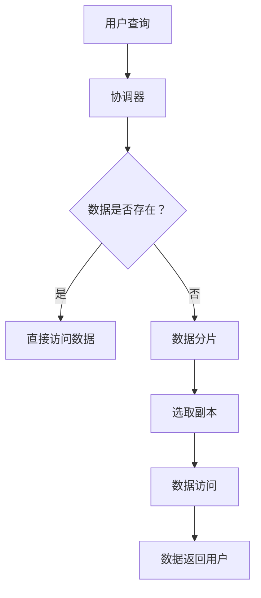
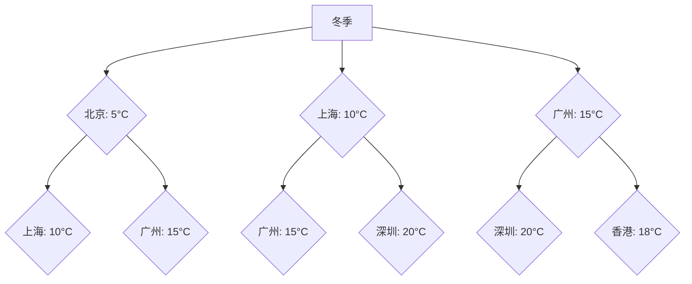

                 

### 第1章: AI多渠道整合提升搜索结果概述

#### 1.1 AI多渠道整合的背景与意义

在互联网时代，搜索已经成为人们获取信息的重要手段。随着信息量的爆炸式增长，传统的单一渠道搜索已经无法满足用户对多样化、个性化信息的需求。为了应对这一挑战，人工智能（AI）技术的应用变得至关重要。AI多渠道整合正是为了提升搜索结果的准确性和多样性，从而更好地满足用户需求。

**1.1.1 互联网时代的搜索需求变迁**

在互联网初期，搜索引擎的主要功能是提供基于关键词的文本搜索。然而，随着用户需求的不断变化，单一渠道的搜索已经无法满足用户对多媒体、实时、个性化信息的需求。例如，用户可能需要视频、图片、音频等多媒体内容，或者希望获取与自身兴趣相关的个性化推荐。

**1.1.2 多渠道整合在搜索中的重要性**

多渠道整合在搜索中具有重要意义。首先，它能够提高搜索结果的多样性，使用户在获得所需信息的同时，能够发现更多相关的内容。其次，多渠道整合可以实现个性化搜索，根据用户的历史行为和兴趣偏好，为用户推荐更加相关和有趣的信息。此外，多渠道整合还能够提升搜索的实时性，通过整合实时数据源，为用户提供最新的信息。

**1.1.3 AI技术对搜索结果提升的贡献**

AI技术在提升搜索结果方面发挥着关键作用。首先，机器学习和深度学习算法能够对海量数据进行训练，从而发现数据中的潜在模式和关系，提高搜索的准确性。其次，自然语言处理（NLP）技术能够理解用户的查询意图，并生成更加人性化的搜索结果。此外，AI技术还可以用于个性化搜索和推荐系统，为用户提供更加个性化的信息。

#### 1.2 多渠道整合的搜索架构设计

实现AI多渠道整合的关键在于搜索架构的设计。一个高效、灵活的搜索架构需要考虑多渠道数据源接入、搜索算法与模型整合、搜索结果的实时更新与反馈机制等多个方面。

**1.2.1 多渠道数据源接入**

多渠道数据源接入是搜索架构设计的基础。搜索引擎需要从多个渠道获取数据，包括网页、社交媒体、视频、图片等。这些数据源可以通过网络爬虫、API接口调用等方式进行接入。同时，为了确保数据的多样性和准确性，搜索引擎还需要对数据进行清洗和预处理。

**1.2.2 搜索算法与模型整合**

搜索算法与模型整合是搜索架构设计的核心。搜索引擎需要整合多种搜索算法，包括基于关键词的检索算法、基于内容的检索算法等，以实现高效的搜索。此外，AI技术可以用于优化搜索算法，提高搜索结果的准确性。例如，通过机器学习算法，可以识别用户查询的意图，从而生成更加精准的搜索结果。

**1.2.3 搜索结果的实时更新与反馈机制**

搜索结果的实时更新与反馈机制是确保搜索系统高效运行的重要保障。搜索引擎需要实时监测用户行为，并根据用户反馈进行优化。例如，通过分析用户对搜索结果的点击率，可以调整搜索结果的排序，提高用户的满意度。此外，搜索引擎还可以通过实时数据源，为用户提供最新的信息。

#### 1.3 多渠道整合搜索的核心算法

多渠道整合搜索的核心算法包括搜索引擎基本原理、信息检索算法和排名算法与权重分配。

**1.3.1 搜索引擎基本原理**

搜索引擎的基本原理包括索引构建、查询处理和结果排序。索引构建是将网页中的内容进行预处理，生成索引，以便快速检索。查询处理是将用户输入的查询与索引进行匹配，生成潜在的结果集。结果排序是根据各种因素（如相关性、用户偏好等）对结果集进行排序，以生成最终的搜索结果。

**1.3.2 信息检索算法**

信息检索算法是搜索引擎的核心算法，用于从海量数据中快速准确地查找用户所需的信息。常见的检索算法包括基于关键词的检索算法和基于内容的检索算法。基于关键词的检索算法主要通过匹配用户查询与文档中的关键词，实现搜索。基于内容的检索算法则通过分析文档的内容，识别文档的主题和语义，从而实现搜索。

**1.3.3 排名算法与权重分配**

排名算法与权重分配是搜索结果排序的关键。排名算法的目标是根据各种因素（如文档的相关性、用户偏好等）对搜索结果进行排序。常见的排名算法包括基于概率的排名算法、基于相似度的排名算法和基于学习的排名算法。权重分配则是根据文档的不同特征，为每个文档分配一个权重，从而影响其在搜索结果中的排序。

#### 1.4 AI技术在多渠道搜索中的应用

AI技术在多渠道搜索中具有广泛的应用。通过机器学习、深度学习和自然语言处理等技术，AI可以提高搜索结果的准确性、多样性和实时性。

**1.4.1 机器学习与深度学习在搜索中的应用**

机器学习与深度学习在搜索中的应用主要体现在两个方面：一是用于优化搜索算法，提高搜索准确性；二是用于构建个性化搜索和推荐系统。通过机器学习算法，可以分析用户的历史行为和偏好，为用户推荐更加相关的搜索结果。深度学习算法则可以用于图像识别、语音识别等应用，从而实现更加智能化的搜索。

**1.4.2 自然语言处理与语义理解**

自然语言处理（NLP）与语义理解是提升搜索结果多样性和准确性的关键。NLP技术可以用于分析用户的查询意图，识别关键词的含义，从而生成更加精准的搜索结果。语义理解技术则可以理解文档的主题和语义，从而实现更加智能化的搜索。

**1.4.3 个性化搜索与推荐系统**

个性化搜索与推荐系统是基于用户行为和偏好，为用户推荐相关信息的系统。通过分析用户的历史行为和兴趣偏好，个性化搜索和推荐系统可以生成更加个性化的搜索结果，从而提高用户的满意度。

#### 1.5 多渠道搜索结果的优化策略

多渠道搜索结果的优化策略包括网页质量评估与过滤、用户体验优化和搜索引擎性能优化。

**1.5.1 网页质量评估与过滤**

网页质量评估与过滤是确保搜索结果准确性和可信性的关键。通过分析网页的内容、结构、可信度等因素，可以对网页进行质量评估。对于低质量的网页，可以进行过滤，从而提高搜索结果的准确性。

**1.5.2 用户体验优化**

用户体验优化是提高搜索引擎用户满意度的关键。通过分析用户的行为和反馈，可以优化搜索结果展示方式，提高搜索结果的呈现效果，从而提升用户体验。

**1.5.3 搜索引擎性能优化**

搜索引擎性能优化是确保搜索引擎高效运行的关键。通过优化搜索引擎的架构和算法，可以提高搜索速度和准确性，从而提高搜索引擎的性能。

#### 1.6 案例分析：知名搜索引擎的多渠道整合实践

为了更好地理解AI多渠道整合在搜索中的应用，我们可以分析一些知名搜索引擎的多渠道整合实践。

**1.6.1 百度搜索的多渠道整合案例**

百度作为中国最大的搜索引擎，在多渠道整合方面有着丰富的实践。百度通过整合网页、图片、视频、新闻等多渠道数据，为用户提供了多样化的搜索结果。此外，百度还通过AI技术，优化搜索算法，提高搜索结果的准确性。

**1.6.2 谷歌搜索的多渠道整合案例**

谷歌作为全球最大的搜索引擎，其多渠道整合实践也备受关注。谷歌通过整合网页、图片、视频、新闻等多渠道数据，为用户提供了丰富的搜索结果。此外，谷歌还通过AI技术，优化搜索算法，实现个性化搜索和推荐。

**1.6.3 微软Bing的多渠道整合案例**

微软Bing作为全球第二大搜索引擎，也在多渠道整合方面取得了显著成果。Bing通过整合网页、图片、视频、新闻等多渠道数据，为用户提供了多样化的搜索结果。此外，Bing还通过AI技术，优化搜索算法，提高搜索结果的准确性。

#### 1.7 总结与展望

AI多渠道整合在搜索中具有重要的意义。通过整合多渠道数据，AI可以提高搜索结果的准确性、多样性和实时性，从而更好地满足用户需求。在未来，随着AI技术的不断发展和应用，多渠道搜索将变得更加智能化和个性化。

（本文将分为多个部分，以逐步深入探讨AI多渠道整合提升搜索结果的各个方面。在接下来的章节中，我们将详细分析多渠道数据整合技术基础、搜索算法与模型整合、AI多渠道搜索优化实践以及未来展望等核心内容。）

---

**关键词：**

- 人工智能（AI）
- 多渠道整合
- 搜索引擎
- 个性化搜索
- 排名算法
- 多样性优化

**摘要：**

本文深入探讨了AI多渠道整合在搜索领域的应用，从背景与意义、搜索架构设计、核心算法、AI技术应用、优化策略等方面进行了详细分析。通过案例分析，本文展示了知名搜索引擎在多渠道整合方面的实践，并展望了未来搜索领域的发展趋势。文章旨在为读者提供一个全面、系统的AI多渠道搜索优化指南。

### 1.1.1 互联网时代的搜索需求变迁

在互联网时代的初期，搜索引擎的功能相对单一，主要以文本检索为主。用户通过输入关键词，搜索引擎返回一系列包含该关键词的网页链接，用户通过点击链接访问具体内容。这种基于关键词的搜索模式，在当时已经极大地提高了信息获取的效率，但也存在一定的局限性。

首先，由于关键词搜索依赖于用户准确输入，一旦用户关键词选择不当，可能会导致搜索结果偏离用户需求。例如，当用户搜索“苹果”时，可能既想了解水果苹果的资讯，又想查询科技企业苹果公司的新闻。在这种情况下，搜索引擎往往无法准确判断用户的意图，导致搜索结果不够精确。

其次，随着互联网内容的爆炸式增长，单一渠道的搜索结果往往过于冗长，用户需要花费大量时间筛选和过滤信息，这降低了用户的体验。例如，当用户搜索某个热门话题时，搜索引擎可能会返回数百万条相关结果，用户需要手动逐条查看，才能找到真正感兴趣的内容。

为了解决这些局限性，搜索引擎开始尝试引入多渠道整合，以满足用户日益复杂的搜索需求。多渠道整合不仅包括文本内容，还涵盖了图片、视频、音频等多媒体形式，以及社交媒体、实时新闻等实时数据源。这种多渠道整合的搜索方式，使得搜索引擎能够提供更加丰富、多样化的搜索结果，用户可以更方便地找到所需信息。

此外，随着互联网技术的发展，用户对个性化搜索的需求也越来越高。个性化搜索通过分析用户的历史行为、兴趣偏好等，为用户推荐更加相关的搜索结果。这种个性化搜索不仅提高了搜索的准确性，还增加了用户的满意度。

综上所述，互联网时代的搜索需求变迁，从最初的简单关键词搜索，发展到如今的多渠道整合和个性化搜索，反映了用户对信息获取效率和质量的双重追求。AI技术的引入，进一步推动了搜索技术的发展，使得搜索结果更加精准、多样和实时，为用户提供了更好的信息服务。

#### 1.1.2 多渠道整合在搜索中的重要性

多渠道整合在搜索中的重要性不容忽视，主要体现在以下几个方面：

首先，多渠道整合能够显著提升搜索结果的准确性。传统的单一渠道搜索往往依赖于关键词匹配，但用户输入的关键词可能存在歧义或者不够精确，导致搜索结果与用户实际需求不符。而多渠道整合则通过结合多种数据源，如文本、图片、视频等，能够更全面地理解用户的查询意图，从而提高搜索结果的准确性。例如，当用户搜索“苹果”时，搜索引擎不仅可以返回包含“苹果”关键词的网页，还可以根据用户的兴趣偏好，推荐相关图片、视频和社交媒体内容，这样用户可以更快地找到所需信息。

其次，多渠道整合能够提高搜索结果的多样性。单一渠道的搜索结果往往存在一定的局限性，例如仅限于网页搜索，而无法涵盖图片、视频等其他形式的内容。通过多渠道整合，搜索引擎可以提供更加丰富多样的结果，使用户能够从不同维度和角度获取信息。例如，当用户搜索某个科学实验的步骤时，搜索引擎不仅可以返回相关的文字说明，还可以提供实验视频、图片以及用户评论等多渠道信息，从而帮助用户更深入地了解实验过程。

第三，多渠道整合有助于实现个性化搜索。个性化搜索是现代搜索引擎的重要功能之一，通过分析用户的历史行为和兴趣偏好，为用户推荐更加相关的搜索结果。多渠道整合能够为个性化搜索提供更全面的数据支持，从而提高推荐的准确性。例如，当用户经常在社交媒体上关注体育新闻时，搜索引擎可以通过多渠道整合，将相关的体育视频、图片和新闻推送给用户，进一步提升用户体验。

此外，多渠道整合还能够提升搜索的实时性。互联网信息更新迅速，用户希望获取最新的信息。多渠道整合通过实时接入各种数据源，如实时新闻、社交媒体更新等，能够为用户提供最新、最热的信息。例如，当用户搜索“新冠疫情”时，搜索引擎可以通过多渠道整合，实时推送最新的疫情数据、新闻动态和防疫指南，帮助用户及时了解疫情发展。

最后，多渠道整合有助于提升搜索引擎的竞争力和市场份额。在信息爆炸的时代，用户对搜索引擎的要求越来越高，单一渠道的搜索已经无法满足用户多样化的需求。通过多渠道整合，搜索引擎可以提供更丰富、更个性化的服务，从而吸引更多用户，提升市场竞争力。

综上所述，多渠道整合在搜索中具有非常重要的作用。它不仅提高了搜索结果的准确性、多样性和实时性，还实现了个性化搜索，为用户提供了更好的信息服务。随着AI技术的不断发展和应用，多渠道整合在搜索领域的前景将更加广阔。

#### 1.1.3 AI技术对搜索结果提升的贡献

AI技术对搜索结果的提升具有显著的作用，其应用涵盖了搜索算法的优化、个性化搜索的实现、实时性增强以及多样性的提升。

**1. AI技术优化搜索算法**

机器学习和深度学习是AI技术的重要组成部分，它们在搜索算法优化中发挥着关键作用。通过大规模数据训练，机器学习算法能够识别出数据中的潜在模式和关系，从而提高搜索算法的准确性。例如，基于用户的点击行为和搜索历史，机器学习算法可以预测用户未来的查询意图，并据此调整搜索结果的排序。深度学习算法则通过模拟人脑神经元网络，对复杂的非线性数据进行分析，进一步提升搜索的准确性。例如，在图像搜索中，深度学习算法可以通过分析图像的特征，快速定位用户所需图片，大大提高搜索效率。

**2. 个性化搜索的实现**

个性化搜索是现代搜索引擎的核心功能之一，它通过分析用户的历史行为、兴趣偏好等，为用户提供个性化的搜索结果。AI技术为个性化搜索提供了强大的支持。例如，基于协同过滤算法，AI技术可以分析用户与内容之间的交互关系，为用户推荐相似的兴趣内容。此外，通过自然语言处理（NLP）技术，AI技术可以理解用户的查询意图，从而生成更加精准的个性化搜索结果。例如，当用户搜索“旅游攻略”时，AI技术可以根据用户的历史搜索记录和偏好，推荐符合用户兴趣的旅游目的地、酒店和景点。

**3. 实时性增强**

互联网信息更新迅速，用户希望获取最新的信息。AI技术通过实时分析海量数据，实现了搜索结果的实时性增强。例如，在实时新闻搜索中，AI技术可以实时监测全球新闻的动态，并迅速返回最新的新闻报道。此外，AI技术还可以通过实时数据源，如社交媒体和物联网设备，为用户提供实时更新的信息。例如，当用户搜索“航班动态”时，AI技术可以通过实时数据接口，获取最新的航班信息，并实时推送。

**4. 多样性的提升**

传统搜索往往局限于文本信息，而AI技术通过多渠道整合，实现了搜索结果的多样性。例如，在图像搜索中，AI技术可以通过图像识别算法，识别出图片中的物体和场景，从而为用户返回包含相似图像的结果。在视频搜索中，AI技术可以通过视频内容分析，提取视频的关键帧和关键词，从而提高搜索的准确性。此外，AI技术还可以通过自然语言处理，理解用户查询的语义，从而返回相关的多媒体内容。例如，当用户搜索“猫咪视频”时，AI技术不仅可以返回视频链接，还可以根据视频的语义内容，推荐相关的猫咪图片和文字描述。

**5. 智能搜索助手**

AI技术还可以用于构建智能搜索助手，通过语音识别和自然语言处理，用户可以通过语音进行搜索，获得更加便捷的服务。例如，智能语音助手可以通过理解用户的语音指令，快速返回相关信息，并在对话中提供进一步的搜索建议。这种智能交互方式，不仅提升了搜索的便捷性，还提高了用户的满意度。

综上所述，AI技术在搜索结果提升中发挥着至关重要的作用。通过优化搜索算法、实现个性化搜索、增强实时性、提升多样性以及构建智能搜索助手，AI技术为用户提供了更加精准、高效和智能的信息搜索服务。

#### 1.2 多渠道整合的搜索架构设计

实现AI多渠道整合的搜索架构设计是确保搜索系统能够高效、灵活地运作的关键。以下将从数据源接入、算法整合和结果更新三个方面进行详细介绍。

**1.2.1 多渠道数据源接入**

多渠道数据源接入是搜索架构设计的基础。搜索引擎需要从多种渠道获取数据，包括网页、社交媒体、视频、图片等。这些数据源可以通过网络爬虫、API接口调用等方式进行接入。以下是一些具体的数据源接入方法：

- **网络爬虫**：网络爬虫是一种自动化的程序，用于从互联网上抓取网页内容。搜索引擎可以使用网络爬虫，定期爬取互联网上的网页，构建索引库。网络爬虫需要注意遵守网站的robots.txt协议，确保爬取行为合法。

- **API接口调用**：许多网站和平台提供API接口，允许外部程序访问其数据。搜索引擎可以通过API接口调用，获取特定网站或平台的数据。例如，社交媒体平台（如Twitter、Facebook）提供API接口，允许搜索引擎获取用户的帖子、评论等。

- **实时数据接入**：实时数据接入是确保搜索结果实时性的关键。搜索引擎可以通过实时数据接口，接入实时新闻、社交媒体更新等数据。例如，搜索引擎可以使用Twitter API，实时获取最新的新闻动态。

在数据接入过程中，需要确保数据的多样性和准确性。对于不同的数据源，可能需要采用不同的接入方式和技术，如对于静态网页，可以使用网络爬虫；对于动态数据，如社交媒体更新，可以使用API接口调用。

**1.2.2 搜索算法与模型整合**

多渠道整合的搜索架构需要整合多种搜索算法和模型，以实现高效的搜索。以下是一些常见的搜索算法和模型：

- **基于关键词的检索算法**：基于关键词的检索算法是最常见的搜索算法。它通过分析用户查询中的关键词，从索引库中查找包含这些关键词的文档，并返回相关结果。常见的基于关键词的检索算法包括布尔检索、向量空间模型（VSM）和倒排索引。

- **基于内容的检索算法**：基于内容的检索算法通过分析文档的内容，识别文档的主题和语义，从而实现搜索。这种算法适用于多媒体数据，如图片、视频和音频。常见的基于内容的检索算法包括图像识别、语音识别和文本分类。

- **机器学习和深度学习模型**：机器学习和深度学习模型在搜索中具有广泛应用。通过训练大量数据，机器学习模型可以学习到数据中的潜在模式和关系，从而提高搜索的准确性。深度学习模型，如卷积神经网络（CNN）和递归神经网络（RNN），在图像识别、语音识别等领域表现出色。

在整合多种搜索算法和模型时，需要确保它们之间的协调与配合。例如，在多渠道搜索中，可以首先使用基于关键词的检索算法，快速筛选出初步的结果集；然后，通过基于内容的检索算法和机器学习模型，对结果集进行进一步筛选和排序，以提高搜索结果的准确性和多样性。

**1.2.3 搜索结果的实时更新与反馈机制**

搜索结果的实时更新与反馈机制是确保搜索系统高效运行的重要保障。以下是一些具体的实现方法：

- **实时数据更新**：搜索引擎需要实时监测各种数据源，如网页、社交媒体、实时新闻等，以获取最新的信息。通过实时数据更新，搜索引擎可以确保搜索结果始终是最新的。例如，搜索引擎可以使用WebSocket等技术，实时接收数据源的通知，更新索引库。

- **用户反馈机制**：用户反馈是优化搜索结果的重要途径。搜索引擎可以通过分析用户对搜索结果的点击、评价等行为，了解用户的兴趣和需求。根据用户反馈，搜索引擎可以调整搜索结果的排序和推荐策略，以提高用户的满意度。例如，如果用户经常点击某个搜索结果，搜索引擎可以增加该结果的权重，提高其排名。

- **实时性能监控**：实时性能监控是确保搜索引擎高效运行的关键。通过监控搜索系统的性能指标，如响应时间、查询吞吐量等，搜索引擎可以及时发现和解决性能瓶颈。例如，如果某个查询的响应时间过长，搜索引擎可以增加计算资源，优化查询处理流程。

综上所述，多渠道整合的搜索架构设计需要综合考虑数据源接入、算法整合和结果更新等多个方面。通过灵活的设计和优化，搜索引擎可以提供高效、准确的搜索服务，满足用户的多样化需求。

#### 1.3 多渠道整合搜索的核心算法

多渠道整合搜索的核心算法是实现高效、准确搜索的关键。以下将详细探讨搜索引擎的基本原理、信息检索算法、排名算法与权重分配，以及AI技术在其中的应用。

**1.3.1 搜索引擎的基本原理**

搜索引擎的基本原理可以概括为三个主要环节：索引构建、查询处理和结果排序。

- **索引构建**：搜索引擎在运行过程中，首先需要构建索引。索引是将网页的内容进行预处理，生成关键词索引、倒排索引等数据结构，以便快速检索。索引构建的过程包括网页抓取、内容解析、关键词提取和索引存储。搜索引擎可以通过网络爬虫或API接口调用，从互联网上抓取网页内容。然后，通过对网页内容进行分析和提取，生成关键词索引。关键词索引是一种将网页与关键词关联的数据结构，便于快速查找包含特定关键词的网页。

- **查询处理**：当用户输入查询时，搜索引擎需要处理用户的查询请求。查询处理包括查询解析、查询索引匹配和初步结果生成。查询解析是将用户输入的查询语句转化为搜索引擎能够理解的形式。例如，将自然语言的查询转化为布尔查询或向量查询。查询索引匹配是将用户的查询与索引库中的关键词进行匹配，生成初步的结果集。初步结果生成是根据匹配结果，生成初步的搜索结果。

- **结果排序**：初步结果生成后，搜索引擎需要对结果集进行排序，以生成最终的搜索结果。结果排序的目的是根据各种因素，如文档的相关性、用户的兴趣偏好等，对结果集进行排序，以便用户能够快速找到所需信息。常见的排序算法包括基于概率的排序算法、基于相似度的排序算法和基于学习的排序算法。

**1.3.2 信息检索算法**

信息检索算法是实现高效搜索的核心。以下介绍几种常见的信息检索算法：

- **基于关键词的检索算法**：基于关键词的检索算法是最常见的检索算法，通过匹配用户查询与文档中的关键词，实现搜索。常见的基于关键词的检索算法包括布尔检索、向量空间模型（VSM）和倒排索引。

  - **布尔检索**：布尔检索是一种基于布尔运算符（如AND、OR、NOT）的检索方法。通过组合用户输入的关键词，生成布尔查询，然后与索引库中的关键词进行匹配。布尔检索能够实现简单的逻辑组合查询，但存在一定的局限性，如无法处理模糊查询和长尾查询。

  - **向量空间模型（VSM）**：向量空间模型将文档和查询表示为向量，通过计算向量之间的相似度，实现搜索。VSM可以处理模糊查询和长尾查询，但计算复杂度较高。

  - **倒排索引**：倒排索引是一种将关键词与对应的文档关联的数据结构。通过索引库中的关键词，可以快速查找包含这些关键词的文档。倒排索引具有较高的查询效率，是搜索引擎常用的数据结构。

- **基于内容的检索算法**：基于内容的检索算法通过分析文档的内容，识别文档的主题和语义，从而实现搜索。常见的基于内容的检索算法包括文本分类、聚类和文本相似度计算。

  - **文本分类**：文本分类是一种将文档归类到预定义类别的方法。通过训练分类模型，将文档映射到特定的类别。文本分类可以用于文档检索，帮助用户快速找到相关文档。

  - **聚类**：聚类是一种无监督学习方法，将相似文档分组到同一个类别。通过聚类，可以识别出文档的潜在主题和关系，从而实现搜索。

  - **文本相似度计算**：文本相似度计算是一种衡量两个文本之间相似度的方法。通过计算文本的相似度，可以找到相关文档。常见的文本相似度计算方法包括余弦相似度、Jaccard相似度和Levenshtein距离。

**1.3.3 排名算法与权重分配**

排名算法与权重分配是搜索结果排序的关键。以下介绍几种常见的排名算法和权重分配策略：

- **基于概率的排名算法**：基于概率的排名算法通过计算文档与查询之间的概率匹配度，实现搜索结果的排序。常见的基于概率的排名算法包括PageRank和BM25。

  - **PageRank**：PageRank是一种基于链接分析的排名算法，通过计算网页之间的链接关系，为网页分配权重。PageRank算法认为，一个网页的权重与指向它的网页数量和权重成正比。

  - **BM25**：BM25是一种基于文档长度和词频的排名算法，通过计算文档与查询之间的相似度，实现搜索结果的排序。BM25算法考虑了文档长度和词频对搜索结果的影响，能够更好地处理长文档和稀疏文档。

- **基于相似度的排名算法**：基于相似度的排名算法通过计算文档与查询之间的相似度，实现搜索结果的排序。常见的基于相似度的排名算法包括余弦相似度和余弦相似度。

  - **余弦相似度**：余弦相似度是一种衡量两个向量之间相似度的方法。通过计算文档与查询之间的余弦相似度，可以找到相关文档。

  - **余弦相似度**：余弦相似度是一种衡量两个文本之间相似度的方法。通过计算文档与查询之间的余弦相似度，可以找到相关文档。

- **基于学习的排名算法**：基于学习的排名算法通过训练大量数据，学习到文档与查询之间的匹配规律，实现搜索结果的排序。常见的基于学习的排名算法包括逻辑回归和SVM。

  - **逻辑回归**：逻辑回归是一种分类算法，通过训练分类模型，将文档归类为相关或不相关。逻辑回归可以用于搜索结果的排序，为相关文档分配更高的权重。

  - **SVM**：支持向量机（SVM）是一种分类算法，通过训练分类模型，将文档映射到高维空间，进行分类。SVM可以用于搜索结果的排序，通过计算文档与查询之间的相似度，实现搜索结果的排序。

- **权重分配策略**：权重分配策略是排名算法的重要组成部分，通过为文档分配权重，影响搜索结果的排序。常见的权重分配策略包括TF-IDF和向量空间模型。

  - **TF-IDF**：TF-IDF是一种基于词频和文档频率的权重分配策略。通过计算关键词在文档中的词频和在整个文档集合中的频率，为文档分配权重。TF-IDF算法能够更好地处理稀疏文档和长尾查询。

  - **向量空间模型**：向量空间模型是一种基于向量的权重分配策略。通过计算文档与查询之间的向量相似度，为文档分配权重。向量空间模型能够处理高维数据，适用于文本搜索。

**1.3.4 AI技术在搜索算法中的应用**

AI技术为搜索算法提供了强大的支持，通过机器学习、深度学习和自然语言处理等技术，实现搜索结果优化、实时性和多样性提升。

- **机器学习在搜索中的应用**：机器学习算法通过训练大量数据，学习到数据中的潜在模式和关系，从而提高搜索结果的准确性。常见的机器学习算法包括线性回归、决策树和随机森林。

  - **线性回归**：线性回归是一种回归算法，通过拟合数据中的线性关系，预测搜索结果的相关性。线性回归可以用于搜索结果的排序，为相关文档分配更高的权重。

  - **决策树**：决策树是一种分类算法，通过构建决策树模型，将文档映射到相关或不相关的类别。决策树可以用于搜索结果的排序，为相关文档分配更高的权重。

  - **随机森林**：随机森林是一种集成学习算法，通过训练多个决策树模型，合并预测结果，提高搜索结果的准确性。随机森林可以用于搜索结果的排序，为相关文档分配更高的权重。

- **深度学习在搜索中的应用**：深度学习算法通过模拟人脑神经元网络，对复杂的非线性数据进行分析，从而提高搜索结果的准确性。常见的深度学习算法包括卷积神经网络（CNN）和递归神经网络（RNN）。

  - **卷积神经网络（CNN）**：卷积神经网络是一种深度学习算法，通过卷积操作提取图像特征，用于图像识别和图像搜索。CNN可以用于搜索结果的排序，为相关图像分配更高的权重。

  - **递归神经网络（RNN）**：递归神经网络是一种深度学习算法，通过递归结构处理序列数据，用于语音识别和自然语言处理。RNN可以用于搜索结果的排序，为相关文档分配更高的权重。

- **自然语言处理（NLP）在搜索中的应用**：自然语言处理是一种处理文本数据的算法，通过理解文本的语义和含义，提高搜索结果的准确性。常见的NLP算法包括词向量模型和语言模型。

  - **词向量模型**：词向量模型是一种将文本表示为向量的方法，通过计算词向量之间的相似度，提高搜索结果的准确性。常见的词向量模型包括Word2Vec和GloVe。

  - **语言模型**：语言模型是一种预测文本下一个词的算法，通过训练语言模型，可以预测用户查询的下一个词，从而提高搜索结果的准确性。

综上所述，多渠道整合搜索的核心算法包括搜索引擎的基本原理、信息检索算法、排名算法与权重分配，以及AI技术在其中的应用。通过灵活运用这些算法和技术，搜索引擎可以实现高效、准确的搜索服务，满足用户的多样化需求。

#### 1.4 AI技术在多渠道搜索中的应用

AI技术在多渠道搜索中扮演着至关重要的角色，通过机器学习、深度学习和自然语言处理（NLP）等多种技术的应用，AI技术能够显著提升搜索结果的准确性、多样性和实时性。

**1.4.1 机器学习与深度学习在搜索中的应用**

机器学习和深度学习是AI技术的核心，它们在搜索中的应用主要体现在以下几个方面：

- **搜索结果的准确性提升**：通过机器学习和深度学习算法，搜索引擎能够从海量数据中学习到用户查询意图和文档相关性之间的复杂关系。例如，可以使用监督学习算法，如逻辑回归和支持向量机（SVM），来训练模型，从而在用户查询和文档之间建立精确的匹配关系。深度学习算法，如卷积神经网络（CNN）和递归神经网络（RNN），能够处理更加复杂的特征，进一步提高搜索结果的准确性。

  - **示例**：在图像搜索中，卷积神经网络（CNN）能够自动学习图像中的高维特征，从而在用户输入查询时，快速准确地识别出包含相似特征的图像。例如，当用户输入“狗”的查询时，CNN可以识别出搜索结果中的所有狗的图像。

- **搜索结果的实时性增强**：机器学习和深度学习算法能够在短时间内处理大量数据，从而实现搜索结果的实时更新。例如，在实时新闻搜索中，可以使用深度学习算法，对新闻内容进行实时分析，从而快速返回最新的新闻资讯。

  - **示例**：当用户搜索“股票市场动态”时，深度学习模型可以实时分析来自社交媒体、新闻网站和财经网站的最新数据，迅速返回最新的股票市场动态。

- **个性化搜索与推荐系统**：机器学习和深度学习能够通过分析用户的历史行为和兴趣偏好，为用户提供个性化的搜索结果和推荐。例如，协同过滤算法可以通过分析用户与内容之间的交互关系，为用户推荐相关内容。

  - **示例**：当用户经常搜索“旅游攻略”时，个性化搜索系统能够根据用户的历史搜索记录和偏好，推荐符合用户兴趣的旅游目的地和景点。

**1.4.2 自然语言处理与语义理解**

自然语言处理（NLP）是AI技术在搜索中应用的重要领域，它通过理解和生成自然语言，提升搜索结果的多样性和准确性。

- **语义理解**：NLP技术能够理解和解析用户查询的语义，从而提供更加精准的搜索结果。例如，通过词性标注和句法分析，可以理解用户查询中的实义词和虚义词，从而提高查询的准确性。

  - **示例**：当用户输入“北京天气如何？”时，NLP技术可以识别出“北京”是地点，“天气”是实义词，“如何”是虚词，从而准确理解查询意图，返回相关的天气信息。

- **上下文感知搜索**：NLP技术能够理解查询的上下文，从而生成更加丰富的搜索结果。例如，通过实体识别和关系抽取，可以理解查询中的实体和它们之间的关系，从而返回更加相关的内容。

  - **示例**：当用户输入“法国总统是谁？”时，NLP技术可以识别出“法国”和“总统”是两个实体，并抽取它们之间的关系，从而准确返回法国当前总统的信息。

- **多语言搜索**：NLP技术使得搜索引擎能够支持多语言搜索，为全球用户提供更加广泛的信息服务。例如，通过机器翻译和语言模型，可以理解不同语言的查询，并返回相关的搜索结果。

  - **示例**：当用户使用英语输入查询“weather in Beijing”时，搜索引擎可以通过翻译和语义理解，返回中文的天气信息。

**1.4.3 个性化搜索与推荐系统**

个性化搜索和推荐系统是AI技术在搜索中的重要应用，通过分析用户的行为和兴趣，为用户提供个性化的搜索结果和推荐。

- **个性化搜索**：个性化搜索通过分析用户的历史行为和偏好，为用户推荐相关的内容。例如，通过协同过滤算法，可以分析用户与内容之间的交互关系，为用户推荐类似的内容。

  - **示例**：当用户经常搜索“篮球比赛视频”时，个性化搜索系统可以推荐其他用户可能感兴趣的篮球比赛视频，从而提高用户的满意度。

- **推荐系统**：推荐系统通过分析用户的行为和偏好，为用户推荐相关的产品、服务或信息。例如，通过内容推荐算法，可以分析用户的兴趣和需求，为用户推荐相关的搜索结果。

  - **示例**：当用户在电商网站搜索“笔记本电脑”时，推荐系统可以根据用户的浏览记录和购买偏好，推荐其他用户可能感兴趣的笔记本电脑型号和品牌。

综上所述，AI技术在多渠道搜索中的应用，通过机器学习、深度学习和自然语言处理等技术，显著提升了搜索结果的准确性、多样性和实时性。此外，AI技术还实现了个性化搜索和推荐系统，为用户提供了更加个性化、智能化的信息服务。随着AI技术的不断发展和应用，多渠道搜索的前景将更加广阔，为用户带来更好的搜索体验。

#### 1.5 多渠道搜索结果的优化策略

在多渠道搜索中，优化搜索结果的质量和用户体验是提升搜索引擎竞争力的关键。以下从网页质量评估与过滤、用户体验优化和搜索引擎性能优化三个方面，探讨多渠道搜索结果的优化策略。

**1.5.1 网页质量评估与过滤**

网页质量评估与过滤是确保搜索结果准确性和可信性的重要手段。通过分析网页的内容、结构和可信度等因素，可以对网页进行质量评估，从而过滤掉低质量的网页，提高搜索结果的可靠性。

- **内容评估**：网页的内容评估主要通过分析网页的内容质量和相关信息来评估其价值。例如，通过分析网页的文本内容、图片和视频等多媒体元素，可以判断网页的信息丰富度和相关性。高质量的网页应具有丰富的内容、准确的信息和良好的用户体验。

- **结构评估**：网页的结构评估主要通过分析网页的HTML结构、导航链接和页面布局等来评估其结构质量。良好的网页结构应具备清晰的结构层次、合理的导航链接和良好的页面布局，以便用户快速找到所需信息。

- **可信度评估**：网页的可信度评估主要通过分析网页的来源、域名和用户反馈等来判断其可信度。高质量的网页应来自可信的网站，具有稳定的域名，并得到用户的好评。搜索引擎可以通过建立可信度模型，对网页进行可信度评估，从而过滤掉不可信的网页。

**1.5.2 用户体验优化**

用户体验优化是提高搜索引擎用户满意度的关键。通过优化搜索结果展示方式、提高搜索速度和准确性，可以提升用户的使用体验。

- **搜索结果展示**：搜索结果的展示方式直接影响用户体验。搜索引擎可以通过优化搜索结果页面的设计，提高信息的可读性和可操作性。例如，通过使用卡片式展示、瀑布流布局等设计，使搜索结果更加直观和易用。

- **搜索速度优化**：搜索速度是影响用户体验的重要因素。搜索引擎可以通过优化索引构建、查询处理和结果排序等环节，提高搜索速度。例如，通过使用倒排索引、缓存技术和分布式计算等，可以加快搜索结果的返回速度。

- **准确性优化**：搜索准确性是用户对搜索引擎的重要期望。通过优化搜索算法，如引入机器学习和深度学习技术，可以提高搜索结果的准确性。例如，通过训练大量的用户行为数据和文档特征，可以改进搜索算法，提高搜索结果的精准度。

**1.5.3 搜索引擎性能优化**

搜索引擎性能优化是确保搜索引擎高效运行的关键。通过优化搜索引擎的架构和算法，可以提高搜索速度和准确性，从而提升搜索引擎的性能。

- **分布式计算**：搜索引擎可以通过分布式计算架构，提高处理海量数据的能力。例如，使用MapReduce框架，可以将大规模数据处理任务分解为多个小任务，并行处理，从而提高搜索效率。

- **缓存技术**：搜索引擎可以通过缓存技术，提高搜索结果的返回速度。例如，使用内存缓存和磁盘缓存，可以减少数据检索的时间，提高搜索速度。

- **索引优化**：搜索引擎可以通过优化索引构建和存储，提高搜索效率。例如，使用压缩算法和索引压缩技术，可以减少索引文件的大小，加快搜索速度。

- **实时性能监控**：搜索引擎可以通过实时性能监控，及时发现和解决性能瓶颈。例如，通过监控查询吞吐量、响应时间和系统负载等指标，可以优化搜索引擎的运行状态，确保其高效稳定运行。

综上所述，多渠道搜索结果的优化策略包括网页质量评估与过滤、用户体验优化和搜索引擎性能优化。通过实施这些策略，搜索引擎可以提供更高质量、更准确的搜索结果，提高用户的满意度和使用体验。

#### 1.6 案例分析：知名搜索引擎的多渠道整合实践

为了更好地理解AI多渠道整合在搜索中的应用，我们可以分析一些知名搜索引擎的多渠道整合实践。这些实践展示了如何通过多渠道数据整合、AI技术优化以及用户体验优化，提升搜索结果的准确性和多样性。

**1.6.1 百度搜索的多渠道整合案例**

百度作为中国最大的搜索引擎，其多渠道整合实践非常值得研究。百度通过整合多种数据源，如网页、图片、视频、新闻等，为用户提供了丰富的搜索结果。

- **多渠道数据源接入**：百度搜索引擎通过多种方式接入多渠道数据源。首先，通过网络爬虫技术，百度从互联网上获取大量的网页数据。其次，通过API接口调用，百度接入各大社交媒体平台和视频平台的数据。此外，百度还通过与新闻机构合作，获取最新的新闻资讯。

- **AI技术优化**：百度在搜索中广泛应用了AI技术。例如，使用深度学习算法对图像和视频进行内容识别，使用自然语言处理技术理解用户查询的语义。此外，百度通过机器学习算法，分析用户的历史行为和兴趣偏好，为用户提供个性化的搜索结果和推荐。

- **用户体验优化**：百度通过优化搜索结果的展示方式，提升用户体验。例如，使用卡片式展示，将不同类型的结果分类展示，使用户可以快速找到所需信息。此外，百度通过实时搜索技术，提供最新的搜索结果，使用户能够及时获取信息。

**1.6.2 谷歌搜索的多渠道整合案例**

谷歌作为全球最大的搜索引擎，其多渠道整合实践也非常成功。谷歌通过整合网页、图片、视频、新闻等多种数据源，为用户提供多样化的搜索结果。

- **多渠道数据源接入**：谷歌搜索引擎通过多种方式接入多渠道数据源。首先，通过网络爬虫技术，谷歌从全球互联网上获取网页数据。其次，通过API接口调用，谷歌接入各大社交媒体平台、图片库和视频平台的数据。此外，谷歌还通过与新闻机构和媒体合作，获取最新的新闻资讯。

- **AI技术优化**：谷歌在搜索中广泛应用了AI技术。例如，使用深度学习算法对图像和视频进行内容识别，使用自然语言处理技术理解用户查询的语义。此外，谷歌通过机器学习算法，分析用户的历史行为和兴趣偏好，为用户提供个性化的搜索结果和推荐。

- **用户体验优化**：谷歌通过优化搜索结果的展示方式，提升用户体验。例如，使用瀑布流布局，将搜索结果以连续流的形式展示，使用户可以不断滚动查看结果。此外，谷歌通过实时搜索技术，提供最新的搜索结果，使用户能够及时获取信息。

**1.6.3 微软Bing的多渠道整合案例**

微软Bing作为全球第二大搜索引擎，也在多渠道整合方面取得了显著成果。Bing通过整合网页、图片、视频、新闻等多种数据源，为用户提供了丰富的搜索结果。

- **多渠道数据源接入**：微软Bing搜索引擎通过多种方式接入多渠道数据源。首先，通过网络爬虫技术，Bing从互联网上获取大量的网页数据。其次，通过API接口调用，Bing接入各大社交媒体平台、图片库和视频平台的数据。此外，Bing还通过与新闻机构和媒体合作，获取最新的新闻资讯。

- **AI技术优化**：微软Bing在搜索中广泛应用了AI技术。例如，使用深度学习算法对图像和视频进行内容识别，使用自然语言处理技术理解用户查询的语义。此外，Bing通过机器学习算法，分析用户的历史行为和兴趣偏好，为用户提供个性化的搜索结果和推荐。

- **用户体验优化**：微软Bing通过优化搜索结果的展示方式，提升用户体验。例如，使用卡片式展示，将不同类型的结果分类展示，使用户可以快速找到所需信息。此外，Bing通过实时搜索技术，提供最新的搜索结果，使用户能够及时获取信息。

综上所述，百度、谷歌和微软Bing等知名搜索引擎通过多渠道数据整合、AI技术优化和用户体验优化，成功地提升了搜索结果的准确性和多样性。这些实践为其他搜索引擎提供了宝贵的经验和参考，也展示了AI技术在搜索领域的重要应用价值。

#### 1.7 总结与展望

AI多渠道整合在搜索领域具有巨大的潜力，通过多渠道数据整合、AI技术优化和用户体验优化，搜索引擎能够提供更加准确、多样和实时的搜索结果。以下是对本文内容的总结以及对未来搜索领域的展望。

**总结**

本文从多个角度探讨了AI多渠道整合在搜索中的应用，主要包括：

1. **背景与意义**：分析了互联网时代搜索需求变迁，强调了多渠道整合在提升搜索结果准确性、多样性和实时性方面的重要性。
2. **搜索架构设计**：介绍了多渠道数据源接入、搜索算法与模型整合以及搜索结果的实时更新与反馈机制。
3. **核心算法**：详细介绍了搜索引擎的基本原理、信息检索算法、排名算法与权重分配，以及AI技术在其中的应用。
4. **AI技术应用**：探讨了机器学习、深度学习和自然语言处理在搜索中的具体应用，如个性化搜索、实时性增强和多样性提升。
5. **优化策略**：提出了网页质量评估与过滤、用户体验优化和搜索引擎性能优化等搜索结果优化策略。
6. **案例分析**：通过分析百度、谷歌和微软Bing的多渠道整合实践，展示了AI技术在搜索领域的应用效果。

**未来展望**

随着AI技术的不断发展和应用，搜索领域将迎来新的变革和机遇。以下是对未来搜索领域的一些展望：

1. **智能化趋势**：AI技术将进一步融入搜索系统，实现更加智能化的搜索服务。例如，通过深度学习和自然语言处理，搜索引擎可以更好地理解用户的查询意图，提供更加精准的搜索结果。

2. **多渠道整合**：随着互联网技术的发展，新的渠道将不断涌现，如物联网、增强现实（AR）和虚拟现实（VR）等。搜索引擎需要不断扩展多渠道数据源，提供更加全面的信息服务。

3. **实时性增强**：实时搜索技术的应用将越来越广泛，搜索引擎需要能够实时处理和更新海量数据，为用户提供最新的信息。

4. **个性化搜索**：个性化搜索将继续发展，通过分析用户的历史行为和兴趣偏好，搜索引擎可以提供更加个性化的搜索结果，提升用户体验。

5. **多样性提升**：多渠道整合将进一步提升搜索结果的多样性，用户可以从不同维度和角度获取信息，满足多样化的需求。

6. **可解释性与伦理问题**：随着AI技术的应用，搜索结果的透明性和可解释性将受到更多关注。同时，AI技术在搜索中的应用也需要遵守伦理规范，确保用户隐私和数据安全。

7. **跨平台与跨语言搜索**：未来的搜索将不仅仅局限于单一平台或语言，跨平台和跨语言的搜索技术将成为发展趋势，为全球用户提供更加便捷的信息服务。

总之，AI多渠道整合在搜索领域具有广阔的发展前景。随着技术的不断进步，搜索引擎将变得更加智能化、实时化和个性化，为用户带来更好的搜索体验。同时，我们也需要关注AI技术在搜索中的应用带来的伦理和社会问题，确保搜索技术的发展能够造福人类社会。

### 第2章: 多渠道数据整合技术基础

在多渠道整合的搜索架构中，数据整合是核心环节之一。通过有效整合来自不同渠道的数据，可以为用户提供更加全面、准确的搜索结果。本章将深入探讨多渠道数据的采集与处理、存储与管理、分析与挖掘以及数据可视化等关键技术基础。

#### 2.1 多渠道数据的采集与处理

**2.1.1 网络爬虫技术**

网络爬虫（Web Crawler）是一种自动化的程序，用于从互联网上抓取数据。在多渠道整合中，网络爬虫是数据采集的重要工具。网络爬虫的工作原理通常包括以下几个步骤：

1. **网页抓取**：爬虫首先从种子网页开始，使用HTTP协议获取网页内容。然后，解析网页中的链接，发现新的网页地址，并重复上述过程，逐步扩大抓取范围。
2. **内容解析**：爬虫需要解析网页内容，提取有用信息，如文本、图片、视频等。常见的解析方法包括HTML解析、CSS解析和JavaScript解析。
3. **数据存储**：爬虫将提取的数据存储到数据库或其他存储系统中，以便后续处理。

网络爬虫技术面临的主要挑战包括：

- **数据量庞大**：互联网上的数据量非常庞大，爬虫需要高效地处理海量数据。
- **网站反爬机制**：许多网站为了防止数据被非法使用，设置了反爬机制。爬虫需要不断优化策略，以规避这些限制。

**2.1.2 API接口调用**

API接口（Application Programming Interface）是另一种重要的数据采集方式。许多网站和平台提供了API接口，允许外部程序访问其数据。通过调用API接口，可以高效地获取数据，而不需要直接从网页抓取。

API接口调用通常包括以下步骤：

1. **接口选择**：根据数据需求，选择合适的API接口。
2. **接口调用**：使用HTTP请求方法（如GET、POST）调用API接口，获取数据。
3. **数据解析**：解析返回的JSON、XML等格式的数据，提取所需信息。

API接口调用的优势包括：

- **高效性**：通过API接口调用，可以快速获取数据，减少网页爬取的开销。
- **稳定性**：API接口通常由网站官方维护，具有较高的稳定性和可靠性。

**2.1.3 数据清洗与预处理**

数据清洗与预处理是数据整合的重要步骤。在多渠道数据整合过程中，数据往往存在格式不一致、缺失值、噪声等问题，需要通过数据清洗和预处理来确保数据的质量。

- **数据清洗**：包括去除重复数据、填补缺失值、去除噪声等。例如，对于文本数据，可以去除HTML标签、符号和空格，确保文本格式统一。
- **数据预处理**：包括数据标准化、特征提取、数据降维等。例如，对于数值型数据，可以进行归一化或标准化处理，使其具有相同的量纲。

#### 2.2 多渠道数据的存储与管理

**2.2.1 数据库设计**

数据库是存储和管理数据的重要工具。在多渠道数据整合中，数据库设计需要考虑数据的结构、规模和查询需求。

- **关系型数据库**：关系型数据库（如MySQL、PostgreSQL）适用于结构化数据存储，通过表与表之间的关系进行数据组织。
- **非关系型数据库**：非关系型数据库（如MongoDB、Redis）适用于非结构化或半结构化数据存储，通过文档、键值对等方式进行数据组织。

数据库设计的关键挑战包括：

- **数据一致性**：确保数据在多渠道整合过程中的一致性，避免数据冲突和错误。
- **数据扩展性**：随着数据量的增长，数据库需要能够扩展以适应更高的负载。

**2.2.2 数据仓库与数据湖**

数据仓库（Data Warehouse）和数据湖（Data Lake）是用于大规模数据存储和管理的重要架构。

- **数据仓库**：数据仓库是用于存储结构化数据的系统，适用于企业级数据分析和决策支持。数据仓库通常通过ETL（提取、转换、加载）过程，将多个数据源的数据集成到一个统一的结构化数据库中。
- **数据湖**：数据湖是用于存储大规模数据（包括结构化、半结构化和非结构化数据）的分布式存储系统。数据湖通过Hadoop、Spark等大数据处理框架，实现对海量数据的存储和管理。

数据仓库与数据湖的优势包括：

- **灵活性**：数据湖能够存储多种类型的数据，而不仅仅是结构化数据，从而提高数据的灵活性和可扩展性。
- **高效性**：数据湖通过分布式存储和处理，能够高效处理海量数据，提高数据处理速度。

**2.2.3 分布式存储系统**

分布式存储系统（如HDFS、Cassandra）在多渠道数据整合中发挥着重要作用。分布式存储系统能够将数据分布存储在多个节点上，提高数据存储的可靠性和扩展性。

- **数据冗余与容错**：分布式存储系统通过数据冗余和容错机制，确保数据的高可用性。例如，HDFS使用副本机制，将数据分布在多个节点上，确保数据不会因单点故障而丢失。
- **扩展性**：分布式存储系统能够动态扩展存储容量，以适应不断增长的数据量。

#### 2.3 多渠道数据的分析与挖掘

**2.3.1 数据分析工具与平台**

数据分析工具与平台是进行多渠道数据分析和挖掘的重要工具。以下是一些常用的数据分析工具与平台：

- **商业智能工具**：商业智能工具（如Tableau、Power BI）用于可视化数据和分析数据趋势。这些工具通常提供丰富的图表和仪表板，帮助用户直观地理解数据。
- **数据挖掘工具**：数据挖掘工具（如R、Python）用于深入挖掘数据中的潜在模式和关系。这些工具提供了丰富的算法和库，支持多种数据挖掘任务。
- **大数据处理平台**：大数据处理平台（如Hadoop、Spark）用于处理大规模数据。这些平台提供了分布式计算框架，能够高效地处理海量数据。

**2.3.2 数据挖掘算法**

数据挖掘算法是进行数据分析和挖掘的关键。以下是一些常用的数据挖掘算法：

- **分类算法**：分类算法（如决策树、随机森林）用于将数据划分为不同的类别。这些算法通过对训练数据的分类结果进行学习，可以对新数据进行分类预测。
- **聚类算法**：聚类算法（如K-means、层次聚类）用于将数据划分为不同的簇。这些算法通过对数据点的相似性进行计算，可以发现数据中的潜在模式。
- **关联规则挖掘**：关联规则挖掘（如Apriori算法）用于发现数据中的关联关系。这些算法可以通过分析数据项之间的关联度，找出频繁出现的组合。

**2.3.3 可视化技术**

可视化技术是将数据转化为图形或图像的形式，以便更直观地理解和分析数据。以下是一些常用的可视化技术：

- **图表**：图表（如条形图、折线图、饼图）用于展示数据趋势和分布情况。这些图表可以直观地展示数据的变化和关系。
- **热力图**：热力图用于展示数据在不同维度上的分布情况。通过颜色深浅来表示数据的值，热力图可以直观地展示数据的分布和趋势。
- **地理可视化**：地理可视化用于展示数据在地理空间上的分布情况。通过地图和相关标记，可以直观地展示数据在不同地理位置的分布和变化。

综上所述，多渠道数据整合技术基础涵盖了数据采集与处理、存储与管理、分析与挖掘以及数据可视化等多个方面。通过这些技术，搜索引擎可以高效地整合来自不同渠道的数据，为用户提供更加全面、准确的搜索结果。随着技术的不断进步，数据整合技术将在搜索领域发挥更加重要的作用。

### 2.1.1 网络爬虫技术

网络爬虫（Web Crawler）是互联网数据采集的重要工具，它通过自动化的方式在互联网上抓取网页内容。以下是网络爬虫技术的基本原理、实现步骤及其挑战。

**基本原理**

网络爬虫的基本原理是模拟用户的行为，从互联网上抓取网页，然后对网页内容进行解析和提取。网络爬虫通常分为以下几个步骤：

1. **URL队列**：爬虫从种子URL（初始网页地址）开始，将这些URL放入URL队列中。
2. **网页抓取**：爬虫从URL队列中取出一个URL，发送HTTP请求获取网页内容。网页内容通常是HTML格式。
3. **链接提取**：爬虫解析网页内容，提取出新的URL，并放入URL队列中。这些新的URL可以是同一网站的链接，也可以是其他网站的链接。
4. **数据存储**：爬虫将获取的网页内容存储到本地数据库或文件中，以便后续处理。

**实现步骤**

网络爬虫的实现通常包括以下步骤：

1. **发起HTTP请求**：爬虫使用HTTP协议发起请求，获取网页内容。HTTP请求包括GET和POST两种方法。GET方法通常用于获取网页内容，而POST方法通常用于提交表单。
2. **网页内容解析**：爬虫需要对获取的网页内容进行解析，提取有用的信息。常用的网页解析库包括Beautiful Soup、lxml和Jsoup等。
3. **链接提取**：解析网页内容后，爬虫提取出新的URL，并放入URL队列中。需要注意的是，爬虫需要处理相对链接和绝对链接，确保新URL的有效性。
4. **数据存储**：爬虫将提取的数据存储到本地数据库或文件中。常用的存储库包括MongoDB、MySQL和CSV文件等。
5. **去重**：为了避免重复抓取相同的网页，爬虫需要实现去重功能。常用的去重方法包括哈希去重和基于URL去重。

**挑战**

网络爬虫技术在实施过程中面临以下挑战：

1. **数据量庞大**：互联网上的数据量非常庞大，爬虫需要高效地处理海量数据。这要求爬虫具备较高的性能和并发处理能力。
2. **网站反爬机制**：许多网站为了防止数据被非法使用，设置了反爬机制。这些机制包括IP封禁、验证码、Cookies检查等。爬虫需要不断优化策略，以规避这些限制。
3. **网页结构复杂**：现代网页结构复杂，包括JavaScript动态内容、AJAX请求等。爬虫需要处理这些动态内容，确保能够完整地获取网页内容。
4. **数据质量**：网页数据质量参差不齐，存在噪声、缺失值等问题。爬虫需要实现数据清洗和预处理功能，提高数据质量。

**伪代码示例**

以下是一个简单的网络爬虫伪代码示例，用于爬取网页内容和提取链接。

```python
import requests
from bs4 import BeautifulSoup

def crawl(url_queue):
    while not url_queue.empty():
        url = url_queue.get()
        try:
            response = requests.get(url)
            if response.status_code == 200:
                soup = BeautifulSoup(response.text, 'html.parser')
                # 解析网页内容，提取链接
                for link in soup.find_all('a'):
                    new_url = link.get('href')
                    # 去除重复链接
                    if new_url not in visited_urls:
                        visited_urls.add(new_url)
                        url_queue.put(new_url)
                # 存储网页内容
                save_webpage(response.text, url)
            else:
                print(f"Error: {url} returned status code {response.status_code}")
        except requests.exceptions.RequestException as e:
            print(f"Error: {url} failed with exception {e}")

def save_webpage(content, url):
    with open(f"{url}.html", 'w', encoding='utf-8') as f:
        f.write(content)

if __name__ == "__main__":
    url_queue = Queue()
    visited_urls = set()
    # 添加种子URL到队列
    url_queue.put('https://www.example.com')
    crawl(url_queue)
```

**实现环境**

- Python 3.8
- requests库：用于发起HTTP请求
- BeautifulSoup库：用于解析HTML内容
- Queue库：用于管理URL队列

通过以上示例，我们可以看到网络爬虫的基本实现流程。在实际应用中，爬虫可能需要处理更复杂的情况，如登录验证、动态内容加载等，但基本原理和方法是相似的。

### 2.1.2 API接口调用

API接口（Application Programming Interface）是一种用于程序之间通信的接口，通过API接口，程序可以访问其他程序提供的功能和服务。在多渠道数据整合中，API接口调用是获取数据的重要手段。以下将介绍API接口调用的一般流程、步骤以及如何处理API返回的数据。

**一般流程**

API接口调用的一般流程包括以下几个步骤：

1. **选择API接口**：根据数据需求，选择合适的API接口。需要考虑API接口的数据范围、访问频率限制、请求方式（GET或POST）等。
2. **发起请求**：使用HTTP请求方法（GET或POST）向API接口发起请求。对于GET请求，通常将查询参数附加在URL后面；对于POST请求，通常在请求体中包含数据。
3. **处理返回数据**：API接口返回的数据通常是JSON或XML格式，需要解析并提取有用信息。
4. **存储数据**：将提取的数据存储到本地数据库或文件中，以便后续处理和分析。

**步骤**

以下是一个简单的API接口调用步骤示例：

1. **选择API接口**：以OpenWeatherMap API为例，该API提供天气数据。选择合适的API接口，获取API密钥。

2. **发起请求**：使用Python的requests库发起HTTP GET请求，获取指定城市的天气数据。

   ```python
   import requests
   
   API_KEY = 'your_api_key'
   CITY = 'Beijing'
   URL = f'http://api.openweathermap.org/data/2.5/weather?q={CITY}&appid={API_KEY}'
   
   response = requests.get(URL)
   ```

3. **处理返回数据**：解析返回的JSON数据，提取所需信息。

   ```python
   import json
   
   weather_data = response.json()
   temperature = weather_data['main']['temp']
   print(f"The current temperature in {CITY} is {temperature} Kelvin.")
   ```

4. **存储数据**：将提取的数据存储到本地文件或数据库中。

   ```python
   with open('weather_data.txt', 'w', encoding='utf-8') as f:
       f.write(json.dumps(weather_data))
   ```

**处理API返回的数据**

API返回的数据通常是JSON或XML格式。以下是一个简单的处理JSON数据示例：

1. **解析JSON数据**：

   ```python
   import json
   
   response = requests.get(URL)
   data = response.json()
   ```

2. **提取数据**：

   ```python
   city = data['name']
   country = data['sys']['country']
   temperature = data['main']['temp']
   print(f"City: {city}, Country: {country}, Temperature: {temperature} Kelvin.")
   ```

3. **处理错误**：

   ```python
   if response.status_code != 200:
       print(f"Error: {response.status_code} - {response.reason}")
   ```

**代码示例**

以下是一个完整的API接口调用示例，用于获取指定城市的天气数据并存储到文件中。

```python
import requests
import json

API_KEY = 'your_api_key'
CITY = 'Beijing'
URL = f'http://api.openweathermap.org/data/2.5/weather?q={CITY}&appid={API_KEY}'

response = requests.get(URL)

if response.status_code == 200:
    data = response.json()
    with open('weather_data.txt', 'w', encoding='utf-8') as f:
        f.write(json.dumps(data))
    print(f"Successfully fetched weather data for {CITY}.")
else:
    print(f"Error: {response.status_code} - {response.reason}")
```

**实现环境**

- Python 3.8
- requests库：用于发起HTTP请求
- json库：用于解析JSON数据

通过以上示例，我们可以看到API接口调用的基本步骤和代码实现。在实际应用中，API接口调用可能涉及更复杂的请求和响应处理，但基本原理和方法是相似的。

### 2.1.3 数据清洗与预处理

数据清洗与预处理是确保数据质量的重要步骤，特别是在多渠道数据整合过程中，数据往往来自不同的来源，格式和内容可能存在不一致。以下将详细讨论数据清洗与预处理的步骤和关键操作。

**步骤**

数据清洗与预处理通常包括以下几个步骤：

1. **数据收集**：首先，从不同的数据源收集原始数据，这些数据可能包括文本、图片、音频等多种类型。
2. **初步检查**：对收集的数据进行初步检查，识别出数据中的缺失值、噪声和不一致之处。
3. **处理缺失值**：处理缺失值是数据清洗的重要步骤。缺失值可以通过以下方法进行处理：
   - **删除**：删除包含缺失值的记录，适用于缺失值比例较高的情况。
   - **填补**：使用统计方法或规则填补缺失值，例如使用平均值、中位数或最大值等。
   - **预测**：使用机器学习算法预测缺失值，适用于重要特征存在缺失值的情况。
4. **去除噪声**：噪声是指数据中的随机错误或异常值，可以通过以下方法去除：
   - **统计方法**：使用统计学方法，如标准差、四分位距等，去除超出阈值的异常值。
   - **基于规则的方法**：定义规则，例如去除包含特定字符或格式的数据。
5. **数据标准化**：标准化是将数据转换到相同尺度，以便后续分析。常用的标准化方法包括：
   - **归一化**：将数据缩放到[0, 1]或[-1, 1]范围内。
   - **标准化**：将数据转换为标准正态分布，即每个特征具有均值0和标准差1。
6. **特征提取**：从原始数据中提取有用的特征，去除无关或冗余的特征，以提高模型性能。
7. **数据存储**：将清洗和预处理后的数据存储到数据库或文件中，以便后续分析和使用。

**关键操作**

以下是一些关键的数据清洗与预处理操作：

1. **文本数据清洗**：
   - **去除HTML标签**：文本数据可能包含HTML标签，需要使用正则表达式或解析库（如BeautifulSoup）去除。
   - **去除停用词**：停用词是常见但无意义的单词，如“的”、“和”等，需要去除以减少噪声。
   - **分词**：将文本分解为单词或短语，以便进一步分析。

2. **图片数据清洗**：
   - **去除背景**：使用图像处理库（如OpenCV、Pillow）去除图片背景，突出目标对象。
   - **图像增强**：通过调整亮度、对比度、锐度等，改善图像质量。

3. **音频数据清洗**：
   - **去除噪声**：使用噪声抑制算法，如谱减法或卷积神经网络，去除音频中的噪声。
   - **语音增强**：使用语音增强算法，如频谱相加或短时傅里叶变换，提高语音质量。

4. **缺失值处理**：
   - **插值法**：在时间序列数据中，使用线性插值或高斯插值填补缺失值。
   - **基于模型的方法**：使用机器学习模型，如回归模型或决策树，预测缺失值。

5. **数据标准化**：
   - **归一化**：使用最小-最大缩放法或Z-Score标准化法，将数据缩放到特定范围。
   - **特征缩放**：对不同的特征进行缩放，使其具有相似的尺度，避免某些特征对模型的影响过大。

**伪代码示例**

以下是一个简单的数据清洗与预处理伪代码示例，用于处理文本数据。

```python
import pandas as pd
from sklearn.preprocessing import MinMaxScaler
from sklearn.impute import SimpleImputer

# 读取数据
data = pd.read_csv('data.csv')

# 去除HTML标签
data['text'] = data['text'].apply(lambda x: remove_html_tags(x))

# 去除停用词
stop_words = set(stopwords.words('english'))
data['text'] = data['text'].apply(lambda x: ' '.join([word for word in x.split() if word not in stop_words]))

# 分词
data['text'] = data['text'].apply(lambda x: word_tokenize(x))

# 处理缺失值
imputer = SimpleImputer(strategy='mean')
data['feature'] = imputer.fit_transform(data[['feature']])

# 数据标准化
scaler = MinMaxScaler()
data[['feature']] = scaler.fit_transform(data[['feature']])

# 存储清洗后的数据
data.to_csv('cleaned_data.csv', index=False)
```

**实现环境**

- Python 3.8
- pandas库：用于数据操作
- scikit-learn库：用于数据预处理
- nltk库：用于文本处理
- stopwords库：用于获取停用词

通过以上示例，我们可以看到数据清洗与预处理的基本步骤和关键操作。在实际应用中，数据清洗与预处理可能涉及更复杂的情况和更多的操作，但基本原理和方法是相似的。

### 2.2.1 数据库设计

数据库设计是数据整合与存储的重要环节，合理的设计能够提高数据存储的效率、维护性和扩展性。以下将从关系型数据库和非关系型数据库两个方面，介绍数据库设计的基本原则、常用架构和设计步骤。

#### 关系型数据库设计

**基本原则**

1. **规范化**：规范化是数据库设计的重要原则，通过将数据划分为多个表，减少数据冗余，提高数据的一致性和完整性。常见的规范化方法包括第一范式（1NF）、第二范式（2NF）和第三范式（3NF）。
2. **完整性约束**：完整性约束是确保数据库数据一致性的重要手段，包括主键约束、外键约束、唯一性约束和检查约束等。
3. **性能优化**：性能优化是数据库设计的重要考虑因素，包括索引设计、查询优化和存储优化等。

**常用架构**

关系型数据库常用架构包括以下几种：

1. **单表架构**：单表架构是最简单的数据库架构，所有数据都存储在一个表中。这种架构简单易用，但数据冗余较高，不利于扩展。
2. **实体-关系架构**：实体-关系架构是基于E-R（Entity-Relationship）模型的数据库设计方法，通过实体和关系表来组织数据。这种架构适用于复杂的数据关系，但设计较为复杂。
3. **三层数据库架构**：三层数据库架构包括数据层、逻辑层和视图层，分别用于数据存储、数据操作和数据展示。这种架构提高了数据的灵活性和可维护性。

**设计步骤**

关系型数据库设计通常包括以下步骤：

1. **需求分析**：分析业务需求和数据关系，确定需要存储的数据项和数据结构。
2. **概念设计**：基于需求分析，设计数据库的概念模型，通常使用E-R图表示。
3. **逻辑设计**：将概念模型转化为具体的数据库逻辑结构，包括表结构、关系和约束等。
4. **物理设计**：将逻辑设计进一步转化为物理存储结构，包括数据表、索引、存储过程等。
5. **实施与优化**：根据物理设计，实施数据库并优化性能，包括索引优化、查询优化和存储优化等。

#### 非关系型数据库设计

**基本原则**

1. **去规范化**：非关系型数据库通常采用去规范化方法，将数据存储在单个表中，减少数据冗余，提高查询效率。
2. **灵活性**：非关系型数据库具有高灵活性，能够适应复杂和多变的业务需求。
3. **扩展性**：非关系型数据库通常采用分布式存储和计算架构，能够高效地扩展存储和处理能力。

**常用架构**

非关系型数据库常用架构包括以下几种：

1. **文档型数据库**：文档型数据库（如MongoDB）将数据存储为JSON或BSON格式的文档，适用于存储半结构化或非结构化数据。文档型数据库具有高扩展性和灵活性，但查询性能相对较低。
2. **键值存储**：键值存储（如Redis）是一种简单的数据存储结构，将数据以键值对的形式存储。键值存储具有高性能和低延迟，但数据结构和查询能力有限。
3. **列族存储**：列族存储（如HBase）是一种基于Hadoop的分布式数据库，将数据按照列族进行存储。列族存储适用于大数据场景，具有高扩展性和高性能。

**设计步骤**

非关系型数据库设计通常包括以下步骤：

1. **需求分析**：分析业务需求和数据特点，确定数据存储的需求和模式。
2. **数据模型设计**：设计数据模型，确定数据存储的结构和关系。
3. **存储策略设计**：根据数据模型，设计存储策略，包括数据分片、副本、压缩等。
4. **查询策略设计**：根据数据模型和存储策略，设计查询策略，包括索引、查询优化等。
5. **实施与优化**：根据设计文档，实施数据库并优化性能，包括分布式存储和计算优化等。

综上所述，数据库设计是数据整合与存储的重要环节，通过合理的设计原则和步骤，可以确保数据库的高效性、扩展性和灵活性。关系型数据库和非关系型数据库各有优缺点，适用于不同的业务场景和需求。

### 2.2.2 数据仓库与数据湖

数据仓库（Data Warehouse）和数据湖（Data Lake）是两种用于大规模数据存储和管理的重要架构，它们各自适用于不同的业务场景和需求。以下将详细介绍数据仓库和数据湖的定义、特点、应用场景以及它们之间的区别。

**数据仓库**

**定义**：数据仓库是一个集中式、集成化的数据存储系统，用于支持企业级的数据分析和决策支持。数据仓库通常包含多个源数据系统（如ERP、CRM等）的数据，通过ETL（Extract, Transform, Load）过程进行数据清洗、转换和加载，形成统一的数据模型，以支持复杂的数据查询和分析。

**特点**：

1. **结构化数据**：数据仓库主要存储结构化数据，如关系型数据库中的表格数据。这些数据通常具有固定的格式和结构，便于查询和分析。
2. **事务处理**：数据仓库支持事务处理，能够确保数据的一致性和完整性。
3. **数据整合**：数据仓库通过ETL过程，将来自多个源系统的数据进行清洗、转换和整合，形成一个统一的数据视图，便于分析和查询。
4. **查询优化**：数据仓库通常使用专门的查询优化技术，如索引、分区和缓存等，提高查询性能。

**应用场景**：

1. **企业数据分析**：数据仓库广泛应用于企业的财务分析、销售分析、供应链管理等领域，支持企业的战略决策和运营优化。
2. **数据报表**：数据仓库为数据报表提供了高效、可靠的数据源，支持生成各种形式的报表和仪表板。
3. **数据挖掘**：数据仓库为数据挖掘提供了丰富的数据资源，支持企业进行市场预测、客户细分等分析。

**数据湖**

**定义**：数据湖是一个分布式、存储大量原始数据的存储系统，用于存储结构化、半结构化和非结构化数据。数据湖通常不进行数据预处理和整合，而是保留原始数据，以支持后续的数据分析和处理。

**特点**：

1. **多样性数据**：数据湖能够存储多种类型的数据，包括结构化数据、半结构化数据（如JSON、XML）和非结构化数据（如文本、图片、视频等）。
2. **分布式存储**：数据湖通常使用分布式存储系统（如Hadoop、Spark）进行存储，具有高扩展性和高可靠性。
3. **数据原样存储**：数据湖保留了原始数据的完整性和多样性，不进行数据预处理和整合，以便后续的数据分析和处理。
4. **灵活性**：数据湖提供了高灵活性，用户可以根据需要自行定义数据处理流程和模型。

**应用场景**：

1. **大数据分析**：数据湖适用于大数据分析，支持企业进行数据挖掘、机器学习和深度学习等复杂分析任务。
2. **数据归档**：数据湖为数据归档提供了便捷的解决方案，可以长期存储企业历史数据，以备后续分析和查询。
3. **创新应用**：数据湖为创新应用提供了丰富的数据资源，支持企业进行实时数据处理、物联网分析和人工智能应用等。

**数据仓库与数据湖的区别**

1. **数据类型**：数据仓库主要存储结构化数据，而数据湖能够存储多种类型的数据，包括结构化、半结构化和非结构化数据。
2. **数据处理**：数据仓库通过ETL过程进行数据清洗、转换和整合，提供统一的数据视图；而数据湖保留原始数据，不进行预处理和整合。
3. **查询性能**：数据仓库通常使用专门的查询优化技术，提供高效的查询性能；而数据湖的查询性能可能较低，需要使用分布式计算框架进行数据处理。
4. **应用场景**：数据仓库适用于企业级的数据分析和报表，而数据湖适用于大数据分析和创新应用。

综上所述，数据仓库和数据湖各有优缺点，适用于不同的业务场景和需求。企业可以根据自身的业务需求和数据特点，选择合适的数据存储和管理架构，以提高数据利用效率和业务决策能力。

### 2.2.3 分布式存储系统

分布式存储系统（Distributed Storage System）在多渠道数据整合中发挥着重要作用，能够高效地存储和管理海量数据。以下将详细介绍分布式存储系统的基本概念、架构设计、主要组件及其在多渠道数据整合中的应用。

**基本概念**

分布式存储系统是一种将数据存储在多个节点上的系统，通过分布式算法实现数据的存储、访问和管理。其主要优点包括高扩展性、高可用性和高性能。

- **高扩展性**：分布式存储系统可以通过增加节点来扩展存储容量和处理能力，满足不断增长的数据需求。
- **高可用性**：分布式存储系统通过数据冗余和故障转移机制，确保数据的高可用性，即使在部分节点故障的情况下，系统仍然能够正常运行。
- **高性能**：分布式存储系统通过并行处理和数据本地化，提高数据访问速度和查询性能。

**架构设计**

分布式存储系统的架构设计通常包括以下组件：

1. **存储节点**：存储节点是分布式存储系统的基本单位，负责数据的存储和访问。每个节点都包含一定量的存储资源，可以独立运行。
2. **元数据节点**：元数据节点负责管理和维护系统的元数据信息，包括数据块的分布、副本位置等。元数据节点通常使用一致性算法（如Paxos、Zookeeper）确保数据的一致性。
3. **协调器**：协调器负责协调存储节点之间的数据同步和故障恢复。协调器通常使用分布式锁和队列等机制，确保系统的稳定运行。
4. **数据传输模块**：数据传输模块负责在存储节点之间传输数据，实现数据的复制、迁移和备份。

**主要组件**

分布式存储系统的关键组件包括：

1. **数据复制**：数据复制是将数据在多个节点之间进行备份，提高数据的可靠性和可用性。常见的复制策略包括单副本、多副本和一致性复制。
2. **数据分片**：数据分片是将大量数据划分为多个小块，分布存储在多个节点上。数据分片可以提高数据访问速度和系统性能。
3. **负载均衡**：负载均衡是通过均匀分配请求到各个节点，避免单个节点过载。负载均衡算法包括基于哈希的负载均衡、动态负载均衡等。
4. **故障恢复**：故障恢复是在节点故障时，自动切换到备用节点，确保系统正常运行。故障恢复策略包括副本切换、数据恢复等。

**在多渠道数据整合中的应用**

分布式存储系统在多渠道数据整合中的应用包括：

1. **数据存储与管理**：分布式存储系统可以存储和管理来自不同渠道的大量数据，包括网页、图片、视频、社交媒体等。通过数据分片和数据复制，确保数据的高可用性和高性能。
2. **实时数据处理**：分布式存储系统支持实时数据处理，通过数据传输模块，可以实现数据的实时复制、迁移和备份。这对于需要实时更新的搜索系统非常重要。
3. **查询性能优化**：分布式存储系统通过并行处理和数据本地化，提高查询性能。例如，当用户发起查询时，系统可以根据用户的位置和查询内容，选择最近的数据节点进行访问，减少网络延迟。

**Mermaid流程图**

以下是一个简单的分布式存储系统的Mermaid流程图，展示了数据存储、访问和复制的基本过程：



**伪代码示例**

以下是一个简单的分布式存储系统伪代码示例，展示了数据存储和访问的基本步骤：

```python
# 数据存储
def store_data(data, shards):
    for shard in shards:
        node = select_node(shard)
        node.store(data)

# 数据访问
def access_data(key, shards):
    shard = get_shard(key, shards)
    node = select_node(shard)
    return node.load(key)

# 选择节点
def select_node(shard):
    # 实现负载均衡算法，选择最近或最空闲的节点
    pass

# 存储数据
store_data(data, shards)

# 访问数据
result = access_data(key, shards)
print(result)
```

**实现环境**

- Python 3.8
- Mermaid：用于绘制流程图
- Redis：用于数据存储和访问

通过以上示例，我们可以看到分布式存储系统的基本实现过程。在实际应用中，分布式存储系统可能涉及更复杂的数据复制、负载均衡和故障恢复策略，但基本原理和方法是相似的。

### 2.3.1 数据分析工具与平台

数据分析工具与平台是进行多渠道数据整合和挖掘的重要工具，它们提供了丰富的功能，支持数据的处理、分析和可视化。以下将介绍几种常见的数据分析工具与平台，包括商业智能工具、数据挖掘工具和大数据处理平台。

**商业智能工具**

商业智能工具（Business Intelligence, BI）用于帮助企业分析和理解其业务数据，从而做出更好的决策。以下是一些常见的商业智能工具：

- **Tableau**：Tableau是一个强大的数据可视化工具，支持多种数据源，包括数据库、云存储和API接口。它提供了丰富的图表和仪表板，用户可以轻松创建交互式的可视化报表。
- **Power BI**：Power BI是由微软开发的一款商业智能工具，与Azure和Office 365等微软产品集成良好。它支持数据连接、数据建模和数据可视化，用户可以通过简单的拖拽操作创建复杂的报表。
- **QlikView**：QlikView是一个灵活的数据可视化平台，支持实时数据分析和自我服务型BI。它提供了强大的数据关联和分析功能，用户可以通过自定义视觉化界面直观地探索数据。

**数据挖掘工具**

数据挖掘工具用于从大量数据中提取有价值的信息和模式，支持各种数据挖掘算法。以下是一些常见的数据挖掘工具：

- **R**：R是一种统计编程语言，广泛应用于数据分析和数据挖掘。它提供了丰富的数据分析和可视化库，用户可以通过编写R脚本进行数据分析。
- **Python**：Python是一种通用编程语言，广泛应用于数据科学和数据分析。它提供了丰富的数据分析和挖掘库，如Pandas、NumPy和SciPy，用户可以通过编写Python脚本进行数据分析。
- **Weka**：Weka是一个开源的数据挖掘工具，提供了多种数据挖掘算法和可视化工具。它适用于各种数据挖掘任务，包括分类、回归、聚类和关联规则挖掘等。

**大数据处理平台**

大数据处理平台用于处理和分析大规模数据集，支持分布式计算和数据存储。以下是一些常见的大数据处理平台：

- **Hadoop**：Hadoop是一个开源的大数据处理框架，由Apache Software Foundation维护。它包括HDFS（Hadoop Distributed File System）用于分布式文件存储和MapReduce用于分布式数据处理。Hadoop适用于处理海量结构化和非结构化数据。
- **Spark**：Spark是一个开源的大数据处理引擎，由Apache Software Foundation维护。它提供了丰富的数据处理和分析库，包括Spark SQL、Spark Streaming和MLlib。Spark适用于快速处理大规模数据，特别是迭代和交互式计算。
- **Flink**：Flink是一个开源的流处理和批处理框架，由Apache Software Foundation维护。它提供了强大的流处理功能，适用于实时数据处理和大规模数据处理。

**选择依据**

选择合适的数据分析工具与平台时，需要考虑以下依据：

- **数据类型**：根据需要分析的数据类型（如结构化、半结构化或非结构化数据）选择合适的工具和平台。
- **数据处理需求**：根据数据处理的需求（如实时处理、批处理或混合处理）选择合适的工具和平台。
- **可扩展性**：选择具有良好扩展性的工具和平台，以适应数据量和业务需求的增长。
- **易用性**：选择用户界面友好、易于使用的工具和平台，以降低学习和使用成本。
- **集成性**：选择能够与现有系统和工具集成的工具和平台，以实现数据流转和协同工作。

**案例分析**

以下是一个数据分析工具与平台的选择案例：

假设一家电商公司需要分析用户购买行为和偏好，以优化营销策略和提升销售额。在这种情况下，可以考虑以下工具和平台：

- **数据类型**：电商数据通常包括结构化数据（如订单数据、产品数据）和半结构化数据（如用户评论、社交媒体数据）。
- **数据处理需求**：需要进行实时数据分析和批量数据分析，以了解用户行为和偏好。
- **可扩展性**：选择具有良好扩展性的工具和平台，以支持不断增长的数据量和用户数量。
- **易用性**：选择用户界面友好、易于使用的工具和平台，以便快速部署和分析。
- **集成性**：选择能够与现有电商系统和数据分析工具集成的工具和平台，以实现数据流转和协同工作。

根据上述依据，可以选择以下工具和平台：

- **数据分析工具**：选择Python和R，通过编写脚本进行实时和批量数据分析。
- **大数据处理平台**：选择Spark，用于处理大规模电商数据，支持实时和批量数据处理。
- **数据可视化工具**：选择Tableau和Power BI，用于创建交互式的数据可视化报表和仪表板。

通过以上分析，电商公司可以充分利用各种数据分析工具和平台，实现对用户行为和偏好的深入分析，从而优化营销策略和提升销售额。

### 2.3.2 数据挖掘算法

数据挖掘算法是进行数据分析和挖掘的关键，通过这些算法，可以从大量数据中提取有价值的信息和模式。以下将详细介绍几种常见的数据挖掘算法，包括分类算法、聚类算法和关联规则挖掘算法。

**分类算法**

分类算法是一种将数据划分为不同类别的算法，其目的是通过已知的训练数据，学习出一个分类模型，从而对新数据进行分类预测。以下是一些常见的分类算法：

- **决策树（Decision Tree）**：决策树通过一系列条件判断，将数据划分为不同的类别。每个节点代表一个特征，每个分支代表特征的不同取值。决策树的优点是易于理解和解释，但可能存在过拟合问题。

  ```mermaid
  graph TD
    A[初始数据] --> B[特征1]
    B -->|值1| C[类别1]
    B -->|值2| D[类别2]
    C -->|条件1| E[子节点1]
    D -->|条件2| F[子节点2]
  ```

- **支持向量机（Support Vector Machine, SVM）**：SVM通过寻找一个最佳的超平面，将不同类别的数据分开。SVM的优点是分类效果好，对高维数据有很好的表现。

  ```mermaid
  graph TD
    A[数据点] --> B{+1或-1}
    B -->|+1| C[支持向量1]
    B -->|-1| D[支持向量2]
    C --> E[超平面1]
    D --> F[超平面2]
  ```

- **逻辑回归（Logistic Regression）**：逻辑回归通过线性模型预测概率，从而对数据进行分类。逻辑回归的优点是计算简单，适用于处理二分类问题。

  ```python
  # 伪代码
  P = 1 / (1 + exp(-z))
  z = w0 * x0 + w1 * x1 + ... + wn * xn
  ```

**聚类算法**

聚类算法是一种将数据划分为不同簇的算法，其目的是发现数据中的潜在模式和结构。以下是一些常见的聚类算法：

- **K-means聚类**：K-means聚类通过最小化簇内距离和来划分数据。每个簇由其中心点表示，簇内的数据点尽量接近中心点，而簇与簇之间的数据点尽量远离。

  ```mermaid
  graph TD
    A{初始化中心点}
    A --> B{计算距离}
    B --> C{更新中心点}
    C --> D{重复计算}
    D -->|结束条件| E[输出聚类结果]
  ```

- **层次聚类（Hierarchical Clustering）**：层次聚类通过递归地将数据点合并成簇，形成一棵层次树。层次聚类分为凝聚层次聚类和分裂层次聚类两种类型。

  ```mermaid
  graph TD
    A[初始数据]
    A --> B{计算相似度}
    B --> C{合并或分裂}
    C --> D{更新相似度}
    D --> E{递归合并/分裂}
    E -->|结束条件| F[输出层次树]
  ```

- **DBSCAN（Density-Based Spatial Clustering of Applications with Noise）**：DBSCAN基于数据点的密度分布进行聚类。DBSCAN能够发现任意形状的簇，并能识别噪声点。

  ```mermaid
  graph TD
    A{初始化簇}
    A --> B{计算邻域}
    B --> C{判断核心点或边界点}
    C --> D{分类并扩展簇}
    D --> E{重复计算}
    E -->|结束条件| F[输出聚类结果]
  ```

**关联规则挖掘算法**

关联规则挖掘算法用于发现数据项之间的关联关系。其基本思想是通过分析数据项之间的支持度和置信度，提取出用户感兴趣的相关规则。以下是一些常见的关联规则挖掘算法：

- **Apriori算法**：Apriori算法通过逐层递增地生成候选项集，计算支持度，并提取出满足最小支持度和置信度的关联规则。

  ```mermaid
  graph TD
    A{初始化项集}
    A --> B{生成候选项集}
    B --> C{计算支持度}
    C --> D{提取规则}
    D -->|重复| E{迭代计算}
    E -->|结束条件| F[输出关联规则]
  ```

- **FP-growth算法**：FP-growth算法通过构建频繁模式树（FP-tree），减少计算复杂度，高效地挖掘关联规则。

  ```mermaid
  graph TD
    A{构建FP-tree}
    A --> B{计算频繁项集}
    B --> C{生成频繁项集的递归树}
    C --> D{挖掘关联规则}
    D -->|结束条件| E[输出关联规则]
  ```

通过上述分类算法、聚类算法和关联规则挖掘算法，我们可以从大量数据中提取有价值的信息和模式，从而支持数据分析和决策。在实际应用中，根据数据特点和需求，可以选择合适的算法进行数据挖掘，以获得更好的结果。

### 2.3.3 可视化技术

可视化技术是将数据转化为图形或图像的形式，以便更直观地理解和分析数据。在多渠道数据整合中，可视化技术能够帮助用户快速识别数据中的模式和趋势，从而支持数据分析和决策。以下将介绍几种常用的可视化技术，包括图表、热力图和地理可视化。

**图表**

图表是最常用的可视化技术之一，它通过不同类型的图表展示数据的不同方面。以下是一些常用的图表类型及其应用：

- **条形图（Bar Chart）**：条形图用于比较不同类别或时间点的数据。它通过长短不同的条形表示数据的大小，适用于分类数据的比较。
  ```mermaid
  graph TD
    A[类别1] --> B[值1]
    A --> C[值2]
    D[类别2] --> E[值3]
    D --> F[值4]
  ```

- **折线图（Line Chart）**：折线图用于显示数据随时间的变化趋势。它通过连接不同时间点的数据点，展示数据的增长或减少趋势。
  ```mermaid
  graph TD
    A[时间1] --> B[值1]
    A --> C[时间2]
    C --> D[值2]
  ```

- **饼图（Pie Chart）**：饼图用于显示各部分占整体的比例。它通过不同大小的扇形区域表示各部分的大小，适用于展示分类数据的比例分布。
  ```mermaid
  graph TD
    A{类别1} --> B[30%]
    A --> C{类别2} --> D[40%]
    A --> E{类别3} --> F[30%]
  ```

**热力图**

热力图是一种通过颜色深浅表示数据分布情况的图表，它适用于展示多维数据的关系和分布。以下是一个简单的热力图示例，展示了不同城市在不同季节的平均温度：



**地理可视化**

地理可视化通过地图和相关标记展示数据在不同地理位置的分布情况。以下是一个简单的地理可视化示例，展示了全球不同地区的温度分布：

```mermaid
graph TD
    A{赤道} --> B[高温区域]
    A --> C[极地} --> D[低温区域]
    B --> E{非洲}
    B --> F{南美洲}
    C --> G{北极圈}
    C --> H{南极圈}
```

通过这些可视化技术，用户可以直观地理解和分析多渠道数据整合中的各种数据，从而支持数据驱动的决策和优化。

### 第3章: 搜索引擎的基本原理

搜索引擎是互联网信息检索的核心工具，它通过索引构建、查询处理和结果排序等步骤，为用户提供高效、准确的搜索服务。以下将详细探讨搜索引擎的基本原理，包括组成部分、工作流程、性能优化以及常见的优化策略。

#### 3.1.1 搜索引擎的组成部分

搜索引擎主要由以下几个关键组成部分构成：

1. **索引器（Indexer）**：索引器是搜索引擎的核心组件，负责构建和维护索引。索引器从互联网上抓取网页内容，将其解析、分词，并将关键词与对应的文档关联，生成索引。索引存储了网页的元数据（如URL、标题、摘要等）和关键词索引（如倒排索引）。

2. **查询处理器（Query Processor）**：查询处理器负责处理用户输入的查询请求。它将用户的查询语句转换为搜索引擎能够理解的形式，通常包括查询词的分词、词干提取和词性标注等。查询处理器通过索引库中的关键词索引，生成初步的结果集。

3. **排名器（Ranker）**：排名器负责对查询结果进行排序，以生成最终的搜索结果。排名器根据文档的相关性、权重和其他因素，对结果集进行排序，确保最相关的文档排在前面。常见的排名算法包括基于概率的排名算法（如PageRank）、基于相似度的排名算法（如余弦相似度）和基于学习的排名算法（如逻辑回归）。

4. **用户界面（User Interface）**：用户界面是搜索引擎与用户交互的界面，负责展示搜索结果和提供交互功能。用户界面通常包括搜索框、搜索建议、搜索结果列表和相关链接等。

#### 3.1.2 搜索引擎的工作流程

搜索引擎的工作流程大致可以分为以下几个步骤：

1. **索引构建**：索引器从互联网上抓取网页，解析网页内容，提取关键词和元数据，构建索引。索引存储在索引库中，以便快速检索。

2. **查询处理**：用户输入查询请求，查询处理器将查询语句转换为搜索引擎能够理解的形式。查询处理器对查询进行分词、词干提取和词性标注，生成初步的结果集。

3. **结果排序**：排名器根据文档的相关性、权重和其他因素，对初步结果集进行排序，生成最终的搜索结果。排序算法通常考虑关键词的频率、页面的权威性、内容的更新时间等因素。

4. **结果展示**：用户界面将排序后的搜索结果展示给用户，用户可以点击链接访问具体的网页。

#### 3.1.3 搜索引擎的性能优化

搜索引擎的性能优化是确保其高效运行的关键。以下是一些常见的性能优化策略：

1. **索引优化**：索引是搜索引擎的核心，优化索引可以提高搜索速度。常见的索引优化策略包括：
   - **倒排索引**：倒排索引是一种高效的数据结构，通过将关键词映射到对应的文档，实现快速检索。
   - **索引压缩**：索引压缩可以减少索引文件的大小，提高I/O性能。常见的索引压缩算法包括LZ77、LZ78等。
   - **索引分片**：将索引分成多个小片段，分布存储在多个节点上，提高索引的并发访问能力。

2. **查询处理优化**：查询处理是搜索引擎的性能瓶颈之一，优化查询处理可以提高搜索速度。常见的查询处理优化策略包括：
   - **查询缓存**：将常见的查询结果缓存起来，避免重复处理。常见的缓存技术包括LRU（最近最少使用）缓存算法和Redis等。
   - **并行处理**：使用并行处理技术，将查询任务分布到多个处理器上，提高查询处理速度。

3. **排名算法优化**：优化排名算法可以提高搜索结果的准确性。常见的排名算法优化策略包括：
   - **个性化排名**：根据用户的历史行为和兴趣偏好，为用户推荐更相关的搜索结果。
   - **实时更新**：使用实时更新技术，确保搜索结果是最新的，避免用户获取过时的信息。

4. **分布式计算**：使用分布式计算技术，将大规模数据任务分布到多个节点上，提高数据处理速度。常见的分布式计算框架包括MapReduce、Spark等。

5. **负载均衡**：通过负载均衡技术，将请求分布到多个服务器上，避免单点过载，提高系统的可用性和可靠性。

#### 3.1.4 常见的优化策略

以下是一些常见的搜索引擎优化策略：

1. **内容优化**：优化网页内容和结构，提高网页的搜索排名。常见的策略包括：
   - **关键词优化**：合理使用关键词，确保网页内容与查询关键词相关。
   - **内容质量**：提供高质量、有价值的内容，提高网页的权威性。
   - **结构优化**：优化网页的HTML结构，确保搜索引擎能够正确解析和索引网页内容。

2. **技术优化**：优化搜索引擎的底层技术，提高搜索速度和准确性。常见的策略包括：
   - **索引优化**：采用高效的索引结构，如倒排索引，提高搜索速度。
   - **缓存技术**：使用缓存技术，减少查询处理时间和数据检索时间。
   - **并行处理**：使用并行处理技术，提高查询处理速度。

3. **用户体验优化**：优化用户界面和交互流程，提高用户的满意度。常见的策略包括：
   - **搜索建议**：提供实时搜索建议，帮助用户快速找到所需信息。
   - **结果排序**：根据用户的兴趣和偏好，为用户推荐更相关的搜索结果。
   - **个性化推荐**：根据用户的历史行为和兴趣偏好，为用户推荐相关的搜索结果和内容。

综上所述，搜索引擎的基本原理包括索引构建、查询处理和结果排序，其性能优化涉及多个方面，包括索引优化、查询处理优化、排名算法优化和用户体验优化。通过实施这些优化策略，搜索引擎可以提供更高效、更准确的搜索服务。

### 3.1.2 搜索引擎的工作流程

搜索引擎的工作流程是一个复杂而精细的过程，主要包括索引构建、查询处理和结果排序等关键步骤。以下将详细描述这些步骤，以及每个步骤的具体任务和数据处理方法。

**索引构建**

索引构建是搜索引擎的核心任务之一，其目标是创建一个高效、准确的索引库，以便快速检索网页内容。索引构建的过程通常包括以下几个步骤：

1. **网页抓取**：搜索引擎通过网络爬虫从互联网上抓取网页内容。网络爬虫从种子URL开始，遍历网页中的链接，不断抓取新的网页。在这个过程中，爬虫需要遵循网站的robots.txt协议，确保合法地访问网页。

2. **内容解析**：抓取到的网页内容需要解析，以提取有用的信息。常用的解析方法包括HTML解析、CSS解析和JavaScript解析。解析过程通常使用HTML解析库（如BeautifulSoup、lxml）和JavaScript引擎（如Selenium、Puppeteer）。

3. **分词与索引生成**：解析后的网页内容进行分词，将文本分解为单词或短语。分词后，搜索引擎需要为每个关键词生成索引。索引通常使用倒排索引结构，将关键词映射到对应的文档列表，以便快速查找包含特定关键词的网页。

4. **索引存储**：生成的索引需要存储在索引库中，以便后续查询。索引库通常使用高效的存储结构（如B树、LSM树）和压缩算法，以减少存储空间和提高查询性能。

**查询处理**

查询处理是用户输入查询后，搜索引擎将其转换为检索请求的过程。查询处理主要包括以下几个步骤：

1. **查询解析**：将用户输入的查询语句转换为搜索引擎能够理解的形式。查询解析包括分词、词干提取和词性标注等步骤。分词是将查询语句分解为关键词，词干提取是将多义词还原为基本形式，词性标注是为每个词赋予词性标签（如名词、动词等）。

2. **索引匹配**：查询处理器使用索引库中的索引，找到包含查询关键词的网页。通常，搜索引擎会使用布尔查询模型，将查询词与索引中的关键词进行匹配。匹配算法包括布尔逻辑（AND、OR、NOT）和向量空间模型（VSM）。

3. **结果生成**：根据索引匹配的结果，生成初步的搜索结果集。初步结果集包括所有包含查询关键词的网页，以及它们的元数据（如URL、标题、摘要等）。

**结果排序**

结果排序是生成最终搜索结果的关键步骤，其目标是确保最相关的网页排在前面。结果排序通常包括以下几个步骤：

1. **文档评分**：为每个搜索结果文档分配一个评分，表示其与查询的相关性。评分计算方法通常包括基于概率的评分模型（如TF-IDF）、基于相似度的评分模型（如余弦相似度）和基于学习的评分模型（如逻辑回归）。

2. **排序算法**：使用排序算法（如快速排序、归并排序等）对结果集进行排序，确保最相关的网页排在前面。排序算法的效率直接影响搜索结果的质量。

3. **结果展示**：将排序后的搜索结果展示给用户。用户界面负责展示搜索结果列表，并提供相关的交互功能（如分页、搜索建议等）。

**数据处理方法**

搜索引擎的工作流程涉及到多种数据处理方法，以下是一些关键的数据处理方法：

1. **并行处理**：搜索引擎通常使用并行处理技术，将大规模数据处理任务分布到多个处理器上，以提高查询处理速度。并行处理技术包括多线程、多进程和分布式计算。

2. **缓存技术**：搜索引擎使用缓存技术，将常见的查询结果存储在内存中，以提高查询响应速度。常见的缓存技术包括LRU（最近最少使用）缓存算法和Redis等。

3. **索引压缩**：搜索引擎使用索引压缩算法，如LZ77、LZ78等，减少索引文件的大小，提高存储空间和查询性能。

4. **分布式存储**：搜索引擎使用分布式存储系统（如HDFS、Cassandra），将海量数据分布存储在多个节点上，以提高数据存储的可靠性和扩展性。

综上所述，搜索引擎的工作流程包括索引构建、查询处理和结果排序等关键步骤，每个步骤都涉及到多种数据处理方法。通过高效的工作流程和数据处理方法，搜索引擎可以提供快速、准确的搜索服务，满足用户的多样化需求。

### 3.1.3 搜索引擎的性能优化

搜索引擎的性能优化是确保其高效、稳定运行的关键。通过优化索引构建、查询处理和结果排序等关键环节，可以显著提高搜索引擎的响应速度和查询效率。以下将详细探讨一些常见的搜索引擎性能优化策略。

**索引优化**

1. **倒排索引**：倒排索引是一种高效的数据结构，通过将关键词映射到对应的文档，实现快速检索。与正向索引相比，倒排索引可以减少磁盘I/O操作，提高查询性能。

2. **索引压缩**：索引压缩可以减少索引文件的大小，提高存储空间和查询性能。常见的索引压缩算法包括LZ77、LZ78和Burrows-Wheeler变换（BWT）等。

3. **索引分片**：将索引分成多个小片段，分布存储在多个节点上，可以提高索引的并发访问能力，减少单点瓶颈。

**查询处理优化**

1. **查询缓存**：查询缓存是一种常见的性能优化策略，通过存储常见的查询结果，避免重复处理。常见的缓存算法包括LRU（最近最少使用）缓存算法和Redis等。

2. **并行处理**：使用并行处理技术，将查询处理任务分布到多个处理器上，以提高查询处理速度。并行处理技术包括多线程、多进程和分布式计算。

3. **分布式查询**：对于大规模查询，可以采用分布式查询技术，将查询任务分布到多个节点上，以提高查询性能。分布式查询技术包括MapReduce和Spark等。

**结果排序优化**

1. **排序算法优化**：选择合适的排序算法，如快速排序、归并排序等，可以提高排序效率。对于大规模数据集，可以使用外部排序技术，将排序任务分布到多个处理器上。

2. **结果缓存**：将排序后的结果缓存起来，避免重复排序。常见的缓存算法包括LRU（最近最少使用）缓存算法和Redis等。

3. **分页技术**：使用分页技术，将大量结果分成多个页面，以提高查询响应速度。常见的分页算法包括随机分页、索引分页等。

**其他性能优化策略**

1. **负载均衡**：通过负载均衡技术，将请求分布到多个服务器上，避免单点过载，提高系统的可用性和可靠性。常见的负载均衡算法包括轮询、最小连接数和源IP哈希等。

2. **缓存一致性**：在分布式系统中，确保缓存数据的一致性是非常重要的。常见的一致性策略包括强一致性、最终一致性和会话一致性等。

3. **数据库优化**：对于搜索引擎后端数据库，可以采用优化策略，如索引优化、查询优化和存储优化等，以提高数据库性能。

综上所述，搜索引擎的性能优化涉及多个方面，包括索引优化、查询处理优化、结果排序优化以及其他性能优化策略。通过实施这些优化策略，搜索引擎可以提供更高效、更准确的搜索服务，满足用户的多样化需求。

### 3.2 多渠道信息检索算法

在多渠道信息检索中，搜索引擎需要处理多种类型的数据源，包括文本、图像、音频和视频等。为了满足用户多样化的搜索需求，多渠道信息检索算法需要具备高效、准确和灵活的特点。以下将详细介绍几种常见的信息检索算法，包括基于关键词的检索算法和基于内容的检索算法。

**基于关键词的检索算法**

基于关键词的检索算法是最传统和最常见的信息检索方法，它主要通过匹配用户输入的关键词与文档中的关键词，实现搜索。以下是一些常见的基于关键词的检索算法：

1. **布尔检索算法（Boolean Retrieval）**：

   布尔检索算法是一种基于布尔逻辑（AND、OR、NOT）的检索方法。用户通过组合关键词和布尔运算符，生成布尔查询表达式。搜索引擎根据布尔查询表达式，从索引库中检索出包含所有关键词的文档。

   ```mermaid
   graph TD
       A[查询：A AND B]
       A --> B[索引库]
       B --> C{匹配A和B的文档}
   ```

   布尔检索算法简单直观，但存在一些局限性，如无法处理模糊查询和长尾查询。

2. **向量空间模型（Vector Space Model, VSM）**：

   向量空间模型将文档和查询表示为向量，通过计算向量之间的相似度实现搜索。在VSM中，每个文档和查询都是一个高维向量，向量的每个维度代表一个关键词，向量的值表示关键词在文档或查询中的权重。

   ```mermaid
   graph TD
       A[文档向量] --> B[查询向量]
       B --> C{计算余弦相似度}
   ```

   常用的相似度计算方法包括余弦相似度（Cosine Similarity）和内积相似度（Dot Product）。向量空间模型适用于处理高维数据和模糊查询，但计算复杂度较高。

3. **布尔模型扩展（Extended Boolean Model）**：

   布尔模型扩展是对传统布尔检索算法的改进，引入了词频（Term Frequency, TF）和逆文档频率（Inverse Document Frequency, IDF）的概念。TF表示关键词在文档中出现的频率，IDF表示关键词在整个文档集合中的稀缺性。TF-IDF（Term Frequency-Inverse Document Frequency）模型通过TF和IDF的乘积计算关键词的权重。

   ```mermaid
   graph TD
       A[文档向量] --> B[查询向量]
       B --> C{计算TF-IDF相似度}
   ```

   TF-IDF模型在基于关键词的检索中广泛应用，能够更好地处理文档之间的相关性。

**基于内容的检索算法**

基于内容的检索算法通过分析文档的内容和结构，识别文档的主题和语义，实现搜索。以下是一些常见的基于内容的检索算法：

1. **文本分类（Text Classification）**：

   文本分类是一种将文档分类到预定义类别的方法。通过训练分类模型，将文档映射到特定的类别。常见的分类算法包括朴素贝叶斯（Naive Bayes）、支持向量机（Support Vector Machine, SVM）和随机森林（Random Forest）。

   ```mermaid
   graph TD
       A[训练数据] --> B[分类模型]
       B --> C[测试数据]
       C --> D{分类结果}
   ```

   文本分类可以用于文档检索，帮助用户快速找到相关文档。

2. **聚类（Clustering）**：

   聚类是一种无监督学习方法，将相似文档分组到同一个类别。通过聚类，可以识别出文档的潜在主题和关系，从而实现搜索。常见的聚类算法包括K-means、层次聚类和DBSCAN。

   ```mermaid
   graph TD
       A[文档数据] --> B[K-means聚类]
       B --> C{聚类结果}
   ```

   聚类算法可以用于发现文档中的潜在主题，提高搜索的准确性。

3. **内容匹配（Content Matching）**：

   内容匹配是一种基于文档内容相似度的检索方法。通过计算文档之间的相似度，找到相关文档。常见的相似度计算方法包括余弦相似度（Cosine Similarity）和欧氏距离（Euclidean Distance）。

   ```mermaid
   graph TD
       A[文档1] --> B[文档2]
       B --> C{计算相似度}
   ```

   内容匹配算法可以用于图像、视频和音频等多媒体数据的检索。

**综合应用**

多渠道信息检索算法通常结合多种方法，以提高检索的准确性和多样性。例如，搜索引擎可以首先使用基于关键词的检索算法，快速筛选出初步的结果集；然后，通过基于内容的检索算法和机器学习模型，对结果集进行进一步筛选和排序，以提高搜索结果的准确性。

综上所述，多渠道信息检索算法包括基于关键词的检索算法和基于内容的检索算法。基于关键词的检索算法通过匹配关键词实现搜索，而基于内容的检索算法通过分析文档的内容和结构，识别文档的主题和语义。通过灵活运用这些算法，搜索引擎可以提供高效、准确的搜索服务，满足用户的多样化需求。

### 3.2.2 基于关键词的检索算法

基于关键词的检索算法是信息检索领域中最常见的方法之一，它通过分析用户输入的关键词，与索引库中的关键词进行匹配，返回相关的文档。以下将详细介绍几种常用的基于关键词的检索算法，包括布尔检索算法、向量空间模型和布尔模型扩展。

**布尔检索算法（Boolean Retrieval）**

布尔检索算法是一种基于布尔逻辑（AND、OR、NOT）的检索方法。用户可以通过组合关键词和布尔运算符，生成布尔查询表达式。搜索引擎根据布尔查询表达式，从索引库中检索出包含所有关键词的文档。

1. **基本原理**：

   - **AND**：表示检索结果必须同时包含两个关键词。例如，查询“搜索引擎 AND 优化”将返回同时包含“搜索引擎”和“优化”的文档。
   - **OR**：表示检索结果可以包含任意一个关键词。例如，查询“搜索引擎 OR 优化”将返回包含“搜索引擎”或“优化”的文档。
   - **NOT**：表示检索结果必须不包含某个关键词。例如，查询“搜索引擎 NOT 优化”将返回包含“搜索引擎”但不包含“优化”的文档。

2. **实现过程**：

   - **查询解析**：将用户输入的查询转换为布尔查询表达式。
   - **索引匹配**：使用布尔逻辑对查询表达式进行解析，从索引库中检索出包含所有关键词的文档。
   - **结果排序**：对检索结果进行排序，通常基于文档的相关性（如TF-IDF分数）。

3. **优缺点**：

   - **优点**：简单直观，易于理解和使用。
   - **缺点**：无法处理模糊查询和长尾查询，无法表达关键词之间的关系。

**向量空间模型（Vector Space Model, VSM）**

向量空间模型将文档和查询表示为向量，通过计算向量之间的相似度实现搜索。在VSM中，每个文档和查询都是一个高维向量，向量的每个维度代表一个关键词，向量的值表示关键词在文档或查询中的权重。

1. **基本原理**：

   - **文档向量**：每个文档可以表示为一个高维向量，向量的每个维度对应一个关键词，向量的值表示关键词在文档中的词频。
   - **查询向量**：同样，查询也可以表示为一个高维向量，向量的每个维度对应一个关键词，向量的值表示关键词在查询中的词频。
   - **相似度计算**：通过计算文档向量和查询向量之间的相似度（如余弦相似度、内积相似度），确定文档的相关性。

2. **实现过程**：

   - **文档表示**：将文档转换为向量表示，通常使用TF-IDF模型计算关键词权重。
   - **查询表示**：将查询转换为向量表示，使用相同的TF-IDF模型计算关键词权重。
   - **相似度计算**：计算文档向量和查询向量之间的相似度，通常使用余弦相似度。
   - **结果排序**：根据相似度对文档进行排序，返回最相关的文档。

3. **优缺点**：

   - **优点**：适用于高维数据，能够处理模糊查询和长尾查询。
   - **缺点**：计算复杂度高，对稀疏文档和长文档处理效果不佳。

**布尔模型扩展（Extended Boolean Model）**

布尔模型扩展是对传统布尔检索算法的改进，引入了词频（Term Frequency, TF）和逆文档频率（Inverse Document Frequency, IDF）的概念。TF表示关键词在文档中出现的频率，IDF表示关键词在整个文档集合中的稀缺性。TF-IDF（Term Frequency-Inverse Document Frequency）模型通过TF和IDF的乘积计算关键词的权重。

1. **基本原理**：

   - **TF**：关键词在文档中的词频，反映了关键词在文档中的重要程度。
   - **IDF**：关键词在整个文档集合中的逆文档频率，反映了关键词的普遍性。IDF值越高，表示关键词越不常见，对文档的重要性越高。
   - **TF-IDF**：TF和IDF的乘积，用于计算关键词在文档中的权重。

2. **实现过程**：

   - **TF计算**：计算关键词在文档中的词频。
   - **IDF计算**：计算关键词在文档集合中的逆文档频率。
   - **TF-IDF计算**：计算TF和IDF的乘积，得到关键词在文档中的权重。
   - **结果排序**：根据TF-IDF权重对文档进行排序，返回最相关的文档。

3. **优缺点**：

   - **优点**：能够更好地处理长尾查询和稀疏文档，提高搜索结果的准确性。
   - **缺点**：需要计算TF和IDF，计算复杂度较高。

**综合应用**

在实际应用中，基于关键词的检索算法通常结合多种方法，以提高检索的准确性和多样性。例如，搜索引擎可以首先使用布尔检索算法，快速筛选出初步的结果集；然后，通过向量空间模型和TF-IDF模型，对结果集进行进一步筛选和排序，以提高搜索结果的准确性。

综上所述，基于关键词的检索算法包括布尔检索算法、向量空间模型和布尔模型扩展。每种算法都有其优缺点，通过灵活运用这些算法，搜索引擎可以提供高效、准确的搜索服务，满足用户的多样化需求。

### 3.2.3 基于内容的检索算法

基于内容的检索算法是一种通过分析文档的内容和结构，识别文档的主题和语义，从而实现搜索的方法。与基于关键词的检索算法不同，基于内容的检索算法能够更准确地理解和匹配用户的查询意图。以下将详细介绍几种常用的基于内容的检索算法，包括文本分类、聚类和内容匹配。

**文本分类（Text Classification）**

文本分类是一种将文档分类到预定义类别的方法，通过训练分类模型，将文档映射到特定的类别。文本分类在文档检索中有着广泛的应用，可以帮助用户快速找到相关的文档。

1. **基本原理**：

   - **特征提取**：将文本数据转换为数值特征向量，常用的特征提取方法包括词袋模型（Bag of Words, BOW）和TF-IDF模型。
   - **分类模型**：使用监督学习方法，如朴素贝叶斯（Naive Bayes）、支持向量机（Support Vector Machine, SVM）和决策树（Decision Tree），训练分类模型。
   - **类别预测**：将新的文档转换为特征向量，通过分类模型预测其类别。

2. **实现过程**：

   - **数据准备**：收集和标注训练数据集，将文本数据转换为特征向量。
   - **模型训练**：使用训练数据集训练分类模型。
   - **模型评估**：使用测试数据集评估分类模型的准确性。
   - **文档分类**：将新文档转换为特征向量，通过训练好的分类模型预测其类别。

3. **优缺点**：

   - **优点**：能够提高搜索结果的准确性，适用于分类明确的文档集合。
   - **缺点**：对类别界限不清晰的文档效果较差，需要大量训练数据。

**聚类（Clustering）**

聚类是一种无监督学习方法，将相似文档分组到同一个类别。通过聚类，可以识别出文档的潜在主题和关系，从而实现搜索。

1. **基本原理**：

   - **特征提取**：将文档转换为特征向量，常用的特征提取方法包括词袋模型（BOW）和TF-IDF模型。
   - **聚类算法**：使用无监督学习方法，如K-means、层次聚类和DBSCAN，对文档进行聚类。
   - **簇分配**：将新文档分配到最近的簇，以确定其主题。

2. **实现过程**：

   - **数据准备**：收集和预处理文档数据，将文本数据转换为特征向量。
   - **模型训练**：使用聚类算法对文档进行聚类。
   - **模型评估**：通过簇内部相似度和簇间差异性评估聚类效果。
   - **文档分类**：将新文档转换为特征向量，通过聚类结果确定其主题。

3. **优缺点**：

   - **优点**：能够发现文档的潜在主题，提高搜索结果的准确性。
   - **缺点**：聚类结果可能依赖于初始参数设置，聚类效果可能不理想。

**内容匹配（Content Matching）**

内容匹配是一种基于文档内容相似度的检索方法，通过计算文档之间的相似度，找到相关文档。内容匹配算法通常用于图像、视频和音频等多媒体数据的检索。

1. **基本原理**：

   - **特征提取**：将多媒体数据转换为特征向量，常用的特征提取方法包括哈希特征、SIFT特征和MFCC特征。
   - **相似度计算**：计算文档之间的相似度，常用的相似度计算方法包括余弦相似度和欧氏距离。
   - **结果排序**：根据相似度对文档进行排序，返回最相关的文档。

2. **实现过程**：

   - **数据准备**：收集和预处理多媒体数据，将数据转换为特征向量。
   - **相似度计算**：计算特征向量之间的相似度。
   - **结果排序**：根据相似度对文档进行排序。
   - **结果输出**：返回排序后的文档列表。

3. **优缺点**：

   - **优点**：能够高效地检索多媒体数据，提高搜索结果的准确性。
   - **缺点**：对数据特征提取的准确性有较高要求，特征提取算法复杂。

**综合应用**

在实际应用中，基于内容的检索算法通常结合多种方法，以提高检索的准确性和多样性。例如，搜索引擎可以首先使用基于内容的检索算法，如文本分类和聚类，识别出文档的潜在主题和关系；然后，结合基于关键词的检索算法，对检索结果进行进一步筛选和排序，以提高搜索结果的准确性。

综上所述，基于内容的检索算法包括文本分类、聚类和内容匹配。每种算法都有其优缺点，通过灵活运用这些算法，搜索引擎可以提供高效、准确的搜索服务，满足用户的多样化需求。

### 3.3 多渠道排名算法与权重分配

在多渠道搜索中，排名算法与权重分配是决定搜索结果排序的关键因素。这些算法和策略旨在确保最相关的搜索结果排在前面，提高用户的搜索体验。以下将详细介绍几种常见的排名算法和权重分配策略。

**3.3.1 排名算法的目标与挑战**

排名算法的主要目标是根据文档与查询的相关性，对搜索结果进行排序，使最相关的文档位于最前面。然而，这一目标面临着以下几个挑战：

- **多样性**：用户往往希望看到多样化的搜索结果，包括文本、图片、视频等多种类型的内容。
- **实时性**：搜索引擎需要快速处理大量查询请求，并在短时间内返回结果。
- **准确性**：确保搜索结果与用户的查询意图高度相关，避免无关或低质量的文档出现在搜索结果中。
- **公平性**：确保所有文档在搜索结果中都有公平的机会被展示，避免特定文档因为外部因素而获得过高或过低的权重。

**3.3.2 常见的排名算法**

以下是一些常见的排名算法及其特点：

1. **基于概率的排名算法（Probability-based Ranking Algorithms）**：

   - **PageRank**：PageRank是一种基于链接分析的排名算法，通过计算网页之间的链接关系，为网页分配权重。PageRank认为，一个网页的权重与指向它的网页数量和权重成正比。这种算法在处理大规模网页数据时表现出色，但可能对内容质量较低的低质量网页给予过高权重。

   ```mermaid
   graph TD
       A[网页A] --> B{指向网页数量}
       A --> C{指向网页权重}
       B --> D[网页A的PageRank值]
   ```

2. **基于相似度的排名算法（Similarity-based Ranking Algorithms）**：

   - **余弦相似度（Cosine Similarity）**：余弦相似度通过计算文档和查询向量之间的余弦值，确定它们之间的相似度。余弦相似度适用于高维空间的数据，能够处理文本、图像等多媒体数据。

   ```python
   # 伪代码
   cos_similarity = dot_product(query_vector, document_vector) / (||query_vector|| * ||document_vector||)
   ```

3. **基于学习的排名算法（Learning-based Ranking Algorithms）**：

   - **逻辑回归（Logistic Regression）**：逻辑回归是一种分类算法，通过训练分类模型，为文档分配权重。逻辑回归可以根据用户的历史行为和查询意图，生成个性化的搜索结果。

   ```python
   # 伪代码
   P = 1 / (1 + exp(-z))
   z = w0 * x0 + w1 * x1 + ... + wn * xn
   ```

   - **支持向量机（Support Vector Machine, SVM）**：SVM通过寻找一个最佳的超平面，将不同类别的文档分开。SVM适用于处理高维数据，能够生成准确的分类模型。

   ```mermaid
   graph TD
       A[文档] --> B{+1或-1}
       B -->|+1| C[支持向量1]
       B -->|-1| D[支持向量2]
       C --> E[超平面1]
       D --> F[超平面2]
   ```

**3.3.3 权重分配策略**

权重分配策略是排名算法的重要组成部分，通过为文档分配权重，影响搜索结果的排序。以下是一些常见的权重分配策略：

1. **基于文档的特征（Feature-based Weight Allocation）**：

   - **关键词频率（Term Frequency, TF）**：关键词在文档中出现的频率越高，文档的权重越高。
   - **逆文档频率（Inverse Document Frequency, IDF）**：关键词在整个文档集合中的稀缺性越高，文档的权重越高。

   ```python
   # 伪代码
   TF = frequency_of_term_in_document
   IDF = log(N / df)
   weight = TF * IDF
   ```

2. **基于链接分析（Link Analysis）**：

   - **PageRank**：基于链接分析的PageRank算法，通过计算网页之间的链接关系，为网页分配权重。
   - **HITS（Hypertext Induced Topic Search）**：HITS算法通过计算网页之间的质量和权威性，为网页分配权重。

3. **基于用户的兴趣偏好（User Interest-based Weight Allocation）**：

   - **协同过滤（Collaborative Filtering）**：协同过滤算法通过分析用户的历史行为和偏好，为用户推荐相关的文档，并分配权重。
   - **用户画像（User Profiling）**：用户画像通过分析用户的行为数据，构建用户的兴趣偏好模型，为文档分配权重。

4. **基于内容的特征（Content-based Feature Allocation）**：

   - **文本分类（Text Classification）**：通过文本分类算法，为文档分配类别权重，提高搜索结果的多样性。
   - **内容相似度（Content Similarity）**：通过计算文档之间的内容相似度，为相关文档分配更高的权重。

综上所述，多渠道排名算法与权重分配策略是确保搜索结果准确性和多样性的关键。通过灵活运用各种排名算法和权重分配策略，搜索引擎可以提供高效、准确的搜索服务，满足用户的多样化需求。

### 3.3.1 排名算法的目标与挑战

在多渠道搜索中，排名算法的目标是确保最相关的搜索结果能够排在前面，从而提高用户的搜索体验。具体来说，排名算法的目标包括以下几个方面：

1. **准确性**：确保搜索结果与用户的查询意图高度相关。这意味着搜索引擎需要理解用户的查询意图，并从海量数据中筛选出最相关的结果。

2. **多样性**：提供多样化的搜索结果，以避免结果单一和重复。多样性不仅包括不同类型的内容（如文本、图片、视频），还包括内容的来源、格式和相关性。

3. **实时性**：快速响应用户的查询请求，并在短时间内返回结果。随着互联网信息的迅速更新，搜索引擎需要具备实时处理和更新数据的能力。

4. **公平性**：确保所有文档在搜索结果中都有公平的机会被展示，避免特定文档因为外部因素（如广告、赞助等）而获得过高或过低的权重。

然而，实现这些目标面临着一系列挑战：

1. **数据量庞大**：搜索引擎需要处理海量的数据，包括网页、图片、视频等，这使得搜索结果的排序变得更加复杂。

2. **数据多样性**：不同类型的数据（如文本、图像、视频等）具有不同的特性和结构，这使得单一的排名算法难以同时满足多种数据类型的需求。

3. **实时性**：搜索引擎需要在短时间内处理并返回结果，这要求算法和系统具备高效的性能和快速的响应速度。

4. **准确性评估**：如何准确评估搜索结果的准确性是一个挑战。由于用户的查询意图可能不同，如何设计评价标准以全面衡量搜索结果的相关性是一个难题。

5. **公平性**：在确保公平性的同时，还需要防止恶意文档（如垃圾邮件、恶意广告等）对搜索结果产生负面影响。

为了解决这些挑战，搜索引擎通常采用多种排名算法和策略，如基于概率的排名算法、基于相似度的排名算法和基于学习的排名算法。通过结合这些算法，搜索引擎可以在准确性、多样性和实时性之间取得平衡，并提供高质量的搜索服务。

### 3.3.2 常见的排名算法

在多渠道搜索中，排名算法是确保搜索结果相关性和多样性的关键。以下将详细介绍几种常见的排名算法，包括基于概率的排名算法、基于相似度的排名算法和基于学习的排名算法。

**基于概率的排名算法**

1. **PageRank**

   PageRank是一种基于链接分析的排名算法，由Google的创始人拉里·佩奇和谢尔盖·布林提出。PageRank通过计算网页之间的链接关系，为网页分配权重。一个网页的权重与指向它的网页数量和权重成正比。

   ```mermaid
   graph TD
       A[网页A] --> B[指向网页数量]
       A --> C[指向网页权重]
       B --> D[网页A的PageRank值]
   ```

   PageRank的计算公式为：

   \[ PR(A) = (1 - d) + d \cdot \sum_{B \in N(A)} [PR(B) / out-degree(B)] \]

   其中，\( PR(A) \) 表示网页A的PageRank值，\( N(A) \) 表示指向网页A的网页集合，\( out-degree(B) \) 表示网页B的出链数量，\( d \) 是阻尼系数，通常设置为0.85。

2. **概率排名模型**

   概率排名模型通过计算文档之间的概率匹配度，实现搜索结果的排序。概率排名模型通常基于贝叶斯理论，将文档与查询之间的匹配度表示为概率值。

   ```python
   # 伪代码
   P(doc|query) = P(query|doc) * P(doc) / P(query)
   ```

   其中，\( P(doc|query) \) 表示文档与查询的相关性概率，\( P(query|doc) \) 表示文档包含查询的概率，\( P(doc) \) 和 \( P(query) \) 分别表示文档和查询的先验概率。

**基于相似度的排名算法**

1. **余弦相似度**

   余弦相似度是一种用于计算两个向量之间相似度的方法。在信息检索中，文档和查询可以表示为向量，通过计算它们的余弦相似度，确定它们的相关性。

   ```python
   # 伪代码
   cos_similarity = dot_product(query_vector, document_vector) / (||query_vector|| * ||document_vector||)
   ```

   其中，\( dot_product \) 表示向量的点积，\( ||query_vector|| \) 和 \( ||document_vector|| \) 分别表示查询向量和文档向量的模。

2. **欧氏距离**

   欧氏距离是一种用于计算两个点之间距离的方法。在信息检索中，可以使用欧氏距离计算文档之间的相似度。

   ```python
   # 伪代码
   euclidean_distance = ||query_vector - document_vector||
   ```

**基于学习的排名算法**

1. **逻辑回归**

   逻辑回归是一种用于分类的统计方法，可以通过训练分类模型，为文档分配权重。逻辑回归模型通常使用历史搜索数据和用户行为数据，构建文档与查询之间的相关性模型。

   ```python
   # 伪代码
   P(doc|query) = 1 / (1 + exp(-z))
   z = w0 * x0 + w1 * x1 + ... + wn * xn
   ```

   其中，\( P(doc|query) \) 表示文档与查询的相关性概率，\( z \) 是线性组合，\( w0, w1, ..., wn \) 是模型参数。

2. **支持向量机（SVM）**

   支持向量机是一种用于分类和回归的机器学习算法，通过找到一个最佳的超平面，将不同类别的文档分开。SVM在处理高维数据时表现出色。

   ```mermaid
   graph TD
       A[文档] --> B{+1或-1}
       B -->|+1| C[支持向量1]
       B -->|-1| D[支持向量2]
       C --> E[超平面1]
       D --> F[超平面2]
   ```

   支持向量机的目标是最大化分类边界，即最大化分类间隔。

综上所述，常见的排名算法包括基于概率的排名算法、基于相似度的排名算法和基于学习的排名算法。这些算法各有优缺点，适用于不同的搜索场景和需求。通过灵活运用这些算法，搜索引擎可以提供高效、准确的搜索服务。

### 3.3.3 权重分配策略

在搜索引擎的排名算法中，权重分配策略起着至关重要的作用。合理的权重分配能够显著影响搜索结果的相关性和准确性，从而提升用户体验。以下将详细介绍几种常见的权重分配策略，包括基于文档的特征、基于链接分析和基于用户的兴趣偏好。

**基于文档的特征**

1. **词频（Term Frequency, TF）**

   词频表示关键词在文档中出现的次数。词频越高，表示关键词在文档中的重要性越大。词频常用于TF-IDF模型中，与逆文档频率（IDF）结合，为文档分配权重。

   ```python
   # 伪代码
   TF = frequency_of_term_in_document
   ```

2. **逆文档频率（Inverse Document Frequency, IDF）**

   逆文档频率表示关键词在整个文档集合中的稀缺性。IDF越高，表示关键词越不常见，对文档的重要性越大。IDF常与词频结合，用于计算关键词的权重。

   ```python
   # 伪代码
   IDF = log(N / df)
   ```

   其中，\( N \) 表示文档集合中的文档总数，\( df \) 表示关键词在文档集合中的文档频率。

3. **文档长度（Document Length）**

   文档长度表示文档的字数。较长的文档可能包含更多的信息，但同时也可能包含更多的噪声。通过考虑文档长度，可以平衡文档的重要性和可靠性。

**基于链接分析**

1. **PageRank**

   PageRank是一种基于链接分析的排名算法，通过计算网页之间的链接关系，为网页分配权重。PageRank认为，一个网页的权重与指向它的网页数量和权重成正比。

   ```mermaid
   graph TD
       A[网页A] --> B[指向网页数量]
       A --> C[指向网页权重]
       B --> D[网页A的PageRank值]
   ```

2. **HITS（Hypertext Induced Topic Search）**

   HITS算法通过计算网页之间的质量和权威性，为网页分配权重。HITS算法包括两个部分：质量（Q）和权威性（A）。质量表示网页的内容质量，权威性表示网页的可信度。

   ```mermaid
   graph TD
       A[网页A] --> B[质量Q]
       A --> C[权威性A]
       B --> D{计算新的质量和权威性}
   ```

3. **链接质量（Link Quality）**

   链接质量表示链接的来源和目标网页的权重。高质量的链接通常来自权威和相关的网页，可以增加目标网页的权重。

**基于用户的兴趣偏好**

1. **协同过滤（Collaborative Filtering）**

   协同过滤算法通过分析用户的历史行为和偏好，为用户推荐相关的文档。协同过滤算法可以分为两种类型：基于用户的协同过滤和基于项目的协同过滤。

   - **基于用户的协同过滤**：通过分析用户与文档之间的交互关系，为用户推荐相似的用户喜欢的文档。

   - **基于项目的协同过滤**：通过分析文档与用户之间的交互关系，为用户推荐用户可能喜欢的文档。

2. **用户画像（User Profiling）**

   用户画像是通过分析用户的历史行为、兴趣偏好和社交网络等信息，构建用户的兴趣模型。用户画像可以用于个性化搜索，为用户推荐与他们的兴趣相符的搜索结果。

   ```mermaid
   graph TD
       A[用户行为] --> B[兴趣偏好]
       A --> C[社交网络]
       B --> D[用户画像]
   ```

3. **个性化搜索（Personalized Search）**

   个性化搜索通过分析用户的历史行为和兴趣偏好，为用户推荐个性化的搜索结果。个性化搜索算法可以结合用户的历史搜索记录、浏览记录和点击记录，生成个性化的搜索结果。

   ```mermaid
   graph TD
       A[用户历史行为] --> B[兴趣偏好]
       A --> C[搜索查询]
       B --> D[个性化搜索结果]
   ```

综上所述，权重分配策略包括基于文档的特征、基于链接分析和基于用户的兴趣偏好。这些策略可以根据不同的搜索需求和场景，灵活运用，以提高搜索结果的准确性和用户体验。

### 3.4 AI技术在搜索模型中的应用

人工智能（AI）技术在搜索模型中的应用，极大地提升了搜索的准确性、效率和用户体验。以下将详细探讨机器学习、深度学习和自然语言处理（NLP）在搜索中的应用，以及这些技术在个性化搜索、实时性和多样性方面的具体实现。

**3.4.1 机器学习在搜索中的应用**

机器学习在搜索中的应用主要体现在搜索算法的优化和个性化搜索的实现上。

1. **搜索算法优化**：

   机器学习算法可以用于优化搜索引擎的基本算法，如排名算法和信息检索算法。例如，逻辑回归和决策树等算法可以用于训练模型，预测文档与查询的相关性，从而优化搜索结果的排序。通过训练大量用户行为数据和文档特征，机器学习模型可以识别出潜在的相关性模式，提高搜索结果的准确性。


