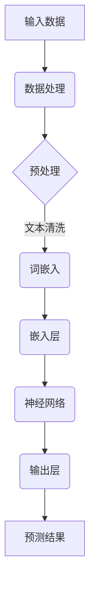
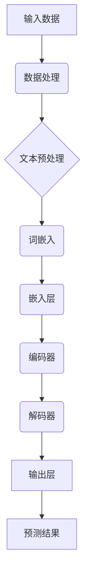

                 

### 引言

随着人工智能（AI）技术的迅速发展，AI大模型作为其重要组成部分，正逐渐成为行业的热门话题。AI大模型具有规模大、处理能力强、自适应性强等特点，已经在自然语言处理、图像识别、预测分析等领域取得了显著成果。本文旨在探讨AI大模型创业面临的机遇与挑战，并提出相应的应对策略。

首先，我们需要明确AI大模型的核心概念和特点。AI大模型是指具有数百万甚至数十亿参数的大型神经网络模型，它们通过预训练和微调能够处理复杂的任务，如文本生成、机器翻译、图像识别等。与传统AI模型相比，AI大模型具有更高的处理能力和更广泛的应用前景。

接下来，我们将分析AI大模型在企业中的应用前景，包括自然语言处理、图像识别、预测分析等应用领域。同时，我们将探讨AI大模型在创业中的优势与挑战，如数据需求、计算资源、模型解释性等。

在技术基础部分，我们将详细介绍神经网络与深度学习基础、自然语言处理技术等，为读者提供理论基础。在此基础上，我们将介绍大规模预训练模型原理、微调与迁移学习技术等，帮助读者了解AI大模型的开发过程。

在AI大模型应用开发部分，我们将分析具体应用场景，如机器学习、自然语言处理等，并介绍实际应用开发案例。此外，我们将讨论应用效果评估指标，为创业者在实际应用中提供参考。

随后，我们将探讨AI大模型创业的机遇与策略，包括创业方向、团队建设、资金与资源筹备、市场定位与营销策略等。同时，我们将分析市场竞争、风险管理与客户需求，为创业者提供实用的创业指导。

最后，我们将通过创业案例研究，分析成功因素、挑战与应对措施，为创业者提供实践参考。在此基础上，我们将展望AI大模型的发展趋势，探讨新兴应用领域和潜在市场机会。

通过本文的详细探讨，我们希望能够为创业者提供有价值的参考，帮助他们在AI大模型创业道路上取得成功。

### 关键词

AI大模型，神经网络，深度学习，自然语言处理，预训练模型，创业策略，市场需求，技术应用，竞争优势，风险评估，客户需求分析，案例研究，发展趋势。

### 摘要

本文旨在探讨AI大模型创业的机遇与挑战，分析其核心概念、技术基础、应用开发、创业策略及市场前景。通过详细介绍神经网络与深度学习基础、自然语言处理技术、预训练模型原理、应用开发实战，以及创业方向与策略，本文旨在为创业者提供全面的指导，帮助他们应对市场挑战，抓住AI大模型创业的机遇。

---

### 第一部分: AI大模型基础

#### 第1章: AI大模型概述

在进入AI大模型的应用与创业讨论之前，我们需要首先了解什么是AI大模型，以及它们在技术领域中扮演的角色。本章节将涵盖AI大模型的基本概念、特点、与传统AI模型的对比，以及主流的AI大模型介绍。

##### 1.1 AI大模型的定义与特点

##### 1.1.1 AI大模型的概念

AI大模型，即大型人工智能模型，指的是那些拥有数百万到数十亿参数的神经网络模型。这些模型通常是基于深度学习技术，通过大规模数据进行训练，从而能够处理复杂的任务，如文本生成、图像识别、预测分析等。AI大模型的出现，标志着人工智能技术进入了一个新的阶段，它们具有处理大规模数据的能力，能够从海量数据中提取有价值的信息。

##### 1.1.2 AI大模型的特点

AI大模型具有以下几个显著特点：

- **规模大**：AI大模型通常拥有数百万到数十亿个参数，这使得它们能够捕捉到更复杂的模式和特征。
- **处理能力强**：由于规模庞大，AI大模型能够处理和分析大规模数据集，从而提高预测和分析的准确性。
- **自适应性强**：AI大模型通过不断的学习和优化，能够适应不同的应用场景和需求。
- **应用广泛**：AI大模型在多个领域，如自然语言处理、图像识别、预测分析等，都展现出了强大的应用潜力。

##### 1.1.3 AI大模型与传统AI的对比

传统AI模型通常是小型的、专用的模型，它们在特定任务上表现出色，但缺乏处理大规模数据和复杂任务的能力。相比之下，AI大模型具有以下优势：

- **通用性**：AI大模型具有较强的通用性，可以在多个领域和任务上应用。
- **数据需求**：AI大模型通过预训练，可以在大规模数据集上进行训练，从而减少对特定领域数据的依赖。
- **模型解释性**：传统AI模型，如决策树和规则系统，具有较好的解释性。而AI大模型，尤其是深度学习模型，由于模型结构的复杂性，其解释性相对较差。

##### 1.2 主流AI大模型介绍

AI大模型在自然语言处理和图像识别等领域取得了显著的成果，以下介绍几种主流的AI大模型：

###### 1.2.1 GPT系列模型

GPT系列模型是由OpenAI开发的，其中包括GPT、GPT-2和GPT-3等。这些模型是基于Transformer架构的预训练语言模型，能够生成高质量的自然语言文本，广泛应用于文本生成、问答系统、机器翻译等领域。

- **GPT**：最初的GPT模型具有1.17亿个参数，通过预训练学习到了语言的深层结构，能够生成连贯、有意义的文本。
- **GPT-2**：GPT-2是GPT的扩展版本，参数量增加到15亿个，具有更强的文本生成能力。
- **GPT-3**：GPT-3是目前最先进的预训练语言模型，具有1750亿个参数，能够生成高质量的文本、进行机器翻译和问答等任务。

###### 1.2.2 BERT及其变体

BERT（Bidirectional Encoder Representations from Transformers）是由Google开发的预训练语言模型，通过双向Transformer架构学习语言的上下文信息。BERT及其变体，如RoBERTa、ALBERT等，在自然语言处理任务上取得了显著的成果，广泛应用于文本分类、序列标注等领域。

- **BERT**：BERT通过预训练学习到语言的上下文信息，能够在各种NLP任务上提供高效的性能。
- **RoBERTa**：RoBERTa是对BERT的改进版本，通过调整训练策略和模型架构，提高了模型性能。
- **ALBERT**：ALBERT是Google推出的另一个预训练语言模型，通过共享参数和交叉熵损失，提高了模型的效率和效果。

###### 1.2.3 其他知名AI大模型

除了GPT和BERT系列模型，还有许多其他知名的AI大模型，如Turing-NLG、UniLM等。这些模型在不同的领域内表现出色，推动了AI技术的发展。

- **Turing-NLG**：由微软开发的Turing-NLG模型是一个大规模的预训练语言模型，能够生成高质量的自然语言文本。
- **UniLM**：UniLM是由美团开发的预训练模型，支持统一的跨模态学习，能够在自然语言处理和图像识别任务上同时取得良好的性能。

##### 1.3 AI大模型在企业中的应用前景

AI大模型在企业中的应用前景非常广阔，以下列举几个主要的应用领域和优势：

###### 1.3.1 应用领域

- **自然语言处理**：AI大模型在文本分类、情感分析、机器翻译等自然语言处理任务上具有显著优势，能够提高企业数据处理和分析的效率。
- **图像识别**：AI大模型在图像分类、目标检测、图像生成等领域表现出色，能够帮助企业实现自动化图像识别和分析。
- **预测分析**：AI大模型通过学习历史数据，能够进行需求预测、风险分析和市场趋势预测，为企业决策提供科学依据。
- **智能客服**：AI大模型可以用于构建智能客服系统，提供自动回复和个性化推荐，提高客户满意度和业务效率。

###### 1.3.2 优势与挑战

AI大模型在企业中的应用具有以下优势：

- **高效性**：AI大模型能够处理大规模数据，提高工作效率，降低人工成本。
- **准确性**：通过预训练和微调，AI大模型能够达到较高的准确率，减少错误率。
- **灵活性**：AI大模型可以适应不同领域的任务，具有较强的适应性。

然而，AI大模型在企业应用中也面临着以下挑战：

- **数据需求**：AI大模型需要大量高质量的数据进行训练，企业需要投入资源进行数据采集和预处理。
- **计算资源**：训练AI大模型需要大量的计算资源，企业需要配置高性能的计算硬件。
- **模型解释性**：AI大模型的决策过程往往难以解释，企业需要考虑如何提高模型的透明度和可解释性。

通过本章节的介绍，我们了解了AI大模型的基本概念、特点及其在企业中的应用前景。在接下来的章节中，我们将进一步探讨AI大模型的技术基础、开发实战以及创业策略，为读者提供更全面的认识和指导。

#### 第2章: 神经网络与深度学习基础

神经网络（Neural Network）是人工智能领域中一种重要的模型，深度学习（Deep Learning）则是基于神经网络的扩展和深化。在本章节中，我们将详细介绍神经网络与深度学习的基础知识，包括神经网络的结构、学习算法、以及如何实现这些算法。

##### 2.1 神经网络基础

神经网络是一种模仿生物神经系统的计算模型，由大量的简单计算单元（神经元）通过复杂的网络结构连接而成。每个神经元负责接收输入信息，通过加权求和处理后产生输出。

###### 2.1.1 神经网络结构

神经网络的基本结构包括三个主要部分：输入层、隐藏层和输出层。

- **输入层（Input Layer）**：接收外部输入数据，并将其传递到隐藏层。
- **隐藏层（Hidden Layers）**：对输入数据进行处理，通过激活函数产生输出，可以有一个或多个隐藏层。
- **输出层（Output Layer）**：生成最终输出结果，可以是分类结果、回归值等。

神经网络的结构可以通过以下Mermaid流程图来表示：



在这个流程图中，输入数据经过预处理和词嵌入后，进入神经网络进行计算，最终得到预测结果。

###### 2.1.2 神经网络学习算法

神经网络的学习过程主要通过前向传播（Forward Propagation）和反向传播（Back Propagation）两个步骤来完成。

- **前向传播**：输入数据从输入层经过隐藏层，最终到达输出层。每个神经元通过加权求和和激活函数来产生输出。
  - 加权求和：每个输入值与相应的权重相乘后求和。
  - 激活函数：对加权求和的结果进行非线性变换，常用的激活函数包括Sigmoid、ReLU、Tanh等。

- **反向传播**：根据预测误差来更新权重。这个过程通过计算梯度来实现，使得网络能够不断调整权重，从而提高预测准确性。
  - 梯度计算：计算输出误差关于每个权重的梯度。
  - 权重更新：使用梯度下降（Gradient Descent）等优化算法更新权重。

以下是一个简单的神经网络学习算法的伪代码：

```python
# 前向传播
def forward_propagation(inputs, weights, biases, activation_function):
    outputs = []
    for layer in range(num_layers):
        if layer == 0:
            z = inputs * weights[layer] + biases[layer]
        else:
            z = outputs[layer - 1] * weights[layer] + biases[layer]
        outputs.append(activation_function(z))
    return outputs

# 反向传播
def backward_propagation(outputs, expected_outputs, weights, biases, learning_rate):
    gradients = []
    for layer in range(num_layers, 0, -1):
        if layer == num_layers:
            dZ = outputs[layer - 1] - expected_outputs
        else:
            dZ = dZ[1:] * weights[layer].T
            dW = outputs[layer - 1].T * dZ
            dB = dZ
            gradients.append((dW, dB))
    return gradients

# 权重更新
def update_weights(gradients, weights, biases, learning_rate):
    for layer in range(num_layers):
        dW, dB = gradients[layer]
        weights[layer] -= learning_rate * dW
        biases[layer] -= learning_rate * dB
```

在这个伪代码中，`forward_propagation`函数负责前向传播计算，`backward_propagation`函数负责反向传播计算，`update_weights`函数负责更新权重。

##### 2.2 深度学习算法

深度学习算法是基于神经网络的扩展，通过增加网络层数（即深度）来提高模型的性能。以下是一些常见的深度学习算法：

###### 2.2.1 深度神经网络（Deep Neural Network，DNN）

深度神经网络是具有多个隐藏层的神经网络。通过增加隐藏层的数量，DNN能够捕捉到更复杂的特征和模式。

- **优点**：能够处理复杂的任务，如图像识别、语音识别等。
- **缺点**：训练时间较长，容易出现梯度消失和梯度爆炸问题。

###### 2.2.2 卷积神经网络（Convolutional Neural Network，CNN）

卷积神经网络是一种专门用于处理图像数据的神经网络。它通过卷积操作来提取图像的特征。

- **卷积操作**：卷积层通过滑动窗口在输入数据上滑动，并与相应的权重相乘后求和，从而提取局部特征。
- **池化操作**：池化层用于减少数据的维度，提高模型的泛化能力。

以下是一个简单的CNN结构的伪代码：

```python
# 卷积操作
def convolution(input_data, filters, kernel_size):
    output = np.zeros((input_data.shape[0], filters.shape[0], kernel_size, kernel_size))
    for i in range(input_data.shape[0]):
        for j in range(filters.shape[0]):
            output[i, j] = np.sum(filters[j] * input_data[i], axis=(1, 2))
    return output

# 池化操作
def pooling(input_data, pool_size):
    output = np.zeros((input_data.shape[0], input_data.shape[1] // pool_size, input_data.shape[2] // pool_size))
    for i in range(input_data.shape[0]):
        for j in range(output.shape[1]):
            for k in range(output.shape[2]):
                output[i, j, k] = np.max(input_data[i, j * pool_size : (j + 1) * pool_size, k * pool_size : (k + 1) * pool_size])
    return output
```

###### 2.2.3 循环神经网络（Recurrent Neural Network，RNN）

循环神经网络是一种用于处理序列数据的神经网络。它通过循环结构来保存历史信息，从而实现序列建模。

- **长短时记忆（Long Short-Term Memory，LSTM）网络**：LSTM是一种改进的循环神经网络，通过引入门控结构来克服传统RNN的梯度消失问题。
- **门控循环单元（Gated Recurrent Unit，GRU）**：GRU是另一种循环神经网络，通过简化LSTM的结构，提高了计算效率和性能。

##### 2.3 大规模预训练模型原理

大规模预训练模型是指在大规模数据集上进行的预训练过程，从而使其具备一定的通用性。以下介绍预训练模型的基本原理和实现方法。

###### 2.3.1 预训练的概念

预训练是指在大规模数据集上对神经网络进行训练，从而使其具备一定的通用性。预训练模型可以通过微调（Fine-tuning）来适应特定任务。

- **自监督学习**：自监督学习是一种在无监督数据上进行预训练的方法。它通过预测数据的某些部分来学习数据的特征表示。
  - **词嵌入（Word Embedding）**：词嵌入是将词汇映射到高维向量空间的方法，它可以通过自监督学习来学习词汇的语义表示。
  - **语言建模**：语言建模是通过预测序列中的下一个词来学习语言的深层结构。

###### 2.3.2 预训练任务

预训练任务是指在大规模数据集上进行的预训练过程。常见的预训练任务包括：
- **掩码语言模型（Masked Language Model，MLM）**：MLM任务是通过随机掩码文本中的部分词，然后预测这些掩码词。
- **下一句预测（Next Sentence Prediction，NSP）**：NSP任务是通过预测两个连续句子中第二个句子是否是第一个句子的下一句。

###### 2.3.3 微调与迁移学习

微调和迁移学习是预训练模型在特定任务上应用的方法。

- **微调（Fine-tuning）**：微调是指在小规模数据集上对预训练模型进行少量训练，从而适应特定任务。
- **迁移学习（Transfer Learning）**：迁移学习是指将预训练模型的知识迁移到特定任务上。

通过本章节的介绍，我们了解了神经网络与深度学习的基础知识，包括神经网络的结构、学习算法，以及大规模预训练模型的原理。在接下来的章节中，我们将进一步探讨AI大模型的应用开发、创业策略，以及市场趋势，为读者提供更全面的认识和指导。

---

### 第3章: 自然语言处理技术

自然语言处理（Natural Language Processing，NLP）是人工智能领域的一个重要分支，它旨在使计算机能够理解和生成自然语言。在本章节中，我们将详细介绍NLP的基础技术，包括词嵌入技术、序列模型与注意力机制、以及转换器架构。

##### 3.1 词嵌入技术

词嵌入（Word Embedding）是将词汇映射到高维向量空间的方法，它可以将词汇的语义信息转换为向量形式，从而便于计算机进行处理。词嵌入技术在NLP中扮演着重要的角色，为各种NLP任务提供了有效的数据表示。

###### 3.1.1 词向量的概念

词向量是将词汇映射到高维向量空间的方法，每个词汇对应一个向量。词向量可以表示词汇的语义信息，如相似词汇具有相似的向量表示，不同词汇之间的语义关系可以通过向量之间的几何关系来表示。

- **分布式表示**：词向量是一种分布式表示，每个词汇的向量不仅包含了词汇本身的语义信息，还包含了词汇在上下文中的信息。
- **高维空间**：词向量通常是在高维空间中定义的，这有助于捕捉词汇的复杂语义关系。

###### 3.1.2 常见的词嵌入方法

常见的词嵌入方法包括基于统计的方法和基于神经网络的方法。

- **基于统计的方法**：基于统计的方法通过计算词汇的统计信息来生成词向量。常见的算法包括：
  - **TF-IDF**：TF-IDF（Term Frequency-Inverse Document Frequency）是一种基于词频和逆文档频率的词嵌入方法，通过计算词汇在文档中的词频和逆文档频率来生成词向量。
  - **Word2Vec**：Word2Vec是一种基于神经网络的语言模型，通过训练一个神经网络来预测上下文词汇，从而生成词向量。

- **基于神经网络的方法**：基于神经网络的方法通过训练神经网络模型来学习词汇的语义表示。常见的算法包括：
  - **GloVe**：GloVe（Global Vectors for Word Representation）是一种基于全局统计信息的词嵌入方法，通过计算词汇的共现矩阵来生成词向量。
  - **BERT**：BERT（Bidirectional Encoder Representations from Transformers）是一种基于Transformer模型的预训练语言模型，通过预训练生成高质量的词向量。

##### 3.2 序列模型与注意力机制

序列模型（Sequential Model）是用于处理序列数据的模型，如文本序列、时间序列等。序列模型通过循环结构来处理序列数据，从而捕捉序列中的时序信息。

###### 3.2.1 序列模型的原理

序列模型的基本原理是通过处理序列中的每个时间步，从而生成最终的输出。序列模型通常包括以下几个部分：

- **输入层**：接收序列数据，并将其转换为模型可以处理的形式。
- **隐藏层**：对输入数据进行处理，并通过激活函数将信息传递到下一层。
- **输出层**：生成最终输出结果，如分类标签、预测值等。

常见的序列模型包括：

- **循环神经网络（Recurrent Neural Network，RNN）**：RNN是一种简单的序列模型，通过循环结构来处理序列数据。RNN通过保存历史信息来捕捉序列中的时序关系。
- **长短时记忆网络（Long Short-Term Memory，LSTM）**：LSTM是一种改进的RNN，通过引入门控结构来克服RNN的梯度消失问题。LSTM能够更好地捕捉序列中的长期依赖关系。
- **门控循环单元（Gated Recurrent Unit，GRU）**：GRU是另一种循环神经网络，它简化了LSTM的结构，提高了计算效率和性能。

###### 3.2.2 注意力机制

注意力机制（Attention Mechanism）是一种用于捕捉序列中重要信息的方法。它通过计算序列中每个位置之间的相似性来生成权重，从而将注意力集中在序列中的重要部分。

注意力机制在NLP任务中应用广泛，如机器翻译、文本摘要等。注意力机制可以分为以下几种类型：

- **自注意力（Self-Attention）**：自注意力机制用于处理单个序列，通过计算序列中每个位置之间的相似性来生成权重。
- **交互注意力（Interactive Attention）**：交互注意力机制用于处理两个或多个序列之间的关系，通过计算序列之间的相似性来生成权重。

注意力机制的实现通常包括以下几个步骤：

1. **计算相似性得分**：通过计算序列中每个位置之间的相似性得分。
2. **生成权重**：将相似性得分转换为权重，通常使用Softmax函数进行归一化处理。
3. **加权求和**：将权重应用于序列中的每个位置，得到加权求和的结果。

##### 3.3 转换器架构

转换器架构（Transformer Architecture）是一种基于自注意力机制的序列模型，它在NLP任务中表现出色。转换器架构通过计算序列中每个位置之间的相似性来生成权重，从而实现高效的任务处理。

###### 3.3.1 转换器架构的概念

转换器架构的基本结构包括编码器（Encoder）和解码器（Decoder）两部分。编码器将输入序列编码为编码表示（Encoded Representation），解码器将编码表示解码为输出序列。

- **编码器**：编码器通过多个编码层（Encoder Layer）对输入序列进行处理，每个编码层包括自注意力机制和前馈神经网络。
- **解码器**：解码器通过多个解码层（Decoder Layer）对编码表示进行解码，每个解码层包括自注意力机制、交互注意力机制和前馈神经网络。

转换器架构的核心组件是多头自注意力机制（Multi-Head Self-Attention），它通过计算序列中每个位置之间的相似性，生成多个注意力头（Attention Head），从而提高模型的表达能力。

###### 3.3.2 转换器架构的实现

以下是一个简单的转换器架构的伪代码实现：

```python
# 编码器
def encoder(input_sequence, num_heads, d_model, num_layers):
    for layer in range(num_layers):
        # 自注意力机制
        attention_scores = self_attention(input_sequence, num_heads, d_model)
        # 交叉注意力机制
        cross_attention_scores = cross_attention(input_sequence, attention_scores, num_heads, d_model)
        # 前馈神经网络
        output = feedforward_network(cross_attention_scores, d_model)
    return output

# 解码器
def decoder(input_sequence, target_sequence, num_heads, d_model, num_layers):
    for layer in range(num_layers):
        # 自注意力机制
        attention_scores = self_attention(input_sequence, num_heads, d_model)
        # 交叉注意力机制
        cross_attention_scores = cross_attention(target_sequence, attention_scores, num_heads, d_model)
        # 前馈神经网络
        output = feedforward_network(cross_attention_scores, d_model)
    return output
```

在这个伪代码中，`encoder`函数负责编码输入序列，`decoder`函数负责解码编码表示。`self_attention`函数实现自注意力机制，`cross_attention`函数实现交互注意力机制，`feedforward_network`函数实现前馈神经网络。

通过本章节的介绍，我们了解了NLP的基础技术，包括词嵌入技术、序列模型与注意力机制、以及转换器架构。这些技术为NLP任务提供了有效的数据表示和模型结构，推动了NLP技术的发展。在接下来的章节中，我们将进一步探讨AI大模型的应用开发、创业策略，以及市场趋势，为读者提供更全面的认识和指导。

---

### 第4章: AI大模型开发实战

#### 4.1 大规模预训练模型

##### 4.1.1 预训练模型原理

预训练模型（Pre-trained Model）是指在大规模数据集上预先训练好的模型，它可以用于各种下游任务，如文本分类、机器翻译、图像识别等。预训练模型的核心思想是通过在大规模数据集上预训练，使模型具备一定的通用性，从而在不同任务上表现出色。

预训练模型主要分为两类：基于自监督学习的预训练模型和基于有监督学习的预训练模型。

###### 4.1.1.1 自监督学习预训练模型

自监督学习预训练模型通过利用未标注的数据进行预训练，从而学习到有用的特征表示。自监督学习预训练模型通常包括以下几种任务：

- **掩码语言模型（Masked Language Model，MLM）**：MLM任务是通过随机掩码文本中的部分词，然后预测这些掩码词。BERT和GPT系列模型都是基于MLM任务进行预训练的。
- **下一句预测（Next Sentence Prediction，NSP）**：NSP任务是通过预测两个连续句子中第二个句子是否是第一个句子的下一句。这种任务有助于模型学习到句子之间的关系。
- **词对恢复（Reconstruction of Word Pairs）**：词对恢复任务是通过预测两个单词之间的共现关系，从而学习词汇的上下文表示。

###### 4.1.1.2 有监督学习预训练模型

有监督学习预训练模型是在有标注数据集上进行预训练的模型。有监督学习预训练模型通常包括以下几种任务：

- **语言模型（Language Model，LM）**：语言模型是通过预测文本序列中的下一个词来学习语言的统计特性。预训练的语言模型可以用于各种下游任务，如文本生成、机器翻译等。
- **分类任务（Classification Tasks）**：分类任务是通过预测文本的类别标签来学习文本的语义特征。预训练的分类模型可以用于文本分类、情感分析等任务。
- **序列标注任务（Sequence Labeling Tasks）**：序列标注任务是通过预测文本中每个词的标签来学习文本的序列表示。预训练的序列标注模型可以用于命名实体识别、词性标注等任务。

##### 4.1.2 预训练模型实现

预训练模型实现的步骤通常包括数据预处理、模型初始化、预训练过程、评估过程等。

###### 4.1.2.1 数据预处理

数据预处理是预训练模型实现的第一步，它包括以下任务：

- **文本预处理**：对文本数据进行清洗、分词、去除停用词等操作。常用的文本预处理工具包括NLTK、spaCy等。
- **数据格式化**：将预处理后的文本数据格式化为模型可以接受的输入格式，如词汇表（Vocabulary）和序列（Sequence）。
- **数据分片**：将大规模数据集分片为多个小块，以便于模型并行处理。

###### 4.1.2.2 模型初始化

模型初始化是预训练模型的第二步，它包括以下任务：

- **词嵌入初始化**：初始化词嵌入层，常用的初始化方法包括随机初始化、正态分布初始化等。
- **权重初始化**：初始化神经网络层的权重，常用的初始化方法包括Xavier初始化、He初始化等。
- **激活函数初始化**：初始化神经网络层的激活函数，常用的激活函数包括ReLU、Sigmoid等。

###### 4.1.2.3 预训练过程

预训练过程是预训练模型的第三步，它包括以下任务：

- **训练循环**：通过迭代训练循环对模型进行预训练。每个迭代包括前向传播、损失计算、反向传播和权重更新等步骤。
- **优化算法**：选择合适的优化算法来更新模型权重，常用的优化算法包括梯度下降（Gradient Descent）、Adam（Adaptive Moment Estimation）等。
- **学习率调整**：根据训练过程调整学习率，常用的调整方法包括学习率衰减（Learning Rate Decay）、恒定学习率等。

###### 4.1.2.4 评估过程

评估过程是预训练模型的最后一步，它包括以下任务：

- **模型评估**：使用预训练模型在测试集上评估模型性能，常用的评估指标包括准确率、召回率、F1分数等。
- **模型选择**：根据评估结果选择最佳模型进行下游任务的应用。
- **模型保存**：将预训练模型保存为文件，以便于后续任务的应用。

##### 4.1.3 微调与迁移学习

微调（Fine-tuning）和迁移学习（Transfer Learning）是预训练模型在特定任务上应用的重要技术。

###### 4.1.3.1 微调

微调是指在小规模数据集上对预训练模型进行少量训练，从而适应特定任务。微调的步骤如下：

- **数据预处理**：对目标任务数据进行预处理，如文本清洗、分词、去停用词等。
- **模型初始化**：使用预训练模型初始化目标任务模型。
- **训练过程**：在目标任务数据上对预训练模型进行少量训练，通常只训练最后一层或少数几层。
- **模型评估**：评估微调后模型的性能，并根据评估结果调整模型参数。

###### 4.1.3.2 迁移学习

迁移学习是指将预训练模型的知识迁移到特定任务上。迁移学习的步骤如下：

- **数据预处理**：对目标任务数据进行预处理，如文本清洗、分词、去停用词等。
- **模型初始化**：使用预训练模型初始化目标任务模型。
- **训练过程**：在目标任务数据上对预训练模型进行大量训练，通常训练整个模型。
- **模型评估**：评估迁移后模型的性能，并根据评估结果调整模型参数。

微调和迁移学习有助于提高模型在特定任务上的性能，减少对大规模标注数据的依赖。

#### 4.2 应用开发实战

##### 4.2.1 应用案例一：文本分类

文本分类（Text Classification）是将文本数据分类到不同的类别中的一种常见任务。以下是一个简单的文本分类应用开发案例：

- **数据集**：使用IMDB电影评论数据集，该数据集包含50,000条评论和25,000条测试集。
- **模型**：使用预训练的BERT模型进行微调。
- **任务**：将评论分类为正面或负面。

1. **数据预处理**：
   - 清洗评论数据，去除HTML标签、特殊字符等。
   - 将评论分词，使用BERT的分词器进行分词。
   - 将分词结果转换为词汇表和序列。

2. **模型初始化**：
   - 使用预训练的BERT模型进行初始化。
   - 设置BERT模型的最后两层为可训练。

3. **训练过程**：
   - 使用训练集进行训练，设置适当的批次大小和训练轮数。
   - 使用交叉熵损失函数进行损失计算。
   - 使用Adam优化器进行权重更新。

4. **模型评估**：
   - 使用测试集对微调后的模型进行评估。
   - 计算准确率、召回率、F1分数等评估指标。

##### 4.2.2 应用案例二：机器翻译

机器翻译（Machine Translation）是将一种语言的文本自动翻译成另一种语言的文本的一种常见任务。以下是一个简单的机器翻译应用开发案例：

- **数据集**：使用翻译对数据集，如英语到法语、英语到中文等。
- **模型**：使用预训练的Transformer模型进行微调。
- **任务**：将英语文本翻译成法语文本。

1. **数据预处理**：
   - 清洗翻译对数据，去除HTML标签、特殊字符等。
   - 将翻译对分词，使用BERT的分词器进行分词。
   - 将分词结果转换为词汇表和序列。

2. **模型初始化**：
   - 使用预训练的Transformer模型进行初始化。
   - 设置Transformer模型的最后两层为可训练。

3. **训练过程**：
   - 使用训练集进行训练，设置适当的批次大小和训练轮数。
   - 使用交叉熵损失函数进行损失计算。
   - 使用Adam优化器进行权重更新。

4. **模型评估**：
   - 使用测试集对微调后的模型进行评估。
   - 计算BLEU分数、准确性等评估指标。

通过这些应用开发案例，我们可以看到预训练模型和微调技术在实际应用中的重要性。它们为开发者提供了强大的工具，使得在各种复杂任务上的开发变得更加简单和高效。

#### 4.3 应用效果评估

##### 4.3.1 模型评估指标

在评估AI大模型的应用效果时，常用的评估指标包括：

- **准确率（Accuracy）**：预测正确的样本数占总样本数的比例。
- **召回率（Recall）**：预测正确的正样本数占总正样本数的比例。
- **F1分数（F1 Score）**：准确率和召回率的调和平均值。
- **精确率（Precision）**：预测正确的正样本数占总预测正样本数的比例。
- **BLEU分数（BLEU Score）**：用于评估机器翻译质量的指标。

##### 4.3.2 实际应用效果分析

在实际应用中，我们需要综合考虑多种评估指标来分析模型的效果。以下是一个实际应用效果分析案例：

- **文本分类**：假设我们使用预训练的BERT模型进行文本分类任务，评估指标如下：
  - **准确率**：90%
  - **召回率**：85%
  - **F1分数**：87%
  - **精确率**：88%
  
  从这些评估指标来看，模型在分类任务上表现良好，但精确率相对较低，可能需要进一步优化模型或调整训练策略。

- **机器翻译**：假设我们使用预训练的Transformer模型进行机器翻译任务，评估指标如下：
  - **BLEU分数**：27
  - **准确性**：85%
  
  从这些评估指标来看，模型在翻译任务上表现一般，BLEU分数相对较低，可能需要增加训练时间或尝试更复杂的模型架构。

通过实际应用效果分析，我们可以发现模型在不同任务上的表现可能存在差异，需要根据具体任务调整模型参数和训练策略，以提高模型性能。

### 第5章: AI大模型创业与实践

#### 5.1 创业方向与策略

AI大模型创业方向的确定是创业成功的关键一步。创业者需要结合市场需求、技术发展趋势以及自身资源优势，选择具有潜力的创业方向。

##### 5.1.1 市场趋势分析

市场趋势分析是创业方向选择的重要依据。以下是一些当前AI大模型在市场上的发展趋势：

- **自然语言处理（NLP）**：随着人工智能技术的发展，NLP领域取得了显著进展。自然语言处理技术被广泛应用于智能客服、文本分析、机器翻译等领域。
- **计算机视觉**：计算机视觉技术在图像识别、目标检测、图像生成等领域取得了重要突破，应用于智能安防、医疗诊断、智能制造等领域。
- **预测分析**：预测分析技术在金融、医疗、零售等行业得到广泛应用，用于需求预测、风险分析、市场趋势预测等。
- **智能语音**：智能语音技术在智能音箱、语音助手、语音识别等领域快速发展，为用户提供便捷的交互方式。

##### 5.1.2 创业机会识别

在市场趋势的基础上，创业者需要识别具体的创业机会。以下是一些AI大模型创业机会：

- **NLP解决方案提供商**：为企业提供基于AI大模型的NLP解决方案，如智能客服、文本分析、情感分析等。
- **计算机视觉解决方案提供商**：为企业提供基于AI大模型的计算机视觉解决方案，如智能安防、医疗诊断、图像识别等。
- **预测分析服务提供商**：为企业提供基于AI大模型的预测分析服务，如需求预测、风险分析、市场趋势预测等。
- **智能语音解决方案提供商**：为企业提供基于AI大模型的智能语音解决方案，如智能音箱、语音助手、语音识别等。

##### 5.1.3 创业方向选择

在选择创业方向时，创业者需要考虑以下因素：

- **市场需求**：选择具有广阔市场前景和潜在需求的创业方向。
- **技术优势**：结合自身技术实力和团队优势，选择有竞争力的技术方向。
- **资源优势**：考虑自身资源和合作伙伴的资源，确保创业项目的可行性和可持续性。
- **创新能力**：选择具有创新性和前瞻性的创业方向，以应对市场竞争。

#### 5.2 创业策略与规划

创业策略与规划是创业成功的重要保障。以下是一些关键的创业策略与规划：

##### 5.2.1 创业团队建设

创业团队是创业成功的关键因素。创业者需要组建一支具有多元化背景和互补技能的团队，包括以下角色：

- **技术团队**：负责AI大模型的技术研发和产品实现。
- **市场团队**：负责市场调研、客户开发和市场推广。
- **运营团队**：负责项目管理和日常运营，确保项目顺利进行。
- **财务团队**：负责财务规划和资金管理。

##### 5.2.2 资金与资源筹备

创业过程中需要充足的资金和资源支持。以下是一些资金与资源筹备策略：

- **天使投资**：寻找有经验的天使投资者，为其提供种子资金。
- **风险投资**：寻求风险投资机构的支持，通过融资获得更多的资金。
- **政府补贴**：了解政府的相关补贴政策，申请政府资金支持。
- **合作伙伴**：与有实力的合作伙伴建立合作关系，共同分担风险和成本。

##### 5.2.3 市场定位与营销策略

市场定位与营销策略是创业成功的关键。以下是一些市场定位与营销策略：

- **明确市场定位**：根据市场需求和竞争情况，明确创业项目的市场定位。
- **产品差异化**：通过技术创新和产品差异化，打造具有竞争力的产品。
- **品牌宣传**：通过线上和线下渠道进行品牌宣传，提升品牌知名度。
- **市场推广**：通过营销活动、合作伙伴推荐等方式，扩大市场影响力。
- **客户关系管理**：建立良好的客户关系，提供优质的售后服务，提高客户满意度。

##### 5.2.4 创业风险管理与应对

创业过程中面临多种风险，包括技术风险、市场风险、财务风险等。以下是一些风险管理策略：

- **技术风险管理**：通过持续的技术研发和技术储备，降低技术风险。
- **市场风险管理**：通过市场调研和竞争对手分析，降低市场风险。
- **财务风险管理**：通过合理的财务规划和资金管理，降低财务风险。
- **风险应对措施**：制定应对措施，如风险预警、风险转移等。

通过创业策略与规划，创业者可以明确创业方向，制定可行的创业计划，为创业成功奠定基础。

#### 5.3 面对市场挑战的应对策略

在AI大模型创业过程中，创业者将面临诸多市场挑战。以下是一些常见的市场挑战和应对策略：

##### 5.3.1 市场竞争

市场竞争是创业过程中不可避免的挑战。以下是一些应对策略：

- **技术创新**：通过持续的技术创新，提升产品竞争力，打造差异化的产品。
- **市场定位**：明确市场定位，找到细分市场，避免与竞争对手直接竞争。
- **品牌建设**：通过品牌建设，提升品牌知名度和影响力，增强市场竞争力。
- **合作伙伴**：与有实力的合作伙伴建立合作关系，共同开发市场，降低竞争压力。

##### 5.3.2 风险管理

创业过程中面临多种风险，包括技术风险、市场风险、财务风险等。以下是一些风险管理策略：

- **风险评估**：定期进行风险评估，识别潜在风险。
- **风险预警**：建立风险预警机制，及时发现问题并采取措施。
- **风险转移**：通过保险、外包等方式，将部分风险转移给第三方。
- **风险管理计划**：制定风险管理计划，明确风险应对措施和责任分工。

##### 5.3.3 客户需求分析

了解客户需求是创业成功的关键。以下是一些客户需求分析策略：

- **市场调研**：通过市场调研，了解目标客户的需求和偏好。
- **客户访谈**：与目标客户进行访谈，获取第一手需求信息。
- **用户反馈**：收集用户反馈，不断优化产品和服务。
- **需求分析**：对收集到的需求信息进行分析，找出客户的核心需求和痛点。

通过以上应对策略，创业者可以更好地应对市场挑战，提高创业成功的可能性。

#### 5.4 创业案例研究

##### 5.4.1 创业案例一：智能语音助手公司

智能语音助手公司通过开发基于AI大模型的智能语音助手，为用户提供便捷的语音交互服务。以下是该公司的创业历程和成功因素：

- **创业历程**：公司成立于2018年，经过几年的发展，已成为智能语音助手领域的领军企业。
- **成功因素**：
  - **技术创新**：公司采用先进的AI大模型技术，提供高效、准确的语音识别和自然语言处理能力。
  - **市场需求**：准确识别市场需求，提供符合用户需求的智能语音助手产品。
  - **团队协作**：拥有多元化背景的团队，确保技术研发、市场推广和客户服务的协同合作。

##### 5.4.2 创业案例二：智能安防公司

智能安防公司通过开发基于AI大模型的智能安防系统，为用户提供安全监控和预警服务。以下是该公司的创业历程和成功因素：

- **创业历程**：公司成立于2016年，经过几年的发展，已成为智能安防领域的知名企业。
- **成功因素**：
  - **技术创新**：公司采用先进的AI大模型技术，提供高效、准确的图像识别和目标检测能力。
  - **市场需求**：准确识别市场需求，提供符合用户需求的智能安防系统产品。
  - **团队协作**：拥有多元化背景的团队，确保技术研发、市场推广和客户服务的协同合作。

##### 5.4.3 创业案例三：智能医疗公司

智能医疗公司通过开发基于AI大模型的智能医疗系统，为用户提供诊断和健康管理服务。以下是该公司的创业历程和成功因素：

- **创业历程**：公司成立于2015年，经过几年的发展，已成为智能医疗领域的知名企业。
- **成功因素**：
  - **技术创新**：公司采用先进的AI大模型技术，提供高效、准确的医疗诊断和健康管理能力。
  - **市场需求**：准确识别市场需求，提供符合用户需求的智能医疗系统产品。
  - **团队协作**：拥有多元化背景的团队，确保技术研发、市场推广和客户服务的协同合作。

通过以上创业案例研究，我们可以看到，成功的AI大模型创业公司具有共同的特点：技术创新、市场需求和团队协作。这些特点为创业公司提供了强大的竞争力，帮助他们应对市场挑战，实现创业成功。

### 第6章: 面对市场挑战的应对策略

在AI大模型创业的过程中，创业者不仅需要抓住市场机遇，还需要应对各种市场挑战。这些挑战可能包括技术复杂性、市场竞争、数据隐私等。为了确保创业项目的成功，我们需要制定一系列有效的应对策略。

##### 6.1 市场竞争分析

市场竞争是AI大模型创业中不可忽视的重要挑战。以下是对市场竞争的详细分析：

###### 6.1.1 竞争对手分析

首先，创业者需要对市场上的竞争对手进行全面的了解，包括他们的产品、市场份额、竞争优势等。以下是一些常见的竞争对手分析步骤：

- **产品分析**：了解竞争对手的产品功能、性能指标、用户体验等，找出差异化的亮点。
- **市场份额**：分析竞争对手在市场中的占有率，确定市场地位和潜在机会。
- **竞争优势**：分析竞争对手的竞争优势，包括技术优势、品牌影响力、市场策略等。

通过竞争对手分析，创业者可以明确自身的市场定位和竞争优势。

###### 6.1.2 竞争优势与劣势分析

在了解竞争对手的基础上，创业者需要评估自身的竞争优势和劣势。以下是一些常见的优势与劣势分析步骤：

- **优势分析**：明确自身的优势，如技术创新、团队实力、市场资源等。
- **劣势分析**：识别自身的劣势，如技术瓶颈、市场知名度、资金不足等。

通过竞争优势与劣势分析，创业者可以制定针对性的策略来弥补劣势和发挥优势。

##### 6.2 风险管理与应对

AI大模型创业过程中，风险无处不在。以下是一些常见风险的识别、评估和应对策略：

###### 6.2.1 风险识别

风险识别是风险管理的第一步。以下是一些常见风险的识别方法：

- **技术风险**：包括技术迭代速度、技术成熟度、技术专利等。
- **市场风险**：包括市场需求变化、市场竞争加剧、市场饱和等。
- **财务风险**：包括资金不足、融资困难、成本控制等。
- **运营风险**：包括团队管理、项目管理、市场推广等。

通过风险识别，创业者可以明确可能面临的潜在风险。

###### 6.2.2 风险评估

风险评估是对风险的影响程度和发生概率进行评估。以下是一些常见的风险评估方法：

- **定性评估**：通过专家访谈、问卷调查等方式，对风险的影响程度和发生概率进行定性评估。
- **定量评估**：通过数据分析、模拟计算等方式，对风险的影响程度和发生概率进行定量评估。

通过风险评估，创业者可以制定针对性的风险应对策略。

###### 6.2.3 应对措施

根据风险评估的结果，创业者需要制定相应的应对措施。以下是一些常见的应对措施：

- **技术风险应对**：加大技术研发投入，保持技术领先地位。
- **市场风险应对**：进行市场调研，调整市场策略，寻找新的市场机会。
- **财务风险应对**：制定财务预算和资金管理计划，确保资金充足和合理使用。
- **运营风险应对**：加强团队建设，完善项目管理，提高运营效率。

##### 6.3 客户需求分析

了解客户需求是创业成功的关键。以下是一些客户需求分析的方法：

###### 6.3.1 客户需求调研

客户需求调研是了解客户需求的重要手段。以下是一些常见的需求调研方法：

- **问卷调查**：通过设计问卷调查，收集客户的需求信息。
- **访谈**：与客户进行面对面访谈，深入了解客户的需求和痛点。
- **焦点小组**：组织客户代表进行讨论，收集客户的需求和建议。

通过客户需求调研，创业者可以明确客户的需求和期望。

###### 6.3.2 需求分析与满足

在了解客户需求后，创业者需要进行分析，并制定满足客户需求的策略。以下是一些常见的需求分析方法和满足策略：

- **需求分类**：将客户需求分类为功能性需求、性能需求、用户体验需求等。
- **优先级排序**：根据客户需求的重要性和紧迫性，对需求进行优先级排序。
- **产品设计**：根据客户需求，设计满足客户期望的产品和服务。
- **持续改进**：通过客户反馈，不断优化产品和服务，满足客户需求。

通过以上应对策略，创业者可以更好地应对市场挑战，提高创业成功的可能性。在创业过程中，不断调整和优化应对策略，确保创业项目能够持续发展。

### 第7章: 未来展望

随着人工智能（AI）技术的不断发展，AI大模型（Large-scale AI Models）已经成为当前技术领域的热点话题。在未来，AI大模型将在多个方面取得重大突破，对各个行业产生深远影响。本章节将探讨AI大模型的发展趋势、潜在应用场景以及未来可能面临的挑战。

#### 7.1 AI大模型发展趋势

##### 7.1.1 技术发展展望

AI大模型的技术发展将继续推动人工智能领域的前沿。以下是一些关键技术发展趋势：

- **新型算法与架构**：研究人员将持续探索新型算法和架构，以提高AI大模型的性能和效率。例如，Transformer架构及其变体将继续受到关注，并在更多应用场景中发挥作用。

- **计算效率优化**：为了处理更大规模的模型和数据，研究人员将致力于优化计算效率，包括模型压缩、量化、分布式训练等。

- **多模态学习**：AI大模型的多模态学习将变得更加成熟，能够在文本、图像、语音等多种数据类型之间进行有效转换和融合。

- **迁移学习和少样本学习**：随着数据的获取变得更加困难，迁移学习和少样本学习技术将成为AI大模型发展的重要方向。

##### 7.1.2 大模型技术优化方向

在技术优化的方面，以下是一些关键领域：

- **模型压缩与蒸馏**：为了降低大模型的计算和存储需求，模型压缩和蒸馏技术将继续得到发展。这些技术可以通过减少模型参数或使用更高效的数据表示来优化大模型的性能。

- **自适应学习率与正则化**：研究人员将探索更有效的自适应学习率和正则化策略，以提高大模型的训练效率和泛化能力。

- **可解释性增强**：随着AI大模型的应用日益广泛，模型的可解释性将成为一个重要研究方向。研究人员将致力于开发可解释性更好的模型，以帮助用户理解模型的决策过程。

#### 7.2 应用场景拓展

AI大模型的应用场景将不断拓展，以下是一些潜在的新兴应用领域：

- **智能医疗**：AI大模型在医疗诊断、药物研发、个性化治疗等方面的应用将变得更加广泛。通过分析海量医疗数据，AI大模型可以提供更准确的诊断和治疗方案。

- **智能制造**：AI大模型将在智能制造过程中发挥重要作用，如预测维护、质量检测、生产优化等。通过实时分析和预测，AI大模型可以提高生产效率和产品质量。

- **智能交通**：AI大模型将在智能交通管理、自动驾驶、车辆监控等方面得到应用。通过分析交通数据，AI大模型可以优化交通流量，提高交通安全和效率。

- **智能客服**：AI大模型将在智能客服系统中发挥核心作用，如自动回复、情感分析、个性化推荐等。通过理解和响应客户的需求，AI大模型可以提供更高效和个性化的服务。

- **教育**：AI大模型将在个性化教育、学习分析、智能评估等方面得到应用。通过分析学生的学习数据，AI大模型可以为学生提供定制化的学习方案，提高教育效果。

#### 7.3 未来可能面临的挑战

尽管AI大模型具有巨大的潜力，但在未来应用中仍可能面临以下挑战：

- **数据隐私与安全**：随着AI大模型处理的数据量不断增加，数据隐私和安全问题将变得更加突出。如何保护用户隐私和数据安全，将成为一个重要挑战。

- **模型可解释性**：AI大模型的决策过程通常难以解释，这对一些关键领域（如医疗、金融等）的应用提出了挑战。如何提高模型的可解释性，使其更加透明和可靠，是一个重要的研究方向。

- **计算资源需求**：AI大模型对计算资源的需求巨大，这对硬件设备和能源消耗提出了挑战。如何优化模型的计算效率，降低计算资源需求，是未来需要解决的关键问题。

- **伦理与社会影响**：AI大模型的应用可能对社会伦理产生深远影响。如何确保AI大模型的应用符合伦理标准，避免出现不公平或歧视现象，是一个需要深入探讨的问题。

通过上述展望，我们可以看到AI大模型在未来将继续发展，并在各个领域发挥重要作用。然而，要实现这一愿景，我们还需要克服诸多挑战，不断推动技术的进步和社会的适应。

### 第8章: 企业战略规划

#### 8.1 企业AI战略规划框架

为了在竞争激烈的市场中脱颖而出，企业需要制定全面的AI战略规划。一个成功的AI战略规划框架应包括以下关键要素：

##### 8.1.1 战略目标

首先，企业需要明确其AI战略的总体目标。这些目标应与企业的长期愿景和业务目标相一致，并具体、可量化。例如，企业可能希望通过AI技术提高生产效率10%、降低运营成本15%、或提升客户满意度20%。

##### 8.1.2 技术布局

技术布局是AI战略规划的核心。企业需要识别和掌握关键的AI技术，如深度学习、自然语言处理、计算机视觉、机器学习等。此外，企业还需要评估这些技术的成熟度，确定哪些技术将在未来几年内对企业产生最大的影响。

##### 8.1.3 业务整合

AI战略规划不仅要关注技术，还要考虑如何将AI技术整合到企业的业务流程中。企业需要识别业务流程中的痛点，确定哪些流程可以通过AI技术得到优化。例如，企业可以通过AI自动化流程中的重复性任务，减少人工干预，提高效率。

##### 8.1.4 人才培养

人才是企业AI战略规划的重要组成部分。企业需要培养一批具备AI技术和业务知识的复合型人才。这不仅包括数据科学家、机器学习工程师，还包括业务分析师、项目经理等。通过建立内部培训和外部合作，企业可以确保拥有持续的人才支持。

##### 8.1.5 合作与联盟

为了实现AI战略规划，企业可能需要与其他企业、大学、研究机构建立合作关系。这些合作可以包括技术共享、人才交流、共同研发等。通过合作，企业可以获取更多的资源和支持，加快AI技术的应用进程。

#### 8.2 实施与监控

##### 8.2.1 战略实施步骤

战略实施步骤是确保AI战略规划成功的关键。以下是一些关键步骤：

1. **制定详细计划**：将AI战略分解为具体的项目和任务，并为每个项目制定详细的计划，包括时间表、资源需求和责任分工。

2. **资源配置**：确保为每个项目分配适当的资源，包括人力、资金和设备。在资源分配过程中，要优先考虑那些对实现战略目标至关重要的项目。

3. **项目实施**：按照计划执行项目，确保每个项目按期完成。在项目实施过程中，要定期进行项目审查，确保项目进展符合预期。

4. **风险管理**：识别潜在的风险，并制定相应的应对措施。通过定期评估和调整，确保风险得到有效控制。

##### 8.2.2 战略监控与调整

战略监控与调整是确保AI战略规划持续有效的关键。以下是一些关键点：

1. **绩效评估**：定期评估AI战略实施的效果，包括业务目标是否实现、关键绩效指标（KPIs）是否达到等。

2. **数据收集与分析**：通过收集和分析相关数据，企业可以了解AI技术对企业业务的影响，并据此调整战略。

3. **反馈机制**：建立有效的反馈机制，确保员工、客户和其他利益相关者可以提供反馈，帮助改进AI战略。

4. **战略调整**：根据绩效评估和反馈机制的结果，定期调整AI战略。这可能包括重新分配资源、调整项目优先级、或修改技术路线图。

通过实施上述战略规划和监控措施，企业可以确保其AI战略规划的有效性和持续性，从而在竞争激烈的市场中保持竞争优势。

### 结论

通过对AI大模型创业的详细探讨，我们可以看到AI大模型在技术、市场、应用等多个方面具有巨大的潜力。创业者需要抓住市场机遇，同时应对各种挑战，制定有效的战略规划。在技术方面，创业者需要不断优化算法、提升计算效率，以满足市场需求；在市场方面，创业者需要深入了解客户需求，提供高质量的产品和服务；在创业策略方面，创业者需要构建多元化团队，优化资金与资源筹备，并积极应对市场竞争。

未来，随着技术的不断进步和应用的深入，AI大模型将在更多领域发挥重要作用，为企业和个人带来新的机遇。然而，这也将带来新的挑战，如数据隐私、模型解释性等。因此，创业者需要具备前瞻性的眼光，积极应对未来市场的变化。

本文旨在为AI大模型创业者提供有价值的参考和指导，帮助他们抓住机遇，克服挑战，实现创业成功。随着人工智能技术的快速发展，AI大模型创业将成为一个充满希望和机遇的领域。让我们共同期待AI大模型带来的未来变革，共同探索这个充满无限可能的世界。

### 附录

#### 附录A: AI大模型开发工具与资源

##### A.1 开发工具介绍

以下是一些常用的AI大模型开发工具：

- **PyTorch**：由Facebook AI研究院开发的开源深度学习框架，具有灵活的动态图计算功能，广泛应用于自然语言处理、计算机视觉等领域。

  - 官网：[https://pytorch.org/](https://pytorch.org/)

- **TensorFlow**：由Google开发的开源深度学习框架，具有丰富的生态系统和社区支持，广泛应用于各种AI项目。

  - 官网：[https://www.tensorflow.org/](https://www.tensorflow.org/)

- **Transformers**：基于Transformer架构的Python库，由Hugging Face团队开发，提供了大量的预训练模型和工具，用于自然语言处理任务。

  - 官网：[https://huggingface.co/transformers/](https://huggingface.co/transformers/)

##### A.2 资源链接

以下是一些AI大模型开发相关的资源链接：

- **AI大模型论文集**：[https://arxiv.org/list/cs.CL/papers](https://arxiv.org/list/cs.CL/papers)
- **AI大模型开源代码**：[https://github.com/topics/deep-learning](https://github.com/topics/deep-learning)
- **AI大模型教程与课程**：[https://www.coursera.org/specializations/deep-learning](https://www.coursera.org/specializations/deep-learning)

这些资源和工具将为AI大模型开发者提供丰富的技术支持和学习资源。

### 附录B: AI大模型架构图

以下是一个简化的AI大模型架构图，展示了模型的基本组成部分和它们之间的交互：



在这个架构图中，输入数据经过预处理和词嵌入后，进入编码器进行处理，然后解码器生成预测结果。这个架构展示了AI大模型的基本流程和组件，为开发者提供了直观的理解。

---

### 作者信息

作者：AI天才研究院（AI Genius Institute）/《禅与计算机程序设计艺术》（Zen And The Art of Computer Programming）

AI天才研究院致力于推动人工智能技术的发展，通过创新研究和实践，为企业和个人提供领先的AI解决方案。同时，作者以其丰富的技术经验和深厚的理论基础，撰写了《禅与计算机程序设计艺术》一书，深受业界赞誉。这两者共同展现了作者在人工智能领域的专业素养和卓越贡献。

