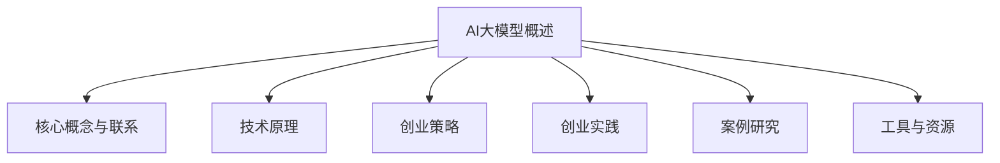

                 

## 引言

AI大模型，作为当前人工智能领域的核心技术之一，正在引领新一轮的技术革命。随着深度学习、大数据和计算能力的迅猛发展，AI大模型在各个行业中的应用越来越广泛，从金融、医疗、教育到自动驾驶、智能家居等，都展现出了巨大的潜力。然而，如何将这一先进技术转化为可持续的商业成功，成为了许多创业者和企业面临的挑战。

本文旨在探讨AI大模型创业的可行性和策略，帮助创业者更好地理解和应对这一领域的机遇与挑战。我们将从AI大模型的基本概念、技术原理、创业策略、实践案例等多个方面进行深入分析，旨在为读者提供一个全面、系统的指导。

本文将按照以下结构展开：

1. **AI大模型概述**：介绍AI大模型的概念、架构、技术原理以及行业应用。
2. **AI大模型创业策略**：分析AI大模型创业的机遇与挑战，探讨商业模式的探索。
3. **AI大模型创业实践**：分享AI大模型创业项目的规划、技术选型与开发、运营与推广策略。
4. **AI大模型创业案例研究**：通过实际案例研究，分析成功的要素和经验。

通过这些步骤，我们希望读者能够对AI大模型创业有一个清晰的了解，掌握构建可持续商业模式的策略，从而在激烈的市场竞争中脱颖而出。

### 核心关键词

- AI大模型
- 创业策略
- 技术原理
- 商业模式
- 行业应用
- 风险管理

### 摘要

本文深入探讨了AI大模型创业的各个方面，从基本概念、技术原理到创业策略和实践案例，为创业者提供了全面的理论指导和实践参考。文章首先介绍了AI大模型的概念、架构和行业应用，随后分析了AI大模型创业的机遇与挑战，提出了探索商业模式的策略。在实践部分，文章详细描述了AI大模型创业项目的规划、技术选型和开发过程，并分享了运营与推广策略。最后，通过实际案例研究，总结了AI大模型创业的成功要素。本文旨在为创业者提供一个系统、实用的指导，帮助他们在AI大模型领域取得成功。

## 第一部分：AI大模型概述

### 1.1 AI大模型的概念与架构

#### 1.1.1 AI大模型的基本定义

AI大模型（Large-scale AI Models），指的是通过深度学习技术训练出的，能够处理大规模数据并具有高度复杂性的神经网络模型。这些模型通常拥有数亿至数千亿的参数，能够在多种复杂任务上表现出色，如文本生成、图像识别、语音识别等。AI大模型的核心特点是其能够通过大量数据的训练，自动学习并提取数据的深层特征，从而实现高精度的预测和决策。

#### 1.1.2 AI大模型的发展历程

AI大模型的发展历程可以追溯到20世纪80年代的神经网络研究。当时，神经网络的研究主要集中在简单的小规模模型上。随着计算能力的提升和数据量的增加，深度学习技术开始兴起。2006年，Hinton等人提出了深度信念网络（Deep Belief Network），开启了深度学习的先河。随后，2012年，AlexNet在ImageNet大赛中取得了突破性成绩，标志着深度学习时代的到来。

在自然语言处理领域，2018年，Google推出的BERT模型成为了AI大模型的里程碑，通过在大量文本数据上的预训练，BERT在多个NLP任务上取得了优异的成绩。此后，GPT、Turing等更多的大规模语言模型不断涌现，推动了AI大模型的发展。

#### 1.1.3 AI大模型的架构原理

AI大模型的架构通常包括多个层次，从简单的输入层到复杂的输出层。每个层次都由多个神经元组成，神经元之间通过权重进行连接。以下是AI大模型的基本架构：

1. **输入层**：接收外部输入数据，如文本、图像或声音。在自然语言处理中，输入通常是单词的嵌入向量。

2. **隐藏层**：包含多个层次，每个层次由多个神经元组成。隐藏层负责提取和转换输入数据的特征。随着层数的增加，模型的抽象能力也不断增强。

3. **输出层**：生成最终预测或决策。在分类任务中，输出通常是类别的概率分布。

AI大模型的核心在于其能够通过大量的数据训练，自动调整神经元之间的权重，从而提高模型的准确性和泛化能力。这个过程通常包括以下几个步骤：

- **数据预处理**：对输入数据（如文本、图像）进行清洗、标注和编码，使其适合模型的训练。
- **模型初始化**：初始化模型参数，包括权重和偏置。
- **前向传播**：将输入数据通过模型传递，计算每个神经元的输出。
- **损失函数计算**：计算预测结果与实际结果之间的差异，通过损失函数量化模型的性能。
- **反向传播**：根据损失函数，更新模型参数，优化模型性能。

#### 1.1.4 AI大模型的核心价值

AI大模型的核心价值在于其能够在各种复杂任务上实现高效、准确的预测和决策。具体来说，AI大模型具有以下几方面的价值：

1. **高效数据处理**：AI大模型能够处理大量复杂的数据，自动提取数据中的深层特征，从而实现高效的数据分析。
2. **高精度预测**：通过在大量数据上的训练，AI大模型能够在各种任务上实现高精度的预测，如图像识别、文本生成等。
3. **自动化学习**：AI大模型能够自动从数据中学习，无需人工干预，降低了对专业知识的依赖。
4. **跨领域应用**：AI大模型在多个领域都有广泛的应用，如金融、医疗、教育等，具有很高的跨领域适应性。

总之，AI大模型作为当前人工智能领域的前沿技术，其发展不仅推动了人工智能技术的进步，也为各行各业的数字化转型提供了强大的支持。在接下来的部分中，我们将进一步探讨AI大模型的技术原理，以及其在不同行业中的应用。

### 1.2 AI大模型的技术原理

#### 1.2.1 神经网络与深度学习基础

神经网络（Neural Networks）是深度学习（Deep Learning）的基础。神经网络模拟了人脑神经元的工作原理，通过大量的简单处理单元（即神经元）相互连接，形成复杂的网络结构，以实现对输入数据的处理和预测。一个典型的神经网络结构包括输入层、隐藏层和输出层。输入层接收外部输入，隐藏层对输入数据进行特征提取和转换，输出层生成最终的预测结果。

##### 1.2.1.1 神经网络的基本结构

神经网络的每个神经元（或节点）都有输入值、权重和偏置。输入值与权重相乘后，加上偏置，再通过激活函数进行转换，输出新的值。这个过程可以用以下公式表示：

$$
z = \sum_{i=1}^{n} w_{i}x_{i} + b
$$

其中，$z$ 是神经元的输出，$w_{i}$ 是输入值 $x_{i}$ 的权重，$b$ 是偏置，$n$ 是输入值的数量。激活函数通常使用 Sigmoid 函数或 ReLU 函数：

- **Sigmoid 函数**： 
  $$ 
  \sigma(z) = \frac{1}{1 + e^{-z}} 
  $$

- **ReLU 函数**： 
  $$ 
  \text{ReLU}(z) = \max(0, z) 
  $$

ReLU 函数因其计算速度快且不易陷入梯度消失问题，在现代深度学习模型中广泛使用。

##### 1.2.1.2 深度学习的基本原理

深度学习是神经网络的一种拓展，通过增加网络的层数，使模型能够学习更复杂的特征表示。深度学习的核心思想是层次化特征学习，即每一层网络对输入数据进行特征提取和转换，逐渐构建出复杂的特征表示。

深度学习的基本过程包括以下几个步骤：

1. **数据预处理**：对输入数据（如图像、文本）进行预处理，包括数据清洗、归一化、数据增强等，使其适合模型的训练。
2. **模型初始化**：初始化模型参数，包括权重和偏置。常用的初始化方法有零初始化、高斯初始化等。
3. **前向传播**：将输入数据通过模型传递，计算每个神经元的输出。前向传播过程可以用以下公式表示：
   $$ 
   a^{(l)} = \sigma(z^{(l)}) 
   $$
   其中，$a^{(l)}$ 是第 $l$ 层的输出，$\sigma$ 是激活函数，$z^{(l)}$ 是第 $l$ 层的输入。
4. **损失函数计算**：计算预测结果与实际结果之间的差异，通过损失函数量化模型的性能。常用的损失函数有均方误差（MSE）、交叉熵损失等。
5. **反向传播**：根据预测结果与实际结果的误差，通过反向传播算法更新模型的权重和偏置，优化模型性能。反向传播过程可以用以下公式表示：
   $$ 
   \frac{\partial J}{\partial w^{(l)}_{ij}} = \frac{\partial L}{\partial a^{(l+1)}_{k}} \cdot \frac{\partial a^{(l+1)}_{k}}{\partial z^{(l)}_{ij}} 
   $$
   其中，$J$ 是损失函数，$w^{(l)}_{ij}$ 是第 $l$ 层第 $i$ 个神经元到第 $j$ 个神经元的权重，$L$ 是损失函数，$a^{(l+1)}_{k}$ 是第 $l+1$ 层第 $k$ 个神经元的输出，$z^{(l)}_{ij}$ 是第 $l$ 层第 $i$ 个神经元的输入。
6. **模型优化**：通过多次迭代前向传播和反向传播，不断优化模型参数，降低损失函数值，提高模型性能。

##### 1.2.1.3 神经网络训练过程

神经网络训练过程是一个不断优化的过程，目标是使模型能够准确预测输入数据的标签。训练过程通常包括以下几个阶段：

1. **数据划分**：将数据集划分为训练集、验证集和测试集，通常比例为 70%:15%:15%。
2. **初始化模型**：随机初始化模型参数。
3. **前向传播**：将训练集数据输入模型，计算预测结果。
4. **损失函数计算**：计算预测结果与实际结果之间的损失。
5. **反向传播**：根据损失函数计算梯度，更新模型参数。
6. **模型评估**：使用验证集评估模型性能，根据评估结果调整训练策略。
7. **迭代优化**：重复执行前向传播、损失函数计算、反向传播和模型评估，直到模型达到预定的性能指标或达到最大迭代次数。

#### 1.2.2 自然语言处理与AI大模型

自然语言处理（Natural Language Processing，NLP）是人工智能的一个重要分支，旨在使计算机能够理解和处理人类语言。AI大模型在NLP中的应用，极大地提升了文本处理的能力。

##### 1.2.2.1 语言模型与词嵌入

语言模型（Language Model）是NLP的核心技术之一，用于预测下一个词的可能性。在AI大模型中，语言模型通常采用序列模型（如RNN、LSTM、GRU）来处理文本数据。语言模型的核心任务是学习词的分布和语法规则，从而生成高质量的文本。

词嵌入（Word Embedding）是将词转换为密集的向量表示，使得计算机能够理解词的语义关系。词嵌入技术通过将词映射为低维向量，使得词的语义关系（如词义、词性、词组等）在向量空间中体现出来。常见的词嵌入方法有Word2Vec、GloVe、BERT等。

##### 1.2.2.2 序列模型与注意力机制

序列模型（Sequence Model）是一种处理序列数据的模型，如循环神经网络（Recurrent Neural Network，RNN）、长短期记忆网络（Long Short-Term Memory，LSTM）和门控循环单元（Gated Recurrent Unit，GRU）。这些模型能够捕捉序列数据中的时间依赖关系，从而在文本生成、机器翻译等任务中表现出色。

注意力机制（Attention Mechanism）是一种改进序列模型的方法，能够更好地关注序列中的关键信息。在注意力机制中，每个时间步的输出都与所有前一个时间步的输出相关，从而提高了模型的表示能力和泛化能力。常见的注意力机制有自注意力（Self-Attention）和互注意力（Cross-Attention）。

##### 1.2.2.3 转换器架构

转换器架构（Transformer）是近年来在NLP领域取得重大突破的模型。转换器架构通过自注意力机制来处理序列数据，具有更好的并行计算性能。转换器架构主要包括编码器（Encoder）和解码器（Decoder），编码器将输入序列编码为固定长度的向量表示，解码器根据编码器的输出生成输出序列。

转换器架构的核心组件包括：

1. **多头自注意力机制**：多头自注意力机制允许模型同时关注序列的不同部分，提高了模型的表示能力。
2. **前馈神经网络**：前馈神经网络位于自注意力机制之后，用于进一步提取特征。
3. **位置编码**：由于自注意力机制不考虑输入序列的位置信息，位置编码被引入以编码序列的位置信息。

#### 1.2.3 大规模预训练模型原理

大规模预训练模型（Large-scale Pre-trained Models）通过在大量数据上进行预训练，学习到通用特征表示，然后通过微调（Fine-tuning）适应特定任务。预训练模型的核心思想是利用未标注的数据进行训练，从而降低对标注数据的依赖，提高模型的效果和泛化能力。

##### 1.2.3.1 预训练的概念与意义

预训练（Pre-training）是指在一个大规模的语料库上训练一个基础模型，使其具备一定的语言理解和生成能力。预训练模型通常采用自监督学习（Self-supervised Learning）方法，通过预测未标注的数据部分来进行训练。

预训练的意义在于：

1. **提高模型效果**：通过在大量数据上的预训练，模型能够学习到更复杂的特征表示，从而在特定任务上表现出更高的效果。
2. **降低对标注数据的依赖**：预训练模型可以利用未标注的数据进行训练，从而减少对标注数据的依赖，提高数据利用效率。
3. **提高模型泛化能力**：预训练模型通过在多样化数据上的训练，能够提高模型对未知数据的泛化能力。

##### 1.2.3.2 自监督学习方法

自监督学习方法（Self-supervised Learning Method）是一种利用未标注数据进行训练的方法。在自监督学习中，模型需要预测未标注的数据部分，从而学习到数据中的有用信息。常见的自监督学习方法包括：

1. **掩码语言模型（Masked Language Model，MLM）**：在预训练过程中，对输入序列的一部分词进行掩码，然后预测这些被掩码的词。MLM 是 BERT 模型的核心训练方法。
2. **生成式文本预测（Generative Text Prediction）**：生成式文本预测方法通过预测输入序列的下一个词或多个词来进行训练，如 GPT 模型。
3. **预测位置遮蔽（Predictive Position Masking）**：预测位置遮蔽方法通过随机遮蔽输入序列的一部分词或字符，然后预测这些被遮蔽的词或字符。

##### 1.2.3.3 迁移学习与微调技术

迁移学习（Transfer Learning）是指将预训练模型的知识迁移到新任务上，通过微调（Fine-tuning）适应特定任务的需求。迁移学习的核心思想是利用预训练模型在通用数据上的学习成果，在新任务上快速获得较好的性能。

微调技术（Fine-tuning）是指在新任务上对预训练模型进行部分参数的更新，从而适应特定任务的需求。微调过程通常包括以下几个步骤：

1. **加载预训练模型**：从预训练模型中加载权重和架构。
2. **裁剪模型**：将预训练模型中的部分层（如最后一层）替换为适合新任务的层。
3. **随机初始化**：对新加入的层进行随机初始化，以防止模型在新任务上的表现不佳。
4. **微调训练**：使用新任务的数据集对模型进行微调训练，优化模型参数。
5. **评估与调整**：使用验证集评估模型性能，根据评估结果调整模型结构或参数。

通过迁移学习和微调技术，预训练模型能够在新任务上快速获得较好的性能，同时减少对新任务数据的依赖。

总之，AI大模型的技术原理包括神经网络与深度学习基础、自然语言处理与AI大模型、大规模预训练模型等多个方面。这些技术为AI大模型在各个领域的应用提供了强大的支持，推动了人工智能技术的发展。

### 1.3 AI大模型的行业应用

#### 1.3.1 金融领域的应用

AI大模型在金融领域的应用已经成为了金融科技（FinTech）的重要组成部分。以下是一些典型的应用场景和案例：

1. **风险评估与信用评分**：传统的信用评分模型依赖于有限的金融历史数据，而AI大模型能够通过分析更多维度的数据（如社交媒体、在线行为等），提供更加全面和准确的信用评估。例如，一些金融机构使用基于AI大模型的风险评估系统，对借款人的还款能力进行预测，从而更有效地控制信用风险。

2. **投资策略与市场预测**：AI大模型通过对历史市场数据和新闻文本的分析，能够发现潜在的投资机会和趋势。例如，量化交易公司使用AI大模型来制定投资策略，预测股票市场的走势，并在合适的时间进行交易，从而提高投资回报率。

3. **欺诈检测**：金融欺诈是一个长期存在的问题，AI大模型可以通过对交易数据的深度学习和分析，识别异常交易行为，提前预警潜在的欺诈活动。例如，某些银行和支付公司使用AI大模型对交易行为进行实时监控，有效降低了欺诈率。

#### 1.3.2 医疗健康领域的应用

AI大模型在医疗健康领域具有巨大的潜力，能够提高诊断准确性、优化治疗方案和改善患者管理。以下是一些具体的应用：

1. **疾病诊断与预测**：AI大模型能够通过分析医学图像（如X光片、CT扫描、MRI等），提供高度准确的疾病诊断。例如，谷歌的AI系统可以检测肺癌、乳腺癌等疾病，其准确率甚至超过了人类医生。此外，AI大模型还可以预测疾病的发展趋势，帮助医生制定更有效的治疗方案。

2. **药物研发与临床试验**：AI大模型可以通过分析海量的生物医学数据，加速新药的发现和研发。例如，一些制药公司使用AI大模型来筛选药物候选分子，预测其疗效和安全性，从而降低研发成本和时间。

3. **个性化医疗**：AI大模型可以根据患者的基因信息、病史和生活习惯，提供个性化的治疗建议和预防措施。例如，某些癌症治疗中心使用AI大模型为患者制定个性化的治疗方案，提高了治疗效果。

#### 1.3.3 教育领域的应用

AI大模型在教育领域的应用正在逐步展开，通过智能教学、个性化学习和学习评估等方式，提高教育质量和学习效率。以下是一些具体的应用场景：

1. **智能教学与个性化学习**：AI大模型可以根据学生的学习习惯、知识点掌握情况和学习进度，提供个性化的教学资源和学习计划。例如，一些在线教育平台使用AI大模型为学生推荐适合的学习内容，帮助他们更有效地学习。

2. **学业评估与考试分析**：AI大模型可以通过分析学生的考试数据和答题行为，提供实时反馈和评估。例如，某些教育机构使用AI大模型对学生的作业和考试答案进行评估，给出详细的错误分析和改进建议。

3. **学习行为分析**：AI大模型可以分析学生的学习行为数据，如学习时间、学习内容、学习频率等，提供学习行为分析和建议。例如，一些学校和教育机构使用AI大模型监测学生的学习状态，及时发现并解决学习问题。

总之，AI大模型在金融、医疗健康和教育等领域的应用已经显示出巨大的潜力。通过深入挖掘数据价值、提升模型性能和优化用户体验，AI大模型正在为这些行业带来革命性的变革。

### 2.1 AI大模型创业的机遇与挑战

#### 2.1.1 AI大模型创业的机遇

AI大模型创业面临着前所未有的机遇，这些机遇源于技术进步、市场需求变化以及政策环境优化等多方面因素。

1. **市场需求分析**：随着数字化转型的加速，各行各业对AI大模型的需求不断增长。例如，在金融领域，银行和金融机构需要AI大模型来进行风险评估、欺诈检测和投资预测；在医疗领域，医疗机构和药企需要AI大模型进行疾病诊断、药物研发和个性化治疗；在教育领域，教育机构和学生需要AI大模型进行个性化学习、学习评估和学业辅导。这些需求为AI大模型创业提供了广阔的市场空间。

2. **技术进步带来的机会**：深度学习和计算能力的飞速发展，使得AI大模型的性能和适用范围不断提升。例如，GPT-3、BERT等大规模预训练模型的出现，使得AI大模型在自然语言处理、文本生成和翻译等任务上取得了显著突破。此外，硬件技术的发展，如GPU、TPU等高性能计算设备的普及，也为AI大模型的训练和应用提供了强大的支持。这些技术进步为创业者提供了更多创新的机会和可能性。

3. **政策支持与环境优化**：全球范围内，各国政府和行业组织对AI技术的发展给予了高度重视，并出台了一系列支持政策。例如，中国发布了《新一代人工智能发展规划》，明确了人工智能的发展目标和政策措施；美国、欧洲等地区也在积极推进AI相关的立法和标准制定，为AI技术的健康发展创造了良好的环境。这些政策支持为AI大模型创业提供了有力的保障和激励。

#### 2.1.2 AI大模型创业的挑战

尽管AI大模型创业面临着诸多机遇，但同时也面临一系列挑战，这些挑战涉及技术研发、数据获取、市场竞争等多个方面。

1. **技术研发风险**：AI大模型的技术研发具有高度复杂性和不确定性。一方面，AI大模型的训练和优化需要大量的计算资源和数据支持，研发成本较高；另一方面，模型性能的提升依赖于对深度学习算法和架构的不断探索和创新，技术风险较大。创业者需要具备深厚的技术积累和创新能力，以应对技术研发中的各种挑战。

2. **数据获取与隐私保护**：AI大模型训练需要大量的高质量数据，但数据获取面临诸多挑战。一方面，数据来源广泛且多样化，获取过程复杂且成本高昂；另一方面，数据隐私和安全问题日益凸显，数据泄露和滥用风险加大。创业者需要建立完善的数据管理体系，确保数据的合法获取、存储和使用，同时加强数据安全和隐私保护措施。

3. **市场竞争与商业模式的创新**：AI大模型创业市场竞争激烈，创业者需要在技术创新、产品和服务模式、营销策略等方面具备独特的竞争力。例如，如何构建差异化竞争优势，如何创新商业模式以实现可持续发展，都是创业者需要面对的重要问题。此外，市场竞争的激烈也意味着创业者需要具备快速响应市场变化和调整战略的能力。

总之，AI大模型创业既充满机遇，又面临诸多挑战。创业者需要准确把握市场需求，持续创新技术，合理管理数据，并灵活应对市场竞争，才能在激烈的环境中脱颖而出，实现商业成功。

### 2.2 AI大模型创业的商业模式探索

AI大模型创业的成功不仅依赖于技术创新，还需要构建有效的商业模式。商业模式是企业在特定市场中实现盈利和价值创造的方法，对于AI大模型创业尤为重要。以下是几种常见的商业模式，以及各自的特点和适用场景。

#### 2.2.1 产品与服务模式

**B2B服务模式**：B2B（Business-to-Business）服务模式是指为企业客户提供定制化的AI大模型解决方案。这种模式通常涉及以下步骤：

1. **需求调研**：与客户进行深入沟通，了解其具体需求和应用场景。
2. **方案设计**：根据客户需求，设计和开发定制化的AI大模型产品。
3. **部署实施**：将模型部署到客户的业务系统中，并提供技术支持和维护服务。

**B2C服务模式**：B2C（Business-to-Consumer）服务模式是指面向普通消费者提供AI大模型产品和服务。这种模式通常涉及以下步骤：

1. **产品研发**：开发具有大众市场需求的AI大模型产品。
2. **市场推广**：通过线上和线下渠道进行市场推广，吸引消费者使用产品。
3. **用户反馈**：收集用户反馈，不断优化产品和服务。

**适用场景**：B2B服务模式适用于企业客户需求多样化、对定制化解决方案有较高需求的场景，如金融、医疗、制造等领域。B2C服务模式适用于市场需求广泛、易于推广和复制的场景，如智能家居、在线教育等。

#### 2.2.2 收入模式

**订阅模式**：订阅模式是指用户按月或按年支付费用，以持续使用AI大模型产品或服务。这种模式具有以下优势：

1. **稳定收入**：通过定期订阅，企业能够获得稳定的现金流。
2. **持续改进**：订阅模式鼓励企业持续改进产品和服务，以留住现有用户。

**一次性销售模式**：一次性销售模式是指用户一次性购买AI大模型产品或服务。这种模式适用于以下场景：

1. **高价值产品**：产品具有较高价值，用户愿意一次性支付。
2. **一次性使用**：产品或服务仅适用于特定场景或任务，不需要长期使用。

**数据销售与挖掘服务**：数据销售与挖掘服务是指将AI大模型处理后的数据以商业化的方式出售，或提供数据分析服务。这种模式具有以下优势：

1. **数据价值**：通过数据挖掘，企业能够提取有价值的信息，提供商业洞察。
2. **数据共享**：将数据出售或共享，可以创造额外收入。

**适用场景**：订阅模式适用于需求持续、易于订阅和管理的场景，如企业应用服务、云计算服务。一次性销售模式适用于高价值、一次性使用的场景，如软件许可、专业工具。数据销售与挖掘服务适用于拥有大量数据且能够从中提取价值的应用场景。

#### 2.2.3 营销与推广策略

**内容营销**：内容营销是通过创作和分发有价值的内容，吸引和留住用户的一种策略。常见的内容形式包括博客文章、白皮书、视频教程等。

**社交媒体营销**：社交媒体营销是通过社交媒体平台（如Facebook、LinkedIn、Twitter等）进行品牌宣传和用户互动的一种策略。这种模式可以帮助企业快速扩大品牌影响力。

**合作伙伴关系与联盟营销**：合作伙伴关系与联盟营销是指与其他企业建立合作关系，共同推广产品和服务的一种策略。这种模式可以借助合作伙伴的资源和渠道，扩大市场覆盖范围。

**适用场景**：内容营销适用于需要建立品牌信任和用户粘性的场景，如初创企业、专业服务。社交媒体营销适用于目标用户活跃在社交媒体平台的场景，如消费类产品。合作伙伴关系与联盟营销适用于需要借助外部资源和渠道进行市场推广的场景，如B2B合作、行业联盟。

总之，AI大模型创业的商业模式探索需要结合市场需求、技术特点和企业资源，选择最适合的商业模式和营销策略。通过不断创新和优化，企业可以在激烈的市场竞争中找到自己的定位，实现可持续发展。

### 2.3 AI大模型创业的法律与伦理问题

#### 2.3.1 法律法规概述

在AI大模型创业过程中，法律法规是一个不可忽视的重要方面。随着人工智能技术的快速发展，各国政府和国际组织纷纷出台了一系列法律法规来规范AI技术的应用，确保数据安全、隐私保护和公平竞争。

**数据保护法**：数据保护法是保护个人数据隐私的核心法律。例如，欧盟的《通用数据保护条例》（GDPR）对个人数据的收集、存储、处理和传输设定了严格的规范。创业者需要确保其AI大模型解决方案符合这些规定，特别是在处理个人数据时。

**人工智能伦理指南**：人工智能伦理指南提供了关于AI技术应用的伦理准则，旨在确保AI技术的公平性、透明性和责任感。例如，联合国教科文组织发布了《关于人工智能伦理的建议》，为AI技术的伦理应用提供了指导。

**其他相关法律法规**：其他相关的法律法规还包括反垄断法、消费者保护法、劳动法等。创业者需要全面了解这些法律法规，确保企业的运营合法合规。

#### 2.3.2 法律合规实践

**数据合规**：在AI大模型创业过程中，数据合规是关键的一环。创业者需要确保以下方面：

1. **数据来源合法**：确保收集的数据来源合法，避免侵犯他人的知识产权。
2. **数据收集与使用合规**：在收集和使用数据时，遵守数据保护法等相关法律法规，确保数据的安全和隐私。
3. **数据共享与交易合规**：在共享或交易数据时，遵守数据保护法和反垄断法等相关规定，确保交易的合法性和公平性。

**人工智能产品认证**：许多国家和地区对人工智能产品实行认证制度，以确保产品的质量和安全。例如，欧盟要求人工智能产品符合《机器指令》的规定，包括安全性和透明性要求。创业者需要了解并遵守相关认证要求。

**合规监控与审计**：创业者需要建立完善的合规监控和审计机制，定期检查企业的运营是否符合相关法律法规的要求。合规监控和审计可以帮助企业及时发现和纠正潜在的法律风险。

#### 2.3.3 伦理挑战与应对

**数据隐私与用户权利**：AI大模型在处理大量数据时，可能涉及用户的隐私信息。创业者需要尊重用户的隐私权利，采取有效的隐私保护措施，如数据去识别化、加密存储等。

**透明性与可解释性**：AI大模型往往被视为“黑盒”，其决策过程难以解释。这引发了关于透明性和可解释性的伦理挑战。创业者需要开发可解释的AI模型，或提供清晰的决策解释机制，以便用户理解和使用。

**公平性与歧视问题**：AI大模型可能因数据偏差而导致歧视。创业者需要确保AI模型在训练和应用过程中具备公平性，避免因算法偏差引发的不公平现象。

**应对策略**：

1. **数据隐私保护**：采用隐私增强技术，如差分隐私、同态加密等，确保数据处理过程中的隐私安全。
2. **可解释性设计**：设计可解释的AI模型，如集成模型、局部解释模型等，提高模型的透明度和可信度。
3. **公平性评估与优化**：对AI模型进行公平性评估，发现并纠正数据偏差，确保模型在不同群体中的表现一致。

总之，AI大模型创业不仅需要遵循法律法规，还需要在伦理层面进行深入思考和积极应对。通过合规实践和伦理优化，创业者可以确保AI技术的合法、公正和可持续发展。

### 3.1 AI大模型创业项目规划

#### 3.1.1 项目立项与需求分析

在AI大模型创业项目中，项目立项和需求分析是至关重要的第一步。这一阶段的主要任务是明确项目目标、确定市场需求，并制定详细的实施计划。

**项目立项**

项目立项是项目启动的起点，需要明确以下几个关键点：

1. **项目目标**：明确项目要解决的问题或达到的目标。例如，开发一款用于医疗诊断的AI大模型，以提高疾病的检测准确率。
2. **项目意义**：阐述项目在社会、经济或技术层面的重要性和影响，说明为什么这个项目值得投资和实施。
3. **项目范围**：明确项目的范围和边界，包括项目的核心功能、预期成果和交付物。
4. **项目预算**：根据项目目标和工作量，估算项目的预算，包括人力成本、技术投入、硬件设备等。

**需求分析**

需求分析是项目立项后的重要环节，旨在深入理解市场需求和用户需求。以下是需求分析的主要步骤：

1. **市场调研**：通过市场调研，了解目标市场的规模、增长趋势和竞争状况。调研方法包括问卷调查、访谈、市场报告等。
2. **用户需求调研**：与潜在用户进行沟通，了解他们的需求和痛点。用户调研可以通过用户访谈、焦点小组讨论、在线调查等方式进行。
3. **需求分类**：将收集到的需求进行分类，区分核心需求和次要需求，明确哪些是必须满足的需求，哪些是可选的需求。
4. **需求文档编写**：根据调研结果，编写详细的需求文档。需求文档应包括功能需求、非功能需求、用户故事、用例场景等，为后续设计和开发提供依据。

#### 3.1.2 项目团队组建与职责划分

项目团队是AI大模型创业项目的核心，团队成员的素质和能力直接影响到项目的成败。以下是组建项目团队和明确职责的步骤：

**团队组建策略**

1. **技术团队**：包括深度学习专家、软件开发工程师、数据科学家等，负责AI大模型的设计、开发和优化。
2. **产品团队**：包括产品经理、设计师、测试工程师等，负责产品的需求分析、设计和测试，确保产品满足用户需求。
3. **运营团队**：包括市场推广专员、销售顾问、客户支持等，负责产品的市场推广、销售和售后服务。

**职责划分与协作模式**

1. **技术负责人**：负责技术方案的设计、关键技术的研究和团队的技术指导，确保项目的技术实现。
2. **产品经理**：负责产品需求分析、产品设计和产品管理，确保产品符合市场需求。
3. **项目经理**：负责项目进度管理、资源协调和风险管理，确保项目按计划进行。
4. **测试工程师**：负责产品的功能测试、性能测试和用户验收测试，确保产品的质量。
5. **市场推广专员**：负责产品的市场推广和品牌建设，提高产品的市场知名度。
6. **销售顾问**：负责产品的销售和客户关系维护，拓展市场份额。

**协作模式**

1. **项目会议**：定期召开项目会议，包括团队内部会议和跨部门会议，讨论项目进度、问题和解决方案。
2. **文档管理**：建立文档管理系统，记录项目计划、需求分析、设计文档、测试报告等，确保信息的共享和更新。
3. **任务协作平台**：使用任务协作平台（如Trello、Jira等），明确任务分配、进度跟踪和协作流程，提高团队协作效率。

通过科学的项目立项和需求分析，以及合理的团队组建和职责划分，AI大模型创业项目可以更加顺利地推进，为后续的技术研发和商业推广奠定坚实基础。

### 3.2 AI大模型技术选型与开发

在AI大模型创业项目中，技术选型与开发是关键环节，直接影响到模型的效果和开发效率。以下是技术选型与开发的具体步骤和策略。

#### 3.2.1 技术选型策略

**深度学习框架选择**

选择合适的深度学习框架对于AI大模型项目的成功至关重要。以下是一些常见的深度学习框架及其特点：

1. **TensorFlow**：由Google开发，具有强大的功能、丰富的API和广泛的社区支持。适合大型项目和复杂应用。
2. **PyTorch**：由Facebook开发，以动态计算图和简洁的API著称，适合研究和快速原型开发。
3. **Keras**：是TensorFlow和Theano的高层次API，提供了更简洁、直观的接口，适合快速构建和实验模型。
4. **Caffe**：由UC Berkeley开发，适用于图像识别和视觉任务，具有高效的卷积神经网络实现。
5. **MXNet**：由Apache软件基金会开发，支持多种编程语言，具有良好的灵活性和高性能。

**计算资源与硬件配置**

选择合适的计算资源是保证AI大模型训练和推理效率的关键。以下是一些常见的硬件配置：

1. **GPU**：图形处理单元（GPU）是训练和推理AI大模型的首选硬件，具有高度并行的计算能力。NVIDIA的GPU（如Tesla系列、RTX系列）在深度学习领域得到了广泛应用。
2. **TPU**：谷歌推出的专门用于深度学习的硬件，具有极高的计算性能和能效比。
3. **分布式计算**：对于非常大的模型或需要快速迭代的项目，可以使用分布式计算框架（如Horovod、MXNet的分布式训练API）来提高训练速度。

**开源与商业工具选择**

除了深度学习框架，还有一些开源和商业工具可以提高AI大模型的开发效率：

1. **数据预处理工具**：如Pandas、NumPy等，用于数据清洗、预处理和特征工程。
2. **模型评估工具**：如Scikit-learn、Matplotlib等，用于模型性能评估和可视化。
3. **商业工具**：如Google Cloud AI、AWS SageMaker、Azure ML Studio等，提供了一站式的AI开发和管理平台，方便开发者快速部署和运维模型。

#### 3.2.2 数据处理与模型训练

**数据处理**

数据处理是AI大模型开发的关键环节，包括数据清洗、数据预处理和特征工程。以下是数据处理的主要步骤：

1. **数据清洗**：删除重复数据、填补缺失值、去除噪声数据等，确保数据质量。
2. **数据预处理**：包括数据归一化、标准化、数据转换等，使数据适合模型的输入。
3. **特征工程**：提取和构造特征，以提高模型的预测性能。常见的特征工程方法包括主成分分析（PCA）、特征选择等。

**模型训练**

模型训练是AI大模型开发的另一个关键环节，包括以下步骤：

1. **模型构建**：根据任务需求，选择合适的模型结构，如全连接神经网络、卷积神经网络（CNN）、循环神经网络（RNN）等。
2. **模型初始化**：初始化模型参数，常用的初始化方法有高斯初始化、Xavier初始化等。
3. **训练过程**：使用训练数据对模型进行训练，通过反向传播算法不断优化模型参数。训练过程中需要监控模型性能，防止过拟合。
4. **模型优化**：通过调整超参数、使用正则化方法（如Dropout、L2正则化）等，提高模型性能。

**模型优化与超参数调整**

模型优化是提升模型性能的重要手段，包括以下步骤：

1. **超参数调整**：调整学习率、批量大小、正则化参数等，找到最优的超参数组合。
2. **模型融合**：将多个模型进行融合，如使用集成学习（Ensemble Learning）方法，提高模型的泛化能力。
3. **模型压缩**：通过模型压缩技术（如量化、剪枝等），减小模型的大小和计算复杂度，提高模型部署的效率。

#### 3.2.3 模型部署与测试

**模型部署**

模型部署是将训练好的模型部署到生产环境，以便实时提供服务。以下是模型部署的主要步骤：

1. **模型转换**：将训练好的模型转换为生产环境支持的格式，如TensorFlow SavedModel、PyTorch TorchScript等。
2. **硬件配置**：根据模型的要求和业务需求，选择合适的硬件配置，如使用GPU加速推理。
3. **部署策略**：选择合适的部署策略，如单机部署、分布式部署等，以提高模型的响应速度和吞吐量。
4. **运维管理**：建立完善的运维管理体系，确保模型的稳定运行和性能监控。

**测试与评估**

模型测试与评估是确保模型质量和性能的重要环节，包括以下步骤：

1. **测试集准备**：从训练数据中划分测试集，用于评估模型的性能。
2. **评估指标**：选择合适的评估指标，如准确率、召回率、F1值等，量化模型的性能。
3. **模型测试**：使用测试数据进行模型测试，评估模型在未知数据上的表现。
4. **性能监控**：建立模型性能监控体系，实时监控模型的性能和异常情况。

通过科学的技术选型与开发流程，AI大模型创业项目可以高效、稳定地实现，为企业的创新和发展提供强大支持。

### 3.3 AI大模型创业项目的运营与推广

在AI大模型创业项目中，运营与推广是确保项目成功并实现商业价值的关键环节。以下是项目运营与推广的具体策略和方法。

#### 3.3.1 产品运营策略

**用户获取与留存策略**

1. **精准营销**：通过市场调研和用户画像，了解目标用户的需求和偏好，实施精准的营销策略。利用搜索引擎优化（SEO）、内容营销、社交媒体推广等手段，提高产品的知名度和曝光率。
2. **渠道推广**：利用各种渠道进行推广，如在线广告、合作推广、口碑传播等。特别是在社交媒体平台（如微博、微信、LinkedIn等）上进行品牌宣传和互动，提高用户的参与度和忠诚度。
3. **用户反馈与迭代**：建立完善的用户反馈机制，收集用户的意见和建议，及时进行产品迭代和优化，提高用户满意度和留存率。

**用户留存策略**

1. **产品差异化**：通过提供独特的功能、优质的服务和良好的用户体验，打造产品差异化优势，提高用户粘性。
2. **订阅模式**：引入订阅模式，提供持续的服务和更新，吸引并留住用户。同时，通过优惠活动、会员制度等手段，提高用户的付费意愿和留存率。
3. **社群运营**：建立用户社群，如微信群、QQ群、论坛等，加强与用户的互动和沟通，提高用户的参与感和归属感。

#### 3.3.2 市场推广方法

**品牌建设与品牌传播**

1. **品牌定位**：明确产品的品牌定位和核心价值，打造独特的品牌形象。通过品牌故事、品牌理念等传播品牌的核心价值观。
2. **内容营销**：通过高质量的内容，如博客文章、白皮书、视频教程等，传递品牌价值和专业知识，提高品牌的认知度和信任度。
3. **社交媒体营销**：利用社交媒体平台（如微博、微信、抖音等），发布有趣、有价值的内容，与用户进行互动，增强品牌影响力。

**线上线下营销活动**

1. **线上营销活动**：利用电商平台、社交媒体等渠道，开展促销活动、抽奖活动、直播带货等，吸引潜在用户，提高销售额。
2. **线下营销活动**：通过参加行业展会、举办研讨会、线下培训等活动，与目标客户面对面交流，提升品牌形象和知名度。

**合作伙伴关系与联盟营销**

1. **合作渠道**：与行业内的合作伙伴建立合作关系，如代理商、分销商、技术合作伙伴等，共同推广产品，扩大市场覆盖范围。
2. **联盟营销**：与其他企业或组织建立联盟，共同推广产品或服务，共享资源和市场，实现共赢。

#### 3.3.3 产品运营与推广的效果评估

**评估指标**

1. **用户活跃度**：通过用户登录次数、使用时长、日活跃用户数（DAU）等指标，评估用户的活跃度和参与度。
2. **用户留存率**：通过月活跃用户数（MAU）、用户留存周期等指标，评估用户的留存情况。
3. **转化率**：通过网站访问量、询盘量、成交量等指标，评估市场推广活动的效果。

**效果分析**

1. **数据收集**：通过数据分析工具（如Google Analytics、百度统计等），收集相关的用户行为数据和推广活动数据。
2. **数据分析**：对收集的数据进行深入分析，识别推广活动的效果和不足之处。
3. **优化调整**：根据数据分析的结果，优化运营策略和推广方法，提高运营效果和商业价值。

通过科学、系统的产品运营与推广策略，AI大模型创业项目可以实现快速成长和市场突破，为企业的长期发展奠定坚实基础。

### 3.4 AI大模型创业项目的风险管理与应对

在AI大模型创业项目中，风险管理是确保项目顺利推进和实现预期目标的重要环节。以下是项目风险识别与评估、风险应对策略的具体方法。

#### 3.4.1 风险识别与评估

**技术风险**

1. **模型性能不稳定**：AI大模型在训练过程中可能会遇到性能波动，导致模型不稳定或无法满足预期效果。
2. **数据隐私和安全**：在数据收集、存储和处理过程中，可能面临数据泄露、数据滥用等安全风险。
3. **技术更新快速**：AI领域技术更新迅速，创业者可能面临技术过时的风险。

**市场风险**

1. **市场竞争激烈**：AI大模型创业领域竞争激烈，创业者需要应对来自竞争对手的压力。
2. **需求变化**：市场需求可能发生波动，影响产品的销售和推广。
3. **政策法规变化**：政策法规的变动可能影响AI大模型创业的发展，如数据保护法、隐私保护条例等。

**运营风险**

1. **资金不足**：项目资金不足可能导致研发进度延迟或中断。
2. **人才流失**：核心人才的流失可能影响项目的稳定性和发展。
3. **供应链不稳定**：硬件设备、数据服务等供应链的不稳定可能影响项目的进度和质量。

#### 3.4.2 风险应对策略

**技术风险应对**

1. **持续创新**：保持技术团队的创新活力，持续跟踪行业前沿技术，确保模型的先进性和竞争力。
2. **模型优化**：通过不断的模型优化和调整，提高模型的稳定性和鲁棒性。
3. **数据安全措施**：采用先进的数据加密、访问控制等技术，确保数据的安全和隐私。

**市场风险应对**

1. **差异化竞争**：通过差异化竞争策略，打造独特的市场定位，提高产品的竞争力。
2. **市场调研**：定期进行市场调研，了解市场需求和竞争态势，及时调整市场策略。
3. **政策合规**：关注政策法规动态，确保项目的合规性，减少法律风险。

**运营风险应对**

1. **资金管理**：建立科学的资金管理机制，确保项目的资金充足和合理使用。
2. **人才保障**：通过提高员工待遇、优化工作环境、实施人才激励机制等，留住核心人才。
3. **供应链管理**：建立稳定的供应链体系，与供应商建立长期合作关系，确保供应链的稳定性和可靠性。

通过全面的风险识别与评估，以及有效的风险应对策略，AI大模型创业项目可以更好地应对各种挑战，确保项目的顺利进行和长期发展。

### 4.1 企业级AI大模型创业案例

#### 4.1.1 案例介绍

公司A是一家专注于AI大模型研发和应用的企业，致力于为企业客户提供定制化的AI解决方案。公司A成立于2018年，核心团队由多名经验丰富的AI专家和数据科学家组成。公司A的主要产品是一款基于深度学习的大规模自然语言处理（NLP）模型，能够帮助企业进行文本分析、情感分析、自动摘要和智能问答等任务。

#### 4.1.2 创业策略分析

**市场定位**

公司A通过市场调研和用户需求分析，明确了企业的市场定位。公司A的目标客户群体是大型企业、金融机构和科技公司，这些企业对于高效处理大量文本数据的需求日益增长。公司A的产品定位于高端市场，通过提供高质量的AI解决方案，满足企业客户在数据分析和智能化应用方面的需求。

**技术实现**

公司A的技术实现主要分为以下几个阶段：

1. **数据收集与处理**：公司A通过建立数据采集平台，收集海量的文本数据，包括新闻报道、社交媒体帖子、企业内部文档等。在数据处理阶段，公司A采用了数据清洗、归一化和特征提取等技术，确保数据的质量和一致性。

2. **模型训练与优化**：公司A基于TensorFlow框架，开发了大规模的NLP模型。模型采用了Transformer架构，结合了自注意力机制和位置编码，能够有效提取文本的深层特征。公司A通过多轮实验和超参数调整，不断优化模型性能。

3. **模型部署与测试**：公司A将训练好的模型部署到云平台上，为企业客户提供API服务。在部署过程中，公司A使用了分布式计算技术，提高了模型的响应速度和吞吐量。公司A还建立了模型测试和评估机制，确保模型的稳定性和准确性。

**业务成果**

公司A在市场推广方面取得了显著成果：

1. **客户扩展**：公司A通过与多家知名企业的合作，成功拓展了客户群体。公司A的产品得到了客户的认可，合同金额逐年增长。

2. **产品迭代**：根据客户反馈和市场变化，公司A不断优化产品功能，推出新的产品版本。公司A的产品线逐步完善，覆盖了文本分析、语音识别、图像识别等多个领域。

3. **品牌建设**：公司A积极参与行业会议和研讨会，与业界专家进行交流，提升了企业的知名度和影响力。公司A还通过发布技术论文和博客文章，展示了公司的技术实力和研究成果。

#### 4.1.3 创业策略分析

**技术优势**

公司A的技术优势主要体现在以下几个方面：

1. **先进的模型架构**：公司A采用了Transformer架构，结合了自注意力机制和位置编码，能够有效提取文本的深层特征。相较于传统的RNN和LSTM模型，Transformer模型在处理长文本和跨语言任务方面具有显著优势。

2. **高效的模型训练与优化**：公司A通过分布式计算技术，提高了模型训练的效率和速度。公司A还采用了多种优化方法，如动态学习率调整、批量归一化等，提高了模型的收敛速度和性能。

3. **灵活的API接口**：公司A的模型部署采用了API接口，方便企业客户集成和使用。公司A提供了丰富的API文档和示例代码，降低了客户的技术门槛，提高了产品的易用性和适应性。

**市场定位**

公司A的市场定位明确，专注于为企业客户提供高端的AI解决方案。公司A通过深入了解客户需求，提供定制化的产品和服务，满足不同客户群体的特定需求。公司A的市场定位策略主要包括：

1. **精准营销**：通过市场调研和用户画像，了解目标客户的需求和偏好，实施精准的营销策略。公司A利用线上广告、内容营销和社交媒体推广等手段，提高产品的知名度和用户参与度。

2. **差异化竞争**：公司A通过技术创新和产品优化，打造独特的市场定位。公司A的产品在文本分析、情感分析、自动摘要等任务上具有明显的优势，能够为客户提供高质量的解决方案。

3. **长期合作关系**：公司A注重与客户的长期合作关系，通过优质的服务和持续的技术支持，增强客户的忠诚度和满意度。公司A与多家大型企业建立了战略合作关系，共同推进AI技术在企业应用中的发展。

**团队建设**

公司A的团队建设是其成功的关键因素之一。公司A的核心团队由多名经验丰富的AI专家和数据科学家组成，他们在AI领域拥有深厚的技术积累和丰富的实战经验。公司A通过以下策略建设团队：

1. **人才引进**：公司A通过校园招聘、社会招聘等多种渠道，引进优秀的AI人才。公司A注重招聘具有创新能力和实战经验的人才，以提升团队的整体实力。

2. **人才培养**：公司A建立了完善的人才培养机制，通过内部培训、技术交流和项目实践等途径，提升团队成员的技术水平和专业能力。

3. **激励机制**：公司A通过绩效奖金、股权激励等手段，激励团队成员的工作积极性和创造力。公司A注重员工的职业发展和个人成长，为员工提供良好的工作环境和晋升机会。

**运营策略**

公司A的运营策略主要包括以下几个方面：

1. **产品迭代**：公司A通过持续的产品迭代，不断优化和升级产品功能。公司A定期发布新版本，根据用户反馈和市场变化，调整产品策略。

2. **客户服务**：公司A建立了完善的客户服务体系，提供7x24小时的技术支持和售后服务。公司A通过在线客服、电话支持、现场服务等多种方式，确保客户能够及时得到帮助。

3. **市场推广**：公司A通过线上线下多渠道进行市场推广，提高产品的市场知名度和用户覆盖率。公司A与行业合作伙伴建立联盟，共同推广产品，扩大市场影响力。

通过上述创业策略的分析，公司A在AI大模型创业领域取得了显著的成功。公司A通过技术创新、市场定位、团队建设和运营策略的有效实施，不仅获得了客户的认可和市场份额，也为其他AI大模型创业项目提供了有益的借鉴和参考。

### 4.2 AI大模型创业项目的成功要素

AI大模型创业项目要在激烈的市场竞争中脱颖而出，需要具备以下几个关键的成功要素：

#### 4.2.1 技术优势

技术优势是AI大模型创业项目的核心竞争力。创业者需要具备以下几方面的技术优势：

1. **先进的模型架构**：采用最新、最先进的深度学习模型架构，如Transformer、BERT、GPT等，以实现高效、准确的数据处理和预测。
2. **高效的训练和推理**：优化模型训练和推理过程，利用分布式计算、GPU加速等技术，提高模型的训练速度和推理性能。
3. **数据预处理与特征提取**：通过高效的数据预处理和特征提取技术，确保模型能够从数据中提取到有价值的特征，从而提高模型的泛化能力和准确性。
4. **可解释性和透明性**：开发可解释性强的模型，使得用户能够理解模型的决策过程，增强用户对模型的信任和接受度。

#### 4.2.2 市场定位

准确的市场定位是AI大模型创业项目成功的基础。创业者需要从以下几个方面进行市场定位：

1. **目标市场**：明确目标市场和目标客户群体，例如金融、医疗、教育等行业，确保产品能够满足特定行业的需求。
2. **差异化竞争**：通过产品差异化，找到市场上的空白点和独特价值，避免与竞争对手直接竞争。
3. **用户体验**：以用户体验为中心，设计简单易用、功能强大的产品，提高用户满意度和忠诚度。
4. **市场需求预测**：通过市场调研和用户反馈，准确预测市场需求，及时调整产品方向和策略。

#### 4.2.3 团队建设

优秀的团队是AI大模型创业项目成功的关键。创业者需要注重以下几个方面：

1. **核心团队成员**：组建由经验丰富的AI专家、数据科学家、软件工程师和产品经理等组成的核心团队，确保团队在技术、产品和管理方面具备强大的实力。
2. **人才培养与激励**：建立完善的培训体系和激励机制，提升团队整体能力和凝聚力，鼓励团队成员的创新和投入。
3. **团队协作**：建立良好的团队协作机制，通过明确的工作流程、沟通工具和项目管理方法，确保团队高效协作和项目顺利推进。
4. **跨学科协作**：鼓励团队跨学科协作，促进不同领域的知识和经验的交流，提升项目的综合实力。

#### 4.2.4 运营策略

有效的运营策略是确保AI大模型创业项目成功的重要保障。创业者需要注重以下几个方面：

1. **产品迭代**：通过持续的产品迭代，不断优化和改进产品功能，确保产品与市场需求保持同步。
2. **用户反馈**：建立完善的用户反馈机制，及时收集和分析用户反馈，快速响应市场变化和用户需求。
3. **市场推广**：采用多种市场推广手段，如内容营销、社交媒体推广、合作伙伴关系等，提高产品的市场知名度和用户覆盖率。
4. **售后服务**：提供优质的售后服务，确保用户在使用产品过程中遇到的问题能够得到及时解决，增强用户的满意度和忠诚度。

#### 4.2.5 风险管理

有效的风险管理是确保AI大模型创业项目顺利推进的重要措施。创业者需要从以下几个方面进行风险管理：

1. **技术风险**：通过持续的技术创新和优化，降低技术风险。同时，建立技术储备和备份机制，确保在技术出现问题时能够快速应对。
2. **市场风险**：通过市场调研和用户反馈，准确预测市场变化和竞争态势，及时调整市场策略。此外，建立灵活的商业模式，以应对市场变化。
3. **资金风险**：确保项目资金充足，建立科学的资金管理机制，防止资金短缺影响项目进度。同时，通过融资渠道和资金运作，提高资金利用效率。
4. **法律与伦理风险**：遵守相关法律法规，确保数据安全和用户隐私。同时，关注伦理问题，确保AI大模型的应用符合社会伦理和道德标准。

通过上述成功要素的深入理解和有效实施，AI大模型创业项目可以在激烈的市场竞争中脱颖而出，实现长期可持续的发展。

### 附录

#### A.1 开发工具与框架

在AI大模型开发中，选择合适的工具和框架能够显著提高开发效率。以下是一些常用的深度学习工具和框架：

1. **TensorFlow**：由Google开发，具有广泛的社区支持和丰富的API，适合构建大规模的深度学习模型。TensorFlow支持多种硬件平台，包括CPU、GPU和TPU，能够高效地进行模型训练和推理。
2. **PyTorch**：由Facebook开发，以其动态计算图和简洁的API著称，适合快速原型开发和实验。PyTorch的动态计算图使得调试和优化模型变得更加容易。
3. **Keras**：是TensorFlow和Theano的高层次API，提供了更简洁、直观的接口，方便快速构建和训练模型。Keras支持多种后端引擎，包括TensorFlow和Theano，适合快速开发和迭代。
4. **Caffe**：适用于图像识别和视觉任务的深度学习框架，具有高效的卷积神经网络实现。Caffe支持多GPU训练，能够在大规模图像数据集上快速训练模型。
5. **MXNet**：由Apache软件基金会开发，支持多种编程语言，具有良好的灵活性和高性能。MXNet提供了高效的模型训练和推理工具，适合大规模生产环境。

#### A.2 数据集与开源代码

在AI大模型开发中，高质量的数据集和开源代码是不可或缺的资源。以下是一些常用的数据集和开源代码库：

1. **公开数据集**：
   - **ImageNet**：用于图像识别任务的大型数据集，包含了超过1400万张标注图像。
   - **CIFAR-10/CIFAR-100**：包含60000张32x32彩色图像的小型数据集，常用于图像分类任务。
   - **COCO**：用于目标检测和分割的数据集，包含大量真实世界的图像和标注。
   - **WikiText-2**：用于自然语言处理任务的大型文本数据集，包含了维基百科的文本数据。
   - **Common Crawl**：用于自然语言处理的数据集，包含了大量互联网文本数据。

2. **开源代码库**：
   - **TensorFlow Models**：提供了多个预训练模型和示例代码，包括Inception、ResNet等。
   - **PyTorch Examples**：提供了丰富的示例代码和预训练模型，涵盖了图像识别、自然语言处理等多个领域。
   - **Keras Applications**：提供了多个预训练模型和应用，如VGG、ResNet等。
   - **Caffe Model Zoo**：包含了大量预训练模型和权重文件，适用于图像识别和视觉任务。
   - **MXNet Gluon**：提供了多种预训练模型和应用，适合快速开发和部署。

#### A.3 行业报告与政策文件

了解行业发展趋势和政策环境对于AI大模型创业至关重要。以下是一些重要的行业报告和政策文件：

1. **行业报告**：
   - **《全球人工智能发展报告》**：分析了全球人工智能的发展趋势、技术进展和市场动态。
   - **《中国人工智能发展报告》**：总结了我国人工智能的发展现状、政策环境和技术创新。
   - **《人工智能应用行业报告》**：针对金融、医疗、教育等领域的AI应用进行了深入分析。
   - **《深度学习市场报告》**：涵盖了深度学习技术的市场趋势、应用场景和未来发展方向。

2. **政策文件**：
   - **《新一代人工智能发展规划》**：明确了我国人工智能发展的目标和政策措施。
   - **《人工智能发展政策指南》**：为人工智能产业的发展提供了具体的指导意见。
   - **《数据安全法》**：规范了数据收集、存储、处理和传输的行为，确保数据安全。
   - **《通用数据保护条例》（GDPR）**：欧盟出台的数据保护法规，对个人数据的处理设定了严格的规定。
   - **《人工智能伦理指南》**：提供了人工智能技术的伦理准则，确保AI技术的公平性、透明性和责任感。

#### A.4 学习资源推荐

为了更好地掌握AI大模型的技术和应用，以下是一些建议的学习资源：

1. **教材与参考书籍**：
   - **《深度学习》**：Goodfellow、Bengio和Courville的著作，系统地介绍了深度学习的理论基础和实战技巧。
   - **《Python深度学习》**：François Chollet的著作，详细讲解了使用Python和Keras进行深度学习的实战方法。
   - **《神经网络与深度学习》**：邱锡鹏的著作，深入阐述了神经网络和深度学习的基本原理。
   - **《人工智能：一种现代的方法》**：Stuart J. Russell和Peter Norvig的著作，全面介绍了人工智能的基础理论和应用。

2. **在线课程与培训**：
   - **Coursera上的《深度学习》课程**：由吴恩达教授主讲，涵盖了深度学习的理论、技术和应用。
   - **Udacity的《深度学习工程师纳米学位》**：提供了系统的课程和实践项目，适合初学者和进阶者。
   - **edX上的《机器学习》课程**：由MIT和HARVARD教授主讲，介绍了机器学习和深度学习的基础知识。
   - **中国大学MOOC上的相关课程**：国内多所知名大学开设的深度学习和人工智能课程，适合国内学生和开发者。

通过这些工具、资源和教材的学习，开发者可以系统地掌握AI大模型的理论知识和实践技能，为AI大模型创业项目提供坚实的基础。

# Mermaid 流程图

以下是AI大模型创业的Mermaid流程图：

此流程图概述了AI大模型创业的六个主要方面：AI大模型概述、核心概念与联系、技术原理、创业策略、创业实践和案例研究，以及工具与资源。每个方面都是项目成功的关键，通过这些步骤，创业者可以系统地了解并实施AI大模型创业项目。

