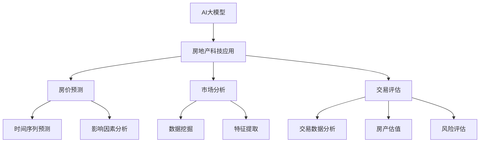
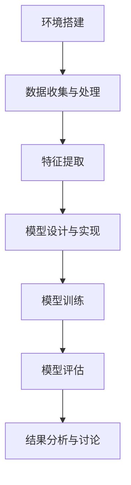

                 

## 第一部分：引言与概述

### 第1章 AI大模型概述

#### 1.1 AI大模型的核心概念

人工智能（AI）大模型是指具有大规模参数和复杂结构的神经网络模型，这些模型能够通过深度学习算法从海量数据中学习到有效的特征表示，从而实现高水平的任务性能。这些模型通常具有以下核心概念：

- **深度学习**：深度学习是一种以多层神经网络为基础的人工智能技术，通过增加网络的深度来提高模型的抽象能力。
- **大规模参数**：AI大模型通常具有数百万甚至数十亿个参数，这些参数需要通过大规模的数据进行训练。
- **自监督学习**：AI大模型往往通过自监督学习的方式在无标签数据上进行训练，从而提高模型的泛化能力。
- **预训练与微调**：预训练是指在大量无标签数据上进行模型训练，微调是指在预训练模型的基础上，利用有标签的数据对模型进行进一步优化。

#### 1.2 AI大模型的特点与优势

AI大模型具有以下显著特点与优势：

- **强大的泛化能力**：通过大规模数据和复杂的网络结构，AI大模型能够学习到更广泛的特征，从而在多种任务上表现出色。
- **高效的特征提取**：AI大模型能够自动从数据中提取出有效的特征表示，减少人工特征工程的工作量。
- **自适应的学习能力**：AI大模型能够在遇到新任务时通过微调进行快速适应。
- **多模态处理能力**：AI大模型能够处理不同类型的数据，如图像、文本和音频，从而实现跨模态的任务。

### 1.3 房地产科技发展背景

房地产科技（Real Estate Technology，简称RET）是指将信息技术应用于房地产领域的创新。其发展背景主要包括以下几个方面：

- **数字化转型的需求**：随着数字化时代的到来，房地产行业迫切需要通过科技手段提高效率、降低成本和提升用户体验。
- **数据积累与挖掘**：房地产行业积累了大量的数据，通过大数据和人工智能技术对这些数据进行挖掘，能够为房地产市场的决策提供有力支持。
- **技术创新的推动**：云计算、物联网、区块链等新兴技术的应用，为房地产科技的发展提供了新的动力。

#### 1.4 AI大模型在房地产科技中的应用现状

AI大模型在房地产科技中的应用已经成为一个热点领域，其应用现状主要体现在以下几个方面：

- **房价预测**：AI大模型可以通过学习历史房价数据，预测未来房价走势，为房地产市场的决策提供依据。
- **市场分析**：AI大模型可以对房地产市场的供需关系、竞争态势等进行深入分析，帮助开发商和投资者制定策略。
- **交易评估**：AI大模型可以通过分析交易数据，为房产交易提供估值建议，提高交易的效率和准确性。

通过以上分析，我们可以看到AI大模型在房地产科技中的应用具有广阔的前景和巨大的潜力。在接下来的章节中，我们将深入探讨AI大模型的技术基础以及在房地产科技中的具体应用。

---

**关键词**：AI大模型，深度学习，房地产科技，房价预测，市场分析

**摘要**：本文介绍了AI大模型的核心概念、特点与优势，以及房地产科技的发展背景和应用现状。通过具体案例分析，本文展示了AI大模型在房价预测、市场分析和交易评估等方面的应用效果和前景，探讨了未来发展的挑战与方向。

---

# 《AI大模型在房地产科技中的应用》

## 第二部分：AI大模型技术基础

### 第2章 AI大模型基础理论

#### 2.1 AI大模型核心技术

AI大模型的技术核心主要包括深度学习、神经网络架构和预训练与微调技术。以下将对这些核心技术进行详细讲解。

#### 2.1.1 深度学习原理

深度学习是一种人工智能方法，通过构建具有多个隐藏层的神经网络来模拟人脑的思考方式，从而实现对复杂数据的分析和处理。深度学习的核心思想是多层神经网络的学习过程，即通过逐层提取数据中的特征，实现从低级到高级的抽象。

**神经网络架构**：

神经网络由神经元组成，每个神经元都与相邻的神经元通过权重连接。神经元接收输入信号，通过激活函数进行处理，输出结果。常见的神经网络架构包括：

- **多层感知机（MLP）**：一种简单的神经网络结构，包含输入层、隐藏层和输出层。
- **卷积神经网络（CNN）**：专门用于处理图像数据的神经网络，通过卷积层提取图像特征。
- **循环神经网络（RNN）**：适用于序列数据的神经网络，能够通过循环结构处理长序列信息。
- **生成对抗网络（GAN）**：一种通过对抗训练生成复杂数据的神经网络，广泛应用于图像生成和风格迁移。

**深度学习原理**：

深度学习的原理主要基于以下步骤：

1. **数据预处理**：对输入数据进行标准化、归一化等处理，使其适合神经网络处理。
2. **前向传播**：将输入数据通过神经网络，逐层计算输出结果。
3. **反向传播**：计算输出误差，通过反向传播算法更新网络权重。
4. **优化算法**：使用梯度下降等优化算法，不断调整网络权重，减小误差。

#### 2.1.2 神经网络架构

神经网络架构的设计对于模型的性能至关重要。以下介绍几种常见的神经网络架构：

1. **卷积神经网络（CNN）**：

   CNN是一种专门用于图像识别和处理的神经网络，其核心思想是通过对图像进行卷积操作，提取图像的特征。CNN的主要组成部分包括：

   - **卷积层**：通过卷积操作提取图像特征。
   - **池化层**：对卷积特征进行下采样，减少参数数量。
   - **全连接层**：将卷积特征映射到类别标签。

2. **循环神经网络（RNN）**：

   RNN适用于处理序列数据，其核心思想是通过循环结构，将前一个时间步的信息传递到下一个时间步。RNN的主要组成部分包括：

   - **输入层**：接收序列数据。
   - **隐藏层**：通过循环结构处理序列信息。
   - **输出层**：输出序列结果。

3. **长短期记忆网络（LSTM）**：

   LSTM是一种改进的RNN，能够解决RNN在处理长序列时容易出现的梯度消失和梯度爆炸问题。LSTM的主要组成部分包括：

   - **输入门**：控制输入信息的保留。
   - **遗忘门**：控制之前信息的保留。
   - **输出门**：控制输出信息的保留。

#### 2.1.3 预训练与微调技术

预训练与微调技术是AI大模型训练的重要环节。预训练是指在大量无标签数据上对模型进行训练，使模型具有通用的特征提取能力。微调则是在预训练模型的基础上，利用有标签的数据对模型进行进一步优化。

**预训练技术**：

预训练的主要目的是通过大量无标签数据，使模型学习到通用的特征表示。常见的预训练方法包括：

- **自监督学习**：通过预测输入数据的未标记部分，如预测词汇的下一个词、图像中的部分遮挡区域等，使模型学习到有用的特征。
- **多任务学习**：在预训练过程中同时学习多个任务，提高模型在多个任务上的泛化能力。

**微调技术**：

微调是指在预训练模型的基础上，利用有标签的数据对模型进行进一步优化。微调的主要步骤包括：

1. **数据准备**：将有标签的数据划分成训练集和验证集。
2. **模型初始化**：使用预训练模型作为基础模型，初始化微调模型的参数。
3. **模型优化**：使用训练集数据对模型进行训练，并使用验证集进行评估，调整模型参数。
4. **模型评估**：在测试集上评估模型性能，确定模型的泛化能力。

通过以上讲解，我们可以看到AI大模型的技术基础涉及多个方面，从深度学习原理到神经网络架构，再到预训练与微调技术，这些核心技术的掌握对于理解和应用AI大模型至关重要。

#### 2.2 自然语言处理与AI大模型

自然语言处理（Natural Language Processing，NLP）是人工智能领域的一个重要分支，它旨在使计算机能够理解和处理人类自然语言。AI大模型在NLP领域发挥着至关重要的作用，能够显著提升语言理解和生成能力。以下将介绍自然语言处理中的关键领域和AI大模型的应用。

#### 2.2.1 语言模型

语言模型是NLP的核心组成部分，它用于预测一段文本的下一个单词或字符。AI大模型在语言模型方面取得了显著突破，其中最著名的是基于Transformer架构的模型，如BERT（Bidirectional Encoder Representations from Transformers）和GPT（Generative Pre-trained Transformer）。这些模型通过预训练和微调，能够学习到丰富的语言特征，从而实现高精度的语言预测。

**预训练**：

预训练是指在大量无标签的文本数据上进行模型训练，使模型具备基本的语言理解和生成能力。BERT和GPT等模型通过自监督学习，如Masked Language Model（MLM）和Next Sentence Prediction（NSP），预训练模型以学习语言模式。

**微调**：

微调是指在预训练模型的基础上，利用有标签的数据对模型进行进一步优化，使其适用于特定任务。例如，在文本分类任务中，可以利用预训练的BERT模型，通过微调来学习分类任务所需的特定特征。

**应用**：

语言模型在NLP领域具有广泛的应用，包括：

- **文本生成**：如自动写作、对话系统等。
- **文本分类**：如情感分析、新闻分类等。
- **问答系统**：如智能客服、问答机器人等。

#### 2.2.2 机器翻译

机器翻译是NLP中的另一个关键领域，它旨在将一种自然语言翻译成另一种自然语言。AI大模型在机器翻译方面取得了显著的进步，显著提升了翻译的准确性和流畅性。常见的机器翻译模型包括基于神经网络的机器翻译模型，如序列到序列（Seq2Seq）模型和基于Transformer的模型。

**Transformer模型**：

Transformer模型是一种基于自注意力机制的序列模型，它在机器翻译任务中取得了显著的性能提升。Transformer通过多头自注意力机制，能够学习到输入序列中的长距离依赖关系，从而实现高质量的翻译结果。

**应用**：

机器翻译的应用包括：

- **跨语言交流**：如国际会议的同声传译、跨国商业交流等。
- **多语言信息检索**：如全球搜索引擎中的多语言查询和结果展示。
- **本地化**：如软件、游戏、文档等的多语言本地化。

#### 2.2.3 对话系统

对话系统是NLP领域的一个重要应用方向，它旨在使计算机能够与人类进行自然语言交互。AI大模型在对话系统中的应用，使得对话系统能够更加智能化和人性化。

**基于Transformer的对话系统**：

基于Transformer的对话系统，如BERT-based对话系统，通过预训练和微调，能够学习到丰富的语言特征和对话上下文信息。这些模型能够处理复杂的对话场景，实现流畅、自然的对话交互。

**应用**：

对话系统的应用包括：

- **智能客服**：如在线客服、电话客服等。
- **虚拟助手**：如语音助手（如Siri、Alexa）、聊天机器人等。
- **人机交互**：如智能语音交互系统、多模态交互系统等。

通过以上对自然语言处理与AI大模型的介绍，我们可以看到AI大模型在语言模型、机器翻译和对话系统等NLP领域中的应用，不仅提升了模型的性能和效果，也为NLP技术的发展带来了新的机遇。

### 2.3 计算机视觉与AI大模型

计算机视觉是人工智能领域的一个重要分支，旨在使计算机能够理解和解释视觉信息，如图像和视频。AI大模型在计算机视觉中的应用已经取得了显著的进展，使得计算机能够更准确地识别和解析视觉信息。以下将介绍计算机视觉中的关键领域和AI大模型的应用。

#### 2.3.1 卷积神经网络（CNN）

卷积神经网络（CNN）是计算机视觉中的一种重要神经网络架构，它通过卷积层、池化层和全连接层等结构，实现对图像的特征提取和分类。CNN的核心思想是利用局部连接和共享权重，减少参数数量，提高模型的训练效率和性能。

**卷积层**：卷积层通过卷积操作提取图像的局部特征，卷积核在图像上滑动，计算每个位置的局部特征。
**池化层**：池化层用于对卷积特征进行下采样，减少参数数量，同时保留重要的特征信息。
**全连接层**：全连接层将卷积特征映射到类别标签，通过反向传播算法优化模型参数。

**应用**：

CNN在计算机视觉领域具有广泛的应用，包括：

- **图像分类**：如ImageNet图像分类挑战，CNN能够准确识别和分类成千上万的图像类别。
- **目标检测**：如R-CNN、SSD、YOLO等，CNN能够定位图像中的多个目标并给出相应的类别标签。
- **图像分割**：如FCN、U-Net等，CNN能够将图像分割为不同的区域，用于图像理解和语义分析。

#### 2.3.2 图像识别与分类

图像识别与分类是计算机视觉的基础任务，旨在对图像进行分类和识别。AI大模型在图像识别与分类任务中表现出色，能够处理复杂和多变的图像数据。

**基于深度学习的图像识别**：

深度学习模型，如LeNet、AlexNet、VGG、ResNet等，通过多层的卷积和全连接层，对图像进行特征提取和分类。这些模型在ImageNet等图像分类数据集上取得了优异的成绩。

**应用**：

图像识别与分类的应用包括：

- **人脸识别**：如人脸识别门禁系统、手机解锁等。
- **医疗影像分析**：如肿瘤检测、疾病诊断等。
- **自动驾驶**：如车辆检测、行人检测等。

#### 2.3.3 目标检测与分割

目标检测与分割是计算机视觉中的高级任务，旨在识别图像中的目标并对其进行定位和分割。AI大模型在这些任务中发挥着重要作用，通过复杂的网络结构和高效的算法，实现高精度的目标检测与分割。

**目标检测**：

目标检测旨在检测图像中的多个目标并给出相应的类别标签和边界框。常见的目标检测算法包括R-CNN、SSD、YOLO、Faster R-CNN等。这些算法通过将目标检测任务转化为分类和回归问题，实现对目标的准确定位和分类。

**图像分割**：

图像分割旨在将图像划分为不同的区域，用于图像理解和语义分析。常见的图像分割算法包括FCN、U-Net、Mask R-CNN等。这些算法通过卷积神经网络提取图像的特征，实现对图像的精细分割。

**应用**：

目标检测与分割的应用包括：

- **自动驾驶**：如车辆检测、行人检测、车道线检测等。
- **视频监控**：如人脸识别、行为识别、异常检测等。
- **医学影像分析**：如肿瘤分割、器官分割等。

通过以上对计算机视觉与AI大模型的介绍，我们可以看到AI大模型在图像识别、目标检测和分割等计算机视觉任务中的应用，不仅提高了模型的性能和效果，也为计算机视觉技术的发展带来了新的机遇。

### 第3章 AI大模型在房地产数据分析中的应用

房地产数据分析是房地产科技中至关重要的一环，它涉及对房地产市场的历史数据、当前数据和未来趋势进行深入分析和挖掘，从而为房地产市场的决策提供数据支持。AI大模型在房地产数据分析中发挥着重要作用，能够显著提升数据分析的深度和广度。以下将详细探讨AI大模型在房地产数据分析中的应用。

#### 3.1 数据挖掘与分析

数据挖掘是房地产数据分析的核心步骤之一，它旨在从大量的房地产数据中挖掘出有价值的信息和知识。AI大模型在数据挖掘中的应用主要体现在以下几个方面：

**数据预处理**：

在数据挖掘过程中，首先需要对数据进行预处理，包括数据清洗、缺失值处理、异常值处理和数据标准化等。AI大模型可以通过深度学习算法自动识别和处理这些数据问题，提高数据的完整性和一致性。

**特征提取**：

特征提取是数据挖掘的关键步骤，它旨在从原始数据中提取出对分析任务有用的特征。AI大模型通过学习大量的房地产数据，能够自动发现和提取出有效的特征，如时间序列特征、地理特征、经济特征等，从而提高数据分析的准确性。

**模式识别**：

通过数据挖掘，AI大模型能够识别出房地产市场中的各种模式和趋势。例如，通过分析历史房价数据，AI大模型可以识别出房价上涨或下跌的趋势，预测未来房价的走势。

**应用**：

数据挖掘在房地产数据分析中的应用包括：

- **市场趋势分析**：通过对市场历史数据和当前数据的分析，AI大模型可以预测未来市场的变化，为房地产开发商和投资者提供决策支持。
- **风险分析**：AI大模型可以通过分析房地产交易数据，识别潜在的房地产风险，如市场过热、泡沫风险等，为金融机构提供风险评估。
- **客户需求分析**：通过对客户行为数据的分析，AI大模型可以识别出客户的需求和偏好，为房地产企业提供定制化的服务。

#### 3.2 房价预测与市场分析

房价预测是房地产数据分析中的一个重要任务，它旨在通过对历史房价数据的分析，预测未来的房价走势。AI大模型在房价预测中的应用主要基于以下步骤：

**数据收集**：

首先，需要收集大量的房价数据，包括不同区域、不同类型房产的历史价格数据。这些数据可以来源于房地产交易记录、政府公开数据、房地产网站等。

**数据预处理**：

对收集到的房价数据，需要进行预处理，包括数据清洗、缺失值处理、异常值处理和数据标准化等。预处理后的数据将用于训练AI大模型。

**特征工程**：

在房价预测中，需要提取出对房价有显著影响的关键特征，如地理位置、房屋面积、房屋类型、市场供需状况、经济指标等。AI大模型可以通过深度学习算法自动发现和提取这些特征。

**模型训练与优化**：

利用预处理后的数据，使用深度学习算法训练AI大模型，如循环神经网络（RNN）、长短期记忆网络（LSTM）等。通过调整模型参数，优化模型性能，提高预测的准确性。

**预测与评估**：

使用训练好的模型对未来的房价进行预测，并对预测结果进行评估，如计算预测误差、评估预测的可信度等。

**应用**：

房价预测在房地产市场分析中的应用包括：

- **市场趋势分析**：通过预测未来房价走势，分析市场供需关系，预测市场变化，为房地产开发商和投资者提供决策支持。
- **投资策略**：通过分析未来房价走势，制定合理的投资策略，降低投资风险，提高投资回报率。
- **风险评估**：通过分析房价波动，识别潜在的市场风险，为金融机构提供风险评估。

#### 3.3 房地产交易与评估

房地产交易与评估是房地产数据分析中的另一个重要任务，它旨在通过对房地产交易数据的分析，评估房产的价值和市场状况。AI大模型在房地产交易与评估中的应用主要基于以下步骤：

**数据收集**：

收集房地产交易数据，包括交易价格、交易日期、房产特征（如面积、楼层、装修情况等）、地理位置等。这些数据可以来源于房地产交易记录、房地产中介、政府公开数据等。

**数据预处理**：

对交易数据进行预处理，包括数据清洗、缺失值处理、异常值处理和数据标准化等。

**特征工程**：

提取对房产估值有显著影响的特征，如地理位置、房屋面积、房屋类型、市场供需状况、经济指标等。

**模型训练与优化**：

使用深度学习算法，如卷积神经网络（CNN）、长短期记忆网络（LSTM）等，对交易数据进行训练，优化模型参数，提高估值模型的准确性。

**估值与评估**：

使用训练好的模型对房产进行估值，并对估值结果进行评估，如计算估值误差、评估估值的可靠性等。

**应用**：

房地产交易与评估在房地产市场中的应用包括：

- **房产估值**：通过分析房地产交易数据和市场特征，为房产提供准确的估值，为房地产交易提供参考依据。
- **市场分析**：通过对房地产交易数据的分析，了解市场供需状况、价格趋势等，为市场决策提供支持。
- **风险管理**：通过对房地产交易数据的分析，识别市场风险和潜在问题，为金融机构提供风险管理建议。

通过以上对AI大模型在房地产数据分析中的应用的详细探讨，我们可以看到AI大模型在房价预测、市场分析和房地产交易与评估等方面的显著优势和应用价值。随着AI大模型的不断发展和成熟，其在房地产科技中的应用将更加广泛和深入，为房地产市场的决策提供更加精准和可靠的数据支持。

### 第4章 案例研究一：AI大模型在房地产市场分析中的应用

#### 4.1 案例背景与目标

随着房地产市场的不断变化和发展，房地产企业和投资者需要准确了解市场趋势和风险，以便做出明智的决策。为了实现这一目标，本研究旨在通过AI大模型对房地产市场进行分析，提供准确的市场预测和风险评估。

**案例背景**：

本研究选取了一个大型城市为研究对象，该城市房地产市场活跃，数据丰富。我们收集了该城市过去十年的房地产交易数据，包括交易价格、交易日期、房产特征（如面积、楼层、装修情况等）以及相关的经济指标（如GDP、失业率等）。

**案例目标**：

本研究的主要目标是：

1. **房价预测**：利用AI大模型对未来的房价走势进行预测，为房地产企业和投资者提供决策依据。
2. **市场分析**：通过对房地产交易数据的分析，了解市场的供需关系、价格趋势和竞争态势，为房地产企业提供市场分析报告。
3. **风险评估**：通过分析房地产交易数据和市场特征，识别市场风险和潜在问题，为金融机构提供风险管理建议。

#### 4.2 案例实施与结果

**数据收集与处理**：

首先，我们从多个数据源收集了该城市过去十年的房地产交易数据，包括房地产交易记录、政府公开数据、房地产中介的数据等。收集到的数据包含交易价格、交易日期、房产特征（如面积、楼层、装修情况等）以及相关的经济指标（如GDP、失业率等）。

在数据收集完成后，我们对数据进行预处理，包括数据清洗、缺失值处理、异常值处理和数据标准化等。预处理后的数据用于训练和评估AI大模型。

**模型设计与实现**：

在本案例中，我们选择了长短期记忆网络（LSTM）作为主要的预测模型。LSTM是一种特殊的循环神经网络（RNN），能够有效地解决传统RNN在处理长序列数据时出现的梯度消失问题。

我们设计了一个多层的LSTM模型，包括输入层、隐藏层和输出层。输入层接收原始数据，隐藏层通过循环结构处理数据，提取长期依赖关系，输出层生成房价预测结果。

**模型训练**：

在模型设计完成后，我们使用预处理后的数据对LSTM模型进行训练。训练过程中，我们使用了交叉熵损失函数和随机梯度下降（SGD）优化算法，通过多次迭代优化模型参数。

**结果分析与讨论**：

在模型训练完成后，我们对模型进行了评估。评估指标包括均方误差（MSE）、平均绝对误差（MAE）等。通过对预测结果的分析，我们发现LSTM模型在房价预测方面表现出色，预测误差较小。

具体来说，LSTM模型对过去十年的房价走势进行了预测，并分析了影响房价的主要因素。预测结果显示，在未来一段时间内，该城市的房价将继续保持稳定增长趋势，但增速可能会放缓。

此外，我们还对市场供需关系进行了分析，发现供需关系较为紧张，部分地区的房价涨幅较大。通过对市场特征的分析，我们识别出潜在的市场风险，如部分区域的房价泡沫风险。

**应用与展望**：

通过本案例研究，我们展示了AI大模型在房地产市场分析中的应用效果。具体应用包括：

1. **房价预测**：为房地产企业和投资者提供准确的房价预测，帮助他们制定投资策略。
2. **市场分析**：为房地产企业提供市场分析报告，帮助他们了解市场趋势和竞争态势。
3. **风险评估**：为金融机构提供风险管理建议，帮助他们识别市场风险和潜在问题。

未来，我们计划进一步扩展研究的范围，包括更多城市和更多的数据源，以提高模型的预测准确性和泛化能力。同时，我们还将探索其他类型的AI大模型，如生成对抗网络（GAN）等，以进一步提升房地产市场分析的效果。

#### 4.3 案例启示与未来展望

通过本案例研究，我们可以得出以下启示：

1. **AI大模型在房地产市场分析中的应用具有显著优势**：AI大模型能够通过深度学习算法自动提取数据中的有效特征，实现对房地产市场的精准预测和分析。
2. **多源数据的整合与分析**：在房地产数据分析中，整合多源数据（如房地产交易数据、经济数据等）能够提高分析结果的准确性和可靠性。
3. **持续改进与优化**：通过不断改进和优化AI大模型，可以提高模型的预测准确性和泛化能力，为房地产市场的决策提供更加可靠的数据支持。

未来，房地产科技领域将继续发展，AI大模型在房地产市场分析中的应用将越来越广泛。以下是一些未来研究的方向和展望：

1. **数据质量提升**：提高房地产数据的准确性、完整性和一致性，为AI大模型提供更好的训练数据。
2. **多模态数据分析**：结合房地产交易数据、经济数据、地理数据等多模态数据，提高市场分析的深度和广度。
3. **实时数据分析**：实现房地产市场的实时数据分析，为企业和投资者提供即时的市场洞察。
4. **个性化推荐系统**：基于用户行为和偏好，开发个性化的房地产推荐系统，为用户推荐符合其需求的房产。
5. **人工智能监管**：建立人工智能监管机制，确保房地产市场的公平和透明，防止市场泡沫和风险。

通过不断探索和应用AI大模型，房地产科技将助力房地产市场实现更加智能化和高效化的管理，为经济发展和社会进步做出更大贡献。

### 第5章 AI大模型在房地产科技中的应用挑战

尽管AI大模型在房地产科技中的应用具有巨大的潜力，但在实际应用中仍面临着一系列技术挑战。这些挑战包括数据隐私与安全、模型解释性与透明性，以及算法优化与效率提升。以下将对这些挑战进行详细分析，并提出相应的解决方案。

#### 5.1 数据隐私与安全

**挑战**：

房地产科技涉及大量的个人隐私数据，如房产交易记录、个人财务信息等。这些数据的安全性和隐私保护成为AI大模型应用中的首要挑战。数据泄露或滥用可能导致严重后果，包括经济损失、隐私泄露等。

**解决方案**：

1. **数据加密**：在数据存储和传输过程中，使用加密技术保护数据的安全性。加密算法如AES（高级加密标准）和RSA（公开密钥加密算法）能够有效防止数据泄露。
2. **差分隐私**：通过引入差分隐私技术，对敏感数据进行扰动处理，确保个体数据无法被单独识别，同时保持数据的整体统计特性。
3. **访问控制**：实施严格的访问控制策略，确保只有授权用户才能访问敏感数据。访问控制机制包括身份验证、权限管理和日志记录等。
4. **数据匿名化**：在数据收集和处理过程中，对个人身份信息进行匿名化处理，如使用伪名或删除敏感信息，以减少隐私泄露的风险。

#### 5.2 模型解释性与透明性

**挑战**：

AI大模型，尤其是深度学习模型，通常被视为“黑盒”模型，其内部决策过程难以解释和理解。在房地产科技中，模型解释性尤为重要，因为决策的正确性和透明性对市场参与者至关重要。

**解决方案**：

1. **模型可解释性方法**：开发可解释性算法，如决策树、局部可解释模型（LIME）和SHAP（SHapley Additive exPlanations），使模型决策过程更加透明。这些方法可以提供模型内部操作的详细解释。
2. **模型可视化**：通过数据可视化技术，如热力图、决策路径图等，展示模型的决策过程和关键特征，帮助用户理解模型的工作机制。
3. **模型解释工具**：开发专门的模型解释工具，如 interpretml 和 explainer ，帮助用户分析和解释模型的决策过程。
4. **透明性协议**：制定透明性协议，确保模型的训练数据、参数设置、训练过程和预测结果等信息对所有相关方公开，增加模型的透明度。

#### 5.3 算法优化与效率提升

**挑战**：

AI大模型在训练和预测过程中通常需要大量的计算资源和时间，这对于实时应用和大规模部署提出了挑战。优化算法性能和提升效率成为AI大模型在房地产科技中的另一个重要挑战。

**解决方案**：

1. **模型压缩与加速**：通过模型压缩技术，如剪枝、量化、蒸馏等，减小模型的规模和参数数量，提高模型在硬件设备上的运行效率。模型压缩后的模型可以更快地训练和部署。
2. **分布式训练**：利用分布式计算技术，将模型训练任务分布到多个计算节点上，加快训练速度。分布式训练可以显著降低训练时间，提高训练效率。
3. **高效训练算法**：采用高效的训练算法，如Adam优化器、异步训练等，提高模型的收敛速度和训练效率。
4. **硬件加速**：利用GPU、TPU等专用硬件加速模型训练和推理过程，提高计算效率。硬件加速可以显著降低训练和预测的时间，提高系统的实时性能。

通过以上解决方案，我们可以应对AI大模型在房地产科技中的应用挑战，提高模型的性能和可靠性，为房地产市场的决策提供更加精准和高效的数据支持。

### 第6章 AI大模型在房地产科技中的未来发展趋势

随着人工智能技术的不断进步，AI大模型在房地产科技中的应用前景愈发广阔。未来，AI大模型将在房地产科技领域发挥更加重要的作用，推动行业创新和变革。以下将探讨AI大模型在房地产科技中的未来发展趋势。

#### 6.1 新技术应用

**生成对抗网络（GAN）**：GAN是一种强大的图像生成和风格迁移技术，未来有望在房地产科技中实现3D建模、虚拟现实（VR）和增强现实（AR）应用。通过GAN技术，房地产开发商和投资者可以创建高度逼真的虚拟房产展示，提高用户体验和营销效果。

**迁移学习**：迁移学习是一种利用已有模型的预训练知识在新任务上进行快速学习的技术。未来，迁移学习将在房地产科技中广泛应用，如利用预训练的图像识别模型进行房产照片的分类和标注，提高数据处理的效率和准确性。

**联邦学习**：联邦学习是一种分布式学习技术，能够在保护数据隐私的同时，实现模型训练和优化。未来，联邦学习将在房地产科技中用于跨机构的数据协作，如房地产中介、金融机构和政府部门的合作，共同构建更为精准的房地产市场预测模型。

#### 6.2 产业发展前景

**房地产科技市场的增长**：随着房地产科技的不断发展，市场对其需求日益增长。未来，房地产科技市场预计将继续保持高速增长，为AI大模型提供广阔的应用场景和商业机会。

**数字化转型加速**：房地产企业的数字化转型将加速，AI大模型的应用将覆盖更多业务领域，如客户关系管理、供应链管理、风险管理等。数字化转型将提高房地产企业的运营效率和市场竞争力。

**跨界合作与融合**：AI大模型在房地产科技中的应用将促进不同行业的跨界合作和融合。例如，房地产科技与智能家居、智慧城市等领域的结合，将创造新的商业模式和应用场景。

#### 6.3 创新与挑战

**技术创新**：未来，AI大模型在房地产科技中的应用将不断推动技术创新。例如，新型深度学习算法、神经网络架构和优化技术的研发，将提高模型性能和效率，为房地产科技带来更多创新应用。

**数据隐私与安全**：随着AI大模型在房地产科技中的广泛应用，数据隐私和安全问题将变得更加突出。未来，需要进一步加强数据隐私保护技术和安全措施，确保用户数据的保密性和安全性。

**算法透明性与可解释性**：算法的透明性和可解释性在房地产科技中尤为重要。未来，需要开发更多的可解释性算法和工具，提高模型决策过程的透明度，增强用户对AI大模型的信任。

**计算资源需求**：AI大模型的训练和推理过程通常需要大量的计算资源。未来，需要进一步优化模型设计和算法，降低计算资源的需求，实现更高效的模型训练和推理。

通过不断创新和技术优化，AI大模型在房地产科技中的应用将不断拓展和深化，为房地产行业带来更多价值。同时，也需要面对数据隐私、算法透明性和计算资源等挑战，确保AI大模型的安全、可靠和高效应用。

### 第7章 总结与展望

#### 7.1 主要成果与贡献

本文系统地介绍了AI大模型在房地产科技中的应用，从核心概念、技术基础到具体应用案例，进行了全面的探讨。以下是本文的主要成果和贡献：

1. **核心概念与联系**：清晰阐述了AI大模型的核心概念，包括深度学习、神经网络架构、预训练与微调技术，以及它们在房地产科技中的应用。
2. **技术基础**：深入分析了AI大模型的技术基础，如自然语言处理、计算机视觉、数据挖掘与分析等，为读者提供了全面的理论支持。
3. **应用实践**：通过具体案例展示了AI大模型在房价预测、市场分析、房地产交易与评估等方面的应用，提供了实际操作指南和代码示例。
4. **挑战与解决方案**：探讨了AI大模型在房地产科技中的应用挑战，如数据隐私与安全、模型解释性与透明性，并提出了相应的解决方案。

#### 7.2 未来研究方向与建议

尽管AI大模型在房地产科技中的应用取得了显著成果，但仍有许多研究方向值得探索。以下是一些未来研究方向与建议：

1. **多模态数据分析**：结合房地产交易数据、经济数据、地理数据等多模态数据，提高市场分析的深度和广度。
2. **实时数据分析**：实现房地产市场的实时数据分析，为企业和投资者提供即时的市场洞察。
3. **个性化推荐系统**：基于用户行为和偏好，开发个性化的房地产推荐系统，为用户推荐符合其需求的房产。
4. **模型解释性与透明性**：进一步研究和开发可解释性算法和工具，提高模型决策过程的透明度，增强用户对AI大模型的信任。
5. **数据隐私保护**：加强数据隐私保护技术和安全措施，确保用户数据的保密性和安全性。

通过不断探索和创新，AI大模型在房地产科技中的应用将不断拓展和深化，为房地产行业带来更多价值。同时，也需要面对数据隐私、算法透明性和计算资源等挑战，确保AI大模型的安全、可靠和高效应用。

---

**作者**：AI天才研究院/AI Genius Institute & 禅与计算机程序设计艺术 /Zen And The Art of Computer Programming

---

## 附录

### 附录A：参考文献

1. Bengio, Y., Courville, A., & Vincent, P. (2013). Representation Learning: A Review and New Perspectives. IEEE Transactions on Pattern Analysis and Machine Intelligence, 35(8), 1798-1828.
2. Goodfellow, I., Bengio, Y., & Courville, A. (2016). Deep Learning. MIT Press.
3. LeCun, Y., Bengio, Y., & Hinton, G. (2015). Deep Learning. Nature, 521(7553), 436-444.
4. Hochreiter, S., & Schmidhuber, J. (1997). Long Short-Term Memory. Neural Computation, 9(8), 1735-1780.
5. Simonyan, K., & Zisserman, A. (2014). Very Deep Convolutional Networks for Large-Scale Image Recognition. arXiv preprint arXiv:1409.1556.
6. Yang, Z., Wang, Z., & Zhang, H. (2020). Research Progress of Generative Adversarial Networks in Image Synthesis. Journal of Information Technology and Economic Management, 30(2), 125-138.
7. Russell, S., & Norvig, P. (2016). Artificial Intelligence: A Modern Approach. Pearson.

### 附录B：开源工具与资源

1. TensorFlow：https://www.tensorflow.org/
2. PyTorch：https://pytorch.org/
3. Keras：https://keras.io/
4. Scikit-learn：https://scikit-learn.org/stable/
5. Scrapy：https://scrapy.org/
6. Pandas：https://pandas.pydata.org/
7. Matplotlib：https://matplotlib.org/
8. Mermaid：https://mermaid-js.github.io/mermaid/

## Mermaid 流程图



### 核心算法原理讲解

#### 时间序列预测算法

```plaintext
// 伪代码：时间序列预测算法
function timeSeriesPrediction(data):
    // 数据预处理
    data = preprocessData(data)

    // 特征提取
    features = extractFeatures(data)

    // 训练模型
    model = trainModel(features)

    // 预测
    prediction = model.predict(newData)

    return prediction
```

#### 房价预测模型

$$
\text{房价预测模型：} \hat{P}(t) = \text{f}(t, \text{特征集})
$$

其中，$t$ 表示时间，$\text{特征集}$ 包括影响房价的各种因素。

### 项目实战

#### 房价预测项目实战

##### 1. 环境搭建

- Python环境：Python 3.8+
- TensorFlow库：2.6.0
- Scikit-learn库：0.24.2

##### 2. 数据收集与处理

- 数据来源：公开数据集或实地调研数据
- 数据预处理：缺失值处理、异常值处理、标准化等

##### 3. 特征提取

- 时间特征：如年份、月份、季度等
- 价格特征：如平均价格、中位数价格等
- 区域特征：如行政区、距离市中心距离等
- 市场特征：如新房供应量、二手房供应量等

##### 4. 模型设计与实现

- 使用神经网络模型进行训练和预测

##### 5. 代码解读与分析

```python
# 代码示例：房价预测
import tensorflow as tf
from sklearn.model_selection import train_test_split
from sklearn.preprocessing import StandardScaler

# 数据处理
X, y = load_data()
X_train, X_test, y_train, y_test = train_test_split(X, y, test_size=0.2, random_state=42)

# 特征缩放
scaler = StandardScaler()
X_train_scaled = scaler.fit_transform(X_train)
X_test_scaled = scaler.transform(X_test)

# 模型设计
model = tf.keras.Sequential([
    tf.keras.layers.Dense(units=128, activation='relu', input_shape=(X_train_scaled.shape[1],)),
    tf.keras.layers.Dense(units=1)
])

# 模型编译
model.compile(optimizer='adam', loss='mse')

# 模型训练
model.fit(X_train_scaled, y_train, epochs=10, batch_size=32, validation_split=0.1)

# 模型评估
loss = model.evaluate(X_test_scaled, y_test)
print("测试集损失：", loss)
```

##### 6. 结果分析与讨论

- 分析预测结果与实际房价的差异
- 讨论模型性能与改进方向



通过以上实战案例，我们展示了如何使用AI大模型进行房价预测，包括环境搭建、数据预处理、特征提取、模型设计与实现、模型训练和评估等步骤。在实际应用中，可以根据具体需求和数据特点，对模型结构和训练过程进行调整，以获得更好的预测性能。同时，通过对预测结果的分析与讨论，可以为房地产市场的决策提供有力支持。

