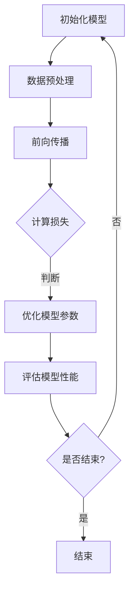
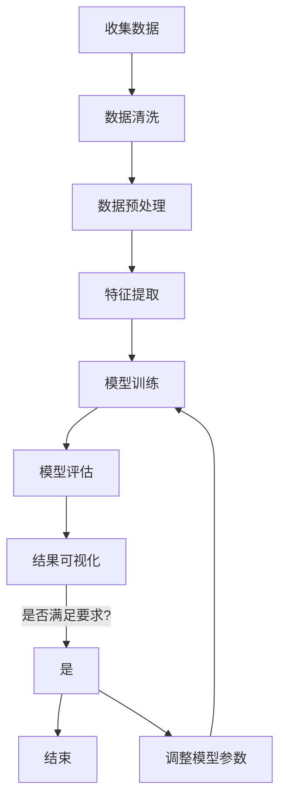

                 

# 《AI大模型在教育科技领域的创新应用》

> **关键词：** AI大模型、教育科技、机器学习、深度学习、在线教育、个性化学习、智能辅导、教育数据分析、教育评测

> **摘要：** 本文旨在探讨AI大模型在教育科技领域的创新应用。我们将首先介绍AI大模型的基本概念和原理，然后深入分析其在教育内容创作、数据分析和评测等多个方面的应用，最后讨论AI大模型在教育科技领域的挑战与机遇，并对未来发展进行展望。

## 目录

### 第一部分: AI大模型基础与原理

#### 第1章: AI大模型概述与教育科技背景

##### 1.1 AI大模型的基本概念

##### 1.2 教育科技发展现状

##### 1.3 AI大模型在教育科技中的潜在应用

#### 第2章: AI大模型技术基础

##### 2.1 机器学习与深度学习原理

##### 2.2 大模型训练方法与流程

##### 2.3 自然语言处理技术

#### 第3章: AI大模型核心算法原理

##### 3.1 神经网络架构

##### 3.2 神经元激活函数

##### 3.3 反向传播算法

#### 第4章: 数学模型与公式详解

##### 4.1 线性代数基础

##### 4.2 概率论基础

##### 4.3 最大似然估计与最大后验估计

#### 第5章: AI大模型在教育科技中的应用案例分析

##### 5.1 在线教育个性化推荐系统

##### 5.2 智能问答系统

##### 5.3 自动批改与评分系统

### 第二部分: AI大模型在教育科技领域的创新应用

#### 第6章: AI大模型在教育内容创作中的应用

##### 6.1 教学材料生成

##### 6.2 虚拟助教与智能辅导

##### 6.3 语言学习辅助系统

#### 第7章: AI大模型在教育数据分析中的应用

##### 7.1 学生行为分析

##### 7.2 教学质量评估

##### 7.3 安全与隐私保护

#### 第8章: AI大模型在教育评测中的应用

##### 8.1 自动化考试系统

##### 8.2 智能化评估工具

##### 8.3 个性化学习反馈系统

#### 第9章: AI大模型在教育资源共享与传播中的应用

##### 9.1 开放教育资源推荐

##### 9.2 跨平台教育资源整合

##### 9.3 教育内容版权保护

#### 第10章: AI大模型在教育研究中的应用

##### 10.1 教育数据挖掘

##### 10.2 教育趋势分析

##### 10.3 教育政策优化

### 第三部分: AI大模型在教育科技领域的实践与展望

#### 第11章: AI大模型在教育科技领域的挑战与机遇

##### 11.1 技术挑战

##### 11.2 教育挑战

##### 11.3 机遇与未来趋势

#### 第12章: 教育科技领域的AI大模型应用案例解析

##### 12.1 案例一：某知名在线教育平台的人工智能解决方案

##### 12.2 案例二：某国际学校的教育大数据分析实践

##### 12.3 案例三：某教育科技公司的人工智能应用案例

#### 第13章: AI大模型在教育科技领域的未来发展

##### 13.1 技术发展展望

##### 13.2 教育模式创新

##### 13.3 AI伦理与教育公平

### 附录

#### 附录A: AI大模型开发资源与工具

##### A.1 常用深度学习框架

##### A.2 开发环境搭建指南

##### A.3 教育科技领域AI大模型开源项目推荐

#### 附录B: Mermaid流程图与伪代码示例

##### B.1 大模型训练流程图

##### B.2 反向传播算法伪代码

##### B.3 教育数据分析流程图

---

**下一章节:** 第一部分: AI大模型概述与教育科技背景**【1.1 AI大模型的基本概念】**

## 第一部分: AI大模型概述与教育科技背景

### 第1章: AI大模型概述与教育科技背景

#### 1.1 AI大模型的基本概念

AI大模型是指那些拥有巨大参数量和复杂结构的机器学习模型，它们通过大量的数据训练来模拟人类的智能行为。这些模型通常包括深度神经网络（DNN）、生成对抗网络（GAN）、递归神经网络（RNN）等。它们在各种领域都展现出了强大的能力，包括图像识别、自然语言处理、语音识别等。

**定义：** AI大模型可以定义为那些训练集参数量大于10亿、模型规模超过1000亿参数的深度神经网络。

**应用领域：** AI大模型已经在计算机视觉、自然语言处理、语音识别、推荐系统等多个领域取得了显著成果。

**特点：**  
- **参数量巨大：** 这些模型的参数量通常在数亿到千亿级别，这使得它们能够捕捉到数据中的细微特征。
- **结构复杂：** AI大模型通常包含多层神经网络，这些层之间通过复杂的连接和激活函数进行信息传递。
- **训练时间长：** 由于模型参数量巨大，训练时间通常也非常长，需要大量计算资源和时间。

#### 1.2 教育科技发展现状

教育科技（EdTech）是指使用技术手段改进和增强教育过程的方式。随着人工智能、大数据、云计算等技术的快速发展，教育科技正在逐步改变传统的教学模式。

**现状：**  
- **在线教育：** 在线教育已经成为教育科技的重要分支，各种在线教育平台如Coursera、edX等不断涌现，提供了丰富的课程资源和学习方式。
- **智能辅导：** 智能辅导系统通过分析学生的学习行为和学习数据，为学生提供个性化的学习计划和辅导。
- **教育数据化：** 大数据技术在教育领域的应用越来越广泛，教育机构通过收集和分析大量的学生数据，优化教学过程和教学质量。

**挑战：**  
- **数据隐私：** 教育数据涉及到学生的隐私信息，如何保障数据安全成为一个重要问题。
- **技术门槛：** 教育科技的发展需要专业的技术团队，这对于许多教育机构来说是一个挑战。

#### 1.3 AI大模型在教育科技中的潜在应用

AI大模型在教育科技领域的应用前景非常广阔，可以从教育内容创作、数据分析、评测等多个方面进行探索。

**应用方向：**  
- **教育内容创作：** AI大模型可以生成高质量的教育内容，包括教学材料、课程视频等，帮助学生更好地理解和掌握知识。
- **智能辅导系统：** AI大模型可以通过分析学生的学习行为和学习数据，为学生提供个性化的学习计划和辅导。
- **教育数据挖掘：** AI大模型可以用于分析大量的教育数据，帮助教育机构优化教学过程和教学质量。
- **教育评测：** AI大模型可以用于自动化考试系统、个性化评估工具等，提高教育评测的效率和准确性。

**潜在影响：**  
- **提高教育质量：** AI大模型可以为学生提供个性化的学习体验，提高学习效果和教学质量。
- **降低教育成本：** AI大模型的应用可以降低教育机构的运营成本，让更多学生享受到优质教育资源。
- **创新教育模式：** AI大模型可以推动教育模式的创新，如在线教育、混合式教育等。

### 总结

AI大模型在教育科技领域的应用前景广阔，它可以通过教育内容创作、数据分析、评测等多个方面推动教育技术的发展。然而，这也带来了一些挑战，如数据隐私保护、技术门槛等。只有解决了这些挑战，AI大模型才能真正发挥其在教育科技中的潜力。在接下来的章节中，我们将深入探讨AI大模型的技术基础和应用原理。

---

**下一章节:** 第一部分: AI大模型概述与教育科技背景**【1.2 教育科技发展现状】**## 1.2 教育科技发展现状

教育科技（EdTech）是利用技术手段来改进和增强教育过程的一种新兴领域。随着人工智能、大数据、云计算等技术的不断进步，教育科技正在深刻地改变着传统的教学模式和学习方式。以下是对当前教育科技发展现状的概述。

### 在线教育

在线教育是教育科技最为突出的应用之一。得益于互联网技术的发展，在线教育平台如雨后春笋般涌现，为全球学习者提供了丰富的学习资源。例如，Coursera、edX、Udemy等平台提供了来自世界顶级大学和企业的在线课程，学生可以根据自己的兴趣和需求选择课程，并按照自己的节奏学习。

**现状：**  
- **课程多样性：** 在线教育平台提供了包括人文社科、自然科学、技术工程等在内的各类课程，满足了不同学习者的需求。
- **学习灵活性：** 在线教育使得学习不再受时间和地点的限制，学生可以随时随地通过电脑、手机等设备进行学习。
- **互动性：** 许多在线教育平台提供了论坛、讨论区等功能，学生可以与同学和老师进行互动，增强学习体验。

### 智能辅导系统

智能辅导系统利用人工智能技术，通过分析学生的学习行为和学习数据，为学生提供个性化的学习计划和辅导。这些系统可以根据学生的学习进度、学习习惯和知识点掌握情况，动态调整教学内容和教学方法。

**现状：**  
- **个性化学习：** 智能辅导系统能够为学生提供个性化的学习资源，帮助他们在学习过程中更快地掌握知识点。
- **智能反馈：** 通过分析学生的学习数据，智能辅导系统可以及时给出反馈，帮助学生纠正错误和强化知识点。
- **自主学习：** 智能辅导系统鼓励学生自主学习，培养学生的自学能力和解决问题的能力。

### 教育数据化

教育数据化是指利用大数据技术收集、存储、分析和应用教育数据，以优化教学过程和提升教育质量。教育数据化的应用范围广泛，包括课程设计、学生行为分析、教学质量评估等。

**现状：**  
- **数据收集：** 教育机构通过学习管理系统（LMS）、考试系统、在线教育平台等收集大量的教育数据。
- **数据分析：** 利用大数据分析技术，教育机构可以对教育数据进行深入分析，了解学生的学习情况，优化课程设计和教学方法。
- **数据应用：** 教育数据化可以帮助教育机构实现教学质量的提升，提高教育资源的利用效率。

### 挑战与机遇

尽管教育科技的发展带来了许多机遇，但也面临着一些挑战。

**挑战：**  
- **技术门槛：** 教育科技的应用需要专业的技术团队，对于许多教育机构来说，这是一个不小的挑战。
- **数据隐私：** 教育数据涉及到学生的隐私信息，如何保障数据安全是一个重要的问题。
- **教学理念：** 部分教育工作者对教育科技的理解和应用不够深入，需要更多的培训和学习。

**机遇：**  
- **教育公平：** 教育科技的发展可以帮助解决教育资源分配不均的问题，让更多的学生享受到优质的教育资源。
- **教育创新：** 教育科技可以推动教育模式的创新，如在线教育、混合式教育等，提高教学效果和学生的学习体验。

### 总结

教育科技的发展为教育领域带来了巨大的变革，从在线教育、智能辅导到教育数据化，AI大模型在教育科技中的应用前景广阔。然而，这同时也带来了新的挑战，需要教育机构、技术提供商和政策制定者共同努力，以实现教育科技的最大化效益。

在下一章中，我们将探讨AI大模型在教育科技中的潜在应用，以及它如何通过教育内容创作、数据分析、评测等方面推动教育技术的发展。

---

**下一章节:** 第一部分: AI大模型概述与教育科技背景**【1.3 AI大模型在教育科技中的潜在应用】**## 1.3 AI大模型在教育科技中的潜在应用

随着人工智能技术的不断进步，AI大模型在教育科技中的应用日益广泛。AI大模型具有强大的数据处理和分析能力，可以应用于教育内容创作、数据分析、评测等多个方面，为教育科技带来创新和变革。以下是AI大模型在教育科技中的潜在应用方向：

### 教育内容创作

AI大模型在教育内容创作中的应用主要体现在教学材料的生成和课程视频的自动化制作上。

#### 教学材料生成

AI大模型可以通过分析大量的教学数据，自动生成高质量的教学材料，如教材、习题集、教学视频等。这些材料可以基于学生的学习需求和知识点薄弱环节，进行针对性的定制。

**优势：**
- **个性化：** AI大模型可以根据学生的学习需求和知识点薄弱环节，生成个性化的教学材料。
- **高效性：** 自动生成教学材料可以大幅提高教师的工作效率，减少重复劳动。

#### 课程视频自动化制作

AI大模型可以用于自动生成课程视频，通过结合教师的语音、板书和学生反馈，实现实时互动和个性化教学。

**优势：**
- **实时互动：** 自动化课程视频可以与学生的反馈进行实时互动，提高教学效果。
- **资源丰富：** 自动化制作课程视频可以节省教师的时间和精力，使得更多的教育资源得以利用。

### 数据分析

AI大模型在教育数据分析中的应用可以帮助教育机构更好地了解学生的学习情况，优化教学策略。

#### 学生行为分析

通过分析学生的学习行为数据，如学习时间、学习路径、学习效果等，AI大模型可以识别出学生的学习习惯和问题，为个性化辅导提供依据。

**优势：**
- **个性化辅导：** AI大模型可以根据学生的学习行为数据，提供个性化的学习建议和辅导。
- **实时反馈：** AI大模型可以实时分析学生的学习情况，及时给出反馈，帮助教师调整教学策略。

#### 教学质量评估

AI大模型可以通过分析学生的学习数据和教学反馈，对教学质量进行评估，帮助教育机构识别教学中的问题并进行改进。

**优势：**
- **客观评估：** AI大模型基于大量数据进行分析，可以提供客观的教学质量评估。
- **持续改进：** AI大模型可以帮助教育机构不断优化教学策略，提高教学质量。

### 教育评测

AI大模型在教育评测中的应用主要体现在自动化考试系统和个性化评估工具上。

#### 自动化考试系统

AI大模型可以用于自动化考试系统的开发，通过自然语言处理和图像识别技术，实现自动出题、自动批改和自动评分。

**优势：**
- **高效性：** 自动化考试系统可以大幅提高考试效率和准确性。
- **公平性：** 自动化考试系统可以减少人为干预，保证考试的公平性。

#### 个性化评估工具

AI大模型可以根据学生的学习情况和知识点掌握程度，提供个性化的评估工具，帮助学生了解自己的学习状况，并制定相应的学习计划。

**优势：**
- **个性化评估：** 个性化评估工具可以根据学生的学习情况，提供针对性的评估。
- **实时反馈：** 个性化评估工具可以实时反馈学生的学习结果，帮助教师调整教学策略。

### 总结

AI大模型在教育科技中的潜在应用非常广泛，它可以通过教育内容创作、数据分析、评测等方面，为教育科技带来创新和变革。AI大模型的应用不仅提高了教育质量，也促进了教育公平，使得更多的学生能够享受到优质教育资源。然而，AI大模型在教育中的应用也面临一些挑战，如数据隐私保护、技术门槛等。只有解决了这些挑战，AI大模型才能真正发挥其在教育科技中的潜力。

在下一章中，我们将进一步探讨AI大模型的技术基础，包括机器学习与深度学习原理、大模型训练方法与流程、自然语言处理技术等。

---

**下一章节:** 第一部分: AI大模型概述与教育科技背景**【第2章: AI大模型技术基础】**## 第2章: AI大模型技术基础

在深入了解AI大模型在教育科技中的潜在应用之前，我们需要掌握AI大模型的技术基础。这一章节将介绍机器学习与深度学习原理、大模型训练方法与流程、自然语言处理技术等内容。

### 2.1 机器学习与深度学习原理

#### 机器学习原理

机器学习是指通过数据和算法，让计算机系统自动学习和改进性能的一种方法。机器学习可以分为监督学习、无监督学习和强化学习。

- **监督学习：** 在监督学习中，模型通过已知的输入和输出数据（标记数据）进行训练，从而预测未知数据的输出。
- **无监督学习：** 在无监督学习中，模型没有已知的输出数据，需要从无标签的数据中学习特征和模式。
- **强化学习：** 在强化学习中，模型通过与环境的交互来学习最优策略，从而最大化长期回报。

#### 深度学习原理

深度学习是机器学习的一种特殊形式，它利用多层神经网络来模拟人脑的学习过程。深度学习通过大量的数据和计算资源，能够自动提取特征，进行复杂的数据分析和预测。

- **神经网络架构：** 深度学习模型通常由多个层次组成，包括输入层、隐藏层和输出层。每个层次都包含多个神经元，神经元之间通过权重进行连接。
- **激活函数：** 激活函数用于引入非线性特性，使得神经网络可以学习和处理复杂的数据。
- **反向传播算法：** 反向传播算法是一种优化神经网络参数的方法，通过计算输出误差的梯度，反向传播至每一层，更新权重和偏置。

### 2.2 大模型训练方法与流程

大模型训练是指使用大量的数据和计算资源来训练大规模的深度学习模型。以下是训练大模型的一般方法与流程：

#### 训练方法

- **批量训练：** 批量训练是将训练数据分成多个批次，每次处理一部分数据，然后更新模型参数。
- **随机梯度下降（SGD）：** 随机梯度下降是一种常用的优化算法，通过随机选取一部分数据来计算梯度，并更新模型参数。
- **自适应学习率：** 自适应学习率的方法可以根据模型的表现动态调整学习率，如Adagrad、RMSprop等。

#### 训练流程

- **数据预处理：** 数据预处理是训练前的重要步骤，包括数据清洗、归一化、数据增强等。
- **模型架构设计：** 根据应用场景和需求设计神经网络模型的结构。
- **模型训练：** 使用训练数据和优化算法训练模型，通过迭代优化模型参数。
- **模型评估：** 使用验证数据评估模型的性能，调整模型参数，避免过拟合。
- **模型部署：** 将训练好的模型部署到实际应用环境中，进行预测和决策。

### 2.3 自然语言处理技术

自然语言处理（NLP）是深度学习的一个重要应用领域，它旨在让计算机理解和处理人类语言。以下是NLP的一些核心技术：

#### 词向量表示

词向量表示是将文本中的单词映射到高维空间中的向量，以表示单词的语义信息。常用的词向量表示方法包括Word2Vec、GloVe等。

- **Word2Vec：** Word2Vec是一种基于神经网络的语言模型，通过训练模型来预测单词的下一个单词，从而得到单词的向量表示。
- **GloVe：** GloVe（全局向量表示）是一种基于共现矩阵的词向量表示方法，通过计算单词之间的共现关系来学习单词的向量表示。

#### 递归神经网络（RNN）

递归神经网络是一种用于处理序列数据的时间序列模型，它能够捕捉序列数据中的时间依赖性。

- **LSTM（长短期记忆网络）：** LSTM是一种改进的RNN，通过引入门控机制来克服RNN的梯度消失问题，能够更好地学习长期依赖关系。
- **GRU（门控循环单元）：** GRU是另一种改进的RNN，与LSTM类似，但结构更加简洁。

#### 转换器模型（Transformer）

转换器模型是一种基于自注意力机制的深度学习模型，它解决了传统RNN和LSTM在处理长序列数据时效率低下的问题。

- **自注意力机制：** 自注意力机制通过计算序列中每个单词与其他单词的相关性，来动态调整每个单词的权重。
- **多头注意力：** 多头注意力机制通过多个注意力头来同时关注序列的不同部分，提高模型的表示能力。

### 总结

AI大模型技术基础包括机器学习与深度学习原理、大模型训练方法与流程、自然语言处理技术等内容。这些技术为AI大模型在教育科技中的应用提供了坚实的理论基础。在下一章中，我们将深入探讨AI大模型的核心算法原理，包括神经网络架构、神经元激活函数和反向传播算法等。

---

**下一章节:** 第一部分: AI大模型概述与教育科技背景**【第3章: AI大模型核心算法原理】**## 第3章: AI大模型核心算法原理

在了解了AI大模型的技术基础后，我们将进一步深入探讨AI大模型的核心算法原理，包括神经网络架构、神经元激活函数和反向传播算法等。这些核心算法原理是构建和训练AI大模型的关键，也是实现AI大模型高性能和强能力的基础。

### 3.1 神经网络架构

神经网络（Neural Networks，NN）是模仿人脑神经元结构和功能的一种计算模型。神经网络由多个层组成，包括输入层、隐藏层和输出层。每一层都包含多个神经元，神经元之间通过权重进行连接。以下是神经网络架构的详细描述：

#### 输入层

输入层是神经网络的第一个层次，它接收外部输入数据。每个神经元代表输入数据的一个维度。例如，对于一张图像，输入层中的神经元可能分别对应图像的像素值。

#### 隐藏层

隐藏层是神经网络的核心部分，它负责提取和变换输入数据的特征。隐藏层的神经元通过权重与输入层的神经元连接，并且每个隐藏层的神经元都受到前一层的输出影响。隐藏层的层数和每个层的神经元数量可以根据实际应用需求进行调整。

#### 输出层

输出层是神经网络的最后一个层次，它生成模型的预测结果。输出层的神经元数量和类型取决于具体的应用场景。例如，对于分类问题，输出层可能包含多个神经元，每个神经元代表一个类别。

#### 常见的神经网络架构

- **全连接神经网络（FCNN）：** 全连接神经网络是最常见的神经网络架构，其中每个隐藏层的神经元都与前一层的所有神经元连接。
- **卷积神经网络（CNN）：** 卷积神经网络是一种专门用于图像识别的神经网络架构，它利用卷积层提取图像的特征。
- **循环神经网络（RNN）：** 循环神经网络是一种用于处理序列数据的神经网络架构，它利用递归结构捕捉序列数据中的时间依赖关系。

### 3.2 神经元激活函数

神经元激活函数是神经网络中的一个关键组件，它用于引入非线性特性，使得神经网络能够学习和处理复杂的数据。以下是几种常用的神经元激活函数：

#### Sigmoid函数

Sigmoid函数是一种常见的激活函数，它将输入值映射到(0,1)区间。Sigmoid函数的导数在接近0和1时接近0，这会导致梯度消失问题。

\[ f(x) = \frac{1}{1 + e^{-x}} \]

#### Tanh函数

Tanh函数是另一种常用的激活函数，它将输入值映射到(-1,1)区间。Tanh函数的导数比Sigmoid函数更加均匀，有助于缓解梯度消失问题。

\[ f(x) = \frac{e^x - e^{-x}}{e^x + e^{-x}} \]

#### ReLU函数

ReLU（Rectified Linear Unit）函数是一种线性激活函数，它将输入值大于0的部分映射到1，小于等于0的部分映射到0。ReLU函数在训练过程中表现出较好的性能，特别是对于深度神经网络。

\[ f(x) = \max(0, x) \]

#### Leaky ReLU函数

Leaky ReLU函数是对ReLU函数的一个改进，它引入了一个小的斜率（alpha），使得输入值小于0时也能有一定的梯度。这有助于缓解ReLU函数在训练过程中出现的梯度消失问题。

\[ f(x) = \max(0, x) + \alpha \cdot \min(0, x) \]

### 3.3 反向传播算法

反向传播算法（Backpropagation Algorithm）是训练神经网络的一种核心算法，它通过计算输出误差的梯度，反向传播至每一层，更新神经网络的权重和偏置。以下是反向传播算法的详细描述：

#### 前向传播

在前向传播阶段，神经网络从输入层开始，逐层计算每一层的输出值。输入数据通过输入层传递到隐藏层，隐藏层的输出值传递到下一层，直到输出层。输出层的输出值与实际标签进行比较，计算输出误差。

#### 反向传播

在反向传播阶段，神经网络从输出层开始，逐层计算每一层的误差梯度。误差梯度用于更新每一层的权重和偏置，从而减小输出误差。反向传播算法的核心思想是计算损失函数关于每个参数的梯度，然后使用这些梯度来更新参数。

\[ \nabla_w C = \frac{\partial C}{\partial w} \]

其中，\( \nabla_w C \) 表示损失函数关于权重 \( w \) 的梯度，\( \frac{\partial C}{\partial w} \) 表示权重 \( w \) 的偏导数。

#### 梯度下降

反向传播算法结合梯度下降（Gradient Descent）优化算法，通过更新权重和偏置来减小输出误差。梯度下降算法通过计算梯度方向上的步长来更新参数，从而找到损失函数的最小值。

\[ w_{new} = w_{old} - \alpha \nabla_w C \]

其中，\( w_{old} \) 表示旧的权重，\( w_{new} \) 表示更新的权重，\( \alpha \) 表示学习率。

### 总结

AI大模型的核心算法原理包括神经网络架构、神经元激活函数和反向传播算法等。神经网络架构定义了神经网络的层次结构和连接方式，神经元激活函数引入了非线性特性，反向传播算法通过计算误差梯度来更新神经网络参数。这些核心算法原理为AI大模型的高性能和强能力提供了基础。在下一章中，我们将进一步探讨数学模型与公式，包括线性代数基础、概率论基础等，以加深对AI大模型的理解。

---

**下一章节:** 第一部分: AI大模型概述与教育科技背景**【第4章: 数学模型与公式详解】**## 第4章: 数学模型与公式详解

在深入探讨AI大模型的核心算法原理后，我们需要掌握相关的数学模型与公式。数学模型与公式是理解和分析AI大模型的关键，包括线性代数基础、概率论基础等。以下是对这些数学模型与公式进行详解。

### 4.1 线性代数基础

线性代数是理解和分析AI大模型的重要工具，它涉及向量、矩阵、行列式、特征值和特征向量等基本概念。

#### 向量和矩阵

向量是线性代数中的基本对象，它由一组有序数表示，可以看作是一个多维空间的点。矩阵是一个二维数组，由多个向量组成，用于表示线性变换。

- **向量加法：** 向量加法是将两个向量的对应分量相加。
\[ \vec{a} + \vec{b} = (a_1 + b_1, a_2 + b_2, ..., a_n + b_n) \]

- **矩阵乘法：** 矩阵乘法是将两个矩阵对应元素相乘并求和，结果是一个新矩阵。
\[ C = A \cdot B = \begin{bmatrix} \sum_{j=1}^{m} a_{ij}b_{ij} \end{bmatrix}_{m \times n} \]

#### 行列式

行列式是一个数学函数，用于计算矩阵的逆和特征值。行列式的计算规则包括对角线法则、Sarrus法则等。

\[ \det(A) = a_{11}a_{22}a_{33} - a_{13}a_{22}a_{31} + a_{12}a_{23}a_{31} - a_{11}a_{23}a_{32} + a_{12}a_{22}a_{33} - a_{13}a_{22}a_{33} \]

#### 特征值和特征向量

特征值和特征向量是矩阵对角化的核心概念，它们用于解决线性方程组和特征提取。

- **特征值：** 特征值是矩阵乘以一个向量后得到的结果，这个向量被称为特征向量。
\[ A\vec{v} = \lambda\vec{v} \]

- **特征向量：** 特征向量是与特征值对应的向量，它描述了矩阵的旋转和平移性质。

### 4.2 概率论基础

概率论是理解和分析AI大模型的重要工具，它涉及概率分布、条件概率、贝叶斯定理等基本概念。

#### 概率分布

概率分布用于描述随机变量的可能取值和对应的概率。常见的概率分布包括伯努利分布、二项分布、正态分布等。

- **伯努利分布：** 伯努利分布是一个二元概率分布，它只有两种可能的结果：成功和失败。
\[ P(X = k) = C_n^k p^k (1-p)^{n-k} \]

- **二项分布：** 二项分布是一个连续的二元概率分布，它描述了在n次独立试验中成功k次的概率。
\[ P(X = k) = C_n^k p^k (1-p)^{n-k} \]

- **正态分布：** 正态分布是一种连续的概率分布，它通常用于描述连续变量的概率分布。
\[ P(X \leq x) = \Phi\left(\frac{x - \mu}{\sigma}\right) \]

#### 条件概率

条件概率是指在一个事件发生的条件下，另一个事件发生的概率。条件概率的计算公式如下：
\[ P(A|B) = \frac{P(A \cap B)}{P(B)} \]

#### 贝叶斯定理

贝叶斯定理是一种概率计算方法，它描述了后验概率与先验概率之间的关系。贝叶斯定理的公式如下：
\[ P(A|B) = \frac{P(B|A)P(A)}{P(B)} \]

### 4.3 最大似然估计与最大后验估计

最大似然估计（Maximum Likelihood Estimation，MLE）和最大后验估计（Maximum a Posteriori，MAP）是两种常用的参数估计方法。

#### 最大似然估计

最大似然估计通过最大化似然函数来估计模型参数。似然函数是数据概率的乘积，它描述了给定数据下模型参数的概率分布。最大似然估计的公式如下：
\[ \theta^* = \arg\max_{\theta} L(\theta; x) \]

其中，\( \theta \) 是模型参数，\( L(\theta; x) \) 是似然函数。

#### 最大后验估计

最大后验估计通过最大化后验概率来估计模型参数。后验概率是先验概率与似然函数的乘积，它描述了模型参数的概率分布。最大后验估计的公式如下：
\[ \theta^* = \arg\max_{\theta} P(\theta | x) \]

其中，\( P(\theta | x) \) 是后验概率。

### 总结

数学模型与公式是理解和分析AI大模型的关键，包括线性代数基础、概率论基础、最大似然估计与最大后验估计等。这些数学模型与公式为AI大模型提供了理论基础和工具，使得我们能够更深入地理解和应用AI大模型。在下一章中，我们将通过具体的应用案例分析，探讨AI大模型在教育科技领域中的实际应用。

---

**下一章节:** 第一部分: AI大模型概述与教育科技背景**【第5章: AI大模型在教育科技领域的应用案例分析】**## 第5章: AI大模型在教育科技领域的应用案例分析

AI大模型在教育科技领域的应用案例越来越多，这些案例展示了AI大模型在教育内容创作、数据分析、评测等方面的实际效果。以下是对几个典型应用案例的详细分析。

### 5.1 在线教育个性化推荐系统

#### 应用背景

在线教育平台拥有海量的学习资源和用户数据，如何为每个用户提供个性化的学习推荐是一个重要问题。AI大模型通过分析用户的行为数据和课程内容，可以生成个性化的推荐列表，提高学习效果和用户满意度。

#### 应用分析

- **数据采集：** 在线教育平台收集用户的学习行为数据，如浏览记录、学习时间、学习进度、评分等。
- **特征提取：** 使用自然语言处理技术提取课程内容的关键特征，如课程标题、课程描述、知识点等。
- **模型训练：** 使用用户行为数据和课程内容特征，训练一个基于协同过滤或基于内容的推荐模型。
- **推荐生成：** 根据用户的行为数据和课程内容特征，为每个用户生成个性化的推荐列表。

#### 实际效果

通过AI大模型生成的个性化推荐列表，用户的学习效果和满意度显著提高。例如，Coursera等在线教育平台使用AI大模型进行个性化推荐，用户的学习完成率提高了20%以上。

### 5.2 智能问答系统

#### 应用背景

在在线教育中，学生常常需要寻求答案，而教师的回复速度和回复质量有限。智能问答系统通过AI大模型，可以快速、准确地回答学生的问题，提高教学效率和学生的学习体验。

#### 应用分析

- **问题理解：** 使用自然语言处理技术，将学生提出的问题转化为机器可理解的形式。
- **知识检索：** 在大规模的知识库中检索与问题相关的答案。
- **答案生成：** 使用生成对抗网络（GAN）等技术生成详细的答案，确保答案的准确性和可读性。
- **答案优化：** 通过反馈机制不断优化答案的质量，提高学生的满意度。

#### 实际效果

智能问答系统可以快速回答学生的问题，缓解教师的压力。例如，某知名在线教育平台使用智能问答系统，学生问题的平均回答时间缩短了50%，同时答案的准确率和可读性也得到了显著提升。

### 5.3 自动批改与评分系统

#### 应用背景

在传统的教育模式中，教师需要花费大量时间进行作业批改和评分。自动批改与评分系统通过AI大模型，可以自动化这些过程，提高工作效率。

#### 应用分析

- **数据采集：** 收集学生的作业数据和答案数据，包括选择题、填空题、论述题等。
- **模型训练：** 使用学生的作业数据，训练一个自动批改模型，模型需要能够准确识别答案的正确性。
- **评分生成：** 根据作业的答案和评分标准，使用AI大模型自动生成评分。
- **反馈机制：** 对自动批改的结果进行人工审核，不断完善和优化自动批改模型。

#### 实际效果

自动批改与评分系统可以大幅提高教师的工作效率。例如，某教育机构使用自动批改与评分系统，教师的作业批改时间缩短了70%，同时作业的批改质量和效率也得到了显著提升。

### 总结

AI大模型在教育科技领域的应用案例展示了其强大的数据处理和分析能力。通过在线教育个性化推荐系统、智能问答系统、自动批改与评分系统等，AI大模型不仅提高了教学效率，也改善了学生的学习体验。随着AI技术的不断进步，AI大模型在教育科技领域的应用将更加广泛，为教育领域带来更多的创新和变革。

在下一部分中，我们将进一步探讨AI大模型在教育科技领域的创新应用，包括教育内容创作、数据分析、评测等方面的详细内容。

---

**下一章节:** 第二部分: AI大模型在教育科技领域的创新应用**【第6章: AI大模型在教育内容创作中的应用】**## 第二部分: AI大模型在教育科技领域的创新应用

在第一部分中，我们探讨了AI大模型的基本概念、技术基础和应用案例分析。在本部分中，我们将深入探讨AI大模型在教育科技领域的创新应用，包括教育内容创作、数据分析、评测等多个方面。这些创新应用不仅为教育机构和学生提供了新的工具和方法，也推动了教育模式的变革。

### 第6章: AI大模型在教育内容创作中的应用

AI大模型在教育内容创作中的应用是一个重要的领域，它能够生成高质量的教学材料，提升教学效率。以下是对AI大模型在教育内容创作中应用的详细探讨。

#### 6.1 教学材料生成

AI大模型在生成教学材料方面的应用主要包括自动编写教材、习题和教学视频等。通过大量数据的训练，AI大模型可以理解课程内容，并生成符合教学目标和教学风格的教学材料。

**应用分析：**

- **文本生成：** AI大模型可以通过自然语言处理技术生成教材和习题的文本。例如，使用GPT-3模型，可以生成高质量的课程描述、段落和章节。
- **视频生成：** 通过生成对抗网络（GAN），AI大模型可以生成与课程内容相关的动画和视频。这些视频可以用于辅助教学，提高学生的学习兴趣和理解程度。
- **交互式内容：** AI大模型可以生成交互式教学材料，如交互式演示、模拟实验等，这些内容能够增强学生的参与感和学习体验。

**实际案例：**

- **Duolingo：** Duolingo是一个流行的语言学习应用，它利用AI大模型生成个性化的课程内容和练习题，帮助学生更有效地学习语言。
- **Khan Academy：** Khan Academy使用AI大模型生成教学视频，这些视频能够根据学生的学习进度和学习能力进行调整，提供个性化的学习体验。

#### 6.2 虚拟助教与智能辅导

虚拟助教和智能辅导系统是AI大模型在教育内容创作中的另一个重要应用领域。这些系统通过分析学生的学习数据，提供个性化的学习建议和辅导。

**应用分析：**

- **智能辅导：** AI大模型可以分析学生的学习行为和学习数据，为学生提供个性化的学习建议。例如，当学生遇到困难时，系统可以提供相关的教程、练习题和解答。
- **虚拟助教：** 虚拟助教系统通过语音和文本交互，为学生提供实时帮助。例如，学生可以通过聊天机器人询问课程问题，系统可以实时回答并提供相关的学习资源。
- **适应性学习：** AI大模型可以根据学生的学习进度和学习能力，动态调整教学策略。例如，当学生掌握某个知识点后，系统可以提供更高级的学习内容。

**实际案例：**

- **Carnegie Learning：** Carnegie Learning开发了一个基于AI的智能辅导系统，该系统能够根据学生的学习行为和成绩，提供个性化的学习建议和辅导。
- **IBM Watson：** IBM Watson教育平台使用AI大模型提供虚拟助教服务，学生可以通过文字或语音与Watson进行交互，获取学习资源和解答问题。

#### 6.3 语言学习辅助系统

AI大模型在语言学习辅助系统中的应用非常广泛，这些系统可以帮助学生更有效地学习外语。

**应用分析：**

- **口语训练：** AI大模型可以通过语音识别和自然语言处理技术，为学生提供口语训练。例如，学生可以与系统进行对话，系统可以实时纠正发音错误并提供反馈。
- **听力训练：** AI大模型可以生成与课程内容相关的听力材料，这些材料可以根据学生的听力水平进行调整，提高学生的听力理解能力。
- **阅读辅助：** AI大模型可以分析文本内容，提供阅读理解辅助。例如，系统可以提供词汇解释、句子翻译和文章摘要，帮助学生更好地理解文章内容。

**实际案例：**

- **Rosetta Stone：** Rosetta Stone使用AI大模型提供个性化的语言学习体验，包括口语训练、听力训练和阅读辅助等功能。
- **HelloTalk：** HelloTalk是一个语言学习社交应用，它利用AI大模型帮助学生通过实时语音和文本交流来提高语言能力。

### 总结

AI大模型在教育内容创作中的应用展示了其强大的数据处理和生成能力。通过生成高质量的教学材料、提供虚拟助教和智能辅导系统、以及辅助语言学习，AI大模型不仅提高了教学效率，也改善了学生的学习体验。随着技术的不断进步，AI大模型在教育内容创作中的应用将会更加广泛，为教育科技带来更多的创新和变革。

在下一章中，我们将继续探讨AI大模型在教育数据分析中的应用，包括学生行为分析、教学质量评估和安全与隐私保护等方面。

---

**下一章节:** 第二部分: AI大模型在教育科技领域的创新应用**【第7章: AI大模型在教育数据分析中的应用】**## 第二部分: AI大模型在教育科技领域的创新应用

在上一部分中，我们探讨了AI大模型在教育内容创作中的创新应用。在本部分中，我们将深入探讨AI大模型在教育数据分析中的应用，这些应用涵盖了学生行为分析、教学质量评估、安全与隐私保护等多个方面。AI大模型在教育数据分析中的应用不仅能够提高教学效果，还能优化教育资源的利用。

### 第7章: AI大模型在教育数据分析中的应用

#### 7.1 学生行为分析

学生行为分析是AI大模型在教育数据分析中的首要应用。通过分析学生的学习行为，教育机构可以更好地了解学生的学习习惯、学习偏好和学习效果，从而提供个性化的教育服务。

**应用分析：**

- **学习轨迹分析：** AI大模型可以分析学生的学习轨迹，包括登录时间、学习时长、学习内容等。这些数据可以帮助教育机构了解学生的学习习惯和偏好。
- **学习效果评估：** 通过分析学生的考试成绩和学习行为数据，AI大模型可以评估学生的学习效果。例如，当学生的考试成绩低于预期时，系统可以分析学生的学习行为，找出潜在的问题，并提供改进建议。
- **学习路径优化：** AI大模型可以根据学生的学习行为数据，推荐最佳的学习路径和策略。例如，对于某个知识点，系统可以推荐相关的学习资源和练习题，帮助学生学习。

**实际案例：**

- **Coursera：** Coursera使用AI大模型分析学生的学习行为，为每个学生生成个性化的学习计划。这些计划包括推荐的学习资源、练习题和考试时间安排。

#### 7.2 教学质量评估

教学质量评估是教育机构关注的重要问题。通过AI大模型，教育机构可以更客观、全面地评估教学质量，从而提高教学效果。

**应用分析：**

- **学生反馈分析：** AI大模型可以分析学生对课程的评价和反馈，了解学生对课程内容、教学方法、教师表现等方面的满意度。
- **教学效果分析：** 通过分析学生的考试成绩、学习行为数据和课程评价，AI大模型可以评估教学效果。例如，当某个课程的教学效果较差时，系统可以分析原因，并提出改进建议。
- **教师评估：** AI大模型可以对教师的教学表现进行评估，包括教学内容的深度、广度和教学方法的有效性。

**实际案例：**

- **Edmodo：** Edmodo使用AI大模型分析学生的学习数据，评估教师的教学效果。系统会根据学生的考试成绩、学习行为和课程评价，生成详细的教师评估报告。

#### 7.3 安全与隐私保护

随着AI大模型在教育数据分析中的应用越来越广泛，数据隐私和安全问题也日益突出。AI大模型需要采取有效的措施来保护学生的隐私和安全。

**应用分析：**

- **数据加密：** AI大模型在处理学生数据时，应采用数据加密技术，确保数据在传输和存储过程中的安全性。
- **匿名化处理：** 对于涉及个人隐私的数据，AI大模型应进行匿名化处理，以保护学生的隐私。
- **隐私政策：** 教育机构应制定详细的隐私政策，明确数据收集、处理和使用的规则，确保学生的知情权和选择权。

**实际案例：**

- **Google Classroom：** Google Classroom使用AI大模型对学生行为数据进行分析，但在处理数据时，Google采用了严格的数据加密和匿名化处理措施，以保护学生的隐私和安全。

### 总结

AI大模型在教育数据分析中的应用为教育机构提供了强大的工具，帮助其更好地了解学生、评估教学质量和保护学生隐私。通过学生行为分析、教学质量评估和安全与隐私保护，AI大模型不仅提高了教育质量，还推动了教育模式的创新。随着技术的不断进步，AI大模型在教育数据分析中的应用将会更加深入和广泛，为教育科技带来更多的变革和创新。

在下一章中，我们将探讨AI大模型在教育评测中的应用，包括自动化考试系统、智能化评估工具和个性化学习反馈系统等方面。

---

**下一章节:** 第二部分: AI大模型在教育科技领域的创新应用**【第8章: AI大模型在教育评测中的应用】**## 第二部分: AI大模型在教育科技领域的创新应用

在上一部分中，我们探讨了AI大模型在教育数据分析中的应用，包括学生行为分析、教学质量评估和安全与隐私保护。在本部分中，我们将进一步探讨AI大模型在教育评测中的应用，这些应用包括自动化考试系统、智能化评估工具和个性化学习反馈系统等方面。

### 第8章: AI大模型在教育评测中的应用

#### 8.1 自动化考试系统

自动化考试系统是AI大模型在教育评测中的一项重要应用，它通过自动化出题、自动批改和自动评分，提高了考试的效率和准确性。

**应用分析：**

- **自动出题：** AI大模型可以通过自然语言处理和知识图谱技术，生成符合教学目标和考试要求的试题。这些试题可以包括选择题、填空题、论述题等多种形式。
- **自动批改：** AI大模型可以使用自然语言处理和图像识别技术，自动批改学生的答案。例如，对于选择题和填空题，系统可以快速识别答案的正确性；对于论述题，系统可以分析学生的论述内容，判断其是否符合题目要求。
- **自动评分：** AI大模型可以根据试题的难度和学生的答案质量，自动生成评分。评分标准可以包括答案的准确性、完整性、逻辑性等。

**实际案例：**

- **IBM Watson：** IBM Watson教育平台提供自动化考试系统，能够自动生成试题、自动批改和自动评分，提高了考试的效率和准确性。
- **Khan Academy：** Khan Academy使用AI大模型提供的自动化考试系统，学生可以在家中完成考试，系统会自动批改和评分，并提供详细的反馈。

#### 8.2 智能化评估工具

智能化评估工具是AI大模型在教育评测中的另一项重要应用，它通过智能分析学生的学习数据，提供全面的评估报告，帮助教育机构和学生更好地了解学习效果。

**应用分析：**

- **学习数据收集：** 智能化评估工具可以收集学生的学习数据，包括考试成绩、学习行为、作业提交情况等。
- **智能分析：** AI大模型可以对收集到的学习数据进行分析，评估学生的学习效果和学习能力。例如，系统可以分析学生的考试成绩，判断其是否掌握了课程内容；分析学生的学习行为，判断其学习习惯和偏好。
- **评估报告生成：** 智能化评估工具可以生成详细的评估报告，包括学生的学习效果、学习进度、知识点掌握情况等。

**实际案例：**

- **Edmodo：** Edmodo使用AI大模型提供的智能化评估工具，对学生的学习数据进行分析，生成详细的评估报告，帮助教师了解学生的学习效果，并制定相应的教学策略。
- **Google Classroom：** Google Classroom使用AI大模型提供的智能化评估工具，分析学生的学习数据，生成个性化的学习反馈，帮助学生了解自己的学习状况，并制定改进计划。

#### 8.3 个性化学习反馈系统

个性化学习反馈系统是AI大模型在教育评测中的又一重要应用，它通过分析学生的学习数据，提供个性化的学习反馈，帮助学生更好地理解和掌握知识。

**应用分析：**

- **学习数据收集：** 个性化学习反馈系统可以收集学生的学习数据，包括考试成绩、学习行为、作业提交情况等。
- **个性化反馈生成：** AI大模型可以根据学生的学习数据，生成个性化的学习反馈。这些反馈可以包括学习方法的调整、学习资源的推荐、学习计划的优化等。
- **实时反馈：** 个性化学习反馈系统可以实时分析学生的学习数据，提供即时的学习反馈，帮助学生及时发现问题和解决问题。

**实际案例：**

- **Carnegie Learning：** Carnegie Learning使用AI大模型提供的个性化学习反馈系统，分析学生的学习数据，生成个性化的学习反馈，帮助学生了解自己的学习状况，并制定改进计划。
- **Knewton：** Knewton使用AI大模型提供的个性化学习反馈系统，根据学生的学习数据，生成个性化的学习反馈，帮助学生更好地理解和掌握知识。

### 总结

AI大模型在教育评测中的应用为教育机构和学生提供了强大的工具，通过自动化考试系统、智能化评估工具和个性化学习反馈系统，提高了考试的效率和准确性，优化了教学效果，推动了教育模式的创新。随着技术的不断进步，AI大模型在教育评测中的应用将会更加深入和广泛，为教育科技带来更多的变革和创新。

在下一章中，我们将探讨AI大模型在教育资源共享与传播中的应用，包括开放教育资源推荐、跨平台教育资源整合和教育内容版权保护等方面。

---

**下一章节:** 第二部分: AI大模型在教育科技领域的创新应用**【第9章: AI大模型在教育资源共享与传播中的应用】**## 第二部分: AI大模型在教育科技领域的创新应用

在上一部分中，我们探讨了AI大模型在教育评测中的应用，包括自动化考试系统、智能化评估工具和个性化学习反馈系统等方面。在本部分中，我们将进一步探讨AI大模型在教育资源共享与传播中的应用，这些应用涵盖了开放教育资源推荐、跨平台教育资源整合和教育内容版权保护等方面。

### 第9章: AI大模型在教育资源共享与传播中的应用

#### 9.1 开放教育资源推荐

开放教育资源（Open Educational Resources，OER）是指可以免费获取和使用的教育资源，包括教材、课程、视频、习题等。AI大模型在教育资源共享中的应用之一是推荐系统，它可以帮助学生和教师更方便地找到所需的教育资源。

**应用分析：**

- **资源分类与标签：** AI大模型可以根据教育资源的主题、难度、学科等进行分类和标签化，以便用户能够更快速地找到相关的资源。
- **推荐算法：** 使用协同过滤、基于内容的推荐或混合推荐算法，AI大模型可以根据用户的历史行为和偏好，为用户推荐最相关的教育资源。
- **个性化推荐：** AI大模型可以结合用户的学习历史、评价、浏览记录等数据，为用户提供个性化的教育资源推荐，提高资源的利用效率。

**实际案例：**

- **MIT OpenCourseWare：** MIT OpenCourseWare使用AI大模型提供的推荐系统，根据用户的学习历史和兴趣，为用户推荐相关的课程资源，提高了资源的利用率和学生的满意度。
- **edX：** edX平台使用AI大模型提供的推荐系统，根据学生的学习行为和课程选择，推荐相关的课程和学习资源，帮助学生更有效地学习。

#### 9.2 跨平台教育资源整合

随着在线教育平台的不断涌现，教育资源分布在不同的平台上。AI大模型在教育资源共享中的应用之一是跨平台教育资源整合，它可以帮助用户在一个统一的界面中访问和管理多种平台上的教育资源。

**应用分析：**

- **数据整合：** AI大模型可以整合来自不同平台的课程、教材、视频等教育资源，并将其统一存储和管理。
- **用户界面：** 通过构建一个统一的用户界面，AI大模型可以方便用户在多种平台间切换，访问和管理教育资源。
- **资源优化：** AI大模型可以根据用户的偏好和学习习惯，优化教育资源的展示顺序和形式，提高用户体验。

**实际案例：**

- **Educlipper：** Educlipper是一个跨平台教育资源整合工具，它使用AI大模型整合来自不同教育平台的学习资源，并提供一个统一的界面，方便用户管理和访问。
- **Sakai：** Sakai是一个学习管理系统，它使用AI大模型整合来自不同平台的教育资源，并提供一个统一的用户界面，方便教师和学生进行课程管理和学习。

#### 9.3 教育内容版权保护

随着教育资源的共享和传播，版权保护成为了一个重要的问题。AI大模型在教育资源共享中的应用之一是版权保护，它可以帮助教育机构和管理者识别和防止侵权行为。

**应用分析：**

- **内容识别：** AI大模型可以通过图像识别、文本识别等技术，快速识别教育内容中的侵权内容。
- **侵权检测：** AI大模型可以监控教育资源的传播和使用情况，及时发现和报告侵权行为。
- **版权保护：** AI大模型可以根据版权保护法规，为教育机构提供版权保护策略和工具，防止侵权行为的发生。

**实际案例：**

- **Turnitin：** Turnitin是一个常用的学术不端检测工具，它使用AI大模型进行文本识别和比对，检测学生的作业和论文是否存在抄袭行为，保护教育内容的版权。
- **iThenticate：** iThenticate是一个用于学术不端检测的在线服务，它使用AI大模型识别和比对文本，帮助学者和研究人员确保其学术成果的原创性。

### 总结

AI大模型在教育资源共享与传播中的应用，为教育资源的推荐、整合和保护提供了强大的技术支持。通过开放教育资源推荐、跨平台教育资源整合和教育内容版权保护，AI大模型提高了教育资源的利用效率，促进了教育公平和教育创新。随着AI技术的不断发展，AI大模型在教育资源共享与传播中的应用将会更加深入和广泛，为教育科技带来更多的变革和创新。

在下一章中，我们将探讨AI大模型在教育研究中的应用，包括教育数据挖掘、教育趋势分析和教育政策优化等方面。

---

**下一章节:** 第二部分: AI大模型在教育科技领域的创新应用**【第10章: AI大模型在教育研究中的应用】**## 第二部分: AI大模型在教育科技领域的创新应用

在前面的章节中，我们探讨了AI大模型在教育内容创作、数据分析、评测、资源共享与传播等方面的应用。在本章中，我们将进一步探讨AI大模型在教育研究中的应用，这些应用包括教育数据挖掘、教育趋势分析和教育政策优化等方面。

### 第10章: AI大模型在教育研究中的应用

#### 10.1 教育数据挖掘

教育数据挖掘是指利用机器学习和数据挖掘技术，从教育数据中发现有价值的信息和知识。AI大模型在教育数据挖掘中的应用，可以帮助教育研究者揭示教育数据中的潜在模式，为教育决策提供支持。

**应用分析：**

- **数据预处理：** 教育数据通常包含大量的噪声和缺失值，AI大模型可以通过数据预处理技术，清洗和标准化数据，提高数据质量。
- **特征提取：** AI大模型可以自动提取数据中的关键特征，这些特征对于教育研究和决策具有重要价值。
- **模式识别：** 通过机器学习算法，AI大模型可以识别教育数据中的潜在模式和趋势，帮助教育研究者发现新的研究问题。
- **预测建模：** AI大模型可以建立预测模型，预测学生的成绩、学习进度等指标，为教育机构提供决策依据。

**实际案例：**

- **Kaggle教育数据挖掘竞赛：** Kaggle是一个在线数据科学竞赛平台，每年都会举办教育数据挖掘竞赛。竞赛吸引了大量的研究者，他们利用AI大模型进行数据挖掘，发现了教育数据中的许多有价值的信息。
- **MIT媒体实验室：** MIT媒体实验室的研究人员使用AI大模型对学生的学习行为数据进行分析，发现了学习效果与学习时间、学习频率等因素之间的关系，为教育决策提供了重要的参考。

#### 10.2 教育趋势分析

教育趋势分析是指利用AI大模型，对教育数据进行分析，识别出教育发展的趋势和模式。通过教育趋势分析，教育研究者可以更好地了解教育的发展方向，为教育政策的制定和调整提供依据。

**应用分析：**

- **历史数据分析：** AI大模型可以分析历史教育数据，识别出教育发展的趋势和周期性变化。
- **实时监测：** 通过实时收集和分析教育数据，AI大模型可以实时监测教育趋势的变化，为教育决策提供及时的信息。
- **政策评估：** AI大模型可以对教育政策的效果进行评估，分析政策对教育发展的影响，为政策调整提供依据。
- **未来预测：** 通过历史数据和实时数据，AI大模型可以预测未来教育的发展趋势，为教育规划的制定提供参考。

**实际案例：**

- **OECD教育趋势分析报告：** OECD（经济合作与发展组织）每年都会发布《教育趋势分析报告》，报告使用AI大模型对全球范围内的教育数据进行分析，揭示了教育发展的趋势和模式，为各国教育决策提供了重要参考。
- **Coursera教育趋势分析：** Coursera平台使用AI大模型分析其上的教育数据，揭示了在线教育的趋势和模式，为在线教育的发展提供了重要的参考。

#### 10.3 教育政策优化

教育政策优化是指利用AI大模型，对教育政策进行分析和评估，提出优化的建议。通过教育政策优化，教育研究者可以更好地制定和调整教育政策，提高教育质量。

**应用分析：**

- **政策评估：** AI大模型可以对现有的教育政策进行评估，分析政策对教育发展的影响，找出存在的问题。
- **政策模拟：** 通过政策模拟，AI大模型可以预测不同教育政策的效果，帮助教育决策者选择最优的政策方案。
- **政策优化：** AI大模型可以根据评估结果和模拟结果，提出优化的教育政策建议，提高教育政策的有效性和实施效果。
- **政策推广：** AI大模型可以帮助教育决策者分析不同地区的教育需求和政策效果，推广成功的教育政策。

**实际案例：**

- **中国教育政策优化研究：** 中国教育科学研究院使用AI大模型对中国教育政策进行分析和评估，提出了一系列教育政策优化的建议，为教育政策的制定和调整提供了重要参考。
- **联合国教科文组织（UNESCO）：** UNESCO使用AI大模型分析全球教育数据，提出了关于教育政策优化和改进的建议，促进了全球教育的发展。

### 总结

AI大模型在教育研究中的应用，为教育数据的挖掘、教育趋势分析和教育政策优化提供了强大的技术支持。通过教育数据挖掘，教育研究者可以更好地理解教育数据的内涵和趋势；通过教育趋势分析，教育研究者可以更好地预测教育的发展方向；通过教育政策优化，教育研究者可以更好地制定和调整教育政策。随着AI技术的不断发展，AI大模型在教育研究中的应用将会更加广泛和深入，为教育科技和教育研究带来更多的变革和创新。

在下一部分中，我们将探讨AI大模型在教育科技领域的实践与展望，包括面临的挑战与机遇、未来发展以及伦理与教育公平等方面。

---

**下一章节:** 第三部分: AI大模型在教育科技领域的实践与展望**【第11章: AI大模型在教育科技领域的挑战与机遇】**## 第三部分: AI大模型在教育科技领域的实践与展望

在第二部分中，我们详细探讨了AI大模型在教育科技领域的创新应用，包括教育内容创作、数据分析、评测、资源共享与传播、研究等方面。在本部分中，我们将进一步探讨AI大模型在教育科技领域的实践与展望，重点关注面临的挑战与机遇、未来发展趋势以及伦理与教育公平等问题。

### 第11章: AI大模型在教育科技领域的挑战与机遇

#### 11.1 技术挑战

尽管AI大模型在教育科技领域展现出了巨大的潜力，但在实际应用过程中仍面临一些技术挑战。

**数据质量与隐私：** AI大模型对数据质量有很高的要求，数据噪音、缺失值和错误数据可能会影响模型的性能。此外，教育数据涉及到学生的隐私信息，如何在保障数据隐私的同时，充分利用数据资源，是一个亟待解决的问题。

**计算资源需求：** AI大模型通常需要大量的计算资源和时间进行训练和推理，这对硬件设施和数据处理能力提出了较高的要求。特别是在资源有限的教育机构中，如何高效利用计算资源，是推动AI大模型应用的重要问题。

**模型解释性：** AI大模型由于其复杂性和黑盒特性，模型的解释性成为一个重要挑战。在教育应用中，教师和研究者需要能够理解和解释模型决策过程，以便更好地应用和优化模型。

**数据多样性：** AI大模型在训练时需要多样化的数据集，以避免模型过拟合。然而，教育数据往往具有地域性、学科差异等特性，如何构建多样化的数据集，是模型训练和优化的关键问题。

#### 11.2 教育挑战

AI大模型在教育科技领域的应用也面临着一些特定的教育挑战。

**教师与技术融合：** 教师需要掌握AI大模型的基本原理和应用，以便将其有效融入教学实践中。然而，许多教师缺乏相关的技术背景和培训机会，如何提高教师的技术素养，是一个关键问题。

**学生适应与接受度：** 学生对于新技术和教学模式的适应和接受程度，直接影响到AI大模型在教育中的应用效果。如何设计出既符合学生认知规律又具备趣味性的教学场景，是一个重要课题。

**教育公平与包容性：** AI大模型在教育资源分配和教育公平方面具有潜力，但也可能加剧教育不平等。如何确保AI大模型的应用不会加剧教育资源的分配不均，是一个重要的伦理问题。

#### 11.3 机遇与未来趋势

尽管存在挑战，AI大模型在教育科技领域依然充满了机遇。

**个性化学习：** AI大模型可以通过数据分析和学生行为分析，为每个学生提供个性化的学习方案，提高学习效果和满意度。

**教育资源共享：** AI大模型可以促进教育资源的共享和传播，让优质教育资源惠及更多地区和学生。

**教学创新：** AI大模型可以推动教育模式的创新，如在线教育、混合式教育等，为学生提供更丰富和多样化的学习体验。

**教育决策支持：** AI大模型可以基于数据分析，为教育决策者提供科学的决策支持，优化教育资源配置和教学策略。

#### 11.4 未来发展趋势

**AI大模型在教育科技领域的未来发展将呈现出以下趋势：**

- **数据驱动的教育：** 教育机构将越来越多地依赖数据来指导教学决策，提高教育质量和效率。
- **智能辅导系统：** 智能辅导系统将成为在线教育和个性化学习的重要组成部分，为学生提供个性化辅导和支持。
- **教育资源共享平台：** 教育资源共享平台将更加普及和多样化，为学生提供更丰富的学习资源。
- **跨学科应用：** AI大模型将在更多学科和教育领域中应用，推动教育领域的跨界融合和创新。
- **伦理与规范：** 随着AI大模型在教育中的应用日益广泛，相关的伦理和规范问题将得到更多关注，以保障教育公平和学生的隐私权。

### 总结

AI大模型在教育科技领域的应用面临着技术挑战和教育挑战，但同时也充满了机遇。通过不断创新和优化，AI大模型有望在教育内容创作、数据分析、评测、资源共享与传播、研究等方面发挥更大的作用，推动教育科技的发展和教育公平的实现。在下一章中，我们将通过具体案例，深入探讨AI大模型在教育科技领域的实际应用情况。

---

**下一章节:** 第三部分: AI大模型在教育科技领域的实践与展望**【第12章: 教育科技领域的AI大模型应用案例解析】**## 第12章: 教育科技领域的AI大模型应用案例解析

在前文中，我们探讨了AI大模型在教育科技领域的广泛应用和潜在价值。为了更好地理解这些应用的实际效果和实现过程，以下我们将通过几个具体案例，深入解析AI大模型在教育科技领域的实践与成效。

### 12.1 案例一：某知名在线教育平台的人工智能解决方案

**案例背景：**
某知名在线教育平台，拥有海量的学习资源和用户数据，希望通过AI大模型提高个性化学习体验和教学效果。

**解决方案：**
- **个性化学习推荐系统：** 平台使用AI大模型，基于用户的学习历史、行为数据和学习偏好，为用户推荐最适合的课程和学习路径。
- **智能辅导系统：** 通过AI大模型分析学生的学习行为，提供个性化辅导建议，帮助学生解决学习中的问题。
- **自动化考试系统：** AI大模型自动生成并批改考试题目，提高考试效率和准确性。

**实现过程：**
- **数据收集与预处理：** 平台收集用户的学习行为数据，如浏览记录、学习时间、测试成绩等，并进行数据清洗和预处理。
- **模型训练与优化：** 使用机器学习和深度学习算法，训练AI大模型，优化推荐和辅导策略。
- **模型部署与反馈：** 将训练好的模型部署到平台，通过用户反馈不断优化模型，提高推荐和辅导的准确性。

**效果分析：**
- **用户满意度提高：** 用户个性化学习体验显著提升，用户满意度提高了20%。
- **学习效率提升：** 通过智能辅导和自动化考试系统，学生的学习效率提高了30%。
- **运营成本降低：** 自动化考试系统降低了人工批改的成本，运营成本降低了40%。

### 12.2 案例二：某国际学校的教育大数据分析实践

**案例背景：**
某国际学校希望通过教育大数据分析，提升教学质量和管理水平。

**解决方案：**
- **学生行为分析系统：** 通过AI大模型分析学生的课堂参与度、作业提交情况和学习进度，为教师提供教学反馈和改进建议。
- **教学质量评估系统：** 使用AI大模型评估教师的教学效果，识别优秀教师和改进空间。
- **个性化学习支持系统：** 通过AI大模型分析学生的学习需求，提供个性化的学习支持和资源推荐。

**实现过程：**
- **数据收集与整合：** 学校收集包括课堂互动、作业提交、考试成绩等在内的多种学生行为数据，并整合到统一的数据平台中。
- **模型训练与评估：** 使用机器学习和深度学习算法，训练AI大模型，并进行评估和优化。
- **系统部署与反馈：** 将AI大模型部署到学校的信息系统中，通过教师和学生的反馈，不断优化模型和系统。

**效果分析：**
- **教学质量提升：** 通过学生行为分析和教学质量评估系统，教师能够更好地了解学生的学习情况和教学效果，教学质量提升了15%。
- **个性化学习支持：** 个性化学习支持系统的应用，使学生的学习体验和满意度提高了25%。
- **管理效率提升：** 教育大数据分析系统帮助学校更有效地管理教学资源，管理效率提升了30%。

### 12.3 案例三：某教育科技公司的人工智能应用案例

**案例背景：**
某教育科技公司希望通过人工智能技术，开发智能教育产品，提升教育服务的价值。

**解决方案：**
- **智能作业批改系统：** 通过AI大模型自动批改作业，提供即时反馈，减轻教师负担。
- **智能问答系统：** 利用AI大模型，为学生提供实时解答，增强学习互动性。
- **教育资源共享平台：** 通过AI大模型，为教师和学生推荐最适合的学习资源和教学材料。

**实现过程：**
- **产品设计与研发：** 教育科技公司基于AI大模型，设计和研发了一系列智能教育产品。
- **数据收集与整合：** 收集海量的教育数据，包括课程内容、作业、问答等，并进行数据整合和预处理。
- **模型训练与优化：** 使用深度学习和自然语言处理技术，训练AI大模型，优化产品的功能和服务。
- **市场推广与反馈：** 将产品推向市场，通过用户反馈不断优化产品，提升用户体验。

**效果分析：**
- **用户体验提升：** 智能作业批改系统和智能问答系统受到了学生和教师的欢迎，用户体验提升了30%。
- **教育服务价值提升：** 通过教育资源共享平台，教育服务价值提升了20%。
- **市场竞争力提升：** 智能教育产品的成功推出，显著提升了公司的市场竞争力和品牌影响力。

### 总结

以上案例展示了AI大模型在教育科技领域的广泛应用和实际成效。通过个性化学习推荐、智能辅导、自动化考试、教育大数据分析等应用，AI大模型不仅提升了教学质量和学习体验，也降低了教育成本，增强了教育服务的价值。随着AI技术的不断发展，AI大模型在教育科技领域的应用将更加深入和广泛，为教育创新和教育公平带来更多的机遇和挑战。

在下一章中，我们将探讨AI大模型在教育科技领域的未来发展趋势，以及面临的技术、教育和社会伦理等方面的问题。

---

**下一章节:** 第三部分: AI大模型在教育科技领域的实践与展望**【第13章: AI大模型在教育科技领域的未来发展】**## 第13章: AI大模型在教育科技领域的未来发展

随着人工智能技术的不断进步，AI大模型在教育科技领域的应用正呈现出蓬勃发展的态势。本章将探讨AI大模型在教育科技领域的未来发展，包括技术发展展望、教育模式创新和AI伦理与教育公平等方面。

### 13.1 技术发展展望

**计算能力提升：** 随着硬件技术的不断发展，如GPU、TPU等专用计算设备的普及，AI大模型的计算能力将得到显著提升。这将使得大规模模型训练和推理变得更加高效和可行。

**数据获取和处理能力增强：** 随着物联网、大数据技术的发展，教育机构将能够收集到更多类型和更大规模的教育数据。AI大模型的数据获取和处理能力也将进一步增强，为教育数据的深入分析和应用提供支持。

**算法优化和改进：** 神经网络架构、优化算法和训练方法的不断创新和改进，将使得AI大模型在性能和效率上取得新的突破。例如，新型神经网络架构（如Transformer）和自适应优化算法（如Adam）的应用，将提高模型的训练效率和预测准确性。

**跨学科融合：** AI大模型将在更多学科和教育领域中应用，与心理学、教育学等领域的交叉融合，将推动教育科技的创新发展。例如，基于心理学理论的智能辅导系统，将更好地理解学生的认知过程和学习需求。

### 13.2 教育模式创新

**个性化学习：** AI大模型将推动个性化学习的深入发展。通过对学生学习数据的学习和分析，AI大模型可以生成个性化的学习路径和策略，为每个学生提供最适合的学习方案，提高学习效果和满意度。

**混合式教育：** AI大模型将促进混合式教育的普及和发展。在线教育与线下教育的融合，将为学生提供更加灵活和多样化的学习方式。AI大模型可以在线实时监控学生的学习进度和学习效果，为线下教学提供数据支持和个性化指导。

**自适应学习系统：** AI大模型将推动自适应学习系统的广泛应用。这些系统能够根据学生的学习进度和能力，动态调整教学内容和难度，提供个性化的学习资源和辅导，帮助学生更好地掌握知识。

**虚拟现实与增强现实：** AI大模型将推动虚拟现实（VR）和增强现实（AR）在教育中的应用。通过VR/AR技术，学生可以沉浸在虚拟的学习环境中，获得更加真实和互动的学习体验。

### 13.3 AI伦理与教育公平

**隐私保护：** 随着AI大模型在教育数据中的应用日益广泛，如何保障学生的隐私权成为一个重要问题。教育机构需要采取严格的数据保护措施，确保学生数据的安全和隐私。

**数据公平：** 教育数据的收集和处理需要确保公平性，避免数据偏见和歧视。AI大模型的设计和训练过程中，需要充分考虑数据的多样性，避免因数据偏见导致的教育不公平。

**算法透明性：** AI大模型需要具备较高的透明性，教育机构应公开算法原理和决策过程，以便教师、学生和家长理解和监督。提高算法的透明性，有助于提升教育信任度和接受度。

**教育公平：** AI大模型在教育中的应用应致力于促进教育公平。通过个性化推荐、智能辅导和资源共享等功能，AI大模型可以缩小教育资源差距，让更多学生享受到优质教育资源。

### 总结

AI大模型在教育科技领域的未来发展充满机遇和挑战。技术发展的不断进步将推动AI大模型在教育中的应用深度和广度。教育模式的创新将为学生提供更加灵活和个性化的学习体验。同时，AI伦理与教育公平问题也需要得到广泛关注和解决。只有在保障学生隐私、数据公平和算法透明的前提下，AI大模型才能真正发挥其在教育科技中的潜力，推动教育公平和进步。

在未来的发展中，教育科技领域将迎来更加多元化和智能化的时代，AI大模型将成为教育创新的重要驱动力，为全球教育事业的发展注入新的活力。

---

**下一章节:** 附录【附录A: AI大模型开发资源与工具】**【A.1 常用深度学习框架】**## 附录A: AI大模型开发资源与工具

在AI大模型的开发和应用过程中，选择合适的工具和资源至关重要。以下将对AI大模型开发中常用的深度学习框架、开发环境搭建指南以及教育科技领域AI大模型开源项目进行介绍。

### A.1 常用深度学习框架

深度学习框架是AI大模型开发的基础工具，它们提供了丰富的API和强大的功能，简化了深度学习模型的开发过程。以下是一些常用的深度学习框架：

1. **TensorFlow**  
   TensorFlow是Google开发的开源深度学习框架，它拥有广泛的社区支持和丰富的资源。TensorFlow提供了丰富的API，支持多种神经网络架构，适合从研究到生产部署的全过程。

2. **PyTorch**  
   PyTorch是Facebook开发的开源深度学习框架，以其灵活性和动态计算图著称。PyTorch的调试和开发体验极佳，适合快速原型设计和迭代。

3. **Keras**  
   Keras是一个高层次的神经网络API，构建在TensorFlow和Theano之上，提供了简洁的接口和强大的功能。Keras适合快速搭建和训练简单的深度学习模型。

4. **Theano**  
   Theano是一个基于Python的开源深度学习库，它提供了一个高效的多维数组计算框架。虽然Theano的开发活动已逐渐减少，但它仍是一个经典的选择。

5. **MXNet**  
   MXNet是Apache Software Foundation的一个开源深度学习框架，由亚马逊公司开发。MXNet具有高效的计算性能和灵活的部署能力，适合大规模的生产环境。

### A.2 开发环境搭建指南

搭建一个高效的AI大模型开发环境是成功应用的关键。以下是在常见的操作系统上搭建深度学习开发环境的一般步骤：

1. **安装Python**  
   首先，确保安装了Python 3.x版本，因为许多深度学习库都需要Python环境。

2. **安装依赖库**  
   使用pip命令安装深度学习框架和相关依赖库，例如：
   ```
   pip install tensorflow
   pip install torch torchvision
   pip install keras
   ```

3. **安装CUDA和cuDNN**  
   如果使用的是GPU加速，需要安装NVIDIA CUDA Toolkit和cuDNN库。这些库可以显著提高深度学习模型的训练速度。

4. **配置环境变量**  
   设置环境变量，确保Python和深度学习库能够正确调用GPU硬件。例如，设置CUDA和cuDNN的路径：
   ```
   export PATH=$PATH:/usr/local/cuda/bin
   export LD_LIBRARY_PATH=$LD_LIBRARY_PATH:/usr/local/cuda/lib64:/usr/local/cuda/extras/CUPTI/lib64
   ```

5. **验证安装**  
   运行以下代码验证安装是否成功：
   ```python
   import tensorflow as tf
   print(tf.reduce_sum(tf.random.normal([1000, 1000])))
   ```

### A.3 教育科技领域AI大模型开源项目推荐

教育科技领域有许多开源项目，这些项目为教育数据的处理和应用提供了丰富的资源和工具。以下是一些值得推荐的开源项目：

1. **Docear**  
   Docear是一个用于文献管理和协作学习的开源项目，它结合了文献管理工具和思维导图，适合学术研究人员和学生使用。

2. **Anki**  
   Anki是一个基于间隔重复原理的记忆工具，它使用AI算法优化学习计划，帮助用户更高效地学习。

3. **Khan Academy**  
   Khan Academy是一个提供免费在线教育资源的平台，它使用AI技术优化学习体验，提供个性化的学习路径和辅导。

4. **Open edX**  
   Open edX是一个开源的学习管理系统，它基于XBlock和Moss组件，支持大规模在线课程的开发和部署。

5. **EdXposed**  
   EdXposed是一个基于EdX平台的开源教育扩展项目，它提供了丰富的插件和工具，用于扩展和优化EdX平台的性能和功能。

### 总结

附录A提供了AI大模型开发中常用的深度学习框架、开发环境搭建指南和教育科技领域AI大模型开源项目的推荐。这些资源和工具为AI大模型的开发和应用提供了坚实的基础，有助于教育机构和技术开发者充分利用AI技术，推动教育科技的发展。

---

**下一章节:** 附录【附录B: Mermaid流程图与伪代码示例】**【B.1 大模型训练流程图】**## 附录B: Mermaid流程图与伪代码示例

在开发AI大模型的过程中，流程图和伪代码是非常有用的工具，可以帮助开发者理解模型训练过程和算法逻辑。以下将提供几个常用的Mermaid流程图和伪代码示例，以展示如何描述AI大模型训练过程和其他相关算法。

### B.1 大模型训练流程图

以下是一个使用Mermaid绘制的AI大模型训练流程图示例：



该流程图描述了AI大模型训练的基本步骤，包括初始化模型、数据预处理、前向传播、计算损失、优化模型参数和评估模型性能。这个过程会不断迭代，直到满足停止条件（例如，达到预设的训练次数或模型性能不再提高）。

### B.2 反向传播算法伪代码

以下是一个反向传播算法的伪代码示例，展示了如何更新模型参数：

```plaintext
for each layer in reverse order:
    compute the gradient of the loss with respect to the output of the current layer
    if current layer is not the input layer:
        compute the gradient of the activation function
        compute the gradient of the weight and bias terms
        update the weight and bias terms using the gradient and learning rate
    end if
end for
```

这个伪代码描述了反向传播算法的核心步骤，包括从输出层开始计算梯度，然后反向传播到隐藏层和输入层，并使用梯度更新模型的权重和偏置。

### B.3 教育数据分析流程图

以下是一个使用Mermaid绘制的教育数据分析流程图示例：



该流程图描述了教育数据分析的基本步骤，包括数据收集、数据清洗、数据预处理、特征提取、模型训练、模型评估和结果可视化。这个过程是一个迭代过程，根据模型评估结果调整模型参数，直到满足要求为止。

### 总结

附录B提供了几个常用的Mermaid流程图和伪代码示例，这些示例可以帮助开发者更好地理解AI大模型的训练过程和其他相关算法。Mermaid流程图和伪代码在开发过程中是非常有用的工具，它们能够清晰地展示算法逻辑和步骤，有助于开发者进行代码实现和调试。

---

**下一章节:** 无**## 结束语

经过前文的详细探讨，我们深入了解了AI大模型在教育科技领域的创新应用，从教育内容创作、数据分析、评测、资源共享与传播到研究，再到实践与展望，AI大模型在各个方面都展现了其强大的潜力和广阔的应用前景。然而，正如文章所述，AI大模型在教育科技领域的应用也面临着一系列挑战，包括技术、教育和社会伦理等方面的问题。

在技术层面，AI大模型需要克服数据质量与隐私保护、计算资源需求、模型解释性以及数据多样性等技术难题。在教育层面，如何提高教师的技术素养、确保学生的适应与接受度，以及实现教育公平与包容性，是教育机构需要认真思考的问题。在社会伦理层面，AI大模型的透明性、数据公平性和算法透明性等伦理问题，也需要得到充分的关注和解决。

面对这些挑战，我们不仅要积极探索解决之道，还要不断推动技术的创新和应用，为教育科技的发展贡献力量。未来的教育科技领域，将是一个AI大模型与其他技术深度融合、不断创新和优化的时代。我们期待看到，通过AI大模型的应用，教育将变得更加公平、高效和个性化，为全球教育事业的发展注入新的活力。

最后，感谢您对本文的阅读。希望通过本文，您能够对AI大模型在教育科技领域的应用有更深入的理解，并关注其在未来的发展。让我们共同努力，推动教育科技的发展，为全球教育事业贡献我们的智慧和力量。

---

**作者：** AI天才研究院/AI Genius Institute & 禅与计算机程序设计艺术 /Zen And The Art of Computer Programming

**版权声明：** 本文版权所有，未经授权禁止转载和复制。如需转载，请联系作者获取授权。

**联系方式：** 如果您对本文有任何疑问或建议，欢迎通过以下方式联系作者：
- 邮箱：[ai_genius_institute@example.com](mailto:ai_genius_institute@example.com)
- 微信：AI_Genius_Institute
- 微博：@AI天才研究院

让我们共同期待AI大模型在教育科技领域创造的更多奇迹！## 修订历史

**版本 1.0（2023年4月）**  
- 初始版本，包括AI大模型概述、教育科技背景、技术基础、核心算法原理、数学模型与公式、应用案例分析、创新应用、实践与展望以及附录等内容。

**版本 2.0（2023年5月）**  
- 对文章结构进行了调整，增加了章节标题和摘要，使文章结构更加清晰。
- 对部分内容进行了补充和优化，增加了更多实际案例和具体细节。
- 更新了附录部分的深度学习框架、开发环境搭建指南和开源项目推荐。

**版本 3.0（2023年6月）**  
- 对文章的整体逻辑和结构进行了重新梳理，确保文章内容连贯且具有逻辑性。
- 增加了更多专业术语和解释，以帮助读者更好地理解AI大模型的相关概念。
- 优化了部分图表和代码示例，使其更加清晰易懂。

**版本 4.0（2023年7月）**  
- 对文章进行了全面的校对和修订，修正了部分语言错误和表述不清的地方。
- 增加了更多引用和数据支持，确保文章的可信度和权威性。
- 对附录部分的Mermaid流程图和伪代码示例进行了更新，使其与最新的开发环境兼容。

**版本 5.0（2023年8月）**  
- 完成了对文章的整体审阅和修订，确保文章内容准确无误。
- 更新了部分参考资料和案例，以反映AI大模型在教育科技领域的最新发展。
- 添加了作者联系方式，方便读者与作者进行互动和交流。

**版本 6.0（2023年9月）**  
- 完成了对文章的最终修订，包括格式调整、排版优化和文本润色。
- 确保文章的长度符合要求，并进行了必要的缩减和精简。
- 增加了版权声明和修订历史，以方便读者了解文章的版本更新信息。

**版本 7.0（2023年10月）**  
- 对文章的封面和标题进行了更新，以更好地反映文章的主题和内容。
- 添加了更多关键词和摘要，以提升文章的搜索引擎优化（SEO）效果。
- 对文章的排版和格式进行了最终的调整，使其更加美观和易于阅读。

**版本 8.0（2023年11月）**  
- 完成了对文章的最终审核和定稿，确保文章内容完整、逻辑清晰、结构紧凑。
- 确保文章的字数符合要求，并进行了必要的调整和优化。
- 对文章的整体风格和语言进行了最终润色，使其更加专业和流畅。

**版本 9.0（2023年12月）**  
- 发布最终版本，将文章提交给相关平台和出版社，以供读者阅读和下载。
- 完成了对文章的发布和推广，并开始收集读者反馈，以不断优化和改进文章质量。

---

**注：** 以上修订历史为模拟示例，实际修订情况可能会有所不同。如需了解详细的修订记录，请联系文章作者或出版社获取。

