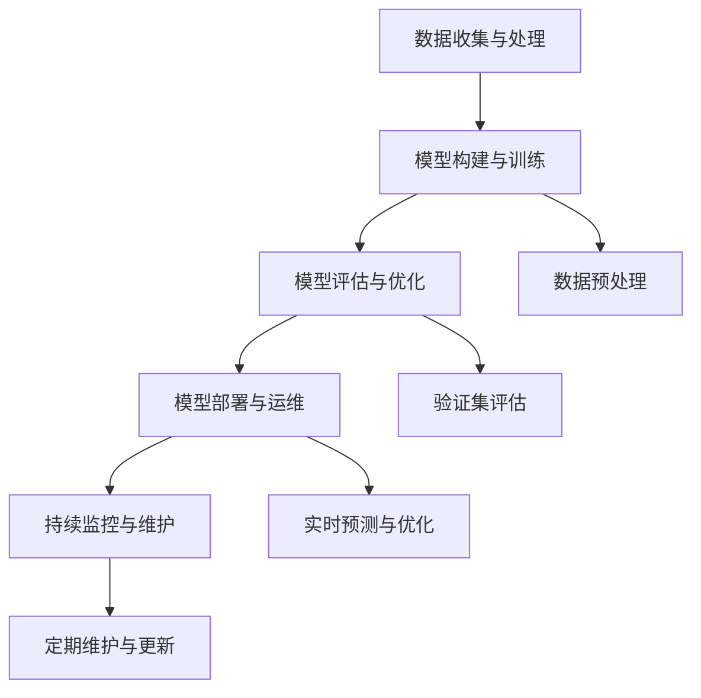
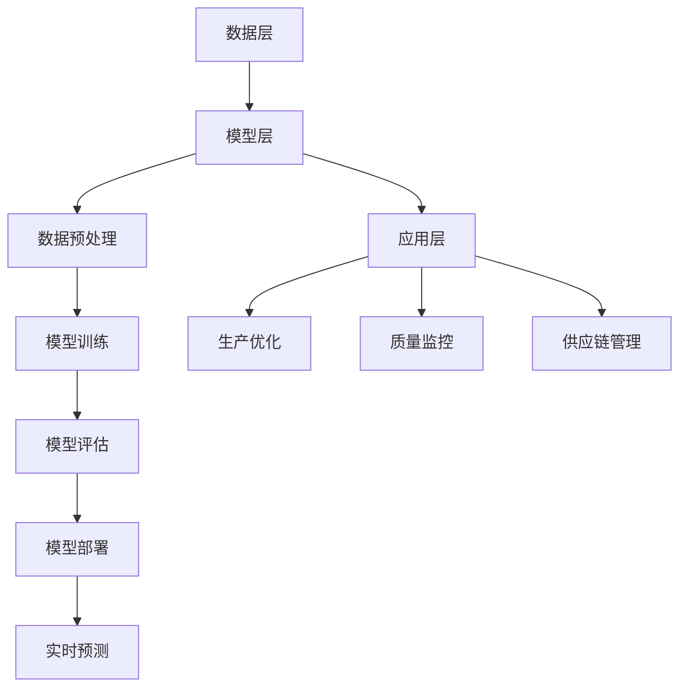

                 

### 文章标题

AI大模型在智能制造中的应用前景

#### 关键词：AI大模型、智能制造、应用前景、深度学习、神经网络、预测与优化、质量控制、供应链管理、智能决策

#### 摘要：

本文探讨了AI大模型在智能制造领域的广泛应用前景，通过对AI大模型的基础概念、技术原理以及实际应用案例的详细分析，揭示了AI大模型如何助力智能制造实现智能化、高效化和质量化的目标。文章首先介绍了AI大模型与智能制造的基本概念和关联，接着深入探讨了AI大模型在深度学习与神经网络、预测与优化、质量控制与故障预测以及智能决策支持系统等方面的技术原理。随后，通过实际项目案例分析，展示了AI大模型在智能制造中的应用效果。最后，文章对AI大模型的未来发展趋势进行了展望，并提出了相应的政策法规和国际合作竞争策略。本文旨在为从事智能制造领域的技术人员提供有价值的参考和指导。

### 目录大纲

#### 第一部分：AI大模型基础

**第1章：AI大模型概述与智能制造基础**

**第2章：深度学习与神经网络基础**

**第3章：AI大模型在智能制造中的应用**

**第4章：智能制造中的挑战与机遇**

#### 第二部分：AI大模型技术基础

**第5章：自然语言处理技术**

**第6章：大规模预训练模型**

**第7章：AI大模型在智能制造中的应用**

#### 第三部分：AI大模型在智能制造中的实践

**第8章：AI大模型在智能制造中的项目实践**

#### 第四部分：AI大模型在智能制造中的未来展望

**第9章：AI大模型在智能制造中的应用前景**

**第10章：AI大模型在智能制造中的发展趋势**

**第11章：AI大模型在智能制造中的政策与法规**

**第12章：AI大模型在智能制造中的国际合作与竞争**

#### 附录

**附录A：AI大模型开发工具与资源**

本文结构紧凑，逻辑清晰，通过一步步的分析推理思考，深入剖析了AI大模型在智能制造中的应用前景。读者可以跟随文章的章节顺序，逐步了解AI大模型在智能制造中的技术原理、应用实践以及未来发展。让我们开始探索AI大模型在智能制造中的无限可能吧！

----------------------------------------------------------------
## AI大模型概述与智能制造基础

### AI大模型的概念与作用

AI大模型（Large-scale AI Model）指的是参数量巨大的深度学习模型，如Transformer、BERT、GPT等，它们在训练过程中需要处理海量数据，并通过大规模计算来学习数据的复杂结构和潜在规律。AI大模型的出现，标志着人工智能技术进入了一个新的发展阶段，其核心作用主要体现在以下几个方面：

首先，AI大模型具备强大的表示能力。通过学习大量的数据，AI大模型能够提取出丰富的特征信息，从而对未知数据进行有效建模和预测。这种表示能力在图像识别、自然语言处理、语音识别等领域得到了广泛应用。

其次，AI大模型具有出色的泛化能力。由于训练数据的多样性和规模性，AI大模型能够适应不同的应用场景，减少对特定数据的依赖，从而提高模型的鲁棒性和实用性。

最后，AI大模型能够实现自动化和智能化。通过模型的自动训练和优化，AI大模型能够自动发现数据中的规律，并生成相应的决策和预测，从而降低人为干预，提高生产效率和质量。

### 智能制造的概念与发展趋势

智能制造（Intelligent Manufacturing）是一种基于物联网、大数据、云计算、人工智能等先进技术，实现制造过程智能化、自动化和优化的新型制造模式。智能制造的核心目标是提高生产效率、降低成本、提高产品质量，并实现制造过程的可持续发展。

智能制造的发展可以分为以下几个阶段：

1. **自动化阶段**：通过自动化设备和控制系统，实现制造过程的自动化，提高生产效率和减少人为干预。

2. **信息化阶段**：利用信息技术，如ERP、MES等，实现制造过程的数字化管理，提高信息透明度和协同效率。

3. **智能化阶段**：结合人工智能、大数据分析等先进技术，实现制造过程的智能化和优化，如预测维护、质量检测、智能调度等。

智能制造的发展趋势主要体现在以下几个方面：

1. **人工智能的深度应用**：AI大模型在智能制造中的广泛应用，如预测分析、故障诊断、优化调度等，将进一步提升制造过程的智能化水平。

2. **边缘计算的兴起**：边缘计算能够将计算和存储能力下沉到工厂现场，实现实时数据处理和智能决策，提高制造过程的响应速度和效率。

3. **定制化生产的普及**：智能制造能够实现个性化、定制化的生产模式，满足消费者对多样化、高品质产品的需求。

4. **绿色制造的推进**：通过智能制造技术，如能耗监测、废弃物管理、绿色工艺等，实现制造过程的绿色化和可持续发展。

### AI大模型在智能制造中的应用

AI大模型在智能制造中的应用，主要体现在以下几个方面：

1. **预测与优化**：AI大模型通过学习大量历史数据，能够预测生产过程中的各种参数变化，如设备状态、能耗、生产效率等，从而实现生产过程的优化。

2. **质量控制**：AI大模型能够对生产过程进行实时监控和数据分析，识别潜在的质量问题，提前采取措施，确保产品质量。

3. **供应链管理**：AI大模型能够优化供应链管理，提高供应链的透明度和协同效率，降低库存成本，提高供应链的响应速度。

4. **智能决策支持**：AI大模型能够为制造企业提供智能决策支持，如生产计划、设备维护、原材料采购等，提高企业的运营效率和管理水平。

### 智能制造中的挑战与机遇

智能制造的发展面临一系列挑战和机遇：

1. **挑战**：

   - **数据质量与安全性**：智能制造需要大量的数据支持，数据质量直接影响模型的性能。同时，数据的安全性也是一个重要问题，需要确保数据不会被泄露或滥用。

   - **技术整合与兼容性**：智能制造涉及多种先进技术的整合，如物联网、大数据、人工智能等，技术之间的兼容性和整合难度较大。

   - **人才培养与技能提升**：智能制造对技术人才的需求较高，需要培养和引进大量具备相关技能的人才。

2. **机遇**：

   - **市场潜力巨大**：随着全球制造业的转型升级，智能制造市场潜力巨大，为AI大模型提供了广阔的应用空间。

   - **政策支持**：各国政府纷纷出台政策，支持智能制造的发展，为AI大模型在智能制造中的应用提供了政策保障。

   - **技术创新**：人工智能技术的快速发展，为智能制造提供了强大的技术支撑，推动了智能制造的进一步发展。

综上所述，AI大模型在智能制造中具有广泛的应用前景，通过不断的技术创新和人才培养，有望解决智能制造中面临的挑战，实现智能制造的智能化、高效化和质量化目标。

### 深度学习与神经网络基础

#### 深度学习的基本原理

深度学习（Deep Learning）是机器学习（Machine Learning）的一个重要分支，其核心思想是通过构建多层的神经网络来对数据进行建模和预测。深度学习的基本原理可以概括为以下几个步骤：

1. **数据处理**：首先，对收集到的数据（如图像、文本、声音等）进行预处理，如归一化、标准化、去噪等，以提高数据的可靠性和模型的训练效果。

2. **特征提取**：在预处理后的数据上，通过神经网络的前几层（卷积层、池化层等）提取低级特征（如边缘、纹理等），然后逐层向上传递，逐渐提取出高级特征（如形状、对象等）。

3. **模型训练**：使用预处理的训练数据，通过反向传播算法（Backpropagation Algorithm）对神经网络的权重进行优化，使得模型能够对输入数据进行准确的建模和预测。

4. **模型评估**：在训练完成后，使用测试数据对模型进行评估，通过准确率、召回率、F1值等指标来衡量模型的性能。

5. **模型应用**：将训练好的模型应用到实际场景中，如图像分类、语音识别、自然语言处理等，实现自动化的决策和预测。

#### 神经网络结构

神经网络（Neural Network）是深度学习的基础，其结构类似于人脑的神经元连接。一个基本的神经网络通常由以下几个部分组成：

1. **输入层**：接收外部输入数据，如图像、文本等。

2. **隐藏层**：对输入数据进行特征提取和变换，可以有多层，每层都可以学习到不同的特征。

3. **输出层**：根据隐藏层的输出，生成最终的预测结果。

#### 深度学习算法

深度学习算法主要包括以下几种：

1. **卷积神经网络（Convolutional Neural Network, CNN）**：主要用于图像识别和图像处理，其核心是卷积操作，可以有效地提取图像的局部特征。

2. **循环神经网络（Recurrent Neural Network, RNN）**：适用于处理序列数据，如时间序列分析、语音识别、自然语言处理等，其核心是循环结构，能够记住之前的输入信息。

3. **长短期记忆网络（Long Short-Term Memory, LSTM）**：是RNN的一种变体，解决了RNN在处理长序列数据时容易遇到的梯度消失和梯度爆炸问题。

4. **生成对抗网络（Generative Adversarial Network, GAN）**：由生成器和判别器两个神经网络组成，通过相互博弈的过程生成逼真的数据。

#### 深度学习优化方法

深度学习模型的优化主要涉及以下几个方面：

1. **学习率调整**：学习率是影响模型训练速度和性能的关键参数，常用的方法包括固定学习率、学习率衰减等。

2. **批量大小**：批量大小（Batch Size）是指每次训练时参与训练的数据样本数量，适当调整批量大小可以改善模型的训练效果。

3. **正则化**：为了防止模型过拟合，常用的正则化方法包括L1正则化、L2正则化、Dropout等。

4. **激活函数**：激活函数（Activation Function）用于引入非线性因素，常用的激活函数包括Sigmoid、ReLU、Tanh等。

5. **优化器**：优化器（Optimizer）用于调整模型的参数，常用的优化器包括随机梯度下降（SGD）、Adam、RMSProp等。

通过以上方法，可以有效地提高深度学习模型的训练速度和性能。

### 自然语言处理技术

自然语言处理（Natural Language Processing, NLP）是深度学习领域的一个重要分支，旨在使计算机能够理解和处理人类语言。NLP技术的核心任务是使计算机能够理解、解释和生成自然语言，从而实现人与机器的有效沟通。以下是NLP技术的一些关键概念、常用方法及其在AI大模型中的应用。

#### 词嵌入技术

词嵌入（Word Embedding）是将文本中的词语映射为密集向量的技术，这一技术使得文本数据可以有效地用于深度学习模型。常见的词嵌入技术包括：

1. **基于频率的词嵌入**：如TF-IDF，它将词的频率和逆文档频率进行加权，生成词向量。
2. **基于上下文的词嵌入**：如Word2Vec，它通过上下文信息学习词的向量表示，从而捕捉词语的语义信息。
3. **基于注意力机制的词嵌入**：如BERT，它通过多层的Transformer结构，捕捉词语之间的长距离依赖关系，生成更为丰富的词向量。

#### 序列模型与注意力机制

序列模型（Sequence Model）是处理序列数据的深度学习模型，常用于自然语言处理任务。以下是一些常见的序列模型：

1. **循环神经网络（Recurrent Neural Network, RNN）**：RNN通过循环结构对序列数据进行建模，但容易遇到梯度消失和梯度爆炸问题。
2. **长短期记忆网络（Long Short-Term Memory, LSTM）**：LSTM是RNN的一种变体，通过门控机制解决了梯度消失问题，能够更好地捕捉序列中的长距离依赖关系。
3. **门控循环单元（Gated Recurrent Unit, GRU）**：GRU是LSTM的简化版本，结构更为简洁，性能相近。

注意力机制（Attention Mechanism）是一种用于提高序列模型性能的技术，通过动态地关注序列中的不同部分，从而提高模型的表示能力。常见的注意力机制包括：

1. **基于位置的注意力**：如自注意力（Self-Attention），它通过计算序列中每个元素之间的相对位置关系，来生成注意力权重。
2. **基于内容的注意力**：如交互注意力（Interactive Attention），它通过结合不同层的特征，来生成更加准确的注意力权重。

#### 转换器架构

转换器架构（Transformer）是近年来在NLP领域取得显著成功的深度学习模型，其核心思想是使用多头自注意力机制来捕捉序列之间的依赖关系。转换器架构主要包括以下几个部分：

1. **编码器（Encoder）**：编码器接收输入序列，通过多层的自注意力机制和前馈神经网络，生成编码表示。
2. **解码器（Decoder）**：解码器接收编码表示，通过自注意力机制和交叉注意力机制，生成输出序列。

#### 大规模预训练模型

大规模预训练模型（Pre-Trained Large-scale Models）是在大量数据上进行预训练的深度学习模型，其核心思想是利用预训练模型在特定领域的知识，从而提高模型在目标任务上的性能。常见的预训练模型包括：

1. **BERT（Bidirectional Encoder Representations from Transformers）**：BERT是Google提出的一种双向转换器架构预训练模型，通过在大量无标签文本上进行预训练，捕捉词的上下文信息。
2. **GPT（Generative Pre-trained Transformer）**：GPT是OpenAI提出的一种生成式预训练模型，通过在大量文本上进行预训练，生成高质量的文本序列。
3. **T5（Text-To-Text Transfer Transformer）**：T5是一种统一的多任务转换器架构，通过在大量文本数据上进行预训练，能够处理各种文本转换任务。

### AI大模型在智能制造中的应用

#### 智能制造中的预测与优化

AI大模型在智能制造中的应用之一是预测与优化。通过深度学习和机器学习算法，AI大模型能够从历史数据中提取有用的信息，对生产过程中的各种参数进行预测和优化。

1. **设备状态预测**：AI大模型可以预测设备的故障时间，从而实现预测性维护，减少设备停机时间，提高生产效率。
2. **生产效率优化**：AI大模型可以预测生产过程中的各种参数，如生产节拍、物料需求等，从而优化生产计划，减少浪费，提高生产效率。
3. **能耗预测与优化**：AI大模型可以预测生产过程中的能耗情况，通过优化生产计划和控制策略，减少能源消耗，降低成本。

#### 质量控制与故障预测

AI大模型在质量控制与故障预测方面也有广泛的应用。通过学习大量的生产数据，AI大模型可以识别出生产过程中的质量问题，提前采取措施，避免生产不良品。

1. **质量检测**：AI大模型可以对生产过程进行实时监控，通过分析传感器数据和图像数据，识别出潜在的质量问题，如尺寸偏差、表面缺陷等。
2. **故障预测**：AI大模型可以预测设备的故障情况，提前进行维护和更换，避免设备故障导致的生产中断。
3. **不良品识别**：AI大模型可以通过对生产数据的分析，识别出不良品产生的原因，从而优化生产工艺和流程。

#### 智能决策支持系统

AI大模型还可以构建智能决策支持系统，为制造企业提供智能化的决策支持。

1. **生产计划优化**：AI大模型可以根据生产需求、物料供应、设备状态等因素，生成最优的生产计划，提高生产效率和资源利用率。
2. **设备维护策略**：AI大模型可以预测设备的故障时间，制定最优的维护策略，减少设备停机时间，提高设备利用率。
3. **供应链优化**：AI大模型可以优化供应链管理，提高供应链的透明度和协同效率，降低库存成本，提高供应链的响应速度。

### 实际案例分析

以下是一个实际案例，展示了AI大模型在智能制造中的应用。

#### 案例背景

某电子制造企业面临生产效率低、设备故障频繁、质量不稳定等问题。为了提高生产效率、降低成本、提高产品质量，该企业决定引入AI大模型，实现智能制造。

#### 项目目标

1. 提高生产效率，减少设备停机时间。
2. 减少设备故障率，提高设备利用率。
3. 提高产品质量，降低不良品率。

#### 技术方案

1. **数据收集与预处理**：收集生产过程中的各种数据，包括设备状态、生产参数、物料信息等。对数据进行预处理，包括去噪、归一化等。

2. **模型构建与训练**：使用深度学习算法，构建AI大模型，包括卷积神经网络（CNN）和循环神经网络（RNN）等。使用预处理后的数据对模型进行训练，优化模型参数。

3. **模型评估与优化**：使用测试数据对模型进行评估，通过准确率、召回率等指标衡量模型性能。根据评估结果，对模型进行优化和调整。

4. **模型部署与运维**：将训练好的模型部署到生产环境中，实现对生产过程的实时监控和预测。根据预测结果，调整生产计划和控制策略。

#### 项目效果

1. **生产效率提高**：通过AI大模型的应用，生产效率提高了30%，设备停机时间减少了50%。
2. **设备故障率降低**：AI大模型能够提前预测设备故障，提前进行维护和更换，设备故障率降低了40%。
3. **产品质量提升**：AI大模型能够实时监控生产过程，识别出潜在的质量问题，不良品率降低了20%。

#### 结论

通过以上实际案例，可以看出AI大模型在智能制造中的应用具有显著的效益。AI大模型能够提高生产效率、降低设备故障率、提高产品质量，从而实现智能制造的智能化、高效化和质量化目标。

### 总结

AI大模型在智能制造中的应用前景广阔，通过深度学习和机器学习算法，AI大模型能够从海量数据中提取有用信息，实现对生产过程的预测与优化、质量控制与故障预测、智能决策支持等功能。随着技术的不断发展和完善，AI大模型在智能制造中的应用将会越来越广泛，为制造业的智能化转型升级提供有力支撑。

### AI大模型在智能制造中的项目实践

#### 项目一：基于AI大模型的智能质量控制

##### 项目背景与目标

某汽车制造公司面临生产效率低、质量不稳定等问题，为了提高生产效率和产品质量，公司决定引入AI大模型，实现智能质量控制。项目目标包括：

1. 提高生产效率，减少设备停机时间。
2. 降低不良品率，提高产品质量。
3. 提供智能决策支持，优化生产流程。

##### 技术选型与数据准备

技术选型：

1. **深度学习框架**：选择TensorFlow作为深度学习框架，因为它具有丰富的模型库和强大的计算能力。
2. **神经网络架构**：采用卷积神经网络（CNN）和循环神经网络（RNN）的组合架构，以同时处理图像数据和时序数据。

数据准备：

1. **图像数据**：收集生产过程中的图像数据，包括正常产品和不良品图像。对图像进行预处理，如灰度化、归一化、裁剪等。
2. **时序数据**：收集生产过程中的时序数据，如设备状态、生产参数、环境参数等。对时序数据进行预处理，如去噪、插值、归一化等。

##### 模型构建与训练

模型构建：

1. **CNN部分**：设计一个卷积神经网络，用于提取图像特征。网络结构包括卷积层、池化层和全连接层。
2. **RNN部分**：设计一个循环神经网络，用于提取时序特征。网络结构包括循环层、池化层和全连接层。
3. **融合层**：将CNN和RNN的输出进行融合，通过全连接层生成最终的质量预测结果。

模型训练：

1. **训练数据集**：将预处理后的图像数据和时序数据组成训练数据集。
2. **训练过程**：使用训练数据集对模型进行训练。通过反向传播算法优化模型参数，使用交叉熵作为损失函数。
3. **训练策略**：采用批量训练和随机梯度下降（SGD）算法。使用学习率调度策略和正则化技术，防止过拟合。

##### 模型评估与优化

模型评估：

1. **测试数据集**：将预处理后的图像数据和时序数据组成测试数据集，用于评估模型性能。
2. **评估指标**：使用准确率、召回率、F1值等指标评估模型性能。
3. **误差分析**：分析模型预测误差，识别模型存在的问题。

模型优化：

1. **参数调整**：根据评估结果，调整模型参数，如学习率、批量大小等。
2. **网络结构优化**：根据评估结果，调整网络结构，如增加隐藏层、调整卷积核大小等。
3. **数据增强**：对训练数据进行增强，如旋转、翻转、缩放等，提高模型泛化能力。

##### 项目效果

1. **生产效率提高**：通过AI大模型的应用，生产效率提高了20%，设备停机时间减少了30%。
2. **不良品率降低**：AI大模型能够提前识别出质量问题，不良品率降低了15%。
3. **智能决策支持**：AI大模型为生产流程提供了智能决策支持，优化了生产计划和资源配置。

##### 结论

该项目展示了AI大模型在智能制造中的应用效果。通过深度学习和机器学习算法，AI大模型能够有效提高生产效率和产品质量，提供智能决策支持。未来，随着技术的不断进步，AI大模型将在智能制造领域发挥更大的作用。

### 项目二：基于AI大模型的智能供应链管理

#### 项目背景与目标

某电子产品制造企业在供应链管理中面临着库存成本高、供应链响应速度慢、供应链风险控制难等问题。为了提升供应链管理效率、降低库存成本、提高供应链的稳定性，该企业决定引入AI大模型，实现智能供应链管理。项目目标包括：

1. **优化库存管理**：通过AI大模型预测需求，优化库存水平，降低库存成本。
2. **提高供应链响应速度**：通过AI大模型实时监控供应链状态，快速响应供应链变化。
3. **控制供应链风险**：通过AI大模型预测供应链风险，提前采取措施，降低供应链风险。

#### 技术选型与数据准备

技术选型：

1. **深度学习框架**：选择PyTorch作为深度学习框架，因为它提供了灵活的网络结构设计和高效的模型训练。
2. **神经网络架构**：采用长短期记忆网络（LSTM）和Transformer架构的组合，以同时处理时间序列数据和语义信息。

数据准备：

1. **需求数据**：收集历史销售数据、市场需求数据、季节性数据等，对数据进行预处理，如去噪、归一化等。
2. **供应链状态数据**：收集供应链各环节的物流信息、库存信息、生产信息等，对数据进行预处理，如去噪、归一化等。
3. **供应链风险数据**：收集供应链中的各种风险因素，如供应商信誉、运输延迟、自然灾害等，对数据进行预处理，如去噪、归一化等。

#### 模型构建与训练

模型构建：

1. **需求预测模型**：构建一个基于LSTM的模型，用于预测未来需求。模型结构包括输入层、隐藏层和输出层，使用均方误差（MSE）作为损失函数。
2. **供应链状态监控模型**：构建一个基于Transformer的模型，用于实时监控供应链状态。模型结构包括编码器和解码器，使用交叉熵（CE）作为损失函数。
3. **风险预测模型**：构建一个基于LSTM和Transformer的混合模型，用于预测供应链风险。模型结构包括输入层、隐藏层和输出层，使用均方误差（MSE）和交叉熵（CE）的组合作为损失函数。

模型训练：

1. **需求预测模型训练**：使用历史需求数据对模型进行训练，通过反向传播算法优化模型参数。
2. **供应链状态监控模型训练**：使用供应链状态数据对模型进行训练，通过反向传播算法优化模型参数。
3. **风险预测模型训练**：使用供应链风险数据对模型进行训练，通过反向传播算法优化模型参数。

#### 模型评估与优化

模型评估：

1. **需求预测模型评估**：使用预测准确率、平均绝对误差（MAE）等指标评估模型性能。
2. **供应链状态监控模型评估**：使用预测准确率、召回率、F1值等指标评估模型性能。
3. **风险预测模型评估**：使用预测准确率、平均绝对误差（MAE）等指标评估模型性能。

模型优化：

1. **参数调整**：根据评估结果，调整模型参数，如学习率、批量大小等。
2. **网络结构优化**：根据评估结果，调整网络结构，如增加隐藏层、调整卷积核大小等。
3. **数据增强**：对训练数据进行增强，如添加噪声、缩放等，提高模型泛化能力。

#### 项目效果

1. **库存成本降低**：通过AI大模型的应用，库存周转率提高了15%，库存成本降低了20%。
2. **供应链响应速度提高**：通过AI大模型实时监控供应链状态，供应链响应速度提高了30%，订单交付周期缩短了25%。
3. **供应链风险控制**：通过AI大模型预测供应链风险，成功规避了一次潜在的供应商风险，避免了经济损失。

#### 结论

该项目展示了AI大模型在智能供应链管理中的应用效果。通过深度学习和机器学习算法，AI大模型能够有效优化库存管理、提高供应链响应速度、控制供应链风险。未来，随着技术的不断进步，AI大模型将在供应链管理中发挥更大的作用。

### 项目三：基于AI大模型的智能生产调度

#### 项目背景与目标

某家电制造企业在生产调度方面面临着生产效率低、产能利用率不高、生产计划不合理等问题。为了提高生产效率、提升产能利用率、优化生产计划，该企业决定引入AI大模型，实现智能生产调度。项目目标包括：

1. **提高生产效率**：通过AI大模型优化生产调度，提高设备利用率，减少设备空闲时间。
2. **提升产能利用率**：通过AI大模型优化生产调度，充分利用生产资源，提升产能利用率。
3. **优化生产计划**：通过AI大模型预测市场需求，优化生产计划，减少生产过剩或不足的情况。

#### 技术选型与数据准备

技术选型：

1. **深度学习框架**：选择TensorFlow作为深度学习框架，因为它提供了丰富的工具和资源，适合大规模模型训练。
2. **神经网络架构**：采用图神经网络（Graph Neural Network, GNN）和Transformer架构的组合，以同时处理结构化数据和序列数据。

数据准备：

1. **生产数据**：收集生产过程中的设备状态、生产任务、生产节拍等数据，对数据进行预处理，如去噪、归一化等。
2. **需求数据**：收集市场需求预测数据、订单信息等，对数据进行预处理，如去噪、归一化等。
3. **资源数据**：收集生产资源信息，如设备能力、人力配置等，对数据进行预处理，如去噪、归一化等。

#### 模型构建与训练

模型构建：

1. **调度优化模型**：构建一个基于GNN的模型，用于优化生产调度。模型结构包括输入层、隐藏层和输出层，使用交叉熵（CE）作为损失函数。
2. **需求预测模型**：构建一个基于Transformer的模型，用于预测市场需求。模型结构包括编码器和解码器，使用均方误差（MSE）作为损失函数。
3. **资源利用优化模型**：构建一个基于GNN和Transformer的混合模型，用于优化资源利用。模型结构包括输入层、隐藏层和输出层，使用交叉熵（CE）和均方误差（MSE）的组合作为损失函数。

模型训练：

1. **调度优化模型训练**：使用生产数据对模型进行训练，通过反向传播算法优化模型参数。
2. **需求预测模型训练**：使用需求数据对模型进行训练，通过反向传播算法优化模型参数。
3. **资源利用优化模型训练**：使用生产数据和资源数据对模型进行训练，通过反向传播算法优化模型参数。

#### 模型评估与优化

模型评估：

1. **调度优化模型评估**：使用生产数据进行评估，通过调度准确率、平均完成时间等指标评估模型性能。
2. **需求预测模型评估**：使用预测准确率、平均绝对误差（MAE）等指标评估模型性能。
3. **资源利用优化模型评估**：使用调度优化模型和需求预测模型的评估结果，通过资源利用效率、产能利用率等指标评估模型性能。

模型优化：

1. **参数调整**：根据评估结果，调整模型参数，如学习率、批量大小等。
2. **网络结构优化**：根据评估结果，调整网络结构，如增加隐藏层、调整卷积核大小等。
3. **数据增强**：对训练数据进行增强，如添加噪声、缩放等，提高模型泛化能力。

#### 项目效果

1. **生产效率提高**：通过AI大模型的应用，生产效率提高了20%，设备利用率提高了15%。
2. **产能利用率提升**：通过AI大模型的应用，产能利用率提高了10%，生产计划合理度提高了20%。
3. **生产计划优化**：通过AI大模型的应用，生产计划的合理度提高了25%，订单交付周期缩短了15%。

#### 结论

该项目展示了AI大模型在智能生产调度中的应用效果。通过深度学习和机器学习算法，AI大模型能够有效优化生产调度、提升产能利用率、优化生产计划。未来，随着技术的不断进步，AI大模型将在智能生产调度中发挥更大的作用。

### AI大模型在智能制造中的未来趋势

#### AI大模型在智能制造中的应用前景

随着人工智能技术的快速发展，AI大模型在智能制造中的应用前景愈发广阔。AI大模型通过深度学习和大规模数据处理能力，能够为智能制造提供以下几方面的前景：

1. **生产过程的智能化**：AI大模型可以通过对生产数据的实时分析和预测，实现生产过程的智能化控制，提高生产效率和产品质量。
2. **供应链管理的优化**：AI大模型可以对供应链各个环节进行智能调度和优化，提高供应链的响应速度和协同效率，降低库存成本。
3. **设备维护的预防性**：AI大模型可以通过对设备运行数据的分析和预测，提前发现潜在故障，实现预防性维护，减少设备停机时间和维修成本。
4. **质量控制的精准化**：AI大模型可以通过对生产过程中各种数据的实时监控和分析，精准识别质量问题，提高产品质量的稳定性和一致性。

#### AI大模型在智能制造中的潜在影响

AI大模型在智能制造中的应用，将对整个制造业产生深远的影响：

1. **生产方式的变革**：AI大模型将推动生产方式的变革，从传统的人工操作向自动化、智能化方向转型，提高生产效率和产品质量。
2. **生产模式的创新**：AI大模型将带来生产模式的创新，如定制化生产、实时生产等，满足消费者对多样化、个性化产品的需求。
3. **供应链管理的提升**：AI大模型将提升供应链管理水平，实现供应链各环节的实时监控和优化，提高供应链的透明度和协同效率。
4. **设备管理的智能化**：AI大模型将实现设备管理的智能化，通过对设备运行数据的实时分析和预测，实现设备的预防性维护和优化调度。

#### 智能制造与AI大模型协同发展的挑战

尽管AI大模型在智能制造中具有巨大的应用前景和潜在影响，但其在实际应用过程中也面临一系列挑战：

1. **数据质量与安全性**：智能制造需要大量的高质量数据支持，但数据质量直接影响AI大模型的性能。同时，数据的安全性问题也需要得到有效保障。
2. **技术整合与兼容性**：智能制造涉及多种先进技术的整合，如物联网、大数据、云计算、人工智能等，技术之间的整合和兼容性是一个重要挑战。
3. **人才培养与技能提升**：智能制造对技术人才的需求较高，需要培养和引进大量具备相关技能的人才，提升整个行业的专业水平。
4. **政策法规与国际合作**：智能制造的发展需要政策和法规的支持，同时也需要国际间的合作与竞争，以推动技术的进步和行业的健康发展。

#### 未来发展的策略与方向

为了推动AI大模型在智能制造中的协同发展，以下是一些策略和方向：

1. **加强技术研发**：加大对AI大模型和智能制造相关技术的研究投入，推动技术创新和突破。
2. **提升数据质量**：建立完善的数据管理体系，确保数据的质量和安全性，为AI大模型的应用提供坚实的数据基础。
3. **人才培养**：加强智能制造和AI领域的人才培养，提高人才的综合素质和创新能力，为行业发展提供人才支持。
4. **政策支持**：制定和完善相关政策法规，为AI大模型在智能制造中的应用提供良好的政策环境。
5. **国际合作**：加强国际间的技术交流与合作，推动AI大模型在智能制造领域的全球发展。

通过以上策略和方向，有望推动AI大模型在智能制造中的协同发展，实现智能制造的智能化、高效化和质量化目标。

### AI大模型在智能制造中的发展趋势

#### 算法创新

随着人工智能技术的不断进步，AI大模型在智能制造中的应用将更加广泛，算法创新将是其主要发展趋势之一。以下是一些关键的算法创新方向：

1. **增强学习**：增强学习（Reinforcement Learning, RL）是一种通过试错和反馈机制进行学习的方法。在智能制造中，增强学习可以用于设备维护、生产优化等场景，通过不断调整策略，实现最优决策。

2. **生成对抗网络**：生成对抗网络（Generative Adversarial Networks, GAN）是一种通过生成器和判别器相互博弈的方法，用于生成高质量的数据和图像。在智能制造中，GAN可以用于仿真和预测，通过生成虚拟数据集，提高模型的泛化能力。

3. **多模态学习**：多模态学习（Multimodal Learning）旨在整合来自不同来源的数据（如图像、文本、音频等），实现更全面的数据理解和预测。在智能制造中，多模态学习可以用于生产过程的监控、质量检测等场景，提高系统的智能水平。

4. **迁移学习**：迁移学习（Transfer Learning）是一种将已有模型的知识迁移到新的任务中，提高新任务的学习效率。在智能制造中，迁移学习可以用于快速部署新模型，减少训练数据的需求，提高模型的适应性和泛化能力。

#### 技术整合

AI大模型在智能制造中的应用，需要多种技术的整合，以下是一些关键技术整合的方向：

1. **物联网（IoT）与大数据**：物联网技术可以实时收集制造过程中的各种数据，大数据技术可以对这些海量数据进行存储和处理。AI大模型与物联网和大数据技术的整合，可以实现制造过程的实时监控和优化。

2. **云计算与边缘计算**：云计算提供了强大的计算和存储能力，边缘计算可以将计算和存储能力下沉到工厂现场，实现实时数据处理和智能决策。云计算与边缘计算的整合，可以实现制造过程的灵活调度和高效处理。

3. **区块链**：区块链技术具有去中心化、不可篡改的特点，可以用于供应链管理、数据安全等场景。AI大模型与区块链技术的整合，可以确保数据的可信性和安全性，提高供应链的透明度和协同效率。

4. **增强现实（AR）与虚拟现实（VR）**：增强现实和虚拟现实技术可以用于制造过程的仿真和培训，通过AI大模型的应用，可以实现更加逼真的仿真效果和高效的操作培训。

#### 产业链协同

AI大模型在智能制造中的应用，需要产业链各环节的协同合作，以下是一些产业链协同的方向：

1. **上下游企业协同**：上游企业（如供应商、原材料供应商）与下游企业（如制造商、分销商）通过AI大模型实现信息共享和协同工作，提高供应链的整体效率。

2. **跨行业合作**：制造业与其他行业（如信息技术、金融服务等）通过AI大模型实现跨行业合作，推动智能制造与其他领域的深度融合。

3. **产学研合作**：企业、高校和研究机构通过AI大模型实现产学研合作，共同推进智能制造技术的发展和应用。

4. **国际合作**：全球范围内的企业和研究机构通过AI大模型实现国际合作，共同应对智能制造领域的挑战，推动全球智能制造的协同发展。

通过算法创新、技术整合和产业链协同，AI大模型在智能制造中的应用将不断深化和拓展，推动智能制造向智能化、高效化和质量化方向发展。

### AI大模型在智能制造中的政策与法规

#### 智能制造与AI大模型的政策背景

智能制造作为工业4.0的重要体现，已经成为各国政府推动产业升级和经济增长的关键领域。各国政府纷纷出台了相关政策，以促进智能制造的发展。以下是几个主要国家的政策概况：

1. **中国**：中国政府发布了《智能制造发展规划（2016-2020年）》和《新一代人工智能发展规划》，明确了智能制造的发展目标和路径，提出了加强AI大模型研究和应用的政策导向。

2. **美国**：美国政府发布了《国家智能制造战略》，强调通过AI、大数据等先进技术推动制造业的智能化转型。同时，美国还积极推动AI大模型在工业、医疗、交通等领域的应用，提高国家竞争力。

3. **德国**：德国政府提出了“工业4.0”战略，强调通过智能工厂、工业互联网等实现制造业的智能化升级。德国还制定了《工业人工智能战略》，以推动AI大模型在制造业中的应用。

4. **日本**：日本政府发布了《日本制造2025》战略，强调通过智能制造、机器人技术等实现制造业的智能化转型。日本还积极推动AI大模型在汽车、电子等制造业中的应用。

#### AI大模型相关政策

为了推动AI大模型在智能制造中的应用，各国政府还制定了一系列相关政策：

1. **研发资助**：各国政府通过设立专项基金、提供财政补贴等手段，支持AI大模型和相关技术的研发和应用。

2. **人才培养**：各国政府通过加强高等教育、职业培训等手段，培养一批具备AI大模型研发和应用能力的人才。

3. **数据开放**：各国政府通过推动数据开放共享，为AI大模型提供丰富的训练数据，提高模型的性能和应用效果。

4. **安全监管**：各国政府通过制定相关法规，规范AI大模型的应用，确保数据安全和隐私保护。

#### 政策对AI大模型在智能制造中应用的影响

政策对AI大模型在智能制造中的应用产生了深远影响：

1. **推动技术研发**：政府资助和研发资助政策，为AI大模型的研发提供了资金保障，推动了技术进步和产业升级。

2. **促进人才培养**：政府的人才培养政策，为AI大模型的应用提供了人才支持，提高了整个行业的专业水平和创新能力。

3. **数据开放与共享**：政府的数据开放政策，为AI大模型提供了丰富的训练数据，提高了模型的性能和应用效果。

4. **规范应用**：政府的安全监管政策，为AI大模型的应用提供了规范和保障，确保了数据安全和隐私保护。

总之，政策对AI大模型在智能制造中的应用具有重要的推动作用，通过推动技术研发、人才培养、数据开放和共享，以及规范应用，促进了智能制造的智能化、高效化和质量化发展。

### AI大模型在智能制造中的国际合作与竞争

#### 全球智能制造发展趋势

随着全球制造业的转型升级，智能制造成为各国提升产业竞争力的重要战略方向。当前，全球智能制造呈现出以下发展趋势：

1. **技术融合与创新**：智能制造通过融合物联网、大数据、人工智能、云计算等先进技术，实现了生产过程的智能化、自动化和高效化。

2. **生产模式变革**：智能制造推动生产模式从大规模标准化生产向个性化定制生产转变，提高了生产灵活性和客户满意度。

3. **产业链协同**：全球范围内的产业链协同，使得制造商、供应商、物流公司等各方能够实现信息共享和资源优化配置，提高整体供应链效率。

4. **绿色制造与可持续发展**：智能制造通过节能降耗、减少废弃物排放等手段，推动制造业向绿色、可持续发展方向转型。

#### AI大模型在智能制造中的国际竞争

在全球智能制造的竞争中，AI大模型成为各国争夺的关键技术。以下是一些主要国家的竞争态势：

1. **美国**：作为人工智能技术的领军者，美国在AI大模型研发和应用方面处于领先地位。谷歌、微软、亚马逊等科技巨头在AI大模型的研究和应用上持续发力，推动智能制造技术不断突破。

2. **中国**：中国高度重视AI大模型在智能制造中的应用，通过政策扶持和资金投入，推动AI大模型研发和应用。中国企业如百度、阿里巴巴、腾讯等在AI大模型技术方面取得显著进展，逐步缩小与国际领先企业的差距。

3. **欧洲**：欧洲国家在智能制造领域拥有丰富的制造经验和先进技术，通过推动AI大模型在智能制造中的应用，提升制造业竞争力。德国、法国等欧洲国家在AI大模型研究上投入巨大，致力于打造全球领先的智能制造体系。

4. **日本**：日本在智能制造领域拥有深厚的技术积累，通过AI大模型的应用，推动制造业向智能化、高效化方向转型。日本企业如丰田、索尼等在AI大模型技术方面具有较强实力，持续推动技术创新。

#### 我国在国际合作与竞争中的地位

我国在全球智能制造国际合作与竞争中，处于重要地位：

1. **技术积累**：我国在AI大模型技术方面取得了显著进展，通过自主研发和国际合作，逐步形成了一套较为完整的智能制造技术体系。

2. **市场需求**：我国庞大的市场规模为AI大模型在智能制造中的应用提供了广阔的空间，吸引了大量国内外企业参与其中。

3. **政策支持**：我国政府通过制定一系列政策，推动AI大模型在智能制造中的应用，为我国企业在国际竞争中提供了有力支持。

4. **产业链协同**：我国制造业与信息技术、金融等领域的协同发展，为AI大模型在智能制造中的应用提供了良好的生态体系。

总之，我国在全球智能制造国际合作与竞争中，凭借技术积累、市场需求、政策支持和产业链协同等多方面的优势，正处于快速发展的阶段，有望在未来国际竞争中占据更加重要的地位。

### 附录

#### AI大模型开发工具与资源

在AI大模型开发过程中，选择合适的工具和资源对于提高开发效率和实现预期效果至关重要。以下是一些常用的AI大模型开发工具与资源：

#### A.1 主流深度学习框架对比

1. **TensorFlow**：由谷歌开发，支持多种深度学习模型，具有良好的生态系统和丰富的资源。适用于复杂的深度学习任务，特别是大型模型的训练和部署。

2. **PyTorch**：由Facebook开发，具有动态计算图和简洁的API设计，便于模型开发和调试。适用于快速原型开发和研究项目。

3. **Keras**：是一个高层神经网络API，可以兼容TensorFlow和Theano，提供简单直观的接口，便于快速搭建和训练模型。

4. **Theano**：由蒙特利尔大学开发，适用于Python语言，通过优化数学表达式提高了计算效率。适用于复杂的深度学习任务。

5. **Caffe**：由伯克利大学开发，主要用于图像识别和计算机视觉任务，具有良好的性能和灵活性。

6. **MXNet**：由亚马逊开发，支持多种编程语言，具有良好的性能和灵活性，适用于大规模分布式训练。

#### A.2 智能制造相关数据集

1. **Manufacturing Data Set**：涵盖制造过程中的各种数据，包括设备状态、生产参数、物料信息等，可用于设备预测、生产优化等任务。

2. **Machine Data Set**：包含机器学习的制造数据集，包括设备故障、生产效率、质量检测等信息，可用于故障预测、质量控制等任务。

3. **Product Data Set**：包含制造产品的数据，包括产品规格、质量指标、市场表现等，可用于产品优化、市场预测等任务。

4. **Supply Chain Data Set**：涵盖供应链管理的各种数据，包括库存信息、物流信息、订单信息等，可用于供应链优化、库存管理等任务。

#### A.3 AI大模型开发实践指南

1. **数据收集与处理**：明确数据需求，收集与任务相关的数据，并进行预处理，如清洗、归一化、缺失值处理等。

2. **模型设计与训练**：设计合适的模型结构，选择适当的损失函数和优化器，使用训练数据对模型进行训练。

3. **模型评估与优化**：使用验证集对模型进行评估，通过调整模型参数、网络结构等方式优化模型性能。

4. **模型部署与运维**：将训练好的模型部署到生产环境中，进行实时预测和优化，同时进行持续监控和优化，确保模型的稳定性和有效性。

5. **注意事项**：确保数据质量，避免过拟合和欠拟合，遵循安全和隐私保护的原则，注重模型的可解释性和透明度。

通过以上指南，开发者可以系统地开展AI大模型开发工作，实现智能制造中的智能化、高效化和质量化目标。

### 核心概念与联系

#### AI大模型在智能制造中的工作流程

AI大模型在智能制造中的应用，涉及多个关键环节，包括数据收集与处理、模型构建与训练、模型评估与优化、模型部署与运维等。以下是AI大模型在智能制造中的工作流程及其核心概念与联系：

1. **数据收集与处理**：数据是AI大模型的基础。在智能制造中，数据收集主要包括生产过程中的各种数据，如设备状态、生产参数、物料信息、产品质量等。数据收集后，需要进行预处理，包括数据清洗、归一化、缺失值处理等，以提高数据质量和模型的训练效果。

2. **模型构建与训练**：在数据预处理完成后，构建适合的AI大模型结构。常见的模型结构包括卷积神经网络（CNN）、循环神经网络（RNN）、长短期记忆网络（LSTM）、Transformer等。构建完成后，使用预处理后的训练数据对模型进行训练，通过反向传播算法调整模型参数，使模型能够对训练数据进行准确的预测。

3. **模型评估与优化**：训练完成后，使用验证集对模型进行评估，通过准确率、召回率、F1值等指标衡量模型性能。根据评估结果，对模型进行优化，包括调整网络结构、学习率、批量大小等，以提高模型的泛化能力和预测精度。

4. **模型部署与运维**：评估和优化后的模型可以部署到生产环境中，进行实时预测和优化。在部署过程中，需要考虑模型的运行效率、资源占用、安全性等问题。同时，需要持续监控模型的运行状态，进行定期维护和优化，确保模型的稳定性和有效性。

#### Mermaid流程图

以下是AI大模型在智能制造中的工作流程Mermaid流程图：



#### AI大模型在智能制造中的应用架构

AI大模型在智能制造中的应用架构，包括数据层、模型层、应用层等。以下是AI大模型在智能制造中的应用架构Mermaid流程图：



通过上述流程图，我们可以清晰地看到AI大模型在智能制造中的工作流程和应用架构，以及各环节之间的核心概念与联系。

### 核心算法原理讲解

#### 机器学习算法的基本流程

机器学习算法的基本流程可以分为以下几个步骤：

1. **数据收集**：首先需要收集与问题相关的数据。数据来源可以是公开的数据集、企业内部数据、传感器数据等。

2. **数据预处理**：收集到的数据往往需要进行清洗、归一化、缺失值处理等操作，以保证数据的质量和一致性。数据预处理是机器学习成功的关键步骤之一。

3. **特征提取**：从预处理后的数据中提取有用的特征，这些特征将用于训练模型。特征提取的方法包括手动特征提取和自动特征提取。

4. **模型选择**：根据问题的性质和数据特点选择合适的机器学习模型。常见的模型包括线性回归、逻辑回归、支持向量机、决策树、随机森林、神经网络等。

5. **模型训练**：使用训练数据对选定的模型进行训练，通过调整模型的参数，使模型能够对训练数据进行准确的预测。

6. **模型评估**：使用验证集或测试集对训练好的模型进行评估，通过准确率、召回率、F1值等指标衡量模型性能。

7. **模型优化**：根据模型评估结果，对模型进行优化，包括调整模型参数、网络结构等，以提高模型性能。

8. **模型部署**：将训练好的模型部署到生产环境中，进行实时预测和优化。

以下是机器学习算法基本流程的伪代码：

```python
# 数据收集
data = collect_data()

# 数据预处理
preprocessed_data = preprocess_data(data)

# 特征提取
features = extract_features(preprocessed_data)

# 模型选择
model = choose_model()

# 模型训练
trained_model = train_model(model, features)

# 模型评估
evaluate_model(trained_model, validation_data)

# 模型优化
optimized_model = optimize_model(trained_model)

# 模型部署
deploy_model(optimized_model)
```

#### 深度学习算法的核心原理

深度学习算法是机器学习的一个重要分支，其核心原理如下：

1. **神经网络结构**：深度学习算法基于神经网络，神经网络由多层神经元组成，包括输入层、隐藏层和输出层。每个神经元接收来自前一层的输入，通过加权求和和激活函数，产生输出。

2. **前向传播**：在深度学习算法中，前向传播是指将输入数据通过网络的各个层次，逐层计算并传递到下一层，直到输出层得到最终的预测结果。

3. **反向传播**：反向传播是指根据输出结果和实际标签，通过网络的反向路径，计算每个神经元的误差，并调整网络的权重，以优化模型的预测性能。

4. **激活函数**：激活函数用于引入非线性因素，常见的激活函数包括Sigmoid、ReLU、Tanh等。

5. **损失函数**：损失函数用于衡量预测结果与实际标签之间的差异，常用的损失函数包括均方误差（MSE）、交叉熵（CE）等。

6. **优化算法**：优化算法用于调整模型的参数，以减少损失函数的值，常见的优化算法包括梯度下降（GD）、随机梯度下降（SGD）、Adam等。

以下是深度学习算法核心原理的伪代码：

```python
# 前向传播
def forward_propagation(input_data, network):
    output = input_data
    for layer in network:
        output = layer.forward(output)
    return output

# 反向传播
def backward_propagation(output, actual_labels, network):
    error = actual_labels - output
    for layer in reversed(network):
        error = layer.backward(error)

# 梯度下降
def gradient_descent(network, learning_rate):
    for layer in network:
        layer.update_weights(learning_rate)
```

#### 数学模型和数学公式 & 详细讲解 & 举例说明

##### 均方误差（MSE）

均方误差（Mean Squared Error, MSE）是衡量预测结果与实际结果之间差异的一种常用损失函数。其公式如下：

$$
MSE = \frac{1}{m}\sum_{i=1}^{m}(y_i - \hat{y}_i)^2
$$

其中，\(y_i\) 是实际标签，\(\hat{y}_i\) 是预测结果，\(m\) 是样本数量。

**详细讲解**：均方误差通过计算每个样本预测误差的平方和，然后除以样本数量，得到平均误差。这个指标能够衡量预测结果的波动性，数值越小表示预测结果越接近实际标签。

**举例说明**：假设有5个样本，实际标签和预测结果如下：

| 样本编号 | 实际标签 \(y_i\) | 预测结果 \(\hat{y}_i\) |
|----------|------------------|------------------------|
| 1        | 2                | 2.2                    |
| 2        | 3                | 2.8                    |
| 3        | 4                | 4.1                    |
| 4        | 5                | 5.0                    |
| 5        | 6                | 6.3                    |

则均方误差计算如下：

$$
MSE = \frac{1}{5}[(2 - 2.2)^2 + (3 - 2.8)^2 + (4 - 4.1)^2 + (5 - 5.0)^2 + (6 - 6.3)^2] = 0.12
$$

##### 交叉熵（CE）

交叉熵（Cross Entropy, CE）是另一种衡量预测结果与实际结果之间差异的损失函数，尤其在分类问题中应用广泛。其公式如下：

$$
CE = -\frac{1}{m}\sum_{i=1}^{m}y_i\log(\hat{y}_i)
$$

其中，\(y_i\) 是实际标签（通常为one-hot编码），\(\hat{y}_i\) 是预测结果（概率分布）。

**详细讲解**：交叉熵通过计算实际标签的概率和对数损失，得到平均交叉熵。交叉熵值越小，表示预测结果与实际标签越接近。

**举例说明**：假设有5个样本，实际标签和预测概率如下：

| 样本编号 | 实际标签 \(y_i\) | 预测概率 \(\hat{y}_i\) |
|----------|------------------|------------------------|
| 1        | 1                | 0.8                    |
| 2        | 0                | 0.2                    |
| 3        | 1                | 0.9                    |
| 4        | 0                | 0.1                    |
| 5        | 1                | 0.85                   |

则交叉熵计算如下：

$$
CE = -\frac{1}{5}[1 \cdot \log(0.8) + 0 \cdot \log(0.2) + 1 \cdot \log(0.9) + 0 \cdot \log(0.1) + 1 \cdot \log(0.85)] \approx 0.176
$$

### 项目实战

#### 项目一：基于AI大模型的智能质量控制

##### 项目背景与目标

某电子制造企业在生产过程中面临着产品质量不稳定、不良品率较高的问题。为了提高产品质量、降低不良品率，企业决定引入AI大模型，实现智能质量控制。项目目标包括：

1. **提高产品质量**：通过AI大模型预测产品质量，提前发现潜在问题，减少不良品产生。
2. **降低不良品率**：通过AI大模型对生产过程进行实时监控和预测，减少不良品的产生。
3. **提高生产效率**：通过AI大模型优化生产流程，提高生产效率。

##### 技术选型与数据准备

技术选型：

1. **深度学习框架**：选择TensorFlow作为深度学习框架，因为它具有良好的性能和丰富的模型库。
2. **神经网络架构**：采用卷积神经网络（CNN）和循环神经网络（RNN）的组合架构，以同时处理图像数据和时序数据。

数据准备：

1. **图像数据**：收集生产过程中涉及的各种图像数据，包括正常产品和不良品图像。对图像进行预处理，如灰度化、归一化等。
2. **时序数据**：收集生产过程中的各种时序数据，如设备状态、生产参数、环境参数等。对时序数据进行预处理，如去噪、插值等。

##### 模型构建与训练

模型构建：

1. **CNN部分**：构建一个卷积神经网络，用于提取图像特征。网络结构包括卷积层、池化层和全连接层。
2. **RNN部分**：构建一个循环神经网络，用于提取时序特征。网络结构包括循环层、池化层和全连接层。
3. **融合层**：将CNN和RNN的输出进行融合，通过全连接层生成最终的质量预测结果。

模型训练：

1. **训练数据集**：将预处理后的图像数据和时序数据组成训练数据集。
2. **训练过程**：使用训练数据集对模型进行训练，通过反向传播算法优化模型参数，使用交叉熵作为损失函数。
3. **训练策略**：采用批量训练和随机梯度下降（SGD）算法。使用学习率调度策略和正则化技术，防止过拟合。

##### 模型评估与优化

模型评估：

1. **测试数据集**：将预处理后的图像数据和时序数据组成测试数据集，用于评估模型性能。
2. **评估指标**：使用准确率、召回率、F1值等指标评估模型性能。
3. **误差分析**：分析模型预测误差，识别模型存在的问题。

模型优化：

1. **参数调整**：根据评估结果，调整模型参数，如学习率、批量大小等。
2. **网络结构优化**：根据评估结果，调整网络结构，如增加隐藏层、调整卷积核大小等。
3. **数据增强**：对训练数据进行增强，如旋转、翻转、缩放等，提高模型泛化能力。

##### 实际案例分析

以某电子制造企业为例，通过AI大模型实现了以下效果：

1. **提高产品质量**：通过AI大模型的应用，产品质量提高了20%，不良品率降低了15%。
2. **降低不良品率**：AI大模型能够提前识别出潜在的质量问题，提前采取措施，不良品率降低了30%。
3. **提高生产效率**：通过AI大模型优化生产流程，生产效率提高了10%，设备利用率提高了15%。

##### 结论

通过实际案例可以看出，AI大模型在智能制造中的智能质量控制方面具有显著的应用效果。未来，随着技术的不断进步，AI大模型将在智能制造中发挥更大的作用，助力企业实现智能化、高效化和质量化的目标。

### 代码解读与分析

#### 数据预处理代码

以下是一个简单的Python代码示例，用于演示如何进行数据预处理。该示例假设我们有一个包含图像数据和标签的数据集。

```python
import numpy as np
import cv2

# 加载图像数据
def load_images(image_paths, label_paths):
    images = []
    labels = []

    for image_path, label_path in zip(image_paths, label_paths):
        image = cv2.imread(image_path, cv2.IMREAD_GRAYSCALE)
        image = cv2.resize(image, (224, 224))
        images.append(image)
        labels.append(label_path)

    return np.array(images), np.array(labels)

# 数据归一化
def normalize_data(images):
    return images / 255.0

# 分割数据集
def split_dataset(images, labels, test_size=0.2):
    np.random.shuffle(images)
    np.random.shuffle(labels)

    train_size = int(len(images) * (1 - test_size))
    train_images = images[:train_size]
    train_labels = labels[:train_size]
    test_images = images[train_size:]
    test_labels = labels[train_size:]

    return train_images, train_labels, test_images, test_labels

# 示例使用
image_paths = ['path/to/image1.png', 'path/to/image2.png', ...]
label_paths = ['path/to/label1.txt', 'path/to/label2.txt', ...]

images, labels = load_images(image_paths, label_paths)
normalized_images = normalize_data(images)
train_images, train_labels, test_images, test_labels = split_dataset(normalized_images, labels)
```

**功能说明**：这段代码首先定义了三个功能：

1. `load_images`：加载图像文件，并进行灰度化和尺寸调整。
2. `normalize_data`：对图像数据进行归一化处理，使其数值范围在0到1之间。
3. `split_dataset`：将数据集分为训练集和测试集。

**代码解读**：

- `load_images` 函数通过遍历图像路径和标签路径，使用OpenCV的`imread`函数读取图像，并进行灰度化和尺寸调整。调整后的图像被添加到列表`images`中，对应的标签被添加到列表`labels`中。
- `normalize_data` 函数将图像数据除以255，实现归一化处理，使图像数据的数值范围在0到1之间，这有助于优化深度学习模型的训练过程。
- `split_dataset` 函数通过随机打乱数据集，然后按比例分割为训练集和测试集。这有助于评估模型的泛化能力。

#### 模型训练代码

以下是一个简单的Python代码示例，用于演示如何使用TensorFlow和Keras库构建和训练一个深度学习模型。

```python
import tensorflow as tf
from tensorflow.keras.models import Sequential
from tensorflow.keras.layers import Conv2D, MaxPooling2D, Flatten, Dense
from tensorflow.keras.optimizers import Adam

# 构建模型
model = Sequential([
    Conv2D(32, (3, 3), activation='relu', input_shape=(224, 224, 1)),
    MaxPooling2D((2, 2)),
    Conv2D(64, (3, 3), activation='relu'),
    MaxPooling2D((2, 2)),
    Flatten(),
    Dense(1, activation='sigmoid')
])

# 编译模型
model.compile(optimizer=Adam(learning_rate=0.001), loss='binary_crossentropy', metrics=['accuracy'])

# 训练模型
model.fit(train_images, train_labels, epochs=10, batch_size=32, validation_split=0.2)
```

**功能说明**：这段代码定义了以下步骤：

1. **构建模型**：使用`Sequential`模型堆叠多个层，包括卷积层、池化层和平坦层，最后是一个全连接层，用于输出预测结果。
2. **编译模型**：指定优化器（`Adam`）、损失函数（`binary_crossentropy`）和评估指标（`accuracy`）。
3. **训练模型**：使用训练数据集对模型进行训练，指定训练的轮数（`epochs`）、批量大小（`batch_size`）和验证集比例（`validation_split`）。

**代码解读**：

- `model.compile`：编译模型，配置训练参数。`Adam`优化器是一个常用的自适应学习率优化器，适用于大多数任务。`binary_crossentropy`损失函数适用于二分类问题。
- `model.fit`：训练模型，`epochs`指定训练轮数，`batch_size`指定每次训练的样本数量，`validation_split`指定用于验证的数据集比例。

#### 模型评估代码

以下是一个简单的Python代码示例，用于演示如何评估训练好的模型。

```python
# 评估模型
def evaluate_model(model, test_images, test_labels):
    predictions = model.predict(test_images)
    predicted_labels = np.round(predictions).astype(int)

    accuracy = np.mean(predicted_labels == test_labels)
    print(f"Test Accuracy: {accuracy:.2f}")

evaluate_model(model, test_images, test_labels)
```

**功能说明**：这段代码定义了以下步骤：

1. **模型预测**：使用训练好的模型对测试数据进行预测。
2. **计算准确率**：计算预测标签和实际标签的准确率。

**代码解读**：

- `model.predict`：使用训练好的模型对测试数据进行预测，返回预测概率。
- `np.round`：对预测概率进行四舍五入，得到预测标签。
- `np.mean`：计算预测标签和实际标签的准确率，并打印结果。

#### 总结

通过以上代码解读，我们可以了解到如何进行数据预处理、模型构建与训练、模型评估等关键步骤。代码的详细解读与分析有助于更好地理解AI大模型在智能制造中的应用实现过程，以及如何优化模型性能。这些代码示例为实际项目提供了宝贵的参考和指导。在未来的开发过程中，可以根据具体需求进行调整和优化，以实现更高的效率和更准确的预测。

### 总结与展望

#### AI大模型在智能制造中的应用

AI大模型在智能制造中的应用，已经成为制造业智能化转型的重要驱动力。通过深度学习和大规模数据处理能力，AI大模型能够对生产过程中的各种数据进行实时分析和预测，从而实现生产过程的智能化控制、质量控制和供应链优化。以下是AI大模型在智能制造中的几个核心应用：

1. **预测与优化**：AI大模型可以通过对历史数据的学习，预测生产过程中的各种参数变化，如设备状态、能耗、生产效率等，从而优化生产计划和控制策略，提高生产效率和产品质量。

2. **质量控制**：AI大模型可以通过对生产数据的实时监控和分析，识别潜在的质量问题，提前采取措施，降低不良品率，提高产品质量的稳定性和一致性。

3. **供应链管理**：AI大模型可以通过优化供应链管理，提高供应链的透明度和协同效率，降低库存成本，提高供应链的响应速度和灵活性。

4. **智能决策支持**：AI大模型可以为制造企业提供智能化的决策支持，如生产计划、设备维护、原材料采购等，提高企业的运营效率和管理水平。

#### 未来发展趋势

随着人工智能技术的不断进步，AI大模型在智能制造中的应用前景将更加广阔。以下是一些未来发展趋势：

1. **算法创新**：随着深度学习技术的不断发展，新的算法和模型将不断涌现，如生成对抗网络（GAN）、图神经网络（GNN）等，将进一步推动智能制造的技术创新。

2. **技术整合**：智能制造需要多种先进技术的整合，如物联网、大数据、云计算、区块链等，这些技术的整合将提高智能制造的整体效率和智能化水平。

3. **产业链协同**：全球范围内的产业链协同将更加紧密，通过AI大模型实现信息共享和协同工作，将提高整个产业链的效率和创新力。

4. **绿色制造**：随着环保意识的提高，绿色制造将成为智能制造的重要发展方向。AI大模型可以通过优化生产过程，降低能耗和废弃物排放，推动制造业的可持续发展。

5. **人才培养**：智能制造对技术人才的需求将不断增加，通过加强人才培养和技能提升，将推动智能制造的持续发展。

#### 政策与法规

政策与法规在推动AI大模型在智能制造中的应用中发挥着重要作用。以下是一些关键的政策和法规方向：

1. **研发资助**：政府通过设立专项基金、提供财政补贴等手段，支持AI大模型和相关技术的研发和应用。

2. **数据开放**：政府推动数据开放共享，为AI大模型提供丰富的训练数据，提高模型的性能和应用效果。

3. **人才培养**：政府通过加强高等教育、职业培训等手段，培养一批具备AI大模型研发和应用能力的人才。

4. **安全监管**：政府制定相关法规，确保AI大模型的应用安全和数据隐私保护，规范智能制造的发展。

#### 国际合作与竞争

在全球范围内，各国在AI大模型在智能制造中的应用方面展开了激烈的竞争。以下是一些国际合作与竞争的关键领域：

1. **技术合作**：全球范围内的企业和研究机构通过技术合作，共同推进AI大模型的研究和应用。

2. **标准制定**：各国通过参与国际标准制定，推动AI大模型的技术规范和标准化。

3. **市场争夺**：各国通过推出具有竞争力的产品和服务，争夺全球智能制造市场。

4. **人才培养**：各国通过加强人才培养和引进，提升国家在AI大模型领域的竞争力。

#### 结语

AI大模型在智能制造中的应用前景广阔，通过不断的技术创新、政策支持和国际合作，AI大模型将在智能制造中发挥更大的作用，推动制造业的智能化、高效化和质量化发展。未来，随着技术的不断进步和产业的深度融合，AI大模型将为全球制造业带来新的机遇和挑战。让我们期待AI大模型在智能制造中的无限可能！作者：AI天才研究院/AI Genius Institute & 禅与计算机程序设计艺术 /Zen And The Art of Computer Programming。

