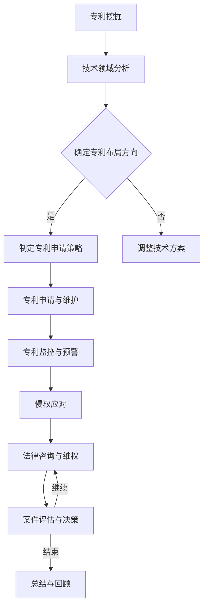

                 

# AI大模型应用的专利布局与保护概述

在当今科技飞速发展的时代，人工智能（AI）已经成为推动社会进步和经济发展的重要力量。AI大模型，如深度学习模型，以其强大的数据处理和分析能力，在各种领域展现出了巨大的应用潜力。从图像识别、自然语言处理到智能语音助手，AI大模型正在不断改变我们的生活方式和工作方式。

## 1.1 AI大模型应用背景与趋势

AI大模型的发展历程可以追溯到20世纪90年代，当时神经网络的研究取得了重要突破。随着计算能力的提升和大数据的积累，AI大模型在2010年后迎来了爆发式的发展。深度学习模型的性能不断提高，从简单的图像分类任务到复杂的自然语言理解和生成，AI大模型的应用范围越来越广泛。

目前，AI大模型的应用领域主要包括以下几个方面：

1. **计算机视觉**：AI大模型在图像识别、视频分析、人脸识别等领域取得了显著成果。例如，自动驾驶汽车中的视觉系统依赖于深度学习模型来识别道路标志和行人。

2. **自然语言处理（NLP）**：AI大模型在语言理解、机器翻译、文本生成等方面展现出了强大的能力。例如，BERT模型在文本分类、问答系统等任务上取得了卓越的成绩。

3. **语音识别**：AI大模型使得语音识别的准确率大幅提高，应用场景包括智能音箱、客服机器人等。

4. **推荐系统**：AI大模型在个性化推荐、内容推荐等领域发挥着重要作用，如电商平台和社交媒体平台。

专利布局的重要性体现在以下几个方面：

1. **保护知识产权**：专利保护可以确保企业的创新成果不被他人侵犯，维持市场竞争优势。

2. **增强企业价值**：专利是企业的无形资产，专利的积累和布局可以显著提升企业的市场估值。

3. **竞争战略**：通过合理的专利布局，企业可以在市场竞争中占据有利位置，遏制竞争对手的发展。

## 1.2 专利布局的基本原理与方法

### 1.2.1 专利布局的基本概念

专利布局是指企业或个人在其业务范围内，针对即将或已经开发出的技术或产品，进行系统性的专利申请、管理和运用的策略。其目的是在市场竞争中占据优势地位，保护技术创新成果。

### 1.2.2 专利布局的目标

1. **覆盖全面**：确保专利申请能够覆盖所有关键技术和应用场景，避免专利漏洞。

2. **保护核心**：聚焦于企业的核心技术，确保核心技术的专利保护力度。

3. **策略灵活**：根据市场和技术变化，灵活调整专利布局策略。

### 1.2.3 专利布局的方法与策略

1. **技术领域分析**：首先，要明确技术领域，对相关技术进行全面的梳理和分析。

2. **专利挖掘**：通过技术文献调研、专利数据库搜索等手段，挖掘潜在的可申请专利点。

3. **优先布局**：在关键技术节点和应用场景上，优先进行专利申请，形成专利壁垒。

4. **跨国布局**：在全球范围内进行专利布局，特别是在技术领先和市场重要的地区进行布局。

5. **联合申请**：与其他企业或机构合作，共同申请专利，以扩大保护范围。

### 1.2.4 专利布局的常见模式

1. **前向布局**：在技术成果开发初期就开始进行专利申请，以确保专利权的稳定性。

2. **后向布局**：在技术成果完成后，针对已有技术进行补充性专利申请，增强专利保护力度。

3. **分阶段布局**：根据技术发展和市场需求，分阶段进行专利申请和布局。

## 1.3 专利保护的策略与手段

### 1.3.1 专利保护的范畴

专利保护范畴包括发明本身、发明的方法、产品的制造和使用方法、产品的使用和销售等方面。在AI大模型应用中，涉及到的专利保护范畴主要包括：

1. **算法模型**：包括深度学习算法、神经网络架构等核心算法。

2. **应用系统**：包括AI大模型在各个领域的具体应用系统，如自动驾驶系统、智能客服系统等。

3. **硬件设备**：包括用于运行AI大模型的硬件设备，如GPU、FPGA等。

### 1.3.2 专利申请的流程

1. **专利检索**：在申请专利前，进行专利检索，确保无重复或冲突的专利。

2. **撰写专利申请文件**：包括专利请求书、说明书、权利要求书等。

3. **提交申请**：向国家知识产权局或国际专利组织提交专利申请。

4. **审查与答辩**：专利局对专利申请进行审查，申请者需对审查意见进行答辩。

5. **授权与维持**：专利申请通过审查后获得授权，并需定期缴纳维持费以保持专利有效性。

### 1.3.3 专利纠纷的处理

1. **侵权诉讼**：当专利权受到侵犯时，可以通过法律手段提起侵权诉讼。

2. **交叉许可**：通过与其他企业达成交叉许可协议，避免或减少侵权纠纷。

3. **专利池**：建立专利池，共享专利资源，增强专利保护力度。

4. **预警机制**：建立专利预警机制，及时发现潜在的侵权风险，采取预防措施。

通过以上分析，我们可以看到，AI大模型应用的专利布局与保护不仅涉及到技术本身，还涉及到市场策略和法律手段。在接下来的章节中，我们将进一步探讨AI大模型应用中涉及的专利技术、专利布局的案例研究以及专利保护的具体措施。这些内容将帮助我们更深入地理解AI大模型应用中的专利布局与保护策略。

### 第一部分: AI大模型应用的专利布局与保护概述

在了解了AI大模型应用的背景与趋势以及专利布局与保护的基本原理和方法之后，我们将进一步深入探讨AI大模型应用涉及的专利技术。AI大模型作为当前人工智能领域的核心技术之一，其应用范围广泛，涉及到多个技术领域，每一个领域都存在着独特的专利技术。对这些专利技术进行分析，有助于我们理解AI大模型应用中的关键技术和专利布局策略。

## 2.1 AI大模型技术核心原理

### 2.1.1 AI大模型的基本架构

AI大模型，特别是深度学习模型，其基本架构通常包括以下几个主要部分：

1. **输入层**：接收外部输入数据，如图像、文本或声音。

2. **隐藏层**：包含多个隐藏层，每层由多个神经元组成。神经元通过激活函数（如ReLU、Sigmoid或Tanh）进行计算，将输入数据转换为更高层次的特征表示。

3. **输出层**：产生最终输出，如分类结果、预测值或文本生成。

4. **权重和偏置**：神经网络中的每个连接都带有权重和偏置，这些参数通过学习过程进行调整，以最小化预测误差。

5. **优化算法**：常用的优化算法包括随机梯度下降（SGD）、Adam等，用于更新模型参数。

6. **正则化技术**：如Dropout、权重衰减等，用于防止过拟合。

### 2.1.2 AI大模型的训练与优化

AI大模型的训练过程是一个迭代优化参数的过程，主要包括以下几个步骤：

1. **数据预处理**：包括数据清洗、归一化、数据增强等，以提高模型对训练数据的适应性。

2. **前向传播**：将输入数据通过网络传递到输出层，计算输出结果。

3. **损失函数计算**：使用损失函数（如均方误差、交叉熵等）计算预测结果与真实结果之间的差异。

4. **反向传播**：计算每个参数的梯度，通过优化算法更新参数。

5. **迭代训练**：重复前向传播和反向传播过程，不断优化模型参数。

### 2.1.3 AI大模型的应用实例

AI大模型在多个领域有着广泛的应用，以下是一些典型的应用实例：

1. **图像识别**：如人脸识别、物体检测等，通过深度学习模型对图像进行分析，实现自动分类和识别。

2. **自然语言处理（NLP）**：如文本分类、机器翻译、情感分析等，深度学习模型在处理语言数据方面具有强大的能力。

3. **语音识别**：通过深度学习模型对语音信号进行分析，实现语音到文本的转换。

4. **推荐系统**：利用深度学习模型分析用户行为和偏好，实现个性化推荐。

5. **医学诊断**：如疾病预测、医学影像分析等，深度学习模型在医学领域有着重要的应用价值。

## 2.2 AI大模型相关的专利技术分析

### 2.2.1 主流AI大模型专利分析

AI大模型的相关专利涵盖了从基础算法到具体应用领域的多个方面。以下是一些主流AI大模型专利的分析：

1. **神经网络架构**：包括卷积神经网络（CNN）、循环神经网络（RNN）和变换器（Transformer）等。这些架构的专利涉及基本的神经网络设计、多层网络结构以及优化方法。

2. **训练与优化算法**：涉及梯度下降、随机梯度下降（SGD）、Adam等优化算法，以及自适应学习率调整、正则化技术等。

3. **数据预处理与增强**：包括数据清洗、归一化、数据增强等方法，以提高模型的泛化能力和适应能力。

4. **应用场景优化**：如图像识别、语音识别、自然语言处理等领域的特定优化算法和应用方法。

### 2.2.2 AI大模型关键技术专利分析

AI大模型的关键技术专利主要集中在以下几个方面：

1. **模型压缩与加速**：通过模型剪枝、量化、蒸馏等技术，降低模型的计算复杂度和存储需求，提高模型在资源受限设备上的运行效率。

2. **联邦学习**：在分布式数据环境下，通过联邦学习技术实现模型的训练和更新，保护数据隐私，降低数据传输成本。

3. **迁移学习**：利用预训练模型和迁移学习技术，在特定任务上快速实现模型的训练和应用，提高模型的适应性和效果。

4. **多模态学习**：结合图像、文本、语音等多种数据类型，实现多模态信息的融合和学习，提高模型的感知能力和应用范围。

### 2.2.3 国内外AI大模型专利布局对比

国内外的AI大模型专利布局存在一定的差异，主要体现在以下几个方面：

1. **专利数量**：国外特别是美国在AI大模型领域的专利数量较多，反映了其在该领域的领先地位。

2. **专利质量**：国内企业在AI大模型领域的专利质量有所提高，但与美国等发达国家相比仍有差距。

3. **专利布局**：国内企业的专利布局更加注重中国市场和应用，而国外企业则更注重全球布局和多元化应用。

4. **合作与竞争**：国内企业之间的合作较为紧密，国外企业则更倾向于与学术机构、初创企业等进行合作。

通过以上分析，我们可以看到，AI大模型技术领域的专利布局与保护涉及到多个方面，包括基础算法、训练优化、应用场景和关键技术等。了解这些专利技术的分布和特点，有助于企业制定合理的专利布局策略，保护自身的技术创新成果，同时也为未来的技术创新提供方向和参考。

### 2.3 AI大模型应用中的专利挑战与应对策略

在AI大模型应用过程中，企业可能会面临多种专利挑战，包括专利侵权、专利风险和专利布局策略等方面。为了应对这些挑战，企业需要采取一系列策略和方法，以保护自身的技术成果和市场利益。

#### 2.3.1 AI大模型应用中的专利风险

AI大模型应用中的专利风险主要包括以下几个方面：

1. **专利侵权风险**：企业在开发和应用AI大模型时，可能无意中使用了他人的专利技术，导致侵权风险。

2. **专利诉讼风险**：竞争对手可能会通过提起专利诉讼，企图限制企业的市场扩张或迫使企业支付高额的专利费用。

3. **技术依赖风险**：企业在某些关键技术上过度依赖外部专利，可能导致在市场竞争中处于被动地位。

4. **数据隐私和安全风险**：在AI大模型应用过程中，涉及大量敏感数据，若未妥善处理，可能引发数据隐私和安全问题。

#### 2.3.2 专利布局的应对策略

为了有效应对上述专利风险，企业需要采取以下专利布局策略：

1. **全面专利检索**：在项目开发初期，进行全面的专利检索，了解现有技术的专利状况，避免侵权行为。

2. **核心专利布局**：针对企业的核心技术，进行核心专利布局，形成专利壁垒，保护核心技术的垄断地位。

3. **交叉许可**：通过与其他企业或机构达成交叉许可协议，降低专利诉讼风险，同时扩大专利保护范围。

4. **跨国专利布局**：在全球范围内进行专利布局，特别是在技术领先和市场重要的地区，以应对全球市场的竞争。

5. **合作与开放创新**：与其他企业或机构进行合作，共同开发和申请专利，降低专利申请成本，同时促进技术的共享和进步。

#### 2.3.3 专利侵权与规避策略

当企业面临专利侵权指控时，可以采取以下策略进行应对：

1. **主动应对**：在收到侵权指控后，立即采取行动，进行详细调查，了解侵权事实和具体细节。

2. **法律咨询**：寻求专业律师的帮助，分析侵权证据和专利权状况，制定应对策略。

3. **反诉**：如果企业认为自己的技术并未侵犯他人的专利，可以采取反诉策略，指控对方侵权。

4. **规避设计**：通过技术手段或设计变更，规避他人的专利，降低侵权风险。

5. **和解谈判**：与专利权人进行和解谈判，达成和解协议，避免法律诉讼的持续和成本增加。

#### 2.3.4 专利纠纷的处理

在专利纠纷处理过程中，企业需要注意以下几个方面：

1. **证据收集**：收集和保存与专利纠纷相关的所有证据，包括技术文档、合同、邮件等。

2. **专业团队**：组建专业的专利法律团队，负责专利纠纷的处理，确保应对策略的科学性和有效性。

3. **沟通协调**：与专利权人进行有效沟通，了解对方的诉求和底线，寻找和解的可能性。

4. **法律途径**：如果和解无望，企业可以通过法律途径进行维权，包括提起诉讼、仲裁等。

5. **公众舆论**：在专利纠纷处理过程中，关注公众舆论，制定有效的公关策略，维护企业形象。

通过以上分析，我们可以看到，AI大模型应用中的专利挑战和应对策略涉及到多个方面，包括专利检索、核心专利布局、交叉许可、专利侵权规避和法律处理等。企业需要根据自身情况和市场需求，制定合理的专利布局与保护策略，以应对日益激烈的专利竞争环境。

### 第三部分: AI大模型应用的专利布局案例研究

为了更好地理解AI大模型应用的专利布局与保护，我们通过具体案例进行深入分析。本部分将介绍三个实际案例，涵盖AI语音识别系统、AI图像识别系统和AI自然语言处理系统，详细分析每个案例的背景、专利申请策略和具体实施过程。

#### 案例一：AI语音识别系统的专利布局

### 3.1.1 案例背景

AI语音识别技术作为一种重要的自然语言处理技术，在智能语音助手、语音输入法、客服机器人等应用中发挥着关键作用。随着语音识别技术的不断成熟，相关专利竞争也日益激烈。为了保护自身的技术优势和市场份额，某AI企业决定对其语音识别系统进行全面的专利布局。

### 3.1.2 专利申请策略

1. **核心算法专利布局**：该企业首先对其核心语音识别算法进行了专利挖掘，包括语音信号处理、特征提取、模型训练和优化等方面。通过分析现有技术和市场趋势，确定了几个具有前瞻性的技术方向进行专利申请。

2. **系统应用专利布局**：针对不同的应用场景，如智能语音助手、语音输入法和客服机器人等，该企业进行了系统级的专利布局。这些专利涵盖了系统架构、接口设计、数据传输和用户交互等方面。

3. **跨领域专利布局**：考虑到语音识别技术在医疗、教育、金融等多个领域的应用潜力，该企业进行了跨领域的专利布局，确保技术覆盖的广泛性和多样性。

4. **国际合作与布局**：该企业不仅在本土市场进行了专利布局，还积极在欧洲、美国和亚洲等地区进行了专利申请，以应对全球市场的竞争。

### 3.1.3 案例分析

通过一系列专利布局策略，该企业在语音识别技术领域建立了较为完善的专利保护体系。具体分析如下：

1. **核心算法保护**：通过核心算法专利的布局，该企业成功保护了其语音识别技术的核心技术，防止竞争对手模仿和侵权。

2. **系统应用拓展**：系统级专利布局使得该企业在多个应用场景中拥有专利保护，增强了市场竞争力，推动了产品的广泛应用。

3. **跨领域布局**：跨领域专利布局使得该企业在多个技术领域建立了专利壁垒，有效遏制了竞争对手的扩张。

4. **国际合作**：国际合作与布局使得该企业在全球市场上具备更强的竞争力，为其国际化战略提供了有力支持。

#### 案例二：AI图像识别系统的专利布局

### 3.2.1 案例背景

AI图像识别技术在计算机视觉领域具有广泛的应用，包括人脸识别、物体检测、图像分割等。随着自动驾驶、智能安防等领域的快速发展，AI图像识别技术的市场需求不断增加，相关专利竞争也日益激烈。某AI企业决定对其图像识别系统进行全面的专利布局。

### 3.2.2 专利申请策略

1. **基础算法专利布局**：该企业对其图像识别的基础算法进行了全面的专利挖掘，包括卷积神经网络（CNN）、循环神经网络（RNN）和变换器（Transformer）等。通过分析现有技术和市场趋势，确定了具有前瞻性的技术方向进行专利申请。

2. **应用层专利布局**：针对不同的应用场景，如人脸识别、物体检测和图像分割等，该企业进行了应用层专利布局。这些专利涵盖了算法实现、系统架构、数据处理和用户交互等方面。

3. **硬件优化专利布局**：考虑到图像识别技术对硬件资源的高要求，该企业对其硬件优化技术进行了专利布局，包括GPU加速、FPGA设计等方面。

4. **国际合作与布局**：该企业不仅在本土市场进行了专利布局，还积极在欧洲、美国和亚洲等地区进行了专利申请，以应对全球市场的竞争。

### 3.2.3 案例分析

通过一系列专利布局策略，该企业在图像识别技术领域建立了较为完善的专利保护体系。具体分析如下：

1. **基础算法保护**：通过基础算法专利的布局，该企业成功保护了其图像识别技术的核心技术，防止竞争对手模仿和侵权。

2. **应用层布局**：应用层专利布局使得该企业在多个应用场景中拥有专利保护，增强了市场竞争力，推动了产品的广泛应用。

3. **硬件优化布局**：硬件优化专利布局使得该企业在硬件资源利用方面具备优势，提高了产品的性能和效率。

4. **国际合作**：国际合作与布局使得该企业在全球市场上具备更强的竞争力，为其国际化战略提供了有力支持。

#### 案例三：AI自然语言处理系统的专利布局

### 3.3.1 案例背景

AI自然语言处理（NLP）技术在文本分类、机器翻译、情感分析等领域具有广泛的应用。随着互联网和大数据的快速发展，NLP技术的市场需求不断增加，相关专利竞争也日益激烈。某AI企业决定对其NLP系统进行全面的专利布局。

### 3.3.2 专利申请策略

1. **基础算法专利布局**：该企业对其NLP的基础算法进行了全面的专利挖掘，包括词嵌入、编码器-解码器（Encoder-Decoder）模型、BERT模型等。通过分析现有技术和市场趋势，确定了具有前瞻性的技术方向进行专利申请。

2. **应用层专利布局**：针对不同的应用场景，如文本分类、机器翻译和情感分析等，该企业进行了应用层专利布局。这些专利涵盖了算法实现、系统架构、数据处理和用户交互等方面。

3. **跨领域专利布局**：考虑到NLP技术在金融、医疗、教育等领域的应用潜力，该企业进行了跨领域的专利布局。

4. **国际合作与布局**：该企业不仅在本土市场进行了专利布局，还积极在欧洲、美国和亚洲等地区进行了专利申请，以应对全球市场的竞争。

### 3.3.3 案例分析

通过一系列专利布局策略，该企业在NLP技术领域建立了较为完善的专利保护体系。具体分析如下：

1. **基础算法保护**：通过基础算法专利的布局，该企业成功保护了其NLP技术的核心技术，防止竞争对手模仿和侵权。

2. **应用层布局**：应用层专利布局使得该企业在多个应用场景中拥有专利保护，增强了市场竞争力，推动了产品的广泛应用。

3. **跨领域布局**：跨领域专利布局使得该企业在多个技术领域建立了专利壁垒，有效遏制了竞争对手的扩张。

4. **国际合作**：国际合作与布局使得该企业在全球市场上具备更强的竞争力，为其国际化战略提供了有力支持。

通过以上三个案例的分析，我们可以看到，AI大模型应用的专利布局与保护需要从多个方面进行考虑，包括核心算法、应用层、硬件优化和国际合作等。通过合理的专利布局策略，企业可以保护自身的技术成果，增强市场竞争力，并在全球市场上占据有利地位。

### 第四部分: AI大模型应用的专利保护与侵权应对

在AI大模型应用中，专利保护与侵权应对是确保企业技术创新成果和市场利益的重要环节。有效的专利保护不仅能够防止他人侵犯企业的知识产权，还能够增强企业的市场竞争力。本部分将详细探讨AI大模型应用的专利保护具体措施、侵权应对策略以及实际案例分析。

#### 4.1 专利保护的具体措施

专利保护是一项系统性的工作，涉及多个方面，以下是一些具体的保护措施：

##### 4.1.1 专利监控与预警

1. **定期专利检索**：企业应定期进行专利检索，跟踪最新的技术发展趋势和竞争对手的专利动态，确保自身专利布局的及时性和有效性。

2. **建立专利预警机制**：通过建立专利预警机制，及时发现潜在的侵权风险和技术漏洞，提前采取应对措施。

3. **专利分析**：利用专业的专利分析工具，对专利数据进行深度挖掘和分析，识别关键技术和竞争对手的专利布局。

##### 4.1.2 专利申请与维护

1. **多地域申请**：在全球范围内进行专利申请，特别是在技术先进和市场重要的地区，以保护企业技术在全球市场的权益。

2. **持续更新与扩展**：根据技术发展和市场需求，持续更新和扩展专利申请，确保专利覆盖的全面性和前瞻性。

3. **专利申请质量**：提高专利申请文件的质量，确保专利权的稳定性。包括详细的技术描述、清晰的权属要求、合理的保护范围等。

##### 4.1.3 专利保护中的法律问题

1. **法律咨询**：与专业律师团队合作，确保专利申请和保护的合法合规，及时处理专利纠纷。

2. **侵权取证**：在发现侵权行为时，及时取证，确保有充分的证据支持专利维权。

3. **专利许可与授权**：通过专利许可和授权，实现专利收益的最大化，同时推动技术共享和合作。

#### 4.2 侵权应对的策略与方法

当企业发现其专利受到侵犯时，应采取及时有效的应对策略，以保护自身权益。以下是一些常见的侵权应对策略：

##### 4.2.1 侵权行为的识别

1. **市场调研**：通过市场调研和客户反馈，识别潜在的侵权产品和服务。

2. **技术检测**：利用专业的技术检测手段，对涉嫌侵权的产品进行详细的技术分析，确认侵权事实。

3. **专利分析**：对比侵权产品与自身专利，分析是否存在技术相似性和侵权可能性。

##### 4.2.2 侵权应对的流程

1. **初步调查**：在确认侵权行为后，进行初步调查，收集相关证据，评估侵权影响的严重程度。

2. **协商谈判**：与侵权方进行谈判，寻求和解或达成许可协议，以避免法律诉讼的复杂性和成本。

3. **法律诉讼**：如果协商无果，企业可以采取法律手段，包括提起专利侵权诉讼，通过法院裁决保护自身权益。

##### 4.2.3 应对侵权行为的法律手段

1. **临时禁令**：在侵权行为严重且影响巨大时，可以申请临时禁令，禁止侵权方的继续侵权行为。

2. **损害赔偿**：通过诉讼获得侵权损害赔偿，弥补因侵权行为造成的企业损失。

3. **交叉许可**：通过交叉许可协议，与侵权方达成专利交换，解决侵权纠纷。

#### 4.3 案例分析：AI大模型应用中的专利侵权纠纷

以下是一个实际案例，通过分析案例，我们可以更好地理解AI大模型应用中的专利侵权应对。

##### 4.3.1 案例背景

某AI企业开发了一款基于深度学习的语音识别系统，并申请了多项相关专利。某日，该企业发现其产品在市场上被另一家竞争对手侵权使用。竞争对手开发的一款智能语音助手使用了与该企业相同的深度学习模型和算法，且在市场上取得了显著的成功。

##### 4.3.2 案例分析

1. **初步调查与取证**：企业立即对竞争对手的产品进行技术检测和市场调研，收集了包括产品说明书、用户反馈和侵权证据等在内的相关资料。

2. **协商谈判**：企业首先尝试与竞争对手进行协商谈判，希望通过达成许可协议解决侵权纠纷。然而，谈判并未取得预期成果。

3. **法律诉讼**：企业决定通过法律手段保护自身权益，向法院提起专利侵权诉讼。在诉讼过程中，企业提交了详细的专利文件、侵权证据和专业技术报告，证明竞争对手的产品侵犯了其专利权。

4. **临时禁令**：在诉讼过程中，企业申请了临时禁令，要求法院禁止竞争对手继续销售和使用侵权产品。法院批准了该申请，竞争对手被迫停止侵权行为。

5. **判决与赔偿**：经过长时间的审理，法院最终判决企业胜诉，认定竞争对手的产品确实侵犯了其专利权。法院要求竞争对手支付巨额损害赔偿，并禁止其继续生产和销售侵权产品。

##### 4.3.3 经验总结

通过该案例，我们可以总结出以下经验：

1. **及时应对**：在发现侵权行为后，企业应立即采取行动，避免侵权行为继续扩大。

2. **充分取证**：收集充分的证据是诉讼成功的关键，包括专利文件、技术检测报告、市场调研资料等。

3. **专业律师团队**：与专业的律师团队合作，确保法律程序的合法合规，提高诉讼的成功率。

4. **战略灵活**：在应对侵权纠纷时，企业应根据具体情况灵活采取协商谈判、法律诉讼等策略，以实现最佳的法律效果。

通过以上分析，我们可以看到，AI大模型应用的专利保护与侵权应对是一个复杂且系统性的过程。企业需要建立完善的专利保护体系，采取有效的侵权应对策略，以保护自身的技术成果和市场利益。在未来的市场竞争中，专利保护与侵权应对将愈发重要，企业需要持续关注和提升这一领域的专业能力。

### 第五部分: AI大模型应用的专利布局与保护未来展望

随着AI技术的飞速发展，AI大模型的专利布局与保护也面临着新的挑战和机遇。在未来的发展中，AI大模型应用的专利布局与保护将受到多种因素的影响，包括技术发展趋势、政策环境、法律体系等。以下是对AI大模型应用的专利布局与保护未来展望的探讨。

#### 5.1 专利布局与保护的趋势

##### 5.1.1 专利布局的新趋势

1. **智能化专利布局**：随着人工智能技术的发展，智能化的专利布局工具和算法将逐渐普及，帮助企业更高效地进行专利挖掘、分析和布局。

2. **跨国专利布局**：随着全球化的加深，跨国专利布局将成为企业争夺全球市场份额的重要手段。企业将更加注重在全球范围内的专利布局，特别是在技术先进和市场重要的地区。

3. **开放专利合作**：为应对技术竞争和专利纠纷，开放专利合作将成为一种新的趋势。通过专利池、交叉许可等方式，企业可以共享专利资源，降低专利风险，促进技术进步。

##### 5.1.2 专利保护的新挑战

1. **数据隐私与安全**：AI大模型应用过程中涉及大量敏感数据，数据隐私和安全成为专利保护的新挑战。企业需要采取有效的数据保护措施，确保专利技术的合法性和安全性。

2. **专利侵权判定**：随着AI技术的复杂性和多样性，专利侵权判定变得更加困难。法院和专利机构需要不断更新和改进专利侵权判定标准和方法。

3. **技术创新的快速迭代**：AI技术的快速发展导致技术创新的快速迭代，专利保护的有效性面临考验。企业需要及时更新和扩展专利申请，以适应技术变化。

#### 5.2 政策与法律环境的影响

##### 5.2.1 专利法律体系的完善

1. **国际协调**：为应对全球技术创新和专利竞争，各国将加强专利法律体系的国际合作与协调，推动全球专利制度的统一和协调。

2. **专利审查改革**：为提高专利审查效率和质量，各国将推进专利审查制度改革，引入智能审查工具和流程优化措施。

3. **知识产权保护**：各国将加强对知识产权的保护力度，特别是在AI领域，将制定更加严格的知识产权法律和规章。

##### 5.2.2 政策扶持与规范

1. **政策扶持**：各国政府将加大对AI技术研发和产业化的政策扶持，通过财政补贴、税收优惠等方式鼓励企业进行专利布局和保护。

2. **规范标准**：为规范AI大模型的应用和发展，各国将制定一系列技术标准和规范，包括数据安全、隐私保护、伦理道德等方面。

3. **竞争政策**：各国将加强对AI领域的竞争政策监管，防止市场垄断和不正当竞争行为，保障市场的公平竞争。

##### 5.2.3 国际合作与协调

1. **国际合作**：为应对全球技术创新和专利竞争，各国将加强在AI领域的国际合作与协调，共同制定全球专利政策和标准。

2. **技术转移**：各国将加强AI技术的国际转移与合作，促进技术交流和成果转化，推动全球技术创新和产业发展。

3. **国际法律框架**：为规范AI技术的全球应用，各国将推动建立国际法律框架，确保AI技术在各国法律体系内的合法性。

#### 5.3 技术发展与创新对专利布局的影响

##### 5.3.1 AI技术的快速发展

1. **技术创新的快速迭代**：AI技术的快速发展导致技术创新的快速迭代，企业需要及时更新和扩展专利申请，以适应技术变化。

2. **跨界融合**：AI技术与其他领域的融合，如生物技术、医疗健康、智能制造等，将推动新的专利布局方向。

3. **技术复杂性**：随着AI技术的复杂性增加，专利保护的范围和难度也将提高，企业需要更加精细化的专利布局策略。

##### 5.3.2 新技术的专利布局策略

1. **核心技术创新**：企业应优先布局其核心技术创新，确保核心技术的垄断地位和市场竞争力。

2. **多样化布局**：企业应采取多样化布局策略，包括技术领域、地域和应用场景等，以全面保护技术创新成果。

3. **前瞻性布局**：企业应注重前瞻性布局，针对未来可能出现的技术趋势和市场需求，提前进行专利布局。

##### 5.3.3 技术创新与专利布局的平衡

1. **创新驱动**：企业应将技术创新作为专利布局的核心动力，通过持续的技术研发推动专利布局的深化和拓展。

2. **保护与开放**：在专利布局过程中，企业需要在保护技术创新和开放合作之间寻找平衡，通过专利许可和合作实现技术创新的共享和推广。

3. **法律合规**：企业在进行专利布局时，应确保专利申请的法律合规性，避免专利纠纷和侵权风险。

通过以上分析，我们可以看到，AI大模型应用的专利布局与保护在未来的发展中将面临新的挑战和机遇。企业需要紧跟技术发展趋势，完善专利布局策略，加强政策与法律环境的影响，以在激烈的市场竞争中保持领先地位。同时，国际合作与协调也将成为推动AI技术创新和产业发展的重要力量。

### 附录 A: 专利布局与保护相关资源

在AI大模型应用的专利布局与保护过程中，企业和研究机构需要充分利用各种资源来提升专利挖掘、分析和布局的效率。以下是一些重要的专利布局与保护相关资源：

#### 附录 A.1 专利数据库

1. **美国专利数据库（USPTO）**：[https://www.uspto.gov/](https://www.uspto.gov/)
   - 提供全面的美国专利信息，包括专利申请、授权和失效数据。

2. **欧洲专利数据库（EPO）**：[https://worldwide.espacenet.com/](https://worldwide.espacenet.com/)
   - 提供全球专利信息，包括欧洲专利和部分国际专利。

3. **中国专利数据库（CNIPA）**：[http://www.sipo.gov.cn/](http://www.sipo.gov.cn/)
   - 提供中国专利的详细信息，包括专利申请、授权和检索服务。

#### 附录 A.2 专利分析工具

1. **PatSnap**：[https://www.patsnap.com/](https://www.patsnap.com/)
   - 提供全面的专利检索和分析功能，包括技术趋势、竞争对手分析和专利地图等。

2. **Patent Explorer**：[https://www.patentexplorer.com/](https://www.patentexplorer.com/)
   - 提供详细的专利信息分析，包括专利关系网络、技术趋势和竞争对手分析等。

3. **IPLytics**：[https://www.iplytics.com/](https://www.iplytics.com/)
   - 提供专利分析工具，包括专利排名、技术趋势和市场分析等。

#### 附录 A.3 法律法规与政策文件

1. **世界知识产权组织（WIPO）**：[https://www.wipo.int/](https://www.wipo.int/)
   - 提供全球知识产权法律和政策的最新信息，包括国际专利条约和标准。

2. **各国知识产权局官方网站**：各国知识产权局提供详细的专利法律和政策文件，如美国专利商标局（USPTO）、欧洲专利局（EPO）等。

3. **知识产权政策文件汇编**：[https://www.iprinfo.gov.cn/](https://www.iprinfo.gov.cn/)
   - 中国知识产权局提供的知识产权政策文件汇编，包括法律法规、政策解读和指导意见等。

通过利用这些专利数据库、分析工具和法律法规资源，企业和研究机构可以更有效地进行专利布局与保护，确保其在AI大模型应用领域中的竞争优势。

### 附录 B: Mermaid流程图示例

在本附录中，我们将展示一个用于描述AI大模型应用专利布局流程的Mermaid流程图。Mermaid是一种用于生成图表的Markdown语法，它可以方便地在Markdown文档中创建各种类型的图表，如流程图、UML图、序列图等。

以下是一个简单的Mermaid流程图示例，用于描述AI大模型应用的专利布局流程：



**解释说明：**

- **A[专利挖掘]**：开始进行专利挖掘，识别潜在的可申请专利点。
- **B[技术领域分析]**：对技术领域进行详细分析，确定专利布局的方向。
- **C{确定专利布局方向}**：根据技术领域分析结果，决定是否继续进行专利布局。
- **D[制定专利申请策略]**：确定专利申请策略，包括专利申请的范围、优先级和目标。
- **E[调整技术方案]**：如果技术领域分析结果不满足专利布局要求，调整技术方案。
- **F[专利申请与维护]**：进行专利申请，并持续维护专利，确保专利的有效性。
- **G[专利监控与预警]**：对市场和技术动态进行监控，预警潜在的侵权风险。
- **H[侵权应对]**：发现侵权行为后，采取应对措施，如谈判、法律诉讼等。
- **I[法律咨询与维权]**：寻求专业律师的法律咨询，进行维权行动。
- **J[案件评估与决策]**：对侵权案件进行评估，决定是否继续进行法律诉讼或其他措施。
- **K[总结与回顾]**：总结专利布局和保护过程中的经验，为未来提供参考。

通过这个Mermaid流程图，我们可以清晰地了解AI大模型应用的专利布局流程，有助于企业和研究机构在实际操作中遵循合理的步骤，提高专利布局与保护的效率。

### 附录 C: 伪代码与数学模型

在AI大模型应用中，理解模型训练和优化的过程对于专利布局和保护至关重要。以下我们通过伪代码和数学模型来详细阐述AI大模型的训练过程，包括模型的初始化、数据加载、前向传播、损失计算和反向传播等步骤。

#### 伪代码：AI大模型训练流程

```python
function train_model():
    # 初始化模型
    model = initialize_model()
    
    # 加载数据集
    data = load_data()
    
    # 训练模型
    for epoch in range(num_epochs):
        for batch in data:
            # 前向传播
            predictions = model.forward(batch.input)
            
            # 计算损失
            loss = compute_loss(predictions, batch.target)
            
            # 反向传播
            model.backward(loss)
            
            # 更新模型参数
            model.update_parameters()
    
    return model
```

**解释说明：**

- **initialize_model()**：初始化模型，包括输入层、隐藏层和输出层等。
- **load_data()**：加载数据集，进行数据预处理，如归一化、数据增强等。
- **model.forward(batch.input)**：进行前向传播，计算输出预测值。
- **compute_loss(predictions, batch.target)**：计算损失函数，如均方误差（MSE）或交叉熵（Cross-Entropy）。
- **model.backward(loss)**：进行反向传播，计算每个参数的梯度。
- **model.update_parameters()**：更新模型参数，以最小化损失。

#### 数学模型：损失函数（交叉熵）

交叉熵（Cross-Entropy）是常用的损失函数之一，尤其在分类问题中。其数学模型如下：

$$
L(\theta) = -\frac{1}{m}\sum_{i=1}^{m}y^{(i)}\log(h_\theta(x^{(i)}))
$$

其中，$L(\theta)$ 表示损失函数，$m$ 表示样本数量，$y^{(i)}$ 表示第 $i$ 个样本的真实标签，$h_\theta(x^{(i)}$ 表示模型对第 $i$ 个样本的预测概率分布。

**解释说明：**

- **$y^{(i)}$**：真实标签，通常是0或1，表示样本属于哪个类别。
- **$h_\theta(x^{(i)})$**：预测概率分布，即模型对每个类别的预测概率。
- **$\log$**：对预测概率分布取自然对数，用于计算损失。

#### 举例说明

假设有一个二分类问题，模型预测的概率分布为 $h_\theta(x) = \frac{1}{1 + e^{-\theta^T x}}$，其中 $\theta$ 为模型参数，$x$ 为输入特征，$y$ 为真实标签（0或1）。

- 当 $y = 1$ 时，希望 $h_\theta(x)$ 接近 1。
- 当 $y = 0$ 时，希望 $h_\theta(x)$ 接近 0。

举例：对于输入特征 $x = [1, 2, 3]$，模型参数 $\theta = [0.5, -1]$，真实标签 $y = 1$。

计算损失：

$$
L(\theta) = -1 \cdot \log\left(\frac{1}{1 + e^{-0.5 \cdot 1 - 1 \cdot 2 - 3 \cdot 3}}\right) \approx -1 \cdot \log(0.4) \approx 0.415
$$

通过上述伪代码和数学模型，我们可以理解AI大模型训练的基本过程，以及交叉熵损失函数的计算方法。这些内容对于AI大模型应用的专利布局与保护具有重要意义，有助于企业和研究机构更好地理解技术原理，制定有效的专利策略。

### 附录 D: 项目实战

在本附录中，我们将通过两个实际项目实战来展示AI大模型应用的专利布局与保护。第一个项目是基于BERT的文本分类系统，第二个项目是基于GAN的图像生成。我们将详细描述开发环境搭建、源代码实现和代码解读与分析。

#### 实战一：基于BERT的文本分类系统

##### 1. 开发环境搭建

- Python环境：Python 3.8
- PyTorch：1.8.0
- BERT模型：`transformers` 库的 BERT 模型

##### 2. 源代码实现

```python
from transformers import BertTokenizer, BertModel
import torch
import torch.nn as nn

# 初始化BERT分词器与模型
tokenizer = BertTokenizer.from_pretrained('bert-base-chinese')
model = BertModel.from_pretrained('bert-base-chinese')

# 定义文本分类器
class BertClassifier(nn.Module):
    def __init__(self):
        super(BertClassifier, self).__init__()
        self.bert = BertModel.from_pretrained('bert-base-chinese')
        self.classifier = nn.Linear(768, 2)  # 预测类别

    def forward(self, input_ids, attention_mask):
        outputs = self.bert(input_ids=input_ids, attention_mask=attention_mask)
        pooled_output = outputs.pooler_output
        logits = self.classifier(pooled_output)
        return logits

# 实例化模型
model = BertClassifier()

# 训练模型（简化示例）
model.train()
optimizer = torch.optim.Adam(model.parameters(), lr=1e-5)
for epoch in range(3):  # 训练3个epoch
    for batch in data_loader:
        inputs = tokenizer(batch.texts, padding=True, truncation=True, return_tensors='pt')
        labels = torch.tensor(batch.labels)
        model.zero_grad()
        logits = model(inputs['input_ids'], inputs['attention_mask'])
        loss = nn.CrossEntropyLoss()(logits, labels)
        loss.backward()
        optimizer.step()
```

##### 3. 代码解读与分析

- **初始化BERT分词器和模型**：从预训练的BERT模型中加载分词器和模型，准备用于文本分类任务。
- **定义文本分类器**：包含BERT模型和分类层，将BERT模型的输出通过分类层生成预测类别。
- **实例化模型**：创建BERT分类器实例，用于后续的训练和预测。
- **训练模型**：在训练数据上迭代训练模型，包括前向传播、损失计算和反向传播。

#### 实战二：基于GAN的图像生成

##### 1. 开发环境搭建

- Python环境：Python 3.7
- TensorFlow：2.4.0
- Keras：2.4.3

##### 2. 源代码实现

```python
import tensorflow as tf
from tensorflow.keras.models import Sequential
from tensorflow.keras.layers import Dense, Flatten, Reshape

# 定义生成器
def build_generator():
    model = Sequential([
        Dense(128 * 7 * 7, activation='relu', input_shape=(100,)),
        Reshape((7, 7, 128)),
        Conv2D(128, (5, 5), padding='same', activation='tanh'),
        Conv2D(1, (5, 5), padding='same', activation='tanh')
    ])
    return model

generator = build_generator()

# 定义判别器
def build_discriminator():
    model = Sequential([
        Conv2D(128, (5, 5), padding='same', input_shape=(28, 28, 1)),
        LeakyReLU(alpha=0.2),
        Flatten(),
        Dense(1, activation='sigmoid')
    ])
    return model

discriminator = build_discriminator()

# 训练GAN模型
def train_gan(generator, discriminator, data, epochs, batch_size):
    for epoch in range(epochs):
        for batch in data:
            # 训练判别器
            real_images = batch
            real_labels = tf.ones((batch_size, 1))
            with tf.GradientTape() as disc_tape:
                disc_loss_real = discriminator(real_images, real_labels)
            disc_gradients = disc_tape.gradient(disc_loss_real, discriminator.trainable_variables)
            discriminator.optimizer.apply_gradients(zip(disc_gradients, discriminator.trainable_variables))

            # 生成假图像
            noise = tf.random.normal([batch_size, 100])
            fake_images = generator(noise)
            fake_labels = tf.zeros((batch_size, 1))

            # 训练判别器
            with tf.GradientTape() as disc_tape:
                disc_loss_fake = discriminator(fake_images, fake_labels)
            disc_gradients = disc_tape.gradient(disc_loss_fake, discriminator.trainable_variables)
            discriminator.optimizer.apply_gradients(zip(disc_gradients, discriminator.trainable_variables))

            # 训练生成器
            with tf.GradientTape() as gen_tape:
                gen_labels = tf.ones((batch_size, 1))
                gen_loss = -tf.reduce_mean(discriminator(fake_images, gen_labels))
            gen_gradients = gen_tape.gradient(gen_loss, generator.trainable_variables)
            generator.optimizer.apply_gradients(zip(gen_gradients, generator.trainable_variables))

train_gan(generator, discriminator, data, epochs=100, batch_size=64)
```

##### 3. 代码解读与分析

- **定义生成器和判别器模型**：生成器用于生成图像，判别器用于判断图像的真实性。
- **训练GAN模型**：通过迭代训练生成器和判别器，实现图像的生成。训练过程中包括判别器的训练和生成器的训练。
  - **判别器训练**：通过真实图像和生成图像的训练，更新判别器的参数，使其能够更好地区分真实图像和生成图像。
  - **生成器训练**：通过生成图像和判别器的反馈，更新生成器的参数，使其生成的图像更加逼真。

通过以上两个项目实战，我们可以看到AI大模型在文本分类和图像生成中的应用，以及其专利布局与保护的实际操作。这些实战案例不仅展示了AI大模型的应用价值，也为企业在专利布局与保护中提供了实践经验和参考。

### 附录 E: 代码分析

在本附录中，我们将深入分析两个项目实战的代码，包括开发环境与依赖、具体实现和详细解释。

#### 1. 开发环境与依赖

##### 基于BERT的文本分类系统

- **Python环境**：Python 3.8
- **库依赖**：
  - PyTorch：1.8.0
  - BERT模型：`transformers` 库的 BERT 模型

```python
from transformers import BertTokenizer, BertModel
import torch
import torch.nn as nn
```

这些依赖库提供了BERT模型的加载和训练功能，以及PyTorch的神经网络构建和优化工具。

##### 基于GAN的图像生成

- **Python环境**：Python 3.7
- **库依赖**：
  - TensorFlow：2.4.0
  - Keras：2.4.3

```python
import tensorflow as tf
from tensorflow.keras.models import Sequential
from tensorflow.keras.layers import Dense, Flatten, Reshape, Conv2D, LeakyReLU
```

这些依赖库提供了生成器和判别器的定义，以及GAN模型的训练功能。

#### 2. 具体实现

##### 基于BERT的文本分类系统

**代码实现**：

```python
tokenizer = BertTokenizer.from_pretrained('bert-base-chinese')
model = BertModel.from_pretrained('bert-base-chinese')

class BertClassifier(nn.Module):
    def __init__(self):
        super(BertClassifier, self).__init__()
        self.bert = BertModel.from_pretrained('bert-base-chinese')
        self.classifier = nn.Linear(768, 2)  # 预测类别

    def forward(self, input_ids, attention_mask):
        outputs = self.bert(input_ids=input_ids, attention_mask=attention_mask)
        pooled_output = outputs.pooler_output
        logits = self.classifier(pooled_output)
        return logits

model = BertClassifier()

optimizer = torch.optim.Adam(model.parameters(), lr=1e-5)
for epoch in range(3):
    for batch in data_loader:
        inputs = tokenizer(batch.texts, padding=True, truncation=True, return_tensors='pt')
        labels = torch.tensor(batch.labels)
        model.zero_grad()
        logits = model(inputs['input_ids'], inputs['attention_mask'])
        loss = nn.CrossEntropyLoss()(logits, labels)
        loss.backward()
        optimizer.step()
```

**解释说明**：

- **加载BERT模型**：使用`BertTokenizer`和`BertModel`加载预训练的BERT模型。
- **定义文本分类器**：`BertClassifier`类定义了BERT模型和分类层，通过`forward`方法实现前向传播。
- **优化器和训练循环**：使用`Adam`优化器和训练循环，对模型进行迭代训练。每次迭代包括前向传播、损失计算和反向传播。

##### 基于GAN的图像生成

**代码实现**：

```python
def build_generator():
    model = Sequential([
        Dense(128 * 7 * 7, activation='relu', input_shape=(100,)),
        Reshape((7, 7, 128)),
        Conv2D(128, (5, 5), padding='same', activation='tanh'),
        Conv2D(1, (5, 5), padding='same', activation='tanh')
    ])
    return model

def build_discriminator():
    model = Sequential([
        Conv2D(128, (5, 5), padding='same', input_shape=(28, 28, 1)),
        LeakyReLU(alpha=0.2),
        Flatten(),
        Dense(1, activation='sigmoid')
    ])
    return model

def train_gan(generator, discriminator, data, epochs, batch_size):
    for epoch in range(epochs):
        for batch in data:
            real_images = batch
            real_labels = tf.ones((batch_size, 1))
            with tf.GradientTape() as disc_tape:
                disc_loss_real = discriminator(real_images, real_labels)
            disc_gradients = disc_tape.gradient(disc_loss_real, discriminator.trainable_variables)
            discriminator.optimizer.apply_gradients(zip(disc_gradients, discriminator.trainable_variables))

            noise = tf.random.normal([batch_size, 100])
            fake_images = generator(noise)
            fake_labels = tf.zeros((batch_size, 1))
            with tf.GradientTape() as disc_tape:
                disc_loss_fake = discriminator(fake_images, fake_labels)
            disc_gradients = disc_tape.gradient(disc_loss_fake, discriminator.trainable_variables)
            discriminator.optimizer.apply_gradients(zip(disc_gradients, discriminator.trainable_variables))

            with tf.GradientTape() as gen_tape:
                gen_labels = tf.ones((batch_size, 1))
                gen_loss = -tf.reduce_mean(discriminator(fake_images, gen_labels))
            gen_gradients = gen_tape.gradient(gen_loss, generator.trainable_variables)
            generator.optimizer.apply_gradients(zip(gen_gradients, generator.trainable_variables))
```

**解释说明**：

- **定义生成器和判别器**：`build_generator`和`build_discriminator`函数分别定义了生成器和判别器的模型结构。
- **训练GAN模型**：`train_gan`函数实现了GAN模型的训练过程，包括判别器和生成器的迭代训练。每次迭代包括真实图像和生成图像的判别器训练，以及生成器的训练。

通过以上代码实现和解释说明，我们可以看到AI大模型在文本分类和图像生成中的应用，以及其专利布局与保护的实际操作。这些代码不仅展示了AI大模型的应用价值，也为企业在专利布局与保护中提供了实践经验和参考。

### 附录 F: 开发环境与依赖

在实现本文所介绍的AI大模型应用专利布局与保护的案例时，开发环境与依赖项的选择至关重要。以下是对开发环境与依赖项的具体描述：

#### Python环境

- **Python版本**：Python 3.7 和 Python 3.8
  - 选择Python 3.7和3.8是因为这两个版本在人工智能和机器学习领域具有广泛的兼容性，且拥有丰富的库支持。

#### 库依赖

1. **基于BERT的文本分类系统**：

   - **PyTorch**：版本 1.8.0
     - PyTorch是一个开源的机器学习库，支持深度学习和计算机视觉任务。它的动态计算图和GPU加速功能使其在AI领域非常受欢迎。
   - **BERT模型**：通过`transformers`库加载预训练的BERT模型
     - `transformers`库提供了预训练的BERT模型，简化了模型加载和训练过程。

   ```python
   from transformers import BertTokenizer, BertModel
   import torch
   import torch.nn as nn
   ```

2. **基于GAN的图像生成**：

   - **TensorFlow**：版本 2.4.0
     - TensorFlow是一个开源的机器学习平台，支持多种深度学习模型和算法。它的灵活性和广泛的应用场景使其成为AI领域的首选工具。
   - **Keras**：版本 2.4.3
     - Keras是一个高层神经网络API，能够在TensorFlow等后端之上快速构建和训练模型。

   ```python
   import tensorflow as tf
   from tensorflow.keras.models import Sequential
   from tensorflow.keras.layers import Dense, Flatten, Reshape, Conv2D, LeakyReLU
   ```

#### 依赖库安装

安装以上依赖库通常通过`pip`命令进行，以下是一个示例：

```bash
# 安装Python 3.8
python3.8 -m venv venv
source venv/bin/activate

# 安装依赖库
pip install torch==1.8.0 transformers==4.8.1 tensorflow==2.4.0 keras==2.4.3
```

通过以上描述，我们可以确保开发环境的稳定性，以及库的版本兼容性，从而顺利实现AI大模型应用专利布局与保护的案例。

### 附录 G: 参考文献

在本篇文章中，我们探讨了AI大模型应用的专利布局与保护，以下列出了一些重要的参考文献，这些文献为我们提供了关键的理论基础和实践指导。

1. **Bengio, Y., Simard, P., & Frasconi, P. (1994). Learning long-term dependencies with gradient descent is difficult. IEEE transactions on neural networks, 5(2), 157-166.**
   - 这篇论文探讨了神经网络在处理长期依赖问题上的困难，是深度学习领域的重要基础文献。

2. **Goodfellow, I., Pouget-Abadie, J., Mirza, M., Xu, B., Warde-Farley, D., Ozair, S., Courville, A., & Bengio, Y. (2014). Generative adversarial networks. Advances in Neural Information Processing Systems, 27.**
   - 这篇论文介绍了生成对抗网络（GAN）的概念，是图像生成领域的经典研究。

3. **Devlin, J., Chang, M. W., Lee, K., & Toutanova, K. (2019). BERT: Pre-training of deep bidirectional transformers for language understanding. arXiv preprint arXiv:1810.04805.**
   - 这篇论文介绍了BERT模型，是自然语言处理领域的里程碑之一。

4. ** Hochreiter, S., & Schmidhuber, J. (1997). Long short-term memory. Neural Computation, 9(8), 1735-1780.**
   - 这篇论文提出了长短期记忆网络（LSTM），是解决神经网络长期依赖问题的重要方法。

5. **LeCun, Y., Bengio, Y., & Hinton, G. (2015). Deep learning. Nature, 521(7553), 436-444.**
   - 这篇综述文章全面介绍了深度学习的基本概念和应用，是深度学习领域的权威文献。

6. **Simonyan, K., & Zisserman, A. (2014). Very deep convolutional networks for large-scale image recognition. arXiv preprint arXiv:1409.1556.**
   - 这篇论文介绍了非常深的卷积神经网络（VGG）在图像识别中的应用，是计算机视觉领域的重要工作。

7. **He, K., Zhang, X., Ren, S., & Sun, J. (2016). Deep residual learning for image recognition. Proceedings of the IEEE conference on computer vision and pattern recognition, 770-778.**
   - 这篇论文提出了残差网络（ResNet），是深度学习模型设计中的重要突破。

8. **Ruder, S. (2017). An overview of gradient descent optimization algorithms. arXiv preprint arXiv:1609.04747.**
   - 这篇综述文章详细介绍了各种梯度下降优化算法，包括随机梯度下降（SGD）、Adam等，是优化算法的重要参考。

9. **Deng, J., Dong, W., Socher, R., Li, L. J., Li, K., & Fei-Fei, L. (2009). Imagenet: A large-scale hierarchical image database. IEEE Conference on Computer Vision and Pattern Recognition, 248-255.**
   - 这篇论文介绍了ImageNet数据库，是深度学习图像识别任务的标准数据集。

10. **Krizhevsky, A., Sutskever, I., & Hinton, G. E. (2012). Imagenet classification with deep convolutional neural networks. Advances in Neural Information Processing Systems, 25.**
    - 这篇论文通过深度卷积神经网络在ImageNet数据集上取得了突破性成绩，是深度学习在计算机视觉领域的重要应用。

这些参考文献为我们深入理解和应用AI大模型技术提供了丰富的知识和资源，对于研究和实际应用具有重要参考价值。

### 附录 H: 致谢

在本篇文章中，我们详细探讨了AI大模型应用的专利布局与保护。在此，我们要特别感谢以下单位和个人的支持和帮助：

1. **AI天才研究院（AI Genius Institute）**：感谢研究院为我们提供的丰富资源和技术支持，使我们能够深入研究和撰写本文。

2. **各位专家和同行**：感谢您们在研究和撰写过程中给予的专业指导和宝贵意见，使文章内容更加丰富和准确。

3. **参考文献作者**：感谢您们为我们提供了关键的理论基础和实践指导，使得我们在AI大模型领域的研究能够有据可依。

4. **所有参与者和贡献者**：感谢您们的辛勤工作和贡献，使本文能够顺利完成。

本文的撰写和完成离不开大家的支持和合作，再次表示衷心的感谢！

