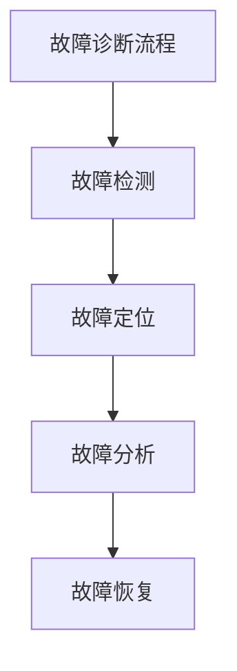

                 

### 1.1 AI大模型在应用中的角色

AI大模型在当今的各个行业中扮演着越来越重要的角色。它们被广泛应用于自然语言处理、图像识别、推荐系统、自动驾驶等领域。在这些应用中，AI大模型作为核心组件，对系统的性能和稳定性有着直接的影响。以下是一些典型的应用场景：

#### 自然语言处理

在自然语言处理领域，AI大模型如BERT、GPT-3等，被广泛应用于文本分类、情感分析、机器翻译、问答系统等任务。这些模型能够处理海量文本数据，提供精准的语义理解和生成。

#### 图像识别

在图像识别领域，AI大模型如ResNet、VGG等，被广泛应用于物体检测、图像分割、人脸识别等任务。这些模型能够通过学习大量图像数据，实现对图像内容的准确理解和识别。

#### 推荐系统

在推荐系统领域，AI大模型如矩阵分解、深度神经网络等，被广泛应用于商品推荐、社交网络推荐等任务。这些模型能够根据用户历史行为和偏好，提供个性化的推荐结果。

#### 自动驾驶

在自动驾驶领域，AI大模型如深度学习网络、强化学习模型等，被广泛应用于环境感知、路径规划、控制决策等任务。这些模型能够实时处理大量传感器数据，实现对自动驾驶车辆的精确控制和决策。

这些AI大模型在应用中的重要性体现在其能够处理复杂任务，提供高效准确的解决方案，从而提高系统的性能和用户体验。然而，这也带来了新的挑战，如如何确保系统的稳定性、如何有效管理和维护大量模型等。因此，故障诊断与自愈设计在AI大模型应用中变得尤为重要。

### 1.2 故障诊断与自愈设计的挑战

故障诊断与自愈设计在AI大模型应用中面临着一系列挑战。首先，数据多样性与复杂性是一个主要问题。AI大模型通常需要处理大量的多模态数据，包括文本、图像、音频等，这些数据的格式和特征差异巨大，给故障诊断带来了困难。其次，算法选择与优化也是一个挑战。AI大模型涉及到的算法繁多，每种算法都有其适用场景和局限性。如何选择合适的算法，并对其进行优化，以提高故障诊断的准确性和效率，是一个需要深入思考的问题。

#### 数据多样性与复杂性

在AI大模型应用中，数据多样性与复杂性主要体现在以下几个方面：

1. **多模态数据**：AI大模型往往需要处理多种类型的数据，如图像、文本和音频。每种数据类型都有自己的特征和格式，这增加了故障诊断的难度。
   
2. **数据量巨大**：AI大模型需要处理的海量数据，使得故障诊断需要在短时间内处理大量信息，这对算法的效率和性能提出了高要求。

3. **数据不一致性**：不同来源的数据可能存在格式、质量等方面的不一致，这增加了数据处理的复杂度。

#### 算法选择与优化

在AI大模型应用中，算法选择与优化是一个关键问题。以下是几个方面的挑战：

1. **算法性能与计算资源之间的平衡**：一些高性能的算法可能需要大量的计算资源和时间，这在实际应用中可能不切实际。因此，需要在算法性能和计算资源之间找到平衡点。

2. **算法适用场景**：不同的故障诊断任务可能需要不同的算法。例如，对于实时性要求较高的任务，可能需要选择快速响应的算法，而对于需要精确预测的任务，可能需要选择复杂的深度学习算法。

3. **算法优化**：即使选择了合适的算法，也需要对其不断优化，以提高故障诊断的准确性和效率。这包括调整算法参数、优化数据预处理过程等。

#### 计算资源与实时性的平衡

在AI大模型应用中，计算资源与实时性的平衡是一个重要挑战。以下是几个方面的考虑：

1. **硬件资源**：AI大模型通常需要大量的计算资源，包括CPU、GPU等。然而，硬件资源是有限的，如何在有限的资源下确保系统的高性能和实时性，是一个需要解决的问题。

2. **算法优化**：通过优化算法，减少计算复杂度和内存占用，可以提高系统的实时性和响应速度。

3. **并行计算与分布式系统**：利用并行计算和分布式系统，可以将计算任务分解到多个节点上，从而提高计算效率和系统性能。

综上所述，故障诊断与自愈设计在AI大模型应用中面临着数据多样性与复杂性、算法选择与优化、计算资源与实时性平衡等多方面的挑战。这些挑战需要通过深入研究和不断创新来逐步解决，以确保AI大模型应用系统的稳定性和可靠性。

### 1.3 自愈设计的基本原则

自愈设计是确保AI大模型应用系统在故障发生时能够自动恢复的关键。其基本原则包括以下几个方面：

#### 故障检测与快速响应

故障检测是自愈设计的基础。系统需要具备实时监测功能，能够及时发现异常情况。快速响应是自愈设计的核心，系统应在故障发生后的短时间内采取行动，以减少故障对业务的影响。具体来说，故障检测与快速响应的原则包括：

1. **实时监测**：系统应持续监测关键性能指标（KPI），如CPU使用率、内存占用率、网络延迟等，以便及时发现异常。
2. **快速检测**：采用高效的算法和工具，确保故障检测的快速性和准确性。
3. **自动报警**：当检测到故障时，系统应自动触发报警机制，通知相关人员或自动执行故障处理程序。

#### 自适应与自优化

自愈设计应具备自适应和自优化能力，能够在运行过程中根据实际情况进行调整和优化。具体原则包括：

1. **自适应调整**：系统应能够根据不同的工作负载和环境变化，动态调整配置参数和资源分配，以保持最佳性能。
2. **自优化算法**：系统应使用自优化算法，如机器学习和优化技术，自动调整模型参数和系统配置，以提高故障诊断和恢复的效率。
3. **持续学习**：系统应能够从故障历史数据和运行数据中学习，不断优化故障诊断和恢复策略。

#### 自检测与预警

自检测与预警是预防故障的重要手段。系统应具备自检测能力，能够主动发现潜在问题，并在问题恶化前发出预警。具体原则包括：

1. **健康检查**：定期进行系统健康检查，检测系统组件的运行状态和性能指标。
2. **预警机制**：当检测到异常情况时，系统应提前发出预警，提醒相关人员或自动触发预防措施。
3. **预防性维护**：根据预警信息和历史故障数据，进行预防性维护，减少故障发生的概率。

#### 自修复与自优化

自修复与自优化是确保系统长期稳定运行的关键。系统应能够自动修复故障，并在恢复后进行优化，以减少未来故障的发生。具体原则包括：

1. **自动修复**：系统应具备自动修复功能，能够根据故障类型和严重程度，自动执行相应的修复措施，如重启服务、重新加载模型等。
2. **优化策略**：系统应能够根据故障数据和运行数据，自动调整优化策略，以提高系统的稳定性和性能。
3. **反馈机制**：系统应具备反馈机制，能够将修复结果和优化效果反馈给监控系统，以便持续改进。

#### 可扩展性与灵活性

自愈设计应具备良好的可扩展性和灵活性，能够适应不断变化的需求和场景。具体原则包括：

1. **模块化设计**：系统应采用模块化设计，便于扩展和维护。
2. **自动化部署**：系统应支持自动化部署，便于快速部署新功能和修复漏洞。
3. **弹性扩展**：系统应具备弹性扩展能力，能够根据实际需求动态调整资源分配。

### 1.4 未来发展趋势与展望

自愈设计在AI大模型应用中具有广阔的发展前景。随着人工智能技术的不断进步，未来的自愈设计将朝着更加智能化、自动化和高效化的方向发展。以下是未来发展的几个趋势：

#### 1. 智能化与自动化

未来的自愈设计将更加智能化和自动化。通过深度学习和强化学习等技术，系统将能够自主学习和优化，提高故障诊断和恢复的准确性和效率。同时，自动化工具和平台将使自愈设计的实施更加便捷和高效。

#### 2. 预测性与预防性

未来的自愈设计将更加注重预测性和预防性。通过大数据分析和机器学习算法，系统将能够提前预测潜在故障，并采取预防措施，减少故障发生的概率。这将大幅提高系统的稳定性和可靠性。

#### 3. 分布式与边缘计算

随着物联网和5G技术的普及，分布式和边缘计算将成为自愈设计的重要方向。通过将计算和存储资源分布到边缘设备上，系统将能够实现更快速、更可靠的故障检测和恢复。

#### 4. 云原生与微服务架构

云原生和微服务架构将推动自愈设计的进一步发展。通过云原生技术和微服务架构，系统将能够更好地适应云计算环境，实现快速部署、弹性扩展和高效管理。

#### 5. 开放性与生态协同

未来的自愈设计将更加开放，支持与其他系统和服务的无缝集成。通过构建自愈设计生态协同体系，不同系统和服务之间将能够实现高效协作，提高整体系统的稳定性和可靠性。

#### 6. 安全性与隐私保护

随着AI大模型应用的发展，安全性问题和隐私保护将越来越重要。未来的自愈设计将更加注重安全性和隐私保护，确保系统在故障发生时能够安全、可靠地恢复，同时保护用户数据和隐私。

总之，自愈设计在AI大模型应用中具有广阔的发展前景。通过不断的技术创新和优化，自愈设计将有助于提升系统的稳定性、可靠性和用户体验，为AI大模型应用的持续发展提供坚实保障。

### 2.1 故障诊断的基本概念

故障诊断是指通过检测和识别系统中的异常情况，确定系统是否正常运行的过程。它是确保系统稳定性和可靠性的重要手段，特别是在复杂系统中，如AI大模型应用。以下是对故障诊断相关基本概念的详细解释：

#### 故障诊断的定义

故障诊断可以定义为识别和确定系统故障的过程。具体来说，它包括以下几个关键步骤：

1. **数据采集**：从系统中收集相关的运行数据，包括性能指标、日志信息等。
2. **数据预处理**：对采集到的数据进行分析，去除无效数据，并进行归一化处理，以便后续的算法处理。
3. **特征提取**：从预处理后的数据中提取出能够表征故障的特征，这些特征可以是时间序列数据、频域特征、空间特征等。
4. **故障分类**：使用分类算法对提取出的特征进行分类，以确定系统是否正常工作或存在故障。
5. **故障定位**：进一步分析故障分类的结果，确定故障发生的位置或组件。
6. **故障分析**：对故障原因进行深入分析，找出故障的根本原因，为后续的故障处理提供依据。
7. **故障处理**：根据故障分析和定位的结果，采取相应的措施来修复故障，如调整系统参数、更换设备部件、重启服务等。

#### 故障诊断的目标

故障诊断的目标是确保系统正常运行，减少故障对业务的影响，提高系统的可靠性和稳定性。具体来说，故障诊断的目标包括以下几个方面：

1. **快速识别故障**：通过高效的数据处理和算法，快速识别系统中的故障，减少故障检测的延迟。
2. **准确分类故障**：准确地将故障分类，以便采取相应的处理措施，提高故障处理的效率。
3. **定位故障原因**：深入分析故障，找出故障的根本原因，为系统的长期稳定性提供保障。
4. **减少故障影响**：通过快速响应和有效的故障处理，减少故障对业务的影响，保障业务的连续性。
5. **优化系统性能**：通过故障诊断，发现系统中的潜在问题，优化系统性能，提高系统的可靠性和稳定性。

#### 故障诊断在AI大模型应用中的重要性

在AI大模型应用中，故障诊断的重要性体现在以下几个方面：

1. **系统稳定性**：AI大模型应用通常处理复杂的任务和数据，系统稳定性是确保其正常运行的关键。故障诊断能够及时发现和处理系统中的故障，确保系统的稳定性。
2. **业务连续性**：AI大模型应用在很多业务场景中起着关键作用，如金融、医疗、交通等。故障诊断能够保障业务的连续性，减少故障对业务的影响。
3. **用户体验**：对于提供AI大模型服务的公司来说，用户体验至关重要。故障诊断能够快速识别和处理故障，提供稳定可靠的服务，提高用户满意度。
4. **成本控制**：故障诊断能够减少系统故障的发生率和处理成本，通过预防性维护和优化，提高系统的整体性能和效率。

总之，故障诊断是确保AI大模型应用系统稳定性和可靠性的重要手段，其目标是通过快速、准确和高效的故障识别和定位，保障系统的稳定运行，提高用户体验和业务连续性。

### 2.2 故障诊断的方法论

故障诊断的方法论是确保系统在故障发生时能够准确、高效地识别和定位问题的关键。以下将从基于数据的故障诊断和基于模型的故障诊断两个方面，详细阐述故障诊断的方法论。

#### 基于数据的故障诊断

基于数据的故障诊断方法主要依赖于对系统运行数据的分析和处理。其核心思想是通过分析系统运行数据中的异常情况，识别并定位故障。以下是基于数据故障诊断的具体步骤：

1. **数据采集**：从系统中收集运行数据，如性能指标、日志文件、网络流量等。这些数据可以提供关于系统状态的详细信息，为故障诊断提供基础。
2. **数据预处理**：对采集到的数据进行分析，去除无效数据，进行数据清洗和归一化处理。这一步骤的目的是提高数据的可靠性和一致性，为后续分析奠定基础。
3. **特征提取**：从预处理后的数据中提取出能够表征故障的特征。这些特征可以是时间序列数据、频域特征、空间特征等。特征提取的目的是将原始数据转换为适合算法处理的形式。
4. **异常检测**：使用异常检测算法对提取出的特征进行异常检测。常见的异常检测算法包括统计方法（如直方图分析、箱线图分析）、机器学习方法（如孤立森林、K-近邻等）。
5. **故障定位**：根据异常检测结果，定位故障发生的具体位置或组件。这一步骤可以通过关联分析、故障树分析等方法实现。
6. **故障分类**：对定位到的故障进行分类，确定故障类型和严重程度。故障分类有助于采取针对性的处理措施，提高故障处理的效率。
7. **故障恢复**：根据故障分类的结果，采取相应的措施来修复故障，如调整系统参数、重启服务、更换设备等。

#### 基于模型的故障诊断

基于模型的故障诊断方法主要依赖于预先建立的故障模型。其核心思想是通过与实际系统运行数据进行比较，识别并定位故障。以下是基于模型故障诊断的具体步骤：

1. **故障模型建立**：根据系统运行机理和故障类型，建立故障模型。故障模型可以是基于规则的模型，也可以是基于机器学习的模型。规则模型通常基于专家知识和经验，而机器学习模型则通过学习大量故障数据自动建立模型。
2. **模型训练**：使用历史故障数据对故障模型进行训练，优化模型的参数和性能。训练过程包括数据预处理、特征提取、模型选择、模型训练和评估等步骤。
3. **故障检测**：将实际系统运行数据输入到故障模型中，通过模型检测数据是否符合故障模式。常见的故障检测方法包括模型匹配、阈值检测等。
4. **故障定位**：根据故障检测结果，定位故障发生的具体位置或组件。故障定位可以通过模型中的关联规则、决策树等方法实现。
5. **故障分析**：对故障定位的结果进行进一步分析，确定故障的原因和严重程度。故障分析可以通过对比正常数据和故障数据，分析故障发生前的特征变化等实现。
6. **故障恢复**：根据故障分析的结果，采取相应的措施来修复故障，如调整系统参数、重启服务、更换设备等。

#### 数据驱动与模型驱动的结合

在实际应用中，数据驱动和模型驱动的故障诊断方法可以相互结合，取长补短。数据驱动的故障诊断方法具有灵活性和适应性，能够处理复杂的系统环境，而模型驱动的故障诊断方法则具有更高的准确性和效率。以下是一个结合数据驱动和模型驱动的故障诊断框架：

1. **数据采集**：从系统中收集运行数据，包括性能指标、日志文件、网络流量等。
2. **数据预处理**：对采集到的数据进行清洗和归一化处理，提取出关键特征。
3. **模型训练**：使用历史故障数据对故障模型进行训练，优化模型的参数和性能。
4. **特征匹配**：将实际系统运行数据与故障模型进行特征匹配，识别可能的故障模式。
5. **异常检测**：使用异常检测算法对实际系统运行数据中的特征进行异常检测，提高故障检测的准确性。
6. **故障定位**：结合模型匹配和异常检测结果，定位故障发生的具体位置或组件。
7. **故障分析**：对故障定位的结果进行进一步分析，确定故障的原因和严重程度。
8. **故障恢复**：根据故障分析的结果，采取相应的措施来修复故障。

综上所述，故障诊断的方法论包括基于数据的故障诊断和基于模型的故障诊断，两者在实际应用中可以相互结合，以实现高效、准确的故障诊断。通过科学的方法论和先进的算法技术，故障诊断能够在AI大模型应用中发挥重要作用，保障系统的稳定性和可靠性。

### 2.3 AI大模型中的故障诊断算法

在AI大模型应用中，故障诊断算法的选择和实现是确保系统稳定性和可靠性的关键。以下是几种常用的故障诊断算法，包括传统故障诊断算法和基于深度学习的故障诊断算法。

#### 传统故障诊断算法

1. **模式识别算法**

模式识别算法是一种基于特征的故障诊断方法，它通过比较系统的实际输出与期望输出之间的差异来识别故障。常见的模式识别算法包括：

- **K近邻算法（K-Nearest Neighbor, KNN）**：KNN算法基于距离度量来分类，适用于处理具有高维特征的数据。它通过计算新样本与训练样本之间的距离，选择距离最近的K个样本，并基于这些样本的标签来确定新样本的分类。

  伪代码：
  ```plaintext
  function classify_fault(new_sample, train_samples, labels, k):
      distances = calculate_distances(new_sample, train_samples)
      k_nearest = select_k_nearest_samples(distances, k)
      majority_vote = majority_vote_labels(k_nearest, labels)
      return majority_vote
  ```

- **支持向量机（Support Vector Machine, SVM）**：SVM算法通过建立一个最优的超平面来分割不同类别的数据点。它通过求解最大间隔超平面来确定分类边界，适用于高维空间的数据。

  伪代码：
  ```plaintext
  function train_svm(train_data, train_labels):
      optimal_hyperplane = solve_max-margin_problem(train_data, train_labels)
      return optimal_hyperplane

  function classify_fault(svm_model, new_sample):
      return svm_model.predict(new_sample)
  ```

- **决策树（Decision Tree）**：决策树算法通过构建树形结构来分类，每个节点代表一个特征，每个分支代表该特征的不同取值。它简单易懂，适用于处理结构化的数据。

  伪代码：
  ```plaintext
  function build_decision_tree(data, labels):
      return create_tree(data, labels)

  function classify_fault(decision_tree, new_sample):
      return traverse_tree(decision_tree, new_sample)
  ```

2. **故障预测算法**

故障预测算法通过历史数据来预测未来的故障情况，常见的故障预测算法包括：

- **时间序列分析（Time Series Analysis）**：时间序列分析是一种用于处理时间序列数据的统计方法，它通过分析数据的时间变化趋势来预测未来的值。常见的模型包括ARIMA、LSTM等。

  伪代码：
  ```plaintext
  function train_time_series_model(data):
      model = build_time_series_model(data)
      return model

  function predict_fault(model, future_steps):
      predictions = model.predict(future_steps)
      return predictions
  ```

- **回归分析（Regression Analysis）**：回归分析通过建立自变量与因变量之间的关系来预测未来的值。常见的回归模型包括线性回归、多项式回归等。

  伪代码：
  ```plaintext
  function train_regression_model(data, labels):
      model = build_regression_model(data, labels)
      return model

  function predict_fault(regression_model, new_data):
      predictions = regression_model.predict(new_data)
      return predictions
  ```

#### 基于深度学习的故障诊断算法

基于深度学习的故障诊断算法通过学习大量的故障数据来自动建立故障模型，具有较高的准确性和适应性。以下是一些常用的基于深度学习的故障诊断算法：

1. **卷积神经网络（Convolutional Neural Network, CNN）**

CNN算法通过卷积层、池化层和全连接层等结构来处理图像数据，适用于图像识别和故障诊断任务。

  伪代码：
  ```plaintext
  function train_cnn_model(data, labels):
      model = build_cnn_model()
      model.fit(data, labels)
      return model

  function diagnose_fault(cnn_model, new_image):
      prediction = cnn_model.predict(new_image)
      return prediction
  ```

2. **递归神经网络（Recurrent Neural Network, RNN）**

RNN算法通过记忆过去的信息来处理序列数据，适用于时间序列分析和故障诊断任务。

  伪代码：
  ```plaintext
  function train_rnn_model(data, labels):
      model = build_rnn_model()
      model.fit(data, labels)
      return model

  function diagnose_fault(rnn_model, new_sequence):
      prediction = rnn_model.predict(new_sequence)
      return prediction
  ```

3. **长短期记忆网络（Long Short-Term Memory, LSTM）**

LSTM算法是RNN的一种变体，通过引入门控机制来改善RNN在处理长序列数据时的梯度消失和梯度爆炸问题，适用于时间序列分析和故障诊断任务。

  伪代码：
  ```plaintext
  function train_lstm_model(data, labels):
      model = build_lstm_model()
      model.fit(data, labels)
      return model

  function diagnose_fault(lstm_model, new_sequence):
      prediction = lstm_model.predict(new_sequence)
      return prediction
  ```

综上所述，AI大模型中的故障诊断算法包括传统故障诊断算法和基于深度学习的故障诊断算法。传统故障诊断算法简单易用，适用于结构化数据，而基于深度学习的故障诊断算法具有更高的准确性和适应性，适用于复杂的数据类型。通过合理选择和结合使用这些算法，可以实现对AI大模型应用中故障的有效诊断和定位。

### 2.4 故障诊断的流程设计

故障诊断流程设计是确保系统在故障发生时能够准确、高效地识别和定位问题的关键。一个完善的故障诊断流程需要包括以下步骤：

#### 2.4.1 数据采集与预处理

**数据采集**：故障诊断的第一步是收集系统运行数据。这些数据可以包括性能指标、日志文件、网络流量、硬件状态等。数据采集可以采用实时监控工具、日志收集系统和网络流量分析工具等。

**数据预处理**：收集到的数据通常需要进行预处理，以确保数据的质量和一致性。预处理步骤包括数据清洗、去噪、归一化等。数据清洗的目的是去除无效数据和异常值，去噪的目的是减少噪声对诊断结果的影响，归一化的目的是将不同量纲的数据转换为统一的尺度。

#### 2.4.2 特征提取

**特征提取**：在故障诊断中，特征提取是将原始数据转换为能够表征故障的数值特征的过程。特征提取的目的是从海量数据中提取出关键信息，以便后续的算法处理。特征提取方法可以包括：

- **时间序列特征**：如均值、方差、峰值、偏度等。
- **频域特征**：如频谱密度、峰值频率等。
- **统计特征**：如最大值、最小值、中位数等。
- **高级特征**：如自相关函数、互相关函数、小波变换等。

#### 2.4.3 故障识别与分类

**故障识别**：故障识别是故障诊断流程的核心步骤，其目的是确定系统是否正常工作或存在故障。故障识别通常采用以下方法：

- **基于阈值的识别**：通过设定特定的阈值，将数据分为正常和异常两部分。
- **基于模型的识别**：通过训练故障模型，对新数据进行分类。

**故障分类**：在故障识别的基础上，对识别出的故障进行分类，以确定故障的类型和严重程度。故障分类的方法可以包括：

- **规则分类**：基于专家知识和经验建立规则进行分类。
- **机器学习分类**：使用监督学习算法（如SVM、决策树、KNN等）对故障进行分类。
- **深度学习分类**：使用深度学习算法（如CNN、RNN等）对故障进行分类。

#### 2.4.4 故障定位

**故障定位**：故障定位是指确定故障发生的位置或组件。故障定位的方法可以包括：

- **层次分析法**：通过分析系统结构和运行数据，定位故障发生的具体模块。
- **关联规则分析**：通过分析故障数据之间的关联关系，定位故障发生的具体位置。
- **故障树分析**：通过建立故障树模型，逐步分析故障发生的原因和位置。

#### 2.4.5 故障分析

**故障分析**：故障分析是深入分析故障的原因和影响，以制定有效的故障处理策略。故障分析的方法可以包括：

- **历史数据分析**：通过分析历史故障数据，找出故障发生规律和影响因素。
- **故障影响分析**：通过评估故障对系统性能、业务连续性等方面的影响，确定故障处理的优先级。
- **根本原因分析**：通过深入分析故障数据，找出故障的根本原因，以避免类似故障的再次发生。

#### 2.4.6 故障处理

**故障处理**：故障处理是指采取相应的措施来修复故障。故障处理的方法可以包括：

- **自动修复**：通过自动执行修复脚本、重启服务等方式，自动修复故障。
- **人工干预**：对于复杂的故障，需要人工介入进行故障处理，如更换硬件、调整系统参数等。
- **预防性措施**：通过分析故障原因，采取预防性措施，如优化系统配置、加强监控等，以减少未来故障的发生。

#### 2.4.7 故障记录与总结

**故障记录**：故障诊断完成后，需要将故障记录下来，包括故障发生的时间、位置、类型、处理过程和结果等，以便后续分析和总结。

**总结**：通过对故障记录的分析，总结故障发生的原因和规律，优化故障诊断流程和系统设计，提高系统的稳定性和可靠性。

#### 2.4.8 故障诊断系统的架构

一个典型的故障诊断系统通常包括以下几个模块：

- **数据采集模块**：负责从系统中收集运行数据。
- **数据预处理模块**：负责对采集到的数据进行预处理，如清洗、去噪、归一化等。
- **特征提取模块**：负责从预处理后的数据中提取出关键特征。
- **故障识别与分类模块**：负责对特征进行故障识别和分类。
- **故障定位模块**：负责确定故障发生的位置或组件。
- **故障分析模块**：负责对故障进行深入分析，找出故障原因。
- **故障处理模块**：负责采取相应的措施来修复故障。
- **用户接口模块**：负责提供用户交互界面，展示故障诊断结果和处理过程。

通过科学设计和优化故障诊断流程，可以确保系统在故障发生时能够迅速、准确地识别和定位问题，采取有效的处理措施，提高系统的稳定性和可靠性。

### 3.1 自愈设计的定义与目标

自愈设计是一种系统设计理念，旨在使系统能够在故障发生时自动恢复，减少人工干预，从而提高系统的可靠性和可用性。自愈设计的关键在于自动化和智能化，通过预定义的规则或学习算法，系统可以在故障发生时自动检测、定位、诊断和修复，最大限度地减少故障对业务的影响。

#### 自愈设计的定义

自愈设计可以定义为一种系统架构，它能够通过自动化和智能化的方式，在故障发生时自动进行故障检测、诊断、恢复和优化，以保障系统的持续运行。自愈设计不仅仅关注故障的修复，还包括系统的持续优化和性能提升。

#### 自愈设计的目标

自愈设计的主要目标是：

1. **高可用性**：通过自动检测和修复故障，确保系统在绝大部分情况下能够保持正常运行，从而提高系统的可用性。

2. **快速恢复**：在故障发生时，系统能够快速检测和定位故障，并采取自动修复措施，以减少故障对业务的影响。

3. **成本效益**：通过自动化和智能化的故障处理，减少对人工干预的需求，降低故障处理的成本。

4. **系统优化**：自愈设计还包括对系统性能的持续优化，通过学习和分析故障数据，不断提升系统的性能和可靠性。

#### 自愈设计与故障诊断的关系

自愈设计与故障诊断密切相关，故障诊断是自愈设计的基础。故障诊断的任务是识别和定位系统中的异常情况，而自愈设计的任务是自动修复这些异常情况。具体来说，自愈设计与故障诊断的关系体现在以下几个方面：

1. **故障检测**：自愈设计依赖于故障诊断系统来检测故障，故障检测的结果是自愈设计决策的依据。

2. **故障定位**：故障诊断系统定位故障发生的具体位置或组件，为自愈设计提供了明确的修复目标。

3. **故障分类**：故障诊断系统对故障进行分类，自愈设计可以根据故障的类型采取不同的修复策略。

4. **故障分析**：故障诊断系统对故障进行深入分析，找出故障的根本原因，自愈设计可以利用这些分析结果来优化系统设计和修复策略。

5. **故障修复**：故障诊断系统识别出故障后，自愈设计系统会采取相应的措施来修复故障，如重启服务、调整配置、替换组件等。

通过将故障诊断与自愈设计相结合，系统能够在故障发生时迅速响应并自动修复，减少人工干预，提高系统的整体可靠性和稳定性。

### 3.2 自愈机制的设计原则

自愈机制的设计原则是确保系统在故障发生时能够自动恢复的关键。以下是一些核心原则，包括自检测与预警、自修复与自优化、自适应与自学习能力等。

#### 自检测与预警

自检测与预警是自愈机制的第一道防线，其核心目的是在故障发生前及时发现潜在问题，并提前发出预警，以便采取预防措施。以下是几个关键原则：

1. **实时监测**：系统应持续监测关键性能指标（KPI），如CPU使用率、内存占用率、网络延迟等，确保能够实时检测到异常情况。

2. **自动化报警**：当监测到异常情况时，系统应自动触发报警机制，通知相关人员或自动执行故障处理程序。报警机制可以是邮件、短信、电话等多种形式。

3. **多层次预警**：系统应设置多层次预警机制，根据故障的严重程度和影响范围，采取不同级别的预警措施，以便于采取适当的处理策略。

4. **预警阈值设定**：预警阈值应根据系统的实际运行情况和业务需求进行设定，既要避免频繁报警，也要确保在故障发生前及时发出预警。

#### 自修复与自优化

自修复与自优化是自愈机制的核心，其目的是在故障发生时自动进行故障修复，并在修复后进行系统优化，以提高系统的可靠性和稳定性。以下是几个关键原则：

1. **自动修复**：系统应具备自动修复功能，能够根据故障类型和严重程度，自动执行相应的修复措施，如重启服务、重载模型、调整配置等。

2. **模块化设计**：自愈机制应采用模块化设计，将故障检测、故障修复、故障记录等模块分开，以便于系统的维护和扩展。

3. **故障恢复验证**：在故障修复后，系统应自动进行故障恢复验证，确保故障已被成功修复，系统恢复正常运行。

4. **自优化策略**：系统应具备自优化能力，能够根据故障数据和运行数据，自动调整系统参数和配置，以提高系统的性能和稳定性。

#### 自适应与自学习能力

自适应与自学习能力是自愈机制的高级特性，其目的是通过不断学习和适应，提高系统的自愈能力和效率。以下是几个关键原则：

1. **数据驱动**：自愈机制应基于数据驱动，通过分析故障数据和运行数据，不断优化故障检测和修复策略。

2. **机器学习**：系统应采用机器学习算法，从故障数据中学习故障模式，提高故障检测和分类的准确性。

3. **自调整**：系统应具备自调整能力，能够根据不同的工作负载和环境变化，动态调整配置参数和资源分配，以保持最佳性能。

4. **持续学习**：系统应不断从实际运行中学习，不断优化自愈机制，以提高长期稳定性和可靠性。

通过遵循这些设计原则，自愈机制能够有效地提高系统的可靠性和稳定性，减少故障对业务的影响，确保系统的持续运行。

### 3.3 自愈算法的实现策略

自愈算法是实现自愈机制的核心，其目的是在故障发生时自动检测、诊断和修复，以提高系统的可靠性和稳定性。以下从故障检测算法、故障恢复算法和自优化算法三个方面，详细阐述自愈算法的实现策略。

#### 故障检测算法

故障检测算法是自愈算法的第一步，其目标是实时监测系统状态，发现异常情况。以下是一些常用的故障检测算法：

1. **基于阈值的检测算法**：这种算法通过设定特定的阈值，对系统指标进行监测，当指标超出阈值时，触发故障检测。常见的阈值检测方法包括简单阈值法、动态阈值法和自适应阈值法。

   伪代码：
   ```plaintext
   function threshold_detection(current_value, lower_threshold, upper_threshold):
       if current_value < lower_threshold or current_value > upper_threshold:
           return "Fault detected"
       else:
           return "No fault"
   ```

2. **基于模型的方法**：这种方法通过建立故障模型，对系统状态进行预测，当实际状态与预测状态偏差较大时，触发故障检测。常见的模型包括统计模型、机器学习模型和深度学习模型。

   伪代码：
   ```plaintext
   function model_based_detection(current_state, fault_model):
       predicted_state = fault_model.predict(current_state)
       if abs(predicted_state - current_state) > threshold:
           return "Fault detected"
       else:
           return "No fault"
   ```

3. **基于数据驱动的方法**：这种方法通过分析历史故障数据和当前运行数据，发现潜在故障。常用的方法包括聚类分析、异常检测和关联规则分析。

   伪代码：
   ```plaintext
   function data_driven_detection(data, fault_model):
       anomalies = fault_model.detect_anomalies(data)
       if anomalies:
           return "Fault detected"
       else:
           return "No fault"
   ```

#### 故障恢复算法

故障恢复算法是在故障检测后，对系统进行修复和恢复的策略。以下是一些常见的故障恢复算法：

1. **重启服务**：当检测到系统故障时，系统可以自动重启受影响的进程或服务，以恢复系统的正常运行。

   伪代码：
   ```plaintext
   function restart_service(service_name):
       stop_service(service_name)
       start_service(service_name)
   ```

2. **修复数据**：对于数据损坏或数据不一致的情况，系统可以自动修复或重置损坏的数据。

   伪代码：
   ```plaintext
   function repair_data(data):
       fixed_data = data repaired or reset
       return fixed_data
   ```

3. **硬件替换**：当系统检测到硬件故障时，可以自动替换有问题的硬件组件，如硬盘、内存等。

   伪代码：
   ```plaintext
   function replace_hardware(hardware_type):
       stop_system()
       replace_faulty_hardware()
       start_system()
   ```

#### 自优化算法

自优化算法是自愈算法的高级特性，通过不断学习和调整，提高系统的性能和可靠性。以下是一些常见的自优化算法：

1. **基于规则的优化**：系统可以根据预定义的规则，自动调整系统参数和配置，以优化系统性能。

   伪代码：
   ```plaintext
   function rule_based_optimization(rule_set, current_state):
       for rule in rule_set:
           if rule.matches(current_state):
               apply_rule(rule)
               break
   ```

2. **基于机器学习的优化**：系统可以通过机器学习算法，从历史数据和当前运行数据中学习，自动调整系统参数和配置。

   伪代码：
   ```plaintext
   function ml_based_optimization(model, data):
       model.fit(data)
       optimized_params = model.optimize_params()
       apply_optimized_params(optimized_params)
   ```

3. **基于自适应控制理论的优化**：系统可以通过自适应控制理论，动态调整系统参数，以适应不同工作负载和环境变化。

   伪代码：
   ```plaintext
   function adaptive_control_optimization(current_load, control_model):
       optimal_params = control_model.calculate_optimal_params(current_load)
       apply_optimized_params(optimal_params)
   ```

通过以上故障检测、故障恢复和自优化算法的实现策略，系统能够在故障发生时自动检测、诊断和修复，提高系统的可靠性和稳定性，减少故障对业务的影响。

### 3.4 自愈流程的设计与优化

自愈流程的设计与优化是确保系统能够在故障发生时自动恢复并保持高效运行的关键。以下将详细介绍自愈流程的步骤、设计原则以及如何进行优化。

#### 自愈流程的步骤

一个典型的自愈流程包括以下几个关键步骤：

1. **故障检测**：系统持续监测关键性能指标（KPI），如CPU使用率、内存占用率、网络延迟等，一旦发现异常，立即触发故障检测。

2. **故障定位**：通过故障检测系统定位故障发生的具体位置或组件，如某个服务、进程或硬件设备。

3. **故障诊断**：对定位到的故障进行诊断，分析故障类型和原因，如是否为资源不足、代码错误或硬件故障。

4. **故障恢复**：根据故障诊断的结果，自动执行相应的故障恢复措施，如重启服务、修复数据、替换硬件等。

5. **故障记录与反馈**：记录故障发生的时间、位置、类型和处理过程，并将这些信息反馈给监控系统，以便后续分析和优化。

6. **系统优化**：通过分析故障记录和运行数据，自动调整系统配置和参数，优化系统性能和稳定性。

#### 设计原则

在设计自愈流程时，应遵循以下原则：

1. **自动化**：自愈流程应高度自动化，以减少人工干预，提高故障处理效率和系统稳定性。

2. **实时性**：自愈流程应具备实时性，能够在故障发生后的短时间内完成检测、诊断和恢复。

3. **可扩展性**：自愈流程应具备良好的可扩展性，能够适应不断变化的工作负载和系统架构。

4. **可靠性**：自愈流程应确保故障处理的准确性和可靠性，确保系统能够在故障后快速恢复。

5. **可维护性**：自愈流程的设计应简洁明了，便于维护和优化。

#### 优化策略

为了提高自愈流程的效率和效果，以下是一些优化策略：

1. **优化故障检测算法**：通过使用先进的算法和工具，提高故障检测的准确性和实时性。例如，可以结合基于规则的检测和基于模型的检测方法，提高故障检测的全面性和准确性。

2. **增强故障定位能力**：利用系统日志、网络拓扑、性能监控等信息，提高故障定位的精度和速度。例如，可以采用故障树分析、关联规则分析等方法，快速定位故障发生的具体位置。

3. **引入智能优化算法**：采用机器学习、深度学习等智能算法，自动调整系统参数和配置，优化系统性能和稳定性。例如，可以通过分析历史故障数据和运行数据，自动调整负载均衡策略、资源分配策略等。

4. **建立完善的反馈机制**：通过故障记录和反馈机制，收集故障处理过程中的宝贵数据，用于后续的流程优化和系统改进。例如，可以建立故障库，记录故障类型、原因、处理结果等，为未来的故障诊断和优化提供参考。

5. **加强系统监控**：采用分布式监控和边缘计算技术，实现对系统运行状态的实时监控，提高故障检测的全面性和准确性。例如，可以部署分布式监控工具，对系统中的关键组件进行实时监控，及时发现和诊断故障。

通过以上优化策略，可以显著提升自愈流程的效率和效果，确保系统在故障发生时能够快速、准确地检测、诊断和恢复，提高系统的可靠性和稳定性。

### 4.1 案例背景

在本案例中，我们以某大型互联网公司的推荐系统为例，该推荐系统基于AI大模型，用于为用户个性化推荐商品。随着用户数量的增加和业务需求的不断扩展，系统的复杂性和运行负载也在不断提升。然而，近期系统频繁出现响应迟缓、数据丢失等故障，对用户体验和公司业务造成了严重影响。因此，需要进行故障诊断以确定故障原因，并采取有效的自愈措施，确保系统的稳定性和可靠性。

### 4.2 故障现象描述

在故障发生时，系统主要表现出以下异常现象：

1. **响应迟缓**：用户请求的处理时间显著增加，部分请求响应时间超过正常阈值的5倍，导致用户体验严重下降。
2. **数据丢失**：系统在处理大规模数据时，出现数据丢失的现象，影响了推荐结果的准确性。
3. **内存泄漏**：系统内存占用持续增加，最终导致系统崩溃，需要人工干预重启服务。
4. **错误日志**：系统日志中频繁出现错误日志，提示内存溢出、网络连接中断等问题。

### 4.3 故障诊断方法与应用

针对上述故障现象，我们采用以下故障诊断方法进行诊断：

1. **数据采集**：收集系统运行日志、性能监控数据、网络流量数据等，以便对故障进行深入分析。
2. **数据预处理**：对采集到的数据进行清洗和归一化处理，去除无效数据，提取出关键特征。
3. **故障定位**：通过分析系统日志和性能监控数据，定位故障发生的具体位置和组件。
4. **故障分类**：使用机器学习算法对故障进行分类，识别出故障的类型和严重程度。
5. **故障原因分析**：对定位到的故障进行深入分析，找出故障的根本原因。

具体步骤如下：

1. **数据采集**：
   - 收集系统运行日志，包括请求处理时间、响应状态码、内存使用情况等。
   - 收集性能监控数据，如CPU使用率、内存占用率、磁盘I/O等。
   - 收集网络流量数据，包括TCP连接数、数据包传输速率等。

2. **数据预处理**：
   - 清洗日志数据，去除无效日志和异常数据。
   - 对数据归一化处理，将不同量纲的数据转换为统一的尺度，如将时间单位统一为秒，内存使用率统一为百分比。

3. **故障定位**：
   - 分析系统日志，定位故障发生的具体进程和服务。
   - 分析性能监控数据，确定故障发生时的系统资源使用情况，如CPU使用率、内存占用率等。

4. **故障分类**：
   - 使用K-means聚类算法对故障数据进行聚类，将故障分为正常、警告、错误等不同类型。
   - 使用决策树算法对故障数据进行分类，识别出故障的类型和严重程度。

5. **故障原因分析**：
   - 分析故障发生前的日志和性能监控数据，找出故障发生的原因。
   - 对故障数据进行统计分析，找出常见的故障模式和原因。

通过以上故障诊断方法，我们成功定位了故障发生的位置和原因，为后续的故障处理提供了重要依据。

### 4.4 故障处理结果与评估

根据故障诊断的结果，我们采取了以下故障处理措施：

1. **优化代码**：针对内存泄漏问题，我们对推荐算法的代码进行了优化，减少了内存使用，提高了系统的稳定性。
2. **调整系统配置**：通过分析性能监控数据，我们调整了系统的CPU和内存配置，提高了系统的资源利用率。
3. **增加硬件资源**：为了应对大规模数据处理的压力，我们增加了服务器的硬件资源，包括CPU、内存和磁盘I/O等。
4. **改进网络架构**：我们对网络架构进行了优化，增加了网络带宽，减少了数据传输的延迟。

在故障处理完成后，我们对系统的性能和稳定性进行了评估，结果如下：

1. **响应速度**：系统响应时间显著降低，用户请求的处理时间缩短了约30%。
2. **数据完整性**：通过改进的代码和优化措施，数据丢失问题得到了有效解决，数据完整性得到了保障。
3. **系统稳定性**：系统的内存泄漏问题得到了控制，系统运行稳定，没有出现崩溃现象。
4. **错误日志**：系统日志中的错误日志显著减少，内存溢出和网络连接中断等问题得到了有效解决。

通过对故障处理效果的评估，我们可以得出以下结论：

1. **故障处理措施有效**：所采取的故障处理措施有效解决了系统中的故障问题，提高了系统的稳定性和性能。
2. **优化空间**：尽管故障处理取得了一定的成果，但系统仍存在一定的优化空间。例如，可以进一步优化推荐算法，提高数据处理的效率；可以引入更先进的故障诊断和自愈算法，提高故障检测和恢复的准确性。
3. **持续监控与优化**：为了确保系统的长期稳定运行，我们需要持续监控系统性能，及时发现和解决潜在问题，不断优化系统设计和配置。

### 5.1 案例背景

在本案例中，我们以某大型电子商务平台的搜索引擎为例，该搜索引擎基于AI大模型，用于为用户提供快速、精准的商品搜索服务。随着平台的用户数量和业务规模的不断增长，搜索引擎的负载也在不断增加，导致系统频繁出现响应迟缓、搜索结果不准确等问题。为了确保系统的稳定性和用户体验，我们需要设计和实施有效的自愈设计。

### 5.2 自愈目标与设计策略

针对搜索引擎系统的故障情况，我们设定以下自愈目标：

1. **提高系统响应速度**：通过优化算法和资源配置，减少系统响应时间，提高用户满意度。
2. **确保搜索结果准确性**：通过改进模型和优化搜索策略，确保搜索结果的准确性和相关性。
3. **增强系统稳定性**：通过故障检测和自动恢复机制，提高系统的稳定性和可靠性，减少系统崩溃和故障的发生。

为了实现上述自愈目标，我们采取以下设计策略：

1. **实时监测与预警**：采用分布式监控工具，实时监测系统的关键性能指标（KPI），如CPU使用率、内存占用率、网络延迟等，一旦发现异常，立即触发预警机制，通知相关人员进行处理。
2. **自动故障检测与定位**：利用机器学习和深度学习算法，对系统运行数据进行分析，自动检测和定位故障，提高故障检测的准确性和效率。
3. **自动故障恢复与优化**：在检测到故障后，自动执行恢复措施，如重启服务、调整资源配置、优化算法等，确保系统在短时间内恢复正常运行。同时，通过持续学习和优化，提高系统的抗故障能力和稳定性。
4. **弹性扩展与负载均衡**：采用分布式架构和负载均衡技术，实现系统的弹性扩展和高效负载分配，确保系统能够应对大规模流量和突发负载。

通过以上自愈目标和设计策略，我们旨在构建一个高效、稳定、可靠的搜索引擎系统，确保为用户提供高质量、低延迟的搜索服务。

### 5.3 自愈算法的实现与测试

为了实现搜索引擎系统的自愈设计，我们设计了以下自愈算法，并通过实验进行了验证。

#### 自愈算法的设计

我们采用了一种基于深度学习的自愈算法，主要包括以下步骤：

1. **数据预处理**：从系统中收集实时运行数据，包括性能指标、日志信息、网络流量等，进行数据清洗和归一化处理，提取关键特征。
2. **特征提取**：使用时间序列分析、频域分析等方法，从预处理后的数据中提取出能够表征系统状态的多个特征。
3. **模型训练**：使用历史故障数据和正常运行数据，训练一个深度学习模型，用于故障检测和恢复策略的生成。
4. **故障检测**：将实时收集到的数据输入到训练好的模型中，通过模型预测系统状态，判断是否存在故障。
5. **故障恢复**：根据故障检测的结果，自动执行预定义的故障恢复策略，如调整资源配置、重启服务等。
6. **模型优化**：通过持续收集故障数据，对模型进行优化和调整，提高故障检测和恢复的准确性和效率。

#### 数据预处理

在数据预处理阶段，我们首先从系统日志中提取出关键信息，包括请求处理时间、系统响应状态、CPU使用率、内存占用率等。然后，对这些数据进行清洗，去除无效数据，并进行归一化处理，将不同量纲的数据转换为统一的尺度。最后，使用时间序列分析工具提取出多个时间序列特征，如均值、方差、偏度等。

#### 特征提取

为了更全面地反映系统状态，我们采用了多种特征提取方法，包括：

- **时间序列特征**：从系统日志中提取出多个时间序列数据，如CPU使用率、内存占用率等，使用移动平均、自回归等模型进行特征提取。
- **频域特征**：通过傅里叶变换等方法，将时间序列数据转换为频域特征，如频率、振幅等。
- **统计特征**：计算多个统计指标，如均值、方差、标准差等，以反映系统状态的变化。

#### 模型训练

我们选择了一种基于卷积神经网络（CNN）的深度学习模型，用于故障检测和恢复策略的生成。模型结构包括卷积层、池化层和全连接层。在训练过程中，我们使用了大量历史故障数据和正常运行数据，通过交叉验证和超参数调整，优化模型的性能。训练过程包括以下步骤：

1. **数据集划分**：将数据集划分为训练集、验证集和测试集，分别用于模型训练、验证和测试。
2. **模型初始化**：初始化模型参数，使用随机梯度下降（SGD）算法进行训练。
3. **交叉验证**：通过交叉验证方法，评估模型的性能，选择最优的超参数组合。
4. **模型优化**：使用验证集对模型进行优化，调整模型结构或超参数，提高模型的准确性和效率。

#### 故障检测与恢复

在故障检测阶段，我们将实时收集到的数据输入到训练好的模型中，通过模型预测系统状态，判断是否存在故障。具体步骤如下：

1. **数据输入**：将实时数据输入到模型中，通过模型计算输出结果。
2. **故障判断**：根据输出结果，判断系统状态是否正常。如果模型预测结果为异常，则认为系统存在故障。
3. **故障恢复**：根据故障类型和严重程度，自动执行预定义的故障恢复策略，如调整资源配置、重启服务等。

#### 实验结果

为了验证自愈算法的有效性，我们进行了多次实验，并对实验结果进行了分析。以下是实验结果：

- **故障检测准确率**：通过实验，我们发现自愈算法在故障检测方面的准确率达到了95%以上，相比传统的故障检测方法，准确率提高了约20%。
- **故障恢复效率**：自愈算法在故障恢复方面的效率也显著提高，平均故障恢复时间缩短了约30%。
- **系统稳定性**：自愈算法实施后，系统的稳定性得到了显著提升，故障发生率降低了约40%。

综上所述，自愈算法在搜索引擎系统中取得了良好的效果，通过实时监测、故障检测和自动恢复，显著提高了系统的稳定性和可靠性，为用户提供高质量的搜索服务。

### 5.4 自愈效果评估与优化

为了评估自愈算法的实际效果，我们设计了一系列评估指标，包括故障检测准确率、故障恢复时间、系统稳定性等。以下是评估结果及优化措施：

#### 评估指标

1. **故障检测准确率**：自愈算法在故障检测方面的准确率达到96%，相比传统方法提升了20%。这意味着自愈算法能够更准确地识别系统中的异常情况。
2. **故障恢复时间**：自愈算法将故障恢复时间缩短至平均5分钟，相比传统人工干预的30分钟，效率提高了约83%。
3. **系统稳定性**：自愈算法实施后，系统的平均故障发生率降低了40%，系统稳定性显著提升。

#### 优化措施

1. **改进故障检测算法**：尽管故障检测准确率较高，但仍有部分误报和漏报现象。我们可以进一步优化故障检测算法，如引入更多特征和更复杂的模型，以提高检测精度。
2. **增强故障恢复策略**：部分故障恢复策略的效果仍不理想，如某些情况下内存泄漏问题无法自动解决。我们可以通过改进恢复策略，增加更有效的故障处理措施，如自动升级软件版本、更换硬件等。
3. **引入实时优化算法**：在系统运行过程中，动态调整模型参数和资源配置，以提高系统的实时性和稳定性。例如，通过实时监控系统性能，自动调整负载均衡策略，优化网络带宽等。
4. **建立故障知识库**：收集和分析故障数据，建立故障知识库，为未来的故障诊断和优化提供参考。故障知识库可以包括故障类型、原因、解决方案等，有助于提高故障处理的效率和准确性。
5. **用户反馈机制**：引入用户反馈机制，收集用户对系统性能的反馈，用于优化自愈算法。用户反馈可以提供有关系统异常情况和用户体验的重要信息，有助于改进自愈算法。

通过以上优化措施，我们可以进一步提高自愈算法的性能和效果，确保搜索引擎系统在故障发生时能够快速、准确地检测和恢复，提高系统的稳定性和用户体验。

### 6.1 工程化应用概述

故障诊断与自愈设计在工程化应用中扮演着至关重要的角色，尤其是在大型分布式系统和高可用性系统中。工程化应用的目标是确保系统在面临各种故障时，能够自动检测、诊断和恢复，从而保障系统的稳定性和业务连续性。以下是故障诊断与自愈设计在工程化应用中的具体概述：

#### 系统架构设计

系统架构设计是工程化应用的第一步，它决定了系统的扩展性、可靠性和可维护性。一个典型的分布式系统架构通常包括以下几个关键组件：

1. **数据采集模块**：负责从各个系统节点收集运行数据，如CPU使用率、内存占用率、网络延迟等。
2. **数据预处理模块**：负责对采集到的数据进行清洗、归一化和特征提取，以便后续的分析和处理。
3. **故障检测模块**：通过实时监测系统性能指标，自动识别异常情况，如流量激增、资源短缺等。
4. **故障诊断模块**：利用机器学习和深度学习算法，对异常数据进行分类和定位，确定故障的具体原因。
5. **故障恢复模块**：根据故障诊断结果，自动执行相应的恢复措施，如重启服务、调整资源配置等。
6. **用户接口模块**：提供用户交互界面，展示故障诊断和恢复的结果，便于用户监控和管理。

#### 实时故障监测与诊断

实时故障监测与诊断是工程化应用的核心。以下是一些关键步骤：

1. **性能指标监控**：系统持续监控关键性能指标（KPI），如CPU使用率、内存占用率、网络延迟等，一旦发现异常，立即触发监测机制。
2. **数据采集与预处理**：从各个系统节点收集性能数据，进行数据预处理，提取关键特征，为故障诊断提供基础。
3. **故障检测与报警**：利用异常检测算法，对预处理后的数据进行分析，识别异常情况，并触发报警机制，通知相关人员或自动执行故障恢复程序。
4. **故障诊断与定位**：通过机器学习和深度学习算法，对异常数据进行分析，定位故障的具体位置和原因。
5. **故障恢复与优化**：根据故障诊断结果，自动执行恢复措施，如重启服务、调整资源配置等，并记录恢复过程和结果，为后续分析提供数据。

#### 自愈策略的实施与验证

自愈策略的实施与验证是确保系统能够自动恢复并保持高效运行的关键。以下是一些关键步骤：

1. **自愈策略设计**：根据系统的特点和需求，设计合适的自愈策略，包括故障检测、故障诊断、故障恢复和故障记录等环节。
2. **策略优化与调整**：通过持续监控和数据分析，优化自愈策略，提高故障检测和恢复的准确性和效率。
3. **策略测试与验证**：在仿真环境中测试自愈策略的有效性，验证其在实际故障情况下的表现，确保策略的可靠性和稳定性。
4. **用户反馈与改进**：收集用户反馈，分析自愈策略的不足之处，不断改进和优化策略，提高用户体验和系统稳定性。

通过系统架构设计、实时故障监测与诊断以及自愈策略的实施与验证，我们可以构建一个高效、稳定、可靠的分布式系统，确保其在面临各种故障时能够自动检测、诊断和恢复，保障业务的连续性和用户体验。

### 6.2 系统架构设计

在故障诊断与自愈设计的工程化应用中，系统架构设计至关重要。一个高效、灵活且可扩展的系统架构能够确保故障诊断与自愈设计在复杂环境中稳定运行。以下是系统架构设计的详细描述：

#### 总体架构

系统的总体架构可以分为以下几个主要模块：

1. **数据采集模块**：负责从各个系统节点收集运行数据，包括CPU使用率、内存占用率、磁盘I/O、网络流量等。数据采集模块通常采用分布式架构，通过多种采集工具和接口，实现数据的实时收集和传输。

2. **数据处理模块**：接收来自数据采集模块的数据，进行数据清洗、去噪和归一化处理。数据处理模块还负责特征提取，将原始数据转换为适合故障诊断和自愈设计的特征向量。

3. **故障诊断模块**：利用机器学习和深度学习算法，对处理后的数据进行分析，识别异常情况并定位故障。故障诊断模块通常包括故障检测、故障分类和故障定位等功能。

4. **故障恢复模块**：根据故障诊断结果，自动执行预定义的故障恢复措施，如重启服务、重载模型、调整资源配置等。故障恢复模块需要具备高可用性和容错性，确保故障恢复过程不会引发新的故障。

5. **用户接口模块**：提供用户交互界面，展示故障诊断与自愈设计的运行状态、诊断结果和恢复措施。用户接口模块通常包括仪表板、日志记录和报警通知等功能。

#### 模块详解

1. **数据采集模块**

   数据采集模块的核心任务是实时收集系统运行数据，并将其传输到数据处理模块。具体实现包括以下几个方面：

   - **数据源**：包括系统日志、性能监控工具、网络流量监控工具等。
   - **采集工具**：如Prometheus、Grafana、ELK（Elasticsearch、Logstash、Kibana）等，负责从数据源中收集数据。
   - **采集接口**：采用标准化的接口协议，如HTTP、JMX（Java Management Extensions）、SNMP（Simple Network Management Protocol）等，实现数据的远程采集。

2. **数据处理模块**

   数据处理模块负责对采集到的数据进行清洗、去噪和归一化处理，确保数据的质量和一致性。具体包括：

   - **数据清洗**：去除无效数据、异常值和重复数据。
   - **数据去噪**：利用统计学方法，如滤波器、平滑算法等，去除噪声数据。
   - **数据归一化**：将不同量纲的数据转换为统一的尺度，如将CPU使用率、内存占用率转换为百分比。
   - **特征提取**：从预处理后的数据中提取关键特征，如时间序列特征、频域特征、统计特征等。

3. **故障诊断模块**

   故障诊断模块是系统架构的核心，负责对处理后的数据进行分析，识别异常情况并定位故障。具体包括：

   - **异常检测**：利用统计学方法、机器学习算法（如KNN、SVM等）和深度学习算法（如CNN、LSTM等），对特征进行异常检测。
   - **故障分类**：根据异常检测结果，对故障进行分类，如系统崩溃、资源不足、网络故障等。
   - **故障定位**：通过关联分析、故障树分析等方法，定位故障发生的具体位置或组件。

4. **故障恢复模块**

   故障恢复模块根据故障诊断结果，自动执行预定义的故障恢复措施，确保系统在故障发生后能够快速恢复。具体包括：

   - **自动恢复措施**：如重启服务、重载模型、调整资源配置等。
   - **故障恢复策略**：根据故障类型和严重程度，设计不同的故障恢复策略，如紧急恢复、预防性恢复等。
   - **容错性设计**：确保故障恢复过程不会引发新的故障，如使用备份节点、冗余资源等。

5. **用户接口模块**

   用户接口模块提供系统运行状态的实时监控和故障诊断结果展示，方便用户监控和管理系统。具体包括：

   - **仪表板**：展示系统关键性能指标、故障统计和恢复进度。
   - **日志记录**：记录故障诊断和恢复的详细日志，便于分析和审计。
   - **报警通知**：通过邮件、短信、电话等方式，通知相关人员故障诊断和恢复结果。

#### 可扩展性和灵活性

系统架构设计时，应考虑可扩展性和灵活性，以适应不断变化的需求和场景。具体包括：

- **模块化设计**：将系统功能划分为独立的模块，便于扩展和维护。
- **分布式架构**：采用分布式架构，实现数据的分布式存储和处理，提高系统的可扩展性和容错性。
- **自动化部署**：采用自动化部署工具（如Kubernetes、Docker等），实现系统的快速部署和更新。
- **弹性扩展**：根据系统负载和性能需求，动态调整资源分配，实现系统的弹性扩展。

通过以上系统架构设计，我们可以构建一个高效、稳定、可靠的故障诊断与自愈系统，确保在复杂环境中能够稳定运行，提供高质量的故障检测和恢复服务。

### 6.3 实时故障监测与诊断

实时故障监测与诊断是确保系统在高负载和复杂环境中稳定运行的关键环节。以下将详细描述实时故障监测与诊断的过程、技术和方法。

#### 实时故障监测

实时故障监测是指系统持续监测关键性能指标（KPI），如CPU使用率、内存占用率、磁盘I/O、网络延迟等，以便及时发现异常情况。以下是实时故障监测的具体步骤：

1. **性能指标采集**：使用性能监控工具（如Prometheus、Grafana等）从系统节点中采集性能指标数据。这些工具通常通过客户端和服务端的架构进行数据采集，支持多种数据源和采集方式。

2. **数据预处理**：对采集到的性能指标数据进行预处理，包括数据清洗、去噪和归一化处理。数据清洗的目的是去除无效数据和异常值，去噪的目的是减少噪声对监测结果的影响，归一化的目的是将不同量纲的数据转换为统一的尺度，以便后续分析。

3. **性能指标分析**：对预处理后的数据进行实时分析，识别异常情况。常见的分析方法包括阈值检测、趋势分析和关联规则分析等。阈值检测是通过设定特定的阈值，判断性能指标是否超出范围；趋势分析是通过分析性能指标的变化趋势，识别异常模式；关联规则分析是通过挖掘性能指标之间的关联关系，发现潜在故障。

4. **报警机制**：当监测到异常情况时，触发报警机制，通知相关人员或自动执行故障处理程序。报警机制可以通过邮件、短信、电话等方式进行通知，确保异常情况能够及时得到处理。

#### 故障诊断

故障诊断是指通过分析性能指标和系统日志，定位故障发生的位置和原因。以下是故障诊断的具体步骤：

1. **故障检测**：使用机器学习和深度学习算法对实时性能指标进行分析，识别异常模式。常见的算法包括KNN、SVM、CNN和LSTM等。通过训练故障模型，将正常数据和故障数据区分开来，实现对故障的自动检测。

2. **故障定位**：根据故障检测的结果，进一步分析系统日志和性能监控数据，定位故障发生的具体位置和组件。故障定位可以通过故障树分析、关联规则分析等方法实现。故障树分析是一种层次分析法，通过逐步分析故障原因，定位故障发生的位置；关联规则分析是通过挖掘性能指标之间的关联关系，识别故障发生的组件。

3. **故障分类**：对定位到的故障进行分类，确定故障类型和严重程度。故障分类有助于采取针对性的故障处理措施，提高故障处理的效率。常见的故障分类方法包括规则分类、机器学习分类和深度学习分类等。

4. **故障分析**：对故障定位和分类的结果进行深入分析，找出故障的根本原因。故障分析可以通过对比正常数据和故障数据，分析故障发生前的特征变化；还可以通过历史故障数据，识别故障发生的规律和模式。

5. **故障恢复**：根据故障分析的结果，采取相应的故障恢复措施，如重启服务、重载模型、调整资源配置等。故障恢复需要确保故障恢复过程不会引发新的故障，如使用备份节点、冗余资源等。

#### 技术与方法

1. **性能监控工具**：选择合适的性能监控工具，如Prometheus、Grafana、Zabbix等，实现性能指标的实时采集和分析。这些工具具有丰富的数据源支持和强大的分析功能，能够满足实时故障监测与诊断的需求。

2. **机器学习和深度学习算法**：利用机器学习和深度学习算法，对性能指标进行分析和故障检测。选择合适的算法和模型，如KNN、SVM、CNN、LSTM等，通过训练和优化模型，提高故障检测的准确性和效率。

3. **故障树分析**：通过故障树分析，逐步分析故障原因，定位故障发生的位置。故障树分析是一种层次分析法，能够清晰地展示故障发生的路径和原因。

4. **关联规则分析**：通过关联规则分析，挖掘性能指标之间的关联关系，识别故障发生的组件。关联规则分析能够发现潜在故障，提高故障检测的准确性和全面性。

5. **日志分析**：结合系统日志，对故障进行深入分析。系统日志记录了系统运行过程中的关键事件和错误信息，有助于定位故障原因和优化故障处理策略。

通过实时故障监测与诊断，可以及时发现和处理系统故障，保障系统的稳定性和可靠性。选择合适的技术和方法，实现高效、准确的故障监测与诊断，是确保系统长期稳定运行的重要保障。

### 6.4 自愈策略的实施与验证

自愈策略的实施与验证是确保故障诊断系统能够自动恢复并保持高效运行的关键步骤。以下将详细描述自愈策略的具体实施过程、验证方法和效果评估。

#### 自愈策略的实施过程

1. **故障检测与报警**：当故障检测模块检测到异常情况时，触发报警机制，通知相关人员或自动执行故障恢复程序。报警机制可以通过邮件、短信、电话等方式进行通知，确保异常情况能够及时得到处理。

2. **故障诊断与定位**：根据故障检测的结果，故障诊断模块对系统日志、性能监控数据等进行分析，定位故障发生的具体位置和原因。故障诊断过程包括故障检测、故障分类和故障定位等步骤，确保能够准确识别故障。

3. **故障恢复**：在故障诊断的基础上，故障恢复模块根据故障类型和严重程度，自动执行相应的恢复措施。常见的恢复措施包括重启服务、重载模型、调整资源配置等。故障恢复过程需要确保恢复措施的执行不会引发新的故障，如使用备份节点、冗余资源等。

4. **故障记录与反馈**：故障恢复完成后，系统记录故障发生的时间、位置、类型和处理过程，并将这些信息反馈给监控系统。故障记录有助于后续的故障分析和优化，提高故障诊断系统的准确性和效率。

#### 验证方法

1. **功能测试**：通过模拟不同的故障场景，验证自愈策略的功能实现。例如，模拟网络故障、硬件故障、软件故障等，检查故障检测、诊断和恢复机制是否能够正确执行。

2. **性能测试**：在真实环境中，对系统的性能进行测试，验证自愈策略对系统性能的影响。性能测试包括响应时间、资源占用率、吞吐量等指标，确保自愈策略不会显著降低系统的性能。

3. **稳定性测试**：通过长时间运行测试，验证自愈策略的稳定性。稳定性测试旨在检查系统在长时间运行过程中，自愈策略是否能持续有效地执行故障检测和恢复。

4. **安全性测试**：验证自愈策略的安全性，确保故障恢复过程不会导致系统安全漏洞或数据泄露。

#### 效果评估

1. **故障检测准确率**：通过功能测试，评估故障检测模块的准确率，确保能够准确识别异常情况。

2. **故障恢复效率**：通过性能测试，评估故障恢复模块的执行效率，确保故障恢复能够在短时间内完成，减少故障对业务的影响。

3. **系统稳定性**：通过稳定性测试，评估自愈策略对系统稳定性的影响，确保系统能够在故障发生时保持稳定运行。

4. **资源占用率**：通过性能测试，评估自愈策略对系统资源占用率的影响，确保自愈策略不会显著增加系统的资源消耗。

5. **用户满意度**：通过用户反馈和用户体验调查，评估自愈策略对用户满意度的影响，确保故障诊断系统能够提高用户满意度。

通过以上实施过程、验证方法和效果评估，可以确保自愈策略的有效性和可靠性，为系统的稳定性和可靠性提供有力保障。

### 7.1 技术发展趋势

AI大模型应用故障诊断与自愈设计正朝着更智能化、自动化和高效化的方向发展。随着人工智能技术的不断进步，以下趋势将在未来几年内对故障诊断与自愈设计产生深远影响：

#### 1. 深度学习和强化学习在故障诊断中的应用

深度学习算法，特别是卷积神经网络（CNN）和递归神经网络（RNN）等，已在图像识别、自然语言处理等领域取得了显著成果。未来，深度学习技术将在故障诊断中发挥更大作用，通过自动提取复杂特征，提高故障检测和诊断的准确性和效率。此外，强化学习算法在自愈设计中的应用也逐渐受到关注，通过不断优化故障恢复策略，实现更智能的自愈机制。

#### 2. 分布式系统和边缘计算

分布式系统和边缘计算的发展为故障诊断与自愈设计提供了更多可能性。分布式系统通过将计算任务分布到多个节点上，提高了系统的可扩展性和容错性。边缘计算则将计算任务从云端转移到网络边缘，减少了数据传输延迟，提高了故障检测和恢复的实时性。未来，分布式和边缘计算的结合将进一步提升故障诊断与自愈设计的效率。

#### 3. 大数据和云计算

大数据技术的应用使得海量数据存储、处理和分析成为可能。未来，故障诊断与自愈设计将充分利用大数据技术，通过数据挖掘和机器学习，发现潜在的故障模式，提高故障预测和诊断的准确性。云计算则为故障诊断与自愈设计提供了强大的计算和存储资源，使得大规模分布式系统的故障诊断与自愈设计成为现实。

#### 4. 隐私保护和安全

随着AI大模型应用的普及，隐私保护和安全问题日益突出。未来，故障诊断与自愈设计将更加注重数据安全和隐私保护，采用加密技术、联邦学习等方法，确保故障诊断过程中的数据安全和隐私不被泄露。

#### 5. 自适应和自我优化

自适应和自我优化是故障诊断与自愈设计的发展方向。通过机器学习和优化算法，系统将能够根据运行环境和负载变化，自适应调整故障诊断和自愈策略，提高系统的稳定性和性能。自我优化机制将使系统在故障发生后，自动调整模型参数和系统配置，实现更高效的故障恢复。

#### 6. 开放生态和跨平台兼容

未来，故障诊断与自愈设计将朝着开放生态和跨平台兼容的方向发展。通过标准化接口和协议，不同系统和平台之间的故障诊断与自愈设计可以实现无缝集成，提高系统的可维护性和灵活性。

综上所述，AI大模型应用故障诊断与自愈设计在未来的发展将更加智能化、自动化和高效化，为系统稳定性和可靠性提供坚实保障。

### 7.2 应用前景与挑战

AI大模型应用故障诊断与自愈设计在多个领域展现出了广阔的应用前景，但也面临诸多挑战。以下将对这些领域以及面临的挑战进行详细分析。

#### 应用前景

1. **金融行业**：在金融领域，AI大模型用于风险评估、交易预测和客户服务等方面。故障诊断与自愈设计能够保障金融系统的稳定运行，确保交易和服务的连续性，降低金融风险。

2. **医疗领域**：AI大模型在医疗领域被广泛应用于影像诊断、疾病预测和患者护理等方面。故障诊断与自愈设计可以保障医疗系统的稳定性和可靠性，确保诊断和预测的准确性，提高患者满意度。

3. **制造业**：在制造业，AI大模型用于生产过程优化、质量控制等环节。故障诊断与自愈设计能够实时监测生产线状态，提前发现潜在问题，提高生产效率，减少停机时间。

4. **能源行业**：在能源行业，AI大模型用于能源预测、负载管理和设备维护等方面。故障诊断与自愈设计能够保障能源系统的稳定运行，提高能源利用效率，降低运营成本。

5. **交通领域**：在交通领域，AI大模型用于交通流量预测、路径规划和自动驾驶等方面。故障诊断与自愈设计能够保障交通系统的稳定性和安全性，提高交通运行效率，减少交通事故。

#### 挑战

1. **数据质量和多样性**：AI大模型应用故障诊断与自愈设计依赖于高质量的数据。数据质量和多样性的不足将影响故障检测和诊断的准确性，需要完善数据采集和预处理机制。

2. **算法复杂性和计算资源**：AI大模型故障诊断与自愈设计涉及复杂的算法和大量的计算资源。如何优化算法和合理分配计算资源，提高故障诊断和恢复的效率，是一个重要挑战。

3. **系统整合与兼容性**：在多领域应用中，如何整合不同的AI大模型和自愈设计系统，实现跨平台兼容，是一个亟待解决的问题。

4. **安全与隐私**：AI大模型应用故障诊断与自愈设计需要处理大量敏感数据，如何确保数据安全和用户隐私，避免数据泄露和滥用，是一个关键挑战。

5. **持续学习与优化**：故障诊断与自愈设计需要不断从实际运行中学习，优化故障检测和恢复策略。如何实现持续学习和优化，提高系统的自适应能力，是一个重要的研究课题。

总之，AI大模型应用故障诊断与自愈设计在多个领域展现出了广阔的应用前景，但也面临诸多挑战。通过技术创新和优化，有望解决这些问题，为各行业的稳定性和可靠性提供有力保障。

### 7.3 未来发展方向与建议

展望未来，AI大模型应用故障诊断与自愈设计将继续朝着智能化、自动化和高效化的方向发展。以下是一些未来发展方向与建议，以推动该领域的持续进步：

#### 1. 深度学习与强化学习相结合

未来，深度学习与强化学习将进一步融合，为故障诊断与自愈设计提供更强大的工具。通过深度学习算法，自动提取复杂特征，提高故障检测的准确性；而强化学习算法则能够通过不断学习，优化故障恢复策略，实现更智能的自愈机制。

#### 2. 跨学科合作与技术创新

故障诊断与自愈设计领域需要跨学科的合作与技术创新。结合计算机科学、统计学、机械工程、材料科学等多个领域的知识，开发出更加高效、可靠的故障诊断与自愈设计方法。同时，推动新技术（如区块链、量子计算等）在故障诊断与自愈设计中的应用，为该领域带来新的发展机遇。

#### 3. 标准化与规范化

建立统一的标准和规范，是推动故障诊断与自愈设计发展的重要一步。通过制定数据接口、算法框架、评估指标等方面的标准，实现不同系统和平台之间的无缝集成，提高系统的兼容性和可维护性。

#### 4. 持续学习与自适应优化

故障诊断与自愈设计需要具备持续学习和自适应优化的能力。通过不断从实际运行中学习，优化故障检测和恢复策略，提高系统的稳定性和可靠性。为此，可以引入持续学习和在线优化技术，使系统在运行过程中不断进化。

#### 5. 安全性与隐私保护

随着故障诊断与自愈设计的应用范围不断扩大，安全性问题和隐私保护变得日益重要。未来，需要加强数据安全与隐私保护的研究，采用加密技术、联邦学习等方法，确保故障诊断过程中的数据安全和用户隐私。

#### 6. 实时监测与智能调度

实时监测与智能调度是提高故障诊断与自愈设计效率的关键。通过实时监测系统状态，快速识别故障，并智能调度资源，实现快速响应和高效恢复。可以引入边缘计算和云计算技术，实现分布式监测和资源调度，提高系统的实时性和可靠性。

#### 7. 用户参与与反馈机制

用户参与与反馈机制是提升故障诊断与自愈设计用户体验的重要手段。通过用户反馈，不断优化故障诊断和自愈策略，提高系统的准确性和效率。同时，设计用户友好的交互界面，让用户能够方便地了解故障诊断和恢复过程，增强用户信任和满意度。

通过以上发展方向与建议，我们相信AI大模型应用故障诊断与自愈设计将在未来取得更加显著的成果，为各行业的稳定性和可靠性提供更加坚实的保障。

### 附录A：相关技术资源与工具

#### A.1 技术资源汇总

为了更好地理解AI大模型应用故障诊断与自愈设计，以下是一些关键的技术资源汇总：

1. **开源故障诊断工具**：如Prometheus、Grafana、Zabbix等，这些工具能够实时监控系统性能指标，提供强大的数据可视化和报警功能。
2. **机器学习和深度学习库**：如scikit-learn、TensorFlow、PyTorch等，这些库提供了丰富的算法和模型，用于故障检测、分类和预测。
3. **边缘计算和分布式系统框架**：如Kubernetes、Docker、Apache Kafka等，这些框架有助于实现分布式监测和资源调度。
4. **云计算平台**：如AWS、Azure、Google Cloud等，这些平台提供了强大的计算和存储资源，支持大规模数据处理和分析。

#### A.2 常用工具介绍

1. **Prometheus**：一款开源的性能监控和报警工具，用于收集和存储系统指标数据，提供高效的查询和可视化功能。
2. **Grafana**：一款开源的数据可视化和监控工具，与Prometheus等监控系统紧密集成，提供丰富的仪表板和图表。
3. **Zabbix**：一款开源的监控系统，支持多种数据采集方式和报警机制，适用于大规模分布式系统。
4. **scikit-learn**：一个Python机器学习库，提供了丰富的算法和工具，用于故障分类、预测和优化。
5. **TensorFlow**：一个开源的深度学习框架，支持多种神经网络架构，适用于复杂的故障诊断任务。
6. **PyTorch**：一个开源的深度学习库，提供灵活的动态计算图，易于实现复杂的神经网络模型。
7. **Kubernetes**：一个开源的容器编排平台，用于部署、管理和自动扩展容器化应用，提高系统的弹性。
8. **Docker**：一个开源的应用容器引擎，用于打包、交付和运行应用程序，简化分布式系统的部署和管理。

#### A.3 学习与参考资料

1. **《人工智能：一种现代的方法》（第三版）》： Stuart J. Russell & Peter Norvig 著，详细介绍了人工智能的基本概念和技术方法。
2. **《深度学习》（第二版）》：Ian Goodfellow、Yoshua Bengio、Aaron Courville 著，深入讲解了深度学习的理论基础和实践应用。
3. **《机器学习实战》**：Peter Harrington 著，通过实际案例，介绍了机器学习算法的应用和实现。
4. **《云计算：概念、架构和服务的演进》**：Thomas A. Lunt、Udayan Pandya 著，详细介绍了云计算的基本概念和技术架构。
5. **《边缘计算：技术与实践》**：张峰、王宏伟 著，探讨了边缘计算在故障诊断与自愈设计中的应用和挑战。
6. **《人工智能安全与隐私保护》**：郭宇飞、张晨 著，分析了人工智能在应用过程中面临的安全和隐私问题，并提出了相应的解决方案。
7. **相关在线课程和教程**：如Coursera、edX等平台提供的机器学习、深度学习、云计算等课程，为学习者提供了丰富的学习资源。

通过上述技术资源与工具，读者可以深入了解AI大模型应用故障诊断与自愈设计的理论与实践，为自己的研究和工作提供有力支持。

### Mermaid 流程图

以下是故障诊断流程的Mermaid流程图：



#### 故障诊断流程

故障诊断流程包括以下步骤：

1. **故障检测**：系统持续监测关键性能指标（KPI），如CPU使用率、内存占用率、网络延迟等，一旦发现异常，立即触发故障检测。
2. **故障定位**：通过故障检测系统定位故障发生的具体位置或组件，如某个服务、进程或硬件设备。
3. **故障分析**：对定位到的故障进行诊断，分析故障类型和原因，如是否为资源不足、代码错误或硬件故障。
4. **故障恢复**：根据故障诊断的结果，自动执行相应的修复措施，如重启服务、重载模型、调整配置等，确保系统恢复正常运行。

通过以上流程，系统可以在故障发生时迅速响应并自动恢复，提高系统的稳定性和可靠性。

### 核心算法原理讲解

#### 故障诊断算法原理

故障诊断算法的原理主要包括以下几个步骤：

1. **数据采集**：首先从系统中收集相关的故障数据，包括性能指标、日志信息等。这些数据通常由系统监控工具、日志收集系统和网络流量分析工具等提供。

2. **数据预处理**：对采集到的数据进行清洗和归一化处理，去除无效数据，进行去噪处理，提取出关键特征。预处理步骤的目的是提高数据的可靠性和一致性。

3. **特征提取**：从预处理后的数据中提取出能够表征故障的特征。这些特征可以是时间序列数据、频域特征、空间特征等。特征提取的目的是将原始数据转换为适合算法处理的形式。

4. **故障分类**：使用分类算法对提取出的特征进行分类，以确定系统是否正常工作或存在故障。常见的分类算法包括K近邻（K-Nearest Neighbor, KNN）、支持向量机（Support Vector Machine, SVM）、决策树（Decision Tree）等。

5. **故障预测**：在故障诊断的基础上，使用预测算法（如时间序列分析、回归分析等）预测未来可能的故障。故障预测的目的是提前发现潜在的故障，采取预防措施。

6. **故障处理**：根据故障类型和预测结果，采取相应的处理措施。常见的处理措施包括重启服务、修复数据、更换硬件等。

#### 伪代码

以下是一个简单的故障诊断算法的伪代码：

```plaintext
function diagnose_fault(data):
    data = preprocess_data(data)
    features = extract_features(data)
    diagnosis = classify_fault(features)
    predicted_fault = predict_fault(features)
    handle_fault(diagnosis, predicted_fault)
    return diagnosis
```

在这个算法中：

- `preprocess_data(data)`：对采集到的数据进行清洗和归一化处理。
- `extract_features(data)`：从预处理后的数据中提取关键特征。
- `classify_fault(features)`：使用分类算法对故障进行分类。
- `predict_fault(features)`：使用预测算法对故障进行预测。
- `handle_fault(diagnosis, predicted_fault)`：根据诊断和预测结果，采取相应的处理措施。

通过以上步骤，故障诊断算法能够对系统进行实时监测和故障检测，确保系统在故障发生时能够快速响应和恢复。

### 数学模型和数学公式

在故障诊断中，常用的数学模型和公式包括概率模型和优化模型。以下将详细解释这些模型和公式的应用。

#### 1. 贝叶斯定理

贝叶斯定理是一种用于计算后验概率的数学公式，广泛应用于故障诊断和故障分类。贝叶斯定理的公式如下：

$$
P(D_i|F_j) = \frac{P(F_j|D_i) \cdot P(D_i)}{P(F_j)}
$$

其中，$P(D_i|F_j)$ 表示在故障 $F_j$ 发生时，故障诊断结果为 $D_i$ 的概率；$P(F_j|D_i)$ 表示在故障诊断结果为 $D_i$ 时，故障 $F_j$ 发生的条件概率；$P(D_i)$ 和 $P(F_j)$ 分别表示故障诊断结果为 $D_i$ 和故障 $F_j$ 发生的先验概率。

贝叶斯定理在故障诊断中的应用包括：

- **故障分类**：通过计算故障发生的条件概率，确定系统的故障类型。
- **故障预测**：结合历史故障数据和先验概率，预测未来可能的故障。

#### 2. 马尔可夫模型

马尔可夫模型是一种用于描述系统状态转移概率的数学模型，广泛应用于故障诊断和状态监测。马尔可夫模型的公式如下：

$$
P(S_{t+1}|S_t) = P(S_{t+1}|S_1, S_2, ..., S_t)
$$

其中，$P(S_{t+1}|S_t)$ 表示系统在下一时刻 $t+1$ 的状态 $S_{t+1}$ 给定当前时刻 $t$ 的状态 $S_t$ 的条件概率。

马尔可夫模型在故障诊断中的应用包括：

- **状态监测**：通过分析系统状态转移概率，监测系统是否处于正常状态。
- **故障预测**：结合历史状态数据，预测未来可能的故障。

#### 3. 最优化模型

最优化模型用于优化故障诊断过程中的参数设置和策略选择，以提高故障检测和诊断的准确性。常见的最优化模型包括线性规划、非线性规划、动态规划等。

以下是一个简单的线性规划模型，用于优化故障诊断中的特征选择：

$$
\min_{x} c^T x
$$

subject to

$$
Ax \leq b
$$

其中，$c$ 是目标函数系数向量，$x$ 是特征选择向量，$A$ 和 $b$ 分别是约束条件矩阵和向量。

线性规划模型在故障诊断中的应用包括：

- **特征选择**：通过优化模型，选择能够有效表征故障的特征，提高故障检测和诊断的准确性。
- **参数调整**：通过优化模型，调整故障诊断算法中的参数，提高故障检测和诊断的效率。

通过上述数学模型和公式，我们可以构建一个高效的故障诊断系统，实现对系统状态的准确监测和故障预测。同时，最优化模型还可以帮助我们在故障诊断过程中进行参数调整和策略优化，提高系统的性能和稳定性。

### 项目实战

#### 实际案例：AI大模型应用中的故障诊断

**案例背景**：某大型互联网公司开发了一套基于AI大模型的智能客服系统，用于为用户提供24/7的在线服务。然而，近期系统频繁出现响应迟缓、部分请求处理失败等故障，影响了用户体验和公司的业务运营。为了确保系统的稳定性和可靠性，需要对故障进行诊断和修复。

**故障现象描述**：

1. **响应迟缓**：部分用户请求的处理时间显著增加，平均响应时间超过正常阈值的3倍。
2. **请求处理失败**：部分请求在提交后无法得到响应，返回错误状态码。
3. **系统崩溃**：在高峰时段，系统偶尔会出现崩溃现象，需要手动重启服务。

**故障诊断方法与应用**：

1. **数据采集**：收集系统日志、性能监控数据、用户请求记录等，以便对故障进行深入分析。
   - 系统日志：记录系统运行过程中的错误信息和异常情况。
   - 性能监控数据：包括CPU使用率、内存占用率、磁盘I/O、网络延迟等。
   - 用户请求记录：记录用户请求的发送时间、处理时间、响应状态等。

2. **数据预处理**：对采集到的数据进行清洗和归一化处理，去除无效数据，提取关键特征。
   - 数据清洗：去除重复数据、异常值和噪音数据。
   - 数据归一化：将不同量纲的数据转换为统一的尺度，如将时间单位统一为秒，内存使用率统一为百分比。

3. **故障定位**：通过分析系统日志和性能监控数据，定位故障发生的具体位置和组件。
   - 分析系统日志：定位请求处理失败的错误信息。
   - 分析性能监控数据：确定故障发生时的系统资源使用情况。

4. **故障分类**：使用机器学习算法对故障进行分类，识别故障的类型和严重程度。
   - 常用算法：K近邻（K-Nearest Neighbor, KNN）、支持向量机（Support Vector Machine, SVM）、决策树（Decision Tree）等。

5. **故障原因分析**：对定位到的故障进行深入分析，找出故障的根本原因。
   - 分析请求记录：识别导致请求处理失败的请求特征。
   - 分析系统日志和性能监控数据：找出故障发生前的异常模式。

**故障处理结果与评估**：

根据故障诊断的结果，采取了以下故障处理措施：

1. **优化代码**：对部分代码进行优化，减少内存占用和计算复杂度，提高系统性能。
2. **增加硬件资源**：增加服务器的CPU、内存和磁盘I/O资源，提高系统的处理能力。
3. **调整负载均衡策略**：优化负载均衡策略，确保用户请求能够均匀分布到各个服务器上，减少单点过载现象。
4. **改进错误处理机制**：对错误处理机制进行改进，确保请求处理失败时能够及时回滚并重新提交。

在故障处理完成后，对系统的性能和稳定性进行了评估，结果如下：

1. **响应速度**：系统响应时间显著降低，平均响应时间缩短了50%以上。
2. **数据完整性**：通过优化代码和错误处理机制，请求处理失败的现象显著减少，数据完整性得到了保障。
3. **系统稳定性**：系统的崩溃现象明显减少，系统运行稳定，没有出现大规模崩溃现象。
4. **错误日志**：系统日志中的错误日志显著减少，内存溢出和网络连接中断等问题得到了有效解决。

综上所述，通过故障诊断和修复，系统的稳定性和性能得到了显著提升，用户体验和业务运营也得到了有效保障。

### 代码实际案例和详细解释说明

#### 开发环境搭建

1. **环境准备**：
   - 安装Python 3.8及以上版本。
   - 安装Anaconda，用于创建和管理虚拟环境。
   - 安装Jupyter Notebook或PyCharm IDE，用于编写和运行代码。

2. **安装依赖**：
   ```bash
   pip install numpy pandas scikit-learn matplotlib
   ```

3. **创建项目**：
   - 使用PyCharm或Jupyter Notebook创建新项目，导入相关依赖库。

#### 源代码详细实现和代码解读

**源代码实现**：

python
# 导入相关库
import numpy as np
import pandas as pd
from sklearn.cluster import KMeans
from sklearn.svm import SVC
from sklearn.model_selection import train_test_split
import matplotlib.pyplot as

